# Rendering the Nature

???+ example "游戏中的自然环境（来自《荒野大镖客》）"

    <div style="text-align: center">
        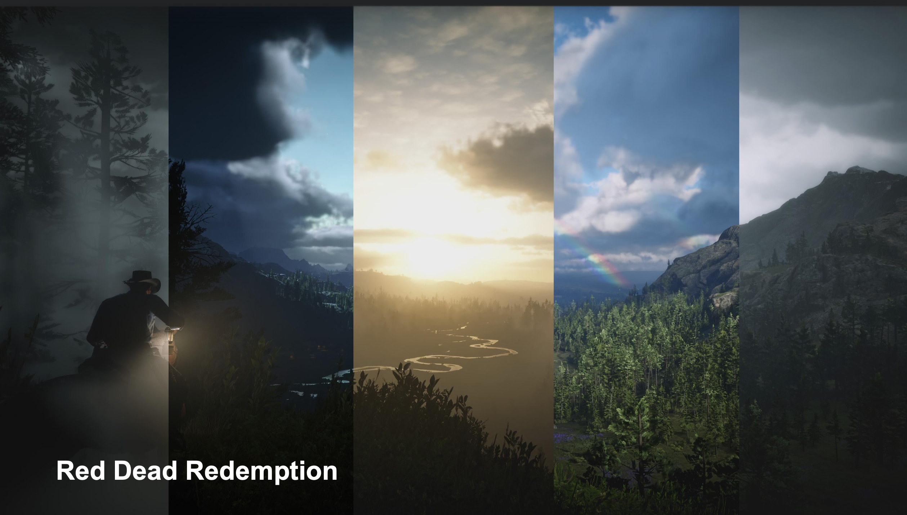
    </div>

{ align=right width=30% }

现实世界的风景具有以下特征：

- 超大的地理空间尺度
- 丰富的地貌
    - 植被
    - 河流
    - 起伏的山峰
    - 雪山
    - ...

因此若仍然采用传统的网格 + 材质来渲染这样的自然景观，那将是一件相当复杂困难的任务！比如对于一个典型的开放世界游戏，里面可能包含数十甚至上百平方公里的可探索区域，因此三角形数量也将膨胀到一个相当恐怖的，是目前 GPU 无法承受的量级。

正如本笔记一开始提到过的，游戏中的环境组件可分为以下几个部分：

<div style="text-align: center">
    
</div>


## Terrain

??? example "例子"

    === "例1：微软飞行模拟器"

        <div style="text-align: center">
            
        </div>

    === "例2：《无人深空》（*No Man's Sky*）"

        <div style="text-align: center">
            
        </div>


### Heightfield

在 CG 中，一种简单的表示地形的思路是采用**高场**(heightfield)图。从数据结构的角度来看，高度场本质上是一个二维数组或单通道纹理，记作 $H(u, v)$。

- 空间映射：地形在水平面上被划分为规则的网格
- 高度存储：数组中的每个元素（或纹素）存储该网格点对应的垂直高度值

另外，它与**等高线图**(contour map)天然对应，易于从卫星数据（如 Google Earth）中导入。

<div style="text-align: center">
    
</div>

???+ example "效果"

    <div style="text-align: center">
        
    </div>

在渲染阶段，引擎通过顶点纹理拾取或在顶点着色器中采样高场图来重建地形几何：

1. 生成一个平坦的高密度网格平面
2. 在顶点着色器中，根据顶点的 UV 坐标采样高场图
3. 沿法线方向（通常是 Y 轴）对顶点进行位移

<div style="text-align: center">
    
</div>


### Adaptive Mesh Tessellation

然而，这种朴素的网格生成方式在面对庞大的开放世界时失效了。为了在有限的计算资源下渲染无限的细节，必须引入**多层级细节**(level of detail, LOD)技术。

<div style="text-align: center">
    
</div>

地形的 LOD 不同于离散物体的 LOD，它要求几何体在空间上是**连续的**。我们不能简单地在远处画一个低精度的网格，在近处画一个高精度的网格，因为二者接缝处会出现极其明显的裂缝。

现代引擎采用了**基于视场的自适应网格细分**(adaptive mesh tessellation)。

- **视场**(field of view, FoV)：通过眼睛能够看到的世界的范围，渲染时我们只关心视场内的东西
- 如下图所示，当 FoV 越来越窄时，三角形会切分得越细密，因为我们看到的东西在放大
    - 游戏中的瞄准镜/望远镜效果正是通过缩窄 FoV 实现的

<div style="text-align: center">
    
</div>

因此在设计任何地形 LOD 算法时，都必须遵循两个核心优化准则（基于视角的误差度量(view-dependent error bound)）：

- 相机和 FoV 的距离：距离摄像机越近，网格越密；越远则越疏
- 与真实值比较的误差（**预计算**）：简化后的网格与原始高场的几何误差，投影到屏幕上不得超过特定阈值，保证视觉上的“无损”体验

<div style="text-align: center">
    
</div>


### Triangle-Based Subdivision

<div style="text-align: center">
    
</div>

这是一种经典的 ~~学院派~~ 算法，其核心思想是利用**二叉树**结构来**递归**管理三角形。

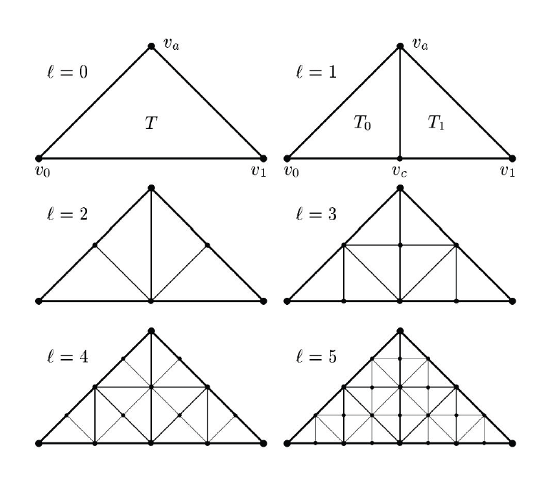{ align=right width=30% }

- 算法规定，每次细分必须从等腰直角三角形的斜边（**最长边**）中点进行剖分；这一刀切下去，会产生两个新的、面积减半的等腰直角三角形
- 于是，整个地形被组织成一个二叉树森林，每个节点代表一个三角形

在不同 LOD 层级的过渡区域，会出现著名的 **T 型裂缝**(T-junction)问题：假设三角形 A 的斜边未被细分，而其相邻的三角形 B 在对应边上进行了细分，产生了一个新的顶点。由于新顶点会根据高度图发生位移，而三角形 A 的边仍然是一条直线，这就导致在新顶点处出现了几何裂缝。

我们可通过强制分裂来解决——如果一个三角形发现其邻居的细分层级比自己高（即邻居在共享边上有中点），那么该三角形被迫进行一次细分。这种依赖关系会像链式反应一样传播，直到所有相邻边的层级匹配。

<div style="text-align: center">
    
</div>

尽管算法简单，但在 GPU 架构上，这种算法并不高效，因此在游戏行业用的不是很多。

???+ example "例子"

    <div style="text-align: center">
        
    </div>


### QuadTree-Based Subdivision

**基于四叉树的细分**(quadtree-based subdivision)是目前工业界的主流方案，即利用**四叉树**(quadtree)将地形切分为规则的矩形块(block / patch)。相比前一种方案，这种方法更符合我们的直觉（我们更倾向于把地形划分为豆腐块一样的形状而不是三角形）。

- 根节点代表整个地形
- 每个节点可以分裂为 4 个子节点
- 叶子节点对应实际渲染的最小图块(tile)，通常为 $64 \times 64$ 或 $128 \times 128$ 的网格

<div style="text-align: center">
    
</div>

???+ recommend "优点"

    - 易于构造
    - 方便的数据管理：四叉树的节点不仅管理几何，还天然对应纹理贴图的切片(tile)。这使得几何 LOD 与纹理 LOD 可以协同工作，便于流式加载(data streaming)
    - 视锥剔除(culling)：利用四叉树的包围盒（AABB）进行层次化的视锥剔除，可以快速丢弃不可见的大片区域

???+ bug "缺点"

    - 不如三角形网格灵活
    - 叶子节点的网格级别需要保持一致

???+ example "效果"

    <div style="text-align: center">
        
    </div>

四叉树方案同样面临不同层级块之间的 T-junction 问题。与三角形网格的强制分裂不同，四叉树
方案通常采用**几何缝合**(stitching)技术。

<div style="text-align: center">
    
</div>

- 原理：当一个高精度的块（边缘有 N 个顶点）与一个低精度的块（边缘有 N/2 个顶点）相邻时，强制修改高精度块边缘顶点的索引缓冲区(index buffer)。
- 实现：将高精度边缘上多余的顶点，通过索引指向低精度边缘上最近的顶点。这实际上生成了一些退化（面积为零）的三角形
- 现代 GPU 的光栅化单元会高效地剔除面积为零的三角形，因此这种方法既解决了裂缝问题，又保证了网格的水密性(water-tight)，且计算开销极低

???+ example "例子"

    <div style="text-align: center">
        
    </div>


### Triangulated Irregular Network (TIN)

另一种较为激进的方法是**不规则三角网**(triangulated irregular network, **TIN**)。其核心思想是：放弃规则网格，针对地形特征进行非均匀采样：在平坦区域使用极大的三角形，在陡峭区域使用细碎三角形。

???+ example "例子"

    === "例1"

        <div style="text-align: center">
            
        </div>

    === "例2"

        <div style="text-align: center">
            
        </div>

- 优点：
    - 易于在运行时渲染
    - 可以在特定地形类型上使用更少的三角形

<div style="text-align: center">
    
</div>

- 缺点：
    - 需要昂贵的离线预处理，难以支持实时地形变形（如爆炸弹坑）
    - 数据复用性差，不适合通用的开放世界引擎


### GPU-Based Tessellation

我们还可以利用现代 GPU 的力量，帮助我们更高效地完成地形曲面细分的任务。其中赫赫有名的便是 DX11 的三个阶段：

<div style="text-align: center">
    
</div>

- **外壳着色器**(hull shader)阶段：将基网格的基本函数转换为表面块
- **细分**(tessellation)阶段：为每个块生成半规则化的细分图案
- **域着色器**(domain shader)阶段：一个可编程的着色阶段，计算与每个域样本相对应的顶点位置

<div style="text-align: center">
    
</div>

DX12 引入了**网格着色器**(mesh shader)，包括：

- **放大着色器**(amplification shader)阶段：决定运行多少个网格着色器组，并将数据传递给这些组
- **网格着色器**(mesh shader)阶段：为每个块生成半规则的细分图案，以及包含顶点和原语的输出

<div style="text-align: center">
    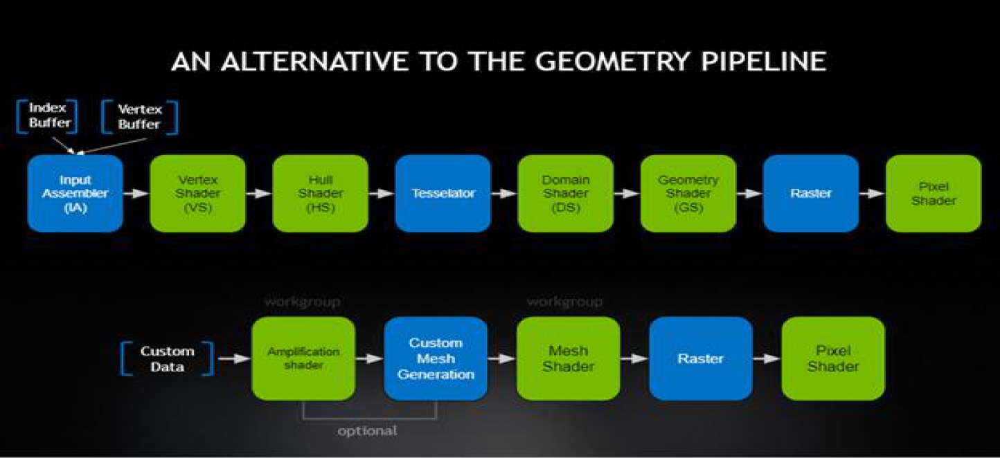
</div>

得益于 GPU 实时细分的能力，我们可以实现**实时可变形的地形**(real-time deformable terrain)。

<div style="text-align: center">
    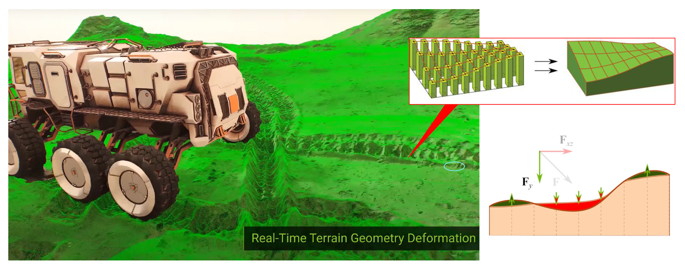
</div>

实现机制：

- 将地形表面视为一个动态的模拟网格
- 当发生物理交互（如轮胎碾压）时，更新一张动态高度偏移贴图
- 域着色器在渲染时，叠加基础高度图与动态偏移贴图，实时生成凹陷的几何体

这种方法使得地形不再是静态的背景，而成为可交互的物理实体。

???+ example "例子"

    《黑神话·悟空》中的雪地：

    <div style="text-align: center">
        
    </div>


### Non-Heightfield Terrain

高度场的最大缺陷在于无法表示函数映射之外的结构，例如悬崖倒角、山洞或拱门。

- 对于传统的山洞需求，业界通常采用「**挖洞 + 模型填充**」的混合方法
    - 在地形材质中增加一个可见性通道
    - 在着色器中，如果检测到某区域被标记为“洞”，则输出 NaN 坐标，或执行丢弃操作，从而让 GPU 剔除该区域的三角形
    - 创建一个带有内部结构的山洞模型（静态网格），精确匹配挖洞的位置，并利用岩石模型遮挡接缝

    <div style="text-align: center">
        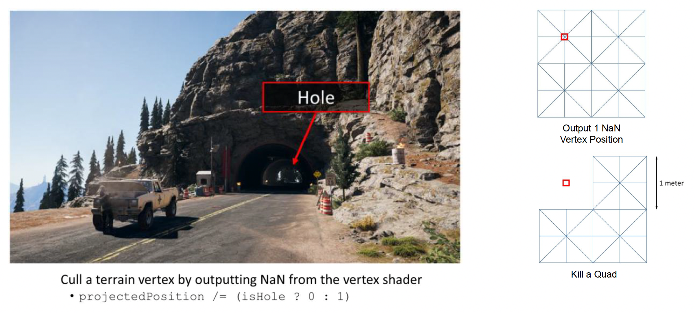
    </div>

- **体表示**(volumetric representation)
    - 在 3D CG 中，**体素**(voxel)代表三维空间中规则网格上的一个值；与 2D 位图中的像素一样，体素本身通常不会将它们的坐标（即位置）与它们的值明确编码在一起

        <div style="text-align: center">
            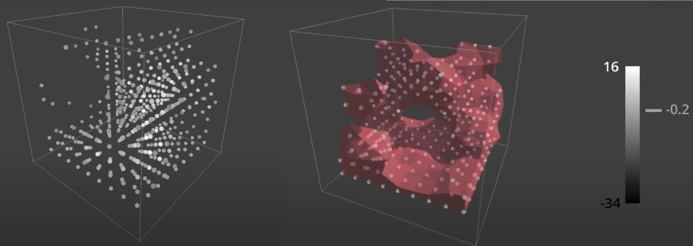
        </div>


    - **移动立方体**(marching cubes)算法：
        - 将空间划分为三维网格，每个格点存储密度值
        - 算法遍历每个立方体，根据 8 个顶点的密度状态（在表面内或外），查找预计算的边缘表，生成穿过该立方体的三角面片（14 种）
        - 应用：CT 扫描生成的图片、可视化螺旋桨的速度场、数字人等
    
        <div style="text-align: center">
            
        </div>

    - **Transvoxel** 算法：
        - 它是移动立方体的改进方法，专门解决不同 LOD 体素块之间的裂缝问题
        - 它预计算了复杂的**过渡单元**(transition cells)**查找表**，保证了多分辨率体素地形的水密性
        - 挑战：体素方案的存储和带宽开销巨大，且难以利用传统的 UV 贴图技术，因此在目前在写实风格的 3A 游戏中应用受限

        <div style="text-align: center">
            
        </div>

    - 这类技术适用于像 Minecraft 或《无人深空》这样需要完全自由破坏或生成奇异地貌的游戏


### Terrain Materials

???+ example "例子"

    在《幽灵行动：荒野》（*Ghost Recon Wildlands*）游戏中，有 11 种生物群落，以及 140 种材质。

    <div style="text-align: center">
        
    </div>

地形材质通常是多种自然材质（草、岩石、泥土、雪）的混合。

<div style="text-align: center">
    
</div>

下面介绍几种材质混合的方法：

- **纹理泼溅**(texture splatting)
    - 泼溅图：使用一张多通道纹理，每个通道存储对应材质的混合权重
    - 简单混合：

        ```cpp
        float3 blend(float4 texturel, float al, float4 texture2, float a2) {
            return texture1.rgb * al + texture2.rgb * a2;
        }
        ```

        <div style="text-align: center">
            
        </div>

        - 缺陷：线性混合会导致不自然的效果，比如上面沙子覆盖鹅卵石的图片中，线性混合会让沙子看起来像半透明的薄纱，缺乏真实感

- **基于高度的混合**(height-based biased blending)
    - 比较各材质在该像素点的高度值，高度高的材质权重更大
    - 代码实现：

        ```cpp
        float3 blend(float4 texture1, float height1, float4 texture2, float height2) {
            return height1 > height2 ? texture1.rgb : texture2.rgb;
        }
        ```

    - 效果：

        <div style="text-align: center">
            
        </div>

- 改进：为了避免非黑即白的硬切边(hard edge)，引入一个偏置参数 `depth`（偏移量）；加上这个扰动后，相比没有加的效果会看起来更自然、更稳定
    - 代码实现：

        ```cpp
        float3 blend(float4 texture1, float height1, float4 texture2, float height2) {
            float depth = 0.2;
            float ma = max(texture1.a + height1, texture2.a + height2) - depth;
            float b1 = max(texture1.a + height1 - ma, 0);
            float b2 = max(texture2.a + height2 - ma, 0);
            return (texture1.rgb * b1 + texture2.rgb * b2) / (b1 + b2);
        }
        ```

    - 效果：

        <div style="text-align: center">
            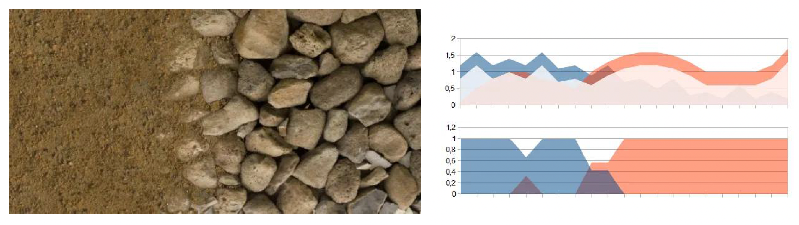
        </div>

在真实的游戏中，动辄就会用到几十甚至上百种材质，因此借助现代 GPU 的能力，采用**纹理数组**(texture array)的方法。顾名思义，我们将所有材质纹理打包到一个数组对象中，之后着色器便可通过索引访问。而此时泼溅图存储材质索引和权重，从而在一次 绘制调用中绘制任意复杂的材质组合。

<div style="text-align: center">
    
</div>

两种绘制方法：

<div style="text-align: center">
    
</div>

- **视差贴图**(parallax mapping)
    - 原理：由于表面高低不平，眼睛能看到点 B，但看不到点 A，这产生了一种立体感

        <div style="text-align: center">
            
        </div>

    - 效果：产生更强的立体感
    - 缺点：
        - 每个像素的计算成本高
        - 只是产生了视觉上的凹凸感，但物体的几何边界依然是光滑的

- **位移贴图**(displacement mapping)
    - 利用现代 GPU 的细分(tessellation)能力，把网格变得非常细

>不过目前大部分游戏用的还是**凹凸贴图**(bump mapping)，不过有越来越多的游戏开始尝试使用视差贴图和位移贴图了。

???+ bug "纹理混合的高开销"

    - 纹理多：当多次采样多个材质时性能低
    - 巨大的泼溅图：虽然我们只看到一小部分地形，但要把表示 100 平方公里的区域的泼溅图加载到显存中

    <div style="text-align: center">
        
    </div>


### Virtual Texture

鉴于上述问题，再加上游戏画质的日益提升，我们亟需一种解决方案——这个方案就是**虚拟纹理**(virtual texture)，它借鉴了操作系统中的虚拟内存的实现思路。

- 构建一个**虚拟索引纹理**，用来表示整个场景的所有混合地形材质
- 仅加载基于视图依赖 LOD 的块(tile)材质数据
- 预烘焙(pre-bake)材质混合成块，并将其存储为物理纹理

<div style="text-align: center">
    
</div>

基于 CPU 的缓存管理是在磁盘、主存和显存三者之间来回传输数据。如果直接用这种方式来管理虚拟纹理，那效率显然是不够高的。

<div style="text-align: center">
    
</div>

因此实际上会采用以下两种虚拟纹理的实现方式：

- **DirectStorage**：

    <div style="text-align: center">
        
    </div>

    - 内存中不解压大量被压缩过的游戏数据，直接在显卡上解压
    - 好处：传输压缩数据的效率更高，且 GPU 的计算能力强，因此解压速度也很快

- **DMA**（直接内存访问）：

    <div style="text-align: center">
        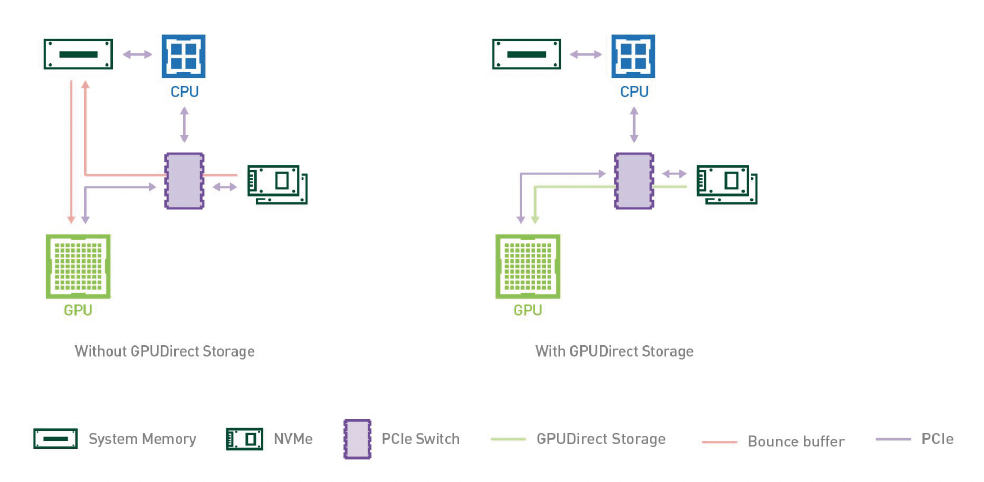
    </div>

    - 直接将数据从磁盘读到显存上，不经过内存


### Floating-point Precision Error

学过计算机组成的读者们应该知道，浮点数精度有限，无法表示百分百准确的数值。如下图所示，随着相机和球之间的距离增大，球的抖动越来越厉害。实际上球并没有真的在抖动，是因为浮点数精度不够，无法准确表示顶点的位置了。

<div style="text-align: center">
    
</div>

解决方法是采用**相机相关渲染**(camera-relative rendering)

- 在任何其他几何变换影响到对象之前，通过否定的世界空间相机位置来转换对象
- 然后将世界空间摄像机位置设置为 0，并相应地修改所有相关矩阵

```cpp
// camera relative
foreach render_object in render_objects {
    render_object.m_position -= render_camera.m_position;
    updateRenderobjectTransform();
}

render_camera.m_position = Vector3(0.0, 0.0, 0.0);
updateRenderViewProjectionMatrix();
```

<div style="text-align: center">
    
</div>


#### Integrating with Other World Elements

- **树**的渲染

<div style="text-align: center">
    
</div>

- **装饰物**(decorator)渲染

<div style="text-align: center">
    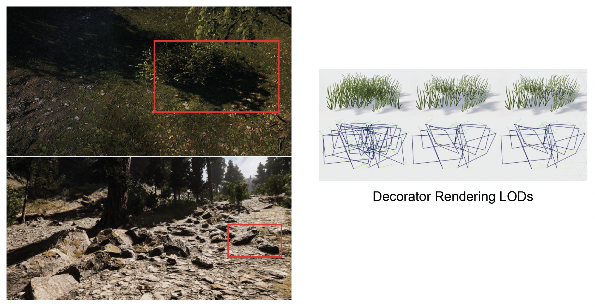
</div>

- **道路**和**贴花**(decals)渲染

<div style="text-align: center">
    
</div>

???+ info "游戏引擎中的地形编辑"

    <div style="text-align: center">
        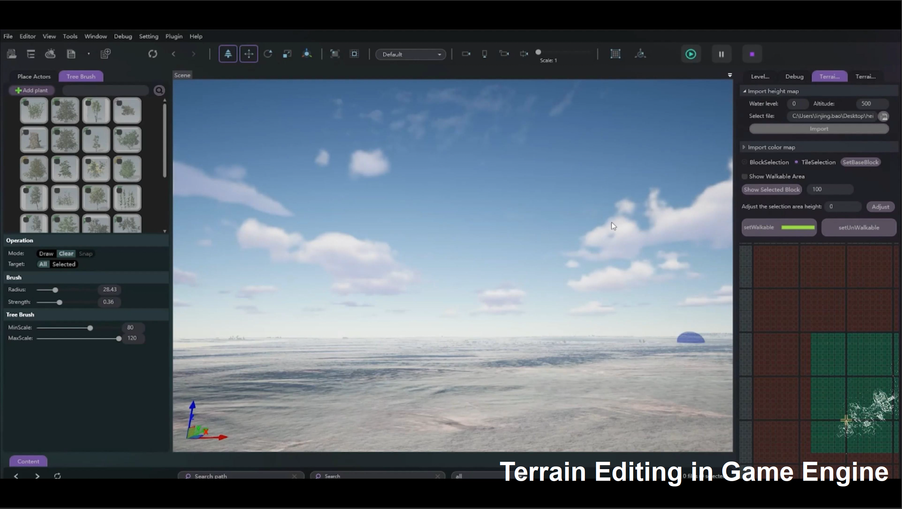
    </div>

???+ note "过程地形创建(procedure terrain creation)"

    <div style="text-align: center">
        
    </div>


## Sky and Atmosphere

???+ example "例子"

    === "例1"

        <div style="text-align: center">
            
        </div>

    === "例2"

        <div style="text-align: center">
            
        </div>

    === "例3"

        <div style="text-align: center">
            
        </div>

天空包括了大气和云两部分。下面先来介绍大气的渲染。

<div style="text-align: center">
    
</div>


### Analytic Atmosphere Appearance Modeling

我们可通过对大气进行数学建模，得到一个解析解：

{ align=right width=30% }

$$
\begin{aligned}
\mathbb{F}(\theta, \gamma) &= \left(1 + Ae^{\frac{B}{\cos \theta + 0.01}}\right) \cdot \left(C + De^{E\gamma} + \right. \\
&\quad \left. {} + F \cos^2 \gamma + G \cdot \chi(H, \gamma) + I \cdot \cos^{\frac{1}{2}} \theta\right) \\
L_\lambda &= \mathbb{F}(\theta, \gamma) \cdot L_{M\lambda}
\end{aligned}
$$

- $\theta$：向上看的角度
- $\gamma$：观察方向和光线方向的夹角

???+ recommend "优点：计算简单高效"

???+ bug "缺点"

    - 限于地面视角
    - 大气参数无法自由更改

???+ example "效果"

    <div style="text-align: center">
        
    </div>


### Participating Media

大气中存在各种介质，我们称之为**参与介质**(participating media)。

- 主要分为**气体分子**（氮气、氧气等等）和**气溶胶**两类
- 与光的相互作用取决于大气的成分

<div style="text-align: center">
    
</div>

光和参与介质粒子的相互作用可分为以下几个部分：

<div style="text-align: center">
    
</div>

- **吸收**(absorption)
- **出散射**(out-scattering)
- **发射**(emission)
- **入散射**(in-scattering)（来自其他粒子的散射光）

将这几部分加起来，就可以得到**辐射传递方程**(radiative transfer equation, RTE)：

$$
\frac{dL(x,\omega)}{dx} = -\sigma_t L(x,\omega) + \sigma_a L_e(x,\omega) + \sigma_s \int_{S^2} f_p(x,\omega,\omega')\, L(x,\omega')\, d\omega'
$$

其中**消光系数**(extinction coefficient) $\sigma_t(x) = \sigma_a(x) + \sigma_s(x)$。

>注：上述方程只是简单的一维形式；三维形式涉及到梯度计算。

而它的积分形式叫做**体渲染方程**(volume rendering equation, VRE)，它描述了相机 P 看到物体上某一点 M 的光。

<div style="text-align: center">
    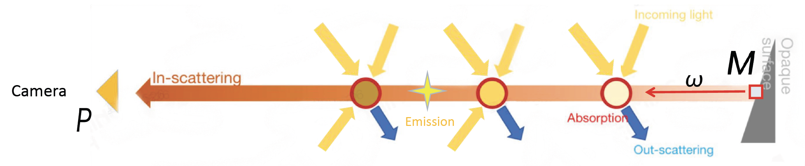
</div>

其公式如下：

$$
L(P,\omega) = \int_{x=0}^{d} T(x)\bigl[\sigma_a \cdot L_e(x,\omega) + \sigma_s \cdot L_i(x,\omega)\bigr]\,dx + T(M)\,L(M,\omega)
$$

其中两个关键部分为：

- $T(x) = e^{-\int_x^P \sigma_t(s) ds}$（**通透度**(transmittance)）：来自**吸收**和**出散射**的净减少因子
- $\int_{S^2} f_p(x,\omega,\omega')\, L(x,\omega')\, d\omega'$：来自**入散射**的净增加因子


### Real Physics in Atmosphere

而在现实的物理世界中，除了要考虑大气中的两类**介质**（气体分子和气溶胶）外，还要考虑不同波长的**太阳光**。

<div style="text-align: center">
    
</div>

{ align=right width=30% }

基于此，有以下两个经典的散射模型：

- **瑞利散射**(Rayliegh scattering)：光被直径**远小于**辐射波长的粒子（例如空气分子）散射
- **米氏散射**(Mie scattering)：光被直径与入射光波长**相似或更大**的粒子（例如气溶胶）散射

---
关于瑞利散射：

- 某些方向接收的光比其他方向更多，前后对称
- 短波长（例如蓝色）的散射强度大于长波长（例如红色）

<div style="text-align: center">
    
</div>

瑞利散射方程：
$$
S(\lambda, \theta, h) = \frac{\pi^2 (n^2 - 1)^2}{2} \underbrace{\frac{\rho(h)}{N}}_{\text{Density}} \overbrace{\frac{1}{\lambda^4}}^{\text{Wavelength}} \underbrace{(1 + \cos^2 \theta)}_{\text{Geometry}}
$$

其中：

- **相位函数**(phase function) $F_{\text{Rayleigh}}(\theta) = \dfrac{3}{16 \pi} (1 + \cos^2 \theta)$ 描述的正是形如花生的瑞利散射分布曲线
- **散射系数**(scattering coefficient) $\sigma_s^{\text{Rayleigh}} (\lambda, h) = \dfrac{8\pi^2(n^2 - 1)^2}{3} \dfrac{\rho(h)}{N} \dfrac{1}{\lambda^4}$
    - $\lambda$：入射光波长
    - $h$：海拔高度
    - $n$：空气折射率
    - $N$：标准大气的分子数密度
    - 给定海拔高度和空气密度，这个系数就是一个常数

瑞利散射能够解释天空为什么是蓝色的原因：

- 因为蓝光波长更短，更容易被大气散射
- 而当太阳接近地平线时（日落/日出），阳光需经过更长的大气路径，蓝光大部分被散射走，只剩红橙色光到达观察者眼中，因而此时天空泛红

<div style="text-align: center">
    
</div>

---
关于米氏散射：

- 几乎均匀地散射所有波长的光（对波长不敏感）
- 展现出强烈的前向指向性(forward directivity)

<div style="text-align: center">
    
</div>

米氏散射方程：
$$
S(\lambda, \theta, h) = \pi^2 (n^2 - 1)^2 \frac{\rho(h)}{N} \frac{1 - g^2}{2 + g^2} \frac{1 + \cos^2 \theta}{(1 - g^2 + 2g \cos \theta)^{\frac{3}{2}}}
$$

其中：

{ align=right width=30% }

- $g$：几何参数
    - $g = 0$：退化到瑞利散射
    - $g > 0$：向前散射更多（米氏散射）
    - $g < 0$：向后散射更多（很少出现）
- **相位函数** $F_{\text{Mie}}(\theta) = \dfrac{3}{8 \pi} \dfrac{1 - g^2}{2 + g^2} \dfrac{1 + \cos^2 \theta}{(1 - g^2 + 2g \cos \theta)^{\frac{3}{2}}}$
- **散射系数** $\sigma_s^{\text{Mie}}(\lambda, h) = \dfrac{8\pi^2(n^2 - 1)^2}{3} \dfrac{\rho(h)}{N}$

日常生活中米氏散射现象：

- 展示出强烈的前向指向性（太阳周围的**光晕**(halo)效应）
- 几乎均匀地散射所有波长的光（**雾**效应）

<div style="text-align: center">
    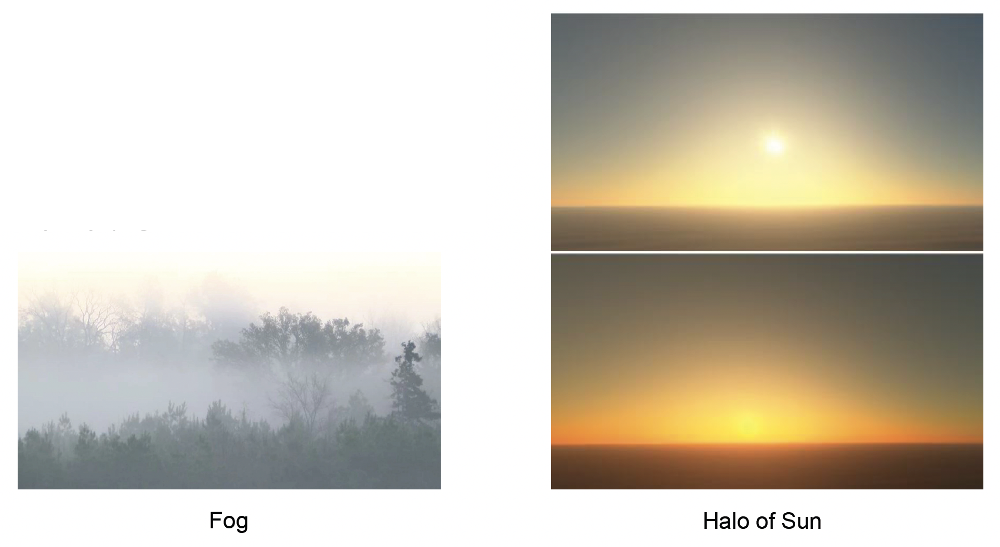
</div>

---
除了散射外，我们还要考虑不同大气粒子对光的吸收，比如：

- **臭氧**(ozone)（O~3~）：吸收较长波长的光线，过滤掉红色、橙色和黄色
- **甲烷**(methane)（CH~4~）：同样知名于对红光的吸收（下图所示的海王星之所以看起来是蓝色的，正是因为其大气中的甲烷含量高）

<div style="text-align: center">
    
</div>


### Single Scattering vs. Multiple Scattering

又回到散射部分——散射可分为：

<div style="text-align: center">
    
</div>

- **单散射**(single scattering)：太阳光经过一次
散射后直接进入眼睛

    $$
    L_1 = \int_A^B L_{P \rightarrow A} ds
    $$

- **多散射**(multiple scattering)：光可能在不同粒子间多次散射后才进入眼睛

    $$
    L_{n+1} = \int_A^B \int_{4 \pi} L_n(p, v') \cdot S(\lambda, \theta, h) \cdot T(p \rightarrow A) dv' ds
    $$

???+ example "对比"

    <div style="text-align: center">
        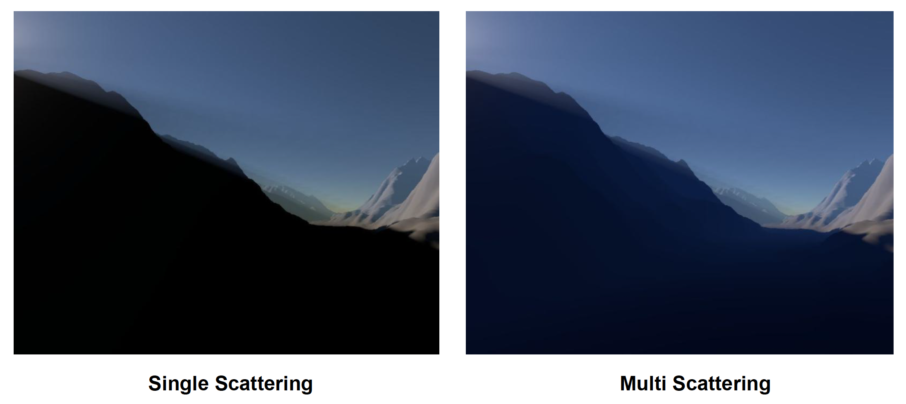
    </div>

    可以看到，尽管单散射在大气渲染上已经取得了不错的效果，但山体完全是黑掉的，看起来就不太真实。而多散射就能将这块山体照亮一点，看起来更自然。

    >注：不要和全局光照(GI)的概念弄混淆！


### Ray Marching

前面我们只介绍了各种用于渲染大气的方程，还没有讲过如何求解它们，所以下面就来介绍用于求解的技术。其中一种非常著名的算法是**光线步进**(ray marching)

- 顾名思义，该算法沿路上对函数一步步地进行积分；最后将这些积分结果累加起来，得到最终结果
- 通常用于计算在单散射下某一点的最终辐射度
- 积分得到的辐射度通常会被存储在**查找表**(look-up tables, **LUT**)上

<div style="text-align: center">
    
</div>


### Precomputed Atmospheric Scattering

借助光线步进这一计算工具，我们可以通过**预计算**的方式来实现大气散射的计算。

- **通透度 LUT**：从某高度朝某方向看天空的光透过的比例
    - 通过对不同视线距离积分吸收和散射损耗，生成一个二维表格，描述了从观察点到大气层边界的通透度分布
    - 这个表考虑了高度和视线方向（如天顶角）的变化，用于后续计算光穿过大气的减弱量

    <div style="text-align: center">
        
    </div>

- **单散射 LUT**
    - 选取不同的大气参数：观测点高度、视线天顶角、太阳天顶角以及视线与太阳的相对角等组合（总共四个维度），对每种组合采用光线步进，沿视线累积一次散射光强
    - 虽然四维数据无法直接存储到 GPU 的标准纹理中，但开发者运用巧妙的**参数化**将其压缩为 3D 纹理：利用大气的球对称性质，将一些维度固定或合并
        - 例如固定观察者在地表（或若干离地高度层），并利用对称性减少太阳方位维度，从而以 3 个角度参数 + 高度来索引散射值
    
    <div style="text-align: center">
        
    </div>

- **多散射 LUT**：基于单散射的结果，再迭代计算高次散射
    - 利用单散射 LUT 中得到的大气中各点的辐射度作为“次级光源”，再通过与通透度 LUT 结合积分类似的过程得到二次散射的分布图
    - 同理，可以迭代得到三次、四次散射，甚至一直到高阶；不过在实践中，累积到 3～4 次时视觉效果已非常接近无限次散射，因为每增加一次散射贡献递减且变化微弱
    - 由此得到的多散射 LUT 结构与单散射相同，只是亮度值略有提高
    - 这个逐阶累积的思想，正是早期预计算大气散射算法的核心

    <div style="text-align: center">
        
    </div>

???+ example "效果"

    <div style="text-align: center">
        
    </div>

???+ warning "预计算大气散射面临的挑战"

    - 预计算成本
        - 多散射迭代成本高
        - 在低端设备（例如移动设备）上生成大气 LUT 很困难

    - 环境的创作和动态调整
        - 艺术家无法实时更改散射系数
        - 难以渲染天气效果，如从晴天到雨雾、在行星间的太空旅行等

    - 运行时的渲染成本：用于通透度 LUT 和多散射 LUT 的每像素多维高纹理采样的成本很高（因此往往需要降采样来提高效率）


### Production Friendly Quick Sky and Atmosphere Rendering

近年来，业界推出了一种**可扩展且面向业界的天空与大气渲染算法** ([*A scalable and production-ready Sky and Atmosphere technique*](https://diglib.eg.org/bitstream/handle/10.1111/cgf14050/v39i4pp013-022.pdf))（UE 采样了这种技术）。该方法针对预计算方案的痛点，为多散射作出了一系列大胆又合理的近似假设，大幅减少计算复杂度的同时保留了逼真的视觉效果。其改进要点包括：

- 当散射事件的阶数 >= 2 时，使用**各向同性相位函数**(isotropic phase function)来实现散射
- 当前阴影位置邻域内的所有点**接收到相同数量的二次散射光**
- **忽略可见性**

    <div style="text-align: center">
        
    </div>

- 固定视图位置和太阳位置，以从 LUT 中移除两个维度

    <div style="text-align: center">
        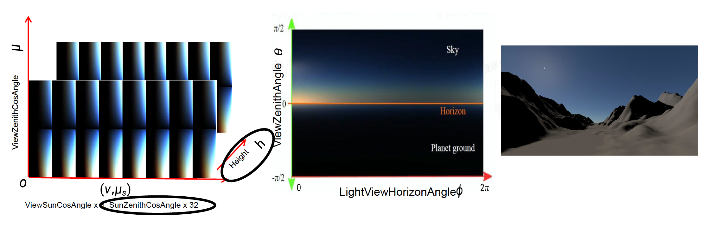
    </div>

- 生成一个 3D LUT，通过光线步进来求解空中透视的效果

    <div style="text-align: center">
        
    </div>

结果表明，该方法在性能和效果上取得了一个不错的平衡。

<div style="text-align: center">
    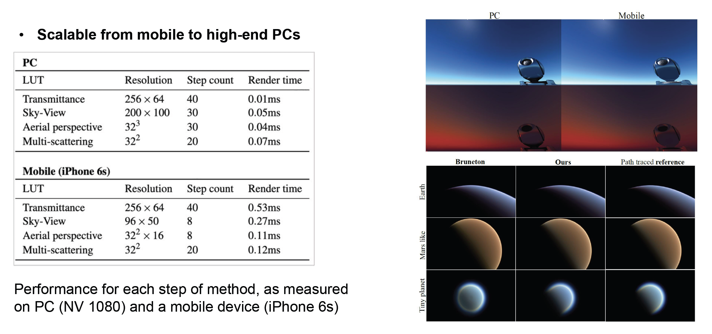
</div>

???+ play "大气渲染 Demo"

    <div style="text-align: center">
        
    </div>


## Clouds

接下来介绍如何绘制云。云的类型大致有三类：层云、积云和卷云。

<div style="text-align: center">
    
</div>

传统的云渲染方法有：

- 基于**网格**(mesh)的云建模
    - 优点：质量高
    - 缺点：成本太大，且不支持动态天气

    <div style="text-align: center">
        
    </div>

- **广告牌云**(billboard cloud)
    - 优点：高效
    - 缺点：仅能表现有限的视觉效果和云的类型

    <div style="text-align: center">
        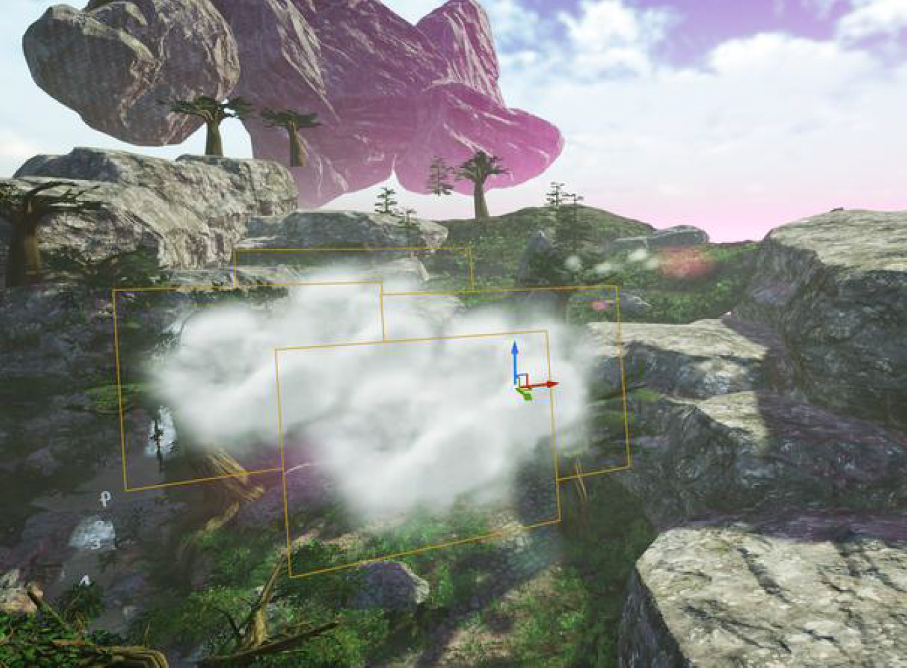
    </div>

而现代游戏引擎普遍采用**体积云建模**(volumetric cloud modeling)的方法。

<div style="text-align: center">
    
</div>

- 优点：
    - 可以创造现实的云的形状
    - 可以生成更大规模的云
    - 支持动态天气
    - 动态体积光照和阴影
- 缺点：必须考虑效率

具体实现为：

- 将云当作三维体积来模拟，即在GPU内存中维护一个表示云层密度分布的三维**天气纹理**(weather texture)（体纹理）。纹理包含了两部分：

    <div style="text-align: center">
        
    </div>

    - 云类型的分布(type)（右上）
    - 云的厚度(height)（下）

- **噪声函数**(noise function)：用来模拟云的各种形态，常用的有：
    - **柏林噪声**(Perlin noise)：在多项式时间内形成了棉花丝般的效果

        <div style="text-align: center">
            
        </div>

    - **沃利噪声**(Warley noise)：
        - 很像细胞的分布
        - 产生絮状效果

        <div style="text-align: center">
            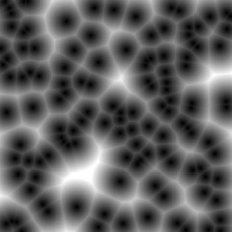
            
        </div>

一个完整的**云密度模型**(cloud density model)会用到上面这两个部分。其中对于基础的形状，使用低频噪声构建；而对于更多的细节，采用高频噪声勾勒。

<div style="text-align: center">
    
</div>

在渲染云的时候，我们依然可以采用前面介绍的**光线步进**算法。具体步骤如下：

<div style="text-align: center">
    
</div>

1. 对屏幕的每个像素投射一条光线
2. 在未进入云时步幅较大
3. 进入云内，步幅变小
4. 收集来自太阳的散射光

??? play "例子"

    <div style="text-align: center">
        
    </div>