# Render Pipeline, Post-process and Everything

## Ambient Occlusion

???+ example "例子"

    === "关闭 AO"

        <div style="text-align: center">
            
        </div>

    === "开启 AO"

        <div style="text-align: center">
            
        </div>

    对比发现，AO 下的物体立体感更强（阴影效果更真实）。

**环境光遮蔽**(ambient occlusion, AO)是指由遮挡引起的对环境光衰减的近似。

<div style="text-align: center">
    
</div>

我们会使用光线追踪来离线计算 AO 并将其存储到纹理上（烘培），这被广泛用于物体建模的过程中。

- 带来额外的存储成本
- 只应用在静态物体上（动态没法预计算）

<div style="text-align: center">
    
</div>

>无论人脸多么好看，在纹理图上看起来都很吓人😱


### Screen Space Ambient Occlusion (SSAO)

最经典的 AO 方法是**屏幕空间环境光遮蔽**(screen space ambient occlusion, **SSAO**)。它的大致思路是：

- 在以视图空间的每个像素点 p 为球心的球体上随机采样 N 个点
- 通过比较这些采样点深度和深度缓冲区的内容来检测采样点是否被遮挡

    <div style="text-align: center">
        
    </div>

- 计算采样点可见性的平均值来近似表示 AO

    <div style="text-align: center">
        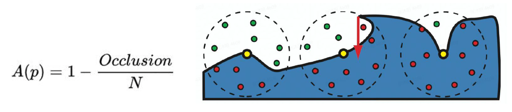
    </div>

???+ bug "问题"

    上图的方程有很大的问题（就是来自论文原文），其中一个问题是拿整个球算，表面以下的那个半球一定是没有光照的。那么按这个方程算，光强至多为原来的 1/2。


### SSAO+

**SSAO+** 是基于 SSAO 的改进方法，它的思路是沿着法线方向对半球采样，而不是完整的球。

<div style="text-align: center">
    
</div>

???+ example "例子"

    === "关闭 SSAO+"

        <div style="text-align: center">
            
        </div>

    === "开启 SSAO+"

        <div style="text-align: center">
            
        </div>

        虽然画面整体的立体感上来了，但是使用该技术又引入了新的问题。比如面前的水泥墩出现重影现象，这是因为尽管水泥墩离相机有一定距离，但是 AO 效果过于明显。


### Horizon-based Ambient Occlusion (HBAO)

第二种改进方法是**基于水平线的环境光遮蔽**(horizon-based ambient occlusion, **HBAO**)，它的思路是：

- 使用深度缓冲区作为 2D 表面的高度场
- 地平角的光线会被遮挡
    - 从一个点出发，找到能越过物体的最高的点（仰角）

计算公式：
$$
A = 1 - \dfrac{1}{2\pi} \int_{\theta = -\pi}^\pi \int_{\alpha = t(\theta)}^{h(\theta)} W(\vec{\omega}) \cos (\alpha) d \alpha d \theta
$$

其中 $W(\vec{\omega})$ 为**衰减函数**(attenuation function) $\max(0, 1 - r(\theta) / R)$。它的作用是对于离相机很远的物体，降低它对 AO 的贡献（避免出现像 SSAO+ 例子中的重影现象）。

<div style="text-align: center">
    
</div>

HBAO 的具体实现过程为：

- 使用深度缓冲区作为 2D 表面的高度场
- 直接在 2D 表面上追踪光线，并且从地平角近似表示 AO
    - 用到之前介绍的光线步进算法，但每次移动都要稍微改变一点方向，否则由于采样率低，会看到一些瑕疵

<div style="text-align: center">
    
</div>


### Ground Truth-based Ambient Occlusion (GTAO)

前面介绍的方法都没有考虑到实际光源在物体表面上的贡献值会随光照角度发生变化，所以结果都是不正确的。所以这里引入更现代的方法：**基于基准事实的环境光遮蔽**(ground truth-based ambient occlusion, **GTAO**)。它引入了缺失的余弦向量，移除了衰减函数，并增加了（光线）多次弹射的快速近似方法。计算公式为：
$$
\hat{\mathcal{A}}(x) = \dfrac{1}{\pi} \int_0^\pi \int_{\theta_1(\phi)}^{\theta_2(\phi)} \cos(\theta - \gamma)^+ |\sin (\theta)| d\theta d \phi
$$

其中 $\gamma = angle(\vec{n}, \vec{v})$。

<div style="text-align: center">
    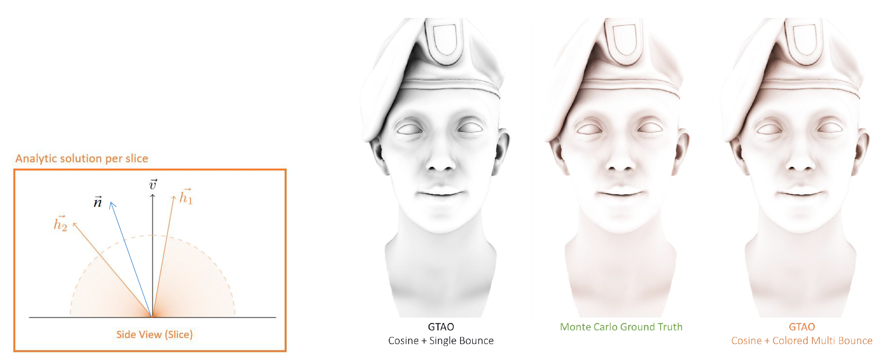
</div>

值得一提的是，（光线的）**多次弹射**(multiple bounces)是通过为反照率(albedo)**拟合一个三次多项式**实现的。

<div style="text-align: center">
    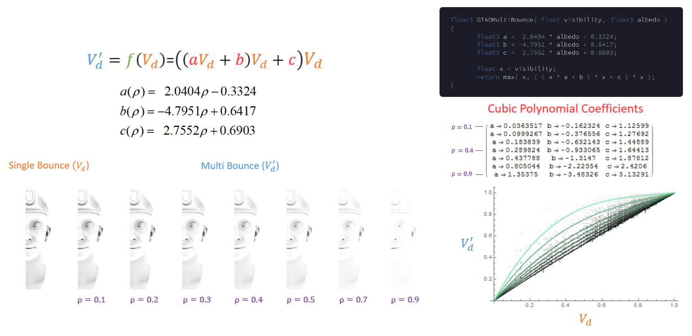
</div>


### Ray-Tracing Ambient Occlusion

最近越来越火的一个方向是实时的**光线追踪环境光遮蔽**(ray-tracing ambient occlusion)，就是用 RTT 硬件为每个屏幕像素点投射光线。

- 1 spp（每像素采样(sample per pixel)）能在远距离 AO 上取得不错的效果
- 2-4 spp 就能实现在近距离区域的细节 AO 效果

<div style="text-align: center">
    
</div>


## Fog

### Depth Fog

实现雾的最简单方法是**深度雾**(depth fog)，可分为以下几类：

- **线性雾**(linear fog)：factor = (end - z) / (end - start)
- **指数雾**(exp fog)：factor = exp(-density \* z)
- **指数平方雾**(exp squared fog)：exp(-(density \* z)^2)

<div style="text-align: center">
    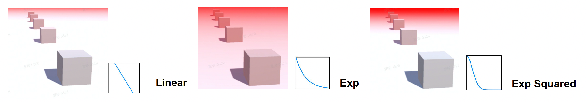
</div>

???+ example "例子"

    <div style="text-align: center">
        
    </div>


### Height Fog

第二种实现方法是**高度雾**(height fog)。它基于这样一个事实：雾是一种气溶胶，通常沉积在靠近地面的地方，因此位置越高雾越少。

- 沿视线方向对高度雾做积分

    $$
    \begin{aligned}
    D(h) & = D_{\max} \cdot e^{-\sigma \cdot \max(h - H_s, 0)} \\
    \text{FogDensityIntegration} & = D_{\max} \cdot d \int_0^1 e^{-\sigma \cdot \max(v_z + t \cdot h_z - H_s, 0)} dt \\
    & = D_{\max} \cdot d e^{-\sigma \cdot \max(v_z - H_s, 0)} \dfrac{1 - e^{-\sigma \cdot d_z}}{\sigma \cdot d_z} \\
    \end{aligned}
    $$

    <div style="text-align: center">
        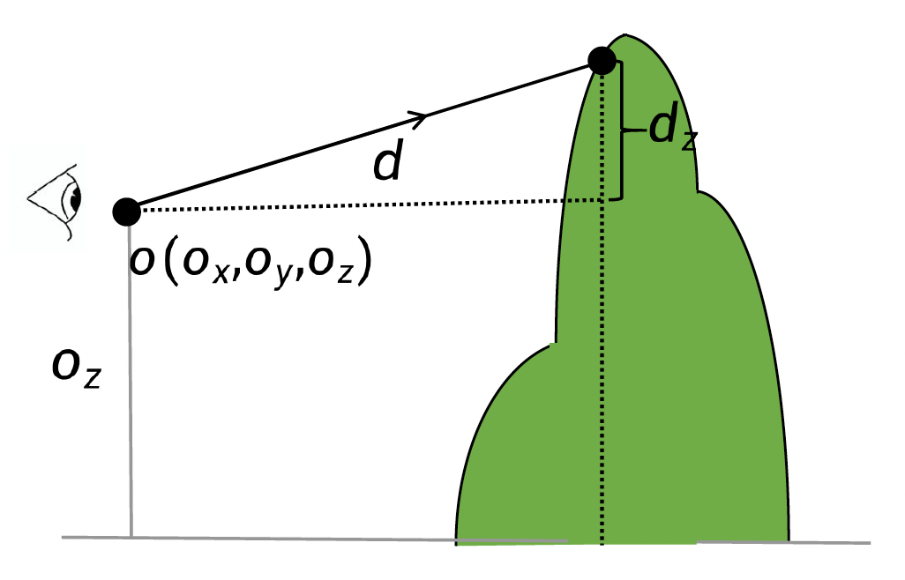
    </div>

- 透射(transmission)后雾的颜色

    $$
    \begin{aligned}
    \text{FogInScatter} & = 1 - e^{-\text{FogDensityIntegration}} \\
    \text{FinalColor} & = \text{FogColor} \cdot \text{FogInScatter}
    \end{aligned}
    $$

???+ example "例子"

    <div style="text-align: center">
        
    </div>


### Voxel-Based Volumetric Fog

前面介绍的两种方法都是上古时期的做法。现代的方法是采用**基于纹素的体积雾**(voxel-based volumetric fog)。

<div style="text-align: center">
    
</div>

- 对视锥进行切分，离相机越近切分得越细（左上）
    - 和之前介绍的云和大气的渲染的思路很像
- 雾的 3D 纹理适应屏幕宽高比（右上）
    - 图中就是适应了 16:9 这一常见屏幕宽高比

???+ example "例子"

    <div style="text-align: center">
        
    </div>

    我们能从雾中看到一道道光线，这在深度雾和高度雾中是无法体现的。


## Anti-Aliasing

**走样**(aliasing)是由高频信号和在有限渲染分辨率下采样不足共同引起的一系列渲染瑕疵。其产生的原因：

- **边缘**采样（几何）
    - 对斜线采样就会产生锯齿状的效果
- **纹理**采样
    - 典型现象为**摩尔纹**
    - 能够用 **mipmap** 解决
- **高光**采样
    - 稍微动一下高光物体，光就在一瞬间发生流动

<div style="text-align: center">
    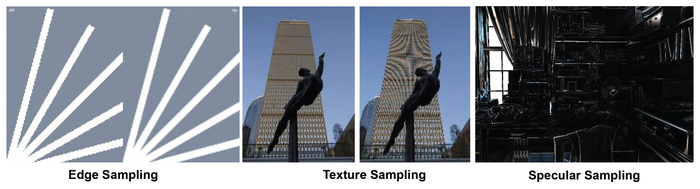
</div>

解决走样的办法就是**反走样**(anti-aliasing)。基于屏幕的反走样方案的总体策略是：使用一种采样模式来**获取更多采样点**，然后**对采样点进行加权求和**以产生像素颜色。

<div style="text-align: center">
    
</div>


### Super-Sample AA (SSAA) and Multi-Sample AA (MSAA)

在早期，实现反走样的方法有：

- **超采样反走样**(super-sample AA, **SSAA**)
    - 最直接的反走样方案
    - 思路：先增大分辨率，然后降采样/高斯滤波
    - 假设渲染分辨率提升 4x，那么 z 缓冲区和帧缓冲区，以及光栅化和像素着色也要放大 4x

    <div style="text-align: center">
        
    </div>

- **多采样反走样**(multi-sample AA， **MSAA**)：
    - 同样通过增加分辨率来获取更多采样点，但相比 SSAA，它仅对必要的像素点进行超采样
    - 现代硬件默认支持（可通过标志位设置）
    - 假如分辨率为 4x，除了像素着色次数为 1 + x 外，z 缓冲区和帧缓冲区，以及光栅化仍然放大 4x

    <div style="text-align: center">
        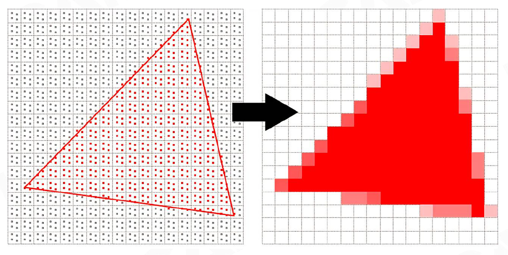
    </div>

两者的共同缺点是太吃硬件资源了，因此现代游戏引擎很少采用这两个方法。


### Fast Approximate Anti-Aliasing (FXAA)

接下来介绍的反走样技术都是业界比较推崇的。第一种叫做**快速近似反走样**(fast approximate anti-aliasing, **FXAA**)。它只需在原始分辨率图像上操作，其思路为：

- 通过亮度寻找边缘像素（下图右侧代码）
- 计算每个边缘像素的偏移量
- 通过偏移量重采样边缘像素，实现和邻近像素的混合

<div style="text-align: center">
    
</div>

计算偏移量的方向（利用卷积计算）：

<div style="text-align: center">
    
</div>

>上图的例子中，通过计算法线横向变化更大些，并且中心像素和右邻居像素的差值更大，因此可以确定该像素的偏移量朝右。

下面阐述**边缘搜索算法**的步骤：目标是寻找像素所在的走样边，

- 记录对比亮度和当前像素与偏移量像素的平均亮度（$L_{\text{avg}}, L_{\text{contrast}}$）
- 沿着 2 个**垂直的**(perpendicular)方向搜索，计算平均亮度（$L_{\text{edge}1n}, L_{\text{edge}2n}$）
- 重复上述步骤，直到

    $$
    \begin{aligned}
    \text{abs}(L_{\text{edge}1n} - L_{\text{current}}) & > 0.25 L_{\text{contrast}} \\
    \text{abs}(L_{\text{edge}2n} - L_{\text{current}}) & > 0.25 L_{\text{contrast}}
    \end{aligned}
    $$

<div style="text-align: center">
    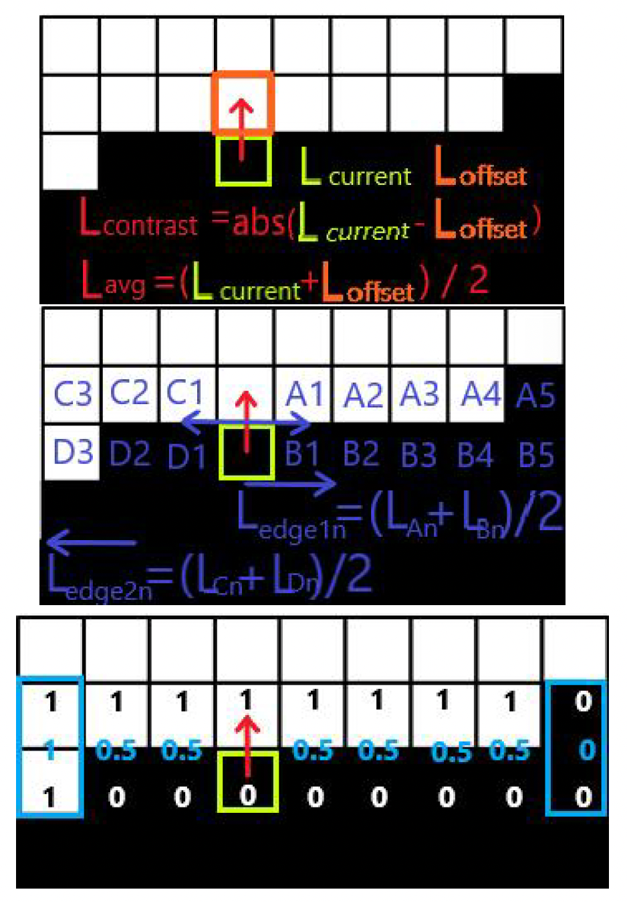
</div>

接下来计算**混合系数**(blend coefficient)：

<div style="text-align: center">
    
</div>

最后拿这个系数和邻居像素进行混合，完成反走样。

<div style="text-align: center">
    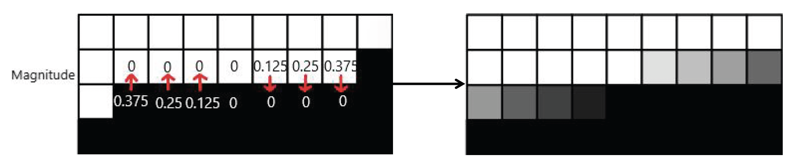
</div>

公式为：

<div align=center>
PixelNewColor = Texture(CurrentP_UV + offset_direction \* offset_magnitude)
</div>

???+ example "例子"

    <div style="text-align: center">
        
    </div>


### Temporal Anti-Aliasing (TAA)

第二种现代反走样技术是**时间反走样**(temporal anti-aliasing, **TAA**)。它的思路是利用时空滤波方法来提升运动中的反走样的稳定性。

<div style="text-align: center">
    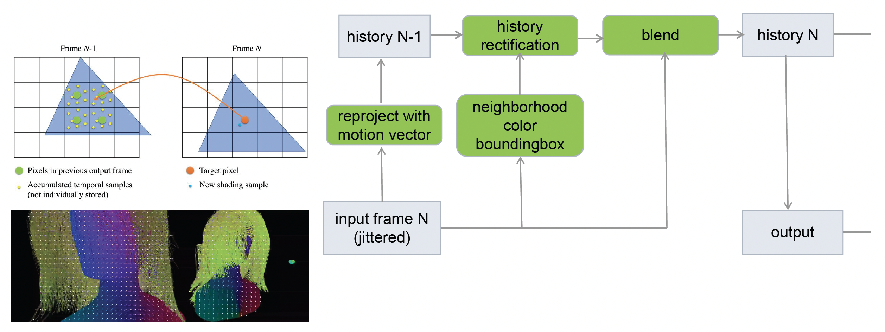
</div>

???+ example "例子"

    === "例1"

        <div style="text-align: center">
            
        </div>

    === "例2"

        <div style="text-align: center">
            
        </div>

        >由于 ac 站码率太低，所以这个 gif 图的效果很糟糕。但我也没找到原视频，望好心人指路🙏


## Post-Processing

**后处理**(post-processing)是整个渲染过程中的重要一环。它就像一个“美颜相机”或者滤镜，开启后游戏画面就有一种大片感。

具体来说，3D 图形学的后处理指的是应用于最终图像的任何算法，可以出于风格原因（色彩校正、对比度等）或现实原因（色调映射、景深等）进行。

下面主要介绍以下几种后处理技术：

- **泛光**(bloom)
- **色调映射**(tone mapping)
- **色彩分级**(color grading)

<div style="text-align: center">
    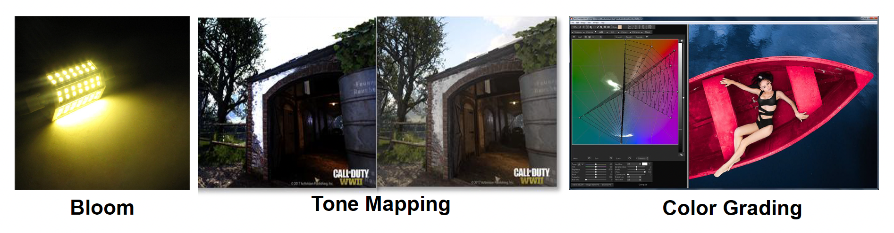
</div>


### Bloom

泛光存在于霓虹灯等强光中：

<div style="text-align: center">
    
</div>

- 泛光的物理基础是：现实世界中，透镜难以准确对焦
- 即便是完美的透镜也会将接收的图像和[艾里斑](https://en.wikipedia.org/wiki/Airy_disk)(Airy disk)做卷积

    <div style="text-align: center">
        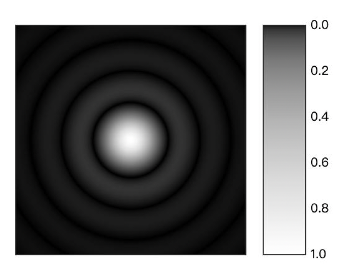
    </div>

下面逐步介绍实现泛光的方法：

1. 通过**阈值**检测高亮区域
    - 找到亮度 Y（应用 sRGB 系数）：

        $$
        Y = R_{\text{lin}} \cdot 0.2126 + G_{\text{lin}} \cdot 0.7152 + B_{\text{lin}} \cdot 0.0722
        $$

    - 代码实现：

        ```cpp
        float threshold;

        float4 computeHighlightArea() {
            [...] // first do normal lighting calculations and output results
            float4 scene_color = float4(lighting, 1.0f);
            // check whether fragment output is higher than threshold, if so output as highlight color
            float luminance = dot(scene_color.rgb, vec3(0.2126f, 0.7152f, 0.0722f));

            float4 highlight_color = float4(0.0f, 0.0f, 0.0f, 1.0f);
            if(luminance > threshold)
                highlight_color = float4(scene_color.rgb, 1.0f);   
            return highlight_color;
        }
        ```

    - 结果：

        <div style="text-align: center">
            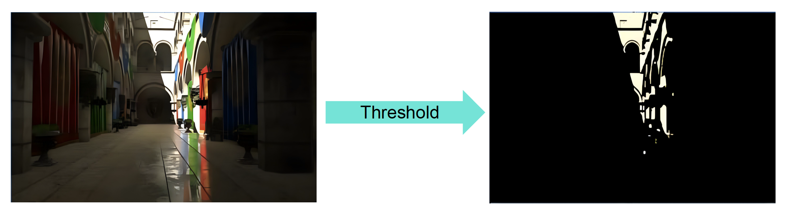
        </div>

2. **高斯模糊**(Gaussian blur)
    - 具体过程：

        <div style="text-align: center">
            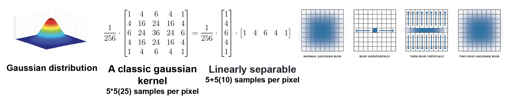
        </div>

        - 小技巧：一个规模为 nxn 的卷积运算可以转化为两次 n 维向量的卷积，从而大幅减少计算量

    - 结果：

        <div style="text-align: center">
            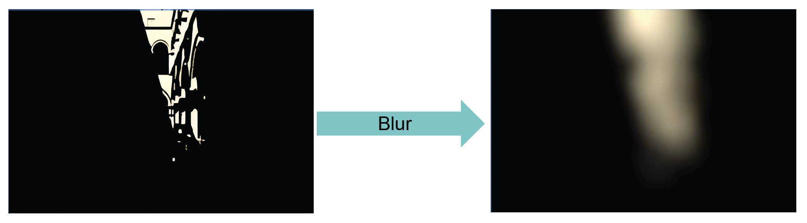
        </div>

3. **金字塔**(pyramid)**高斯模糊**
    - 实际上，我们无法直接在高分辨率图像上做滤波（计算量太大），因此需要一种对图像进行**降采样**(downsample)和**升采样**(upsample)的方式
    - 需要一个权重系数来调整最终效果

    <div style="text-align: center">
        
    </div>

4. 泛光复合

    <div style="text-align: center">
        
    </div>

???+ example "例子"

    <div style="text-align: center">
        
    </div>


### Tone Mapping

我们不能直接将 HDR 图像放在 SDR 设备上显示，否则就会出现左图所示的过曝和色偏问题。然而，这个问题可以用**色调映射**(tone mapping)来解决，它的目的就是将广泛的**高动态范围**(high dynamic range, **HDR**)颜色映射到可以输出的**标准动态范围**(standard dynamic range, **SDR**)的显示器。

<div style="text-align: center">
    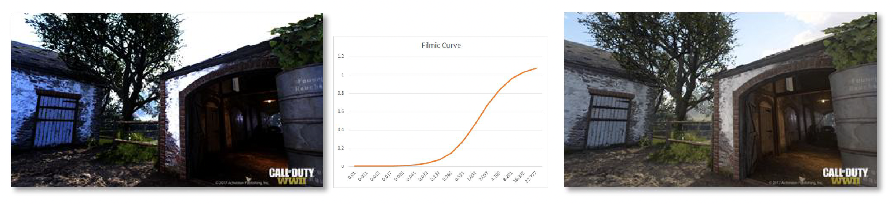
</div>


#### Tone Mapping Curve

第一种方法是大名鼎鼎的**电影曲线**(filmic curve)。

- 能获得电影般的视觉效果，而不使渲染变得脏乱
- 为图像提供适当的对比度，并优雅地衰减任何超过 1 的像素

<div style="text-align: center">
    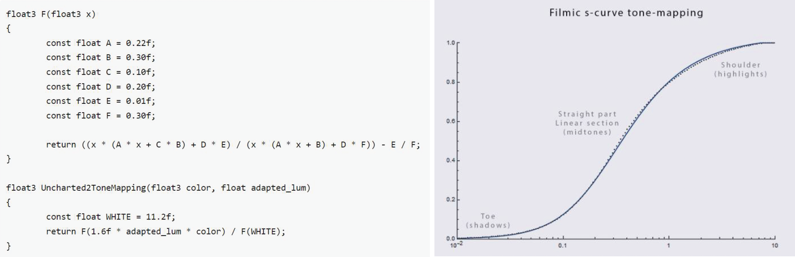
</div>


#### ACES

{ align=right width=30% }

表现更好，同时在业界中有越来越多的人在使用的技术是 **ACES**，全称学院色彩编码系统(academy color encoding system)（得名于发明组织——美国电影艺术与科学学院，~~另外看到 Logo 中熟悉的东西吗~~）。

- 主要用在电影和动画制作上
- 有趣的范式和变换
- 应用 HDR 中的色彩分级
- 固定管线，直到最终 ODT（输出设备变换）转换的阶段为止
    - 将艺术意图与支持不同设备的机制分开

HDR 和 SDR 流水线：

- HDR / SDR 之间的视觉一致性
- 与之前 SDR 色彩流水线相似的 SDR 结果
- 高质量
- 高性能
- 对艺术团队的破坏最小化
    - 从当前色彩流水线中迁移出来很简单
    - 掌握 HDR 和 SDR 的额外开销最小化

<div style="text-align: center">
    
</div>

???+ example "各种色调映射曲线的比较"

    <div style="text-align: center">
        
    </div>


### Color Grading

**色彩分级**(color grading)的实现主要借助**查找表**(look-up table, LUT)，用于将源像素的输入色彩值重新映射到新的输出值。因此 LUT 可以被认为是一种可以应用于图像或素材(footage)的颜色预设(preset)。

3D 和 2D 的 LUT：

<div style="text-align: center">
    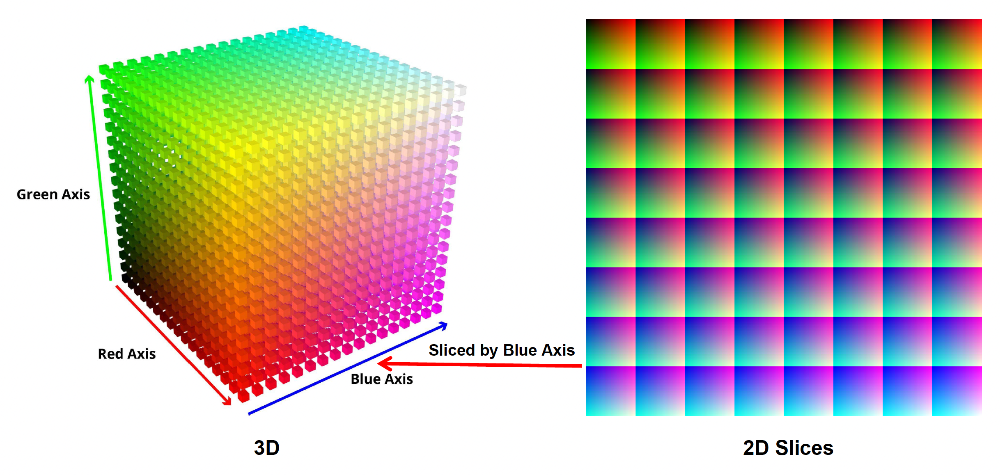
</div>

>实际在工业界中不会存储完整的 256x256 的 LUT，一般只需存 16x16 或 32x32 大小的 LUT。因为颜色是连续变化的，那些不在 LUT 中的颜色也可通过插值获得。

艺术家友好的工具（Photoshop）：

<div style="text-align: center">
    
</div>

色彩分级是游戏渲染中最具成本效益的功能。

???+ example "例子"

    === "例1"

        <div style="text-align: center">
            
        </div>

    === "例2"

        <div style="text-align: center">
            
        </div>


## Rendering Pipeline

**渲染流水线**(rendering pipeline)是指所有渲染操作执行和资源分配的管理顺序。


### Forward Rendering

一种可行的流水线可分为以下几个阶段：

<div style="text-align: center">
    
</div>

- 阴影
- 着色（光照）
- 后处理

我们称这样的流水线为**前向渲染**(forward rendering)，可以用以下简短的伪代码表达：

```
for n meshes
    for m lights
        color += shading(mesh, light)
```

前向渲染中需要注意：

- 对要渲染的物体做好排序
- 由远及近渲染透明物体
- 先渲染不透明物体，再渲染透明物体

<div style="text-align: center">
    
</div>

???+ example "例子"

    === "例1"

        <div style="text-align: center">
            
        </div>

    === "例2"

        <div style="text-align: center">
            
        </div>


### Deferred Rendering

但上述这套流水线难以应对现代游戏中同一场景下存在大量不同光源的情况。

<div style="text-align: center">
    
</div>

为此，我们引入一种知名技术，称为**延迟渲染**(deferred rendering)。它分为两个阶段：

1. **渲染 G 缓冲区**(G-buffer)

    <div style="text-align: center">
        
    </div>

2. **延迟着色**(deferred shading)

    <div style="text-align: center">
        
    </div>

伪代码如下：

```
# Pass 1
for each object
    write G-Buffer

# Pass 2
for each pixel
    gbuffer = readGBuffer(G-Buffer)
    for each light
        computeShading(gbuffer, light)
```

???+ recommend "优点"

    - 只需计算可见片段的光照
    - 来自 G 缓冲区的数据可用于后处理
    - 易于调试

???+ bug "缺点"

    - 内存和缓冲区成本高

        <div style="text-align: center">
            
        </div>

    - 不支持透明物体
    - 对 MSAA 不友好

???+ example "例子"

    === "例1"

        <div style="text-align: center">
            
        </div>

    === "例2"

        <div style="text-align: center">
            
        </div>


### Tile-Based Rendering

在移动端中，更常见的渲染流水线是**基于块的流水线**(tile-based rendering)，因为移动端需要考虑存储芯片（DRAM）的发热问题。

<div style="text-align: center">
    
</div>

具体做法是将画面切分为一个个块，然后一块块地渲染，将小块的渲染结果放入帧缓冲区，这样就不会产生很大的 G 缓冲区了。

该算法带来的额外好处是同时将光进行切割，将其划分到一个个块中，这样方便区分某个块中存在哪些光照（被记录在**光照列表**(light list)中）。这种技术称为**光照剔除**(light culling)。

<div style="text-align: center">
    
</div>

另外，我们还可以对该算法进行**深度范围的优化**(depth range optimization)：

- 从 pre-z pass 中获取每个块的最小/最大深度
- 为每个光照测试深度边界

<div style="text-align: center">
    
</div>

???+ example "例子"

    <div style="text-align: center">
        
    </div>

---
基于块的渲染可以和前向渲染结合，得到新的流水线（即**基于块的前向渲染**）。它的特点是：

- 深度预扫描(depth prepass)（防止覆盖绘制 / 提供块深度边界）
- 块光照剔除（输出：每个块的光照列表）
- 对每个对象进行着色（PS：遍历光照剔除中计算的光照列表）

???+ example "例子"

    <div style="text-align: center">
        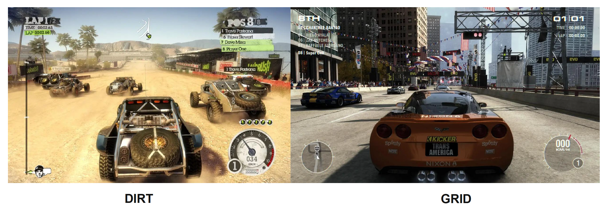
    </div>


### Cluster-Based Rendering

<div style="text-align: center">
    
</div>


### Visibility Buffer

在延迟渲染中，像深度、法线等信息都存储在一个巨大 G 缓冲区中。而最近新发展出来的一个技术是**可见性缓冲区**(visibility buffer)，它存储的东西就没有那么多了，仅包括：

- 深度
- 原语(primitive) ID（即像素所属的几何体）
- （三角形网格的）重心

<div style="text-align: center">
    
</div>

有了这些信息后，我们可以通过间接查找材质、法线等信息。在几何密度非常高的场景中，这样的技术能够有效减少内存的使用，并且查找效率也是很高的。


???+ abstract "真实的渲染管线"

    <div style="text-align: center">
        
    </div>

    >~~来自[不真实的(Unreal)渲染管线](https://unrealcommunity.wiki/unreal-schematics-2d6859)（doge）~~


### Challenges

- 复杂的并行工作需要与复杂的资源依赖同步
- 需要考虑大量的生命周期 < 1 帧的瞬时(transient)资源
- 复杂的资源状态管理
    - 像最新的 Vulkan, DX12 把裸的硬件算力开放出来了，需要开发者对底层硬件知识有更加扎实的理解
- 在不深入了解用户的低层级知识的情况下使用新发布的 GPU 特性

<div style="text-align: center">
    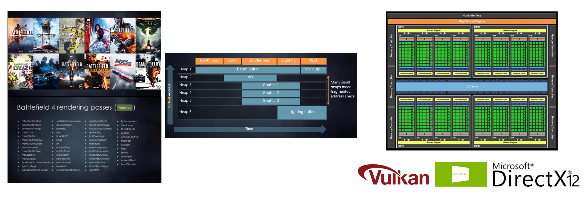
</div>


### Frame Graphs

**帧图**(frame graphs)是一个在帧中传递和资源依赖的有向无环图（DAG），并不是一个真正可见的图。

- 将流水线中的所有东西都变成一个个模块(modules)，在图中可拖拽
- 通过 DAG 表达模块间的依赖关系，并且自动优化资源的可重用部分

<div style="text-align: center">
    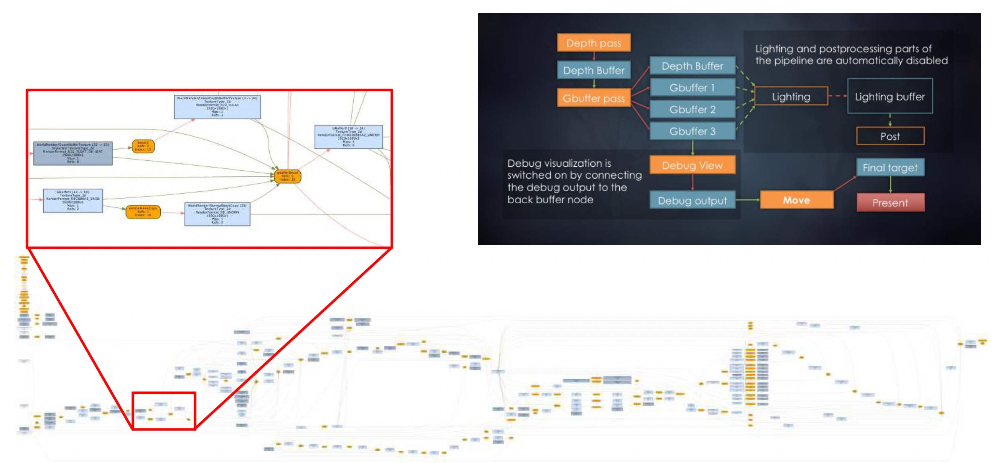
</div>


## Rendering to Monitors

渲染完游戏后，最后还得考虑呈现在显示器(monitors)上的效果。其中一种和渲染相关的问题是**屏幕撕裂**(screen tearning)，即画面的上下两半是错位的。

<div style="text-align: center">
    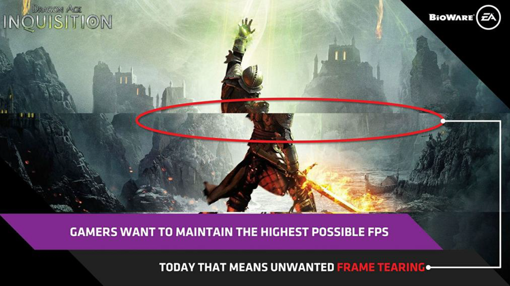
</div>

产生这一现象的原因是：在大多数游戏中，GPU 的帧率可能会不稳定。当新的 GPU 帧更新处于前一个屏幕帧的中间时，就会出现屏幕撕裂的现象。

<div style="text-align: center">
    
</div>

解决这一问题的方法有：

- **V-Sync 技术**：同步缓冲区交换与垂直刷新
    - 缺点：帧率会降低，导致鼠标延迟和卡顿，破坏游戏体验

    <div style="text-align: center">
        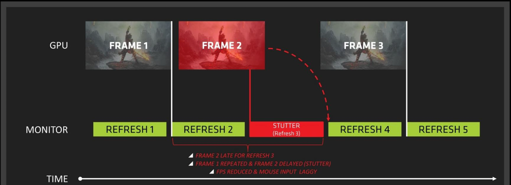
    </div>

- **变长刷新率**(variable refresh rate)：

    <div style="text-align: center">
        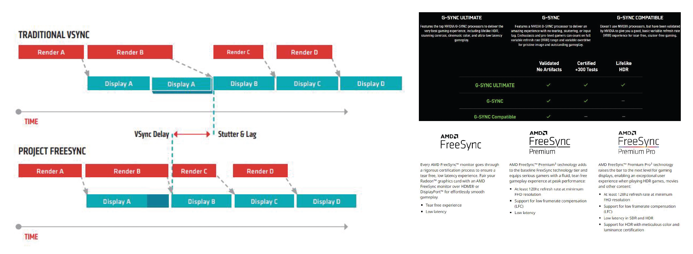
    </div>