# Basics of Animation Technology

??? info "背景知识"

    人类从很早开始就尝试表达运动中的物体，这一点从远古时代的壁画和陶器中可见一斑：

    <div style="text-align: center">
        
    </div>

    后来，人们发现了视觉残留现象。这是所有显示设备的实现基础。

    <div style="text-align: center">
        
    </div>

    在电影还没发明出来的年代，人们就通过一些小玩意实现了动画的效果。

    <div style="text-align: center">
        
    </div>

    电影中的动画技术：

    <div style="text-align: center">
        
    </div>

    动画制作技术的演进：

    <div style="text-align: center">
        
    </div>

    游戏中的动画技术：

    - 2D 游戏

        <div style="text-align: center">
            
        </div>

        - 中间游戏的人物是制作人根据他弟弟的动作拍摄的照片绘制的（~~古法动捕~~）
        - Doom 实际上是用 2D 图像制作的，却能达到 3D 的效果

    - 3D 游戏

        <div style="text-align: center">
            
        </div>

!!! warning "游戏动画中会遇到的挑战"

    - **交互**(interactive)和**动态**(dynamic)的动画

        <div style="text-align: center">
            
        </div>

        - 动画要随玩家的交互发生变化
        - 配合游戏玩法系统
        - 在复杂环境下要做出适当的调整

    - **实时性**(real-time)

        <div style="text-align: center">
            
        </div>

        - 每一帧内（< 1/30s）都要做好动画的计算
        - 大量的动画数据（占据磁盘和内存）

    - **真实感**(realism)
        
        <div style="text-align: center">
            
        </div>
        
        - 更生动的表情
        - 更真实的体验


## 2D Animation

### Sprite Animation

**精灵动画**(sprite animation)相当于电子游戏中的逐帧动画。

<div style="text-align: center">
    
</div>

- **精灵**(sprite)：一种小型位图(bitmap)，可以叠加在背景图像上，并且不会干扰背景图像
- 可以将帧序列设计得很流畅，即便无限重复也能保持丝滑的动画

>让我想到了小学玩的 Scratch...

???+ example "例子"

    === "用于伪 3D 动画"

        <div style="text-align: center">
            
        </div>

    === "现代游戏"

        - 2D 角色
            - 用于 2D 背景图像上
            - 用于 3D 渲染环境中

        - 游戏效果：作为粒子效果的精灵贴图纹理

        <div style="text-align: center">
            
        </div>


### Live 2D

[Live 2D](https://www.live2d.com/zh-CHS/)是一种不用 3D 模型生成 2D 动画的技术。

<div style="text-align: center">
    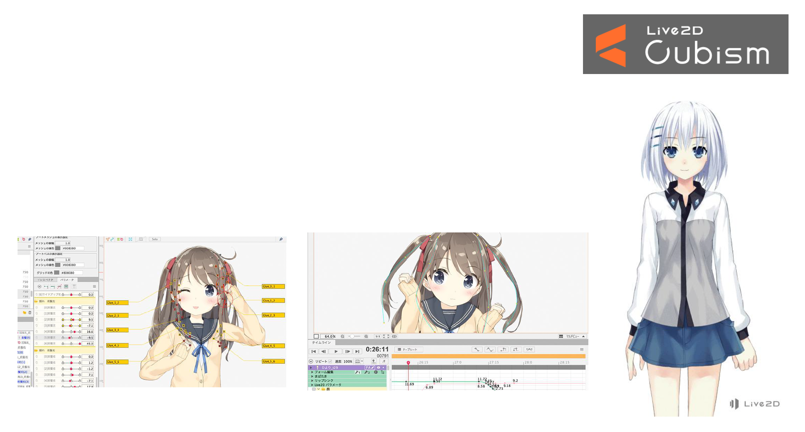
</div>

>折纸大湿！

- 通常指的是采用 Live2D Ltd. 创建的技术的同名软件系列
- 常用于开发二次元风格的动态角色

<div style="text-align: center">
    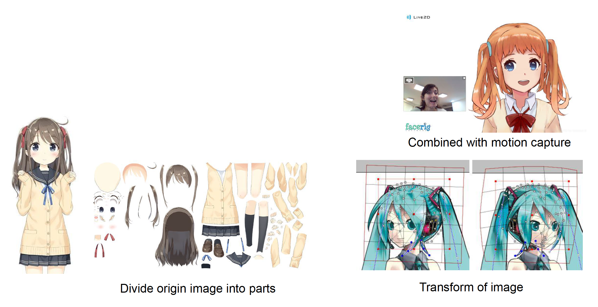
</div> 

- 通过对图像的不同部分和层应用平移、旋转和变换实现动画效果
- 结合实时动作捕捉技术，因此被广泛用于虚拟主播（比如 [vtuber](https://en.wikipedia.org/wiki/VTuber?useskin=vector)）中
- 制作 2D 动画的具体流程：
    1. 准备资源
        - 将原始角色图像划分为不同部位
        - 设置每个部位的绘制顺序，供后续使用
    
        <div style="text-align: center">
            
        </div>
    
    2. 通过使用各部位的控制点变换图像
        - 为每个部分自动生成 **ArtMesh**，它由顶点、边和多边形组成
        - 控制点可用于辅助 ArtMesh 的变换

        <div style="text-align: center">
            
        </div> 
    
    3. 设置图像的关键帧(keyframe)：以辅助动画插值

        <div style="text-align: center">
            
        </div> 


## 3D Animation

### Degrees of Freedom (DoF)

**自由度**(degrees of freedom, **DoF**)是指系统中独立变量或参数的个数。

其中刚体的自由度为 6（xyz 平移 + 3 种旋转）。

<div style="text-align: center">
    
    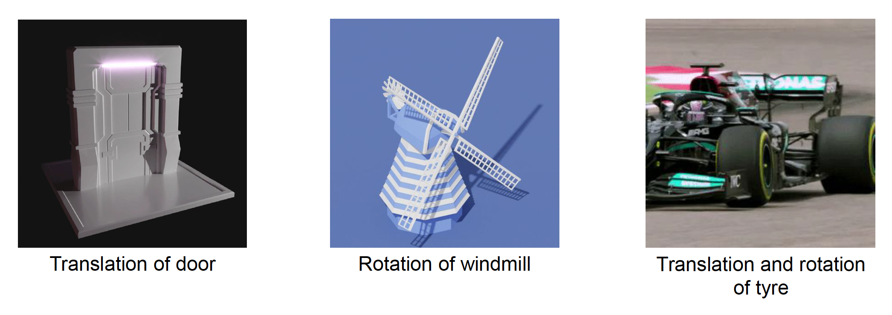
</div>


### Rigid Hierarchical Animation

**刚体层级动画**(rigid hierarchical animation)是最早的 3D 角色动画方法。其中角色被建模为一组刚性的部件，它们以层级关系相互约束。

<div style="text-align: center">
    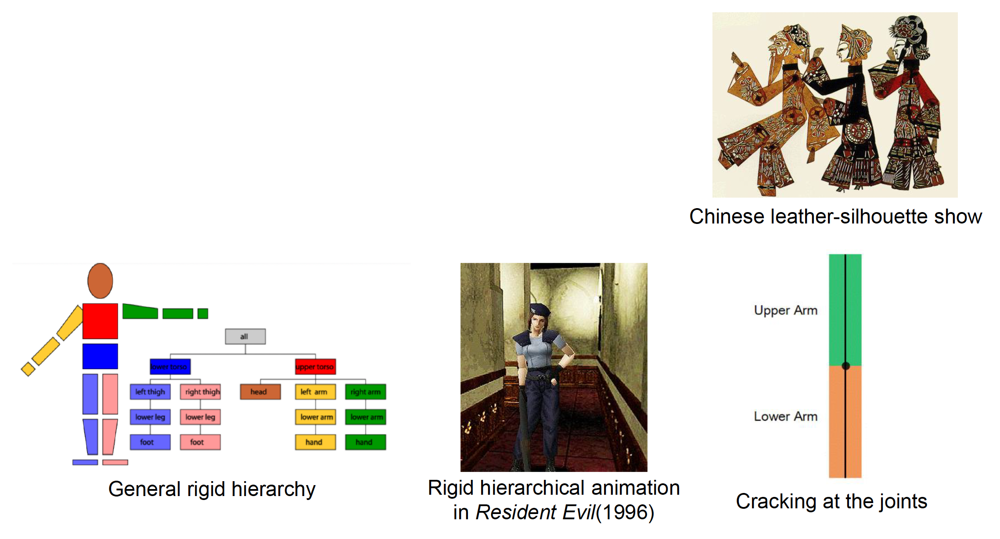
</div>

该方法的问题是刚体部件之间会穿模。


### Per-vertex Animation

**逐顶点动画**(per-vertex animation)是最灵活的方法（每个顶点 3 个自由度）。它主要通过**顶点动画纹理**(vertex animation texture, VAT)实现，适合复杂的变形，比如布料和流体的运动。

<div style="text-align: center">
    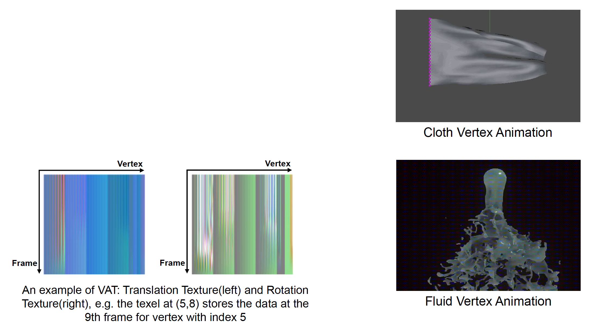
</div>

缺点是需要大量的数据。


### Morph Target Animation

**形态目标动画**(morph target animation)是前一种方法的变体。它利用带有线性插值（LERP）的关键帧而非序列帧（比如 30  fps），因此更适合用于面部表情。

<div style="text-align: center">
    
</div>


### 3D Skinned Animation

**3D 蒙皮动画**(skinned animation)将网格（或皮肤）绑定到骨骼的关节上，其中每个顶点通过多个关节加权计算得到。

<div style="text-align: center">
    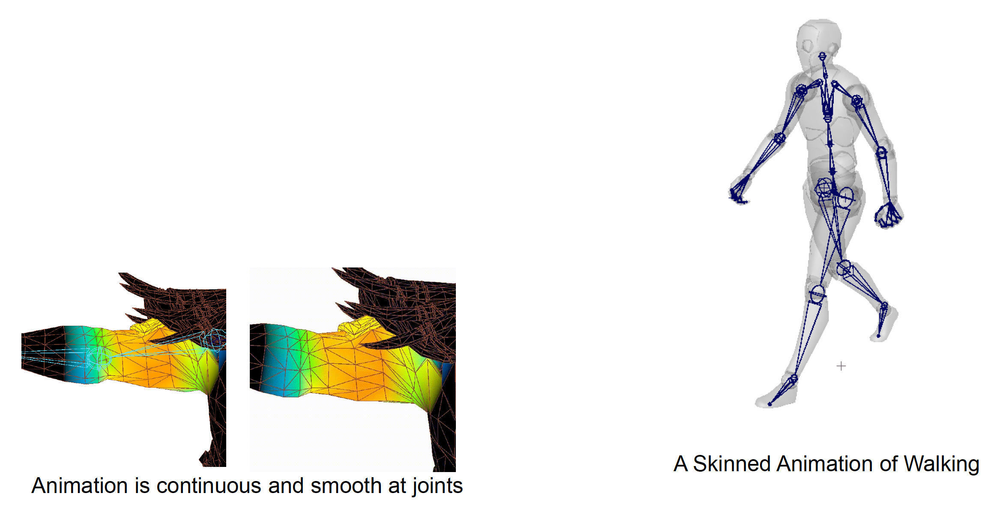
</div>

???+ recommend "优点"

    - 所需数据少于逐顶点动画
    - 网格的动画很自然（就像人的皮肤一样），不会遇到刚体动画中部位之间穿模的情况


### 2D Skinned Animation

**2D 蒙皮动画**源自 3D 蒙皮动画：

- 将角色分解为各个身体部位
- 为身体部件创建网格，并将它们拼接在一起
- 绑定(rigging)、蒙皮(skinning)和动画

<div style="text-align: center">
    
</div>


### Physics-based Animation

基于物理的动画技术有：

- **布娃娃**(ragdoll)
- **布料**和**流体**模拟
- **反向运动学**(inverse kinematics, IK)

<div style="text-align: center">
    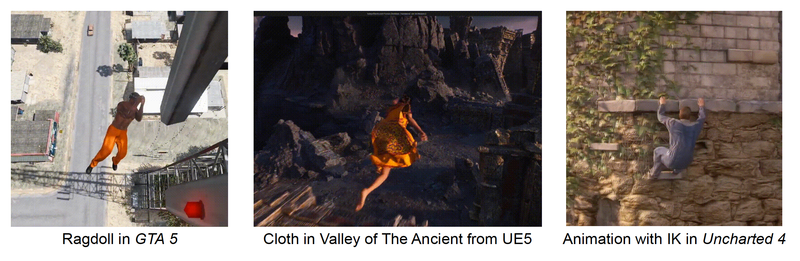
</div>


### Animation Content Creation


- 数字内容创作者 + 动画师(animator)
- **动作捕捉**(motion capture)

<div style="text-align: center">
    
</div>


## Skinned Animation Implementation

为网格添加动画的流程（看起来容易，但实现起来并不简单）：

1. 为绑定姿态创建网格
2. 为网格创建绑定骨架(skeleton)
3. 将每个顶点的蒙皮权重(skinned weights)“绘制(paint)”到相关骨架上
4. 将骨架调整至所需的姿态
5. 根据骨架和蒙皮权重对蒙皮顶点添加动画

<div style="text-align: center">
    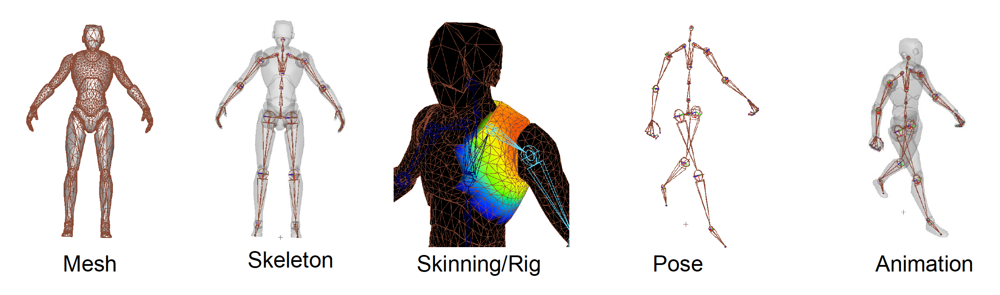
</div>

我们通常将空间划分为以下几类：

- **世界空间**(world space)
- **模型空间**(model space)
- **局部空间**(local space)：针对每个骨骼而言

<div style="text-align: center">
    
</div>

生物体的骨架是一种由称为**关节**(joints)的刚性部件组成的层次结构。

- 其中一个关节被选为**根关节**
- 除根关节外，每个关节都有一个**父关节**

<div style="text-align: center">
    
</div>

定义标准骨骼的原因：便于动画资源的复用。

???+ abstract "概念区分：关节 vs 骨骼"

    - **关节**(joint)是动画师直接可以操控的，用来控制运动的对象
    - **骨骼**(bone)是关节之间的部位

    >所以平时我们所说的「骨骼」可能更多地指代的是「关节」。

    <div style="text-align: center">
        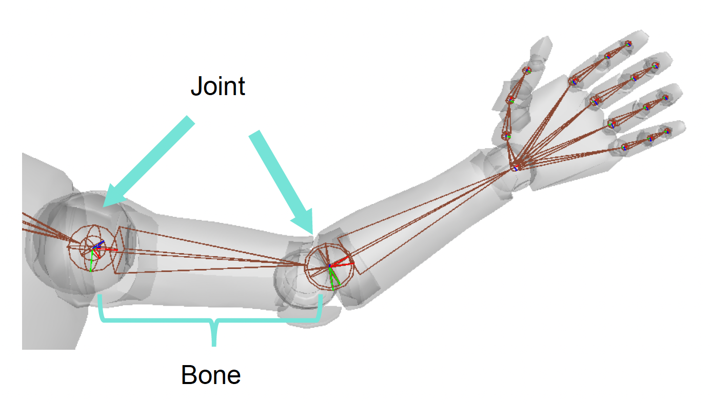
    </div>

在现实游戏的人体(humaniod)骨架中，关节数量大致为：

- 正常情况：50～100 个
- 有些游戏还会设计**面部**关节和**游戏玩法**关节，因此有超过 300 个关节的情况

<div style="text-align: center">
    
</div>

用于游戏玩法的关节是一种额外的关节，包括武器关节(weapon joint)和挂载关节(mount joint)等。

<div style="text-align: center">
    
</div>

骨架的起点是**根关节**，一般位于两脚中间，与地面接触，这对于计算跳跃高度之类的任务就很方便。而**骨盆关节**(pelvis joint)是根关节的第一个子关节，它正好将人体分为上下两部分。

<div style="text-align: center">
    
</div>

像马这样的四足动物，其根关节和骨盆关节的位置也是类似的：

<div style="text-align: center">
    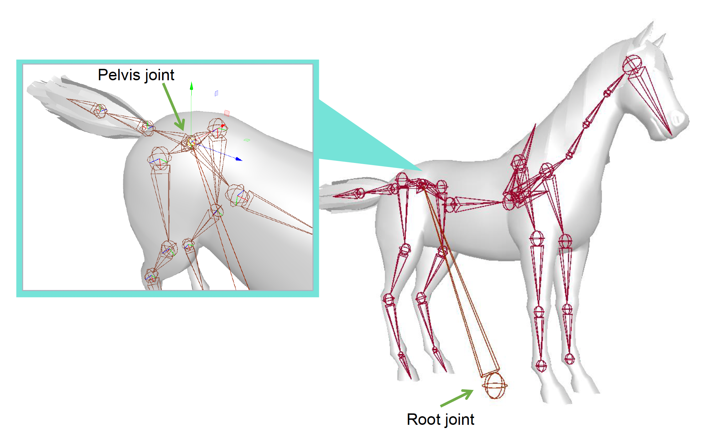
</div>

将两个模型骨架的**绑定点**(bind points)连接(attach)起来，就能实现两者的绑定动画。比如对于人骑马的动画，将人和马的绑定点连接起来后，两者的坐标系完全对齐，包括朝向，就好像插槽之间正好卡住。

<div style="text-align: center">
    
</div>

**绑定姿态**(bind poses)是指 3D 网格在绑定到骨骼之前的姿态

- 保持四肢远离身体和彼此，便于将顶点绑定到关节
- 通常接近自然姿态
- 分类：**T-姿态**和 **A-姿态**
    
    <div style="text-align: center">
        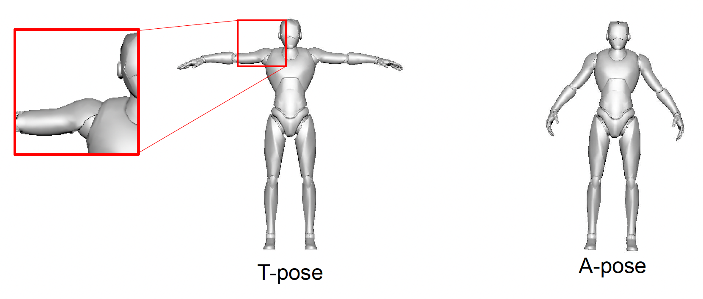
    </div>
    
    - T-姿态的问题是肩膀处精度不够
    - A-姿态中的肩膀更加放松，但更容易变形

而**骨架姿态**(skeleton poses)是指通过变换绑定姿态中的关节来摆设骨架姿态。关节姿态有 **9 DoFs**：

- **朝向**(orientation)（3 DoFs）
- **位置**(position)（3 DoFs）
- **缩放**(scale)（3 DoFs）

<div style="text-align: center">
    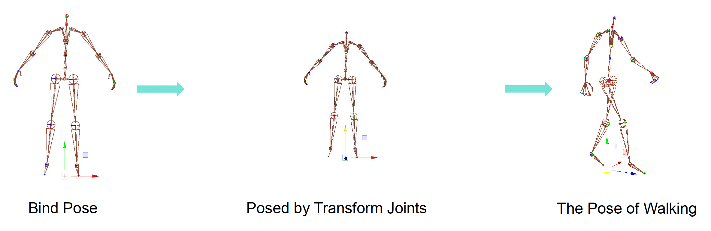
</div>


### Math of 3D Rotation

#### Euler Angles

2D 旋转的计算：

<div style="text-align: center">
    
</div>

3D 旋转的计算：**欧拉角**(Euler angle)

<div style="text-align: center">
    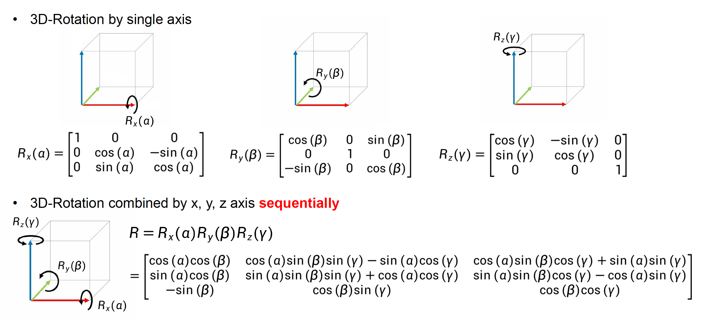
</div>

欧拉角提供了对 3D 旋转的简短描述，并被广泛应用于很多领域。欧拉角又称为**翻滚**(roll)-**俯仰**(pitch)-**偏航**(yaw)角，这也正是构成欧拉角的三种角度。

<div style="text-align: center">
    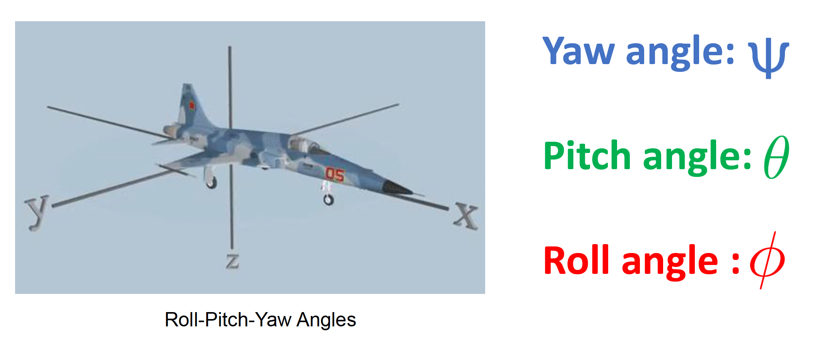
</div>

应用：**万向节**(gimbal)

<div style="text-align: center">
    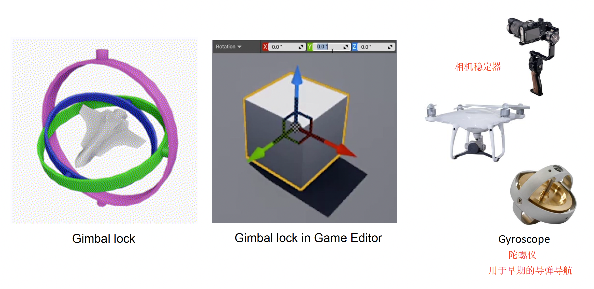
</div>

- 游戏引擎中常用万向节表达旋转（中间图）
- 实际运用：相机稳定器、无人机、陀螺仪

???+ bug "欧拉角的问题"

    - **顺序依赖性**(order dependence)：按不同顺序旋转各个角时会导致截然不同的结果

        <div style="text-align: center">
            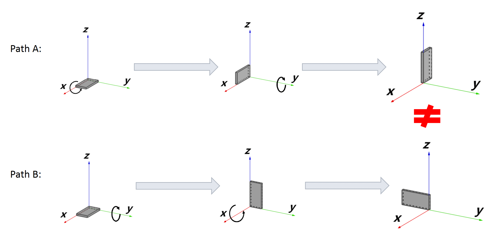
        </div>

    - **万向节死锁**(gimbal lock)（**退化**(degeneration)）：沿 y 轴旋转 90° 后（即 $\beta = 90\degree$），沿 z 轴旋转和沿 x 轴旋转变得等效了，只有两者旋转角度的差值（$t = \alpha - \gamma$）才有实际的数学意义，此时自由度降至 1

        <div style="text-align: center">
            
        </div>

    - 由于**奇异性**(singularity)问题，使得欧拉角难以插值
    - 难以组合各种旋转（一般需要旋转矩阵）
    - 沿 x/y/z 轴旋转容易，但沿特定轴旋转困难

    <div style="text-align: center">
        
    </div>


#### Quaternion

??? info "背景知识：复数"

    - 定义：$c = a + bi\ (a, b \in \mathbb{R}, i^2 = -1)$
    - 向量形式：$c = \begin{bmatrix}a \\ b\end{bmatrix}$
    - 积：$\begin{cases}c_1 = a + b i \\ c_2 = c + d i\end{cases} \Rightarrow c_1 c_2 = \begin{bmatrix}a & -b \\ b & a\end{bmatrix} \begin{bmatrix}c \\ d\end{bmatrix}$


    <div style="text-align: center">
        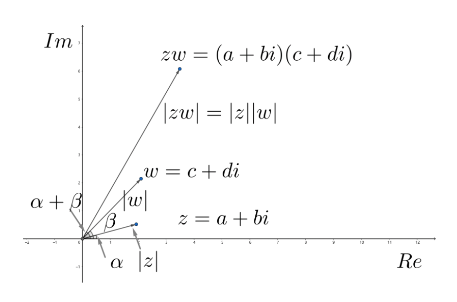
    </div>

**四元数**(quaternion)的发明者为[哈密顿(Hamilton)](https://zh.wikipedia.org/zh-sg/%E5%A8%81%E5%BB%89%C2%B7%E5%93%88%E5%AF%86%E9%A0%93?useskin=vector)。

- 定义：$q = a + bi + cj + dk\ (a, b, c, d \in \mathbb{R}, i^2 = j^2 = k^2 = ijk = -1)$
- 二元组表示：$q = (a, v)\ (v = \begin{bmatrix}b \\ c \\ d\end{bmatrix}, a, b, c, d \in \mathbb{R})$
- 积：$\begin{cases}q_1 = a + bi + cj + dk\\ q_2 = e + fi + gj + hk\end{cases} \Rightarrow q_1 q_2 = \begin{bmatrix}a & -b & -c & -d \\ b & a & -d & c \\ c & d & a & -b \\ d & -c & b & a\end{bmatrix} \begin{bmatrix}e \\ f \\ g \\ h\end{bmatrix}$
- 范数(norm)：$\|q\| = \sqrt{a^2 + b^2 + c^2 + d^2}$
- 共轭(conjugate)：$q^* = a - bi - cj - dk$
- 逆(inverse)：$q^{-1}q = qq^{-1} = 1$

现在我们用四元数表示旋转：

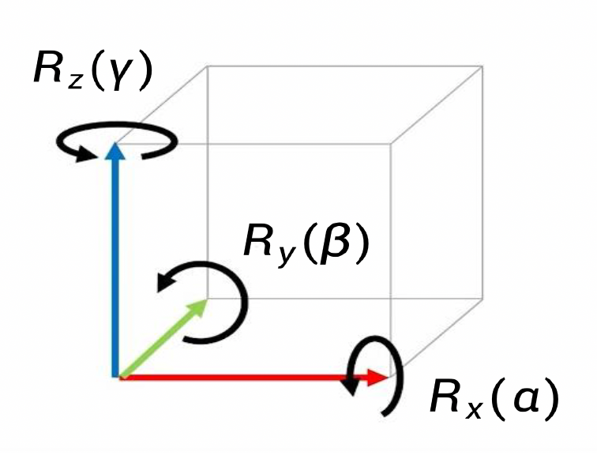{ align=right width=20% }

$$
q = \begin{bmatrix} 1 & i & j & k \end{bmatrix} \begin{bmatrix} 
\cos(\gamma / 2)\cos(\beta / 2)\cos(\alpha / 2) + \sin(\gamma / 2)\sin(\beta / 2)\sin(\alpha / 2) \\ 
\sin(\gamma / 2)\cos(\beta / 2)\cos(\alpha / 2) - \cos(\gamma / 2)\sin(\beta / 2)\sin(\alpha / 2) \\ 
\cos(\gamma / 2)\sin(\beta / 2)\cos(\alpha / 2) + \sin(\gamma / 2)\cos(\beta / 2)\sin(\alpha / 2) \\ 
\cos(\gamma / 2)\cos(\beta / 2)\sin(\alpha / 2) - \sin(\gamma / 2)\sin(\beta / 2)\cos(\alpha / 2) 
\end{bmatrix}
$$

而一般的三维向量也可写成四元数形式：

$$
v_q = (0, v) = bi + cj + dk \quad v = \begin{bmatrix}b \\ c \\ d\end{bmatrix}
$$

于是旋转后的向量为：
$$
v_q' = qv_qq^* = qv_qq^{-1}
$$

更一般地，已知 $q = (a, b, c, d), \|q\| = 1$，那么旋转后的向量可以这样计算出来：

$$
v' = \begin{bmatrix} 
1 - 2c^2 - 2d^2 & 2bc - 2ad & 2ac + 2bd \\ 
2bc + 2ad & 1 - 2b^2 - 2d^2 & 2cd - 2ab \\ 
2bd - 2ac & 2ab + 2cd & 1 - 2b^2 - 2c^2 
\end{bmatrix} v
$$

通过四元数，我们可以表示更多样的旋转了：

<div style="text-align: center">
    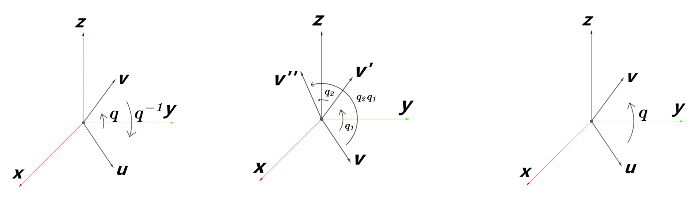
</div>

- 逆的求解：$q^{-1} = \dfrac{q^*}{\|q\|^2}$
- 旋转组合：

    $$
    \begin{aligned}
    q_1^* q_2^* &= (q_2 q_1)^* \\
    v' &= q_1 v q_1^* \\
    v'' &= q_2 v' q_2^* \\
    &= q_2 q_1 v q_1^* q_2^* \\
    &= (q_2 q_1) v (q_2 q_1)^*
    \end{aligned}
    $$

- 两个单位向量间的四元数：

    $$
    \begin{aligned}
    w &= u \times v \\
    q &= [u \cdot v + \sqrt{(w \cdot w) + (u \cdot v)^2}, w] \\
    (\|u\| &= \|v\| = 1)
    \end{aligned}
    $$

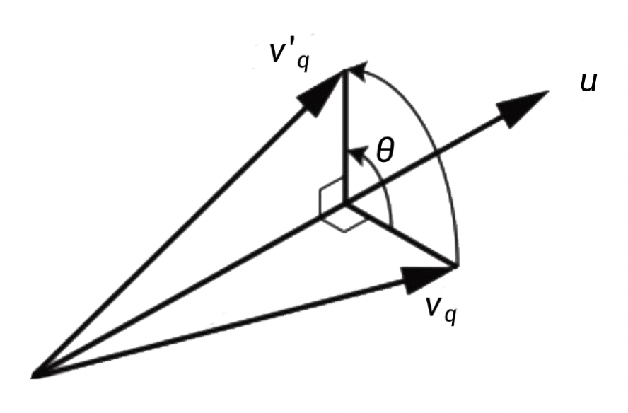{ align=right width=30% }

对于向量 $v$，沿单位轴 $u$ 旋转 $\theta$ 角度后的结果向量 $v_q$ 为：

$$
\begin{aligned}
q & = (\cos\left(\frac{\theta}{2}\right), \sin\left(\frac{\theta}{2}\right) x_u, \sin\left(\frac{\theta}{2}\right) y_u, \sin\left(\frac{\theta}{2}\right) z_u) \\
u & = \begin{bmatrix}x_u \\ y_u \\ z_u\end{bmatrix} \\
v_q' & = qv_qq^* = qv_qq^{-1}
\end{aligned}
$$


### Joint Poses

关节姿态的三个部分：

- **朝向**：
    - 通过旋转改变关节朝向
    - 大多数骨架姿态仅改变关节的朝向

    <div style="text-align: center">
        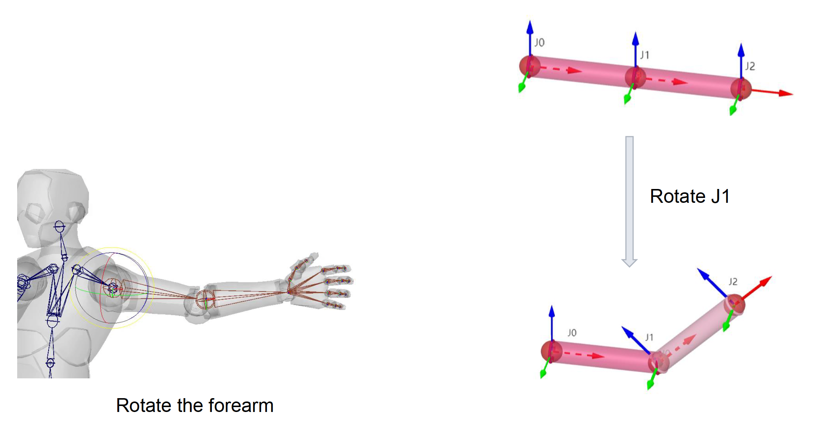
    </div>

- **位置**：
    - 通过平移改变关节位置
    - 通过向量 $T$ 将点 $P$ 平移到 $P'$

    <div style="text-align: center">
        
    </div>

    - 在人体骨架中通常不会改变，除了骨盆关节（角色移动）、面部关节（表情变化）和其他特殊关节（拉弓）
    - 通常用于拉伸模型

    <div style="text-align: center">
        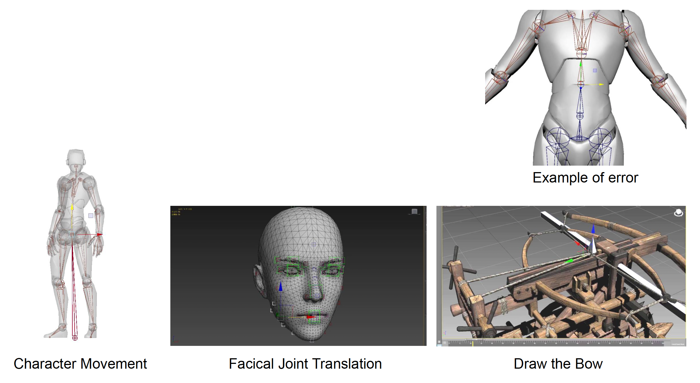
    </div>

- **缩放**：
    - 通过缩放改变模型大小
    - 均匀(uniform)/非均匀(non-uniform)缩放
    
    <div style="text-align: center">
        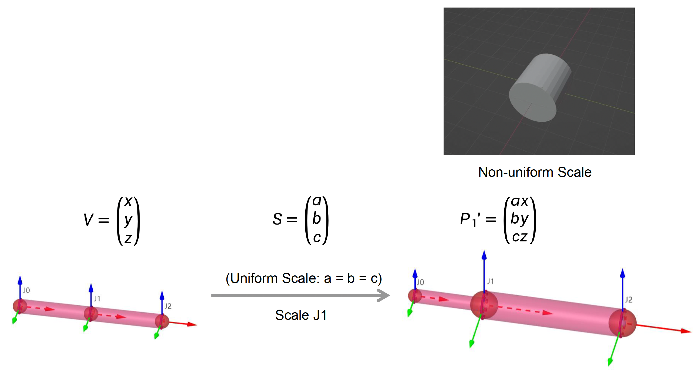
    </div>
    
    - 广泛用于面部动画中（捏脸）

    <div style="text-align: center">
        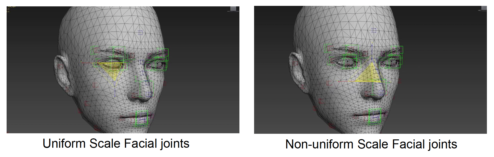
    </div>

关节姿态的旋转、平移和缩放可统一用一个**仿射矩阵**表示：

<div style="text-align: center">
    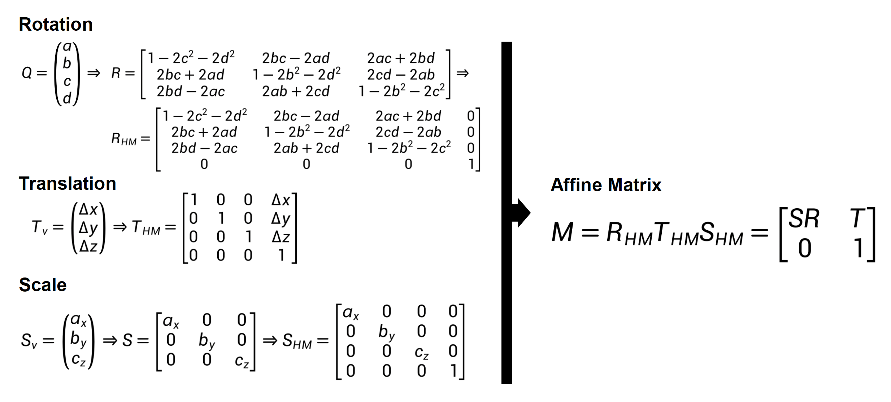
</div>

{ align=right width=25% }

对于蒙皮网格中的一个关节 $j$ 会存储以下信息：

- $p(j)$：$j$ 的父关节
- $M_{p(j)}^l$：$j$ 的父关节在局部空间的姿态

令 $M_J^m$ 为关节 $J$ 在模型空间的姿态，它就相当于从 $J$ 到根关节的一系列姿态的累积，即：
$$
M_J^m = \sum_{j = J}^0 M_{p(j)}^l
$$

之所以记录的是**局部空间**而非模型空间的姿态，是因为：

- 局部空间中每次变换所需数据更少，对**插值**或混合而言更方便（左图）
- 模型空间中的插值结果不太正确（右图）

<div style="text-align: center">
    
</div>


#### Single Joint Skinning

先考虑网格顶点仅和一根骨骼关联的简单情况。

- 每个顶点可以被带权重参数的一个或多个关节绑定
- 顶点在每个绑定关节的局部空间的位置是固定的

<div style="text-align: center">
    
</div>

对于绑定到关节 $J$ 的网格顶点 $V$：

>**绑定姿态**(bind pose)：用于绑定的骨架姿态。

- $V_b^m$：在绑定姿态下，$V$ 在模型空间的位置
- $V_b^l$：在绑定姿态下，$V$ 在局部空间的位置
- $M_{b(J)}^m$：在绑定姿态下，$J$ 在模型空间的姿态

任意时刻 $t$ 下，$V$ 在局部空间的位置固定为：
$$
V^l(t) \equiv V_b^l = (M_{b(J)}^m)^{-1} \cdot V_b^m
$$

<div style="text-align: center">
    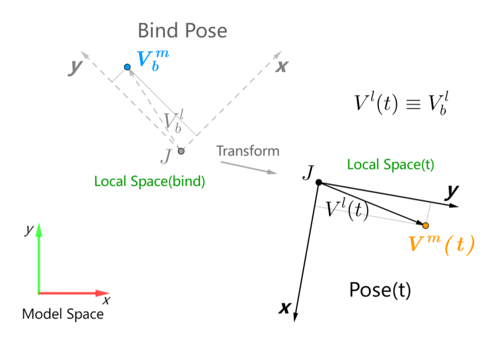
</div>

结合之前介绍的公式，可以得到时刻 $t$ 下 $V$ 在模型空间的位置 $V^m(t)$：
$$
V^m(t) = M_J^m(t) \cdot V_J^l = \boxed{M_J^m (t) \cdot (M_{b(J)}^m)^{-1}} \cdot V_b^m
$$

框出来的部分为**蒙皮矩阵**(skinning matrix)，记作 $K_J$。

在内存中表示骨架：

- 关节名称（字符串或 32 位长的哈希 id）
- 骨架内节点的父节点索引
- 逆绑定矩阵变换是旋转、平移和缩放之积的逆

```cpp hl_lines="8"
struct Joint
{
    const String    m_joint_name;                  // the name of joint
    UInt8           m_parent_joint_index;          // the index of parent joint or 0xFF if root
    Translation     m_bind_pose_translation;       // bind pose:translation
    Rotation        m_bind_pose_rotation;          // bind pose:rotation
    Scale           m_bind_pose_scale;             // bind pose:scale
    Matrix4X3       m_inverse_bind_pose_transform; // inverse bind pose matrix
};

struct Skeleton
{
    UInt            m_joint_count;  // number of joints
    Joint           m_joints[];     // array of joints
};
```

**蒙皮矩阵调色盘**(palatte)是由每个节点的蒙皮矩阵构成的数组，供 GPU 在着色器中使用。

优化：将关于**模型空间**到**世界空间**的变换矩阵 $M^w$ 考虑进来，那么优化后的关节 $J$ 的蒙皮矩阵为：
$$
K_J' = M^w \cdot M_J^m (t) \cdot (M_{b(J)}^m)^{-1}
$$


#### Weighted Skinning with Multi-joints

现在考虑将网格顶点 $V$ 绑定到 $N$ 个关节点的情况。我们会为每个节点赋予一个权重；记第 $i$ 个关节的蒙皮权重为 $W_i$，要求权重总和为 1，即 $\sum\limits_{i=0}^{N-1} W_i = 1$

>$N$ 没有上限，但一般不超过 4 个。

<div style="text-align: center">
    
</div>

记 $N$ 个关节分别为 $J_0, \dots, J_{N-1}$，并令 $K_{J_i}(t)$ 为时刻 $t$ 下关节 $J_i$ 的蒙皮矩阵，那么：

{ align=right width=30% }

- 将关节 $J_i$ 的位置从局部空间变换到模型空间

    $$
    V_{J_i}^m(t) = K_{J_i}(t) \cdot V_{b(J_i)}^m
    $$

- 因此 $V$ 在模型空间的位置为：

    $$
    V^m(t) = \sum_{i=0}^{N-1} W_i \cdot V_{J_i}^m(t)
    $$


#### Interpolation

**片段**(clip)：骨架姿态序列。

<div style="text-align: center">
    
</div>

现在要考虑的问题是在这些连续的姿态间进行插值，即计算关键姿态之间的姿态。

<div style="text-align: center">
    
</div>

- 平移和缩放可直接采用**线性插值**(linear interpolation, **LERP**)

    { align=right width=30% }

    $$
    \begin{aligned}
    & f(x) = (1 - \alpha) f(x_1) + \alpha f(x_2) \\
    & \alpha = \frac{x - x_1}{x_2 - x_1}, x_1 < x_2, x \in [x_1, x_2]
    \end{aligned}
    $$

    - 平移：$T(t) = (1 - \alpha) T(t_1) + \alpha T(t_2)$
    - 缩放：$S(t) = (1 - \alpha) S(t_1) + \alpha S(t_2)$

- 旋转采用四元数的 **NLERP**（归一化的线性插值）

    { align=right width=30% }

    $$
    q_t' = Nlerp(q_{t_1}, q_{t_2}, t) = \frac{(1 - \alpha) q_{t_1} + \alpha q_{t_2}}{\|(1 - \alpha) q_{t_1} + \alpha q_{t_2}\|}
    $$

    - 最短路原则：两个四元数进行点乘，若结果小于 0 则需要反向插值

        <div style="text-align: center">
            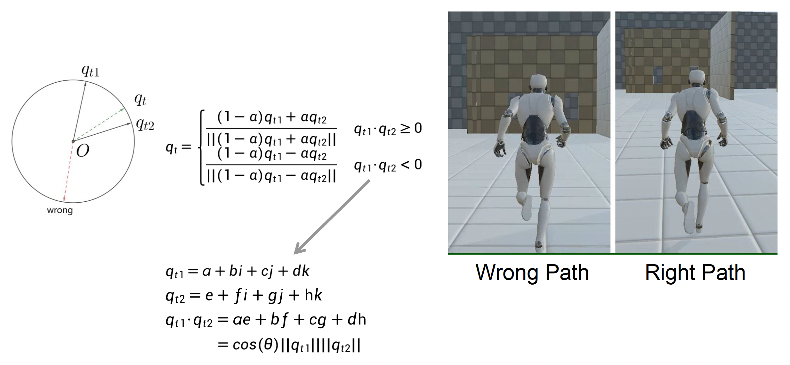
        </div>

    - 问题：角速度不均匀，中间慢两边快

        <div style="text-align: center">
            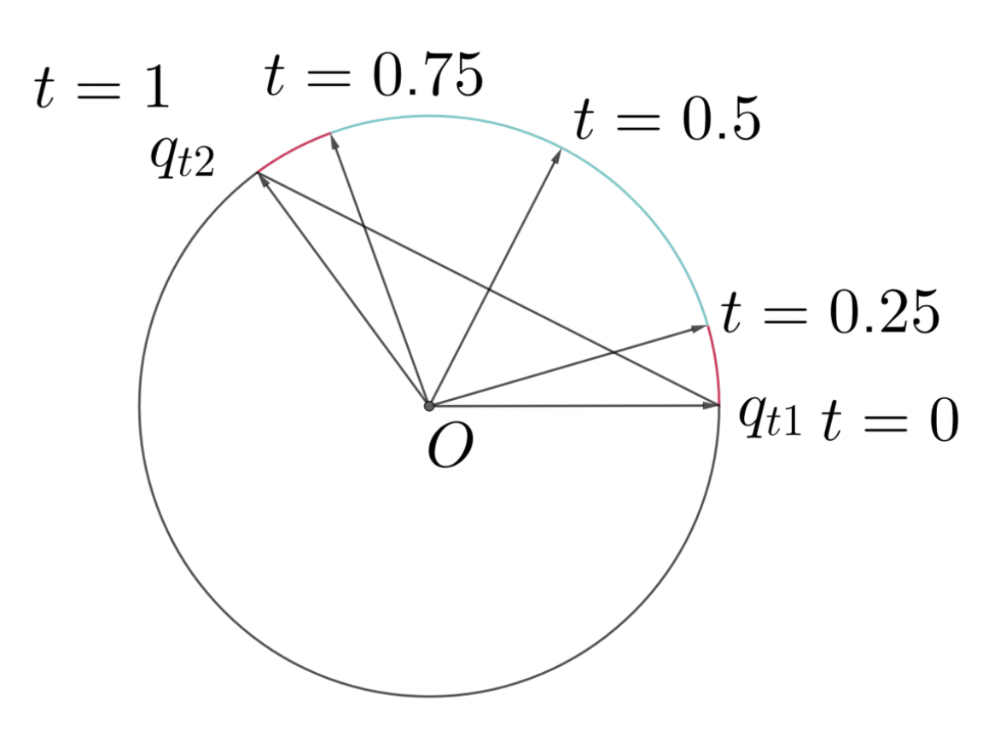
        </div>

    - 解决方案是 **SLERP**，它做到了均匀的旋转插值

        $$
        \begin{aligned}
        q_t & = Slerp(q_{t_1}, q_{t_2}, t) = \dfrac{\sin((1 - t)\theta)}{\sin(\theta)} q_{t_1} + \dfrac{\sin(t\theta)}{\sin(\theta)} q_{t_2} \\
        \theta & = \arccos (q_{t_1} \cdot q_{t_2})
        \end{aligned}
        $$

        <div style="text-align: center">
            
        </div>

        - 问题：
            - 三角函数计算成本大（需提前算好）
            - 当 $\theta$ 很小时，作为分母的 $\sin \theta$ 也很小，导致结果不稳定


    - 实践中的做法是将 NLERP 和 SLERP 结合起来（常用于 3A 游戏开发中）：$\theta$ 大时用 SLERP，$\theta$ 小时用 NLERP

---
???+ abstract "简单的动画运行时流水线"

    <div style="text-align: center">
        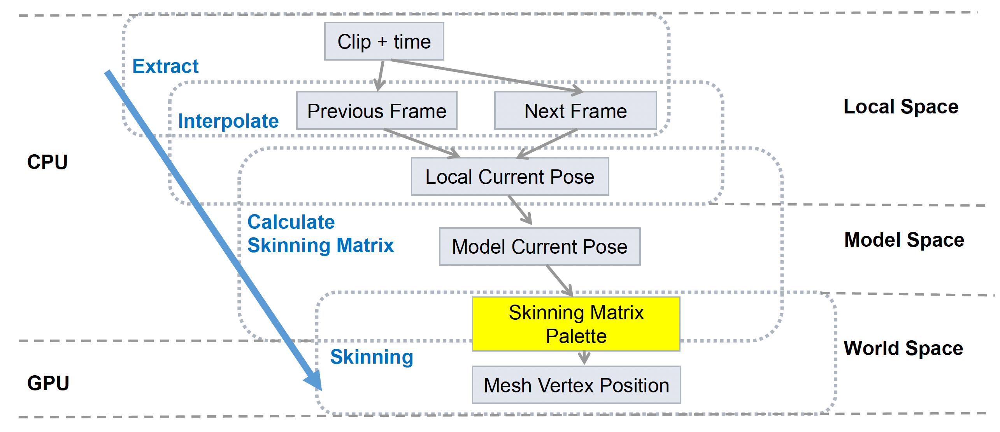
    </div>


## Animation Compression

存储动画片段时，通常将其分割为多段有关关节姿态的序列，而这些序列会被进一步分割为单独的平移、旋转和缩放轨道。

<div style="text-align: center">
    
</div>

单个动画片段大小估算：

<div style="text-align: center">
    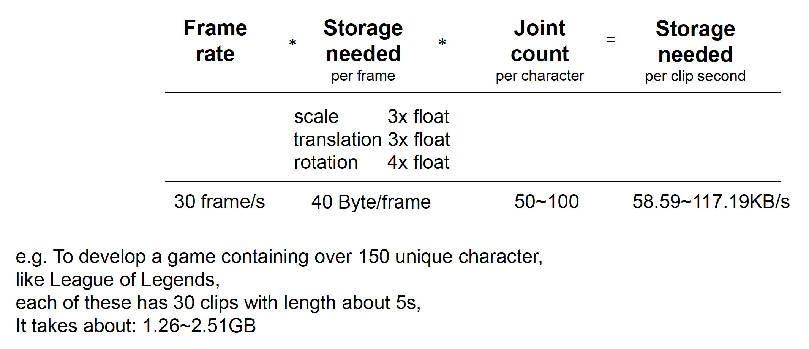
</div>

由此可见，即便是一小段动画，如果不经过任何压缩，其数据量将是无法容忍的。因此动画压缩是游戏中常用的一种技术。

一些观察：

- 动画轨道：对于相同关节，旋转、平移和缩放改变量的差别很大

    <div style="text-align: center">
        
    </div>

- 关节：不同关节的运动差别也很大

    <div style="text-align: center">
        
    </div>


### DoF Reduction

一种简单的压缩方法是减少部分 DoF，比如变化量不怎么大的平移和缩放：

- 缩放：直接丢掉缩放轨道（除面部关节外，通常不会在人体骨架中改变）
- 平移：直接丢掉平移轨道（除骨盆关节、面部关节和其他特殊关节外，通常不会在人体骨架中改变）


### Keyframe Extraction

???+ info "关键帧"

    动画和电影制作中的**关键帧**(keyframes)是指定义了任何平滑过渡的起始点和结束点的画面或镜头。

    <div style="text-align: center">
        
    </div>

第二种压缩技术是**关键帧提取**(keyframe extraction)，反过来说就是剔除那些可以通过线性插值或相邻帧拟合得到的帧。下面给出伪代码：

```lua
KeyFrame = {}
for i = 1 to n-1 do
    frame_interp = Lerp(frame[i-1], frame[i+1])
    error = Diff(frame[i], frame_interp)
    if isNotAcceptable(error) then
        KeyFrame.insert(frame[i])
    end
end
```

<div style="text-align: center">
    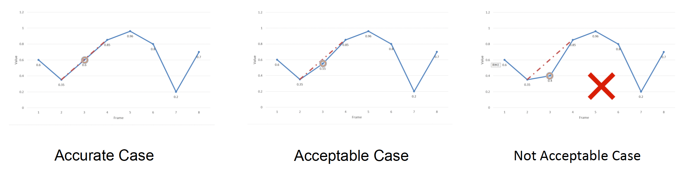
</div>


### Catmull-Rom Spline

为了实现更好的插值效果，实际我们会采用 **Catmull-Rom 样条**(spline)插值而非 LERP。

- 通过 4 个控制点 $P_0, \dots, P_3$ 绘制从 $P_1$ 到 $P_2$ 的曲线
- 参数：
    - $\alpha$（锐度）：影响曲线在控制点的弯曲程度（通常取 $\alpha = 0.5$）
    - $t$：插值系数

- 在曲线上进行插值（$t$ 的范围为 $(0, 1)$）

    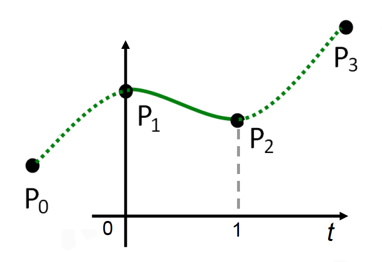{ align=right width=30% }

    $$
    P(t) = \begin{bmatrix} 1 & t & t^2 & t^3 \end{bmatrix} \begin{bmatrix} 0 & 1 & 0 & 0 \\ -\alpha & 0 & \alpha & 0 \\ 2\alpha & \alpha-3 & 3-2\alpha & -\alpha \\ -\alpha & 2-\alpha & \alpha-2 & \alpha \end{bmatrix} \begin{bmatrix} P_0 \\ P_1 \\ P_2 \\ P_3 \end{bmatrix}
    $$

- 拟合步骤：
    1. 绘制一条 Catmull-Rom 样条曲线，该曲线中间的两个控制点为原来曲线的两个端点
    2. 像二分搜索一样迭代添加控制点
    3. 通过最接近的 4 个点计算内曲线
    4. 重复上述步骤，直到每帧的误差低于阈值

    <div style="text-align: center">
        
    </div>


### Float Quantization

下一种压缩方法是使用位数更少的整数来表示有限范围和精度的浮点数。所需位数的计算公式为：
$$
DesiredBits = \left\lceil \log_2 \frac{Range}{Accuracy} \right\rceil
$$

一般来说，16 位可以满足游戏引擎中姿态的浮点数范围和精度要求。


??? example "例子"

    === "例1"

        平移范围 $[0, 10]$，精度 $0.001\text{m}$：
        $$
        DesiredBits = \left\lceil \log_2 \frac{10}{0.001} \right\rceil = 14 \text{ bits}
        $$

    === "例2"

        将 32 位浮点数线性量化为 16 位无符号整数：

        <div style="text-align: center">
            
        </div>


### Quaternion Quantization

最后一种压缩技术是四元数量化：

- 3 个数足以表示一个**单位四元数**(unit quaternion) $q = (a, b, c, \sqrt{1 - (a^2 + b^2 + c^2)})$
- 若总能省略绝对值最大的数，这 3 个数的范围可限制在 $[-\dfrac{1}{\sqrt{2}}, \dfrac{1}{\sqrt{2}}]$

$$
\begin{aligned}
a^2 + b^2 + c^2 + d^2 &= 1, |a| \geq \max(|b|, |c|, |d|) \\
2b^2 < a^2 + b^2 &< a^2 + b^2 + c^2 + d^2 = 1 \\
b^2 \leq \frac{1}{2} &\Rightarrow -\frac{1}{\sqrt{2}} \leq b \leq \frac{1}{\sqrt{2}} \\
\text{Similarly, } -\frac{1}{\sqrt{2}} \leq c &\leq \frac{1}{\sqrt{2}} \text{ and } -\frac{1}{\sqrt{2}} \leq d \leq \frac{1}{\sqrt{2}}
\end{aligned}
$$

具体做法：

- 使用 2 位表示被抛弃的数
- 剩余 3 个数每个用 15 位表示，范围为 $[-\dfrac{1}{\sqrt{2}}, \dfrac{1}{\sqrt{2}}]$，精度为 $\dfrac{\sqrt{2}}{32767} \approx 0.000043$
- 因此一个四元数的存储大小从 128 位降至 48 位

<div style="text-align: center">
    
</div>

---
无论是浮点数的量化还是四元数的量化，量化的关键点在于找到合适的误差阈值，同时尽可能使用更少的存储位。关键帧提取和量化方法可同时使用，以获得更好的压缩比。

<div style="text-align: center">
    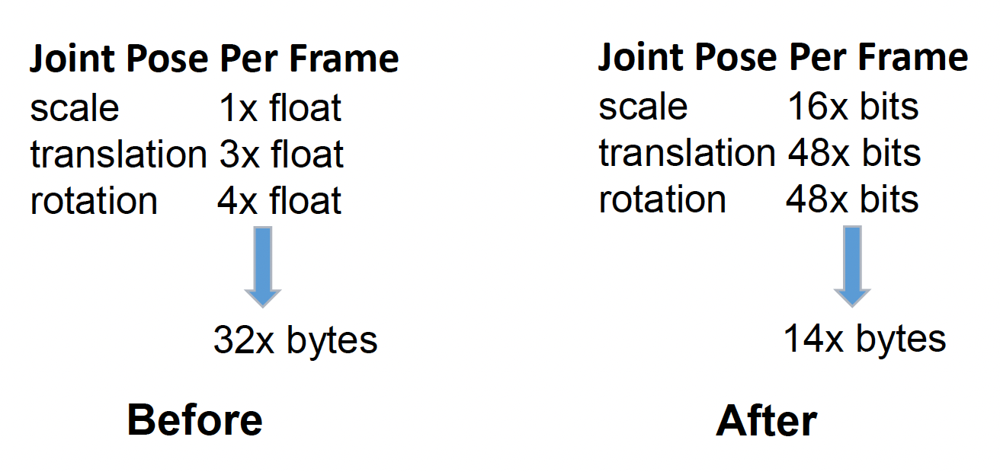
</div>


### Error Compensation

动画数据的压缩导致的误差会随骨骼(bones)累积：

<div style="text-align: center">
    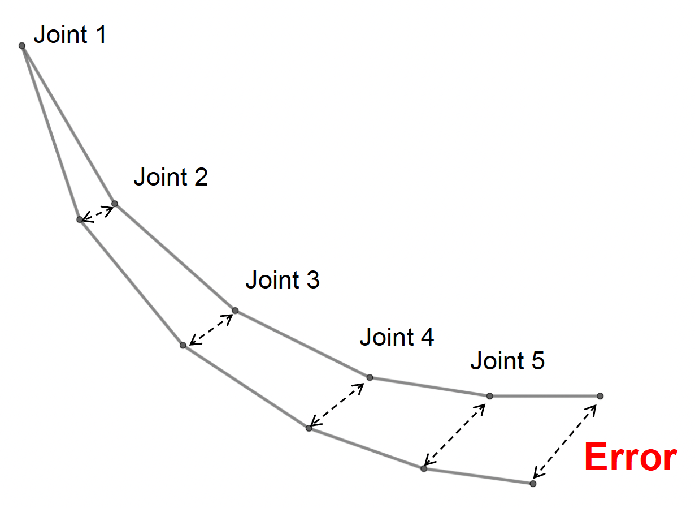
</div>

而一些特殊部位需要较高精度的动画：

<div style="text-align: center">
    
</div>

精度的测量：

- **数据**误差：计算插值变换数据与原始数据之间的差值误差

    { align=right width=40% }

    - 平移误差：$\|T_1 - T_2\|$
    - 旋转误差：$\|R_1 - R_2\|$
    - 缩放误差：$\|S_1 - S_2\|$

<br/>

- **视觉**误差：计算插值顶点与期望顶点之间的差值误差

    <div style="text-align: center">
        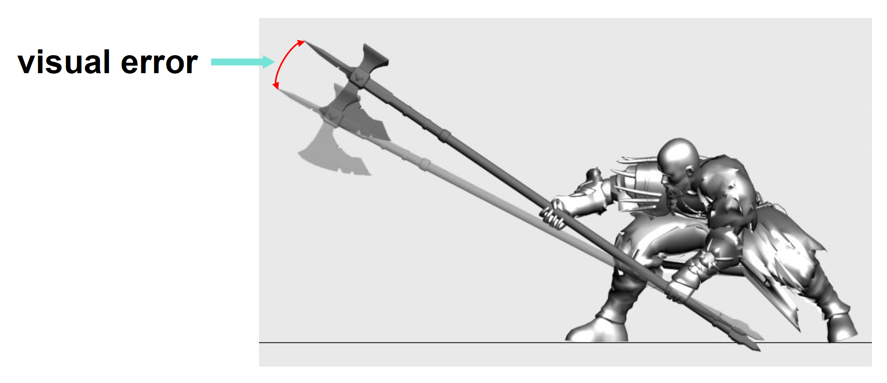
    </div>

    { align=right width=30% }

    - 由于计算量太大，难以为每个顶点计算视觉误差
    - 估计视觉误差：**假顶点距离近似**(fake vertex distance approximation)
        - **假顶点**：两个与关节固定距离的垂直虚拟顶点（不与关节旋转轴共线）
        - 角色骨骼 2~10 cm
        - 大型动画物体 1~10 cm

误差的补偿方法有：

- **自适应误差边界**(adaptive error margins)：对于从末端到根部的不同关节使用不同的精度阈值，以减少由父关节引起的误差

    <div style="text-align: center">
        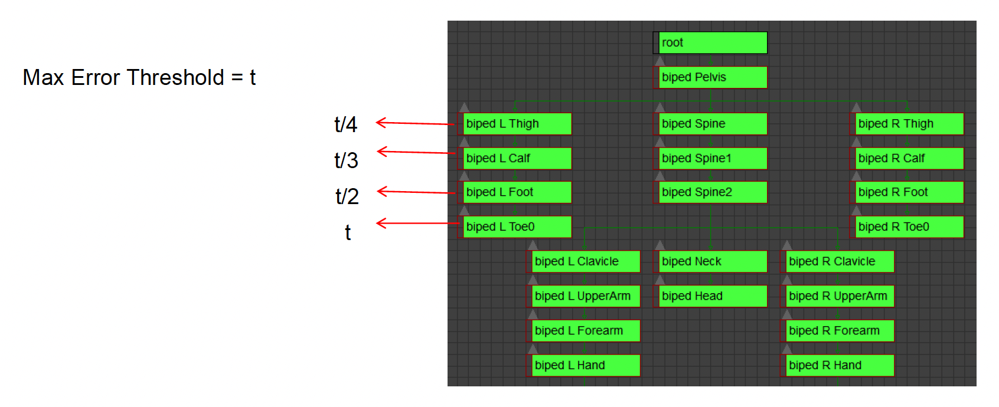
    </div>

- **就地校正**(in place correction)
    - 过程
        - 除根骨骼外在每个骨骼上选择一个点
        - 计算从根骨骼到每个压缩骨骼的旋转，使标记点最接近其在模型空间中的实际位置
        - 将旋转添加到压缩数据的变换中

    - 优点：解压期间没有额外开销，因为所有数据在压缩时已计算完成
    - 缺点 
        - 可能会因为对常量轨道的修改而产生内存开销 
        - 可能会因为直接更改关键帧数据而产生噪声轨道
        - 可能需要更多时间压缩

    <div style="text-align: center">
        
    </div>


## Animation DCC

一般来说，动画 **DCC**（数字内容创建(digital content creation)）的流程包括：

- **网格**
    - 构建：
        - **阻挡**(blockout)阶段：创建角色的粗略轮廓
        - **高细节**(highpoly)阶段：提高建模精度
        - **低细节**(lowpoly)阶段：将表面划分为网格
        - **纹理**(texture)阶段：为角色添加纹理
    
        <div style="text-align: center">
            
        </div>
    
    - 针对动画调整：
        - 网格划分对动画创建至关重要，因为网格定义了皮肤的曲线
        - 如果网格过于稀疏，动画会变得奇怪
        - 但网格越密集，性能开销越大

        <div style="text-align: center">
            
        </div>

- **骨骼绑定**
    - 现代游戏引擎通常会提供现成的骨架，所以只需要从工具箱中拉出一个骨架，和现有模型匹配即可

        <div style="text-align: center">
            
        </div>

    - 添加游戏玩法关节

        <div style="text-align: center">
            
        </div>

    - 添加根关节

        <div style="text-align: center">
            
        </div>

- **皮肤绑定**（**蒙皮**）
    - 自动计算
    
        <div style="text-align: center">
            
        </div>
    
    - 手动修正

        <div style="text-align: center">
            
        </div>

- **动画制作**

    <div style="text-align: center">
        
    </div>

- **导出**
    - 一般导出文件格式为 **FBX**，它是由 Autodesk 开发的专有格式，是游戏行业标准的 3D 资产交换文件格式
    - FBX 包括了模型网格、骨架、蒙皮数据和动画片段

    <div style="text-align: center">
        
    </div>

