# Advanced Animation Technology

前一讲介绍了一些制作简单动画所需的技术，而本讲则会讲解如何实现现实游戏中复杂的动画效果。


## Animation Blending

**动画混合**(animation blending)是指采用多个动画片段来实现角色最终姿态的技术。

下面以从走（假设 1.5 m/s）到跑（假设 3.0 m/s）的动画为例分析各种动画混合的技术。

<div style="text-align: center">
    
</div>

混合的数学基础也是 **LERP**。但不同于之前在单个片段中插值，动画混合需要在不同片段之间的姿态中获取中间帧，并通过游戏参数（比如角色的速度等）控制权重。

<div style="text-align: center">
    
</div>

权重的计算：令 $\text{speed}_{\text{current}}, \text{speed}_1, \text{speed}_2$ 分别为当前速度、片段 1 和片段 2的速度，$\text{weight}_1, \text{weight}_2$ 分别为计算后的片段 1 和片段 2 的权重，那么：

$$
\begin{aligned}
\text{weight}_{1} &= \frac{\text{speed}_{\text{current}} - \text{speed}_{2}}{\text{speed}_{1} - \text{speed}_{2}} \\
\text{weight}_{2} &= \frac{\text{speed}_{\text{current}} - \text{speed}_{1}}{\text{speed}_{2} - \text{speed}_{1}}
\end{aligned}
$$

另外一个容易被忽视的问题是：混合的时候还要考虑**时间线的对齐**。因为动画往往是**循环的**，而不同动画完成一次循环的时间是不同的，比如跑的动画要比走的动画先完成。所以一般要求动画师制作动画时，除了要保证动画是循环的外，还要确保动作基本一致，比如走的动画左右脚各动一次，那么跑的动画也要左右脚各动一次。之后还要将这两个循环动画的时间**归一化**，这样便于在时间上对齐这些动画。

<div style="text-align: center">
    
</div>

如果没有在时间线上对齐，就会出现右图所示的「滑步」问题。

<div style="text-align: center">
    
</div>


### Blend Space

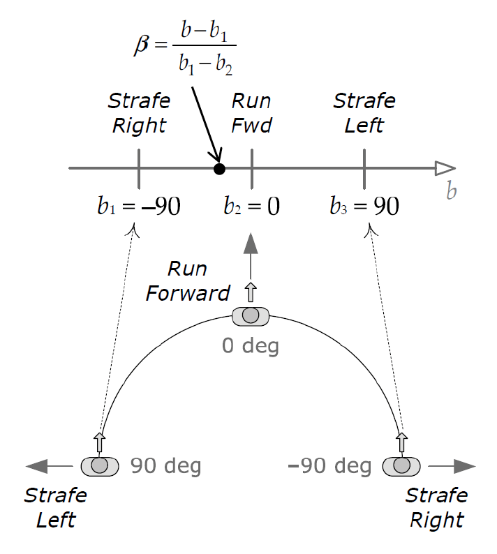{ align=right width=30% }

由于一个角色往往有多个动画片段，于是我们将上述方法泛化为一种叫做**混合空间**(blend space)的方法。

先来看**一维**的混合空间，此时只考虑**方向的移动**。我们可以只通过左移、前跑和右移这三个片段来混合得到任意角度的移动动画。

<div style="text-align: center">
    
</div>

现在玩家可同时改变角色的方向和速度了。


---
我们只需将 2 个一维混合空间正交放置，就能得到一个二维的混合空间。

<div style="text-align: center">
    
</div>

根据实际情况，我们需要调整这个二维的混合空间，使角色的动作看起来更真实。比如由于横向移动速度在前进方向较低，角色应在横向方向以较低的速度进入奔跑状态。

<div style="text-align: center">
    
</div>


### Masked Blending

现在考虑另一种情况：如下图所示，我们希望机器人不管位于何种姿态都能完成鼓掌的动画。实现这种效果的一种技术为骨架**遮罩混合**(masked blending)，比如把某个动画仅用于骨架的上半身，而另一个动画仅用于骨架的下半身，这样能够减少计算量。

<div style="text-align: center">
    
</div>

??? example "例子"

    <div style="text-align: center">
        
    </div>

    >おめでとう！


### Additive Blending

另外一种混合技术叫做**加法混合**(additive blending)，即通过向常规片段添加一个差值片段来生成一个新的片段。所谓的**差值片段**(difference clip)是指两个常规片段之间的差值。使用这种技术的目的是产生角色姿势和动作上的有趣变化。

<div style="text-align: center">
    
</div>

??? example "例子"

    现在机器人能够面朝相机点头了。

    <div style="text-align: center">
        
    </div>

但实现这种混合时需小心，避免过度叠加多个动画，否则会让某些关节的行为看上去是异常的。

<div style="text-align: center">
    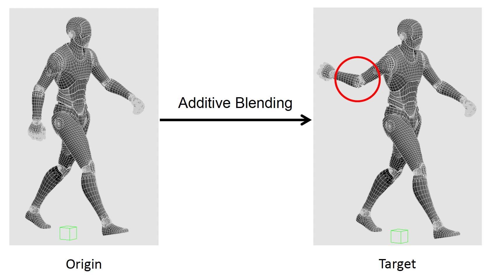
</div>


## Animation State Machine (ASM)

第二个要介绍的高级动画技术是**动画状态机**(animation state machine, **ASM**)。之所以需要这项技术，是因为在动画系统中很多时候会有多种状态在切换。以“跳跃(jump)”这一动画为例，这一动画不能定死，因为跳跃的场景可能是不同的。一般来说，跳跃分为起跳、在空中和落地这三个阶段，这三个阶段有各自独立的动画片段。这些片段不能用到前面的混合技术，因为这是一个依赖状态切换的问题，需要用状态机来建模。

<div style="text-align: center">
    
</div>

ASM 由节点和转移构成。

<div style="text-align: center">
    
</div>

- **节点**(nodes)类型
    - 混合空间
    - 片段

    ```cpp
    class ActionStateMachineClipNode {
        AnimationClip m_clip;
        bool m_is_loop;
    };

    class ActionStateMachineBlendSpaceNode {
        BlendSpace m_blend_space;
        bool m_is_loop;
    };
    ```


- **转移**(transition)类型
    - 从一个状态「**弹**」(pop)到另一个状态
    - 从一个状态**渐变**(cross-fade)到下一个状态
    - 特殊的转移状态

    ```cpp
    class ActionStateMachineTransition {
        int m_source_node_index;
        int m_target_node_index;
    };

    class ActionStateMachineTransitionWithCrossFade {
        int   m_source_node_index;
        int   m_target_node_index;
        float m_duration;
        Curve m_curve;
    };
    ```

其中渐变这一转移又有两种常见的方式（至于采用哪种方式则交给动画师决定）：

- **平滑转移**(smooth transition)：
    - 假如有两个动画片段 1 和 2，随着时间推移，1 的贡献量越来越少，2 的贡献量越来越大
    - 要求两个动画片段必须是循环的，且时间线必须是同步的
    - 但两个动画片段混合阶段形成的动画看上去可能不太自然

    <div style="text-align: center">
        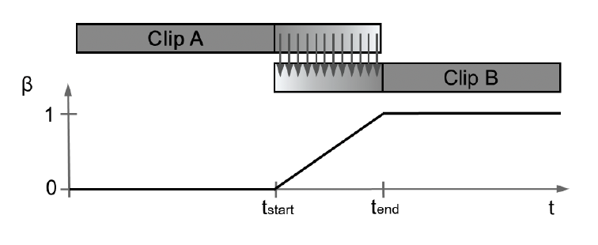
    </div>

- **固定转移**(frozen transition)：
    - 动画片段 1 停住，动画片段 2 逐渐进来

    <div style="text-align: center">
        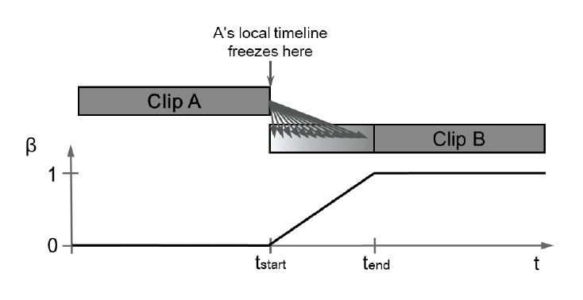
    </div>

??? example "例子"

    <div style="text-align: center">
        
    </div>

不同的渐变曲线能满足不同的需求：

<div style="text-align: center">
    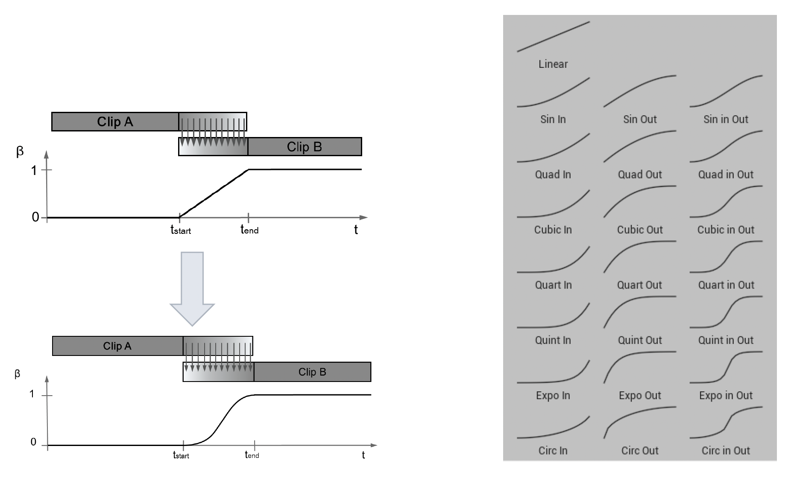
</div>

???+ info "UE 的 ASM"

    - 状态：一个输出姿态的蓝图
    - 转移：控制何时改变状态以及如何混合

    <div style="text-align: center">
        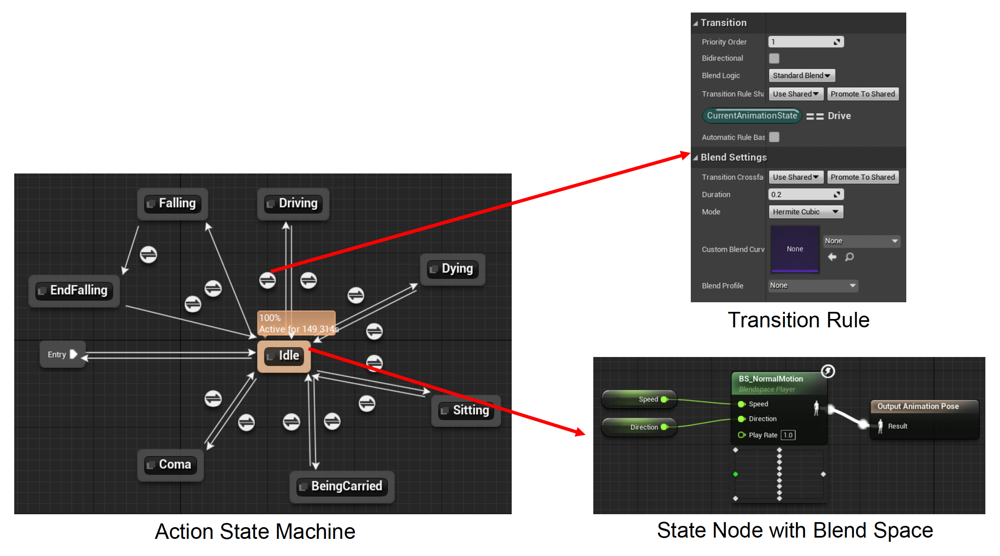
    </div>

以前游戏中会用一种叫做**分层**(layered) **ASM** 的技术控制角色动画，使得一个角色的不同身体部位可以同时进行不同的、独立或半独立的动作。

<div style="text-align: center">
    
</div>

??? example "例子"

    <div style="text-align: center">
        
    </div>


## Animation Blend Tree

更复杂的动画需要用**动画混合树**(animation blend tree)来表达。它的灵感可能来源于表达式树，这对动画师而言是容易理解的。在混合树中，节点分为**非终结节点**(non-terminal nodes)和**终结节点**(terminal nodes)（即叶节点），其中非终结节点的结果是一个姿态。

最简单且基础的节点是 **LERP 混合节点**，它以权重 $\beta$ 对两个输入姿态进行线性插值，得到一个输出姿态。并且这种节点通常能扩展成多输入（三个或四个）的形式。

<div style="text-align: center">
    
</div>

另一种基础非终结节点是**加法混合节点**(additive blend nodes)，以权重 $\beta$ 将第二个输入姿态（通常以一个差值的形式）添加到第一个姿态上，从而得到新的姿态。

<div style="text-align: center">
    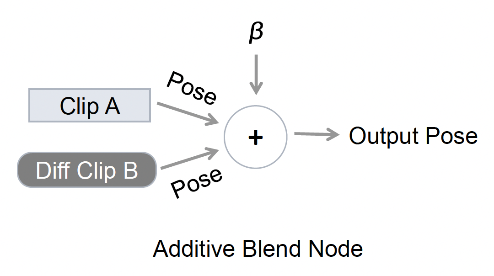
</div>

借助混合树，我们可以轻松表示分层的 ASM：

<div style="text-align: center">
    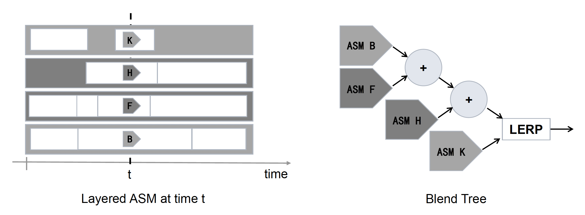
</div>

UE4 中的混合树节点：

- 终结节点
    - 片段
    - 混合空间
    - ASM
- 非终结节点
    - 二元 LERP 混合节点
    - 三元 LERP 混合节点
    - 二元加法混合节点

<div style="text-align: center">
    
</div>

???+ example "例子"

    <div style="text-align: center">
        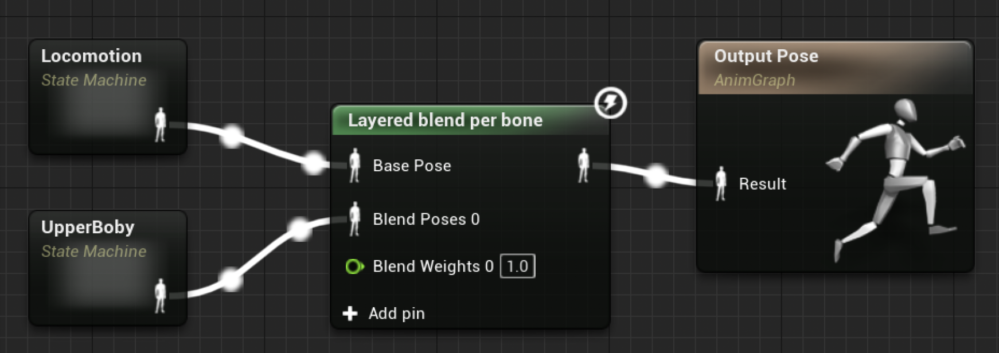
    </div>

混合树的控制参数：

- **节点搜索**(node search)：为高级代码提供一种在树中查找混合节点的方法
- **命名变量**(named variable)：允许将名称分配给各个控制参数；控制代码可以通过名称查找控制参数以调整其值
- **控制结构**(control structure)：一个简单的数据结构，包含整个角色的所有控制参数；将混合树中的节点连接到特定的控制参数

实际的动画混合树远比这复杂（还得考虑事件节点、计算/逻辑节点，以及特殊的混合和流控制节点等）。

在 UE 的动画蓝图控制中，命名变量是其中的一个成员，不仅能通过蓝图更新，还能被用于混合树内的任何地方。

<div style="text-align: center">
    
</div>

???+ example "UE5 的动画树"

    <div style="text-align: center">
        
    </div>


## Inverse Kinematics

- **末端执行器**(end-effector)：被移动到期望位置的骨头
- **反向运动学**(inversive kinematics, **IK**)：使用运动学方程**确定**机械臂(manipulator)的**关节参数**，以便末端执行器移动到期望位置
- **正向运动学**(forward kinematics)：使用运动学方程，根据指定的关节参数值**计算末端执行器的位置**

<div style="text-align: center">
    
</div>


### Two Bones IK

一个经典案例是角色在崎岖不平的地面或楼梯上行走，我们希望角色的脚总是能踩在地上而不是乱踩的、悬空的。最简单的方法是两根骨骼的 IK：假设大小腿各代表一个骨骼，两条边能确定第三条边，即大腿根部到目标点的距离。要计算大腿小腿各迈多少度，这就是一个简单的三角函数问题。

<div style="text-align: center">
    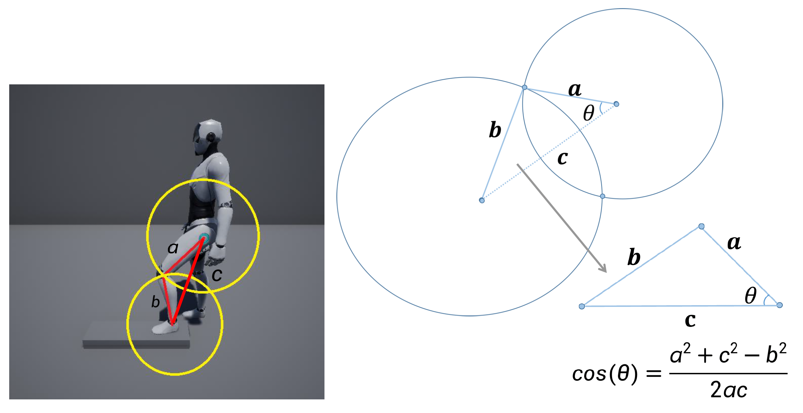
</div>

这个问题可以看作两个圆求交；而在三维空间中就是两个球求交，因此会出现多解问题，比如下面右图中角色无论是外八还是内八都可以到达目标点，艺术家肯定不会对此买账的。

<div style="text-align: center">
    
</div>

这时可通过引入一个**引用向量**(reference vector)来确定最终的姿态。

<div style="text-align: center">
    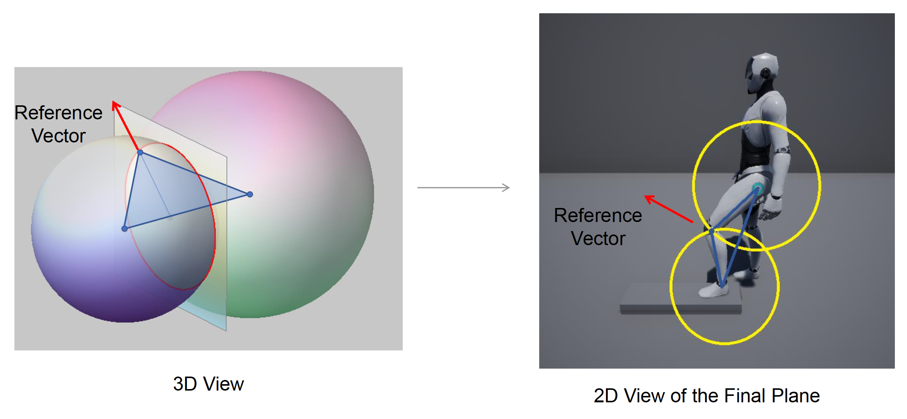
</div>


### Complexity and Constraints

但现实的 IK 情况往往比这更复杂：

<div style="text-align: center">
    
</div>

求解多关节 IK 问题的难点：

- 计算成本：需要实时求解这种高维的非线性函数
- 可能有多解/唯一解/无解的情况

<div style="text-align: center">
    
</div>

从起点到终点，有无数种可能的关节状态。在尝试每种可能前，首先要做的是检查骨骼是否能够得着目标点（**可到达性**(reachability)）。

<div style="text-align: center">
    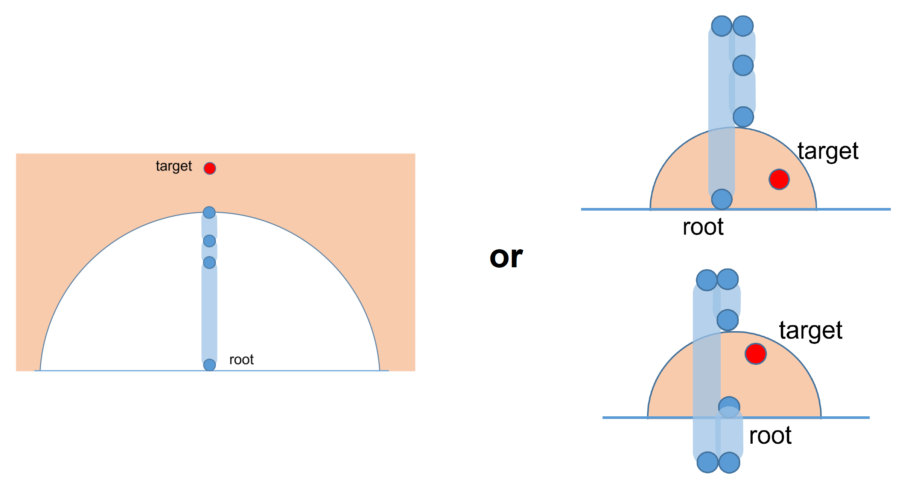
</div>

- 把所有骨骼拉直，看能否到达目标点；如果这样都够不到，那么无论怎么放置骨骼都不可能够得着（左图）
- 先放置最长的骨骼，然后拿剩余骨骼折叠放置；如果这些剩余骨骼未能完全覆盖最长骨骼，说明离根关节较近的区域存在盲区，位于盲区的关节点是够不到的（这一问题很容易被忽视，因此需引起注意）（右图）

另外得考虑（人体）骨架是有约束的。不是所有关节都能无死角旋转移动的，并且不同的关节有不同的活动范围。

<div style="text-align: center">
    
</div>

??? example "错误示范（乐）"

    <div style="text-align: center">
        
    </div>


### Solutions

下面给出求解 IK 的一些经典算法。首先要介绍的是**启发式**(heuristics)算法。因为直接用解析方法的话，一来不稳定，二来计算成本大；而启发式算法能够在以最优性、精度和解的完整性为代价，以更快更高效的方式求解问题。因此启发式算法

- 只能给出近似解
- 不保证全局最优性
- 迭代时通常设置一个最大限制


#### CCD

其中一种简单且著名算法是**循环坐标下降**(cyclic coordinate descent, CCD)。

- 原理：从关节到关节，将末端执行器旋转到尽可能接近目标的位置，在姿态空间中解决 IK 问题
- 可到达性：算法可以在迭代一定次数后停止，不会出现目标不可达的问题
- 约束：通过在每次迭代后检查进行角度限制

??? example "例子"

    <div style="text-align: center">
        
    </div>


#### Optimized CCD

在原有 CCD 的基础上可以采用多种优化技术，包括：

- 为每个骨骼目标增加一个**容差区域**(tolerance regions)
    - 骨骼停止旋转，并移动到容差区域内的下一个骨骼
    - 有助于产生更自然舒适的姿态

    <div style="text-align: center">
        
    </div>

- 使用**欠阻尼角度缩放**(under-damped angle scaling)
    - 每个关节只向目标移动一小段距离，并将运动分布在多个骨骼上
    - 产生更平缓的关节变化，并为角色动作设计更自然随意的姿态

    <div style="text-align: center">
        
    </div>


#### FABRIK

另一个知名算法是 **FABRIK**(forward and backward reaching inverse kinematics)。

- 原理：在位置空间（而非朝向空间）解决 IK 问题
    - 前向迭代：
        - 从端点开始，将第一个关节点强行拉到目标点所在位置
        - 然后在它的上一个关节点和目标点之间连一根线，将骨骼旋转到这根连线上
        - 但这样做这根骨骼就会脱离整个骨架，因此下一个骨骼需要将这个脱离骨骼的关节作为目标点，从而实现对接
        - 重复上述步骤，直到最后的根关节
    
    - 后向迭代：
        - 由于此时根关节也脱离了原来的位置，因此将原点作为目标点，就像前向迭代那样将一个个关节拉回来，但方向和前向迭代相反

    - 经过这么一趟迭代，根关节依然保持原位，而最末端关节会离目标点近很多；如果没有达到目标，那就再来一次或多次的前向/后向迭代，直到足够接近为止

- 可到达性：该算法同样可以在迭代一定次数后停止，不会出现目标不可达的问题

<div style="text-align: center">
    
</div>

>虽然 FABRIK 的作者宣称该算法效率更高，但业界还是用 CCD 的更多，且这位作者给出的测试数据来自 MATLAB 的模拟结果...


#### FABRIK with Constraints

FABRIC 和 CCD 一样可以考虑约束问题。比如可以在每一步通过取结果方向并强制其保持在有效范围内来实现对关节的限制（**重定位**(re-positioning)）。

<div style="text-align: center">
    
</div>


### Multiple End-Effectors

游戏中的 IK 问题还可更加复杂，比如有多个末端执行器。像下面左边第一幅图中，攀爬中的林克需要同时控制的 IK 点有 3-4 个甚至更多。这时候的难点在于：仅用上面的算法只能保证一个点够到，但其他点的位置会受到算法影响而偏来偏去。

<div style="text-align: center">
    
</div>

换句话说，如果一根共享骨骼需要被移动，最后更新的末端执行器将获得优先权，而其他骨骼会被拉开。

<div style="text-align: center">
    
</div>

解决有多个末端执行器的 IK 问题的经典方法是**雅可比矩阵**(Jacobian matrix)。在向量微积分中，多变量的向量值函数的雅可比矩阵是一个由该函数所有的一阶偏导数构成的矩阵。假设：

$$
\overrightarrow{f}(\overrightarrow{x}) = \begin{bmatrix}
f_1(\overrightarrow{x}) \\
f_2(\overrightarrow{x}) \\
\vdots \\
f_m(\overrightarrow{x})
\end{bmatrix} \quad \overrightarrow{x} = \begin{bmatrix}
x_1 \\
x_2 \\
\vdots \\
x_n
\end{bmatrix}
$$

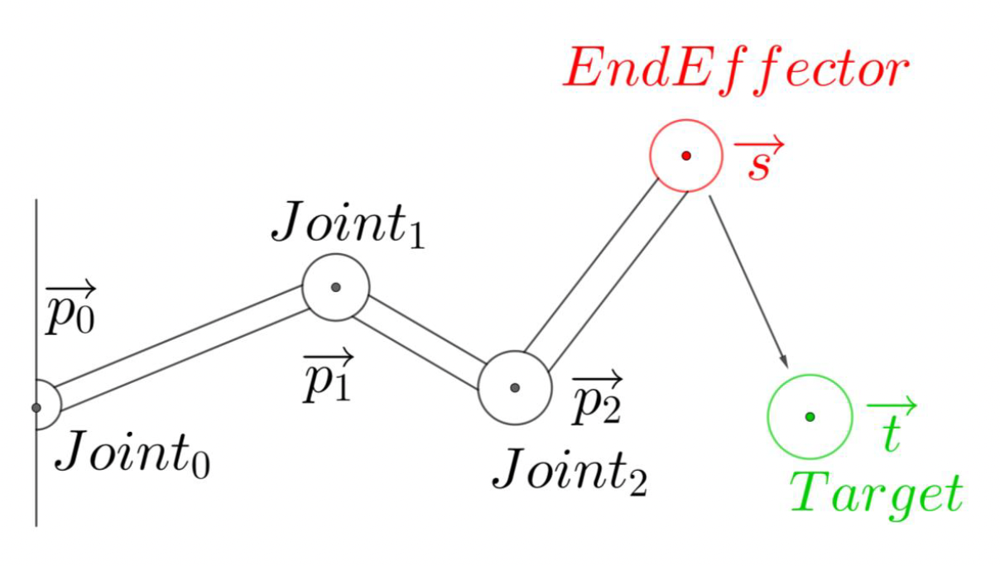{ align=right width=40% }

那么 $\overrightarrow{f}(\overrightarrow{x})$ 的雅可比矩阵为：

$$
J = \begin{bmatrix}
\frac{\partial f_1}{\partial x_1} & \frac{\partial f_1}{\partial x_2} & \dots & \frac{\partial f_1}{\partial x_n} \\
\frac{\partial f_2}{\partial x_1} & \frac{\partial f_2}{\partial x_2} & \dots & \frac{\partial f_2}{\partial x_n} \\
\vdots & \vdots & \ddots & \vdots \\
\frac{\partial f_m}{\partial x_1} & \frac{\partial f_m}{\partial x_2} & \dots & \frac{\partial f_m}{\partial x_n}
\end{bmatrix}
$$

用雅可比矩阵表示关节旋转：

<div style="text-align: center">
    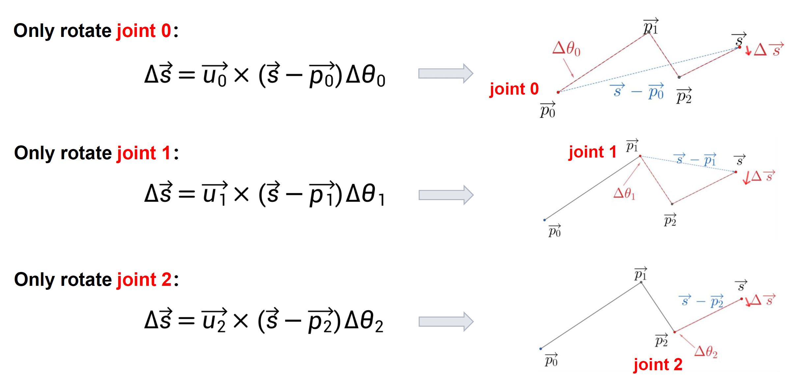
</div>

表示多末端执行器的雅可比矩阵（其中 $m, n$ 分别为末端执行器和关节的数量）：

$$
J = \begin{bmatrix}
\frac{\partial \overrightarrow{s_1}}{\partial \theta_1} & \frac{\partial \overrightarrow{s_1}}{\partial \theta_2} & \dots & \frac{\partial \overrightarrow{s_1}}{\partial \theta_n} \\
\frac{\partial \overrightarrow{s_2}}{\partial \theta_1} & \frac{\partial \overrightarrow{s_2}}{\partial \theta_2} & \dots & \frac{\partial \overrightarrow{s_2}}{\partial \theta_n} \\
\vdots & \vdots & \ddots & \vdots \\
\frac{\partial \overrightarrow{s_m}}{\partial \theta_1} & \frac{\partial \overrightarrow{s_m}}{\partial \theta_2} & \dots & \frac{\partial \overrightarrow{s_m}}{\partial \theta_n}
\end{bmatrix}
$$

现在 IK 问题的求解流程可用以下状态图表示：

<div style="text-align: center">
    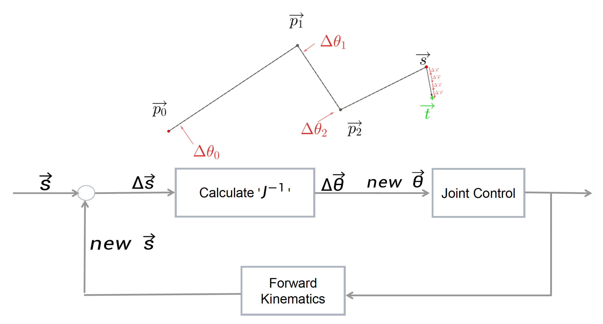
</div>


### Other IK Solutions

- **基于物理的方法**(physical-based method)：
    - 更加自然
    - 但如果没有任何优化，通常需要大量计算

- **基于位置的动力学**(position based dynamics, **PBD**)
    - 不同于传统的基于物理的方法
    - 更好的视觉表现
    - 更低的计算成本

- UE5 的全身(fullbody) IK —— **XPBD**（扩展(extended) PBD）

??? example "例子"

    <div style="text-align: center">
        
    </div>

---
???+ bug "IK 的挑战"

    - 自冲突避免(self collision avoidance)
    - 移动过程中带预测的 IK
    - 自然的人体行为
        - 数据驱动和深度学习

因此 IK 依然是一个热门的研究领域：

<div style="text-align: center">
    
</div>


## Facial Animation

人脸的表情是由复杂的肌肉系统驱动的。

<div style="text-align: center">
    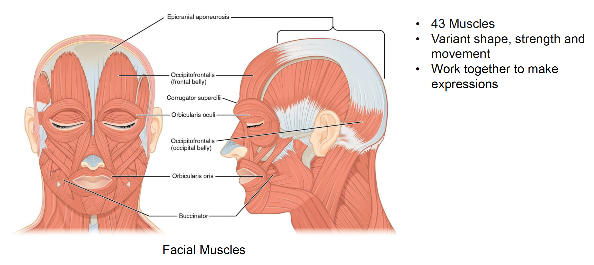
</div>

人脸的微小变化就能显现出截然不同的表情。

??? example "例子"

    <div style="text-align: center">
        
    </div>


### Facial Action Coding System (FACS)

由于对表情高精度的要求，所以在游戏中制作表情是一件难度不小的事。好在电影行业已经为我们建立了一套完整的系统，叫做**面部动作编码系统**(facial action coding system, **FACS**)。它是一种通过面部外观对人类面部运动进行分类的系统，将常见表情归类为 46 种动作单元(action unit, AU)。下图列举了部分 AU：

<div style="text-align: center">
    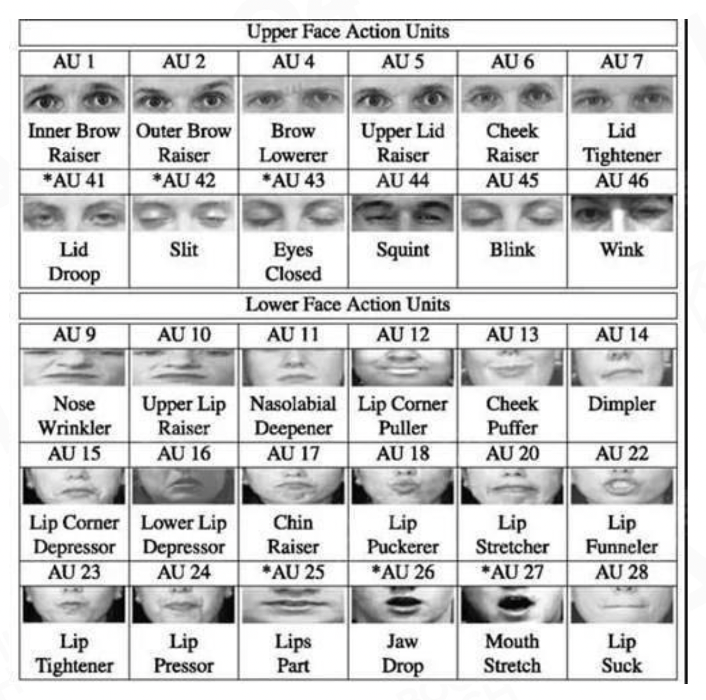
</div>

??? example "例子"

    <div style="text-align: center">
        
    </div>

任何表情都可视为这些 AU 的组合。

<div style="text-align: center">
    
</div>

而苹果公司从这 46 个 AU 中提取出 28 个核心的(core) AU，并发现其中有 23 个是对称的（青蓝色单元格）。实际上基本动作集根据动画制作的要求而有所不同。

<div style="text-align: center">
    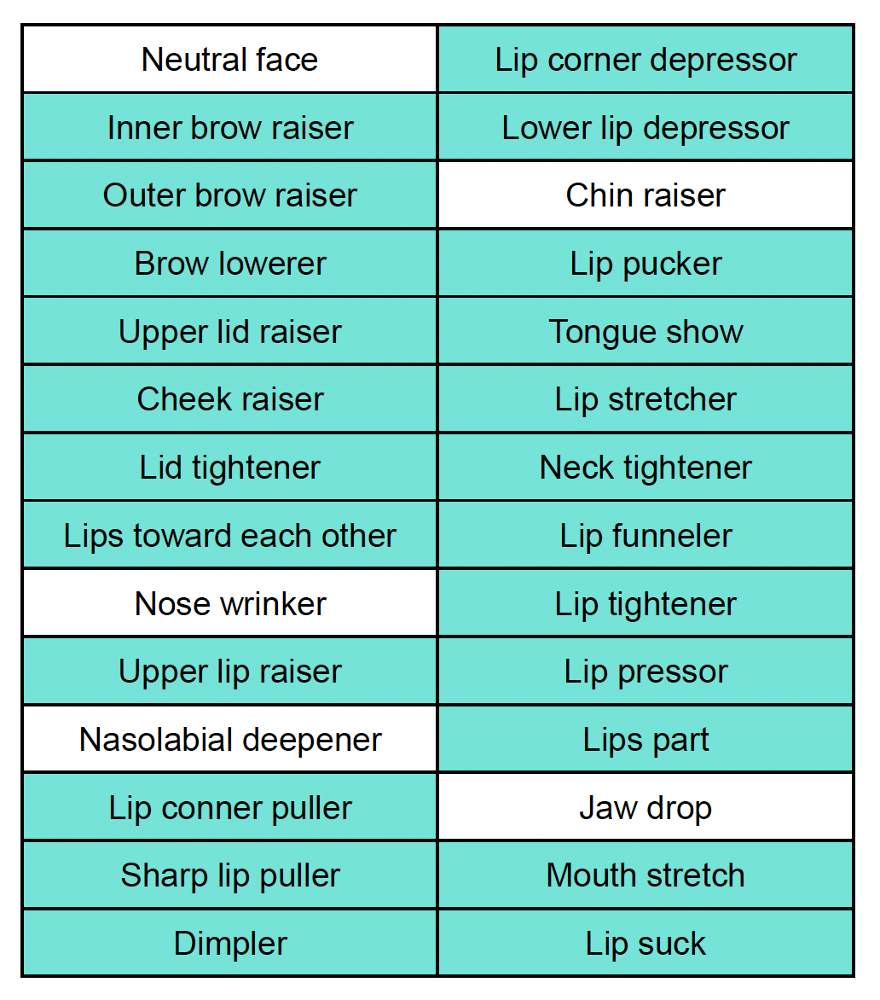
</div>


### Key Pose Blending

将 AU 组合的思路用到动画中，就是一种称为关键姿态混合(key pose blending)的技术。这些关键姿态是[逐顶点动画](8.md#per-vertex-animation)的变体。

<div style="text-align: center">
    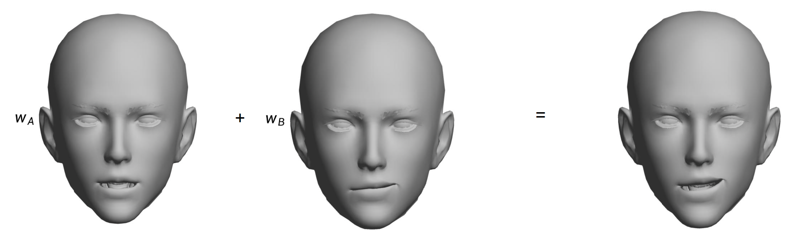
</div>

这种简单混合技术的问题是：有时我们不希望在混合时用到两张人脸的所有部分，比如只想用到第一个表情的嘴巴部分和第二个表情的眼睛部分。

<div style="text-align: center">
    
</div>


### FACS In Morph Target Animation

所以在形态目标动画中的做法是创建仅用于存储不同于中性姿态的顶点（偏移量）的 AU 关键帧（**加法混合**(additive blending)）。

<div style="text-align: center">
    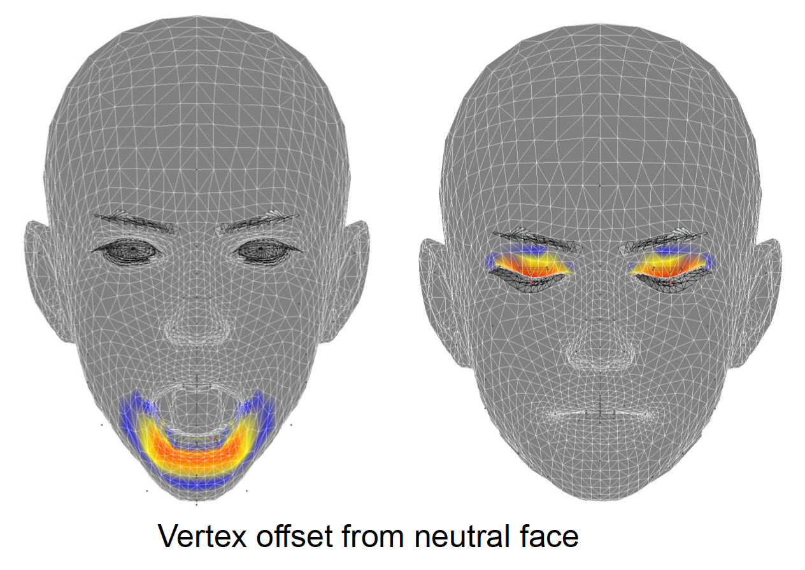
</div>

??? example "例子"

    <div style="text-align: center">
        
    </div>

???+ question "为什么不用骨骼动画"

    因为面部骨架结构过于复杂

    <div style="text-align: center">
        
    </div>


### UV Texture Facial Animation

如果制作的是 2D 动画，那么将一系列的**纹理贴图**应用于简单的头部形状上也能实现表现不错的面部表情系统，比之前介绍的方法更加实用高效。

??? example "例子"

    <div style="text-align: center">
        
    </div>


### Muscle Model Animation

一种更前沿但偏科研性质的技术是**肌肉模型动画**(muscle model animation)。它基于物理，能实现更精确但更复杂的面部表情。

- 肌肉能够控制大部分面部区域
- 分为 3 层：皮肤层、肌肉层、骨骼层
- 插入点的移动量由肌肉决定
- 用于皮肤的模型将决定插入点周围区域的肌肉反应

<div style="text-align: center">
    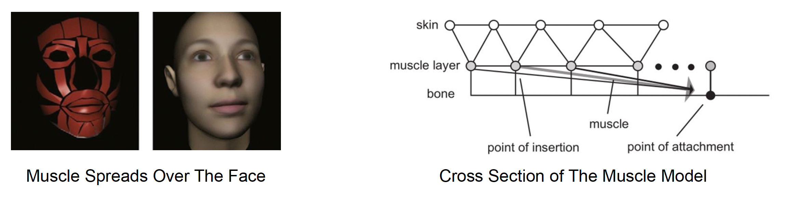
</div>

---
??? example "UE 的 Metahuman"

    >目前行业天花板的水平！

    <div style="text-align: center">
        
    </div>


## Animation Retargeting

动画**重定向**(retargeting)技术是指多个角色间共享（复用）相同的动画，不仅节省了动画师的负担，还能降低制作成本。

??? example "例子"

    <div style="text-align: center">
        
    </div>

基本术语：

<div style="text-align: center">
    
</div>

- 源角色(source character)
- 目标角色(target character)
- 源动画(source animation)
- 目标动画(target animation)

进行重定向时，我们可以忽略因角色体型不同等导致的源和目标的关节之间的偏移。

<div style="text-align: center">
    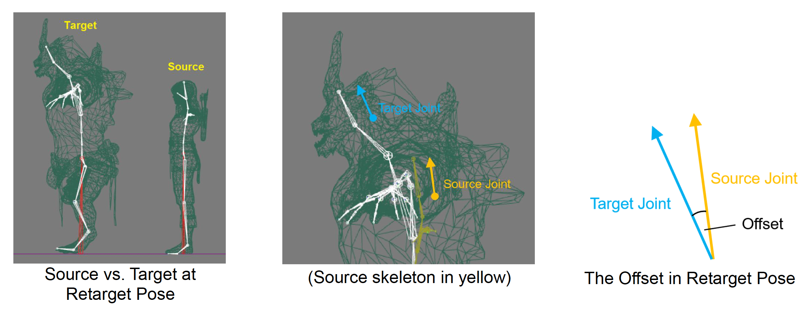
</div>

基于相同的理由，在应用动画时需要相对于原始绑定姿态相同的朝向。

<div style="text-align: center">
    
</div>

接下来需要分别处理各个动画轨道：

- **旋转**轨迹：来自源动画，保持动画中的关节方向
- **平移**轨迹：来自目标骨骼，保持目标骨骼的比例
- **缩放**轨迹：来自源动画，保持动画中的缩放

??? example "例子"

    <div style="text-align: center">
        
    </div>

角色的移动需要和骨盆关节高度对齐。

- 角色的移动通常在运行时由位移曲线或马达系统控制，其中位移曲线是从动画的骨盆姿态中提取的
- 需按骨盆的比例进行缩放，否则可能出现脚悬空等问题

<div style="text-align: center">
    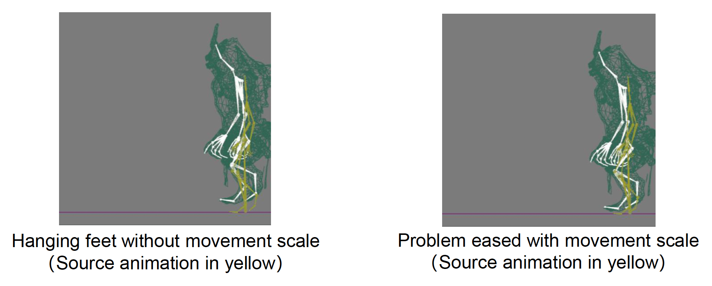
</div>

有时因角色之间体型相差太大，即便缩放后脚也没有正常着地，因此在重定向后还需利用 [**IK**](#inverse-kinematics) 将脚「锁」在地上。

<div style="text-align: center">
    
</div>

??? example "例子"

    <div style="text-align: center">
        
    </div>

有时会遇到两个角色骨架结构截然不同的情况。

???+ example "例子"

    <div style="text-align: center">
        
    </div>

- 一种简单的解决方案是根据骨骼名称对应，找到共同的骨骼（左图）
- 而 NVIDIA 的 **Omniverse** 给出的解决方案是将名称相同的所有骨骼看作一个映射，范围均为 [0, 1]（右图）

<div style="text-align: center">
    
</div>

??? example "使用 Omniverse 进行动画重定向的效果"

    <div style="text-align: center">
        
    </div>

???+ bug "重定位中未解决的问题"

    - 自网格穿透(self mesh penetration)
    - 自接触约束(self contact constraits)（例如，拍手时的手）
    - 目标角色的平衡

    <div style="text-align: center">
        
    </div>


### Morph Animation Retargeting

动画重定向也可用在面部表情上，因为即便是不同的脸型也有着相同的拓扑结构。

<div style="text-align: center">
    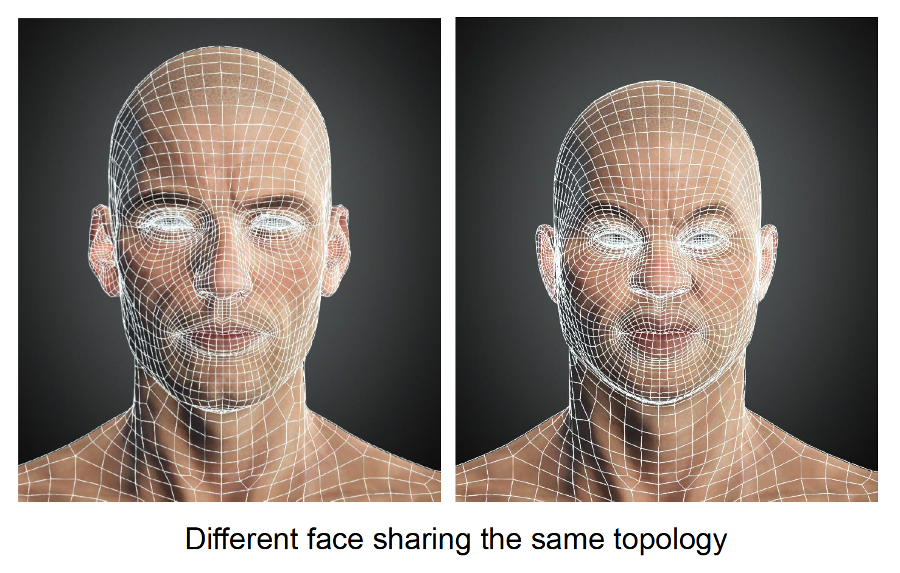
</div>

但形态动画重定向同样存在一些问题：

<div style="text-align: center">
    
</div>