# Graphics and Image Data Representation

## Basic Graphics/Image Types

### 1-Bit Image

1 比特图像又称**二值图像**(binary image)或**单色图像**(monochrome image)。

<div style="text-align: center">
    
</div>

特点：

- 由**开启和关闭**像素组成（**像素**(pixel)：数字图像中的图像元素）
- 每个像素**用 1 个比特存储**，0 表示黑色，1 表示白色

<div style="text-align: center">
    
</div>

对于一张**分辨率**(resolution)为 640x480 的图像，其存储空间为 640 * 480 / 8 = 38.4 KB。

此类图像的用途是作为仅包含简单图形和文本的图片。


### 8-Bit Grey-Level Image

<div style="text-align: center">
    
</div>

特点：

- 每个像素由一个字节表示，因此灰度值介于 **0 到 255** 之间
- 整张图像可视为一个**二维**像素值**数组**，称为**位图**(bitmap)

    <div style="text-align: center">
        
    </div>

- 8 比特图像可看作由一组 1 位**位平面**(bitplane)构成
    - 每个平面包含图像在某一层级上的 **1 位表示**
    - 所有位平面共同**构成一个字节**，用于存储 0 至 255 之间的数值

    <div style="text-align: center">
        
    </div>

大小：

- 分辨率
    - 高分辨率：1600x1200
    - 低分辨率：640x480
    - **宽高比**(aspect ratio)：4:3

- 640x480 的灰度图像需要的空间为 640 * 480 = 307,200 字节
- 存储图像数组的硬件被称为**帧缓冲区**(framebuffer)或「视频」卡


#### Printing

用二级（1 比特）打印机打印 8 比特的灰度图像是很复杂的。解决步骤如下：

- 使用**抖动**(dithering)：用更大的图案替换单个像素，例如 2x2 或 4x4 的网格，使得打印点的数量能够近似模拟**半色调印刷**(halftone printing)（如报纸照片）中使用的不同大小的墨点
- 将**色彩/强度分辨率**(color/intensity resolution)转换为**空间分辨率**(spatial resolution)
    - N * N 的矩阵表示 N^2^ + 1 中强度等级，比如 2x2 的图案能表示 5 个等级 

        <div style="text-align: center">
            
        </div>

    - 首先可以将图像值从 [0, 255] 重新映射到新的范围 [0, 4]（通过整除 256 / 5 实现）；若像素值为 0，则在打印输出的 2x2 区域内不打印任何点；但若像素值为 4，则打印所有四个点
    - 若强度大于抖动矩阵的对应项，则在该位置打印一个实心点(an on dot)：将每个像素替换为一个 nxn 的点阵
    - 上述方法会**增大输出图像大小**——如果一个像素使用 4x4 图案处理，那么 NxN 的图像尺寸将变为 4Nx4N，使图像面积扩大 16 倍

- 一种更好的方法：避免放大输出图像
    - 存储一个整数矩阵（标准图案），值范围仍为 [0, 255]
    - **将灰度图像矩阵与图案进行比较**，当值大于灰色值时打印点

    <div style="text-align: center">
        
    </div>

下面给出有序抖动算法（采用 nxn 的抖动矩阵）：

```py
for x in 0...x_max:
    for y in 0...y_max:
        i = x % n
        j = y % n
        # I(x, y) is the input, O(x, y) is the output,
        # D is the dither matrix
        if I(x, y) > D(i, j):
            O(x, y) = 1
        else:
            O(x, y) = 0
```


???+ example "例子"

    === "例1"

        === "问题"

            在一台 300\*300 DPI（每英寸点数(dots per inch)）的打印机上，将一张图像（240\*180\*8位）打印在 12.8\*9.6 英寸的纸上，每个像素（点）的大小是多少？

        === "解答"

            - (300\*12.8) \* (300\*9.6) = 3480\*2880 dots
            - (3840/240) \* (2880/180) = 16\*16 = 256

    === "例2"

        使用标准矩阵生成输出图像：

        <div style="text-align: center">
            
        </div>

    === "例3"

        === "问题"

            在 8\*6 英寸的纸上打印一张图像（600\*450像素，8位色深）使用分辨率为 300\*300 DPI 的打印机，每个像素点的大小是多少？

        === "解答"

            - (300\*8) \* (300\*6) = 2400\*1800 dots
            - (2400/600) \* (1800/450) = 4\*4 => 只有 17 个等级


### 24-Bit Color Image

特点：每个像素使用**三个字节**，分别代表红绿蓝（RGB），取值范围为 0 至 255，因此支持 256\*256\*256 种颜色（共计 16,777,216 色）。

<div style="text-align: center">
    
</div>

大小：

- 一张 640x480 的 24 比特彩色图像占 921.6KB（640\*480\*3）大小
- 许多 24 位彩色图像实际上以 32 位图像格式存储
    - 每个像素可能还会额外**存储 $\alpha$ 值**，表示特效信息，比如**透明度标志**(transparency flag)等

        <div style="text-align: center">
            
        </div>

    - 半透明图像颜色 = 源图像颜色 \* (100% - 透明度) + 背景图像颜色 \* 透明度

???+ example "例子"

    <div style="text-align: center">
        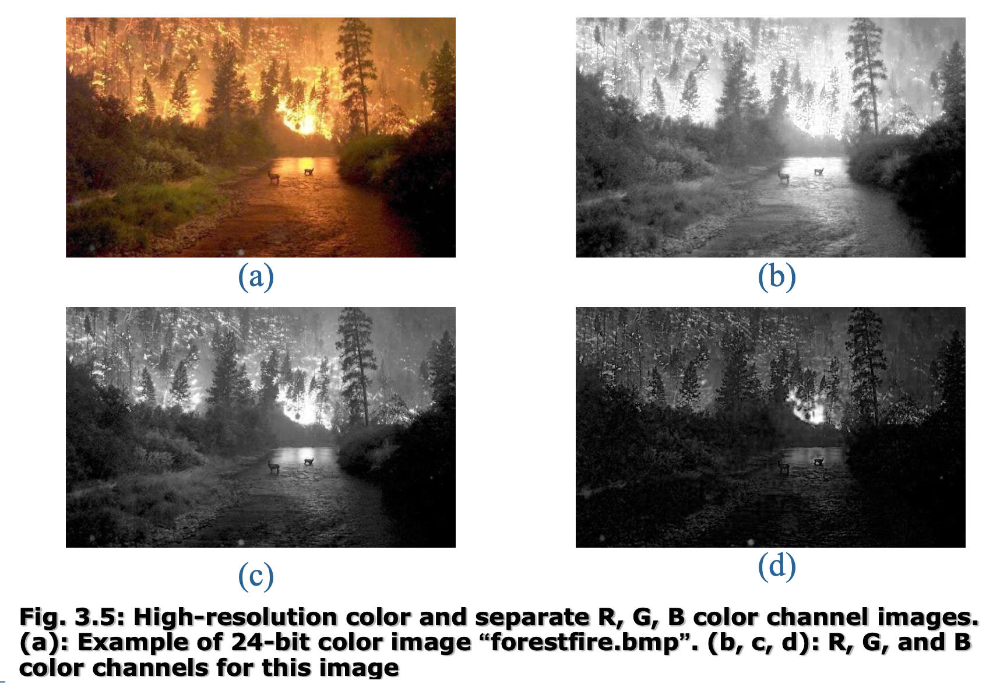
    </div>


### 8-Bit Color Image

特点：

- 使用**查找表**(lookup table, **LUT**)（**调色板**(palette)）
    - 图像存储的是一组字节，而非实际颜色
    - 字节值作为指向 3 字节颜色表的索引
    - **选择放入表中的颜色至关重要**

- 选取最重要的 256 种颜色，可选的方法有：
    - 通过对 256×256×256 种色彩进行**聚类**(clustering)生成
    - 采用**中位切分**(median-cut)算法或更精确版本

相比 24 位图像，8 位图像节省了很大的空间。比如一张 640\*480 的 8 位彩色图像仅需 300KB 存储空间，而同等尺寸的彩色图像（同样未应用任何压缩）则需要 921.6KB。

??? example "例子"

    <div style="text-align: center">
        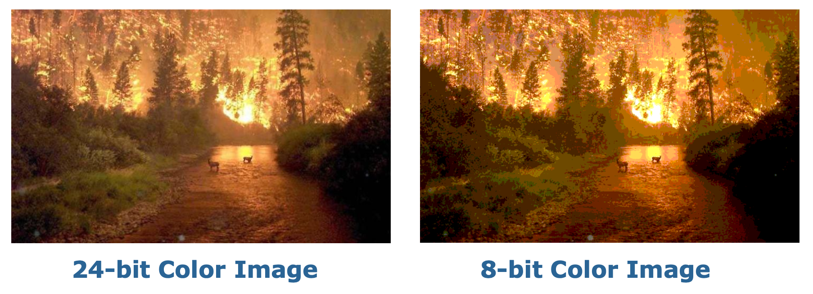
    </div>

8 位彩色图像采用的方法是仅存储每个像素的索引或代码值。例如，若某像素存储值为 25，其含义即指向颜色查找表（LUT）中的第 25 行。

<div style="text-align: center">
    
</div>

由于 LUT 小于图像，具有速度优势，因此我们可**通过调整 LUT 来改变颜色**。

???+ example "例子"

    === "例1"

        医学影像（将灰度图转换为彩色图）

        <div style="text-align: center">
            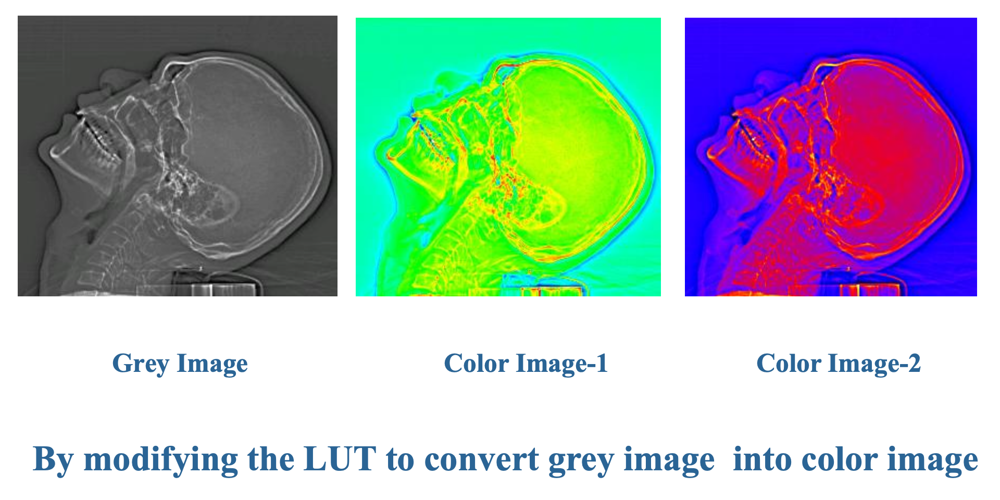
        </div>

    === "例2"

        <div style="text-align: center">
            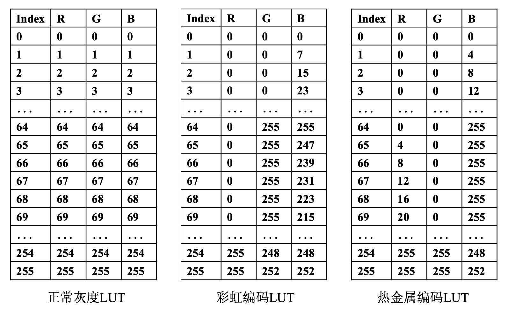
        </div>

---

{ align=right width=30% }

创建颜色 LUT 的基本思路是**聚类**(clustering)，即分析 RGB 色彩的三维直方图，但这是一个计算成本高且耗时的过程，因此不太现实。

将 24 位色转换为 8 位查找表颜色的最直接的方法是：将 RGB 立方体沿每个维度等分切片。

- 所得每个小立方体的中心点可作为颜色查找表的条目，而只需将 RGB 范围 [0, 255] 缩放至相应区间即可生成 8 位编码
- 由于人眼对 R 和 G 的敏感度高于 B，我们可以将 R 和 G 的范围 [0, 255] 压缩至 3 位范围 [0, 7]，同时将 B 范围压缩至 2 位范围 [0, 3]，从而构成总计 8 位的编码

    <div style="text-align: center">
        
    </div>

- 要压缩 R 和 G 值，只需将 R 或 G 字节值除以 (256/8)=32 后截断取整，这样图像中的每个像素都会被其对应的 8 位索引替换，而颜色查找表则用于还原生成 24 位色彩

<div style="text-align: center">
    
</div>

???+ example "例子"

    === "例1"

        - R: 16, 48, 80, 112, 144, 176, 208, 240
        - G: 16, 48, 80, 112, 144, 176, 208, 240
        - B: 32, 96, 160, 224

        因此颜色为 [30, 129, 80] 的像素应转换为 [16, 112, 96]

    === "例2"

        <div style="text-align: center">
            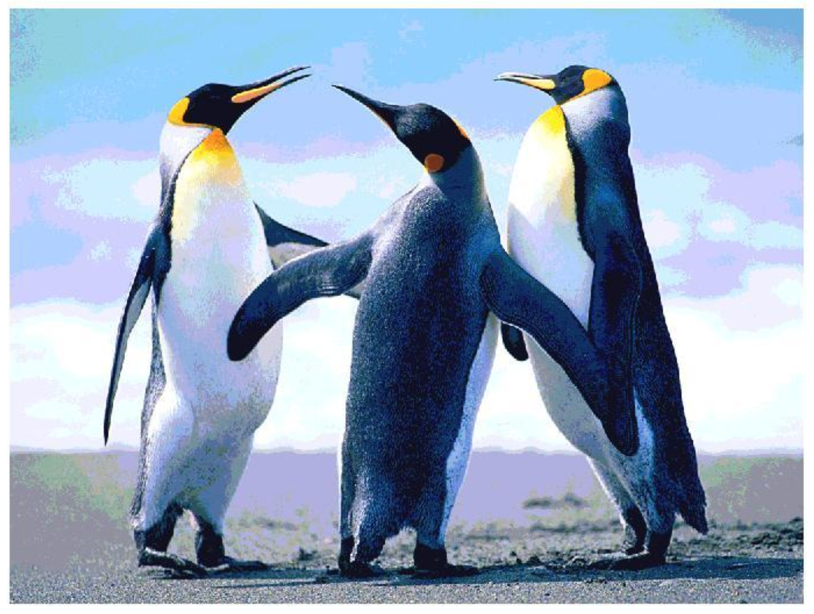
        </div>

为取得更好的效果，我们引入了**中位切分算法**(median-cut algorithm)：

- 先根据 R（红色）字节对所有像素进行排序，并找出其中位数：小于中位数的值标记为 `0` 位，大于中位数的值则标记为 `1` 位
- 再根据 G（绿色）字节分别对前一步得到的两部分像素进行排序；最后根据 B（蓝色）字节分别对前一步得到的四部分（2x2）像素进行排序
- 这样能将比特集中在最需要区分大量相近颜色的区域
- 通过使用显示 [0, 255] 位置计数的直方图，可以最直观地理解寻找中位数的过程；下图展示了某 bmp 图像中 R 字节值的直方图，并以垂直线标示了这些数值的中位数

<div style="text-align: center">
    
</div>

<div style="text-align: center">
    
</div>


## Popular File Formats

### GIF

**GIF**（图形交换格式(Graphics Interchange Format)）

- 由 UNISYS 公司与 Compuserve 于 1987 年发明
- 最初通过电话线传输图形图像
- 不属于任何应用程序，目前几乎所有相关软件均支持此格式
- 采用 **LZW**（Lempel-Ziv-Welch）**压缩算法**
    - 该算法为无损压缩，支持连续色调，压缩率约为 50 %

- 仅限于 8 位（256 色）彩色图像
    - GIF图像色彩深度从 1 位到 8 位不等
    - GIF图像最多支持 256 种颜色

- **交错**(interlacing)
    - 解码速度快
    - 采用交错方式存储
    - 可分**四趟**(pass)渐进显示

- **GIF89a** 支持动画功能
    - 在单一图像文件中存储多幅彩色图像

???+ example "例子"

    一张 120\*60 的 GIF 图像：

    <div style="text-align: center">
        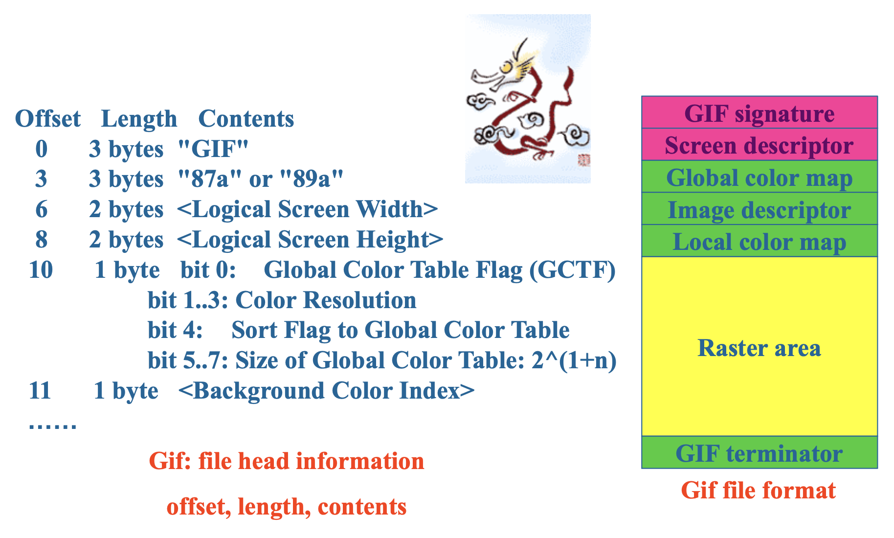
    </div>

    <div style="text-align: center">
        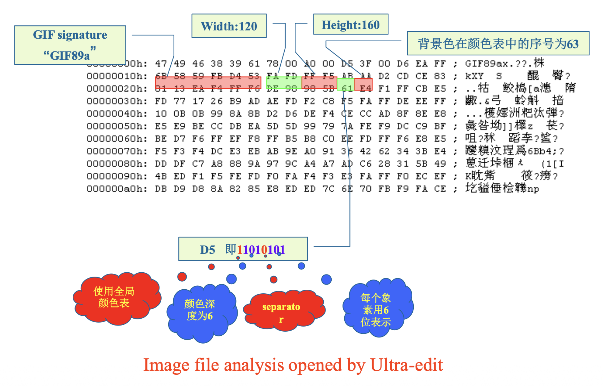
    </div>


### JPEG

**JPEG**（联合图像专家组(Joint Photographic Experts Group)）

- 由国际标准化组织（ISO）的任务小组创建
- 利用人类视觉系统的某些局限性
- 实现高压缩率，采用一种**有损压缩**方法，允许用户设置所需的质量水平或压缩比（输入除以输出）

???+ example "例子"

    === "例1"

        <div style="text-align: center">
            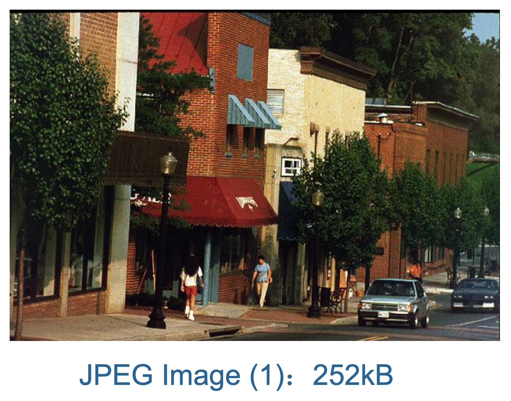
        </div>

    === "例2"

        <div style="text-align: center">
            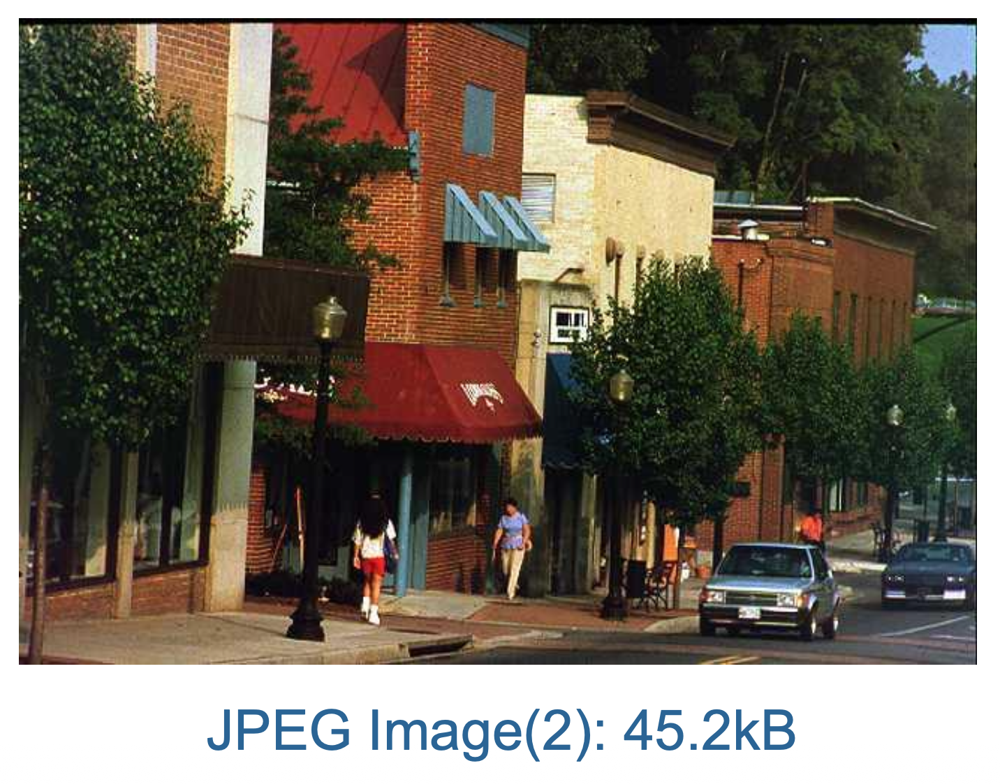
        </div>

    === "例3"

        <div style="text-align: center">
            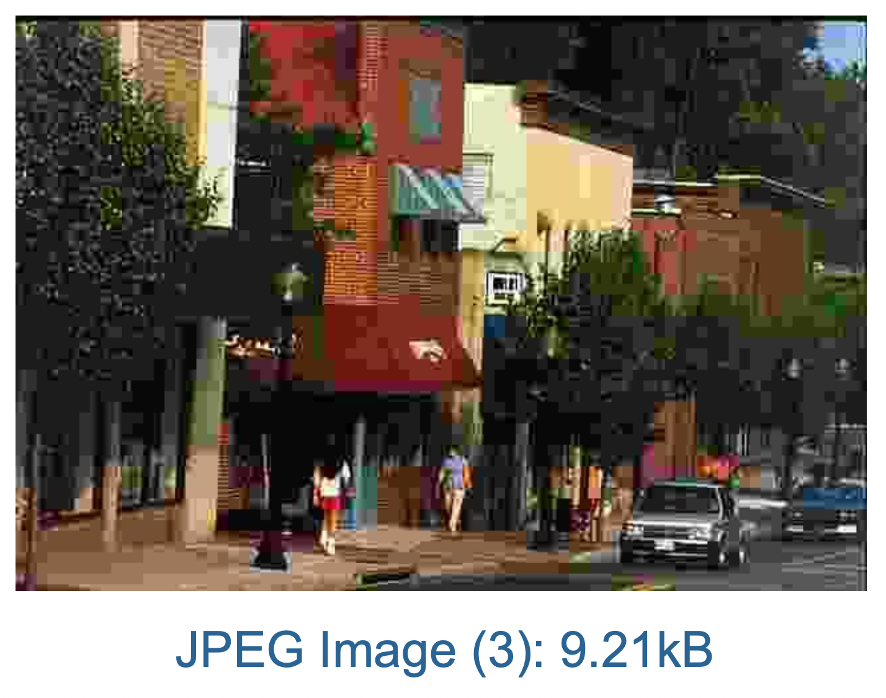
        </div>


### BMP

- 由微软发明，作为 Windows 的主要图像格式，可存储 1 位、4 位、8 位以及真彩色数据
- 三种存储形式：
    - **未经压缩的原始数据**：最为常见
    - **BI-RLE8**：用于 8 位图像（256色）的**行程长度编码**(run length encoding, RLE)
    - **BI_RLE4**：用于 4 位图像（16 色）的 RLE

- BMP 文件由四个部分组成：
    - **文件头**(file head)：类型及其他信息
    - **位图信息头**(information head of bitmap)：长度、宽度、压缩算法等
    - **调色板**：颜色查找表，24 位真彩色图像无调色板
    - **图像数据**：真彩色图像存储 (R, G, B) 三个分量，带调色板的图像存储指向调色板的索引

???+ example "例子"

    128*128 的灰度图：

    <div style="text-align: center">
        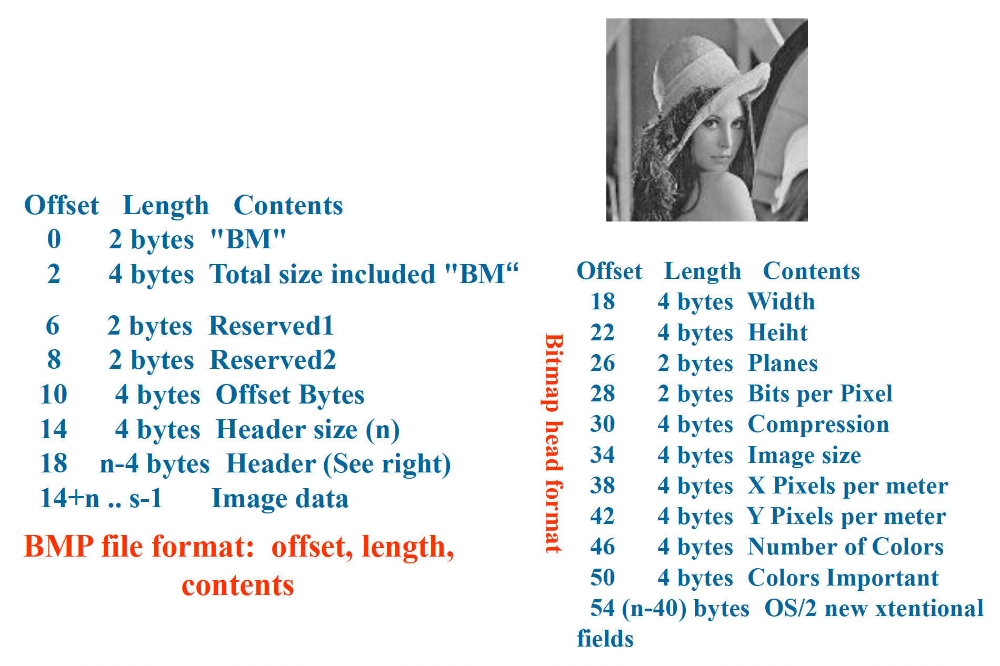
    </div>

    <div style="text-align: center">
        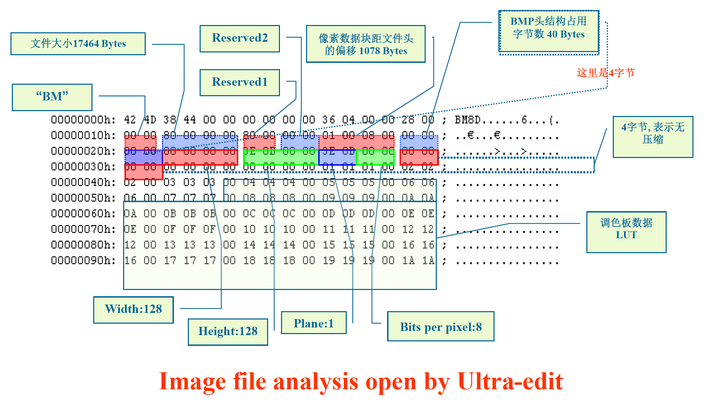
    </div>


### Other Typical Image Formats

- **PNG**（便携式网络图形(portable network graphics)）
- **TIFF**（标记图像文件格式(tagged image file format)）
- **EXIF**（可交换图像文件格式(exchange image file)）
- 其他...