# Color in Image and Video

## Color Science

### Light and Spectra

光是一种**电磁波**(electromagnetic wave)，其颜色由**波长**(wavelength)决定。

- 激光光束只有单一的波长
- 大多数光源是由多个波长的光组合而成的
- 短波偏蓝色，长波偏红色
- 可见光范围为 400-700 nm

    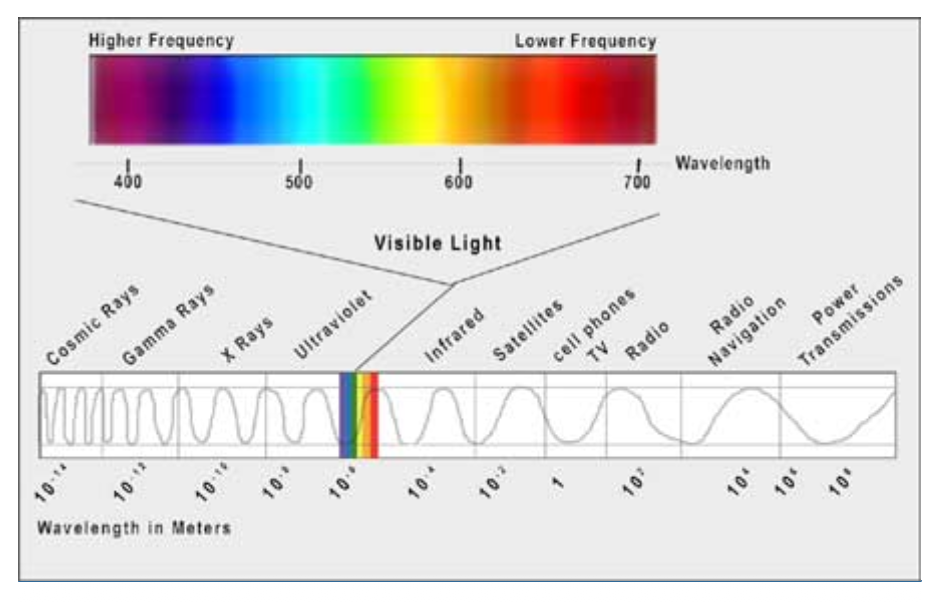

**分光光度计**(spectrophotometer)是一种通过衍射光栅(diffraction grating)（刻有规则线条的表面）反射光线，将不同波长的光分散开来，从而测量可见光的设备。

    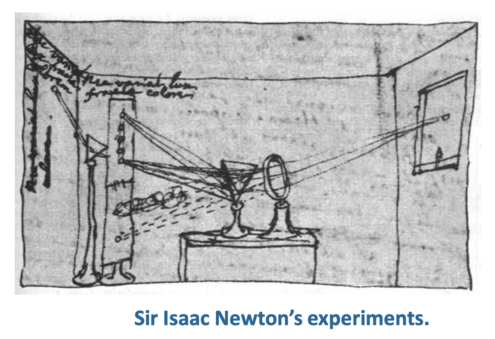

**光谱功率分布**(spectral power distribution, **SPD**)展示了每个波长区间内的相对功率，对应的曲线记作 $E(\lambda)$（$\lambda$ 表示波长）。

    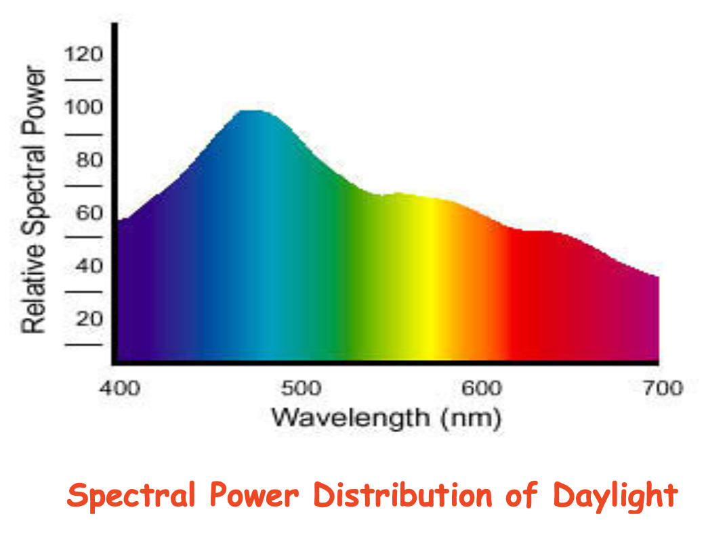

#### Human Vision

人眼的工作原理和相机类似，由「**镜头**」(lens)（晶状体）将光线汇聚到**视网膜**(retina)上。

    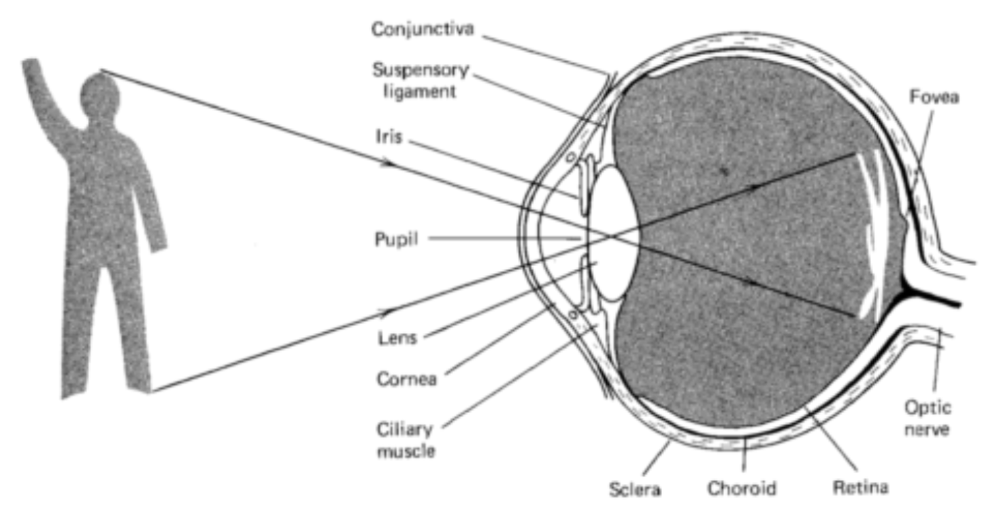

视网膜由**视杆细胞**(rods)和**视锥细胞**(cones)构成。

    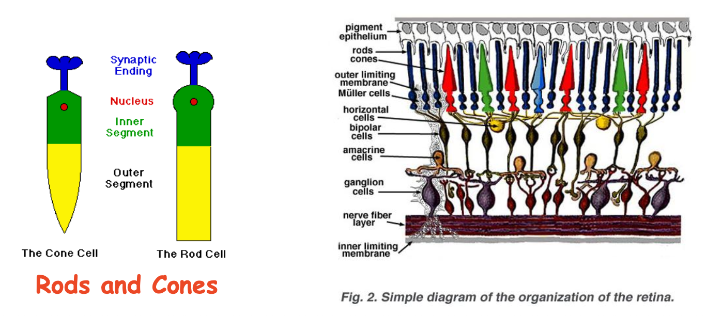

- **视杆细胞**：
    - 当光线较暗时发挥作用
    - 能感知更宽的波长范围
    - 产生灰度图像（即只能感知黑白变化）

- **视锥细胞**：
    - 当光线较亮时发挥作用
    - 有三种类型的视锥细胞，分别对红（R）、绿（G）和蓝（B）光最为敏感
    - 人眼中大约有 600 万视锥细胞，R:G:B = 40:20:1

    

        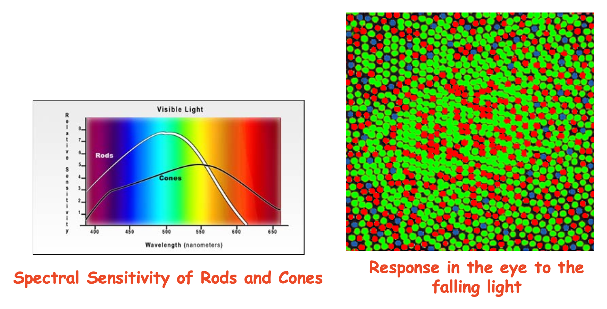
    

#### Spectral Sensitivity of the Eye

人眼的光谱敏感度特点：

- 对可见光谱的**中段**最为敏感
- 我们感光细胞的灵敏度也是一个关于波长的函数
- 一般用**发光效率函数**(luminous-efficiency function)展示了整体的敏感度曲线
- 蓝色感光细胞灵敏度未按比例显示，因为其数值远低于红色或绿色曲线

    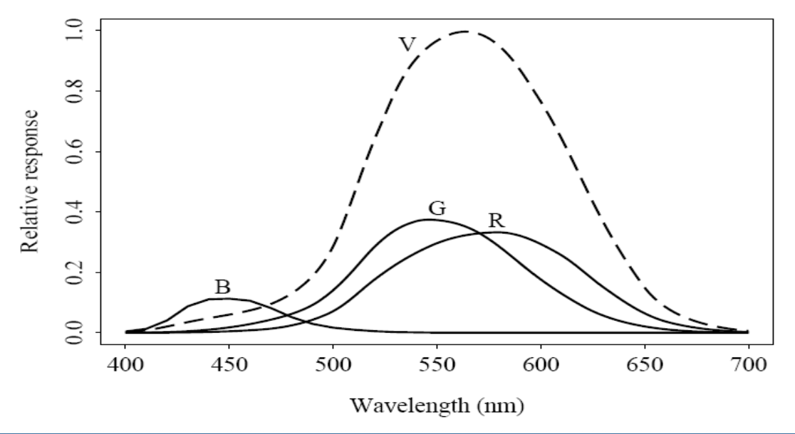

光谱敏感度函数通常用字母而非 R, G, B 表示。设向量函数 $q(\lambda)$，其分量为：

$$
q(\lambda) = (q_R(\lambda), q_G(\lambda), q_B(\lambda))^\top
$$

眼睛中每个颜色通道的响应与神经元放电的数量成正比。我们可以用积分的形式简洁地表达这一想法：

$$
\begin{aligned}
R & = \int E(\lambda) q_R(\lambda) d \lambda \\
G & = \int E(\lambda) q_G(\lambda) d \lambda \\
B & = \int E(\lambda) q_B(\lambda) d \lambda
\end{aligned}
$$

#### Image Formation

表面在不同波长下反射不同量的光线。一般来说深色表面比浅色表面反射的能量少。下图展示了橙色运动鞋和褪色的蓝色牛仔裤的表面光谱反射率（该反射函数记作 $S(\lambda)$）：

    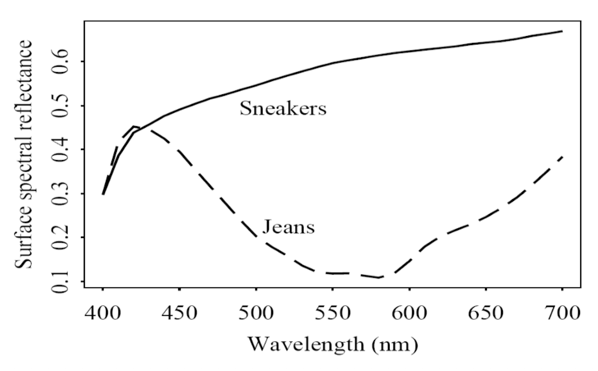

光源发出的光，其光谱功率分布为 $E(\lambda)$，照射到表面后，经过表面光谱反射函数 $S(\lambda)$ 的反射，再通过人眼视锥细胞的光谱敏感度函数 $q(\lambda)$ 进行过滤。

    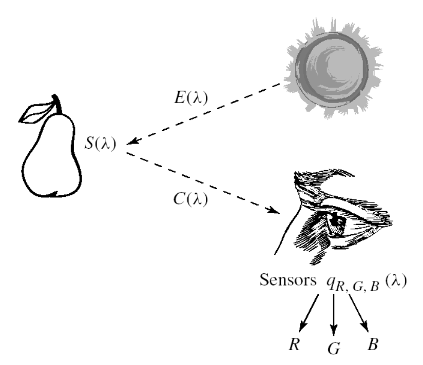

函数 $C(\lambda)$ 被称为颜色信号，由光源 $E(\lambda)$ 与反射率 $S(\lambda)$ 的乘积构成：$C(\lambda) = E(\lambda)S(\lambda)$。

最终我们得到以下成像模型的方程：

$$
\begin{aligned}
R & = \int E(\lambda) S(\lambda) q_R(\lambda) d \lambda \\
G & = \int E(\lambda) S(\lambda) q_G(\lambda) d \lambda \\
B & = \int E(\lambda) S(\lambda) q_B(\lambda) d \lambda
\end{aligned}
$$

#### Camera System

- 相机系统以类似的方式制造：一台专业机相机在每个像素位置产生三个信号（对应视网膜位置）
- 模拟信号被转换为数字，截断为整数并存储；若使用的精度是 8 位，那么 R、G、B 的最大值是 255，最小值是 0

### Gamma Correction

CRT（阴极射线管）显示器将 RGB 数值转换回模拟信号（电压），驱动 CRT 中的电子枪。

    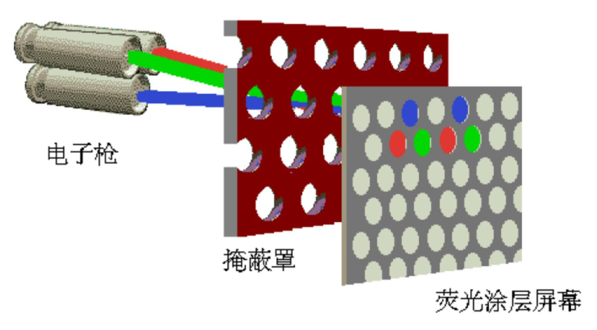

**光线与电压应呈线性关系**，但 CRT 的光却不和驱动电源呈线性关系，而是和电压的幂次 $R^\gamma$ 成正比。这个幂指数被称为 **gamma**，记作 $\gamma$，其值约为 2.2。

??? question "为什么设置成 2.2"

    实际值会更接近 2.8（= 1.25 * 2.2），而 2.8 更符合人眼的感知。这个 1.25 是一个补偿系数，来自系统对图像暗部的「压低」（使图像更有对比度和立体感）。

    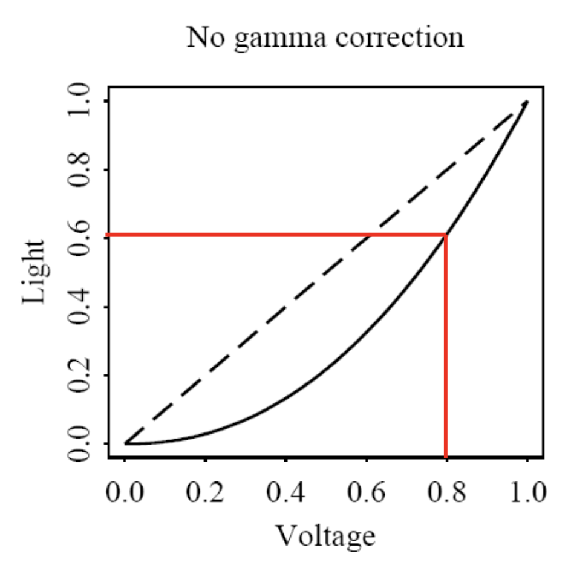

信号的“伽马校正”：在传输前，通常会在经过 $\dfrac{1}{\gamma}$ 次幂的**伽马校正**的信号后加上撇号。因此我们得到线性信号：$R \rightarrow R' = R^{1/\gamma} \Rightarrow (R')^\gamma \rightarrow R$。

    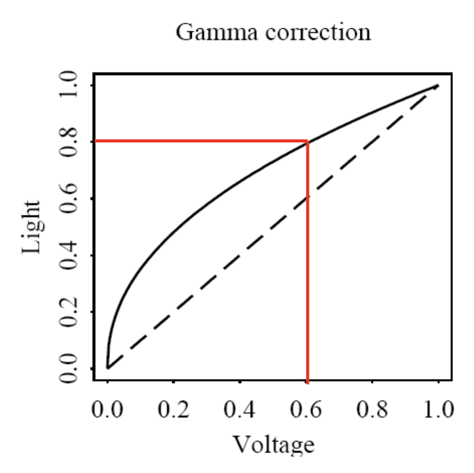

将电压归一化，使其最大值为 1：

    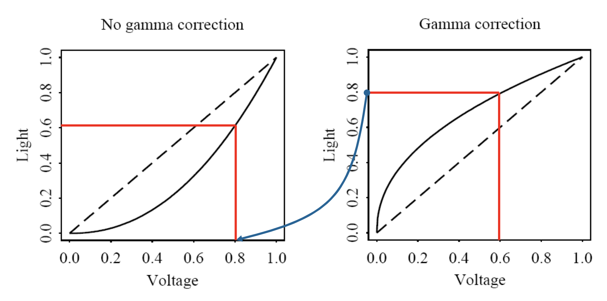

???+ example "Gamma 校正的效果"

    === "例1"

        显示从 0 到 255 变化的亮度渐变条(ramp)

        

            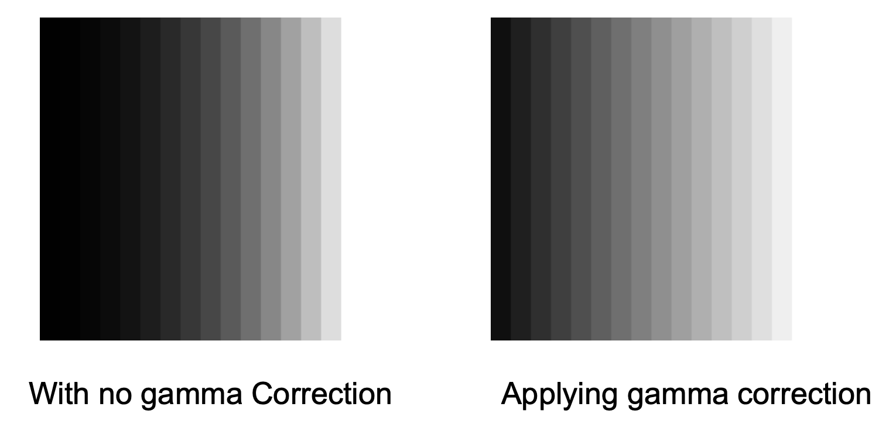
        

    === "例2"

        

            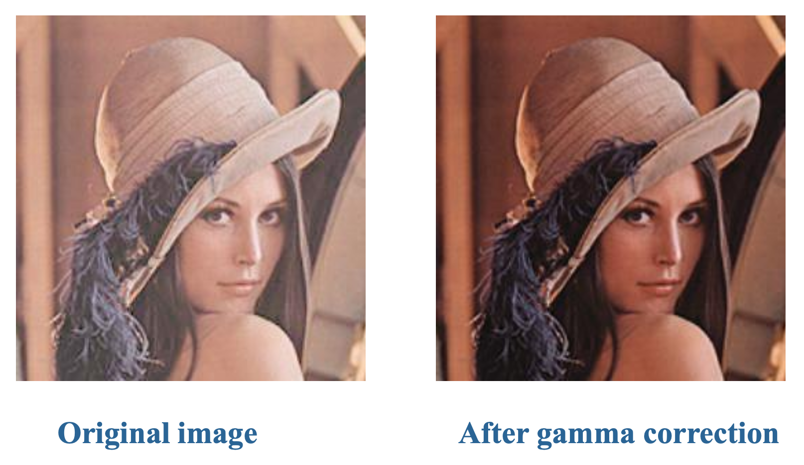
        

Gamma 校正的另一个重要应用是**相机传递函数**(camera transfer function)：

- 通用公式为 $R \rightarrow R' = a \times R^{1 / \gamma} + b$，但我们在原点附近进行特殊处理，形成以下分段函数：

    $$
    V_{\text{out}} = \begin{cases}
    4.5 \times V_{\text{in}} & V_{\text{in}} < 0.018 \\
    1.099 \times V_{\text{in}}^{0.45} - 0.099 & V_{\text{in}} \ge 0.018 \\
    \end{cases}
    $$

    >PPT 给出的公式是错的。

    - 之所以接近原点时改用线性函数，是因为此时幂函数斜率会很大（导数幂次为负，x < 1 的话数值会很高），导致严重的数值不稳定和噪点放大，因此用线性函数来平滑

- 由 SMPTE（电影与电视工程师协会）推荐（列入 SMPTE-170 标准）

!!! bug "问题"

    人眼对亮度**比例**而非绝对强度敏感，因此像这样在有限的 8 位存储空间若按线性分配颜色会使暗部细节严重缺失。

### Color-Matching Functions

即便不了解前面讲的视觉敏感度曲线，心理学领域也已发展出一种技术，能够通过混合基础的红、绿、蓝三色光来匹配特定色调。实验中采用的这组特定基础光源被称为**原色集**(color primaries)。

为了和目标颜色匹配，被试需通过一组控制器分别调节三种原色的亮度，直至生成的光斑与期望颜色达到最接近的匹配状态。执行此类实验的设备称为**色度计**(colorimeter)。基本原理图如下。

    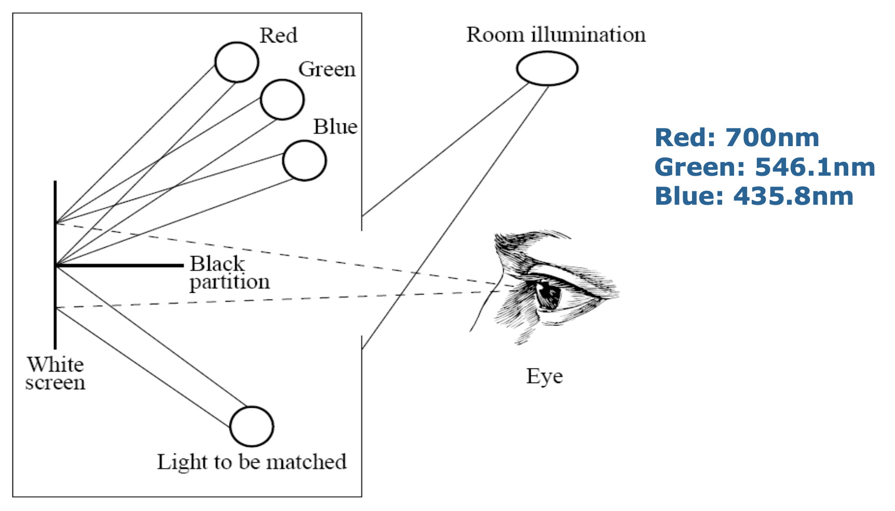

被试为匹配每种单色光所选择的 R、G、B 的量构成了**色彩匹配曲线**(color-matching curve)，分别表示为 $\bar{r}(\lambda)$，$\bar{g}(\lambda)$ 和 $\bar{b}(\lambda)$，如图所示。

    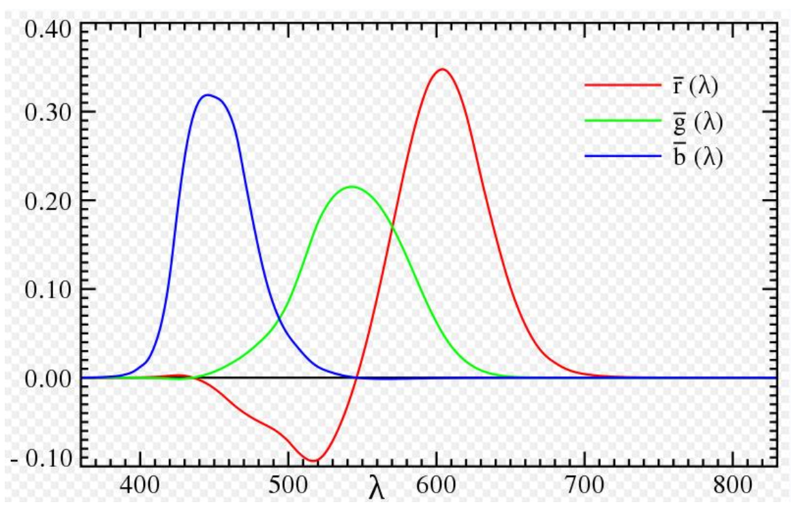

由于 $r(\lambda)$ 的配色曲线存在负值，因此另外设计一组虚拟原色，使函数值始终为正。这通常被称为**色彩匹配函数**(color-matching function)，如下图所示。

    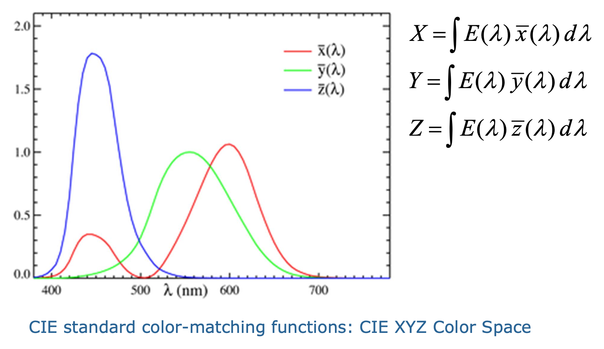

具体来说是通过一个 3×3 的矩阵变换，从 $\bar{r}, \bar{g}, \bar{b}$ 转换为 $x(\lambda)$, $y(\lambda)$ 和 $z(\lambda)$ 曲线，使得中间的标准色彩匹配函数 $y(\lambda)$ 恰好等于前面所示的[发光效率曲线](#spectral-sensitivity-of-the-eye) $V(\lambda)$。

??? note "具体的转换计算"

    

        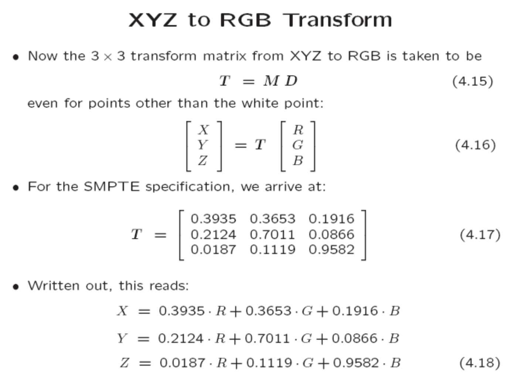
    

???+ example "Cornsweet 效应"

    === "原图"

        

            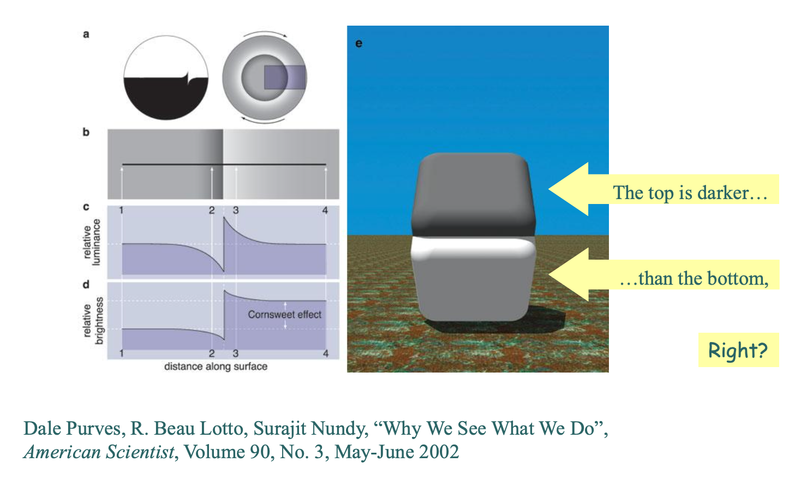
        

    === "稍微加点东西"

        

            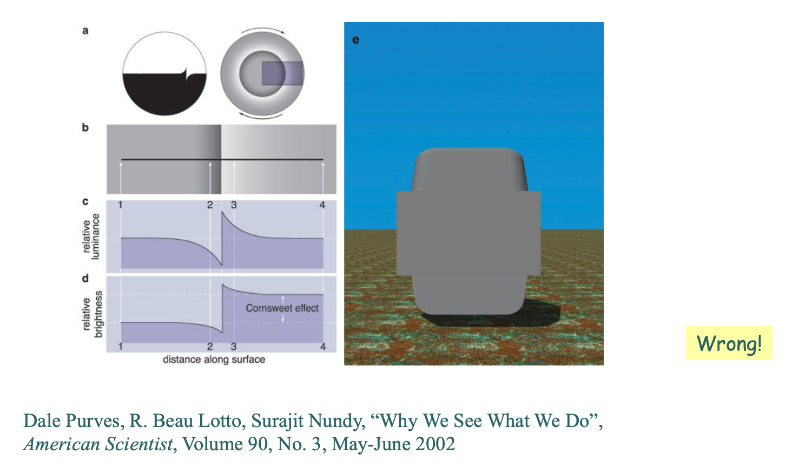
        

人眼对亮度的线性变化感知是呈对数关系的。如下图所示，绿色曲线为真实亮度，蓝色曲线为感知亮度。

    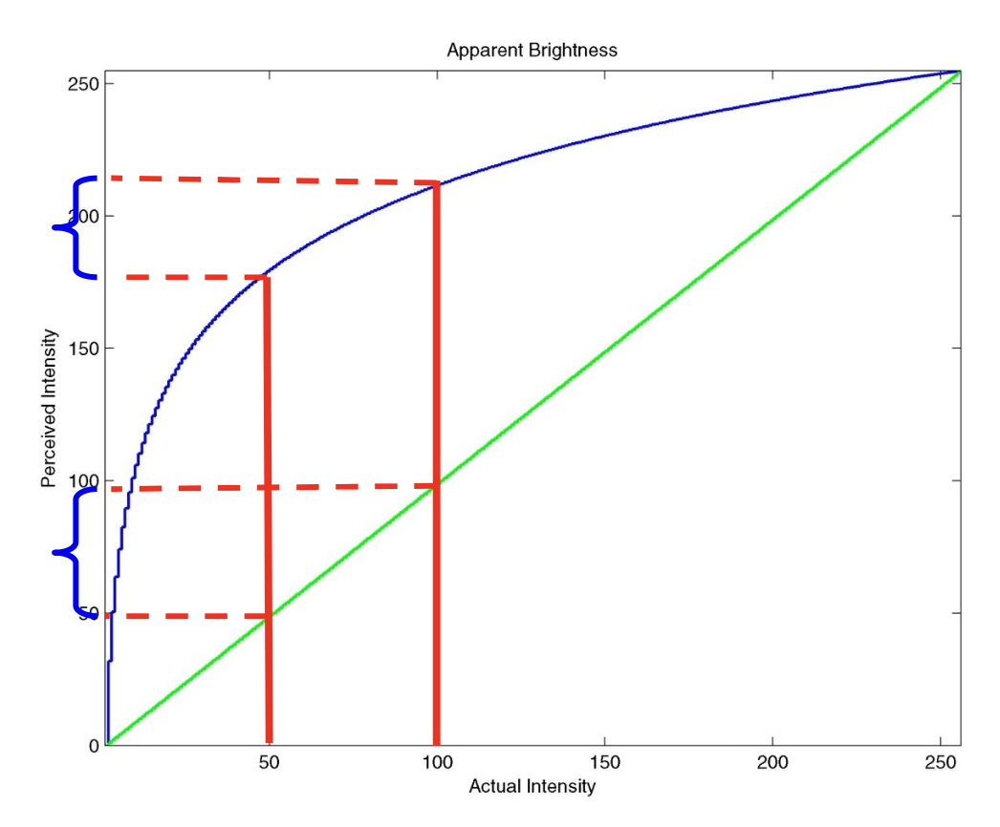

### L\*a\*b\*(CIELAB) Color Model

???+ note "**韦伯定律**(Weber's Law)（来自心理学）"

    强度越大，感知差距所需的变化量也越大。也就是说如果**变化的比率**相同，那么对变化的感知大致相等。可以用对数近似表示这个关系（[费希纳定律](https://en.wikipedia.org/wiki/Weber%E2%80%93Fechner_law)(Fechner's Law)）。

    

        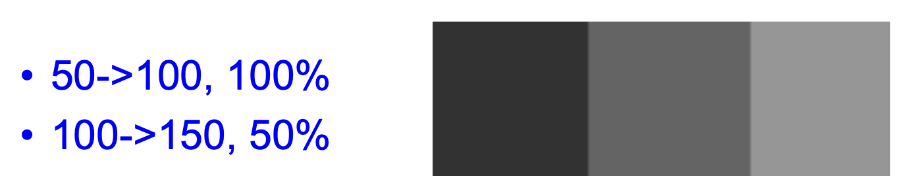
    

CIELAB 空间又称为 L\*a\*b\*

    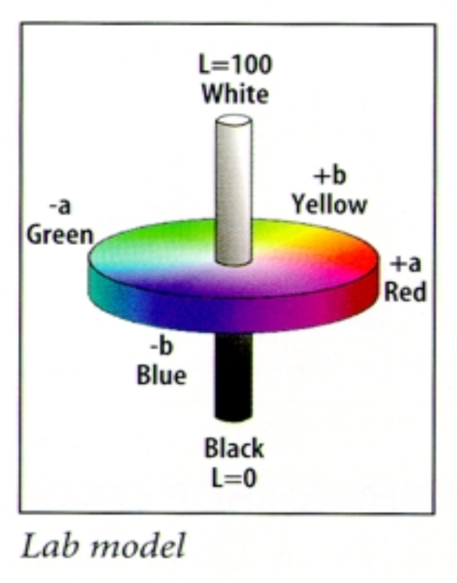

- 该色彩模型包含三个值：**亮度**(luminance)、**彩色度**(colorfulness)和**色调**(hue)
- 采用指数值为 1/3 的幂定律而非对数方法（实际上两者的函数曲线十分接近）

    

        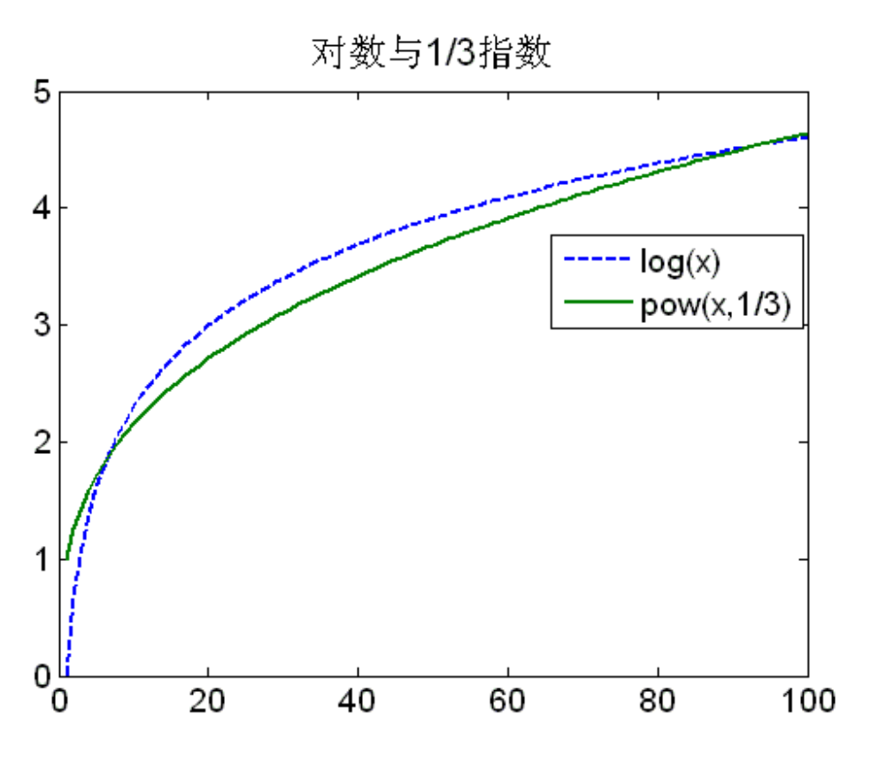
    

在这个色彩空间中，两个颜色之间的差定义为：

$$
\Delta E_{ab}^* = \sqrt{(L_2^* - L_1^*)^2 + (a_2^* - a_1^*)^2 + (b_2^* - b_1^*)^2}
$$

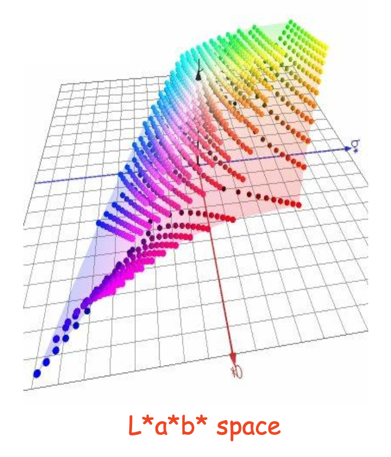{ align=right width=30% }

其中：

- $L^* = 116 \left(\dfrac{Y}{Yn}\right)^{1/3} - 16$
- $a^* = 500 \left[\left(\dfrac{X}{Xn}\right)^{1/3} - \left(\dfrac{Y}{Yn}\right)^{1/3} \right]$
- $b^* = 200 \left[\left(\dfrac{Y}{Yn}\right)^{1/3} - \left(\dfrac{Z}{Zn}\right)^{1/3} \right]$
- $Xn, Yn, Zn$ 是参考白点的 XYZ 值

### Other Color Models

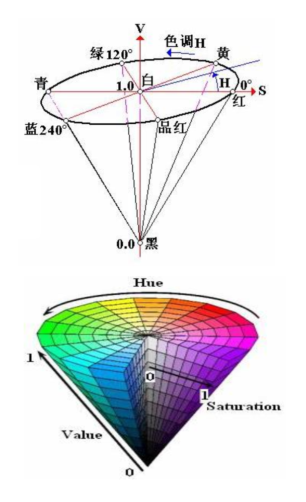{ align=right width=30% }

- HSL(HSB)：色度、饱和度(saturation)、亮度(lightness/brightness)
- **HSV**：色度、亮度、值(value)
- HIS：色度、保护度、亮度
- HCI：C（色度(chroma)）
- HVC：V（值）
- HCD：D（暗度(darkness)
- CMY
- ...

人脑将 RGB 转换为 LHS 的过程：

    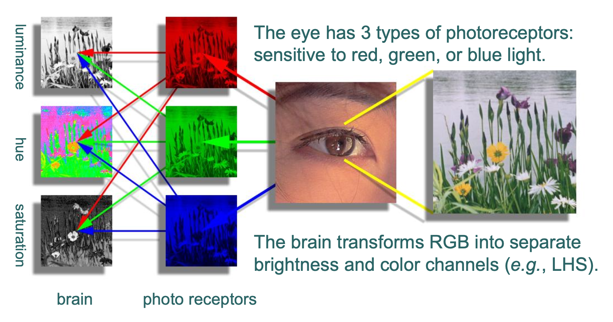

## Color Models in Images

### RGB Model for CRT display

- 在帧缓冲区中存储**与亮度成正比的整数**
- **Gamma 校正**

    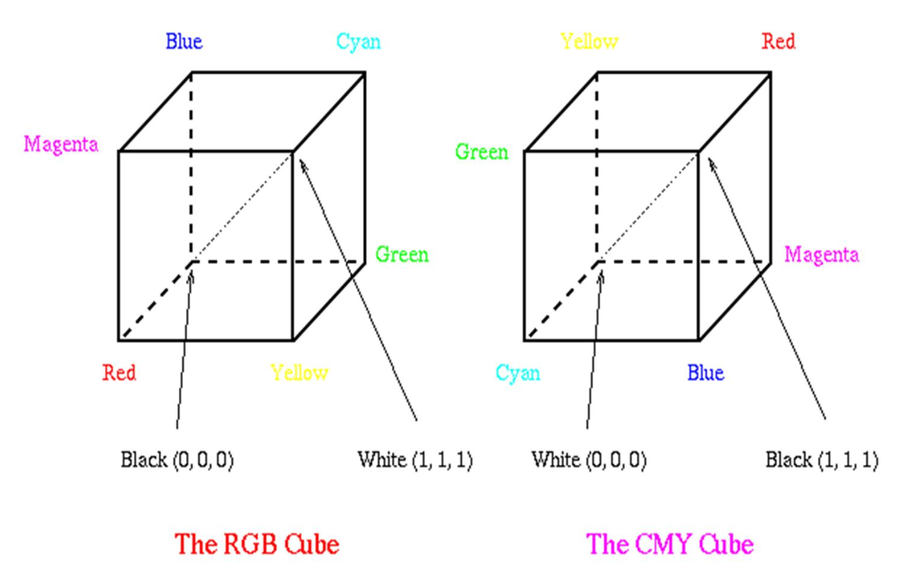

### Subtractive Color: CMY

    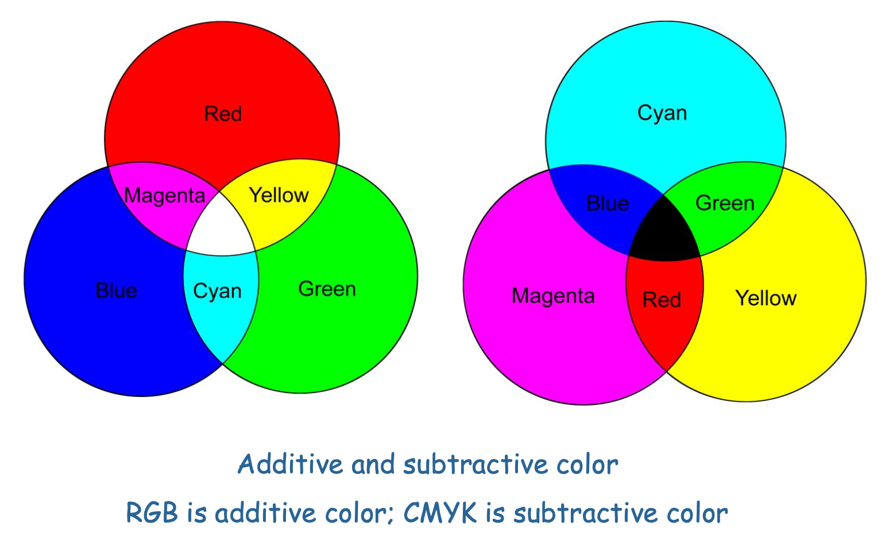

### Transformation from RBG to CMY

$$
\begin{aligned}
\begin{bmatrix}C \\ M \\ Y\end{bmatrix} & = \begin{bmatrix}1 \\ 1 \\ 1\end{bmatrix} - \begin{bmatrix}R \\ G \\ B\end{bmatrix} \\
\begin{bmatrix}R \\ G \\ B\end{bmatrix} & = \begin{bmatrix}1 \\ 1 \\ 1\end{bmatrix} - \begin{bmatrix}C \\ M \\ Y\end{bmatrix}
\end{aligned}
$$

### Under Color Removal: CMYK

CMYK 系统通过增加 K 分量得到「真正的」黑色。

$$
\begin{aligned}
K & \equiv \min\{C, M, Y\} \\
\begin{bmatrix}C \\ M \\ Y\end{bmatrix} & = \begin{bmatrix}C - K \\ M - K \\ Y - K\end{bmatrix}
\end{aligned}
$$

    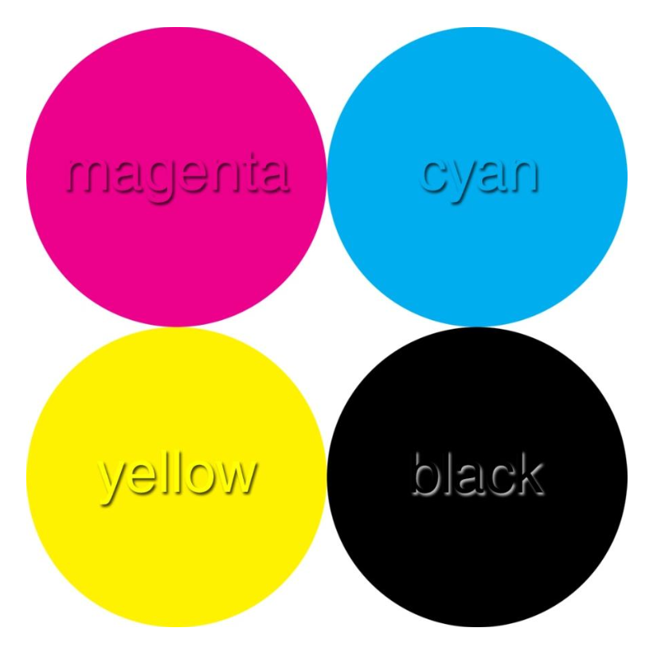

## Color Models in Video

**视频色彩转换**(video color transform)主要源自早期电视色彩编码的模拟技术，**将亮度与色彩信息分离**。

- 北美和日本采用矩阵转换方法 **YIQ** 来传输电视信号
- 在欧洲，录像带使用 PAL 或 SECAM 编码标准，这两种标准基于采用 **YUV** 矩阵转换技术的电视系统
- 数字视频普遍采用与 YUV 密切相关的 **YCbCr** 矩阵转换技术

### YUV Color Model

YUV 主要针对 PAL 模拟视频，但同样适用于 CCIR 601 数字视频标准。计算公式为：

- **亮度** Y = 0.299R + 0.587G + 0.114B
- **色度**(chrominance)为：
    - U = B - Y
    - V = R - Y
- U = V = 0 => 没有色度

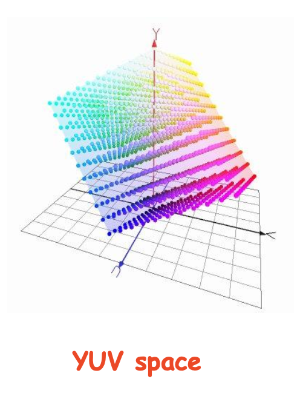{ align=right width=30% }

Gamma 校正后：

$$
\begin{aligned}
U & = B' - Y' \\
V & = R' - Y' \\
\begin{bmatrix}Y' \\ U \\ V\end{bmatrix} & = \begin{bmatrix} 0.299 & 0.587 & 0.144 \\ -0.299 & -0.587 & 0.886 \\ 0.701 & -0.587 & -0.114 \end{bmatrix} \begin{bmatrix}R' \\ G' \\ B'\end{bmatrix}
\end{aligned}
$$

实际应用中：

- U = 0.492(B - Y)
- V = 0.877(R - Y)

???+ example "例子"

    

        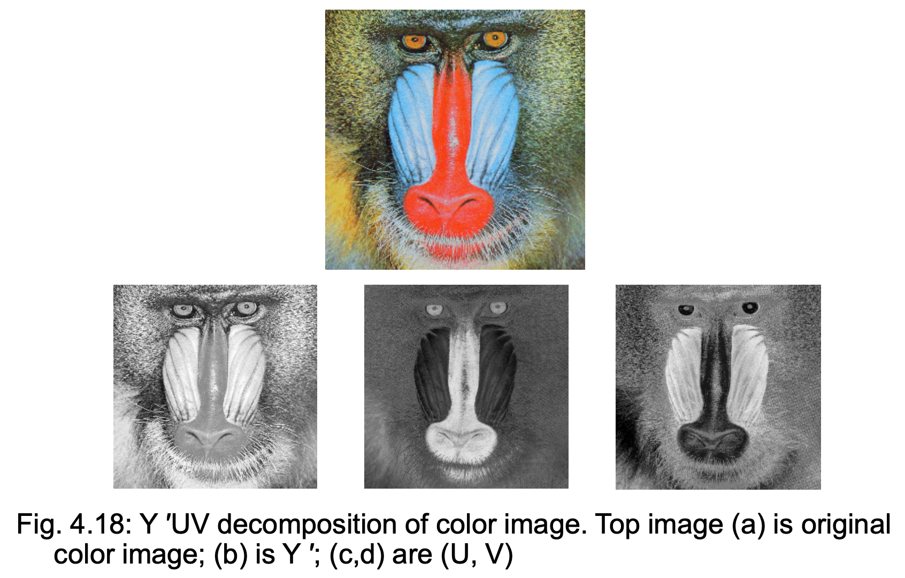
    

### YIQ Color Model

YIQ 用于 NTSC 彩色电视广播，但也能适应黑白电视（只用到 Y 分量）。

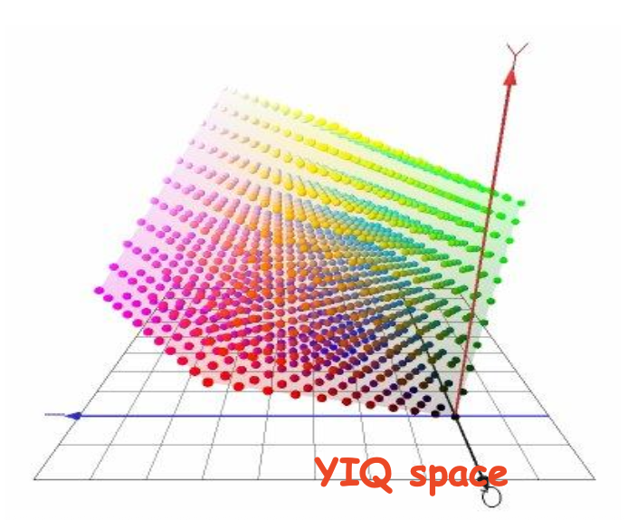{ align=right width=30% }

- 由于 U 和 V 未能捕捉到人类视觉敏感度的从高到低层次结构，因此采用 I（**橘色-蓝色**）和 Q（**紫色-绿色**）
- 它们分别通过旋转 R-Y 和 B-Y 33° 后得到：
    - I = 0.877(R - Y) * cos(33°) - 0.492(B - Y) * sin(33°) = 0.596R - 0.275G - 0.321B
    - Q = 0.877(R - Y) * sin(33°) + 0.492(B - Y) * cos(33°) = 0.212R - 0.523G + 0.311B

- 敏感程度从高到低依次为 Y, I, Q，因此在 NTSC 广播中，每个带宽的分量分别为
    - Y：4.2 MHz
    - I：1.5 MHz
    - Q：0.55 MHz

???+ example "例子"

    

        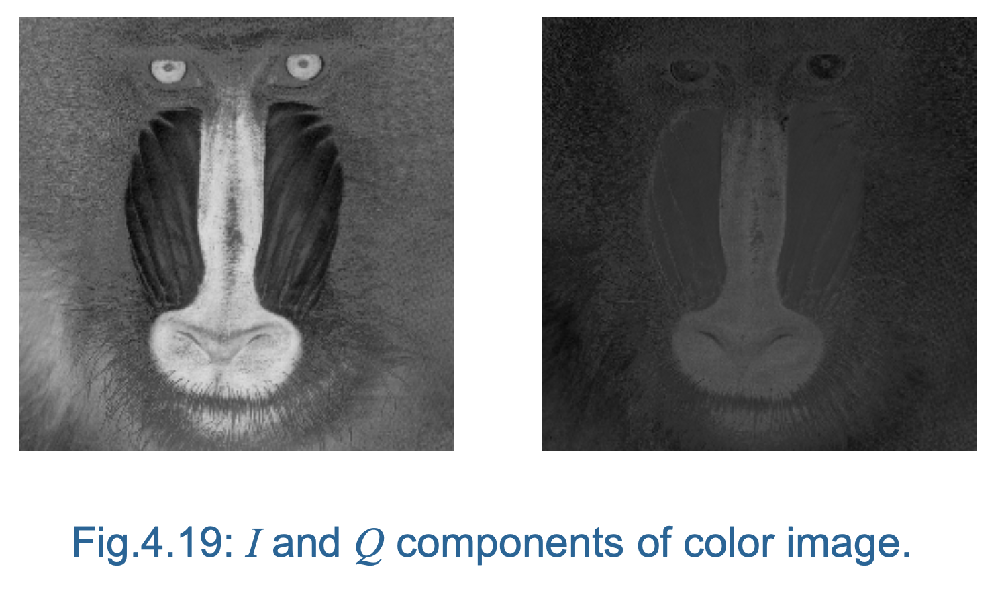
    

### YCbCr Color Model

**YCbCr** 用于 ITU-R BT.601-4 数字电视标准，和 YUV 密切相关。

- Cb = (B - Y) / 1.772 + 0.5
- Cr = (R - Y) / 1.402 + 0.5

完整的计算公式为：

$$
\begin{bmatrix}
Y' \\
C_b \\
C_r
\end{bmatrix} = 
\begin{bmatrix}
0.299 & 0.587 & 0.114 \\
-0.168736 & -0.331264 & 0.5 \\
0.5 & -0.418688 & -0.081312
\end{bmatrix}
\begin{bmatrix}
R' \\
G' \\
B'
\end{bmatrix} + 
\begin{bmatrix}
0 \\
0.5 \\
0.5
\end{bmatrix}
$$

这种彩色模型被广泛用于 JPEG 图片压缩和 MPEG 视频压缩中。