# Fundamental Concepts in Video

## Types of Video Signals

### Component Video

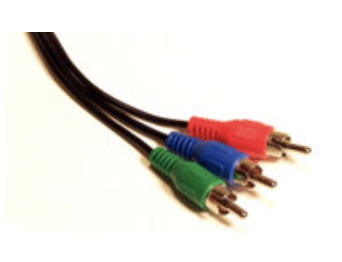{ align=right width=30% }

**分量视频**(component video)是一种高端视频系统，用于演播室等场景。

- 「分量」一词来自它的三个分离的视频信号，分别对应红色、绿色和蓝色图像平面，并且每个信号都对应一根导线（共**三根**），连接到摄像机或其他设备到电视或显示器
- 提供了最佳的色彩再现，因为不同通道之间没有串扰(crosstalk)，但需要更多带宽和良好的同步
- 除了支持 RGB，还可以使用 YIQ、YUV 等其他模型（需经过从 RGB 到**亮度-色度的变换**）

### Composite Video

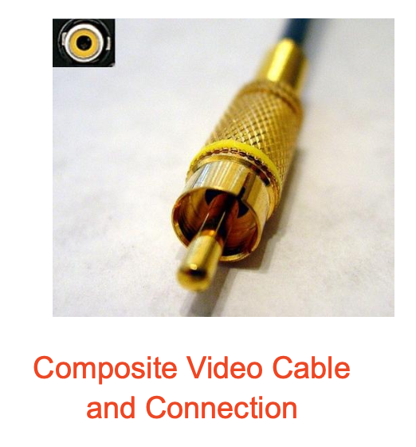{ align=right width=30% }

**复合视频**(composite video)的特点：

- 色度与亮度信号混合为单一载波(carrier wave)
- 色度用 I 和 Q（或 U 和 V）两个颜色分量表示
- 由于仅用一根导线，所以亮度信号和色度信号之间不可避免地会有一定的**干扰**(inference)
    - **在接收端**可以将色度和亮度分量**分离**，然后进一步恢复这两个颜色分量
    - 音频和同步信号也被添加到这个混合信号中
- 常用于广播彩色电视，但也向下**兼容**黑白电视

### S-Video

**S-Video** 是一种折中方案（分离视频或超级视频，例如在S-VHS中）

- 使用两根导线，一根传输亮度信号，另一根传输复合色度信号
    - 因此色彩信息与关键的灰度信息之间的**串扰更少**

- 将亮度单独置于一个信号中的原因是**黑白信息对于视觉感知最为关键**
    - 事实上，人类能够以远高于彩色图像色彩部分的敏锐度(acuity)来区分灰度图像的空间分辨率
    - 因此，我们可以发送比强度信息所需精度更低的颜色信息，毕竟我们只能看到相当大块的色块，所以发送较少的颜色细节是合理的

    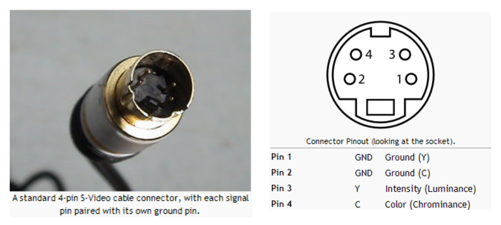

## Analog Video

### Related Concepts

- 模拟信号用 f(t) 表示，可理解为是**随时间变化的图像**
- **逐行扫描**(progressive scanning)：在每个时间间隔内，按行遍历一幅完整的画面（一帧）
- CRT 显示器（85Hz及以上）

    

        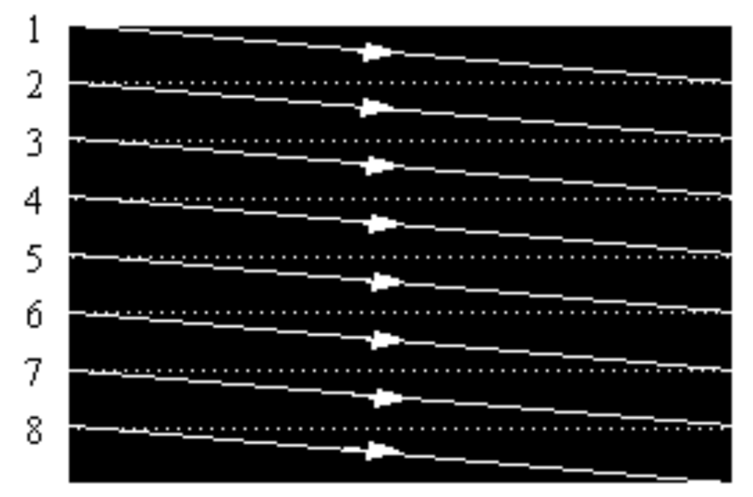
    

- 在电视以及部分显示器和多媒体标准中，还采用了一种称为**隔行扫描**(interlaced scanning)的系统：
    - 首先扫描奇数行，然后扫描偶数行，这样就形成了**奇场**(odd fields)和**偶场**(even fields)，而这两个场组成一帧
    - 实际上，奇数行的扫描会在奇场的末尾结束于一行中间的位置，而偶数行的扫描则从半程点开始

    

        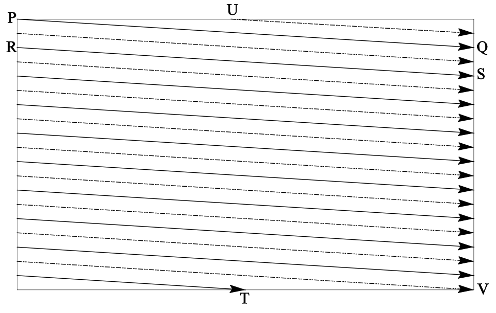
    

    - 首先，沿着实线（奇数行）从 P 点追踪至 Q 点，接着从 R 点到 S 点，以此类推，最终结束于 T 点；随后偶数场扫描自 U 点开始，终止于 V 点
    - 从 Q 点到 R 点的跳跃等过程被称为**水平回扫**(horizontal retrace)，在此期间阴极射线管中的电子束会被消隐；而从 T 点到 U 点或 V 点到 P 点的跳跃则称为**垂直回扫**(vertical retrace)

    ???+ example "例子"

        

            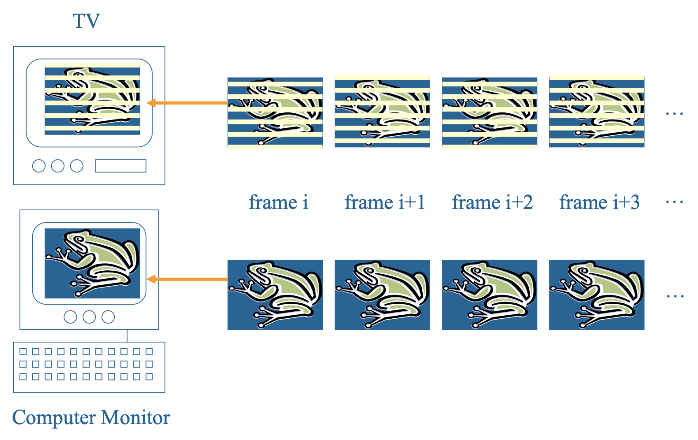
        

    - 奇数行和偶数行在时间上相互错位，这一问题通常在屏幕上表现非常快速的动作时才变得明显，这时画面可能会模糊
    
        ???+ example "例子"
            
            如下图所示，移动的直升机的模糊程度大于静止的背景。

            

                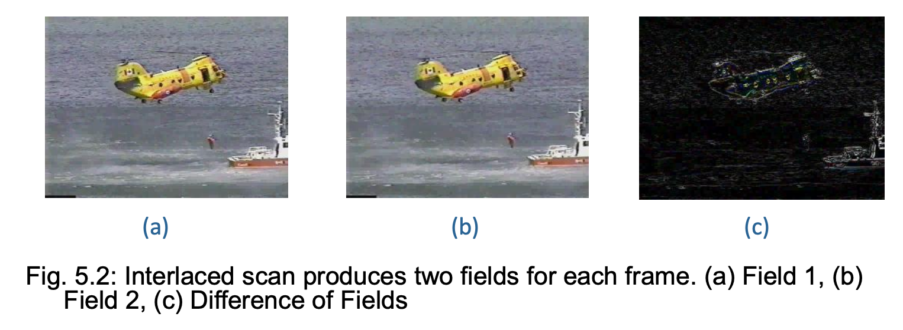
            

- 模拟视频使用一个微小的电压偏移来表示黑色，而另一个值（如零）则表示一行的开始
    - 比如我们可以用一个“比黑更黑”的零信号来指示一行的起始点

    

        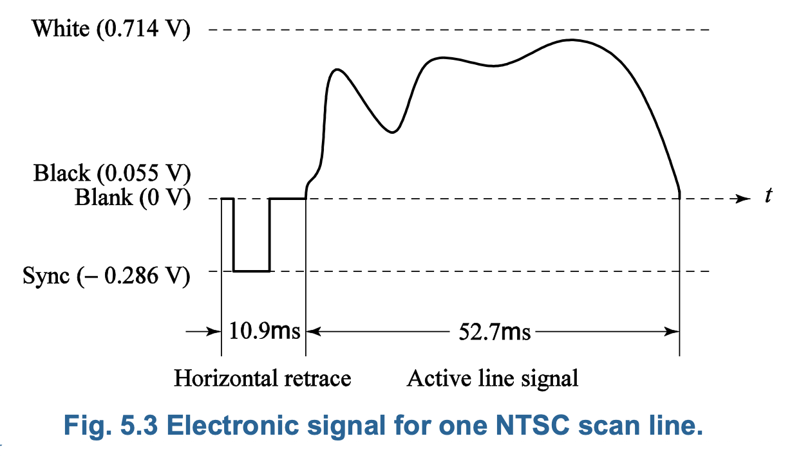
    

- 模拟电视的电视标准
    - **NTSC** 视频（正交平衡调幅）：美国、加拿大、日本和韩国采用，1953 年由美国制定
    - **PAL** 视频（逐行倒相正交平衡调幅）：德国、英国和中国采用，1962 年由德国制定
    - **SECAM** 视频（顺序传送彩色与存储）：法国、俄罗斯采用，1966 年由法国制定

- 这些标准向下兼容黑白电视系统
    - **参数一致性**(parameters consistence)：扫描方式、扫描行频、场频、帧频、图像载波频率和伴音载波频率保持一致
    - **信号传输一致性**(signal transmission consistence)：亮度信号与两个色度信号的传输保持统一

- 标准分布图：

    

        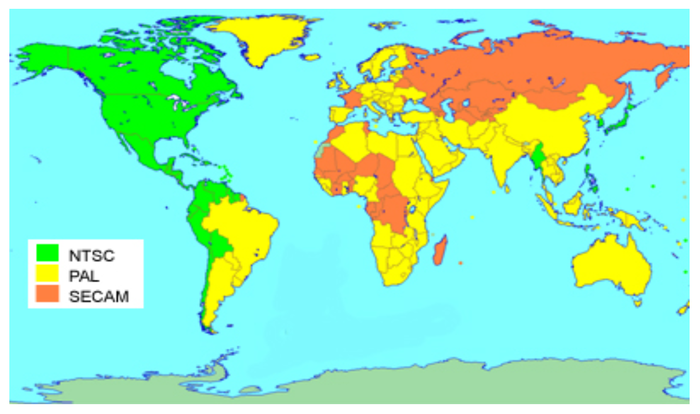
    

### NTSC Video

**NTSC** 全称为国家电视标准委员会(National Television Standards Committee)

- 4:3 的长宽比
- 每帧 525 行扫描线
- 每秒 30 帧（30 fps）
- YIQ 色彩模型
- 详细参数
    - 实际为 29.97fps；或每帧 33.37ms
    - 采用隔行扫描，每场 262.5 行
    - 水平扫描频率：525 * 29.97 = 15,734 行/s
    - 每行时间：1 / 15,734 = 63.6μs（10.9 + 52.7）
    - 垂直回扫，每场保留 20 行，共 485 行
    - 水平扫描，1/6 的栅格(raster)保留
    - 水平分辨率即每行样本数

    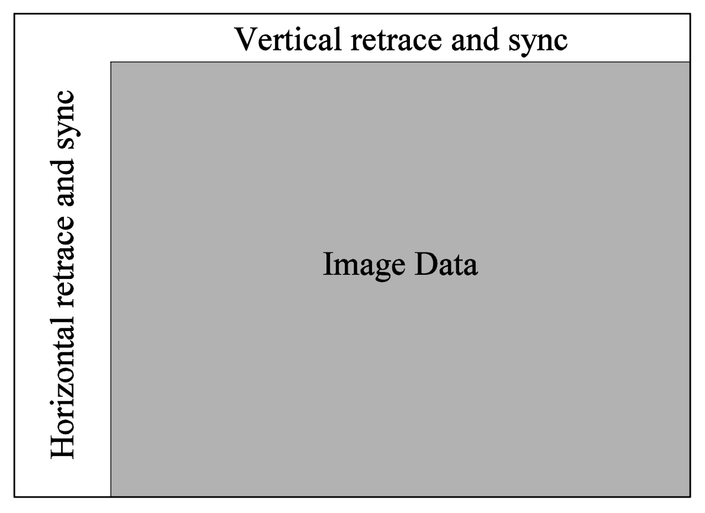

- NTSC 视频是一种没有固定水平分辨率的模拟信号，因此必须确定对信号进行采样的次数（每个采样点要对应一个像素输出）
- 使用**像素时钟**(pixel clock)将视频的每一行水平分割成采样点；像素时钟的频率越高，每行中的采样点就越多
- 不同的视频格式提供了每行不同数量的采样点，如下表所示：

    | 格式 | 每行采样数 |
    |---|---|
    | VHS | 240 |
    | S-VHS | 400–425 |
    | Betamax | 500 |
    | 标准 8 mm | 300 |
    | Hi-8 mm | 425 |

- 色彩模型与调制
    - NTSC 使用 YIQ 颜色模型，并采用正交调制技术将 $I$（同相(in-phase)）和 $Q$（正交(quadrature)）信号（频谱重叠部分）合并成一个单色(single chorma)信号 $C$，即：

        $$
        C = I \cos(F_{\text{sc}}t) + Q \sin(F_{\text{sc}}t)
        $$

    - 这个调制的色度信号也称为**色副载波**(color subcarrier)，其振幅为 $\sqrt{I^2 + Q^2}$，相位为 $\tan^{-1}(Q / I)$，频率为 $F_{\text{sc}} \approx 3.58$ MHz
    - NTSC 复合信号是亮度信号 $Y$ 与如下定义的色度信号的进一步组合：

        $$
        \text{composite} = Y + C = Y + I \cos(F_{\text{sc}}t) + Q \sin(F_{\text{sc}}t)
        $$

    - NTSC 将 4.2MHz 的带宽分配给 $Y$，而将 1.6MHz 分配给 $I$，将 0.6MHz 分配给 $Q$，因为人类对色彩细节不敏感（高频色彩变化）

        

            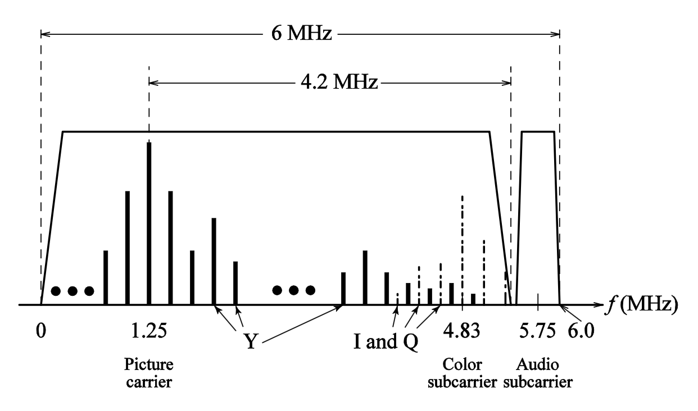
        

        - 实际上 NTSC 的 6MHz 带宽很紧张：其音频副载波频率为 4.5MHz，而图像载波在 1.25MHz，这使得音频频带的中心位于信道中的 1.25 + 4.5 = 5.75MHz（如上图所示）；但颜色被放置在 1.25 + 3.58 = 4.83MHz
        - 因此，音频与色副载波的距离有点近，这便是音频和颜色信号之间可能产生干扰的缘由。这主要是因为 NTSC 彩色电视实际上将其帧率降低到 30 * 1,000 / 1,001 ≈ 29.97fps
        - 结果，采用的 NTSC 色副载波频率略有降低到 $f_{\text{sc}}$ = 30 * 1,000 / 1,001 * 525 * 227.5 ≈ 3.579545MHz，其中 227.5 是 NTSC 广播电视中每扫描行的颜色采样数

    - 解码复合信号的步骤：
        1. 首先，使用低通滤波器提取 $Y$：$Y + I \cos(F_{\text{sc}}t) + Q \sin(F_{\text{sc}}t)$
        2. 从 $Y$ 中分离后，对 $C$ 进行解调以提取 $I$ 和 $Q$
            - $C$ 乘以 $2 \cos(F_{\text{sc}} t)$，即 $C \cdot 2\cos(F_{\text{sc}} t) = I + I \cdot \cos (2 F_{\text{sc}} t) + Q \cdot 2\sin(2 F_{\text{sc}} t)$
            - 应用低通滤波器提取 $I$

### PAL Video

**PAL** 全称为相位交替线(phase alteration line)

- 625 条扫描线，每秒 25 帧，4:3 的宽高比
- 25fps；或者每帧 40ms
- 交错扫描，每场 312.5 行
- 水平扫描频率，625 * 25 = 15,625 行
- 每行时间：1 / 15,734 = 64μs（11.8 + 52.2）
- 垂直回扫，每场保留 25 行，共 575 行
- 色彩模型为 YUV，其中 Y 的带宽为 5.5MHz，U 和 V 的带宽分别为 1.8MHz

### SECAM Video

**SECAM** 全称彩色电子存储系统(Système Electronique Couleur Avec Mémoire)，是第三个主要的电视广播标准。

- 和 PAL 非常相似，同样采用每帧 625 条扫描线，每秒 25 帧，4:3 的宽高比和交错场
- 但在色彩编码方案上略有不同：
    - U 和 V 信号分别使用 4.25MHz 和 4.41MHz 的独立色副载波调制
    - 它们交替发送，即每条扫描线上只发送 U 或 V 信号中的一个

### Comparison of NTSC, PAL and SECAM

<table border="1">
  <thead>
    <tr>
      <th rowspan="2">电视制式</th>
      <th rowspan="2">帧率（fps）</th>
      <th rowspan="2">扫描线数</th>
      <th rowspan="2">总信道带宽（MHz）</th>
      <th colspan="3">带宽分配（MHz）</th>
    </tr>
    <tr>
      <th>Y</th>
      <th>I 或 U</th>
      <th>Q 或 V</th>
    </tr>
  </thead>
  <tbody>
    <tr>
      <td>NTSC</td>
      <td>29.97</td>
      <td>525</td>
      <td>6.0</td>
      <td>4.2</td>
      <td>1.6</td>
      <td>0.6</td>
    </tr>
    <tr>
      <td>PAL</td>
      <td>25</td>
      <td>625</td>
      <td>8.0</td>
      <td>5.5</td>
      <td>1.8</td>
      <td>1.8</td>
    </tr>
    <tr>
      <td>SECAM</td>
      <td>25</td>
      <td>625</td>
      <td>8.0</td>
      <td>6.0</td>
      <td>2.0</td>
      <td>2.0</td>
    </tr>
  </tbody>
</table>

## Digital Video

### Advantage of Digital Representation

!!! recommend "优点"

    - 在数字设备或内存中存储视频
    - 可用于处理和集成到各种多媒体应用中
    - 直接访问：非线性视频编辑
    - 无损重复录制
    - 加密方便，且对信道噪声的容忍度更高

### Chroma Subsampling

人眼对颜色的分辨率低于对亮度（黑白）的分辨率，因此可以对颜色信息进行不同方式的降采样。我们以四个像素为单位，考虑实际发送多少像素值：

- 4:4:4：无子采样
- 4:2:2：Cb 和 Cr 在水平方向以因子 2 进行子采样
- 4:1:1：Cb 和 Cr 在水平方向以因子 4 进行子采样
- 4:2:0：Cb 和 Cr 分别在水平和垂直方向上以因子 2 进行子采样
    - JPEG 与 MPEG 通常采用 4:2:0 方案

    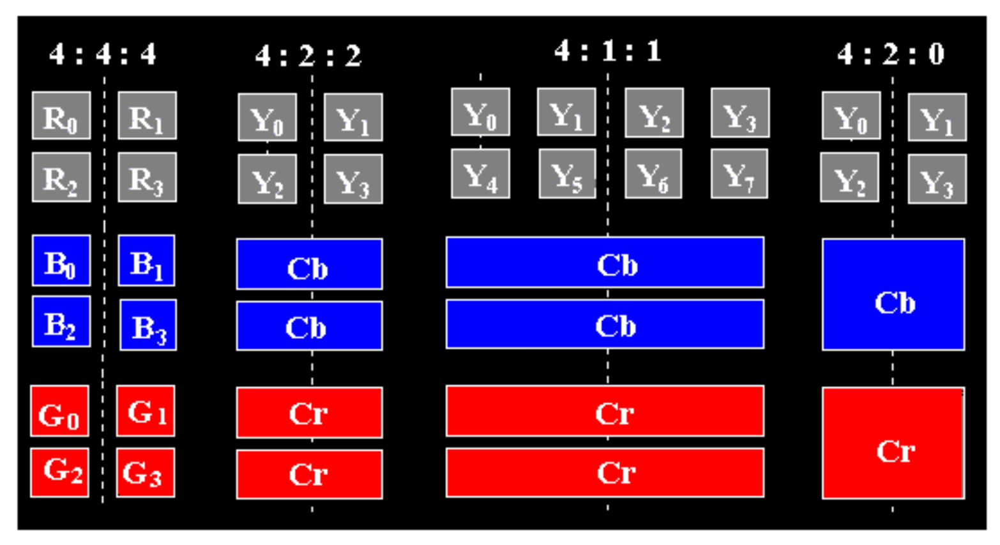

### CCIR Standard

**CCIR** 是国际无线电咨询委员会(Consultative Committee for International Radio)的缩写，其制定的最重要标准之一是用于分量数字视频的 **CCIR-601**（后来演变为 ITU-R-601 标准）。

- 针对 NTSC 标准：
   - 525 行，每行 858 像素（其中 720 个可见）
   - 采用 4:2:2 采样方案
   - 每个像素占用两个字节

- CCIR-601（NTSC）数据速率：525 * 858 * 30 * 2字节 * 8位/字节 ≈ 216Mbps

| 指标 | CCIR 601 525/60 NTSC | CCIR 601 625/50 PAL/SECAM | CIF | QCIF |
|---|---|---|---|---|
| 亮度分辨率 | 720 × 480 | 720 × 576 | 352 × 288 | 176 × 144 |
| 色度分辨率 | 360 × 480 | 360 × 576 | 176 × 144 | 88 × 72 |
| 色度子采样 | 4:2:2 | 4:2:2 | 4:2:0 | 4:2:0 |
| 场/秒 | 60 | 50 | 30 | 30 |
| 是否隔行扫描 | 是 | 是 | 否 | 否 |

### CIF Standard

**CIF** 全称为通用中间格式(Common Intermediate Format)，由 CCITT 制定，后来被 ITU-T 取代。

- 设计理念：一种较低比特率的格式，同时保持与 VHS 相同的画质
- QCIF：四分之一的 CIF，比特率更低
- CIF 或 QCIF 的分辨率可被 8 或 16 整除，这样便于 H.261、H.263 等基于块的视频编码

<table border="1">
  <thead>
    <tr>
      <th rowspan="2"></th>
      <th colspan="2">CIF</th>
      <th colspan="2">QCIF</th>
      <th colspan="2">SQCIF</th>
    </tr>
    <tr>
      <th>行/帧</th>
      <th>像素/行</th>
      <th>行/帧</th>
      <th>像素/行</th>
      <th>行/帧</th>
      <th>像素/行</th>
    </tr>
  </thead>
  <tbody>
    <tr>
      <td>亮度（Y）</td>
      <td>288</td>
      <td>360 (352)</td>
      <td>144</td>
      <td>180 (176)</td>
      <td>96</td>
      <td>128</td>
    </tr>
    <tr>
      <td>色度（Cb）</td>
      <td>144</td>
      <td>180 (176)</td>
      <td>72</td>
      <td>90 (88)</td>
      <td>48</td>
      <td>64</td>
    </tr>
    <tr>
      <td>色度（Cr）</td>
      <td>144</td>
      <td>180 (176)</td>
      <td>72</td>
      <td>90 (88)</td>
      <td>48</td>
      <td>64</td>
    </tr>
  </tbody>
</table>

???+ example "例子"

    

        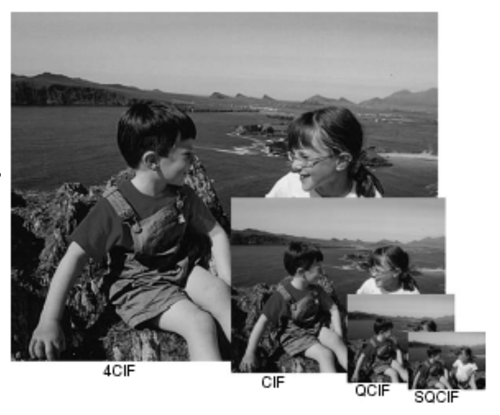
    

### High Definition TV

**高清电视**(high definition TV, HDTV)的核心目标并非提升单位面积内的“清晰度”，而是着重扩展视觉范围，特别是增加画面宽度。

??? info "高清电视发展简史"

    - 第一代高清电视技术源于 1970 年代末期日本索尼公司与 NHK 共同开发的模拟技术体系
    - MUSE 系统（多重亚奈奎斯特采样编码）作为 NHK 高清电视的升级版本，融合了模拟与数字混合技术，于 1990 年代投入实际应用。该系统采用 1,125 条扫描线、隔行扫描模式（每秒 60 场），并配备 16:9 宽高比屏幕
    - 由于未经压缩的高清信号所需带宽极易超过 20MHz，无法适配当前 6MHz 或 8MHz 的传输信道标准，业界正积极探索多种数据压缩解决方案
    - 据预测，即便经过高效压缩处理的高品质高清信号，未来仍可能需要通过多个信道并行传输来实现稳定输送

    - 1987年，美国联邦通信委员会（FCC）决定高清电视标准必须与现有 NTSC 制式兼容，且仅限于既有 VHF（甚高频）和 UHF（特高频）频段
    - 1990 年，FCC 宣布了一项重大转向：倾向于采用全分辨率高清电视标准，并决定高清信号将与现行 NTSC 制式同步播出，最终实现全面替代
    - 面对数字高清电视提案的井喷态势，FCC 于 1993 年作出关键决策——全面推进数字化。由通用仪器、麻省理工学院、 Zenith 及 AT&T 四家核心方案方牵头，联合汤姆逊、飞利浦、Sarnoff 等机构组成“大联盟”
    - 这一举措直接促成了先进电视系统委员会（ATSC）的成立——该机构负责制定高清电视广播技术标准
    - 1995年，美国联邦通信委员会先进电视服务咨询委员会正式建议采纳 ATSC 数字电视标准

- 该标准支持下表所示的视频扫描格式，其中 I 表示隔行扫描，而 P 表示逐行（非隔行）扫描：

    | 每行有效像素数 | 有效扫描行数 | 宽高比 | 画面帧率 |
    |---|---|---|---|
    | 1,920 | 1,080 | 16:9 | 60I 30P 24P |
    | 1,280 | 720 | 16:9 | 60P 30P 24P |
    | 704 | 480 | 16:9 & 4:3 | 60I 60P 30P 24P |
    | 640 | 480 | 4:3 | 60I 60P 30P 24P |

- 传统电视与高清电视之间的显著差别：
    - 高清电视采用更宽的 16:9 宽高比，而非传统的 4:3
    - 高清电视转向逐行扫描（非隔行扫描），其原理在于隔行扫描会导致运动物体边缘出现锯齿状(serrated)，并在水平边缘产生闪烁(flickers)现象

- FCC 计划在 2009 年前，将所有模拟广播服务替换为数字电视广播，提供的服务将包括：
    - **SDTV**（标清电视）：当前 NTSC 制式或更高清晰度
    - **EDTV**（增强清晰度电视）：480 条有效扫描线及以上，即上表中的第三和第四行标准
    - **HDTV**（高清电视）：720 条有效扫描线及以上