# Basics of Digital Audio

## Digitization of Sound

### What Is Sound？

**声音**(sound)是一种类似光的**波动现象**(wave phonomenon)。

- 无空气则无声
- 声音是压力波，呈现连续变化值
- 具有常见的**波动特性**与行为模式，包括反射(reflection)、折射(refraction)和衍射(diffraction)
- **幅度**(amplitude)：一种随时间变化的连续值
- 可通过将压力转换为电压来测量声音

    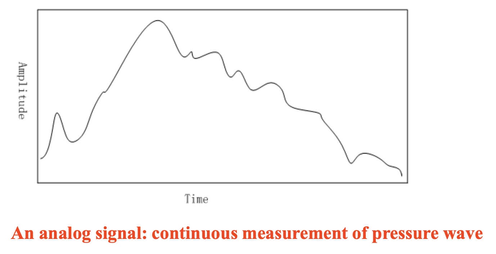

### Digitization

**数字化**(digitalization)：将声音转换为数字流；并且为了效率，这些数字最好是整数。

    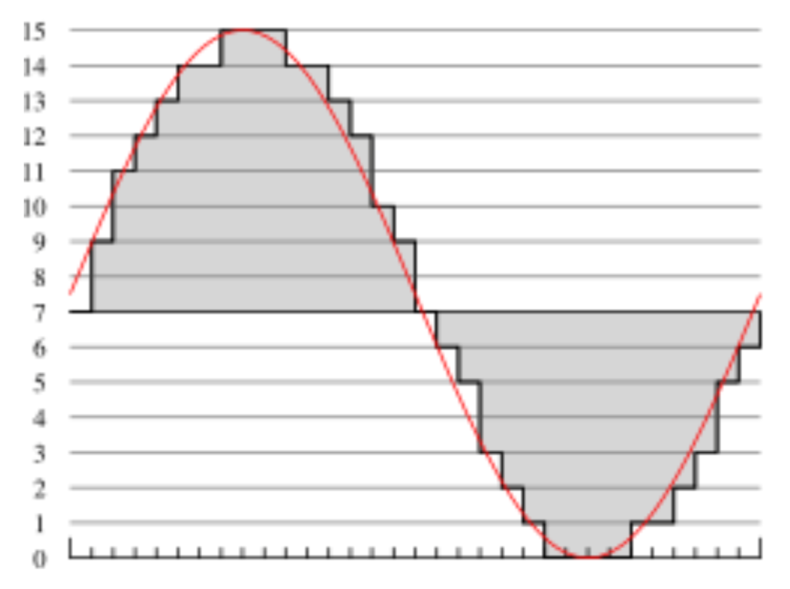

一般会在**时间**和**幅度**两个维度上进行采样。

- 时间维度：以等间隔进行采样，范围在 8kHz 到 48kHz 之间
    >人耳可听范围为 20Hz 至 20kHz

- 幅度维度：此时采样过程被称为**量化**(quantization)
    - **均匀量化**(uniform quantization)：等间距采样
    - **非均匀量化**(nonuniform quantization)：比如如 **u 律规则**
    - 常见的均匀量化率：
        - 8 位 -> 256 级
        - 16 位 -> 65,536级

    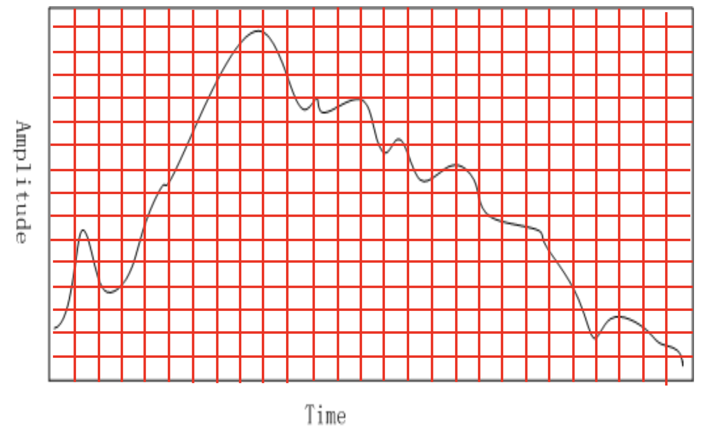

因此，要想对音频数据进行数字化，得回答以下问题：

- 采样率是什么？
- 数据将被量化到何种精细程度，以及量化是否均匀？
- 如何对音频数据格式化？（文件格式）

### Nyquist Theorem

信号可以分解为**正弦波**(sinusoids)的总和。

    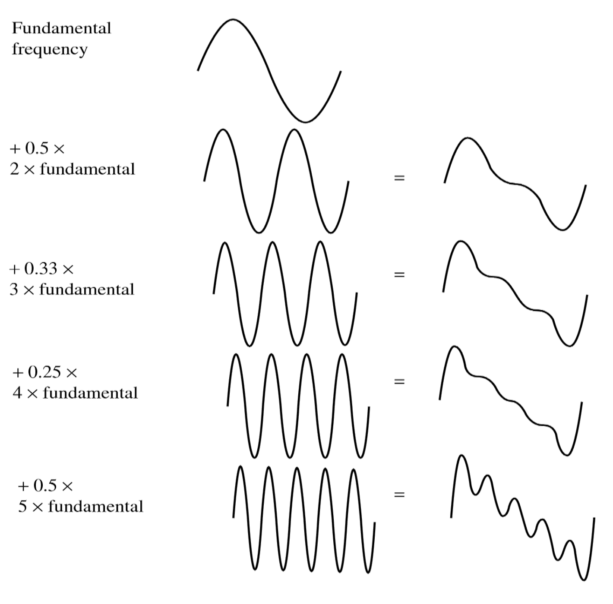

    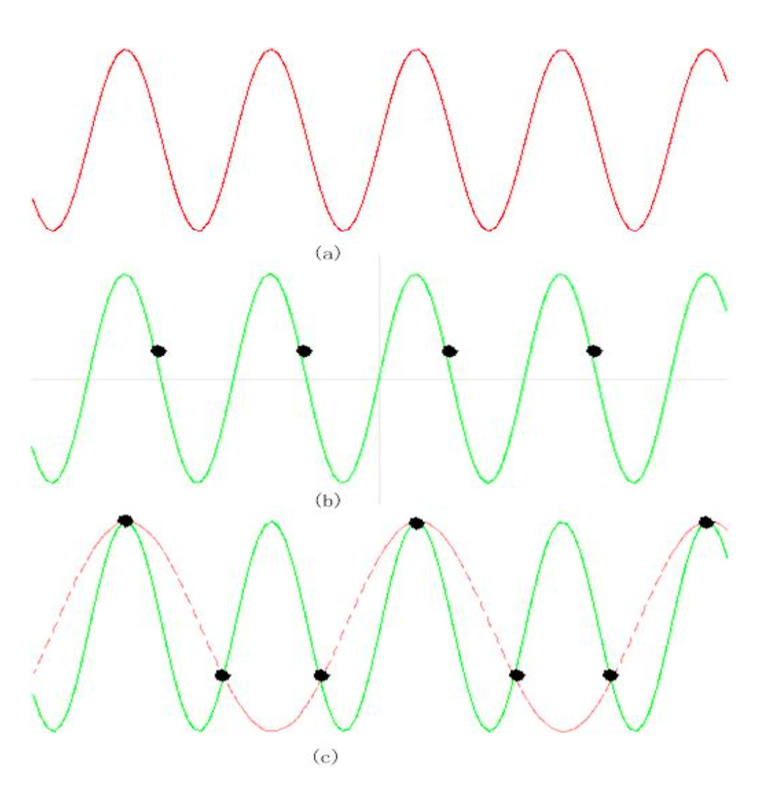

>1. 单一正弦波
>2. 以实际频率采样检测到的**恒定**信号
>3. 以 1.5 倍频率采样得到的**混叠**(alias)信号

- **奈奎斯特速率**(Nyquist rate)：为确保正确采样，采样率必须**至少**为信号中**最高频率成分的两倍**
- **奈奎斯特定理**(Nyquist theorem)：对于一个频带受限的信号，其频率下限为 f1、上限为 f2，所需的采样率至少应为 **2 * (f2 - f1)**。
- **奈奎斯特频率**(Nyquist frequency)：即奈奎斯特速率的一半
    - 由于在任何情况下都**无法恢复高于奈奎斯特频率的成分**，大多数系统会配备抗混叠滤波器(antialiasing filter)，将输入到采样器的信号频率内容限制在等于或低于奈奎斯特频率的范围内

### Signal-to-Noise Ratio（SNR）

正确信号功率与噪声功率的比值被称为**信噪比**(signal to noise ratio, **SNR**)，这是衡量信号质量的一个指标。

- 通常以分贝（dB）为单位进行测量，其中 1 dB 是 bel 的十分之一
- 以 dB 为单位的 SNR 值，根据电压平方的常用对数，其定义如下：

    $$
    \text{SNR} = 10 \log_{10} \dfrac{V^2_{\text{signal}}}{V^2_{\text{noise}}} = 20 \log_{10} \dfrac{V_{\text{signal}}}{V_{\text{noise}}}
    $$

- 信号中的功率与电压的平方成正比
    - 例如，若信号电压 $V_{\text{signal}}$ 是噪声的 10 倍，则 SNR 为 20 * log10(10) = 20dB
    - 从功率角度而言，如果十把小提琴的总功率是一把独奏小提琴的十倍，那么功率比为 10dB 或 1B
    - 功率对应系数为 10，信号电压对应系数为 20

我们周围通常听到的声音强度，是以分贝为单位来描述，作为与我们能听到的最微弱声音的比值。

| 声音来源 | 分贝 (dB) |
| :--- | :--- |
| 听觉阈值 | 0 |
| 树叶沙沙声 | 10 |
| 非常安静的房间 | 20 |
| 普通房间 | 40 |
| 交谈 | 60 |
| 繁忙街道 | 70 |
| 大声的收音机 | 80 |
| 火车通过车站 | 90 |
| 铆钉机 | 100 |
| 不适阈值 | 120 |
| 痛阈 | 140 |
| 耳膜受损 | 160 |

### SQNR (Signal-to-Quantization-Noise Ratio)

除了原始模拟信号中可能存在的任何噪声外，还存在**由量化引起的额外误差**。如果电压实际范围在 0 到 1 之间，但我们只有 8 位来存储数值，那么实际上我们强制将所有连续的电压值压缩为仅 256 个不同的值。这引入了舍入误差。它并非真正的「噪声」，但仍被称为**量化噪声**（或量化误差）。

因此量化的质量通过**信号与量化噪声比**(signal-to-quantization-noise, **SQNR**)来表征。

- 量化噪声：指在特定采样时刻，模拟信号的实际值与最接近的量化间隔值之间的差异，此误差最大可达间隔的一半
- 对于每个样本 N 位的量化精度，SQNR 可简化为：

    $$
    \begin{aligned}
    \text{SQNR} & = 20 \log_{10} \dfrac{V_{\text{signal}}}{V_{\text{quan\_noise}}} = 20 \log_{10} \dfrac{2^{N-1}}{\frac{1}{2}} \\
    & = 20 \times N \times \log 2 = 6.02 N (\text{dB})
    \end{aligned}
    $$

- 我们将最大信号映射为 $2^{N-1} - 1$（$\approx 2^{N-1}$），并将最小信号映射为 $−2^{N−1}$
- 上述方程表示**峰值信噪比**(peak signal-to-quantization-noise, **PSQNR**)，即峰值信号与峰值噪声之比
- **动态范围**(dynamic range)是信号绝对值的最大值与最小值之比，即 $V_{\text{max}} / V_{\text{min}}$
    - 最大绝对值 $V_{\text{max}}$ 被映射到 $2^{N−1}−1$，最小绝对值 $V_{\text{min}}$ 被映射到 $1$
    - $V_{\text{min}}$ 是不被噪声掩盖的最小正电压值
    - 最大的负信号，即 $-V_{\text{max}}$，则被映射为 $-2^{N-1}$

- 量化间隔 $\Delta V = (2V_{\text{max}}) / 2^N$，因为共有 $2^N$ 个间隔。整个从 $V_{\text{max}}$ 到 $(V_{\text{max}} - \Delta V/2)$ 的范围都被映射至数值区间内的最高点对应值处（具体指代需结合上下文明确）
- 就实际影响而言，最大噪声为量化间隔的一半，即 $\Delta V / 2 = V_{\text{max}} / 2^N$

### Linear and Nonlinear Quantization

**线性格式**是指样本通常以均匀量化值存储。但考虑到有限的可用比特和人类听觉特性，应当采用**非均匀量化**级别。它利用人类的感知特性，并采用**对数**方法，更侧重于人类听觉最敏感的频率范围。

非线性量化的步骤：

1. 将模拟信号从原始 S 空间**变换**至理论 R 空间
2. 对所得数值进行**均匀量化**

    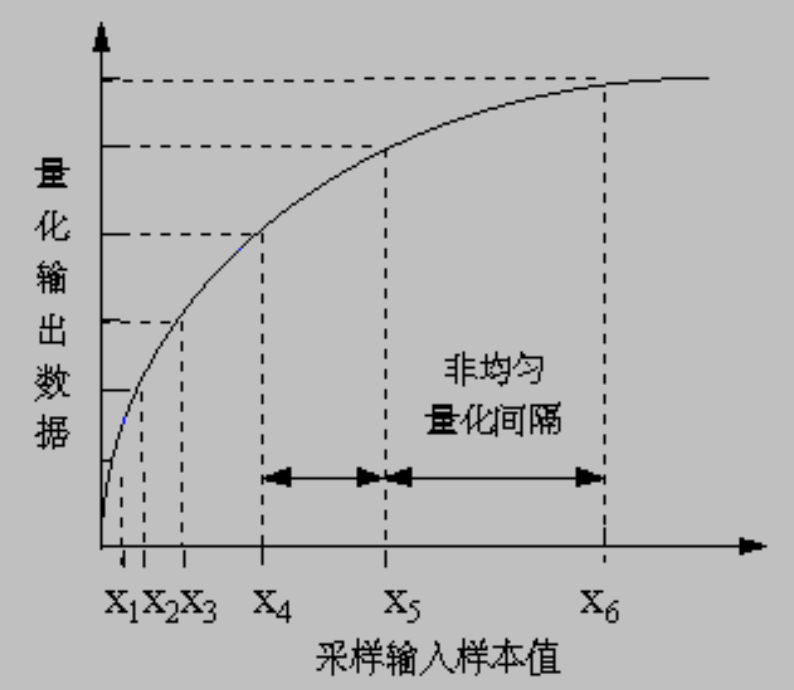

方程如下：

- u 律

    $$
    r = \dfrac{\text{sgn}(s)}{\ln (1 + \mu)} \ln \left\{1 + \mu \left|\dfrac{s}{s_p}\right|\right\}, \left|\dfrac{s}{s_p}\right| \le 1
    $$

- a 律

    $$
    r = \begin{cases}\dfrac{A}{1 + \ln A} \left(\dfrac{s}{s_p}\right), \\ \dfrac{\text{sgn}(s)}{1 + \ln A} \left[1 + \ln A \left|\dfrac{s}{s_p}\right| \right], \dfrac{1}{A} \le \left|\dfrac{s}{s_p}\right| \le 1 \end{cases}
    $$

    其中 $\text{sgn}(s) = \begin{cases}1, & \text{if } s > 0 \\ -1, & \text{otherwise} \end{cases}$

一些取值：

- $\mu = 100$ 或 $255$
- $A = 87.6$
- $s / s_p \in [-1, 1]$

    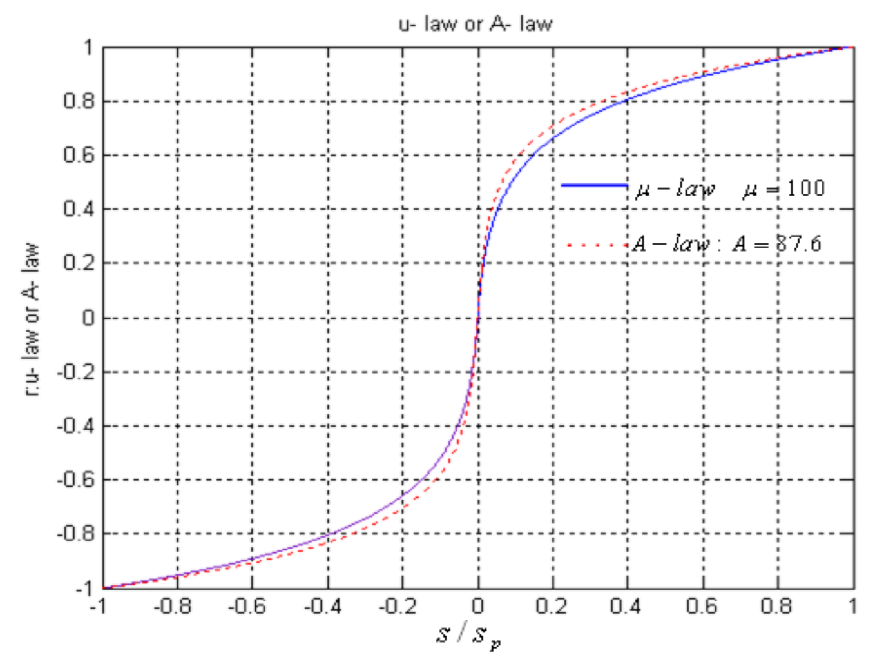

### Audio Filtering

在采样和模数转换之前，通过滤波音频信号来去除不需要的频率。保留的频率**取决于应用场景**：

- 语音信号：50Hz～10kHz
- 音频音乐信号：20Hz～20kHz
- 其他频率被**带通滤波器**(band-pass filter)（也称为限带(band-limiting)滤波器）所阻挡

### Audio Quality versus Data Rate

未压缩数据率随量化位数的增加而提高。我们用数据率与带宽的关系来衡量音频质量：

- 模拟设备中，带宽以频率单位 Hz 表示
- 数字设备中，则以每秒比特数（bps）衡量

| 质量 | 采样率（KHz）| 采样位数（Bits）| 单声道 / 立体声 | 数据传输率（未压缩（kB/sec）| 频带（KHz）|
| :--- | :--- | :--- | :--- | :--- | :--- |
| 电话 | 8 | 8 | 单声道 | 8 | 0.200-3.4 |
| AM 广播 | 11.025 | 8 | 单声道 | 11.0 | 0.1-5.5 |
| FM 广播 | 22.05 | 16 | 立体声 | 88.2 | 0.02-11 |
| CD | 44.1 | 16 | 立体声 | 176.4 | 0.005-20 |
| DAT | 48 | 16 | 立体声 | 192.0 | 0.005-20 |
| DVD 音频 | 192（最大）| 24（最大）| 6 声道 | 1,200（最大）| 0-96（最大）|

### Synthetic Sounds

数字声音转换为模拟信号的两种方法：

- **频率调制**(frequency modulation, **FM**)
    - 通过加入涉及第二个调制频率的项来改变载波正弦波

        $$
        X(t) = A(t)\cos[\omega_c \pi t + I(t)\cos(\omega_m \pi t + \phi_m) + \phi_c]
        $$

        - $A(t)$：包络度(envelope)，声音的响度
        - $I(t)$：通过改变调制频率产生谐波感
        - $\phi_c, \phi_m$：相位常数，用于创建时间偏移

        

            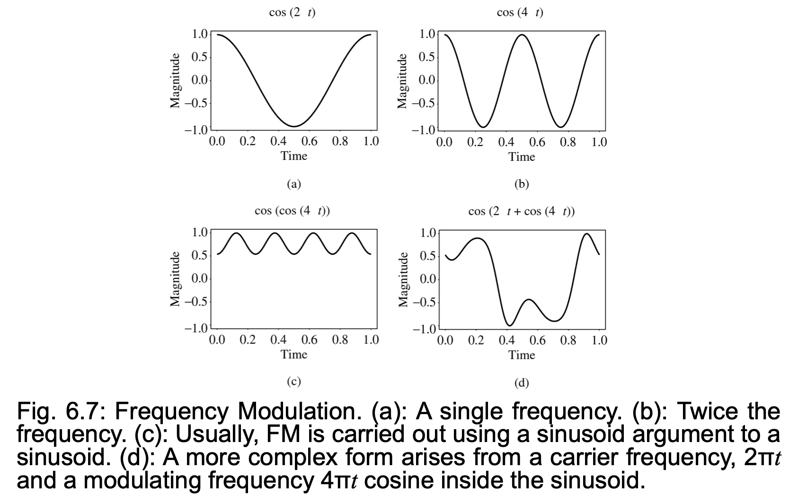
        

        

            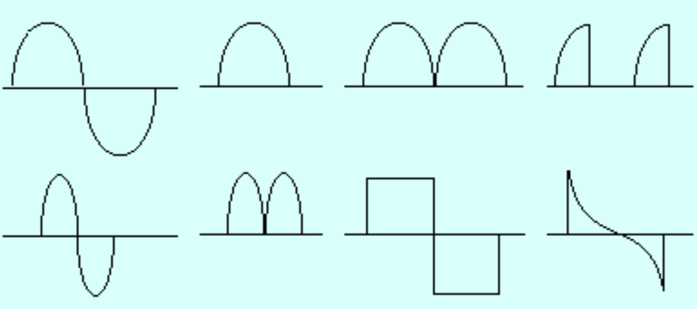
        

- **波表**(wave table)（更精确）：
    - 真实乐器的实际数字声音样本被存储下来
    - 由于波表存储在声卡内存中，因此可通过软件对声音操作，从而实现声音的合成、编辑和增强

## MIDI：Music Instrument Digital Interface

**MIDI**（乐器数字接口(music instrument digital interface)）是一种使音乐设备能够相互通信的协议。

- 发送给 MIDI 设备的是指令序列（**脚本语言**）而非音频信号，用于生成声音或执行某些操作
- 生成音乐的方法
    - FM 合成
    - 波表合成

相关术语：

- **合成器**(synthesizer)：
    - 一种声音发生器，可调节音高、响度与音色
    - 包含微处理器、键盘、控制面板及存储器等组件

- **序列器**(sequencer)：
    - 用于编辑音乐事件序列的硬件或软件设备
    - 配备一个或多个 MIDI 输入（IN）与输出（OUT）接口

- **通道**(channel)：
    - 分离 MIDI 消息
    - 16 个通道意味着对应 16 种乐器

- **音色**(timbre)：
    - 声音的品质，例如钢琴、小提琴等
    - 多音色：同时播放多种不同的声音（如钢琴、铜管乐、鼓等）

!!! abstract "MIDI vs MP3"

    - MIDI 文件是一系列指令的集合：体积非常小，通常约 10KB 大小；而 MP3 文件通常超过 2MB
    - MP3 的音质接近 CD 水平，但 MIDI 仅能生成简单的音乐旋律，无法还原人声演唱
    - 许多软件可将 MP3 转换为 MIDI 格式

## Quantization and Transmission of Audio

### Coding of Audio

**编码**(coding)是指对数据的量化与转换，利用音频信号中的**时间冗余性**(temporal rendundancy)来减小信号值的大小。

- 当前时刻与过去时刻信号的差异不仅能减少信号值的大小，还能将像素值（即差值）的直方图集中到更小的范围内
- 无损压缩方法能够产生更短的比特长度

生成音频量化输出的方法有：

- **PCM**（脉冲编码调制(pulse code modulation)）
- **DPCM**（差分脉冲编码调制）（PCM 的差分版本）
- **ADPCM**（自适应差分脉冲编码调制(adaptive DPCM)）

### Pulse Code Modulation

- 区间边界集合称为**决策边界**(decision boundaries)，表征值则称为**重建水平**(reconstruction levels)
- 量化器输入区间的边界若全部映射至同一输出水平，则构成了**编码器映射**(coder mapping)
- 作为量化器输出值的表征值属于**解码器映射**(decoder mapping)
- 最后，我们可能希望通过分配比特流来**压缩**数据，对最常见的信号值使用更少的位数

每种压缩方案都包含三个阶段：

1. 将输入数据**转换**(transform)为新的表示形式，这种形式更易于或更高效地进行压缩
2. 可能会引入信息**损失**，其中**量化**是主要的失真步骤 => 我们使用有限数量的重建级别，少于原始信号中的数量
3. **编码**：为每个输出级别或符号分配一个码字（从而形成二进制比特流），可以是固定长度编码，也可以是可变长度编码，如霍夫曼编码

语音压缩中的 PCM 技术

- 假设语音带宽约为 50Hz 至 10kHz，根据奈奎斯特采样定理，所需采样率应为 20kHz
- 若采用**无压扩**(companding)的均匀量化，最小可用样本量约为 12 位，因此单声道语音传输的比特率将达到 240kbps
- 引入**压扩**技术后，在保持相同感知质量的前提下可将样本量降至 8 位，从而使比特率降低至 160kbps
- 然而标准电话通信方案实际设定最高音频重现频率仅为 4kHz。故采样率只需 8kHz，经压扩处理的比特率可进一步降至 64kbps

然而，我们还需处理两个小问题：

1. 由于仅考虑最高 4kHz的声音信号，其他频率成分均视为噪声，因此需要从模拟输入信号中去除这些高频成分
    - 通过使用**带限滤波器**（能同时阻隔高频和极低频信号）来解决
    - 此外，当我们得到下图（a）所示的脉冲信号后，仍需进行数模转换并重构最终的输出模拟信号，但实际上最终得到的将是图（b）所示的阶梯状波形

    

        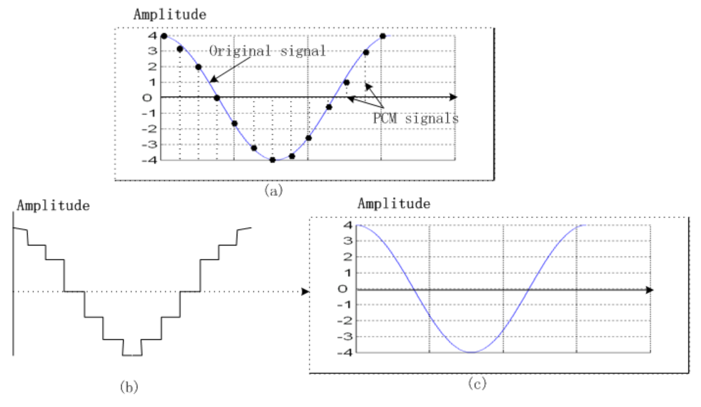
    

2. 不连续信号不仅包含原始信号的频率成分，还包含理论上无限多的高频成分
    - 这一结论源自信号处理中的**傅里叶分析**理论
    - 这些高频属于**额外引入**的成分
    - 因此数模转换器的输出需接入**低通滤波器**，仅保留不超过原始最高频率的信号

电话信号的完整编码与解码方案如下图所示。经过低通滤波处理后，输出信号变得平滑，上图（c）中展示了这一效果。

    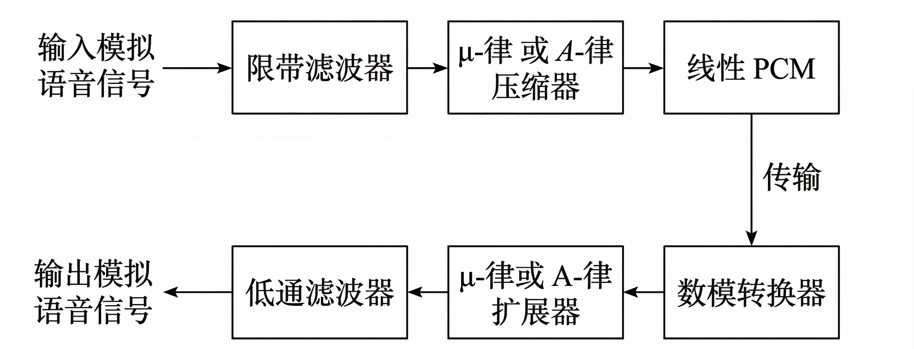

### Differential Coding of Audio

音频通常并非以简单的 PCM 形式存储，而是采用一种利用**差值**的形式。这些差值通常是较小的数值，因此可以用更少的比特位来存储。

如果一个随时间变化的信号在时间上具有一定的一致性（即**时间冗余性**），那么通过从前一个样本中减去当前样本得到的差分信号，其直方图将更加集中，且峰值出现在零附近。

    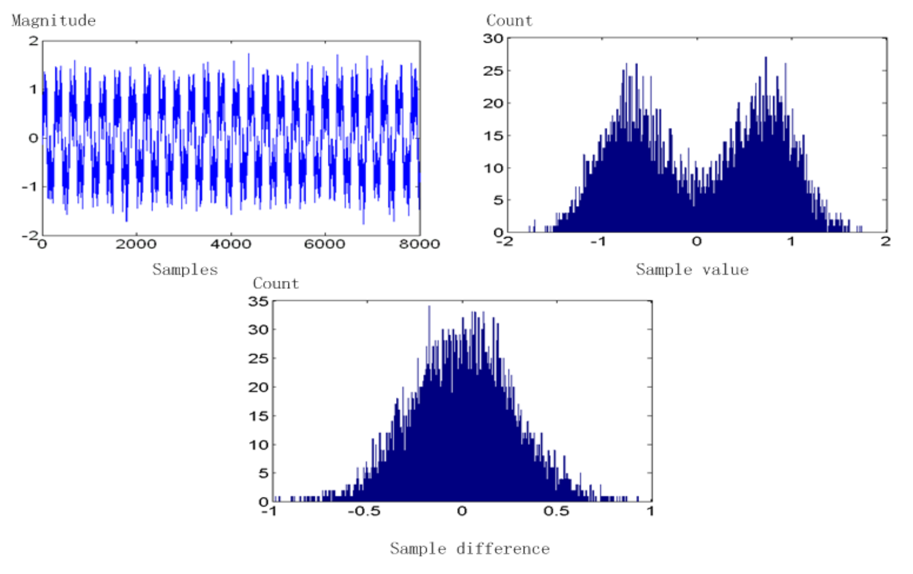

### Lossless Predictive Coding

**预测编码**(predictive coding)：简单来说就是传输差值。将下一个样本预测为等于当前样本；发送的不是样本本身，而是前后两个样本之差。

- 找出差值，并使用 PCM 系统来传输这些差值
- 注意整数的差值仍将是整数。将整数输入信号表示为值集 $f_n$，那么我们将**预测**值 $f_n$ 简单地视为前一个值，并将误差 $e_n$ 定义为实际信号与预测信号之间的差：

    $$
    \hat{f_n} = f_{n-1} \quad e_n = f_n - \hat{f_n}
    $$

- 但通常利用前几个值（如 $f_{n-1}, f_{n-2}, f_{n-3}$ 等）的某种函数能提供更优的预测；通常采用线性预测函数：

    $$
    \hat{f_n} = \sum_{k=1}^{2 \text{ to } 4} a_{n-k} f_{n-k}
    $$

    这种计算差值的思路使得采样值直方图的峰值更高

    

        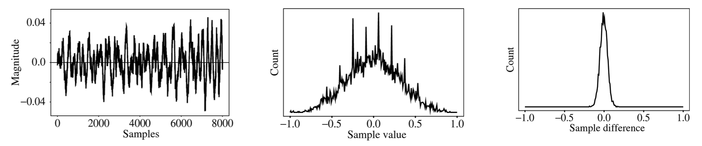
    

这里有一个问题：假设整数样本值范围在 0 到 255 之间，那么差值可能达到 -255 到 255，使得动态范围（最大值与最小值之比）扩大了一倍，因此需要更多比特来传输某些差值。

- 一个巧妙的解决方案是：定义两个新编码，分别称为 **SU** 和 **SD**，代表上移(shift-up)和下移(shift-down)，将保留一些特殊编码值用于这些操作
- 这样我们可以仅对有限的信号差值集合使用码字，比如只覆盖 -15 到 16 的范围
    - 处于该有限范围内的差值可以直接编码
    - 但通过额外增加 SU 和 SD 这两个值后，超出 -15 到 16 范围的数值可以通过一系列移位操作加上一个确实落在该范围内的值来传输

- 例如，100 的传输形式为：SU, SU, SU, 4，其中（编码）SU 和 4 即为被传输（或存储）的内容

---
无损预测编码的**解码器**将产生与原始信号相同的信号。举一个简单的例子，假设我们设计了一个如下所示的预测器：

$$
\begin{aligned}
\hat{f}_n &= \left\lfloor \frac{1}{2}(f_{n-1} + f_{n-2}) \right\rfloor \\
e_n &= f_n - \hat{f}_n
\end{aligned}
$$

让我们考虑一个具体的例子。假设我们希望编码序列 $f_1, f_2, f_3, f_4, f_5 = 21, 22, 27, 25, 22$。为了预测器的需要，我们将虚构一个额外的信号值 $f_0$，令其等于 $f_1 = 21$，并首先传输这个未经编码的初始值：

$$
\begin{aligned}
\widehat{f_{2}} &= 21, e_{2} = 22 - 21 = 1; \\
\widehat{f_{3}} &= \left\lfloor \frac{1}{2}(f_{2} + f_{1}) \right\rfloor = \left\lfloor \frac{1}{2}(22 + 21) \right\rfloor = 21, \\
e_{3} &= 27 - 21 = 6; \\
\widehat{f_{4}} &= \left\lfloor \frac{1}{2}(f_{3} + f_{2}) \right\rfloor = \left\lfloor \frac{1}{2}(27 + 22) \right\rfloor = 24, \\
e_{4} &= 25 - 24 = 1; \\
\widehat{f_{5}} &= \left\lfloor \frac{1}{2}(f_{4} + f_{3}) \right\rfloor = \left\lfloor \frac{1}{2}(25 + 27) \right\rfloor = 26, \\
e_{5} &= 22 - 26 = -4
\end{aligned}
$$

误差确实围绕零点分布，且编码（分配比特串码字）变得高效。下图展示了用于封装此类系统的典型示意图：

    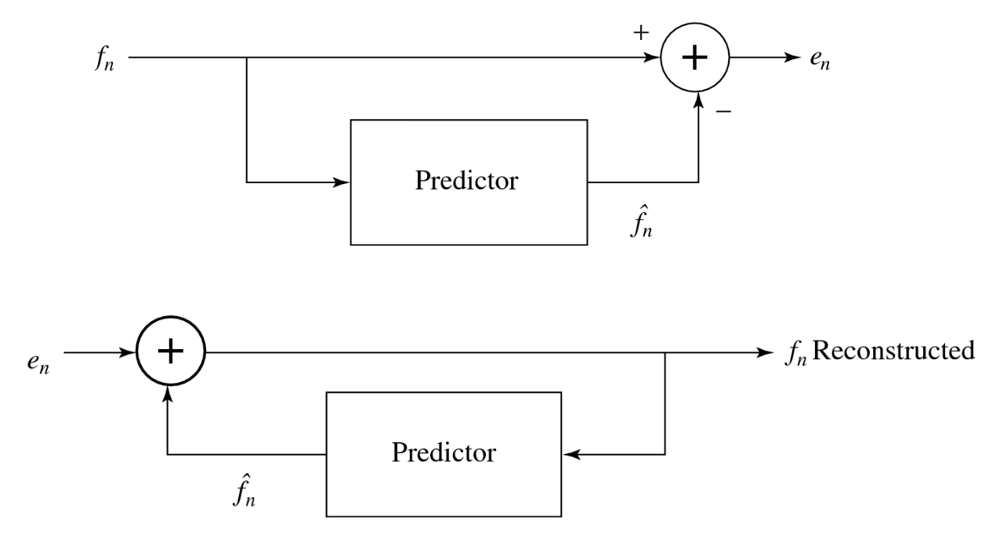

### DPCM

**差分脉冲编码调制**(differential PCM, **DPCM**)与预测编码完全相同，只是它增加了一个量化步骤。

$$
\begin{aligned}
& \hat{f}_n = \text{function\_of}(\tilde{f}_{n-1}, \tilde{f}_{n-2}, \tilde{f}_{n-3}, \dots) \\
& e_n = f_n - \hat{f}_n \\
& \tilde{e}_n = Q[e_n] \\
&\text{transmit\_codeword}(\tilde{e}_n) \\
& \text{reconstruct} : \tilde{f}_n = \hat{f}_n + \tilde{e}_n
\end{aligned}
$$

    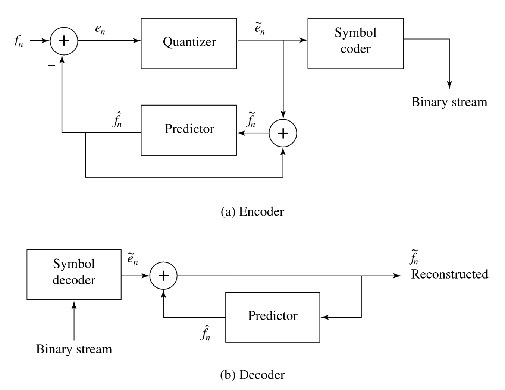

- 量化噪声 $f_n - \hat{f_n}$ 等于在误差项上的量化效果 $e_n - \hat{e}_n$
- 假设采用以下预测器 $\hat{f_n} = \text{trunc}(\hat{f}_{n-1} + \hat{f}_{n-2})$，所以 $e_n = f_n - \hat{f_n}$ 是整数
- 同时，采用量化方案：

$$
\begin{aligned}
\tilde{e}_n &= Q[e_n] = 16 \times \text{trunc}((255 + e_n) / 16) - 256 + 8 \\
\tilde{f}_n &= \hat{f}_n + \tilde{e}_n
\end{aligned}
$$

首先注意到误差范围在 -255 到 255 之间，即误差项有 511 个可能的级别。量化器简单地将这个误差范围划分为 32 个区间，每个区间大约包含 16 个级别。同时，它使每个区间的代表性重建值等于每组 16 个级别的中点位置。

| $e_n$ 范围 | 量化值 |
| :--- | :--- |
| -255 .. -240 | -248 |
| -239 .. -224 | -232 |
| . | . |
| . | . |
| . | . |
| -31 .. -16 | -24 |
| -15 .. 0 | -8 |
| 1 .. 16 | 8 |
| 17 .. 32 | 24 |
| . | . |
| . | . |
| . | . |
| 225 .. 240 | 232 |
| 241 .. 255 | 248 |

作为信号值流的一个示例，考虑以下集合：

$$
\begin{aligned}
f_1 && f_2 && f_3 && f_4 && f_5 \\
130 && 150 && 140 && 200 && 300
\end{aligned}
$$

预置额外的数值 $f = 130$ 以复制第一个值 $f_1$。使用量化误差 $\tilde{e}_1 = 0$ 进行初始化，使得第一个重建值是精确的：$\tilde{f}_1 = 130$。然后计算出的其余数值如下（方框内为预置值）：

$$
\begin{aligned}
\hat{f} &= \boxed{130}, & 130, 142, 144, 167 \\
e &= \boxed{0}, & 20, -2, 56, 63 \\
\tilde{e} &= \boxed{0}, & 24, -8, 56, 56 \\
\tilde{f} &= \boxed{130}, & 154, 134, 200, 223
\end{aligned}
$$

在解码端，我们同样假设额外的数值 $\tilde{f}$ 等于正确值 $f_1$，从而使第一个重建值 $\tilde{f}_1$ 是正确的。接收到的是 $\tilde{e}_n$，只要我们使用完全相同的预测规则，重建出的 $\tilde{f}_n$ 就与编码端的一致。

### DM

**DM**（差值调制(delta modulation)）：DPCM 的简化版本，常被用作快速的模数转换器。具体有以下实现方式：

- **均匀 DM**：仅使用单个量化误差值，可正可负
    - 一个 1 位编码器，产生阶梯状跟随原始信号的编码输出，其方程组为：

        $$
        \begin{aligned}
        \hat{f}_n &= \tilde{f}_{n-1}, \\
        e_n &= f_n - \hat{f}_n = f_n - \tilde{f}_{n-1}, \\
        \tilde{e}_n &= \begin{cases} +k & \text{if } e_n > 0, \text{where } k \text{ is a constant} \\ -k & \text{otherwise} \end{cases} \\
        \tilde{f}_n &= \hat{f}_n + \tilde{e}_n.
        \end{aligned}
        $$

    - 考虑实际数字，假如信号值为

        $$
        \begin{aligned}
        f_1 && f_2 && f_3 && f_4 \\
        10 && 11 && 13 && 15
        \end{aligned}
        $$

        同时，定义一个精确的重建值 $\hat{f_1} = f_1 = 10$

    - 比如使用步长值 = 4，可解得 $e_2 = 11 - 10 = 1, e_3 = 13 - 14 = -1, e_4 = 15 - 10 = 5$；重建后的数值集合 10、14、10、14 与正确的集合 10、11、13、15 相近
    - 然而 DM 在处理快速变化的信号时表现欠佳；缓解这一问题的一种方法是简单地提高采样率，可能达到奈奎斯特率的数倍之多

- **自适应 DM**：若实际信号曲线的斜率较高，阶梯近似法将难以跟上，因此对于陡峭的曲线，应自适应地调整步长 k

    

        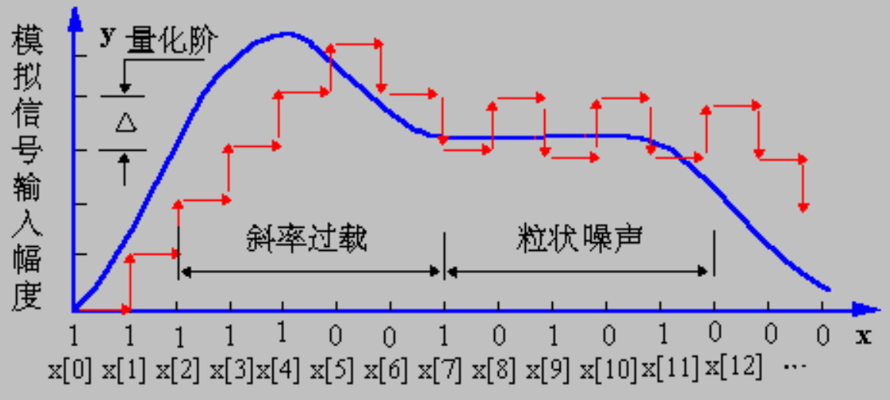
    

### ADPCM

**ADPCM**（自适应差分脉冲编码调制）进一步调整编码器以适应输入。

- 调整量化步长以匹配输入特性：
    - 利用输入信号的属性；**前向自适应量化**
    - 利用量化输出的属性；**后向自适应量化**

- 自适应预测编码：**动态调整预测系数**
    - 若采用 $M$ 个先前值，则对应 $M$ 个系数 $a_i\ (i = 1, \dots, M)$
    - 通过**最小二乘法**确定最优的 $a_i$ 取值

        $$
        \hat{f}_n = \sum_{i=1}^{M} a_i \tilde{f}_{n-i} \quad \min \sum_{n=1}^{N} (f_n - \hat{f}_n)^2
        $$

