# Lossless Compression Algorithms

## Introduction and Basics of Information Theory

### Background

随着计算机技术的进步，越来越多的数据有转为数字形式的需求，比如图书馆、博物馆、政府部门等。他们不仅要实现无损存储，还需通过压缩来减少所需存储位数。由于**不同数据出现频率各异**，很自然地，我们可以**为高频数据分配较少位数**来表示（比如 VCL 技术就利用了这一点）。

而所谓的「**无损编码**」(lossless coding)就是指压缩与解压过程中均不产生信息损失。


### Data Compression Scheme

**压缩比**(compression ratio) = B0 / B1

- B0：压缩前的位数
- B1：压缩后的位数

压缩比必须大于 1.0，且压缩比越大，说明该无损压缩方案越好。

<div style="text-align: center">
    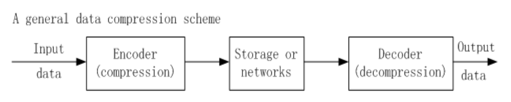
</div>


### Basics of Information Theory

对于字母表 $S = \{s_1, s_2, \dots, s_n\}$，信源的**熵**(entropy)（系统无序程度的度量，值越大代表越无序）为：

$$
\eta = H(S) = \sum_{i=1}^n p_i \log_2 \frac{1}{p_i} = -\sum_{i=1}^n p_i \log_2 p_i
$$

其中 $p_i$ 是符号 $s_i$ 出现在 $S$ 中的概率，而 $\log_2 \dfrac{1}{p_i}$ 表示该符号包含的信息量（**自信息**(self-information)）。比如手稿中字母 n 出现的概率为 1/32，那么它包含的信息量为 5 位；相应地，字符串 nnn 就需编码为 15 位。

根据上述公式，

- **经常出现的符号能够用更短的码字表示**
- 熵是项 $\log_2 \dfrac{1}{p_i}$ 的加权和；因此，它代表了源 $S$ 中每个符号所含的平均信息量
- 熵指定了编码 $S$ 中每个符号所需平均比特数的下界，即 $\eta \le \bar{l}$，其中 $\bar{l}$ 表示编码器产生码字的平均长度（单位：位）

???+ example "例子"

    <div style="text-align: center">
        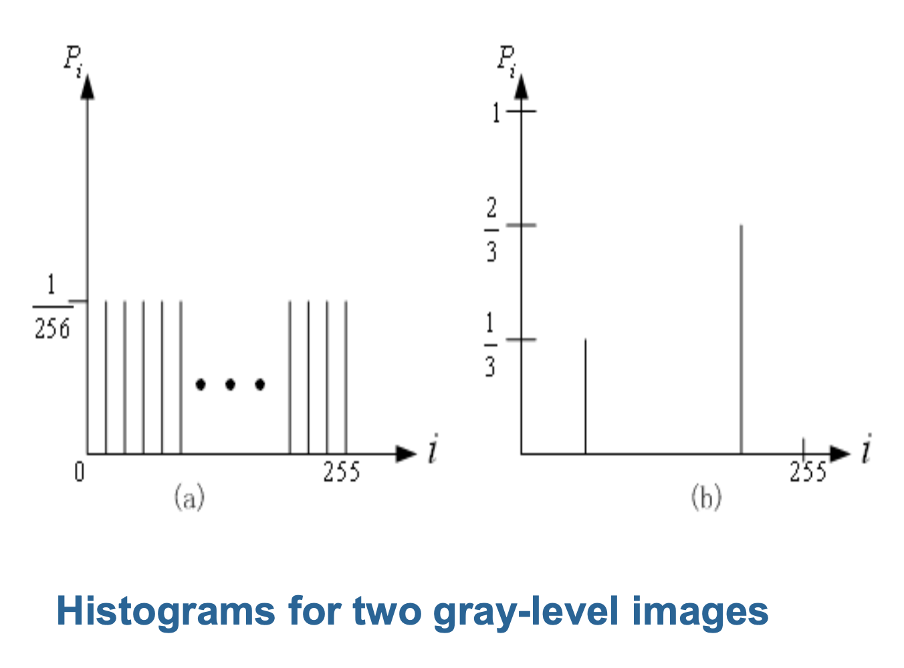
    </div>

    这两幅图对应的熵分别为：

    - $\eta_1 = \sum_{i=0}^255 \dfrac{1}{256} \log_2 256 = 8$
    - $\eta_2 = \dfrac{1}{3} \cdot \log_2 3 + \dfrac{2}{3} \cdot \log_2 \dfrac{3}{2} = 0.92$

    因此，当概率分布平坦时，熵较大；当概率分布更集中时，熵较小。


## Lossless Coding Algorithms

### Run-Length Coding

**游程编码**(run-length coding, **RLC**)是最简单的数据压缩形式之一。它的基本思想是：如果信源的符号倾向于形成连续组，那就对这样**一个符号及其组的长度进行编码**，而不是单独对每个符号进行编码。

- 减少编码所需的采样数
- 实现简单

应用场景：二值图像的编码。

???+ example "例子"

    === "例1"

        - 输入序列：0,0,-3,5,1,0,-2,0,0,0,0,2,-4,3,-2,0,0,0,1,0,0,-2
        - 游程序列：(2,-3)(0,5)(0,1)(1,-2)(4,2)(0,-4)(0,3)(0,-2)(3,1)(2,-2)

    === "例2"

        <div style="text-align: center">
            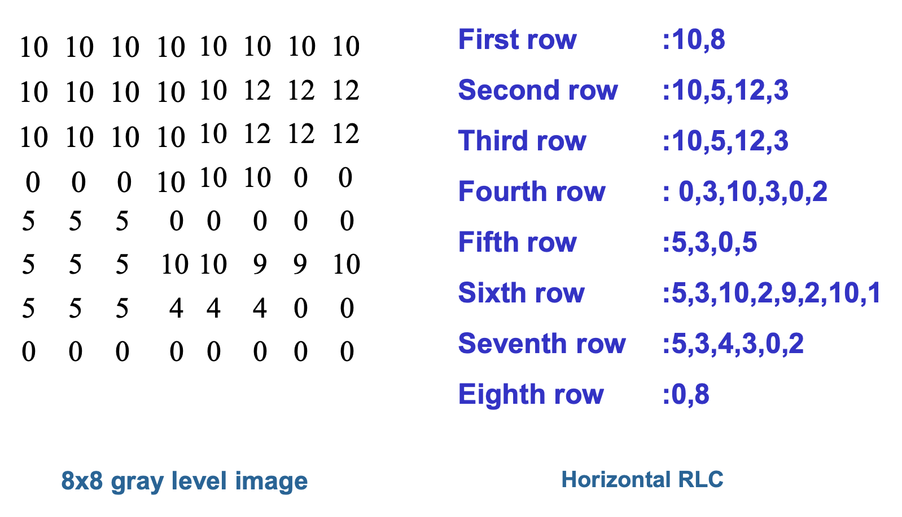
        </div>


### Variable-Length Coding

**变长编码**(variable-length coding, **VLC**)是最知名的熵编码方法之一，具体有以下算法：

- **香农-范诺算法**(Shannon-Fano algorithm)
- **霍夫曼编码**(Huffman coding)
- **自适应霍夫曼编码**(adaptive Huffman coding)


#### Shannon-Fano Algorithm

>该算法由香农和范诺独立提出的。

这是一种**自顶向下**的算法：

- 根据符号出现的频率计数**对符号进行排序**
- **递归地将符号划分为两部分**，每部分具有大致相同的计数，直至所有部分仅包含一个符号

一种实现上述过程的方式是构建一棵二叉树。

???+ example "例子"

    <div style="text-align: center">
        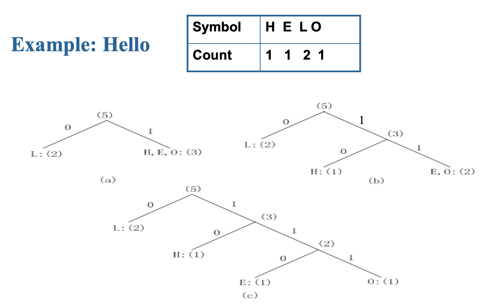
    </div>

    - 熵 = 0.4×1.32 + 0.2×2.32 + 0.2×2.32 + 0.2×2.32 = 1.92
    - 每个字母的平均位数为 2

        <div style="text-align: center">
            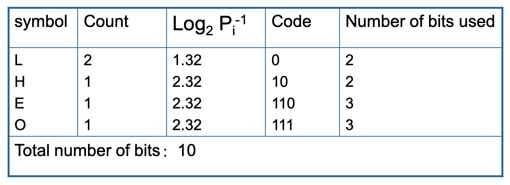
        </div>


#### Huffman Coding

>由 David A. Huffman 于 1952 年首次提出。

应用场景：传真、JPEG、MPEG 等。

**霍夫曼编码**是一种自底向上的方法：

- 初始化：将所有符号**按频率计数排序**后放入列表
- 重复以下步骤，直到列表中仅剩一个符号：
    - 从列表中选取**两个频率最低的符号**，构建一个霍夫曼子树，将这两个符号作为子节点，并**为它们创建一个父节点**
    - 将子节点的频率之和赋给父节点，并将其插入列表以保持顺序
    - 从列表中删除这两个子节点

- 根据从根到叶子的路径为每个叶子分配编码

???+ example "例子"

    === "例1"

        <div style="text-align: center">
            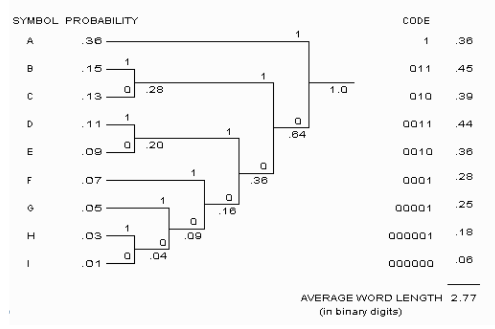
        </div>

    === "例2"

        <div style="text-align: center">
            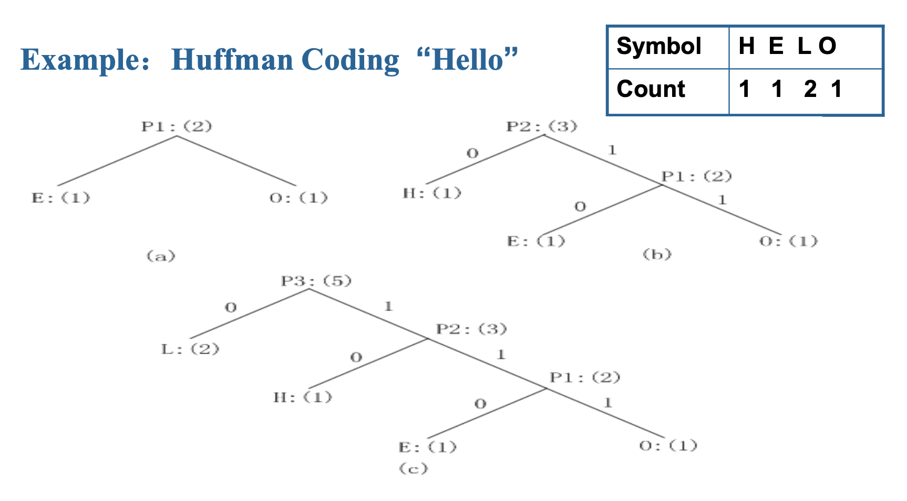
        </div>

        对于此例，霍夫曼编码产生了和 S-F 算法相同的结果。

!!! note "性质"

    - **唯一前缀**(unique prefix)：任何霍夫曼编码都不会是其他霍夫曼编码的前缀，确保了解码过程无歧义
    - **最优性**(optimality)：对于给定的数据模型（即一个准确的概率分布），**最小冗余码**(minimum redundancy code)被证明是最优的：
        - 两个出现频率最低的符号，其霍夫曼编码长度相同，仅在最后一位有所不同
        - 出现频率较高的符号将拥有比低频符号更短的霍夫曼编码
        - 信源 $S$ 的平均码长严格小于 $\eta + 1$。结合公式 $n \le \bar{l}$，可以得到：$\bar{l} < \eta + 1$


#### Extended Huffman Coding

霍夫曼编码中的所有码字都具有整数位长度。当概率 $p_i$ 非常大，因而 $\log_2 \dfrac{1}{p_i}$ 接近 0 时，这种做法是浪费的————或许可以考虑将多个符号组合在一起，并为整个组分配一个单一的码字。

于是引入了**扩展字母表**(extended alphabet)：对于字母表 $S = \{s_1, s_2, \dots, s_n\}$，如果将 $k$ 个符号组合在一起，那么扩展后的字母表为：

$$
S^{(k)} = \{ \overbrace{s_1 s_1 \dots s_1}^{k \text{ symbols}} , s_1 s_1 \dots s_2 , \dots , s_1 s_1 \dots s_n , s_1 s_1 \dots s_2 s_1 , \dots , s_n s_n \dots s_n \} .
$$

新的字母表大小为 $n^k$。可以被证明，每个符号的平均位数为 $\eta \le \bar{l} < \eta + \dfrac{1}{k}$。相比原来的霍夫曼编码有改进，但进步不大。

问题在于：如果 $k$ 相对较大（比如 $k \ge 3$），那么在大多数实际应用中，当 $n \gg 1$ 时，意味着会产生一张巨大的符号表，这显然是不现实的。


#### Adaptive Huffman Coding

传统的霍夫曼编码需要掌握信源的**先验统计知识**，而这往往难以实现。即便统计信息可用，**传输符号表**本身也会带来很大的开销。

**自适应算法**能够在数据流到达时动态收集并更新统计信息。并且概率计算不再依赖先验知识，而是基于当前**已接收的实际数据**。

自适应霍夫曼编码的基本思路是：

- 初始代码（`Initial_code`）：为符号分配一些预先约定好的编码
- 更新树（`update_tree`）：构建自适应的霍夫曼树
    - 增加对应符号的频率计数
    - 更新树的配置

- 编码器和解码器必须使用完全相同的初始代码和更新树程序

<div class="grid" markdown>

```c title="ENCODER"
Initial_code();
while not EOF {
    get(c);
    encode(c);
    update_tree(c);
}
```

```c title="DECODER"
Initial_code();
while not EOF {
    decode(c);
    output(c);
    update_tree(c);
}
```

</div>

!!! note "关于树更新"

    - 节点按从左到右、自下而上的顺序编号；括号内的数字表示计数
    - 树必须始终保持其兄弟属性，即所有节点（内部节点和叶节点）均按计数递增的顺序排列；若即将违反兄弟属性，则调用交换程序通过重新排列节点来更新树结构
    - 当需要交换时，将计数为 N 的最远节点与计数刚增至 N+1 的节点进行位置互换

    ??? example "例子"

        <div style="text-align: center">
            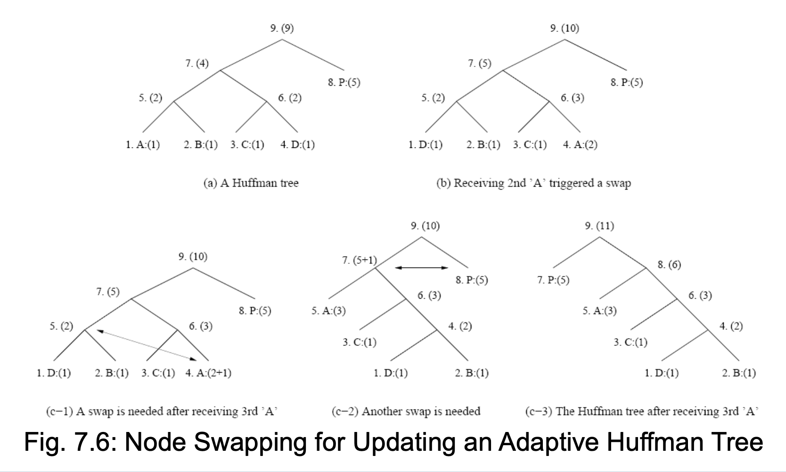
        </div>

???+ example "例子"

    - 为了更清晰地说明实现细节，下面将确切展示发送了哪些比特，而不是仅仅描述树是如何更新的
    - 额外规则：如果任何字符/符号是首次发送，其前必须有一个特殊符号 `NEW`
        - `NEW` 的初始编码为 `0`
        - `NEW` 的计数始终保持为 `0`（计数永不增加）
        - 因此，在图中它始终表示为 `NEW:(0)`

            <div style="text-align: center">
                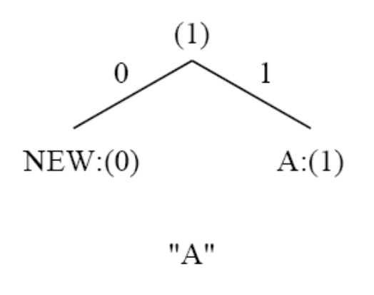
            </div>

    下面展示了使用自适应霍夫曼编码为字符串 AADCCDD 进行初始码字分配：

    <div style="text-align: center">
        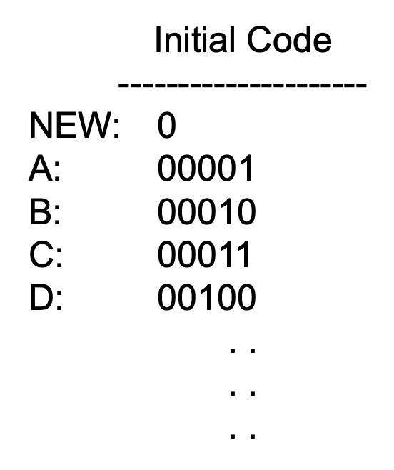
    </div>

    <div style="text-align: center">
        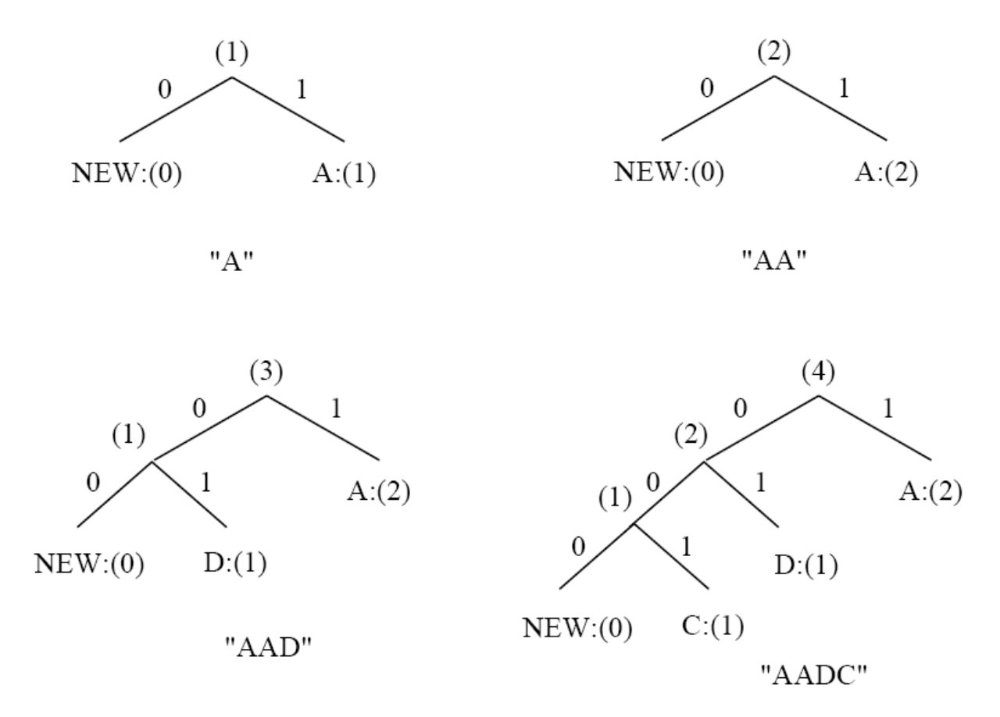
    </div>

    <div style="text-align: center">
        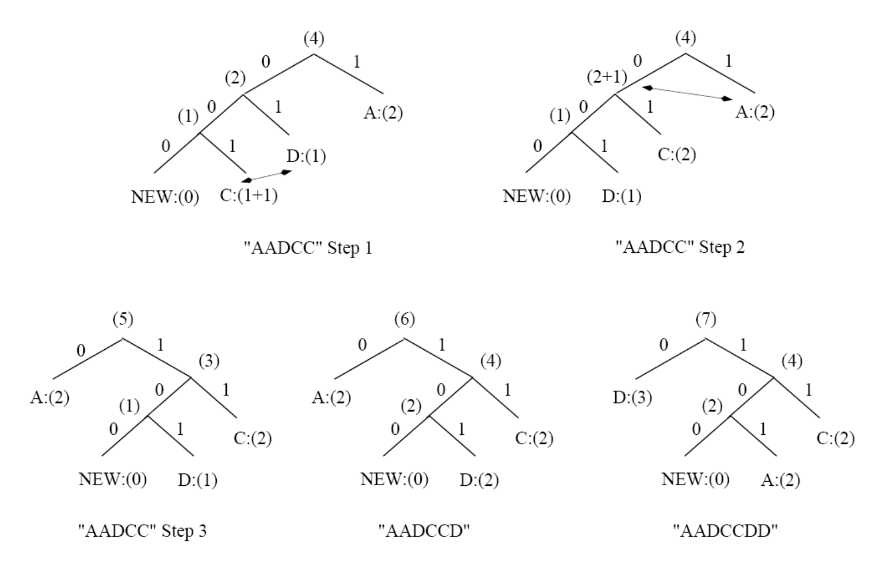
    </div>

    <div style="text-align: center">
        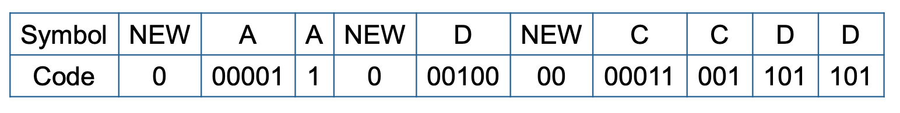
    </div>

    需要强调的是，在自适应霍夫曼编码过程中，特定符号的代码会发生变化。例如，在序列 AADCCDD 之后，当字符 D 超越 A 成为最频繁出现的符号时，其代码从 101 变为 0。


### Dictionary-Based Coding

>该算法分别由 Ziv 和 Lempel 于 1977 年及 1978 年首次提出。Terry Welch 在 1984 年对该技术进行了改进。因此该算法又称为 Lempel-Ziv-Welch 算法（简称 **LZW 压缩**）。

应用场景：UNIX 的 compress 工具，GIF，以及调制解调器的 V.42 bis 标准中。

LZW 算法的思路：

- 采用固定长度的码字来表示经常一起出现的变长符号/字符串（例如英文文本中的单词）
- 编码器和解码器在接收数据时动态地构建相同的字典
- 将越来越长的重复条目存入字典中，如果某个元素已存在于字典内，则输出该元素的代码而非字符串本身

LZW 压缩算法的伪代码如下：

```c
BEGIN
    s = next input character;
    while not EOF {
        c = next input character;

        if s + c exists in the dictionary
            s = s + c;
        else {
            output the code for s;
            add string s + c to the dictionary with a new code;
            s = c;
        }
    }
    output the code for s;
END
```

???+ example "例子"

    现在从一个非常简单的字典（也称为“字符串表”）开始，最初只包含 3 个字符，其编码如下：

    |编码|字符串|
    |:-:|:-:|
    |1|A|
    |2|B|
    |3|C|

    如果输入字符串是 ABABBABCABABBA，LZW 压缩算法的工作流程如下：

    <div style="text-align: center">
        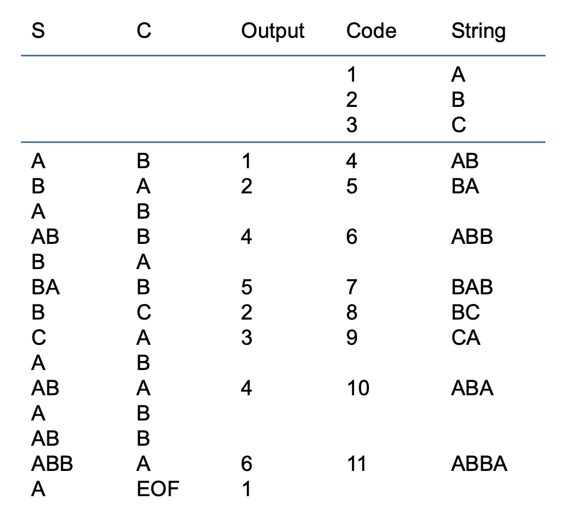
    </div>

    输出编码为：1 2 4 5 2 3 4 6 1。压缩比 = 14/9 = 1.56。

LZW 解压算法的伪代码如下（简单版本）：

```c
BEGIN
    s = NIL;
    while not EOF {
        k = next input code;
        entry = dictionary entry for k;
        output entry;
        if (s != NIL)
            add string s + entry[0] to dictionary with a new code;
        s = entry;
    }
END
```

???+ example "例子"

    现在用 LZW 解压缩字符串 ABABBABCABABBA。其中解码器的输入码为 1 2 4 5 2 3 4 6 1。而初始字符串表与编码器使用的完全相同。

    <div style="text-align: center">
        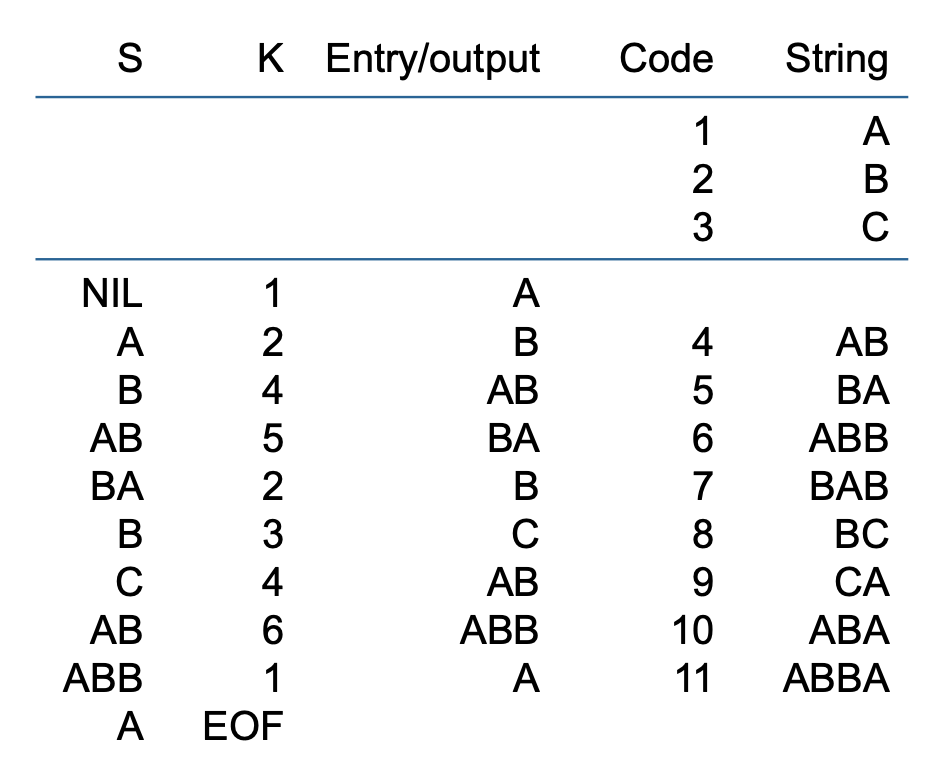
    </div>

    输出字符串是 ABABBABCABABBA，说明这是一个真正无损的结果。

改进后的 LZW 解压算法的伪代码如下：

```c
BEGIN
    s = NIL;
    while not EOF {
        k = next input code;
        entry = dictionary entry for k;

        /* exception handler */
        if (entry == NULL)
            entry = s + s[0];

        output entry;
        if (s != NIL)
            add string s + entry[0] to dictionary with a new code;
        s = entry;
    }
END
```

???+ example "例子"

    <div style="text-align: center">
        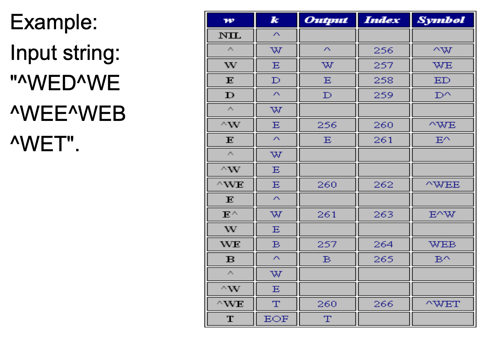
    </div>

    <div style="text-align: center">
        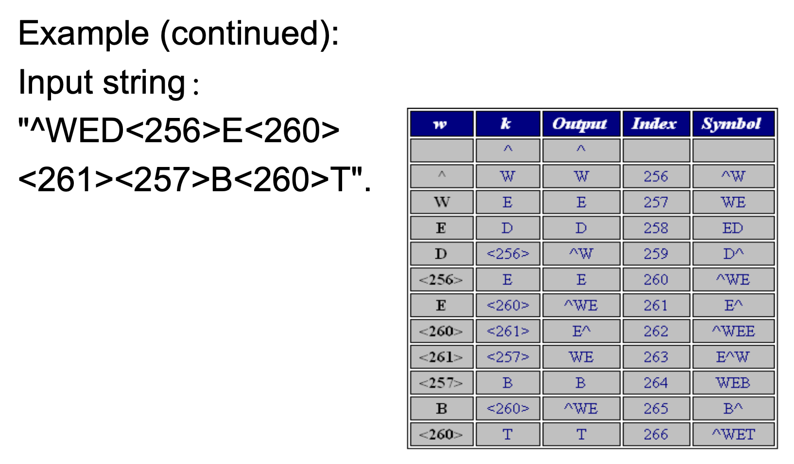
    </div>


### Arithmetic Coding

**算术编码**是一种更为现代的编码方法，通常性能优于霍夫曼编码。霍夫曼编码为每个符号分配一个具有整数位长度的码字；而算术编码可以将整个消息视为一个单元进行处理。

基本思路：

- 通过一个包含在 [0,1] 内的半开区间 [a, b) 来**表示整个消息**
- 区间 [a, b) 的长度等于**消息的概率**；从该区间中选取一个小数，并将其转换为二进制形式作为编码输出
- **每个字符都能缩短这个区间**，因此字符越多，区间就会变得越短
- 随着区间的缩短，需要更多的比特位来表示这个区间

???+ example "例子"

    <div style="text-align: center">
        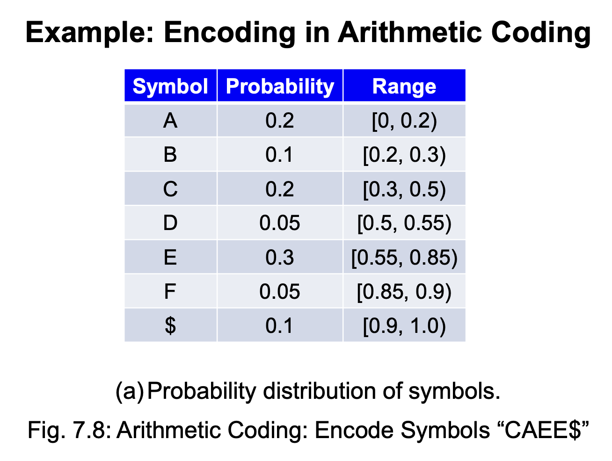
    </div>

    <div style="text-align: center">
        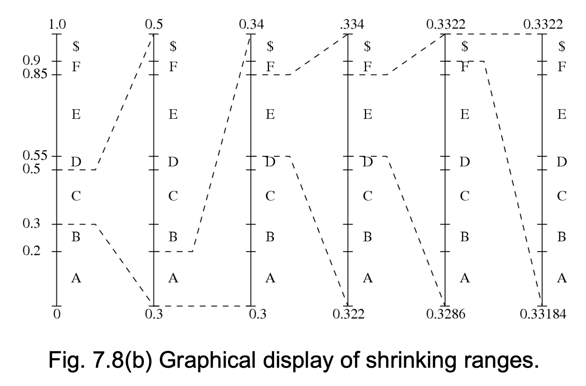
    </div>

    <div style="text-align: center">
        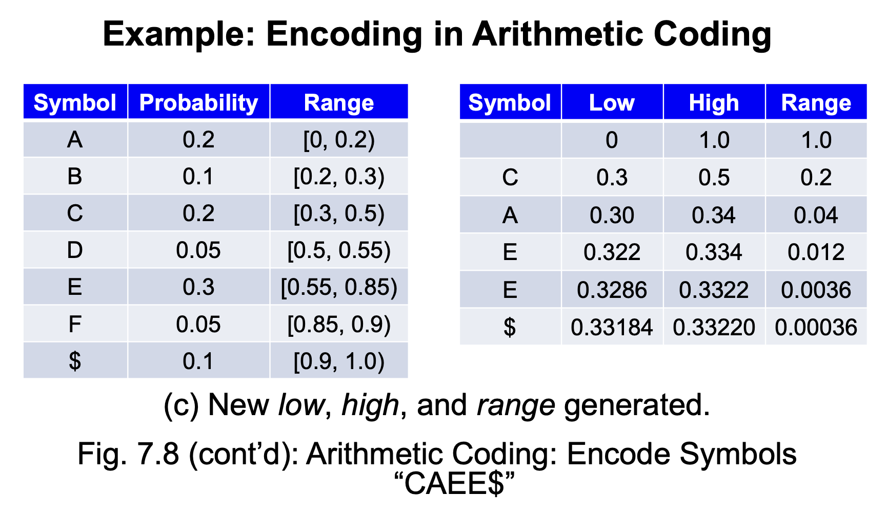
    </div>

编码器伪代码如下：

```c
BEGIN
    code = 0;
    k = 1;
    while (value(code) < low) {
        assign 1 to the kth binary fraction bit
        if (value(code) > high)
            replace the kth bit by 0
        k = k + 1;
    }
END
```

>对于上例，输出为：0.01010101

解码器伪代码如下：

```c
BEGIN
    get binary code and convert to
    decimal value = value(code);
    Do {
        find a symbol s so that
            Range_low(s) <= value < Range_high(s);
        output s;
        low = Range_low(s);
        high = Range_high(s);
        range = high - low;
        value = [value - low] / range;
    }
    Until symbol s is a terminator
END
```

???+ example "接着前面的例子"

    <div style="text-align: center">
        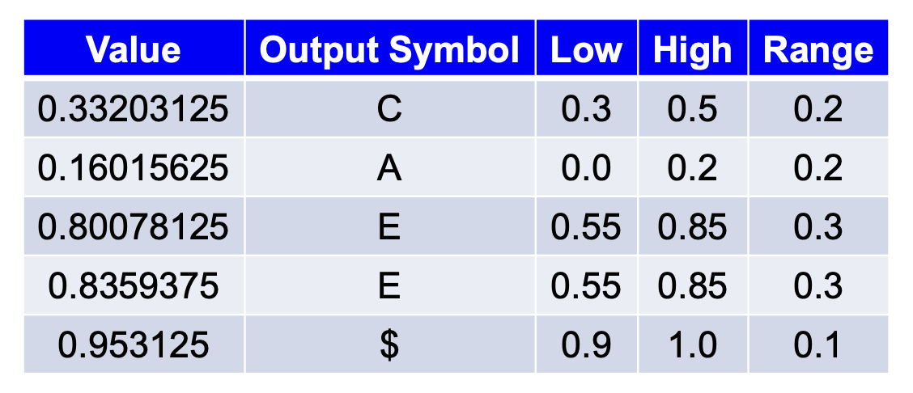
    </div>


## Lossless Image Compression

### Differential Coding of Images

**差分编码**(differential coding)是多媒体数据压缩中最常用的技术之一。差分编码中数据缩减的基础是数据流中**连续符号间存在的冗余性**。

给定原始图像 $I(x, y)$，定义差分图像 $d(x, y)$：

- **简单差分算子**：$d(x, y) = I(x, y) - I(x-1, y)$
- **离散 2D 拉普拉斯算子**：$d(x, y) = 4I(x, y) - I(x, y-1) - I(x, y+1) - I(x+1, y) - I(x-1, y)$

由于正常图像中存在空间冗余，差分图像 $d$ 将具有更窄的直方图分布，从而获得更小的熵值。

- **VLC**：为差分图像分配更短的比特长度
- 压缩算法在差分图像上表现更优

???+ example "例子"

    <div style="text-align: center">
        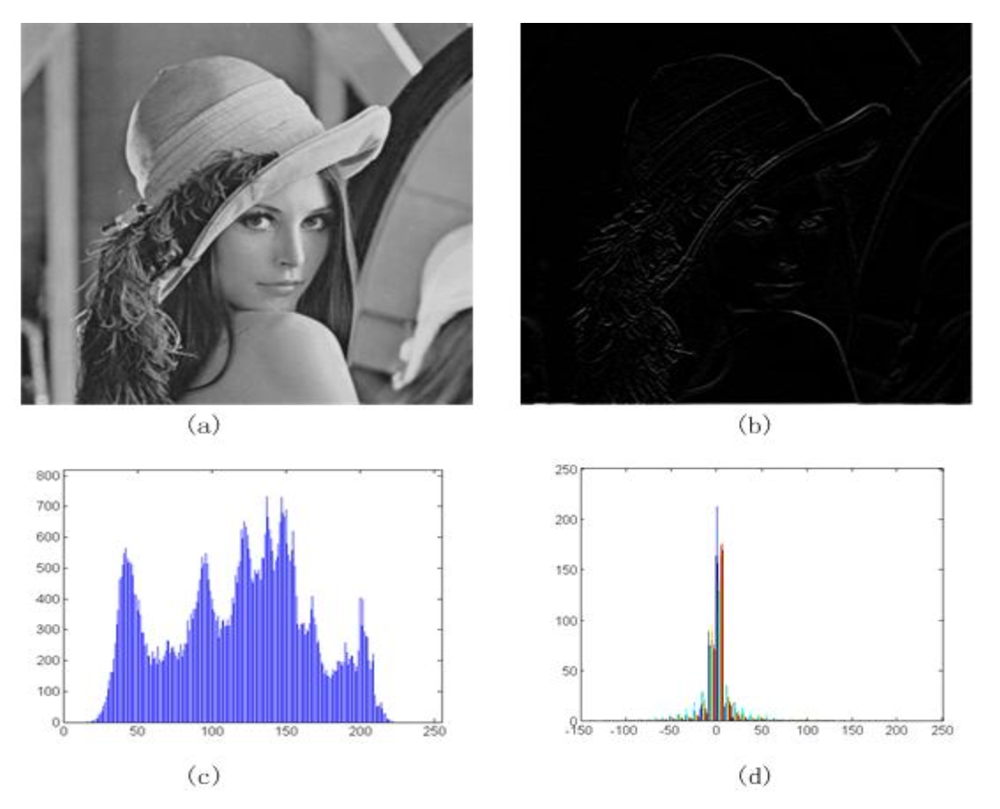
    </div>


### Lossless JPEG

**无损 JPEG** 是 JPEG 图像压缩的一种特殊形式。它的思路如下：

1. **形成差分预测**：预测器结合最多三个相邻像素的值作为当前像素的预测值，如下图中标记为 'X' 的位置所示。该预测器可采用下表所列七种方案中的任意一种

    <div style="text-align: center">
        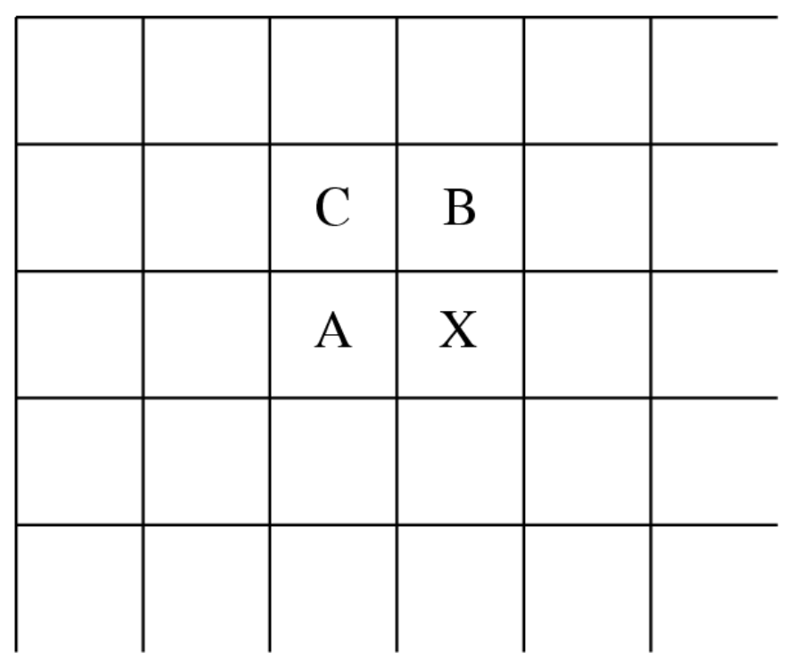
    </div>

    >注：在编码-解码循环的解码器端，A、B 或 C 中的任何一个在使用于预测器之前都已被解码。

    <div style="text-align: center">
        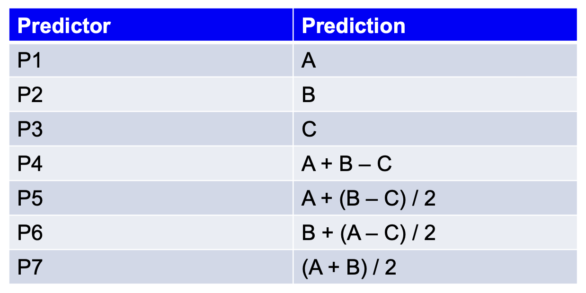
    </div>

2. **编码**：编码器将预测值与位置 'X' 处的实际像素值进行比较，并使用之前介绍过的某一种无损压缩技术（比如霍夫曼编码方案）对差值进行编码。

???+ abstract "和其他无损压缩程序比较"

    <div style="text-align: center">
        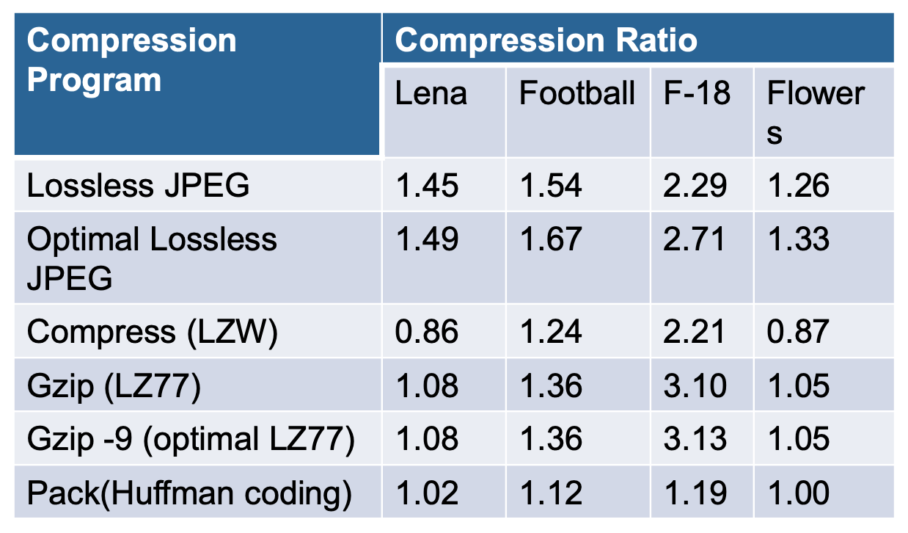
    </div>