# Lossy Compression Algorithms

## Introduction

无损压缩算法无法提供足够高的压缩比。因此，大多数多媒体压缩算法采用有损方式。**有损压缩**(lossy compression)后的数据与原始数据不完全相同，而是其近似值，但相比无损压缩能实现更高的压缩比率。

## Distortion Measures

### Concept of Distortion

**失真度量**(distortion measure)是一种数学量，用于衡量近似值与原值的接近程度，通常以数值差来考量。但在图像数据中，差值可能无法反映预期效果，因而测量的是感知上的失真。

### Numerical Distortion Measures

最常用的失真度量如下：

- **均方误差**(mean square error, **MSE**)（平均像素差）：$\sigma^2 = \dfrac{1}{N} \sum\limits_{n=1}^N (x_n - y_n)^2$
- **信噪比**(signal-to-noise ratio, **SNR**)（相对于信号的误差大小）：$\text{SNR} = 10\log_{10} \dfrac{\sigma_x^2}{\sigma_d^2}$
- **峰值信噪比**(peak-signal-to-noise ratio, **PSNR**)（相对于峰值信号的误差大小）：$\text{PSNR} = 10\log_{10} \dfrac{x_{\text{peak}}^2}{\sigma_d^2}$

???+ example "例子"

    

        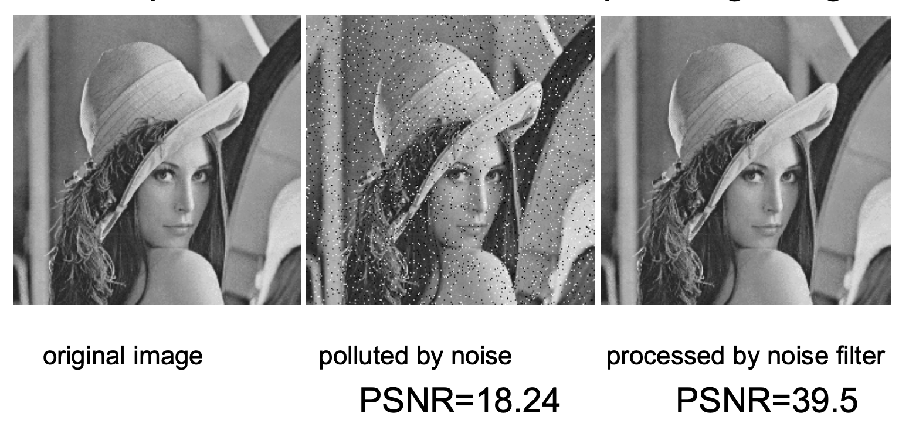
    

## The Rate-Distortion Theory

### Concept

有损压缩总是在速率与失真之间进行权衡

- 码率：每个信源符号所需的平均比特数
- $R(D)$：**率失真函数**(rate-distortion function)
    - 在保证失真度不超过 $D$ 的条件下，对信源数据进行编码所需的最低码率
    - 当 $D=0$ 时无损失，此时即为信源数据的熵值
    - 描述了编码算法性能的基本极限，可用于评估不同算法的性能表现

### A Typical R-D Function

下图展示了一段典型的 R-D 函数曲线：

    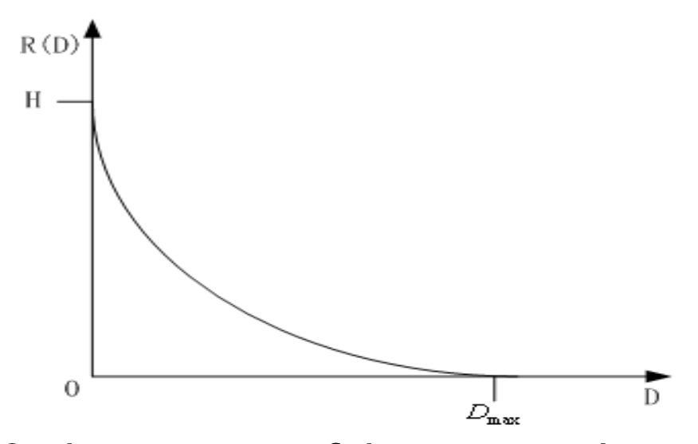

- $D＝0$：源数据的熵
- $R(D)＝0$：未编码任何内容
- 对于给定的信源，很难找到率失真函数的**封闭解析描述**(closed-form analytic description)

## Quantization

### Functions of Quantization

量化是任何有损方案的核心

- 若没有量化，那么几乎不会丢失信息
- 通过量化减少不同值的数量，因此它是有损压缩中「损失」的主要来源
- 每个**量化器**(quantizer)都有其独特的输入范围划分和输出值集合
    - 标量量化器
        - 均匀型
        - 非均匀型
    - 矢量量化器

### Uniform Scalar Quantization

**均匀标量量化器**将输入域划分为等间距的区间，并由以下几部分构成：

- **决策边界**：划分区间的**端点**
- 输出值：区间的**中点**
- 步长：每个区间的长度

有以下两种类型的均匀标量量化器：

- **midrise**（中升型）：具有偶数个输出级别，其中一个分区区间包含零点
- **midtread**（中平型）：奇数个输出级别，0 是其中一个输出值

设计一个成功的均匀量化器的目标是在给定源输入和期望的输出值数量下**最小化失真**。

给定步长 $\Delta = 1$，两类量化器的输出值为：

$$
\begin{aligned}
Q_{\text{midrise}}(x) & = \lceil x \rceil - 0.5 \\
Q_{\text{midread}}(x) & = \lfloor x + 0.5 \rfloor
\end{aligned}
$$

    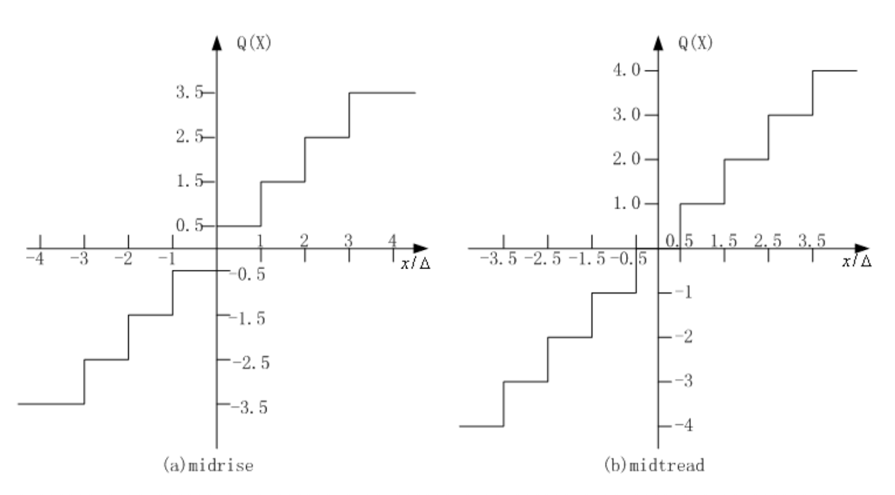

M 级量化器的性能：

- 决策边界：$B = \{b_0, b_1, \dots, b_M\}$
- 输出值集合：$Y = \{y_1, y_2, \dots, y_m\}$
- 输入**均匀分布**于区间 $[-X_{\max}, X_{\max}]$
- 量化器码率：$R = \log_2 M$，其中 $R$ 表示编码 $M$ 个状态所需的比特数
- 步长：$\Delta = 2X_{\max} / M$
- **粒度失真**(granular distortion)：由量化器对有限输入产生的误差
- **过载失真**(overload distortion)：当输入值大于 $X_{\max}$ 或小于 $-X_{\max}$ 时，量化器引起的误差

midrise 量化器的粒度失真：

- 决策边界 $b_i = [(i-1)\Delta, i\Delta], i = 1, ..., M/2$，覆盖正数据 $X$（另一组对应原始 $X$ 值）
- 输出值 $y_i: i\Delta - \Delta/2，i=1, ..., M/2$
- 总失真量：正数据求和结果的两倍

    $$
    D_{gran} = 2 \sum_{i=1}^{\frac{M}{2}} \int_{(i-1)\Delta}^{i\Delta} \left( x - \frac{2i-1}{2}\Delta \right)^2 \frac{1}{2X_{\max}}
    $$

- 在 $X$ 处的误差值为 $e(x) = x - \Delta/2$，误差的**方差**：

    $$
    \sigma_d^2 = \frac{1}{\Delta} \int_0^\Delta (e(x) - \bar{e})^2 dx = \frac{1}{\Delta} \int_0^\Delta \left( x - \frac{\Delta}{2} - 0 \right)^2 dx = \frac{\Delta^2}{12}
    $$

- 符号方差 $\sigma^2_x = (2 X_{\max})^2 / 12$（量化器为 $n$ 位）
- SQNR：

    $$
    \begin{aligned}
    SQNR &= 10 \log_{10} \left( \frac{\sigma_x^2}{\sigma_d^2} \right) \\
    &= 10 \log_{10} \left( \frac{(2X_{\max})^2}{12} \cdot \frac{12}{\Delta^2} \right) \\
    &= 10 \log_{10} \left( \frac{(2X_{\max})^2}{12} \cdot \frac{12}{(\frac{2X_{\max}}{M})^2} \right) \\
    &= 10 \log_{10} M^2 = 20n \cdot \log_{10} 2 \\
    &= 6.02n (dB)
    \end{aligned}
    $$

### Nonuniform Scalar Quantization

若输入源分布不均匀，均匀量化器可能效率低下。在密集分布区域增加决策级别数量可降低粒度失真。而通过扩大源稀疏分布的区域，可在保持决策级别总数不变的情况下优化性能。因此，非均匀量化器的决策边界是非均匀定义的。两种常见的非均匀量化方法为：

- **Lloyd-Max 量化器**
- **压扩式**(companded)**量化器**

    

        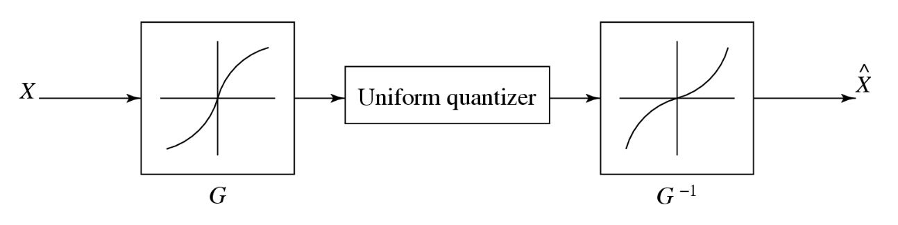
    

    - 压扩量化是非线性的
    - 压扩器(compander)由压缩函数 $G$、均匀量化器和扩展函数 $G^{-1}$ 组成
    - 两种常用的压扩器是 $\mu$ 律和 $A$ 律压扩器

## Transform Coding

### Basic Idea

根据信息论原理，编码**向量**比编码标量更高效，因此需要将输入中的连续样本分组为向量。

- 设 $X = \{ x_1, x_2, \dots, x_k \}$ 为样本向量，相邻样本间存在一定相关性
- 若 $Y$ 是输入向量经过线性变换 $T$ 的结果，且其分量间的相关性很低，则 $Y$ 的编码效率比 $X$ 更高
    - 变换 $T$ 本身并不压缩数据
    - 压缩源于对 $Y$ 分量的处理与量化过程

- **DCT** 是一种广泛应用的变换方法，能够有效消除输入信号的相关性

### Discrete Cosine Transform (DCT)

- 1D 离散余弦变换

    $$
    \begin{aligned}
    F(u) = \frac{C(u)}{2} \sum_{i=0}^{7} \cos \frac{(2i+1)u\pi}{16} f(i)
    \end{aligned}
    $$

- 1D 逆离散余弦变换

    $$
    \widetilde{f}_i = \sum_{i=0}^7 \frac{C(u)}{2} \cos \frac{(2i+1)u\pi}{16} F(u) \quad C(u) = \begin{cases} \frac{\sqrt{2}}{2} & \text{if } u=0 \\ 1 & \text{else} \end{cases}
    $$

    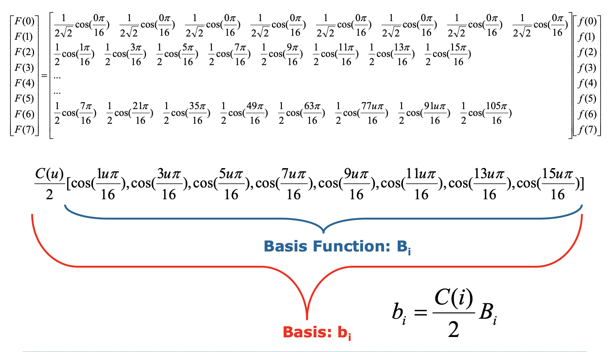

- 二维变换可用于处理数字图像等二维信号
- 三维空间 DCT

    

        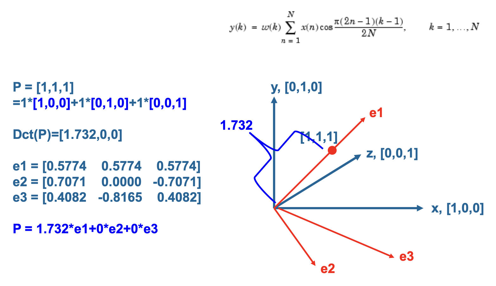
    

余弦基函数是正交的(orthogonal)，即：

$$
\begin{aligned}
& \sum_{i=0}^7 \left[ \cos \frac{(2i+1) \cdot p\pi}{16} \cdot \cos \frac{(2i+1) \cdot q\pi}{16} \right] = 0 \quad \text{if} \ p \neq q \\
& \sum_{i=0}^7 \left[ \frac{C(p)}{2} \cos \frac{(2i+1) \cdot p\pi}{16} \cdot \frac{C(q)}{2} \cos \frac{(2i+1) \cdot q\pi}{16} \right] = 1 \quad \text{if} \ p = q
\end{aligned}
$$

数学含义：将一个向量从一个线性空间变换到另一个线性空间。

一般来说，当且仅当满足以下方程时，变换 $T$ 是线性的：

$$
T(\alpha p + \beta q) = \alpha T(p) + \beta T(q)
$$

其中 $\alpha, \beta$ 为常量，$p, q$ 为任意函数、变量或常量。

物理意义：通过**基信号**的线性组合来近似原始信号。

DCT 相关概念：

- 直流(direct current, **DC**)与交流(alternating current, **AC**)分别代表恒定幅度与变化幅度

    

        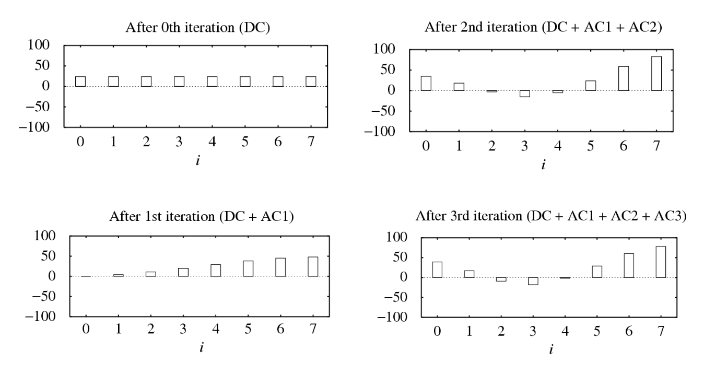
    

    

        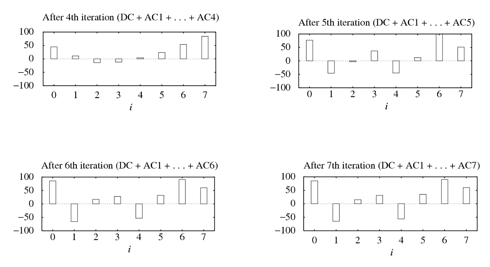
    

- 余弦变换用于确定信号中交流分量和直流分量幅度的过程
- 离散余弦变换：整数索引
    - $U＝0$ 时，得到直流系数
    - $U=1, 2, \dots, 7$ 时，得到第一至第七个交流系数

- 逆离散余弦变换：利用直流、交流和余弦函数重建信号
- DCT 与 IDCT 采用同一组被称为基函数的余弦函数
- DCT 能够处理或分析信号的频域特性
- 假设 $f(i)$ 表示随时间 $i$ 变化的信号
    - 一维 DCT 将时域中的 $f(i)$ 转换为频域中的 $F(u)$
    - $F(u)$ 被称为频率响应，构成了 $f(i)$ 的频谱

DCT 的性质：

- 第 0 个 DCT 系数 $F(0)$ 代表信号 $f(i)$ 的直流分量
- 其余七个 DCT 系数反映了信号 $f(i)$ 在不同频率下的各种变化成分
- 若直流分量为负值，表明 $f(i)$ 的平均值小于零
- 若交流分量为负值，则意味着 $f(i)$ 与某个基函数具有相同频率，但其中一方恰好滞后半个周期

2D DCT 的定义：

- 给定图像上的函数 $f(i, j)$，二维离散余弦变换（DCT）将其转换为新函数 $F(u, v)$，其中整数 $u$ 和 $v$ 的取值范围与 $i$ 和 $j$ 相同
- DCT 变换的一般定义为：

    $$
    F(u,v) = \frac{2C(u)C(v)}{\sqrt{MN}} \sum_{i=0}^{M-1} \sum_{j=0}^{N-1} \cos \frac{(2i+1)u\pi}{2M} \cos \frac{(2j+1)v\pi}{2N} f(i,j)
    $$

- 在 JPEG 图像压缩标准中
    - 图像块大小：$M=N=8$
    - 2D DCT 及其逆变换 IDCT 的定义如下：

        $$
        \begin{aligned}
        F(u, v) &= \frac{C(u) C(v)}{4} \sum_{i=0}^7 \cos \frac{(2 i+1) u \pi}{16} \cos \frac{(2 j+1) v \pi}{16} f(i, j) \\
        \widetilde{f}(i, j) &= \sum_{u=0}^7 \sum_{v=0}^7 \frac{C(u) C(v)}{4} \cos \frac{(2 i+1) u \pi}{16} \cos \frac{(2 j+1) v \pi}{16} F(u, v)
        \end{aligned}
        $$

- 2D DCT 可分解为两个 1D DCT 步骤的序列：

    $$
    \begin{aligned}
    G(i, v) &= \frac{1}{2} C(v) \sum_{j=0}^7 \cos \frac{(2j+1) v \pi}{16} f(i, j) \\
    F(u, v) &= \frac{1}{2} C(u) \sum_{j=0}^7 \cos \frac{(2i+1) u \pi}{16} G(i, v)
    \end{aligned}
    $$

    显而易见，这一简单的改动节省了大量的运算步骤，所需的迭代次数从 8*8 减少到了 8+8

- 2D 基函数：

    

        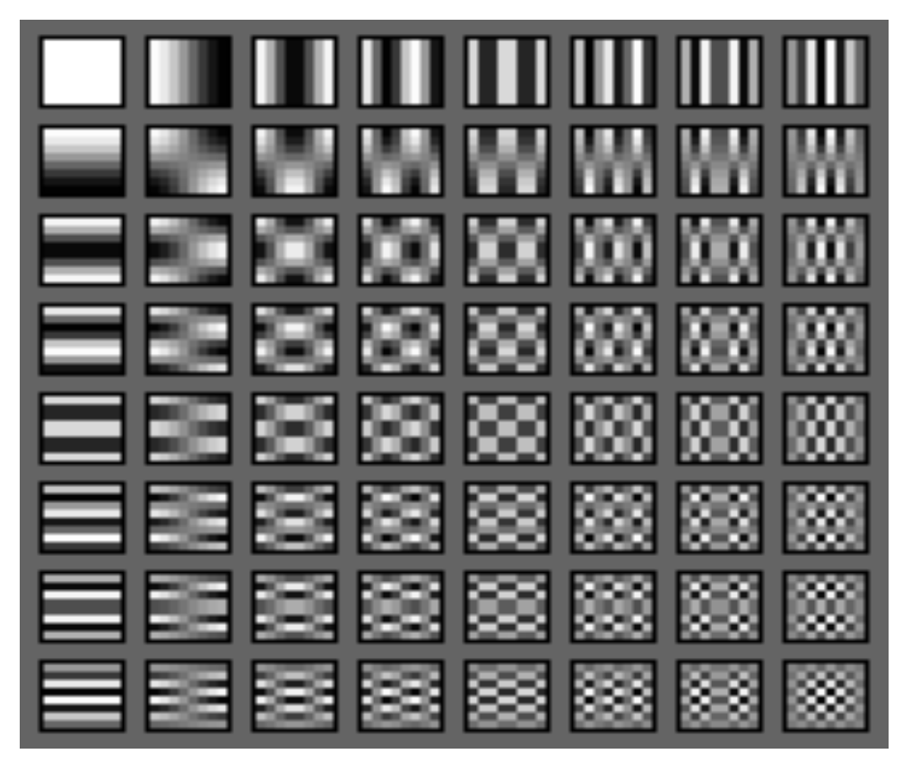
    

### Comparison of DCT and DFT

离散余弦变换是**离散傅里叶变换**(discrete Fourier transform, **DFT**)的近亲（DCT 是一种仅涉及 DFT 实部的变换）。对于连续信号，定义连续傅里叶变换 $F$ 如下：

$$
F(\omega) = \int_{-\infty}^{\infty} f(t) e^{-i\omega t} dt
$$

根据欧拉公式 $e^{ix} = \cos(x) + i\sin(x)$，以及由于计算机要求对输入信号进行离散化处理，我们定义了一种作用于输入信号 8 个样本 $\{f_0, f_1, \dots, f_7\}$ 的 DFT 如下：

$$
F_\omega = \sum_{x=0}^7 f_x \cdot e^{-\frac{2 \pi i \omega x}{8}}
$$

显式写出正弦和余弦项，得到：

$$
F_\omega = \sum_{x=0}^7 f_x \cos \left( \frac{2 \pi \omega x}{8} \right) - i \sum_{x=0}^7 f_x \sin \left( \frac{2 \pi \omega x}{8} \right)
$$

使 DCT 能够仅利用 DFT 余弦基函数的关键在于，通过对原始输入信号进行对称复制，可以消除 DFT 的虚部。

如下图所示，对 8 个输入样本进行 DCT 变换，等效于对由原始 8 个样本及其对称副本构成的 16 个样本执行 DFT 运算。

    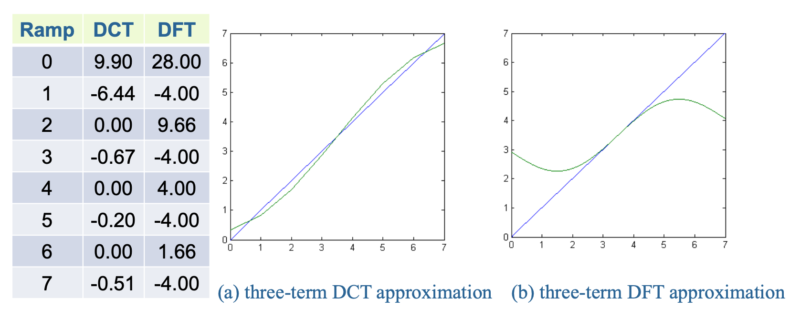

## Wavelet-Based Coding

### Introduction

DFT 和 DCT 在频域中可以提供非常高的分辨率，但没有时间分辨率。

    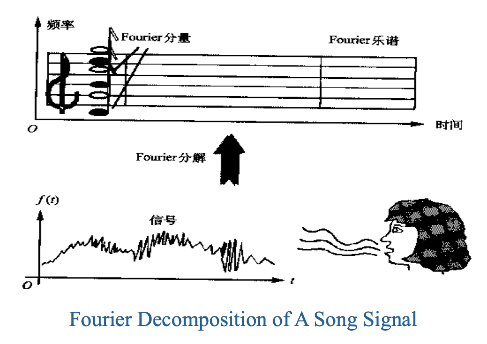

而**小波变换**(wavelet transform)旨在以良好的时间和频率分辨率来表示信号。

    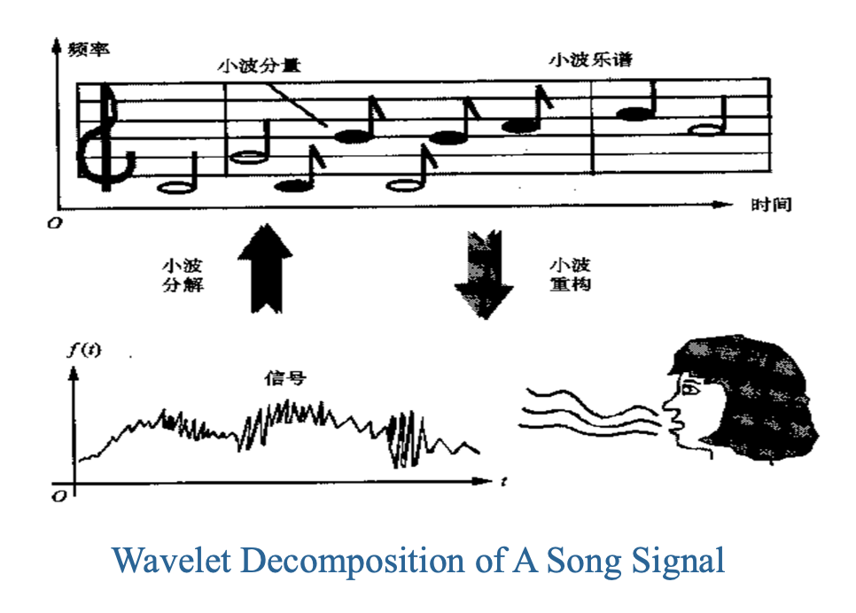

### Wavelet Transform Example

假设给定以下输入序列：$\{x_{n, i}\} = \{10, 13, 25, 26, 29, 21, 7, 15\}$。考虑以下变换，它将原始序列替换为其成对平均值 $x_{n−1, i}$ 和差值 $d_{n−1,i}$，定义如下：

$$
x_{n−1, i} = \frac{x_{n, 2i} + x_{n, 2i+1}}{2} \quad d_{n−1, i} = \frac{x_{n, 2i} - x_{n, 2i+1}}{2}
$$

平均值和差值仅应用于那些首元素索引为偶数的连续输入序列对。因此集合 $\{x_{n−1,i}\}$ 和 $\{d_{n−1,i}\}$ 中的元素数量恰好是原始序列中元素数量的一半。

通过连接两个序列 $\{x_{n−1,i}\}$ 和 $\{d_{n−1,i}\}$，形成一个长度与原序列相等的新序列：

$$
\begin{aligned}
\{x_{n-1,i}, d_{n-1,i}\} &= \{11.5, 25.5, 25, 11, -1.5, -0.5, 4, -4\} \\
\{x_{n,i}\} &= \{10, 13, 25, 26, 29, 21, 7, 15\}
\end{aligned}
$$

该序列的元素数量与输入序列完全相同，即变换并未增加数据量。由于上述序列的前半部分包含原始序列的平均值，我们可以将其视为对原始信号的粗略近似。而此序列的后半部分则可看作是前半部分的细节或近似误差。

### 1D Haar Transform

可以轻易验证，原始序列能够通过变换后的序列利用这些关系重构出来：

$$
\begin{aligned}
x_{n, 2i} &= x_{n-1, i} + d_{n-1, i} \\
x_{n, 2i+1} &= x_{n-1, i} - d_{n-1, i}
\end{aligned}
$$

此变换为离散 Haar 小波变换：

    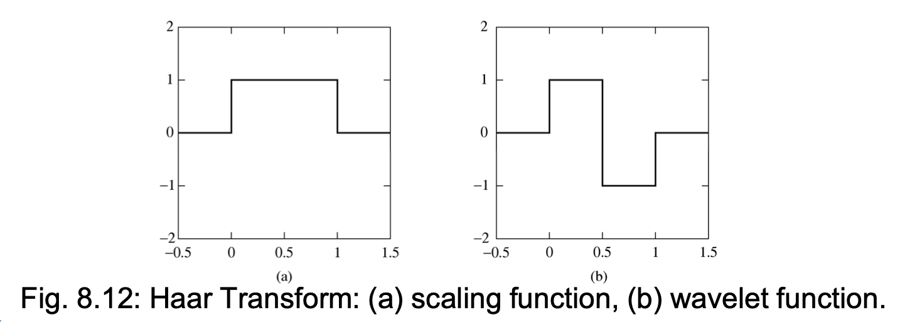

### 2D Haar Wavelet Transform

    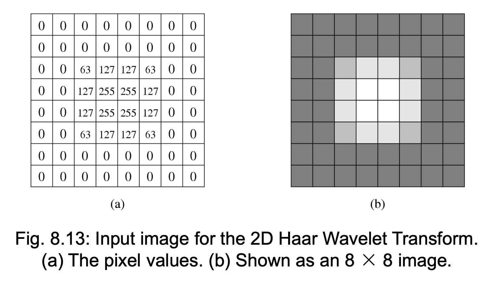

    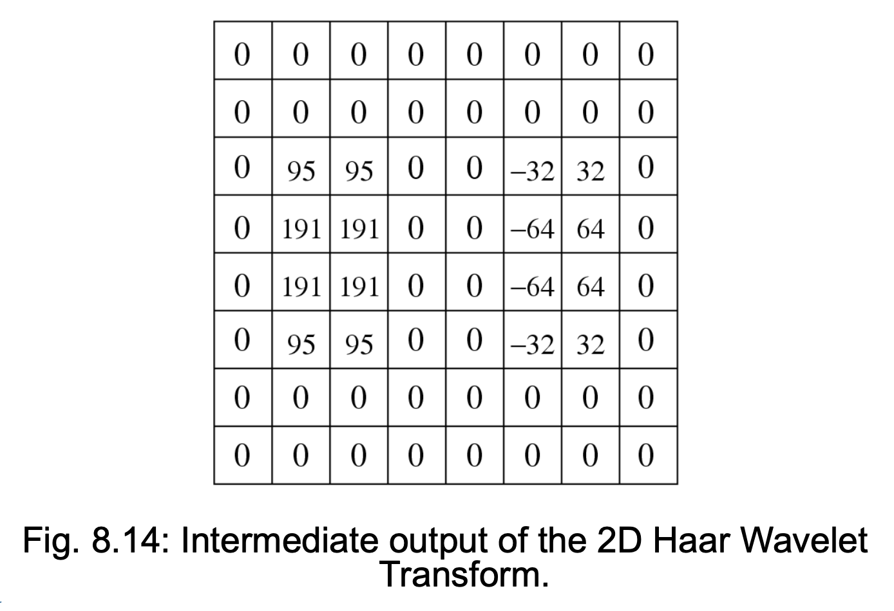

    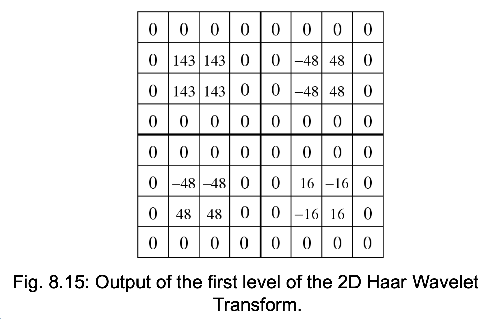

    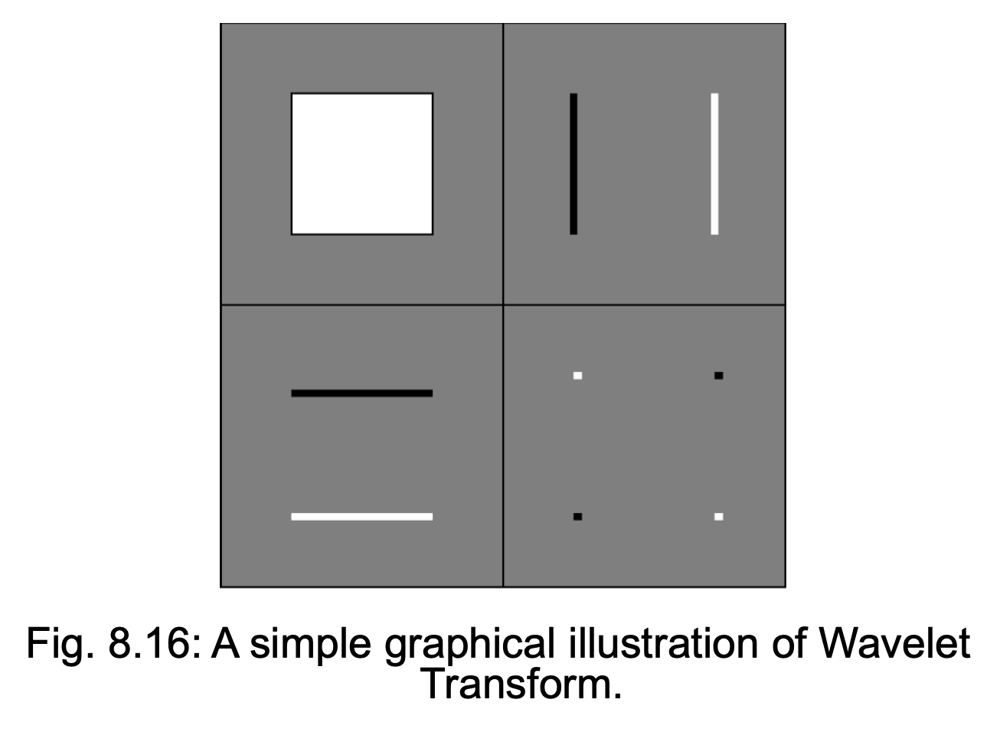

???+ example "例子"

    

        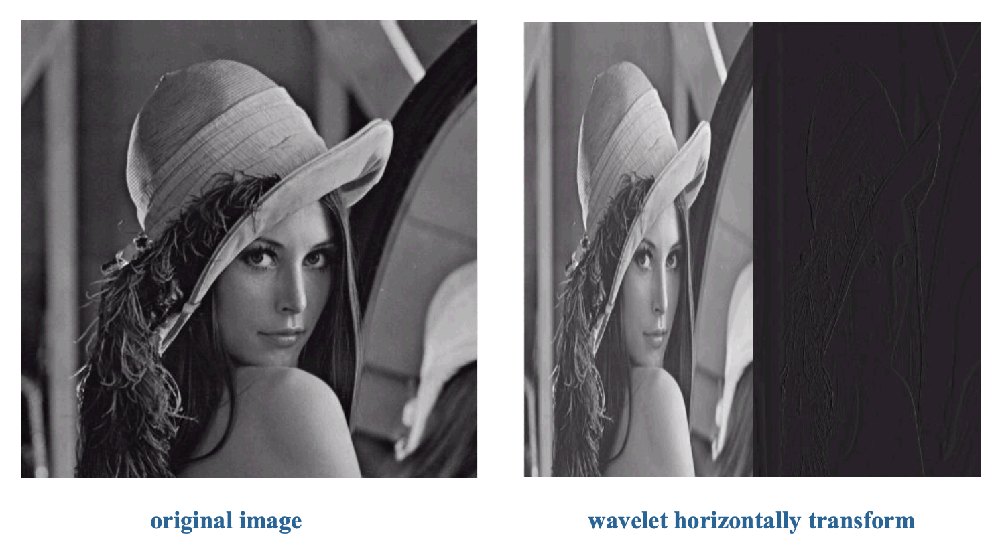
    

    

        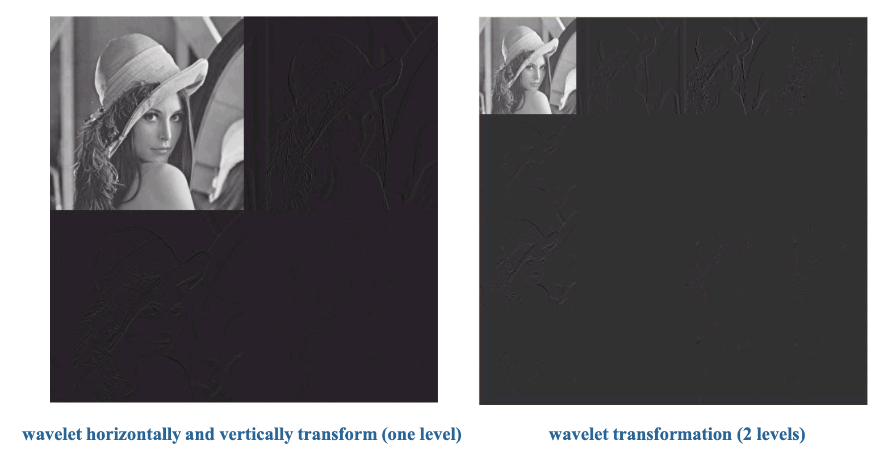
    
