# Image Compression Standards

## The JPEG Standard

**JPEG** 全称为联合图像专家组(Joint Photographic Experts Group)。

- 它是首个国际静态图像压缩标准（ISO 10918-1），于 1992 年发布
- 因其优良特性，在发布仅数年后便取得了巨大成功：网络上近 80% 的图像均采用 JPEG 标准进行压缩
- 它是一种**有损图像压缩方法**，采用基于 **DCT**（离散余弦变换）的变换编码技术
    - 在空间域中，图像是关于 i 和 j（通常表示为 x 和 y）的函数；通过二维 DCT，将图像转换为空间频域中的频率响应函数 F(u, v)，该函数由两个整数 u 和 v 进行索引
    - DCT 编码方法的有效性基于三大观察：
        - 图像中有用的内容变化相对缓慢，即强度值在小区域内（例如 8×8 的图像块内）多次大幅波动的情况较为罕见，也就是说图像中的大量信息是重复的，因此**存在空间冗余**
        - 心理物理实验表明，人类对高频成分的丢失远比对低频成分的丢失更不易察觉，所以通过**大幅减少高频内容**，可以有效降低空间冗余
        - 视觉敏锐度（区分紧密排列线条的精确度）在灰度图像中远高于彩色图像，因此 JPEG 格式采用了**色度子采样技术（4:2:0）**

### Main Steps

JPEG 图像的压缩步骤如下：

1. 将 RGB 转换为 YIQ 或 YUV 并进行颜色**子采样**
2. 对图像块执行离散余弦变换（**DCT**）
3. 应用**量化**处理
4. 进行 **Z 字形**排序
5. 对直流系数（**DC**）使用差分脉冲编码调制（**DPCM**）
6. 对交流系数（**AC**）使用游程编码（**RLE**）
7. 执行**熵编码**(entropy coding)

对应的 JPEG 编码器框图如下：

    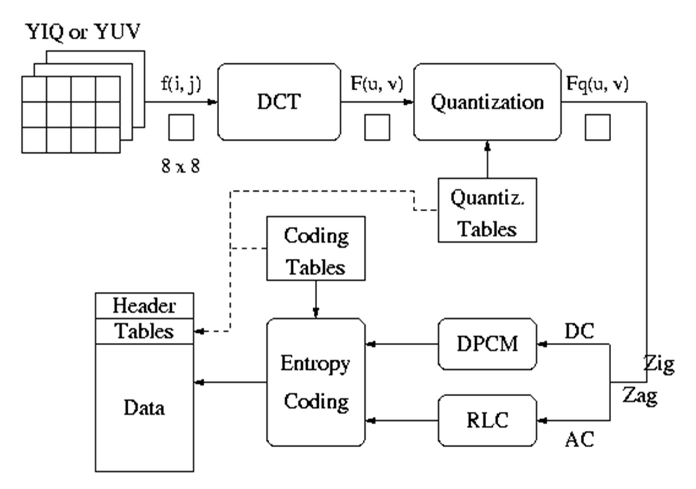

#### DCT

**DCT**（离散余弦变换(discrete cosine transformation)）：每张图像被划分为 8×8 的像素块，并对每个块图像 f(i, j) 应用二维 DCT，输出结果为各块的 DCT 系数 F(u, v)。

    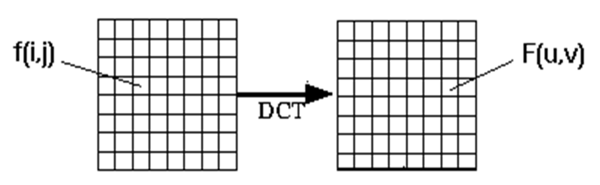

- 块大小之所以设定为 8×8，是为了在精度与计算量之间取得**妥协**
- 消除**块状瑕疵**(blocking artifacts)是研究人员关注的重要问题
- 然而，使用分块会导致每个区块与其相邻上下文隔离，这就是当用户指定高压缩比时，JPEG 图像看起来不连贯（方块感(blocky)）的原因

#### Quantization

量化步骤的计算公式为：

$$
\hat{F}(u, v) = \text{round}\left(\frac{F(u, v)}{Q(u, v)}\right)
$$

>其中：
>
>- $F(u, v)$：DCT 系数
>- $Q(u, v)$：量化矩阵的元素
>- $\hat{F}(u, v)$：JPEG 在后续熵编码中将使用的量化后 DCT 系数

- 量化步骤是 JPEG 压缩中损失的主要来源
- $Q(u, v)$ 元素值越靠近矩阵右下角越大，这是为了引入更多高频空间频率的损失（观察 1 和观察 2）
- 下面两张表展示了通过心理物理学研究得到的默认 $Q(u, v)$ 值，其目标是在最大化压缩比的同时最小化 JPEG 图像的感知损失

    

        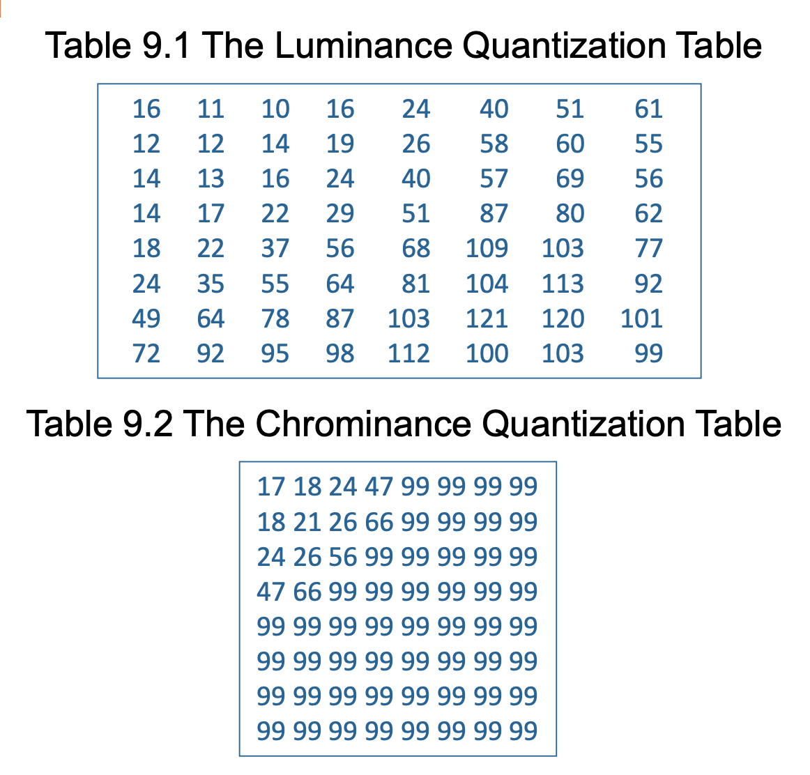
    

???+ example "例子"

    === "例1"

        

            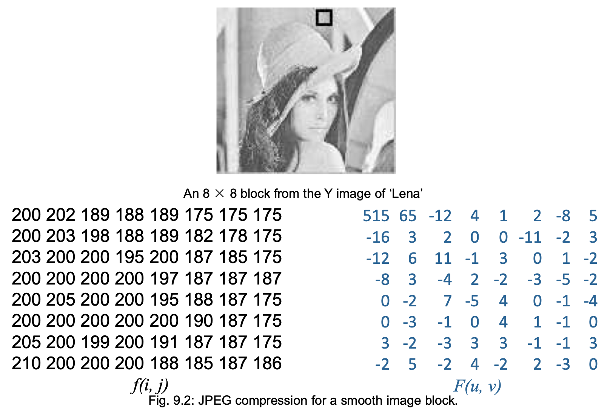
        

        

            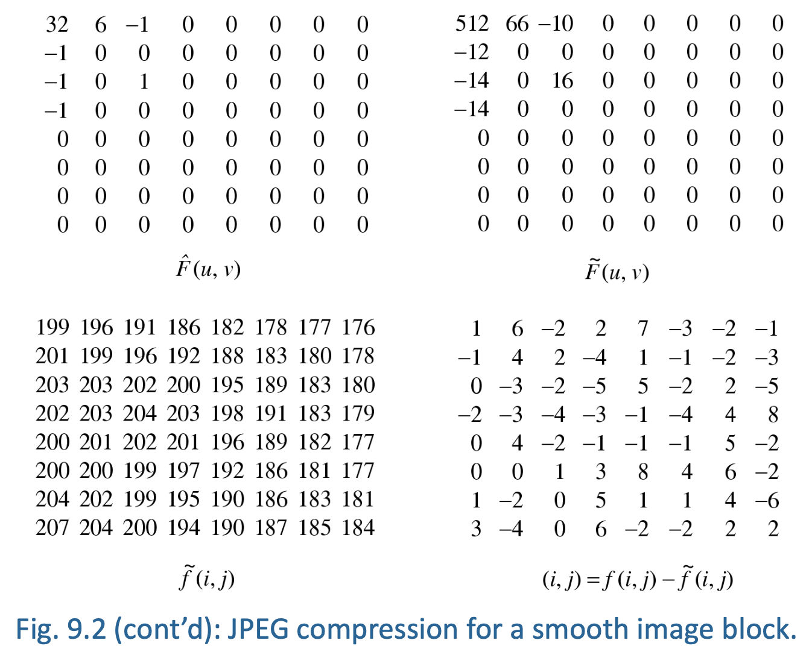
        

    === "例2"

        

            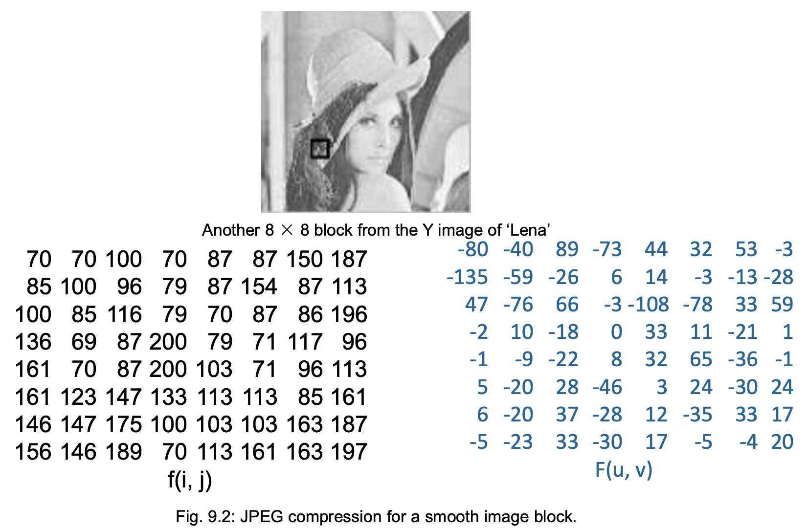
        

        

            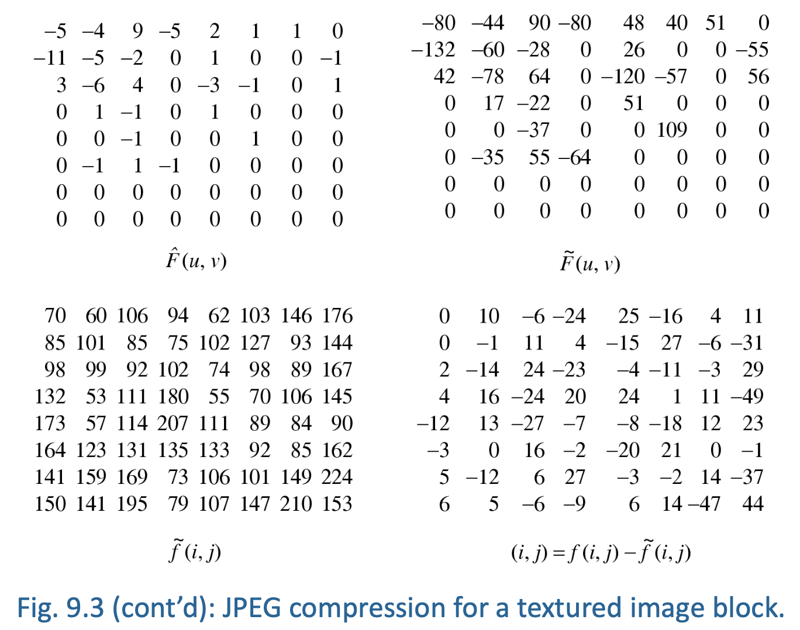
        

#### Zigzag Scan

将 8×8 矩阵转换为 64 维向量

- **低频**分量位于向量的**前部**
- **高频**分量位于向量的**后部**

    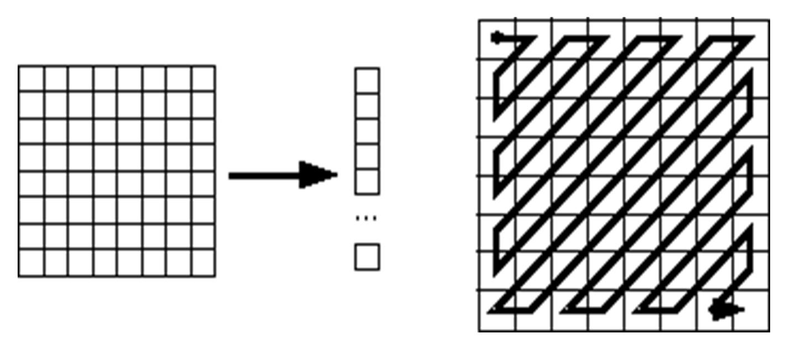

#### RLE on AC Coefficients

注意到这个 64 维的向量中包含了**大量连续的零值**，于是采用 **RLE 压缩**：

- 格式：(skip, value)，其中 skip 表示零的数量，而 value 表示下一个非零值
- 用 (0,0) 表示一个块的结束

???+ example "例子"

    

        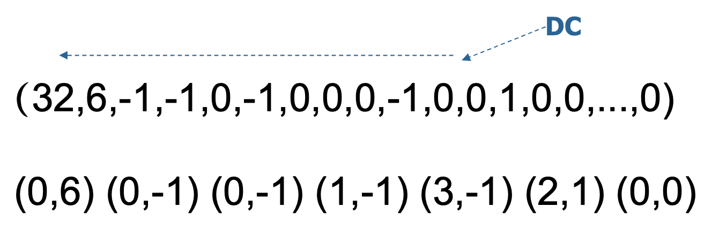
    

#### DPCM on DC Coefficients

DC 系数与 AC 系数的编码是分开进行的。因为不同块的 DC 系数值可能较大且差异显著，而 DC 系数在短距离内不太可能出现剧烈变化，这使得 **DPCM** 成为编码 DC 系数的理想方案。

JPEG 中针对 DC 系数的 DPCM 处理是对整幅图像一次性完成的————对前一个 8x8 块 DC 系数之差进行编码：

$$
\begin{aligned}
d_i & = DC_{i+1} - DC_i \\
d_0 & = DC_0
\end{aligned}
$$

???+ example "例子"

    150, 155, 149, 152, 144 => 150, 5, -6, 3, -8

#### Entropy Coding

DC 由一对符号表示：(size, amplitude)

- size（大小）：系数所需的位数（采用霍夫曼编码）
- amplitude（幅度）：实际的比特位（未采用霍夫曼编码）

| Size | Amplitude |
| :--- | :--- |
| 1 | -1, 1 |
| 2 | -3, -2, 2, 3 |
| 3 | -7..-4, 4..7 |
| 4 | -15..-8, 8..15 |
| ...... | ...... |
| 10 | -1023..-512, 512..1023 |

???+ example "例子"

    (150, 5, -6, 3, -8) => (8, 10010110), (3, 101), (3, 001), (2, 11), (4, 0111)

霍夫曼表可自定义并存储在图像头部，否则将使用默认的霍夫曼表。

---
AC 系数包含两个符号：

- (RUNLENGTH, SIZE)（采用霍夫曼编码）
- (AMPLITUDE)（未采用霍夫曼编码）

### Modes

#### Sequential Mode

**顺序模式**(sequential mode)

- 默认的 JPEG 模式
- 每张图像采用从左至右、从上到下的单次扫描编码
- 动态 JPEG 视频编码便采用这种基本的顺序 JPEG

#### Progressive Mode

**渐进式**(progressive) JPEG 能够快速提供图像的低质量版本，随后逐步呈现更高质量的图像。

- **频谱选择**：利用 DCT 系数的频谱（空间频率谱）特性：较高的交流分量提供细节信息
- **逐次逼近**：与逐步编码频谱带不同，所有 DCT 系数同时进行编码，但首先处理其最高位

???+ example "例子"

    === "频谱选择"

        - 扫描 1：编码直流分量及前几个交流分量，比如 AC1、AC2
        - 扫描 2：编码更多交流分量，比如 AC3、AC4、AC5
        - ...
        - 扫描 k：编码最后几个交流分量，比如 AC61、AC62、AC63

    === "逐次逼近"

        - 扫描 1：编码前几个最高位，比如第 7、6、5、4 位
        - 扫描 2：编码更多较低位，比如第 3 位
        - ...
        - 扫描 m：编码最低位，即第 0 位

#### Hierarchical Mode

注意到最低分辨率下的编码图像本质上是一种压缩的低通滤波图像，而逐级提高分辨率的图像则提供了更多细节（即与较低分辨率图像的差异）。类似于渐进式 JPEG，**分层**(hierarchical) JPEG 图像可通过多次传输逐步提升画质。执行过程如下：

1. 图像分辨率降低：将输入图像 $f$（如 $512 \times 512$）在每个维度上缩小 2 倍以获得 $f_2$（如 $256 \times 256$）；重复此操作以获得 $f_4$（如 $128 \times 128$）

2. 压缩低分辨率图像 $f_4$：使用任何其他 JPEG 方法（如顺序式、渐进式）对 $f_4$ 进行编码，获得 $F_4$

3. 压缩差分图像 $d_2$：
   1. 解码 $F_4$ 以获得 $\hat{f}_4$；使用任何插值方法将 $\hat{f}_4$ 放大到与 $f_2$ 相同的分辨率，并将其称为 $E(\hat{f}_4)$
   2. 使用任何其他 JPEG 方法（如顺序式、渐进式）对差分 $d_2 = f_2 - E(\hat{f}_4)$ 进行编码，生成 $D_2$

4. 压缩差分图像 $d_1$：
   1. 解码 $D_2$ 以获得 $\hat{d}_2$；将其加到 $E(\hat{f}_4)$ 中得到 $\hat{f}_2 = E(\hat{f}_4) + \hat{d}_2$，这是 $f_2$ 经过压缩和解压缩后的版本
   2. 使用任何其他 JPEG 方法（如顺序式、渐进式）对差分 $d_1 = f - E(\hat{f}_2)$ 进行编码，生成 $D_1$

将图像编码为多个不同分辨率的分层结构：

    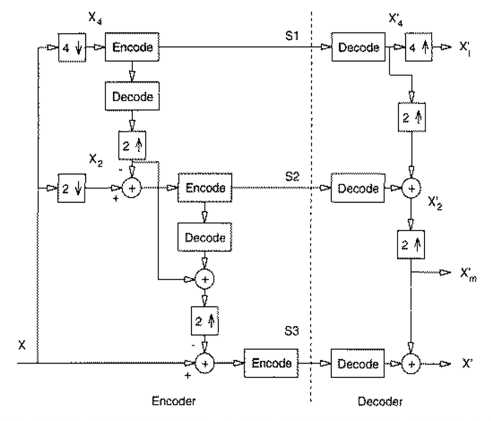

1. 解压编码后的低分辨率图像 $F_4$：使用与编码器相同的 JPEG 方法解码 $F_4$ 以获得 $\hat{f}_4$
2. 恢复中间分辨率的图像 $\hat{f}_2$：使用 $E(\hat{f}_4) + \hat{d}_2$ 获得 $\hat{f}_2$
3. 恢复原始分辨率的图像 $\tilde{f}$：使用 $E(\hat{f}_2) + \hat{d}_1$ 获得 $\tilde{f}$

#### Lossless Mode

**无损模式**(lossless mode)是 JPEG 的一种特殊模式，能确保图像质量无损。但它不采用基于 DCT 的方法，而是使用预测（差分编码）方法。由于相比其他有损模式压缩率极低，因此很少被使用。

### A Glance at the JPEG Bitstream

下图展示了 JPEG 文件的比特流：

    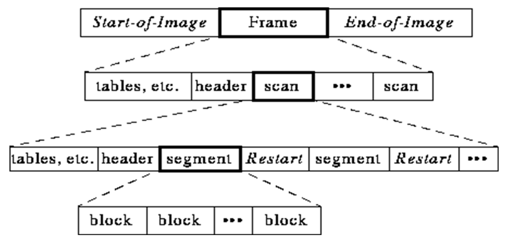

>- 帧(frame)：图片
>- 扫描(scan)：对像素的一次遍历
>- 段(segment)：一组块
>- 块(block)：一组像素

- 帧头
    - 采样精度（每像素位数）
    - 图像尺寸（宽度，高度）
    - 分量数量
    - 唯一标识符（每个组件对应一个）
    - 水平/垂直采样因子（每个组件对应一组）
    - 使用的量化表（每个组件对应一张）

- 扫描头
    - 扫描中的分量数量
    - 组件ID（针对每个分量）
    - 霍夫曼表（针对每个分量）

## The JPEG 2000 Standard

### Why JPEG 2000

JPEG 2000 是新一代的图像压缩标准，它有以下特点：

- 同时提供**无损**压缩与**有损**压缩
- **低比特率**下优异的码率-失真性能
- **ROI**（感兴趣区域(region of interest)）编码技术
- 支持大尺寸图像处理
- 单一解压架构设计
- 适应嘈杂环境传输需求
- 渐进式传输功能
- 计算机生成图像优化支持
- 复合文档处理能力

### Region-of-Interest Coding

目标：图像的特定区域可能包含重要信息，因此应以比其他部分更高的质量进行编码。

???+ example "例子"

    === "例1"

        

            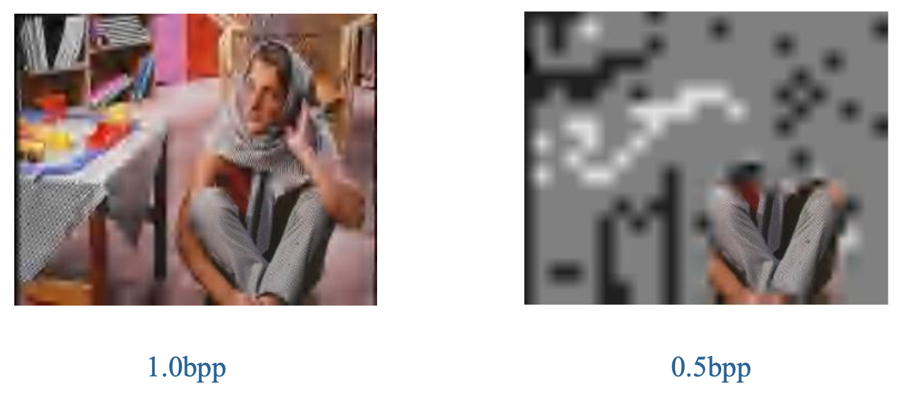
        

    === "例2"

        

            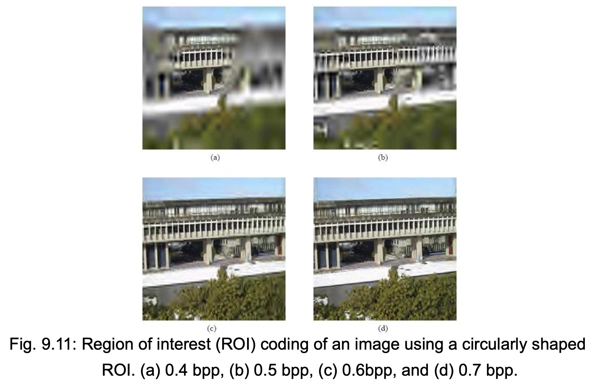
        

### Comparison for JPEG and JPEG 2000

    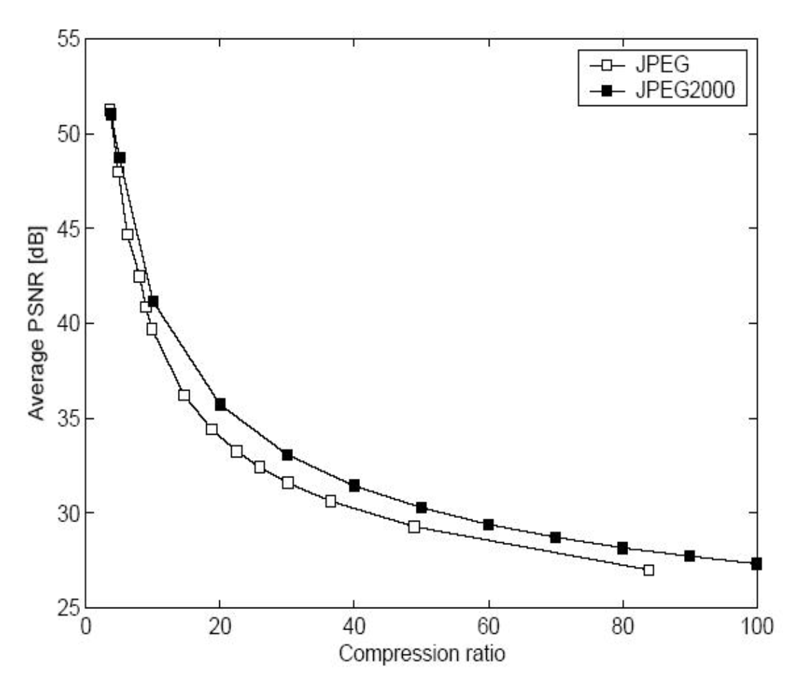

比较不同图像下的情况：

=== "自然图像"

    

        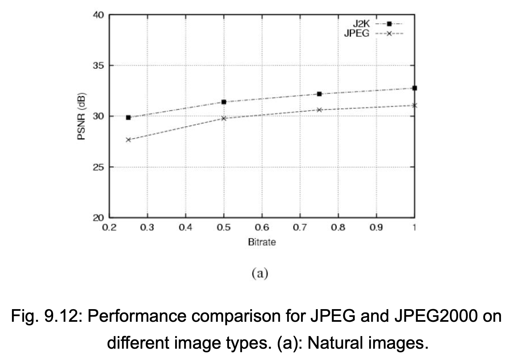
    

=== "计算机生成的图像"

    

        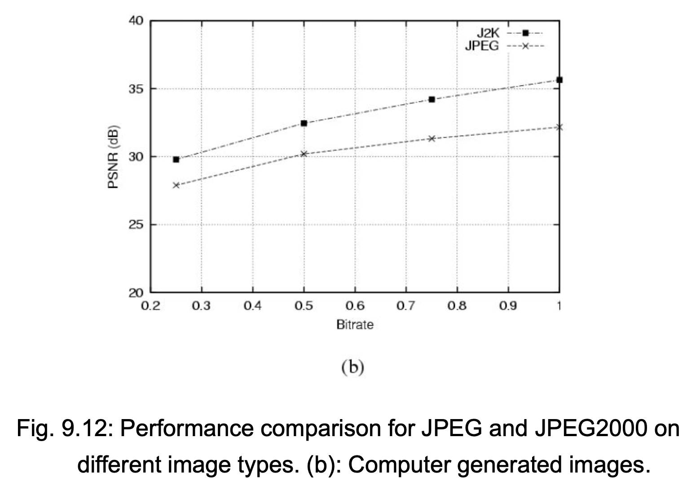
    

=== "医学图像"

    

        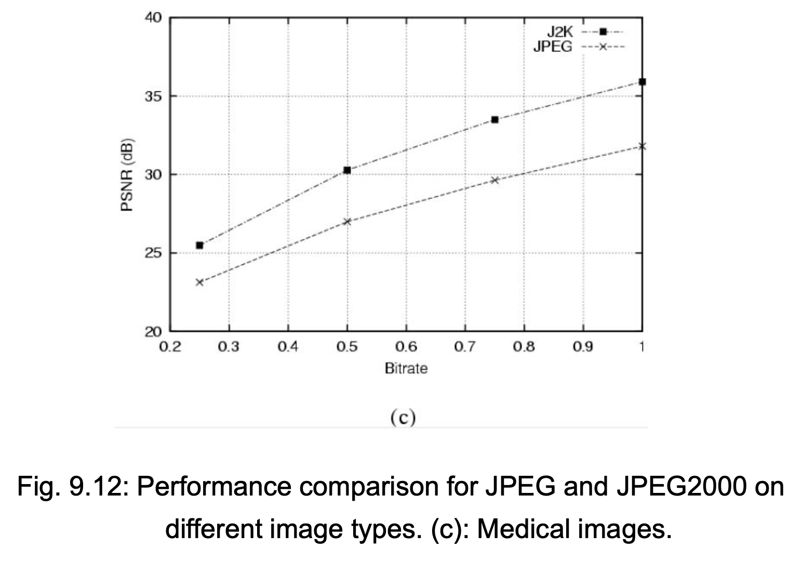
    

???+ example "例子"

    

        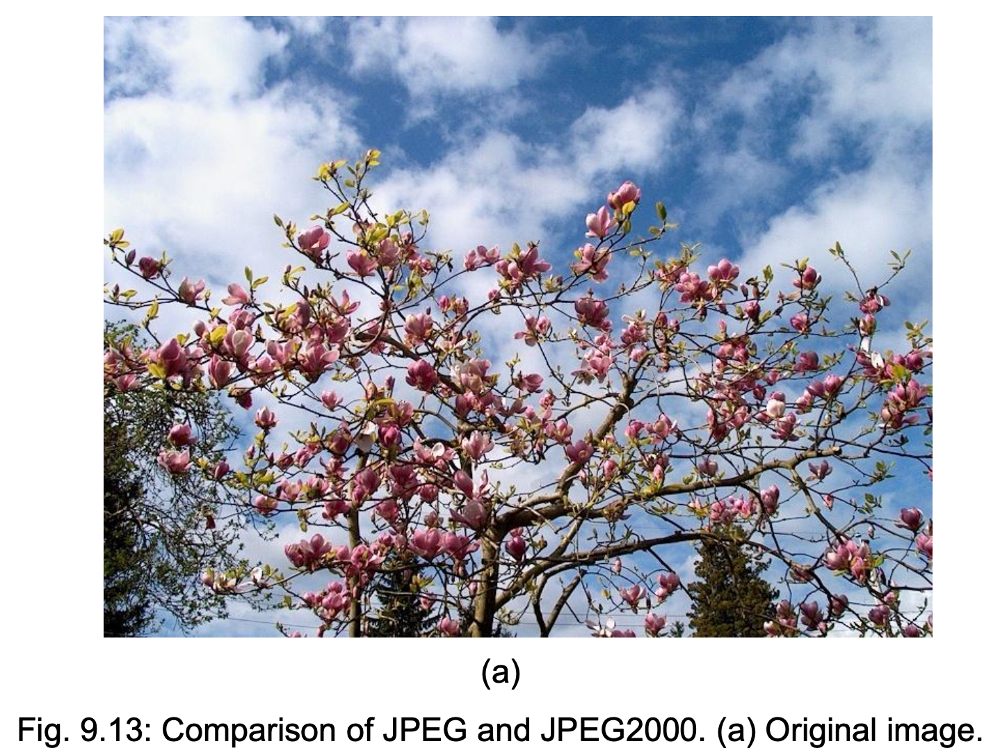
    

    

        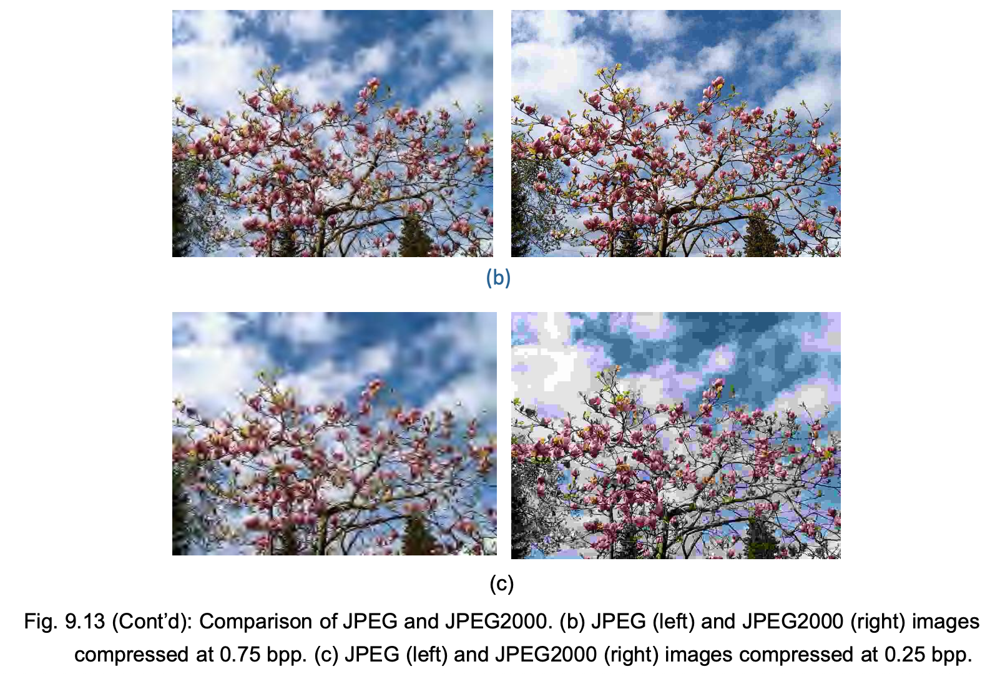
    
