# Basic Video Compression Techniques

## Introduction to Video Compression

之所以需要视频压缩，是因为未经压缩的视频数据量可能极其庞大，这会对**网络通信**构成挑战。所以我们考虑丢弃部分信息，比如：

- 冗余的**空间**信息

- **颜色**信息
    - 人类对亮度的变化最为敏感，而色彩相对次要，例如黑白照片仍可辨识
    - 由于 RGB 编码效率较低，因此采用 YUV 格式，仅以半分辨率（176×144 像素）编码色度分量（UV），即四分之一 SIF 标准
        - 相比亮度分量 Y，U 和 V 的数据量仅为 0.25 倍

- 冗余的**时间**信息
    - 同一场景中的帧非常相似，因此视频数据具有时间冗余性
    - 即使是静态图像也能以较高的压缩比进行压缩，更不用说视频了

    <div style="text-align: center">
        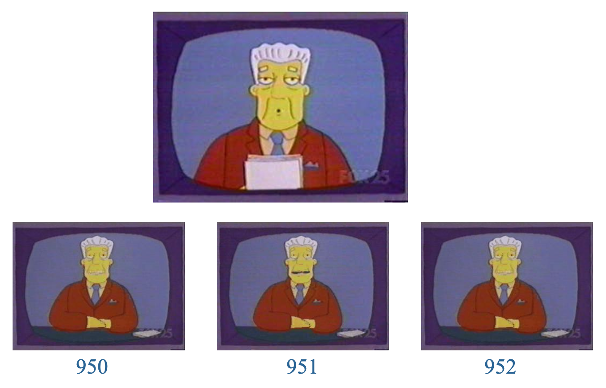
    </div>

    - 最简单的方法：**预测编码**(predictive coding)
        - 按**时间顺序**对图像进行差分处理
        - 对**残差误差**(residual error)进行编码
        - 差分编码效果不错，但物体在帧间往往只是位置变化
        - DCT 编码对于稀疏的差分图像来说效果不佳

            <div style="text-align: center">
                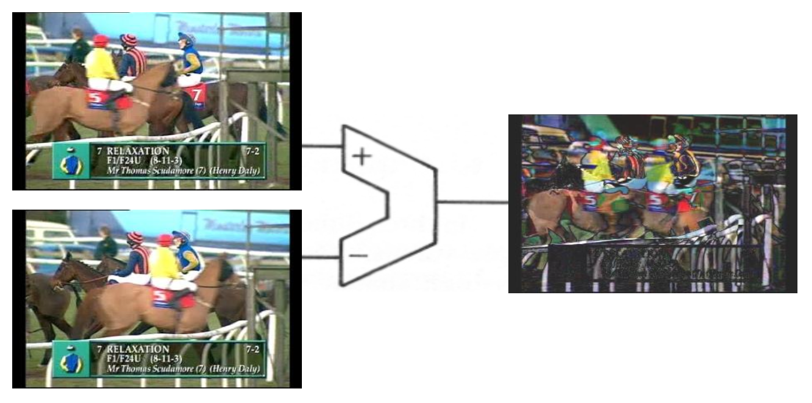
            </div>

    - 更好的方法
        - 寻找图像中合适的部分，从前一帧中减去
        - **运动估计**(motion estimation)
        - **运动补偿**(motion compensation)

        <div style="text-align: center">
            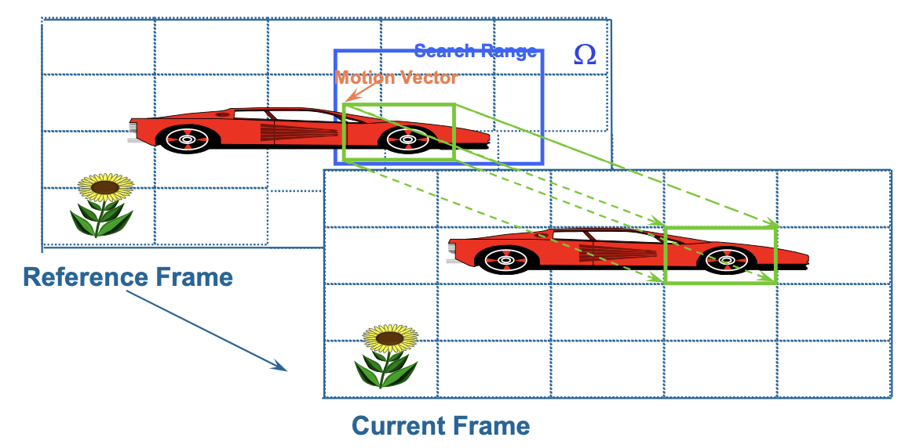
        </div>


## Video Compression Based on Motion Compensation

### Temporal Redundancy

视频是时间维度上的一系列图像。

- 连续帧之间通常很相似，因此视频具有显著的时间冗余性
- 并非每一帧都独立编码，编码的是相邻帧之间的差异
- 帧间差异的主要原因是相机或物体的运动
    - 检测对应像素或区域的位移量
    - 通过**运动补偿**（MC）测量它们之间的差异

- 运动图像编码原理：减少空间冗余与时间冗余
    - **帧内**(infra-frame)编码：类似 JPEG 技术  
    - **帧间**(inter-frame)编码：基于运动预测与补偿  
        - P 帧、B 帧  
        - 多参考帧技术（H.264 标准）


### Motion Compensation

运动补偿的基本思想：

- 许多动态图像或图像序列包含一个静态背景，以及一个或多个移动的前景物体，这为编码带来便利
- 因此使用基线 JPEG 对第一帧进行编码，并将此帧作为**参考图像**(reference image)
- 逐块处理第二幅图像，将每个块与参考图像中的块进行比较
- 对于在参考图像中有相同块的区域，我们仅发送特殊代码而非完整的编码数据
- 对于其他区块，则按常规方式进行编码

步骤如下：

1. 运动估计：运动向量搜索
2. 基于运动补偿的预测
3. 预测误差的推导

另外每张图像被划分为 NxN 大小的宏块(macroblocks)。

- 默认情况下，亮度图像的 N 值为 16
- 对于色度图像，若采用 4:2:0 色度子采样，则 N 为 8

运动补偿便在宏块层级上进行：

- 当前图像帧被称为**目标帧**(target frame)
- 在目标帧中的宏块与先前和/或未来帧（称为**参考帧**(reference frame)）中最相似的宏块之间寻找匹配
- 从参考宏块到目标宏块的位移称为**运动向量**（MV）
- 下图展示了前向预测的情况，其中参考帧取自前一帧

    <div style="text-align: center">
        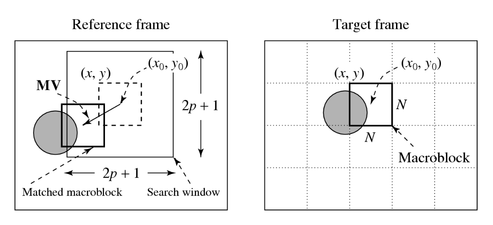
    </div>

    - 运动向量搜索通常局限于一个较小的邻域：水平和垂直位移范围在 [−p, p] 之间。这形成了一个大小为 (2p + 1)x(2p + 1) 的搜索窗口

???+ example "例子"

    <div style="text-align: center">
        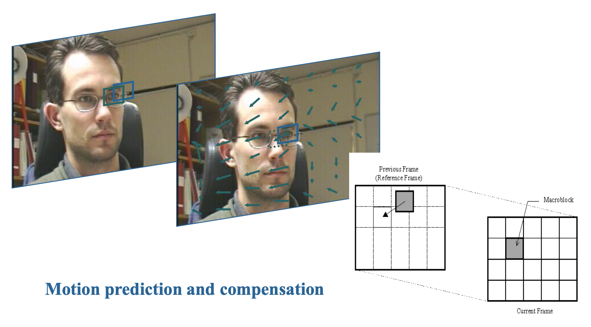
    </div>


## Search for Motion Vectors

### Criteria of Matching

运动向量（MV）搜索是一个匹配问题（也称为对应性问题）

- 水平和垂直位移 i, j 在范围 [-p, p] 内，形成一个大小为 (2p+1)*(2p+1) 的搜索窗口
- 目标：找到使两个宏块之间距离最小的 (i,j)

???+ info "记号约定"

    - $C(x + k, y + l)$：目标帧宏块的像素
    - $R(x + i + k, y + j + l)$：参考帧宏块的像素，其中运动向量为 $(i, j)$
    - $\text{MAD}(i, j) = \frac{1}{N^2} \sum_{k=0}^{N-1} \sum_{l=0}^{N-1} |C(x+k, y+l) - R(x+i+k, y+j+l)|$
    - $(u, v) = [(i, j) \mid \text{MAD}(i, j) \text{ is minimum, } i \in [-p, p], j \in [-p, p]]$


### Sequential Search

**顺序搜索**(sequential search)是指在参考帧中依次遍历整个 (2p+1)*(2p+1) 大小的窗口（亦称为全搜索）。

- 将窗口中每个位置为中心点的宏块与目标帧中的宏块进行逐像素比对，并利用下面的公式计算得出各自的平均绝对差值
- 产生最小平均绝对差值的向量 (i, j) 被指定为目标帧中该宏块的运动向量 (u, v)
- 该方法开销很高：假设每次像素比较需三次运算（减法、取绝对值、加法），则获取单个宏块运动向量的计算成本为 (2p+1)(2p+1)N^2^·3，即 O(p^2^N^2^)

```c
begin
    min_MAD = LARGE NUMBER;    /* Initialization */
    for i = -p to p
        for j = -p to p
        {
            cur_MAD = MAD(i, j);
            if cur_MAD < min_MAD
            {
                min_MAD = cur_MAD;
                u = i;    /* Get the coordinates for MV. */
                v = j;
            }
        }
end
```


### 2D Logarithmic Search

**对数搜索**(logarithmic search)是一种成本较低的方法，虽非最优但通常仍有效。2D 运动向量的对数搜索流程需多次迭代，类似于二分查找：

- 如下图所示，初始阶段仅以搜索窗口中的九个位置作为基于平均绝对差（MAD）的搜索起点，这些位置标记为“1”
- 确定产生最小 MAD 的位置后，将新搜索区域的中心移至该点，并将步长（偏移量）减半
- 在后续迭代中，9 个新位置被标记为“2”，依此类推

<div style="text-align: center">
    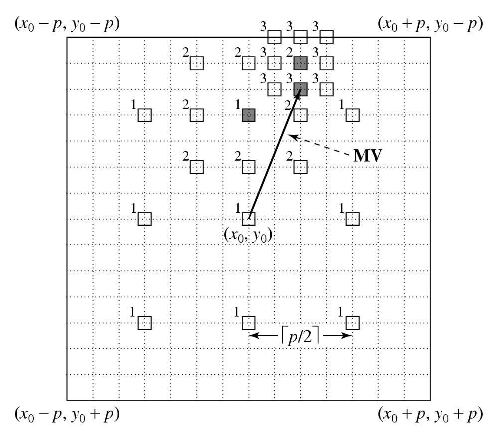
</div>

```pascal
begin
    offset = 4;
    Specify nine macroblocks within the search window in the Reference
    frame, they are centered at (x_0, y_0) and separated by offset horizontally
    and/or vertically;

    while last != TRUE
    {
        Find one of the nine specified macroblocks that yields minimum
        MAD; if offset = 1 then last = TRUE;
        offset = offset / 2;
        Form a search region with the new offset and new center found;
    }
end
```

沿用上一小节的示例，每秒总操作数降至：

$$
\begin{aligned}
\text{OPS}_{\text{per\_second}} &= (8 \cdot (\lceil \log_{2} p \rceil + 1) + 1) \cdot N^{2} \cdot 3 \cdot \frac{720 \times 480}{N \cdot N} \cdot 30 \\
&= (8 \cdot \lceil \log_{2} 15 \rceil + 9) \times 16^{2} \times 3 \times \frac{720 \times 480}{16 \times 16} \times 30 \\
&\approx 1.25 \times 10^{9}
\end{aligned}
$$


### Hierarchical Search

还可采用**分层**（多分辨率）搜索的方法。初始运动向量估计可从分辨率更小的图像中获得。

下图展示了一个三级分层搜索结构，原始图像位于第 0 级，第 1 级和第 2 级的图像通过将前一级图像下采样 2 倍获得，初始搜索在第 2 级进行。由于宏块尺寸更小且参数 p 也可按比例减小，所需计算量大幅降低。

<div style="text-align: center">
    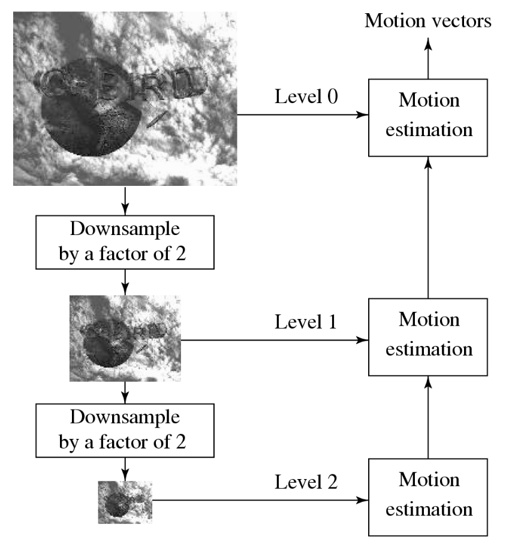
</div>

- 在给定第 $k$ 层估计运动向量 $(u^k, v^k)$ 后，在第 $k-1$ 层以 $(2 \cdot u^k, 2 \cdot v^k)$ 为中心搜索 $3 \times 3$ 邻域，以获取精细化后的运动向量
- 该细化过程需满足：在第 $k-1$ 层的运动向量 $(u^{k−1}, v^{k−1})$ 符合以下条件：

    $$
    (2u^k - 1 \le u^{k−1} \le 2u^k + 1,  2v^k - 1 \le v^{k−1} ≤ 2v^k + 1)
    $$

- 设 $(x^k_0, y^k_0)$ 表示目标帧中第 $k$ 层宏块的中心，针对目标帧中以 $(x^0_0, y^0_0)$ 为中心的宏块进行分层运动向量搜索的流程可概括如下：

```pascal
begin
    // Get macroblock center position at the lowest resolution Level k
    x_0^k = x_0^0 / 2^k ;  y_0^k = y_0^0 / 2^k ;
    Use Sequential (or 2D Logarithmic) search method to get initial estimated MV(u^k, v^k) at Level k;
    
    while last != TRUE
    {
        Find one of the nine macroblocks that yields minimum MAD at Level k - 1 centered at
        ( 2(x_0^k + u^k) - 1 <= x <= 2(x_0^k + u^k) + 1;  2(y_0^k + v^k) - 1 ≤ y ≤ 2(y_0^k + v^k) + 1 );
        if k = 1 then last = TRUE;
        k = k - 1;
        Assign (x_0^k, y_0^k) and (u^k, v^k) with the new center location and MV;
    }
end
```

???+ abstract "总结：比较上述各搜索方法的计算成本"

    <table border="1" style="border-collapse: collapse; width: 100%; text-align: center;" markdown>
        <thead>
            <tr>
                <th rowspan="2">Search Method</th>
                <th colspan="2">$\text{OPS\_per\_second}$ for $720 \times 480$ at 30 fps</th>
            </tr>
            <tr>
                <th>$p = 15$</th>
                <th>$p = 7$</th>
            </tr>
        </thead>
        <tbody>
            <tr>
                <td>Sequential search</td>
                <td>$29.89 \times 10^9$</td>
                <td>$7.00 \times 10^9$</td>
            </tr>
            <tr>
                <td>2D Logarithmic search</td>
                <td>$1.25 \times 10^9$</td>
                <td>$0.78 \times 10^9$</td>
            </tr>
            <tr>
                <td>3-level Hierarchical search</td>
                <td>$0.51 \times 10^9$</td>
                <td>$0.40 \times 10^9$</td>
            </tr>
        </tbody>
    </table>


### Other Methods

由于运动向量搜索是视频压缩中的关键步骤之一，为提高效率，人们还提出了很多方法，这里简单列举一部分，就不展开介绍了：

- 三步搜索法（TSS）
- 共轭方向搜索法（CDS）
- 十字搜索算法（CSA）
- 新三步搜索法（NTSS）
- 四步搜索法（FSS）
- 菱形搜索算法（DS）
- 自适应块匹配算法（ABMA）


## H.261

### Overview

**H.261** 是一种早期的数字视频压缩标准（于1990年制定），其基于运动补偿的压缩原理被后续所有视频压缩标准所沿用。

- 该标准专为通过 **ISDN** 网络进行的可视电话、视频会议及其他视听服务而设计
- 视频编解码器支持 p*64 kbps 的比特率，其中 p 的取值范围为 [1, 30]（因此也被称为 p\*64）
- 要求视频编码器的延迟低于 150ms，以确保能够实现实时双向视频会议

下表列举了 H.261 支持的视频格式：

| 视频格式 | 亮度图像分辨率 | 色度图像分辨率 | 比特率（Mbps）（若为 30 fps 且未压缩）| H.261 支持 |
| :--- | :--- | :--- | :--- | :--- |
| QCIF | $176 \times 144$ | $88 \times 72$ | 9.1 | 必须支持 |
| CIF | $352 \times 288$ | $176 \times 144$ | 36.5 | 可选支持 |

H.261 定义了两种类型的图像帧：

- 内部帧（**I 帧**）：被视为独立图像，在每个I-帧内应用类似于 JPEG 的变换编码方法，因此称为「内部」
- 预测帧（**P 帧**）：不独立，它们通过前向预测编码方法进行编码（允许从前一个 P 帧进行预测，而不仅限于前一个 I 帧）
- P 帧编码中包含了时间冗余去除，而 I 帧编码仅执行空间冗余去除
- 为了避免编码误差的传播，通常每秒视频中会发送几次 I 帧
- 运动向量始终以整像素为单位测量，其范围限制在 ±15 像素内，即 p=15

<div style="text-align: center">
    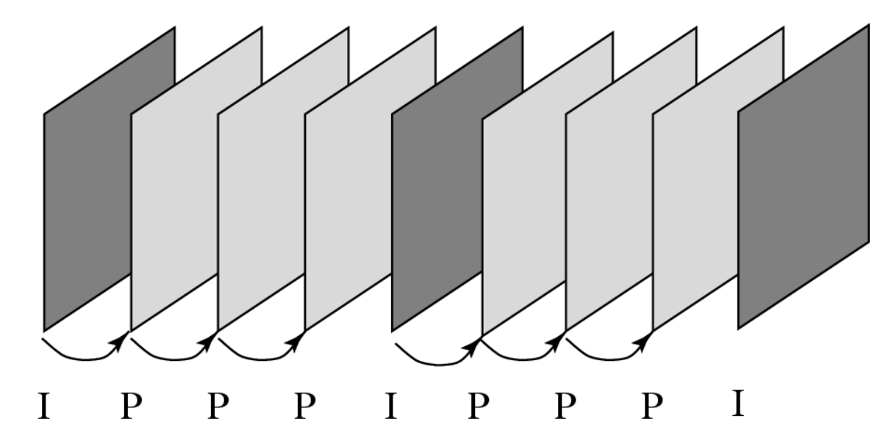
</div>


### Intra-Frame Coding

<div style="text-align: center">
    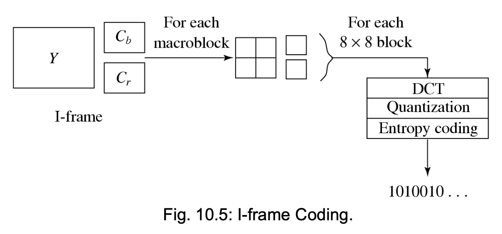
</div>

- 宏块在 Y 帧中尺寸为 16*16 像素，而在 Cb 和 Cr 帧中为 8\*8 像素，这是因为采用了 4:2:0 色度子采样，因此一个宏块包含 4 个 Y、1 个 Cb 和一个 Cr 的 8\*8块
- 对每个 8\*8 块应用离散余弦变换（DCT），随后 DCT 系数经过量化、Z 字形扫描和熵编码处理


### Inter-Frame Predictive Coding

<div style="text-align: center">
    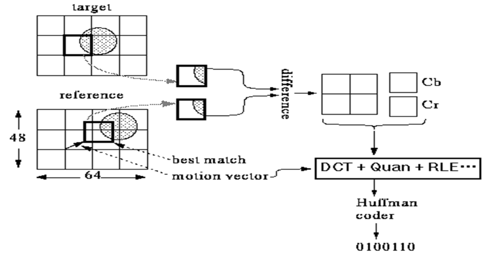
</div>

- 对于目标帧中的每个**宏块**，通过之前讨论的搜索方法之一分配一个运动向量
- 预测之后，会生成一个**差值宏块**以衡量预测误差
- 这些 8\*8 块中的每一个都会经过离散余弦变换（DCT）、量化、Z字形扫描和熵编码过程
- P 帧编码是对差值宏块（而非目标宏块本身）进行编码
- 有时可能无法找到理想的匹配，即预测误差超出可接受的阈值；此时将直接对该宏块进行编码（视为帧内宏块），这种情况被称为**非运动补偿宏块**
- 对于运动向量，其差值 MVD 会送至熵编码环节进行处理：

    $$
    \text{MVD} = \text{MV}_{\text{Preceding}} - \text{MV}_{\text{Current}}
    $$


### Quantization

**量化**是指对所有宏块中的 DCT 系数使用一个常数（步长），该步长取值为 2 至 62 之间的偶数之一。在帧内模式下，DC 系数始终采用步长为 8 的设置。

$$
\text{QDCT} = \text{round}\left(\frac{\text{DCT}}{\text{step\_size}}\right) = \text{round}\left(\frac{\text{DCT}}{8}\right) 
$$

对于其他系数：

$$
\text{QDCT} = \left\lfloor \frac{\text{DCT}}{\text{step\_size}}\right\rfloor = \left\lfloor \frac{\text{DCT}}{2 \times \text{scale}}\right\rfloor
$$

其中 scale 是范围在 [1, 31] 内的整数。


### Encoder and Decoder

编码器数据流：

<div style="text-align: center">
    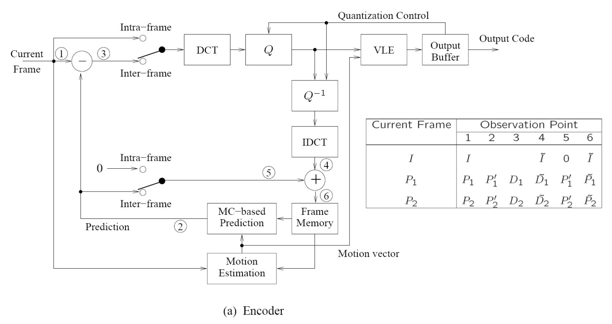
</div>

解码器数据流：

<div style="text-align: center">
    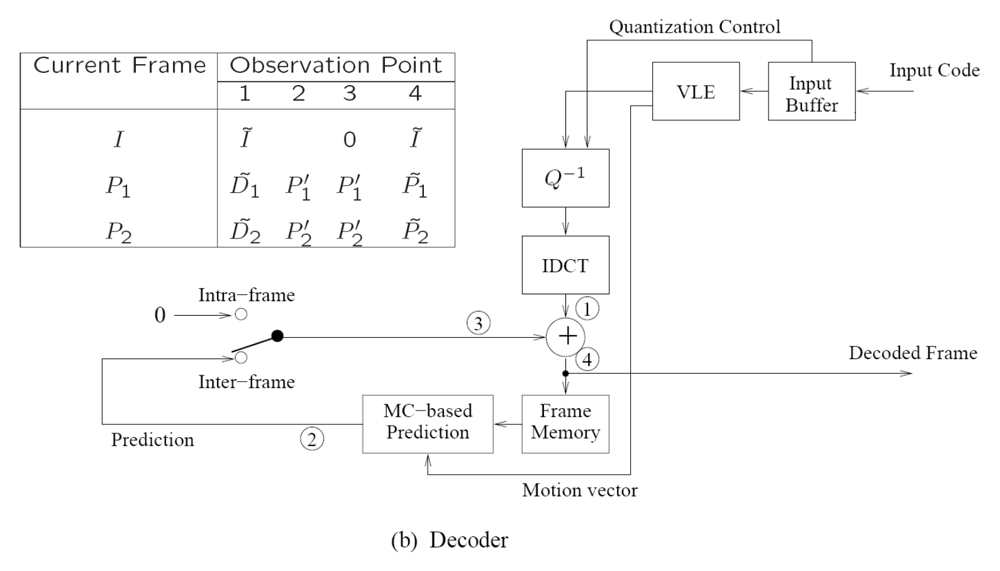
</div>


### Video Bitsteam Syntax

H.261 视频比特流语法分为 4 层：

<div style="text-align: center">
    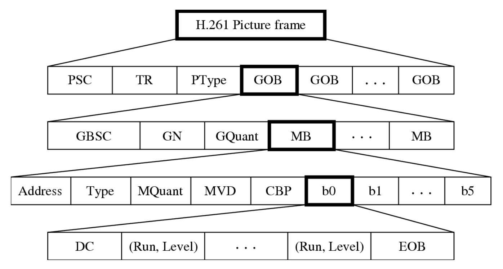
</div>

- **帧**（图片）

    <div style="text-align: center">
        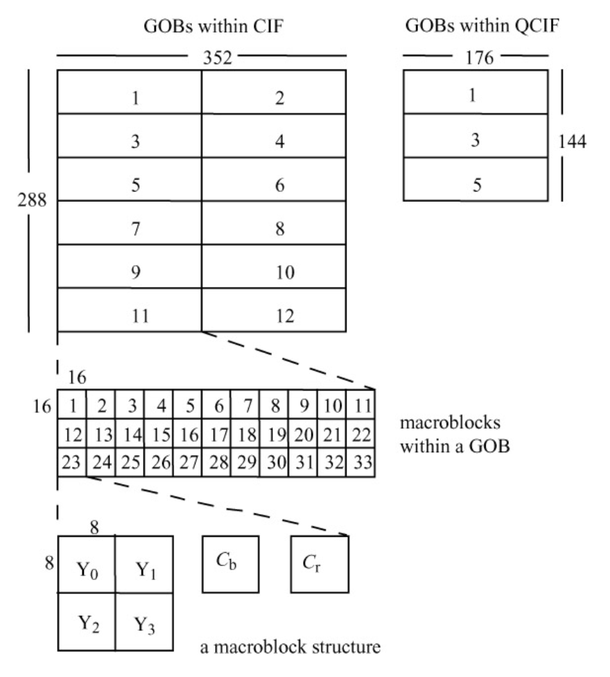
    </div>

    - **PSC**（图像起始码）：界定图像之间的边界
    - **TR**（时间参考）：为图像提供时间戳

- **块组**（GOB）：H.261 图像被划分为 11*3 的宏块区域，每个区域称为一个块组（GOB）
    - 例子：CIF 格式的图像包含 2*6 个 GOB，对应其 352\*288 像素的图像分辨率，每个 GOB 都有起始码（GBSC）和组号（GN）
    - 若网络错误导致比特错误或部分数据丢失，H.261 视频可在下一个可识别的 GOB 处恢复并重新同步
    - GQuant 指示该 GOB 中使用的量化器，除非后续的 MQuant（宏块量化器）将其覆盖；GQuant 和 MQuant 在公式中被称为缩放因子

- **宏块**（MB）：每个宏块都有其自身的地址，用于指示其在 GOB 中的位置、量化器（MQuant），以及六个 8*8 的图像块（4 个 Y，1 个 Cb，1 个 Cr）

- **块**：对于每个 8\*8 块，比特流以直流分量值开始，随后是交流分量的 zerorun 长度与后续非零值的配对序列，最后以 EOB（块结束）码结尾
    - Run 的取值范围为 [0, 63]
    - Level 反映量化后的数值，其范围为 [-127, 127]，且 Level != 0


## H.263

### Overview

H.263 是一项改进的公共交换电话网（PSTN）视频会议及其他视听服务标准，旨在实现低于 64 kbps 的低比特率通信。它支持子 QCIF、4CIF 和 16CIF 格式。

| 视频格式 | 亮度图像分辨率 | 色度图像分辨率 | 比特率（Mbps）（若为 30 fps 且未压缩）| 比特率（kbps）BPPmaxKb（已压缩）|
| :--- | :--- | :--- | :--- | :--- |
| sub-QCIF | $128 \times 96$ | $64 \times 48$ | 4.4 | 64 |
| QCIF | $176 \times 144$ | $88 \times 72$ | 9.1 | 64 |
| CIF | $352 \times 288$ | $176 \times 144$ | 36.5 | 256 |
| 4CIF | $704 \times 576$ | $352 \times 288$ | 146.0 | 512 |
| 16CIF | $1,408 \times 1,152$ | $704 \times 576$ | 583.9 | 1024 |


### Group of Blocks (GOB)

与 H.261 标准类似，H.263 同样支持 GOB，但不同之处在于 H.263 中的 GOB 没有固定尺寸，且始终从图像的左右边界开始和结束。

如下图所示：

<div style="text-align: center">
    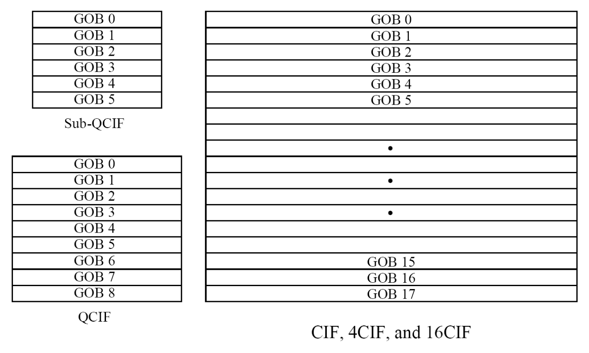
</div>

- QCIF 亮度图像包含 9 个 GOB，每个 GOB 由 11\*1 个宏块组成（176\*16 个像素）
- 4CIF 亮度图像则包含 18 个 GOB，每个 GOB 由 44\*2 个宏块构成（704\*32 个像素）


### Motion Compensation

运动向量（MV）的水平与垂直分量分别通过「前一个(previous)」、「上方(above)」及「右上(above and right)」宏块（MBs）中 MV1、MV2、MV3 的水平与垂直分量的中值进行预测，如下图所示。

<div style="text-align: center">
    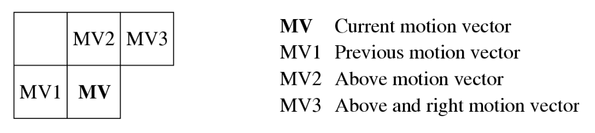
</div>

对于带有 $\text{MV}(u, v)$ 的宏块：

- $u_p = \text{median}(u_1, u_2, u_3)$
- $v_p = \text{median}(v_1, v_2, v_3)$

我们不直接编码 $\text{MV}(u, v)$，而是对误差向量 $(\delta u, \delta v)$ 进行编码，其中 $\delta u = u - u_p, \delta v = v - v_p$。

<div style="text-align: center">
    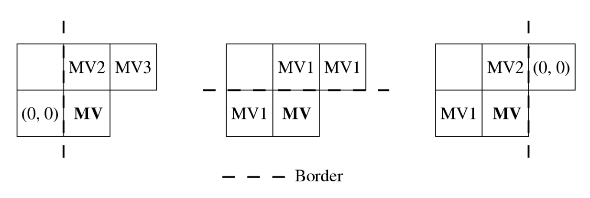
</div>

为了减少预测误差，H.263 支持**半像素精度**，而 H.261 仅支持全像素精度。

- 运动矢量 MV(u, v) 的水平分量 u 和垂直分量 v 的默认范围现在为 [−16, 15.5]
- 半像素位置所需的像素值通过简单的双线性插值方法生成，如下图所示

<div style="text-align: center">
    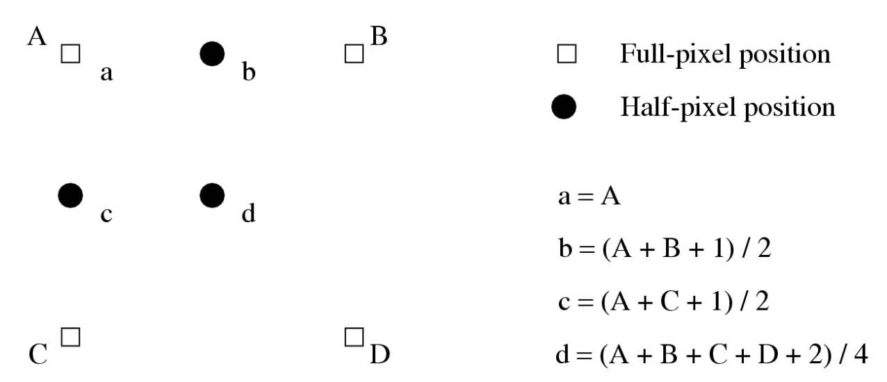
</div>


### Optional Coding Modes

除了其核心算法外，可协商的选项包括：

- **无限制的运动向量模式**
    - 参考不受图像边界限制
    -  通过扩大编码图像的边缘至特定尺寸（例如宏块大小）来实现

    <div style="text-align: center">
        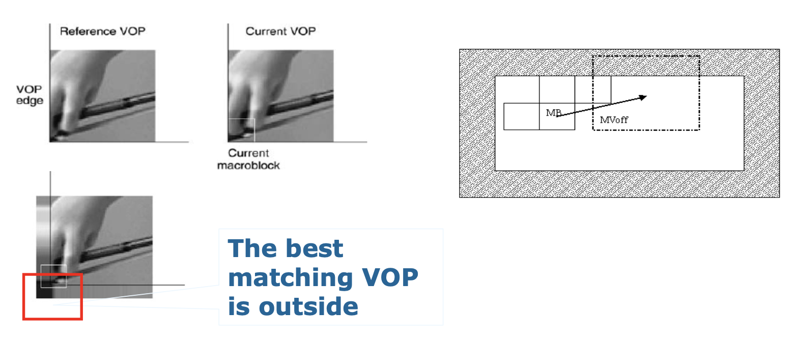
    </div>

- **基于语法的算术编码模式**
    - 与 H.261 类似，H.263 也采用可变长度编码（VLC）作为 DCT 系数的默认编码方法
    - 类似于 H.261，H.263 的语法结构同样分为四个层次，每一层均通过固定长度码和可变长度码的组合进行编码

- **高级预测模式**（宏块支持 4 个运动向量）
    - 在此模式下，运动补偿的宏块尺寸从 16 减小至 8
    - 对于亮度图像中的每个宏块，会生成四个运动矢量（分别来自每个 8\*8 子块）

- **PB 帧模式**
    - 在 H.263 标准中，PB 帧由两幅图像作为一个编码单元组成，如下图所示：

        <div style="text-align: center">
            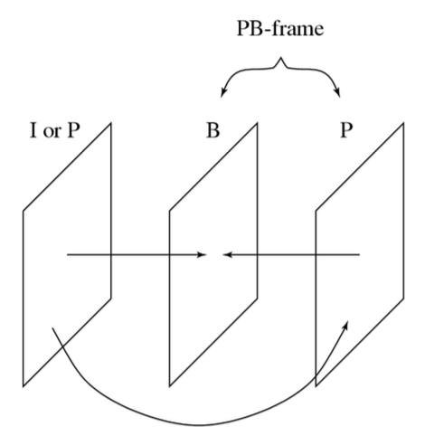
        </div>

    - PB 帧模式的使用通过 PTYPE 字段进行指示
    - 对于中等运动强度的视频，PB 帧模式能够提供令人满意的压缩效果
    - 在大幅度运动场景下，PB 帧的压缩效率不及 B 帧，为此 H.263 第二版已开发出改进的新模式


### H.263+ and H.263++

H.263+：H.263 的第二版

- 重新定义无限制运动矢量模式
- 采用切片结构替代 GOB
- 实现时间、信噪比和空间可伸缩性
- 支持改进的 PB 帧模式
- 使用去块滤波器(deblocking filter)以减少块效应

H.263++：新扩展功能

- 增强型参考图片选择（ERPS）
- 数据分区切片（DPS）
- 附加补充增强信息