# MPEG Video Coding

MPEG 全称为运动图像专家组(Moving Pictures Experts Group)，成立于 1998 年，致力于提供数字视频和音频技术。

## MPEG-1

在 1991 年 ISO/IEC 标准中，MPEG-1 具有以下特点：

- 针对数字存储介质（速率约 1.5Mbit/s）的运动图像及伴音(associated audio)编码规范
- 适用于 CD 与 VCD；视频码率 1.2M，音频码率 256K
- 包含五大模块：系统、视频、音频、一致性(conformance)、软件
- 采用 CCIR601 数字电视格式——SIF（源输入格式）
    - 仅支持逐行扫描视频制式
    - NTSC 制式：352*240 分辨率，30fps
    - PAL 制式：352*288 分辨率，25fps
    - 采用 4:2:0 色度二次采样方案


### Motion Compensation in MPEG-1

基于运动补偿（MC）的视频编码在 H.261 标准中的工作原理如下：

- 在运动估计（ME）阶段，目标 P 帧的每个宏块（MB）会从先前已编码的 I 帧或 P 帧中分配一个最佳匹配宏块作为**预测**
- **预测误差**：当前宏块与其匹配宏块的差值，随后被送入 DCT 及其后续编码步骤进行处理
- **前向预测**：预测来源于前一帧

<div style="text-align: center">
    
</div>

目标帧中包含部分球体的宏块无法在前一帧中找到良好匹配，因为球体的一半被另一物体遮挡。然而，从下一帧中可以轻松获得匹配。

而 MPEG 引入了第三种帧类型，即 **B 帧**，以及双向运动补偿。

<div style="text-align: center">
    
</div>

下图展示了基于运动补偿的 B 帧编码的思路：

<div style="text-align: center">
    
</div>

- **B 帧中的每个宏块最多可拥有两个运动向量**（一个来自前向预测，一个来自后向预测）
- 若双向匹配均成功，则发送两个运动向量，并将对应的匹配宏块进行**平均**处理（图中以 `%` 标示），再与目标宏块比较以生成预测误差
- 若仅在某一参考帧中找到有效匹配，则仅使用前向或后向预测中的一个运动向量及其对应宏块

下图展示了 MPEG 的帧序列：

<div style="text-align: center">
    
</div>

B 帧依赖于其后续的 P 帧或 I 帧，因此**播放顺序与编码顺序不同**。

<div style="text-align: center">
    
</div>


### Other Major Differences from H.261

H.261 仅支持 CIF（352×288）和 QCIF（176×144）格式；而 MPEG-1 支持 SIF 格式（NTSC 制式为 352×240，PAL 制式为 352×288），并允许指定其他格式。

| 参数 | 数值 |
| :--- | :--- |
| 图像水平尺寸 | $\le 768$ |
| 图像垂直尺寸 | $\le 576$ |
| 每帧宏块数（MBs / picture）| $\le 396$ |
| 每秒宏块数（MBs / second）| $\le 9,900$ |
| 帧率 | $\le 30 \text{ fps}$ |
| 比特率 | $\le 1,856 \text{ kbps}$ |

与 H.261 中的 GOB 不同，MPEG-1 图像可被划分为一个或多个切片：

<div style="text-align: center">
    
</div>

- 单个图像中可包含数量不等的宏块
- 只要填满整个画面，切片起止位置可以任意设定
- 每个切片独立编码，这为比特率控制提供了额外灵活性
- 切片概念对于错误恢复至关重要

在量化方面，MPEG-1 在其帧内编码和帧间编码中采用了不同的量化表。

- 帧内模式的 DCT 系数：

    $$
    \text{QDCT}[i, j] = \text{round} \left[ \frac{8 \times \text{DCT}[i, j]}{\text{step\_size}[i, j]} \right] = \text{round} \left[ \frac{8 \times \text{DCT}[i, j]}{Q_1[i, j] \times \text{scale}} \right]
    $$

- 帧间模式的 DCT 系数：

    $$
    \text{QDCT}[i, j] = \frac{8 \times \text{DCT}[i, j]}{\text{step\_size}[i, j]} = \frac{8 \times \text{DCT}[i, j]}{Q_2[i, j] \times \text{scale}}
    $$

帧内编码的量化数在宏块内部变化，这与H.261不同。

<div style="text-align: center">
    
</div>

其他不同之处：

- MPEG-1 允许运动矢量达到子像素(sub-pixel)精度（1/2像素）；H.263中采用的双线性插值技术可用于生成半像素位置所需的数值
- 相较于 H.261 标准中运动矢量最大范围 ±15 像素，MPEG-1 支持的运动矢量范围在半像素精度下为 [-512, 511.5]，在全像素精度下为 [-1024, 1023]
- MPEG-1 比特流支持随机访问功能，这是通过 GOP 层实现的，每个 GOP 都带有时间编码

关于压缩：

- 压缩后的 P 帧典型尺寸显著小于 I 帧，这是因为在帧间压缩中利用了时间冗余性
- 而 B 帧甚至比 P 帧更小，原因在于双向预测的优势以及 B 帧被赋予最低的优先级


### MPEG-1 Video Bitstream

<div style="text-align: center">
    
</div>

<div style="text-align: center">
    
</div>


## MPEG-2

### Overview

**MPEG-2** 始于1990年，旨在实现比特率超过 4 Mbps 的**高质量视频**，以满足数字电视/高清电视的压缩与比特率要求。该标准获得广泛应用，包括地面广播、卫星、有线网络，以及互动电视、DVD 等。

MPEG-2 定义了 7 种配置，针对不同的应用场景，每种配置最多可定义4个级别，包括简单型(simple)、主型(main)、信噪比可伸缩(SNR scalable)、空间可伸缩(spatially scalable)、高级(high)、4:2:2 以及多视图(multiview)。


### Interlaced Video

MPEG-2 必须支持**隔行扫描视频**(interlaced video)，因为这是数字广播电视和高清电视的选项之一。

- 在隔行扫描视频中，每一帧由两个场组成，分别称为**顶场**和**底场**
- 在**帧图像**中，来自两个场的所有扫描线交织在一起形成一个单帧，然后被划分为 16×16 的宏块并使用运动补偿进行编码
- 如果每个场被视为独立的图像，则称之为**场图像**

<div style="text-align: center">
    
</div>

5 种预测模式：

- 帧图像的帧预测
    - 与 MPEG-1 运动补偿相同
    - 适用于包含缓慢和中等速度物体的视频

- 场图像的场预测

    <div style="text-align: center">
        
    </div>

- 帧图像的场预测：分别处理顶场和底场
- 用于场图像的 16×8 MC：适合快速且不规则的运动场景
- P 图像的双重主参考模式：MV 用于推导计算出的运动矢量CV

交替扫描与场DCT

- 旨在提升 DCT 对预测误差处理效率的技术，仅适用于隔行视频中的帧图像
    - 由于隔行视频的特性，8×8 块中连续的行来自不同的场，它们之间的相关性低于交替行之间
    - 交替扫描认识到在隔行视频中，垂直方向的高空间频率分量可能具有更大的幅度，因此允许它们在序列中更早被扫描

- 在 MPEG-2 标准中，场 DCT 也可用于解决相同的问题

<div style="text-align: center">
    
</div>


### MPEG-2 Scalabilities

MPEG-2 **可伸缩编码**(scalable coding)：可以定义一个基础层和一个或多个增强层（也称为**分层编码**(layered coding)）。

- 基础层可以独立进行编码、传输和解码，以获得基本的视频质量
- 增强层的编码和解码依赖于基础层或前一个增强层

对于在具有以下特性的网络上传输的MPEG-2视频，可伸缩编码尤其有用：

- 比特率差异很大的网络
- 具有可变比特率（VBR）通道的网络
- 连接噪声较大的网络

???+ example "例子"

    <div style="text-align: center">
        
    </div>

在带宽不足时仅发送基础层，而在宽带条件下同时传输基础层与增强层，以便接收端获得更优质量。

<div style="text-align: center">
    
</div>

MPEG-2 支持以下可伸缩性：

- **SNR 可伸缩性**：增强层提供更高的信噪比；编码器将生成两个层次的输出比特流：基础层比特流（Bits_base）和增强层比特流（Bits_enhance）
    1. 在基础层，采用对 DCT 系数的粗量化处理，这导致生成的比特数较少，视频质量相对较低
    2. 随后，这些经过粗量化的 DCT 系数会进行反量化（Q^−1^），并输入到增强层与原始的 DCT 系数进行比较
    3. 两者之间的差异通过精细量化处理，生成 DCT 系数的细化部分，这部分数据经过可变长度编码后形成称为 Bits_enhance 的比特流

    <div style="text-align: center">
        
    </div>

    <div style="text-align: center">
        
    </div>

- **空间可伸缩性**：增强层提供更高的空间分辨率
    - 基础层旨在生成降低分辨率图像的比特流；当与增强层结合时，可生成原始分辨率的图像

    <div style="text-align: center">
        
    </div>

    <div style="text-align: center">
        
    </div>

- **时间可伸缩性**：增强层实现更高的帧率
    - 输入视频在时间上被解复用为两部分，每部分承载原始帧率的一半
    - 基础层编码器对其自身的输入视频执行常规的单层编码流程，并生成输出比特流 Bits_base
    - 增强层中匹配宏块的预测可通过两种方式获得：
        - 层间运动补偿预测
        - 结合运动补偿预测与层间运动补偿预测

    <div style="text-align: center">
        
    </div>

    - 基础层和增强层的图像与输入具有相同的空间分辨率

    <div style="text-align: center">
        
    </div>

- **混合可伸缩性**：
    - 上述三种可伸缩性中的任意两种可以结合：
        - 空间与时间混合可伸缩性
        - SNR 与空间混合可伸缩性
        - SNR 与时间混合可伸缩性

    - 通常采用三层混合编码器，包括基础层、增强层 1 和增强层 2

- **数据分区**(data partitioning)：量化后的 DCT 系数被分割成多个分区

    <div style="text-align: center">
        
    </div>

    - 基础分区包含低频 DCT 系数，增强分区则包含高频 DCT 系数
    - 严格来说，数据分割并非分层编码，因为视频数据的单一流仅被简单划分，且在生成增强分区时并不进一步依赖基础分区
    - 适用于噪声信道传输及渐进式传输

    ???+ example "例子"

        <div style="text-align: center">
            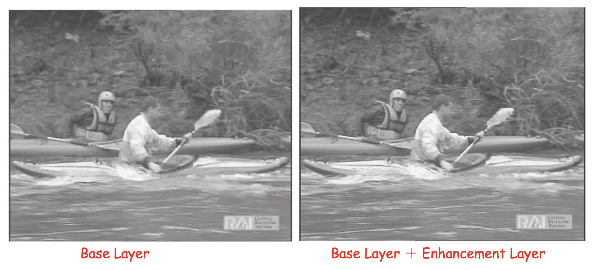
        </div>


### Other Major Differences from MPEG-1

- 更强的抗误码能力：除了程序流外，MPEG-2 比特流中还增加了传输流
- 支持 4:2:2 和 4:4:4 色度子采样
- 更严格的切片结构：MPEG-2 的切片必须在同一宏块行开始和结束；换言之，图像左边缘总是新切片的起点，且 MPEG-2 中最长的切片只能包含一行宏块
- 更灵活的视频格式：支持 DVD、ATV 及 HDTV 定义的各种图像分辨率
- 非线性量化，允许两种类型的尺度：
    - 类型 1：尺度与MPEG-1中的相同，它是一个在 [1, 31] 范围内的整数，且 $\text{scale}_i = i$
    - 类型 2：存在非线性关系，即 $\text{scale}_i \ne i$，第 $i$ 个尺度值可以从下表中查找得到

        | $i$ | 1 | 2 | 3 | 4 | 5 | 6 | 7 | 8 | 9 | 10 | 11 | 12 | 13 | 14 | 15 | 16 |
        | :--- | :--- | :--- | :--- | :--- | :--- | :--- | :--- | :--- | :--- | :--- | :--- | :--- | :--- | :--- | :--- | :--- |
        | $\text{scale}_i$ | 1 | 2 | 3 | 4 | 5 | 6 | 7 | 8 | 10 | 12 | 14 | 16 | 18 | 20 | 22 | 24 |
        | $i$ | 17 | 18 | 19 | 20 | 21 | 22 | 23 | 24 | 25 | 26 | 27 | 28 | 29 | 30 | 31 |
        | $\text{scale}_i$ | 28 | 32 | 36 | 40 | 44 | 48 | 52 | 56 | 64 | 72 | 80 | 88 | 96 | 104 | 112 |


## MPEG-4

### Overview

MPEG-4 是一种较新的标准，除了压缩外还非常注重用户交互性的问题。并且与之前的版本不同，它采用了**基于对象编码**(object-based coding)的方式：

<div style="text-align: center">
    
</div>

- 提供更高的压缩比，同时有助于数字视频的合成、操作、索引和检索

    <div style="text-align: center">
        
    </div>

- 任意形状编码
- 静态纹理编码
- 面部对象编码与动画
- 身体对象编码与动画

另外，MPEG-4 视频的比特率现在覆盖了从 5kbps 到 10Mbps 的大范围。

具体来说，MPEF-4 是以下功能的全新标准：

- 组合媒体对象，以创建理想的视听场景
- 对这些媒体数据实体的比特流进行复用和同步，以便能够以保证的服务质量（QoS）进行传输
- 在接收端与视听场景交互：提供用于音频和视频压缩的高级编码模块及算法工具箱

??? info "比较不同 MPEG 版本的交互性"

    === "MPEG-1 和 2"

        <div style="text-align: center">
            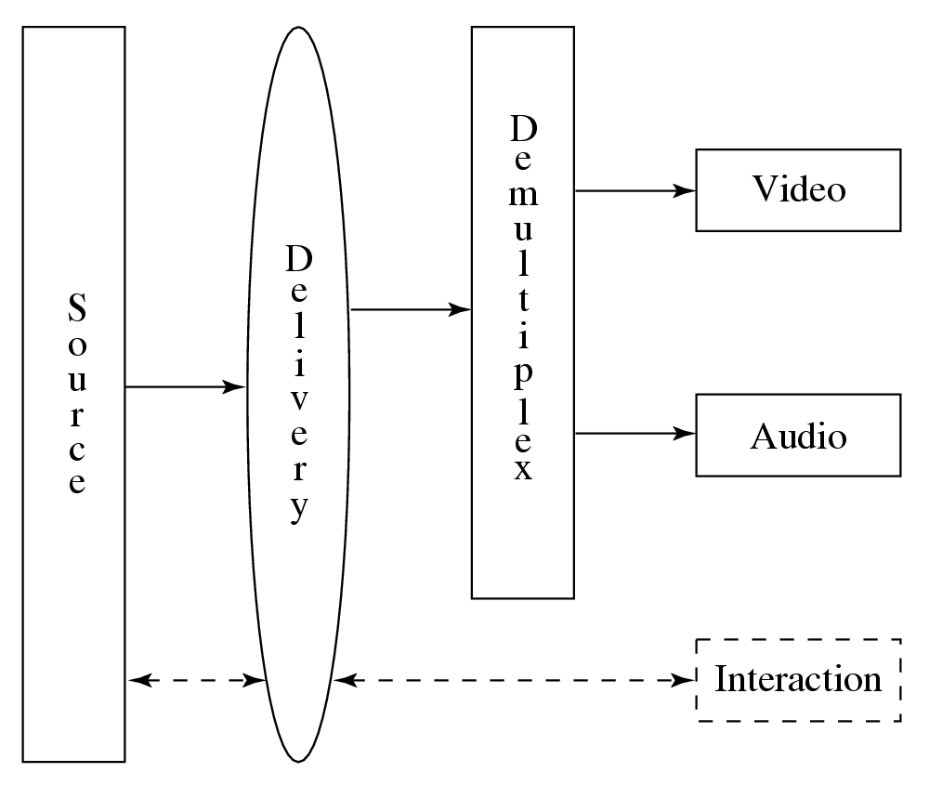
        </div>

        >虚线部分是 MPEG-2 独有的。

    === "MPEF-4"

        <div style="text-align: center">
            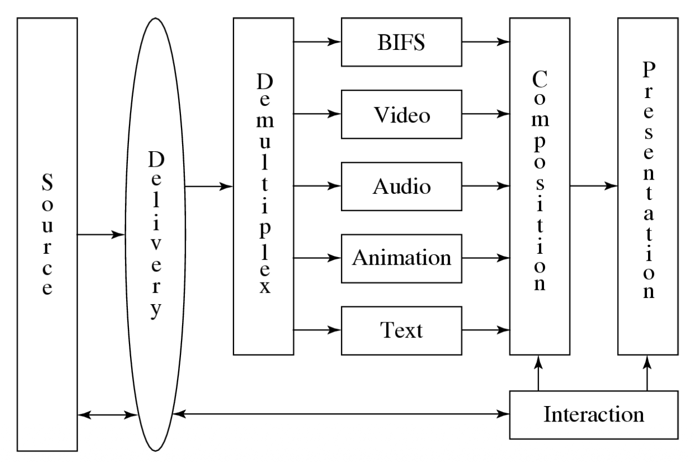
        </div>

MPEG-4 视频比特流的层次结构与 MPEG-1 和 MPEG-2 有很大不同，它非常面向视频对象。

<div style="text-align: center">
    
</div>

- **视频对象序列**(video-object sequence, VS)：呈现完整的 MPEG-4 视觉场景，可包含二维或三维的自然或合成对象。 
- **视频对象**(video object, VO)：场景中的特定对象，其形状可为任意（非矩形），对应场景中的某一物体或背景
- **视频对象层**(video object layer, VOL)：提供支持（多层）可伸缩编码的方式。在可伸缩编码下，一个 VO 可包含多个 VOL；在非可伸缩编码下则仅含单个VOL
- **视频对象平面组**(group of video object planes, GOV)：将多个视频对象平面组合在一起（可选层级）
- **视频对象平面**(video object plane, VOP)：某一时刻对 VO 的瞬时快照


### Object-Based Visual Coding

#### VOP-Based Coding vs. Frame-Based Coding

MPEG-1 和 -2 不支持 VOP 概念，因此其编码方法被称为**基于帧的编码**（也称为基于块的编码）。

<div style="text-align: center">
    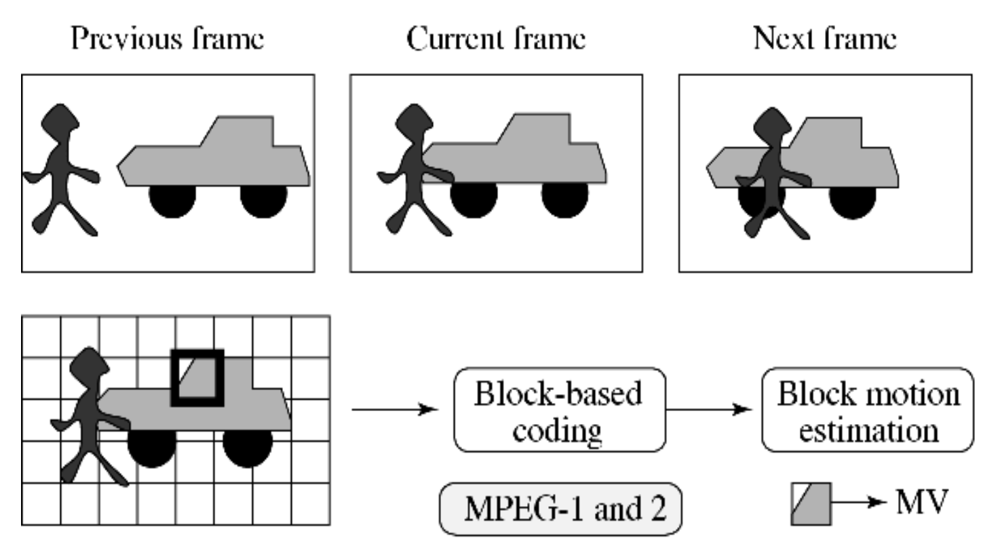
</div>

下图展示了其中两种潜在的匹配在基于块的编码中均产生较小的预测误差。

<div style="text-align: center">
    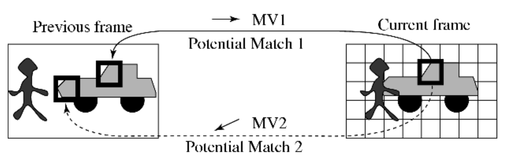
</div>

而下图展示每个 VOP 具有任意的形状，理想情况下将获得与真实物体运动一致的唯一的运动向量。

<div style="text-align: center">
    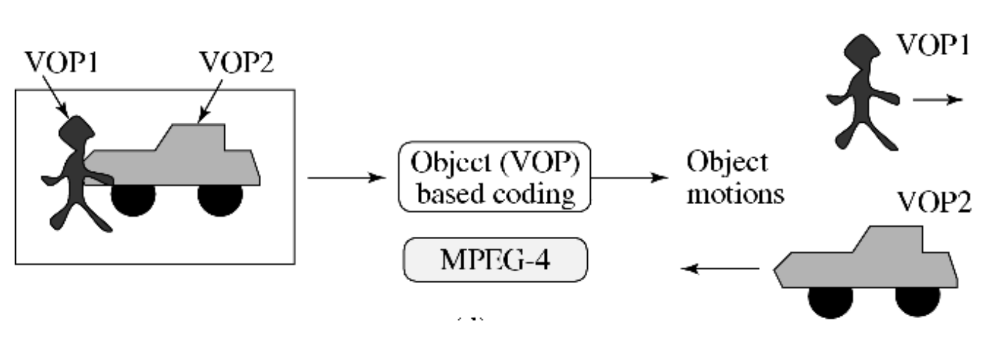
</div>

MPEG-4 基于 VOP 的编码也采用了运动补偿技术：

- 帧内编码的 VOP 称为 **I-VOP**
- 帧间编码的 VOP 若仅采用前向预测，则称为 **P-VOP**；若采用双向预测，则称为 **B-VOP**

VOP 面临的新难点是可能具有任意形状。因此除了 VOP 的纹理信息外，还需对**形状**信息进行编码。

>注：此处的「纹理」实际指视觉内容，即 VOC 中像素的灰度（或色度）值。


#### Motion Compensation

MPEG-4 中基于运动补偿的视频对象平面编码同样涉及以下 3 个步骤：

1. 运动估计
2. 基于运动补偿的预测
3. 预测误差的编码

在运动补偿过程中，仅考虑**当前（目标）视频对象平面**内的像素进行匹配。另外，为便于应用运动补偿，每个视频对象平面被划分为多个**宏块**。默认情况下，亮度图像中的宏块大小为 16×16，色度图像中的宏块大小为 8×8。

MPEG-4 为每个 VOP 定义了一个矩形边界框，如下图所示：

<div style="text-align: center">
    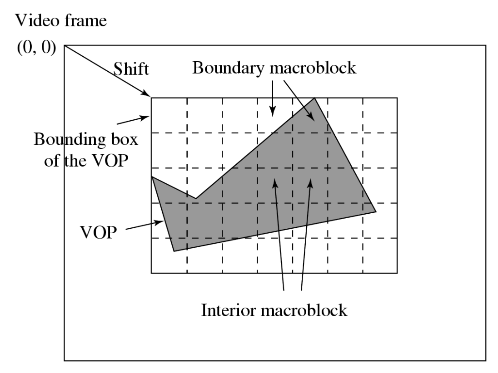
</div>

- 完全位于 VOP 内部的宏块称为**内部宏块**(interior macroblocks)
    - 对内部宏块的运动补偿以与 MPEG-1 和 2 相同的方式进行

- 跨越 VOP 边界的宏块则被称为**边界宏块**(boundary macroblocks)

???+ example "例子"

    <div style="text-align: center">
        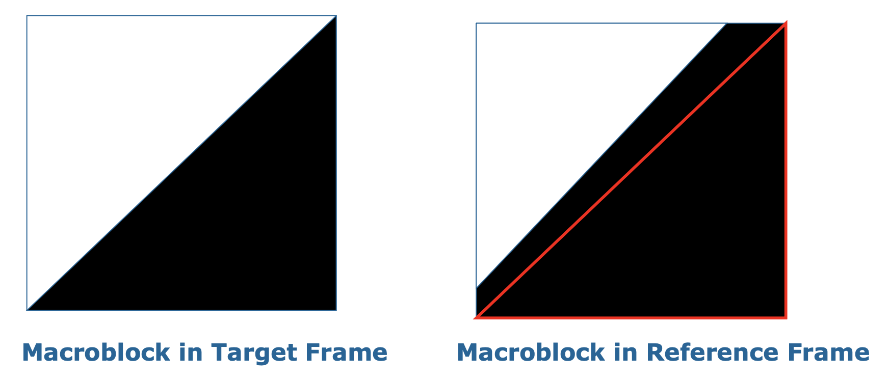
    </div>

    <div style="text-align: center">
        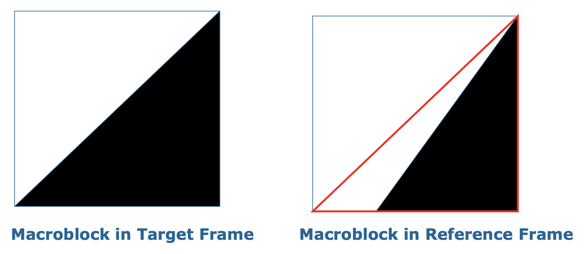
    </div>

为确保目标 VOP 中每个像素的匹配，并满足变换编码（如 DCT）对矩形块的强制要求，在运动估计前需对**参考 VOP** 进行预处理**填充**(padding)操作。

<div style="text-align: center">
    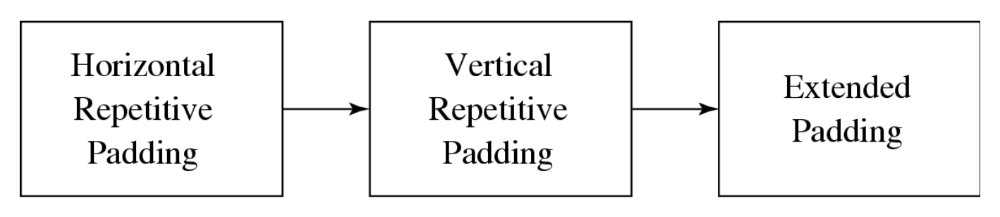
</div>

- **水平填充**：检查每一行，每个边界像素向左和/或向右复制，以填充 VOP 外部的值
    - 如果间隔由两个边界像素界定，则采用它们的**平均值**
    - 伪代码如下：

        ```pascal
        begin
            for all rows in Boundary MBs in the Reference VOP
                if ∃ (boundary pixel) in the row
                    for all interval outside of VOP
                        if interval is bounded by only one boundary pixel b
                            assign the value of b to all pixels in interval
                        else // interval is bounded by two boundary pixels b1 and b2
                            assign the value of (b1 +b2)/2 to all pixels in interval
        end
        ```

- **垂直填充**的工作原理类似

???+ example "例子"

<div style="text-align: center">
    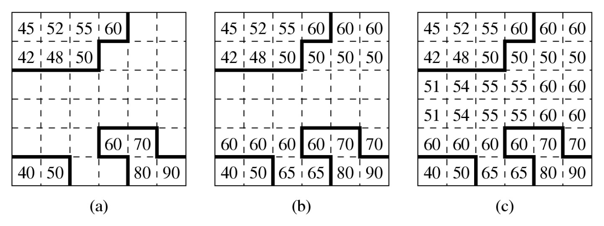
</div>

- **扩展填充**：紧邻边界宏块的外部宏块通过复制边界宏块的边缘像素值进行填充
    - 使用的宏块遵循**优先级**顺序：左、上、右、下

运动估计：

$$
\begin{aligned}
&\text{SAD}(i, j) = \sum_{k=0}^{N-1} \sum_{l=0}^{N-1} |C(x+k,y+l) - R(x+i+k,y+j+l)| \cdot \text{Map}(x+k,y+l) \\
&\text{Map}(p,q) = \begin{cases} 1 & \text{if } C(p, q) \text{ is pixel in VOP} \\  0 & \text{else}\end{cases} \\
&\text{motion vector } MV : (u,v) = \{ (i,j) \mid \text{SAD}(i,j) \text{ is minimum} \} \\
& \quad \quad \quad \quad \quad \quad \quad \quad \quad \quad \quad \quad i, j \in [-p,p], \ p \text{ is maximum of } u \text{ and } v
\end{aligned}
$$

- 允许亮度分量具有四分之一的像素精度
- 运动向量可以指向参考 VOP 边界之外，VOP 外的像素在填充步骤中定义


#### Texture Coding

I-VOP 编码方式类似于 JPEG

- 对于 P-VOP 和 B-VOP，预测误差被送入 DCT 和 VLC 处理

- 基于 DCT 的纹理编码
    - VOP 边界宏块外部区域填充零值
    - DC 分量的量化步长固定为 8
    - AC 系数可采用两种方法处理：
        - H.263 方法：所有系数使用相同量化器
        - MPEG-2 方法：同一宏块内的 DCT 系数可使用不同量化器

- 基于 SA-DCT（形状自适应 DCT）的边界宏块编码是一种二维 DCT，它通过两次一维 DCT-N 的迭代计算，实现可分离的二维变换

    $$
    \begin{aligned}
    & 1D \ (DCT-N) \\
    & F(u) = \sqrt{\frac{2}{N}} C(u) \sum_{i=0}^{N-1} \cos \frac{(2i+1)u\pi}{2N} f(i) \\
    & 1D \ (IDCT-N) \\
    & \tilde{f}(i) = \sum_{u=0}^{N-1} \sqrt{\frac{2}{N}} C(u) \cos \frac{(2i+1)u\pi}{2N} F(u) \\
    & \text{where} \quad i = 0, 1, \cdots, N-1; u = 0, 1, \cdots, N-1 \\
    & C(u) = 
    \begin{cases} 
    \displaystyle \frac{\sqrt{2}}{2} & \text{if } u = 0 \\
    1 & \text{otherwise} 
    \end{cases}
    \end{aligned}
    $$

    ???+ example "例子"

        <div style="text-align: center">
            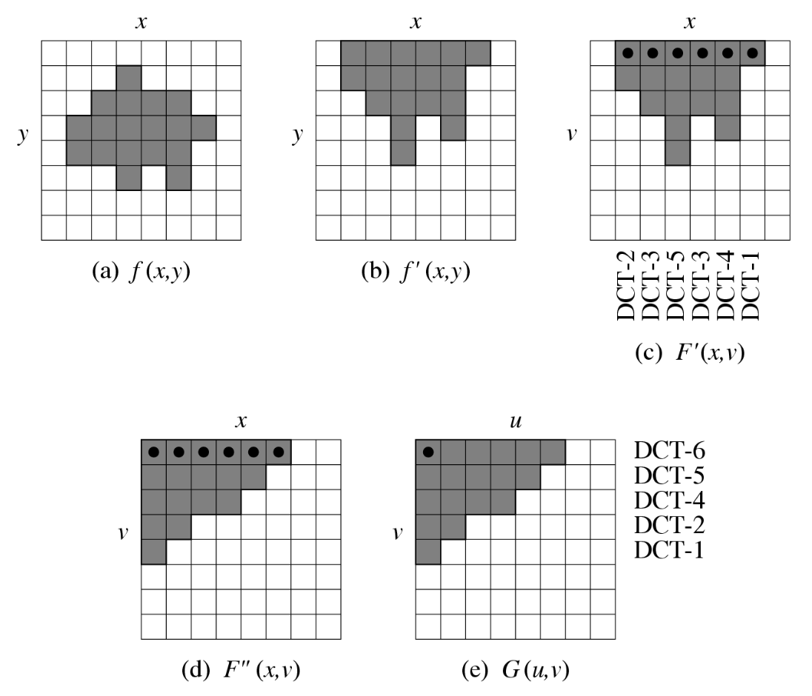
        </div>


#### Shape Coding

MPEG-4 支持两种形状信息：二值形状和灰度形状。

- **二值形状**：采用与 VOP 矩形边界框尺寸相同的二值图（也称为二值 Alpha 图）形式表示；位图中值为 `1`（不透明）或 `0`（透明），用于指示像素位于 VOP 内部还是外部

    ???+ example "例子"

        <div style="text-align: center">
            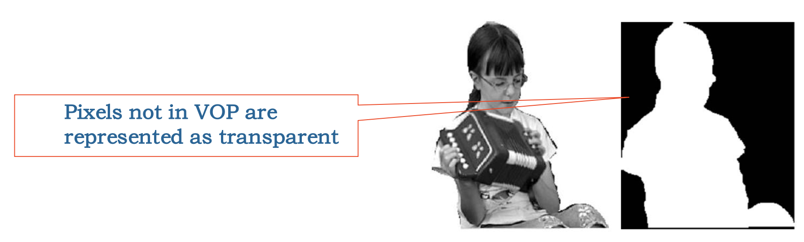
        </div>

    1. 计算当前上下文值 X：
    - 每个像素为二进制，根据已编码的 10 个像素计算上下文 X
        - X 有 10 位：C9C8C7C6C5C4C3C2C1C0  
        - X 的取值范围为 0~1024 
        - 通过**查找表**（MPEG-4 标准）获取对应的值

    2. 算术编码：查找表中的数值表示 1024 个上下文中每个上下文**出现的概率**

    <div style="text-align: center">
        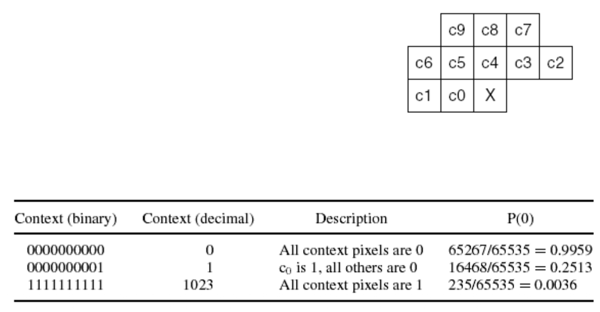
    </div>

- **灰度形状**：实际上指代形状的透明度，其灰度值范围从 0（完全透明）到 255（不透明）
    
    <div style="text-align: center">
        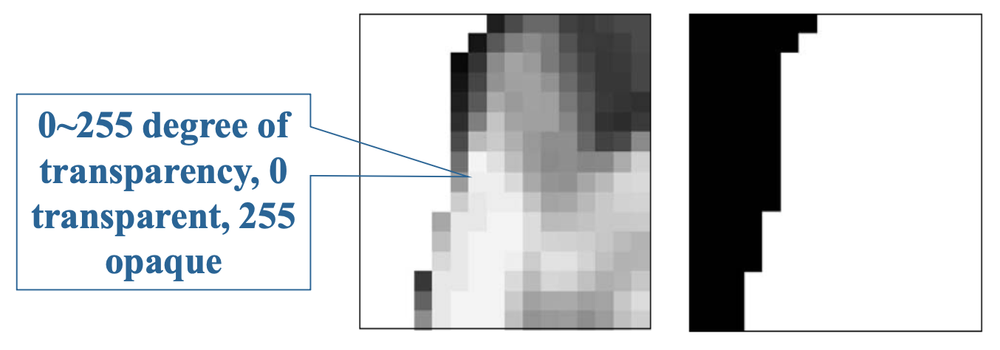
    </div>
    
    - 光栅图形使用额外的位平面来存储 Alpha 映射
    - 灰度形状编码是有损的，而二值形状编码是无损的


#### Static Texture Coding

静态物体纹理采用**小波编码**(wavelet coding)：

- 最低频率的子带(sub-bands)采用 DPCM 进行编码
    - 每个系数的预测基于三个相邻系数

- 其他子带则基于**多尺度零树**(multiscale zero-tree)**小波编码**

    <div style="text-align: center">
        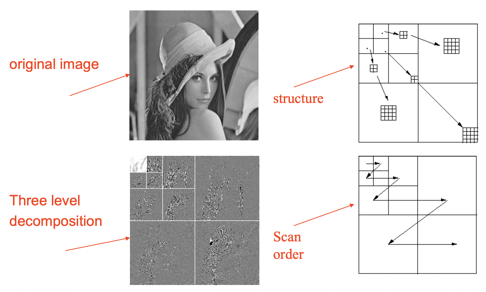
    </div>

    - 多尺度零树具有父子关系树结构，能更好地利用所有系数的位置信息

- 使用较大的量化器，并对最显著的系数采用算术编码
    - 在下一轮迭代中，当使用更小的量化器时，对差值进行编码


#### Sprite Coding

- 部分背景可视为静态图像  
- 背景受摄像机移动影响  
- 背景可单独编码，前景对象可用于创建基于对象的灵活 MPEG-4 视频合成

<div style="text-align: center">
    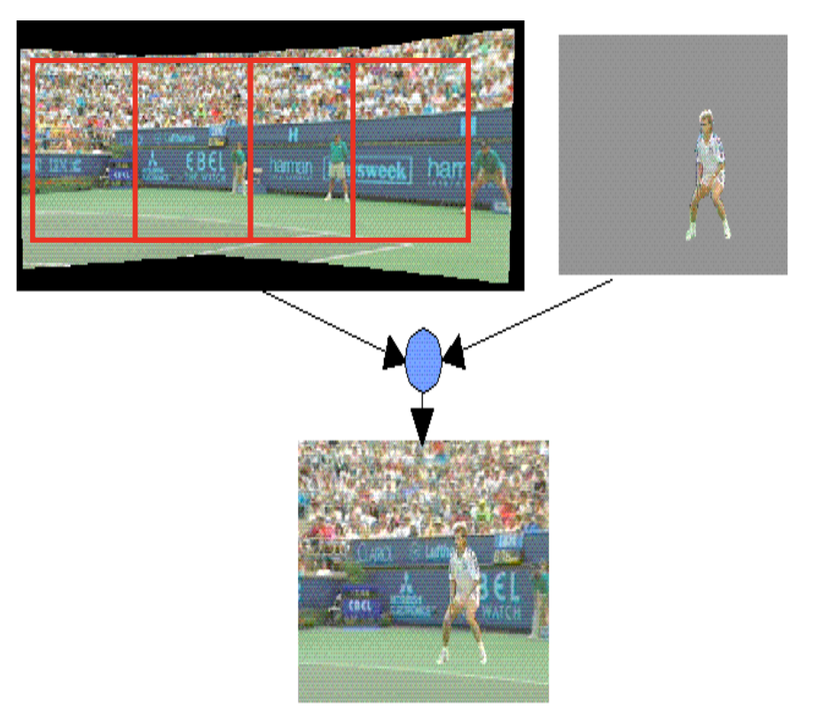
</div>


#### Global Motion Compensation

- 诸如平移、倾斜、旋转和变焦等摄像机运动常导致连续帧间内容的快速变化，因此基于块的运动补偿在这些情况下并非非高效的方法
- 而**全局运动补偿**(global motion compensation)是更优的选择，它包含四个主要部分：
    - 全局运动估计
    - 扭曲与融合处理
    - 运动轨迹编码技术
    - 选择局部运动补偿（LMC）或全局运动补偿（GMC）


### Synthetic Object Coding

- **合成对象**(synthetic object)：使用计算机创建的对象
- **2D 网格对象编码**(2D mesh object coding)：利用多边形面片对二维平面区域进行镶嵌（或分割）

    <div style="text-align: center">
        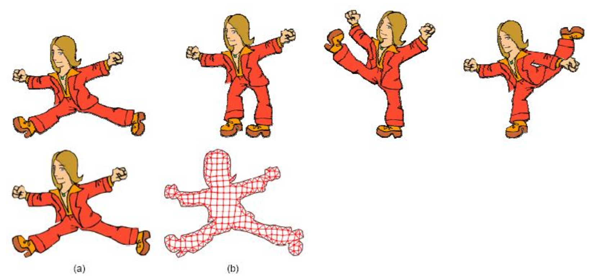
    </div>

    - 多边形的顶点被称为网格的节点 
    - 最常用的网格是**三角形**网格，其中所有多边形均为三角形
    - MPEG-4 标准采用两种类型的二维网格：**均匀网格**(uniform mesh)和**德劳内网格**(Delaunay mesh)
    - 二维网格对象编码紧凑，所有坐标值均以**半像素精度**进行编码
    - 每个二维网格被视为一个**网格对象平面**(mesh object plane, MOP)

下图展示了 2D MOP 的编码过程：

<div style="text-align: center">
    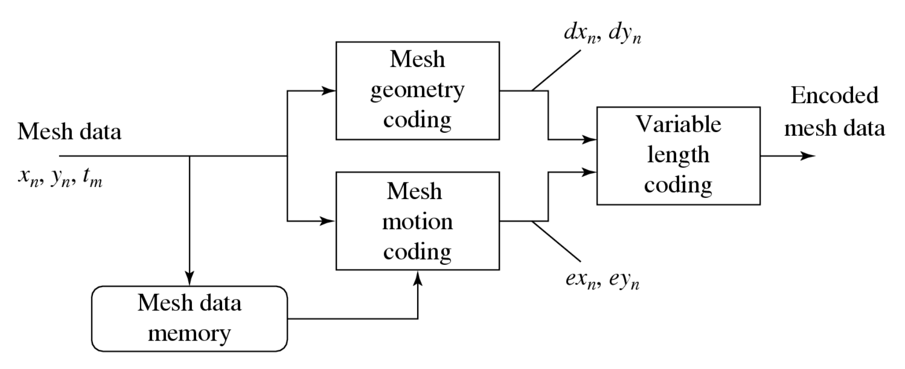
</div>

1. **2D 网格几何编码**
    - 4 种类型的均匀网格

        <div style="text-align: center">
            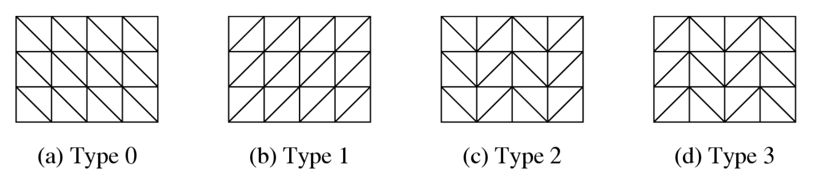
        </div>

    - Delaunay 网格是一个更好的对象网格表示
        
        <div style="text-align: center">
            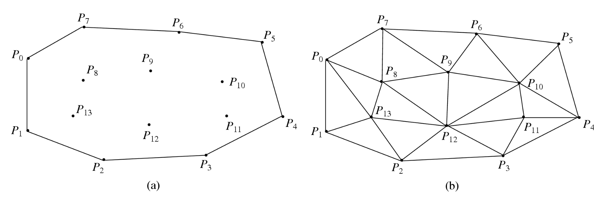
        </div>
        
        - 选择网格边界节点
        - 选择内部节点
        - 执行 Delaunay 三角剖分

2. **2D 网格运动编码**
    - 对于任意 MOP 三角形 i,j,k，若已知 i,j 的运动向量，则 k 的运动向量可预测为：Pred_k = 0.5 * (Pred_i + Pred_j)
    - 当编码一个三角形的运动向量时，相邻 MOP 三角形中未编码的顶点与前一三角形共享一条边，以此类推，直至所有三角形完成编码

    <div style="text-align: center">
        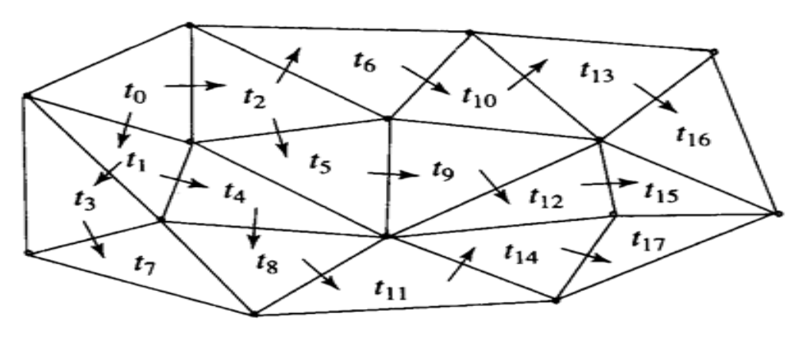
    </div>

3. **2D 对象动画**
    - 上一步建立了参考 MOP 与目标 MOP 中网格三角形之间的一一对应关系  
    - 采用仿射变换实现动画序列

    <div style="text-align: center">
        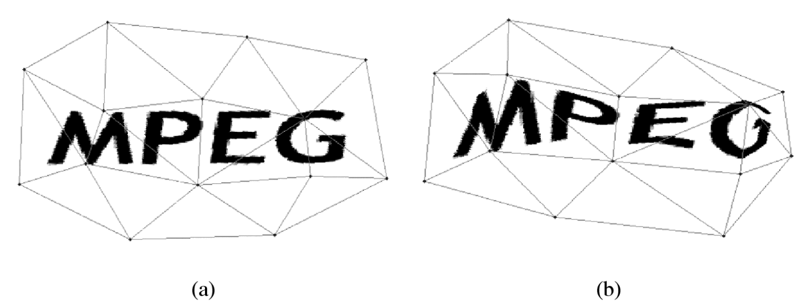
    </div>

---
MPEG-4 针对视频中频繁出现的人脸和人体，定义了专门用于面部对象和身体对象的 3D 模型。


#### Face Object Coding and Animation

- 应用：远程会议、人机交互界面、游戏及电子商务等场景
- MPEG-4 超越了线框模型的局限，使得面部或身体对象的表面能够实现着色处理或纹理映射
- MPEG-4 采用一种通用的默认面部模型（由 VRML 联盟开发）
    - 可以指定**面部动画参数**(face animation parameters, FAPs)以实现所需的动画效果，即与原始“中性”面部的偏差
    - 此外还可以指定**面部定义参数**(face definition parameters, FDPs)，以更精确地描述个体面部特征

下图展示了 FDP 的特征点，其中受动画影响（通过FAPs）的特征点用实心圆表示，不受影响的则用空心圆表示：

<div style="text-align: center">
    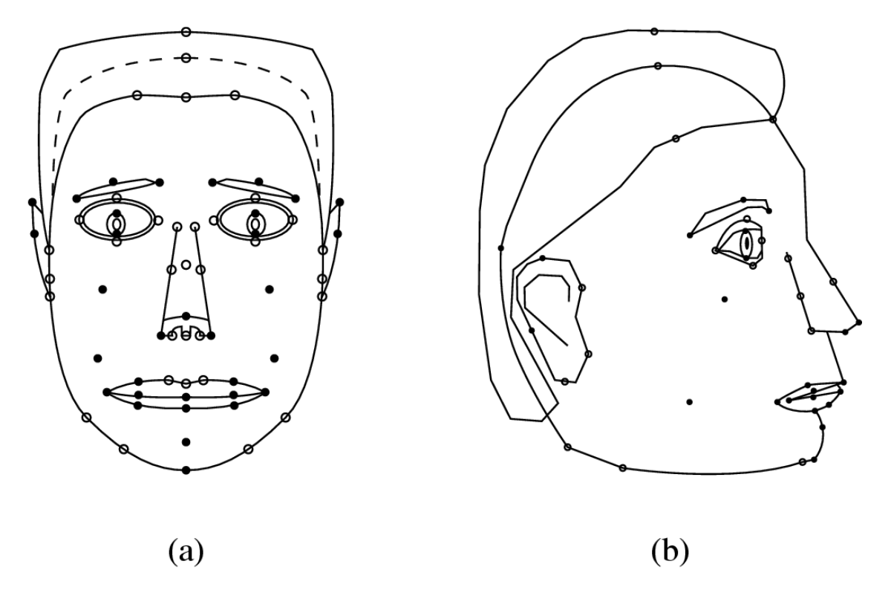
</div>


#### Body Object Coding and Animation

MPEG-4 第二版引入了身体对象，这是对面部对象的扩展。

- 与 VRML 联盟中的人形动画（H-Anim）小组合作，采用了一种具有默认姿势的通用虚拟人体
    - 默认姿势为站立姿态，双脚指向前方，手臂置于身体两侧，手掌朝向内侧。
    - 共有 296 个**身体动画参数**(body animation parameters, BAPs)；当应用于任何符合 MPEG-4 标准的通用身体时，它们将产生相同的动画效果
    - 大量 BAPs 用于描述连接不同身体部位的关节角度：脊柱、肩部、锁骨、肘部、手腕、手指、髋部、膝盖、脚踝和脚趾，这为身体提供了 186 个自由度，而每只手单独拥有 25 个自由度
    - 某些身体动作可以在多个细节层级上进行指定

- 针对特定人体，可指定**身体定义参数**(body definitino parameters, BDP)，包括身体尺寸、体表几何形状以及可选纹理
- BAP 的编码方式与 FAP 类似：采用**量化和预测编码**技术，并通过**算术编码**进一步压缩预测误差


### Object Types, Profiles and Levels

与 MPEG 2类似，MPEG4 定义了多种配置和级别，包括：视觉配置、音频配置、图形配置、场景描述配置、对象描述符配置等，定义了创建视频对象所需的工具以及它们在场景中组合的方式。

<div style="text-align: center">
    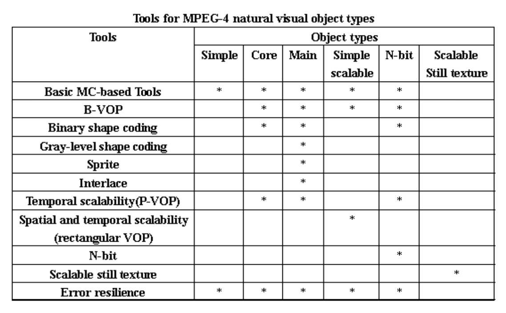
</div>

<div style="text-align: center">
    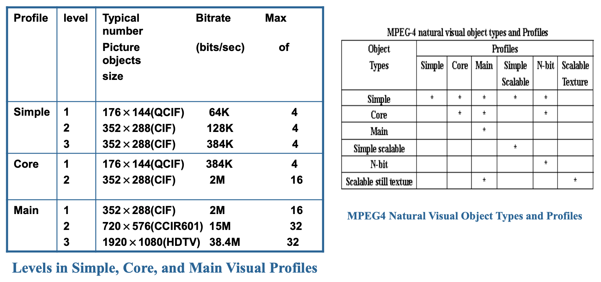
</div>


### MPEG-4 Part10/H.264

2001年，MPEG 与ITU-T VCEG（视频编码专家组）联合成立 JVT（联合视频组）。JVT 于 2003 年向 ISO 提交了 **H.264** 草案。H.264 的压缩效率比 MPEG-2 提升高达 50%，比 H.263+ 和 MPEG-4 高级简单类提升高达 30%。其核心特点包括：

- 熵解码：统一可变长编码(unified-VLC, UVLC)与上下文自适应可变长编码(context-adpative VLC, CAVLC)
- 运动补偿或帧内预测：可变块大小及更精确的运动补偿。  
- 变换、扫描、量化：非线性量化与不同量化尺度  
- I 帧预测：所有帧内编码宏块均利用相邻重建像素进行预测  
- 环路去块滤波器(in-loop deblocking filter)：采用先进的信号自适应去块效应滤波器

    ???+ example "例子"

        <div style="text-align: center">
            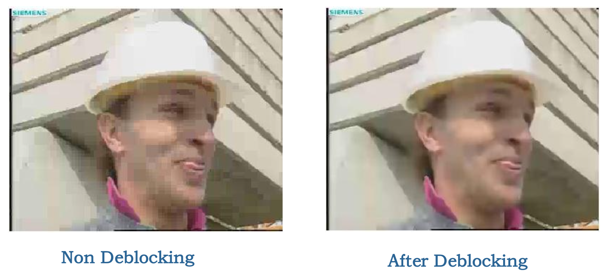
        </div>

- 帧间预测
    - 树状运动补偿
    - H.264 支持不同的块大小，块大小可小至 4*4
    
        <div style="text-align: center">
            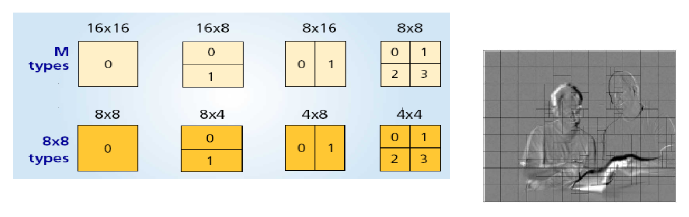
        </div>
    
    - 选择最优块大小，以最小化当前帧与参考帧之间的差异
    - P 帧可以使用多个先前帧作为参考帧

        <div style="text-align: center">
            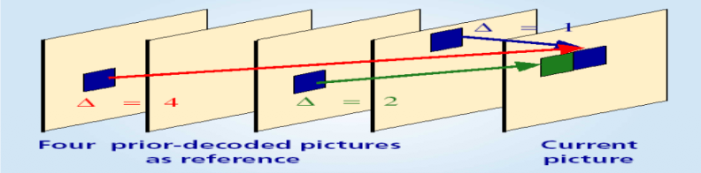
        </div>


## MPEG-7

随着越来越多的多媒体内容成为各类应用不可或缺的一部分，高效且有效的检索成为了首要关注点。MPEG7 旨在满足**基于视听内容检索**(audiovisual content-
based retrieval)的需求。

- 于 1998 年启动，2001 年完成
- 支持多种多媒体应用
- 不描述任何特征提取方法，其正式名称为「**多媒体内容描述接口**」(multimedia content description
interface)
- MPEG-7 包含以下部分：  
    - **描述符**(descriptor, **D**)：颜色、纹理、形状、运动、定位
    - **描述方案**(description schemes, **DS**)
        - 基本元素、内容管理、内容描述、
        - 导航与访问
    - **描述定义语言**(description definition language, DDL)

- XML 模式语言及 MPEG-7 扩展
- 应用：

    <div style="text-align: center">
        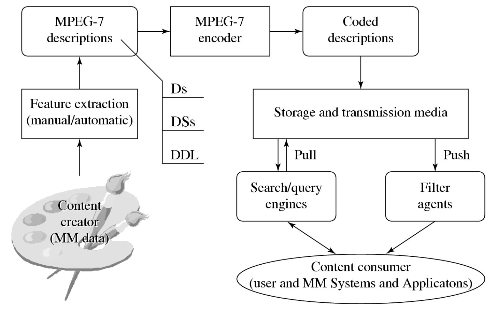
    </div>


## MPEG-21

MPEG-21 旨在定义一种统一的方式来定义、识别、描述、管理和保护多媒体数据。它包含 7 个关键部分：
  
- 数字项声明
- 数字项标识与描述
- 内容管理与使用
- 知识产权管理与保护
- 终端与网络
- 内容表示
- 事件报告