# 合订本

## Graphics and Image Data Representation

!!! warning "注意"

    只保留了重点内容，缺失内容可参照教材。

### Basic Graphics/Image Types

#### 1-Bit Image

1 比特图像又称**二值图像**(binary image)或**单色图像**(monochrome image)。

<div style="text-align: center">
    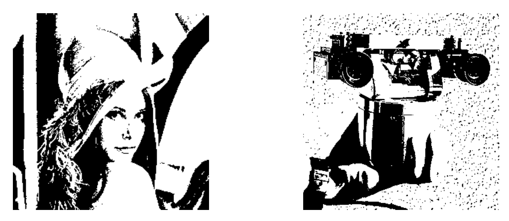
</div>

特点：

- 由**开启和关闭**像素组成（**像素**(pixel)：数字图像中的图像元素）
- 每个像素**用 1 个比特存储**，0 表示黑色，1 表示白色

<div style="text-align: center">
    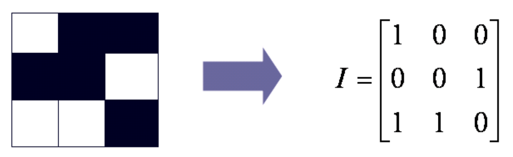
</div>


#### 8-Bit Grey-Level Image

<div style="text-align: center">
    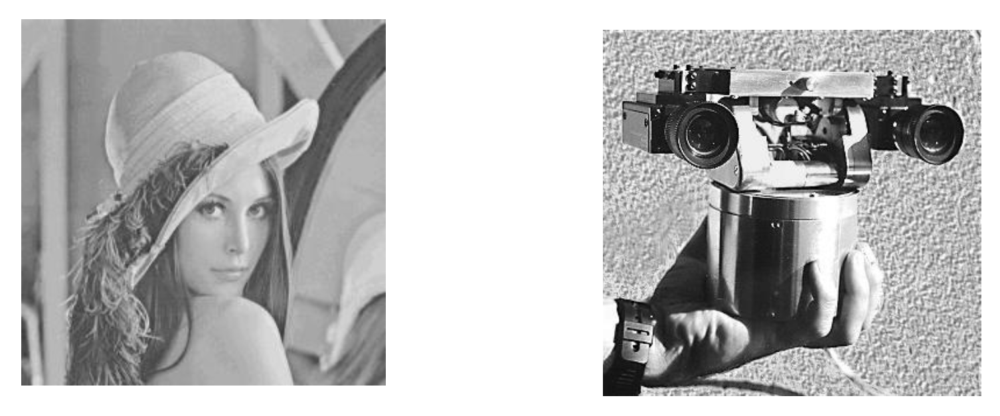
</div>

特点：

- 每个像素由一个字节表示，因此灰度值介于 **0 到 255** 之间
- 整张图像可视为一个**二维**像素值**数组**，称为**位图**(bitmap)

    <div style="text-align: center">
        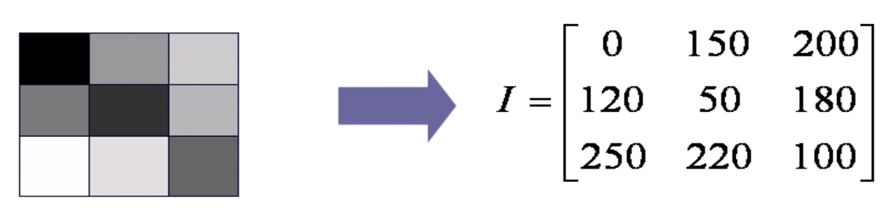
    </div>

- 8 比特图像可看作由一组 1 位**位平面**(bitplane)构成
    - 每个平面包含图像在某一层级上的 **1 位表示**
    - 所有位平面共同**构成一个字节**，用于存储 0 至 255 之间的数值

    <div style="text-align: center">
        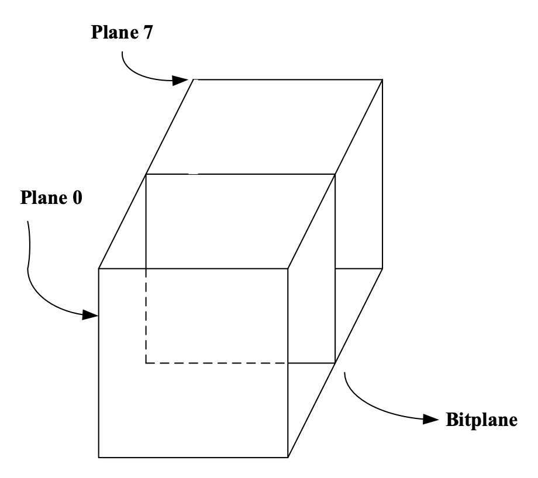
    </div>

存储图像数组的硬件被称为**帧缓冲区**(framebuffer)或「视频」卡。


##### Printing

用二级（1 比特）打印机打印 8 比特的灰度图像是很复杂的。解决步骤如下：

- 使用**抖动**(dithering)：用更大的图案替换单个像素，例如 2x2 或 4x4 的网格，使得打印点的数量能够近似模拟**半色调印刷**(halftone printing)（如报纸照片）中使用的不同大小的墨点
- 将**色彩/强度分辨率**(color/intensity resolution)转换为**空间分辨率**(spatial resolution)
    - N * N 的矩阵表示 N^2^ + 1 中强度等级，比如 2x2 的图案能表示 5 个等级 

        <div style="text-align: center">
            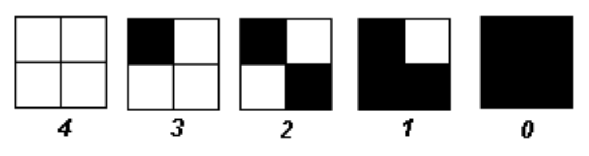
        </div>

    - 首先可以将图像值从 [0, 255] 重新映射到新的范围 [0, 4]（通过整除 256 / 5 实现）；若像素值为 0，则在打印输出的 2x2 区域内不打印任何点；但若像素值为 4，则打印所有四个点
    - 若强度大于抖动矩阵的对应项，则在该位置打印一个实心点(an on dot)：将每个像素替换为一个 nxn 的点阵
    - 上述方法会**增大输出图像大小**——如果一个像素使用 4x4 图案处理，那么 NxN 的图像尺寸将变为 4Nx4N，使图像面积扩大 16 倍

- 一种更好的方法：避免放大输出图像
    - 存储一个整数矩阵（标准图案），值范围仍为 [0, 255]
    - **将灰度图像矩阵与图案进行比较**，当值大于灰色值时打印点

    <div style="text-align: center">
        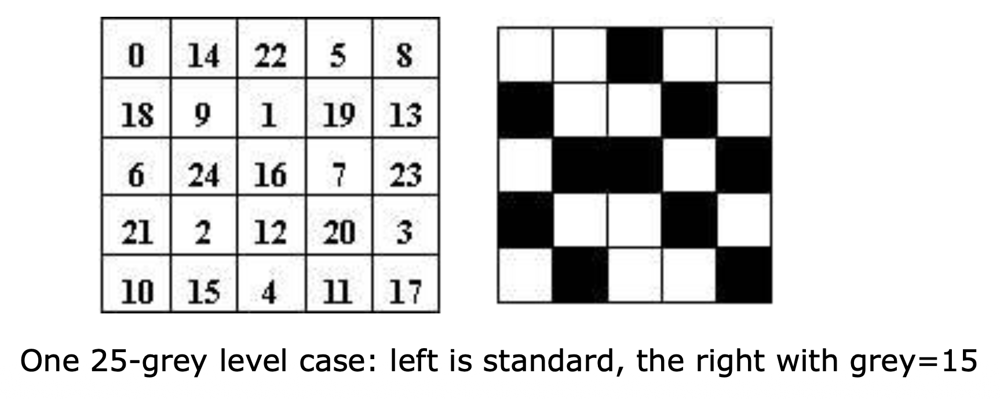
    </div>

下面给出有序抖动算法（采用 nxn 的抖动矩阵）：

```py
for x in 0...x_max:
    for y in 0...y_max:
        i = x % n
        j = y % n
        # I(x, y) is the input, O(x, y) is the output,
        # D is the dither matrix
        if I(x, y) > D(i, j):
            O(x, y) = 1
        else:
            O(x, y) = 0
```


???+ example "例子"

    === "例1"

        === "问题"

            在一台 300\*300 DPI（每英寸点数(dots per inch)）的打印机上，将一张图像（240\*180\*8位）打印在 12.8\*9.6 英寸的纸上，每个像素（点）的大小是多少？

        === "解答"

            - (300\*12.8) \* (300\*9.6) = 3480\*2880 dots
            - (3840/240) \* (2880/180) = 16\*16 = 256

    === "例2"

        使用标准矩阵生成输出图像：

        <div style="text-align: center">
            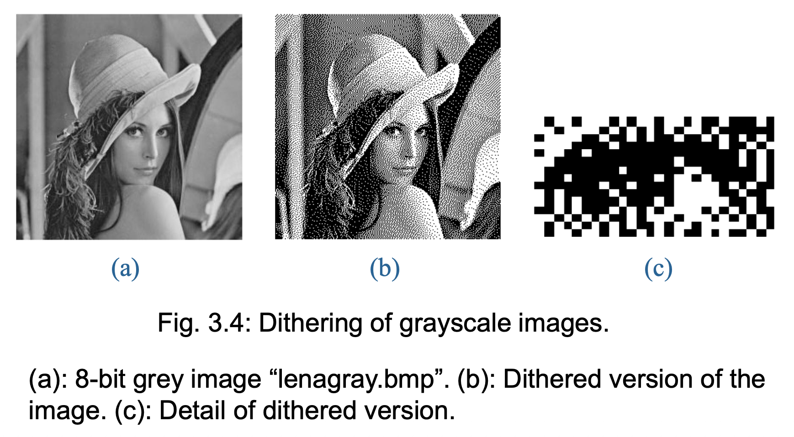
        </div>

    === "例3"

        === "问题"

            在 8\*6 英寸的纸上打印一张图像（600\*450像素，8位色深）使用分辨率为 300\*300 DPI 的打印机，每个像素点的大小是多少？

        === "解答"

            - (300\*8) \* (300\*6) = 2400\*1800 dots
            - (2400/600) \* (1800/450) = 4\*4 => 只有 17 个等级


#### 24-Bit Color Image

特点：每个像素使用**三个字节**，分别代表红绿蓝（RGB），取值范围为 0 至 255，因此支持 256\*256\*256 种颜色（共计 16,777,216 色）。

<div style="text-align: center">
    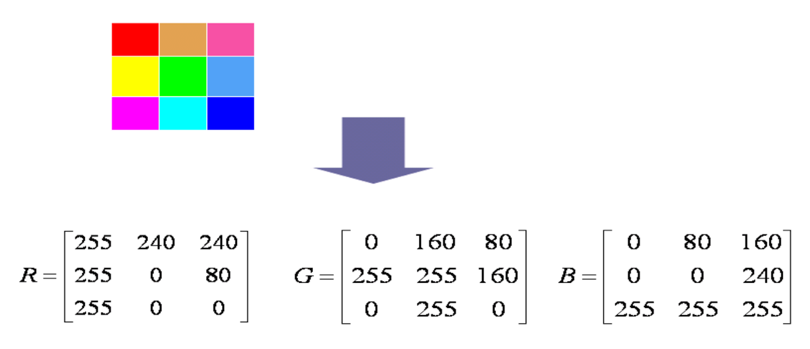
</div>

大小：

- 一张 640x480 的 24 比特彩色图像占 921.6KB（640\*480\*3）大小
- 许多 24 位彩色图像实际上以 32 位图像格式存储
    - 每个像素可能还会额外**存储 $\alpha$ 值**，表示特效信息，比如**透明度标志**(transparency flag)等

        <div style="text-align: center">
            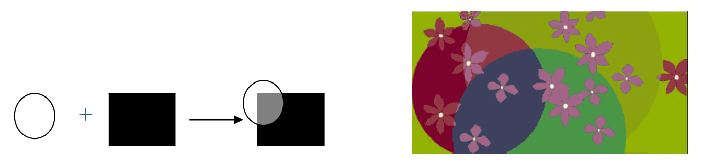
        </div>

    - 半透明图像颜色 = 源图像颜色 \* (100% - 透明度) + 背景图像颜色 \* 透明度


#### 8-Bit Color Image

特点：

- 使用**查找表**(lookup table, **LUT**)（**调色板**(palette)）
    - 图像存储的是一组字节，而非实际颜色
    - 字节值作为指向 3 字节颜色表的索引
    - **选择放入表中的颜色至关重要**

- 选取最重要的 256 种颜色，可选的方法有：
    - 通过对 256×256×256 种色彩进行**聚类**(clustering)生成
    - 采用**中位切分**(median-cut)算法或更精确版本

相比 24 位图像，8 位图像节省了很大的空间。比如一张 640\*480 的 8 位彩色图像仅需 300KB 存储空间，而同等尺寸的彩色图像（同样未应用任何压缩）则需要 921.6KB。

8 位彩色图像采用的方法是仅存储每个像素的索引或代码值。例如，若某像素存储值为 25，其含义即指向颜色查找表（LUT）中的第 25 行。

<div style="text-align: center">
    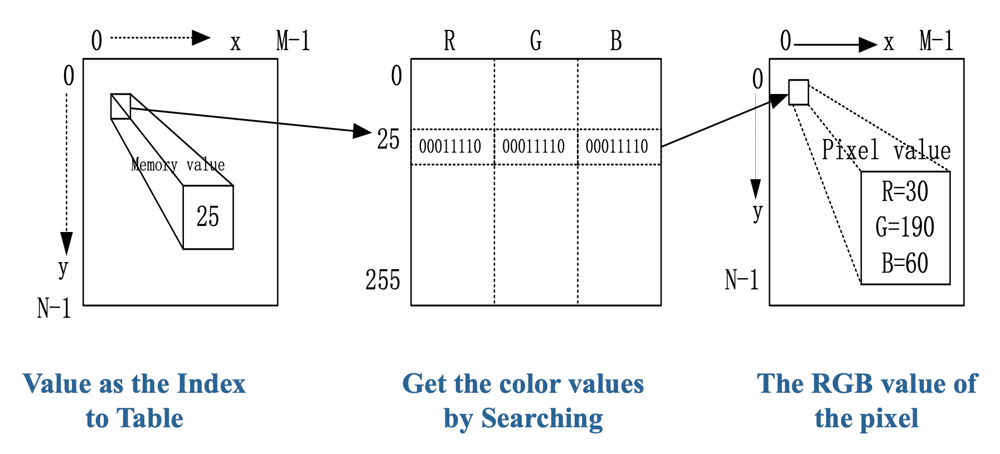
</div>

由于 LUT 小于图像，具有速度优势，因此我们可**通过调整 LUT 来改变颜色**。

---

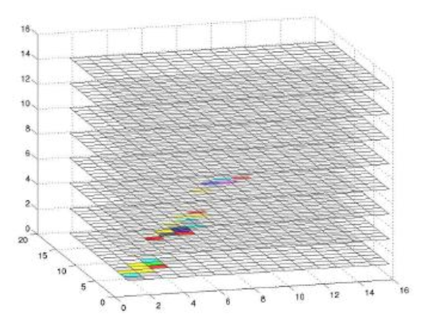{ align=right width=30% }

创建颜色 LUT 的基本思路是**聚类**(clustering)，即分析 RGB 色彩的三维直方图，但这是一个计算成本高且耗时的过程，因此不太现实。

将 24 位色转换为 8 位查找表颜色的最直接的方法是：将 RGB 立方体沿每个维度等分切片。

- 所得每个小立方体的中心点可作为颜色查找表的条目，而只需将 RGB 范围 [0, 255] 缩放至相应区间即可生成 8 位编码
- 由于人眼对 R 和 G 的敏感度高于 B，我们可以将 R 和 G 的范围 [0, 255] 压缩至 3 位范围 [0, 7]，同时将 B 范围压缩至 2 位范围 [0, 3]，从而构成总计 8 位的编码

    <div style="text-align: center">
        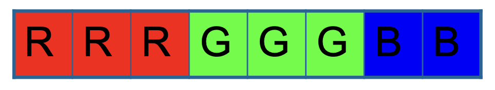
    </div>

- 要压缩 R 和 G 值，只需将 R 或 G 字节值除以 (256/8)=32 后截断取整，这样图像中的每个像素都会被其对应的 8 位索引替换，而颜色查找表则用于还原生成 24 位色彩

<div style="text-align: center">
    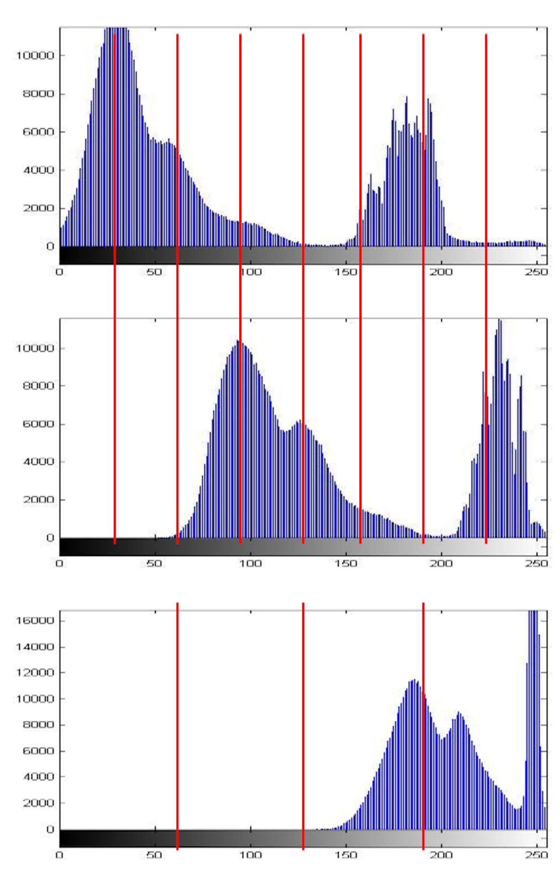
</div>

???+ example "例子"

    - R: 16, 48, 80, 112, 144, 176, 208, 240
    - G: 16, 48, 80, 112, 144, 176, 208, 240
    - B: 32, 96, 160, 224

    因此颜色为 [30, 129, 80] 的像素应转换为 [16, 112, 96]

为取得更好的效果，我们引入了**中位切分算法**(median-cut algorithm)：

- 先根据 R（红色）字节对所有像素进行排序，并找出其中位数：小于中位数的值标记为 `0` 位，大于中位数的值则标记为 `1` 位
- 再根据 G（绿色）字节分别对前一步得到的两部分像素进行排序；最后根据 B（蓝色）字节分别对前一步得到的四部分（2x2）像素进行排序
- 这样能将比特集中在最需要区分大量相近颜色的区域
- 通过使用显示 [0, 255] 位置计数的直方图，可以最直观地理解寻找中位数的过程；下图展示了某 bmp 图像中 R 字节值的直方图，并以垂直线标示了这些数值的中位数

<div style="text-align: center">
    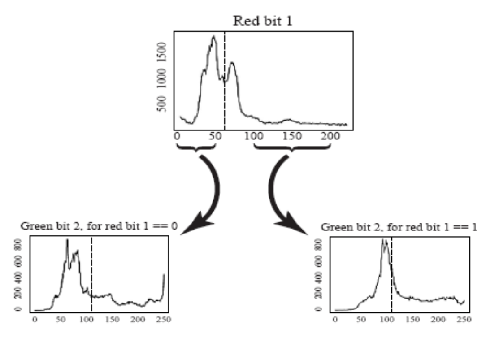
    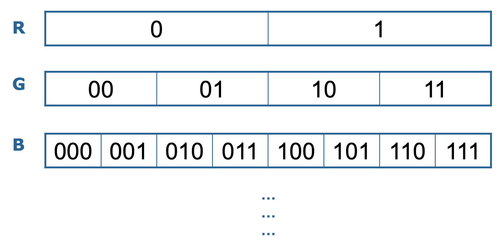
</div>


## Color in Image and Video

### Color Science

#### Gamma Correction

CRT（阴极射线管）显示器将 RGB 数值转换回模拟信号（电压），驱动 CRT 中的电子枪。

<div style="text-align: center">
    
</div>

**光线与电压应呈线性关系**，但 CRT 的光却不和驱动电源呈线性关系，而是和电压的幂次 $R^\gamma$ 成正比。这个幂指数被称为 **gamma**，记作 $\gamma$，其值约为 2.2。

???+ question "为什么设置成 2.2"

    实际值会更接近 2.8（= 1.25 * 2.2），而 2.8 更符合人眼的感知。这个 1.25 是一个补偿系数，来自系统对图像暗部的「压低」（使图像更有对比度和立体感）。

<div style="text-align: center">
    
</div>

信号的“伽马校正”：在传输前，通常会在经过 $\dfrac{1}{\gamma}$ 次幂的**伽马校正**的信号后加上撇号。因此我们得到线性信号：$R \rightarrow R' = R^{1/\gamma} \Rightarrow (R')^\gamma \rightarrow R$。

<div style="text-align: center">
    
</div>

将电压归一化，使其最大值为 1：

<div style="text-align: center">
    
</div>

Gamma 校正的另一个重要应用是**相机传递函数**(camera transfer function)：

- 通用公式为 $R \rightarrow R' = a \times R^{1 / \gamma} + b$，但我们在原点附近进行特殊处理，形成以下分段函数：

    $$
    V_{\text{out}} = \begin{cases}
    4.5 \times V_{\text{in}} & V_{\text{in}} < 0.018 \\
    1.099 \times V_{\text{in}}^{0.45} - 0.099 & V_{\text{in}} \ge 0.018 \\
    \end{cases}
    $$

    >PPT 给出的公式是错的。

    - 之所以接近原点时改用线性函数，是因为此时幂函数斜率会很大（导数幂次为负，x < 1 的话数值会很高），导致严重的数值不稳定和噪点放大，因此用线性函数来平滑

- 由 SMPTE（电影与电视工程师协会）推荐（列入 SMPTE-170 标准）

!!! bug "问题"

    人眼对亮度**比例**而非绝对强度敏感，因此像这样在有限的 8 位存储空间若按线性分配颜色会使暗部细节严重缺失。


### Color Models in Images

#### RGB Model for CRT display

- 在帧缓冲区中存储**与亮度成正比的整数**
- **Gamma 校正**

<div style="text-align: center">
    
</div>


### Subtractive Color: CMY

<div style="text-align: center">
    
</div>


#### Transformation from RBG to CMY

$$
\begin{aligned}
\begin{bmatrix}C \\ M \\ Y\end{bmatrix} & = \begin{bmatrix}1 \\ 1 \\ 1\end{bmatrix} - \begin{bmatrix}R \\ G \\ B\end{bmatrix} \\
\begin{bmatrix}R \\ G \\ B\end{bmatrix} & = \begin{bmatrix}1 \\ 1 \\ 1\end{bmatrix} - \begin{bmatrix}C \\ M \\ Y\end{bmatrix}
\end{aligned}
$$


#### Under Color Removal: CMYK

CMYK 系统通过增加 K 分量得到「真正的」黑色。

$$
\begin{aligned}
K & \equiv \min\{C, M, Y\} \\
\begin{bmatrix}C \\ M \\ Y\end{bmatrix} & = \begin{bmatrix}C - K \\ M - K \\ Y - K\end{bmatrix}
\end{aligned}
$$

<div style="text-align: center">
    
</div>


### Color Models in Video

**视频色彩转换**(video color transform)主要源自早期电视色彩编码的模拟技术，**将亮度与色彩信息分离**。

- 北美和日本采用矩阵转换方法 **YIQ** 来传输电视信号
- 在欧洲，录像带使用 PAL 或 SECAM 编码标准，这两种标准基于采用 **YUV** 矩阵转换技术的电视系统
- 数字视频普遍采用与 YUV 密切相关的 **YCbCr** 矩阵转换技术


#### YUV Color Model

YUV 主要针对 PAL 模拟视频，但同样适用于 CCIR 601 数字视频标准。计算公式为：

- **亮度** Y = 0.299R + 0.587G + 0.114B
- **色度**(chrominance)为：
    - U = B - Y
    - V = R - Y
- U = V = 0 => 没有色度

{ align=right width=30% }

Gamma 校正后：

$$
\begin{aligned}
U & = B' - Y' \\
V & = R' - Y' \\
\begin{bmatrix}Y' \\ U \\ V\end{bmatrix} & = \begin{bmatrix} 0.299 & 0.587 & 0.144 \\ -0.299 & -0.587 & 0.886 \\ 0.701 & -0.587 & -0.114 \end{bmatrix} \begin{bmatrix}R' \\ G' \\ B'\end{bmatrix}
\end{aligned}
$$

实际应用中：

- U = 0.492(B - Y)
- V = 0.877(R - Y)


#### YIQ Color Model

YIQ 用于 NTSC 彩色电视广播，但也能适应黑白电视（只用到 Y 分量）。

{ align=right width=30% }

- 由于 U 和 V 未能捕捉到人类视觉敏感度的从高到低层次结构，因此采用 I（**橘色-蓝色**）和 Q（**紫色-绿色**）
- 它们分别通过旋转 R-Y 和 B-Y 33° 后得到：
    - I = 0.877(R - Y) * cos(33°) - 0.492(B - Y) * sin(33°) = 0.596R - 0.275G - 0.321B
    - Q = 0.877(R - Y) * sin(33°) + 0.492(B - Y) * cos(33°) = 0.212R - 0.523G + 0.311B

- 敏感程度从高到低依次为 Y, I, Q，因此在 NTSC 广播中，每个带宽的分量分别为
    - Y：4.2 MHz
    - I：1.5 MHz
    - Q：0.55 MHz


#### YCbCr Color Model

**YCbCr** 用于 ITU-R BT.601-4 数字电视标准，和 YUV 密切相关。

- Cb = (B - Y) / 1.772 + 0.5
- Cr = (R - Y) / 1.402 + 0.5

完整的计算公式为：

$$
\begin{bmatrix}
Y' \\
C_b \\
C_r
\end{bmatrix} = 
\begin{bmatrix}
0.299 & 0.587 & 0.114 \\
-0.168736 & -0.331264 & 0.5 \\
0.5 & -0.418688 & -0.081312
\end{bmatrix}
\begin{bmatrix}
R' \\
G' \\
B'
\end{bmatrix} + 
\begin{bmatrix}
0 \\
0.5 \\
0.5
\end{bmatrix}
$$

这种彩色模型被广泛用于 JPEG 图片压缩和 MPEG 视频压缩中。


## Fundamental Concepts in Video

### Types of Video Signals

#### Component Video

{ align=right width=30% }

**分量视频**(component video)是一种高端视频系统，用于演播室等场景。

- 「分量」一词来自它的三个分离的视频信号，分别对应红色、绿色和蓝色图像平面，并且每个信号都对应一根导线（共**三根**），连接到摄像机或其他设备到电视或显示器
- 提供了最佳的色彩再现，因为不同通道之间没有串扰(crosstalk)，但需要更多带宽和良好的同步
- 除了支持 RGB，还可以使用 YIQ、YUV 等其他模型（需经过从 RGB 到**亮度-色度的变换**）


#### Composite Video

{ align=right width=30% }

**复合视频**(composite video)的特点：

- 色度与亮度信号混合为单一载波(carrier wave)
- 色度用 I 和 Q（或 U 和 V）两个颜色分量表示
- 由于仅用一根导线，所以亮度信号和色度信号之间不可避免地会有一定的**干扰**(inference)
    - **在接收端**可以将色度和亮度分量**分离**，然后进一步恢复这两个颜色分量
    - 音频和同步信号也被添加到这个混合信号中
- 常用于广播彩色电视，但也向下**兼容**黑白电视


#### S-Video

**S-Video** 是一种折中方案（分离视频或超级视频，例如在S-VHS中）

- 使用两根导线，一根传输亮度信号，另一根传输复合色度信号
    - 因此色彩信息与关键的灰度信息之间的**串扰更少**

- 将亮度单独置于一个信号中的原因是**黑白信息对于视觉感知最为关键**
    - 事实上，人类能够以远高于彩色图像色彩部分的敏锐度(acuity)来区分灰度图像的空间分辨率
    - 因此，我们可以发送比强度信息所需精度更低的颜色信息，毕竟我们只能看到相当大块的色块，所以发送较少的颜色细节是合理的

<div style="text-align: center">
    
</div>


### Analog Video

#### Related Concepts

- 模拟信号用 f(t) 表示，可理解为是**随时间变化的图像**
- **逐行扫描**(progressive scanning)：在每个时间间隔内，按行遍历一幅完整的画面（一帧）
- CRT 显示器（85Hz及以上）

    <div style="text-align: center">
        
    </div>

- 在电视以及部分显示器和多媒体标准中，还采用了一种称为**隔行扫描**(interlaced scanning)的系统：
    - 首先扫描奇数行，然后扫描偶数行，这样就形成了**奇场**(odd fields)和**偶场**(even fields)，而这两个场组成一帧
    - 实际上，奇数行的扫描会在奇场的末尾结束于一行中间的位置，而偶数行的扫描则从半程点开始

    <div style="text-align: center">
        
    </div>

    - 首先，沿着实线（奇数行）从 P 点追踪至 Q 点，接着从 R 点到 S 点，以此类推，最终结束于 T 点；随后偶数场扫描自 U 点开始，终止于 V 点
    - 从 Q 点到 R 点的跳跃等过程被称为**水平回扫**(horizontal retrace)，在此期间阴极射线管中的电子束会被消隐；而从 T 点到 U 点或 V 点到 P 点的跳跃则称为**垂直回扫**(vertical retrace)
    - 奇数行和偶数行在时间上相互错位，这一问题通常在屏幕上表现非常快速的动作时才变得明显，这时画面可能会模糊

- 模拟视频使用一个微小的电压偏移来表示黑色，而另一个值（如零）则表示一行的开始
    - 比如我们可以用一个“比黑更黑”的零信号来指示一行的起始点

    <div style="text-align: center">
        
    </div>

- 模拟电视的电视标准
    - **NTSC** 视频（正交平衡调幅）：美国、加拿大、日本和韩国采用，1953 年由美国制定
    - **PAL** 视频（逐行倒相正交平衡调幅）：德国、英国和中国采用，1962 年由德国制定
    - **SECAM** 视频（顺序传送彩色与存储）：法国、俄罗斯采用，1966 年由法国制定

- 这些标准向下兼容黑白电视系统
    - **参数一致性**(parameters consistence)：扫描方式、扫描行频、场频、帧频、图像载波频率和伴音载波频率保持一致
    - **信号传输一致性**(signal transmission consistence)：亮度信号与两个色度信号的传输保持统一


#### NTSC Video

**NTSC** 全称为国家电视标准委员会(National Television Standards Committee)

- 4:3 的长宽比
- 每帧 525 行扫描线
- 每秒 30 帧（30 fps）
- YIQ 色彩模型
- 详细参数
    - 实际为 29.97fps；或每帧 33.37ms
    - 采用隔行扫描，每场 262.5 行
    - 水平扫描频率：525 * 29.97 = 15,734 行/s
    - 每行时间：1 / 15,734 = 63.6μs（10.9 + 52.7）
    - 垂直回扫，每场保留 20 行，共 485 行
    - 水平扫描，1/6 的栅格(raster)保留
    - 水平分辨率即每行样本数

<div style="text-align: center">
    
</div>

- NTSC 视频是一种没有固定水平分辨率的模拟信号，因此必须确定对信号进行采样的次数（每个采样点要对应一个像素输出）
- 使用**像素时钟**(pixel clock)将视频的每一行水平分割成采样点；像素时钟的频率越高，每行中的采样点就越多
- 色彩模型与调制
    - NTSC 使用 **YIQ 颜色模型**，并采用正交调制技术将 $I$（同相(in-phase)）和 $Q$（正交(quadrature)）信号（频谱重叠部分）合并成一个单色(single chorma)信号 $C$，即：

        $$
        C = I \cos(F_{\text{sc}}t) + Q \sin(F_{\text{sc}}t)
        $$

    - 这个调制的色度信号也称为**色副载波**(color subcarrier)，其振幅为 $\sqrt{I^2 + Q^2}$，相位为 $\tan^{-1}(Q / I)$，频率为 $F_{\text{sc}} \approx 3.58$ MHz
    - NTSC 复合信号是亮度信号 $Y$ 与如下定义的色度信号的进一步组合：

        $$
        \text{composite} = Y + C = Y + I \cos(F_{\text{sc}}t) + Q \sin(F_{\text{sc}}t)
        $$

    - NTSC 将 4.2MHz 的带宽分配给 $Y$，而将 1.6MHz 分配给 $I$，将 0.6MHz 分配给 $Q$，因为人类对色彩细节不敏感（高频色彩变化）

        <div style="text-align: center">
            
        </div>

        - 实际上 NTSC 的 6MHz 带宽很紧张：其音频副载波频率为 4.5MHz，而图像载波在 1.25MHz，这使得音频频带的中心位于信道中的 1.25 + 4.5 = 5.75MHz（如上图所示）；但颜色被放置在 1.25 + 3.58 = 4.83MHz
        - 因此，音频与色副载波的距离有点近，这便是音频和颜色信号之间可能产生干扰的缘由。这主要是因为 NTSC 彩色电视实际上将其帧率降低到 30 * 1,000 / 1,001 ≈ 29.97fps
        - 结果，采用的 NTSC 色副载波频率略有降低到 $f_{\text{sc}}$ = 30 * 1,000 / 1,001 * 525 * 227.5 ≈ 3.579545MHz，其中 227.5 是 NTSC 广播电视中每扫描行的颜色采样数

    - 解码复合信号的步骤：
        1. 首先，使用低通滤波器提取 $Y$：$Y + I \cos(F_{\text{sc}}t) + Q \sin(F_{\text{sc}}t)$
        2. 从 $Y$ 中分离后，对 $C$ 进行解调以提取 $I$ 和 $Q$
            - $C$ 乘以 $2 \cos(F_{\text{sc}} t)$，即 $C \cdot 2\cos(F_{\text{sc}} t) = I + I \cdot \cos (2 F_{\text{sc}} t) + Q \cdot 2\sin(2 F_{\text{sc}} t)$
            - 应用低通滤波器提取 $I$


#### PAL Video

**PAL** 全称为相位交替线(phase alteration line)

- 625 条扫描线，每秒 25 帧，4:3 的宽高比
- 25fps；或者每帧 40ms
- 交错扫描，每场 312.5 行
- 水平扫描频率，625 * 25 = 15,625 行
- 每行时间：1 / 15,734 = 64μs（11.8 + 52.2）
- 垂直回扫，每场保留 25 行，共 575 行
- 色彩模型为 YUV，其中 Y 的带宽为 5.5MHz，U 和 V 的带宽分别为 1.8MHz


#### SECAM Video

**SECAM** 全称彩色电子存储系统(Système Electronique Couleur Avec Mémoire)，是第三个主要的电视广播标准。

- 和 PAL 非常相似，同样采用每帧 625 条扫描线，每秒 25 帧，4:3 的宽高比和交错场
- 但在色彩编码方案上略有不同：
    - U 和 V 信号分别使用 4.25MHz 和 4.41MHz 的独立色副载波调制
    - 它们交替发送，即每条扫描线上只发送 U 或 V 信号中的一个


#### Comparison of NTSC, PAL and SECAM

<table border="1">
  <thead>
    <tr>
      <th rowspan="2">电视制式</th>
      <th rowspan="2">帧率（fps）</th>
      <th rowspan="2">扫描线数</th>
      <th rowspan="2">总信道带宽（MHz）</th>
      <th colspan="3">带宽分配（MHz）</th>
    </tr>
    <tr>
      <th>Y</th>
      <th>I 或 U</th>
      <th>Q 或 V</th>
    </tr>
  </thead>
  <tbody>
    <tr>
      <td>NTSC</td>
      <td>29.97</td>
      <td>525</td>
      <td>6.0</td>
      <td>4.2</td>
      <td>1.6</td>
      <td>0.6</td>
    </tr>
    <tr>
      <td>PAL</td>
      <td>25</td>
      <td>625</td>
      <td>8.0</td>
      <td>5.5</td>
      <td>1.8</td>
      <td>1.8</td>
    </tr>
    <tr>
      <td>SECAM</td>
      <td>25</td>
      <td>625</td>
      <td>8.0</td>
      <td>6.0</td>
      <td>2.0</td>
      <td>2.0</td>
    </tr>
  </tbody>
</table>


### Digital Video

#### Advantage of Digital Representation

!!! recommend "优点"

    - 在数字设备或内存中存储视频
    - 可用于处理和集成到各种多媒体应用中
    - 直接访问：非线性视频编辑
    - 无损重复录制
    - 加密方便，且对信道噪声的容忍度更高


#### Chroma Subsampling

人眼对颜色的分辨率低于对亮度（黑白）的分辨率，因此可以对颜色信息进行不同方式的**下采样**。我们以四个像素为单位，考虑实际发送多少像素值：

- 4:4:4：无子采样
- 4:2:2：Cb 和 Cr 在水平方向以因子 2 进行子采样
- 4:1:1：Cb 和 Cr 在水平方向以因子 4 进行子采样
- 4:2:0：Cb 和 Cr 分别在水平和垂直方向上以因子 2 进行子采样
    - JPEG 与 MPEG 通常采用 4:2:0 方案

<div style="text-align: center">
    
</div>


#### CCIR Standard

**CCIR** 是国际无线电咨询委员会(Consultative Committee for International Radio)的缩写，其制定的最重要标准之一是用于分量数字视频的 **CCIR-601**（后来演变为 ITU-R-601 标准）。

- 针对 NTSC 标准：
   - 525 行，每行 858 像素（其中 720 个可见）
   - 采用 4:2:2 采样方案
   - 每个像素占用两个字节

- CCIR-601（NTSC）数据速率：525 * 858 * 30 * 2字节 * 8位/字节 ≈ 216Mbps

| 指标 | CCIR 601 525/60 NTSC | CCIR 601 625/50 PAL/SECAM | CIF | QCIF |
|---|---|---|---|---|
| 亮度分辨率 | 720 × 480 | 720 × 576 | 352 × 288 | 176 × 144 |
| 色度分辨率 | 360 × 480 | 360 × 576 | 176 × 144 | 88 × 72 |
| 色度子采样 | 4:2:2 | 4:2:2 | 4:2:0 | 4:2:0 |
| 场/秒 | 60 | 50 | 30 | 30 |
| 是否隔行扫描 | 是 | 是 | 否 | 否 |


#### CIF Standard

**CIF** 全称为通用中间格式(Common Intermediate Format)，由 CCITT 制定，后来被 ITU-T 取代。

- 设计理念：一种较低比特率的格式，同时保持与 VHS 相同的画质
- QCIF：四分之一的 CIF，比特率更低
- CIF 或 QCIF 的分辨率可被 8 或 16 整除，这样便于 H.261、H.263 等基于块的视频编码

<table border="1">
  <thead>
    <tr>
      <th rowspan="2"></th>
      <th colspan="2">CIF</th>
      <th colspan="2">QCIF</th>
      <th colspan="2">SQCIF</th>
    </tr>
    <tr>
      <th>行/帧</th>
      <th>像素/行</th>
      <th>行/帧</th>
      <th>像素/行</th>
      <th>行/帧</th>
      <th>像素/行</th>
    </tr>
  </thead>
  <tbody>
    <tr>
      <td>亮度（Y）</td>
      <td>288</td>
      <td>360 (352)</td>
      <td>144</td>
      <td>180 (176)</td>
      <td>96</td>
      <td>128</td>
    </tr>
    <tr>
      <td>色度（Cb）</td>
      <td>144</td>
      <td>180 (176)</td>
      <td>72</td>
      <td>90 (88)</td>
      <td>48</td>
      <td>64</td>
    </tr>
    <tr>
      <td>色度（Cr）</td>
      <td>144</td>
      <td>180 (176)</td>
      <td>72</td>
      <td>90 (88)</td>
      <td>48</td>
      <td>64</td>
    </tr>
  </tbody>
</table>


#### High Definition TV

**高清电视**(high definition TV, HDTV)的核心目标并非提升单位面积内的“清晰度”，而是着重扩展视觉范围，特别是增加画面宽度。

- 该标准支持下表所示的视频扫描格式，其中 I 表示隔行扫描，而 P 表示逐行（非隔行）扫描：

    | 每行有效像素数 | 有效扫描行数 | 宽高比 | 画面帧率 |
    |---|---|---|---|
    | 1,920 | 1,080 | 16:9 | 60I 30P 24P |
    | 1,280 | 720 | 16:9 | 60P 30P 24P |
    | 704 | 480 | 16:9 & 4:3 | 60I 60P 30P 24P |
    | 640 | 480 | 4:3 | 60I 60P 30P 24P |

- 传统电视与高清电视之间的显著差别：
    - 高清电视采用更宽的 16:9 宽高比，而非传统的 4:3
    - 高清电视转向逐行扫描（非隔行扫描），其原理在于隔行扫描会导致运动物体边缘出现锯齿状(serrated)，并在水平边缘产生闪烁(flickers)现象

- FCC 计划在 2009 年前，将所有模拟广播服务替换为数字电视广播，提供的服务将包括：
    - **SDTV**（标清电视）：当前 NTSC 制式或更高清晰度
    - **EDTV**（增强清晰度电视）：480 条有效扫描线及以上，即上表中的第三和第四行标准
    - **HDTV**（高清电视）：720 条有效扫描线及以上

## Basics of Digital Audio

### Digitization of Sound

#### Digitization

**数字化**(digitalization)：将声音转换为数字流；并且为了效率，这些数字最好是整数。

<div style="text-align: center">
    
</div>

一般会在**时间**和**幅度**两个维度上进行采样。

- 时间维度：以等间隔进行采样，范围在 8kHz 到 48kHz 之间
    >人耳可听范围为 20Hz 至 20kHz

- 幅度维度：此时采样过程被称为**量化**(quantization)
    - **均匀量化**(uniform quantization)：等间距采样
    - **非均匀量化**(nonuniform quantization)：比如如 **u 律规则**
    - 常见的均匀量化率：
        - 8 位 -> 256 级
        - 16 位 -> 65,536级

<div style="text-align: center">
    
</div>

因此，要想对音频数据进行数字化，得回答以下问题：

- 采样率是什么？
- 数据将被量化到何种精细程度，以及量化是否均匀？
- 如何对音频数据格式化？（文件格式）


#### Nyquist Theorem

信号可以分解为**正弦波**(sinusoids)的总和。

<div style="text-align: center">
    
    
</div>

>对于右图：
>1. 单一正弦波
>2. 以实际频率采样检测到的**恒定**信号
>3. 以 1.5 倍频率采样得到的**混叠**(alias)信号

- **奈奎斯特速率**(Nyquist rate)：为确保正确采样，采样率必须**至少**为信号中**最高频率成分的两倍**
- **奈奎斯特定理**(Nyquist theorem)：对于一个频带受限的信号，其频率下限为 f1、上限为 f2，所需的采样率至少应为 **2 * (f2 - f1)**。
- **奈奎斯特频率**(Nyquist frequency)：即奈奎斯特速率的一半
    - 由于在任何情况下都**无法恢复高于奈奎斯特频率的成分**，大多数系统会配备抗混叠滤波器(antialiasing filter)，将输入到采样器的信号频率内容限制在等于或低于奈奎斯特频率的范围内


#### Signal-to-Noise Ratio（SNR）

正确信号功率与噪声功率的比值被称为**信噪比**(signal to noise ratio, **SNR**)，这是衡量信号质量的一个指标。

- 通常以分贝（dB）为单位进行测量，其中 1 dB 是 bel 的十分之一
- 以 dB 为单位的 SNR 值，根据电压平方的常用对数，其定义如下：

    $$
    \text{SNR} = 10 \log_{10} \dfrac{V^2_{\text{signal}}}{V^2_{\text{noise}}} = 20 \log_{10} \dfrac{V_{\text{signal}}}{V_{\text{noise}}}
    $$

- 信号中的功率与电压的平方成正比
    - 例如，若信号电压 $V_{\text{signal}}$ 是噪声的 10 倍，则 SNR 为 20 * log10(10) = 20dB
    - 从功率角度而言，如果十把小提琴的总功率是一把独奏小提琴的十倍，那么功率比为 10dB 或 1B
    - 功率对应系数为 10，信号电压对应系数为 20

我们周围通常听到的声音强度，是以分贝为单位来描述，作为与我们能听到的最微弱声音的比值。


#### SQNR (Signal-to-Quantization-Noise Ratio)

除了原始模拟信号中可能存在的任何噪声外，还存在**由量化引起的额外误差**。如果电压实际范围在 0 到 1 之间，但我们只有 8 位来存储数值，那么实际上我们强制将所有连续的电压值压缩为仅 256 个不同的值。这引入了舍入误差。它并非真正的「噪声」，但仍被称为**量化噪声**（或量化误差）。

因此量化的质量通过**信号与量化噪声比**(signal-to-quantization-noise, **SQNR**)来表征。

- 量化噪声：指在特定采样时刻，模拟信号的实际值与最接近的量化间隔值之间的差异，此误差最大可达间隔的一半
- 对于每个样本 N 位的量化精度，SQNR 可简化为：

    $$
    \begin{aligned}
    \text{SQNR} & = 20 \log_{10} \dfrac{V_{\text{signal}}}{V_{\text{quan\_noise}}} = 20 \log_{10} \dfrac{2^{N-1}}{\frac{1}{2}} \\
    & = 20 \times N \times \log 2 = 6.02 N (\text{dB})
    \end{aligned}
    $$

- 我们将最大信号映射为 $2^{N-1} - 1$（$\approx 2^{N-1}$），并将最小信号映射为 $−2^{N−1}$
- 上述方程表示**峰值信噪比**(peak signal-to-quantization-noise, **PSQNR**)，即峰值信号与峰值噪声之比
- **动态范围**(dynamic range)是信号绝对值的最大值与最小值之比，即 $V_{\text{max}} / V_{\text{min}}$
    - 最大绝对值 $V_{\text{max}}$ 被映射到 $2^{N−1}−1$，最小绝对值 $V_{\text{min}}$ 被映射到 $1$
    - $V_{\text{min}}$ 是不被噪声掩盖的最小正电压值
    - 最大的负信号，即 $-V_{\text{max}}$，则被映射为 $-2^{N-1}$

- 量化间隔 $\Delta V = (2V_{\text{max}}) / 2^N$，因为共有 $2^N$ 个间隔。整个从 $V_{\text{max}}$ 到 $(V_{\text{max}} - \Delta V/2)$ 的范围都被映射至数值区间内的最高点对应值处（具体指代需结合上下文明确）
- 就实际影响而言，最大噪声为量化间隔的一半，即 $\Delta V / 2 = V_{\text{max}} / 2^N$


#### Linear and Nonlinear Quantization

**线性格式**是指样本通常以均匀量化值存储。但考虑到有限的可用比特和人类听觉特性，应当采用**非均匀量化**级别。它利用人类的感知特性，并采用**对数**方法，更侧重于人类听觉最敏感的频率范围。

非线性量化的步骤：

1. 将模拟信号从原始 S 空间**变换**至理论 R 空间
2. 对所得数值进行**均匀量化**

<div style="text-align: center">
    
</div>

方程如下：

- u 律

    $$
    r = \dfrac{\text{sgn}(s)}{\ln (1 + \mu)} \ln \left\{1 + \mu \left|\dfrac{s}{s_p}\right|\right\}, \left|\dfrac{s}{s_p}\right| \le 1
    $$

- a 律

    $$
    r = \begin{cases}\dfrac{A}{1 + \ln A} \left(\dfrac{s}{s_p}\right), \\ \dfrac{\text{sgn}(s)}{1 + \ln A} \left[1 + \ln A \left|\dfrac{s}{s_p}\right| \right], \dfrac{1}{A} \le \left|\dfrac{s}{s_p}\right| \le 1 \end{cases}
    $$

    其中 $\text{sgn}(s) = \begin{cases}1, & \text{if } s > 0 \\ -1, & \text{otherwise} \end{cases}$

一些取值：

- $\mu = 100$ 或 $255$
- $A = 87.6$
- $s / s_p \in [-1, 1]$

<div style="text-align: center">
    
</div>


#### Audio Filtering

在采样和模数转换之前，通过滤波音频信号来去除不需要的频率。保留的频率**取决于应用场景**：

- 语音信号：50Hz～10kHz
- 音频音乐信号：20Hz～20kHz
- 其他频率被**带通滤波器**(band-pass filter)（也称为限带(band-limiting)滤波器）所阻挡


#### Synthetic Sounds

数字声音转换为模拟信号的两种方法：

- **频率调制**(frequency modulation, **FM**)
    - 通过加入涉及第二个调制频率的项来改变载波正弦波

        $$
        X(t) = A(t)\cos[\omega_c \pi t + I(t)\cos(\omega_m \pi t + \phi_m) + \phi_c]
        $$

        - $A(t)$：包络度(envelope)，声音的响度
        - $I(t)$：通过改变调制频率产生谐波感
        - $\phi_c, \phi_m$：相位常数，用于创建时间偏移

        <div style="text-align: center">
            
        </div>

        <div style="text-align: center">
            
        </div>

- **波表**(wave table)（更精确）：
    - 真实乐器的实际数字声音样本被存储下来
    - 由于波表存储在声卡内存中，因此可通过软件对声音操作，从而实现声音的合成、编辑和增强


### Quantization and Transmission of Audio

#### Coding of Audio

**编码**(coding)是指对数据的量化与转换，利用音频信号中的**时间冗余性**(temporal rendundancy)来减小信号值的大小。

- 当前时刻与过去时刻信号的差异不仅能减少信号值的大小，还能将像素值（即差值）的直方图集中到更小的范围内
- 无损压缩方法能够产生更短的比特长度

生成音频量化输出的方法有：

- **PCM**（脉冲编码调制(pulse code modulation)）
- **DPCM**（差分脉冲编码调制）（PCM 的差分版本）
- **ADPCM**（自适应差分脉冲编码调制(adaptive DPCM)）


#### Pulse Code Modulation

- 区间边界集合称为**决策边界**(decision boundaries)，表征值则称为**重建水平**(reconstruction levels)
- 量化器输入区间的边界若全部映射至同一输出水平，则构成了**编码器映射**(coder mapping)
- 作为量化器输出值的表征值属于**解码器映射**(decoder mapping)
- 最后，我们可能希望通过分配比特流来**压缩**数据，对最常见的信号值使用更少的位数

每种压缩方案都包含三个阶段：

1. 将输入数据**转换**(transform)为新的表示形式，这种形式更易于或更高效地进行压缩
2. 可能会引入信息**损失**，其中**量化**是主要的失真步骤 => 我们使用有限数量的重建级别，少于原始信号中的数量
3. **编码**：为每个输出级别或符号分配一个码字（从而形成二进制比特流），可以是固定长度编码，也可以是可变长度编码，如霍夫曼编码

语音压缩中的 PCM 技术

- 假设语音带宽约为 50Hz 至 10kHz，根据奈奎斯特采样定理，所需采样率应为 20kHz
- 若采用**无压扩**(companding)的均匀量化，最小可用样本量约为 12 位，因此单声道语音传输的比特率将达到 240kbps
- 引入**压扩**技术后，在保持相同感知质量的前提下可将样本量降至 8 位，从而使比特率降低至 160kbps
- 然而标准电话通信方案实际设定最高音频重现频率仅为 4kHz。故采样率只需 8kHz，经压扩处理的比特率可进一步降至 64kbps

然而，我们还需处理两个小问题：

1. 由于仅考虑最高 4kHz的声音信号，其他频率成分均视为噪声，因此需要从模拟输入信号中去除这些高频成分
    - 通过使用**带限滤波器**（能同时阻隔高频和极低频信号）来解决
    - 此外，当我们得到下图（a）所示的脉冲信号后，仍需进行数模转换并重构最终的输出模拟信号，但实际上最终得到的将是图（b）所示的阶梯状波形

    <div style="text-align: center">
        
    </div>

2. 不连续信号不仅包含原始信号的频率成分，还包含理论上无限多的高频成分
    - 这一结论源自信号处理中的**傅里叶分析**理论
    - 这些高频属于**额外引入**的成分
    - 因此数模转换器的输出需接入**低通滤波器**，仅保留不超过原始最高频率的信号

电话信号的完整编码与解码方案如下图所示。经过低通滤波处理后，输出信号变得平滑，上图（c）中展示了这一效果。

<div style="text-align: center">
    
</div>


#### Differential Coding of Audio

音频通常并非以简单的 PCM 形式存储，而是采用一种利用**差值**的形式。这些差值通常是较小的数值，因此可以用更少的比特位来存储。

如果一个随时间变化的信号在时间上具有一定的一致性（即**时间冗余性**），那么通过从前一个样本中减去当前样本得到的差分信号，其直方图将更加集中，且峰值出现在零附近。

<div style="text-align: center">
    
</div>


#### Lossless Predictive Coding

**预测编码**(predictive coding)：简单来说就是传输差值。将下一个样本预测为等于当前样本；发送的不是样本本身，而是前后两个样本之差。

- 找出差值，并使用 PCM 系统来传输这些差值
- 注意整数的差值仍将是整数。将整数输入信号表示为值集 $f_n$，那么我们将**预测**值 $f_n$ 简单地视为前一个值，并将误差 $e_n$ 定义为实际信号与预测信号之间的差：

    $$
    \hat{f_n} = f_{n-1} \quad e_n = f_n - \hat{f_n}
    $$

- 但通常利用前几个值（如 $f_{n-1}, f_{n-2}, f_{n-3}$ 等）的某种函数能提供更优的预测；通常采用线性预测函数：

    $$
    \hat{f_n} = \sum_{k=1}^{2 \text{ to } 4} a_{n-k} f_{n-k}
    $$

    这种计算差值的思路使得采样值直方图的峰值更高

    <div style="text-align: center">
        
    </div>

这里有一个问题：假设整数样本值范围在 0 到 255 之间，那么差值可能达到 -255 到 255，使得动态范围（最大值与最小值之比）扩大了一倍，因此需要更多比特来传输某些差值。

- 一个巧妙的解决方案是：定义两个新编码，分别称为 **SU** 和 **SD**，代表上移(shift-up)和下移(shift-down)，将保留一些特殊编码值用于这些操作
- 这样我们可以仅对有限的信号差值集合使用码字，比如只覆盖 -15 到 16 的范围
    - 处于该有限范围内的差值可以直接编码
    - 但通过额外增加 SU 和 SD 这两个值后，超出 -15 到 16 范围的数值可以通过一系列移位操作加上一个确实落在该范围内的值来传输

- 例如，100 的传输形式为：SU, SU, SU, 4，其中（编码）SU 和 4 即为被传输（或存储）的内容

---
无损预测编码的**解码器**将产生与原始信号相同的信号。举一个简单的例子，假设我们设计了一个如下所示的预测器：

$$
\begin{aligned}
\hat{f}_n &= \left\lfloor \frac{1}{2}(f_{n-1} + f_{n-2}) \right\rfloor \\
e_n &= f_n - \hat{f}_n
\end{aligned}
$$

让我们考虑一个具体的例子。假设我们希望编码序列 $f_1, f_2, f_3, f_4, f_5 = 21, 22, 27, 25, 22$。为了预测器的需要，我们将虚构一个额外的信号值 $f_0$，令其等于 $f_1 = 21$，并首先传输这个未经编码的初始值：

$$
\begin{aligned}
\widehat{f_{2}} &= 21, e_{2} = 22 - 21 = 1; \\
\widehat{f_{3}} &= \left\lfloor \frac{1}{2}(f_{2} + f_{1}) \right\rfloor = \left\lfloor \frac{1}{2}(22 + 21) \right\rfloor = 21, \\
e_{3} &= 27 - 21 = 6; \\
\widehat{f_{4}} &= \left\lfloor \frac{1}{2}(f_{3} + f_{2}) \right\rfloor = \left\lfloor \frac{1}{2}(27 + 22) \right\rfloor = 24, \\
e_{4} &= 25 - 24 = 1; \\
\widehat{f_{5}} &= \left\lfloor \frac{1}{2}(f_{4} + f_{3}) \right\rfloor = \left\lfloor \frac{1}{2}(25 + 27) \right\rfloor = 26, \\
e_{5} &= 22 - 26 = -4
\end{aligned}
$$

误差确实围绕零点分布，且编码（分配比特串码字）变得高效。下图展示了用于封装此类系统的典型示意图：

<div style="text-align: center">
    
</div>


#### DPCM

**差分脉冲编码调制**(differential PCM, **DPCM**)与预测编码完全相同，只是它增加了一个量化步骤。

$$
\begin{aligned}
& \hat{f}_n = \text{function\_of}(\tilde{f}_{n-1}, \tilde{f}_{n-2}, \tilde{f}_{n-3}, \dots) \\
& e_n = f_n - \hat{f}_n \\
& \tilde{e}_n = Q[e_n] \\
&\text{transmit\_codeword}(\tilde{e}_n) \\
& \text{reconstruct} : \tilde{f}_n = \hat{f}_n + \tilde{e}_n
\end{aligned}
$$

<div style="text-align: center">
    
</div>

- 量化噪声 $f_n - \hat{f_n}$ 等于在误差项上的量化效果 $e_n - \hat{e}_n$
- 假设采用以下预测器 $\hat{f_n} = \text{trunc}(\hat{f}_{n-1} + \hat{f}_{n-2})$，所以 $e_n = f_n - \hat{f_n}$ 是整数
- 同时，采用量化方案：

$$
\begin{aligned}
\tilde{e}_n &= Q[e_n] = 16 \times \text{trunc}((255 + e_n) / 16) - 256 + 8 \\
\tilde{f}_n &= \hat{f}_n + \tilde{e}_n
\end{aligned}
$$

首先注意到误差范围在 -255 到 255 之间，即误差项有 511 个可能的级别。量化器简单地将这个误差范围划分为 32 个区间，每个区间大约包含 16 个级别。同时，它使每个区间的代表性重建值等于每组 16 个级别的中点位置。

作为信号值流的一个示例，考虑以下集合：

$$
\begin{aligned}
f_1 && f_2 && f_3 && f_4 && f_5 \\
130 && 150 && 140 && 200 && 300
\end{aligned}
$$

预置额外的数值 $f = 130$ 以复制第一个值 $f_1$。使用量化误差 $\tilde{e}_1 = 0$ 进行初始化，使得第一个重建值是精确的：$\tilde{f}_1 = 130$。然后计算出的其余数值如下（方框内为预置值）：

$$
\begin{aligned}
\hat{f} &= \boxed{130}, & 130, 142, 144, 167 \\
e &= \boxed{0}, & 20, -2, 56, 63 \\
\tilde{e} &= \boxed{0}, & 24, -8, 56, 56 \\
\tilde{f} &= \boxed{130}, & 154, 134, 200, 223
\end{aligned}
$$

在解码端，我们同样假设额外的数值 $\tilde{f}$ 等于正确值 $f_1$，从而使第一个重建值 $\tilde{f}_1$ 是正确的。接收到的是 $\tilde{e}_n$，只要我们使用完全相同的预测规则，重建出的 $\tilde{f}_n$ 就与编码端的一致。


#### DM

**DM**（差值调制(delta modulation)）：DPCM 的简化版本，常被用作快速的模数转换器。具体有以下实现方式：

- **均匀 DM**：仅使用单个量化误差值，可正可负
    - 一个 1 位编码器，产生阶梯状跟随原始信号的编码输出，其方程组为：

        $$
        \begin{aligned}
        \hat{f}_n &= \tilde{f}_{n-1}, \\
        e_n &= f_n - \hat{f}_n = f_n - \tilde{f}_{n-1}, \\
        \tilde{e}_n &= \begin{cases} +k & \text{if } e_n > 0, \text{where } k \text{ is a constant} \\ -k & \text{otherwise} \end{cases} \\
        \tilde{f}_n &= \hat{f}_n + \tilde{e}_n.
        \end{aligned}
        $$

    - 考虑实际数字，假如信号值为

        $$
        \begin{aligned}
        f_1 && f_2 && f_3 && f_4 \\
        10 && 11 && 13 && 15
        \end{aligned}
        $$

        同时，定义一个精确的重建值 $\hat{f_1} = f_1 = 10$

    - 比如使用步长值 = 4，可解得 $e_2 = 11 - 10 = 1, e_3 = 13 - 14 = -1, e_4 = 15 - 10 = 5$；重建后的数值集合 10、14、10、14 与正确的集合 10、11、13、15 相近
    - 然而 DM 在处理快速变化的信号时表现欠佳；缓解这一问题的一种方法是简单地提高采样率，可能达到奈奎斯特率的数倍之多

- **自适应 DM**：若实际信号曲线的斜率较高，阶梯近似法将难以跟上，因此对于陡峭的曲线，应自适应地调整步长 k

    <div style="text-align: center">
        
    </div>


#### ADPCM

**ADPCM**（自适应差分脉冲编码调制）进一步调整编码器以适应输入。

- 调整量化步长以匹配输入特性：
    - 利用输入信号的属性；**前向自适应量化**
    - 利用量化输出的属性；**后向自适应量化**

- 自适应预测编码：**动态调整预测系数**
    - 若采用 $M$ 个先前值，则对应 $M$ 个系数 $a_i\ (i = 1, \dots, M)$
    - 通过**最小二乘法**确定最优的 $a_i$ 取值

        $$
        \hat{f}_n = \sum_{i=1}^{M} a_i \tilde{f}_{n-i} \quad \min \sum_{n=1}^{N} (f_n - \hat{f}_n)^2
        $$


## Lossless Compression Algorithms

### Introduction and Basics of Information Theory

#### Data Compression Scheme

**压缩比**(compression ratio) = B0 / B1

- B0：压缩前的位数
- B1：压缩后的位数

压缩比必须大于 1.0，且压缩比越大，说明该无损压缩方案越好。

<div style="text-align: center">
    
</div>


#### Basics of Information Theory

对于字母表 $S = \{s_1, s_2, \dots, s_n\}$，信源的**熵**(entropy)（系统无序程度的度量，值越大代表越无序）为：

$$
\eta = H(S) = \sum_{i=1}^n p_i \log_2 \frac{1}{p_i} = -\sum_{i=1}^n p_i \log_2 p_i
$$

其中 $p_i$ 是符号 $s_i$ 出现在 $S$ 中的概率，而 $\log_2 \dfrac{1}{p_i}$ 表示该符号包含的信息量（**自信息**(self-information)）。比如手稿中字母 n 出现的概率为 1/32，那么它包含的信息量为 5 位；相应地，字符串 nnn 就需编码为 15 位。

根据上述公式，

- **经常出现的符号能够用更短的码字表示**
- 熵是项 $\log_2 \dfrac{1}{p_i}$ 的加权和；因此，它代表了源 $S$ 中每个符号所含的平均信息量
- 熵指定了编码 $S$ 中每个符号所需平均比特数的下界，即 $\eta \le \bar{l}$，其中 $\bar{l}$ 表示编码器产生码字的平均长度（单位：位）
- 当概率分布平坦时，熵较大；当概率分布更集中时，熵较小


### Lossless Coding Algorithms

#### Run-Length Coding

**游程编码**(run-length coding, **RLC**)是最简单的数据压缩形式之一。它的基本思想是：如果信源的符号倾向于形成连续组，那就对这样**一个符号及其组的长度进行编码**，而不是单独对每个符号进行编码。

- 减少编码所需的采样数
- 实现简单

应用场景：二值图像的编码。

???+ example "例子"

    <div style="text-align: center">
        
    </div>


#### Variable-Length Coding

**变长编码**(variable-length coding, **VLC**)是最知名的熵编码方法之一，具体有以下算法：

- **香农-范诺算法**(Shannon-Fano algorithm)
- **霍夫曼编码**(Huffman coding)
- **自适应霍夫曼编码**(adaptive Huffman coding)


##### Shannon-Fano Algorithm

>该算法由香农和范诺独立提出的。

这是一种**自顶向下**的算法：

- 根据符号出现的频率计数**对符号进行排序**
- **递归地将符号划分为两部分**，每部分具有大致相同的计数，直至所有部分仅包含一个符号

一种实现上述过程的方式是构建一棵二叉树。

???+ example "例子"

    <div style="text-align: center">
        
    </div>

    - 熵 = 0.4×1.32 + 0.2×2.32 + 0.2×2.32 + 0.2×2.32 = 1.92
    - 每个字母的平均位数为 2

        <div style="text-align: center">
            
        </div>


##### Huffman Coding

>由 David A. Huffman 于 1952 年首次提出。

应用场景：传真、JPEG、MPEG 等。

**霍夫曼编码**是一种自底向上的方法：

- 初始化：将所有符号**按频率计数排序**后放入列表
- 重复以下步骤，直到列表中仅剩一个符号：
    - 从列表中选取**两个频率最低的符号**，构建一个霍夫曼子树，将这两个符号作为子节点，并**为它们创建一个父节点**
    - 将子节点的频率之和赋给父节点，并将其插入列表以保持顺序
    - 从列表中删除这两个子节点

- 根据从根到叶子的路径为每个叶子分配编码

???+ example "例子"

    <div style="text-align: center">
        
    </div>

!!! note "性质"

    - **唯一前缀**(unique prefix)：任何霍夫曼编码都不会是其他霍夫曼编码的前缀，确保了解码过程无歧义
    - **最优性**(optimality)：对于给定的数据模型（即一个准确的概率分布），**最小冗余码**(minimum redundancy code)被证明是最优的：
        - 两个出现频率最低的符号，其霍夫曼编码长度相同，仅在最后一位有所不同
        - 出现频率较高的符号将拥有比低频符号更短的霍夫曼编码
        - 信源 $S$ 的平均码长严格小于 $\eta + 1$。结合公式 $n \le \bar{l}$，可以得到：$\bar{l} < \eta + 1$


##### Extended Huffman Coding

霍夫曼编码中的所有码字都具有整数位长度。当概率 $p_i$ 非常大，因而 $\log_2 \dfrac{1}{p_i}$ 接近 0 时，这种做法是浪费的————或许可以考虑将多个符号组合在一起，并为整个组分配一个单一的码字。

于是引入了**扩展字母表**(extended alphabet)：对于字母表 $S = \{s_1, s_2, \dots, s_n\}$，如果将 $k$ 个符号组合在一起，那么扩展后的字母表为：

$$
S^{(k)} = \{ \overbrace{s_1 s_1 \dots s_1}^{k \text{ symbols}} , s_1 s_1 \dots s_2 , \dots , s_1 s_1 \dots s_n , s_1 s_1 \dots s_2 s_1 , \dots , s_n s_n \dots s_n \} .
$$

新的字母表大小为 $n^k$。可以被证明，每个符号的平均位数为 $\eta \le \bar{l} < \eta + \dfrac{1}{k}$。相比原来的霍夫曼编码有改进，但进步不大。

问题在于：如果 $k$ 相对较大（比如 $k \ge 3$），那么在大多数实际应用中，当 $n \gg 1$ 时，意味着会产生一张巨大的符号表，这显然是不现实的。


##### Adaptive Huffman Coding

传统的霍夫曼编码需要掌握信源的**先验统计知识**，而这往往难以实现。即便统计信息可用，**传输符号表**本身也会带来很大的开销。

**自适应算法**能够在数据流到达时动态收集并更新统计信息。并且概率计算不再依赖先验知识，而是基于当前**已接收的实际数据**。

自适应霍夫曼编码的基本思路是：

- 初始代码（`Initial_code`）：为符号分配一些预先约定好的编码
- 更新树（`update_tree`）：构建自适应的霍夫曼树
    - 增加对应符号的频率计数
    - 更新树的配置

- 编码器和解码器必须使用完全相同的初始代码和更新树程序

<div class="grid" markdown>

```c title="ENCODER"
Initial_code();
while not EOF {
    get(c);
    encode(c);
    update_tree(c);
}
```

```c title="DECODER"
Initial_code();
while not EOF {
    decode(c);
    output(c);
    update_tree(c);
}
```

</div>

!!! note "关于树更新"

    - 节点按从左到右、自下而上的顺序编号；括号内的数字表示计数
    - 树必须始终保持其兄弟属性，即所有节点（内部节点和叶节点）均按计数递增的顺序排列；若即将违反兄弟属性，则调用交换程序通过重新排列节点来更新树结构
    - 当需要交换时，将计数为 N 的最远节点与计数刚增至 N+1 的节点进行位置互换

    ??? example "例子"

        <div style="text-align: center">
            
        </div>

???+ example "例子"

    - 为了更清晰地说明实现细节，下面将确切展示发送了哪些比特，而不是仅仅描述树是如何更新的
    - 额外规则：如果任何字符/符号是首次发送，其前必须有一个特殊符号 `NEW`
        - `NEW` 的初始编码为 `0`
        - `NEW` 的计数始终保持为 `0`（计数永不增加）
        - 因此，在图中它始终表示为 `NEW:(0)`

            <div style="text-align: center">
                
            </div>

    下面展示了使用自适应霍夫曼编码为字符串 AADCCDD 进行初始码字分配：

    <div style="text-align: center">
        
    </div>

    <div style="text-align: center">
        
    </div>

    <div style="text-align: center">
        
    </div>

    <div style="text-align: center">
        
    </div>

    需要强调的是，在自适应霍夫曼编码过程中，特定符号的代码会发生变化。例如，在序列 AADCCDD 之后，当字符 D 超越 A 成为最频繁出现的符号时，其代码从 101 变为 0。


#### Dictionary-Based Coding

>该算法分别由 Ziv 和 Lempel 于 1977 年及 1978 年首次提出。Terry Welch 在 1984 年对该技术进行了改进。因此该算法又称为 Lempel-Ziv-Welch 算法（简称 **LZW 压缩**）。

应用场景：UNIX 的 compress 工具，GIF，以及调制解调器的 V.42 bis 标准中。

LZW 算法的思路：

- 采用固定长度的码字来表示经常一起出现的变长符号/字符串（例如英文文本中的单词）
- 编码器和解码器在接收数据时动态地构建相同的字典
- 将越来越长的重复条目存入字典中，如果某个元素已存在于字典内，则输出该元素的代码而非字符串本身

LZW 压缩算法的伪代码如下：

```c
BEGIN
    s = next input character;
    while not EOF {
        c = next input character;

        if s + c exists in the dictionary
            s = s + c;
        else {
            output the code for s;
            add string s + c to the dictionary with a new code;
            s = c;
        }
    }
    output the code for s;
END
```

???+ example "例子"

    现在从一个非常简单的字典（也称为“字符串表”）开始，最初只包含 3 个字符，其编码如下：

    |编码|字符串|
    |:-:|:-:|
    |1|A|
    |2|B|
    |3|C|

    如果输入字符串是 ABABBABCABABBA，LZW 压缩算法的工作流程如下：

    <div style="text-align: center">
        
    </div>

    输出编码为：1 2 4 5 2 3 4 6 1。压缩比 = 14/9 = 1.56。

LZW 解压算法的伪代码如下（简单版本）：

```c
BEGIN
    s = NIL;
    while not EOF {
        k = next input code;
        entry = dictionary entry for k;
        output entry;
        if (s != NIL)
            add string s + entry[0] to dictionary with a new code;
        s = entry;
    }
END
```

???+ example "例子"

    现在用 LZW 解压缩字符串 ABABBABCABABBA。其中解码器的输入码为 1 2 4 5 2 3 4 6 1。而初始字符串表与编码器使用的完全相同。

    <div style="text-align: center">
        
    </div>

    输出字符串是 ABABBABCABABBA，说明这是一个真正无损的结果。

改进后的 LZW 解压算法的伪代码如下：

```c
BEGIN
    s = NIL;
    while not EOF {
        k = next input code;
        entry = dictionary entry for k;

        /* exception handler */
        if (entry == NULL)
            entry = s + s[0];

        output entry;
        if (s != NIL)
            add string s + entry[0] to dictionary with a new code;
        s = entry;
    }
END
```

???+ example "例子"

    <div style="text-align: center">
        
    </div>

    <div style="text-align: center">
        
    </div>


#### Arithmetic Coding

**算术编码**是一种更为现代的编码方法，通常性能优于霍夫曼编码。霍夫曼编码为每个符号分配一个具有整数位长度的码字；而算术编码可以将整个消息视为一个单元进行处理。

基本思路：

- 通过一个包含在 [0,1] 内的半开区间 [a, b) 来**表示整个消息**
- 区间 [a, b) 的长度等于**消息的概率**；从该区间中选取一个小数，并将其转换为二进制形式作为编码输出
- **每个字符都能缩短这个区间**，因此字符越多，区间就会变得越短
- 随着区间的缩短，需要更多的比特位来表示这个区间

???+ example "例子"

    <div style="text-align: center">
        
    </div>

    <div style="text-align: center">
        
    </div>

    <div style="text-align: center">
        
    </div>

编码器伪代码如下：

```c
BEGIN
    code = 0;
    k = 1;
    while (value(code) < low) {
        assign 1 to the kth binary fraction bit
        if (value(code) > high)
            replace the kth bit by 0
        k = k + 1;
    }
END
```

>对于上例，输出为：0.01010101

解码器伪代码如下：

```c
BEGIN
    get binary code and convert to
    decimal value = value(code);
    Do {
        find a symbol s so that
            Range_low(s) <= value < Range_high(s);
        output s;
        low = Range_low(s);
        high = Range_high(s);
        range = high - low;
        value = [value - low] / range;
    }
    Until symbol s is a terminator
END
```

???+ example "接着前面的例子"

    <div style="text-align: center">
        
    </div>


### Lossless Image Compression

#### Differential Coding of Images

**差分编码**(differential coding)是多媒体数据压缩中最常用的技术之一。差分编码中数据缩减的基础是数据流中**连续符号间存在的冗余性**。

给定原始图像 $I(x, y)$，定义差分图像 $d(x, y)$：

- **简单差分算子**：$d(x, y) = I(x, y) - I(x-1, y)$
- **离散 2D 拉普拉斯算子**：$d(x, y) = 4I(x, y) - I(x, y-1) - I(x, y+1) - I(x+1, y) - I(x-1, y)$

由于正常图像中存在空间冗余，差分图像 $d$ 将具有更窄的直方图分布，从而获得更小的熵值。

- **VLC**：为差分图像分配更短的比特长度
- 压缩算法在差分图像上表现更优


#### Lossless JPEG

**无损 JPEG** 是 JPEG 图像压缩的一种特殊形式。它的思路如下：

1. **形成差分预测**：预测器结合最多三个相邻像素的值作为当前像素的预测值，如下图中标记为 'X' 的位置所示。该预测器可采用下表所列七种方案中的任意一种

    <div style="text-align: center">
        
    </div>

    >注：在编码-解码循环的解码器端，A、B 或 C 中的任何一个在使用于预测器之前都已被解码。

    <div style="text-align: center">
        
    </div>

2. **编码**：编码器将预测值与位置 'X' 处的实际像素值进行比较，并使用之前介绍过的某一种无损压缩技术（比如霍夫曼编码方案）对差值进行编码。


## Lossy Compression Algorithms

### Distortion Measures

**失真度量**(distortion measure)是一种数学量，用于衡量近似值与原值的接近程度，通常以数值差来考量。但在图像数据中，差值可能无法反映预期效果，因而测量的是感知上的失真。

最常用的失真度量如下：

- **均方误差**(mean square error, **MSE**)（平均像素差）：$\sigma^2 = \dfrac{1}{N} \sum\limits_{n=1}^N (x_n - y_n)^2$
- **信噪比**(signal-to-noise ratio, **SNR**)（相对于信号的误差大小）：$\text{SNR} = 10\log_{10} \dfrac{\sigma_x^2}{\sigma_d^2}$
- **峰值信噪比**(peak-signal-to-noise ratio, **PSNR**)（相对于峰值信号的误差大小）：$\text{PSNR} = 10\log_{10} \dfrac{x_{\text{peak}}^2}{\sigma_d^2}$


### The Rate-Distortion Theory

#### Concept

有损压缩总是在速率与失真之间进行权衡

- 码率：每个信源符号所需的平均比特数
- $R(D)$：**率失真函数**(rate-distortion function)
    - 在保证失真度不超过 $D$ 的条件下，对信源数据进行编码所需的最低码率
    - 当 $D=0$ 时无损失，此时即为信源数据的熵值
    - 描述了编码算法性能的基本极限，可用于评估不同算法的性能表现


#### A Typical R-D Function

下图展示了一段典型的 R-D 函数曲线：

<div style="text-align: center">
    
</div>

- $D＝0$：源数据的熵
- $R(D)＝0$：未编码任何内容
- 对于给定的信源，很难找到率失真函数的**封闭解析描述**(closed-form analytic description)


### Quantization

#### Functions of Quantization

量化是任何有损方案的核心

- 若没有量化，那么几乎不会丢失信息
- 通过量化减少不同值的数量，因此它是有损压缩中「损失」的主要来源
- 每个**量化器**(quantizer)都有其独特的输入范围划分和输出值集合
    - 标量量化器
        - 均匀型
        - 非均匀型
    - 矢量量化器


#### Uniform Scalar Quantization

**均匀标量量化器**将输入域划分为等间距的区间，并由以下几部分构成：

- **决策边界**：划分区间的**端点**
- 输出值：区间的**中点**
- 步长：每个区间的长度

有以下两种类型的均匀标量量化器：

- **midrise**（中升型）：具有偶数个输出级别，其中一个分区区间包含零点
- **midtread**（中平型）：奇数个输出级别，0 是其中一个输出值

设计一个成功的均匀量化器的目标是在给定源输入和期望的输出值数量下**最小化失真**。

给定步长 $\Delta = 1$，两类量化器的输出值为：

$$
\begin{aligned}
Q_{\text{midrise}}(x) & = \lceil x \rceil - 0.5 \\
Q_{\text{midread}}(x) & = \lfloor x + 0.5 \rfloor
\end{aligned}
$$

<div style="text-align: center">
    
</div>

M 级量化器的性能：

- 决策边界：$B = \{b_0, b_1, \dots, b_M\}$
- 输出值集合：$Y = \{y_1, y_2, \dots, y_m\}$
- 输入**均匀分布**于区间 $[-X_{\max}, X_{\max}]$
- 量化器码率：$R = \log_2 M$，其中 $R$ 表示编码 $M$ 个状态所需的比特数
- 步长：$\Delta = 2X_{\max} / M$
- **粒度失真**(granular distortion)：由量化器对有限输入产生的误差
- **过载失真**(overload distortion)：当输入值大于 $X_{\max}$ 或小于 $-X_{\max}$ 时，量化器引起的误差

midrise 量化器的粒度失真：

- 决策边界 $b_i = [(i-1)\Delta, i\Delta], i = 1, ..., M/2$，覆盖正数据 $X$（另一组对应原始 $X$ 值）
- 输出值 $y_i: i\Delta - \Delta/2，i=1, ..., M/2$
- 总失真量：正数据求和结果的两倍

    $$
    D_{gran} = 2 \sum_{i=1}^{\frac{M}{2}} \int_{(i-1)\Delta}^{i\Delta} \left( x - \frac{2i-1}{2}\Delta \right)^2 \frac{1}{2X_{\max}}
    $$

- 在 $X$ 处的误差值为 $e(x) = x - \Delta/2$，误差的**方差**：

    $$
    \sigma_d^2 = \frac{1}{\Delta} \int_0^\Delta (e(x) - \bar{e})^2 dx = \frac{1}{\Delta} \int_0^\Delta \left( x - \frac{\Delta}{2} - 0 \right)^2 dx = \frac{\Delta^2}{12}
    $$

- 符号方差 $\sigma^2_x = (2 X_{\max})^2 / 12$（量化器为 $n$ 位）
- SQNR：

    $$
    \begin{aligned}
    SQNR &= 10 \log_{10} \left( \frac{\sigma_x^2}{\sigma_d^2} \right) \\
    &= 10 \log_{10} \left( \frac{(2X_{\max})^2}{12} \cdot \frac{12}{\Delta^2} \right) \\
    &= 10 \log_{10} \left( \frac{(2X_{\max})^2}{12} \cdot \frac{12}{(\frac{2X_{\max}}{M})^2} \right) \\
    &= 10 \log_{10} M^2 = 20n \cdot \log_{10} 2 \\
    &= 6.02n (dB)
    \end{aligned}
    $$


#### Nonuniform Scalar Quantization

若输入源分布不均匀，均匀量化器可能效率低下。在密集分布区域增加决策级别数量可降低粒度失真。而通过扩大源稀疏分布的区域，可在保持决策级别总数不变的情况下优化性能。因此，非均匀量化器的决策边界是非均匀定义的。两种常见的非均匀量化方法为：

- **Lloyd-Max 量化器**
- **压扩式**(companded)**量化器**

    <div style="text-align: center">
        
    </div>

    - 压扩量化是非线性的
    - 压扩器(compander)由压缩函数 $G$、均匀量化器和扩展函数 $G^{-1}$ 组成
    - 两种常用的压扩器是 $\mu$ 律和 $A$ 律压扩器


### Transform Coding

#### Basic Idea

根据信息论原理，编码**向量**比编码标量更高效，因此需要将输入中的连续样本分组为向量。

- 设 $X = \{ x_1, x_2, \dots, x_k \}$ 为样本向量，相邻样本间存在一定相关性
- 若 $Y$ 是输入向量经过线性变换 $T$ 的结果，且其分量间的相关性很低，则 $Y$ 的编码效率比 $X$ 更高
    - 变换 $T$ 本身并不压缩数据
    - 压缩源于对 $Y$ 分量的处理与量化过程

- **DCT** 是一种广泛应用的变换方法，能够有效消除输入信号的相关性


#### Discrete Cosine Transform (DCT)

- 1D 离散余弦变换

    $$
    \begin{aligned}
    F(u) = \frac{C(u)}{2} \sum_{i=0}^{7} \cos \frac{(2i+1)u\pi}{16} f(i)
    \end{aligned}
    $$

- 1D 逆离散余弦变换

    $$
    \widetilde{f}_i = \sum_{i=0}^7 \frac{C(u)}{2} \cos \frac{(2i+1)u\pi}{16} F(u) \quad C(u) = \begin{cases} \frac{\sqrt{2}}{2} & \text{if } u=0 \\ 1 & \text{else} \end{cases}
    $$

<div style="text-align: center">
    
</div>

- 二维变换可用于处理数字图像等二维信号
- 三维空间 DCT

    <div style="text-align: center">
        
    </div>

余弦基函数是正交的(orthogonal)，即：

$$
\begin{aligned}
& \sum_{i=0}^7 \left[ \cos \frac{(2i+1) \cdot p\pi}{16} \cdot \cos \frac{(2i+1) \cdot q\pi}{16} \right] = 0 \quad \text{if} \ p \neq q \\
& \sum_{i=0}^7 \left[ \frac{C(p)}{2} \cos \frac{(2i+1) \cdot p\pi}{16} \cdot \frac{C(q)}{2} \cos \frac{(2i+1) \cdot q\pi}{16} \right] = 1 \quad \text{if} \ p = q
\end{aligned}
$$

数学含义：将一个向量从一个线性空间变换到另一个线性空间。

一般来说，当且仅当满足以下方程时，变换 $T$ 是线性的：

$$
T(\alpha p + \beta q) = \alpha T(p) + \beta T(q)
$$

其中 $\alpha, \beta$ 为常量，$p, q$ 为任意函数、变量或常量。

物理意义：通过**基信号**的线性组合来近似原始信号。

DCT 相关概念：

- 直流(direct current, **DC**)与交流(alternating current, **AC**)分别代表恒定幅度与变化幅度

    <div style="text-align: center">
        
    </div>

    <div style="text-align: center">
        
    </div>

- 余弦变换用于确定信号中交流分量和直流分量幅度的过程
- 离散余弦变换：整数索引
    - $U＝0$ 时，得到直流系数
    - $U=1, 2, \dots, 7$ 时，得到第一至第七个交流系数

- 逆离散余弦变换：利用直流、交流和余弦函数重建信号
- DCT 与 IDCT 采用同一组被称为基函数的余弦函数
- DCT 能够处理或分析信号的频域特性
- 假设 $f(i)$ 表示随时间 $i$ 变化的信号
    - 一维 DCT 将时域中的 $f(i)$ 转换为频域中的 $F(u)$
    - $F(u)$ 被称为频率响应，构成了 $f(i)$ 的频谱

DCT 的性质：

- 第 0 个 DCT 系数 $F(0)$ 代表信号 $f(i)$ 的直流分量
- 其余七个 DCT 系数反映了信号 $f(i)$ 在不同频率下的各种变化成分
- 若直流分量为负值，表明 $f(i)$ 的平均值小于零
- 若交流分量为负值，则意味着 $f(i)$ 与某个基函数具有相同频率，但其中一方恰好滞后半个周期

2D DCT 的定义：

- 给定图像上的函数 $f(i, j)$，二维离散余弦变换（DCT）将其转换为新函数 $F(u, v)$，其中整数 $u$ 和 $v$ 的取值范围与 $i$ 和 $j$ 相同
- DCT 变换的一般定义为：

    $$
    F(u,v) = \frac{2C(u)C(v)}{\sqrt{MN}} \sum_{i=0}^{M-1} \sum_{j=0}^{N-1} \cos \frac{(2i+1)u\pi}{2M} \cos \frac{(2j+1)v\pi}{2N} f(i,j)
    $$

- 在 JPEG 图像压缩标准中
    - 图像块大小：$M=N=8$
    - 2D DCT 及其逆变换 IDCT 的定义如下：

        $$
        \begin{aligned}
        F(u, v) &= \frac{C(u) C(v)}{4} \sum_{i=0}^7 \cos \frac{(2 i+1) u \pi}{16} \cos \frac{(2 j+1) v \pi}{16} f(i, j) \\
        \widetilde{f}(i, j) &= \sum_{u=0}^7 \sum_{v=0}^7 \frac{C(u) C(v)}{4} \cos \frac{(2 i+1) u \pi}{16} \cos \frac{(2 j+1) v \pi}{16} F(u, v)
        \end{aligned}
        $$

- 2D DCT 可分解为两个 1D DCT 步骤的序列：

    $$
    \begin{aligned}
    G(i, v) &= \frac{1}{2} C(v) \sum_{j=0}^7 \cos \frac{(2j+1) v \pi}{16} f(i, j) \\
    F(u, v) &= \frac{1}{2} C(u) \sum_{j=0}^7 \cos \frac{(2i+1) u \pi}{16} G(i, v)
    \end{aligned}
    $$

    显而易见，这一简单的改动节省了大量的运算步骤，所需的迭代次数从 8*8 减少到了 8+8

- 2D 基函数：

    <div style="text-align: center">
        
    </div>


#### Comparison of DCT and DFT

离散余弦变换是**离散傅里叶变换**(discrete Fourier transform, **DFT**)的近亲（DCT 是一种仅涉及 DFT 实部的变换）。对于连续信号，定义连续傅里叶变换 $F$ 如下：

$$
F(\omega) = \int_{-\infty}^{\infty} f(t) e^{-i\omega t} dt
$$

根据欧拉公式 $e^{ix} = \cos(x) + i\sin(x)$，以及由于计算机要求对输入信号进行离散化处理，我们定义了一种作用于输入信号 8 个样本 $\{f_0, f_1, \dots, f_7\}$ 的 DFT 如下：

$$
F_\omega = \sum_{x=0}^7 f_x \cdot e^{-\frac{2 \pi i \omega x}{8}}
$$

显式写出正弦和余弦项，得到：

$$
F_\omega = \sum_{x=0}^7 f_x \cos \left( \frac{2 \pi \omega x}{8} \right) - i \sum_{x=0}^7 f_x \sin \left( \frac{2 \pi \omega x}{8} \right)
$$

使 DCT 能够仅利用 DFT 余弦基函数的关键在于，通过对原始输入信号进行对称复制，可以消除 DFT 的虚部。

如下图所示，对 8 个输入样本进行 DCT 变换，等效于对由原始 8 个样本及其对称副本构成的 16 个样本执行 DFT 运算。

<div style="text-align: center">
    
</div>


### Wavelet-Based Coding

#### Introduction

DFT 和 DCT 在频域中可以提供非常高的分辨率，但没有时间分辨率。而**小波变换**(wavelet transform)旨在以良好的时间和频率分辨率来表示信号。


#### Wavelet Transform Example

假设给定以下输入序列：$\{x_{n, i}\} = \{10, 13, 25, 26, 29, 21, 7, 15\}$。考虑以下变换，它将原始序列替换为其成对平均值 $x_{n−1, i}$ 和差值 $d_{n−1,i}$，定义如下：

$$
x_{n−1, i} = \frac{x_{n, 2i} + x_{n, 2i+1}}{2} \quad d_{n−1, i} = \frac{x_{n, 2i} - x_{n, 2i+1}}{2}
$$

平均值和差值仅应用于那些首元素索引为偶数的连续输入序列对。因此集合 $\{x_{n−1,i}\}$ 和 $\{d_{n−1,i}\}$ 中的元素数量恰好是原始序列中元素数量的一半。

通过连接两个序列 $\{x_{n−1,i}\}$ 和 $\{d_{n−1,i}\}$，形成一个长度与原序列相等的新序列：

$$
\begin{aligned}
\{x_{n-1,i}, d_{n-1,i}\} &= \{11.5, 25.5, 25, 11, -1.5, -0.5, 4, -4\} \\
\{x_{n,i}\} &= \{10, 13, 25, 26, 29, 21, 7, 15\}
\end{aligned}
$$

该序列的元素数量与输入序列完全相同，即变换并未增加数据量。由于上述序列的前半部分包含原始序列的平均值，我们可以将其视为对原始信号的粗略近似。而此序列的后半部分则可看作是前半部分的细节或近似误差。


#### 1D Haar Transform

可以轻易验证，原始序列能够通过变换后的序列利用这些关系重构出来：

$$
\begin{aligned}
x_{n, 2i} &= x_{n-1, i} + d_{n-1, i} \\
x_{n, 2i+1} &= x_{n-1, i} - d_{n-1, i}
\end{aligned}
$$

此变换为离散 Haar 小波变换：

<div style="text-align: center">
    
</div>


#### 2D Haar Wavelet Transform

<div style="text-align: center">
    
</div>

<div style="text-align: center">
    
    
</div>

<div style="text-align: center">
    
</div>

???+ example "例子"

    <div style="text-align: center">
        
    </div>

    <div style="text-align: center">
        
    </div>


## Image Compression Standards

### The JPEG Standard

#### Main Steps

JPEG 图像的压缩步骤如下：

1. 将 RGB 转换为 YIQ 或 YUV 并进行颜色**子采样**
2. 对图像块执行离散余弦变换（**DCT**）
3. 应用**量化**处理
4. 进行 **Z 字形**排序
5. 对直流系数（**DC**）使用差分脉冲编码调制（**DPCM**）
6. 对交流系数（**AC**）使用游程编码（**RLE**）
7. 执行**熵编码**(entropy coding)

对应的 JPEG 编码器框图如下：

<div style="text-align: center">
    
</div>


##### DCT

**DCT**（离散余弦变换(discrete cosine transformation)）：每张图像被划分为 8×8 的像素块，并对每个块图像 f(i, j) 应用二维 DCT，输出结果为各块的 DCT 系数 F(u, v)。

<div style="text-align: center">
    
</div>

- 块大小之所以设定为 8×8，是为了在精度与计算量之间取得**妥协**
- 消除**块状瑕疵**(blocking artifacts)是研究人员关注的重要问题
- 然而，使用分块会导致每个区块与其相邻上下文隔离，这就是当用户指定高压缩比时，JPEG 图像看起来不连贯（方块感(blocky)）的原因


##### Quantization

量化步骤的计算公式为：

$$
\hat{F}(u, v) = \text{round}\left(\frac{F(u, v)}{Q(u, v)}\right)
$$

>其中：
>
>- $F(u, v)$：DCT 系数
>- $Q(u, v)$：量化矩阵的元素
>- $\hat{F}(u, v)$：JPEG 在后续熵编码中将使用的量化后 DCT 系数

- 量化步骤是 JPEG 压缩中损失的主要来源
- $Q(u, v)$ 元素值越靠近矩阵右下角越大，这是为了引入更多高频空间频率的损失（观察 1 和观察 2）
- 下面两张表展示了通过心理物理学研究得到的默认 $Q(u, v)$ 值，其目标是在最大化压缩比的同时最小化 JPEG 图像的感知损失

    <div style="text-align: center">
        
    </div>

???+ example "例子"

    === "例1"

        <div style="text-align: center">
            
        </div>

        <div style="text-align: center">
            
        </div>

    === "例2"

        <div style="text-align: center">
            
        </div>

        <div style="text-align: center">
            
        </div>


##### Zigzag Scan

将 8×8 矩阵转换为 64 维向量

- **低频**分量位于向量的**前部**
- **高频**分量位于向量的**后部**

<div style="text-align: center">
    
</div>


##### RLE on AC Coefficients

注意到这个 64 维的向量中包含了**大量连续的零值**，于是采用 **RLE 压缩**：

- 格式：(skip, value)，其中 skip 表示零的数量，而 value 表示下一个非零值
- 用 (0,0) 表示一个块的结束

???+ example "例子"

    <div style="text-align: center">
        
    </div>


##### DPCM on DC Coefficients

DC 系数与 AC 系数的编码是分开进行的。因为不同块的 DC 系数值可能较大且差异显著，而 DC 系数在短距离内不太可能出现剧烈变化，这使得 **DPCM** 成为编码 DC 系数的理想方案。

JPEG 中针对 DC 系数的 DPCM 处理是对整幅图像一次性完成的————对前一个 8x8 块 DC 系数之差进行编码：

$$
\begin{aligned}
d_i & = DC_{i+1} - DC_i \\
d_0 & = DC_0
\end{aligned}
$$

???+ example "例子"

    150, 155, 149, 152, 144 => 150, 5, -6, 3, -8


##### Entropy Coding

DC 由一对符号表示：(size, amplitude)

- size（大小）：系数所需的位数（采用霍夫曼编码）
- amplitude（幅度）：实际的比特位（未采用霍夫曼编码）

| Size | Amplitude |
| :--- | :--- |
| 1 | -1, 1 |
| 2 | -3, -2, 2, 3 |
| 3 | -7..-4, 4..7 |
| 4 | -15..-8, 8..15 |
| ...... | ...... |
| 10 | -1023..-512, 512..1023 |

???+ example "例子"

    (150, 5, -6, 3, -8) => (8, 10010110), (3, 101), (3, 001), (2, 11), (4, 0111)

霍夫曼表可自定义并存储在图像头部，否则将使用默认的霍夫曼表。

---
AC 系数包含两个符号：

- (RUNLENGTH, SIZE)（采用霍夫曼编码）
- (AMPLITUDE)（未采用霍夫曼编码）


#### Modes

##### Sequential Mode

**顺序模式**(sequential mode)

- 默认的 JPEG 模式
- 每张图像采用从左至右、从上到下的单次扫描编码
- 动态 JPEG 视频编码便采用这种基本的顺序 JPEG


##### Progressive Mode

**渐进式**(progressive) JPEG 能够快速提供图像的低质量版本，随后逐步呈现更高质量的图像。

- **频谱选择**：利用 DCT 系数的频谱（空间频率谱）特性：较高的交流分量提供细节信息
- **逐次逼近**：与逐步编码频谱带不同，所有 DCT 系数同时进行编码，但首先处理其最高位

???+ example "例子"

    === "频谱选择"

        - 扫描 1：编码直流分量及前几个交流分量，比如 AC1、AC2
        - 扫描 2：编码更多交流分量，比如 AC3、AC4、AC5
        - ...
        - 扫描 k：编码最后几个交流分量，比如 AC61、AC62、AC63

    === "逐次逼近"

        - 扫描 1：编码前几个最高位，比如第 7、6、5、4 位
        - 扫描 2：编码更多较低位，比如第 3 位
        - ...
        - 扫描 m：编码最低位，即第 0 位


##### Hierarchical Mode

注意到最低分辨率下的编码图像本质上是一种压缩的低通滤波图像，而逐级提高分辨率的图像则提供了更多细节（即与较低分辨率图像的差异）。类似于渐进式 JPEG，**分层**(hierarchical) JPEG 图像可通过多次传输逐步提升画质。执行过程如下：

1. 图像分辨率降低：将输入图像 $f$（如 $512 \times 512$）在每个维度上缩小 2 倍以获得 $f_2$（如 $256 \times 256$）；重复此操作以获得 $f_4$（如 $128 \times 128$）

2. 压缩低分辨率图像 $f_4$：使用任何其他 JPEG 方法（如顺序式、渐进式）对 $f_4$ 进行编码，获得 $F_4$

3. 压缩差分图像 $d_2$：
   1. 解码 $F_4$ 以获得 $\hat{f}_4$；使用任何插值方法将 $\hat{f}_4$ 放大到与 $f_2$ 相同的分辨率，并将其称为 $E(\hat{f}_4)$
   2. 使用任何其他 JPEG 方法（如顺序式、渐进式）对差分 $d_2 = f_2 - E(\hat{f}_4)$ 进行编码，生成 $D_2$

4. 压缩差分图像 $d_1$：
   1. 解码 $D_2$ 以获得 $\hat{d}_2$；将其加到 $E(\hat{f}_4)$ 中得到 $\hat{f}_2 = E(\hat{f}_4) + \hat{d}_2$，这是 $f_2$ 经过压缩和解压缩后的版本
   2. 使用任何其他 JPEG 方法（如顺序式、渐进式）对差分 $d_1 = f - E(\hat{f}_2)$ 进行编码，生成 $D_1$

将图像编码为多个不同分辨率的分层结构：

<div style="text-align: center">
    
</div>

1. 解压编码后的低分辨率图像 $F_4$：使用与编码器相同的 JPEG 方法解码 $F_4$ 以获得 $\hat{f}_4$
2. 恢复中间分辨率的图像 $\hat{f}_2$：使用 $E(\hat{f}_4) + \hat{d}_2$ 获得 $\hat{f}_2$
3. 恢复原始分辨率的图像 $\tilde{f}$：使用 $E(\hat{f}_2) + \hat{d}_1$ 获得 $\tilde{f}$


##### Lossless Mode

**无损模式**(lossless mode)是 JPEG 的一种特殊模式，能确保图像质量无损。但它不采用基于 DCT 的方法，而是使用预测（差分编码）方法。由于相比其他有损模式压缩率极低，因此很少被使用。


## Basic Video Compression Techniques

### Introduction to Video Compression

之所以需要视频压缩，是因为未经压缩的视频数据量可能极其庞大，这会对**网络通信**构成挑战。所以我们考虑丢弃部分信息，比如：

- 最简单的方法：**预测编码**(predictive coding)
    - 按**时间顺序**对图像进行差分处理
    - 对**残差误差**(residual error)进行编码
    - 差分编码效果不错，但物体在帧间往往只是位置变化
    - DCT 编码对于稀疏的差分图像来说效果不佳

        <div style="text-align: center">
            
        </div>

- 更好的方法
    - 寻找图像中合适的部分，从前一帧中减去
    - **运动估计**(motion estimation)
    - **运动补偿**(motion compensation)

    <div style="text-align: center">
        
    </div>


### Video Compression Based on Motion Compensation

#### Temporal Redundancy

视频是时间维度上的一系列图像。

- 连续帧之间通常很相似，因此视频具有显著的时间冗余性
- 并非每一帧都独立编码，编码的是相邻帧之间的差异
- 帧间差异的主要原因是相机或物体的运动
    - 检测对应像素或区域的位移量
    - 通过**运动补偿**（MC）测量它们之间的差异

- 运动图像编码原理：减少空间冗余与时间冗余
    - **帧内**(infra-frame)编码：类似 JPEG 技术  
    - **帧间**(inter-frame)编码：基于运动预测与补偿  
        - P 帧、B 帧  
        - 多参考帧技术（H.264 标准）


#### Motion Compensation

运动补偿的基本思想：

- 许多动态图像或图像序列包含一个静态背景，以及一个或多个移动的前景物体，这为编码带来便利
- 因此使用基线 JPEG 对第一帧进行编码，并将此帧作为**参考图像**(reference image)
- 逐块处理第二幅图像，将每个块与参考图像中的块进行比较
- 对于在参考图像中有相同块的区域，我们仅发送特殊代码而非完整的编码数据
- 对于其他区块，则按常规方式进行编码

步骤如下：

1. 运动估计：运动向量搜索
2. 基于运动补偿的预测
3. 预测误差的推导

另外每张图像被划分为 NxN 大小的宏块(macroblocks)。

- 默认情况下，亮度图像的 N 值为 16
- 对于色度图像，若采用 4:2:0 色度子采样，则 N 为 8

运动补偿便在宏块层级上进行：

- 当前图像帧被称为**目标帧**(target frame)
- 在目标帧中的宏块与先前和/或未来帧（称为**参考帧**(reference frame)）中最相似的宏块之间寻找匹配
- 从参考宏块到目标宏块的位移称为**运动向量**（MV）
- 下图展示了前向预测的情况，其中参考帧取自前一帧

    <div style="text-align: center">
        
    </div>

    - 运动向量搜索通常局限于一个较小的邻域：水平和垂直位移范围在 [−p, p] 之间。这形成了一个大小为 (2p + 1)x(2p + 1) 的搜索窗口


### Search for Motion Vectors

#### Criteria of Matching

运动向量（MV）搜索是一个匹配问题（也称为对应性问题）

- 水平和垂直位移 i, j 在范围 [-p, p] 内，形成一个大小为 (2p+1)*(2p+1) 的搜索窗口
- 目标：找到使两个宏块之间距离最小的 (i,j)

???+ info "记号约定"

    - $C(x + k, y + l)$：目标帧宏块的像素
    - $R(x + i + k, y + j + l)$：参考帧宏块的像素，其中运动向量为 $(i, j)$
    - $\text{MAD}(i, j) = \frac{1}{N^2} \sum_{k=0}^{N-1} \sum_{l=0}^{N-1} |C(x+k, y+l) - R(x+i+k, y+j+l)|$
    - $(u, v) = [(i, j) \mid \text{MAD}(i, j) \text{ is minimum, } i \in [-p, p], j \in [-p, p]]$


#### Sequential Search

**顺序搜索**(sequential search)是指在参考帧中依次遍历整个 (2p+1)*(2p+1) 大小的窗口（亦称为全搜索）。

- 将窗口中每个位置为中心点的宏块与目标帧中的宏块进行逐像素比对，并利用下面的公式计算得出各自的平均绝对差值
- 产生最小平均绝对差值的向量 (i, j) 被指定为目标帧中该宏块的运动向量 (u, v)
- 该方法开销很高：假设每次像素比较需三次运算（减法、取绝对值、加法），则获取单个宏块运动向量的计算成本为 (2p+1)(2p+1)N^2^·3，即 O(p^2^N^2^)

```c
begin
    min_MAD = LARGE NUMBER;    /* Initialization */
    for i = -p to p
        for j = -p to p
        {
            cur_MAD = MAD(i, j);
            if cur_MAD < min_MAD
            {
                min_MAD = cur_MAD;
                u = i;    /* Get the coordinates for MV. */
                v = j;
            }
        }
end
```


#### 2D Logarithmic Search

**对数搜索**(logarithmic search)是一种成本较低的方法，虽非最优但通常仍有效。2D 运动向量的对数搜索流程需多次迭代，类似于二分查找：

- 如下图所示，初始阶段仅以搜索窗口中的九个位置作为基于平均绝对差（MAD）的搜索起点，这些位置标记为“1”
- 确定产生最小 MAD 的位置后，将新搜索区域的中心移至该点，并将步长（偏移量）减半
- 在后续迭代中，9 个新位置被标记为“2”，依此类推

<div style="text-align: center">
    
</div>

```pascal
begin
    offset = 4;
    Specify nine macroblocks within the search window in the Reference
    frame, they are centered at (x_0, y_0) and separated by offset horizontally
    and/or vertically;

    while last != TRUE
    {
        Find one of the nine specified macroblocks that yields minimum
        MAD; if offset = 1 then last = TRUE;
        offset = offset / 2;
        Form a search region with the new offset and new center found;
    }
end
```

沿用上一小节的示例，每秒总操作数降至：

$$
\begin{aligned}
\text{OPS}_{\text{per\_second}} &= (8 \cdot (\lceil \log_{2} p \rceil + 1) + 1) \cdot N^{2} \cdot 3 \cdot \frac{720 \times 480}{N \cdot N} \cdot 30 \\
&= (8 \cdot \lceil \log_{2} 15 \rceil + 9) \times 16^{2} \times 3 \times \frac{720 \times 480}{16 \times 16} \times 30 \\
&\approx 1.25 \times 10^{9}
\end{aligned}
$$


#### Hierarchical Search

还可采用**分层**（多分辨率）搜索的方法。初始运动向量估计可从分辨率更小的图像中获得。

下图展示了一个三级分层搜索结构，原始图像位于第 0 级，第 1 级和第 2 级的图像通过将前一级图像下采样 2 倍获得，初始搜索在第 2 级进行。由于宏块尺寸更小且参数 p 也可按比例减小，所需计算量大幅降低。

<div style="text-align: center">
    
</div>

- 在给定第 $k$ 层估计运动向量 $(u^k, v^k)$ 后，在第 $k-1$ 层以 $(2 \cdot u^k, 2 \cdot v^k)$ 为中心搜索 $3 \times 3$ 邻域，以获取精细化后的运动向量
- 该细化过程需满足：在第 $k-1$ 层的运动向量 $(u^{k−1}, v^{k−1})$ 符合以下条件：

    $$
    (2u^k - 1 \le u^{k−1} \le 2u^k + 1,  2v^k - 1 \le v^{k−1} ≤ 2v^k + 1)
    $$

- 设 $(x^k_0, y^k_0)$ 表示目标帧中第 $k$ 层宏块的中心，针对目标帧中以 $(x^0_0, y^0_0)$ 为中心的宏块进行分层运动向量搜索的流程可概括如下：

```pascal
begin
    // Get macroblock center position at the lowest resolution Level k
    x_0^k = x_0^0 / 2^k ;  y_0^k = y_0^0 / 2^k ;
    Use Sequential (or 2D Logarithmic) search method to get initial estimated MV(u^k, v^k) at Level k;
    
    while last != TRUE
    {
        Find one of the nine macroblocks that yields minimum MAD at Level k - 1 centered at
        ( 2(x_0^k + u^k) - 1 <= x <= 2(x_0^k + u^k) + 1;  2(y_0^k + v^k) - 1 ≤ y ≤ 2(y_0^k + v^k) + 1 );
        if k = 1 then last = TRUE;
        k = k - 1;
        Assign (x_0^k, y_0^k) and (u^k, v^k) with the new center location and MV;
    }
end
```


### H.261

#### Overview

**H.261** 是一种早期的数字视频压缩标准（于1990年制定），其基于运动补偿的压缩原理被后续所有视频压缩标准所沿用。

- 该标准专为通过 **ISDN** 网络进行的可视电话、视频会议及其他视听服务而设计
- 视频编解码器支持 p*64 kbps 的比特率，其中 p 的取值范围为 [1, 30]（因此也被称为 p\*64）
- 要求视频编码器的延迟低于 150ms，以确保能够实现实时双向视频会议

下表列举了 H.261 支持的视频格式：QCIF、CIF。

H.261 定义了两种类型的图像帧：

- 内部帧（**I 帧**）：被视为独立图像，在每个I-帧内应用类似于 JPEG 的变换编码方法，因此称为「内部」
- 预测帧（**P 帧**）：不独立，它们通过前向预测编码方法进行编码（允许从前一个 P 帧进行预测，而不仅限于前一个 I 帧）
- P 帧编码中包含了时间冗余去除，而 I 帧编码仅执行空间冗余去除
- 为了避免编码误差的传播，通常每秒视频中会发送几次 I 帧
- 运动向量始终以整像素为单位测量，其范围限制在 ±15 像素内，即 p=15

<div style="text-align: center">
    
</div>


#### Intra-Frame Coding

<div style="text-align: center">
    
</div>

- 宏块在 Y 帧中尺寸为 16*16 像素，而在 Cb 和 Cr 帧中为 8\*8 像素，这是因为采用了 4:2:0 色度子采样，因此一个宏块包含 4 个 Y、1 个 Cb 和一个 Cr 的 8\*8块
- 对每个 8\*8 块应用离散余弦变换（DCT），随后 DCT 系数经过量化、Z 字形扫描和熵编码处理


#### Inter-Frame Predictive Coding

<div style="text-align: center">
    
</div>

- 对于目标帧中的每个**宏块**，通过之前讨论的搜索方法之一分配一个运动向量
- 预测之后，会生成一个**差值宏块**以衡量预测误差
- 这些 8\*8 块中的每一个都会经过离散余弦变换（DCT）、量化、Z字形扫描和熵编码过程
- P 帧编码是对差值宏块（而非目标宏块本身）进行编码
- 有时可能无法找到理想的匹配，即预测误差超出可接受的阈值；此时将直接对该宏块进行编码（视为帧内宏块），这种情况被称为**非运动补偿宏块**
- 对于运动向量，其差值 MVD 会送至熵编码环节进行处理：

    $$
    \text{MVD} = \text{MV}_{\text{Preceding}} - \text{MV}_{\text{Current}}
    $$


#### Quantization

**量化**是指对所有宏块中的 DCT 系数使用一个常数（步长），该步长取值为 2 至 62 之间的偶数之一。在帧内模式下，DC 系数始终采用步长为 8 的设置。

$$
\text{QDCT} = \text{round}\left(\frac{\text{DCT}}{\text{step\_size}}\right) = \text{round}\left(\frac{\text{DCT}}{8}\right) 
$$

对于其他系数：

$$
\text{QDCT} = \left\lfloor \frac{\text{DCT}}{\text{step\_size}}\right\rfloor = \left\lfloor \frac{\text{DCT}}{2 \times \text{scale}}\right\rfloor
$$

其中 scale 是范围在 [1, 31] 内的整数。


#### Encoder and Decoder

编码器数据流：

<div style="text-align: center">
    
</div>

解码器数据流：

<div style="text-align: center">
    
</div>


#### Video Bitsteam Syntax

H.261 视频比特流语法分为 4 层：

<div style="text-align: center">
    
</div>


### H.263

#### Overview

H.263 是一项改进的公共交换电话网（PSTN）视频会议及其他视听服务标准，旨在实现低于 64 kbps 的低比特率通信。它支持子 QCIF、4CIF 和 16CIF 格式。

支持的视频格式：sub-QCIF、QCIF、CIF、4CIF、16CIF。


#### Group of Blocks (GOB)

与 H.261 标准类似，H.263 同样支持 GOB，但不同之处在于 H.263 中的 GOB 没有固定尺寸，且始终从图像的左右边界开始和结束。

- QCIF 亮度图像包含 9 个 GOB，每个 GOB 由 11\*1 个宏块组成（176\*16 个像素）
- 4CIF 亮度图像则包含 18 个 GOB，每个 GOB 由 44\*2 个宏块构成（704\*32 个像素）


#### Motion Compensation

运动向量（MV）的水平与垂直分量分别通过「前一个(previous)」、「上方(above)」及「右上(above and right)」宏块（MBs）中 MV1、MV2、MV3 的水平与垂直分量的中值进行预测，如下图所示。

<div style="text-align: center">
    
</div>

对于带有 $\text{MV}(u, v)$ 的宏块：

- $u_p = \text{median}(u_1, u_2, u_3)$
- $v_p = \text{median}(v_1, v_2, v_3)$

我们不直接编码 $\text{MV}(u, v)$，而是对误差向量 $(\delta u, \delta v)$ 进行编码，其中 $\delta u = u - u_p, \delta v = v - v_p$。

<div style="text-align: center">
    
</div>

为了减少预测误差，H.263 支持**半像素精度**，而 H.261 仅支持全像素精度。

- 运动矢量 MV(u, v) 的水平分量 u 和垂直分量 v 的默认范围现在为 [−16, 15.5]
- 半像素位置所需的像素值通过简单的双线性插值方法生成，如下图所示

<div style="text-align: center">
    
</div>


## MPEG Video Coding

MPEG 全称为运动图像专家组(Moving Pictures Experts Group)，成立于 1998 年，致力于提供数字视频和音频技术。

### MPEG-1

在 1991 年 ISO/IEC 标准中，MPEG-1 具有以下特点：

- 针对数字存储介质（速率约 1.5Mbit/s）的运动图像及伴音(associated audio)编码规范
- 适用于 CD 与 VCD；视频码率 1.2M，音频码率 256K
- 包含五大模块：系统、视频、音频、一致性(conformance)、软件
- 采用 CCIR601 数字电视格式——SIF（源输入格式）
    - 仅支持逐行扫描视频制式
    - NTSC 制式：352*240 分辨率，30fps
    - PAL 制式：352*288 分辨率，25fps
    - 采用 4:2:0 色度二次采样方案


#### Motion Compensation in MPEG-1

基于运动补偿（MC）的视频编码在 H.261 标准中的工作原理如下：

- 在运动估计（ME）阶段，目标 P 帧的每个宏块（MB）会从先前已编码的 I 帧或 P 帧中分配一个最佳匹配宏块作为**预测**
- **预测误差**：当前宏块与其匹配宏块的差值，随后被送入 DCT 及其后续编码步骤进行处理
- **前向预测**：预测来源于前一帧

<div style="text-align: center">
    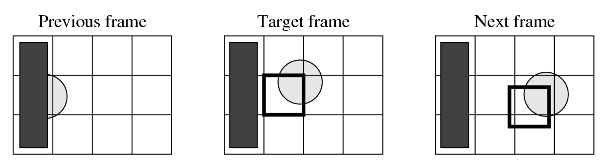
</div>

目标帧中包含部分球体的宏块无法在前一帧中找到良好匹配，因为球体的一半被另一物体遮挡。然而，从下一帧中可以轻松获得匹配。

而 MPEG 引入了第三种帧类型，即 **B 帧**，以及双向运动补偿。

<div style="text-align: center">
    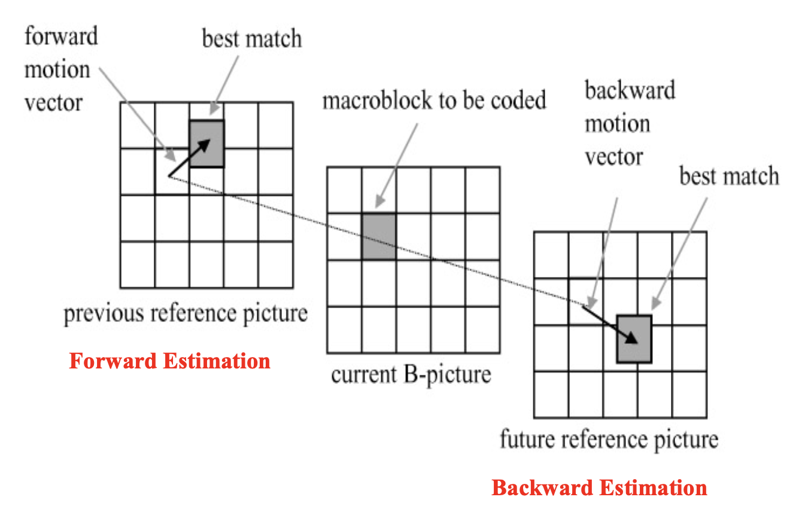
</div>

下图展示了基于运动补偿的 B 帧编码的思路：

<div style="text-align: center">
    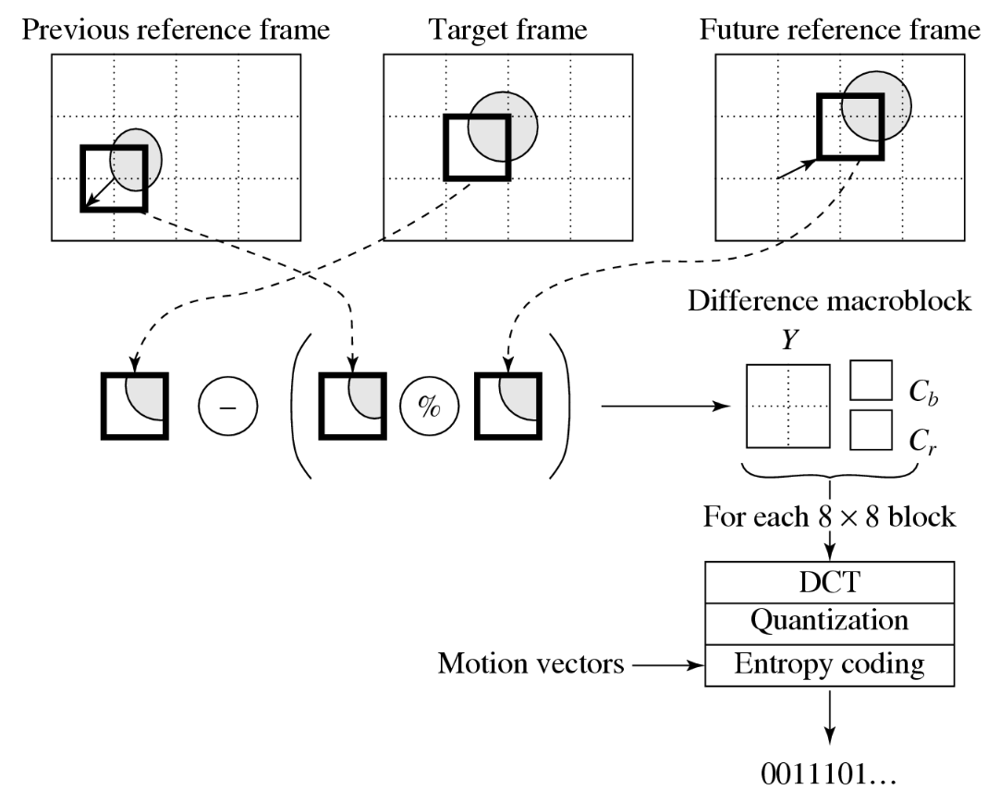
</div>

- **B 帧中的每个宏块最多可拥有两个运动向量**（一个来自前向预测，一个来自后向预测）
- 若双向匹配均成功，则发送两个运动向量，并将对应的匹配宏块进行**平均**处理（图中以 `%` 标示），再与目标宏块比较以生成预测误差
- 若仅在某一参考帧中找到有效匹配，则仅使用前向或后向预测中的一个运动向量及其对应宏块

下图展示了 MPEG 的帧序列：

<div style="text-align: center">
    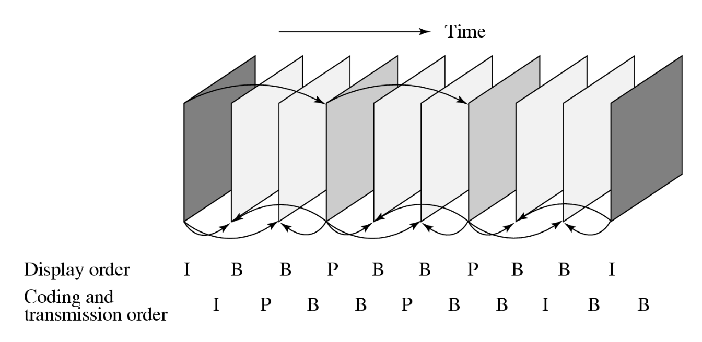
</div>

B 帧依赖于其后续的 P 帧或 I 帧，因此**播放顺序与编码顺序不同**。

<div style="text-align: center">
    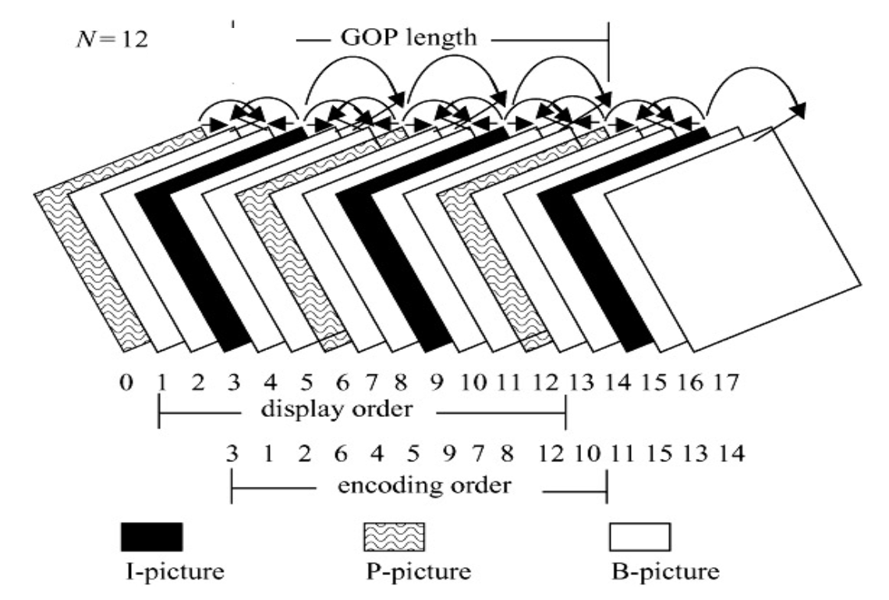
</div>


#### Other Major Differences from H.261

H.261 仅支持 CIF（352×288）和 QCIF（176×144）格式；而 MPEG-1 支持 SIF 格式（NTSC 制式为 352×240，PAL 制式为 352×288），并允许指定其他格式。

与 H.261 中的 GOB 不同，MPEG-1 图像可被划分为一个或多个切片：

<div style="text-align: center">
    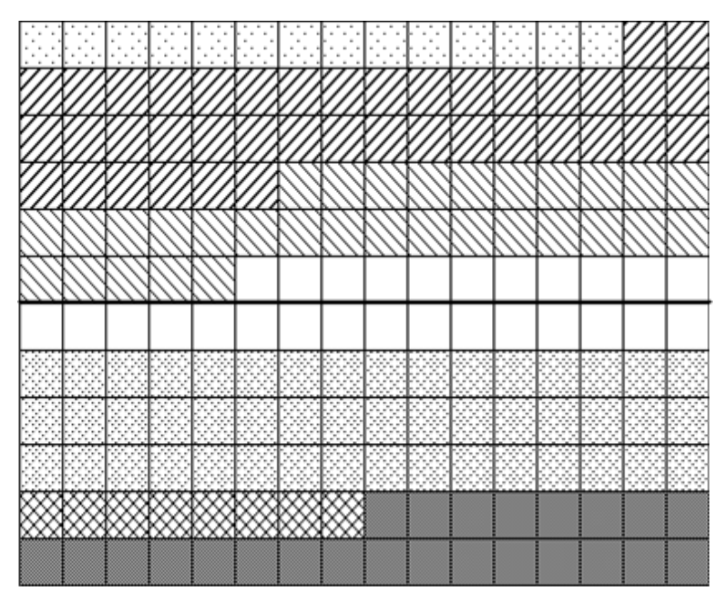
</div>

- 单个图像中可包含数量不等的宏块
- 只要填满整个画面，切片起止位置可以任意设定
- 每个切片独立编码，这为比特率控制提供了额外灵活性
- 切片概念对于错误恢复至关重要

在量化方面，MPEG-1 在其帧内编码和帧间编码中采用了不同的量化表。

- 帧内模式的 DCT 系数：

    $$
    \text{QDCT}[i, j] = \text{round} \left[ \frac{8 \times \text{DCT}[i, j]}{\text{step\_size}[i, j]} \right] = \text{round} \left[ \frac{8 \times \text{DCT}[i, j]}{Q_1[i, j] \times \text{scale}} \right]
    $$

- 帧间模式的 DCT 系数：

    $$
    \text{QDCT}[i, j] = \frac{8 \times \text{DCT}[i, j]}{\text{step\_size}[i, j]} = \frac{8 \times \text{DCT}[i, j]}{Q_2[i, j] \times \text{scale}}
    $$

帧内编码的量化数在宏块内部变化，这与H.261不同。

<div style="text-align: center">
    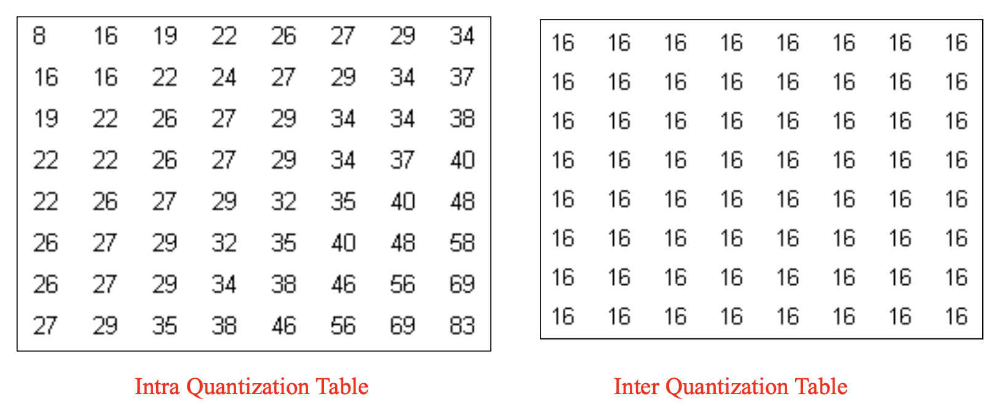
</div>

其他不同之处：

- MPEG-1 允许运动矢量达到子像素(sub-pixel)精度（1/2像素）；H.263中采用的双线性插值技术可用于生成半像素位置所需的数值
- 相较于 H.261 标准中运动矢量最大范围 ±15 像素，MPEG-1 支持的运动矢量范围在半像素精度下为 [-512, 511.5]，在全像素精度下为 [-1024, 1023]
- MPEG-1 比特流支持随机访问功能，这是通过 GOP 层实现的，每个 GOP 都带有时间编码

关于压缩：

- 压缩后的 P 帧典型尺寸显著小于 I 帧，这是因为在帧间压缩中利用了时间冗余性
- 而 B 帧甚至比 P 帧更小，原因在于双向预测的优势以及 B 帧被赋予最低的优先级


#### MPEG-1 Video Bitstream

<div style="text-align: center">
    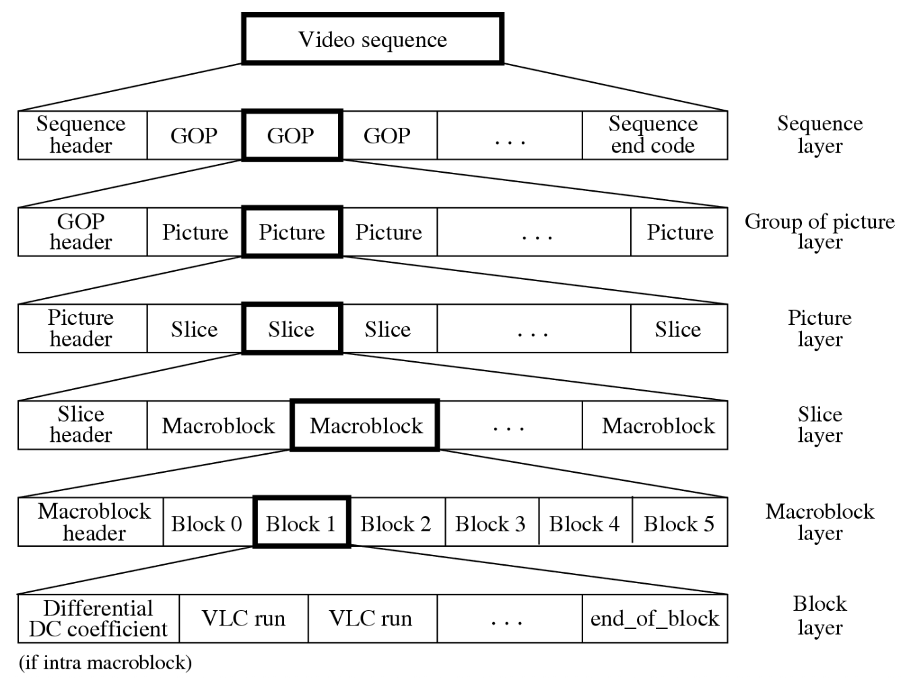
</div>

<div style="text-align: center">
    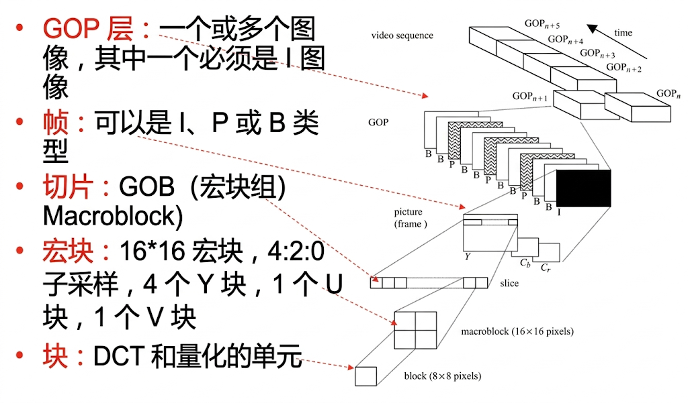
</div>


### MPEG-2

#### Overview

**MPEG-2** 始于1990年，旨在实现比特率超过 4 Mbps 的**高质量视频**，以满足数字电视/高清电视的压缩与比特率要求。该标准获得广泛应用，包括地面广播、卫星、有线网络，以及互动电视、DVD 等。

MPEG-2 定义了 7 种配置，针对不同的应用场景，每种配置最多可定义4个级别，包括简单型(simple)、主型(main)、信噪比可伸缩(SNR scalable)、空间可伸缩(spatially scalable)、高级(high)、4:2:2 以及多视图(multiview)。


#### Interlaced Video

MPEG-2 必须支持**隔行扫描视频**(interlaced video)，因为这是数字广播电视和高清电视的选项之一。

- 在隔行扫描视频中，每一帧由两个场组成，分别称为**顶场**和**底场**
- 在**帧图像**中，来自两个场的所有扫描线交织在一起形成一个单帧，然后被划分为 16×16 的宏块并使用运动补偿进行编码
- 如果每个场被视为独立的图像，则称之为**场图像**

<div style="text-align: center">
    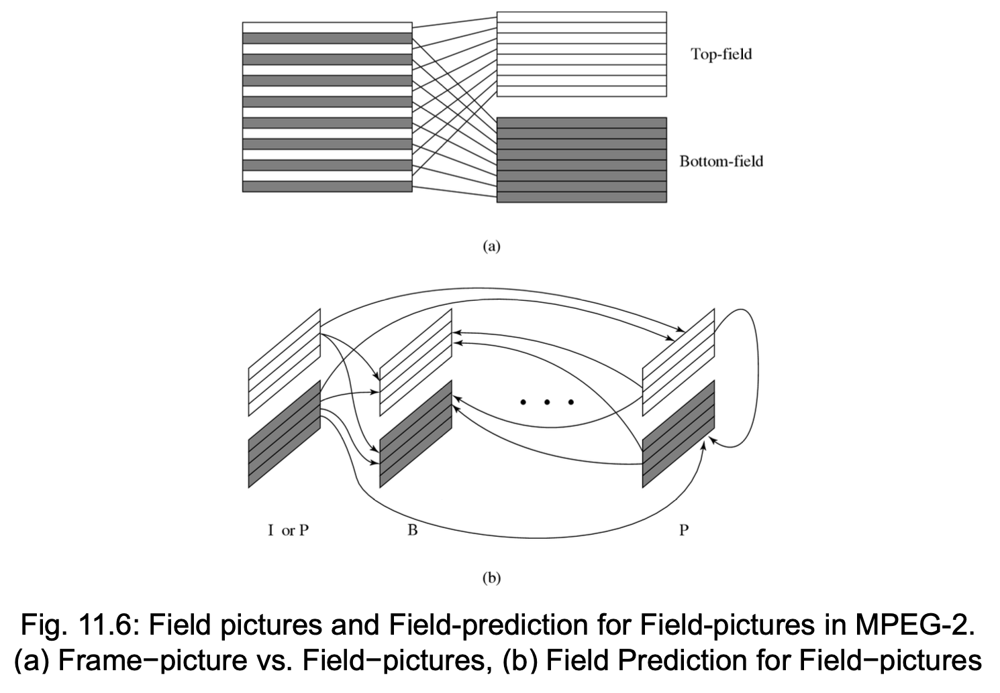
</div>

5 种预测模式：

- 帧图像的帧预测
    - 与 MPEG-1 运动补偿相同
    - 适用于包含缓慢和中等速度物体的视频

- 场图像的场预测

    <div style="text-align: center">
        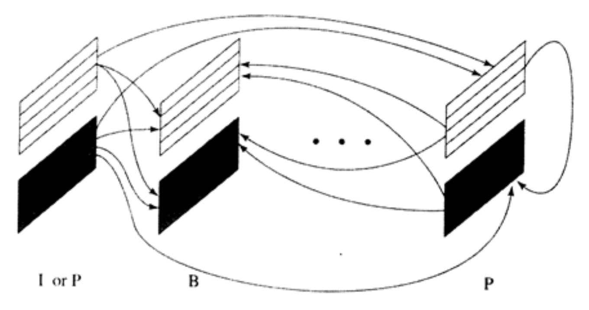
    </div>

- 帧图像的场预测：分别处理顶场和底场
- 用于场图像的 16×8 MC：适合快速且不规则的运动场景
- P 图像的双重主参考模式：MV 用于推导计算出的运动矢量CV

交替扫描与场DCT

- 旨在提升 DCT 对预测误差处理效率的技术，仅适用于隔行视频中的帧图像
    - 由于隔行视频的特性，8×8 块中连续的行来自不同的场，它们之间的相关性低于交替行之间
    - 交替扫描认识到在隔行视频中，垂直方向的高空间频率分量可能具有更大的幅度，因此允许它们在序列中更早被扫描

- 在 MPEG-2 标准中，场 DCT 也可用于解决相同的问题

<div style="text-align: center">
    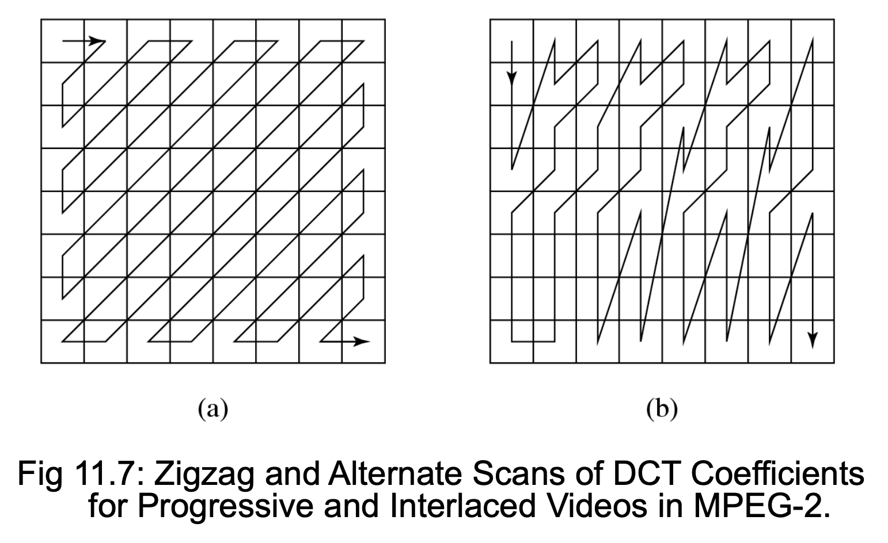
</div>


#### MPEG-2 Scalabilities

MPEG-2 **可伸缩编码**(scalable coding)：可以定义一个基础层和一个或多个增强层（也称为**分层编码**(layered coding)）。

- 基础层可以独立进行编码、传输和解码，以获得基本的视频质量
- 增强层的编码和解码依赖于基础层或前一个增强层

对于在具有以下特性的网络上传输的MPEG-2视频，可伸缩编码尤其有用：

- 比特率差异很大的网络
- 具有可变比特率（VBR）通道的网络
- 连接噪声较大的网络

???+ example "例子"

    <div style="text-align: center">
        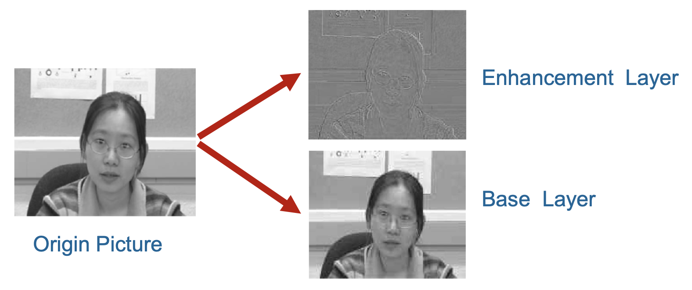
    </div>

在带宽不足时仅发送基础层，而在宽带条件下同时传输基础层与增强层，以便接收端获得更优质量。

<div style="text-align: center">
    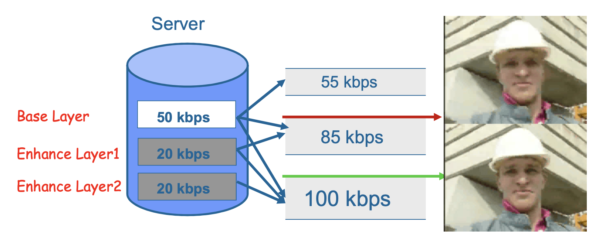
</div>

MPEG-2 支持以下可伸缩性：

- **SNR 可伸缩性**：增强层提供更高的信噪比；编码器将生成两个层次的输出比特流：基础层比特流（Bits_base）和增强层比特流（Bits_enhance）
    1. 在基础层，采用对 DCT 系数的粗量化处理，这导致生成的比特数较少，视频质量相对较低
    2. 随后，这些经过粗量化的 DCT 系数会进行反量化（Q^−1^），并输入到增强层与原始的 DCT 系数进行比较
    3. 两者之间的差异通过精细量化处理，生成 DCT 系数的细化部分，这部分数据经过可变长度编码后形成称为 Bits_enhance 的比特流

    <div style="text-align: center">
        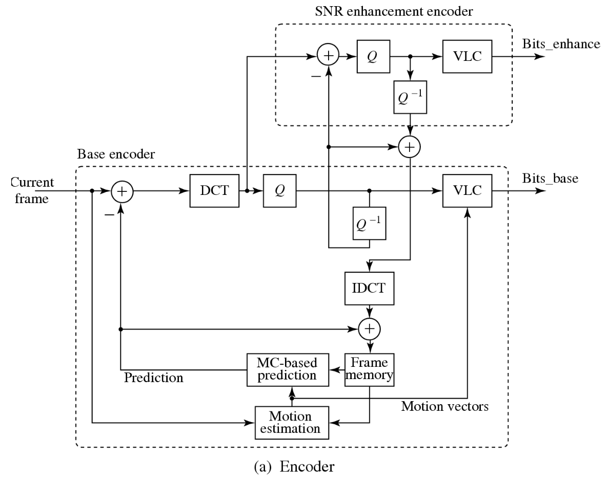
    </div>

    <div style="text-align: center">
        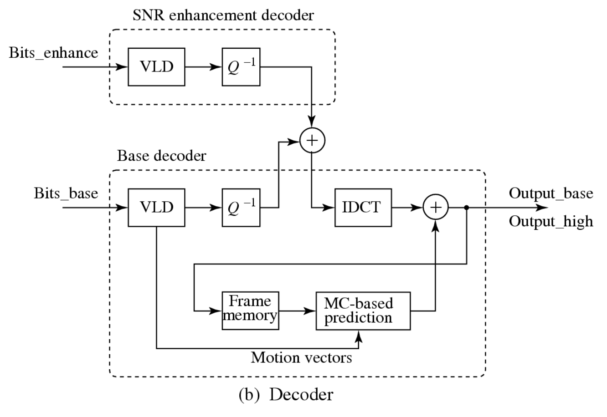
    </div>

- **空间可伸缩性**：增强层提供更高的空间分辨率
    - 基础层旨在生成降低分辨率图像的比特流；当与增强层结合时，可生成原始分辨率的图像

    <div style="text-align: center">
        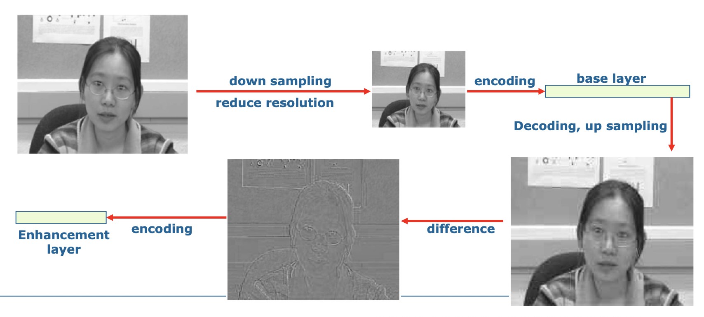
    </div>

    <div style="text-align: center">
        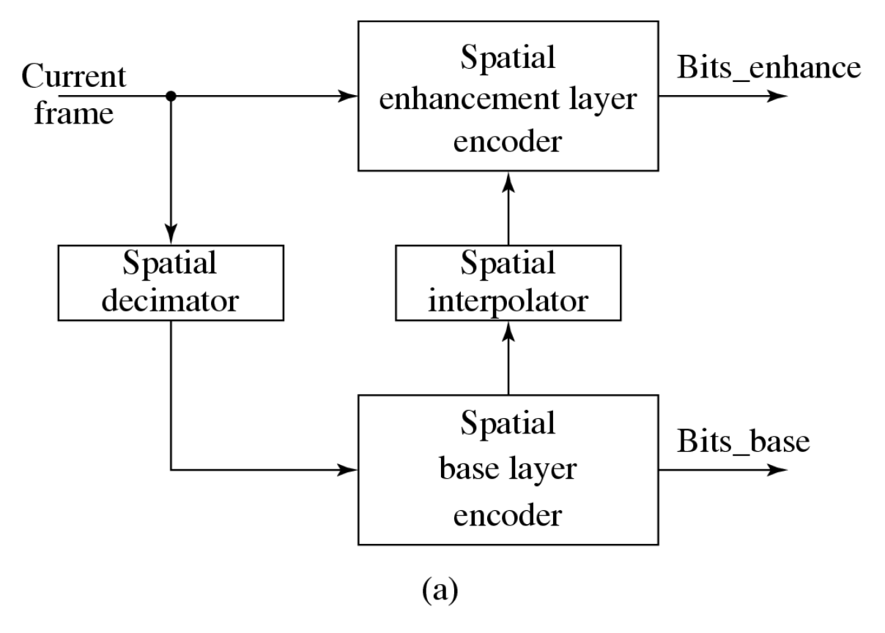
    </div>

- **时间可伸缩性**：增强层实现更高的帧率
    - 输入视频在时间上被解复用为两部分，每部分承载原始帧率的一半
    - 基础层编码器对其自身的输入视频执行常规的单层编码流程，并生成输出比特流 Bits_base
    - 增强层中匹配宏块的预测可通过两种方式获得：
        - 层间运动补偿预测
        - 结合运动补偿预测与层间运动补偿预测

    <div style="text-align: center">
        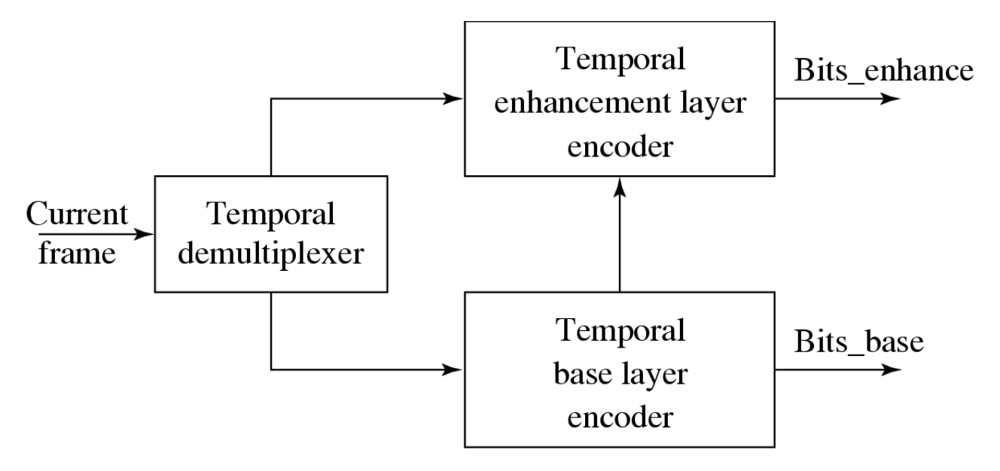
    </div>

    - 基础层和增强层的图像与输入具有相同的空间分辨率

    <div style="text-align: center">
        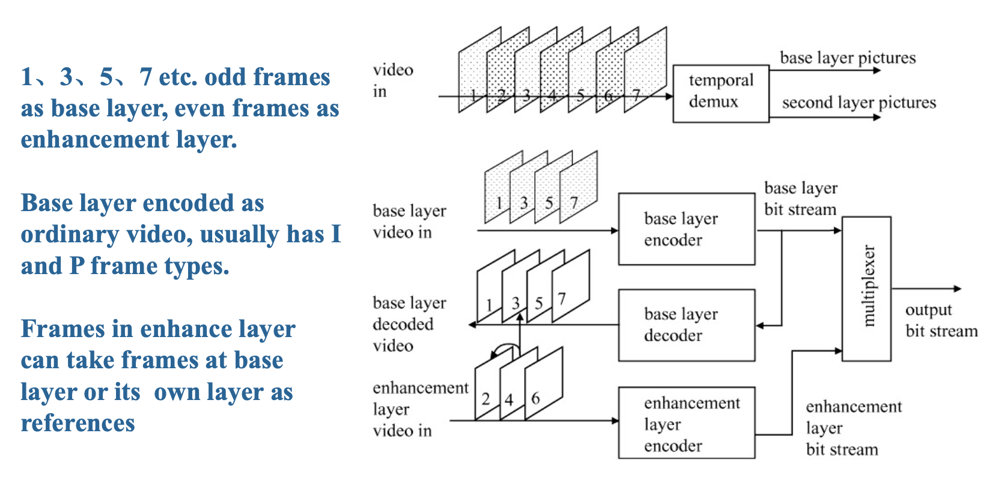
    </div>

- **混合可伸缩性**：
    - 上述三种可伸缩性中的任意两种可以结合：
        - 空间与时间混合可伸缩性
        - SNR 与空间混合可伸缩性
        - SNR 与时间混合可伸缩性

    - 通常采用三层混合编码器，包括基础层、增强层 1 和增强层 2

- **数据分区**(data partitioning)：量化后的 DCT 系数被分割成多个分区

    <div style="text-align: center">
        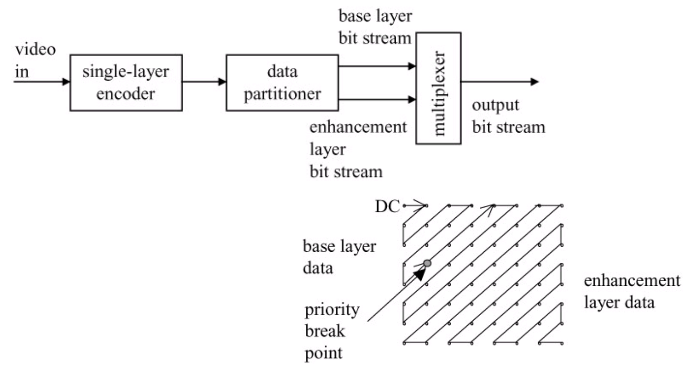
    </div>

    - 基础分区包含低频 DCT 系数，增强分区则包含高频 DCT 系数
    - 严格来说，数据分割并非分层编码，因为视频数据的单一流仅被简单划分，且在生成增强分区时并不进一步依赖基础分区
    - 适用于噪声信道传输及渐进式传输


#### Other Major Differences from MPEG-1

- 更强的抗误码能力：除了程序流外，MPEG-2 比特流中还增加了传输流
- 支持 4:2:2 和 4:4:4 色度子采样
- 更严格的切片结构：MPEG-2 的切片必须在同一宏块行开始和结束；换言之，图像左边缘总是新切片的起点，且 MPEG-2 中最长的切片只能包含一行宏块
- 更灵活的视频格式：支持 DVD、ATV 及 HDTV 定义的各种图像分辨率
- 非线性量化，允许两种类型的尺度：
    - 类型 1：尺度与MPEG-1中的相同，它是一个在 [1, 31] 范围内的整数，且 $\text{scale}_i = i$
    - 类型 2：存在非线性关系，即 $\text{scale}_i \ne i$，第 $i$ 个尺度值可以从下表中查找得到

        | $i$ | 1 | 2 | 3 | 4 | 5 | 6 | 7 | 8 | 9 | 10 | 11 | 12 | 13 | 14 | 15 | 16 |
        | :--- | :--- | :--- | :--- | :--- | :--- | :--- | :--- | :--- | :--- | :--- | :--- | :--- | :--- | :--- | :--- | :--- |
        | $\text{scale}_i$ | 1 | 2 | 3 | 4 | 5 | 6 | 7 | 8 | 10 | 12 | 14 | 16 | 18 | 20 | 22 | 24 |
        | $i$ | 17 | 18 | 19 | 20 | 21 | 22 | 23 | 24 | 25 | 26 | 27 | 28 | 29 | 30 | 31 |
        | $\text{scale}_i$ | 28 | 32 | 36 | 40 | 44 | 48 | 52 | 56 | 64 | 72 | 80 | 88 | 96 | 104 | 112 |


### MPEG-4

MPEG-4 是一种较新的标准，除了压缩外还非常注重用户交互性的问题。并且与之前的版本不同，它采用了**基于对象编码**(object-based coding)的方式：

<div style="text-align: center">
    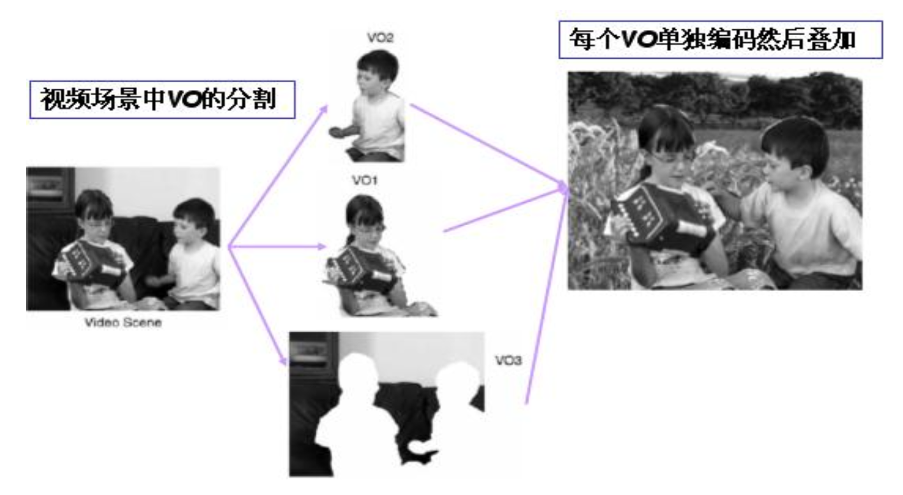
</div>

- 提供更高的压缩比，同时有助于数字视频的合成、操作、索引和检索

    <div style="text-align: center">
        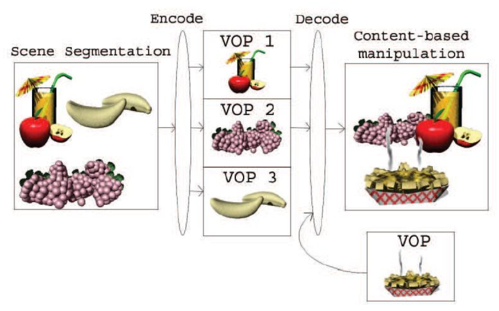
    </div>

- 任意形状编码
- 静态纹理编码
- 面部对象编码与动画
- 身体对象编码与动画

另外，MPEG-4 视频的比特率现在覆盖了从 5kbps 到 10Mbps 的大范围。

具体来说，MPEF-4 是以下功能的全新标准：

- 组合媒体对象，以创建理想的视听场景
- 对这些媒体数据实体的比特流进行复用和同步，以便能够以保证的服务质量（QoS）进行传输
- 在接收端与视听场景交互：提供用于音频和视频压缩的高级编码模块及算法工具箱

MPEG-4 视频比特流的层次结构与 MPEG-1 和 MPEG-2 有很大不同，它非常面向视频对象。

<div style="text-align: center">
    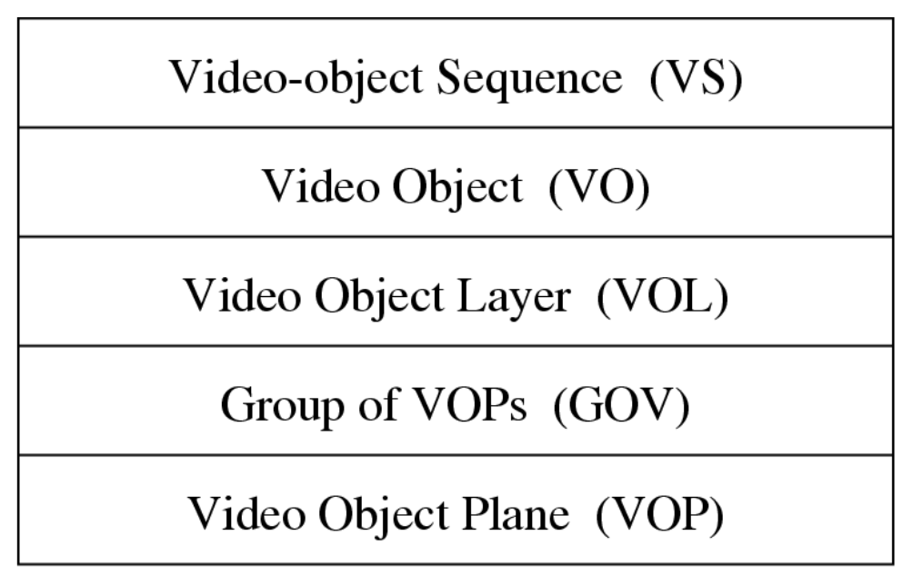
</div>

- **视频对象序列**(video-object sequence, VS)：呈现完整的 MPEG-4 视觉场景，可包含二维或三维的自然或合成对象。 
- **视频对象**(video object, VO)：场景中的特定对象，其形状可为任意（非矩形），对应场景中的某一物体或背景
- **视频对象层**(video object layer, VOL)：提供支持（多层）可伸缩编码的方式。在可伸缩编码下，一个 VO 可包含多个 VOL；在非可伸缩编码下则仅含单个VOL
- **视频对象平面组**(group of video object planes, GOV)：将多个视频对象平面组合在一起（可选层级）
- **视频对象平面**(video object plane, VOP)：某一时刻对 VO 的瞬时快照