# Basics

## The Nature of Software

**软件**(software)是一组构成配置的项目或对象，包括：

- **指令**（计算机程序）：执行时可提供所需的功能和性能
- **数据结构**：使程序能够充分操作信息
- **文档**：描述程序操作和使用

软件是开发或工程化的，不是在传统意义上的制造。

???+ question "相关提问"

    - 为什么完成软件需要这么长时间？  
    - 为什么开发成本如此之高？  
    - 为什么在将软件交付给客户之前，我们无法找出所有错误？  
    - 为什么我们在维护现有程序上花费如此多的时间和精力？  
    - 为什么在软件开发和维护过程中，我们仍然难以衡量进度？

软件不会磨损(wear out)，但是会**退化**(deteriorate)。因为软件会**持续变更**，每次引入变更，失效率都会突然升高。

必须改变遗留软件(legacy software)的原因：

- 软件必须**调整**以适应新的计算环境或技术的需求
- 软件必须**增强**以实现新的业务需求
- 软件必须**扩展**以与其他更现代的系统或数据库实现互操作(interoperatable)
- 软件必须**重新架构**(re-architected)以在网络环境中保持可行性(viable)

>具体怎么改变可以看最后一章「[再工程](misc.md#maintenance-and-reengineering)」的介绍。

各种软件形式：

- **WebApps**（网络应用程序）
- **移动应用程序**(mobile applications)
- **云计算**(cloud computing)
    - 为联网的计算设备提供分布式数据存储和处理资源
    - 计算资源位于云外部，并可访问云内部的多种资源
    - 需要开发包含前端和后端服务的架构
        - **前端服务**包括客户端设备和允许访问的应用软件
        - **后端服务**包括服务器、数据存储和驻留在服务器上的应用程序

    - 云架构可以**分段**，以限制对私有数据的访问

- **产品线软件**(product line software)
    - 产品线软件是一组软件密集型系统，它们共享一组共同特性，并满足特定市场的需求
    - 这些软件产品采用**相同的应用架构和数据架构**，并使用一组可重复使用的核心软件组件进行开发
    - 软件产品线**共享一组资产**，包括需求、架构、设计模式、可重用组件、测试用例以及其他工作产品
    - 软件产品线**允许多个产品的开发**，这些产品通过利用产品线内所有产品的共性来进行工程化设计
    - **依赖于现有软件组件的复用**，以提供软件工程的杠杆作用

软件时代演进：

    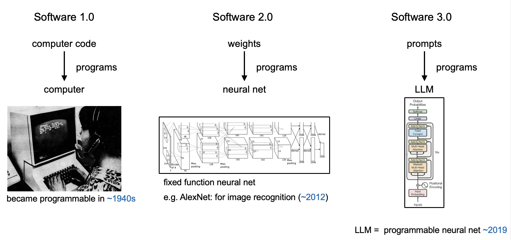

## Software Engineering

**软件工程**(software engineering)：建立并运用健全的**工程原则**，以经济地获取可靠且能在实际机器上高效运行的**软件**。

**过程**(process)：创建某个工作产品时所执行的一系列活动、行动和任务的集合。

- **活动**(activity)：致力于实现一个广泛的目标（例如与利益相关者沟通），无论应用领域、项目规模、工作复杂性或软件工程实施的严谨程度如何，它都会被应用
- **行动**(action)：包含一组任务，结果为产生一个主要的工作产品（例如架构模型）
- **任务**(task)：聚焦于一个小型但明确的目标（例如执行单元测试），并产生具体可交付的成果

**过程框架**(process framework)通过识别少量适用于所有软件项目（无论其规模或复杂性如何）的框架活动，为完整的软件工程过程奠定基础。通用的过程框架如下：

1. **沟通**(communication)：客户协作与需求收集
2. **规划**(planning)：建立工程工作计划，描述技术风险，列出资源需求，生成工作产品，并定义工作时间表
3. **建模**(modeling)：创建模型以帮助开发人员和客户理解需求及软件设计
4. **构建**(construction)：代码生成与测试
5. **部署**(deployment)：交付软件供客户评估和反馈

其中**沟通**这一步**最重要**，因为软件工程首先要解决的是“做什么”的问题。如果需求理解错误，即使后续设计、编码和测试都做得很好，最终产品也可能无法满足用户需要，导致返工成本很高。因此，充分沟通可以明确需求、减少误解，并为后续计划、设计和实现奠定基础。

过程框架活动由若干**伞型活动**(umbrella activities)补充。

- **软件项目跟踪与监控**(software project tracking and control)：使软件团队能够对照项目计划评估进展，并采取必要措施以维持进度
- **风险管理**(risk management)：评估可能影响项目成果或产品质量的风险
- **软件质量保证**(software quality assurance)：定义并执行确保软件质量所需的活动
- **技术评审**(technical review)：评估软件工程工作产品，以便在错误传播到下一项活动之前发现并消除错误
- **度量**(measurement)：定义并收集过程、项目和产品度量，帮助团队交付满足利益相关者需求的软件；可与所有其他框架和支撑性活动结合使用
- **软件配置管理**(software configuration management)：在软件过程中管理变更的影响
- **可复用性管理**(reusability management)：定义工作产品（包括软件组件）复用的标准，并建立实现可复用组件的机制
- **工作产品准备与生成**(work product preparation and production)：包括创建工作产品（如模型、文档、日志、表单和列表）所需的活动

过程适应性(process adaptation)：

- 活动、行动和任务的总体流程及其相互依赖关系
- 每个框架活动中行动和任务的定义程度
- 工作产品被识别和要求的程度
- 质量保证活动的应用方式
- 项目跟踪与控制活动的应用方式
- 描述过程的总体细节和严谨程度
- 客户及其他利益相关者参与项目的程度
- 赋予软件团队的自主权水平
- 团队组织与角色规定的程度

软件工程的**实践本质**(essence of practice)（对照着过程框架看）：

1. **理解问题**（沟通与分析）
2. **规划解决方案**（建模与软件设计）
3. **执行计划**（代码生成）
4. **检查结果的准确性**（测试与质量保证）

通用原则：

- The reason it all exists — Provide **Value** to users（存在价值）
- **KISS** — Keep It Simple, Stupid!（保持简洁）
- Maintain the **Vision**（保持愿景）
- What you produce, others will consume（关注使用者）
- Be open to the future（面向未来）
- Plan ahead for reuse（提前计划复用）
- Think!（认真思考）

一堆神话略...

软件工程进入 3.0 时代：

    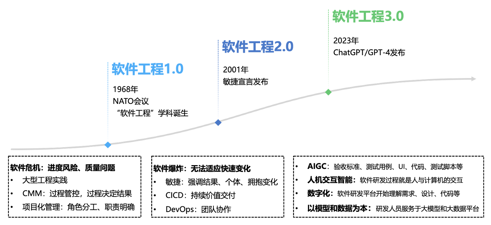

## Software Process Structure

过程流：

- **线性过程流**(linear process flow)：从沟通到部署顺序执行五个框架活动

    

        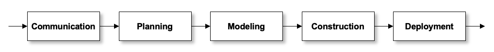
    

- **迭代过程流**(iterative process flow)：在执行下一个活动前重复执行之前的一个或多个活动

    

        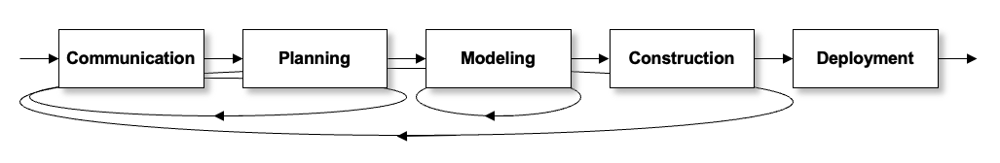
    

- **演化过程流**(evolutionary process flow)：采用循环的方式执行各个活动，每次循环都能产生更完善的软件版本

    

        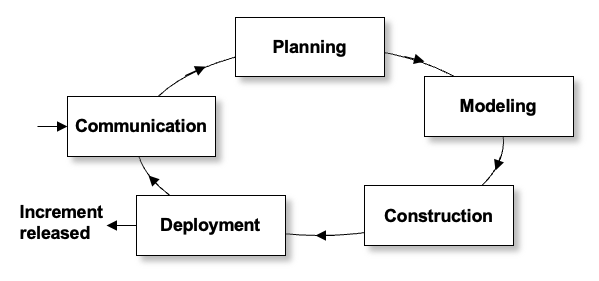
    

- **并行过程流**(parallel process flow)：将一个或多个活动与其他活动并行执行（例如，软件一个方面的建模可以同软件另一个方面的构建活动并行执行）

    

        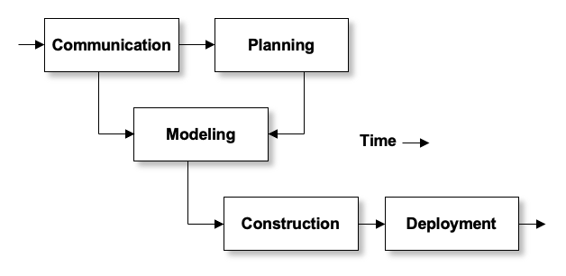
    

**过程模式**(process patterns)定义了一组活动、行动、工作任务、工作产品和/或相关行为。而**模板**(templates)用于定义模式。通用软件模式的组成元素包括：

- 有意义的**模式名称**
- **意图**(intent)（模式的目标） 
- **类型**：  
    - 任务模式：定义工程行动或工作任务
    - 阶段(stage)模式：定义过程的框架活动
    - 阶段(phase)模式：定义过程中框架活动的顺序或流程
- **初始环境**(initial context)（描述使用模式前必须存在的条件） 
- **解决方案**（描述如何正确实施模式） 
- **结果环境**(resulting context)（描述模式成功实施后产生的条件） 
- **相关模式**（与当前模式直接相关的模式链接） 
- **已知用途/示例**（模式适用的实例）

**软件过程评估**(assessment)：对一个组织的软件开发过程进行系统化检查和评价，以了解当前的软件开发能力，并发现需要改进的地方。评估结果包括：

- 软件过程改进(software process improvement)：评估可以帮助组织识别当前开发流程中的问题，并提出需要修改或优化的地方
- 能力评定(capability determination)：通过过程评估，还可以判断一个组织的软件开发能力水平，并识别潜在的项目风险

在实践中，软件过程评估通常依赖一些**标准**，例如 **SCAMPI**、**CBA-IPI**、**SPICE**（ISO/IEC 15504）以及 **ISO 9001** 软件质量管理体系等。

**CMMI**（**能力成熟度模型集成**(Capability Maturity Model Integration)）是由 Software Engineering Institute 提出的一套用于评估和改进软件过程能力的模型，它目前已经成为软件工程领域非常重要的过程改进标准之一。

- 级别0：**不完整**(incomplete)（过程未执行，或未实现该级别定义的所有目标）
- 级别1：**已执行**(performed)（正在执行生产所需工作产品所需的工作任务）
- 级别2：**已管理**(managed)（执行工作的人员拥有完成工作所需的充足资源，利益相关者积极参与，工作任务和产品受到监控、审查和评估，以确保符合过程描述）
- 级别3：**已定义**(defined)（管理和工程过程已文档化、标准化，并整合到组织级软件过程中）
- 级别4：**量化管理**(quantitatively managed)（通过详细度量对软件过程和产品进行量化理解与控制）
- 级别5：**优化**(optimizing)（通过过程的量化反馈和创新理念的试验，实现持续的过程改进）

## Process Models

过程模型的分类：

- **规定性模型**(prescriptive models)：主张采用**有序的方法**实现软件工程
    - **瀑布模型**(waterfall model)：
        - 遵循前面提到的经典的过程框架（5步骤）
        - 适用情况：在**需求已确定**的情况下，且工作采用**线性**方式完成的时候
        - 变体——**V 模型**：提供了一种将验证和确认动作应用于早期软件工程工作中的直观方法

            

                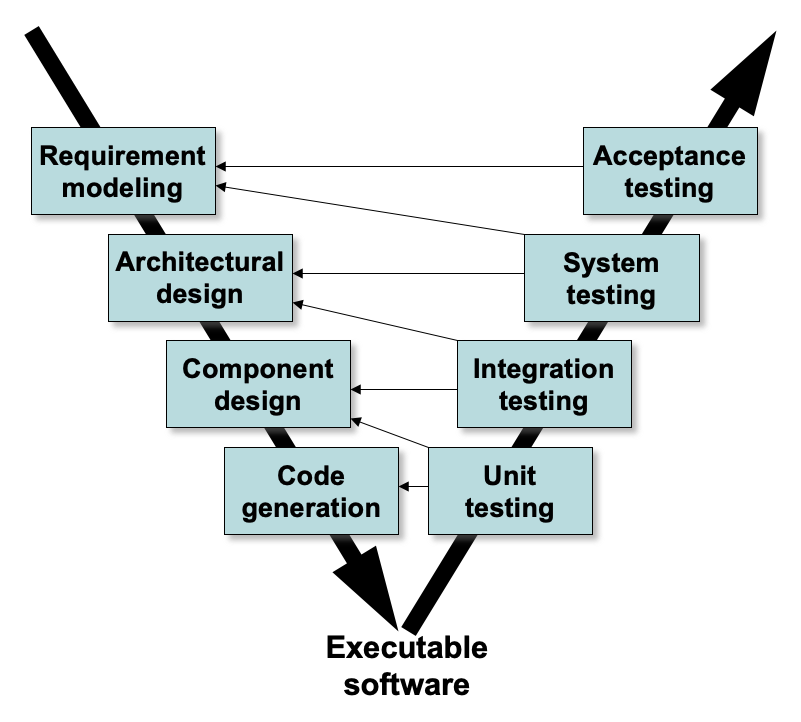
            

    - **增量模型**(incremental model)
        - 适用情况：可能迫切需要用户**迅速**提供一套功能有限的软件产品，然后在后续版本中再进行细化和扩展功能
        - 第一个增量往往是**核心产品**(core product)，即满足基本需求，但未提供附加特性（部分已知）
        - 客户使用该核心产品并进行仔细的评估，然后根据评估结果制定下一个增量计划；这份计划应说明需要对核心产品进行的修改，以便更好地满足客户的要求，也应说明需要增加的特性和功能
        - 每一个增量的交付都会重复这一过程，直到最终产品的产生

        

            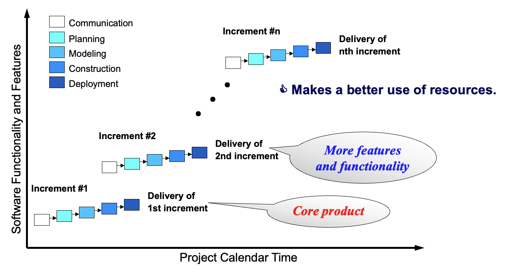
        

    
    - **演进模型**(evolutional model)
        - **原型开发**(prototyping)
            - 和瀑布模型的区别是需要在沟通后**迅速策划**一个原型开发**迭代**并进行建模 -> 快速设计 -> **原型**(prototype)
            - 在原型系统不断调整以满足各种利益相关者需求的过程中，采用迭代技术，同时也使开发者逐步清楚用户的需求
            - 适用情况：当**客户**有合理需求但无法清晰描述细节，或者**开发人员**可能对算法的效率、操作系统的适用性和人机交互的形式等情况并没有把握
            - 原型是临时系统，后面基本会被抛弃，但有些也会演化为实际可用的系统
        
        - **螺旋模型**(spiral model)
            - 结合了原型的迭代性质和瀑布模型的可控性和系统性特点，具有快速开发越来越完善的软件版本的潜力
            - 每个框架活动代表螺旋上的一个片段；随着演进过程开始，从圆心开始顺时针方向，软件团队执行螺旋上的一圈所表示的活动
            - 由于要求**在项目的所有阶段始终考虑技术风险**，如果适当地应用该方法，就能够在风险变为难题之前将其化解

            

                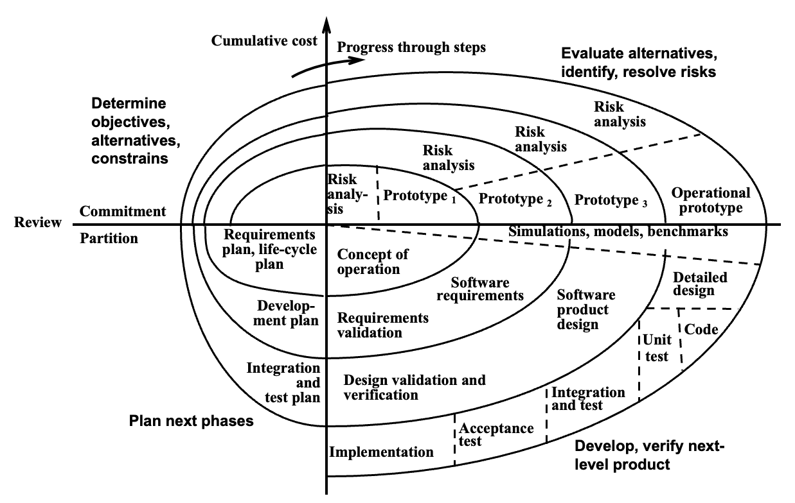
            

        
        - **并发开发模型**(concurrent development model)
            - 有时也叫作并发工程
            - 定义了一系列**触发软件工程活动、动作或者任务的状态转换的事件**
            - 定义了一个**过程网络**，网络上每个活动、动作和任务与其他活动、动作和任务同时存在；某一点产生的事件可以触发与每一个活动相关的状态的转换

- **专用模型**(specialized model)
    - **基于组件模型**(component-based development model)：依赖于**面向对象技术**支持；该技术提供封装、继承、多态等机制，使功能模块能被封装独立可复用组件，通过标准接口进行集成和复用，这是组件化开发的核心
    - **形式化方法模型**(formal methods model)：通过数学方法，精确定义系统需求，开发高可靠性、缺陷极少甚至无缺陷的系统，并验证系统的正确性
    - **面向方面软件开发**(aspect-oriented software developement)：提供了定义、规范、设计和构建方面的过程和方法论途径

- **统一模型**(unified model)
    - 一种**用例**(use-case)驱动、以**架构**为中心、**迭代**和**增量**的软件过程，与统一建模语言（**UML**）紧密对齐
    - 阶段：

        

            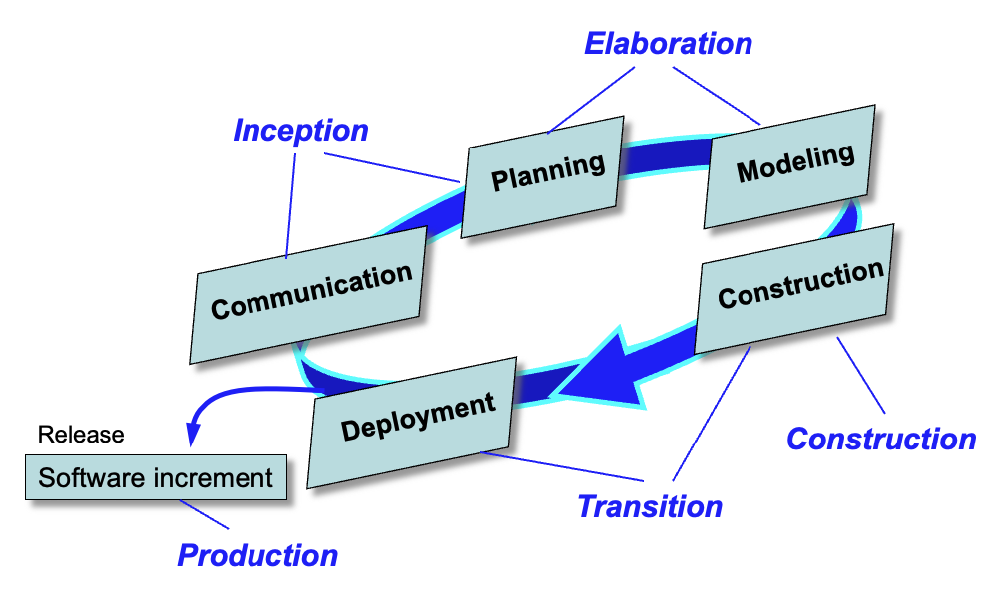
        

        1. **起始**(inception)：团队主要进行需求沟通和项目可行性分析，明确系统目标以及项目范围
        2. **细化**(elaboration)：进行系统规划和建模，例如完成系统架构设计、关键用例分析以及风险识别
        3. **构建**(construction)：开发人员主要进行编码和系统实现，同时不断进行测试，通过多次迭代逐步完善系统功能
        4. **移交**(transition)：主要包括软件部署、用户培训以及系统发布，最终将软件产品交付给用户使用

    - 在每一次迭代结束时，系统都会产生一个**软件增量**(software increment)，也就是一个可以发布的系统版本；随着迭代不断进行，系统功能逐渐完善，最终形成完整的软件产品

- **个人模型**(personal model)（个人软件过程(**PSP**)）
    - 强调开发人员**个人的自我管理**和过程改进，核心是开发人员对自己的工作负责
    - 主要活动：
        1. **计划**(planning)：在开始开发之前，工程师需要进行工作计划，例如估算开发时间、确定任务范围以及制定开发步骤
        2. **高层设计**(high-level design)：在正式编码之前，需要对软件结构进行初步设计，例如模块划分、界面设计等
        3. **高层设计评审**(high-level design review)：在实现之前对设计进行检查，以便尽早发现潜在问题，减少后期修改成本
        4. **开发**(development)：主要包括编码以及必要的测试活动
        5. **事后分析**(postmortem)：在项目完成之后，需要对整个开发过程进行总结，例如统计缺陷数量、分析错误类型，并反思哪些环节可以改进

    - **尽早发现错误，并理解错误产生的原因**：通过记录和分析个人开发过程中的缺陷数据，工程师可以逐渐改进自己的工作方式，从而持续提高软件质量和开发效率

- **团队模型**(team model)（团队软件过程(**TSP**)）
    - 核心目标：帮助软件开发团队提升**自我管理**(self-directed)和自我组织能力，使成员能够独立、高效协作完成项目
    - 主要活动：
        1. **启动**(launch)：团队会按照一个预先定义好的脚本来组织项目工作，该脚本明确项目需要完成的任务、开发步骤以及团队成员的角色分工，从而使整个项目一开始就具有清晰的计划和目标
        2. **团队的自我管理**(self-directed teams)：团队成员不仅执行任务，还需要参与项目计划、进度控制和质量管理；通过这种方式，团队可以形成更强的责任意识和协作能力
        3. **度量**(measurement)：团队在开发过程中需要持续收集各种数据，例如开发时间、缺陷数量以及工作量等
        4. **分析**(analysis)：通过分析这些数据，团队可以发现开发过程中的问题，并不断改进团队的软件开发流程

## Agile Development

**敏捷**(agility)：以**用户需求进化**为**核心**，采用**迭代、循序渐进**的方式进行软件开发。

- **有效**（**迅速**且适应性强）应对变化  
- 所有利益相关者之间的有效**沟通**
- 将**客户**纳入团队
- 组织团队使其**掌控**所执行的工作  
- 从而产生**快速、增量式交付软件**

???+ note "**敏捷软件开发宣言**(The Manifesto for Agile Software Development)"

    我们一直在实践中探寻更好的软件开发方法，身体力行的同时也帮助他人。由此我们建立了如下价值观：

    - **个体和互动**高于流程和工具
    - **工作的软件**高于详尽的文档
    - **客户合作**高于合同谈判
    - **响应变化**高于遵循计划

    也就是说，尽管右项有其价值，我们更重视左项的价值。

**敏捷过程**(agile process)：

- 由客户对需求（场景）的描述驱动  
- 认识到计划是短暂的  
- 迭代开发软件，高度重视构建活动  
- 交付多个软件增量
- 随变化而适应

**敏捷原则**(agile principles)：

- 我们的最高优先级是通过**尽早且持续地交付有价值的软件**来满足客户需求
- 欢迎**需求变化**，即使在开发后期也是如此；敏捷流程利用变化为客户创造竞争优势
- **频繁交付可工作的软件**，交付周期从几周到几个月不等，并倾向于更短的时间跨度
- 业务人员和开发者必须在项目期间每天一起工作
- 围绕有积极性的个体构建项目；为他们提供所需的环境和支持，并信任他们能够完成工作
- 向开发团队内部及团队之间传递信息的最高效且最有效的方法，是**面对面的对话**
- **可工作的软件**是进度的首要度量标准
- 敏捷过程提倡**可持续开发**；赞助者、开发者和用户应该能够无限期地保持恒定的节奏
- 持续关注技术卓越和良好设计能够增强敏捷性
- **简单性**——最大化未完成工作的艺术——是至关重要的
- 最好的架构、需求和设计出自**自组织团队**
- 团队**定期反思**如何变得更有效，然后相应地调整其行为

**极限编程**(extreme programming, **XP**)是最广泛使用的敏捷过程，最初由 Kent Beck 提出。

    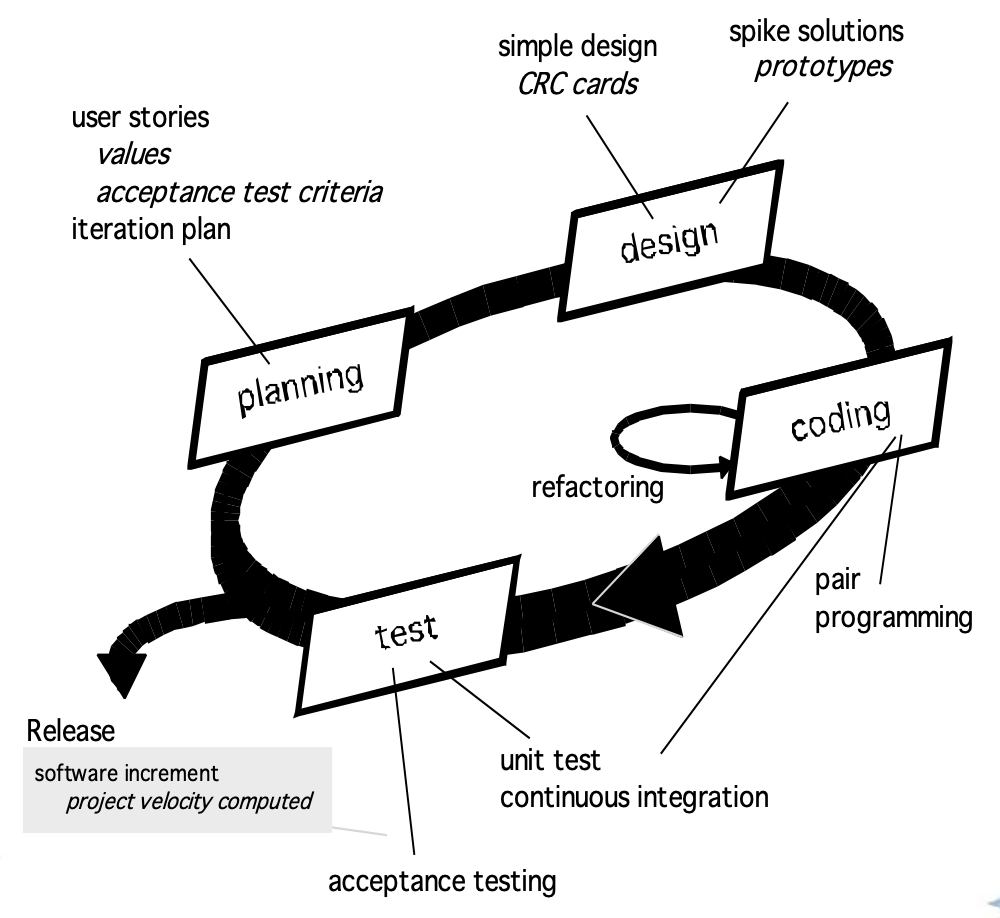

1. **规划**(planning)
    - 从创建**用户故事**开始
    - 敏捷团队评估每个故事并分配**成本**
    - 故事被分组以形成**可交付的增量**
    - 对交付日期做出**承诺**
    - 在第一个增量之后，**项目速度**用于帮助定义其他增量的后续交付日期

2. **设计**(design)
    - 遵循 **KIS 原则**
    - 鼓励使用 **CRC 卡片**
    - 针对复杂设计问题，建议创建“探究式解决方案”（**设计原型**）
    - 倡导**重构**，即对内部程序设计的迭代优化

3. **编码**(coding)
    - 建议在**编码开始前**为存储构建**单元测试**
    - 鼓励**结对编程**(pair programming)（由两名开发者共同完成同一任务的开发方式，一人（driver）负责编写代码，另一人（navigator）负责审查、设计和规划，并定期交换角色）

4. **测试**(testing)
    - 所有单元测试**每日执行**
    - **验收测试**由客户定义并执行，以评估客户可见的功能

**工业极限编程**（**IXP**）：在管理上更具包容性，拓展了客户角色，并升级了技术实践，包括：

- **准备就绪评估**(readiness assessment)
- **项目社区**(project community)
- **项目章程制定**(project chartering)
- **测试驱动管理**(test driven management)
- **回顾会议**(retrospectives)
- **持续学习**(continuous learning)

**Scrum**：由 Schwaber 和 Beedle 最初提出，其特点包括：

    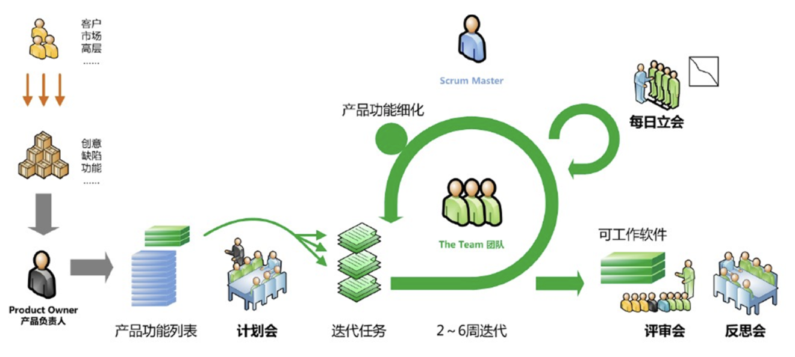

- 开发工作被划分为**包**(packets)
- 在构建产品的过程中，**测试和文档工作持续进行**
- 工作以**冲刺**(sprints)形式进行，并源自现有需求的**待办事项**(backlog)
- **会议非常简短**，有时在没有椅子的情况下进行；四种会议：
    - 冲刺计划会议(sprint planning meeting)：每个成员简要汇报**前一天**的工作进展、**今天**的工作计划和遇到的**问题**
    - 冲刺评审会议(sprint review meeting)：Scrum团队展示完成的工作成果，利益相关者提供反馈和建议
    - 冲刺回顾会议(sprint retrospective meeting)：团队回顾上一个冲刺的工作过程，检讨遇到的问题和改进措施

- 在分配的时间盒内，向客户交付 **demo**
- 三种角色：
    - **产品负责人**(productor owner)：责任在于帮助企业获得最高的投资回报（ROI），是唯一有权给团队布置任务，或改变待办事项的优先级顺序的人
    - **流程管理人**(scrum master)：引导团队提升凝聚力、自组织能力和团队效能
    - **团队成员**

**动态系统开发方法**(dynamic system development method, **DSDM**)：由 DSDM 联盟推广，其特点包括：

- 在大多数方面与 XP 相似
- 九项指导原则
    - **用户的积极参与**至关重要
    - DSDM 团队必须有权做出**决策**
    - 重点在于**频繁交付产品**
    - **对业务目的的适用性**是验收可交付成果的关键标准
    - **迭代和增量开发**对于达成准确的业务解决方案是必要的
    - 开发过程中的**所有变更都是可逆的**
    - 需求在高层级上被**基线化**(baselined)
    - **测试**贯穿整个生命周期

**敏捷建模**(agile modeling)由 Scott Ambler 提出，包含了一套敏捷建模原则：

- 有目的地建模
- 使用多种模型
- 轻装上阵(travel light)
- 内容比表示更重要
- 了解模型以及用于创建它们的工具
- 因地制宜(adapt locally)

**敏捷统一过程**(agile unified process, **AUP**)：每轮 AUP 迭代都会完成以下活动：

- 建模(modeling)
- 实现(implementation)
- 测试(testing)
- 部署(deployment)
- 配置与项目管理(configuration and project management)
- 环境管理(environment management)

## Human Aspects of Software Engineering

**成功的软件工程师的品质**：

- 个人责任感
- 敏锐地意识到团队成员和利益相关者的需求
- 对设计缺陷直言不讳(brutally honest)，并提出建设性批评
- 抗压能力强(resilient under pressure)
- 高度公平感
- 注重细节
- 务实(pragmatic)

**软件工程行为模型**(behavioral model for software engineering)：

    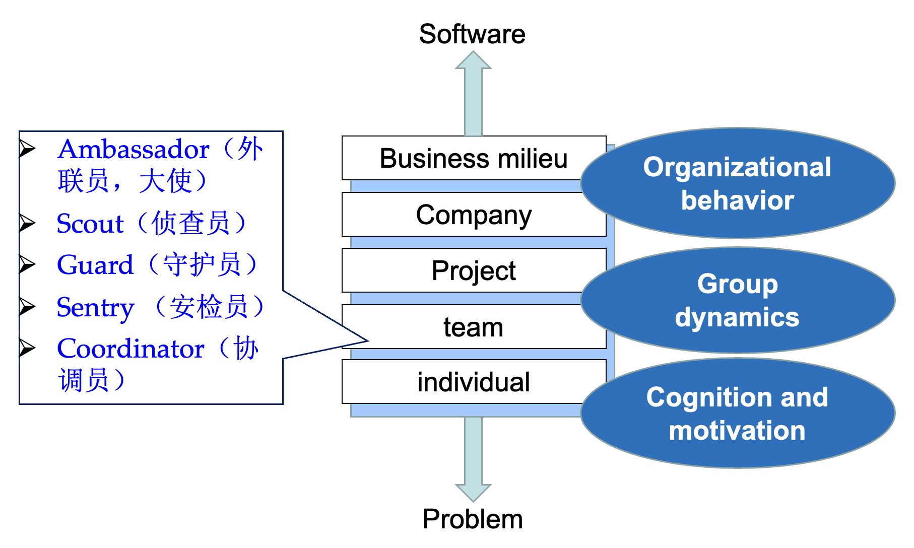

**高效软件团队的特质**：

- 目标意识(sense of purpose)
- 参与意识(sense of involvement)
- 信任意识(sense of trust)
- 进步意识(sense of improvement)
- 团队成员技能的多样性(diversity of team member skill sets)

避免以下团队「**毒性**(toxicity)」因素：

- **疯狂的工作氛围**(frenzied work atmosphere)，团队成员浪费精力，无法专注于要完成的工作目标
- 因个人、业务或技术因素导致团队成员之间摩擦，产生**高度挫败感**(high frustration)
- **零散或协调不良的程序**(fragmented or poorly coordinated procedures)，或定义不清、选择不当的过程模型，影响工作成果
- **角色定义不明确**，导致缺乏问责(accountability)，进而相互指责(finger-pointing)
- **持续反复遭遇失败**(continuous and repeated exposure to failure)，导致信心丧失、士气低落

**组织范式**(organizational paradigms)：

- **封闭范式**(closed paradigm)：按照传统的权力层级结构组建团队  
- **随机范式**(random paradigm)：松散地构建团队，依赖团队成员的个人主动性  
- **开放范式**(opened paradigm)：试图以一种既能实现封闭范式中的某些管控，又能保留随机范式所带来的大量创新的方式来构建团队，助于集思广益，灵活应对复杂多变的需求和挑战，**适合处理极其复杂的问题**
- **同步范式**(synchronous paradigm)：依赖于问题自然分解为若干部分(compartmentalization)，并组织团队成员各自处理问题的不同部分，成员之间很少进行主动沟通

**影响团队结构的因素**：

- 待解决问题的**难度**  
- 最终程序的**规模**（以代码行数或功能点衡量）  
- 团队将持续合作的时间（团队**生命周期**）
- 问题可**模块化**(modularized)的程度
- 待构建系统所需的**质量与可靠性**  
- 交付日期的**严格程度**(rigidity) 
- 项目所需的社会化(sociability)（**沟通**）程度

**敏捷团队**(agile team)：

- 强调**个人能力**与**团队协作**作为关键成功因素
- **人优于流程**，而**政治**(politics)可能超越人
- 敏捷团队为**自组织型**(self-organized)，拥有多种结构：
    - 适应性的团队结构
    - 采用康斯坦丁(Constantine)的随机、开放和同步结构元素
    - 高度自治(significant autonomy)

- **规划保持最小化**，仅受业务需求和组织标准的约束

**XP 敏捷团队**的核心价值：

- **沟通**(communication)：团队成员和利益相关者之间非正式的密切口头交流，并为**比喻**(metaphors)建立含义，作为持续反馈的一部分
- **简单性**(simplicity)：为**当前需求**而非未来需求设计
- **反馈**(feedback)：来自已实现的软件、客户和其他团队成员
- **勇气**(courage)：抵制为未明确未来需求而设计的压力所需的自律(discipline)
- **尊重**(respect)：团队成员和利益相关者之间的尊重

社交媒体的影响：

- **博客**(blogs)：与团队成员和客户分享信息  
- **微博**(microblogs)：向关注者发布实时消息（如推特）  
- **定向在线论坛**(target on-line forums)：参与者课提问或发表观点，并收集回答  
- **社交网站**：让软件开发者之间建立联系，以便分享信息（如Facebook、LinkedIn）  
- **社交书签**(social book marking)：让开发者能够跟踪并分享网络资源（如Delicious、Stumble、CiteULike）

**云计算**在软件工程中的作用：

- 积极：
    - 提供**所有**软件工程工作产品的**访问权限**
    - 消除设备依赖性，**随处可用**
    - 提供**分发**和**测试**软件的途径
    - 使得由一名成员开发的软件工程信息可供所有团队成员使用

- 消极：
    - 在软件团队控制范围之外分散云服务可能会带来**可靠性和安全风险**
    - 大量服务分布在云上时，**互操作性问题**(interoperability problems)的可能性变得很高
    - 云服务强调**可用性**和**性能**，这往往与安全性、隐私和可靠性相冲突

**协作开发环境**(collaborative development environments, **CDEs**)的服务：

- **命名空间**(namespace)：允许安全、私有存储或工作产品
- **日历**：用于协调项目事件
- **模板**：允许团队成员创建具有统一外观和风格
- **支持指标**：以便对每位团队成员的贡献进行定量评估
- **沟通分析**：追踪消息并识别可能暗示需要解决之问题的模式
- **工作聚类**(artifact clustering)：展示工作产品依赖关系

**全球软件团队**面临与协作、协调及协调困难相关的额外挑战：

- 问题复杂性
- 与决策相关的不确定性和风险
- 与决策相关的工作对另一个项目对象产生意外影响（意外后果定律）
- 对问题的不同看法导致对前进方向的不同结论

影响全球软件开发团队的因素：

    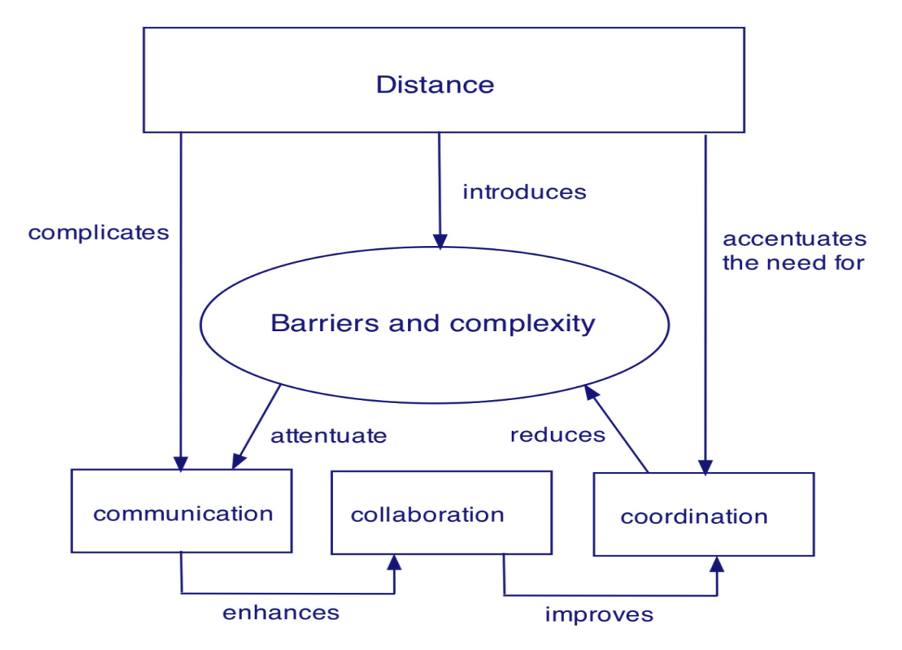

- 地理距离和时区差异
- 文化差异
- 沟通方式的变化

## Principles that Guide Practice

>常听人说，软件开发知识的半衰期是三年：如今所需掌握的内容，三年后有一半会过时。在技术相关知识领域，这大致不差。然而，还有另一类软件开发知识——我称之为「**软件工程原则**」(software engineering principles)——**其半衰期并非三年**。这些软件工程原则很可能伴随专业程序员整个职业生涯。
>
>Steve McConnell

指导**过程**的原则：

1. **保持敏捷**：无论你选择的过程模型是描述性的还是敏捷的，敏捷开发的基本原则都应指导你的方法
2. **在每个步骤中关注质量**：每个过程活动、行动和任务的退出条件都应聚焦于所产生的工作产品的质量
3. **随时准备适应**：过程不是宗教体验，教条主义在其中毫无立足之地；必要时，调整你的方法以适应问题、人员和项目本身所带来的约束
4. **打造高效团队**：软件工程过程和实践固然重要，但归根结底在于人；建立一个彼此信任与尊重的自组织团队
5. **建立沟通与协调机制**：项目失败往往是因为重要信息被遗漏，或者利益相关者未能协同努力以交付成功的最终产品
6. **管理变更**：无论是采用正式还是非正式的方式，都必须建立机制来管理变更的请求、评估、批准和实施过程
7. **评估风险**：软件开发过程中可能出现的变数很多，因此制定应急计划至关重要
8. **创建能为他人提供价值的工作产品**：只创建那些能为其他流程活动、行动或任务提供价值的工作产品

指导**实践**的原则：

1. **分而治之**：更技术性的表述是，分析与设计应始终强调**关注点分离**(separation of concerns, SoC)
2. **理解抽象的使用**：抽象本质上是系统中某个复杂元素的简化，用于以一个短语传达含义
3. **力求一致性**：熟悉的上下文能让软件更易于使用
4. **关注信息传递**：要特别重视对接口的分析、设计、构建和测试
5. 构建具有有效**模块化**的软件：关注点分离（原则1）确立了软件的哲学，而模块化提供了实现这一哲学的机制
6. 寻找**模式**：布拉德·阿普尔顿（Brad Appleton）指出：“软件社区中模式的目标是创建一套文献体系，帮助软件开发人员解决整个软件开发过程中反复出现的问题。”
7. 在可能的情况下，从**多个不同视角**来描述问题及其解决方案
8. 记住，总有人会**维护**软件

**沟通**原则：

1. **倾听**：专注于说话者的话语，而非构思如何回应
2. 沟通前做好**准备**：在与人会面前，先花时间理解问题
3. 需要有人**引导**沟通：**每次沟通会议都应有领导者**（引导人），
   - 确保对话朝着富有成效的方向推进
   - 调解可能出现的冲突
   - 确保其他原则得到遵守

4. **面对面沟通**效果最佳：但若同时辅以相关信息的其他表达形式，通常效果更佳
5. **做笔记并记录决策**：参与沟通的某人应担任记录员，记下所有重要观点和决策
6. 力求**协作**：当团队成员集体知识相结合时，协作与共识便得以实现
7. 保持专注，将讨论**模块化**：参与沟通的人越多，讨论就越容易从一个话题跳到另一个
8. 若有不清楚之处，**画图**说明
9. (a) 一旦达成共识，**继续推进**；(b) 若无法达成共识，继续推进；(c) 若某项功能或作用不明确且暂时无法澄清，继续推进
10. 谈判不是竞赛或游戏，**双方共赢**方为最佳结果

**计划**原则：

1. 理解**项目范围**：如果你不知道目的地，就不可能使用路线图；范围即为软件团队指明方向
2. 让**客户**参与规划活动：客户定义优先级并确定项目约束条件，**确保每个人都理解项目目标**，也让他们对计划有现实的预期
3. 认识到**计划是迭代的**：项目计划绝不是一成不变的；随着工作的开展，情况很可能发生变化
4. 根据已知信息进行**估算**：估算的目的是基于团队当前对所需完成工作的理解，提供工作量、成本和任务时间的参考指标
5. 在制定计划时要考虑**风险**：如果已识别出影响大且发生概率高的风险，则有必要进行应急规划
6. 要**切合实际**(realistic)：人们并非每天都能保持100%的工作效率
7. 在制定计划时调整**粒度**(granularity)：粒度是指在制定项目计划时所引入的详细程度
8. 明确你打算**如何确保质量**：计划应指出软件团队打算如何保证质量
9. 描述你打算**如何适应变化**：即使是最完善的计划，也可能因不受控制的变化而失效
10. 频繁跟踪计划并根据需要进行**调整**：软件项目是在一天天的延误中落后于进度的

**建模**原则：软件工程工作中需建立**需求模型**（又称分析模型，通过描述软件在三个不同的领域：**信息**领域、**功能**领域和**行为**领域，来体现客户需求）和**设计模型**（体现软件的特性，有助于从业者有效构建它：架构、用户界面和组件级细节）。

- **敏捷建模**原则：
    1. 软件团队的主要目标是**构建软件**，而非创建模型
    2. **轻装上阵**，不要创建超出需求的模型
    3. 力求创建能够描述问题或软件的**最简模型**
    4. 以**易于修改**的方式构建模型
    5. 能够明确说明所创建每个模型的**具体功能**
    6. 将你所创建的模型**适应到当前系统中**
    7. 尝试构建**有用的模型**，而不要执着于构建完美的模型
    8. 不要对模型语法过于教条(dogmatic)；**成功的沟通**至关重要
    9. 如果你的直觉告诉你某个书面模型不正确，你可能有理由担心
    10. 尽快获取**反馈**
        - 允许开发人员对已交付的增量进行更改
        - 交付进度可以根据变更进行调整
        - 开发人员可以确定需要在下一个增量中纳入的更改

- **需求建模**原则：
    1. 问题的**信息域**(information domain)必须被表示和理解
    2. 软件执行的**功能**必须被定义
    3. 软件的**行为**（作为外部事件的结果）必须被表示
    4. 描述信息、功能和行为的模型必须以**分层**(layered)（或**层次化**(hierarchical)）的方式划分，以揭示细节
    5. 分析任务应从**基本信息**向**实现细节**推进

- **设计建模**原则：
    1. 设计应**可追溯至需求模型**
    2. 始终考虑待构建系统的**架构**
    3. **数据**的设计与**处理函数**的设计同等重要
    4. **接口**（包括内部和外部）必须精心设计
    5. **用户界面**设计应迎合最终用户的需求，强调**易用性**
    6. **组件级设计**应具备**功能独立性**
    7. 组件之间应保持**松散耦合**，而非与环境紧密耦合
    8. 设计表示（模型）应**易于理解**
    9. 设计应通过**迭代**方式开发
    10. 创建设计模型并不排除使用**敏捷方法**

- **活态建模**(living modeling)原则：
    1. 以**利益相关者**为中心的模式应针对特定利益相关者及其任务
    2. 模型与代码应**紧密耦合**
    3. 应在模型与代码之间建立**双向信息流**
    4. 应创建共同的**系统视图**
    5. 模型信息应**持久化**，以便跟踪系统变更
    6. 各模型层级之间的信息一致性必须得到**验证**
    7. 每个模型元素都需**明确分配**利益相关方的**权利和责任**
    8. 应表示各模型元素的**状态**

**构建**原则：

- 构建活动包括一组编码和测试任务，这些任务最终生成可交付给客户或最终用户的运营软件
- **编码原则和概念**与编程风格、编程语言和编程方法紧密相关
- **测试原则和概念**引导设计出能够系统性地发现不同类型错误，并以最少时间和精力完成这一目标的测试方案

**准备**原则：在写代码前请确保

- 理解您要解决的**问题**
- 掌握基本的**设计原则和概念**
- 选择一种符合待构建软件及其运行环境需求的**编程语言**
- 挑选一个能够提供有助于简化工作的工具的**编程环境**
- 创建一组**单元测试**，这些测试将在您完成代码编写后应用

**编码**原则：在开始写代码时请务必

- 遵循**结构化编程实践**来约束算法
- 考虑采用**结对编程**
- 选择能够满足设计需求的**数据结构**
- 理解软件架构并创建与其一致的**接口**
- 尽量**简化条件逻辑**
- 以**易于测试**的方式创建**嵌套循环**
- 选择**有意义的变量名**，并遵循其他本地编码规范
- 编写具有**自文档性的代码**(self-documenting code)
- 创建有助于理解的**视觉布局**（例如缩进和空行）

**验证**原则：完成第一轮编码后，请确保

- 在适当时进行**代码走查**(code walkthrough)
- 执行**单元测试**并修正发现的错误
- **重构代码**

**测试**原则：

1. 所有测试都应可追溯到**客户需求**
2. **测试**应在测试开始前就做好**长期规划**
3. **帕累托原则**(Pareto principle)适用于软件测试
4. 测试应**从小规模开始**，逐步向大规模测试推进
5. **穷尽测试不可行**
6. 每个系统模块的**测试工作量**应与预期缺陷密度相称
7. **静态测试**可产生高效益
8. 追踪缺陷并寻找测试所发现缺陷中的**模式**
9. 包含**展示软件正确行为**的测试用例

**部署**原则：

1. 必须管理**客户**对软件的**期望**
2. 应组装并测试完整的**交付包**
3. 软件交付前必须建立**支持机制**
4. 必须向最终用户提供适当的**指导材料**
5. 有缺陷的软件应**先修复**，后交付