# Design

良好的软件设计应具备以下特点：

- **坚固性**(firmness)：程序不应存在任何妨碍其功能的错误
- **适用性**(commodity)：程序应适合其预期的使用目的
- **愉悦性**(delight)：使用程序的体验应是令人愉悦的

软件工程设计包括：

- **数据/类设计**：将分析类转换为实现类和数据结构  
- **架构设计**：定义主要软件结构元素之间的关系  
- **接口设计**：定义软件元素、硬件元素和终端用户如何通信  
- **组件级设计**：将结构元素转换为软件组件的过程描述

分析模型 -> 设计模型

    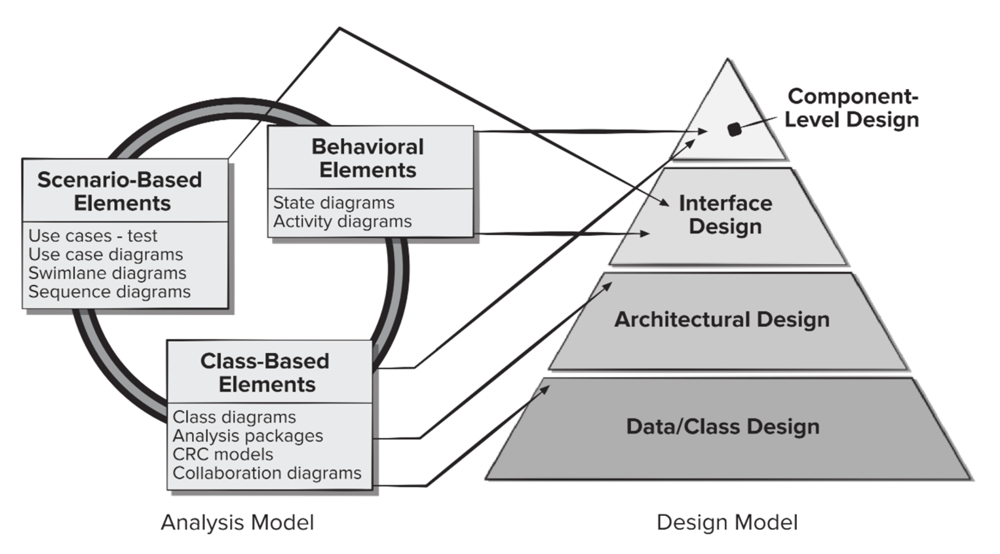

软件设计的重要性可用一个词概括——「**质量**」(quality)。设计的质量体现在：

- 设计必须实现分析模型中包含的**所有显式需求**，同时必须容纳客户所期望的**所有隐式需求**
- 设计必须为代码编写者、测试人员以及后续软件支持人员提供**可读、易懂的指导**
- 设计应**从实现视角全面呈现软件**，涵盖数据、功能和行为领域

质量指南：

- 一项设计应展现的**架构**需具备以下特征：
    - 采用公认的架构风格或模式构建
    - 由具备良好设计特性的组件构成
    - 能够以演进方式实现

- 设计应具备**模块化**特性，即软件应被逻辑划分为若干元素或子系统
- 设计中应包含数据、架构、接口和组件的**独立表示**
- 设计应导向适用于待实现类的**数据结构**，且这些结构应源于公认的数据模式
- 设计应催生具备独立功能特性的**组件**
- 设计应产生能降低组件间以及组件与外部环境连接复杂度的**接口**
- 设计应通过**可重复的方法**推导得出，该方法须以软件需求分析阶段获取的信息为驱动
- 设计应运用能有效传达其含义的**记号**(notation)进行表达

设计原则：

- 设计过程不应陷入「隧道视野」(tunnel vision)
- 设计应可追溯至分析模型
- 设计不应重复造轮子
- 设计应最小化软件与现实世界问题之间的认知距离
- 设计应体现统一性与集成性  
- 设计应结构灵活，以适应变化
- 设计应结构稳健，即使在遇到异常数据、事件或运行条件时也能优雅地降级
- 设计不是编码，编码不是设计
- 设计应在创建过程中评估质量，而非事后  
- 设计应经过审查，以减少概念（语义）错误

基本概念：

- **抽象**(abstraction)：包括**数据**、**过程**、**控制**三类
- **架构**(architecture)：软件的整体结构  
    - **结构属性**(structure properties)：架构设计表示的这方面定义了系统的组件（例如，模块、对象、过滤器），以及这些组件的封装方式和相互交互的方式；比如对象被封装以包含数据以及操纵这些数据的处理过程，并通过方法调用进行交互
    - **额外功能属性**(extra-functional properties)：架构设计描述应说明设计架构如何满足对性能、容量、可靠性、安全性、适应性及其他系统特性的要求
    - **相关系统家族**(families of related systems)：架构设计应借鉴在相似系统家族的设计中常见的可重复模式；实质上，设计应具备重用架构构建块的能力

- **模式**(pattern)：传达经过验证的设计解决方案的本质
    - 模式名称：以简短而富有表达力的名称描述模式的本质
    - 意图：描述模式及其功能
    - 别名(also-known-as)：列出模式的其他名称
    - 动机：提供问题的示例
    - 适用性(applicability)：指出模式适用的特定设计场景
    - 结构：描述实现模式所需的类
    - 参与者：描述实现模式所需的类的职责
    - 协作(collaborations)：描述参与者如何协作以履行其职责
    - 后果(consequences)：描述影响模式的“设计力量”以及实现模式时必须考虑的潜在权衡
    - 相关模式：交叉引用相关的设计模式

- **关注点分离**(seperation of concerns)：任何复杂问题若细分为多个部分，处理起来会更加容易  
    - 任何复杂问题，如果能将其分解为可独立解决和/或优化的部分，处理起来都会更加容易
    - **关注点**(concern)：作为软件需求模型一部分而指定的特性或行为
    - 通过将关注点分离成更小、因而更易于管理的部分，解决问题所需的精力和时间都会减少

- **模块化**(modularity)：数据与功能的划分  
    - 模块化是软件的一个单一属性，它使得程序易于管理
    - **单体软件**(monolithic software)（即由单个模块组成的大型程序）很难被软件工程师所理解——控制路径的数量、引用的范围、变量的数量以及整体复杂性使得理解几乎不可能
    - 在几乎任何情况下都应将设计分解为多个模块，从而使理解更加容易，并因此减少构建软件所需的成本
    - 注意模块不是越多越好，模块太多反而让系统更复杂

- **隐藏**(hiding)：受控的接口
    
    

        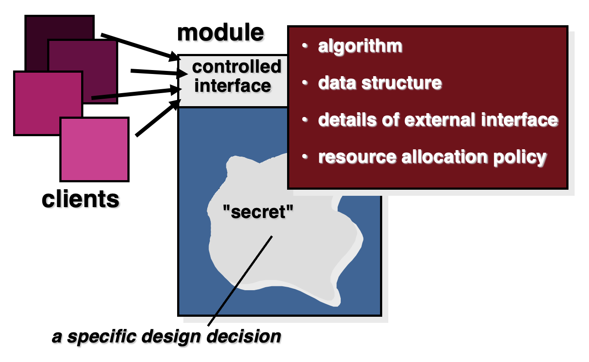
    

    
    - 降低副作用的可能性  
    - 限制局部设计决策的全局影响  
    - 强调通过受控接口进行通信  
    - 不鼓励使用全局数据  
    - 实线封装（高质量设计的一个属性）
    - 产生更高质量的软件

- **功能独立性**(functional independence)：单一职责与低耦合  
    - 通过开发具有“单一目标”功能且“厌恶”与其他模块过度交互的模块来实现的
    - **内聚**(cohesion)是衡量**模块相对功能强度**的指标：一个内聚性强的模块执行单一任务，几乎不需要与程序其他部分的组件进行交互；简言之，一个内聚模块（理想情况下）应该只做一件事
    - **耦合**(coupling)是衡量**模块之间相互依赖程度**的指标：耦合取决于模块之间的接口复杂度、进入或引用模块的节点，以及通过接口传递的数据

- **细化**(refinement)：对所有抽象进行细节的详细阐述
    - 逐步细化(stepwise refinement)  

    

        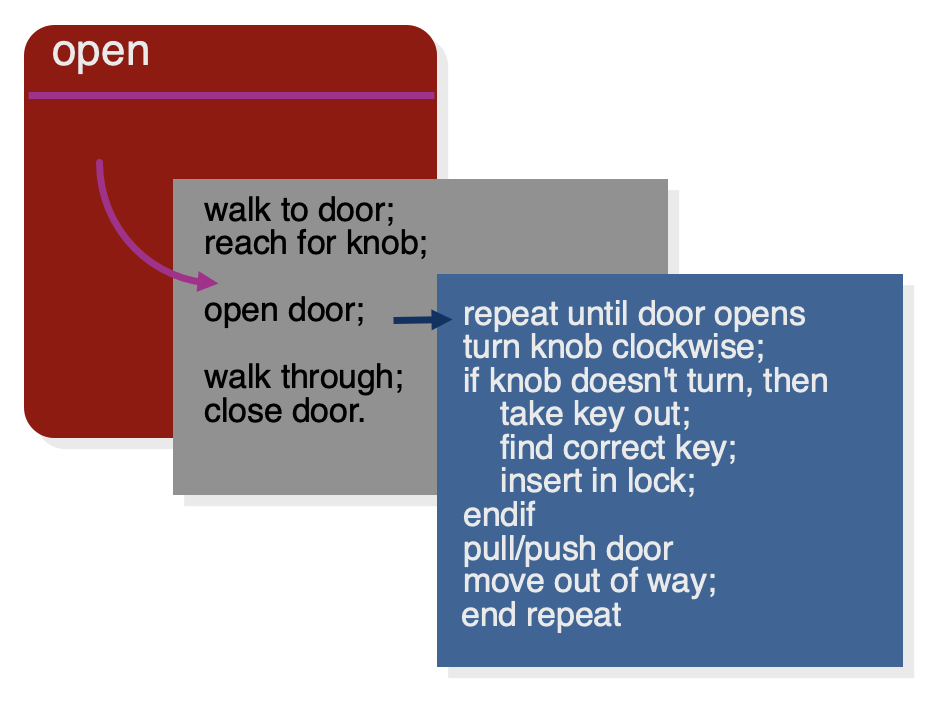
    

- **方面**(aspects)：一种理解全局需求如何影响设计的机制  
    - 在实际系统中，有些功能并不属于某一个具体模块，但又会出现在很多模块中，如果直接把这些逻辑写进各个模块，就会导致代码重复、结构混乱
    - 方面的思想就是把这类「**横切**(cross-cutting)功能」单独抽离出来，集中管理，然后在需要的地方统一应用；这样既可以减少重复代码，也能让系统结构更加清晰

- **重构**(refactoring)：一种简化设计的重组技术  
    - “一种以不改变代码（设计）外部行为、但改进其内部结构的方式修改软件系统的过程。”
    - 在软件重构时，会检查现有设计中的：
        - 冗余部分
        - 未使用的设计元素
        - 低效或不必要的算法
        - 设计不当或不合理的数据结构
        - 其他任何可通过修正以产生更好设计的设计缺陷

- **面向对象设计概念**
    - **设计类**
    - **继承**：超类的所有职责立即被子类继承  
    - **消息**：刺激接收对象发生某些行为  
    - **多态**(polymorphism)：一种极大减少设计扩展所需工作量的特性

- **设计类**(design classes)：提供设计细节，使分析类能够得以实现
    - 这三个类的具体作用在前面介绍过，这里不再赘述：
        - 实体类  
        - 边界类  
        - 控制类 

    - 特点：
        - **完整**(complete)：包含所有必要的属性和方法）且充分（只包含实现类意图所需的方法）
        - **原始性**(primitiveness)：每个类方法专注于提供一项服务
        - **高内聚**(high cohesion)：小而专注、目标单一的类
        - **低耦合**(low coupling)：类之间的协作保持最小

---
**设计模型**：

    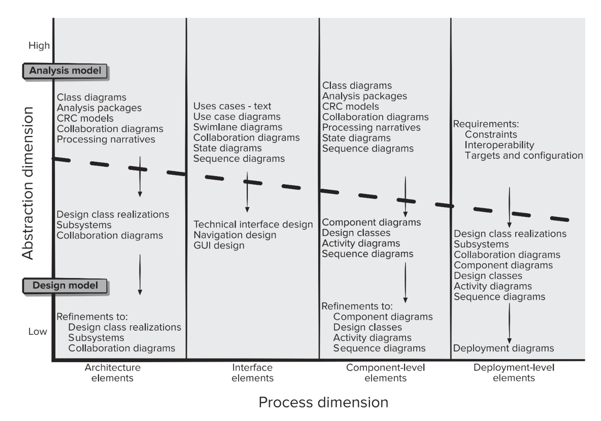

组成要素：

- **数据**元素
    - 数据模型 -> 数据结构 / 数据库架构  
    - 数据建模：
        - 独立于处理过程检查数据对象  
        - 将注意力聚焦于数据域  
        - 在**客户**抽象层面创建模型  
        - 指明数据对象之间如何相互关联

    - 数据设计

        

            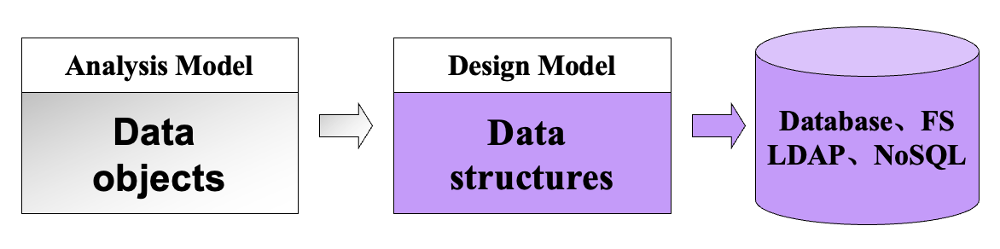
        

        - 数据结构：Entity Bean、DAO、Hibernate
        - 访问数据库：ODBC、JDBC、DS、产品工具、内存缓存
        - 数据库：涵盖不同数据库的差异

    - **数据对象**
        - 表示几乎所有必须被软件理解的**复合信息**(composite information)（具有多种不同属性或特征的事物）
        - 可以是外部实体、事物或事件，角色、组织单位、地点或结构
        - 描述包含了数据对象及其所有属性
        - 仅封装数据，内部没有对作用于数据的操作的引用
        - 数据对象之间以不同的方式相互连接，对象可以通过许多不同的方式相互关联，从而建立**关系**(relationship)

- **架构**元素  
    - 应用领域
    - 分析类、它们的关系、协作和行为转化为设计实现  
    - 模式与「风格」
    - 可用**动态模型**、**功能模型**、**结构模型**等来表示

- **接口**元素：一组操作，描述了类的外部可观察行为，并提供了对其公共操作的访问；用 UML 通信图建模；包括：
    
    

        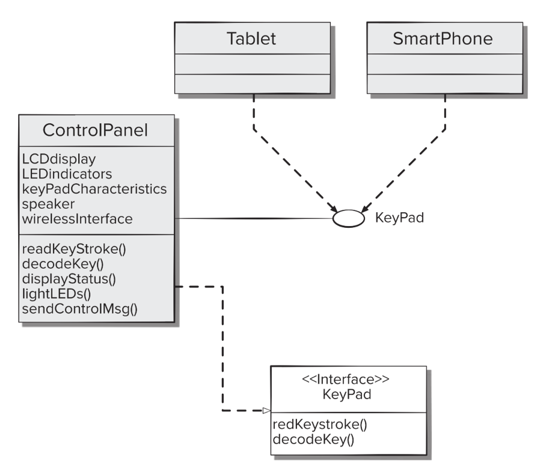
    

    - **用户界面**（UI）  
    - 与外部系统、设备、网络或其他信息生产者或消费者的**外部接口**
    - 各设计组件之间的**内部接口**

- **组件**元素：
    
    

        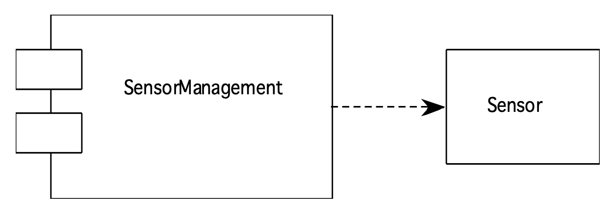
    

    
    - 描述每个软件组件的**内部细节**
    - 定义了
        - 所有本地数据对象的数据结构
        - 所有组件处理函数的算法细节
        - 允许访问所有组件操作的接口
    
    - 使用 UML 组件图、UML 活动图、伪代码（PDL）以及有时流程图进行建模

- **部署**元素
    
    

        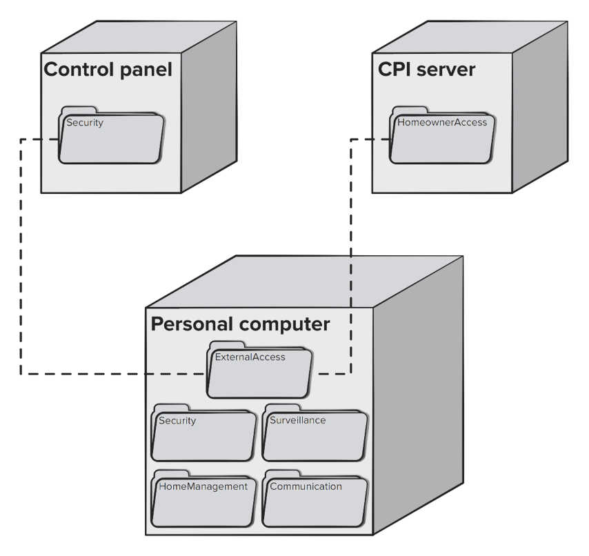
    

    
    - 指示软件功能与子系统在**物理计算环境**中的分配方式
    - 使用 UML 部署图进行建模
    - 描述符形式的部署图展示计算环境，但不指明配置细节
    - 实例形式的部署图标识具体的命名硬件配置，在设计后期阶段制定

## Architecal Design

**架构**(architecture)并非可运行软件，而是一种表现形式，使得软件工程师能够：

- 分析设计在满足既定需求方面的有效性
- 在设计变更仍相对容易的阶段考虑架构替代方案
- 降低与软件构造相关的风险

!!! note "重要性"

    - 软件架构的表示形式是**促进**所有参与基于计算机系统开发的各方（利益相关者）之间**沟通**的使能器(enabler)
    - 架构突出了**早期的设计决策**，这些决策将对后续的所有软件工程工作产生深远影响，同样重要的是，还将对系统作为运营实体的最终成功产生关键作用
    - 架构构成了一个相对较小、易于理解的系统结构及其组件如何协同工作的**模式**
    - IEEE 计算机学会提出了 **IEEE-Std-1471-2000** 标准，即《软件密集型系统架构描述推荐实践》，旨在为软件架构设计建立概念框架和词汇表，提供表示架构描述的详细指南，并鼓励良好的架构设计实践
    - **架构描述**(architecture description, **AD**)：一组用于记录架构的产品；描述本身通过多种视图表示，其中每个视图是“从一组相关（利益相关方）关注点的角度对整个系统的表示

架构**类型**(genres)：整个软件领域中的一个特定分类；在每个分类中还有一系列子类别。

架构**风格**(styles)：描述系统类别，包括：

- 一组执行系统所需功能的**组件**
- 一组使组件之间能够通信、协调和合作的**连接器**(connectors)
- 定义组件如何集成以形成系统的**约束**
- **语义模型**(semantic models)，使设计人员能够通过分析系统组成部分的已知属性来理解系统的整体属性

具体的架构类型有：

- **以数据为中心**的架构

    

        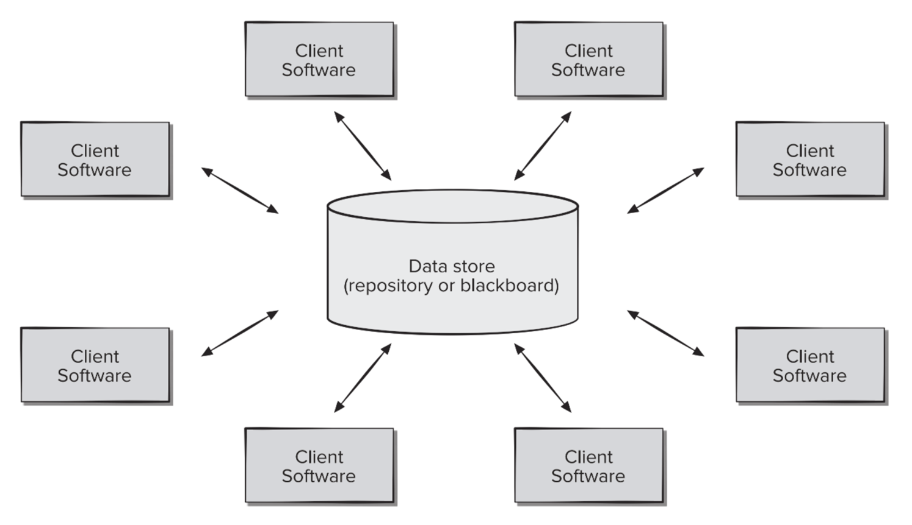
    

- **数据流**架构

    

        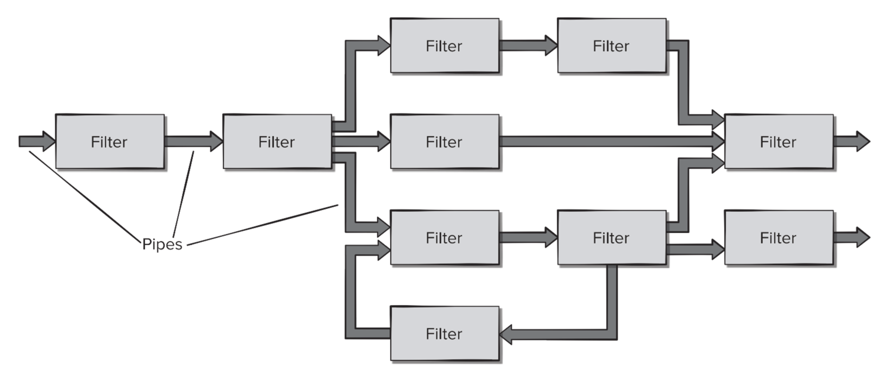
    

- **调用和返回**架构

    

        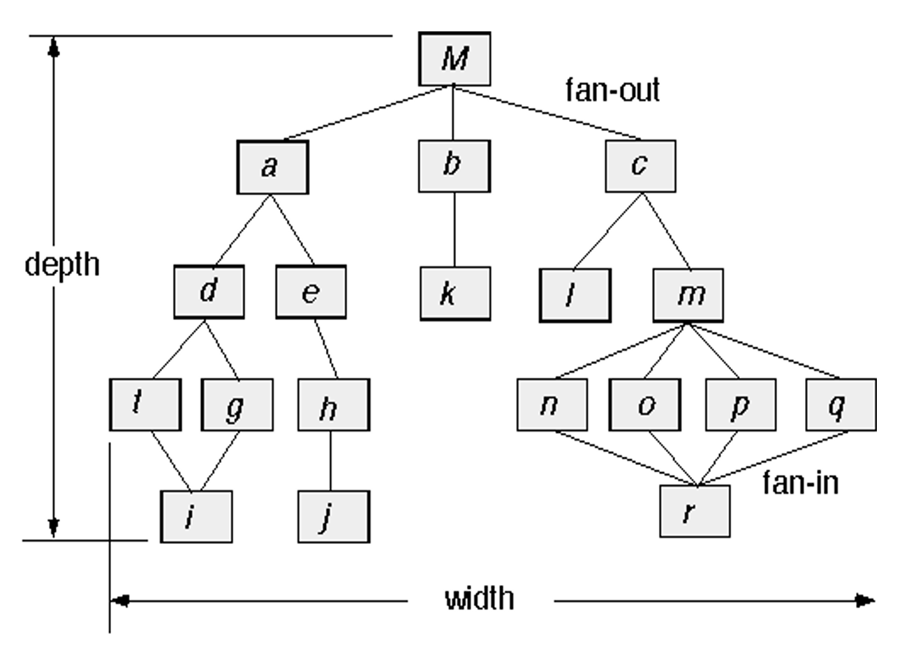
    

- **面向对象**架构

    

        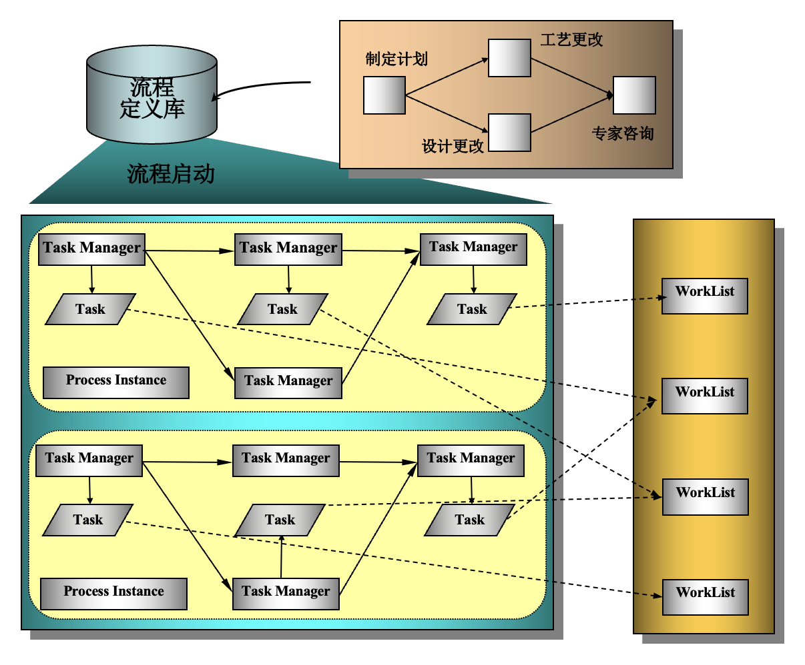
    

- **分层**架构

    

        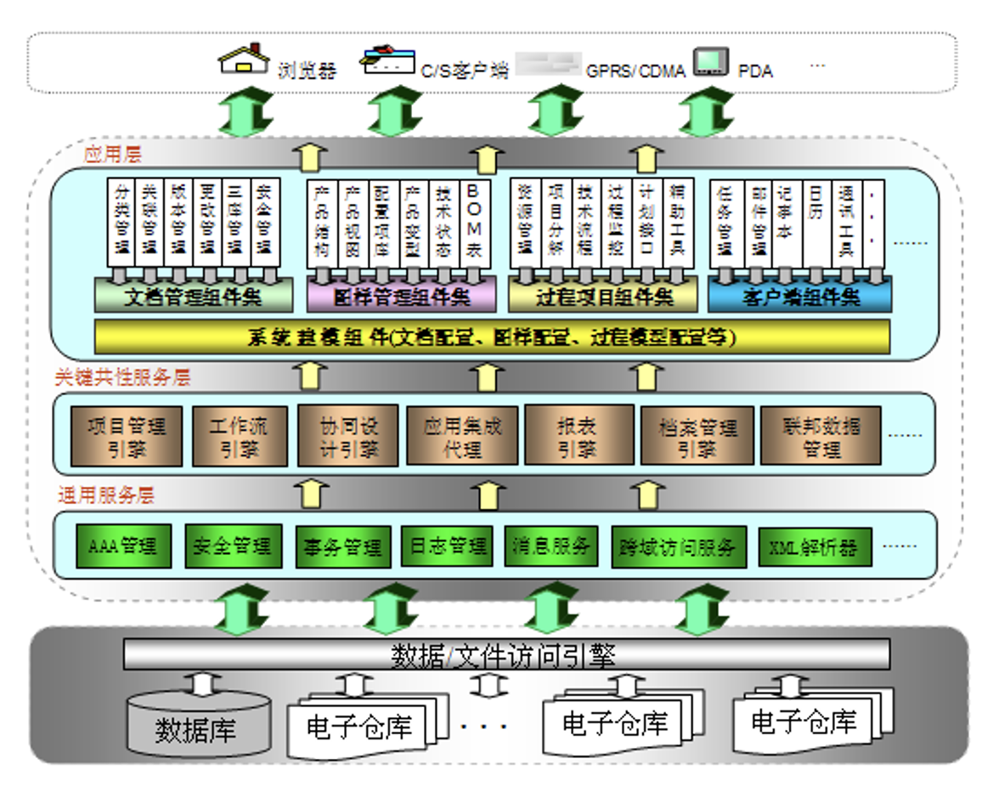
    

- **面向服务**架构

    

        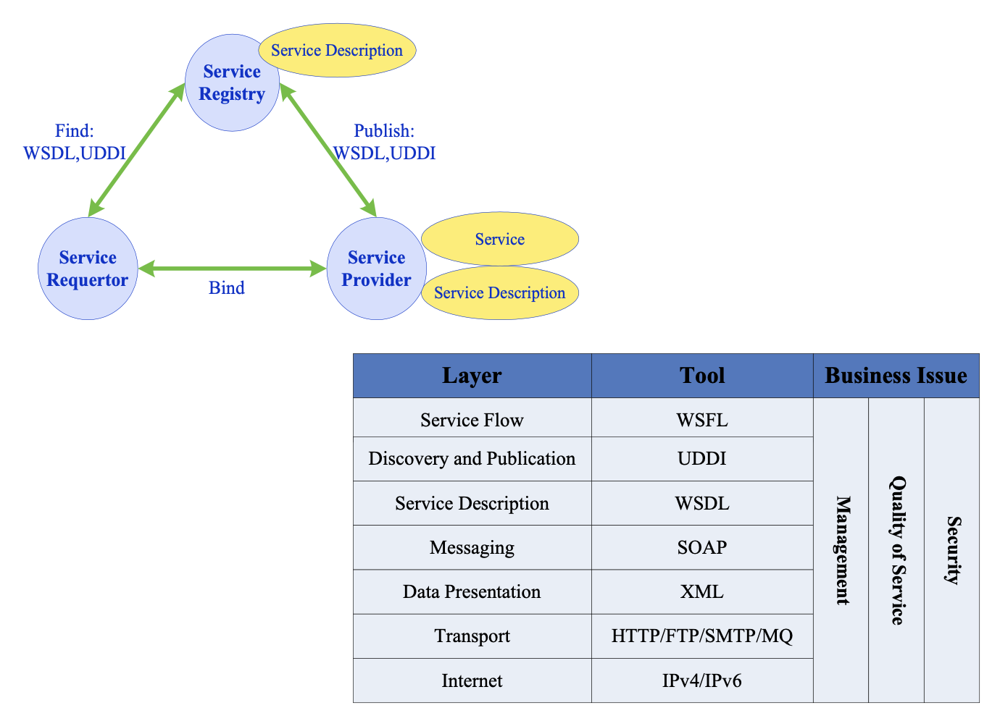
    

架构模式：

- **并发**(concurrency)：应用程序必须以一种模拟并行的方式处理多个任务
    - **操作系统进程管理**模式
    - **任务调度器**模式

- **持久化**(persistence)：如果数据在创建它的进程执行结束后依然存在，则表明其已持久化；常见的两种模式包括：
    - **数据库管理系统**（DBMS）模式，将 DBMS 的存储与检索能力应用于应用架构
    - **应用程序级持久化**模式，将持久化功能构建到应用架构中

- **分布式**(distribution)：在分布式环境中，系统或系统内部组件之间的通信方式
    - **代理**(brokers)充当客户端组件与服务器组件之间的中间人角色

架构设计：

- 软件必须置于**上下文**中考量；设计应定义与软件交互的外部实体（其他系统、设备、人员）及交互性质

    

        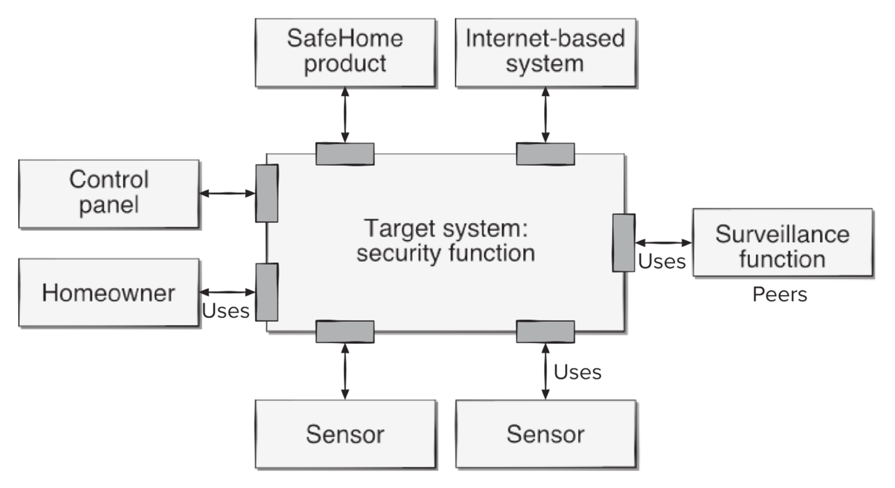
    

- 应识别出一组**架构原型**(architectural archetypes)（一种抽象（类似于类），用于表示系统行为的某一元素）

    

        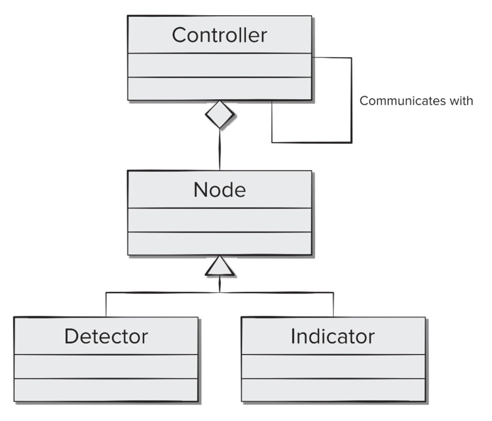
    

- 设计者通过定义和**细化**实现每个原型的软件**组件**，来明确系统的结构

    

        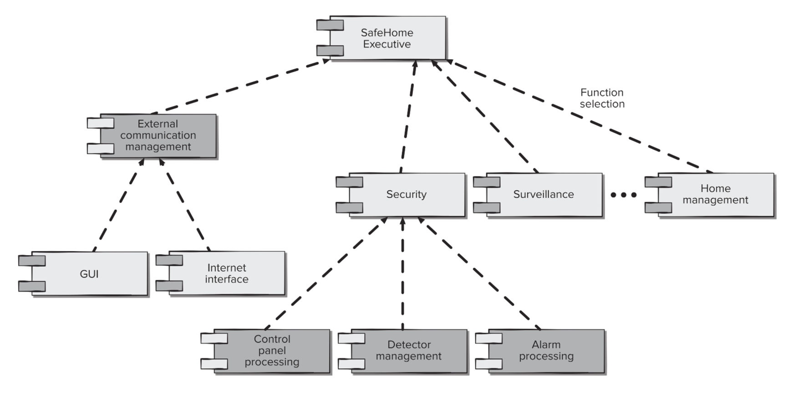
    

    细化后的：

    

        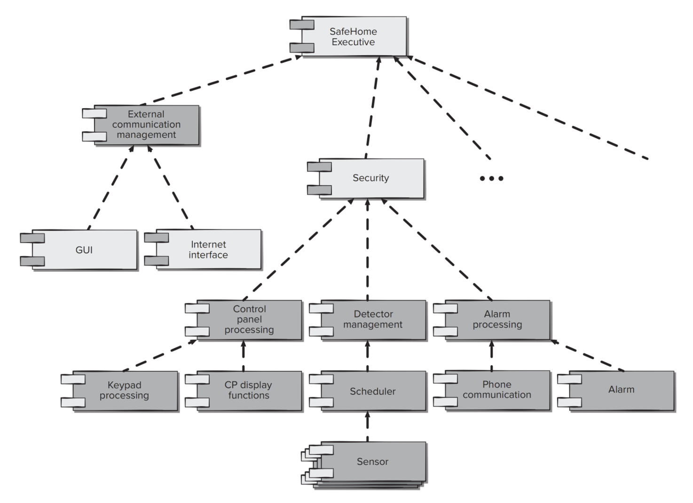
    

架构的考虑因素：

- **经济性**(economy)：最佳的软件设计应当简洁明了，依托抽象来减少不必要的细节
- **可见性**(visibility)：架构决策及其背后的原因，应当能让后来审视该模型的软件工程师一目了然
- **间隔性**(spacing)：在设计中将关注点分离，同时避免引入隐藏的依赖关系
- **对称性**(symmetry)：架构的对称性意味着系统在各项属性上保持一致与均衡
- **涌现性**(emergence)：涌现式的自组织行为与控制

架构权衡分析的步骤：

1. 收集**场景**
2. 引出**需求**、约束及环境描述
3. 描述为解决场景和需求所选择的**架构风格/模式**：
    - **模块**视图
    - **进程**视图
    - **数据流**视图

4. 通过单独考虑每个属性来**评估**质量属性
5. 识别在特定架构风格下，质量属性对各种架构属性的**敏感性**
6. 利用步骤 5 中进行的敏感性分析，**评审**步骤 3 中开发的候选架构

评估一个提议架构的整体复杂性时，需考虑架构内组件之间的**依赖关系**：

- **共享依赖**(sharing dependencies)：使用同一资源的消费者之间，或为相同消费者进行生产的生产者之间的依赖关系
- **流依赖**(flow dependencies)：资源生产者与消费者之间的依赖关系
- **约束依赖**(constrained dependencies)：对一组活动间相对控制流的约束

**架构描述语言**(architectural description language, **ADL**)为描述软件架构提供了语义和语法，使设计者能够：

- **分解**架构组件
- 将单个组件**组合**成更大的架构块
- 表示组件之间的接口（**连接**机制）

架构评审：

- 评估软件架构满足系统**质量需求**的能力，并识别潜在**风险**
- 通过早期发现设计问题，有潜力降低项目**成本**
- 通常利用基于经验的评审、原型评估、场景评审和检查清单

基于模式的架构评审：

- 通过遍历用例来识别并讨论**质量属性**
- 讨论系统架构图与其**需求**的关系
- 识别所使用的架构**模式**，并将系统的结构与模式的结构进行匹配
- 利用现有文档和用例来确定**每种模式**对质量属性的**影响**
- 识别设计中所使用的架构模式引发的所有质量问题
- 总结会议中发现的各项问题，并对行走骨架(walking skeleton)进行修订

敏捷与架构的关系：

- 为避免返工，在编码前使用**用户故事**来创建并演进架构模型（行走骨架）
- **混合模型**使得软件架构师向演进中的故事板贡献用户故事
- 运行良好的敏捷项目包括在每个冲刺期间交付工作产品
- 审查冲刺中产生的代码可以成为架构评审的一种有效形式

## Component-Level Design

OMG 统一建模语言规范将**组件**(component)定义为：系统的**模块化**、**可部署**且**可替换**(replaceable)的部分，它封装了实现并暴露一组接口。

- 面向对象观点：一个组件包含**一组协作的类**

    

        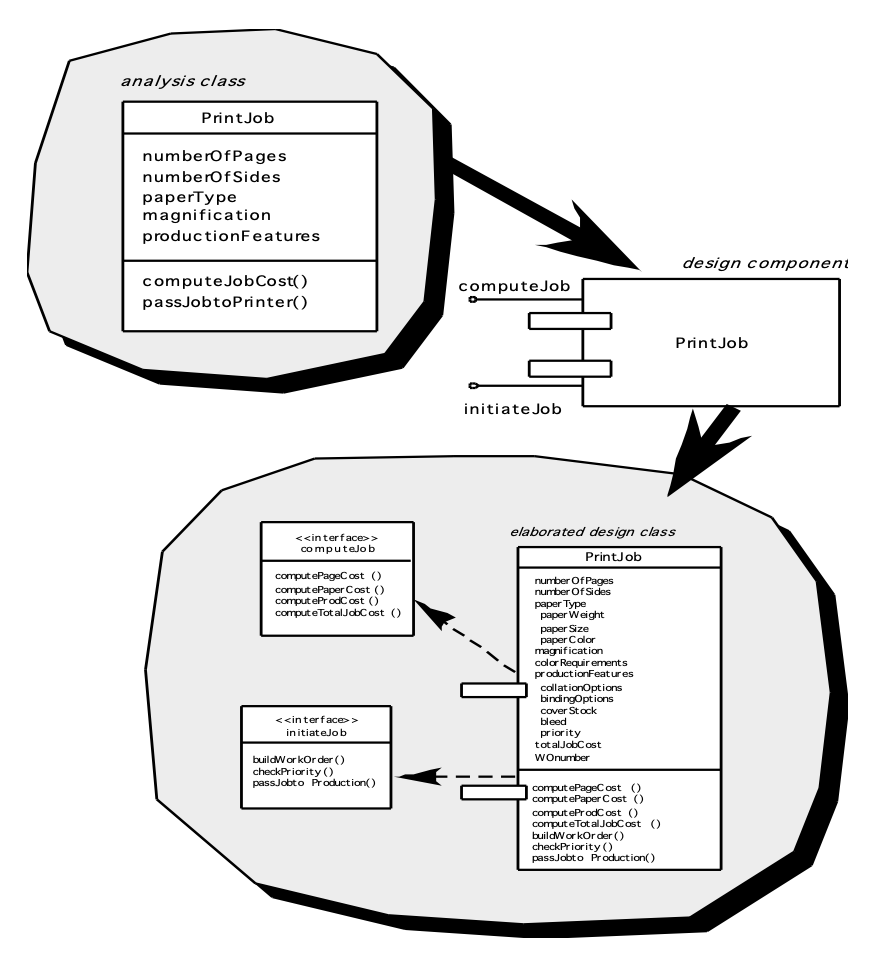
    

- 传统观点：一个组件包含处理逻辑、实现处理逻辑所需的内部**数据结构**，以及使组件能够被调用并将数据传递到其中的**接口**

    

        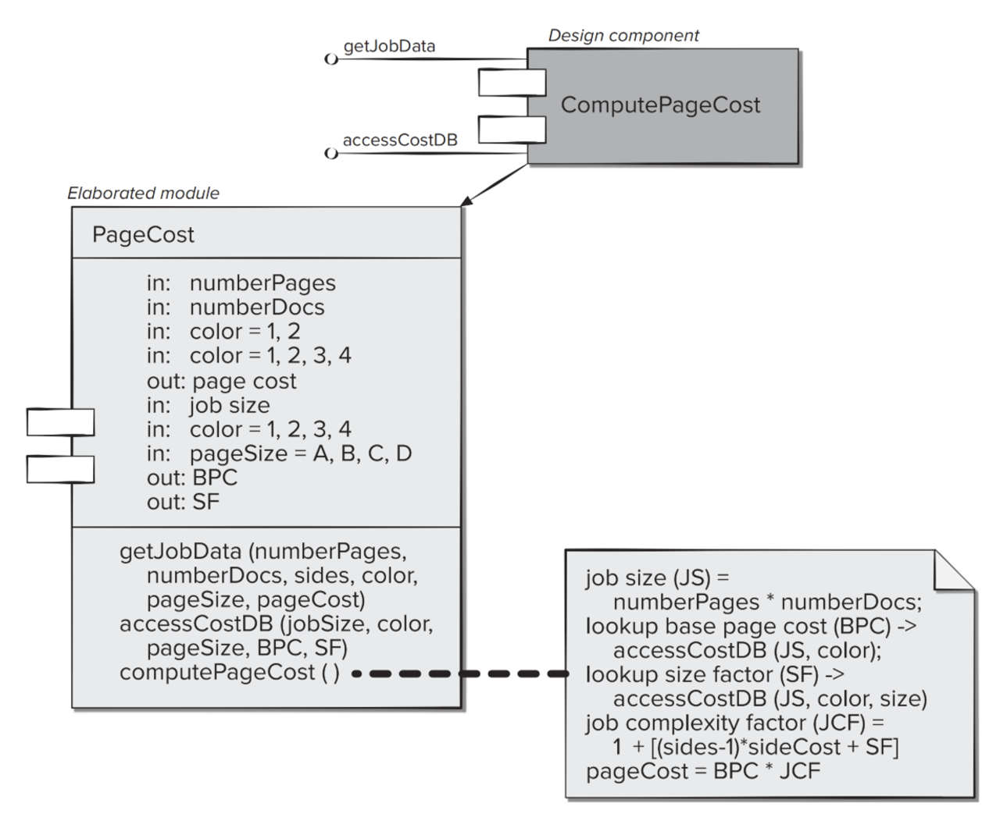
    

最佳设计原则：

- **开闭原则**(The Open-Closed Principle, OCP)：模块（组件）应对扩展开放，对修改关闭
- **里氏替换原则**(The Liskov Substitution Principle, LSP)：子类应当能够替换其基类
- **依赖倒置原则**(Dependency Inversion Principle, DIP)：依赖抽象，而不要依赖具体实现
- **接口隔离原则**(The Interface Segregation Principle, ISP)：多个面向特定客户端的接口优于一个通用接口
- **发布复用等价原则**(The Release Reuse Equivalency Principle, REP)：复用的粒度应当等同于发布的粒度
- **共同封闭原则**(The Common Closure Principle, CCP)：一起变化的类应当组织在一起
- **共同复用原则**(The Common Reuse Principle, CRP)：不会被一起复用的类不应当组织在一起

设计指南：

- **组件**：应建立命名约定，并在组件级模型中进一步细化和完善。 
- **接口**：提供关于通信与协作的重要信息（同时也有助于实现OPC）
- **依赖**与**继承**：建议从左到右建模依赖关系，从下（派生类）到上（基类）建模继承关系

**内聚**(cohesion)：

- 传统观点：模块的单一专注性(single-mindedness)
- 面向对象观点：内聚意味着一个组件或类仅封装了彼此紧密相关且与自身密切相关的属性和操作
- 内聚级别：  
    - **功能**(functional)内聚  
    - **层**(layer)内聚  
    - **通信**(communicational)内聚  
    - **顺序**(sequential)内聚  
    - **过程**(procedural)内聚  
    - **时间**(temporal)内聚  
    - **实用**(utility)内聚

**耦合**(coupling)：

- 传统观点：一个组件与其他组件及外部世界的连接程度
- 面向对象观点：对类之间相互连接程度的定性度量
- 耦合程度
    - **内容**耦合
    - **公共**耦合
    - **控制**耦合
    - **标记**(stamp)耦合
    - **数据**耦合
    - **例程调用**耦合
    - **类型使用**耦合
    - **包含或导入**耦合
    - **外部**耦合

组件级设计的步骤：

1. 确定所有与**问题域**对应的设计类
2. 确定所有与**基础设施域**(infrastructure domain)对应的设计类
3. **详细阐述**所有未作为可复用组件获取的设计类
    1. 当类或组件协作时，指定**消息**详情
    2. 为每个组件确定合适的**接口**
    3. 详细说明**属性**，并定义实现这些属性所需的**数据类型**和**数据结构**
    4. 详细描述每个操作中的处理**流程**

4. 描述**持久化数据源**(persistent data source)（数据库和文件），并确定管理这些数据源所需的类
5. 为类或组件开发并详细说明**行为表示**(behavioral representations)
6. 详细说明**部署**图以提供额外的实现细节
7. 评估每个组件级设计**表示**，并始终考虑替代方案

---

WebApp 组件是指：

- 一个定义明确的内聚功能，用于为终端用户操纵**内容**或提供**计算/数据处理服务**，或
- 一个**内容与功能**的内聚包，为终端用户提供某种所需能力

因此，针对 WebApp 的组件级设计通常融合了**内容设计**与**功能设计**的要素。

- 内容设计：专注于内容对象及其打包方式，以便向 WebApp 终端用户展示
- 功能设计：
    - 现代 WebApp 提供了日益复杂的处理功能，包括：
        - 执行本地化处理，以动态方式生成内容和导航能力
        - 提供适合Web应用业务领域的计算或数据处理能力
        - 提供复杂的数据库查询和访问功能
        - 与外部企业系统建立数据接口

    - 因此 WebApp 功能组件在形式上与常规软件的软件组件完全相同
    
    - 基于 Web 的轻量级客户端  
        - 设备上仅包含接口层  
        - 业务层和数据层通过 Web 或云服务实现  

    - 富客户端  
        - 设备上实现所有三层（接口、业务、数据）  
        - 但受移动设备限制

---
传统组件设计：

- **处理逻辑**的设计受**算法设计和结构化编程**的基本原则所支配  
- **数据结构**的设计由为系统开发的**数据模型**定义
- **接口**的设计受组件必须实现的**协作**所支配

基于组件的开发：

- 当面临复用的可能性时，软件团队会问：
    - 是否有**商业**现货(commercial off-the-shelf, **COTS**)组件可实现该需求？
    - 是否有**内部**开发的可复用组件可实现该需求？
    - 可用组件的接口是否与所构建系统的架构**兼容**？

- 阻碍复用的因素(impediments)：
    - 极少有公司和组织拥有哪怕勉强算得上全面的**软件可复用性计划**
    - 尽管目前越来越多的软件供应商在销售能直接协助软件复用的工具或组件，但**大多数软件开发人员并未使用它们**
    - 能够帮助软件工程师和管理人员理解和应用复用的**培训相对较少**
    - 许多软件从业者仍然认为，复用**得不偿失**
    - 许多公司继续鼓励那些不利于复用的软件开发**方法论**
    - 很少有公司为开发可复用程序组件提供**激励**措施

识别可复用组件：

- 未来的实现是否需要组件功能？
- 该组件的功能在领域内有多常见？
- 该组件的功能在领域内是否存在重复？
- 该组件是否依赖于硬件？
- 不同实现之间的硬件是否保持不变？
- 能否将硬件细节移交给另一个组件？
- 当前设计是否足够优化，以满足下一次实现？
- 能否将一个不可复用的组件参数化，使其变得可复用？
- 该组件是否只需微小改动即可在多种实现中复用？
- 通过修改实现复用是否可行？
- 能否将一个不可复用的组件分解，以得到可复用的组件？
- 组件分解以用于复用的有效程度如何？

CBSE（基于组件的软件工程）

- 必须提供一个**组件库**
- 组件应具有**一致的结构**
- **标准**：
    - OMG/CORBA
    - Microsoft COM
    - Sun JavaBeans

CBSE 过程：

    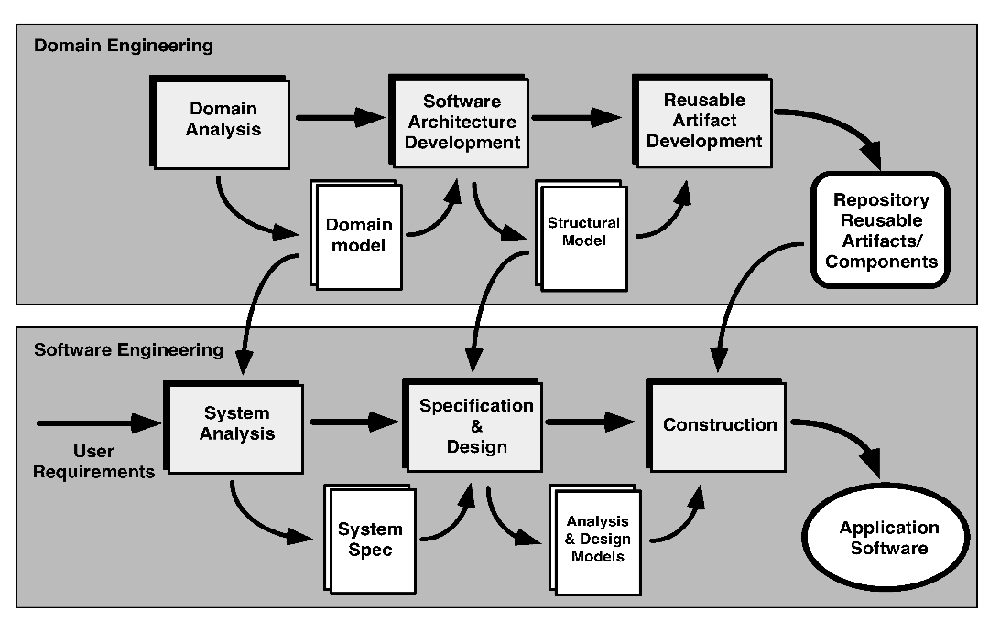

**领域工程**(domain engineering)的步骤：

1. 定义要调查的**领域**
2. 对从该领域中提取的项目进行**分类**
3. 收集该领域内具有代表性的应用样本
4. 分析样本中的每个应用
5. 为这些对象开发一个**分析模型**

CBSE 活动：

- **组件筛选**(qualification)：评估维度包括
    - 应用程序接口（**API**）
    - **组件所需的开发与集成工具**
    - **运行时需求**：资源使用（如内存或存储）、时序或速度以及网络协议
    - **服务需求**：操作系统接口及其他组件的支持
    - **安全**特性：访问控制及认证协议
    - 内嵌的设计假设：使用特定的数值或非数值算法
    - **异常处理**

- **组件适配**(adaptation)
    - 已为库中所有组件实施了**一致的**资源管理**方法**
    - 所有组件均存在**共同的活动**，如数据管理
    - 架构内部及与外部环境的接口已以一致的方式实现

- **组件组合**(composition)
    - 必须建立一个基础设施来将各个组件绑定在一起
    - 组合的架构要素包括：
        - 数据交换模型(data exchange model)
        - 自动化(automation)
        - 结构化存储(structured storage)
        - 底层对象模型(underlying object model)

- **组件更新**(update)

分类：

- **枚举分类**(enumerated classification)：通过定义层级结构来描述组件，该结构中定义了软件组件的类别及不同级别的子类别
- **分面分类**(faceted classification)：分析某一领域，识别出一组基本的描述性特征
- **属性-值分类**(attribute-value classification)：为某一领域中的所有组件定义一组属性

复用环境：

- 能够存储软件组件及其检索所需的分类信息的**组件数据库**
- 提供数据库访问权限的**库管理系统**
- 软件组件**检索系统**（例如对象请求代理），使客户端应用程序能够从库服务器检索组件和服务
    - 库查询通常使用3C模型中的概念(concept)、内容(content)和上下文(context)要素来描述

- 支持将复用组件集成到新设计或实现中的 **CBSE 工具**

## User Interface Design

典型的 UI 设计错误

- 缺乏一致性
- 过多记忆要求(memorization)
- 无指导/帮助
- 缺乏上下文敏感性
- 响应不佳
- 晦涩(arcane)/不友好

黄金准则：

- **将用户置于控制中**(place the user in control)
    - 以不强迫用户执行不必要或非期望操作的方式来定义交互模式
    - 提供**灵活**的交互方式
    - 允许用户交互**可中断**(interruptible)且**可撤销**(undoable)
    - 随着技能水平提高而简化交互，并允许**自定义**交互
    - 对普通用户**隐藏技术内部细节**
    - 设计为与屏幕上出现的对象**直接交互**

- **减少用户的记忆负担**(reduce the user’s memory load)
    - 减少对短期记忆的依赖
    - 建立有意义的**默认值**
    - 定义直观的**快捷方式**(shortcuts)
    - 界面的视觉布局应基于现实世界的隐喻
    - 以**渐进**的(progressive)方式披露信息

- **使界面保持一致**(make the interface consistent)
    - 允许用户将当前任务置于有意义的上下文中
    - 保持一系列应用程序之间的一致性
    - 如果过去的交互模式已经建立了用户期望，除非有充分的理由，否则不要做出改变

UI 设计模型：

- **用户模型**：系统所有终端用户的概况  
- **设计模型**：用户模型的设计实现  
- **心理模型**(mental model)（**系统感知**(system perceptioin)）：用户对界面形态的心理意象  
- **实现模型**：界面的外观和感觉，以及描述界面语法和语义的支持信息

UI 设计过程：

    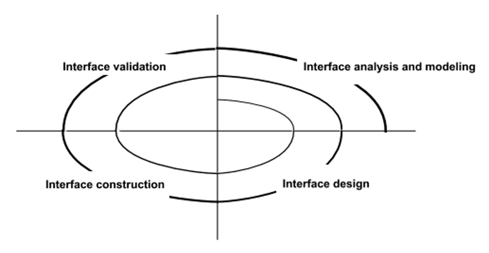

界面分析：

- 通过界面与系统交互的**人员**（**终端用户**(end-user)）
- 终端用户为完成工作必须执行的**任务**
- 作为界面一部分所呈现的**内容**
- 执行这些任务的**环境**

用户分析：

- 用户是经过培训的专业人员、技术人员、办公人员还是制造工人？
- 普通用户具备什么级别的正规教育水平？
- 用户能够通过书面材料自学，还是表达过希望参加课堂培训？
- 用户是键盘输入高手还是对键盘有恐惧感？
- 用户群体的年龄范围是多少？
- 用户是否以某一性别为主？
- 用户如何获得工作报酬？
- 用户按正常办公时间工作，还是直到任务完成为止？
- 该软件将成为用户工作的核心组成部分，还是仅偶尔使用？
- 用户的主要口语是什么？
- 如果用户在使用系统时出错，后果是什么？
- 用户是否是系统所涉及主题领域的专家？
- 用户是否想了解界面背后的技术？

任务分析与建模：

- 回答以下问题：
    - 用户在特定**情况**下将执行哪些工作？
    - 在用户执行工作时，将完成哪些**任务**和子任务？
    - 在工作执行过程中，用户将操作哪些具体问题域**对象**？
    - 工作任务的顺序是什么，即**工作流**？
    - 任务的**层级结构**如何？

- **用例**定义基本交互
- **任务细化**完善交互任务
- **对象细化**识别界面对象（类）
- **工作流分析**则定义当多人（及多角色）参与时，工作过程如何完成
- 可借助**泳道图**完成：

    

        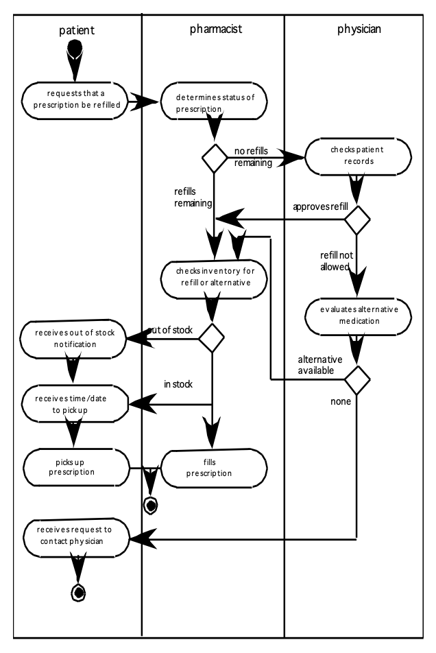
    

显示内容分析：

- 不同类型的数据是否被分配到屏幕上一致的**地理位置**（例如，照片总是出现在右上角）？
- 用户是否可以**自定义**内容的屏幕位置？
- 是否为所有内容分配了适当的屏幕**标识**？
- 如果要展示一份**大型报告**，应如何对其进行分区以便于理解？
- 是否有机制可供直接跳转到大数据集合的摘要信息？
- **图形输出**是否会**缩放**以适应所用**显示设备**的边界？
- 如何使用**颜色**来增强理解？
- **错误**消息和警告将如何呈现给用户？

界面设计步骤：

1. 利用界面分析过程中所形成的信息，**定义界面对象与动作**（**操作**）
2. **定义**会导致用户界面状态发生变化的**事件**（即**用户动作**）。对这种行为进行建模
3. 将每种**界面状态**以终端用户实际看到的样子**呈现**出来
4. 说明用户如何通过界面提供的信息来**解读系统的当前状态**

设计问题：

- 响应时间
- 帮助设施
- 错误处理
- 菜单和命令标签
- 应用可访问性
- 国际化(internationalization)

---
Web 和移动应用界面设计

- 界面应指明所访问的 Web 应用，并告知用户在内容层次结构中的**当前位置**
- 界面应始终帮助用户了解当前可用的**选项**：哪些功能可用？哪些链接处于活动状态？哪些内容相关？  
- 界面必须**便于导航**：提供一张**地图**（以易于理解的方式实现），展示用户已访问过的位置，以及在 Web 应用内可移动至其他位置的可能路径

高效的 Web 和移动应用界面：

- 有效的界面**在视觉上直观且宽容**，让用户感受到掌控感：用户能迅速看清所有选项，明白如何达成目标，并顺利开展操作
- 有效的界面**不会让用户操心系统的内部运作机制**：工作会被仔细且持续地保存，同时用户随时可以撤销任何操作
- 高效的应用和服务应**在最大程度上完成工作**，同时从用户处获取最少的信息

界面设计原则：

- **聚焦**：WebApp 界面（及其呈现的内容）应始终聚焦于用户当前的任务
- **菲茨定律**(Fitt's Law)：获取目标所需的时间是目标距离和大小的函数
- **人机界面对象**：WebApp 已开发出大量可复用的人机界面对象
- **减少延迟**(latency reduction)：WebApp 应通过多任务处理方式，让用户感觉操作已完成并可继续工作
- **易学性**(learnability)：WebApp 界面的设计应尽量减少学习时间，且一旦学会，再次访问时需重新学习的时间也应尽可能短
- **保持工作产品完整性**(maintain work product integrity)：工作产品（例如用户填写的表格、用户指定的列表）必须自动保存，以便在发生错误时不会丢失
- **可读性**(readability)：通过界面呈现的所有信息应能让年轻人和老年人都能轻松阅读
- **跟踪状态**(track state)：在适当的情况下，应跟踪并存储用户交互的状态，以便用户可以退出并在稍后返回时从上次离开的地方继续操作
- **可见的导航**(visible navigation)：设计良好的 WebApp 界面应提供“让用户感觉处于同一位置，工作内容被带到他们面前的错觉”

界面设计工作流：

- **审查**分析模型中的信息，并根据需要进行细化
- 绘制 Web 或移动应用界面**布局**的粗略草图
- 将用户目标映射到具体的界面**操作**中
- 定义与每个操作相关的一组用户**任务**
- 为每个界面操作绘制界面屏幕**故事板**(storyboard)
- 利用美学设计的输入来**完善**界面布局和故事板
- 识别实现界面所需的用户界面对象
- 开发用户与界面交互的程序性表示
- 开发界面的行为表示
- 描述每个状态的界面布局
- 完善并审查界面设计模型

审美设计：

- 不要害怕留白
- 强调内容
- 将布局元素按左上到右下的顺序组织
- 在页面内将导航、内容和功能按区域分组
- 不要用滚动条拓展你的页面空间
- 设计布局时要考虑分辨率和浏览器窗口大小

设计评估循环：

    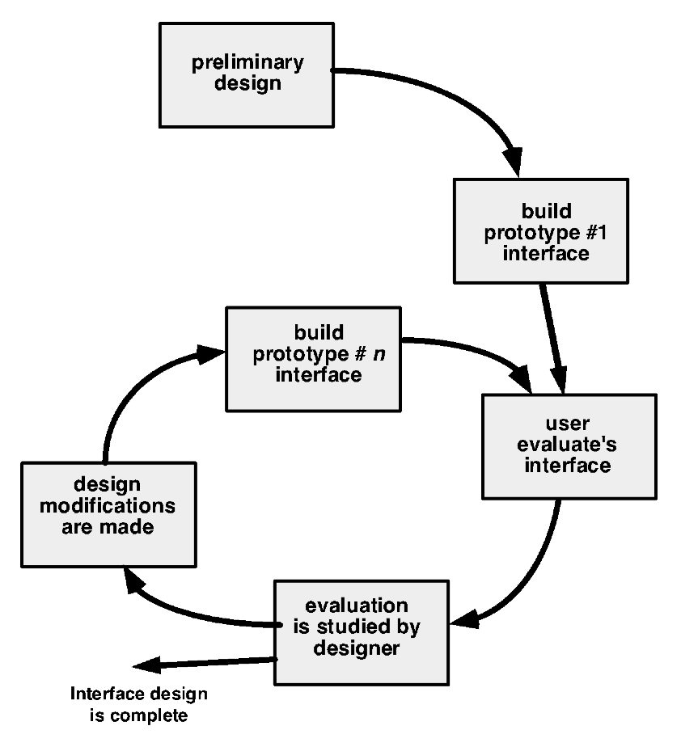

## Pattern-Based Design

**设计模式**(design pattern)是一种用于描述问题及其解决方案的编录(codified)方法，它使软件工程社区能够以可重复使用的方式捕获设计知识。它由**上下文**(context)、**问题**(problem)和**解决方案**(solution)三部分构成。

- 上下文：使读者能够理解问题所在的环境，以及在该环境中何种解决方案可能合适
- 一个**作用力系统**(system of forces)：一系列需求，包括限制和约束，影响着问题在其上下文中如何被解读以及解决方案如何被有效应用

有效设计模式的特征：

- 解决了一个问题，而不仅仅是抽象的原则或策略
- 一个经过验证的概念，而非理论或猜测
- 解决方案并非显而易见，而是间接地生成问题的解法（这是设计中最困难问题所必需的方式）
- 它描述了一种关系，不单单描述模块，而是描述更深层的系统结构与机制
- 该模式具有重要的人为因素（将人工干预降至最低），并明确诉诸美学与实用性

**生成模式**(generative pattern)的种类：

- **架构模式**：描述了使用结构性方法解决的广泛设计问题，解决诸如**并发**、**持久性**和**分布**等问题
- **数据模式**：描述了反复出现的数据相关问题以及可用于解决这些问题的数据建模解决方案
- **组件模式**（也称为**设计模式**）：解决了与子系统和组件开发、它们之间的通信方式以及它们在更大架构中的放置相关的问题
    - 提供了一种经过验证的解决方案，用于解决从需求模型中提取的一个或多个子问题
    - 在许多情况下，这类设计模式专注于系统的**某个功能元素**

- **界面设计模式**：描述了常见的用户界面问题及其解决方案，其中包含终端用户的具体特征所形成的系统作用力
    - **整体 UI**：为整个界面的顶层结构和导航提供设计指导
    - **页面布局**：解决页面（针对网站）或不同屏幕显示（针对交互式应用）的通用组织方式
    - **表单与输入**：考虑完成表单级别输入的各种设计技巧
    - **表格**：为创建和操作各类表格数据提供设计指导
    - **直接数据操作**：处理数据的编辑、修改和转换
    - **导航**：帮助用户浏览层级菜单、网页和交互式显示屏幕
    - **搜索**：通过网站维护的信息或通过交互式应用可访问的持久化数据存储，实现针对特定内容的搜索
    - **页面元素**：实现网页或显示屏幕中的特定元素
    - **电子商务**：针对网站，这些模式实现电子商务应用中的常见元素

- **WebApp 模式**：解决了在构建 WebApp 时遇到的一组问题，并且通常整合了刚才提到的许多其他模式类别
    - **信息架构**(information architecture)模式：涉及信息空间的整体结构，以及用户与信息互动的方式
    - **导航**模式：定义了导航链接结构，例如层级、环形、导览等
    - **交互**模式：有助于用户界面的设计。这类模式涉及界面如何告知用户特定操作的后果；用户如何根据使用场景和需求扩展内容；如何最好地描述链接所隐含的目标；如何向用户告知正在进行的交互状态，以及与界面相关的问题
    - **呈现**(presentation)模式：有助于通过界面呈现内容给用户。这类模式涉及如何组织用户界面控制功能以提升可用性；如何展示界面操作与其影响的内容对象之间的关系，以及如何建立有效的内容层级
    - **功能**模式：定义了 WebApp 中的工作流程、行为、处理、通信及其他算法元素

另一种模式分类：

- **创建型模式**(creational patterns)：关注对象的创建、组合和表示
    - **抽象工厂模式**(abstract factory pattern)：集中决定实例化哪个工厂
    - **工厂方法模式**(factory method pattern)：集中创建特定类型的对象，从多个实现中选择其一

- **结构型模式**(structured patterns)：关注如何组织和整合类与对象以构建更大结构的相关问题与解决方案
    - **适配器模式**(adapter pattern)：将一个类的接口适配成客户端期望的接口
    - **聚合模式**(aggregate pattern)：组合模式的一种变体，包含聚合子节点的方法

- **行为型模式**(behavioral patterns)：处理对象间职责分配以及对象间通信方式的相关问题
    - **责任链模式**(chain of responsibility pattern)：命令对象由包含逻辑的处理对象处理或传递给其他对象
    - **命令模式**(command pattern)：命令对象封装一个动作及其参数

**框架**(framework)的特点：

- 一种针对设计工作的**特定实现骨架基础设施**(implementation-specific skeletal infrastructure)
- 一个**可复用的迷你架构**(reusable mini-architecture)，为一系列软件抽象提供通用结构和行为，同时附带一个上下文，该上下文规定了它们在特定领域内的协作与使用
- 并非架构模式，而是一个包含一组「**插入点**」(plug points)（也称为钩子(hooks)和插槽(slots)）的**骨架**(skeleton)，使其能够适应特定问题领域；这些插入点将问题特定的类或功能集成到骨架中

描述模式：模式名称、问题、动机、上下文、作用力、解决方案、意图、协作、后果、实现、已知适用、相关模式。

**模式语言**(pattern language)：一组经过整理和组织的设计模式的集合，用于解决某一领域中的常见问题。它不仅包含单个模式，还强调多个模式之间的有机联系。

模式与设计任务：

1. 确保理解**整体情况**(big picture)，即待构建软件所处的上下文环境；**需求模型**应能传达这一点
2. 审视整体情况，**提取**该抽象层次中存在的**模式**
3. 从建立上下文框架或骨架的整体情况模式开始设计，为后续设计工作奠定基础
4. 从上下文向内推进，寻找较低抽象层次中能贡献于设计解决方案的模式
5. 重复步骤 1 至 4，直至完成整个设计的细化充实
6. 通过调整每个模式以适应待构建软件的具体特性，对设计进行精炼

**模式组织表**(pattern organizing table)：

    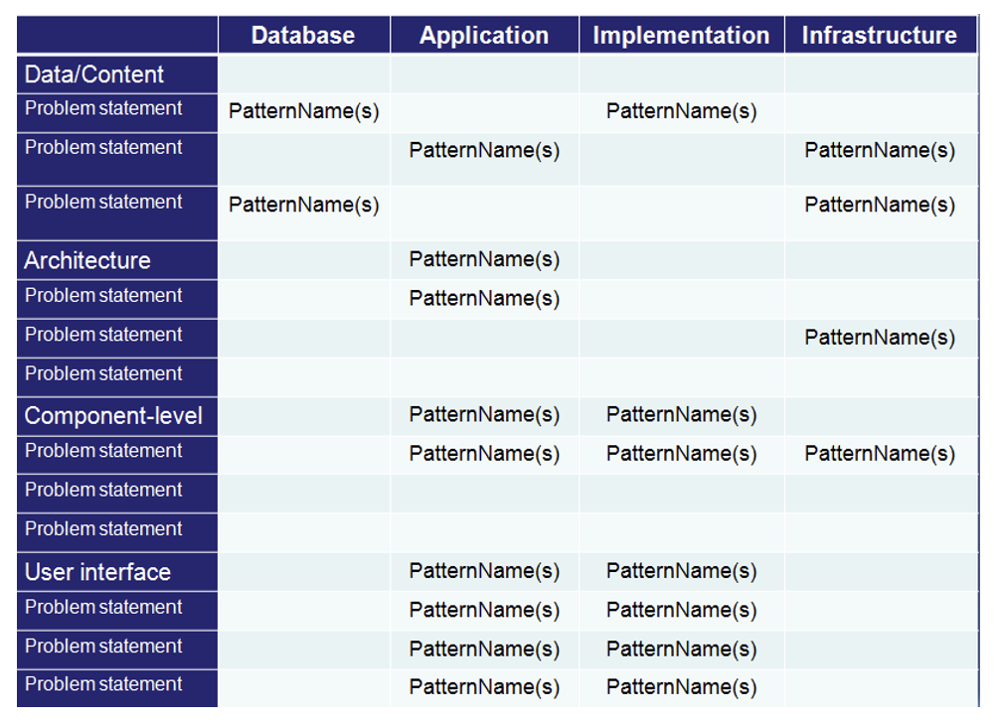

常见设计错误：

- 没有花足够的时间去理解根本问题、其背景和影响因素，结果选择了看似正确却并不适合所需解决方案的模式
- 选错模式后拒绝承认错误，并强行套用该模式
- 问题中存在你所选模式未考虑的因素，导致匹配效果不佳甚至错误
- 有时模式被过于僵化地应用，而未能根据问题空间进行必要的调整

用于移动 Apps 的模式：

- 界面模式：
    - 活动对象
    - 应用程序控制器  
    - 通信器(communicator)
    - 数据传输对象(data transfer object)
    - 领域模型  
    - 实体转换器(entity translator)
    - 延迟获取(lazy acquisition)
    - 模型-视图-控制器(MVC)
    - 分页(pagination)
    - 可靠会话
    - 同步
    - 事务脚本

## WebApp Design

设计与 WebApp 质量：

- **安全性**(security)：抵御外部攻击，阻止未经授权的访问，确保用户/客户的隐私  
- **可用性**(availability)：衡量WebApp可供使用的时间百分比的指标  
- **可扩展性**(scalability)：WebApp及其接口系统能否应对用户或交易量的显著变化  
- **上线时间**(time to market)

面向终端用户的质量维度：

- **时间**
    - 自上次升级以来，网站发生了多大的变化？
    - 如何突出显示已更改的部分？

- **结构**
    - 网站的各个部分之间衔接得如何？
    - 网站内外的所有链接是否都正常工作？
    - 所有图片是否都能正常显示？
    - 是否存在未连接的网站部分？

- **内容**
    - 关键页面的内容是否与预期相符？
    - 在高度可变的页面中，关键短语是否持续存在？
    - 关键页面是否从版本到版本保持了高质量的内容？
    - 动态生成的 HTML 页面又如何？

- **准确性与一致性**
    - 今日下载的页面副本是否与昨日相同？是否足够接近？
    - 呈现的数据是否足够准确？您如何得知？

- **响应时间与延迟**
    - 网站服务器是否在特定参数范围内响应浏览器请求？
    - 在电子商务环境中，提交操作后的端到端响应时间如何？
    - 网站是否有部分页面加载过慢，导致用户不愿继续操作？

- **性能**
    - 浏览器-网站-浏览器之间的连接速度是否足够快？
    - 性能随时间（如一天中的不同时段）及负载和使用情况如何变化？
    - 性能是否足以支撑电子商务应用？

WebApp 的设计目标：

- **一致性**(consistency)
    - **内容**应保持构建的一致性
    - **图形设计**（**美学**(aesthetics)）应在Web应用的所有部分呈现一致的外观
    - **架构设计**应建立模板，以形成一致的超媒体结构
    - **界面设计**应定义一致的交互、导航和内容显示模式
    - **导航机制**应在所有 WebApp 元素中一致使用

- **身份**(identity)：建立适合业务目的的身份 
- **稳健性**(robustness)：用户期望稳健的内容和功能，能够满足其需求  
- **可导航性**(navigability)：以直观且可预测的方式进行设计  
- **视觉吸引力**(visual appeal)：内容的外观与感觉、界面布局、色彩搭配、文本、图形及其他媒体的平衡、导航机制必须吸引最终用户  
- **兼容性**(compatibility)：适用于所有适当的环境和配置

WebApp 设计金字塔：

    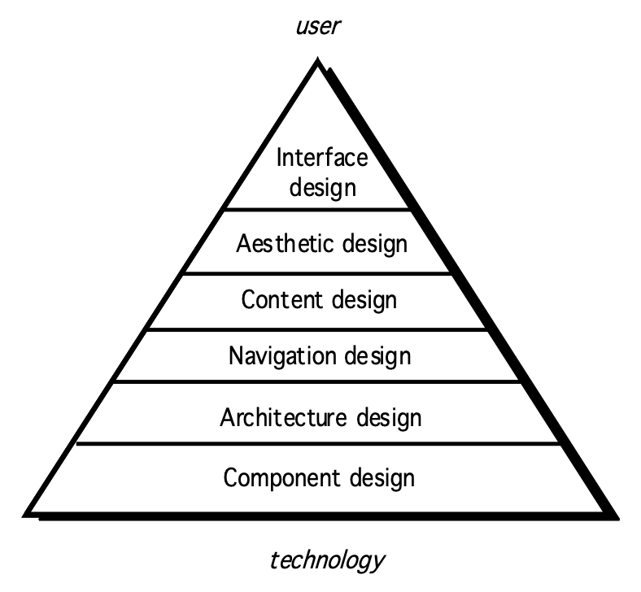

- **界面**设计
    - 界面应能指示已访问的 WebApp，并告知用户在内容层级中的当前位置
    - 界面应始终帮助用户了解当前可选操作：哪些功能可用？哪些链接有效？哪些内容相关？
    - 界面必须便于导航：需提供一份“地图”（以易于理解的方式呈现），显示用户已访问的位置以及可在 Web 应用内前往其他位置的路径
    - 界面设计原则：
        - **预见性**(anticipation)：WebApp 的设计应能预判用户的下一步操作
        - **沟通**(communication)：界面应传达用户所发起任何活动的当前状态
        - **一致性**(consistency)：导航控件、菜单、图标与美学元素（如颜色、形状、布局）的使用应保持一致
        - **受控自主性**(controlled autonomy)：界面应便于用户在 WebApp 中自由移动，但同时需遵循为该应用建立的导航规范
        - **效率**(efficiency)：WebApp 及其界面的设计应优化用户的工作效率，而非设计构建它的 Web 工程师或执行它的客户端-服务器环境的效率
        - **聚焦**
        - **菲茨定律**(Fitt's Law)
        - **人机界面对象**
        - **减少延迟**(latency reduction)
        - **易学性**(learnability)
        - **保持工作产品完整性**(maintain work product integrity)
        - **可读性**(readability)
        - **跟踪状态**(track state)
        - **可见的导航**(visible navigation)

        >后9点前面一模一样讲过，这里就略掉了...

- **审美**设计（具体内容前面也讲过，自己搜一下）
- **内容**设计
    - 为**内容对象**开发一种设计表示；对于Web应用，内容对象更接近于传统软件中的数据对象
    - 表示实例化它们之间关系所需的机制，类似分析类与设计组件之间的关系
    - 内容对象具有**属性**，这些属性包括内容特定信息以及作为设计一部分指定的实现特定属性
    - 内容对象设计：

        

            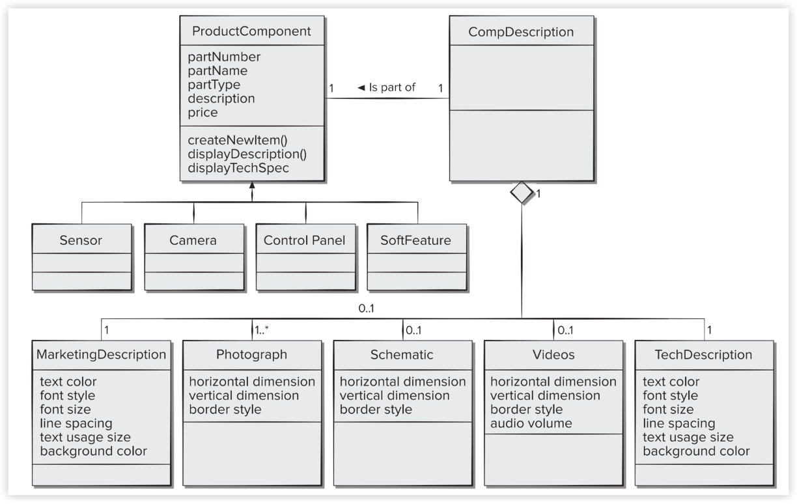
        

    - 内容架构：

        

            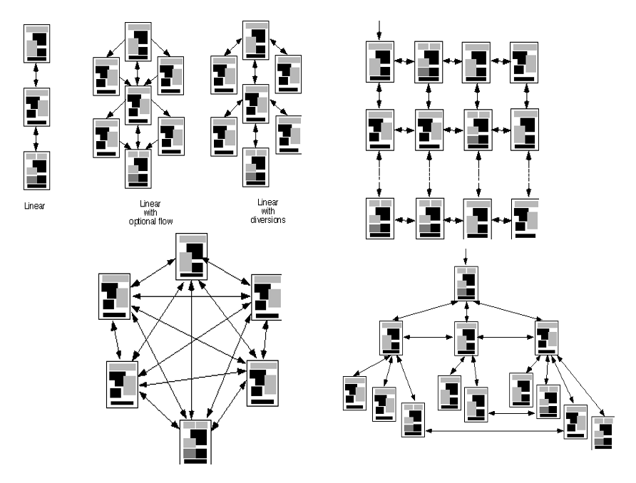
        

- **导航**设计
    - 首先考虑用户层级及相关用例：每位参与者对 WebApp 的使用方式可能略有不同，因此导航需求也各有差异
    - 当用户与 WebApp 交互时，会经历一系列**导航语义单元**(navigation semantic unit, **NSU**)，即一组信息及相关导航结构，协作完成用户需求的子集
    - **导航方式**(way of navigation, **WoN**)：为特定用户画像提供实现其期望目标或子目标的最佳导航方式或路径，由通过**导航链接**连接的**导航节点**(navigation nodes)组成

        

            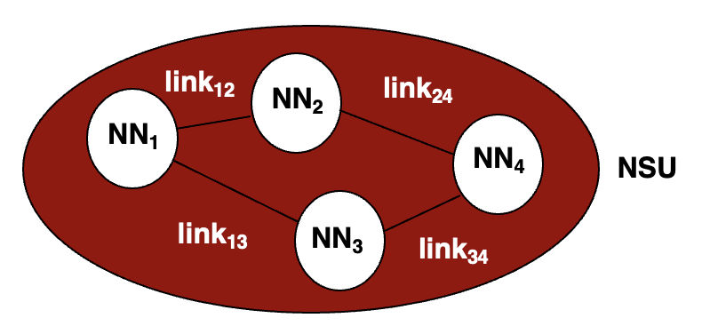
        

    - 为与每个已定义用户角色相关的每个目标创建 NSU：

        

            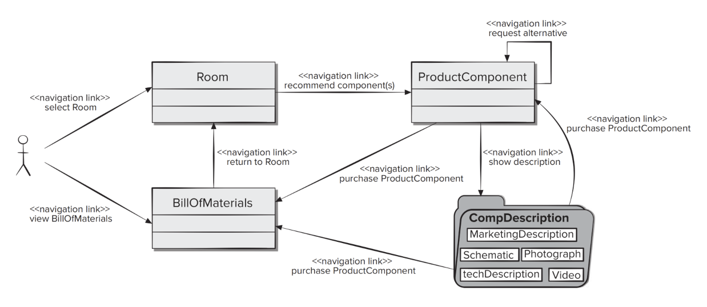
        

    - **导航语法**(navigation syntax)：
        - **单独导航链接**(individual navigation link)：基于文本的链接、图标、按钮和开关，以及图形隐喻等
        - **水平导航栏**(horizontal navigation bar)：在包含适当链接的栏中列出主要内容或功能类别；通常列出 4 到 7 个类别
        - **垂直导航列**(vertical navigation column)：列出主要内容或功能类别和 WebApp 中几乎所有主要内容对象
        - **标签页**(tabs)：一种隐喻，本质上是导航栏或导航列的变体，将内容或功能类别表示为标签页，在需要链接时被选中
        - **站点地图**(site maps)：提供一份全面的内容索引，导航到 WebApp 中包含的所有内容对象和功能

- **架构**设计
    - **内容架构**关注内容对象（或复合对象，如网页）为呈现和导航而构建的方式
        - **信息架构**：能够实现内容对象更好的组织、标签、导航和搜索的结构
        - 形式：**线性**(linear)、**网格**(grid)、**层级结构**(hierarchical)
    
    - **WebApp 架构**探讨应用程序为管理用户交互、处理内部任务、实现导航和呈现内容而构建的方式
    - 架构设计与**界面设计**、**美学设计**和**内容设计**并行进行
    - **MVC 架构**
        
        

            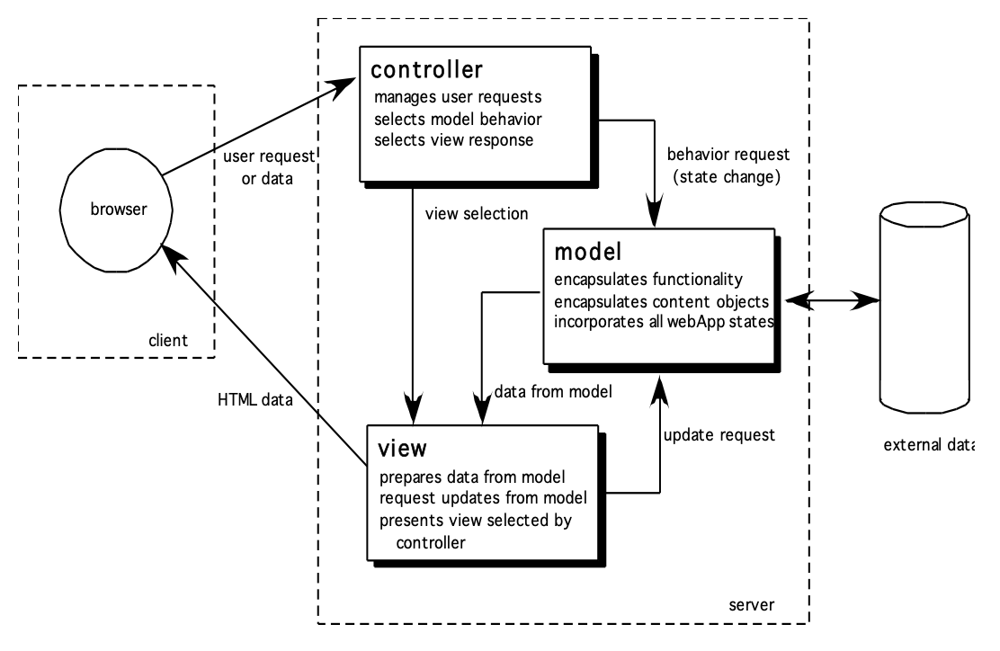
        

        
        - **模型**(model)：包含所有特定于应用的内容和处理逻辑，包括：
            - 所有内容对象
            - 对外部数据/信息源的访问
            - 所有特定于应用的处理功能

        - **视图**(view)：包含所有特定于接口的功能，并实现：
            - 内容与处理逻辑的呈现
            - 对外部数据/信息源的访问 
            - 最终用户所需的所有处理功能

        - **控制器**(controller)：管理模型与视图的访问，并协调两者之间的数据流

- **组件**设计：WebApp组件实现以下功能：
    - 执行本地化处理，动态生成内容与导航功能
    - 提供适用于 WebApp 业务领域的计算或数据处理能力
    - 提供复杂的数据库查询与访问
    - 建立与外部企业系统的数据接口

## MobileApp Design

移动开发需考虑的因素：

- 多种硬件和软件平台
- 众多开发框架和编程语言
- 不同应用商店的接纳规则和工具要求各不相同
- 开发周期短
- 用户界面限制
- 复杂相机/传感器交互
- 有效利用上下文
- 电源管理
- 安全与隐私模型/策略
- 设备限制（计算与存储）
- 外部服务的集成
- 测试复杂性
- 间歇性连接中断(intermittent connectivity outages)

移动 App 开发过程模型：

1. 方案制定(formulation)
2. 规划  
3. 分析  
4. 工程  
5. 实施与测试  
6. 用户评估

移动 App 质量检查：

- 能否根据用户的偏好**定制**(tailored)内容和/或功能和/或导航选项？
- 能否根据用户通信的**带宽**自定义内容和/或功能？应用能否以可接受的方式处理信号弱或丢失的情况？
- 能否根据用户的偏好使内容和/或功能和/或导航选项**感知上下文**？
- 是否已充分考虑到目标设备的**电源**可用性？
- 是否恰当使用了图形、媒体（音频、视频）以及其他网络或云**服务**？
- 整体页面设计是否易于**阅读**和导航？
- 应用程序是否考虑了**屏幕尺寸**的差异？
- 用户界面是否符合目标移动**设备**所采用的显示和交互标准？
- 应用程序是否符合用户对**可靠性**、**安全性**和隐私的期望？
- 为确保应用程序**保持最新状态**，采取了哪些措施？
- 移动应用程序是否在所有目标用户环境和所有目标设备上进行了**测试**？

移动 App UI 设计的考虑因素：

- 定义用户界面**品牌特征**(brand signature)
- 聚焦产品**组合**(portfolio)
- 识别**核心**用户故事
- **优化** UI 流程与元素
- 定义**扩展**(scaling)规则
- 创建用户**性能**仪表盘
- 依赖具备用户界面工程技能的**专职专家**(dedicated champion)

移动 App 设计问题：

- 功能大杂烩(kitchen sink)
- **不一致**(inconsistency)
- **过度设计**(overdesigning)
- 缺乏速度
- 废话连篇(verbiage)
- 非标准交互
- 帮助与 FAQ 综合症

移动 App 设计最佳实践：

- 确定受众  
- 根据使用场景进行设计  
- 简洁与懒惰之间只有一线之隔  
- 将平台特性作为优势  
- 让高级功能可被发现  
- 使用清晰一致的标签  
- 绝不以牺牲用户理解来设计花哨图标  
- **长滚动表单优于多屏切换**

移动 App IDE：

- 通用生产力功能
- 第三方SDK集成
- 编译后工具
- 在线开发支持
- 端到端移动应用开发
- 文档和教程
- 图形用户界面构建器

移动 App 中间件(middleware)：

- 促进分布式组件的通信与协调  
- 允许开发者依赖抽象，隐藏移动环境细节  
- 帮助移动应用按需实现情境感知