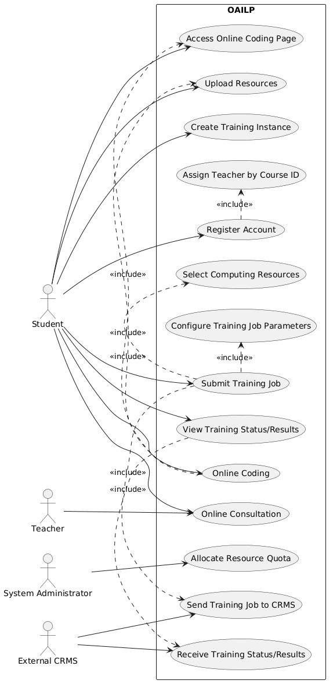
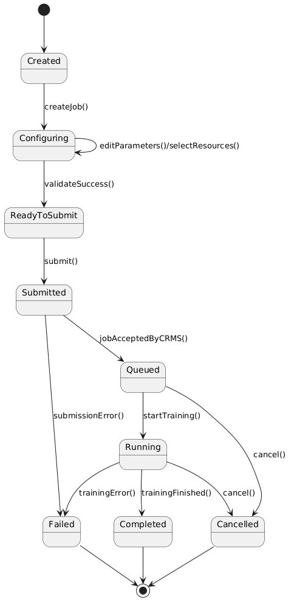
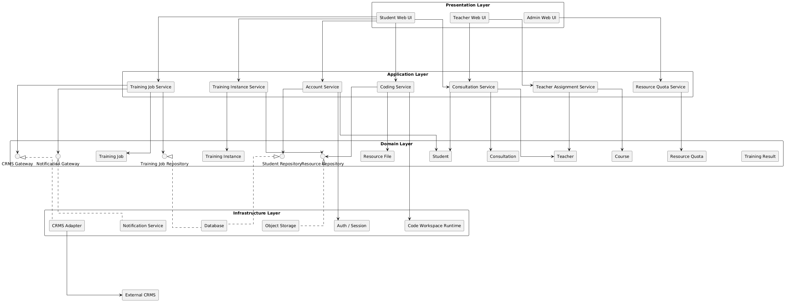

# 软件工程

!!! info "课程信息"

    - 学分：2.5
    - 教师：智晨（应该是新老师（~~可笔者记得选课的时候好像不是这位老师呀...~~））
    - 教材：《软件工程：实践者的研究方法》，Roger S. Pressman

!!! warning "注意"

    突击预习时请重点关注加粗部分，不加粗的可以一眼带过。

!!! abstract "目录"

    - [x] [基础知识](basics.md)：软工概念、过程结构、过程模型、敏捷开发、人的因素、各种原则...
    - [x] [需求](requirements.md)
    - [x] [设计](design.md)
    - [x] [质量](quality.md)
    - [x] [测试](testing.md)
    - [x] [杂项](misc.md)：安全工程、形式模型与验证、配置管理、项目度量/管理/调度、风险分析、维护...
    - [x] [大模型驱动下的软工](llm.md)：需求与设计 -> 编码与评审 -> 测试与安全 -> 运行与维护（由于该领域发展太快，所以笔记的时效性很是个问题...）

!!! recommend "参考资料"

    - PPT（可参考每页 PPT 下面的注释（~~但看下来给笔者的感觉是老师在备课前用 AI 写的讲稿~~））
    - [mem 的笔记](https://alidocs.dingtalk.com/i/nodes/r1R7q3QmWe7MoBdeUxr2P2wDJxkXOEP2?cid=75200886071&iframeQuery=utm_medium%3Dim_card%26utm_source%3Dim&corpId=ding2c6bcab1e41b0242)：强烈推荐，更适合考前快速突击！
    - 客观题题库（[mem 整理的版本](https://file.cc98.org/v4-upload/d/2025/0610/1ggkegnn.pdf)；但原答案就存在一些错误，需仔细甄别）
    - 历年卷（重点看画图题 + 简答题）

??? question "无法归类的题目整理"

    基本上都是来自历年卷的画图题（考前疯狂拟合中）。

    === "题1"

        === "题目"

            >来自 23-24 期末

            Software scope: A university plans to develop an online Al learning platform to help students complete practical tasks such as online coding and model training while studying Al-related courses.

            Students need to register for a new account, providing their student ID, name, email, department, and course ID. After account creation, students can create training instance. In training instances, students can access the online coding page. They can also upload data such as training datasets, weights of pre-trained models, and other related resources, and then perform online coding. Once completing the coding, students can configure parameters of training jobs and select the required computing resources (CPU, GPU, RAM, etc.), then submit training jobs. The training jobs will be sent to external Computing Resource Management System (CRMS) for model training, and the training results and status will be returned to OAILP. The maximum computing resources available to students are allocated by the system administrator, OAILP will assign corresponding teachers based on the course ID. If students encounter problems during training, they can online consult teachers on OAILP1.

            1. Please draw the use case diagram for OAILP. (10pts)
            2. Please give the two CRC cards for classes "student" and "training job". (10 pts)
            3. Please give the state diagram for the Training Job class. (8 pts)
            4. Please draw the layered software architecture of OAILP. (12 pts)
            5. Please describe the testing strategy for OAILP. (10 pts)

        === "解答"

            >答案由 GPT-5.5 生成，并不保证正确，仅供参考。

            === "问题1"

                <div style="text-align: center">
                    
                </div>

            === "问题2"

                ```
                +-----------------------------------------------------+
                |                       Student                       |
                +------------------------------+----------------------+
                | Responsibilities             | Collaborators        |
                +------------------------------+----------------------+
                | Register account             | Course               |
                | Maintain student information | Teacher              |
                | Create training instance     | TrainingInstance     |
                | Upload training resources    | ResourceFile         |
                | Use online coding environment| CodingWorkspace      |
                | Configure training job       | TrainingJob          |
                | Submit training job          | CRMSAdapter          |
                | View training status/results | TrainingResult       |
                | Consult teacher online       | Consultation         |
                +------------------------------+----------------------+

                +-----------------------------------------------------+
                |                    TrainingJob                      |
                +----------------------------+------------------------+
                | Responsibilities           | Collaborators          |
                +----------------------------+------------------------+
                | Store job parameters       | Student                |
                | Store computing resources  | TrainingInstance       |
                | Validate job configuration | ResourceQuota          |
                | Submit job to CRMS         | CRMSAdapter            |
                | Maintain job status        | TrainingResult         |
                | Receive training result    |                        |
                | Handle failure/cancellation|                        |
                +----------------------------+------------------------+
                ```

            === "问题3"

                <div style="text-align: center">
                    
                </div>

            === "问题4"

                <div style="text-align: center">
                    
                </div>

            === "问题5"

                OAILP 的测试策略包括单元测试、集成测试、系统测试和非功能测试。

                - 单元测试用于检查注册、训练实例创建、文件上传、作业配置和资源上限校验等模块功能
                - 集成测试用于检查 Web 界面、数据库、存储系统和外部 CRMS 之间的交互
                - 系统测试用于验证从学生注册、创建训练实例、提交训练作业到查看训练结果的完整流程
                - 非功能测试用于检查系统的性能、安全性、可靠性和可用性

