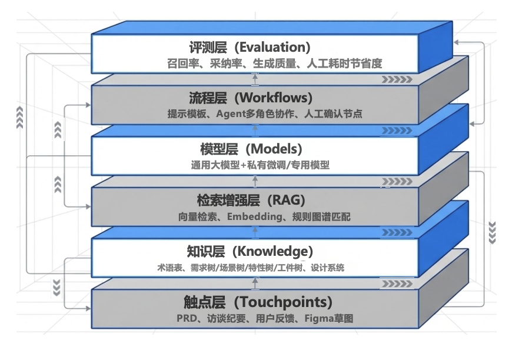
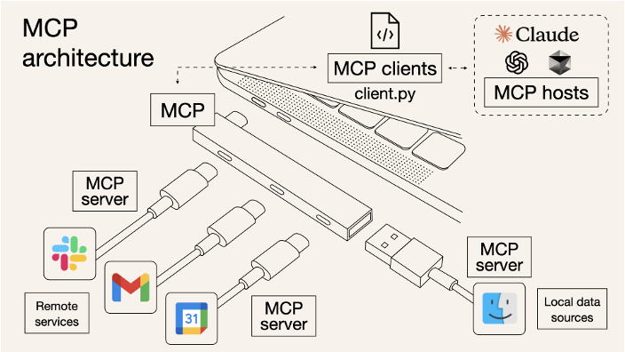
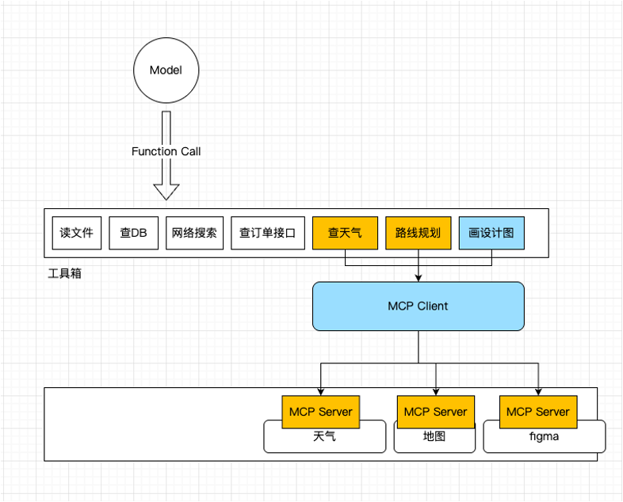

# LLM-Driven SE

!!! info "注"

    由于相关 PPT 大概率是 AI 生成的（~~这就是我们 ZJU 与时俱进的软工课啊（doge）~~），所以这份笔记的 AI 味也有些冲，请读者见谅！

    另外笔记涉及到的 AI 技术应该只截止到 2026 年初（春学期开课前），所以时效性也不咋地...

## Requirements and Design

大模型驱动**需求分析**的基本能力：从**文档润色**、**评审**到**需求要点提取**等环节广泛渗透，有效推动需求管理流程的智能化与效率提升，成为软件需求领或数字化转型的重要助力。

大模型驱动**设计生成**的基本能力：LLM 在设计领城已从单纯的知识查询，向**深度方案建议**、**全流程设计辅助**（功能、架构、UI 等）全面渗透，应用成熟度与企业覆盖率大幅提升，成为驱动设计环节暂能化的关键力量。

大模型驱动需求与设计的基本架构：**提示词工程** + **知识库/RAG** + **工具链** + **循环反馈**

<div style="text-align: center">
    
</div>

大模型应用开发支撑技术：

- **上下文工程**(context engineering)
    - 核心目的：上下文工程为大模型动态组织任务所需的信息、记忆、工具和状态，使模型能够更稳定地完成复杂任务
    - 黄金法则结构：**目标**(objective)（明确任务终点与具体角色设定）+ **约束**(constraint)（规定不能做什么，划定业务规则红线）+ **证据**(evidance)（喂入领域知识、历史样例、API 文档）+ **格式**(format)（指定输出的数据络构（JSON，表格等）） = 稳定输出
    - 遇到的问题：
        - 上下文**污染**：错误信息被反复继承，导致输出质量下降
        - 上下文**干扰**：历史内容过多导致注意力分散，忽略关键指令
        - 上下文**混乱**：无关工具或说明干扰决策，增加模型推理负担
        - 上下文**冲突**：上下文内部信息互相矛盾，导致模型无法正确判断

    - 策略：
        - **写入**(write)：把重要信息写到上下文之外；通过外置记忆保存计划、状态与偏好，减轻上下文窗口压力
            - **短期记忆**(short-term memory)：在一次会话或单个任务流程中持续保存状态，确保连贯性
            - **长期记忆**(long-term memory)：跨会话保存用户偏好、历史反馈、稳定规则，实现个性化
        
        - **选择**(select)：把当前任务真正需要的信息拉进来，按任务需要进行筛选与注入；可选择的信息类型有：
            - **事实**(facts)：用户信息、领域知识、实体属性等客观数据
            - **规则**(rules)：系统规则、工具使用说明、工作流约束条件
            - **示例**(amples)：少样本(few-shot)样例、历史成功案例、最佳实践
            - **历史**(history)：之前的中间结论、已完成步骤、当前任务进度
        
        - **压缩**(compress)：保留任务推进所需的关键内容，控制上下文长度；常见做法有：
            - **摘要**(summarization)：把长历史概括为关键目标、已完成步骤和当前结论，提炼核心信息
            - **修剪**(trimming)：直接删除旧的、重复的、或与当前任务无关的上下文内容，减轻负担
            - **剪枝**(pruning)：对检索内容或长文档进行细粒度筛选，只保留对当前步骤必要的片段
        
        - **隔离**(isolate)：将复杂任务拆分为相对独立的上下文单元，减少信息污染、混乱与冲突；常见做法有：
            - **任务**隔离(task isolation)：把一个大任务逻辑上拆成多个独立的子任务，分配给不同智能体或步骤
            - **上下文**隔离(context isolation)：不同智能体或步骤使用各自独立的上下文窗口，避免历史信息污染
            - **环境**隔离(environment isolation)：代码执行、大对象计算放在外部沙盒，不直接塞进提示词上下文

- **MCP**（模型上下文协议(model context protocol)）：一个开放、通用、有共识的**标准协议**，用于让大模型以**统一**方式连接外部工具、数据源和服务

    <div style="text-align: center">
        
    </div>

    >笔者觉得扩展坞的比喻很有意思，故保留此图。

    - 本质上是在解决大模型连接外部工具和数据源时的碎片化集成问题
    - 采用**客户端—服务器架构**，将 AI 应用与本地/远程资源通过标准协议连接起来，实现系统解耦
        - **MCP 主机**：用户直接交互的 AI 应用入口，负责解析用户意图，并决定何时调用外部能力
        - **MCP 客户端**：Host 内部的连接器，封装底层通信协议，负责与 Server 建立连接并传输数据
        - **MCP 服务器**：MCP 架构的核心枢纽，统一暴露工具接口，管理资源访问权限，并为模型提供标准化提示
        - **本地资源**：运行在用户本地环境的私有资源，包括文件系统、本地数据库和操作系统级功能
        - **远程资源**：通过网络访问的外部公共服务，包括 Web API、云平台、搜索引擎和 SaaS 平台等
    
    - 流程：

        <div style="text-align: center">
            
        </div>

        - **用户提问**：用户向 AI 应用提出具体任务需求，开启交互流程
        - **模型分析**：模型读取工具的名称、描述与参数，完全基于描述判断是否调用工具
        - **执行工具**：客户端将模型的调用请求通过 **MCP Server** 实际执行对应工具
        - **结果回流**：工具运行产生的数据被送回模型，作为生成最终回答的关键依据
        - **生成回答**：模型结合工具结果，组织成自然、流畅、用户可读的最终回复

    - MCP vs **函数调用**(function call)：后者跨平台差异大，适配成本高，且由于单一平台封装，难以跨域复用；相对地，前者高度兼容且开放生态复用
    - 构建 MCP 服务器
        1. 定义能力：规划暴露的工具/资源列表
        2. 编写服务：基于 SDK 实现服务器逻辑
        3. 本地调试：用检查器(inspector)验证接口参数
        4. 接入应用：配置到 Claude 或其他 IDE 中使用

- **Skill**：围绕特定任务组织的能力包，将步骤、规则、知识、模板封装在一起，让 AI 稳定完成重复性、多步骤任务
    - 核心价值：让 Agent 能力具备**复用性**、**稳定性**与**可治理性**
    - 文件组织：
        - `skill.md`：核心**指令**文件，定义任务目标、执行步骤与输入输出约束
        - `scripts/`：自动化**脚本**库，用于执行确定性操作或复杂计算处理
        - `reference/`：参考**知识**库，存放领域规则、文档规范与任务标准
        - `assets/`：静态**资源**库，包含任务模板、示例文件、图片等素材

    - 使用 Skill 时的生命周期：
        1. 用户提出具体任务需求
        2. 系统匹配最佳 Skill 能力包
        3. 解析 `skill.md` 任务逻辑与规则
        4. 按需调用资源并分步执行任务

    - 设计 Skill：
        
        >~~实际设计时只要用官方的 [skill-creator](https://github.com/anthropics/skills/blob/main/skills/skill-creator/SKILL.md) Skill 就能做到，没那么复杂~~

        1. **选择合适的任务**：优先选择高频、重复、边界清晰的任务，适合 Skill 化的任务通常有明确输入输出和稳定流程
        2. **先做最小可用版本**：用最少的规则、最核心的步骤跑通流程，验证复用价值，不一开始追求复杂功能的堆砌
        3. **编写核心 `skill.md`**：明确任务目标、输入输出、执行步骤、约束条件，让隐性的经验逻辑变得显式化、结构化
        4. **补充脚本与资源**：按需引入 `scripts`、`reference`、`assets` 等辅助资源，提升任务执行的稳定性与确定性
        5. **基于真实任务迭代**：Skill 质量非一蹴而就，需在真实场景中不断修正步骤、调整输出和补充资源

- **OpenClaw**：是一个免费、开源、自托管的 AI Agent 框架，不仅能理解指令，还能通过消息渠道接收任务、调用工具执行操作，并基于文件化配置持续运行
    - 核心思想：把 Agent 的长期行为外置到**文件系统**中，这让 Agent 的状态从一次性的临时上下文转变为可沉淀、可复用、可审计的数字资产
        - `SOUL.md`：定义人格、价值观与边界
        - `AGENTS.md`：定义操作规范、工具与流程
        - `MEMORY.md`：沉淀跨会话的长期历史记忆
        - `HEARTBEAT.md`：定义定时任务与主动行为触发

    - 架构：
        - **渠道**(channels)：聚合 Telegram、飞书、Slack 等多渠道消息输入
        - **网关**(gateway)：负责会话管理、消息路由、心跳调度与任务分发
        - **运行时**(runtime)：组装系统提示词、加载上下文、管理模型调用逻辑
        - **执行层**(execution layer)：连接 LLM API、Shell、Browser 等实际执行单元

    - 任务流程：
        1. 接收消息：用户输入经渠道转发，进入网关等待调度
        2. 加载身份与规则：读取 `SOUL`/`AGENTS`/`TOOLS.md`，确定“我是谁”和“能做什么”
        3. 恢复记忆与协作：加载 `MEMORY` 日志与共享上下文，恢复历史状态
        4. 决策与执行：调用 LLM 思考，执行 Shell/工具，并回写结果至日志

    - 风险：
        - **提示词注入**风险：Agent 读取外部文档或邮件时，可能被恶意指令诱骗执行非预期操作
        - 不可信 **Skill 植入**：来源不明的 Skill 可能包含危险脚本或数据外传逻辑，带来执行层隐患
        - 控制**端口**公网暴露：网关直接暴露会导致未授权访问，可能被攻击者接管 Agent 控制权
        - **高危工具**配置过宽：exec/ssh/browser 等高风险工具若未做限制，易引发误删或敏感信息泄露

    - 工程风控设计原则：
        - **最小权限**原则：仅开放必要工具集
        - **人工审批**机制：高危操作强制确认
        - **沙箱**与审计：隔离执行，全链路日志


## Coding and Review

### Vibe Coding

**氛围编程**(vibe coding)是一种 AI 辅助的软件开发实践：开发者用**自然语言**向大语言模型描述需求，由 AI 生成代码，开发者**通过运行结果**而非阅读代码来**判断是否正确**。

工具分类：

- **原生 IDE**：Cursor、Trae、QCoder 等
- **IDE 插件**：大多是基于现有的开发环境，如 VSCode 或 JetBrains 的插件形式存在
- **Web Agent**：入口在**浏览器**上，整个执行过程在一个异步容器（比如沙箱环境）中进行；对**协作**更加友好，且由于**跨平台**特性，具有广泛的适用性
- **CLI 工具**：Claude Code、Codex 等

更好地 vibe coding：

- **编写规范的提示词**：
    - **角色**设定：锚定 AI 的知识领域与能力边界（例如：资深架构师、高级测试工程师），让模型激活特定的专业语料库
    - 任务**目标**：清晰无歧义地定义最终产出物是什么（例如：一个可运行的脚本、一份格式化的 JSON、一段单元测试）
    - 框架**约束**：限定技术栈版本、编码规范与禁用项（例如：强制使用 Python 3.10、禁止调用已废弃的 API）
    - **边界**条件：提前规避报错，指导 AI 如何处理异常路径、空数据与极端输入

- **上下文管理**：用户为 AI 提供足够的信息和背景，使其能够更准确地理解用户的项目、代码和需求，同时可以有效避免幻觉的出现

- `@code` vs `@codebase`
    - `@code`：
        - 作用范围：仅限**当前打开的文件**（或选中的代码片段）
        - 用途：聚焦于当前文件的代码逻辑，适用于单文件内的操作
        - 使用场景：解释当前函数/类的作用；修复当前文件的语法错误；生成与当前代码相关的补全片段
    
    - `@codebase`：
        - 作用范围：**整个项目**（当前打开的工作区目录），包括所有文件和子目录
        - 用途：需要跨文件分析项目结构或依赖关系时使用
        - 使用场景：生成与多文件交互的代码（如调用其他模块的 API）；分析项目的架构设计；重构涉及多个文件的代码

- `@files` vs `@folders`
    - `@files`：
        - 作用范围：指定**一个或多个具体文件**（通过路径或通配符匹配）
        - 用途：针对特定文件的代码操作，比 `@codebase` 更灵活，但比 `@code` 更广
        - 使用场景：分析多个关联文件（如组件和其依赖的 `utils` 文件）；生成跨文件的代码逻辑（如接口和实现类）；检查指定文件的兼容性
    
    - `@folders`：
        - 作用范围：指定**某个目录**下的所有文件（支持递归子目录）
        - 用途：批量处理某个文件夹内的代码，适合模块化或分层项目
        - 使用场景：批量重命名或重构某个模块的代码；分析某个目录下的代码风格一致性；生成目录内文件的文档

- `@Docs`：引用最新官方文档，确保回答符合当前版本，避免 AI 的幻觉问题
    - 如果问题涉及没有官方文件的最新技术，可以使用 `@web` 快捷键；LLM 会先搜寻网络根据最新内容回答，这能有效避免过时或不准确的回复

- 复杂逻辑**拆解**策略（自顶向下的任务切分）：
    1. 让大模型辅助完成系统架构与模块边界设计
    2. 将模块拆解为遵循单一职责原则的原子函数
    3. 针对每个原子函数进行独立的提示词生成与拼装

- AI 辅助的**测试驱动开发**（TDD）
    - 写**规约**：用自然语言描述业务边界与异常输入，让 AI 生成会报错的**测试代码**
    - 写**实现**：指令 AI 编写**业务逻辑代码**，直至刚才的测试用例跑通
    - AI **重构**：在测试的保护下，让 AI 大胆**优化**代码结构与性能


### Spec Coding

**规约编程**(spec coding)：在动手写代码之前，先由人类开发者与 AI 共同制定一份结构化、无歧义、可验证的详细规约文档，AI 严格依据该文档生成和迭代代码‌‌。

- **结构化输入**‌：**规约**(spec)不是自然语言描述，而是包含明确接口、约束、边界条件和验收标准的文档
- AI 作为**编译器‌**：类比高级语言通过编译器生成二进制，Spec 通过 AI 编译为**可运行代码‌**
- 闭环**迭代‌**：需求变更时，修改 Spec -> AI 重新生成受影响代码，形成 Spec -> 代码 -> 反馈 -> Spec”的闭环‌

**规约驱动开发**(spec-driven development, **SDD**)：将 Spec 从传统的、滞后的文档形态提升为第一等、可执行的工程资产。

当前的 SDD 生态：

>ROI：投资回报率

- [**OpenSpec**](https://openspec.dev/)：主张通过极致轻量化的差异管理解决存量系统的演进
    - ROI：在频繁的小型代码重构和 Bug 修复中最高
    - 适用场景：对于需要维护具有数年历史、且文档缺失的代码库

- [**Spec-Kit**](https://github.com/github/spec-kit)：依托 GitHub 官方生态提供工业级的、基于宪法约束的全流程治理
    - ROI：在中型规模的新项目和合规性要求极高的行业（如金融、医疗）中最为显著
    - 适用场景：对于初创公司或大公司的内部工具开发，特别是涉及财务支付、用户隐私或需要严格代码审查的项目

- [**BMAD-METHOD**](https://github.com/bmad-code-org/bmad-method)：通过模拟完整的多智能体敏捷组织，试图将软件开发转化为高度自动化的组织协同过程
    - ROI：在大规模、跨职能的复杂系统中表现最优
    - 适用场景：对于从零开始探索复杂业务逻辑、或者希望通过 AI 极大缩减人力成本的大型项目

以 OpenSpec 为例的 SDD 流程：

准备工作：

```sh
npm install -g openspec
openspec init 
```

1. **初始化项目**

    ```sh
    mkdir my-project && cd my-project
    openspec init
    ```

    初始化之后，项目里会多一个 openspec/ 目录
    
    ```
    openspec/
    ├── specs/        # 当前规范（系统的"记忆"）
    ├── changes/      # 进行中的变更（proposal + tasks）
    ├── archive/      # 已完成的变更（可追溯）
    ├── AGENTS.md     # AI 助手指南（怎么用 OpenSpec）
    └── project.md    # 项目上下文（技术栈、约定、领域知识）
    ```

2. **初始化 proposal**：打开 Claude Code，执行

    ```
    /openspec:proposal 帮我初始化一个 proposal 用于实现原始想法 @idea.md 的功能，具体可以参考 @report.md ultrathink
    ```

    - 引用 `idea.md` 和 `report.md`，把 Vibe 阶段的产出带进来
    - 让 AI 生成 `proposal.md` + `design.md` + `tasks.md`
    - `ultrathink` 触发深度思考模式，确保方案考虑周全

3. **审查**：`proposal.md`、`design.md`、`tasks.md`，有问题让 AI 改
4. **应用**：让 AI 按 `tasks.md` 逐步实现

    ```sh
    /openspec:apply
    ```

    AI 会边做边更新 task 进度；做完一个 task，就标记一个完成
    
5. **归档**：全部完成之后，归档这次变更

    ```sh
    /openspec:archive
    ```

    归档会把 proposal 移到 `archive/` 目录，保持 `changes/` 干净，下次新功能再起一个新的 proposal
    
更好地 spec coding：

- 用好 **`project.md`**：
    - **老项目**可以 `init` 完让 AI 帮忙填：

        ```
        请阅读 @openspec/project.md，帮我根据当前项目的技术栈和代码规范填充内容
        ```

        AI 会自己扫一遍项目，技术栈、命名规范、架构模式，该填的都填上
        
    - 对于**新项目**，不用一次填完，每次归档顺手带一句：
    
        ```
        /openspec:archive 当前 proposal 已验证完成，帮我归档，顺便更新 @openspec/project.md
        ```

        做三五个 spec 下来，项目知识就攒得差不多了，后面再起新 spec，AI 上来就能够知道你的代码风格、目录结构、技术偏好，不用每次都从头说起
        
- **一个 spec 只做一件事**
    - 主动规划，一开始就知道功能很大，**拆成多个 spec**：先做核心功能，跑通了再加其他的
    - 边做边发现，做的过程中发现“如果加个这个功能体验会更好”，这时候不要直接修改当前的 spec，要**新开一个 spec** 来做，来保持每个 spec 边界清晰

- **出错**应对
    - **需求**或**设计**不匹配：别硬撑，直接回溯，回到 proposal 阶段重新来，该改设计改设计，该补探讨补探讨
    - 设计正确但**实现**出错。把报错信息和对应的 task 引用告诉 AI，让它定点修复


- 让 AI 慢下来：在以下情况可以使用深度思考模式
    - 初始化 proposal：这是整个项目的基础，方案想不清楚后面全是坑，这时候主动触发深度思考
    - 卡壳：AI 来回修改同一个问题，改了几轮还是不对，这时候让它慢下来想想，别一直快速试错
    - 失焦：你说了好几遍需求，AI 还是理解不对，这时候触发深度思考，让它重新梳理一遍上下文

???+ abstract "结合 vibe 和 spec"

    在实际工作中，这两种模式并非完全对立，而是可以互补的。一个有经验的开发者可能会用 **vibe coding** 的方式快速搭建一个**原型**，验证想法的可行性（探索方向）。如果原型可行需要把它变成**真正的产品**，再切换到 **spec coding** 的模式，重写代码、补充文档、设计好架构，确保它能健壮地运行和扩展（**保证质量**）。


### Review

**CI/CD** 流水线中的接入：在 PR 阶段，AI 审查工具可以实现第一时间自动触发，达到“机器先审，人类后阅”的效果。

需要注意的是，在大模型编码系统中，你依然对最终合并和发布的代码负有绝对的所有权，绝不能将生产环境的错误归咎于 AI。

数据安全与合规红线：

- 核心资产与敏感数据保护：严格防范企业核心商业逻辑、未公开算法或敏感凭证被上传至外部公有云模型
- 安全变更的强制拦截：对于涉及安全层面的代码变更，必须保持极高的警惕性；作为最后一道防线，核心安全模块必须强制引入人工专家的深度复核
- 企业级管控：建议在内部网络部署代码脱敏代理，或针对极高涉密要求的业务，构建私有化部署的 Code Review 大模型节点


## Testing and Security

LLM 驱动软件测试的应用全景：

1. 测试**用例**与脚本生成
   - 自动化测试用例生成：基于业务需求或代码变更生成单元测试、接口测试用例
   - 测试脚本编写：支持多协议的自动化测试脚本生成，如 Swagger 测试脚本
   - 单元测试自动生成：为代码自动生成测试代码
   - 根据测试数据自动生成自动化代码：让测试工程师更高效

2. 测试**数据**与环境
   - Mock 数据生成：根据需求、用户故事生成合理的测试数据
   - 测试前移：在开发阶段就介入测试设计

3. 智能测试**执行**与分析
   - AI 自主规划执行测试：开发提交测试后，AI 自动规划测试、提交 Bug、生成测试报告
   - 业务质量运营与趋势分析：分析测试结果趋势，预测质量风险

LLM 驱动测试用例生成：

- 输入源：
    - 自然语言需求（PRD）：基于产品描述生成业务逻辑测试
    - API 文档（OpenAPI / Swagger）：解析接口定义生成参数化测试
    - 源代码（函数 / 类 / 调用链）：分析代码逻辑生成单元测试桩

- 测试产物：
    - 单元测试代码（pytest / JUnit）、API 自动化测试用例
    - UI 自动化脚本（Appium / Selenium）、边界条件异常输入测试
    - **智能补全**：自动挖掘并补全需求中未明确提及的隐含测试场景

LLM 驱动缺陷分析与自动修复：

- 理解**栈轨迹**(stack trace)：自动解析复杂的栈轨迹信息，快速定位代码异常发生的具体位置和上下文
- 跨文件分析**调用链**：追踪跨多个文件和模块的代码调用路径，构建完整的逻辑依赖图谱
- 自动生成**补丁**(patch)：基于分析结果，智能生成代码修复补丁，加速开发人员的修复验证过程

LLM 驱动测试的局限性：

- 无法替代传统测试体系：LLM 尚不能完全替代成熟的自动化测试框架，在稳定性与覆盖率上仍有差距
- 对复杂业务理解不足：面对高度专业的业务逻辑与隐性规则，LLM 可能产生误解或生成错误的测试用例
- 有状态系统支持较弱：在处理依赖历史上下文的有状态系统时，LLM 难以维持长流程的逻辑一致性
- 高安全场景风险较高：在涉及隐私数据与高敏感操作的场景中，生成式内容可能带来不可控的合规风险

安全防范建议：

- 输入侧
    - 提示词隔离：数据与指令分离
    - 输入清洗：过滤恶意内容

- 执行侧
    - 权限最小化：遵循最小权限原则
    - 禁止高风险操作：限制 Shell / 生产环境

- 输出侧
    - 审计日志：全链路操作记录
    - 人工确认机制：Human-in-the-loop


## Execution and Maintenance

**SRE**（站点可靠性工程(site reliability engineering)）：将**软件工程**方法应用于运维，从而构建可扩展、高可靠系统的一种工程实践。

SRE 工程师工作内容：

- **故障响应**(on-call)：处理告警定位问题，快速止损（回滚 / 限流），恢复服务
- **监控与告警治理**：构建指标体系，优化规则减少误报，提升可观测性
- **发布与变更管理**：灰度 / 金丝雀发布，完善回滚机制，严格控制变更风险
- **性能优化与容量规划**：识别系统瓶颈，评估资源容量，从容应对流量高峰
- **自动化与平台建设**：编写工具脚本，构建运维平台，减少重复劳动(toil)
- **事故复盘**(postmortem)：根因分析（RCA），无责复盘，持续改进系统

管理模型：

- **服务水平指标**(SLI)：服务性能的可量化度量，常见指标包括请求成功率（成功数 / 总数）、响应延迟（如 P95 / P99）
- **服务水平目标**(SLO)：基于 SLI 设定的目标值，用于定义「足够好的服务」，包含指标、目标值和统计周期，例如 30 天内 95% 请求延迟 < 300ms
    - SLO 不应设为 100%，因为 100% 意味着没有容错空间，会阻碍快速迭代

- **服务水平协议**(SLA)：面向用户的对外承诺，违约需担责，通常 SLO 严于 SLA，作为预警机制

**错误预算**(error budget) = (1 - SLO) * 总事件数，表示还能容忍多少“坏事件”，用于平衡稳定性与迭代速度。

闭环机制：

1. **变更/发布**：新版本上线或配置变更，系统进入新状态
2. **监控与检测**：指标 / 日志 / 链路追踪，实时观测识别异常
3. **告警触发**：SLO 违约或异常触发，通知值班人员
4. **故障定位**：分析数据进行根因分析（RCA），判断影响范围
5. **故障处理**：通过回滚 / 限流 / 降级等手段恢复服务
6. **事故复盘**：无责复盘，深度分析根因，总结改进措施
7. **持续改进**：优化监控告警，增加自动化，调整架构

---
**DevOps**：**研发运维一体化**，通过 CI/CD 自动化与协作解决了传统模式下的效率与稳定性矛盾，为 SRE 等现代运维实践奠定了坚实的文化与方法论基础。

**AIOps**：将 AI 技术应用于 IT 运维领域，实现自动化异常检测、根因分析与故障处理的技术体系。

- 核心目标：
    - 降低人工成本
    - 缩短故障恢复时间
    - 提升故障预测能力
    - 运维知识沉淀复用

- 主要任务：
    - 事件管理：自动检测分类，提供优先级排序
    - 异常检测：识别异常模式，发现性能下降
    - 根因分析：自动化故障诊断，快速定位根源
    - 预测性分析：分析历史数据，预测潜在瓶颈
    - 自动化修复：自动解决已知问题，减少人工干预

- 传统 AIOps 的问题：
    - **强依赖结构化建模**：需要人工设计特征、明确指标定义，对非结构化文本建模能力弱
    - 任务割裂，**缺乏统一表示**：异常检测、根因分析、告警压缩等任务往往独立建模，不共享表示空间，缺乏统一语义层，知识难以迁移
    - **对运维知识理解能力弱**：不能理解 Runbook 文本，无法阅读运维工单，难以吸收专家经验
    - **自动化闭环能力不足**：大多数 AIOps 系统停留在分析层，难以实现决策与执行层的闭环

**可观测性**是指能够全面理解和分析一个系统内部状态的能力。通过对系统运行时数据的收集、分析和展示，使得运维人员能够发现潜在的问题、异常行为以及性能瓶颈。

- **日志**(logs)：记录应用程序和系统事件的详细信息，是追踪故障原因的重要依据
- **指标**(metrics)：度量系统健康状况的定量数据，如 CPU 使用率、内存占用及请求响应时间等
- **追踪**(traces)：对分布式系统中请求流动的全链路跟踪，帮助分析系统性能瓶颈与延迟

**LLM** 技术发展与运维应用：

- 统一语言理解：打破日志、工单等非结构化数据孤岛，实现统一语义建模与检索，提升数据利用率
- 自动化生成能力：基于历史数据自动生成标准化 Runbook、故障根因分析报告及运维脚本，释放人力
- Agent 工具调用：具备自主决策与工具链调用能力，解决复杂的故障诊断与修复问题