# Miscellaneous

## Security Engineering

**安全工程**(security engineering)：

- **安全**(security)是系统完整性、可用性、可靠性和安全性的前提条件，提供了一种使系统能够保护其资产免受攻击的机制
- **资产**(assets)是指对利益相关者具有价值的系统资源（包括信息、文件、程序、存储空间、处理器能力等）

分析安全需求：

- **暴露**(exposure)：重新创建**丢失**的系统资产所需的**时间或成本**的价值
- **威胁分析**(threat analysis)：确定可能损坏系统资源或使其无法被未经授权访问的条件或威胁的过程
- **控制**(controls)：为避免攻击并减轻其损害而创建的

在线安全威胁：

- **社交媒体**：网络通常允许其用户开发能够访问用户个人详细详细信息的应用程序
- **移动应用**：在移动设备上运行的原生应用可能拥有与设备所有者相同的访问资源
- **云计算**：给安全图景带来了额外的机密性和信任问题，因为它模糊了可信内部和不可信外部之间的界限
- **物联网**(Internet of things)：日常物品能够通信并报告关于其用户和环境的上下文信息

安全工程分析：

- **安全需求获取**(security requirements elicitation)
    - 确定用户如何与系统**资源**交互
    - 创建描述系统**威胁**的滥用故事
    - 用户威胁建模与风险分析，以确定作为非功能性需求的系统安全**策略**(policies)
    - 定位攻击模式，找出解决系统安全缺陷的方案

- **安全建模**(security modeling)
    - 捕获**策略目标**、**外部接口需求**、**软件安全需求**、**操作规则**、**安全架构描述**
    - 在设计、编码和评审过程中提供指导
    - **状态模型**可以帮助软件工程师确保系统允许的一系列状态转换在安全状态下开始和结束
    - 使用**形式化安全模型**可能提高系统的可信度，因为正确性证明可作为系统安全案例的一部分

- **度量设计**(measures design)
    - **安全度量**应关注系统的**可靠性**(dependability)、**可信度**(trustworthiness)和**生存能力**(survivability)
    - 资产价值度量、威胁可能性度量

- **正确性检查**(correctness checks)
    - 软件验证活动和安全测试用例必须可追溯至系统安全案例
    - 在**审计**、**检查**和测试用例中收集的数据，应进行分析和总结，形成安全案例

**安全保证**(security assurance)：

- 展示已创建的**安全产品**(secure product)，从而赢得最终用户和利益相关者的信心
- **安全案例**(security case)要素
    - 安全**声明**(claims)
    - 将声明相互关联的**论证**(arguments)
    - 支持论证的**证据**（审查、证明等）

安全风险分析：由微软创建威胁模型的步骤：

1. 识别资产
2. 创建架构概览
3. 应用程序分解(decomposition)  
4. 识别威胁
5. 记录威胁
6. 评估(rate)威胁

>如果要认真对待安全保障和风险识别，必须将其纳入进度安排和预算。

安全可信度：

- **信任**是软件组件和利益相关者可以**相互依赖**的信心水平
- **验证**(verification)确保使用可追溯到安全案例的客观和可量化技术评估安全需求
- 用于证明安全案例的**证据**必须被所有系统利益相关者接受和信服
- 大多数信任度量基于从涉及信任的情况下的过去行为得出的**历史数据**

**事件响应计划**(incident response plan)明确规定了每个相关方在应对特定攻击时应采取的行动。

## Formal Modeling and Verification

**净室策略**(cleanroom strategy)：

    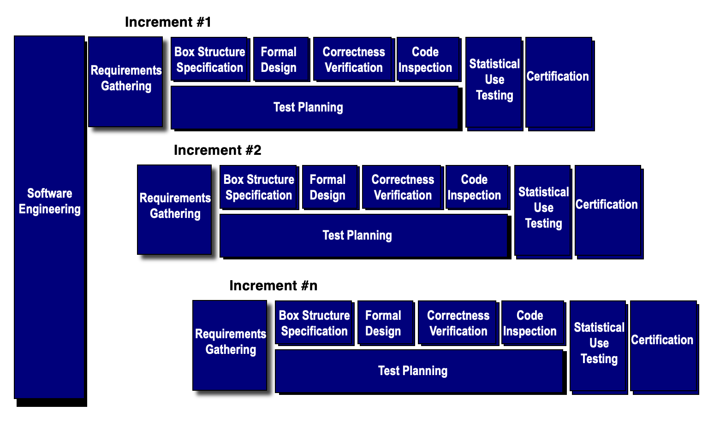

1. **增量计划**(increment planning)：采用增量策略  
2. **需求收集**(requirements gathering)：定义客户级需求的描述（针对每个增量）
3. **盒结构规范**(box structure specification)：描述功能规范，在特定的细节层次上封装了系统的某个方面
4. **正式设计**(formal design)：规范（称为**黑盒**，描述了抽象、刺激和响应）通过迭代细化（以增量方式），逐步演变为与**架构**和**过程**设计类似的内容（分别称为**状态盒**和**明盒**(clear boxes)）  
5. **正确性验证**(correctness verification)：从最高层盒结构（规范）开始，使用一组**正确性问题**向设计细节和代码推进；如果这些问题未能证明规范的正确性，则采用更形式化的（数学）方法进行验证  
6. **代码生成、检查与验证**(code generation, inspection and verification)：用专用语言表示的盒结构规范被转换为相应的**编程语言**
7. **统计测试计划**(statistical test planning)：规划并设计一组测试用例，用于对使用情况的**概率分布**进行演练
8. **统计使用测试**(statistical usage testing)：执行一系列测试，这些测试源自对所有用户从目标群体中所有可能程序执行进行的统计抽样（即上述概率分布）
9. **认证**(certification)：一旦验证、检查和使用测试完成（且所有错误都已纠正），该增量即被认证为可集成

功能规范(functional specification)：

    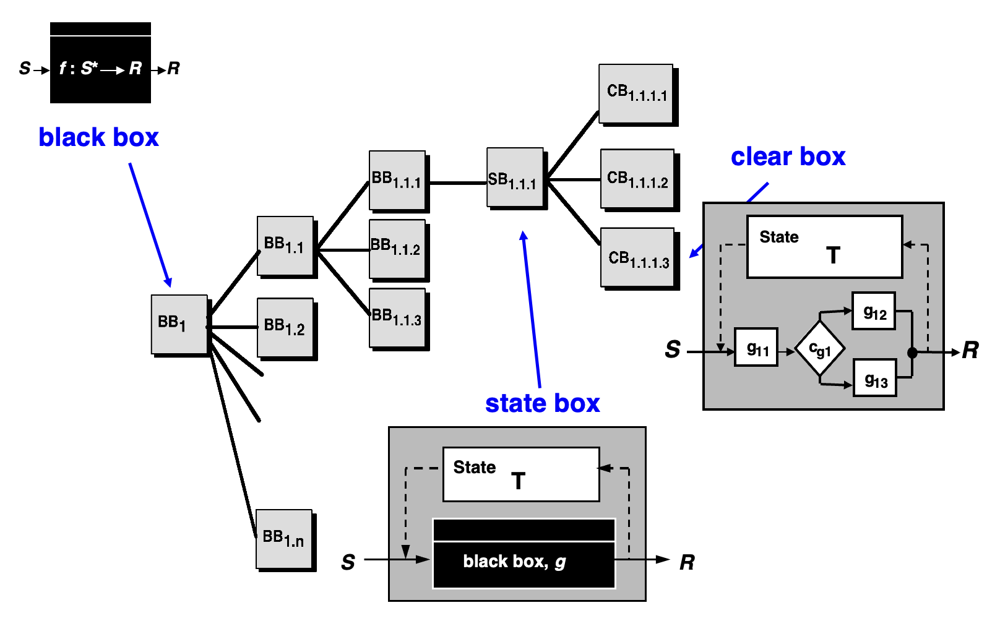

净室设计：

- **设计细化**
    - 若将函数 f 展开为**序列** g 和 h，则对所有输入 f 的正确性条件为：先执行 g 再执行 h 是否等同于执行 f？
    - 当函数 f 细化为**条件**（if-then-else）时，对所有输入 f 的正确性条件为：当条件 <c> 为真时，g 是否等同于 f；当条件 <c> 为假时，h 是否等同于 f？
    - 当函数 f 细化为**循环**时，对所有输入 f 的正确性条件为：
        - 能否保证终止？
        - 当条件 <c> 为真时，先执行 g 再执行 f 是否等同于执行 f；当条件 <c> 为假时，跳过循环是否仍等同于执行 f？

- **设计验证**
    - 将验证简化为有限过程  
    - 使净室团队能**逐行**验证设计与代码，**减少验证工作量**
    - 实现接近于**零缺陷**水平
    - 可扩展  
    - 产生**比单元测试更优**的代码

在净室软件工程中，**结构化程序设计方法**(structured programming approach)用于**细化数据设计和功能设计**，帮助开发人员将系统的数据结构和功能分解为更小、更易管理和验证的单元，提高软件质量和可靠性。

净室测试：

- **统计使用测试**(statistical use testing)
    - **测试程序的实际使用情况**
    - 确定**使用概率分布**(usage probability distribution)
        - 分析规范，以识别一组刺激(stimuli)
        - 刺激导致软件改变行为
        - 创建使用场景
        - 为每个刺激分配使用概率
        - 根据使用概率分布为每个刺激生成测试用例

- **认证**
    - 步骤：
        1. 必须创建使用场景
        2. 指定使用配置
        3. 根据配置生成测试用例
        4. 执行测试并记录分析故障数据
        5. 计算并认证可靠性

    - 模型：
        - **抽样模型**(sampling model)：软件测试执行 m 个随机测试用例，如果没有出现故障或出现指定数量的故障，则通过认证；m 的值通过数学推导得出，以确保达到所需的可靠性
        - **组件模型**(component model)：由 n 个组件组成的系统需要认证，使分析人员能够确定组件 i 在完成前发生故障的概率
        - **认证模型**(certification model)：系统的整体可靠性被预测并通过认证

传统规范的问题：矛盾(contradictions)、歧义(ambiguities)、模糊(vagueness)、不完整、抽象层次的混合

**形式化方法**(formal methods)：

- **形式规范**
    - 期望的属性：**一致性**、**完备性**和**无歧义性**，这些是所有规范方法的目标
    - **规范语言**(spefication language)的形式化语法使得需求或设计**只能以一种方式**解释，从而消除了自然语言（如英语）或图形符号在解释时常常出现的歧义性；集合论和逻辑符号的描述能力使得事实（需求）的陈述清晰明了
    - 通过**数学证明**初始事实可以（使用推理规则）形式化地映射到规范说明中的后续陈述，从而确保**一致性**

- 概念
    - **数据不变量**(data invariant)：在整个包含数据集合的系统执行过程中始终为真的条件
    - **状态**：系统可以处于多种状态之一，每种状态代表一种外部可观察的行为模式
        - 在某些形式化语言中，状态是**系统访问和更改的存储数据**
    
    - **操作**：系统中执行的动作，对状态进行数据读取或写入
        - **前置条件**(precondition)：特定操作有效的环境
        - **后置条件**(postcondition)：操作完成其动作后发生的情况

## Software Configuration Management

软件配置包含**数据**、**程序**和**文档**三部分。

**基线**(baseline)：

    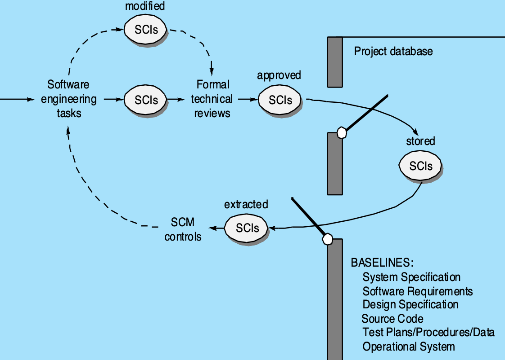

- IEEE 的定义：经**正式评审**并达成一致的**规范**或产品，此后作为进一步开发的基础，且只能通过**正式的变更控制**程序进行更改
- 基线是软件开发中的一个里程碑，以交付一个或多个**软件配置项**(software configuration item, **SCI**)，以及通过正式技术评审获得对这些 SCI 的批准为标志

软件配置对象是被单独标识和管理的**信息单元**：

    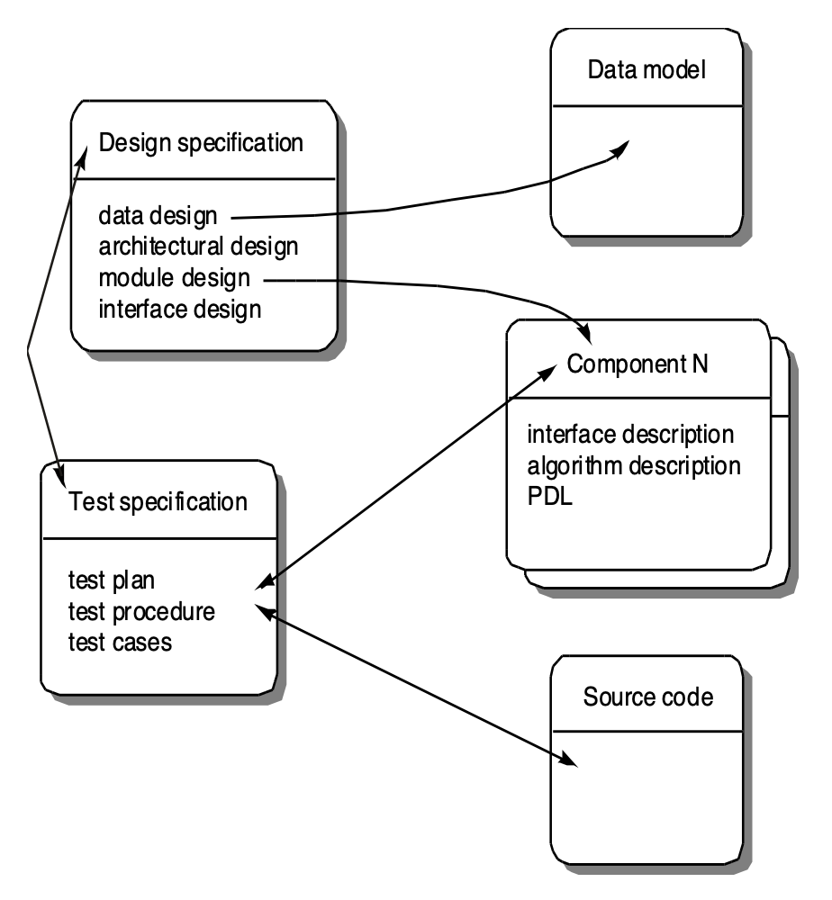

**SCM 仓库**(repository)是一组机制和数据结构，使软件团队能够有效管理变更。它执行或促成以下功能：

- 数据完整性(data integrity)
- 信息共享  
- 工具集成  
- 数据集成  
- 方法论强制执行(methodology enforcement)
- 文档标准化

**仓库内容**：

    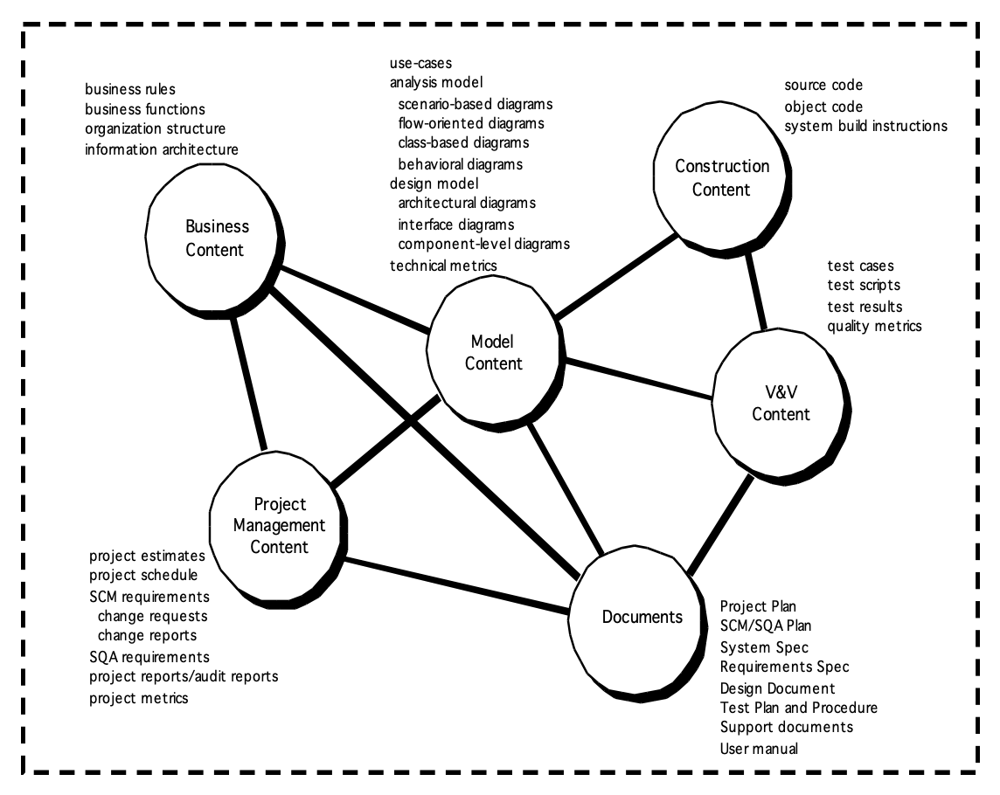

仓库特点：

- **版本控制**(versioning)：保存所有版本的记录，以便有效管理产品发布，并允许开发人员回退至先前版本
- **依赖跟踪与变更管理**(dependency tracking and change management)：存储库管理其中存储的数据元素之间多种多样的关系
- **需求追溯**(requirements tracing)：提供跟踪源自特定需求规格的所有设计、构建组件及可交付成果的能力
- **配置管理**(configuration management)：跟踪代表特定项目里程碑或生产发布的一系列配置；版本管理提供所需版本，链接管理则跟踪相互依赖关系
- **审计追踪**(audit details)：建立关于变更时间、原因及执行者的附加信息

SCM 元素：

- **组件**元素：一组在文件管理系统（如数据库）内耦合的工具，能够访问和管理每个软件配置项
- **过程**(process)元素：一系列程序和任务，为所有参与计算机软件管理、工程和使用的相关方定义了一种有效的变更管理（及相关活动）方法
- **构建**元素：一组工具，通过确保已组装正确的已验证组件集（即正确的版本），来自动化软件的构建
- **人员**(human)元素：为了实施有效的 SCM，软件团队使用一组工具和过程特性（涵盖其他 CM 元素）

SCM 过程解决以下问题：

- 软件团队如何识别软件配置中的各个离散元素？
- 组织如何管理程序（及其文档）的众多现有版本，以便高效地适应变更？
- 组织如何在软件发布给客户前后控制变更？
- 谁负责审批变更并确定其优先级？
- 如何确保变更已正确实施？
- 采用何种机制通知相关人员已进行的变更？

    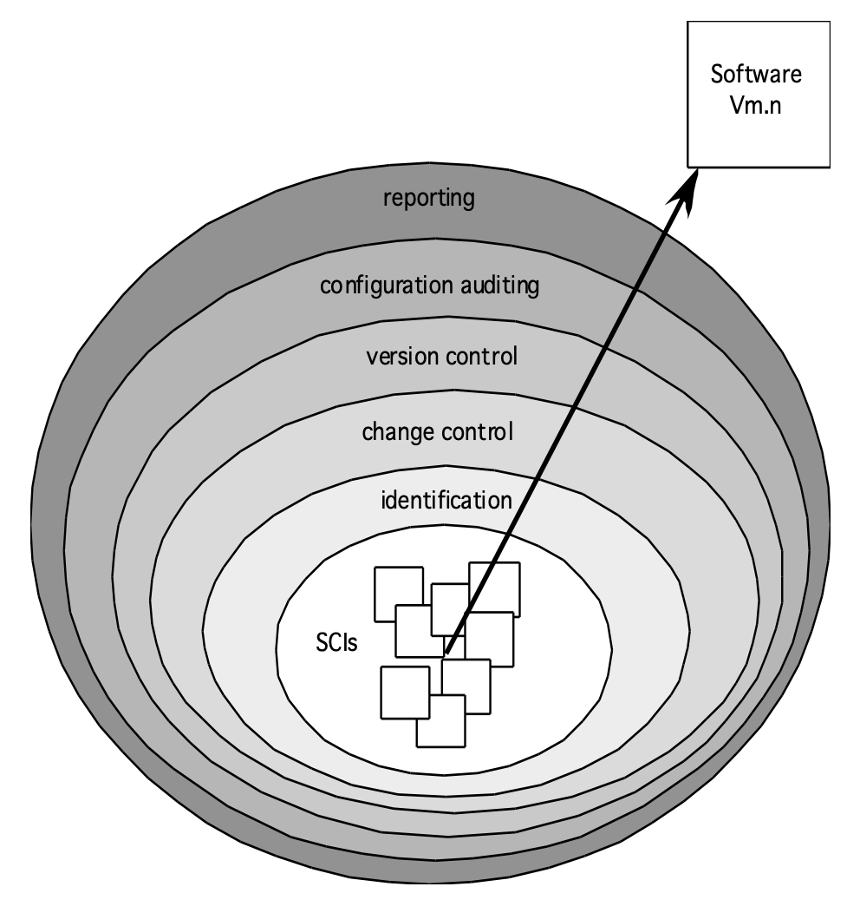

**版本控制**(version control)：

- 结合了各种流程和工具，用于管理软件过程中创建的配置对象的不同版本  
- 版本控制系统实现或直接集成了四大核心功能：  
    - 一个用于存储所有相关配置对象的**项目数据库**(project database)（**仓库**(repository)）  
    - 一个**版本管理**(version management)功能，用于存储配置对象的所有版本（或能够利用与先前版本的差异构建任意版本）
    - 一个**构建工具**(make facility)，使软件工程师能够收集所有相关配置对象并构建特定版本的软件
    - 一个**问题追踪**(issues tracking)（也称为缺陷追踪）功能，使团队能够记录并跟踪与每个配置对象相关的所有未解决问题的状态

**数据仓库元模型**(data repository meta model)描述了数据在仓库中的组织、存储结构和关系，因此它决定了**信息的存储方式**、影响**数据完整性**的维护、以及模型在需要时的**扩展性**。许多数据仓库的需求与典型**数据库**应用的需求是相同的。

**变更控制过程**(change control process)：

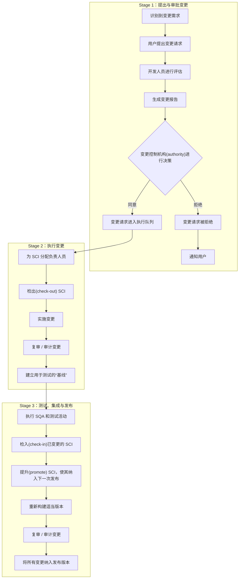
```mermaid
flowchart TD
    %% 变更控制过程 I
    subgraph P1[Stage 1：提出与审批变更]
        A[识别到变更需求] --> B[用户提出变更请求]
        B --> C[开发人员进行评估]
        C --> D[生成变更报告]
        D --> E{"变更控制机构(authority)进行决策"}
        E -->|同意| F[变更请求进入执行队列]
        E -->|拒绝| G[变更请求被拒绝]
        G --> H[通知用户]
    end

    %% 变更控制过程 II
    subgraph P2[Stage 2：执行变更]
        F --> I[为 SCI 分配负责人员]
        I --> J["检出(check-out) SCI"]
        J --> K[实施变更]
        K --> L[复审 / 审计变更]
        L --> M[建立用于测试的“基线”]
    end

    %% 变更控制过程 III
    subgraph P3[Stage 3：测试、集成与发布]
        M --> N[执行 SQA 和测试活动]
        N --> O["检入(check-in)已变更的 SCI"]
        O --> P["提升(promote) SCI，使其纳入下一次发布"]
        P --> Q[重新构建适当版本]
        Q --> R[复审 / 审计变更]
        R --> S[将所有变更纳入发布版本]
    end
```

审计：当软件配置管理成为一项正式活动时，软件配置审计由 **QA 组**负责。

    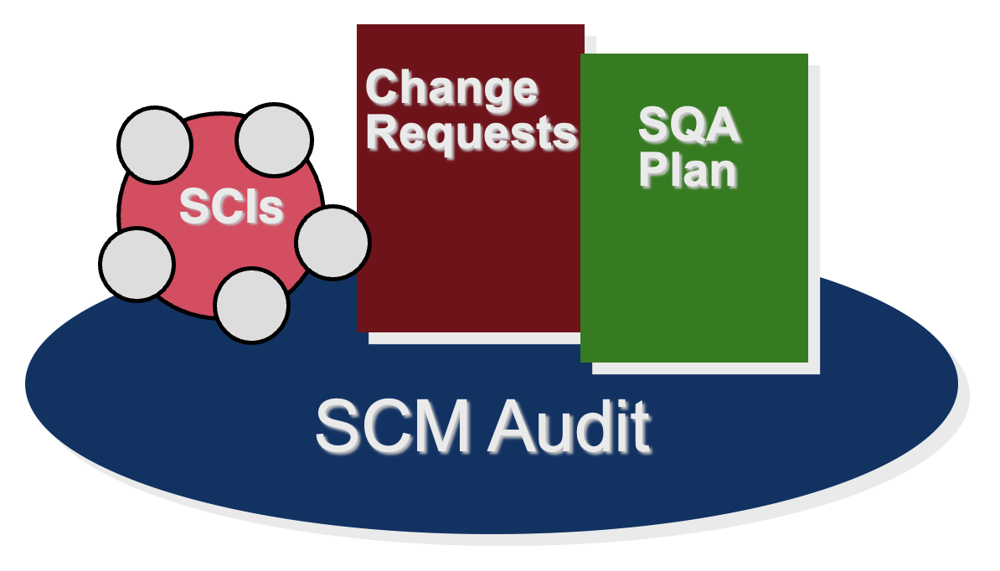

状态会计(status accounting)：

    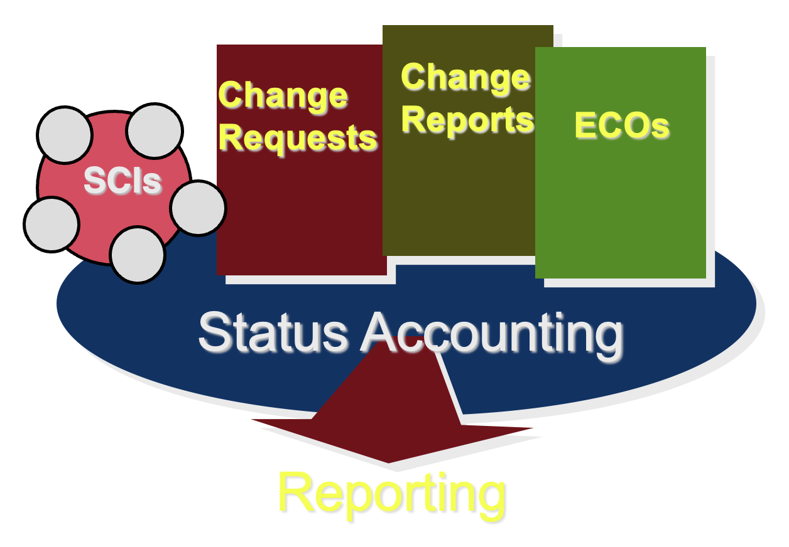

**配置状态报告**(configuration status reporting)主要是确保所有受影响的相关人员能够**及时获得最新的变更信息**。它属于配置管理的重要环节，用于跟踪和传递软件项目中各配置项的变更状态，防止因信息滞后影响项目进展。

---
用于 Web 和移动 App 工程的 SCM：

- **内容**：
    - 一个典型的 Web 或移动 App 包含大量内容：文本、图形、小程序、脚本、音频/视频文件、表单、活动页面元素、表格、流数据等
    - 挑战在于将这些海量内容组织成成一组合理的配置对象，然后为这些对象建立适当的配置控制机制

- **人员**：由于相当大比例的 Web 和移动 App 开发仍采用即兴方式(ad hoc manner)进行，任何参与该应用的人员都可能（并且经常）创建内容
- **可扩展性**(scalability)：随着规模和复杂性的增长，微小的更改可能会产生深远且意想不到的影响，从而引发问题，因此配置控制机制的严格程度应与应用程序的规模成正比

- **制度问题**(politics)：
    - 谁“拥有”应用程序？  
    - 谁对应用程序所显示信息的准确性负责？  
    - 谁确保信息信息发布到站点前已遵循质量控制流程？  
    - 谁负责进行更改？  
    - 谁承担更改的成本？

Web 和移动 App 的**内容管理**：

    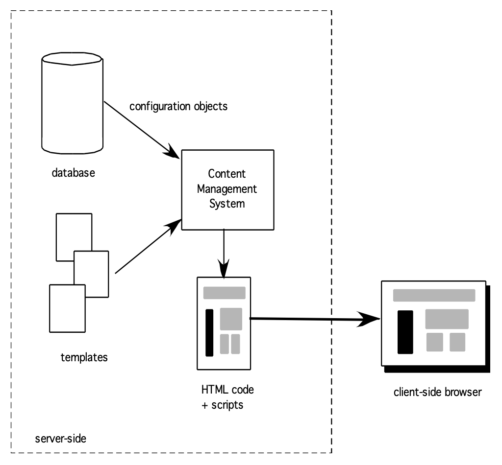

- **收集子系统**(collection subsystem)涵盖了创建和/或获取内容所需的所有操作，以及
    - 将内容转换为可通过标记语言（如 HTML、XML）表示的形式
    - 将内容组织成能够在客户端有效显示的数据包
  
    所必需的技术功能

- **管理子系统**(management subsystem)实现了一个包含以下要素的存储库：
    - **内容数据库**(content database)：用于存储所有内容对象的信息结构
    - **数据库功能**(database capabilities)：使内容管理系统能够搜索特定内容对象（或对象类别）、存储和检索对象，并管理为内容建立的文件结构的功能
    - **配置管理功能**(configuration management functions)：支持内容对象标识、版本控制、变更管理、变更审计和报告的功能要素及相关工作流程

- **发布子系统**(publishing subsystem)从仓库中提取内容，将其转换为适合发布的形式，并进行格式化，以便能够传输到客户端浏览器；发布子系统通过一系列**模板**(templates)完成这些任务，每个模板都是一个函数，它使用以下三种不同组件之一来构建发布内容：
    - **静态元素**(static elements)：文本、图形、媒体和脚本等无需进一步处理的内容直接传输到客户端
    - **发布服务**(publication services)：对特定的检索和格式化服务进行函数调用，以个性化内容（使用预定义的规则）、执行数据转换并构建适当的导航链接
    - **外部服务**(external services)：提供对外部企业信息基础设施（如企业数据或“后台”应用程序）的访问

- **不负责将内容在用户屏幕上显示**（这一块由前端技术和浏览器完成）

Web 和移动 App 的变更管理（最好以**敏捷**方式进行）：

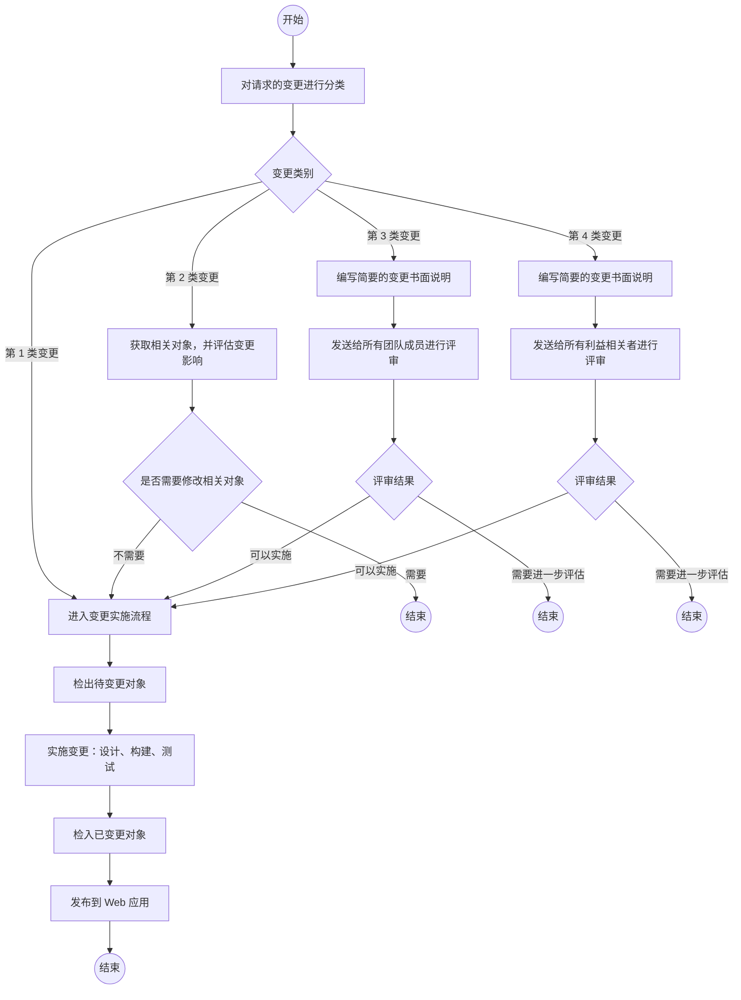
```mermaid
flowchart TD
    Start(("开始")) --> A["对请求的变更进行分类"]
    A --> B{"变更类别"}

    B -->|第 1 类变更| Join["进入变更实施流程"]

    B -->|第 2 类变更| C["获取相关对象，并评估变更影响"]
    C --> D{"是否需要修改相关对象"}
    D -->|需要| Stop1(("结束"))
    D -->|不需要| Join

    B -->|第 3 类变更| E["编写简要的变更书面说明"]
    E --> F["发送给所有团队成员进行评审"]
    F --> G{"评审结果"}
    G -->|需要进一步评估| Stop2(("结束"))
    G -->|可以实施| Join

    B -->|第 4 类变更| H["编写简要的变更书面说明"]
    H --> I["发送给所有利益相关者进行评审"]
    I --> J{"评审结果"}
    J -->|需要进一步评估| Stop3(("结束"))
    J -->|可以实施| Join

    Join --> K["检出待变更对象"]
    K --> L["实施变更：设计、构建、测试"]
    L --> M["检入已变更对象"]
    M --> N["发布到 Web 应用"]
    N --> End(("结束"))
```

## Project Metrics

本章中描述的大多数技术性软件度量都是对软件属性的**间接度量**，这些度量对于软件质量的定量评估是有用的。

**测量**(measure)：提供了产品或过程某个属性的程度、数量、维度、容量或大小的定量指示。

**度量**(metric)：对系统、组件或过程拥有某一属性的程度的定量测量。

**指标**(indicator)：一种或多种度量的组合，用于洞察软件过程、软件项目或产品本身。

测量原则：

- 测量**目标**应在数据收集开始前确定
- 每项技术指标应以**无歧义**的方式定义
- 指标应基于对应用领域**有效**的理论推导得出（例如，设计指标应借鉴基本设计概念和原理，并试图表明所需属性的存在
- 指标应量身定制，以**最好**地适应特定产品和流程

测量过程：

1. **制定**(formulation)：推导适合所考虑软件表示的软件测量与度量
2. **收集**：用于积累必要数据以计算所制定度量的机制
3. **分析**：计算度量并应用数学工具
4. **解读**(interpretation)：评估度量结果以深入理解表示的质量
5. **反馈**：从产品度量的解读中得出的建议，传递给软件团队

度量属性：

- **简单且可计算**：学习导出度量标准应相对容易，其计算也不应耗费过多精力或时间
- **经验上和直觉上有说服力**(empirically and intuitively persuasive)：度量标准应满足工程师对产品属性直观的理解
- **一致且客观**(objective)：度量标准应始终产生明确无误的结果
- **在单位和量纲的使用上保持一致**(consistent in its use of units and dimensions)：度量标准的数学计算应采用不会导致单位组合怪异的测量方法
- **与编程语言无关**：度量标准应基于分析模型、设计模型或程序本身的结构
- **有效的质量反馈机制**：即度量标准应为软件工程师提供能够导向更高质量最终产品的信息

收集与分析原则：

- 数据收集和分析应尽可能实现自动化
- 应运用有效的统计技术来建立内部产品属性与外部质量特性之间的关系
- 应为每个度量制定解释性指南和建议

**需求模型**的度量：

- 基于**功能**的度量：使用功能点作为归一化因子或作为规范大小的度量
    - **功能点**(function point, **FP**)度量可有效用于衡量系统所交付的功能性，通过基于软件**信息域**可计数（直接）度量与软件**复杂性**评估的经验关系得出的
    - 在实际使用时，通常需要依赖**历史项目数据**来进行技术决策，如估算工作量、进度和成本
    
        

            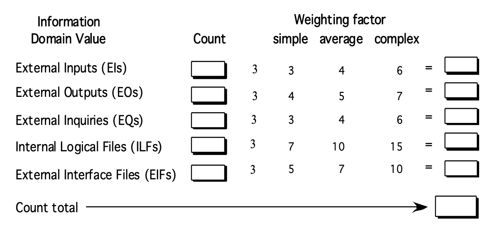
        

    
    - 信息域值定义如下：
        - 外部输入数（EIs）
        - 外部输出数（EOs）
        - 外部查询数（EQs）
        - 内部逻辑文件数（ILFs）
        - 外部接口文件数（EIFs）

- **规范**度量：通过按类型测量需求数量来作为质量指标
    - Davis 提出的需求规格度量主要衡量需求规格说明的**具体性**(specificity)和**完整性**(completeness)
        - 具体性：需求描述是否明确、无歧义
        - 完整性：需求是否覆盖所有应有的功能和约束

**架构**设计度量：

- 结构复杂度 = g(扇出)
- 数据复杂度 = f(输入和输出变量, 扇出)
- 系统复杂度 = h(结构复杂度和数据复杂度)
- **HK 度量**：架构复杂度作为扇入和扇出的函数
- **形态学度量**(morphology metrics)：模块数量与模块间接口数量的函数

**面向对象**设计度量：

- **规模**：数量、体积、长度和功能四个维度
- **复杂性**：各类的相互关联程度
- **耦合**：各元素之间的物理连接
- **充分性**：从当前应用的角度来看，抽象所具备所需特征的程度，或设计组件在其抽象中所具备特征的程度
- **完整性**：对抽象或设计组件可重用程度的一种间接暗示
- **内聚**：所有操作协同工作以实现单一、明确定义的目标的程度
- **原子性**：应用于操作和类，指一个操作是原子的程度
- **相似性**：两个或多个类在结构、功能、行为或目的方面相似的程度
- **易变性**：衡量变化发生的可能性

**面向类**的度量：

- 每个类的加权方法数  
- 继承树的深度
- 子类数量  
- 对象类之间的耦合  
- 类的响应  
- 方法内聚的缺乏
- 类大小  
- 子类重写的操作数量  
- 子类添加的操作数量  
- 特化指数(specialization index)
- 方法继承因子
- 耦合因子
- 多态因子

**面向操作**的度量：

- 平均操作规模
- 操作复杂度
- 每个操作的平均参数数量

大多数面向对象的软件度量主要关注类本身，如类的复杂度、耦合、内聚等，因此针对**类内部**单个操作或方法的度量指标相对**较少**。

**组件级**设计度量：

- **内聚**度量：数据对象及其定义焦点的函数
- **耦合**度量：输入输出参数、全局变量及被调用模块的函数
- **复杂性**度量：已有数百种被提出（比如圈复杂度）

界面设计度量：

- **布局适宜性**(layout appropriateness)：取决于布局实体、地理位置及在实体间进行转换的成本

**Web 和移动 App** 的设计度量：

- 用户界面是否促进了可用性？
- 应用程序的美观性是否适合其应用领域并能令用户满意？
- 内容的设计是否以最少的努力传递最多的信息？
- 导航是否高效且直观？
- 应用程序的架构是否设计为适应应用程序用户的特殊目标和目的、内容与功能的结构，以及有效使用系统所需的导航流程？
- 组件是否设计为降低流程复杂性并提升正确性、可靠性和性能？

**代码**度量：

- **Halstead 软件科学**：一套全面的度量指标，全部基于组件或程序中**运算符**和**操作数**的数量（计数和出现次数）
    - 需要注意的是，Halstead 的定律引发了大量争议，许多人认为其基础理论存在缺陷，但已有针对特定编程语言的实验验证

**测试**度量：

- 主要有两类
    - 关注**测试覆盖率**，用于衡量测试对代码或功能的覆盖程度；
    - 预测所需**测试用例数量**，便于测试计划和资源分配

- 测试工作量也可以通过基于 Halstead 度量的指标来估算
- Binder 提出了一系列对面向对象系统的可测试性有直接影响的设计度量指标
    - 方法内聚性不足（LCOM）
    - 公有和保护成员百分比（PAP）
    - 数据成员的公有访问（PAD）
    - 根类数量（NOR）
    - 扇入（FIN）
    - 子类数量（NOC）和继承树深度（DIT）

**维护**指标：IEEE 标准 982.1-1988 提出了一种**软件成熟度指数**(software maturity index, **SMI**)，用于指示软件产品的**稳定性**（基于每次产品发布所发生的变化）。需要确定以下信息：

- $M_T$ = 当前发布中的模块总数  
- $F_c$ = 当前发布中已被更改的模块数量  
- $F_a$ = 当前发布中新增的模块数量  
- $F_d$ = 前一次发布中在当前发布中被删除的模块数量  

软件成熟度指数的计算方式如下：

$$
\text{SMI} = [M_T - (F_a + F_c + F_d)] / M_T
$$

当 $\text{SMI}$ 接近 1.0 时，产品开始趋于稳定。

**GQM**（目标/问题/度量）范式用于为软件开发设定目标，通过提出相关问题，然后确定合适的度量方法收集数据，以改进软件过程和产品质量。它帮助组织科学地度量和管理软件工程活动，不用于追查或归咎于个人的软件失败。

## Project Management Concepts

软件项目管理的 4 个 P：

- **人**(people)：成功项目的最重要元素  
- **产品**(product)：待构建的软件  
- **过程**(process)：完成工作所需的一系列框架活动和软件工程任务  
- **项目**(project)：使产品成为现实所需的所有工作

**利益相关者**(stackholder)：

- **高级经理**：他们定义的业务问题往往对项目有重大影响
- **项目经理**（技术经理）：他们必须规划、激励、组织和控制进行软件开发的专业人员
- **从业者**(practitioners)：他们提供构建产品或应用程序所需的技术技能
- **客户**：他们指定要构建的软件的要求，以及其他对结果有间接兴趣的相关方
- **终端用户**：他们在软件投入生产使用后与之互动

**MOI 模型**：一个优秀的软件团队领导者通常需要具备三种核心能力：

- **动机**(motivation)：激励技术人员发挥最大能力的能力
- **组织**(organization)：塑造现有流程（或创造新流程）的能力，使初始概念能够转化为最终产品
- **想法**(ideas)或**创新**(innovation)：鼓励人们创造并感受创造力的能力，即使他们必须在特定软件产品或应用的既定范围内工作

组织范式、影响团队结构的因素、团队毒性因素、敏捷团队在前面介绍[人的因素](basics.md#human-aspects-of-software-engineering)时介绍过了，这里省略。

团队协作与沟通：

- **正式的、非个人化的方法**：包括软件工程文档和工作产品（包括源代码）、技术备忘录、项目里程碑、进度安排和项目控制工具、变更请求及相关文档、错误追踪报告以及仓库数据
- **正式的人际程序**：侧重于应用于软件工程工作产品的质量保证活动，这些活动包括状态**审查会议**以及设计与代码**审查**
- **非正式的人际程序**：包括用于信息传播和问题解决的**小组会议**，以及需求与开发人员的协同定位
- **电子通信**：包含电子邮件、电子公告板，以及由此延伸的基于视频的会议系统
- **人际网络**：包括与团队成员以及项目外部那些可能具备有助于团队成员的经验或见解的人员进行非正式讨论

**产品范围**(product scope)：

- **上下文**：待构建的软件如何融入更大的系统、产品或业务环境？这种环境带来了哪些限制？
- **信息目标**：软件输出中产生了哪些客户可见的数据对象？输入需要哪些数据对象？
- **功能**与**性能**：软件执行什么功能以将输入数据转换为输出？是否需要处理特殊的性能特性特性？
- **可靠性**、**接口**、**安全性**

软件项目范围必须在管理层面和技术层面明确且可理解。

**问题分解**(problem decomposition)有时称为划分或问题细化。一旦定义好范围，问题可按**组成功能**(constituent functions)、**用户可见的数据对象**(user-visible data objects)或**一组问题类**(a set of problem classes)分解。分解过程持续进行，直到所有功能或问题类被定义。

随着项目计划的推进，**产品**和**过程**的分解是**同时**进行的。

不管项目大小、重要性或开发方式如何，过程框架中的基本活动（如通信、计划、建模、构建、部署）都必须执行，**不能**因为项目特殊情况而**省略**。

一旦建立了**过程框架**(process framework)，需考虑项目特性，确定所需严谨程度(degree of rigor)，并为每个软件工程活动定义**任务集**（**软件工程任务** + **工作产品**（**交付物**(deliverables)）+ **QA 点** + **里程碑**）。

融合(melding)问题与过程：

    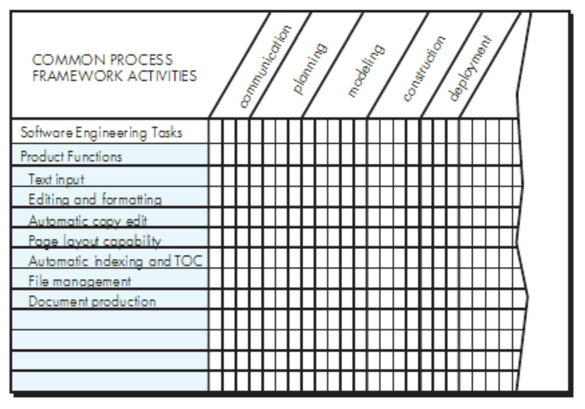

项目陷入困境的原因包括：

- 软件人员不了解客户需求
- 产品范围定义不清
- 变更管理不当
- 所选技术发生变化
- 业务需求发生变化（或定义不明确）
- 截止日期不切实际
- 用户抵触
- 失去支持（或从未得到适当支持）
- 项目团队缺乏具备相应技能的人员
- 管理人员（及实践者）回避最佳实践和经验教训

项目的共识方法：

- **良好起步**(start on the right foot)：这需要付出（非常）努力去理解待解决的问题，然后设定切合实际的目标和期望
- **保持势头**(maintain momentum)：项目经理需提供激励措施，将人员流动率降至最低；团队应在每项任务中强调质量；高层管理人员应尽一切可能避免干扰团队工作
- **跟踪进度**(track progress)：对于软件项目，进度通过工作产品（如模型、源代码、测试用例集）的生成和批准（通过正式技术评审）来跟踪，作为质量保证活动的一部分
- **做出明智决策**(make smart decision)：本质上，项目经理和软件团队的决策应遵循“**保持简单**”原则
- **进行事后分析**(conduct a postmortem analysis)：建立一套一致的机制，为每个项目总结经验教训

把握项目的本质（**W5HH 原则**）：

- **为什么要开发该系统**？（Why）
- **将要做什么**？（What）
- **什么时候完成**？（When）
- **谁负责**？（Who）
- **他们在组织中的位置在哪里**？（Where）
- **从技术和管理角度，如何完成这项工作**？（How）
- **每种资源**（比如人、软件、工具、数据库）**需要多少**？（How much）

关键实践：

- **正式风险管理** 
- **经验性成本和排期估算**
- **基于指标的项目管理**  
- **挣值跟踪**(earned value tracking) 
- **针对质量目标的缺陷跟踪**  
- **以人为本的项目管理**(people aware project management)

## Process and Project Metrics

一位好经理会测量：

    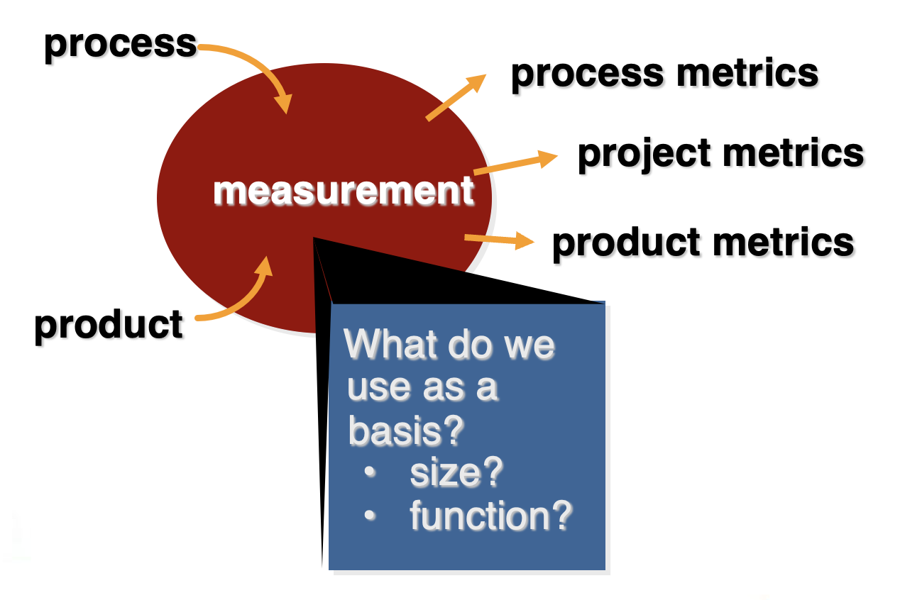

为何需要测量：

- 评估进行中项目的状态  
- 跟踪潜在风险  
- 在问题区域变得严重前发现它们  
- 调整工作流程或任务  
- 评估项目团队控制软件工作产品质量的能力

过程测量：

- 通过**间接**方式衡量软件过程的有效性，根据过程可产生的结果推导出一组度量指标，这些结果包括：
    - 软件发布前发现的错误数量度量
    - 交付给最终用户并由其报告的错误数量
    - 交付的工作产品（生产力）
    - 投入的人力
    - 花费的时间
    - 进度符合度
    - ...

- 还通过测量特定软件工程**任务**的特性来推导过程度量

过程指标指南：

- 解读度量数据时，需运用常识并保持组织敏感性
- 定期向收集度量指标的个人和团队提供反馈
- **不要使用指标来评估个人**
- 与从业者和团队合作，设定清晰的目标以及用于实现这些目标的指标
- **切勿用指标来威胁个人或团队**
- 表明存在问题的度量数据不应被视为“负面”，这些数据仅仅是流程改进的参考指标
- 不要过度关注单一指标而忽略其他重要指标

软件过程改进：

    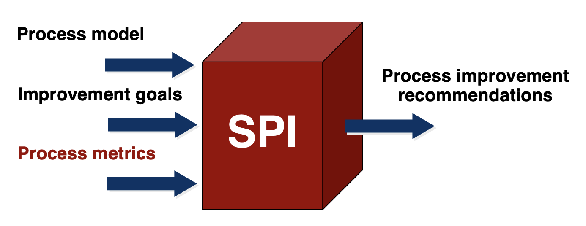

**过程度量**：

- **质量相关**(quality-related)：关注工作产品和交付成果的质量  
- **生产力相关**(productivity-related)：工作产品的产出与投入的精力相关  
- **统计 SQA 数据**：错误分类与分析  
- **缺陷移除效率**(defect removal efficiency)：错误在过程活动间的传播  
- **复用数据**(reuse data)：已生产组件的数量及其可复用程度

**项目度量**：

- 用于通过必要的调整来避免延误并减轻潜在问题和风险，从而**最小化开发进度**
- 用于持续**评估产品质量**，并在必要时修改技术方法以提高质量
- 每个项目都应衡量：
    - **输入**：衡量完成工作所需资源（例如人员、工具）的指标
    - **输出**：衡量软件工程过程中创建的交付物或工作产品的指标
    - **结果**：衡量交付物有效性的指标

典型项目度量：

- 每项软件工程任务的工作量/时间
- 每审查小时发现的错误数
- 计划里程碑日期与实际里程碑日期的对比
- 变更（数量）及其特征
- 软件工程任务工作量的分布

典型的**面向规模**的度量：

- 每 KLOC（千行代码）的错误数
- 每 KLOC 的缺陷数
- 每 LOC 的成本
- 每 KLOC 的文档页数
- 每人月的错误数
- 每评审小时的错误数
- 每人月的 LOC 数
- 每页文档的成本

典型的**面向功能**的度量：

- 每 FP（功能点）的错误数
- 每 FP 的缺陷数
- 每 FP 的成本
- 每 FP 的文档页数
- 每人月的 FP 数

为何「功能点」优于「代码行数」？

- **独立于编程语言**  
- 使用在软件过程早期（**设计完成前**）即可确定的、易于计数的特性  
- 不会惩罚那些使用比笨重版本更少代码行数的创新（简短）实现  
- 使得衡量可重用组件的影响更加容易

**面向对象**项目的度量：

- **场景脚本**数量（用例）
- **支持类**（实现系统所需但与问题领域无直接关联的类）数量
- **每关键类**（分析类）的平均**支持类**数量
- **子系统**（系统中对终端用户可见功能支持的类聚合）数量
- 可以与**历史项目数据**结合，以提供有助于项目估算的度量指标

**WebApp** 项目度量：

- **静态网页**（终端用户无法控制页面上显示的内容）数量
- **动态网页**（终端用户操作导致页面上显示定制化内容）数量
- **内部页面链接**（内部页面链接是指向 WebApp 内其他网页的超链接指针）数量
- **持久性数据对象**(persistent data objects)数量  
- **外部系统接口**数量  
- **静态内容对象**数量  
- **动态内容对象**数量  
- **可执行功能**数量

测量**质量**：

- **准确性**(correctness)：程序按照规范运行的程度
- **可维护性**(maintainability)：程序易于变更的程度
- **完整性**(integrity)：程序抵御外部攻击的程度
- **可用性**(usability)：程序易于使用的程度

**缺陷移除效率**(defect removal efficiency)可以在**过程**和**项目**两个层面使用。公式为：**DRE = E /(E + D)**

- E：在软件交付给最终用户之前发现的错误数量
- D：交付之后发现的缺陷数量

**小组织**的度量：

- $t_{\text{queue}}$：从提出请求到评估完成所经过的时间（小时或天数）
- $W_{\text{eval}}$：执行评估所需的工作量（人时）
- $t_{\text{eval}}$：从评估完成到将变更单分配给人员所经过的时间（小时或天数）
- $W_{\text{change}}$：进行变更所需的工作量（人时）
- $t_{\text{change}}$：进行变更所需的时间（小时或天数）
- $E_{\text{change}}$：在变更工作中发现的错误
- $D_{\text{change}}$：变更发布给客户群后发现的缺陷

**公共度量**(public metrics)是团队或组织层面对外公开的软件开发**过程**和**产品**度量数据，主要用于帮助团队和管理层了解项目整体状况并做决策。

## Estimation

**项目计划**的总体目标是建立一套务实的策略，帮助项目经理合理**估算**项目的成本和进度，用于控制、跟踪和监控复杂的技术项目。它包含以下任务：

- 确定项目**范围**
    - 软件范围描述了：
        - 交付给最终用户的**功能**和特性
        - 输入和输出的**数据**
        - 因使用软件而呈现给用户的**内容**
        - 界定系统的**性能**、约束、接口和可靠性

    - 范围的确定采用以下两种方法之一：
        - 在与所有利益相关者沟通后，编写软件范围的叙述性描述
        - 由最终用户制定一组用例

- 评估**可行性**：**技术**、**财务**(finance)、**时间**和**资源**
- 分析**风险**
- 定义所需**资源**（人力资源、可复用的软件资源、环境资源）

    

        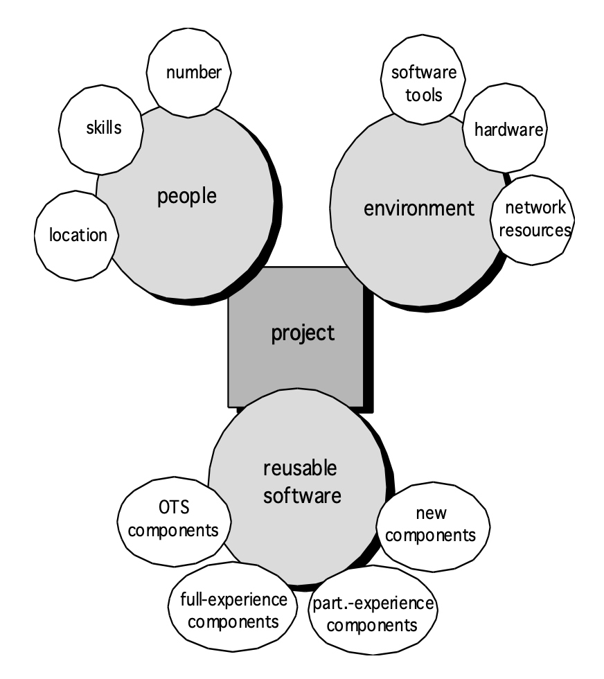
    

- 估算**成本**与**工作量**
    - 分解问题  
    - 使用规模、功能点、流程任务或用例制定两个或更多估算值  
    - 协调估算值  

- 制定**项目排期**(project schedule)
    - 建立有意义的任务集  
    - 定义任务网络  
    - 使用进度工具开发时间线图  
    - 定义进度跟踪机制

对软件工程工作所需的资源、成本与进度进行**估算**(estimation)，需要具备：

- **经验**
- 获取良好的**历史**信息（度量指标）的能力
- 在仅有定性信息时，敢于做出**定量**预测的勇气

估算本身带有固有风险，而这种风险会导致不确定性。

项目估算：

- 必须理解项目**范围**  
- **详细说明**(elaboration)（分解）是必要的  
- **历史指标**非常有用  
- 至少应使用**两种不同的技术**  
- **不确定性**是过程固有的

当各项估算之间的一致性较差时，原因往往可以追溯到**项目范围定义不充分**或**生产率数据不合适**。

估算技术的分类：

- **过去（类似）项目经验**  
- **传统估算技术**
    - 任务分解与工作量估算  
    - 规模（例如功能点）估算

- **经验模型**(empirical models)
- **自动化工具**

估算精度取决于以下因素：

- **规划者对待构建产品规模进行准确估算的程度**  
- 将规模估算**转化**为人力投入、日历时间和资金的**能力**（这取决于过去项目中可靠软件度量数据的可用性）  
- 项目计划反映**软件团队能力**的程度  
- **产品需求的稳定性**以及支持软件工程工作的环境的稳定性

功能分解：

    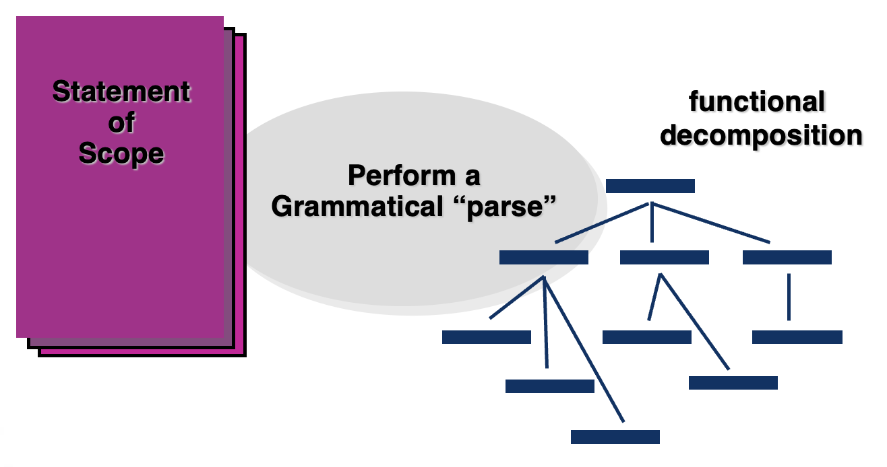

传统方法：**LOC/FP 方法**

- 使用**软件功能**/**信息域值**的估算来计算 **LOC**/**FP**
- 利用历史数据为项目构建估算

基于**过程**的估算基于**软件功能**和**过程活动**进行。

    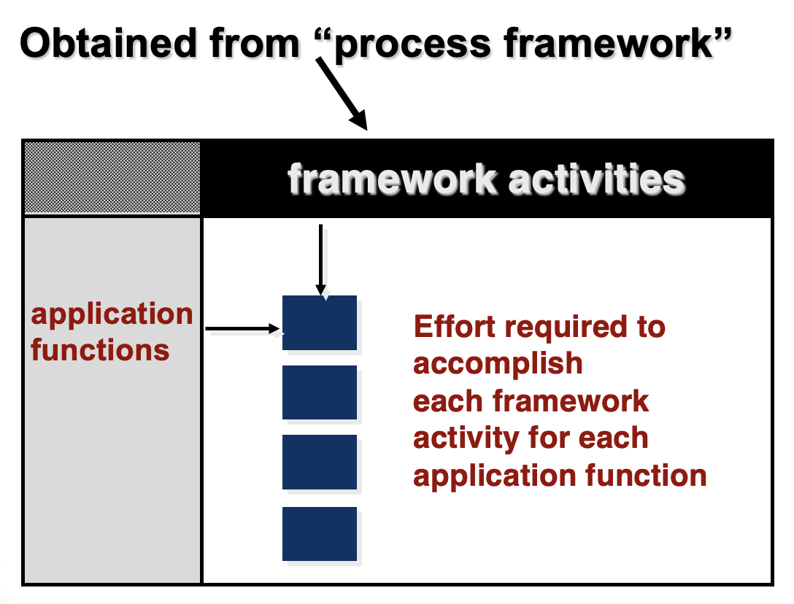

基于**工具**的估算需获取项目特点、校准因素(calibration factors)和 LOC/FP 数据。

**经验估计模型**(empirical estimation models)的一般形式：

    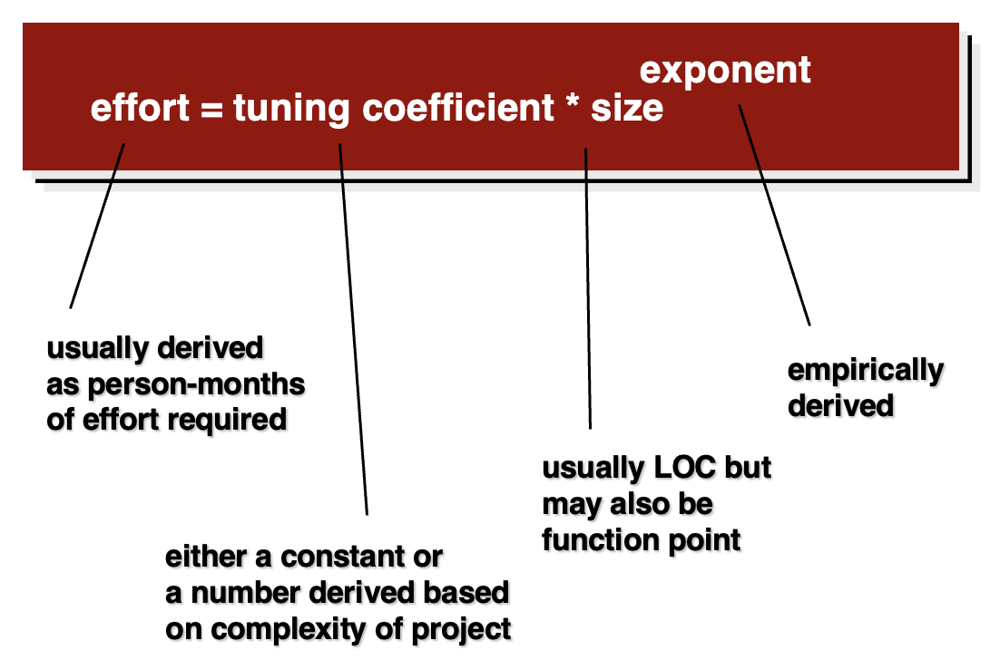

**COCOMO II** 实际上是一个层次化的估算模型体系，支持多种软件规模度量方式，包括 **FP**、**LOC**、**对象点**(object points)等。它涵盖以下领域：

- **应用组合模型**(application composition model)：在软件工程早期阶段使用，此时用户界面原型设计、软件与系统交互考量、性能评估以及技术成熟度评价至关重要
- **早期设计阶段模型**(early design stage model)：在需求确定且基本软件架构建立后使用
- **后架构阶段模型**(post-architecure-stage model)：在软件构建过程中使用

**Putnam 软件方程**是一个动态的经验模型，它有两个独立的参数：一个是规模估算（$\text{LOC}$），另一个是项目日历月或年的持续时间指示（$t$）：

$$
E = [\text{LOC} \times B^{0.333} / P]^3 \times (1/t^4)
$$

其中

- $E$ = 工作量（人月或人年）
- $t$ = 项目持续时间（月或年）
- $B$ = 特殊技能因子
- $P$ = 生产率参数

**OO 项目**的估计：

- 使用工作量分解、**FP 分析**以及任何其他适用于传统应用的方法来制定估算
- 利用面向对象的需求建模，开发**用例**并确定计数
- 从**分析模型**中确定**关键类**（分析类）的数量
- 对应用的**接口**类型进行分类，并为支持类制定一个乘数：

    | 接口类型 | 乘数 |
    |---|---:|
    | 无图形用户界面 | 2.0 |
    | 基于文本的用户界面 | 2.25 |
    | 图形用户界面 | 2.5 |
    | 复杂图形用户界面 | 3.0 |

- 将关键类别的数量乘以乘数，以获得支持类别的估计数量
- 将总类别数量（关键 + 支持）乘以每类平均工作单元数；洛伦兹和基德建议每类 15 至 20 人天
- 通过将每个用例的平均工作单元数相乘来交叉检查基于类别的估计

**敏捷项目**的估计：

- 每个用户场景（即一个微型用例）均被单独考虑，用于估算目的
- 该场景被分解为开发过程中所需的一组软件工程任务
- 每项任务被**单独估算**，可基于历史数据、经验模型或个人经验进行；或者场景的规模可通过代码行数、功能点或其他规模导向型度量（如用例数量）进行估算
- 将每项任务的估算结果相加，得出该场景的总估算值，或者利用历史数据将场景的规模估算值转换为工作量
- 对于某个特定软件增量中所有待实现的场景，将其工作量估算值相加，从而得出该**增量**的工作量估算

使用像**决策树分析**这样的统计技术可以在理清与**自制-外购决策**(make-buy decision)相关的真实成本方面提供一定的帮助。

    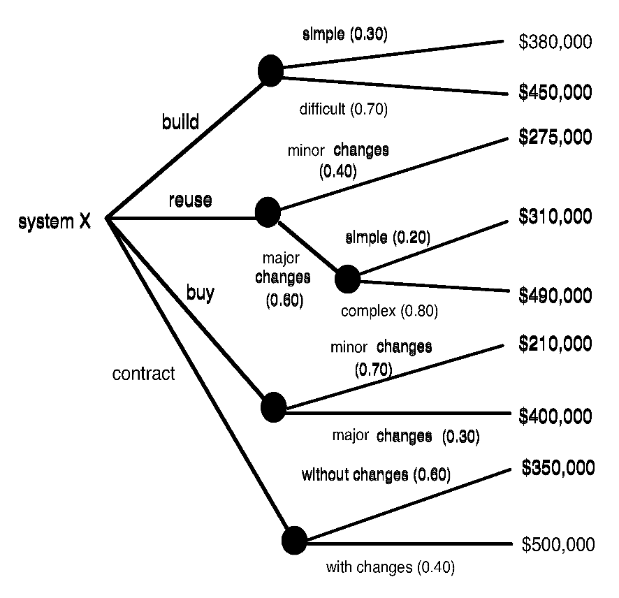

计算期望成本：

$$
\text{expected cost} = \sum (\text{path probability})_i \times (\text{estimated path cost})_i
$$

???+ info "来自题库，但与本章内容无直接关系的知识点"

    - **软件工程环境**(software engineering environment, **SEE**)指的是支持软件开发和维护的各种硬件和软件资源
    - **外包**(outsourcing)有时能降低成本，但并非总是比本地开发更便宜。外包可能带来沟通障碍、质量控制难题、时差影响和隐藏费用等问题，也可能因需求变更或返工导致整体成本上升，因此外包并不总是比现场开发更简单、更便宜的获取软件方式。

## Project Scheduling

项目推迟的原因：

- 软件开发组外人员设定的**不切实际的截止日期**
- **客户需求变更**但未体现在进度调整中
- 对完成工作所需的工作量和/或资源数量的**低估**
- 项目启动时未考虑的**可预见和/或不可预见风险**
- 事先无法预料的**技术困难**
- 事先无法预料的**人为困难**
- 项目人员之间**沟通不畅**(miscommunication)导致延误
- 项目管理未能意识到**项目进度落后**且**未采取纠正措施**

排期原则：

- **分工明确**(compartmentalization)：界定不同的任务  
- **相互依赖**(interdependency)：指明任务间的关联  
- **工作量验证**(effort validation)：确保资源到位  
- **职责清晰**(defined responsibilities)：必须指定负责人  
- **成果明确**(defined outcomes)：每项任务应有产出  
- **里程碑明确**(defined milestones)：进行质量审查

工作量与交付时间：

    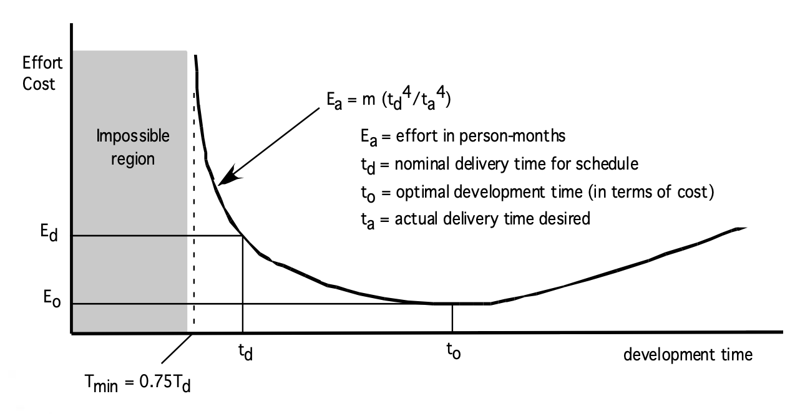

工作量分配：

- 前端活动（40-50%）
    - 客户沟通  
    - 分析  
    - 设计  
    - 审查与修改  

- 构建活动（15-20%）：编码或代码生成  
- 测试与安装（30-40%）  
    - 单元、集成  
    - 白盒、黑盒  
    - 回归

定义任务集：

- 确定项目类型  
- 评估所需的严谨程度  
- 确定适应标准  
- 选择合适的软件工程任务

任务集细化：

    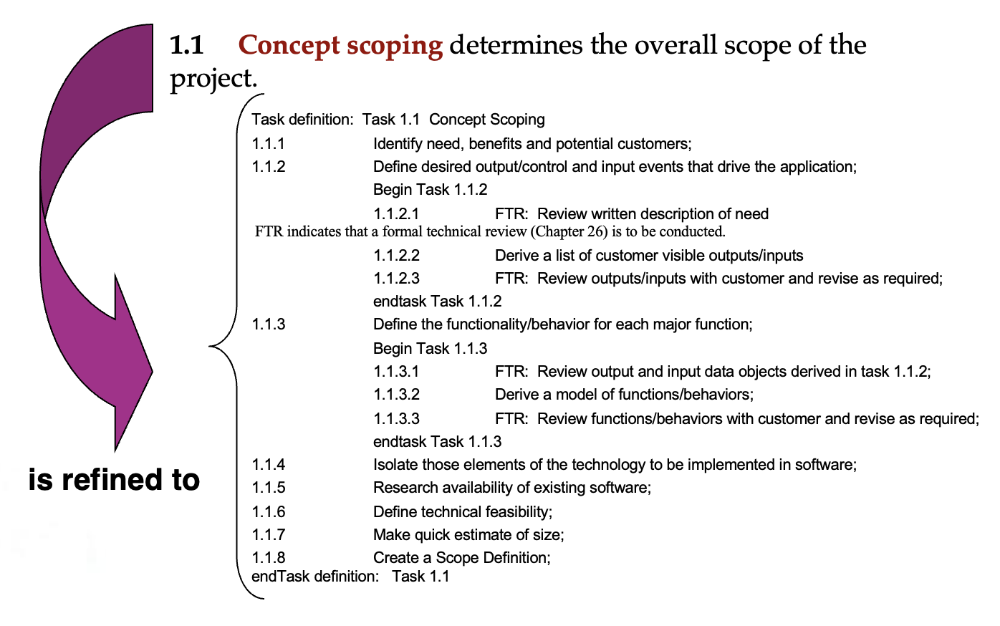

**任务网络**(task network)用于表示项目各任务之间的关系。它可以帮助发现任务之间的**依赖关系**，也能用于分析和确定项目的**关键路径**，即影响项目工期的最长路径。

    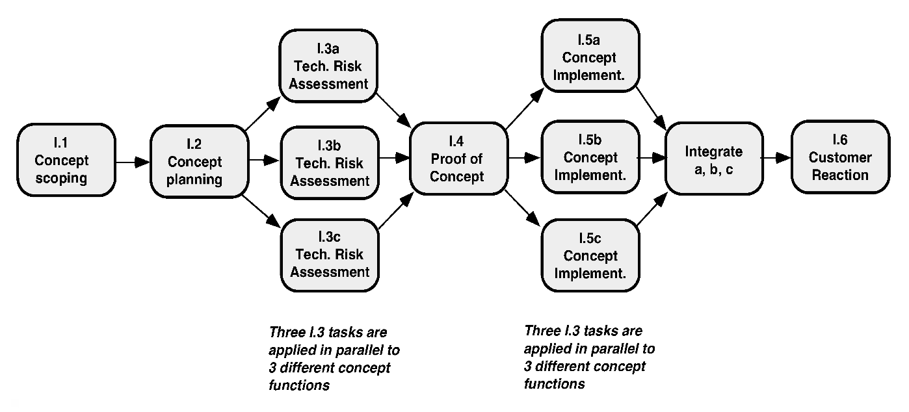

**关键路径法**(critical path method, CPM)和**程序评估与审查技术**(program evaluation and review technique, **PERT**)是常用的网络分析方法，用于计算关键路径、关键活动、最早完成时间和项目总工期。

**时间线图表**(timeline chart)帮助项目经理确定在特定时间点将要进行的任务。

    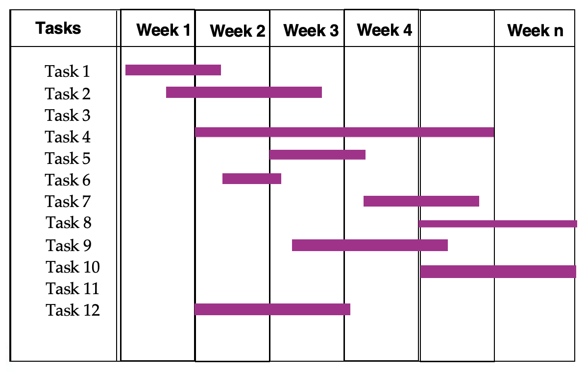

使用自动化工具生成时间线图表：

    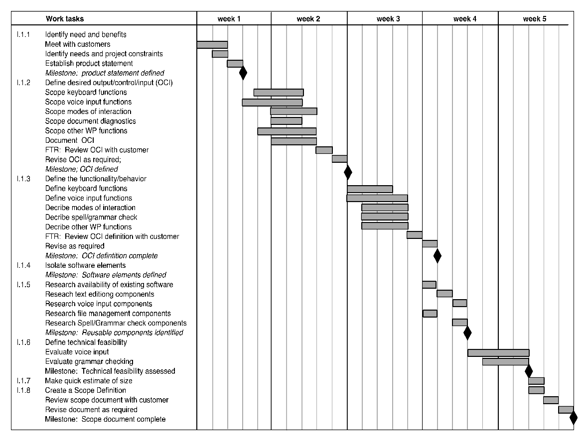

排期追踪：

- **定期召开项目状态会议**，各团队成员汇报进展和问题
- 评估软件工程过程中**所有审查的结果**
- 确定正式**项目里程碑**是否已按计划日期完成
- 将资源表中列出的每个项目任务的**实际开始日期**与计划开始日期进行比较
- 与**非正式**场合与从业者**交流**，获取他们对当前进展和即将出现的问题的主观评价
- 使用**挣值分析**(earned value analysis, **EVA**)对进展进行**定量**评估
    - **挣值**(earned value)是衡量进度的指标，使我们能够通过定量分析来评估项目的完成百分比，而非依赖直觉；从项目进展到 15% 时起，就能提供准确可靠的绩效读数

    

        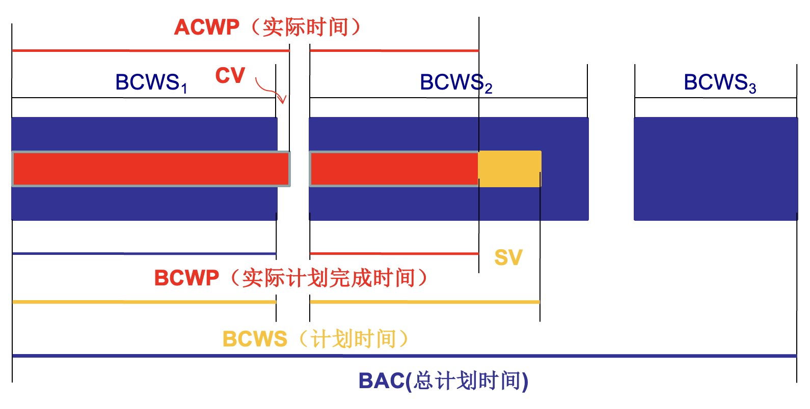
    

    - 挣值计算：
        - **计划工作预算成本**(budgeted cost of work scheduled, **BCWS**)是根据进度计划中列出的每项工作任务确定的
            - BCWS_i 是指工作任务 i 的计划工作量
            - 为了确定项目进度计划中某一特定时间点的进展，BCWS 的数值等于项目进度计划中截至该时间点应已完成的所有工作任务的 BCWS_i 值之和

        - 所有工作任务的 BCWS 值总和即为**完工预算**(budget at completion, **BAC**)，因此

            $$
            \text{BAC} = \sum (\text{BCWS}_k) \text{ for all tasks } k
            $$

        - 接下来，计算**已完成工作的预算成本**(budgeted cost of work performed, **BCWP**)，其值等于项目进度中某个时间点实际已完成的所有工作任务的 BCWS 值之和
        - BCWS 与 BCWP 之间的区别在于，前者代表计划完成活动的预算，而后者代表实际完成活动的预算
        - 根据 BCWS、BAC 和 BCWP 的值，可以计算出重要的进度指标：
            - **进度绩效指数**(schedule performance index) SPI = BCWP / BCWS
            - **进度偏差**(schedule variance) SV = BCWP – BCWS
            - SPI 反映了项目利用计划资源的效率

        - **计划完成百分比**(percent scheduled for completion) = BCWS / BAC，提供了截至时间 t 应完成工作的百分比指示
        - **完成百分比**(percent complete) = BCWP / BAC，提供了在给定时间点t项目完成百分比的量化指示
        - **已完工作实际费用**(actual cost of work performed, **ACWP**)是在项目进度表中某个时间点已完成的工作任务实际消耗的工作量总和。然后可以计算：  
            - **成本绩效指数**(cost performance index) CPI = BCWP / ACWP  
            - **成本偏差**(cost variance) CV = BCWP - ACWP

OO 项目的进度的里程碑：

- **分析**完成
    - 所有类及类层次结构已定义并评审
    - 类的属性和操作已定义并评审  
    - 类关系已建立并评审  
    - 行为模型已创建并评审
    - 可复用类已标注

- **设计**完成
    - 子系统集已定义并评审
    - 类已分配到子系统并评审
    - 任务分配已建立并评审  
    - 职责与协作已识别
    - 属性与操作已设计并评审
    - 通信模型已创建并评审

- **编程**完成
    - 每个新类均已根据设计模型在代码中实现
    - 从复用库中提取的类已实现
    - 原型或或增量版本已构建完成

- **测试**
    - 面向对象分析和设计模型的正确性与完整性已审查。  
    - 类-责任-协作网络已开发并审查  
    - 测试用例已设计，并对每个类进行了类级测试
    - 测试用例已设计，集群测试已完成，类已集成
    - 系统级测试已完成

衡量软件项目进展的最佳指标是完成并**成功评审一个明确的软件工作产品**。

## Risk Analysis

**被动风险管理**(reactive risk management)：项目团队在风险发生时做出反应  

- **缓解**(mitigation)：为应对修复而规划额外资源 
- **故障时修复**(fix on failure)：风险发生时找到并投入资源  
- **危机管理**(crisis management)：失败对所投入资源没有反应，项目处于危险之中

**主动风险管理**(proactive risk management)：

- 执行正式的风险分析  
- 组织纠正风险的根源原因  
    - 全面质量管理(total quality management, TQM)概念和统计 SQA  
    - 检查超出软件范围的风险源  
    - 培养管理变革的技能

原则：

- **保持全局视角**(maintain a global perspective)：在系统和业务问题的背景下审视软件风险
- **采取前瞻性视角**(take a forward-looking view)：思考未来可能出现的风险；制定应急预案
- **鼓励开放沟通**(encourage open communication)：如果有人提出潜在风险，不要轻视它
- **整合**(Integrate)：必须将风险考虑纳入软件流程
- **强调持续过程**(emphasize a continuous process)：团队必须在整个软件过程中保持警惕，随着更多信息的了解修改已识别的风险，并在获得更深入洞察时添加新风险
- **建立共享的产品愿景**(develop a shared product vision)：如果所有利益相关者对软件有相同的愿景，可能会更好地识别和评估风险
- **鼓励团队合作**(encourage teamwork)：应汇集所有利益相关者的才能、技能和知识

风险管理范式：

    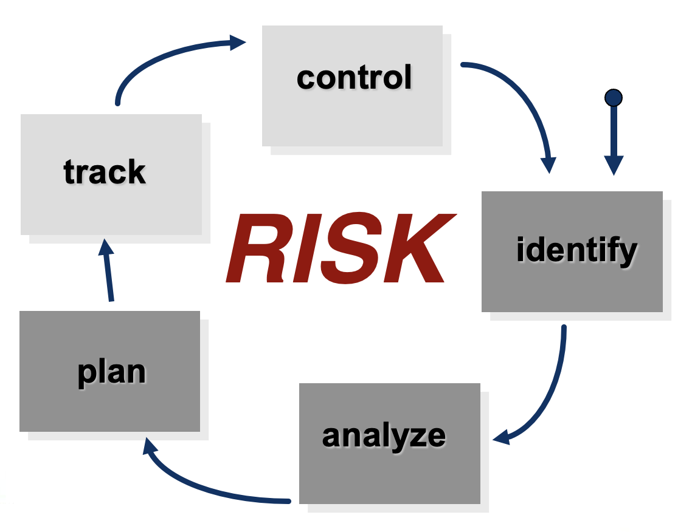

风险识别：

- **产品规模**(product size)：与待构建或修改的软件整体规模相关的风险
- **业务影响**(business impact)：与管理层或市场施加的限制相关的风险
- **客户特性**(customer characteristics)：与客户的成熟度以及开发人员及时与客户沟通的能力相关的风险
- **过程定义**(process definition)：与软件过程被定义的程度以及开发组织遵循该过程的程度相关的风险
- **开发环境**(development environment)：与构建产品所用工具的可用性和质量相关的风险
- **待构建技术**(technology to be built)：与待构建系统的复杂性以及系统所封装技术的“新颖性”相关的风险
- **员工规模与经验**(staff size and experience)：与将要从事工作的软件工程师的整体技术水平和项目经验相关的风险

软件项目的风险一般分为三类：

- **项目**(project)风险：影响项目进度、成本、资源等的风险
- **技术**(technical)风险：涉及技术实现的可行性、技术难题等
- **业务**(business)风险：与软件是否满足业务需求、市场变化等相关

风险构成：

- **性能**风险：产品满足其**需求**并适合其预期用途的不确定性程度
- **成本**风险：项目**预算**得到维持的不确定性程度
- **支持**风险：所生成的软件易于修正、**适配**和增强的不确定性程度
- **进度**风险：项目**排期**得以维持且产品按时交付的不确定性程度

**风险预测**(risk projection)（也称为风险评估）试图通过两种方式对每项风险进行评级：

- 风险真实存在的可能性或概率
- 若风险发生，与之相关的问题所带来的后果

风险预测的步骤如下：

1. 建立一个能反映风险感知**可能性**(likelihood)的量表
2. 描述风险的**后果**(consequences)
3. 估计风险对项目和产品的**影响**
4. 注明风险预测的**总体**准确性，以避免任何误解

构建风险表：

    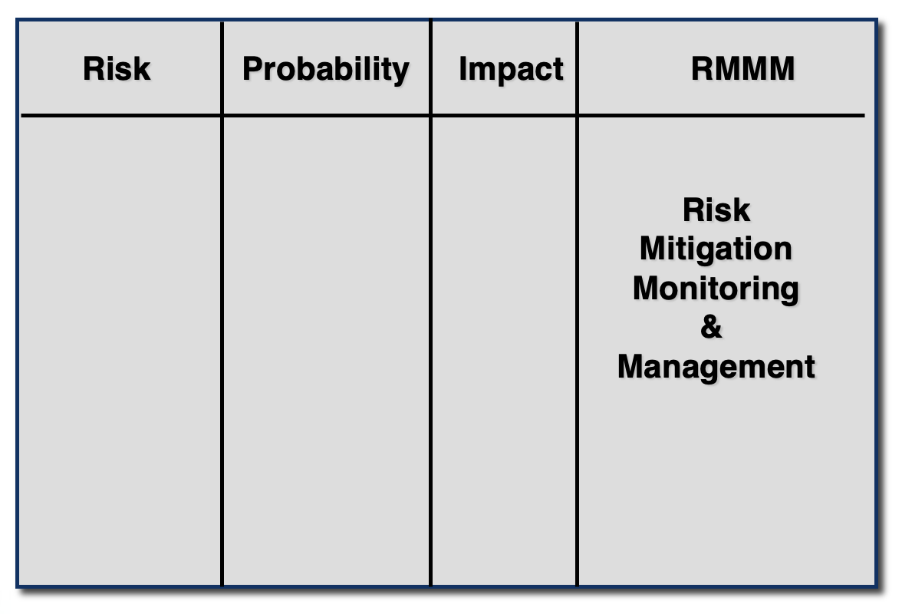

- 估算发生的概率，按 1 到 5 的等级估算对项目的影响，其中，
    - 1 = 对项目成功影响较低  
    - 5 = 对项目成功造成灾难性影响  

- 按**概率**(probability)和**影响**(impact)对表格进行排序

整体**风险暴露度**(risk exposure, **RE**)的计算公式：RE = P * C，其中，

- P：风险发生的概率
- C：风险发生时对项目造成的成本

风险缓解、监控和管理(risk mitigation, monitoring, and management, **RMMM**)：

- **缓解**：如何避免风险？
- **监控**：不仅包括观察项目中定义的**风险指标**，还要评估已采取的**风险缓解措施是否有效**
- **管理**：有效的风险管理计划需要包括**风险规避**(risk avoidance)、**风险监控**(risk monitoring)，以及为潜在问题制定**应急计划**(contingency planning)

>在项目规模较小或风险较少时，**风险信息表**(risk information sheet, **RIS**)可以作为 RMMM 计划的简化版本使用。

因**项目规模**产生的风险：

- 以 **LOC** 或 **FP** 估算的产品规模？
- 以**程序**、**文件**、**交易**数量估算的产品规模？
- 产品规模与以往产品**平均**规模的**偏差**百分比？
- 产品创建或使用的**数据库**大小？
- 产品的**用户**数量？
- 对产品需求的预计**变更**次数？交付前？交付后？
- **复用**软件的数量？

因**业务影响**产生的风险：

- 该产品对公司收入的影响？
- 高级管理层对该产品的可见度？
- 交付期限的合理性？
- 将使用该产品的客户数量？
- 互操作性限制？
- 终端用户的复杂性？
- 必须制作并交付给客户的产品文档的数量和质量？
- 政府约束？
- 延迟交付相关的成本？
- 缺陷产品相关的成本？

因**客户**产生的风险：

- 客户过去是否与您合作过？
- 客户对需求是否有明确的概念？
- 客户是否同意花时间与您合作？
- 客户是否愿意参与评审？
- 客户是否具备技术素养？
- 客户是否愿意让您的团队开展工作，即客户是否会避免在技术细节工作中监督您？
- 客户是否了解软件工程流程？

因过程成熟度产生的风险：

- 是否建立了通用的流程框架？
- 项目团队是否遵循该框架？
- 软件工程是否获得了管理层的支持？
- 是否采取了主动的 SQA 方法？
- 是否进行正式的技术评审？
- 是否在分析、设计和测试中使用 CASE 工具？
- 这些工具是否相互集成？
- 文档格式是否已制定？

技术风险：

- 该技术对您的组织来说是新的吗？  
- 是否需要新的算法或输入/输出技术？  
- 是否涉及新的或未经验证的硬件？  
- 应用程序是否与新的软件进行交互？  
- 是否需要专门的用户界面？  
- 该应用程序是否具有根本性差异？  
- 您是否正在使用新的软件工程方法？  
- 您是否正在使用非传统的软件开发方法，例如形式化方法、基于人工智能的方法、人工神经网络？  
- 是否存在显著的性能限制？  
- 对所请求功能的“可行性”是否存在疑问？

员工/人员风险：

- 是否有**最合适**的人员可用？
- 员工是否具备所需的**技能**？
- 是否有**足够**的人员可用？
- 员工是否**承诺**全程参与？
- 是否会有人**兼职**？
- 员工是否有正确的**期望**？
- 员工是否接受了必要的**培训**？
- 员工的流动率是否会很低？

风险**时机**(timing)和风险**范围**会影响风险发生时可能产生的后果。

**风险细化**(risk refinement)的目的是将复杂、笼统的风险分解为更具体、易于管理和分析的小风险，以便更好地理解风险来源和影响，便于采取针对性措施。分解后的风险通常是原风险的具体表现或组成部分，**其后果与原风险一致**。

???+ info "来自题库，但与本章内容无直接关系的知识点"

    - **危害分析**(hazard analysis)主要关注识别和评估可能导致**整个系统失效**的潜在危害，而不是项目终止、进度延误或成本超支等管理问题。

## Maintenance and Reengineering

**可维护的**(maintainable)软件的特点：

- 展现出**有效的模块化**
- 运用了便于**理解**的设计模式
- 遵循明确定义的**编码标准**和约定编写，使得源代码具有自文档化和可理解性
- 经历了多种**质量保证**技术，在软件发布前就发现了潜在的维护问题
- 由那些认识到自己可能不会在需要修改时在场的软件工程师创建
    >软件的设计和实现必须“协助”进行修改的人

软件组织通常在软件**维护**上投入 **60**% 左右的工作量。

软件**可支持性**(supportability)：

- 支持软件系统在其整个产品生命周期中运行的能力，这意味着不仅要满足任何必要的需求或要求，还要提供**设备**、支持**基础设施**、附加软件、设施、人力或任何其他资源，以保持软件正常运行并能够履行其功能
- 软件应包含辅助**支持人员**(support personnel)在操作环境中遇到缺陷时的**功能**(facility)（毫无疑问，缺陷是会被遇到的）
- 支持人员应能够访问一个包含所有已遇到缺陷的记录，包括其特征、原因和解决方案的**数据库**

**业务过程再工程**(bussiness process reengineering)没有开始或结束，它是一个**进化**的过程。

    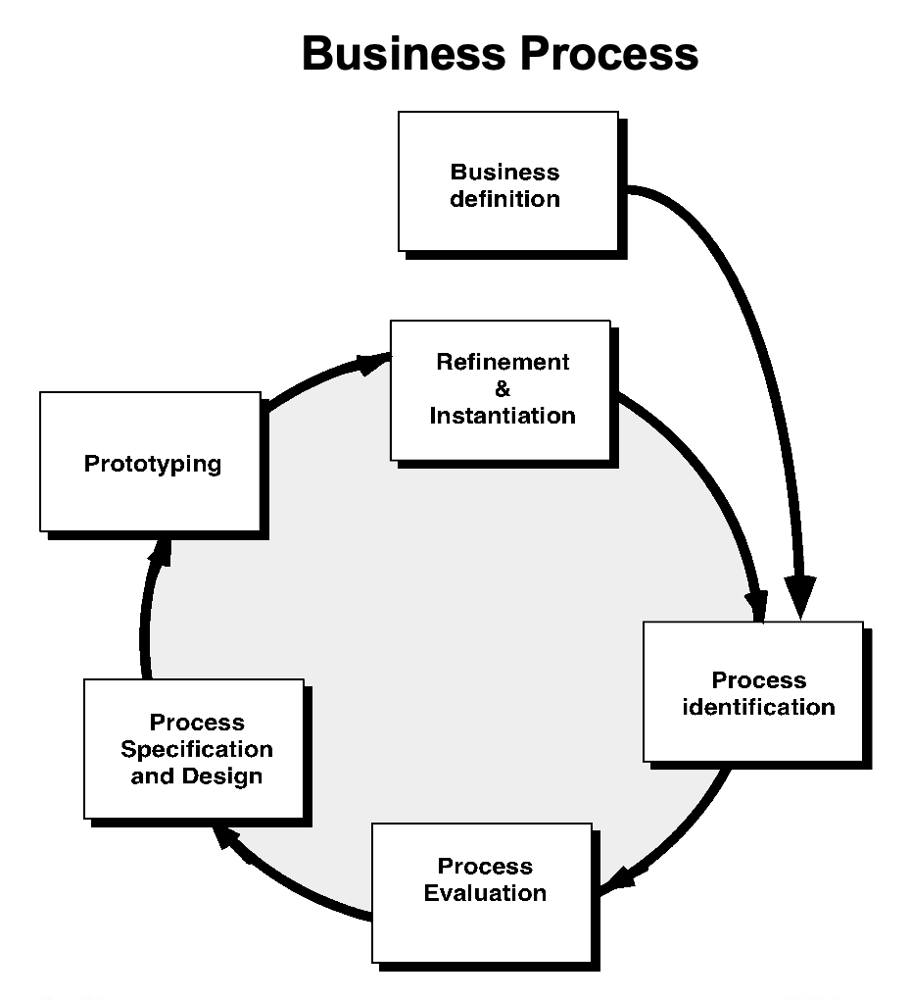

- **业务定义**(business definition)：业务目标在降低成本、缩短时间、提高质量以及人员发展与授权这四个关键驱动因素的背景下确定
- **过程识别**(process identification)：识别出对实现业务定义中所述目标至关重要的过程
- **过程评估**(process evaluation)：对现有过程进行全面的分析和测量
- **过程规范与设计**(process specification and design)：基于前三个 BPR 活动所获取的信息，为每个需要重新设计的过程准备用例
- **原型开发**(prototyping)：重新设计的业务过程在完全融入业务之前必须进行原型开发
- **细化与实例化**(refinement and instantiation)：根据原型的反馈，对业务过程进行细化，然后在业务系统中将其实例化

!!! warning "注意**测试**环节并不在业务过程中！"

**软件再工程**(software reengineering)：

    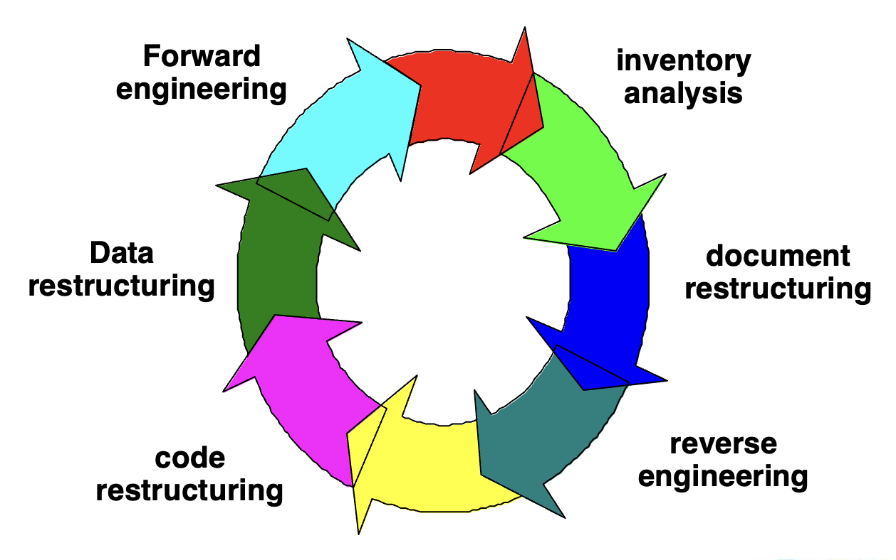

1. **库存分析**(inventory analysis)
    - 构建一个包含所有应用程序的表格
    - 建立一套标准，例如：
        - 应用程序名称
        - 最初创建的年份
        - 对其进行的实质性修改次数
        - 进行这些修改所花费的总工作量
        - 最近一次实质性修改的日期
        - 进行最后一次修改所花费的工作量
        - 所在系统
        - 与之交互的应用程序

        进行分析和优先级排序，以选择适合重构的候选对象

2. **文档重构**(document restructuring)
    - 文档不足是许多遗留系统的通病
    - 应对策略：
        - 创建文档过于耗时：如果系统能正常运行，我们就将就着用现有的文档；在某些情况下，这确实是正确的做法
        - 文档需要更新，但我们资源有限：我们将采用有修改时同步更新文档的方式；或许没必要对整个应用重新编写完整的文档
        - 该系统对业务至关重要，必须全面重新编写文档：即便如此，明智的做法是将文档精简到最低必要限度

3. **逆向工程**(reverse engineering)要考虑**抽象层次**、**完整性**、**方向性**(directionality)等。

    

        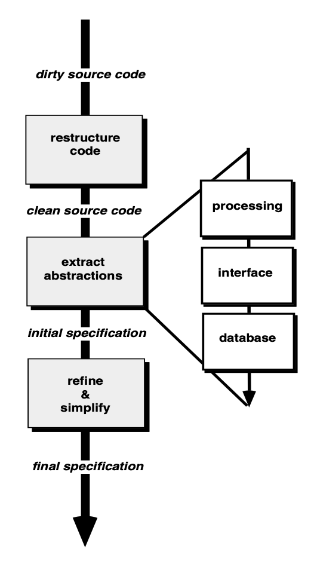
    

    - 逆向工程的第一个活动是理解系统的**处理过程**(processing)，即系统如何运作、数据如何被处理
    - 其中的**数据逆向工程**主要关注**数据库结构**(如表、关系、约束等)和程序**内部**使用的**数据结构**(如数组、链表、对象等)，目的是理解和还原已有系统的数据组织方式
    - 逆向工程应当在对任何**用户界面**进行再工程**之前**进行

4. **代码**重构
    - 使用重构工具分析源代码
    - 对设计不良的代码段进行重新设计
    - 记录结构化编程构造的违规情况，然后对代码进行重构（此过程可自动完成）
    - 对重构后的代码进行审查和测试，以确保未引入任何异常
    - 更新内部代码文档

5. **数据**重构
    - 对数据的结构、命名、格式等进行规范和调整，便于管理和使用，比如**数据名称合理化**(data name rationalization)、**数据记录标准化**(data record standardization)等
    - 与代码重构（发生在相对较低的抽象层次）不同，数据重构是一项**全面性的再工程活动**
    - 大多数情况下，数据重构始于逆向工程活动
        - **当前的数据架构**被剖析，并定义了必要的数据模型
        - 识别出**数据对象和属性**，并对现有数据结构进行质量审查
        - 当**数据结构薄弱**时（例如当前采用平面文件，而关系型方法能大幅简化处理），数据将被重新设计

    - 由于**数据架构**对程序架构及其算法**具有强烈影响**，数据的变更将不可避免地引发架构层面或代码层面的变化

6. **正向工程**(forward engineering)：
    - 维护一行源代码的成本可能是该行代码初始开发成本的 **20 到 40 倍**
    - 采用现代设计理念**重新设计**软件架构（程序和/或数据结构），能够极大地便利未来的维护工作
    - 由于软件的**原型**已经存在，**开发生产率**应远高于平均水平
    - 用户现在对软件有了使用经验，因此更容易确定**新的需求和变更方向**
    - 用于重构的 **CASE 工具**将自动化部分工作
    - 预防性维护完成后，将会存在一套**完整的软件配置**（文档、程序和数据）

再工程**经济学**：

- Sneed 提出了一个用于再工程的成本/效益分析模型，定义了九个参数：
    - P1 = 应用程序当前的年度维护成本
    - P2 = 应用程序当前的年度运营成本
    - P3 = 应用程序当前的年度业务价值
    - P4 = 再工程后预测的年度维护成本
    - P5 = 再工程后预测的年度运营成本
    - P6 = 再工程后预测的年度业务价值
    - P7 = 估计的再工程成本
    - P8 = 估计的再工程日历时间
    - P9 = 再工程风险因子（P9 = 1.0 为基准值）
    - L = 系统的预期使用寿命

- 与持续维护候选应用程序（即不进行再工程）相关的成本：C~maint~ = [P3 - (P1 + P2)] * L
- 与再工程相关的成本：C~reeng~ = [P6 - (P4 + P5) * (L - P8) - (P7 * P9)]
- 利用上述方程中的成本，可以计算再工程的总体效益如下：成本效益 = C~reeng~ - C~maint~
