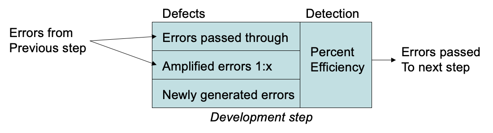
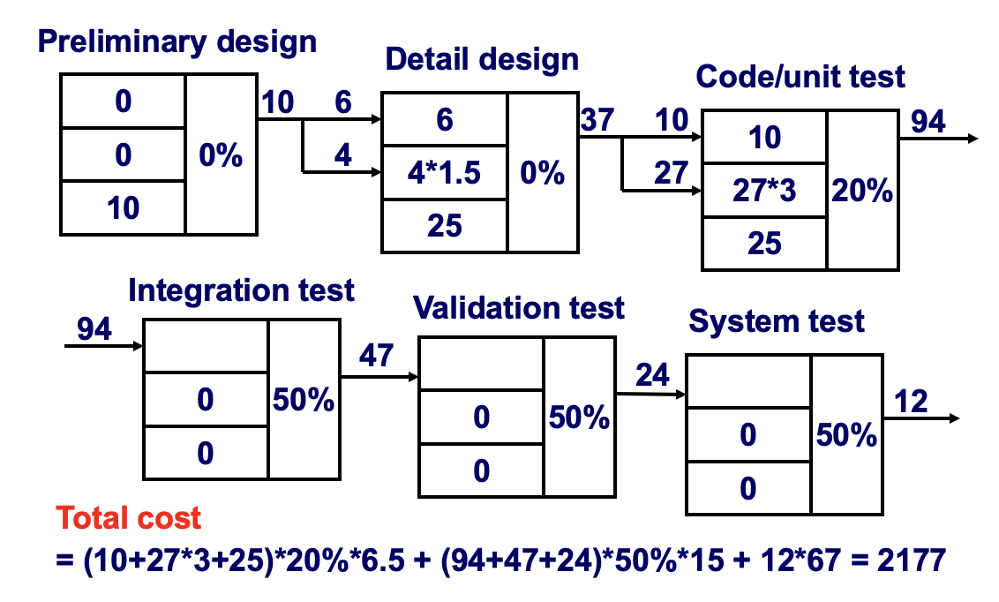
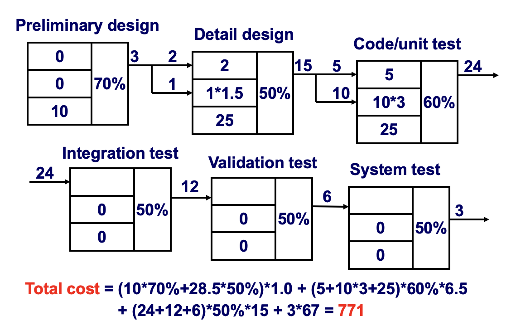
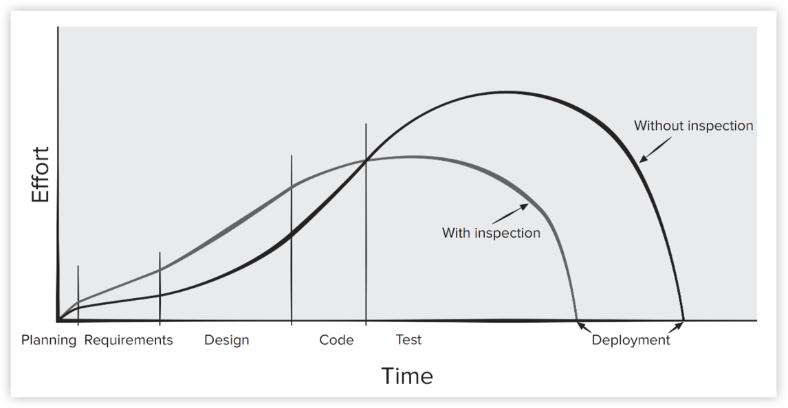
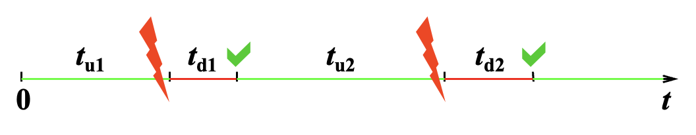

# Quality

## Quality Concepts

对于软件而言，可能会遇到两种质量：  

- **设计质量**(quality of design)：涵盖了系统的需求、规格和设计
- **符合性质量**(quality of conformance)：关注设计**实现**满足其需求和性能目标的程度

用户满意度 = 合规(compliant)产品 + 好的质量 + 在预算和进度内交付

**软件质量**可以定义为：一种有效的软件过程，以能够创建有用产品的方式应用，为产品的生产者和使用者带来可衡量的价值。

- **有效的软件过程**：
    - 建立了支持任何构建高质量软件产品努力的**基础设施**
    - **过程的管理方面**创建了有助于避免项目混乱的制衡机制——而项目混乱是导致质量低下的关键因素
    - **软件工程实践**使开发人员能够分析问题并设计出可靠的解决方案——这两者对于构建高质量软件都至关重要
    - 诸如变更管理和技术评审等**伞型活动**，对质量的影响与软件工程实践的任何其他部分同样重要

- **有用的产品**：
    - 提供终端用户所需的内容、**功能**和特性
    - 以一种**可靠**、无差错的方式提供这些资产
    - 始终满足利益相关者**显式**陈述的那些需求
    - 还满足所有高质量软件所应具备的一系列**隐式**需求（比如易用性等）

- **增加价值**：
    - **软件组织**从中获益，因为高质量软件需要更少的维护工作、更少的错误修复，并减少客户支持
    - **用户群体**也从中获益，因为该应用程序以一种加速某些业务流程的方式提供了有用的功能
    - 最终结果是：
        - 更高的软件产品收入
        - 当应用程序支持业务流程时，更好的盈利能力
        - 对业务至关重要的信息可用性得到改善

质量维度：

- **性能质量**(performance quality)：软件是否按照需求模型的规定，交付所有内容、功能及特性，并以能为最终用户提供价值的方式实现？
- **特性质量**(feature quality)：软件是否提供了能让首次使用的最终用户感到惊喜与愉悦的特性？
- **可靠性**(reliability)：软件是否在不出现故障的情况下交付所有功能与能力？在需要时是否可用？所交付的功能是否无错误？
- **符合性**(conformance)：软件是否符合与应用程序相关的本地及外部软件**标准**？是否遵循事实上的设计与编码惯例？例如，用户界面是否符合菜单选择或数据输入方面的公认设计规则？
- **耐久性**(durability)：软件能否在不意外产生副作用的情况下进行维护（修改）或修正（调试）？修改是否会导致错误率或可靠性随时间逐渐下降？
- **可服务性**(seviceability)：软件能否在可接受的短时间内进行维护（修改）或修正（调试）？支持人员能否获取进行修改或修正缺陷所需的所有信息？
- **美观性**(aesthetics)：大多数人都认同，一个具有美感的事物拥有某种难以量化却显而易见的优雅、独特的流畅性以及明显的“存在感”
- **感知**(perception)：在某些情况下，你会抱有一系列先入为主的观念，这些观念会影响你对质量的感知

!!! note "ISO 9126"

    ISO 9126 软件质量模型将软件质量分为六大特性：**功能性**(functionality)、**可靠性**(reliability)、**易用性**(usability)、**效率**(efficiency)、**可维护性**(maintainability)和**可移植性**(portability)

测量质量：

- 一般的质量维度和因素不足以具体评估应用程序的质量
- 项目团队需要**制定一套有针对性的问题**，以评估每个应用程序质量因素的满足程度
- 软件质量的主观测量可能被视为仅仅是个人观点
- 软件度量代表了质量某种表现形式的**间接测量**，并试图量化软件质量的评估

业界试图一个平衡点：让产品足够好，不至于在评估阶段就被立刻否决，同时也不要过度追求完美主义、投入过多工作，以免耗时过长或成本过高。

- **足够好的软件**：能够交付终端用户所期望的高质量功能和特性，但同时也包含一些较为晦涩或专门的功能和特性，其中存在已知的缺陷
- 质量成本（成本从上到下增加，即外部故障成本最大）：
    - **预防成本**(prevention costs)：
        - 质量规划
        - 正式技术评审
        - 测试设备
        - 培训

    - **内部故障成本**(internal failure costs)：
        - 返工(rework)
        - 修理
        - 失效模式分析

    - **外部故障成本**(external failure costs)：
        - 投诉处理(complaint resolution)
        - 产品退货和更换
        - 帮助热线支持
        - 保修工作(warranty work)

低质量软件会增加开发者和最终用户的风险

- 当系统交付延迟、未能实现功能且不符合客户期望时，就会引发**诉讼**(litigation)
- 低质量软件更容易被入侵，部署后可能增加应用程序的**安全**风险
- 如果在设计阶段不关注质量（安全性、可靠性、可信赖性），就无法构建安全的系统
- 低质量软件容易存在架构缺陷以及实现问题（**漏洞**）

管理决策的影响：

- **估算决策**(estimation decision)：不合理的交付日期估算会导致团队走捷径，从而可能降低产品质量  
- **排期决策**(scheduling decision)：在制定项目进度时未能注意任务依赖关系  
- **风险导向决策**(risk-oriented decision)：等到危机出现时才做出应对，而不是建立风险监控机制，可能导致产品质量下降

软件质量是良好的项目管理和扎实的工程实践共同作用的结果。要构建高质量的软件，您必须理解待解决的问题，并能够设计出符合问题要求的优质方案。

- 在**设计阶段**消除架构缺陷可以提升质量
- **项目管理**(project management)：项目计划包含明确的**质量**与**变更**管理方法
- **质量控制**(quality control)：通过一系列检查(inspection)、评审和测试，确保工作产品符合其规范。
- **质量保证**(quality assurance)：包括审计和报告流程，为管理层提供必要数据以支持前瞻性决策。

## Review Techniques

**评审**(review)

- 由技术人员为技术人员进行的会议  
- 对软件工程过程中创建的工作产品的技术评估  
- 一种软件质量保证机制  
- 一个培训场所  

错误与缺陷（以下概念的划分并非主流观点）：  

- **错误**(error)：在软件发布给最终用户之前发现的质量问题
- **缺陷**(defect)：在软件发布给最终用户之后才发现的质量问题

**缺陷放大模型**(defect amplification model, **DAM**)：

    

- 假设在设计阶段发现的一个错误，其修正成本为 1.5 单位；相对于此成本，同样的错误在测试开始前被发现时，修正成本为 6.5 单位；测试期间为 15 单位；发布后则在 67 至 100 单位之间。
- 多项研究表明，设计活动引入了软件过程中 50% 至 65% 的错误，而正式的审查技术在发现设计缺陷方面有效率达到 75%

???+ example "例子"

    === "例1"

        === "无评审"

            

                
            

        === "有评审"

            

                
            

    === "例2"

        >来自 22-23 期末

        === "题目"

            Formal technical review(FTR) is very important for uncovering software errors before the software is released to the end users since errors can be amplified in the latter steps if they cannot be found in the former phase, as shown in the following defect amplification models:

            Suppose: (1) the newly generated errors are 20, 60, 60 for the preliminary design, detail design and code/unit test respectively; (2) the errors passing through and that whose being amplified are the same between preliminary and detail design and between detail design and code/unit test; (3) the value of x, which is also the same for detail design and code/unit test, is 3.

            If the values of percent efficiency for the whole process without FTR (Formal Technical Review) and with FTR are 0 and 50% respectively, please illustrate the defect amplification process for preliminary design, detail design and code/unit test, and calculate the final errors after code/unit test respectively.

        === "解答"

            >由 GPT-5.5 生成

            === "没有 FTR"

                | 阶段                 | 传入错误 |               放大错误 | 新产生错误 | 本阶段总错误 | 检出错误 | 传到下一阶段 |
                | ------------------ | ---: | -----------------: | ----: | -----: | ---: | -----: |
                | Preliminary design |    0 |                  0 |    20 |     20 |    0 |     20 |
                | Detail design      |   20 |   20 * 3 = 60 |    60 |    140 |    0 |    140 |
                | Code / unit test   |  140 | 140 * 3 = 420 |    60 |    620 |    0 |    620 |

                错误成本 = 620

            === "有 FTR"

                | 阶段                 | 传入错误 |              放大错误 | 新产生错误 | 本阶段总错误 | 检出错误 | 传到下一阶段 |
                | ------------------ | ---: | ----------------: | ----: | -----: | ---: | -----: |
                | Preliminary design |    0 |                 0 |    20 |     20 |   10 |     10 |
                | Detail design      |   10 |  10 * 3 = 30 |    60 |    100 |   50 |     50 |
                | Code / unit test   |   50 | 50 * 3 = 150 |    60 |    260 |  130 |    130 |

                错误成本 = 130

总评审工作量和发现的总错误数定义为：
    
- $E_{review} = E_p + E_a + E_r$
- $Err_{tot} = Err_{minor} + Err_{major}$

**缺陷密度**(defect density)（每单位评审工作产品发现的错误数量）= $Err_{tot} / \text{WPS}$，**可以用于测量任何产品**。

???+ info "注"

    - **准备工作量**(preparation effort)（$E_p$）：在实际评审会议之前，评审工作产品所需的工作量（以人时计）
    - **评审工作量**(assessment effort)（$E_a$）：实际评审过程中花费的工作量
    - **返工工作量**(rework effort)（$E_r$）：用于纠正评审中发现错误的专门工作量
    - **工作产品规模**(work product size)（WPS）：所评审工作产品的规模度量（例如，UML模型数量或文档页数）
    - **发现的次要缺陷**（$Err_{minor}$）：可归类为次要缺陷的错误数量（纠正所需工作量少于预先设定的值）
    - **发现的主要缺陷**（$Err_{major}$）：可归类为主要缺陷的错误数量（纠正所需工作量超过预先设定的值）

有审查和无审查时投入的工作量：

    

- 使用审查时投入的工作量确实在早期有所增加，但这种早期投入会带来回报，因为测试和修正工作得以减少
- 有审查的开发完成时间比无审查的更早，因此审查并不耗费时间，而是**节省时间**

当满足以下条件时，评审的**正式性**(formality)会增加：

- 为评审者明确定义不同的**角色**
- 对评审有充分的规划和**准备**
- 为评审定义清晰的**结构**
- 评审者对所做的任何修改进行**跟进**

**非正式评审**(informal review)：

- 与同事对软件工程工作产品进行简单的**桌上检查**(desk check)
- 为审查工作产品而进行的**非正式会议**(casual meeting)（涉及两人以上）
- 或**结对编程**(pair programming)中涉及审查的方面
    - 结对编程鼓励在工作产品（设计或代码）创建过程中持续进行审查，其好处是能够即时发现错误，从而提升工作产品的质量

**正式技术评审**(formal technique review, **FTR**)是一类包括走查(walkthroughs)和审查(inspections)的评审。其目标是：

- 发现软件任何表示形式在功能、逻辑或实现中的**错误**
- 验证被审查的软件是否满足其**需求**
- 确保软件按照预定**标准**进行表示
- 实现以**统一**方式开发的软件
- 使项目更易于**管理**

FTR 结束时，参与者可以选择**接受工作产品且无需修改**（若没有发现严重问题），也可以**因存在严重错误而拒绝产品**。

评审会议：

- 审查通常应涉及三到五人
- 应进行事先准备，但每人所需时间不应超过两小时
- 审查会议的时长应少于两小时
- 重点应放在某一工作产品上（例如，需求模型的一部分、详细的组件设计、组件的源代码）
- 会议中的角色：
    - **生产者**(producer)：指开发出工作产品的个人，通知项目负责人工作产品已完成，需要进行评审
    - **评审负责人**(review leader)：评估产品是否准备就绪，生成产品材料的副本，并将其分发给两到三名评审员进行预先准备
    - **评审员**(reviewer)：需要花费一到两个小时评审产品、做笔记，并熟悉相关材料
    - **记录员**(recorder)：负责（书面）记录评审过程中提出的所有重要问题的评审员

- 过程：
    - 准备阶段：生产者 -> 审查负责人 -> 审查员 -> 问题列表
    - 执行阶段：生产者介绍 -> 审查员提出问题 -> 记录员
    - 跟踪阶段：结论、**SQA 报告**（包含评审**内容**、**评审员**、评审**结果**三部分）

评审指南：

- **审查产品**，而非生产者
- 设定议程并严格遵守
- 限制辩论和反驳
- 指出问题领域，但不必试图解决所有已记录的问题
- 做书面记录
- 限制参与者人数，并要求提前准备
- 为每种可能被评审的产品制定检查清单
- 为正式技术评审分配资源并安排时间
- 对所有评审人员进行有意义的培训
- 回顾你早期的评审工作

**样例驱动评审**(sample-driven review, **SDR**)试图量化那些作为完整 FTR 主要目标的工作产品。

- 检查每个软件工作产品 $i$ 的一部分(fraction) $a_i$，记录在 $a_i$ 中发现的缺陷数量 $f_i$
- 缺陷数量的粗略估计 = $f_i / a_i$
- 根据各工作产品中缺陷数量的粗略估计，按降序排列工作产品
- 将可用的评审资源集中在估计缺陷数量最多的工作产品上

## Software Quality Assurance

SQA 要素：

- 标准
- 评审与审计(audits)
- 测试
- 错误/缺陷收集与分析
- 变更管理
- 教育
- 供应商管理
- 安全管理(security management)
- 安全(safety)
- 风险管理

SQA 任务：

- 为一个项目编写 **SQA 计划**，包括：
    - 需要进行的评估
    - 需要执行的审计和审查
    - 适用于项目的标准
    - 错误报告与跟踪的流程
    - 由 SQA 组生成的文档
    - 向软件项目团队提供的反馈量

- 参与**项目软件过程描述**的开发工作：SQA 组审查过程描述，以确保其符合组织政策、内部软件标准、外部强制标准（如 **ISO-9001**）及软件项目计划的其他部分

- 审查**软件工程活动**，以验证其符合已定义的软件过程：识别、记录并跟踪与过程的偏差，并验证纠正措施已执行
- 审计指定的**软件工作产品**，以验证其符合软件过程中定义的要求
    - 审查选定的工作产品；识别、记录并跟踪偏差
    - 验证纠正措施已执行，定期向项目经理报告工作结果
  
- 确保软件工作及工作产品中的**偏差**(deviations)已按规定的程序进行记录和处理
- 记录任何**不合规情况**(noncompliance)并向高层管理人员报告；不合规项将被跟踪直至解决

SQA 目标：

- **需求质量**(requirement quality)：需求模型的正确性、完整性和一致性将对后续所有工作产品的质量产生重大影响
- **设计质量**(design quality)：设计模型中的每个元素都应经过软件团队的评估，以确保其具有高质量，并且设计本身符合需求
- **代码质量**(code quality)：源代码及相关工作产品（例如其他描述性信息）必须符合本地编码标准，并具备有助于可维护性的特性
- **质量控制有效性**(quality control effectiveness)：软件团队应以最有可能实现高质量结果的方式，合理运用有限资源

**统计**(statistical) **SQA**：

- 收集并分类关于软件错误和缺陷的信息
- 对于每个错误和缺陷，会**尝试追溯其根本原因**（比如未遵循规范、设计错误、违反标准、与客户沟通不佳等）
- 运用**帕累托原则**(Pareto principle)（即 80% 的缺陷可追溯到 20% 的可能原因），找出那关键的 20%（即关键少数）
- 一旦确定了这些关键少数原因，就要着手纠正导致错误和缺陷的问题

「**六西格玛**」(Six Sigma)一词源于六个标准偏差：每百万次出现3.4次缺陷，意味着极高的质量标准。六西格玛方法论包含以下步骤（前三个步骤为**核心步骤**）：

- 通过明确的客户沟通方法，**定义**客户需求、可交付成果及项目目标
- **衡量**现有流程及其输出，以确定当前的质量表现（收集缺陷指标）
- **分析**缺陷指标并确定关键少数原因  
- 通过消除缺陷的根本原因来**改进**流程
- **控制**流程，确保未来的工作不会重新引入缺陷原因

软件可靠性计算

- **可靠性**(reliability) = **MTBF**（平均故障间隔时间）= MTTF + MTTR
- **可用性**(availability)
    - **MTTF** = 平均故障时间 = $\dfrac{1}{n}\sum\limits_{i=1}^n t_{ui}$
    - **MTTR** = 平均修复时间 = $\dfrac{1}{n}\sum\limits_{i=1}^n t_{di}$

    

        
    

**软件安全**是一种软件质量保证活动，专注于识别和评估可能对软件产生负面影响并**导致整个系统失效的潜在危害**。如果在软件过程的早期阶段就能识别出这些危害，就可以指定软件设计特性，从而消除或控制潜在的危害。