# Requirements

**需求工程**(requirements engineering)是一个通用的工程，不会因为软件项目的不同而变化。它包括以下步骤：

1. **启动**(inception)：
    - 提出一系列问题，以建立
        - 对**问题**的基本理解
        - 需要解决方案的**人员**
        - 所需解决方案的**性质**，以及
        - 客户与开发者之间初步**沟通**与协作的有效性

    - 识别**利益相关者**：用户、维护人员、管理者，甚至第三方系统都是利益相关者
    - 识别多种观点
    - 致力于**协作**
    - 第一组**上下文无关问题**(context-free questions)
        - 这项工作**请求**的背后是谁？
        - 谁将使用**解决方案**？
        - 成功的解决方案将带来什么**经济效益**？
        - 你需要的解决方案是否有**其他来源**？

2. **获取**(elicitation)：从所有利益相关者中获取需求

    

        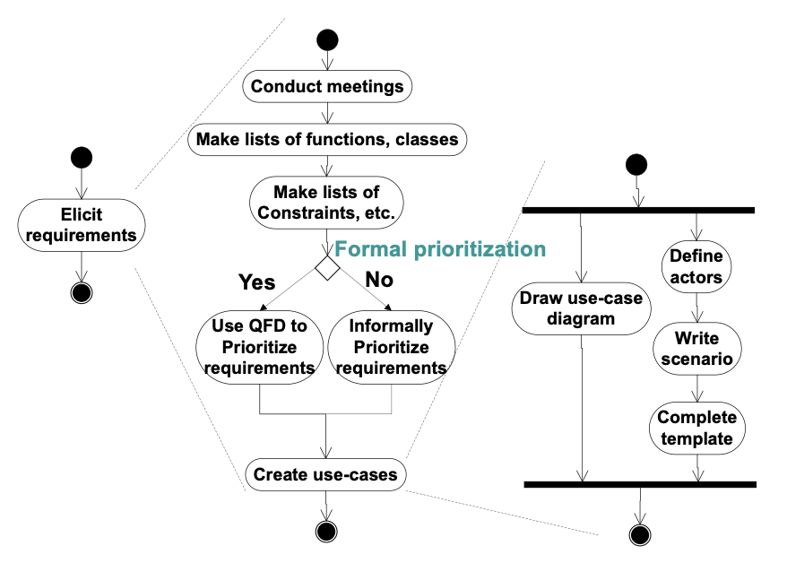
    

    - 会议由**软件工程师**和**客户**共同进行并参与
    - 制定了准备和参与的规则
    - 提出议程(agenda)
    - **协调人**(facilitator)（可以是客户、开发人员或外部人员）**控制会议**
    - 采用**定义机制**(definition mechanism)：可以是工作表、翻转图、墙贴、电子公告板、聊天室或虚拟论坛
    - 目标：
        - 识别问题
        - 提出解决方案的要素
        - 协商不同的方法，以及
        - 明确一套初步的解决方案要求

    - 构建软件系统最困难的部分是决定要构建什么
        - **范围**(scope)问题
        - **理解**(understanding)问题
        - **易变性**(volatility)问题

    - **工作成果**(work product)：
        - 一份关于**需求**与**可行性**的说明
        - 系统或产品的**范围界定**说明
        - 参与需求获取的**客户**、**用户**及其他**利益相关者**名单
        - **系统技术环境**的描述
        - **需求列表**（最好按功能组织）以及每项需求适用的**领域约束**
        - 一组**使用场景**，用以展示系统或产品在不同操作条件下的使用情况
        - 为更好定义需求而开发的任何**原型**

3. **细化**(elaboration)：创建分析模型，识别数据、功能和行为需求
    - **分析模型**(analysis model)的类型：
        - [基于**场景**的模型](#scenario-based-methods)
            - **用例图**和用户用例图  
            - 特定上下文中的活动序列  

            

                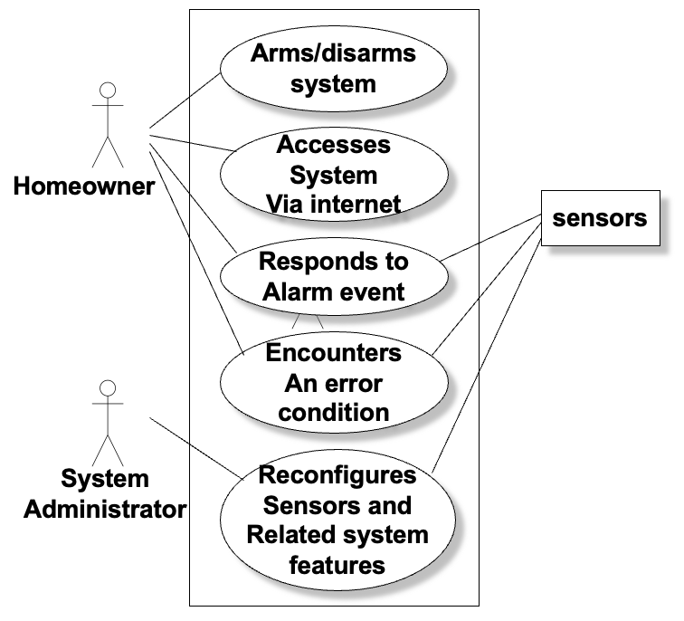
            

        - [基于**类**的模型](#class-based-methods)
            - **类图**  

            

                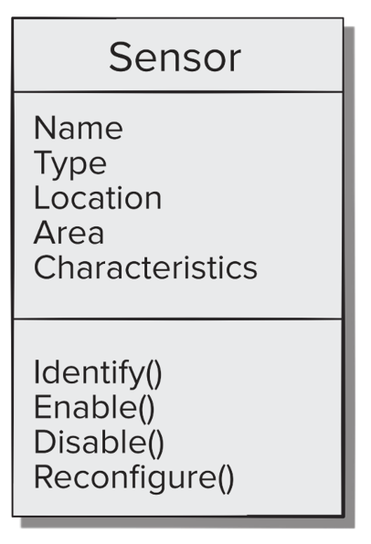
            

        - [**行为**模型](#behavior-patterns-and-webmobile-apps)
            - **状态图**  

            

                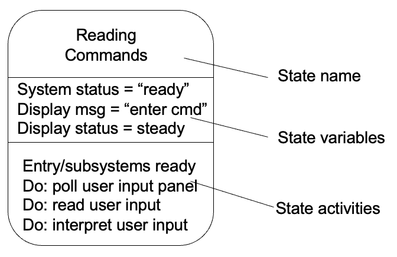
            

        - 面向**流**的模型  
            - **数据流图**

    - **分析模式**(analysis patterns)通过为常见问题提供可靠的解决方案，促进了分析模型向设计模型的转化；其组成部分包括：
        - **模式名称**(pattern name)：一个捕捉模式本质的描述符
        - **意图**(intent)：描述模式完成或代表的内容，可以理解为一句话总结，是整个模式最核心的部分
        - **动机**(motivation)：一个说明如何利用该模式解决问题的场景
        - **力量和背景**(forces and context)：描述可能影响模式使用的外部问题（力量），以及应用模式后将解决的外部问题
        - **解决方案**(solution)：描述如何应用模式解决问题，重点强调结构和行为方面的问题
        - **后果**(consequence)：说明应用该模式时会发生什么，以及在应用过程中存在哪些权衡
        - **设计**(design)：讨论如何通过使用已知的设计模式来实现分析模式
        - **已知用途**(known uses)：在实际系统中的使用示例
        - **相关模式**(related patterns)：与命名模式相关的一个或多个分析模式，原因
            - 常与该命名模式一起使用
            - 结构上与该命名模式相似
            - 是该命名模式的一个变体

4. **协商**(negotiation)：就一个对开发者和客户都切实可行的可交付系统达成一致
    - 识别关键利益相关者：这些是将参与谈判的人员
    - 确定每个利益相关者的获胜条件：获胜条件未必显而易见
    - 进行谈判：努力达成一套能够实现**双赢**(win-win)的诉求
        - 如果不同的客户/用户无法就需求达成一致，失败的**风险**非常高

5. **规范**(specification)：本质上是让需求变得清晰、可沟通、可共享；可以是以下任意一项（或多项）
    - 书面**文档** 
    - **模型**集合
    - 形式化数学描述  
    - 用户场景（用例）集合  
    - **原型**(prototype)

6. **验证**(validation)：检查
    - 每个需求是否与系统/产品的总体目标**一致**？
    - 所有需求是否在适当的**抽象层级**上指定？也就是说，是否存在一些需求在现阶段提供了不恰当的技术细节？
    - 该需求是否真的**必要**，还是它代表了可能对系统目标并非必不可少的附加功能？
    - 每个需求是否明确且**无歧义**(unambiguous)？
    - 每个需求是否有**归属**(attribution)？即每个需求是否有明确的来源（通常是指定个人）？
    - 是否存在需求之间相互**冲突**的情况？
    - 在容纳系统或产品的技术环境中，每个需求是否**可实现**？
    - 每个需求在实现后是否**可测试**(testable)？
    - 需求模型是否**正确**反映了待构建系统的信息、功能和行为？
    - 需求模型是否以逐层揭示系统更详细信息的方式进行**划分**？
    - 是否使用了需求**模式**来简化需求模型？所有模式是否都已正确验证？所有模式是否与客户需求保持一致？

7. **需求管理**(requirements management/monitoring)：核心是跟踪需求的变化，并保证系统始终与需求保持一致（尤其在增量开发中需要）
    - **分布式调试**(distributed debugging)：发现错误并确定其成因
    - **运行时验证**(run-time verification)：判断软件是否符合其规范
    - **运行时确认**(run-time validation)：评估演进中的软件是否满足用户目标
    - **业务活动监控**(business activity monitoring)：评估系统是否满足业务目标
    - **演进与协同设计**(evolution and codesgin)：在系统演进过程中向利益相关者提供信息

!!! warning "注意"

    这些阶段并不是严格按顺序一次走完的。在实际项目中，我们往往是**不断来回迭代的**。比如，在细化需求时发现理解有误，就要回到获取阶段重新沟通。

**质量功能部署**(quality function deployment, **QFD**)：

- **功能部署**决定了系统所需每个功能的价值（从客户角度看）  
- **信息部署**识别数据对象和事件
- **任务部署**分析系统的行为
- **价值分析**确定需求的相对优先级
- 识别三种类型的需求：  
    - **常规**(normal)需求：明确提出
    - **期望**(expected)需求：未明确提出但用户认为理所当然
    - **兴奋**(exciting)需求：超出预期，带来惊喜

**非功能性需求**(non-functional requirement, **NFR**)：**质量**属性、**性能**属性、**安全**属性或一般系统**约束**。通过两阶段流程来确定哪些 NFR 是兼容的：

1. 创建一个矩阵，将每个 NFR 作为列标题，系统 SE 指南作为行标签
2. 由团队使用一组决策规则对每个 NFR 进行优先级排序，通过将每个 NFR 和指南对分类为互补、重叠、冲突或独立，来决定实施哪些 NFR

**用例**(use-cases)：一组描述系统使用流程的**用户场景**(user scenarios)的集合。

- 每个场景从一个**参与者**(actor)（即以某种方式与软件交互的人员或设备）的角度进行描述
- 每个场景回答以下问题：  
    - 谁是主要**参与者**，谁是次要参与者？  
    - 参与者的**目标**是什么？  
    - 故事开始前应满足哪些**前提条件**？  
    - 参与者执行哪些主要**任务**或功能？
    - 故事描述中可能考虑哪些**扩展**？
    - 参与者的互动可能有哪些**变化**？
    - 参与者将获取、产生或改变哪些系统**信息**？
    - 参与者是否需要将外部环境的变化通知系统？
    - 参与者希望从系统中获取什么信息？
    - 参与者是否希望被告知意外的变化？

!!! note "注：在敏捷过程模型中，需求工程和设计活动是交错进行的"

**需求分析**(requirement analysis)的目标：

- 描述客户的需求  
- 为软件设计创建奠定**基础**  
- 定义一套**可验证的**需求

需求分析使软件工程师（在此角色中称为分析师或建模师）能够：  

- **详细阐述**在前期需求工程任务中确立的基本需求  
- 构建模型，描绘用户场景、功能活动、问题类及其关系、系统与类的行为、数据转换时的流向、以及软件必须满足的**约束条件**

**分析模型**(analysis model)是连接「需求」和「设计」的一座桥梁，把模糊的需求，转化为结构化、可分析、可推理的模型表达。经验法则：

- 模型应聚焦于问题或业务领域中可见的需求，**抽象层次应相对较高**
- 分析模型的每个元素都应有助于**整体理解软件需求**，并深入洞察系统的信息领域、功能及行为
- 基础设施及其他非功能模型的考量应**推迟至设计阶段**
- 尽可能**降低**整个系统的**耦合度**
- 确保分析模型对所有利益相关者都具有价值
- 让模型保持尽可能**简单**

**领域分析**(domain analysis)的目标：从特定应用领域识别、分析和规范通用需求的过程，通常为了在该应用领域的多个项目中**复用**。

    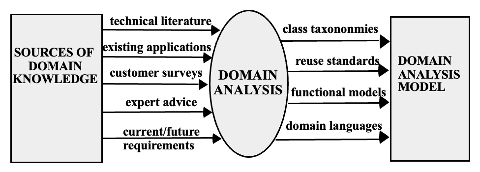

需求建模策略：

- **结构化分析**(structured analysis)：将数据以及转换数据的过程视为独立的实体
    - **数据对象**通过定义其属性和关系的方式进行建模
    - 操作数据对象的**过程**则通过展示数据对象在系统中流动时如何转换数据的方式来建模

- **面向对象分析**(object-oriented analysis)：具体见「[基于类的方法](#requirements-modeling-class-based-methods)」一节。

## Scenario-Based Methods

**用例**(use-cases)描述系统“使用线索”的场景  

- **参与者**(actors)：**人**或**设备**在系统运行时所扮演的角色  
- **用户**可以在特定场景中扮演多种不同的角色

用例仅仅是帮助定义系统外部存在什么（参与者）以及系统应该执行什么的一种辅助手段。相关问题：

- 我们应该写些什么？  
- 我们应该写多少？  
- 我们的描述应该详细到什么程度？  
- 我们应该如何组织描述？

开发用例时需考虑的问题：

- 参与者执行的**主要任务或功能**是什么？
- 参与者将获取、产生或更改哪些系统信息？
- 参与者是否需要将**外部**环境的变化告知系统？
- 参与者希望从系统获得哪些信息？
- 参与者是否希望被告知**意外**变化？

审阅用例：

- 用例首先以叙述(narrative)形式编写，如果需要正式性，则映射到模板
- 每个主要场景都**应进行进行审查和细化**(refined)，以查看是否存在其他可能的交互方式
    - 参与者此时能否采取**其他行动**？
    - 参与者是否可能在某个时刻遇到**错误情况**？如果是，是什么？
    - 参与者是否可能在某个时刻遇到**其他行为**？如果是，是什么？

记录(document)用例：

    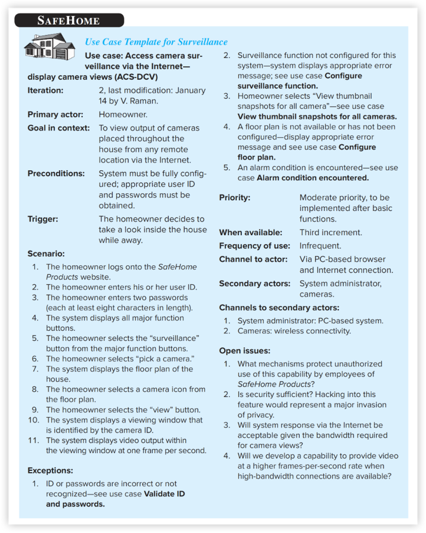

- 上下文中的**目标**：用例的整体范围
- **前置条件**(pre-condition)：在用例启动前已知为真的情况
- **触发事件**(trigger)：“启动用例”的事件或条件
- **场景**(scenario)：参与者所需执行的具体操作以及相应的系统响应
- **异常**：在初步用例细化过程中发现的情况

**【⭐️重点】图表示方法**：

- **用例图**(use-case diagram)：概览用途，不做细节描述

    

        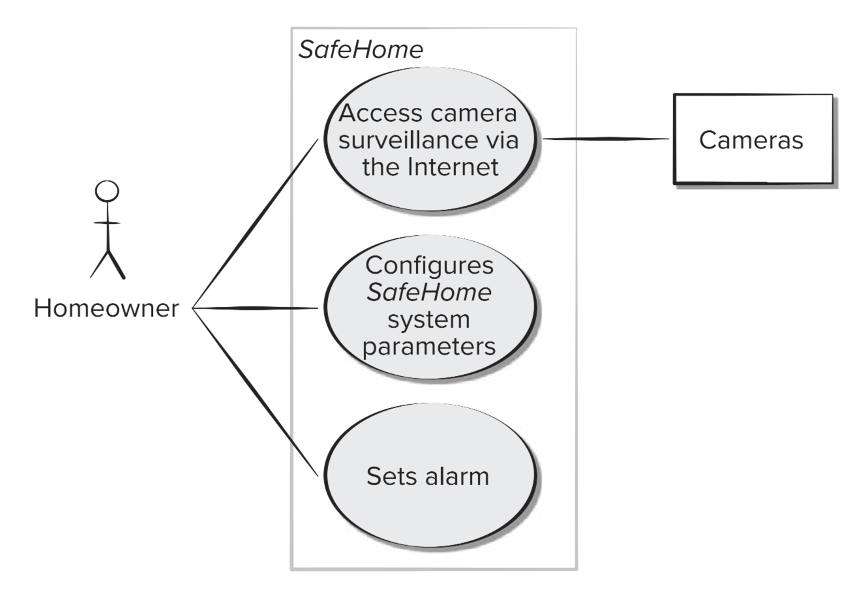
    

    - **参与者**：
        - **人类**（比如用户、管理员等）：用火柴人来表示，位于整张图的左侧
        - **设备**：用小矩形框表示，位于整张图的右侧
    
    - **用例**：用椭圆表示，每个椭圆对应一个使用场景
    - **系统边界**：用大矩形框表示，区分系统内外部

- **活动图**(activity diagram)：

    

        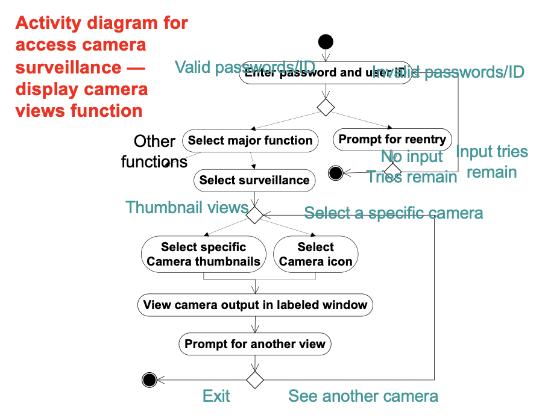
    

    - 类似流程图，但有起点（实心圆）和终点（实心圆外再加个环）

- **泳道图**(swim lane diagram)：在**活动图**的基础上，指出哪个参与者（如果特定用例涉及多个参与者）或分析类对活动矩形所描述的动作负责

    

        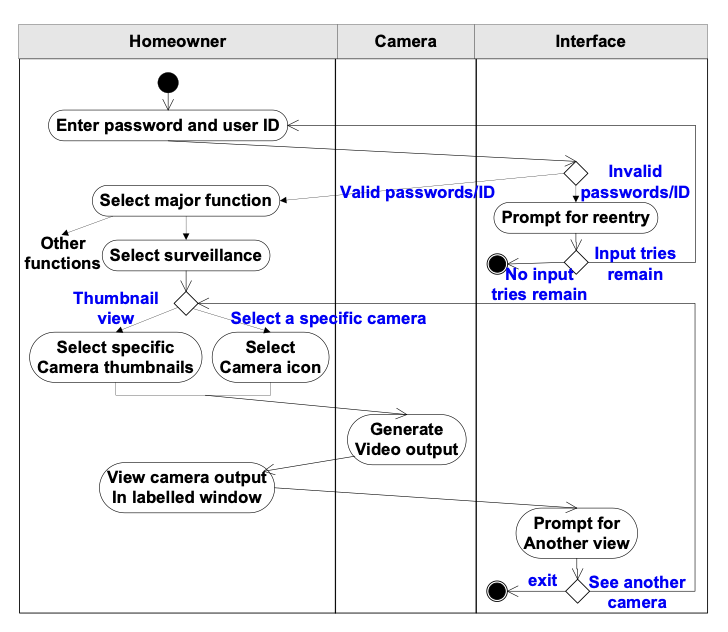
    

    - **职责划分**非常清晰：用户、系统、设备各自做什么一目了然
    - 接口关系清楚：哪些步骤涉及跨系统交互
    - 有助于系统设计：比如可以直接映射到模块划分、服务边界

## Class-Based Methods

面向对象分析的重点在于：

- **类**的定义，包括**模板**(template)（一类对象应该具有什么样的属性和行为）、**广义描述**(generalized description)（一类具有共同特征的对象）和**描述一组相似事物**(item)（对现实世界中一类事物的抽象）
    - **元类**(metaclass)（也称为**超类**(superclass)）建立了类的层次结构
    - 一旦定义了某个项的类，就可以识别出该类的一个具体实例

- 类之间相互**协作**以实现客户需求的方式

关键概念：

    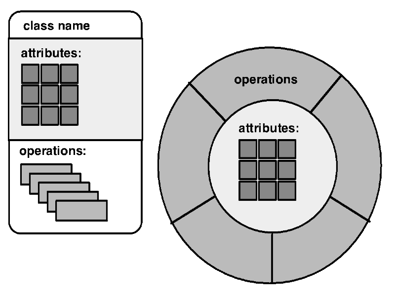

- **类**和**对象**
- **属性**(attribute)和**操作**(operation)
    - **方法**(methods)：也称为**操作**或**服务**，是一种封装在类中的可执行过程，旨在对一个或多个定义为类一部分的数据属性进行操作；通过**消息传递**(message passing)来调用方法

- **封装**(encapsulation)和**实例化**(instantiation)
    - 封装：把数据和操作这些数据的方法放在一起，对外只暴露接口，而隐藏内部实现细节

- **继承**

任务：

- 识别**类**（包括属性和方法）
- 定义类的**层次结构**

    

        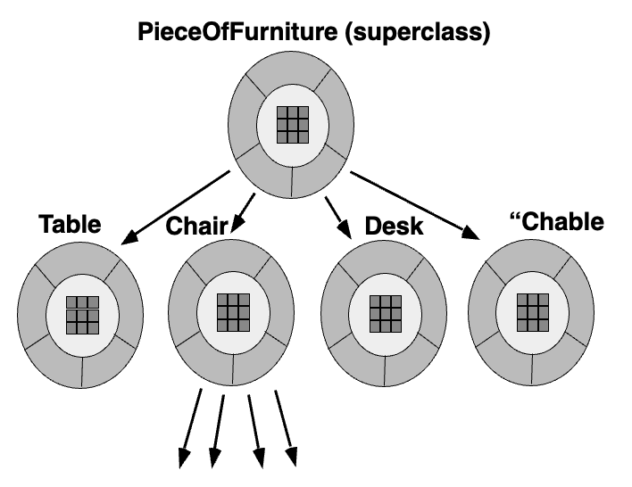
    

- 表示对象之间的**关系**
- 为对象**行为**建模
- **迭代**应用上述任务

---
**基于类的建模**(class-based modeling)表示：

- 系统将操作的**对象**
- 应用于对象以实现操作的**操作**
- 对象之间的**关系**（有些是层次化的）
- 所定义的类之间发生的**协作**

步骤：

- 通过检查问题陈述来识别**分析类**
- 使用语法解析(grammatical parse)来分离**潜在类**
    - **保留信息**：只有当系统为了正常运行而必须记住关于潜在类的信息时，该潜在类在分析过程中才具有实用价值
    - **所需服务**：潜在类必须拥有可识别的操作集，这些操作能够以某种方式改变其属性的值
    - **多重属性**：在需求分析阶段，应重点关注主要信息；仅包含单一属性的类在设计阶段可能有用，但在分析活动中，最好将其表示为另一个类的属性
    - **公共属性**：可以为潜在类定义一组属性，这些属性适用于该类的所有实例
    - **公共操作**：可以为潜在类定义一组操作，这些操作适用于该类的所有实例
    - **基本需求**：问题空间中出现的、对系统任何解决方案的运行产生或消耗关键信息的外部实体，几乎总是会被定义为需求模型中的类

- 识别每个类的**属性**
- 识别操作这些属性的**操作**

**类图**(class diagram)：

    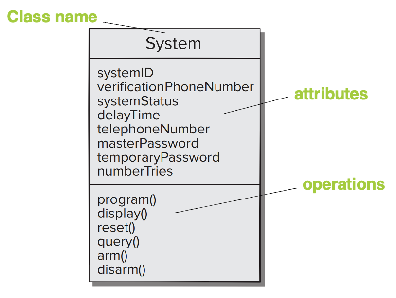

将多个类组织起来：

    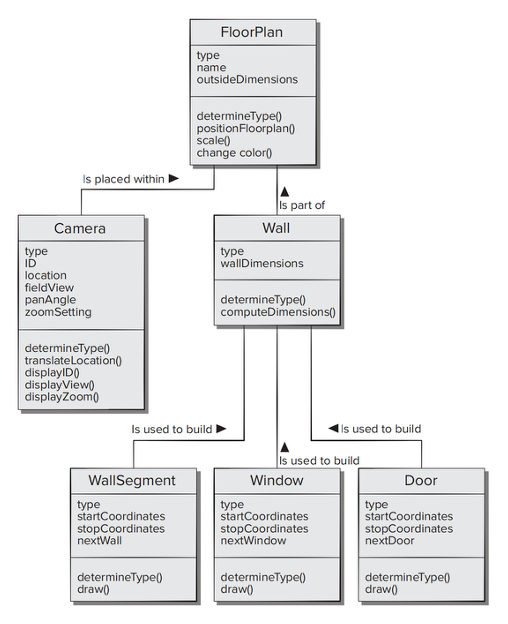

**CRC**（类-职责-协作者(class-responsability-collaborator)）建模：

    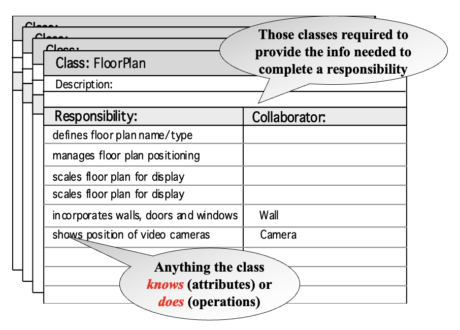

- 类名
- 描述（不要漏了！）
- **职责**：类所封装的属性和操作
- **协作者**：需要为某个类提供完成职责所需信息的类；通常协作意味着请求信息获请求执行某些操作

类的类型：

- **实体类**(entity class)：也称模型类或业务类，直接从问题陈述中提取而来
- **边界类**(boundary class)：用于创建用户在使用软件时所看到并与之交互的界面（例如交互式屏幕或打印报告）
- **控制类**(control class)：管理从开始到结束的工作单元，即用于管理：
    - 实体对象的创建或更新
    - 边界对象在从实体对象获取信息时的实例化
    - 对象集合之间的**复杂通信**
    - 对象之间或用户与应用程序之间通信数据的**验证**

分配**职责**的原则：

- 系统功能应**分布**到各类中，以最好地满足问题的需求
- 每项职责应尽可能**一般性地**陈述
- 信息及其**相关**行为应位于同一个类中
- 关于某事物的**信息**应**局部化**于一个单独的类，而非分布在多个类中
- 适当时，**职责**应在相关类之间**共享**

类通过以下两种方式之一履行其职责：

- 类可以使用**自身**的操作来操作自身的属性，从而履行特定的职责
- 类可以与**其他**类协作

**协作**识别了类之间的关系：

- 「**部分-整体**」(is-part-of)关系：一个类是另一个类的组成部分
- 「**知晓**」(has-knowledge-of)关系：一个类需要知道另一个类的存在或持有关于另一个类的信息，才能完成自己的职责
- 「**依赖**」(depends-upon)关系：一个类为了完成某项功能，需要依赖另一个类提供服务

**组合**(composite)/**聚合**(aggregate)类：一个类由多个“部件类”组成，也就是典型的 **has-a 关系**

    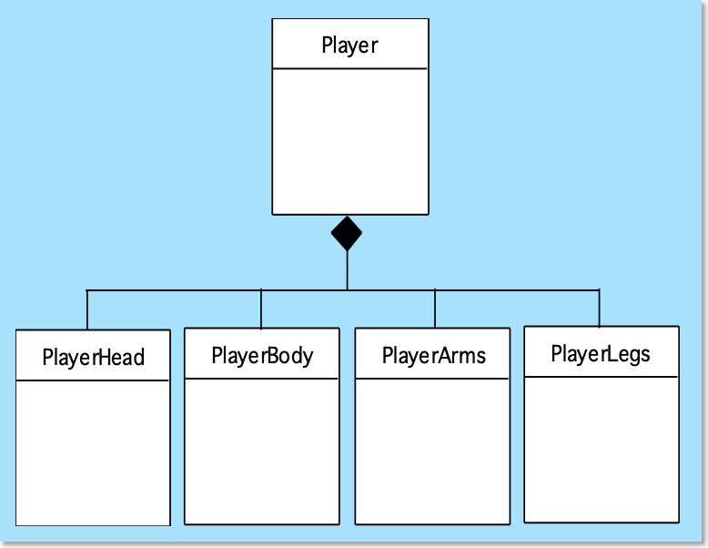

- 组合：表示**强拥有关系**，即整体对象负责部件对象的生命周期；部件依赖整体生命周期，整体没了，部件也没了
- 聚合：表示**弱拥有关系**，即整体使用部件，但不一定负责它们的生命周期；部件可以独立存在，整体只是引用或使用它

**关联**(association)和**依赖**(dependency)
    
- 关联：一个类与另一个类之间存在某种结构性的连接
    - 强调的是“有关系”，是一种比较稳定的连接
    - 可以通过指示**多重性**(multiplicity)（在数据建模中叫做「**基数**」(cardinality)）来细化

    

        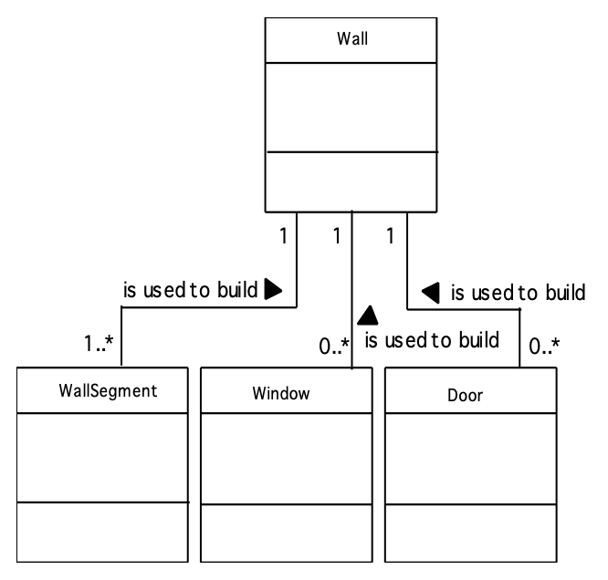
    

- 依赖：一个类在某些操作中需要使用另一个类的功能
    - 强调的是“用到”，是一种功能上的依赖

    

        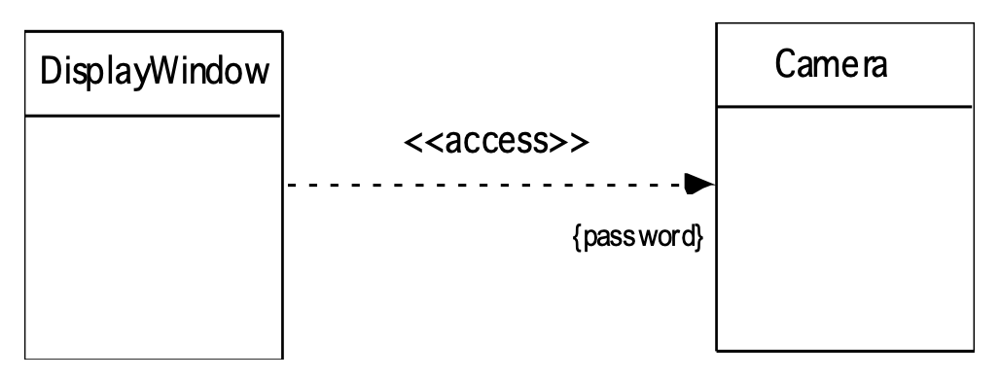
    

???+ abstract "总结"

    

    | 关系 | 强度 | 生命周期 | 是否持有对象 | 是否共享 | 典型位置 |
    |---|---|---|---|---|---|
    | 组合 | ☆☆☆☆☆ | 绑定 | 是 | 否 | 成员变量 |
    | 聚合 | ☆☆☆☆ | 独立 | 是 | 是 | 成员变量 |
    | 关联 | ☆☆ | 独立 | 是 | 是 | 成员变量 |
    | 依赖 | ☆ | 短暂 | 否 | - | 方法内部 |

    | 关系 | 表示 |
    |---|---|
    | 组合 | ◆——（实心菱形） |
    | 聚合 | ◇——（空心菱形） |
    | 关联 | ——（普通线） |
    | 依赖 | - - ->（虚线箭头） |

    

评审 CRC 模型：

- 参与 CRC 模型评审的所有人员都会获得该模型索引卡的一个子集；协作的卡片应**分开**放置（即任何评审人员都不应同时持有两张相互协作的卡片）
- 所有用例场景（及相应的用例图）应按类别进行组织。
- 评审负责人有意识地阅读用例；当评审负责人提到某个已命名的对象时，她将 **token** 传递给持有相应类索引卡的人员
- 当 token 传递时，持有类卡的人员需描述卡片上标注的职责；团队需判断其中一个（或多个）职责是否满足用例需求
- 若索引卡片上记录的职责与协作关系**无法**支持该用例，则需对卡片进行修改，可能包括定义新类（及对应的 CRC 索引卡片），或对现有卡片上的职责或协作关系进行新增或修订

**分析包**(analysis packet)

- 分析模型的各种元素（例如用例、分析类）以一种方式**分类**(categorized)，将其打包为分组(grouping)
- 每个包中分析类名称前可能会有一个符号
    - **加号**：具有公共可见性，可以被其他包访问（`#!java public`）
    - **减号**：对其他所有包隐藏（`#!java private`）
    - **# 号**：仅对给定包内的类可访问（`#!java protected`）

???+ example "例子"

    

        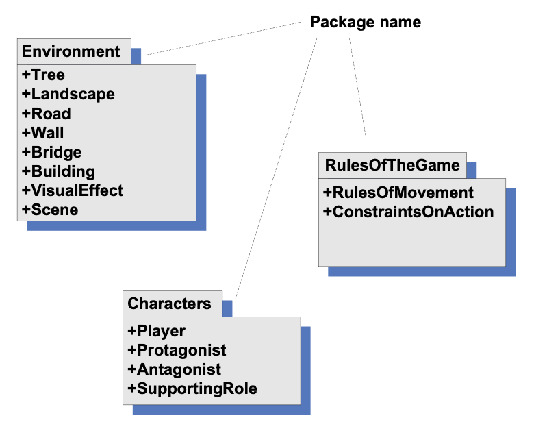
    

## Behavior, Patterns, and Web/Mobile Apps

**行为模型**(behavior model)指示软件如何响应外部事件或刺激。为创建该模型，分析师必须执行以下步骤：

1. 评估所有用例，以充分理解系统内部的**交互顺序**
2. 识别驱动交互序列的**事件**，并理解这些事件与特定对象之间的关系
3. 为每个用例创建一个**序列**(sequence)
4. 为系统构建一个**状态图**
5. 审查行为模型，以验证其准确性和一致性

状态系统的组成：

- **状态**(state)：在给定时间点表征系统行为的一组可观测情况
- **状态转换**(state transition)：从一个状态到另一个状态的变迁，描述系统对外部事件的反应
- **事件**(event)：导致系统表现出某种可预测行为形式的发生，发生在系统与参与者交换信息的时候
- **动作**(action)：作为转换结果而发生的过程

在行为建模的语境中，必须考虑两种不同的状态表征：

- 系统执行其功能时**每个类的状态**
- 系统执行其功能时从外部观察到的**系统状态**

???+ example "例子"

    状态图：

    

        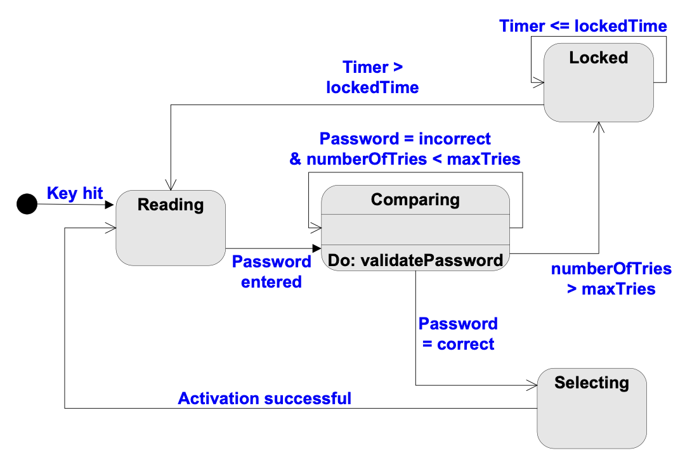
    

    **顺序图**(sequence diagram)：描述对象之间的交互过程和时间顺序，关注消息是如何在对象之间传递的

    - 对象：一般排列在图的上方，每个对象下面有一条竖线，表示它在时间轴上的存在
    - 消息：也就是对象之间的调用关系，用箭头表示，比如一个对象调用另一个对象的方法
    - 时间顺序：**从上到下展开**，清晰地展示了整个交互流程的先后关系

    

        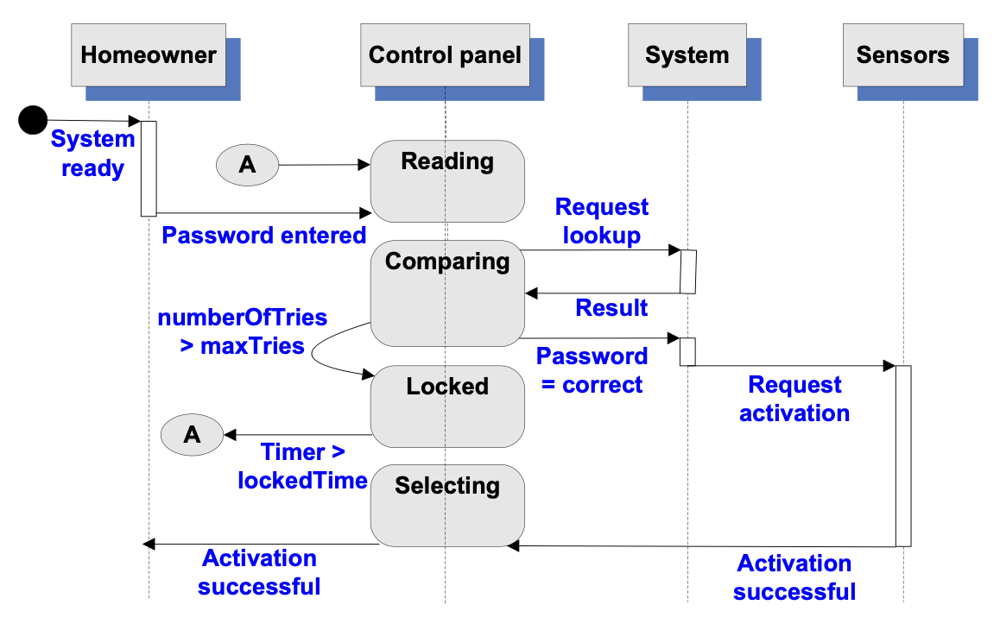
    

---
**数据建模**(data modeling)：

- 独立于过程检查数据对象  
- 将注意力集中在数据领域  
- 在客户的抽象层次上创建模型  
- 指示数据对象之间的相互关系

一个**数据对象**包含一组属性，这些属性作为该对象的方面、特性、特征或描述符。

    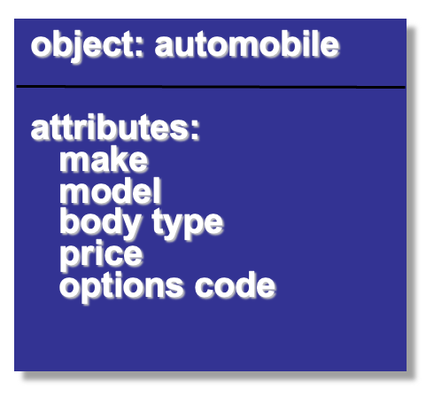

不同数据对象之间可以被关联起来，形成**关系**(relationship)。通常用 **ER 图**表示。

- 基数(cardinality)：一对一、一对多、多对多  
- 模态(modularity)：强制性(mandatory)、可选性(optional)

    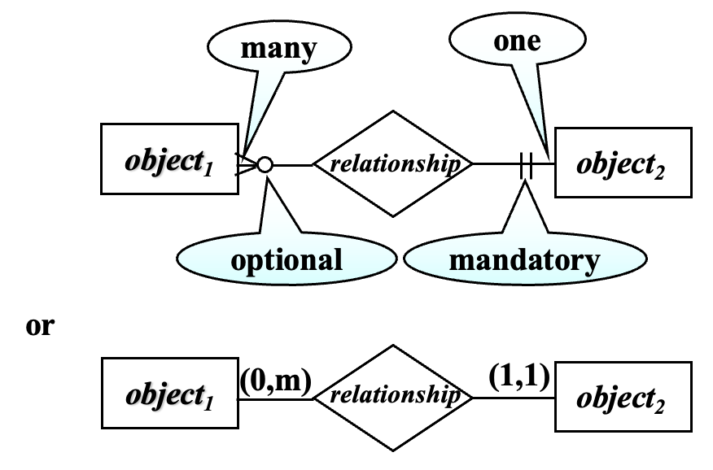

???+ example "例子"

    

        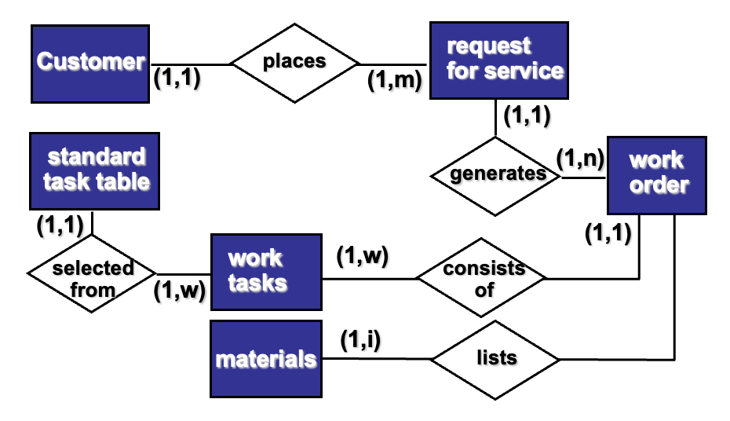
    

---
基于流的模型表示数据对象在系统中移动时如何被转换。其中**数据流图**(data flow diagram, **DFD**)是用于这种表示的图表形式。

- 每个基于计算机的系统都是一个**信息转换**(information transform)系统
- 描绘了信息流以及数据从输入到输出过程中所应用的转换
- 用于表示任何抽象层次上的系统或软件

相关记号：

    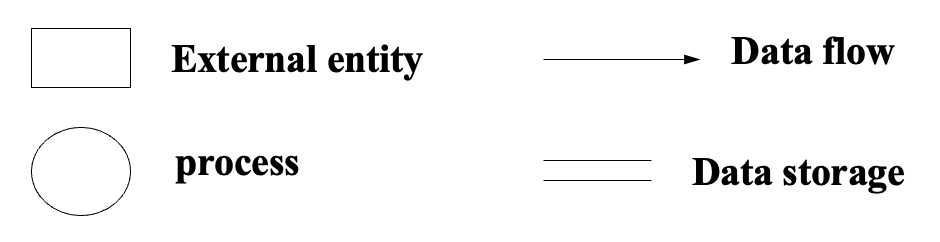

- **外部实体**(external entity)：数据的生产者或消费者
    - 数据必须始终起源于某处，并且必须始终发送到某处

- **过程**(process)：数据转换器（将输入转换为输出）
    - 数据必须始终以某种方式进行处理，以实现系统功能

- **数据流**(data flow)：数据流经系统，从输入开始，然后转化为输出

    

        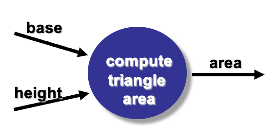
    

- **数据存储**(data storage)：数据经常被存储以供日后使用

    

        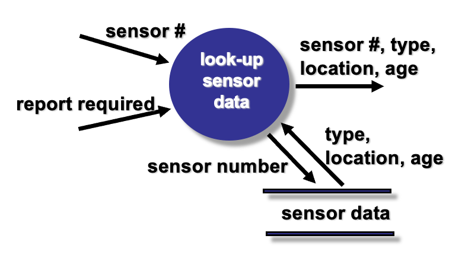
    

DFD 分层：

    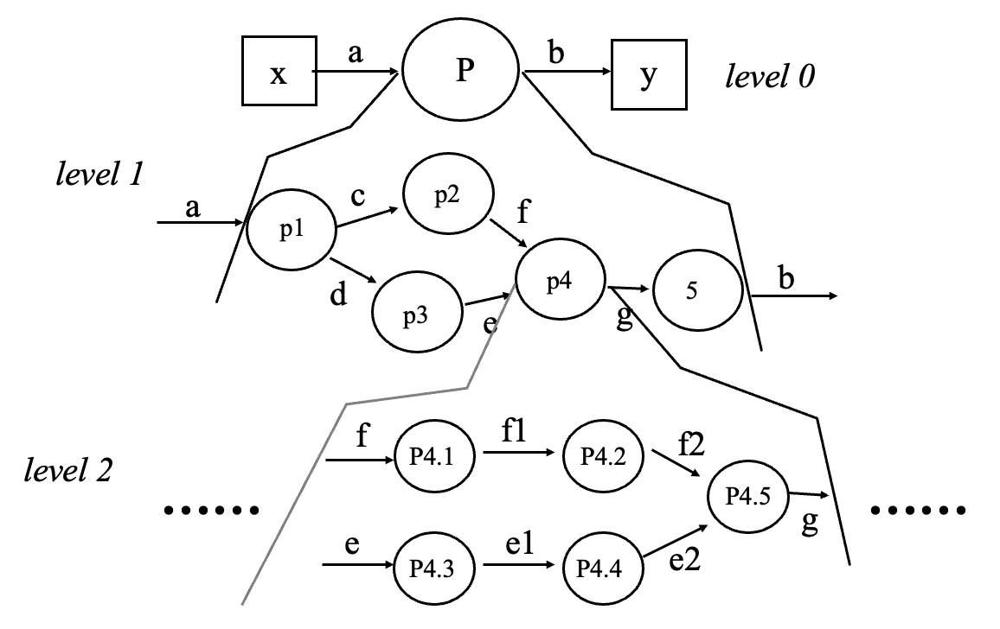

DFD 指南：

- 始终**标记**数据流**箭头**，所有图标都必须使用有意义的名称进行标注
- 始终从**上下文**级别图（也称为 0 级图）开始，并在 0 级图上展示**外部实体**
- **不要**表示过程**逻辑**
- DFD 通过多个详细级别逐步演化，并且必须保持**信息流的连续性**

**过程规范**(process specification, **PSPEC**)对 DFD 中某一个处理的内部逻辑进行精细化描述。它可以有多种表达形式，比如：

- 自然语言描述(narrative)：用文字说明处理逻辑 
- 伪代码(pseudocode / PDL)：用接近程序的方式表达 
- 公式(equations)：适用于计算类处理 
- 表格(tables)：适用于规则较多的情况 
- 图表(diagrams)：辅助说明复杂逻辑 

构建 DFD：

- 审查数据模型以隔离数据对象，并通过语法解析确定操作
- 确定外部实体（数据的生产者和消费者）
- 创建 0 级数据流图
- 编写描述变换的叙述  
- 解析以确定下一级变换  
- 「平衡」流程以保持数据流连续性  
- 开发 1 级数据流图  
- 使用大约 1:5 的扩展比例

!!! note "注"

    - 每个过程被细化直到只做一件事  
    - 随着层级数量的增加，扩展比例会降低  
    - 大多数系统需要 3 到 7 个层级才能形成合适的流模型  
    - 单个数据流项（箭头）可随层级增加而扩展（数据字典提供相关信息）

---
**分析模式**的作者并非创造该模式，而是在进行需求工程工作时**发现**它。一旦发现模式，就会将其记录下来。

**语义分析模式**(semantic analysis pattern, **SAP**)是一种描述一小套连贯用例的模式，这些用例共同描述了一个基本通用的应用。

为 WebApps 的需求建模：

- **内容**分析：明确 WebApp 将提供的全部内容，包括文本、图形和图像、视频以及音频数据；可采用数据建模来识别和描述每个数据对象
    - 从用例中提取**内容对象**，检查场景描述中直接和间接引用的内容
    - 识别每个内容对象的**属性**
    - 内容对象之间的**关系**和/或 WebApp 维护的内容层次结构
        - 关系—实体关系图或 UML
        - 层次结构—数据树或 UML

    - 表现形式：数据树

        

            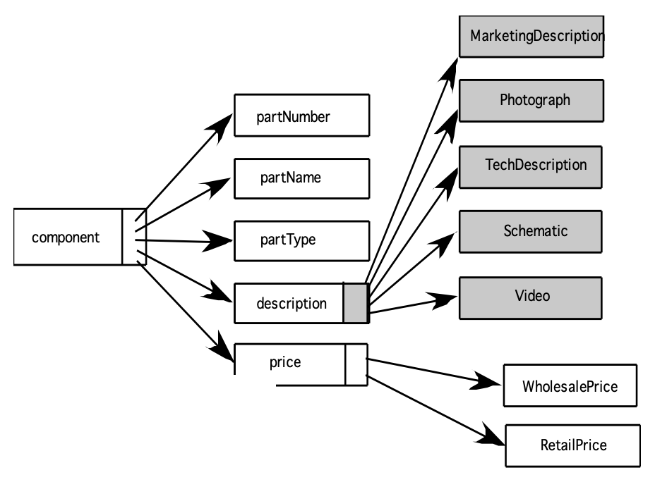
        

- **交互**分析：详细描述用户与 WebApp 交互的方式；可开发用例来提供这种交互的详细描述
    - 由四个元素组成：
        - **用例**
        - **顺序图**
        - **状态图**
        - **用户界面原型**

    - 每个元素都是重要的 UML 表示法

- **功能**分析：作为交互分析的一部分而创建的使用场景（用例）定义了将应用于 WebApp 内容的操作，并隐含了其他处理功能；所有操作和功能均需详细描述
    - 处理 WebApp 的两个处理元素：
        - WebApp 向最终用户提供的**用户可观测功能**
        - **分析类中包含的操作**，这些操作实现了与该类相关的行为

    - **活动图**可用于表示处理流程

- **配置**分析：详细描述 WebApp 运行的环境和基础设施
    - **服务端**  
        - 必须指定服务器硬件和操作系统环境  
        - 必须考虑服务端的互操作性考量  
        - 必须指定适当的接口、通信协议及相关协作信息  

    - **客户端**  
        - 必须确定浏览器配置问题  
        - 应定义测试需求

- **导航**分析：网页链接的组织结构
    - 某些元素是否应该比其他元素更容易访问（需要更少的导航步骤）？展示的**优先级**是什么？
    - 是否应该**强调**某些元素，以强制用户朝它们的方向导航？
    - 应如何处理导航**错误**？
    - 是否应优先导航到相关元素组而非导航到特定元素？
    - 导航应通过链接、基于搜索的访问还是其他方式**实现**？
    - 是否应根据先前导航操作的**上下文**向用户呈现某些元素？
    - 是否应为用户维护导航**日志**？
    - 在用户交互的每个节点，是否应提供**完整的导航地图或菜单**（而非单一的“返回”链接或定向指针）？
    - 导航**设计**应以用户最常见的行为模式为导向，还是基于 WebApp 元素被感知的重要性？
    - 用户能否**存储**其在 WebApp 中的先前导航路径，以加快未来使用效率？
    - 应为哪类用户群体设计**最优导航**？
    - 应如何处理指向 WebApp **外部的链接**？覆盖现有浏览器窗口、打开新浏览器窗口，还是使用独立框架？

在某些 Web / 移动应用场景中，分析与设计是合并的。然而，当以下情况出现时，**显式的分析活动**会发生

- 待构建的网页或移动应用**规模庞大**且/或**复杂度高**
- 利益相关者**数量众多**
- 开发人员数量众多
- 开发团队成员此前**未曾合作过**
- 应用的成功将对业务成功产生**重大影响**