# Testing

## Software Testing Strategies

**测试**(testing)是在将程序交付给终端用户**之前**，通过执行程序来查找错误的过程。除错误外，测试还能展示软件是否符合需求、性能和质量的表现等。

测试策略方法：

- 要进行有效的测试，应当开展有效的**技术评审**；通过这种方式，许多错误将在测试前就能被消除
- 测试从**组件级**开始，并向外延伸到整个基于计算机的系统的集成
- 不同的测试技术适用于不同的软件工程方法以及不同的时间点
- 测试由**软件开发者**（对于大型项目，还包括**独立测试组**）进行
    - 开发者：了解系统，但会温和地测试，并且以**交付**(delivery)为驱动力
    - 独立测试员：必须了解系统，但会尝试破坏它，并且受**质量**驱动

- 测试和**调试**是不同的活动，但任何测试策略都必须包含调试环节

V & V；

- **验证**(verification)是指确保软件**正确**实现特定**功能**的一组任务；“我们是否正确地构建了产品？”
- **确认**(validation)是指另一组不同的任务，确保所构建的软件**可追溯**(traceable)到客户**需求**；“我们是否构建了正确的产品？”

测试策略：**单元测试** -> **集成测试** -> **验证测试** -> **系统测试**

    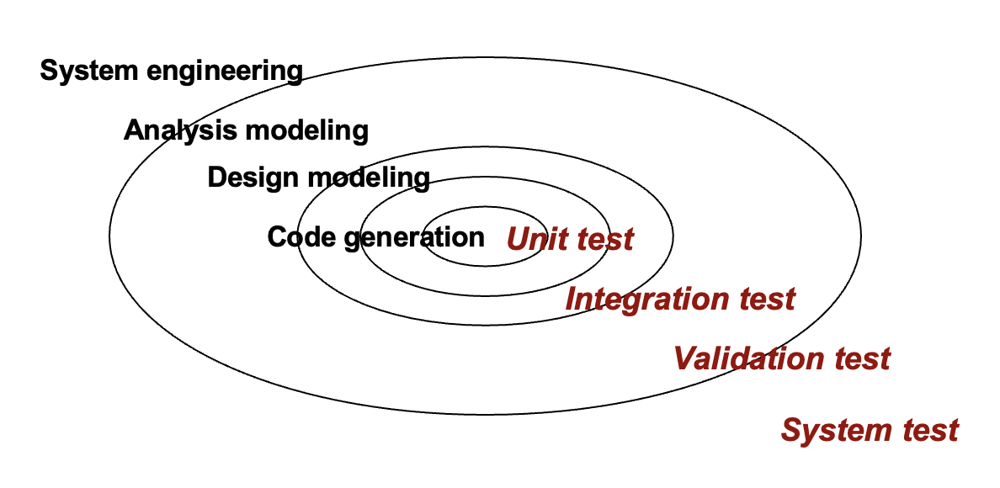

- 首先从小范围测试开始，逐步过渡到大范围测试
- 对于传统软件而言
    - 初始关注点是**模块**（**组件**）
    - 随后是模块的**集成**

- 对于**面向对象**软件而言，当进行小范围测试时，我们的关注点从单个模块（传统视角）转变为**包含属性和操作、并隐含通信与协作的面向对象类**

策略问题：

- 在测试开始之前，以**可量化的方式**(quantifiable)明确产品**需求**
- **明确**陈述测试**目标**
- 了解软件的**用户**，并为每个用户类别建立用户画像
- 制定强调快速循环测试的**测试计划**
- 构建**健壮**的软件，使其能够自我测试
- 在测试之前，使用有效的技术**评审**作为过滤器  
- 进行技术评审，以评估测试**策略**及测试用例本身
- 为测试过程制定持续改进的**方法**

**单元测试**(unit testing)：

    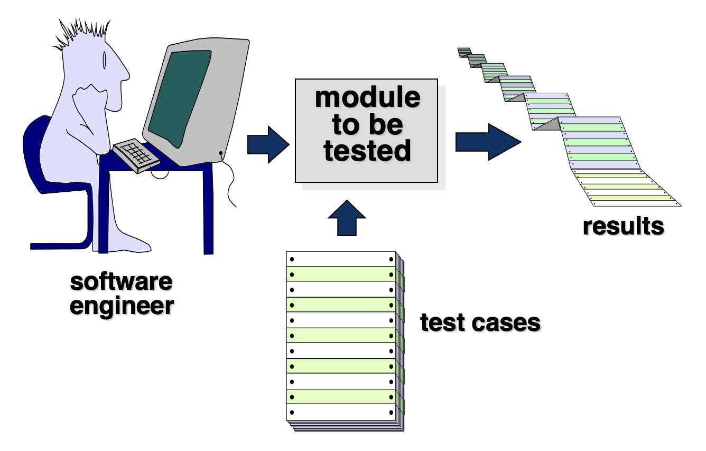

检查内容：

- **接口**(interface)
- **局部数据结构**(local data structures)
- **边界条件**(boundary conditions)
- **独立路径**(independent paths)
- **错误处理路径**(error handling paths)

单元测试环境：

    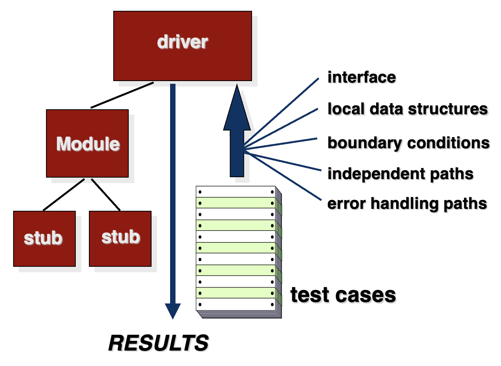

- **驱动程序**(driver)：负责调用待测模块，相当于临时的**上层**控制程序
- **桩程序**(stub)：模拟被待测模块调用的**下层**模块

---
**集成测试**策略：

- 「大爆炸」方法("big bang" approach)：等所有模块都写完后一次性合并测试，表面省事，但错误一旦出现很难定位
- **增量构建策略**(increment construction strategy)：逐步集成、逐步测试，这样每次加入新模块后都能立刻检查接口和协作问题

- **自顶向下集成**(top-down integration)：从系统的主控模块开始，逐步向下集成子模块
    
    

        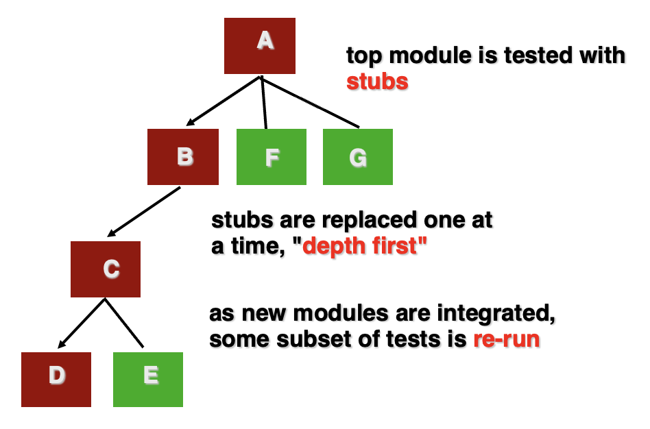
    

    
    - 特点：
        - 先测试高层控制逻辑
        - 低层模块未完成时，用**桩程序**代替
        - 适合验证系统**总体结构**和主要流程
    
    - 缺点：
        - 底层功能较晚才能真正测试
        - 需要编写较多桩程序

- **自底向上集成**(bottom-up integration)：从系统的底层模块开始测试和集成，逐步向上组合

    

        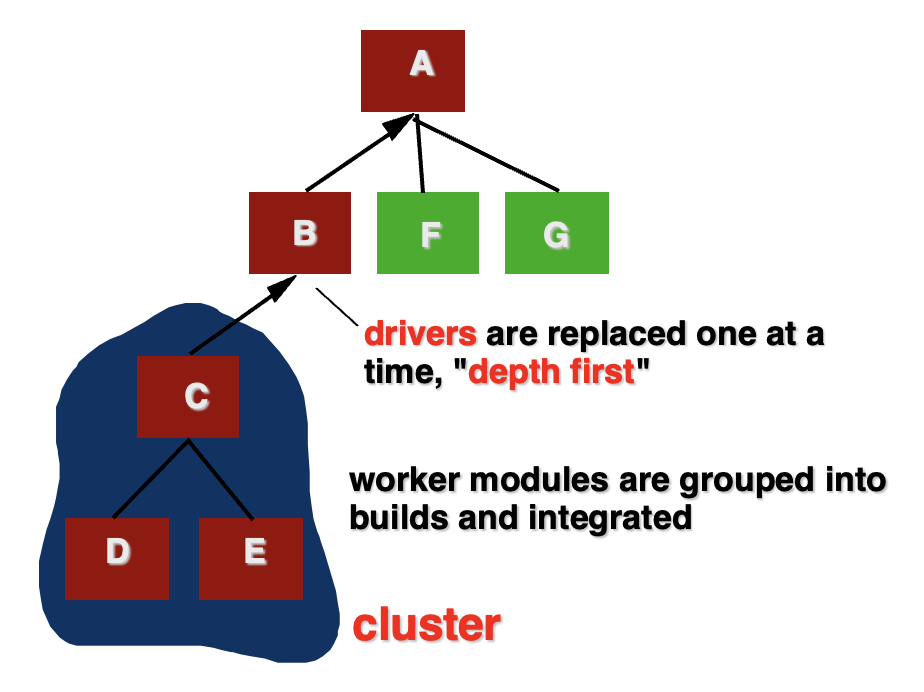
    

    - 特点：
        - 先测试基础功能模块
        - 高层模块未完成时，用**驱动程序**调用底层模块
        - 适合验证**底层**算法、工具类、数据库访问等模块
    
    - 缺点：
        - 高层控制逻辑较晚才能测试
        - 需要编写驱动程序

- **三明治测试**(sandwich testing)：同时从系统的高层和底层开始集成，最后在中间层汇合

    

        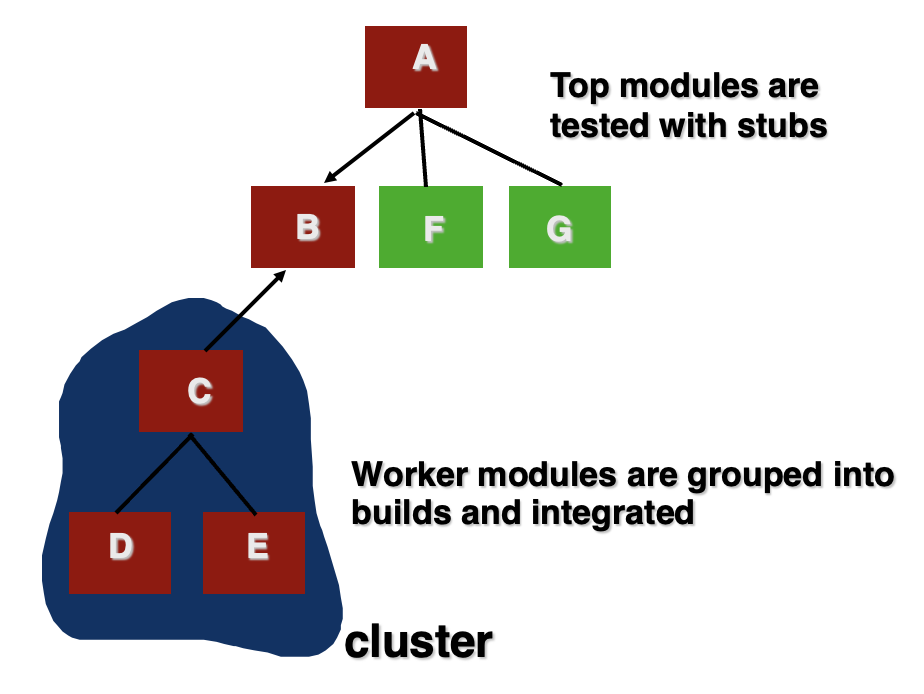
    

    - 特点：
        - 结合自顶向下和自底向上的优点
        - 高层控制逻辑和底层基础功能可以并行测试
        - 适合大型复杂系统

    - 缺点：
        - 组织和协调难度较高
        - 可能同时需要桩程序和驱动程序

---
**回归测试**(regression testing)：

- 重新执行已进行过的部分测试子集，以确保变更未引发意外的副作用
- 每当软件被修正时，软件配置的某些方面（程序、其文档或支持其运行的数据）就会发生变化
- 回归测试有助于确保（因测试或其他原因导致的）**变更**不会引入**意外行为**或额外错误
- 可通过**手动**方式执行，即重新运行部分测试用例，或使用**自动化**的捕获/回放工具进行

**冒烟测试**(smoke testing)是创建产品软件「**每日构建**」的常见方法。步骤如下：

- 已转化为代码的软件组件被集成到一个「**构建**」(build)中，里面包含实现一个或多个产品功能所需的所有数据文件、库、可复用模块以及工程化组件
- 设计一系列测试，以暴露可能导致构建无法正常执行其功能的错误，发现最有可能导致软件项目进度滞后的致命错误
- 将构建与其他构建进行集成，整个产品（以其当前形式）每天都进行冒烟测试，集成方法可以是自顶向下或自底向上

通用测试标准：

- **接口完整性**(interface integrity)：随着每个模块或集群添加到软件中，内部和和外部模块接口都经过测试  
- **功能有效性**(functional validity)：测试以发现软件中的功能缺陷  
- **信息内容**(information content)：测试局部或全局数据结构中的错误  
- **性能**(performance)：验证是否测试了指定的性能界限

**面向对象测试**：

- 首先评估分析和设计模型的正确性和一致性
- 测试策略的变更
    - 由于封装，「**单元**」的概念变得更加宽泛
    - **集成**侧重于类及其在「**线程**」(thread)中的执行，或在使用场景中的上下文
    - 验证采用传统的**黑盒**方法

- 测试用例设计借鉴传统方法，同时也涵盖特殊特性

WebApp 测试：

- 审查 WebApp 的**内容**模型以发现错误
- 审查**接口**模型以确保所有用例都能被容纳
- 审查 WebApp 的**导航**模型以发现导航错误
- 测试用户界面以发现呈现和/或导航机制中的错误
- 每个**功能**组件都进行单元测试
- 整个架构的导航经过测试
- WebApp 在**不同的环境配置**中实现，并针对每个配置的兼容性进行测试
- 进行**安全**测试，试图利用 WebApp 或其环境中的漏洞
- 进行**性能**测试
- WebApp 由**受控和监督的终端用户群体**进行测试；评估他们与系统交互的结果，包括内容和导航导航错误、可用性问题、兼容性问题以及 WebApp 的可靠性和性能

移动 App 测试：

- **用户体验**测试：确保应用满足利益相关者对可用性和可访问性的期望
- **设备兼容性**(device compatibility)测试：在多种设备上进行测试
- **性能**测试：测试非功能性需求
- **连接**测试：测试应用的可靠连接能力
- **安全**测试：确保应用满足利益相关者的安全期望
- **野外**测试(testing-in-the-wild)：在实际用户环境中对用户设备上的应用进行测试
- **认证**(certification)测试：应用符合分发标准

高阶测试(high order testing)：

- **确认**(validation)测试：关注软件需求，发现用户能够观察到软件未能符合其需求的地方
- **系统**测试：关注系统集成
- **Alpha/Beta** 测试：关注客户使用
- **恢复**测试：通过多种方式强制软件失败，验证恢复是否正确执行
- **安全**测试：验证系统中内置的保护机制是否能有效防止不当入侵
- **压力**测试：以异常数量、频率或容量需求资源的方式执行系统
- **性能**测试：在集成系统环境中测试软件的运行时性能

**调试**(debugging)过程：

    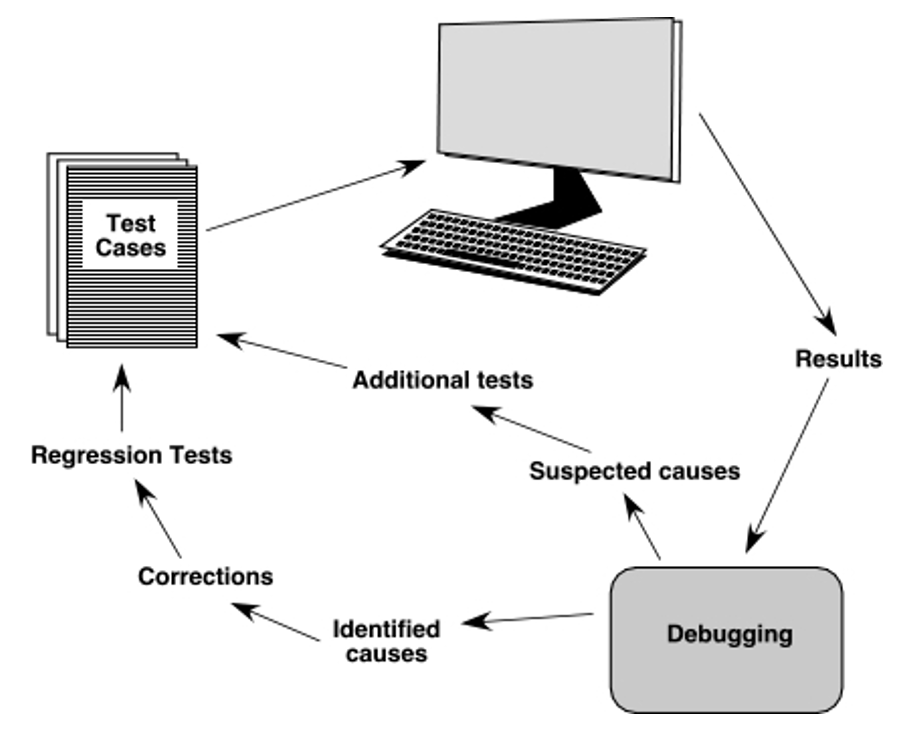

- 工作量(effort)：
    - **诊断**：理解症状、重现问题、定位原因
    - **修正**：修改错误，并执行回归测试确认没有副作用

- 调试困难的原因：
    - 症状和原因可能在**地理上是分离的**
    - 当另一个问题被修复时，症状可能会消失
    - 症状可能是间歇性的
    - 原因可能是由非错误的**组合**造成的
    - 原因可能是由系统或编译器错误造成的
    - 原因可能是由每个人都相信的假设造成的

- bug 类别：功能相关 bug、系统相关 bug、数据 bug、编码 bug、设计 bug、文档 bug、标准违反等
- 调试技术：
    - **暴力破解**(brute force)/测试：依赖大量输出、日志和测试，简单但可能低效
    - **回溯法**(backtracking)：从症状沿执行路径反向追踪
    - **归纳**(induction)：从多个现象中归纳规律
    - **演绎**(deduction)：先提出假设，再用实验排除或确认

- 最终考虑：
    - **三思而后行**，再着手修正
    - 借助**工具**获取更深入的见解
    - 若陷入僵局，向**他人**寻求帮助
    - 一旦修正了错误，应进行**回归测试**以发现任何副作用

修正错误时需考虑：

- 该缺陷的原因是否在程序的其他部分重现？在许多情况下，程序缺陷是由可能在其他地方重现的错误逻辑模式引起的。
- 即将进行的修复可能会引入缺陷？在进行修正之前，应评估源代码（或更佳的是设计），以判断逻辑与数据结构的耦合程度。
- 我们一开始本可以做些什么来预防这个缺陷？这个问题是建立统计软件质量保证方法的第一步。如果你既修正流程也修正产品，那么该缺陷将从当前程序中移除，并可能从所有未来的程序中消除。

## Conventional Applications

**可测试性**(testability)包括：

- **可操作性**(operability)：运行干净  
- **可观察性**(observability)：每个测试用例的结果易于观察  
- **可控性**(controllability)：测试可自动化和优化的程度  
- **可分解性**(decomposability)：测试可定向进行  
- **简洁性**(simplicity)：简化复杂架构和逻辑以简化测试  
- **稳定性**(stability)：测试期间变更请求少  
- **可理解性**(understandability)：设计的可理解性

什么是好的测试？

- 有很高的概率发现错误
- 不是冗余的
- 应该是同类最佳的(best of breed)
- 既不应过于简单，也不应过于复杂

任何工程产品（以及大多数其他事物）都可以通过以下两种方式之一进行测试：

- 了解产品设计用于执行的特定**功能**后，可以进行测试，以证明每个功能完全正常运作，同时查找每个功能中的错误
- 了解产品的**内部工作原理**后，可以进行测试，以确保“所有齿轮啮合”，即内部操作按照规范进行，并且所有内部组件都已得到充分测试

测试方法：

- **穷举测试**(exhaustive testing)

    

        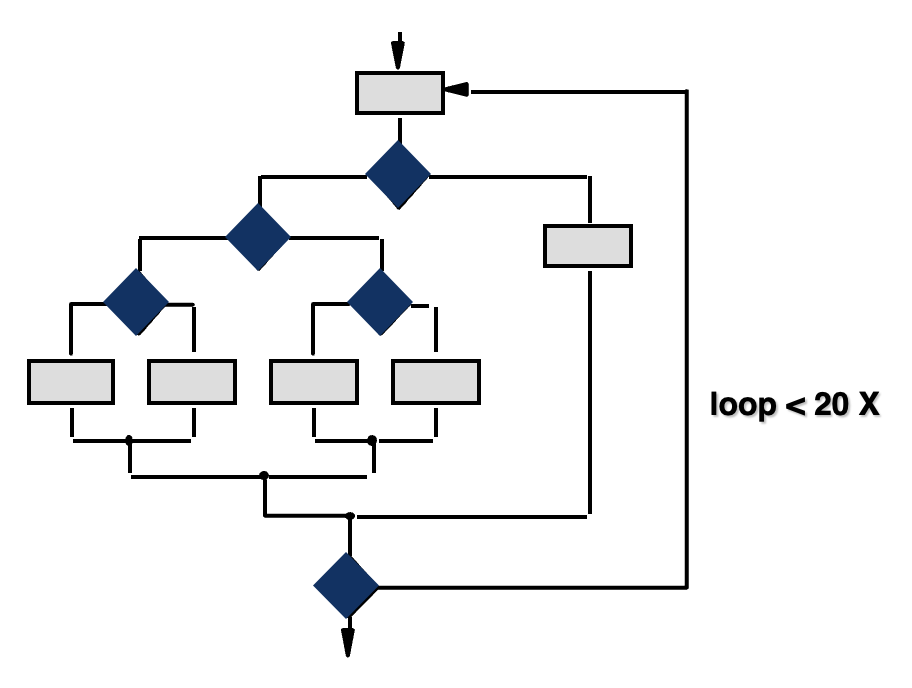
    

- **选择测试**(selective testing)

    

        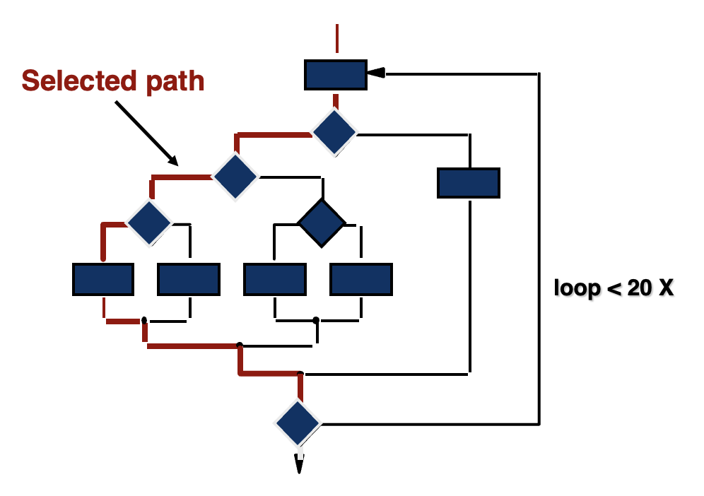
    

软件测试通常分为白盒测试与黑盒测试。

- **白盒测试**(white-box testing)：设计能够执行软件模块**内部逻辑**的测试用例
    - 目标：确保所有语句和条件至少被执行一次
    - 原因：
        - 逻辑错误和不正确的假设与路径的执行概率成反比
        - 我们常常认为某条路径不太可能被执行；事实上，现实往往与直觉相悖
        - 拼写(typographical)错误是随机的；未经测试的路径很可能会包含一些此类错误

    - **基本路径测试**(basis path testing)

        

            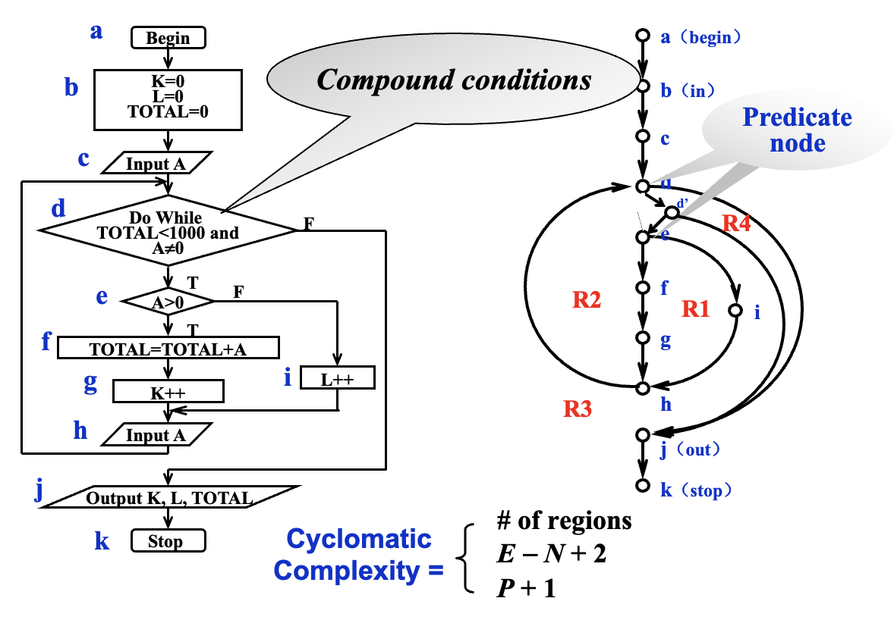
        

        - 节点表示一个或多个语句，边表示控制流，包含判断的节点叫**谓词节点**(predicate nodes)
        - **圈复杂度**(cyclomatic complexity) V(G) = 区域（**独立路径**）数 / E-N+2 / 谓词节点数 + 1；V(G)越高，错误概率就越高
            - 也可以用伪代码（PDL）表示
        
        - 推导测试用例：
            - 以设计或代码为基础，绘制相应的流图
            - 确定所得流图的圈复杂度
            - 确定一组线性独立路径的基集(basis set)
            - 准备测试用例，以强制执行基集中的每条路径

        - **图矩阵**(graph matrices)（流图的矩阵表示）
            - 一种方阵，大小（即行数和列数）等于流图中的节点数量
            - 每一行和每一列对应一个已标识的节点，矩阵中的条目则表示节点之间的连接（即边）
            - 通过为每个矩阵条目添加链接权重，图矩阵可以成为测试过程中评估程序控制结构的有力工具

    - **控制结构测试**(control structure testing)
        - **条件测试**(condition testing)：用于检验程序模块中包含的**逻辑条件**
        - **数据流测试**(data flow testing)：根据程序中**变量的定义和使用位置**，选择程序的测试路径
            - 假设程序中每个语句都有唯一的语句编号，并且每个函数不会修改其参数或全局变量。对于语句编号为 S 的语句：
                - DEF(S) = { X | 语句 S 包含对 X 的定义 }
                - USE(S) = { X | 语句 S 包含对 X 的使用 }

            - 变量 X 的**定义-使用（DU）链**的形式为 [X, S, S']，其中 S 和 S' 是语句编号，X 在 DEF(S) 和 USE(S') 中，且语句 S 中对 X 的定义在语句 S' 处是活跃的

            >~~怎么给我干到活跃性分析了 (bushi)~~

    - **循环测试**(loop testing)：侧重于测试循环结构的有效性

        

            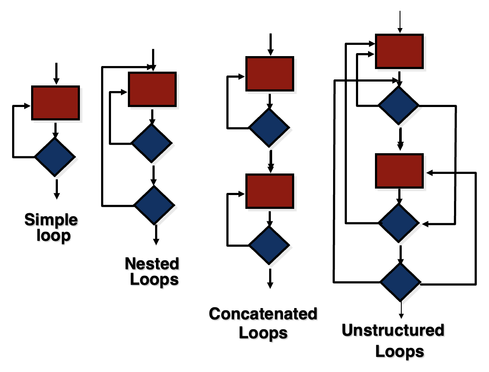
        

        - 简单循环（其中 n 是允许的最大通过次数）
            - 完全跳过循环  
            - 仅一次循环  
            - 两次循环  
            - m 次循环，其中 m < n
            - (n-1)、n 和 (n+1) 次循环

        - 嵌套循环
            - 从最内层循环开始。将所有外层循环设置为其最小迭代参数值
            - 测试最内层循环的 min+1、典型值、max-1 和最大值，同时保持外层循环在最小值
            - 向外移动一层循环，按照步骤2设置它，同时保持所有其他循环为典型值。继续此步骤直到测试完最外层循环

        - 连接循环(concatenated loop)
            - if 循环彼此独立 \n then 将每个循环视为简单循环 \n else* 视为嵌套循环 \n endif*
        
- **黑盒测试**(black-box testing)：设计能够证明每个程序**功能**都能正常运行的测试用例，能识别**不正确或缺失的功能**、**接口错误**、**性能问题**等
    - 回答的问题：
        - **功能**有效性如何测试？  
        - 系统行为和**性能**如何测试？  
        - 哪些**输入**类别能构成良好的测试用例？  
        - 系统是否对某些输入值特别敏感？  
        - 如何隔离数据类的**边界**？  
        - 系统能承受多大的数据速率和数据量？  
        - 特定的数据组合对系统运行会产生什么影响？

    - 基于图的方法：
        - 用于理解软件中的建模对象以及连接这些对象的关系
        - 在此上下文中，我们以最广义的范围来考虑“对象”这一术语，它涵盖了数据对象、传统组件（模块）以及计算机软件中的面向对象元素

        

            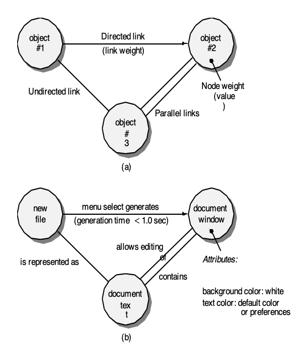
        

    - **等价划分**(equivalence partitioning)：将输入域划分为数据类，从这些数据类中可以派生测试用例，以减少必须开发的测试用例总数
        - **等价类**(equivalence class)表示输入条件的一组**有效或无效**状态，因此没有特别的理由选择其中一个元素作为类代表而非另一个
        - 指南
            - 如果输入条件指定了一个**范围**，则定义一个有效等价类和两个无效等价类
            - 如果输入条件要求一个特定**值**，则定义一个有效等价类和两个无效等价类
            - 如果输入条件指定了一个**集合**中的某个成员，则定义一个有效等价类和一个无效等价类
            - 如果输入条件是**布尔型的**，则定义一个有效等价类和一个无效等价类

    - **边界值分析**(boundary value analysis)
        - 如果输入条件指定了一个由值 a 和 b 界定的**范围**，测试用例应包含 a 和 b，以及略高于和略低于 a 和 b 的值
        - 如果输入条件指定了**值的个数**，测试用例应测试最小和最大个数，以及略高于和略低于最小和最大个数的值
        - 将前两条指南应用于**输出条件**：测试用例应设计为产生最小和最大的输出报告
        - 如果内部程序**数据结构**存在边界（例如大小限制），务必测试这些边界

    - **比较测试**(comparison testing)：仅在软件可靠性绝对关键的情况下使用（例如，载人系统）
        - 独立的软件工程团队基于相同的规格说明书开发同一应用的不同版本
        - 每个版本可使用相同的测试数据进行测试，以确保所有版本输出一致
        - 随后所有版本并行运行，并实时比较结果以确保一致性
    
    - **正交数组测试**(orthogonal array testing)：用于**输入参数数量较少**且每个参数可能取的值有**明确界限**的情况

        

            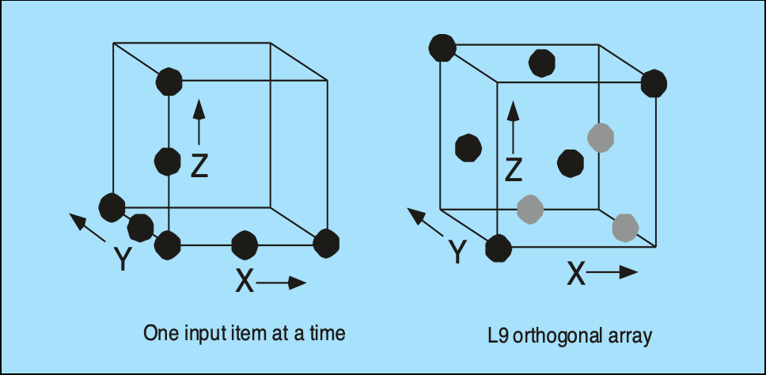
        

    - **基于模型的测试**(model-based testing)
        - 分析软件现有的**行为模型**（表示软件如何对外部事件或刺激作出响应）或创建一个行为模型
        - 遍历行为模型，并指定那些将迫使软件从一个状态转换到另一个状态的输入；这些输入将触发事件，从而导致状态转换的发生
            - 基于**状态转换图**
        
        - 审查行为模型，并记录软件在状态转换过程中预期的输出
        - 执行测试用例
        - 比较实际结果与预期结果，并根据需要进行修正

## Object-Oriented Applications

要充分测试面向对象系统，必须做到以下三点：

- 测试的定义必须**扩展**，以包含应用于面向对象分析和**设计模型**的错误发现技术
- **单元**测试与**集成**测试的策略必须显著改变
- **测试用例**的设计必须考虑面向对象软件的独有特性

对 OO 的**分析**与**设计**模型的审查尤其有益，因为相同的语义结构（如类、属性、操作、消息）在分析、设计以及代码层面上均会呈现。因此在分析阶段发现的类属性定义问题，能够规避若该问题直至设计或编码阶段（甚至下一轮分析迭代）才被发现时可能引发的副作用。

OO 模型的正确性：

- 在分析与设计阶段，可根据模型是否**符合现实世界**问题域来评估其**语义正确性**(semantic correctness)
- 若模型准确反映了现实世界（其细节程度适合当前开发阶段的评审需求），则其语义是正确的
- 为确定模型是否真实反映现实需求，应将其提交给问题域专家，由他们检查类定义及层次结构中的遗漏与歧义
- 还需评估类关系（实例连接）是否准确体现了现实世界中的对象关联

类模型**一致性**(consistency)：

- 重新**审视 CRC 模型**和对象关系模型
- **检查**每个 CRC 索引卡的**描述**，以确定委派责任是否属于协作者的定义的一部分
- **反转连接**，以确保每个被请求服务的协作者都从合理的来源接收请求
- 使用上一步中检查的反转连接，确定是否需要其他类，或者责任是否在类之间正确分组
- 确定是否可以将广泛请求的责任合并为单一责任

OO 测试策略：

- **单元测试**
    - 单元的概念发生变化  
    - 最小的可测试单元是封装后的**类**  
    - 单个操作不再能够孤立地进行测试，而是作为类的一部分进行测试  

- **集成测试**
    - **基于线程的测试**(thread-based testing)：将系统响应一个输入或事件所需的类集合进行集成  
    - **基于使用的测试**(use-based testing)：通过首先测试那些几乎不使用（如果有的话）服务类的类（称为独立类）来开始构建系统。独立类测试完成后，再测试下一层类，即依赖类  
    - **集群测试**(cluster testing)：定义了一个协作类的集群（通过检查 CRC 和对象关系模型确定），通过设计测试用例来尝试发现协作中的错误

- **验证测试**
    - 侧重于用户可见的操作和系统输出
    - 类连接细节消失
    - 利用**需求模型**中的用例
    - 传统的**黑盒测试**方法可用于驱动验证测试

测试方法：

- **基于故障的测试**(fault-based testing)：测试人员寻找可能的故障（即系统实现中可能导致缺陷的方面）；为了确定这些故障是否存在，设计测试用例以检验设计或代码；最适合用于**关键或可疑的操作和类**
- **类测试与类层次结构**(class testing and class hierarchy)：继承并不能免除对所有派生类进行彻底测试的需求；事实上，它反而可能使测试过程复杂化
- **基于场景的测试设计**(scenario-based test design)：基于场景的测试**关注用户的操作**（或者说**参与者与软件的交互**），而非产品的功能；这意味着通过用例捕获用户必须执行的任务，然后将其及其变体作为测试加以应用

OOT（面向对象测试）方法：

- **随机测试**(random testing)：
    - 确定适用于某个类的操作
    - 定义其使用约束
    - 确定最小测试序列，即定义类（对象）最小生命周期的一个操作序列
    - 生成各种随机（但有效）的测试序列
    - 执行其他（更复杂的）**类实例生命周期**

- **划分测试**(partition testing)：
    - 以与传统软件等价划分相同的方式，减少了测试一个类所需的测试用例数量
    - 基于**状态**的划分：根据操作改变类状态的能力对其进行分类和测试
    - 基于**属性**的划分：根据操作所使用的属性对其进行分类和测试
    - 基于**类别**(category)的划分：根据每个操作执行的通用功能对其进行分类和测试

- **类间测试**(inter-class testing)：
    - 对于每个**客户端**类，使用类操作器列表生成一系列随机测试序列；这些**操作器**(operator)将向其他**服务器**类发送**消息** 
        - C1(P1, P2...)
    
    - 对于生成的每条**消息**，确定**协作**(collborator)类以及服务器对象中的相应**操作器** 
        - C1(P1(m1 -> Sm1(P1'), m2...), P2...)
    
    - 对于服务器对象中每个（由客户对象发送的消息调用的）**操作器**，确定其传输的**消息** 
        - C1(P1(m1 -> Sm1(P1'(m1', m2', ...)),m2...), P2...)
    
    - 对于每条**消息**，确定被调用的**下一级操作器**，并将其纳入测试序列
        - C1(P1(m1 -> Sm1(P1'(m1' -> Sm1'(P1'', P2'', ...), m2'...)), m2...), P2...)

- **行为测试**(behavior testing)：要设计的测试应实现所有状态覆盖

    

        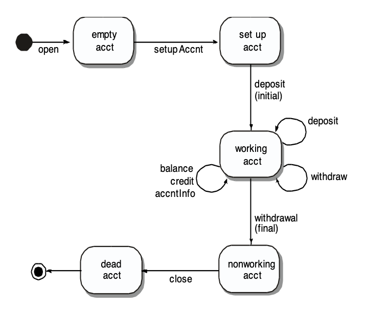
    

## Web Applications

测试质量维度：

- **内容**在语法和语义两个层面进行评估
    - **语法**(syntatic)：对基于文本的文档评估拼写、标点和语法
    - **语义**(semantic)：评估所呈现信息的正确性、整个内容对象及相关对象之间的一致性，以及无歧义性

- 对**功能**进行正确性、不稳定性和是否符合相应实现标准（如 Java 或 XML 语言标准）的测试
- 评估**结构**，确保其
    - 能够正确交付 WebApp 内容且功能可扩展
    - 当添加新内容或新功能时能够得到支持

- **可用性**测试旨在确保：
    - 每种用户类别均获得界面支持
    - 用户能够学习并应用所有必需的导航语法和语义

- **可导航性**(navigability)测试旨在确保所有导航语法和语义均被检验，以发现导航错误（例如死链接、错误链接、无效链接）
- **性能**测试在各种操作条件、配置和负载下进行，以确保：
    - 系统对用户交互响应迅速
    - 系统在高负载下仍能运行，不会出现不可接受的性能下降

- **兼容性**测试通过在客户端和服务端的不同主机配置下运行 WebApp 来执行，其目的是发现特定于某一主机配置的错误
- **互操作性**测试用于确保 WebApp 能与其他应用程序和/或数据库正确交互
- **安全性**测试通过评估潜在漏洞并尝试利用每个漏洞来进行；任何成功的渗透尝试都被视为安全故障

测试过程：

    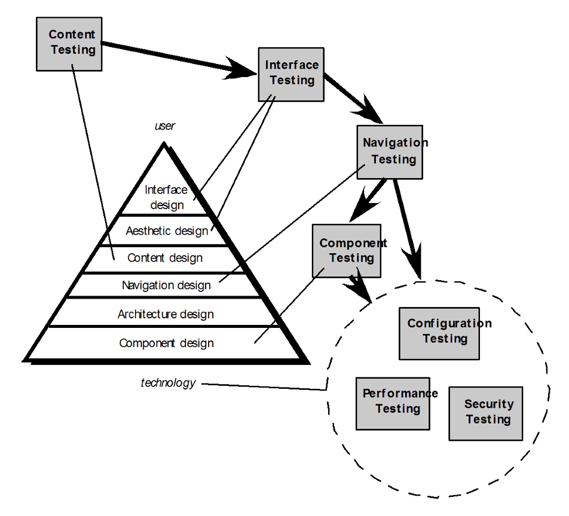

**内容测试**(content testing)有三个重要目标：

- 发现基于文本的文档、图形表示和其他媒体中的**语法错误**（例如，错别字、语法错误）
- 发现导航过程中呈现的任何内容对象中的**语义错误**（即信息准确性或完整性错误）；**Web 工程师**和**非技术用户**都会对 Web 应用进行导航语义测试
    - 信息是否准确无误？
    - 信息是否**简洁**明了？
    - 内容对象的布局是否便于用户**理解**？
    - 内容对象中的嵌入式信息是否能**轻松找到**？
    - 所有源自其他来源的信息是否都提供了适当的**参考文献**？
    - 信息呈现是否**内部一致**，并与其他内容对象中的信息保持一致？
    - 内容是否**冒犯**、误导，或是否带来诉讼风险？
    - 内容是否侵犯现有**版权**或商标权？
    - 内容是否包含补充现有内容的内部链接？链接是否正确？
    - 内容的**美学风格**是否与界面的美学风格相冲突？

- 发现呈现给最终用户的**内容组织或结构中的错误**

**数据库测试**：

    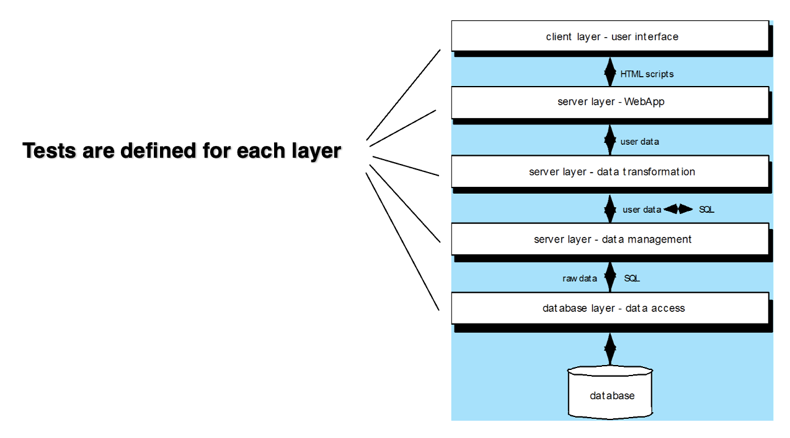

**UI 测试**：

- 界面特性经过测试，确保**设计规则**、**美学**及相关视觉内容可供用户使用，且无错误
- 各个界面机制以**类似于单元测试**的方式进行测试
- 每个界面机制都在特定用户类别的**用例**或 **NSU**（正常使用场景）背景下进行测试
- 根据选定的用例和 NSU 测试完整界面，以发现界面语义中的错误
- 在多种**环境**（如浏览器）中测试界面，以确保其**兼容性**

测试界面机制：

- **链接**：将用户链接到其他内容对象或功能的导航机制
- **表单**：一种包含空白字段的结构化文档，用户填写这些字段；字段中的数据被用作一个或多个Web应用功能的输入
- **客户端脚本**：用脚本语言（例如 JavaScript）编写的程序命令列表，用于处理通过表单或其他用户交互输入的信息
- **动态 HTML**：通过客户端使用脚本或层叠样式表（CSS）操作的内容对象
- **客户端弹出窗口**：无需用户交互即可弹出的窗口；这些窗口可能以内容为导向，并可能需要某种形式的用户交互
- **CGI 脚本**：通用网关接口(common gateway interface, CGI)脚本实现了一种标准方法，允许 Web 服务器与用户动态交互（例如，包含表单的 Web 应用可能使用 CGI 脚本来处理用户提交表单后包含的数据）
- **流式内容**(streaming content)：内容对象并非等待客户端请求，而是自动从服务器端下载；这种方法有时被称为「推送」(push)技术，因为服务器将数据推送给客户端
- **Cookie**：服务器发送的一块数据，由浏览器存储，作为特定用户交互的结果；数据内容特定于 Web 应用（例如用户识别数据或用户选择购买的物品列表）
- **应用特定接口机制**：包括一个或多个宏接口机制，如购物车、信用卡处理或运费计算器

**可用性测试**：

- 由 WebE 团队设计，由终端用户执行
- 测试序列
    - 定义一组可用性测试类别，并为每个类别确定**目标**
    - 设计能够评估每个目标的**测试**
    - 选择执行测试的**参与者**
    - 在测试过程中**记录**(instrument)参与者与 WebApp 的交互
    - 开发一种**评估** WebApp 可用性的机制

- 不同的抽象层次：
    - 可以评估特定界面机制（例如表单）的可用性
    - 可以评估完整网页（包含界面机制、数据对象及相关功能）的可用性
    - 可以考虑整个 WebApp 的可用性

**兼容性测试**：

- 旨在定义一套常见的**客户端计算配置及其变体**
- 构建一个树状结构，以识别：
    - 每种计算**平台**
    - 典型的显示**设备**
    - 该平台支持的**操作系统**
    - 可用的**浏览器**
    - 可能的互联网**连接**速度
    - ...

- 推导出一系列兼容性验证测试
    - 源自**现有的**界面测试、导航测试、性能测试和安全测试
    - 目的是发现可归因于配置差异的错误或执行问题

**组件级测试**：

- 聚焦于一组试图发现 WebApp 功能错误的测试
- 可以使用传统的**黑盒**和**白盒**测试用例设计方法
- **数据库测试**通常是组件测试制度中不可或缺的一部分

**导航测试**：

- **导航链接**：这些机制包括 Web 应用内的内部链接、指向其他 Web 应用的外部链接以及特定网页内的锚点
- **重定向**：当用户请求不存在的 URL，或选择的目标已被移除、名称已更改的链接时，这类链接会生效
- **书签**(bookmarks)：尽管书签属于浏览器功能，但仍需测试 Web 应用，确保创建书签时能提取有意义的页面标题
- **框架与框架集**(frames and framesets)：需测试内容正确性、布局与尺寸合理性、下载性能及浏览器兼容性
- **站点地图**：应测试站点地图的每个条目，确保链接能引导用户访问正确的内容或功能
- **内部搜索引擎**(internal search engines)：搜索引擎测试需验证搜索的准确性和完整性、搜索引擎的错误处理能力以及高级搜索功能

**配置测试**：

- **服务器端**
    - WebApp 是否与**服务器操作系统**完全兼容？
    - WebApp 运行时，系统文件、目录及相关**系统数据**是否创建正确？
    - **系统安全措施**（例如防火墙或加密）是否允许 WebApp 正常执行并为用户提供服务，且不会受到干扰或性能下降？
    - WebApp 是否已在所选**分布式服务器配置**（如果有）下进行过测试？
    - WebApp 是否与**数据库**软件正确集成？WebApp 对不同版本的数据库软件是否敏感？
    - 服务器端 WebApp **脚本**是否正常执行？
    - 系统**管理员错误**对 WebApp 运行的影响是否已进行检查？
    - 如果使用了**代理服务器**(proxy servers)，其配置差异是否已通过现场测试解决？

- **客户端**
    - **硬件**：中央处理器、内存、存储和打印设备
    - **操作系统**：Linux、Macintosh OS、Microsoft Windows、移动操作系统
    - **浏览器软件**：Internet Explorer、Mozilla/Netscape、Chrome、Opera、Safari 及其他
    - **用户界面组件**：Active X、Java 小程序及其他
    - **插件**：QuickTime、RealPlayer 及许多其他
    - **连接**：有线、DSL、普通调制解调器、Wi-Fi、3G/4G/5G

- 必须将配置变量的数量**减少到可管理的数量**

**安全测试**：

- 旨在探测客户端环境、数据从客户端传输到服务器再返回时发生的网络通信，以及服务器端环境的漏洞
- 客户端：浏览器、电子邮件程序或通信软件中预先存在的缺陷
- 服务器端：**拒绝服务攻击**(denial-of-service)和可被传递到客户端或用于禁用服务器操作的**恶意脚本**(malicious scripts)

**性能测试**：

- 目的：模拟真实世界的加载情况
- 服务器响应时间是否会下降到明显且不可接受的程度？
- 在什么情况下（就用户、事务或数据加载而言）性能会变得**不可接受**？
- 哪些**系统组件**导致性能下降？
- 在各种负载条件下，用户的**平均响应时间**是多少？
- 性能下降是否会影响系统**安全**？
- 随着系统负载的增加，WebApp 的**可靠性**或准确性是否会受到影响？
- 当施加的**负载**超过服务器**最大容量**时会发生什么？

**负载测试**(load testing)：

- 目的：确定 WebApp 及其服务器端环境如何应对各种负载条件
- 总吞吐量 P 的计算方式如下：**P = N * T * D**
    - N：并发用户数
    - T：单位时间内的在线交易数
    - D：每个交易由服务器处理的数据负载  

**压力测试**(stress testing)：负载测试的延续(continuation)

- 系统在**超出**容量时是**温和**降级，还是服务器直接关闭？
- 服务器软件是否会生成“**服务器不可用**”的消息？更广泛地说，用户是否知道自己无法访问服务器？
- 服务器是否会将对资源的请求进行排队，并在容量需求减少后清空队列？
- 当容量超出时，**事务**是否会**丢失**？
- 当容量超出时，**数据完整性**是否受到影响？
- 哪些 N、T、D 值会迫使服务器环境失效？失效如何表现？是否会自动向服务器现场的技术支持人员发送通知？
- 如果系统确实失效，需要多长时间才能**恢复**在线？
- 当容量达到 80% 或 90% 时，某些 Web 应用功能（例如，计算密集型功能、数据流能力）是否会停止？

## Mobile Applications

移动 App 测试策略：

- 是否必须在与用户测试前构建一个功能完整的**原型**？
- 应该使用**用户的设备**进行测试，还是提供测试设备？
- 测试中应包含哪些**设备**和**用户群体**？
- **何时**适合进行实验室测试，何时适合进行远程测试？

移动测试指南：

- 了解网络环境和设备**环境**(landscape)
- 在**不受控的真实世界**测试条件下进行测试
- 选择合适的**自动化测试工具**
- 确定最关键的**硬件/平台组合**进行测试
- 在所有可能的平台上**至少检查一次端到端功能流程**
- 使用**实际设备**进行性能、GUI 和兼容性测试
- 在真实的网络负载条件下测量移动应用**性能**

移动 App 测试：

- **概念**测试  
- **单元与系统**测试  
- **用户体验**测试  
- **稳定性**测试  
- **连接**测试  
- **性能**测试  
- **兼容性**测试  
- **安全**测试  
- **认证**测试

自动化测试：

- 可行性分析(feasibility analysis)
- 概念验证(proof of concept)
- 最佳实践测试框架
- 定制测试工具
- 在实际条件下进行测试
- 快速缺陷解决(rapid defect resolution)
- 测试脚本重用

**压力测试**：

- 部分原因是为了确保移动 App 在发生故障时能够优雅降级
- 做法：
    - 在同一设备上运行多个移动**应用**
    - 用**病毒**或恶意软件感染系统软件
    - 试图控制设备并利用它传播**垃圾信息**
    - 强制移动应用处理异常大量的**交易**
    - 在设备上存储大量**数据**

移动**可用性**要素：

- 功能性  
- 信息架构  
- 屏幕设计  
- 用户输入机制  
- 考虑移动场景  
- 界面可用性  
- 可信度  
- 反馈  
- 帮助功能

专用可用性测试(specialized usability tests)：

- 手势
- 语音输入与识别  
- 虚拟键盘输入  
- 提醒与错误

其中**自动化工具的难以使用**、**创建用于模拟事件的函数**、**屏幕尺寸的多样性**等原因会增加测试移动应用手势的难度。

**野外测试**(testing in the wild)的目的是**评估生产环境的影响**和**测试用户设备上的性能变化**，因为实验室环境无法完全模拟实际用户的使用场景和设备差异。

**实时测试**(real-time testing)要求系统在严格时间限制内响应。在移动或嵌入式设备上，会遇到**设备处理能力有限**、**电源受限**、**各地移动网络基础设施差异**等问题，这些都会影响系统响应速度和测试准确性。

移动 App 测试工具：

- 移动页面合规性检查器(mobile page compliance checkers)
- 移动浏览器模拟器  
- 设备模拟器(device emulators)
- 按键记录与回放(key logging and playback)
- 网络监控器  
- 移动分析数据收集器(mobile analytics collectors)

**加权设备平台矩阵**(weighted device platform matrix)用于评估和选择在不同设备或平台上测试的优先级，主要目的是**确定要支持哪些设备或平台**，不是用来直接对测试用例进行优先级排序。