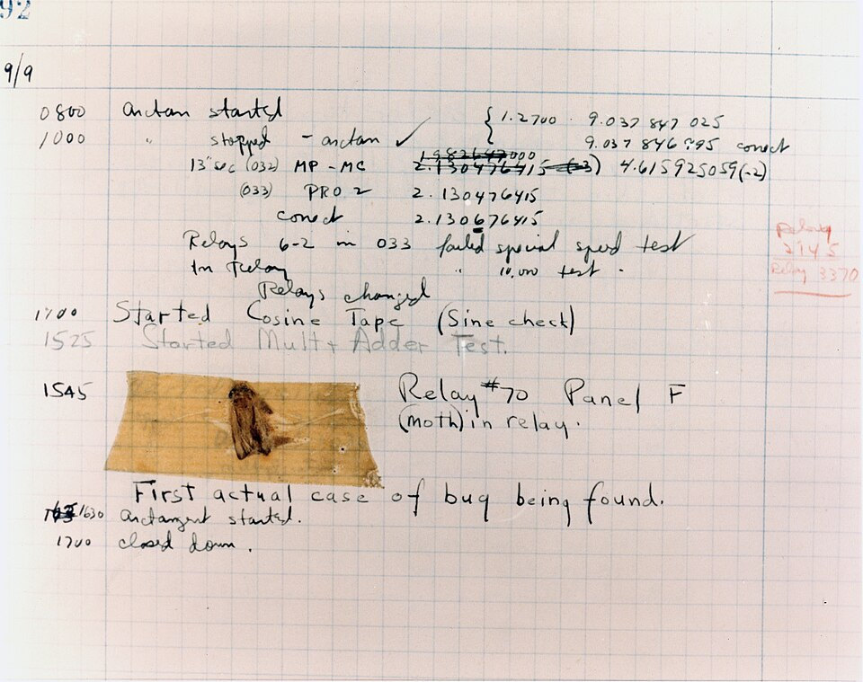
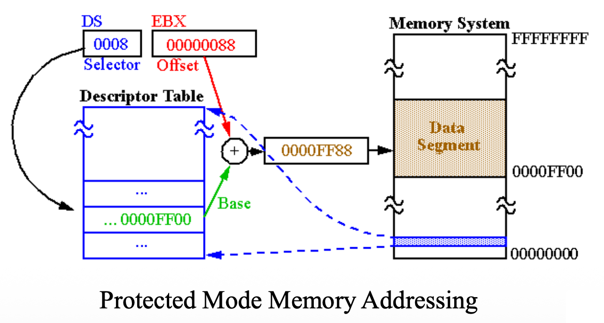
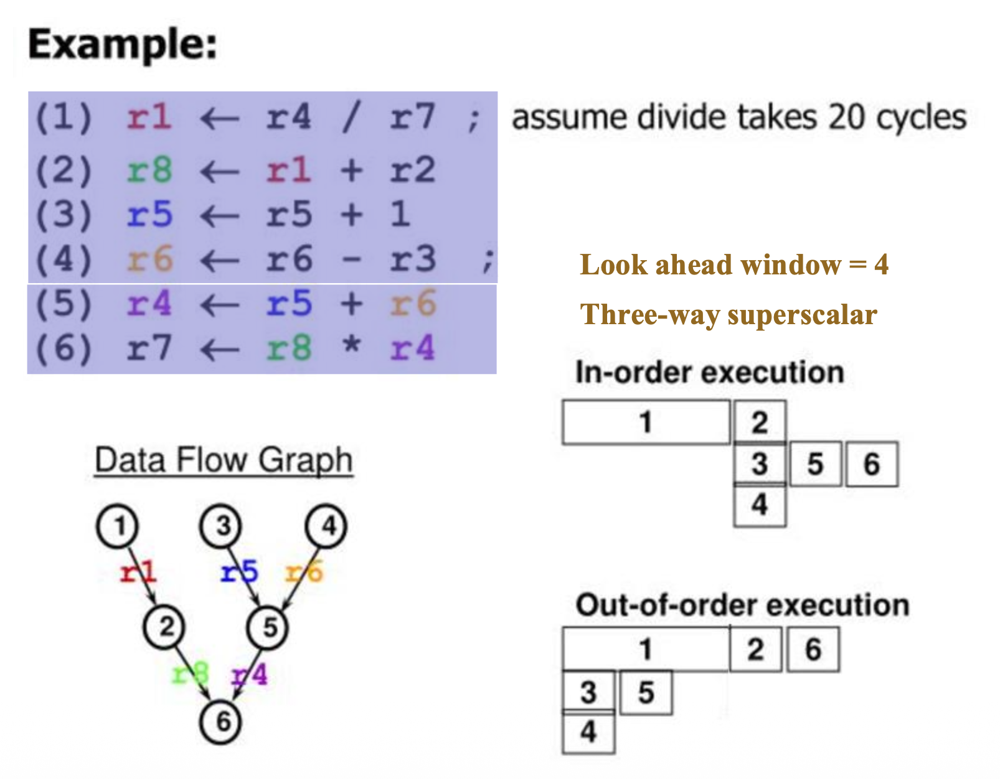
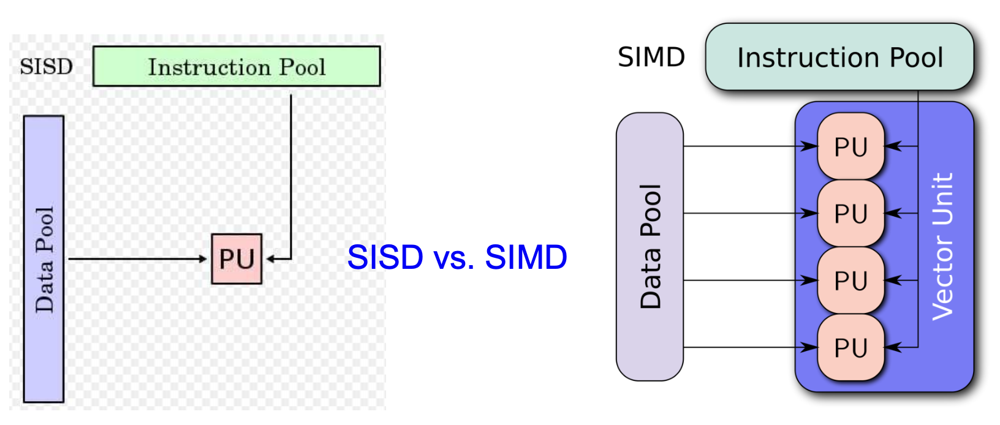
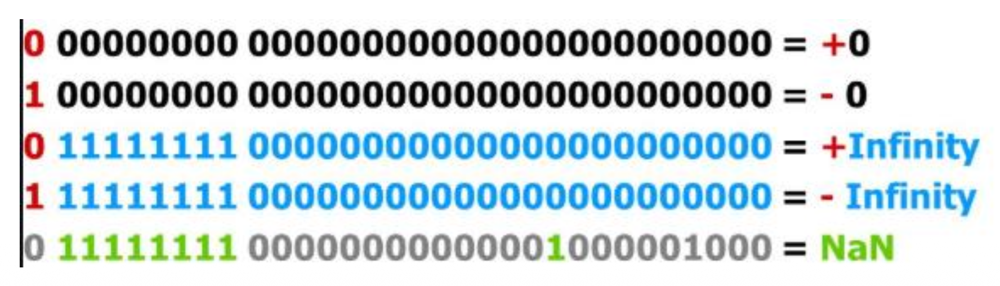
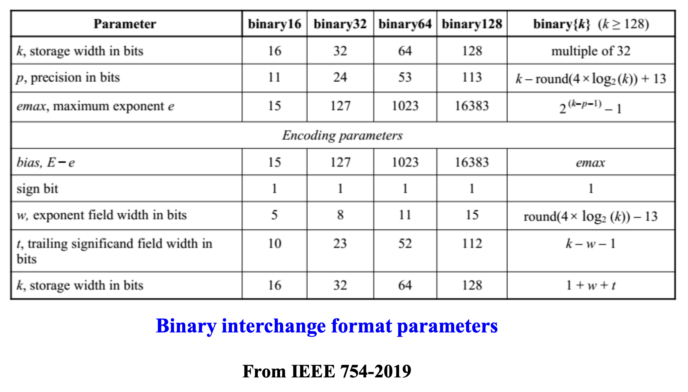
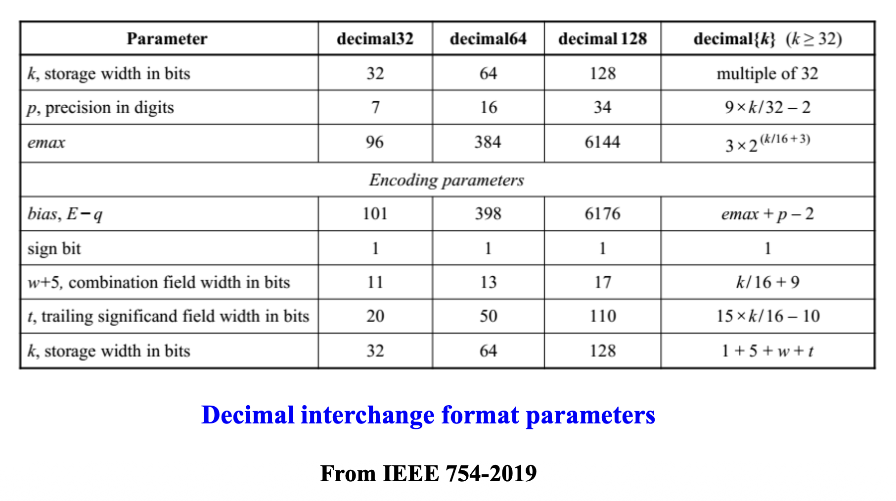
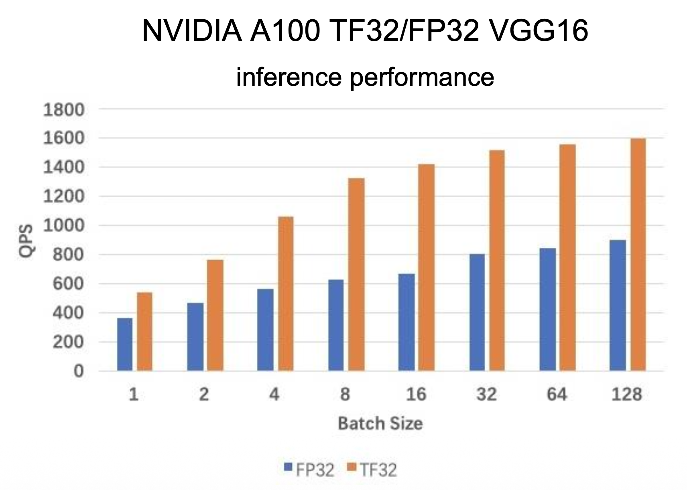

# Introduction to the Microprocessor and Computer

??? abstract "核心知识"

    - 进制转换：二进制/八进制/十进制/十六进制
    - 编码格式：ASCII 码、BCD 码
    - IEEE 754 标准（单精度/双精度浮点数）

??? info "历史背景"

    - 第一台通用目的的，可编程的电子计算机系统 ENIAC（1946）
        - 可通过重写电路实现编程，但耗时耗力
    - [冯·诺依曼架构](https://www.wikipedia.com/en/articles/Von_Neumann_architecture)
    - 机器语言（由二进制编码构成）
    - 汇编语言（助记码(mnemonic codes)，比如用 `#!asm ADD` 指代加法）
    - 高级编程语言
        - [Grace Hopper](https://www.wikiwand.com/en/articles/Grace_Hopper) 开发了世界上第一个高级编程语言 FLOWMATIC
            - 她也是世界上第一位发现计算机 bug 的人（是真的 bug）

                

                    
                

        - [Fortran](https://fortran-lang.org/)（~~传奇耐活王，现在还用于 AI, HPC 等领域~~）
        - [COBOL](https://www.wikiwand.com/en/articles/COBOL)
    - 微处理器时代——Intel 4004（4位微处理器）（1971）
    - 现代微处理器——Intel 8086（16位微处理器）（1978）
        - 引入了**分段**(segmentation)机制，能让一个 16 位的段寄存器可指向最大 64 KB 的内存段
            - 8088 用到了 4 个段寄存器，因此可对 256 KB 的内存编址

            

                
            

    - 最后的 16 位 x86 处理器——Intel 286（1982）
        - 引入**保护模式**(protection mode)，使用段寄存器的内容作为选择符(selector)或指针进入**描述符表**(descriptor table)

            

                
            

        - 保护机制包括：4种特权等级、段限制检查、只读和只执行段选项

    - Intel 386（1985）
        - IA-32 架构家族中第一个 32 位处理器
        - 向后**兼容性**(compatibility)：386 处理器寄存器的低 16 位保留了先前处理器的属性；虚拟 8086 模式
        - 引入**流水线**(pipelining)、**分页**(paging)技术

    - Intel 486（1989）
        - 第一个带有 L1 高速缓存的 x86 处理器
        - 并引入了集成的 x87 FPU

    - 奔腾(Pertium)处理器（1993）

        { align=right width=30% }

        - **超标量**(superscalar)
            - 超标量的问题是只能并行执行那些独立的指令，而大多数指令都是相互依赖的，因此流水线的利用率会很低
            - 解决方案是**乱序执行**(out-of-order execution)：基于**数据流图**(data flow graph)而非程序顺序执行指令，并提前观察滑动窗口内的所有指令，找出那些准备就绪的指令，先让它们执行

                

                    
                

        - L1 高速缓存容量扩大一倍
        - **MESI 协议**
        - **分支预测**(branch prediction)

    - 处理器的 P6 家族
        - Pertium Pro：三路超标量
            - 从该处理器开始，Intel 重新设计了微处理器并在 CISC 指令下使用了内部 RISC 核心
            - 因此所有的 CISC 指令都被分为**微代码**(microcode)，然后由 RISC 核心执行

                

                    
                

        - Pertium II：MMX
        - Pertium III：SSE（流式 SIMD 扩展(streaming SIMD extension)）
            - 相比 SISD，一个 SIMD 计算单元可同时对多个数据项执行相同的运算

                

                    
                
   

            - 自从 Pentium II 引入 MMX 技术以来，已引入了六个扩展（SSE、SSE2、SSE3、SSSE3、SSE4 和 AVX），用于在 Intel 64 和 IA-32 架构中执行 SIMD 操作

                

                    
                

    - Pertium 4 处理器家族
        - 基于 NetBurst 微架构，并引入
            - SSE2
            - Intel 64 位架构
                - 软件的线性地址空间扩展至 64 位，并支持高达 52 位的物理地址空间
                - 新的操作模式——IA-32e 模式，它运行在以下两种子模式之一
                    - 兼容模式：使得 64 位操作系统能够运行大多数未经修改的遗留 32 位软件
                    - 64 位模式：使 64 位操作系统能够运行编写为访问 64 位地址空间的程序

            - **超线程技术**(hyper-threading(HT) techonology)
                - 目标：
                    - 为了最小化实现 HT 技术的晶圆面积成本
                    - 当一个逻辑处理器停滞时，另一个处理器可继续执行
                    - 当只有一个线程活跃时，有 HT 技术的处理器和没有 HT 技术的运行速度相同

                    

                        
                    

                - 通过在处理器核心中利用共享执行资源，以单个物理包提供**硬件多线程**(hardware multi-threading)能力
                - 支持超线程技术的 IA-32 处理器包含两个或更多逻辑处理器，每个都有独立的 IA-32 架构状态
                - 架构状态包括了通用寄存器、控制寄存器、高级可编程中断控制器(APIC)寄存器和一些机器状态寄存器的寄存器
                - 逻辑处理器共享物理处理器上几乎所有其他资源，例如缓存、执行单元、分支预测器、控制逻辑和总线
                - 通过高效的逻辑处理器选择算法，以及将许多关键资源进行分区和重组的算法，在总面积不到 5% 的晶圆面积内实现了高达 30% 的增益，达成了上述三个目标

                    

                        
                    

            - **Intel 虚拟化技术**(VT)
        - **双核**(dual-core)技术（2005）
            - 双核属于**多核**(multi-core)技术的一种：通过在一个物理封装中提供两个或更多执行核心来增强硬件多线程能力

                

                    
                

        
## Number System

这块内容在 CSers 的第一门系统课《数字逻辑设计》的第一章就已经介绍过了，而且这是最最基础的知识，故略过。想要复习这块知识的话可参见笔者的[笔记](../dld/1.md#number-systems)。

## Computer Data Formats

下面介绍一些常见的计算机数据格式。

### ASCII and Unicode Data

- **ASCII**（美国信息交换标准代码(American Standard Code for Information Interchange)）
    - 标准 ASCII 是 7 位编码，最高位作为**奇偶校验位**(parity)
    - 但对打印机而言，最高位0表示字母数字打印，1表示图形打印
    - **扩展 ASCII 字符**：最高位设为1，包括：
        - 一些外文字符和拼音
        - 希腊字母&数学符号
        - 一些特殊字符

- [**Unicode**](http://www.unicode.org)
    - 每个字符是一个 16 位的数据
    - 编码 0000H-00FFH 同 ASCII 编码
    - 剩下的编码存储来自各种字符集的所有字符
    - 对 Unicode 感兴趣的读者可以阅读 [xg 的这篇笔记](http://note.tonycrane.cc/cs/unicode/)，相关知识整理得很清楚

### Binary Coded Decimal

- BCD 数字的范围为 $0000_2\text{-}1001_2$，对应十进制 0-9
- BCD 的两种存储形式
    - **压缩(packed) BCD 形式**
        - 每字节存储两个数字
        - 用于微处理器指令集中的 BCD 加减法或 BCD 计数
    - **未压缩(unpacked) BCD 形式**
        - 每字节存储一个数字
        - 从键盘返回

        

            
        

- BCD 数据适用于仅执行简单算术运算的应用
- 如果系统要求做复杂算术，那么 BCD 就很少会用到
    - 目前还没简单有效的执行复杂 BCD 算术的方法

### Byte/Word/Doubleword-Sized Data

- **字节数据**(byte-sized data)：
    - 作为符号/无符号整数的存储
    - 两者的区别在于最高位的权重：无符号数是 128，符号数是 -128（即符号位，在**补码**(2's complement)中 1 为负）
    - 范围
        - 无符号数：0\~255
        - 符号数：-128\~127

- **字数据**(word-sized data)：
    - （本课程中是）2字节（16位）的**小端序**(little-endian)数据
        - 低位字节存储在低内存地址上，高位字节则存储在高地址上
        - 对应地也有**大端序**(big-endian)的概念，和小端序正好反过来
            - 摩托罗拉的处理器用的是大端序

        

            
        

- **双字数据**(doubleword-sized data)：
    - 4字节（32位）数据
    - 作为乘法的积或除法的被除数
    - 使用汇编**伪指令**(directives) `define doubleword(s)`, `DD` 或 `DWORD`

### Real Numbers

**实数**(real number)，或叫做**浮点数**(float-pointning number)，包含两部分：**尾数**(mantissa/significand/fraction)和**指数**(exponent)。其中 4 字节的浮点数是**单精度**(single-precision)浮点数，8 字节的则为**双精度**(double-precision)浮点数。

    

- 汇编器会用单精度或双精度浮点数来定义实数
    - 使用 `DD` 指令用于单精度32位数字
    - 使用 `define quadword(s)`，或 `DQ` 来定义 64 位双精度实数
- 可选指令有 `REAL4`（单精度）, `REAL8`（双精度）, `REAL10`（扩展精度的实数）

??? info "**MASM**（微软宏汇编器(Microsoft Macro Assembler)）用于数据分配的汇编命令"

    

        
    

#### IEEE 754 Format

[IEEE 754](https://en.wikipedia.org/wiki/IEEE_754) 采用科学计数法的思想：

- **符号位**(signed bit)：0 为正，1 为负
- **偏移指数**(biased exponent)：偏移量加在指数上，方便比较指数；全 0 和全 1 代表特殊值
    - 偏移量 = $2^{k-1} - 1$，其中 $k$ 为指数位数
- **规范化尾数**(normalized mantissa)：有一个隐藏的未被存储的位

    

??? question "为何不用补码"

    - 补码表示适合用于固定长度的整数运算，这和浮点数的可变长度结构和动态范围要求不匹配
    - 因为没有所谓的“无符号”浮点数，所以使用补码没有好处
    - 补码主要存在**不对称问题**（可表示的负值比正值多），这会导致稳定性问题（比如舍入或潜在的精度损失）
    - 对于近似来说，有单独的 +0 和 -0 至关重要；一些算术运算受零的符号影响

    >具体见 <https://stackoverflow.com/questions/57016843/why-not-use-a-twos-complement-based-floating-point>

一些特殊值：

- **零**：符号位随意（但会产生 +0 或 -0），指数和尾数均为0
- **无穷**：符号位随意（但会产生正无穷或负无穷），指数全为1，尾数全为0
- **NaN**(Not-a-Number)：符号位随意，指数全为1，尾数是除了全0外的任何情况

    

关于规范化：

- **规范化数**(normal number)：**指数位**不全0或全1
- **次规范化数**(subnormal number)或**非规范化数**(denormalized number)
    - 全 0 指数 + 非 0 尾数
    - 形式为 $(-1)^{\text{sign}} \times \text{fraction} \times 2^{1 - \text{bias}}$（比如 $0.11 \times 2^{-126}$）
    - 次规范化数可能会显著增大延迟

下溢问题：

- 当结果太小，超出表示范围时，下溢发生
- 两种处理方法：
    - **突然下溢**(abrupt underflow)：值太小的话就全设为0，但会导致精度损失
    - **渐进下溢**(gradual underflow)：用次规范化数提供更“优雅”的精度下降
- 次规范化数消除了下溢作为多种计算（例如数值积分、复数除法）中需要担忧的原因

??? abstract "总结"

    

        
    

    

        
    

IEEE 754 包含了 5 种**舍入模式**：

- 默认：**roundTiesToEven**
- 可选：roundTiesToAway, roundTowardZero, roundTowardPositive, roundTowardNegative

    

???+ example "浮点数加法运算"

    

        
    

如果处理不慎，浮点数运算就会出现精度问题：

    

原因（2^24^ 超过单精度浮点数 23 位的尾数范围了...）：

    

可以通过重写浮点数表达式的方法让浮点数运算更精确（[链接](https://herbie.uwplse.org)）：

    

#### New Floating-point Format for AI

为了加速 AI 训练和推理，一些新的浮点数格式被引入，比如：

    

    

