# Basic I/O Interface

## Intro to I/O Interface

### Hardware Interface

**硬件接口**建立起不同设备之间的连接和通信，实现计算机和外设的协同工作。

<div style="text-align: center">
    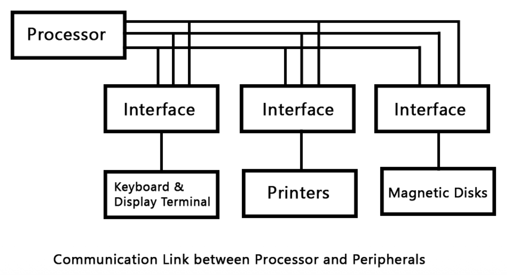
</div>

硬件接口提供了以下解决方案：

- 信号匹配(signal matching) -> 信号转换(signal conversion)
- 信号驱动(signal driving) -> 信号增强(signal boost)
- 速度匹配(speed matching) -> 数据锁存器和缓冲区(data latch and buffer)
- 时序匹配(timing matching) -> 时序控制(timing control)
- 总线隔离(bus isolation) -> 三态缓冲器(three-state buffer)
- 格式匹配(formating matching) -> 协议转换(protocol translation)

硬件接口的类型：

- 按信息流方向分类：输入/输出接口
- 按信号类型分类：模拟(analog)/数字(digital)接口
- 按数据传输类型分类：串行(serial)/并行(parallel)接口

硬件接口的结构：一个 I/O 单元包含以下块：

- 读/写控制逻辑
- 数据总线缓冲区(data bus buffer)
- 端口寄存器(port registers)（比如端口 A，端口 B 等）
- 控制和状态寄存器(control and status registers)

<div style="text-align: center">
    
</div>


### A Few Key Points about I/O Interface

- 如何将 I/O 设备和 CPU 连接
    - 输出接口：**锁存器**
    - 输入接口：**三态缓冲器**
- 如何为 I/O 设备提供地址空间
    - **隔离 I/O**
    - **内存映射 I/O**
- 如何执行 I/O 端口解码
    - 包含以下信号：内存地址、#BHE、#BLE、#IORC、#IOWC
- 如何让处理器和 I/O 设备同步
    - 对于始终开启的(always-on)设备采用**无条件传输**(unconditional transfer)
    - **选通**(strobing)
    - **握手**(handshaking)**和轮询**(polling)
    - **中断驱动的**(interrupt-based) I/O
    - **基于通道的**(channel-based) I/O（比如 DMA）


### Isolated and Memory-Mapped I/O

下面介绍两种不同的 I/O 接口方法

- **隔离 I/O**(isolated I/O)：使用 `IN` 和 `OUT` 传输，数据在微处理器的累加器或内存与 I/O 设备之间
- **内存映射 I/O**(memory-mapped I/O)：任何引用内存的指令都可以完成传输

PC 使用隔离 I/O 而不是内存映射 I/O。


#### Isolated I/O

- 在基于 Intel 的系统中，最常用的 I/O 传输技术是隔离 I/O
- **隔离**(isolated)描述了 I/O 位置如何通过单独的 I/O 地址空间中从内存中隔离
- 隔离 I/O 设备的地址，称为**端口**(ports)，与内存分离

???+ recommend "优点"

    端口是分开的，用户可以在不把任何内存空间用于 I/O 设备的情况下，将内存扩展到其最大容量。

???+ bug "缺点"

    - I/O 与微处理器之间传输的数据必须通过 `#!asm IN`、`#!asm INS`、`#!asm OUT` 和 `#!asm OUTS` 指令访问
    - 需要为 I/O 空间开发单独的控制信号（使用 $\text{M}/\overline{\text{IO}}, \text{W}/\overline{\text{R}}$），表示 I/O 读（$\overline{\text{IORC}}$）或 I/O 写（$\overline{\text{IOWC}}$）操作
    - I/O 操作速度慢，因为需要使用专门的 I/O 指令，同时让编程更加复杂


#### Memory-Mapped I/O

- 内存映射 I/O 不使用 `#!asm IN`、`#!asm INS`、`#!asm OUT` 和 `#!asm OUTS` 指令
- 它使用任何在微处理器和内存之间传输数据的指令

???+ recommend "优点"
    
    - **更快的 I/O 操作**：允许 CPU 以与访问内存相同的速度访问 I/O 设备（~~其实访问内存速度也并不快啊~~）
    - **简化编程**：可以使用相同的指令来访问内存和 I/O 设备

???+ bug "缺点"

    - **有限的 I/O 地址空间**：这种设计限制了 I/O 地址空间，因为 I/O 设备共享与内存相同的地址空间。这意味着可能没有足够的地址空间来寻址所有 I/O 设备
    - **响应时间较慢**：若 I/O 设备响应缓慢，可能会延迟 CPU 对内存的访问，从而导致整体的系统性能变慢

???+ example "例子（隔离 I/O vs 内存映射 I/O）"

    <div style="text-align: center">
        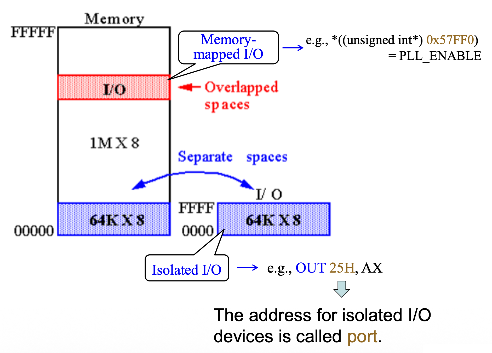
    </div>


### Personal Computer I/O Map

– PC 使用部分 I/O 映射，用于一些专用的功能
– 端口 `0000H`-`03FFH` 之间的 I/O 空间保留给**系统**
– `0400H`–`FFFFH` 端口可供**用户**使用

<div style="text-align: center">
    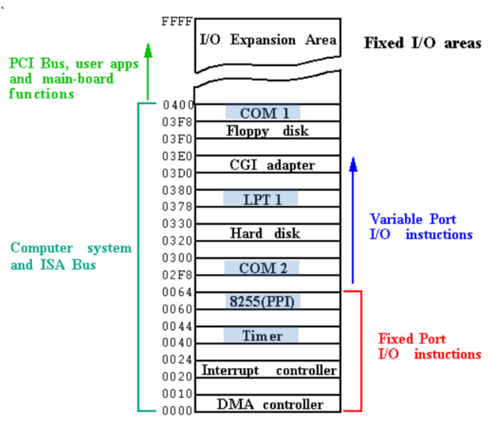
</div>


### Logic ICs

逻辑接口电路(logical interfacing circuitry)的分类：

<div style="text-align: center">
    
</div>

- **TTL**（晶体管-晶体管逻辑(transistor-transistor logic)）逻辑
    - 一种双极性逻辑集成电路，于早期引入
    - 更高的电流驱动能力和更高的速度（5-10 ns）
    - 消耗更多功率
        - 传统上使用 5V 电源供电，而 TTL 兼容的 CMOS 设备只使用 3.3V
    -  TTL 信号必须符合以下逻辑 1 和逻辑 0 的规范：
  
    <div style="text-align: center">
        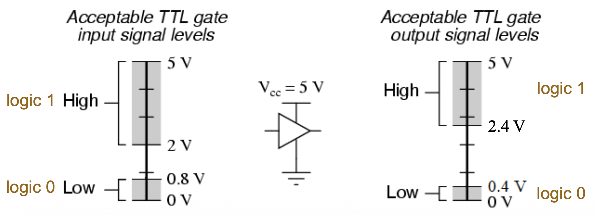
    </div>

- **CMOS** 逻辑
    - 消耗的功率比 TTLs 低
    - 刚发明出来的时候速度较慢（25-50ns）
    - 但现在的速度比 TTL 快
    - 电源供电选择多样，比如 5V、3.3V、1.8V 等
    - CMOS 信号必须根据供电电压（VCC）满足特定的电压水平，以实现逻辑 1 和逻辑 0 ，以下是通用规格：

    <div style="text-align: center">
        
    </div>

下面总结了这两种逻辑的输入输出规范：

<div style="text-align: center">
    
</div>

???+ note "注"

    - TTL 在现代设备中很少见：TTL 主要存在于旧设备中（例如，82C55，RS-232）。大多数现代接口（例如，USB，PCIe）由于功耗较高和可扩展性有限，已经远离了 TTL 信号
    - CMOS 在新设计中占主导地位：由于效率高和可扩展性强，低压 CMOS 兼容性成为现代接口的标准
    - 用于旧设备的解码器：当需要 TTL 兼容性时，使用电平转换器或电压转换器来连接 TTL 和 CMOS 逻辑电平


#### Input Devices

关于输入设备接口的考虑因素：

- 当连接到微处理器时，输入设备应与 **TTL/CMOS 兼容**
- 应减少或消除输入设备的**噪声**(noise)

例如，对于基于开关的设备(switch-based devices)

- 它们不是 TTL/CMOS 兼容的输入设备，所以应进行一些适配以使其成为 TTL/CMOS-开关
- 由于开关抖动(bounce)，应应用一些条件以去抖动机械接触

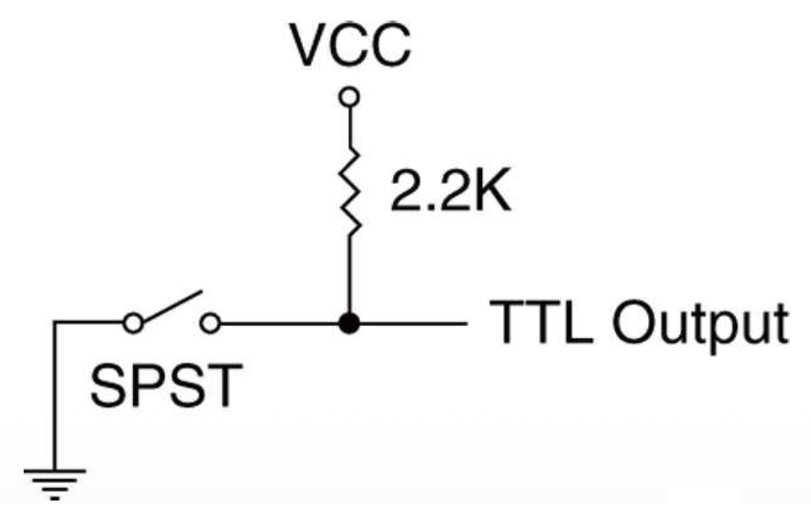{ align=right width=30% }

右图展示了一个正确连接的切换开关，作为输入设备。

- 开关关闭时接地，产生一个有效的逻辑 0 电平
- 使用一个上拉电阻(pull-up resistor)，确保当开关打开时，输出信号是逻辑 1
    - 上拉电阻的标准值范围在 1KΩ 到 10KΩ 之间

- 机械开关在按下或释放时总会产生噪声

    <div style="text-align: center">
        
    </div>

- 有几种方法可以防止以上抖动问题：
    - 带触发器(flip-flop)的双掷开关(double-throw switch)（图(a)）
    - 带非门的双掷开关（图(b)）

        <div style="text-align: center">
            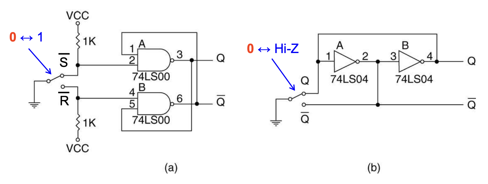
        </div>

    - 低通滤波器(low-pass filter)和施密特触发器(Schmitt trigger)

        <div style="text-align: center">
            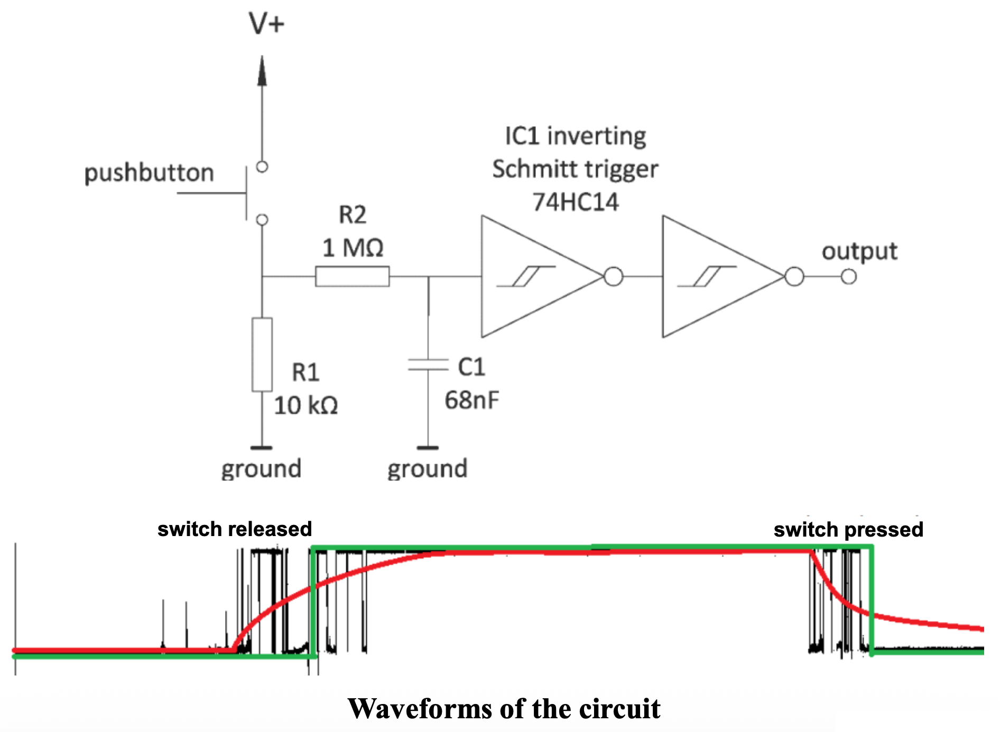
        </div>

    - 多级移位寄存器(multiple stage shift register)采样
        - 开关通常会在 5-10ms 内抖动
        - 连接一个 100Hz 的时钟，它将每 10ms 采样一次信号
        - 当所有采样值都为高时，设置 SR 触发器，当值为低时重置

        <div style="text-align: center">
            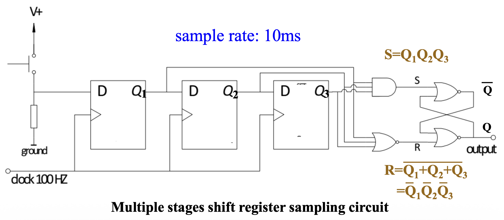
        </div>

    - 软件采样


#### Output Devices

- 输出设备比输入设备种类更多，但许多设备都以统一的方式连接。
- 连接输出设备需要**匹配**设备和微处理器的**电压和电流**关系
- 接口元件的微处理器输出**电压与 TTL 兼容**
    - 逻辑 0 = 0.0V-0.4V
    - 逻辑 1 = 2.4V-5.0V

- 处理器和许多接口组件的**电流小于标准 TTL**
    - 逻辑0 = 0.0-2.0mA
    - 逻辑1 = 0.0-400μA

- 下图展示了如何通过两种方法提供足够的电流（10mA）来点亮 LED：

    <div style="text-align: center">
        
    </div>

    - 图(a) 使用了一个**晶体管驱动器**
        - **2N2222** 是一款性能良好、价格低廉的通用开关晶体管，其最小增益为 100
        – 集电极电流为 10mA，因此基极电流将是集电极电流的 1/100，即 0.1mA
        - 为了确定基极电流-限流电阻，使用 0.1mA 的基极电流并在基极电流–限流电阻上产生 1.7V 的电压降
        
    - 图(b) 使用了一个 **TTL 反相器**(inverter)
        - 它在逻辑 0 级别下提供高达 16mA 的电流，足以驱动一个标准LED

    - TTL输入信号的最小值为 2.4V
    - 发射极-基极结的压降为 0.7V
    - 电阻上的压降为 1.7V
    - 电阻的值为 1.7V / 0.1mA = 17KΩ
    - 由于 17K 不是标准值，选择了一个 18K 电阻

- 假设我们需要将一个12 V直流1A电机连接到微处理器。
    - 不能使用 TTL 反相器：
        - 12V 信号会烧毁反相器
        - 电流远超过 16mA 反相器的最大值

    - 也不能使用 2N2222 晶体管：
        - 最大电流为 250mA-500mA（取决于选择的封装样式）
    
    - 解决方案是使用**达林顿对**(Darlington-pair)，例如 TIP120
        - 成本 25 美分，可以处理 4A 电流

    - 下图展示了连接到具有最小电流增益 7000 和最大电流 4A 的达林顿对电机

        <div style="text-align: center">
            
        </div>

        - 达林顿对必须使用**散热片**(heat sink)，因为电流量较大
        - 二极管必须存在，以防止达林顿对被**电感反冲**(inductive kickback)摧毁

    - 基极电阻的值与 LED 驱动器中使用的值完全相同
    - 通过电阻的电流为 1.0A / 7000 ≈ 0.143mA
    - 由于两个二极管压降（基极/发射极结），电压降为 0.9V
    - 基极电阻的值为 0.9V / 0.143mA = 6.29KΩ


### Basic Input and Output Interfaces

- `IN`：将数据从 I/O 设备移动到微处理器中
- `OUT`：将数据从微处理器移动到 I/O 设备中
- **基本输入设备**是一组连接到数据总线上的**三态缓冲器**
- **基本输出设备**是一组**数据锁存器**，用于存储来自数据总线上的值


#### The Basic Input Interface

- **三态缓冲器**用于构建下图所示的 8 位输入端口

    <div style="text-align: center">
        
    </div>

- 外部 TTL 信号连接到缓冲器的输入端，缓冲器输出连接到数据总线
- 当选择信号变为逻辑 0 时，该电路允许处理器读取连接到数据总线任何 8 位部分的八个开关的内容
- 当执行 `#!asm IN` 指令时，开关的内容复制到 `AL` 寄存器
- 这个基本输入电路是必需的，每次输入数据与微处理器接口时都必须出现
- 有时作为电路的独立部分出现，如上图所示；也可以集成在可编程 I/O 设备中
- 16 位或 32 位数据也可以用于接口，但不如 8 位数据常见


#### The Basic Output Interface

- 通常必须为某些外部设备保存从处理器处接收到的数据
    - 锁存器或触发器通常集成在 I/O 设备中

- 下图显示了八个发光二极管（LED）如何通过一组八个数据锁存器连接到处理器

    <div style="text-align: center">
        
    </div>

    - 锁存器存储微处理器从数据总线输出的数字，以便 LED 可以用任何 8 位二进制数点亮

- 锁存器需要保持数据，因为当处理器执行 `#!asm OUT` 操作时，数据只在数据总线上存在不到 1.0μs，因此观察者永远不会看到 LED 灯点亮
- 当执行 `#!asm OUT` 时，`AL`、`AX` 或 `EAX` 中的数据通过数据总线传输到锁存器，并且 $\overline{\text{SEL}}$ 信号激活，将数据捕获到触发器，数据保持到下一个 `#!asm OUT`
- 当执行输出指令时，`AL` 寄存器中的数据出现在 LED 灯上


### Asynchronous Data Transfer

- CPU 和 I/O 设备可能具有不同的时钟，这些时钟彼此不同步，即这些单元相对于彼此**异步**(asynchronous)
- 异步数据传输的方法：
    - **选通**(strobing)（1 个控制信号）
    - **握手**(handshaking)（2 个控制信号）


#### Strobing

- **选通信号**(strobe)是一种**同步信号**，用于指示数据传输的开始和结束
- 可以被源单元或目标单元激活，因此使用选通信号进行数据传输有两种方法：
    - **源启动传输**(source-initiated transfer)

        <div style="text-align: center">
            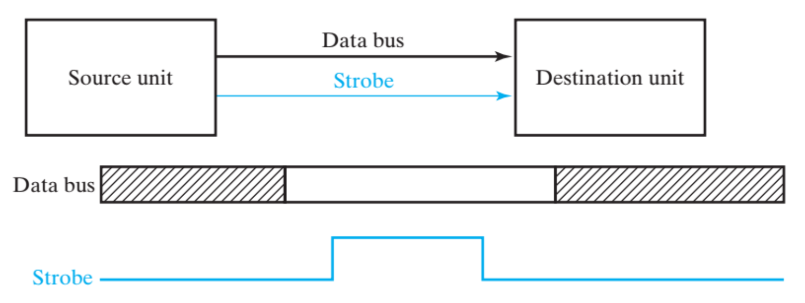
        </div>

        - 源端首先将数据放置在数据总线上，然后改变选通信号从 0 变为 1
        - 目标端将传输设置到寄存器上
        - 源端随后将选通信号从 1 变为 0
        - 源端从数据总线上移除数据

    - **目标启动传输**(destination-initiated transfer)

        <div style="text-align: center">
            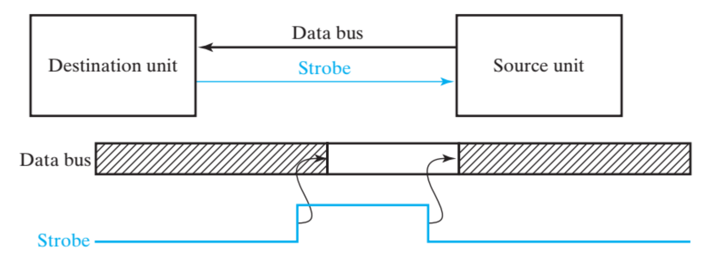
        </div>

        - 目标端将选通信号从 0 变为 1
        - 源端将数据放置在数据总线上
        - 目标端在寄存器中捕获数据，并将选通信号从 1 变为 0
        - 源端从数据总线上移除数据

- 数据传输的选通方法虽然简单，但存在以下几个缺点：
    - 数据必须是有效的，并且必须在总线上保持足够长的时间，以便目标端能够接受它
    - 没有迹象表明是否数据实际上被目标端捕获
    - 对于具有各种速度的多个单元，传输由最慢的单元决定

- 解决方案：引入一个提供对启动传输的单元的**回复**(reply)的第二控制信号（即下面马上介绍的握手方法）


#### Handshaking

- 双信号**握手**(handshaking)方法或轮询数据传输的基本原理如下：
    - 发起单位的一条控制线（**请求**(request)）用于请求其他单位的响应
    - 来自其他单位的第二条控制线（**回复**(response)）用于向发起单位回复响应正在发生

- 通过这种方式，每个单位都向其他单位告知其状态，从而使数据通过总线有序传输
- 在**源启动传输**中：

    <div style="text-align: center">
        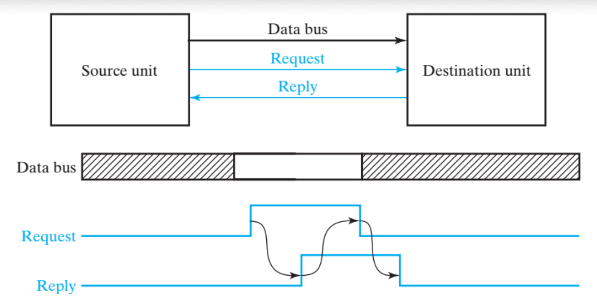
    </div>

    - 源端首先将数据放置在数据总线上，然后启用请求
    - 目标端设置传输并激活响应
    - 源端移除数据并重置请求
    - 目标端重置响应

- 在**目标启动传输**中：

    <div style="text-align: center">
        
    </div>

    - 目标端通过启用请求来启动传输
    - 源端将数据放置在数据总线上，然后激活回复
    - 目标端捕获数据并重置请求
    - 源端移除数据然后重置回复

???+ example "例子"

    以下示例展示了从计算机到打印机通过数据连接（$\text{D}_7-\text{D}_0$）进行数据传输的步骤。

    <div style="text-align: center">
        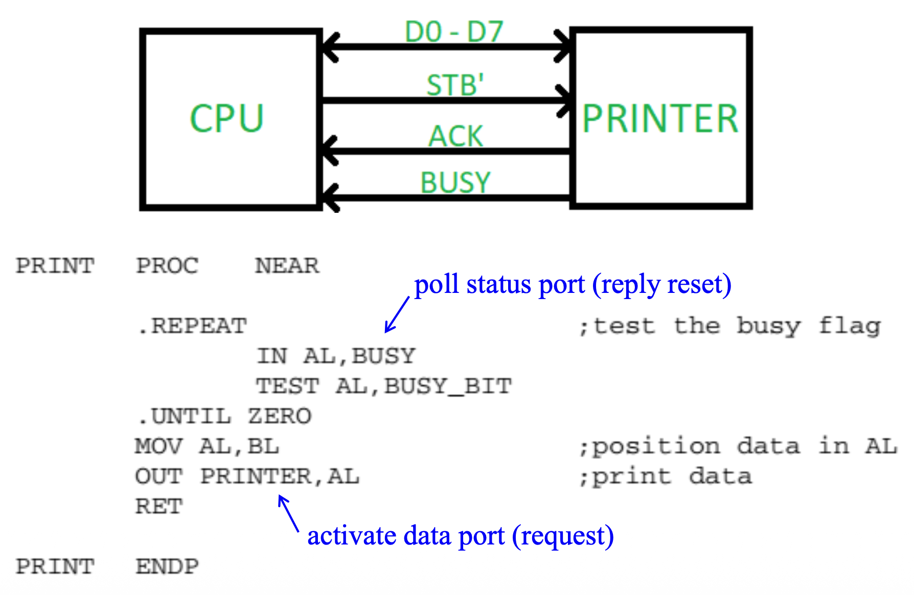
    </div>

    - ASCII 数据放置在 $\text{D}_7-\text{D}_0$，然后对 $\overline{\text{STB}}$ 连接应用脉冲
    - $\overline{\text{STB}}$ 是用于向打印机发送数据的时钟脉冲
    - $\text{BUSY}$ 表示打印机处于忙碌状态
    - 脉冲信号（**请求**）将数据发送到打印机，以便打印
    - 当打印机接收数据时，它在 $\text{BUSY}$ 引脚上放置逻辑 1（**回复**），表示正在打印数据
    - 软件轮询或测试 $\text{BUSY}$ 引脚以决定打印机是否忙碌
        - 如果打印机忙碌，处理器等待
        - 如果不忙碌，下一个 ASCII 字符发送到打印机


## I/O Port Address Decoding

<div style="text-align: center">
    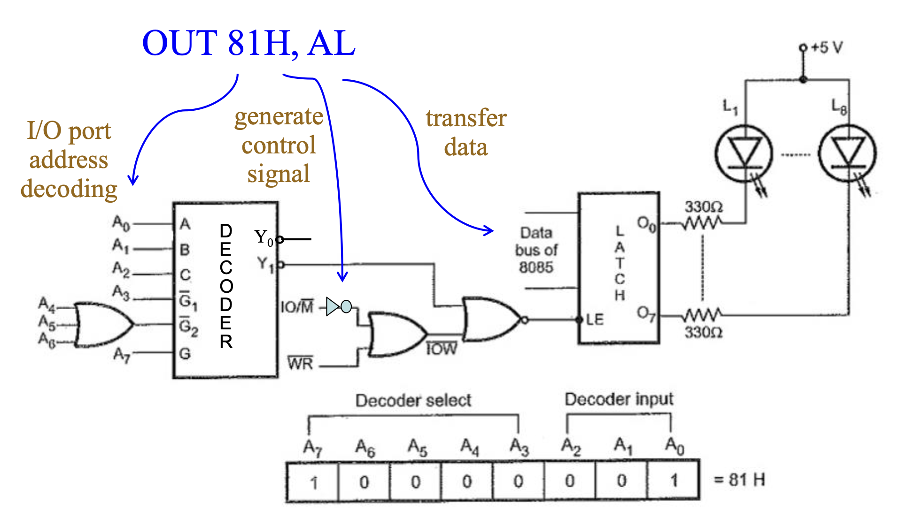
</div>

- I/O 设备选择：
    - 解码地址，以生成与在总线上的设备地址对应的唯一信号
    - 当设备地址信号和控制信号（$\overline{\text{IORC}}, \overline{\text{IOWC}}$）都为低电平时，生成设备选择信号
    - 使用设备选择信号激活输入输出接口技术(input output interfacing tachniques)

- 接口 I/O 设备包括
    - **I/O 端口的选择**(selection)，即 I/O 端口地址解码
    - 在 I/O 端口和微处理器之间**传输数据**

- 对于 I/O 端口地址解码
    - **内存映射 I/O**：使用与内存相同的地址进行解码
    - **隔离 I/O**：将**较少的地址引脚**连接到解码器，并生成**单独的控制信号**（例如，I/O 读 $\overline{\text{IORC}}$ 或 I/O 写 $\overline{\text{IOWC}}$）以激活 I/O 设备


### Decoding 8-Bit I/O Port Addresses

- 固定 I/O 指令使用一个 8 位 I/O 端口地址，在 $A_{15}–A_0$ 上为 `0000H`–`00FFH`，但通常只用 $A_7–A_0$
- `DX` 寄存器也可以寻址 I/O 端口 `00H`–`FFH`
- 如果地址被解码为 8 位地址，我们永远不能包含使用 16 位地址的 I/O 设备，因为 PC 永远不会使用或解码 8 位地址
- 下图展示了一个 74ALS138 解码器，它能解码 8 位 I/O 端口 `F0H`-`F7H`

    <div style="text-align: center">
        
    </div>

    – 这和内存地址解码器相同，除了只将地址位 $A_7-A_0$ 连接到解码器的输入端


- 下图展示了 PLD 版本，使用 GAL22V10（一种低成本设备）作为此解码器

    <div style="text-align: center">
        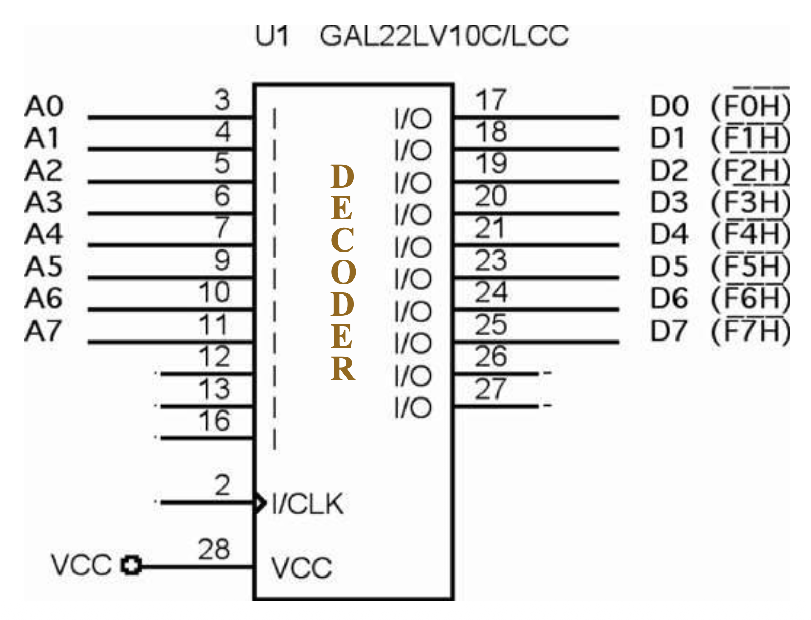
    </div>

    - **PLD** 是一种更好的解码器电路，因为集成电路的数量已减少到一个设备


### Decoding 16-Bit I/O Port Addresses

- PC 系统通常使用 16 位 I/O 地址，但在嵌入式系统中很少见
- 解码 8 位和 16 位 I/O 地址之间的区别是：必须解码额外的 8 个地址线（$A_{15}–A_8$）
- 下图展示了包含 PLD 和用于解码 I/O 端口 `EFF8H`–`EFFFH` 的 4 输入 NAND 门电路
    
    <div style="text-align: center">
        
    </div>
    
    - PLD 为 I/O 端口生成地址选通信号


### 8- and 16-Bit Wide I/O Ports

- I/O 空间按**库**(banks)组织（就像内存系统一样）以支持**单字节传输**或**未对齐的内存访问**，例如：
    - `#!asm in AL, 40H`, `#!asm in AL, 41H`
    - `#!asm out 40H，AL`, `#!asm out 41H，AL`

- 在这样的微处理器上，I/O系统包含两个 8 位内存库
- 类似于内存库选择
    - 任何 8 位 I/O **写**请求都需要单独的写选通信号（$\overline{\text{BHE}}, \overline{\text{BLE}}$）
    - 但**读**请求不需要

- 传输到 8 位 I/O 设备的数据位于 16 位处理器（如 80386SX）的一个 I/O 库中
- 下图展示了用于像 80386SX 的 16 位系统的一个单独的 I/O 库

    <div style="text-align: center">
        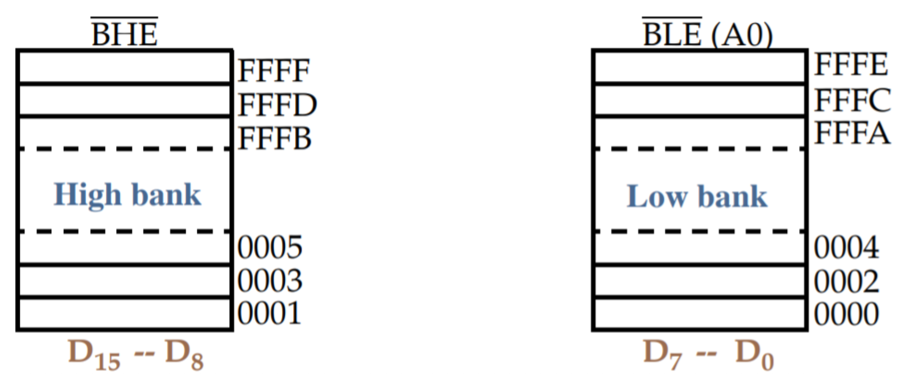
    </div>

- I/O 读取不需要单独的选通信号
    - 就像内存一样，处理器只读取它期望的字节，忽略其他字节
    - 当 I/O 设备对读取操作响应错误时，读取可能会引起问题

???+ example "例子"

    === "例1"

        下图所示的系统包含了两个不同的 8 位输出设备（出现在不同的 I/O 库中），分别位于 `40H` 和 `41H`。

        <div style="text-align: center">
            
        </div>

        - 因此生成独立的 I/O 写信号以时钟驱动一对捕获端口数据的锁存器


    === "例2"

        下图展示了一个 16 位设备连接到 `64H` 和 `65H` 的 8 位地址上。

        <div style="text-align: center">
            
        </div>

        - PLD 解码器没有 $\overline{\text{BLE}}$（$A_0$）和 $\overline{\text{BHE}}$ 地址位连接，因为信号不适用于 16 位宽的设备
        - PLD 的程序展示了如何生成用于作为输入设备的三态缓冲器（74HCT244）的使能信号


### 32-Bit-Wide I/O Ports

- 这种宽度的端口最终可能会普及，因为计算机系统的总线在更新
- EISA 系统总线、VESA 局部和当前 PCI 总线支持 32 位 I/O
- 下图展示了 80386DX-80486DX 微处理器的 32 位输入端口

    <div style="text-align: center">
        
    </div>

    - 电路使用单个 PLD 来解码 I/O 端口，并使用四个 74HCT244 缓冲器将 I/O 数据连接到数据总线
    - 通过此接口解码的 I/O 端口是 8 位端口 `70H`–`73H`
    - 通过写入访问此端口时，使用地址 `70H` 对于 32 位输入至关重要，比如指令 `#!asm in EAX, 70H`


## The Programmable Peripheral

82C55 **可编程外设接口**(programmable perripheral interface, PPI)是一种流行、低成本的接口组件，广泛应用于各种应用中。

- 它具有 24 个 I/O 引脚，可以以 12 个引脚为一组进行编程，并且可以在三种不同的操作模式下工作
- 可以将任何 TTL 兼容的 I/O 设备与微处理器连接
- 82C55（CMOS 版本）在与时钟频率高于 8 MHz 的处理器一起使用时需要**等待状态**，并且每个输出至少提供 2.5 mA 的下拉（逻辑 0）电流，最大值为 4.0 mA
    - 由于 I/O 设备本身速度较慢，在 I/O 传输过程中使用的等待状态对系统速度没有显著影响

- 在 PC 中，**一对 82C55** 或其等效设备在 **60H–63H** 号 I/O 端口上被解码，用于控制键盘、定时器或扬声器等；同时在 **378H–37BH** 端口被解码，用于并行打印机
- 82C55 是一个相对简单的设备，可以与微处理器接口并进行编程
- 要读取或写入 82C55，$\overline{\text{CS}}$ 输入必须为逻辑 0，并且正确的 I/O 地址必须施加到 A~1~ 和 A~0~ 引脚上
- 不用关心剩余的端口地址引脚


### Basic Description of 82C55

下图展示了 82C55 在 DIP 和表面贴装(surface mount)（扁平封装(flat pack)）格式的引脚排列：

<div style="text-align: center">
    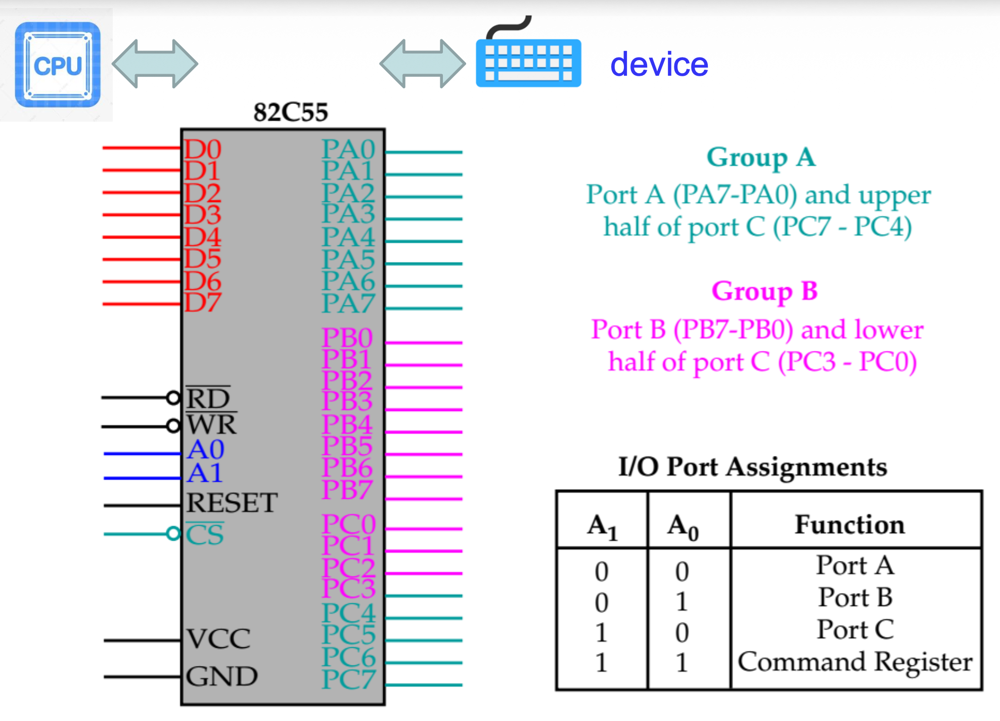
</div>

- 三个 I/O 端口（A, B, C）以组为单位被编程
    - A 组连接了包括端口 A（PA~7~–PA~0~）和端口 C 的上半部分（PC~7~–PC~4~）
    - B 组包括端口 B（PB~7~–PB~0~）和端口 C 的下半部分（PC~3~–PC~0~）

- 通过 $\overline{\text{CS}}$ 引脚选择 82C55 进行编程和向端口读写

下表展示了用于编程和访问 I/O 端口的 I/O 端口赋值：

<div style="text-align: center">
    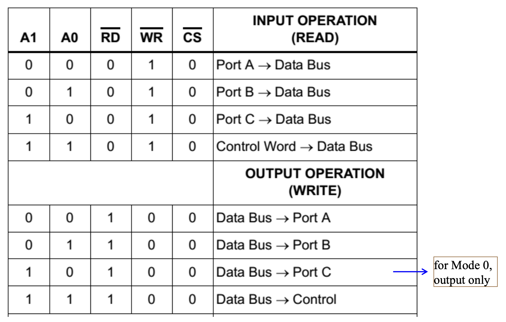
</div>

基本功能描述：

- **端口 A, B, C**
    - 端口 A：一个数据输出锁存器/缓冲区和一个数据输入**锁存器**
    - 端口 B：一个**共享的**数据输入/输出锁存器/缓冲区和一个数据输入**缓冲区**
    - 端口 C：一个数据输出锁存器/缓冲区和一个数据输入**缓冲区**

- **组 A 和组 B**
    - 组 A：端口 A 和端口 C 的高位4位 (PC~7~-PC~4~)
    - 组 B：端口 B 和端口 C 的低位4位 (PC~3~-PC~0~)

- **模式 0, 1, 2**
    - 模式 0：基本输入/输出操作（适用于组 A 和 B）
    - 模式 1：选通输入/输出操作（适用于组 A 和 B）
    - 模式 2：双向总线操作（仅适用于组 A）

- 用于端口 C 的**单比特设置/复位**（在模式 1 和 2 中）

功能图：

<div style="text-align: center">
    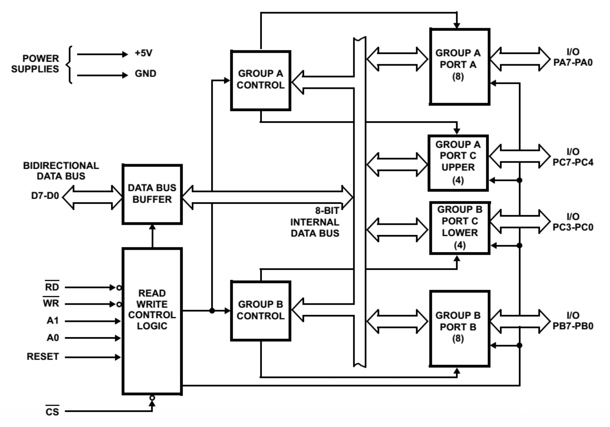
</div>

基本模式定义和总线接口：

<div style="text-align: center">
    
</div>

下图展示了 82C55 连接到 80386SX 的情况：

<div style="text-align: center">
    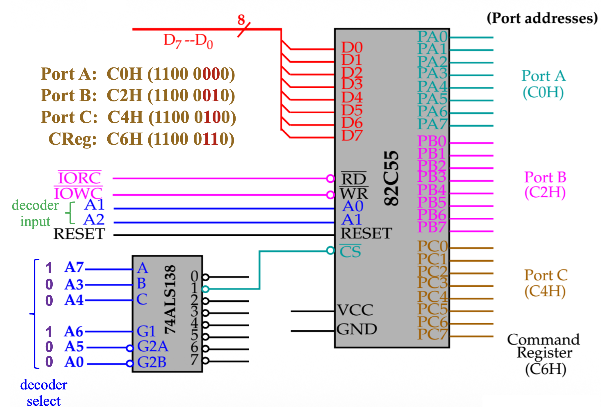
</div>

- 因此 82C55 在 8 位地址 C0H（端口 A）、C2H（端口 B）、C4H（端口 C）和C6H（命令寄存器）下工作
- 该接口使用 I/O 映射的低位库
- 除了 $\overline{\text{CS}}$ 引脚外，所有 82C55 引脚都直接连接到 80386SX；$\overline{\text{CS}}$ 引脚由 74ALS138 解码器进行解码/选择
- 82C55 的**复位**作用是将所有端口设置为使用模式 0 操作的简单输入端口
    - 在处理器复位时初始化设备

- 在复位后，只要将其用作所有三个端口的输入设备，就不再需要其他命令


### Programming the 82C55

82C55 通过下图所示的两个内部**命令寄存器**(command registers)进行编程：

<div style="text-align: center">
    
</div>

- 第 7 位用于选择命令字节 A / B
    - **命令字节 A** 编程组 A 和 B 的功能
    - **命令字节 B** 仅在 82C55 以模式 1 或 2 编程时设置（1）或重置（0）端口 C 的位
- 组 B 在模式 0 或模式 1 下操作，而组 A 可以在模式0、1 和 2 下操作
- 组 A 被编程为输入或输出引脚
- 组 A 可以在模式 0、1 和 2 下运行
    - 模式 2 操作是端口 A 的双向操作模式
- 如果命令字节的第 7 位是 0，则选择命令字 B
- 这使得在 82C55 以模式 1 或 2 运行时，端口 C 任何位都可以被设置（1）或重置（0）；否则，此字节不用于编程
- 在操作设备之前，应将适当的控制字（命令字节 B）写入控制字寄存器(control word register)
- 配置示例：
    - 组 A 和组 B 在模式 0
    - 端口 A 和 B 作为输出
    - 端口 C 的上半部分（PC~7~-PC~4~）作为输出
    - 端口 C 的下半部分（PC~3~-PC~0~）作为输入

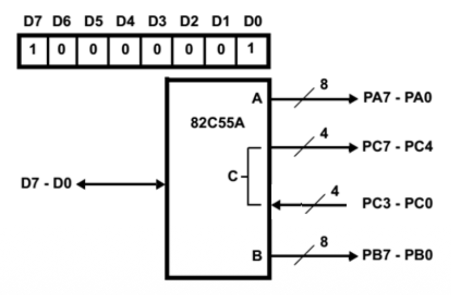{ align=right width=40% }

```asm
; programming the 82C55

COMMAND_ADDRESS EQU 703H

MOV AL, 10000001B
MOV DX, COMMAND_ADDRESS
OUT DX, AL
```


### Mode 0 Operation

- 模式 0 操作得使 82C55 作为：
    - 一个缓冲输入设备
    - 一个锁存输出设备

- 模式 0 使 82C55 作为基本的输入端口或输出端口工作，无需控制信号
- 所有的 24 位可以用作两个 8 位端口和两个 4 位端口

<div style="text-align: center">
    
</div>


### Examples

#### LED Display

端口 A 和 B 被编程为（模式 0）简单的锁存输出端口：

<div style="text-align: center">
    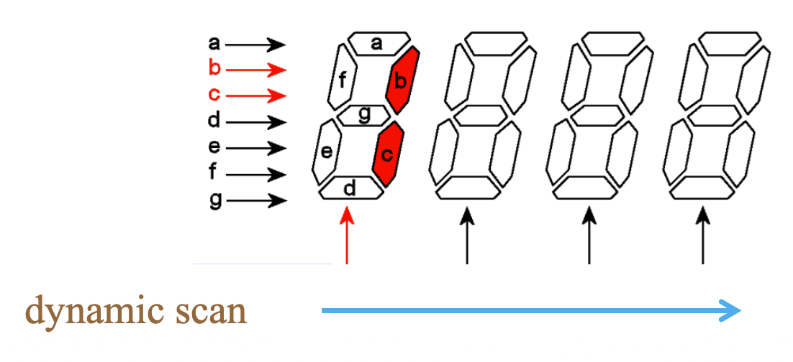
</div>

- 端口 A 提供了七段显示的**数据**输出
- 端口 B 提供了一次选择一个显示位置，以进行多路复用显示的方法
- 82C55 通过一个可编程逻辑器件（PLD）与 8088 相连，I/O 端口号为 0700H–0703H
- PLD 解码 I/O 地址并为 82C55 的 WR 引脚生成写脉冲

下图展示了 82C55 通过多路复用连接到八个七段 LED 显示器：

<div style="text-align: center">
    
</div>

- 图中电阻值的选择，使得段电流为 80 mA
    - 要求每个段产生平均 10 mA 电流，因为显示器是多路复用的
- 因此六位显示器使用 60 mA 的段电流
- 八位显示器中的峰值阳极电流为 560 mA（七个段 × 80 mA）
    - 平均阳极电流为 80 mA

- 在六位显示器中，峰值电流将是 420 mA（七个段 × 60 mA）
- 有 80 mA 的电流通过显示器的段负载电阻，因此电压大约有 3.0 V
- 可计算出电阻值为 3.0 V ÷ 80 mA = 37.5 Ω；图中使用的是最接近的标准电阻值的 39 Ω
- 可通过下图展示的简短指令序列来编程 82C55，其中端口 A 和 B 被编程为输出

```asm
; programming the 82C55 PIA

MOV AL, 10000000B       ; command
MOV DX, 703H            ; address port 703H
OUT DX, AL              ; send command to port 703H
```

<div style="text-align: center">
    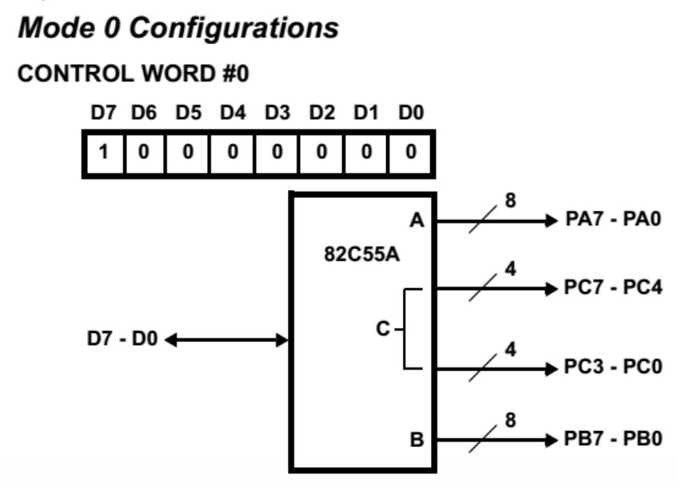
</div>

???+ example "例子"

    ```asm
    DISP PROC NEAR USES AX BX DX SI

        PUSHF
        MOV BX, 8                   ; load counter
        MOV AH, 7FH                 ; load selection pattern
        ; 0111 1111B, 7th LED is selected
        MOV SI, OFFSET MEM-1        ; address display data
        MOV DX, 701H                ; address Port B

    ; display all 8 digits

        .REPEAT
            MOV AL, AH      ; send selection pattern to Port B
            OUT DX, AL
            DEC DX          ; <- address Port A
            MOV AL, [BX+SI] ; send data to Port A
            OUT DX, AL
            CALL DELAY      ; wait 1.0 ms
            ROR AH, 1       ; adjust selection pattern
            INC DX          ; <- address Port B
            DEC BX          ; decrement counter
        .UNTIL BX == 0

        POPF
        RET

    DISP ENDP
    ```


#### Stepper Motor

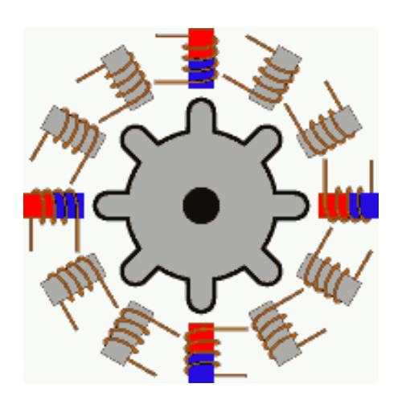{ align=right width=20% }

另一个常与计算机系统接口的设备是**步进电机**(stepper motor)。它是一种数字电机，因其能在 360° 范围内以离散步骤移动而得名。它将电子信号转换为机械运动，每当施加一个输入脉冲到电机时，轴(shaft)以固定增量移动。

- 价格低廉的步进电机，每步可能移动大约 15°；而更昂贵、高精度的步进电机，可以调整到每步 1°
- 常用的三种激励模式(excitation modes)有：
    - **全步**(full-step)：
        - **单相全步**(one-phase on full-step)：电机一次只对一个相进行供电，需要从任何激励模式中驱动器获取的最小功率
        - **双相全步**(two-phase on full-step)：电机同时对两个相进行供电，提供了改进的扭矩和速度性能

        <div style="text-align: center">
            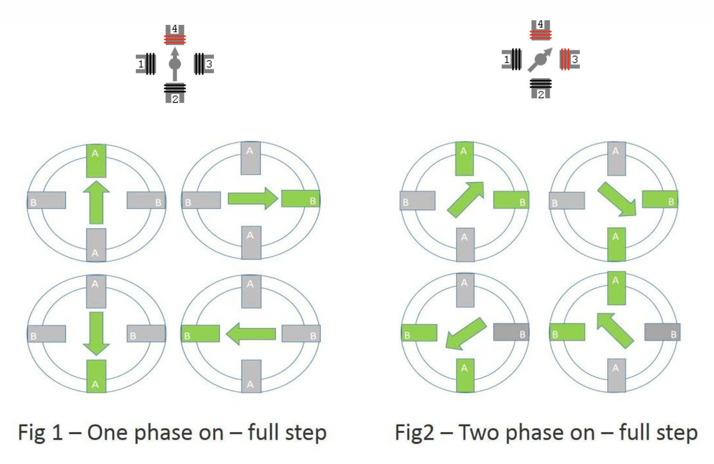
        </div>

    - **半步**(half-step)：单相和双相全步模式的结合
        - 基本步进角减半，因此增加了角度改变的精度(resolution)，提供了更平滑的操作
        - 产生的扭矩比双相全步要少，但改良后的半步通过增加施加到电机上的电流消除了扭矩的减少

        <div style="text-align: center">
            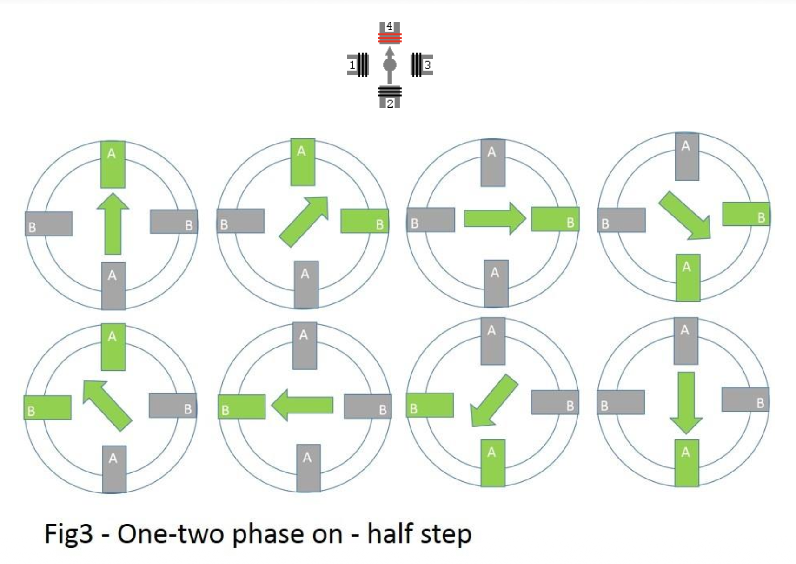
        </div>

        ??? example "例子"

            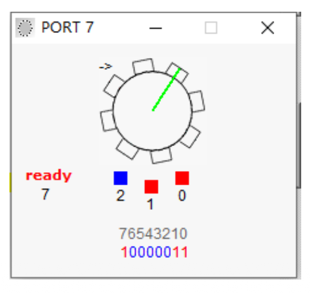{ align=right width=20% }

            有一个三相步进电机，它有三个由位 0、1 和 2 控制的磁铁。其他位（3-7）未使用。步进电机通过向 I/O 端口 7 发送数据进行控制。以下代码将执行三个顺时针半步：

            ```asm
            MOV AL, 011b ; initialize.
            OUT 7, AL

            MOV AL, 010b ; half step 1.
            OUT 7, AL

            MOV AL, 110b ; half step 2.
            OUT 7, AL

            MOV AL, 100b ; half step 3.
            OUT 7, AL
            ```

            以下代码是控制步进电机在半步模式下的一个示例：

            ```asm
            .stack 64h
            .data
            ; half-step clock-wise rotation
            datacw db 0000_0110b
                db 0000_0100b
                db 0000_0011b
                db 0000_0010b

            .code
                mov ax,@data
                mov ds, ax
                mov bx, offset datacw
                mov si, 0           ; step index
                mov cx, 16          ; step counter

            next_step:
                mov al, [bx][si]    ; load data
                out 7, al           ; send data
                inc si

                cmp si, 4
                jb next_step
                mov si, 0

                loop next_step

                hlt

            .exit
            ```

    - **微步**(micro-step)：所有步进模式中最复杂的，是指施加到每个绕组(winding)的电流与一个数学函数成正比，提供全步的一部分

        <div style="text-align: center">
            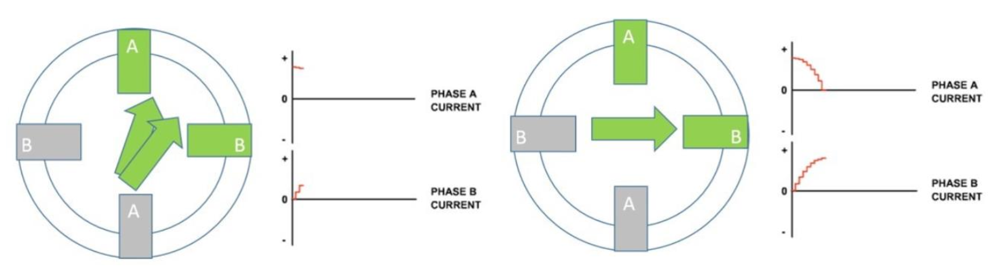
        </div>

    - 电机由 NPN 达林顿放大器对驱动，为每个线圈提供大电流
    - 驱动此步进电机的电路如下图所示
        - 四个线圈已就位
        - 以全步模式运行

        <div style="text-align: center">
            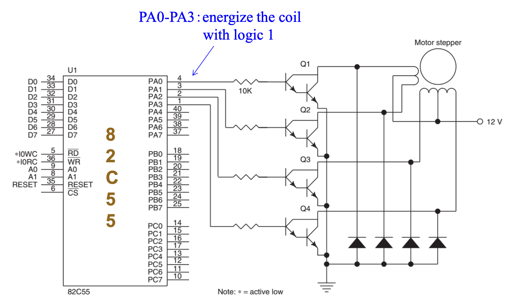
        </div>

    - 此电路使用 82C55 提供用于旋转电机转子向右或向左方向的驱动信号

---
- 在**双相全步**模式下运行时，当前位置存储在内存位置 `POS` 中，该位置必须初始化为 33H、66H、0CCH 或 99H
- 这允许简单的 ```asm ROR```（向右移位）或 ```asm ROL```（向左移位）指令旋转二进制位模式以进行下一步

    <div style="text-align: center">
        
    </div>

- 步进电机也可以在**半步**模式下运行。完整的八步序列为：11H、33H、22H、66H、44H、0CCH、88H 和 99H

    <div style="text-align: center">
        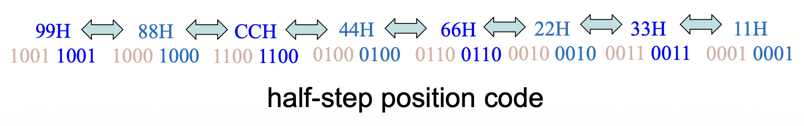
    </div>

- `CX` 保存步数和旋转方向
    - 如果 `CX > 8000H`，电机向右旋转
    - 如果 `CX < 8000H`，则向左旋转
    - 例如，如果步数为 0003H，电机向左移动三步；如果步数为 8003 H，则向右移动三步

下面列出了驱动电机的程序（端口 A 以模式 0 编程为输出设备）：

```asm
     PORT EQU 40H              ; port A address
; An assembly language procedure that controls the stepper motor
STEP PROC NEAR USES CX AX
    MOV AL,POS                 ; get position
    ; CX holds the number of steps and direction
    OR CX,CX                   ; set flag bits
    IF !ZERO?                  ; if step <> 0
        IF !SIGN?              ; if no sign (if CX [7] = 0)
            .REPEAT
                ROL AL,1       ; rotate step left
                OUT PORT,AL
                CALL DELAY     ; wait 1 ms
            .UNTILCXZ
        .ELSE
            AND CX,7FFFH       ; make CX positive (set CX [7] = 0)
            .REPEAT
                ROR AL,1       ; rotate step right
                OUT PORT,AL
                CALL DELAY     ; wait 1 ms
            .UNTILCXZ
        .ENDIF
    .ENDIF
    MOV POS,AL
    RET
STEP ENDP
```


### Mode 1 Strobed Input / Output

#### Input

- 在模式 1 中，当从指定端口进行输入/输出操作时，使用**选通、中断和其他“握手”信号**
- 在模式 1 中，**端口 C 用于控制或握手信号**，而不是用于数据，以帮助操作端口 A 和 B 作为选通输入端口
- 此模式适用于组 A 和组 B

<div style="text-align: center">
    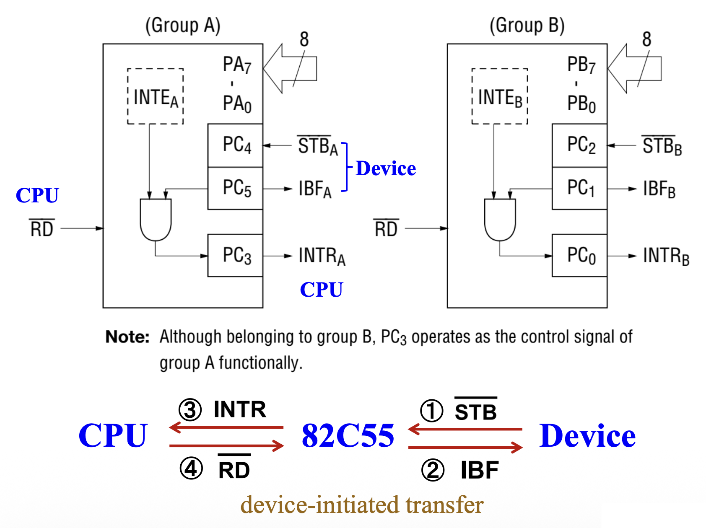
</div>

模式 1 选通输入的信号定义：

- $\overline{\text{STB}}$（**选通**(strobe)输入）：将数据加载到端口锁存器中，该锁存器保持信息，直到通过 ```asm IN``` 指令将其输入微处理器
- $\text{IBF}$（**输入缓冲区满**(input buffer full)）：表示输入锁存器包含信息的输出
- $\text{INTR}$（**中断请求**(interrupt request)）请求中断的输出
    - 当 $\text{INTE, STB, IBF}$ 为 1 时，$\text{INTR}$ 置 1
    - 当处理器从端口输入数据时清 0

- $\text{INTE}$（**中断使能**(interrupt enable)）：既不是输入也不是输出，而是一个通过端口 $\text{PC}_4$（端口 A）或 $\text{PC}_2$（端口 B）位位置编程的内部位
- $\text{PC}_7, \text{PC}_6$：端口 C 的第 7 和第 6 个引脚是通用 I/O 引脚，可用于任何目的

<div style="text-align: center">
    
</div>

当端口 C 在模式 1 中用于控制信号时，可以通过读取端口 C 的内容来读取每个控制信号和总线状态信号，允许程序测试或验证每个外设的“状态”，并相应地改变程序流程。

<div style="text-align: center">
    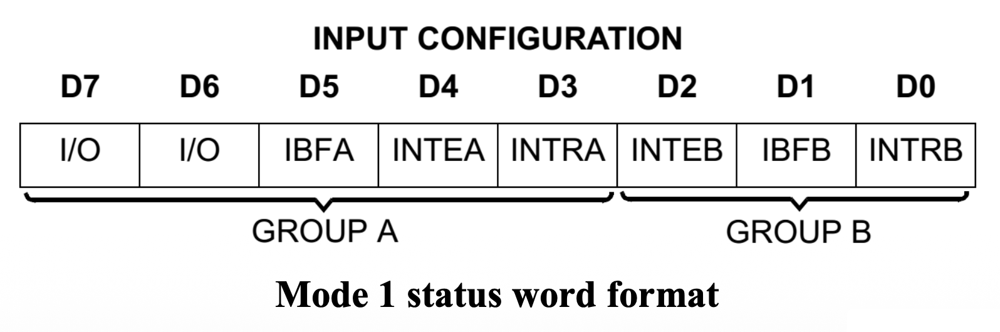
</div>

???+ example "例子：键盘"

    - 键盘编码器消除按键开关的抖动，并在每次按下一个键时提供一个选通信号（$\overline{\text{DAV}}$，数据可用），数据输出包含 ASCII 编码的按键代码
    - 每次激活 $\overline{\text{DAV}}$ 持续 1.0 μs，并连接到端口 A 的 $\overline{\text{STB}}$ 输入，导致数据被选通输入到端口 A，同时也激活 $\text{IBF}$ 信号

    <div style="text-align: center">
        
    </div>


#### Output

下图展示了 82C55 在模式 1 下作为带脉冲输出设备时的内部配置和时序图：

<div style="text-align: center">
    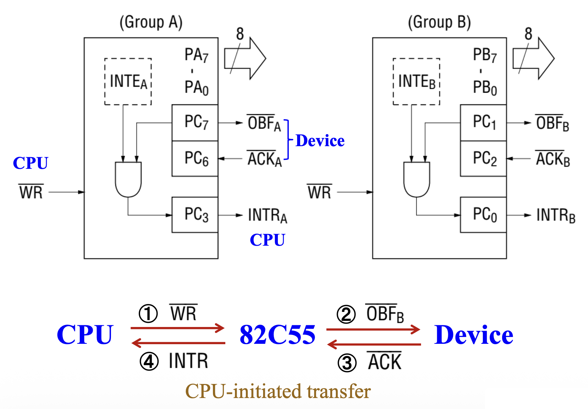
</div>

- 选通输出操作类似于模式 0 的输出操作，只是包含控制信号以提供握手功能
- 当数据写入选通输出端口时，“**输出缓冲区满**”信号变为逻辑 0，以指示端口锁存器中存在数据

模式 1 选通输出的信号定义：

- $\overline{\text{OBF}}$（**输出缓冲区满**(output buffer full)）：
    - 当数据被输出（```asm OUT```）到端口 A 或 B 的锁存器时，该信号会变为低电平
    - 当 $\overline{\text{ACK}}$ 脉冲从外部设备返回时，信号被设置为逻辑 1（高电平）

- $\overline{\text{ACK}}$（**确认信号**(acknowledge signal)）：
    - 使 $\overline{\text{OBF}}$ 引脚返回逻辑 1
    - 来自外部设备的响应，表示它已从 82C55 端口接收到数据

- $\text{INTR}$（**中断请求**(interrupt request)）：当外部设备通过 $\overline{\text{ACK}}$ 信号接收到数据时中断处理器
    - 当 $\text{INTE}, \overline{\text{STB}}, \overline{\text{IBF}}$ 为 1 时，$\text{INTR}$ 置 1
    - 当处理器从端口输入数据时清 0

- $\text{INTE}$（**中断使能**(interrupt enable)）：既不是输入也不是输出，而是一个通过端口 $\text{PC}_6$（端口 A）或 $\text{PC}_2$（端口 B）位位置编程的内部位
- $\text{PC}_4, \text{PC}_5$：端口 C 的引脚两个引脚，它们是通用 I/O 引脚；位设置和复位命令用于设置或复位这两个引脚

<div style="text-align: center">
    
</div>

当端口 C 用于模式 1 的控制信号时，可以通过读取端口 C 的内容来读取每个控制信号和总线状态信号允许程序测试或验证每个外围设备的状态，并相应地改变程序流程。

<div style="text-align: center">
    
</div>

???+ example "例子：打印机"

    下面通过打印机接口反映如何实现打印机和 82C55 之间的选通输出同步：

    <div style="text-align: center">
        
    </div>

    - 端口 B 连接到并行打印机
    - 具有八个用于接收 ASCII 编码数据的数据输入
    - 一个用于将选通数据到打印机的 $\overline{\text{DS}}$（数据选通）输入
    - 以及一个用于确认 ASCII 字符接收的 $\overline{\text{ACK}}$ 输出

---
端口 A 和端口 B 可以分别定义为输入或输出，以支持选通 I/O 应用：

<div style="text-align: center">
    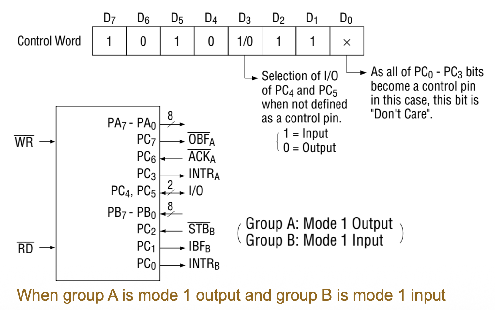
</div>

<div style="text-align: center">
    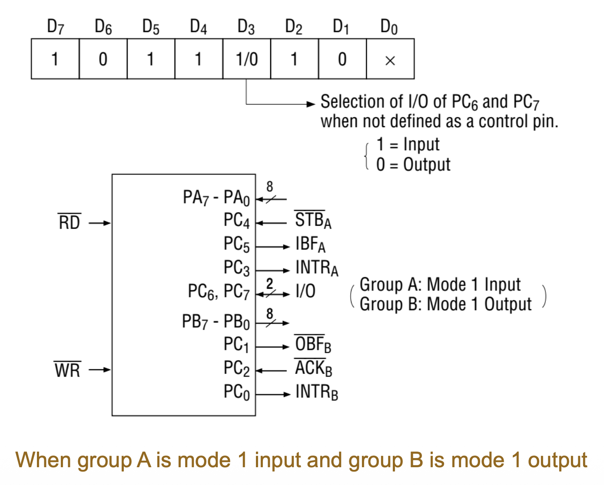
</div>


### Mode 2 Bidirectional Operation

- **模式 2** 仅允许与组 A 使用
- 端口 A 变为**双向**，允许通过相同的八根线进行数据传输/接收，这在需要连接两台计算机时很有用
- 还可用于 IEEE-488 并行高速 GPIB（**通用目的仪器总线**(general-purpose instrumentation bus)）接口标准

下图显示了模式 2 双向操作的内部结构和时序：

<div style="text-align: center">
    
</div>


#### Signal Definition

- $\text{INTR}$（**中断请求**(interrupt request)）：用于在输入和输出条件下中断微处理器的输出
- $\overline{\text{OBF}}$（**输出缓冲区满**(output buffer full)）：指示包含用于双向总线的数据的输出缓冲区的输出
- $\overline{\text{ACK}}$（**确认**(acknowledge)）：一个启用三态缓冲器的输入，以便数据出现在端口 A 上；如果 ACK 为逻辑 1，端口 A 的输出缓冲器处于高阻抗状态
- $\overline{\text{STB}}$（**选通**(strobe)输入）：加载端口 A 的输入锁存器，使用来自双向端口 A 总线的外部数据
- $\text{IBF}$（**输入缓冲区满**(input buffer full)）：一个用于指示包含来自外部双向总线的数据的端口 A 输入锁存器的输出
- $\text{INTE}$（**中断使能**(interrupt enable)）：用于启用 $\text{INTR}$ 引脚的内部位（$\text{INTE1}$ 和 $\text{INTE2}$）；$\text{INTR}$ 引脚的状态通过 $\text{PC}_6$（$\text{INTE1}$ ）和 $\text{PC}_4$（$\text{INTE2}$ ）进行控制
- $\text{PC}_0, \text{PC}_1, \text{PC}_2$：模式 2 中的通用 I/O 引脚，由设置和重置位命令控制

<div style="text-align: center">
    
</div>


#### Reading Port C Status

当端口 C 用于模式 2 的控制信号时，可以通过读取端口 C 的内容来读取每个控制信号和总线状态信号，允许程序测试或验证每个外围设备的状态，并相应地改变程序流程。

<div style="text-align: center">
    
</div>


#### The Bidirectional Bus

- 双向总线通过引用端口 A 以及 `#!asm IN` 和 `#!asm OUT` 指令来使用
- 要通过双向总线传输数据：
    - 程序首先测试 $\overline{\text{OBF}}$ 信号以确定输出缓冲区是否为空
    - 如果是，则通过 `#!asm OUT` 将数据发送到输出缓冲区
    - 在设备发出 $\overline{\text{ACK}}$ 信号之前，数据不会输出到外部

- 外部电路还监控 $\overline{\text{OBF}}$ 信号，以决定微处理器是否已将数据发送到总线上
- 一旦输出电路检测到 $\overline{\text{OBF}}$ 上的逻辑 0，它就会发送 $\overline{\text{ACK}}$ 信号将其从输出缓冲区移除；$\overline{\text{ACK}}$ 信号设置 $\overline{\text{OBF}}$ 位并启用三态输出缓冲区，以便读取数据

???+ example "例子"

    下图列出了一个通过端口 A 传输 `AH` 寄存器内容的程序：

    <div style="text-align: center">
        
    </div>

- 通过双向总线接收数据：
    - 使用软件测试 $\text{IBF}$，以确定数据是否已通过选通输入端口
    - 如果 $\text{IBF} = 1$，则使用 `#!asm IN` 输入数据

- 外部接口通过使用 $\overline{\text{STB}}$ 信号将数据发送到端口
- 当 $\overline{\text{STB}}$ 被激活时，$\text{IBF}$ 信号变为逻辑 1，端口 A 的数据被保持在端口内的锁存器中
- 在 CPU 的 $\overline{\text{RD}}$ 信号到达之前，数据不会输出到数据总线
- 当 `#!asm IN` 执行时，$\text{IBF}$ 位被清除，端口中的数据被移动到 `AL` 中

???+ example "例子"

    下图是一个从端口 A 读取数据的程序：

    <div style="text-align: center">
        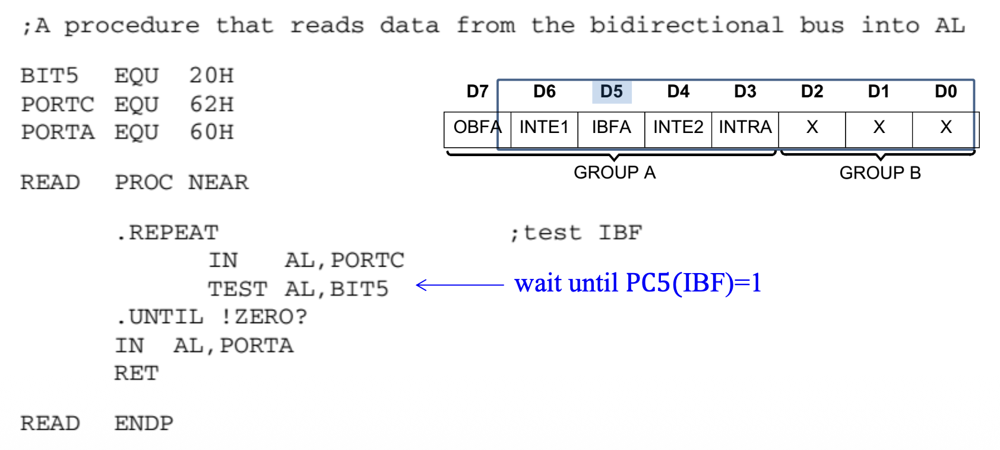
    </div>

- $\text{INTR}$ 引脚可以通过总线从数据流的两个方向中激活
- 如果 $\text{INTR}$ 被 $\text{INTE}$ 位同时启用，输出和输入缓冲区都会产生中断请求
- 发生时机为在使用 $\overline{\text{STB}}$ 将数据到缓冲区或使用 `#!asm OUT` 写入数据的时候

下图展示了模式 2 和其他模式的结合：

<div style="text-align: center">
    
</div>

???+ abstract "总结"

    <div style="text-align: center">
        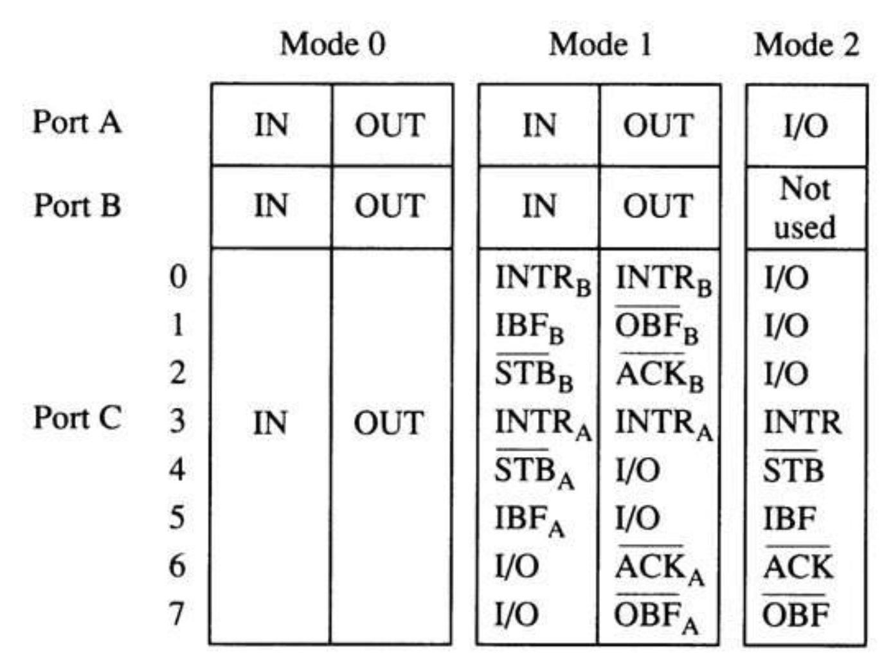
    </div>

    通过 82C55 的命令寄存器来选择模式：

    - 模式 0：提供简单 I/O；输出数据需要锁存，而输入不需要
    - 模式 1：提供选通 I/O；输入和输出数据都需要锁存
    - 模式 2：提供双向 I/O；输入和输出数据都需要锁存


## 8254 Programmable Interval Timer

**8254** 由三个独立的 16 位可编程计数器（**定时器**(timer)）组成。每个计数器能够以二进制或二进制编码十进制（BCD）进行计数，最大允许输入频率为 10 MHz。它在微处理器必须控制实时事件的情况下非常有用（例如实时时钟、事件计数器和电机速度/方向控制等应用）。

定时器在 PC 的端口 40H–43H 解码，执行以下操作：

- **定时器 0**：生成一个 18.2 Hz 的信号，以在一个时钟 tick 中中断微处理器；在 DOS 中通常用于计时程序和事件
- **定时器 1**：被编程为 15 ms，用于请求 DMA 操作，以刷新动态 RAM
- **定时器 2**：被编程为在 PC 扬声器上产生声音

8254 定时器的示意图：

<div style="text-align: center">
    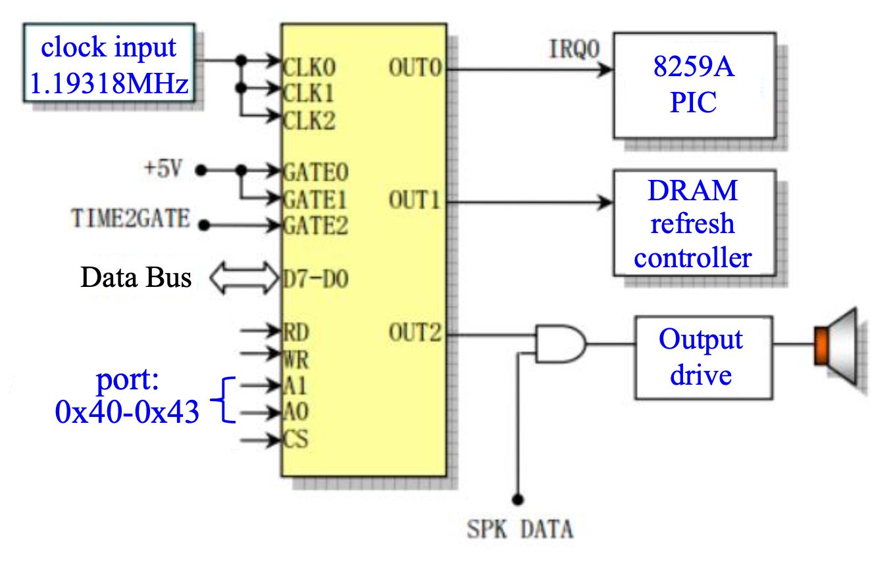
</div>


### Functional Description

Intel 8254 是 8253 的超集，其基本功能如下：

- 三个独立的 16 位计数器
- 二进制或 BCD 计数
- 六种可编程计数模式
- 计数器锁存命令
- 多个方便监控的锁存器命令
- 处理从直流到 10 MHz 的输入

下图展示了 8254 的引脚排列：

<div style="text-align: center">
    
</div>

每个定时器包含：

- 一个 **CLK 输入**，为定时器提供基础工作频率
- 一个**门输入**引脚，用于控制定时器在某些模式下工作
- 一个**输出**（OUT）连接，以获取定时器的输出


### Pin Definition

下图展示了 8254 的系统接口：

<div style="text-align: center">
    
</div>

- 连接到处理器的信号有：数据总线引脚（$D_7–D_0$），$\overline{\text{RD}}, \overline{\text{WR}}, \overline{\text{CS}}$ 以及地址输入 $A_1, A_0$
- 地址输入：选择四个内部寄存器中的任何一个，用于编程、读取或写入计数器

8254 的引脚定义：

- $\overline{\text{CS}}$（**芯片选择**(chip select)）：启用 8254 的编程以及读取或写入计数器
- $A_0, A_1$（**地址输入**(address input)）：选择 8254 内部四个寄存器中的一个
    - 参见下表来了解这两个地址位的功能：

        | $A_1$ | $A_0$ | Function |
        | :---: | :---: | :--- |
        | 0 | 0 | Counter 0 |
        | 0 | 1 | Counter 1 |
        | 1 | 0 | Counter 2 |
        | 1 | 1 | Control Word |

- $\text{CLK}$（**时钟**(clock)输入）：每个内部计数器的定时源
- $G$（**门**(gate)输入）：控制某些操作模式下的计数器操作
- $\text{OUT}$（**计数器输出**(counter output)）：由定时器产生的波形
- $\overline{\text{RD}}$（**读**(read)）：从 8254 中读取数据，通常和 $\overline{\text{IORC}}$ 信号连接
- $\overline{\text{WR}}$（**写**(write)）：向 8254 写入数据，通常和写选通 $\overline{\text{IOWC}}$ 连接
- $\text{GND}$（**接地**(ground)）：连接系统接地总线
- $\text{VCC}$（**电源**(power)）：连接 +5.0V 电源


### Read and Write Waveform

读波形：

<div style="text-align: center">
    
</div>

写波形：

<div style="text-align: center">
    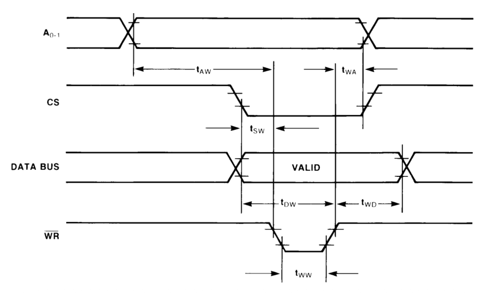
</div>


### Programming

???+ info "计数器内部块图"

    <div style="text-align: center">
        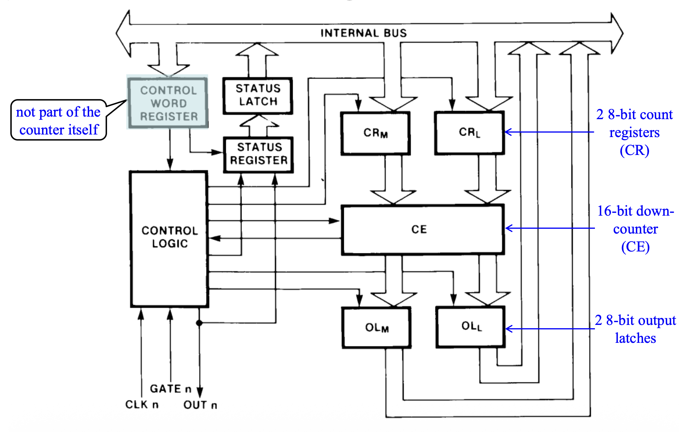
    </div>


## 16550 Programmable Communications Interface

## ADC & DAC Converters