# Basic I/O Interface

## Intro to I/O Interface

### Hardware Interface

**硬件接口**建立起不同设备之间的连接和通信，实现计算机和外设(peripheral devices)的协同工作。

<div style="text-align: center">
    
</div>

硬件接口提供了以下解决方案：

- 信号匹配(signal matching) -> 信号转换(signal conversion)
- 信号驱动(signal driving) -> 信号增强(signal boost)
- 速度匹配(speed matching) -> 数据锁存器和缓冲区(data latch and buffer)
- 时序匹配(timing matching) -> 时序控制(timing control)
- 总线隔离(bus isolation) -> 三态缓冲器(three-state buffer)
- 格式匹配(formating matching) -> 协议转换(protocol translation)

硬件接口的类型：

- 按信息流方向分类：输入/输出接口
- 按信号类型分类：模拟(analog)/数字(digital)接口
- 按数据传输类型分类：串行(serial)/并行(parallel)接口

一个 **I/O 接口单元**包含以下块：

- **读/写控制逻辑**
- **数据总线缓冲区**(data bus buffer)
- **端口寄存器**(port registers)（比如端口 A，端口 B 等）
- **控制和状态寄存器**(control and status registers)

<div style="text-align: center">
    
</div>


### A Few Key Points about I/O Interface

- 连接 I/O 设备和 CPU 
    - 输出接口：**锁存器**
    - 输入接口：**三态缓冲器**
- 为 I/O 设备提供地址空间
    - **隔离 I/O**
    - **内存映射 I/O**
- 执行 I/O 端口译码时需考虑这些信号：内存地址、#BHE、#BLE、#IORC、#IOWC
- 处理器和 I/O 设备的同步
    - 对于始终开启的(always-on)设备采用**无条件传输**(unconditional transfer)
    - **选通**(strobing)
    - **握手**(handshaking)**和轮询**(polling)
    - **中断驱动的**(interrupt-based) I/O
    - **基于通道的**(channel-based) I/O（比如 DMA）


### Isolated and Memory-Mapped I/O

下面介绍两种不同的 I/O 接口方法：

- **隔离 I/O**(isolated I/O)：使用 `#!asm IN` 和 `#!asm OUT`，在微处理器的累加器或内存与 I/O 设备之间传输数据
- **内存映射 I/O**(memory-mapped I/O)：任何引用内存的指令都可以完成传输

PC（个人电脑）使用隔离 I/O 而不是内存映射 I/O。


#### Isolated I/O

- 在基于 Intel 的系统中，最常用的 I/O 传输技术是隔离 I/O
- **隔离**(isolated)描述了 I/O 位置如何通过单独的 I/O 地址空间来隔离内存
- 隔离 I/O 设备的地址，称为**端口**(ports)，与内存分离

???+ recommend "优点"

    因为端口与内存分离，所以用户可以在不把任何内存空间用于 I/O 设备的情况下，将内存扩展到其最大容量。

???+ bug "缺点"

    - I/O 与微处理器之间传输的数据必须通过 `#!asm IN`、`#!asm INS`、`#!asm OUT` 和 `#!asm OUTS` 指令访问
    - 需要为 I/O 空间开发单独的控制信号（使用 $\text{M}/\overline{\text{IO}}, \text{W}/\overline{\text{R}}$），表示 I/O 读（$\overline{\text{IORC}}$）或 I/O 写（$\overline{\text{IOWC}}$）操作
    - I/O 操作速度慢，因为需要使用专门的 I/O 指令，同时让编程更加复杂


#### Memory-Mapped I/O

- 内存映射 I/O 不使用 `#!asm IN`、`#!asm INS`、`#!asm OUT` 和 `#!asm OUTS` 指令
- 使用任何在微处理器和内存之间传输数据的指令

???+ recommend "优点"
    
    - **更快的 I/O 操作**：允许 CPU 以与访问内存相同的速度访问 I/O 设备
    - **简化编程**：可以使用相同的指令来访问内存和 I/O 设备

???+ bug "缺点"

    - **有限的 I/O 地址空间**：这种设计限制了 I/O 地址空间，因为 I/O 设备共享与内存相同的地址空间，这意味着可能没有足够的地址空间来寻址所有 I/O 设备
    - **响应时间较慢**：若 I/O 设备响应缓慢，可能会延迟 CPU 对内存的访问，从而导致整体的系统性能变慢

???+ example "例子（隔离 I/O vs 内存映射 I/O）"

    <div style="text-align: center">
        
    </div>


### Personal Computer I/O Map

- PC 使用部分 I/O 映射，用于一些专用的功能
- 端口 `0000H`-`03FFH` 之间的 I/O 空间保留给**系统**
- `0400H`–`FFFFH` 端口可供**用户**使用
- I/O 空间的地址独立于内存中断向量表空间，所以两者并不冲突

<div style="text-align: center">
    
</div>


### Logic ICs

逻辑接口电路(logical interfacing circuitry)的分类：

<div style="text-align: center">
    
</div>

- **TTL**（晶体管-晶体管逻辑(transistor-transistor logic)）逻辑
    - 一种双极性逻辑集成电路，于早期引入
    - 更高的电流驱动能力和更高的速度（5-10 ns）
    - 消耗更多功率
        - 传统上使用 5V 电源供电，而 TTL 兼容的 CMOS 设备只使用 3.3V
    -  TTL 信号必须符合以下逻辑 1 和逻辑 0 的规范：
  
    <div style="text-align: center">
        
    </div>

- **CMOS** 逻辑
    - 消耗的功率比 TTLs 低
    - 刚发明出来的时候速度较慢（25-50ns），但现在的速度比 TTL 快
    - 电源供电选择多样，比如 5V、3.3V、1.8V 等
    - CMOS 信号必须根据供电电压（VCC）满足特定的电压水平，以实现逻辑 1 和逻辑 0 ，以下是通用规格：

    <div style="text-align: center">
        
    </div>

下面总结了这两种逻辑的输入输出规范：

<div style="text-align: center">
    
</div>

???+ note "注"

    - TTL 在现代设备中很少见：主要存在于旧设备中（例如，82C55，RS-232），因为大多数现代接口（例如，USB，PCIe）由于功耗较高和可扩展性有限，已经远离了 TTL 信号
    - CMOS 在新设计中占主导地位：由于效率高和可扩展性强，低压 CMOS 兼容性成为现代接口的标准
    - 用于旧设备的译码器：当需要 TTL 兼容性时，使用电平转换器或电压转换器来连接 TTL 和 CMOS 逻辑电平


#### Input Devices

关于输入设备接口的考虑因素：

- 当连接到微处理器时，输入设备应与 **TTL/CMOS 兼容**
- 应减少或消除输入设备的**噪声**(noise)

例如，对于基于开关的设备(switch-based devices)

- 它们不是 TTL/CMOS 兼容的输入设备，所以应进行一些适配以使其成为 TTL/CMOS-开关
- 由于开关抖动(bounce)，应应用一些条件以去抖动机械接触

下图是一个正确连接的切换开关，作为输入设备：

<div style="text-align: center">
    
</div>

- 开关关闭时接地，产生一个有效的逻辑 0 电平
- 使用一个上拉电阻(pull-up resistor)，确保当开关打开时，输出信号是逻辑 1
    - 上拉电阻的标准值范围在 1KΩ 到 10KΩ 之间

- 机械开关在按下或释放时总会产生噪声

    <div style="text-align: center">
        
    </div>

下面列举一些防止上述抖动问题的方法：

- 带触发器(flip-flop)的双掷开关(double-throw switch)（图(a)）
- 带非门的双掷开关（图(b)）

    <div style="text-align: center">
        
    </div>

- 低通滤波器(low-pass filter)和施密特触发器(Schmitt trigger)

    <div style="text-align: center">
        
    </div>

- 多级移位寄存器(multiple stage shift register)采样
    - 开关通常会在 5-10ms 内抖动
    - 连接一个 100Hz 的时钟，它将每 10ms 采样一次信号
    - 当所有采样值都为高时，设置 SR 触发器，当值为低时重置

    <div style="text-align: center">
        
    </div>

- 软件采样


#### Output Devices

- 输出设备比输入设备种类更多，但许多设备都以统一的方式连接
- 连接输出设备需要**匹配**设备和微处理器的**电压和电流**关系
- 接口元件的微处理器输出**电压与 TTL 兼容**
    - 逻辑 0 = 0.0V-0.4V
    - 逻辑 1 = 2.4V-5.0V

- 处理器和许多接口组件的**电流小于标准 TTL**
    - 逻辑0 = 0.0-2.0mA
    - 逻辑1 = 0.0-400μA

???+ example "例子"

    === "例1"

        提供足够的电流（10mA）来点亮 LED 的两种方法：

        <div style="text-align: center">
            
        </div>

        - 图(a) 使用了一个**晶体管驱动器**
            - **2N2222** 是一款性能良好、价格低廉的通用开关晶体管，其最小增益为 100
            – 集电极电流为 10mA，因此基极电流将是集电极电流的 1/100，即 0.1mA
            - 为了确定基极电流-限流电阻，使用 0.1mA 的基极电流并在基极电流–限流电阻上产生 1.7V 的电压降
            
        - 图(b) 使用了一个 **TTL 反相器**(inverter)
            - 它在逻辑 0 级别下提供高达 16mA 的电流，足以驱动一个标准LED

        - TTL输入信号的最小值为 2.4V
        - 发射极-基极结的压降为 0.7V
        - 电阻上的压降为 1.7V
        - 电阻的值为 1.7V / 0.1mA = 17KΩ
        - 由于 17K 不是标准值，选择了一个 18K 电阻

    === "例2"

        将一个 12V 直流 1A 电机连接到微处理器：

        - 不能使用 TTL 反相器
            - 12V 信号会烧毁反相器
            - 电流远超过 16mA 反相器的最大值

        - 也不能使用 2N2222 晶体管
            - 最大电流为 250mA-500mA（取决于选择的封装样式）

        - 解决方案是使用**达林顿对**(Darlington-pair)，例如 TIP120
            - 成本 25 美分，可以处理 4A 电流

        - 下图展示了连接到具有最小电流增益 7000 和最大电流 4A 的达林顿对电机

            <div style="text-align: center">
                
            </div>

            - 达林顿对必须使用**散热片**(heat sink)，因为电流量较大
            - 二极管必须存在，以防止达林顿对被**电感反冲**(inductive kickback)烧坏

        - 基极电阻的值与 LED 驱动器中使用的值完全相同
        - 通过电阻的电流为 1.0A / 7000 ≈ 0.143mA
        - 由于两个二极管压降（基极/发射极结），电压降为 0.9V
        - 基极电阻的值为 0.9V / 0.143mA = 6.29KΩ


### Basic Input and Output Interfaces

- `#!asm IN`：将数据从 I/O 设备移动到微处理器中
- `#!asm OUT`：将数据从微处理器移动到 I/O 设备中
- **基本输入设备**是一组连接到数据总线上的**三态缓冲器**
- **基本输出设备**是一组**数据锁存器**，用于存储来自数据总线上的值


#### The Basic Input Interface

**三态缓冲器** 74ALS244 构建 8 位输入端口：

<div style="text-align: center">
    
</div>

- 外部 TTL 信号连接到缓冲器的输入端，缓冲器输出连接到数据总线
- 当选择信号 $\overline{\text{SEL}}$ 变为逻辑 0 时，该电路允许处理器读取连接到数据总线任何 8 位部分的八个开关的内容
- 当执行 `#!asm IN` 指令时，开关的内容复制到 `AL` 寄存器
- 这个基本输入电路是必需的，每次输入数据与微处理器接口时都必须出现
- 有时作为电路的独立部分出现（如上图所示）也可以集成在可编程 I/O 设备中
- 16 位或 32 位数据也可以用于接口，但不如 8 位数据常见


#### The Basic Output Interface

通常用锁存器或触发器，（必须）为某些外部设备保存从处理器处接收到的数据。它们通常集成在 I/O 设备中。

下图展示了八个发光二极管（LED）如何通过一组八个数据锁存器连接到处理器的：

<div style="text-align: center">
    
</div>

- 之所以要用锁存器保持数据，是因为处理器执行 `#!asm OUT` 操作后，数据只在数据总线上存在不到 1.0μs，不保存的话我们就永远不会看到 LED 灯点亮
- 当执行 `#!asm OUT` 时，`AL`、`AX` 或 `EAX` 中的数据通过数据总线传输到锁存器，并且激活 $\overline{\text{SEL}}$ 信号，让锁存器捕获数据并保存数据到下一次执行 `#!asm OUT` 指令时，这样 `AL` 寄存器中的数据就能反映在 LED 灯上了


### Asynchronous Data Transfer

CPU 和 I/O 设备可能具有不同的时钟，这些时钟彼此不同步，即**异步**(asynchronous)。异步数据传输的方法有：

- **选通**(strobing)（1 个控制信号，单向）
- **握手**(handshaking)（2 个控制信号，双向）


#### Strobing

**选通信号**(strobe)是一种**同步信号**，用于指示数据传输的开始和结束。由于它可以被源单元或目标单元激活，因此使用选通信号进行数据传输有两种方法：

- **源启动传输**(source-initiated transfer)

    <div style="text-align: center">
        
    </div>

    - 源端首先将数据放置在数据总线上，然后改变选通信号从 0 变为 1
    - 目标端将传输设置到寄存器上
    - 源端随后将选通信号从 1 变为 0
    - 源端从数据总线上移除数据

- **目标启动传输**(destination-initiated transfer)

    <div style="text-align: center">
        
    </div>

    - 目标端将选通信号从 0 变为 1
    - 源端将数据放置在数据总线上
    - 目标端在寄存器中捕获数据，并将选通信号从 1 变为 0
    - 源端从数据总线上移除数据

数据传输的选通方法虽然简单，但存在以下几个缺点：

- 数据必须是有效的，并且必须在总线上保持足够长的时间，以便目标端能够接受它
- 没有迹象表明是否数据实际上被目标端捕获
- 对于具有各种速度的多个单元，传输由最慢的单元决定

解决方案：引入一个提供对启动传输的单元的**回复**(reply)的第二控制信号（即下面马上介绍的握手方法）


#### Handshaking

双信号**握手**(handshaking)方法（或轮询）的数据传输的基本原理如下：

- 发起单位的一条控制线（**请求**(request)）用于请求其他单位的响应
- 来自其他单位的第二条控制线（**回复**(reply)）用于向发起单位回复响应正在发生

通过这种方式，每个单位都向其他单位告知其状态，从而使数据通过总线有序传输。

- 在**源启动传输**中：

    <div style="text-align: center">
        
    </div>

    - 源端首先将数据放置在数据总线上，然后启用请求
    - 目标端设置传输并激活响应
    - 源端移除数据并重置请求
    - 目标端重置响应

- 在**目标启动传输**中：

    <div style="text-align: center">
        
    </div>

    - 目标端通过启用请求来启动传输
    - 源端将数据放置在数据总线上，然后激活回复
    - 目标端捕获数据并重置请求
    - 源端移除数据然后重置回复

???+ example "例子"

    以下示例展示了从计算机到打印机通过数据连接（$\text{D}_7-\text{D}_0$）进行数据传输的步骤。

    <div style="text-align: center">
        
    </div>

    - ASCII 数据放置在 $\text{D}_7-\text{D}_0$，然后对 $\overline{\text{STB}}$ 连接应用脉冲
    - $\overline{\text{STB}}$ 是用于向打印机发送数据的时钟脉冲
    - $\text{BUSY}$ 表示打印机处于忙碌状态
    - 脉冲信号（**请求**）将数据发送到打印机，以便打印
    - 当打印机接收数据时，它在 $\text{BUSY}$ 引脚上放置逻辑 1（**回复**），表示正在打印数据
    - 软件轮询或测试 $\text{BUSY}$ 引脚以判断打印机是否忙碌
        - 如果打印机忙碌，处理器等待
        - 如果不忙碌，下一个 ASCII 字符发送到打印机


## I/O Port Address Decoding

<div style="text-align: center">
    
</div>      

- I/O 设备选择：
    - 译码地址，以生成与在总线上的设备地址对应的唯一信号
    - 当设备地址信号和控制信号（$\overline{\text{IORC}}, \overline{\text{IOWC}}$）都为低电平时，生成设备选择信号
    - 使用设备选择信号激活输入输出接口技术(input output interfacing techniques)

- 接口 I/O 设备包括
    - **I/O 端口的选择**(selection)，即 I/O 端口地址译码
    - 在 I/O 端口和微处理器之间**传输数据**

- 对于 I/O 端口地址译码
    - **内存映射 I/O**：使用与内存相同的地址进行译码
    - **隔离 I/O**：将**较少的地址引脚**连接到译码器，并生成**单独的控制信号**（例如，I/O 读 $\overline{\text{IORC}}$ 或 I/O 写 $\overline{\text{IOWC}}$）以激活 I/O 设备


### Decoding 8-Bit I/O Port Addresses

- 固定 I/O 指令使用一个 8 位 I/O 端口地址，在 $A_{15}–A_0$ 上为 `0000H`–`00FFH`，但通常只用 $A_7–A_0$
- `DX` 寄存器也可以寻址 I/O 端口 `00H`–`FFH`
- 如果地址被译码为 8 位地址，我们永远不能包含使用 16 位地址的 I/O 设备
- 但实际上 PC 永远不会使用或译码 8 位地址

???+ example "例子"

    === "例1"

        下图展示了一个 74ALS138 译码器，它能译码 8 位 I/O 端口 `F0H`-`F7H`。

        <div style="text-align: center">
            
        </div>

        这和内存地址译码器相同，除了只将地址位 $A_7-A_0$ 连接到译码器的输入端。

    === "例2"

        下图展示了 PLD 版本，使用 GAL22V10（一种低成本设备）作为此译码器。

        <div style="text-align: center">
            
        </div>

        **PLD** 是一种更好的译码器电路，因为集成电路的数量已减少到一个设备。


### Decoding 16-Bit I/O Port Addresses

- PC 系统通常使用 16 位 I/O 地址，但在嵌入式系统中很少见
- 译码 16 位 I/O 地址时还需额外的 8 个地址线 $A_{15}–A_8$

???+ example "例子"

    下图展示了包含 PLD 和用于译码 I/O 端口 `EFF8H`–`EFFFH` 的 4 输入 NAND 门电路
    
    <div style="text-align: center">
        
    </div>
    
    - PLD 为 I/O 端口生成地址选通信号


### 8- and 16-Bit Wide I/O Ports

I/O 空间按**库**(banks)组织（就像内存系统一样）以支持**单字节传输**或**未对齐的内存访问**，例如：

- `#!asm in AL, 40H`, `#!asm in AL, 41H`
- `#!asm out 40H，AL`, `#!asm out 41H，AL`

在这样的微处理器上，I/O 系统包含两个 8 位内存库。类似于[内存库](9.md#memory-banks)选择，

- 任何 8 位 I/O **写**请求都需要单独的写选通信号（$\overline{\text{BHE}}, \overline{\text{BLE}}$）
- 但**读**请求不需要单独的选通信号
    - 就像内存一样，处理器只读取它期望的字节，忽略其他字节
    - 当 I/O 设备对读取操作响应错误时，读取可能会引起问题

下图展示了用于像 80386SX 的 16 位系统的分离的 I/O 库：

<div style="text-align: center">
    
</div>

???+ example "例子"

    === "例1"

        下图所示的系统包含了两个不同的 8 位输出设备（出现在不同的 I/O 库中），分别位于 `40H` 和 `41H`。

        <div style="text-align: center">
            
        </div>

        - 因此生成独立的 I/O 写信号以时钟驱动一对捕获端口数据的锁存器


    === "例2"

        下图展示了一个连接到 `64H` 和 `65H` 的 8 位地址上的 16 位设备。

        <div style="text-align: center">
            
        </div>

        PLD 译码器没有 $\overline{\text{BLE}}$（$\text{A}_0$）和 $\overline{\text{BHE}}$ 地址位连接，因为这些信号不适用于 16 位宽的设备。


### 32-Bit-Wide I/O Ports

>EISA 系统总线、VESA 局部和当前 PCI 总线支持 32 位 I/O。

???+ example "例子"

    下图展示了 80386DX-80486DX 微处理器的 32 位输入端口

    <div style="text-align: center">
        
    </div>

    - 电路使用单个 PLD 来译码 I/O 端口，并使用四个 74HCT244 缓冲器将 I/O 数据连接到数据总线
    - 通过此接口译码的 I/O 端口是 8 位端口 `70H`–`73H`
    - 通过写入访问此端口时，使用地址 `70H` 对于 32 位输入至关重要，比如指令 `#!asm in EAX, 70H`


## The Programmable Peripheral (82C55)

82C55 **可编程外设接口**(programmable perripheral interface, PPI)是一种流行的、低成本的接口组件，广泛应用于各种应用中。

- 有 24 个 I/O 引脚，能够以 12 个引脚为一组进行编程，并且可以在 3 种不同的操作模式下工作
- 可将任何 TTL 兼容的 I/O 设备与微处理器连接
- 82C55（CMOS 版本）在与时钟频率高于 8 MHz 的处理器一起使用时需要**等待状态**，并且每个输出至少提供 2.5 mA 的下拉（逻辑 0）电流，最大值为 4.0 mA
    - 由于 I/O 设备本身速度较慢，在 I/O 传输过程中使用的等待状态对系统速度没有显著影响

- 要想读取或写入 82C55，$\overline{\text{CS}}$ 输入必须为逻辑 0，并且必须将正确的 I/O 地址放在 $\text{A}_1$ 和 $\text{A}_0$ 引脚上，不用关心剩余的端口地址引脚
- 在 PC 中，**一对 82C55** 或其等效设备在 **60H–63H** 号 I/O 端口上被译码，用于控制键盘、定时器或扬声器等；同时在 **378H–37BH** 端口被译码，用于并行打印机


### Basic Description of 82C55

下图展示了 82C55 的引脚排列：

<div style="text-align: center">
    
</div>

- 三类 I/O 端口（A, B, C）以**组**为单位被编程
    - 组 A 连接了包括端口 A（$\text{PA}_7$–$\text{PA}_0$）和端口 C 的上半部分（$\text{PC}_7$-$\text{PC}_4$）
    - 组 B 包括端口 B（$\text{PB}_7$–$\text{PB}_0$）和端口 C 的下半部分（$\text{PC}_3$-$\text{PC}_0$）

- 通过 $\overline{\text{CS}}$ 引脚选择 82C55 进行编程和对端口的读/写的操作

下表展示了 82C55 的基本操作：

<div style="text-align: center">
    
</div>

基本功能描述：

- **端口 A, B, C**
    - 端口 A：一个数据输出锁存器/缓冲区和一个数据输入**锁存器**
    - 端口 B：一个**共享的**数据输入/输出锁存器/缓冲区和一个数据输入**缓冲区**
    - 端口 C：一个数据输出锁存器/缓冲区和一个数据输入**缓冲区**

- **组 A 和组 B**
    - 组 A：端口 A 和端口 C 的高 4 位
    - 组 B：端口 B 和端口 C 的低 4 位

- **模式 0, 1, 2**
    - [模式 0](#mode-0-operation)**：基本输入/输出**操作（适用于组 A 和 B）
    - [模式 1](#mode-1-strobed-input--output)：**选通输入/输出**操作（适用于组 A 和 B）
    - [模式 2](#mode-2-bidirectional-operation)：**双向总线**操作（仅适用于组 A）

- 针对端口 C 的**单比特设置/复位**（用于模式 1 和 2）

??? info "功能图"

    <div style="text-align: center">
        
    </div>

??? info "基本模式定义和总线接口"

    <div style="text-align: center">
        
    </div>

???+ example "例子"

    下图展示了 82C55 连接到 80386SX 的情况：

    <div style="text-align: center">
        
    </div>

    - 82C55 在 8 位地址 C0H（端口 A）、C2H（端口 B）、C4H（端口 C）和 C6H（命令寄存器）下工作
    - 该接口使用 I/O 映射的低位库
    - 除了 $\overline{\text{CS}}$ 引脚外，所有 82C55 引脚都直接连接到 80386SX；$\overline{\text{CS}}$ 引脚由 74ALS138 译码器进行译码/选择
    - 82C55 的**复位**作用是将所有端口设置为使用模式 0 操作的简单输入端口
        - 在处理器复位时初始化设备

    - 在复位后，只要将其用作所有三个端口的输入设备，就不再需要其他命令


### Programming the 82C55

82C55 通过下图所示的两个内部**命令寄存器**(command registers)进行编程：

<div style="text-align: center">
    
</div>

>注：这张图考试会给出，作为参考。

- 第 7 位用于选择命令字节 A（1）/ B（0）
    - **命令字节 A** 编程组 A 和 B 的功能
    - **命令字节 B** 仅在 82C55 以模式 1 或 2 编程时设置（1）或重置（0）端口 C 的位
- 组 B 在模式 0 或模式 1 下操作，而组 A 可以在模式 0、1 和 2 下操作
- 在操作设备之前，应将适当的控制字写入**控制字寄存器**(control word register)中

???+ example "配置示例"

    { align=right width=40% }

    ```asm
    ; programming the 82C55

    COMMAND_ADDRESS EQU 703H

    MOV AL, 10000001B
    MOV DX, COMMAND_ADDRESS
    OUT DX, AL
    ```

    - 组 A 和组 B 在模式 0
    - 端口 A 和 B 作为输出
    - 端口 C 的上半部分作为输出
    - 端口 C 的下半部分作为输入


### Mode 0 Operation

模式 0 使 82C55 作为**基本的输入端口或输出端口**工作，无需控制信号。此时 82C55 可作为：
    
- 一个**缓冲输入**设备
- 一个**锁存输出**设备 

模式 0 的时序信号如下：

<div style="text-align: center">
    
</div>

=== "输入"

    - 地址选通（$\overline{\text{CS}}, \text{A}_1, \text{A}_0$）：
        - CPU 首先需要确定要读取哪一个端口
        - 地址信号必须在读信号 ($\overline{\text{RD}}$) 激活之前稳定下来，这段建立时间由参数 $t_{AR}$ 表示
        - 在读信号结束之后，地址信号还需保持一段时间，即 $t_{RA}$
    - 外部输入数据（$\text{INPUT}$）：
        - 外部设备将数据发送到 82C55 的端口引脚上
        - 这些数据必须在读信号生效之前就已经准备好并保持稳定，这个建立时间标记为 $t_{IR}$
    - 读控制信号（$\overline{\text{RD}}$）：
        - 当 $\overline{CS}$（片选）有效且地址稳定后，$\overline{\text{RD}}$ 被拉低，表示 CPU 请求读取数据
        - 脉冲宽度由 $t_{RR}$ 表示
    - 数据总线传输（$\text{D}_7-\text{D}_0$）：
        - 当 $\overline{\text{RD}}$ 变低后，经过一段延迟（$t_{RD}$），82C55 内部的数据被传送到系统数据总线 $\text{D}_7-\text{D}_0$ 上，此时数据变为“有效（VALID）”状态供 CPU 读取
        - 当 $\overline{\text{RD}}$ 恢复高电平后，数据总线上的数据不会立即消失，而是会维持一小段时间（$t_{DF}$），随后总线进入高阻态

=== "输出"

    - 写控制信号（$\overline{\text{WR}}$）：
        - 这是启动输出操作的关键信号，低电平有效
        - 它的脉冲宽度由 $t_{WW}$ 定义
    - 地址与选通（$\overline{\text{CS}}, \text{A}_1, \text{A}_0$）：
        - 与输入操作类似，CPU 必须先提供稳定的地址信号来选择输出端口
        - 地址必须在 $\overline{\text{WR}}$ 下降沿之前稳定（$t_{AW}$），并在 $\overline{\text{WR}}$ 上升沿之后保持一段时间（$t_{WA}$）
    - 数据总线输入（$\text{D}_7-\text{D}_0$）：
        - CPU 将要写入的数据放到数据总线 $\text{D}_7-\text{D}_0$ 上
        - 这些数据必须在 $\overline{\text{WR}}$ 信号变为高电平（上升沿，即写入动作结束）之前准备好，这被称为数据建立时间 ($t_{DW}$)
        - 在 $\overline{\text{WR}}$ 变为高电平后，数据还需要在总线上保持极短的时间 ($t_{WD}$)，以确保 82C55 能够正确锁存数据
    - 端口输出数据（$\text{OUTPUT}$）：
        - 图中标注的 $t_{WB}$ 表示从 $\overline{\text{WR}}$ 激活（下降沿）开始，到端口输出数据稳定有效之间的延迟
        - 通常，数据实际上是在 $\overline{\text{WR}}$ 的上升沿被锁存并更新到输出引脚的


### Examples

下面来看模式 0 是如何用在实际的 I/O 设备上的。

#### LED Display

<div style="text-align: center">
    
</div>

- 端口 A 负责七段数码管显示的**数据**输出
- 端口 B 负责选择一个显示位置（**多路复用**(multiplexing)）
- 82C55 通过一个可编程逻辑器件（PLD）与 8088 相连，I/O 端口号为 0700H–0703H
- PLD 译码 I/O 地址并为 82C55 的 WR 引脚生成写脉冲

下图展示了 82C55 通过多路复用连接到八个七段 LED 显示器：

<div style="text-align: center">
    
</div>

- 数码管低电平激活，比如 $\text{B}_0 = 0$ 时才会激活第 0 个数码管

<!-- - 图中电阻值的选择，使得段电流为 80 mA
    - 要求每个段产生平均 10 mA 电流，因为显示器是多路复用的
- 八位显示器中的峰值阳极电流为 560 mA（七个段 × 80 mA）
    - 平均阳极电流为 80 mA

- 在六位显示器中，峰值电流将是 420 mA（七个段 × 60 mA）
- 有 80 mA 的电流通过显示器的段负载电阻，因此电压大约有 3.0 V
- 可计算出电阻值为 3.0 V ÷ 80 mA = 37.5 Ω；图中使用的是最接近的标准电阻值的 39 Ω -->

???+ example "例子"

    以下指令序列用来编程 82C55，其中端口 A 和 B 被编程为输出：

    ```asm
    ; programming the 82C55 PIA

    MOV AL, 10000000B       ; command
    MOV DX, 703H            ; address port 703H
    OUT DX, AL              ; send command to port 703H
    ```

    <div style="text-align: center">
        
    </div>

    ```asm
    ; 这 4 个寄存器在过程返回时自动恢复
    DISP PROC NEAR USES AX BX DX SI

        ; 保存标志寄存器，因为 ROR 等指令会改变某些标志位
        PUSHF
        MOV BX, 8                   ; load counter
        MOV AH, 7FH                 ; load selection pattern
        ; 0111 1111B, 7th LED is selected
        MOV SI, OFFSET MEM-1        ; address display data
        MOV DX, 701H                ; address Port B

    ; display all 8 digits

        .REPEAT
            MOV AL, AH      ; send selection pattern to Port B
            OUT DX, AL
            DEC DX          ; <- address Port A
            MOV AL, [BX+SI] ; send data to Port A
            OUT DX, AL
            CALL DELAY      ; wait 1.0 ms
            ; 循环右移，依次激活每个数码管
            ROR AH, 1       ; adjust selection pattern
            INC DX          ; <- address Port B
            DEC BX          ; decrement counter
        .UNTIL BX == 0

        POPF
        RET

    DISP ENDP
    ```


#### Stepper Motor

{ align=right width=15% }

另一个常与计算机系统接口的设备是**步进电机**(stepper motor)。它是一种数字电机，因其能在 360° 范围内以离散步骤移动而得名。它将电子信号转换为机械运动，每当施加一个输入脉冲到电机时，轴(shaft)以固定增量移动。

常用的三种激励模式(excitation modes)有：

- **全步**(full-step)：
    - **单相全步**(one-phase on full-step)：电机一次只对一个相进行供电，需要从任何激励模式中驱动器获取的最小功率
    - **双相全步**(two-phase on full-step)：电机同时对两个相进行供电，提供了改进的扭矩和速度性能

    <div style="text-align: center">
        
    </div>

- **半步**(half-step)：单相和双相全步模式的结合
    - 基本步进角减半，因此增加了角度改变的精度(resolution)，提供了更平滑的操作
    - 产生的扭矩比双相全步要少，但改良后的半步通过增加施加到电机上的电流消除了扭矩的减少

    <div style="text-align: center">
        
    </div>

    ??? example "例子"

        { align=right width=20% }

        有一个三相步进电机，它有三个由位 0、1 和 2 控制的磁铁。其他位（3-7）未使用。步进电机通过向 I/O 端口 7 发送数据进行控制。以下代码将执行三个顺时针半步：

        ```asm
        MOV AL, 011b ; initialize.
        OUT 7, AL

        MOV AL, 010b ; half step 1.
        OUT 7, AL

        MOV AL, 110b ; half step 2.
        OUT 7, AL

        MOV AL, 100b ; half step 3.
        OUT 7, AL
        ```

        以下代码是控制步进电机在半步模式下的一个示例：

        ```asm
        .stack 64h
        .data
        ; half-step clock-wise rotation
        datacw  db 0000_0110b
                db 0000_0100b
                db 0000_0011b
                db 0000_0010b

        .code
            mov ax,@data
            mov ds, ax
            mov bx, offset datacw
            mov si, 0           ; step index
            mov cx, 16          ; step counter

        next_step:
            mov al, [bx][si]    ; load data
            out 7, al           ; send data
            inc si

            cmp si, 4
            jb next_step
            mov si, 0

            loop next_step

            hlt

        .exit
        ```

- **微步**(micro-step)：所有步进模式中最复杂的，是指施加到每个绕组(winding)的电流与一个数学函数成正比，提供全步的一部分

    <div style="text-align: center">
        
    </div>

- 电机由 NPN 达林顿放大器对驱动，为每个线圈提供大电流
- 驱动此步进电机的电路如下图所示：

    <div style="text-align: center">
        
    </div>

    - 此电路使用 82C55 提供用于旋转电机转子向右或向左方向的驱动信号
    - 四个线圈已就位
    - 以全步模式运行

---
在**双相全步**模式下运行时，当前位置存储在内存位置 `POS` 中，该位置必须初始化为 33H、66H、99H 或 CCH

- 可通过 `#!asm ROR`（向右移位）或 `#!asm ROL`（向左移位）指令旋转二进制位模式到达下一步

<div style="text-align: center">
    
</div>

步进电机也可以在**半步**模式下运行。完整的八步序列为：11H、33H、22H、66H、44H、0CCH、88H 和 99H

<div style="text-align: center">
    
</div>

`CX` 用于表示步数和旋转方向：

- 若 `CX > 8000H`，电机向右旋转
- 若 `CX < 8000H`，电机向左旋转
- 例子：如果步数为 0003H，电机向左移动三步；如果步数为 8003 H，则向右移动三步

下面列出了驱动电机的程序（端口 A 以模式 0 编程为输出设备）：

```asm
     PORT EQU 40H              ; port A address
; An assembly language procedure that controls the stepper motor
STEP PROC NEAR USES CX AX
    MOV AL, POS                ; get position
    ; CX holds the number of steps and direction
    OR CX, CX                  ; set flag bits
    IF !ZERO?                  ; if step <> 0
        IF !SIGN?              ; if no sign (if CX[7] = 0)
            .REPEAT
                ROL AL, 1      ; rotate step left
                OUT PORT, AL
                CALL DELAY     ; wait 1 ms
            .UNTILCXZ
        .ELSE
            AND CX, 7FFFH      ; make CX positive (set CX[7] = 0)
            .REPEAT
                ROR AL, 1      ; rotate step right
                OUT PORT, AL
                CALL DELAY     ; wait 1 ms
            .UNTILCXZ
        .ENDIF
    .ENDIF
    MOV POS, AL
    RET
STEP ENDP
```


### Mode 1 Strobed Input / Output

#### Input

在模式 1 中，

- 当从指定端口进行输入/输出操作时，使用**选通**、**中断**和其他**「握手」信号**
- **端口 C 用于控制或握手信号**，而非用于数据，以帮助作为选通输入端口的端口 A 和/或 B 操作
- 此模式适用于组 A 和组 B

下图给出了 82C55 选通输入操作的内部结构和流程：

<div style="text-align: center">
    
</div>

各信号定义如下：

- $\overline{\text{STB}}$（**选通**(strobe)输入）：将数据加载到端口锁存器中，该锁存器保持信息，直到通过 `#!asm IN` 指令将其输入微处理器
- $\text{IBF}$（**输入缓冲区满**(input buffer full)）：一个输出，表示输入锁存器包含信息
- $\text{INTR}$（**中断请求**(interrupt request)）一个输出，用于请求中断
    - 当 $\text{INTE}, \overline{\text{STB}}, \text{IBF}$ 为 1 时，$\text{INTR}$ 置 1
    - 当数据是来自处理器端口的输入时清 0

- $\text{INTE}$（**中断使能**(interrupt enable)）：既不是输入也不是输出，而是一个通过端口 $\text{PC}_4$（端口 A）或 $\text{PC}_2$（端口 B）位位置编程的内部位
- $\text{PC}_7, \text{PC}_6$：端口 C 的第 7 和第 6 个引脚是通用 I/O 引脚，可用于任何目的

下图是模式 1 中选通输入的时序图：

<div style="text-align: center">
    
</div>

在模式 1 选通输入操作中，端口 C 各个位的含义（控制信号/总线状态信号）：

<div style="text-align: center">
    
</div>

???+ example "例子：键盘"

    - 键盘编码器消除按键开关的抖动，并在每次按下一个键时提供一个选通信号（$\overline{\text{DAV}}$，数据可用），数据输出包含 ASCII 编码的按键代码
    - 每次激活 $\overline{\text{DAV}}$ 持续 1.0 μs，并连接到端口 A 的 $\overline{\text{STB}}$ 输入，导致数据被选通输入到端口 A，同时也激活 $\text{IBF}$ 信号

    <div style="text-align: center">
        
    </div>


#### Output

下图给出了 82C55 选通输出操作的内部结构和流程：

<div style="text-align: center">
    
</div>

- 选通输出操作类似于模式 0 的输出操作，只是包含控制信号以提供握手功能
- 当数据写入选通输出端口时，“**输出缓冲区满**”信号变为逻辑 0，以指示端口锁存器中存在数据

模式 1 选通输出的信号定义：

- $\overline{\text{OBF}}$（**输出缓冲区满**(output buffer full)）：
    - 当数据被输出（`#!asm OUT`）到端口 A 或 B 的锁存器时，该信号会变为低电平
    - 当 $\overline{\text{ACK}}$ 脉冲从外部设备返回时，信号被设置为逻辑 1（高电平）

- $\overline{\text{ACK}}$（**确认信号**(acknowledge signal)）：
    - 使 $\overline{\text{OBF}}$ 引脚置 1
    - 这是来自外部设备的响应，表示它已从 82C55 端口接收到数据

- $\text{INTR}$（**中断请求**(interrupt request)）：当外部设备通过 $\overline{\text{ACK}}$ 信号接收到数据时，向处理器发起中断
    - 当 $\text{INTE}, \overline{\text{STB}}, \overline{\text{OBF}}$ 为 1 时，$\text{INTR}$ 置 1
    - 当数据是来自处理器端口的输入时清 0

- $\text{INTE}$（**中断使能**(interrupt enable)）：既不是输入也不是输出，而是一个通过端口 $\text{PC}_6$（端口 A）或 $\text{PC}_2$（端口 B）位位置编程的内部位
- $\text{PC}_4, \text{PC}_5$：端口 C 的引脚两个引脚，它们是通用 I/O 引脚；位设置和复位命令用于设置或复位这两个引脚

下图是模式 1 中选通输出的时序图：

<div style="text-align: center">
    
</div>

在模式 1 选通输出操作中，端口 C 各个位的含义（控制信号/总线状态信号）：

<div style="text-align: center">
    
</div>

???+ example "例子：打印机"

    下面通过打印机接口反映如何实现打印机和 82C55 之间的选通输出同步：

    <div style="text-align: center">
        
    </div>

    - 端口 B 连接到并行打印机
    - 具有八个用于接收 ASCII 编码数据的数据输入
    - 一个用于将选通数据到打印机的 $\overline{\text{DS}}$（数据选通）输入
    - 以及一个用于确认 ASCII 字符接收的 $\overline{\text{ACK}}$ 输出

---
端口 A 和端口 B 可以分别定义为输入或输出，以支持选通 I/O 应用：

=== "端口 A 作为输出，端口 B 作为输入"

    <div style="text-align: center">
        
    </div>

=== "端口 A 作为输入，端口 B 作为输出"

    <div style="text-align: center">
        
    </div>


### Mode 2 Bidirectional Operation

- **模式 2** 仅允许与组 A 使用
- 端口 A 变为**双向**，允许通过相同的八根线进行数据传输/接收，这在需要连接两台计算机时很有用
- 还可用于 IEEE-488 并行高速 GPIB（**通用目的仪器总线**(general-purpose instrumentation bus)）接口标准

下图显示了模式 2 双向操作的内部结构和时序：

<div style="text-align: center">
    
</div>


#### Signal Definition

- $\text{INTR}$（**中断请求**(interrupt request)）：用于在输入和输出条件下中断微处理器的输出
- $\overline{\text{OBF}}$（**输出缓冲区满**(output buffer full)）：指示包含用于双向总线的数据的输出缓冲区的输出
- $\overline{\text{ACK}}$（**确认**(acknowledge)）：一个启用三态缓冲器的输入，以便数据出现在端口 A 上；如果 ACK 为逻辑 1，端口 A 的输出缓冲器处于高阻抗状态
- $\overline{\text{STB}}$（**选通**(strobe)输入）：加载端口 A 的输入锁存器，使用来自双向端口 A 总线的外部数据
- $\text{IBF}$（**输入缓冲区满**(input buffer full)）：一个用于指示包含来自外部双向总线的数据的端口 A 输入锁存器的输出
- $\text{INTE}$（**中断使能**(interrupt enable)）：用于启用 $\text{INTR}$ 引脚的内部位（$\text{INTE1}$ 和 $\text{INTE2}$）；$\text{INTR}$ 引脚的状态通过 $\text{PC}_6$（$\text{INTE1}$ ）和 $\text{PC}_4$（$\text{INTE2}$ ）进行控制
- $\text{PC}_0, \text{PC}_1, \text{PC}_2$：模式 2 中的通用 I/O 引脚，由设置和重置位命令控制

<div style="text-align: center">
    
</div>


#### Reading Port C Status

当端口 C 用于模式 2 的控制信号时，可以通过读取端口 C 的内容来读取每个控制信号和总线状态信号，允许程序测试或验证每个外围设备的状态，并相应地改变程序流程。

<div style="text-align: center">
    
</div>


#### The Bidirectional Bus

- 双向总线通过引用端口 A 以及 `#!asm IN` 和 `#!asm OUT` 指令来使用
- 要通过双向总线传输数据：
    - 程序首先测试 $\overline{\text{OBF}}$ 信号以确定输出缓冲区是否为空
    - 如果是，则通过 `#!asm OUT` 将数据发送到输出缓冲区
    - 在设备发出 $\overline{\text{ACK}}$ 信号之前，数据不会输出到外部

- 外部电路还监控 $\overline{\text{OBF}}$ 信号，以决定微处理器是否已将数据发送到总线上
- 一旦输出电路检测到 $\overline{\text{OBF}}$ 上的逻辑 0，它就会发送 $\overline{\text{ACK}}$ 信号将其从输出缓冲区移除；$\overline{\text{ACK}}$ 信号设置 $\overline{\text{OBF}}$ 位并启用三态输出缓冲区，以便读取数据

???+ example "例子"

    下图列出了一个通过端口 A 传输 `AH` 寄存器内容的程序：

    <div style="text-align: center">
        
    </div>

- 通过双向总线接收数据：
    - 使用软件测试 $\text{IBF}$，以确定数据是否已通过选通输入端口
    - 如果 $\text{IBF} = 1$，则使用 `#!asm IN` 输入数据

- 外部接口通过使用 $\overline{\text{STB}}$ 信号将数据发送到端口
- 当 $\overline{\text{STB}}$ 被激活时，$\text{IBF}$ 信号变为逻辑 1，端口 A 的数据被保持在端口内的锁存器中
- 在 CPU 的 $\overline{\text{RD}}$ 信号到达之前，数据不会输出到数据总线
- 当 `#!asm IN` 执行时，$\text{IBF}$ 位被清除，端口中的数据被移动到 `AL` 中

???+ example "例子"

    下图是一个从端口 A 读取数据的程序：

    <div style="text-align: center">
        
    </div>

- $\text{INTR}$ 引脚可以通过总线从数据流的两个方向中激活
- 如果 $\text{INTR}$ 被 $\text{INTE}$ 位同时启用，输出和输入缓冲区都会产生中断请求
- 发生时机为在使用 $\overline{\text{STB}}$ 将数据到缓冲区或使用 `#!asm OUT` 写入数据的时候

下图展示了模式 2 和其他模式的结合：

<div style="text-align: center">
    
</div>

???+ abstract "总结"

    <div style="text-align: center">
        
    </div>


## 8254 Programmable Interval Timer

**8254** 由三个独立的 16 位可编程计数器（**定时器**(timer)）组成。每个计数器能够以二进制或二进制编码十进制（BCD）进行计数，最大允许输入频率为 10 MHz。它在微处理器必须控制实时事件的情况下非常有用（例如实时时钟、事件计数器和电机速度/方向控制等应用）。

定时器在 PC 的端口 40H–43H 译码，执行以下操作：

- **定时器 0**：生成一个 18.2 Hz 的信号，以在一个时钟 tick 中中断微处理器；在 DOS 中通常用于计时程序和事件
- **定时器 1**：被编程为 15 ms，用于请求 DMA 操作，以刷新动态 RAM
- **定时器 2**：被编程为在 PC 扬声器上产生声音

8254 定时器的示意图：

<div style="text-align: center">
    
</div>


### Functional Description

Intel 8254 是 8253 的超集，其基本功能如下：

- 三个独立的 16 位计数器
- 二进制或 BCD 计数
- 六种可编程计数模式
- 计数器锁存命令
- 多个方便监控的锁存器命令
- 处理从直流到 10 MHz 的输入

下图展示了 8254 的引脚排列：

<div style="text-align: center">
    
</div>

每个定时器包含：

- 一个 **CLK 输入**，为定时器提供基础工作频率
- 一个**门输入**引脚，用于控制定时器在某些模式下工作
- 一个**输出**（OUT）连接，以获取定时器的输出


### Pin Definition

下图展示了 8254 的系统接口：

<div style="text-align: center">
    
</div>

- 连接到处理器的信号有：数据总线引脚（$D_7–D_0$），$\overline{\text{RD}}, \overline{\text{WR}}, \overline{\text{CS}}$ 以及地址输入 $A_1, A_0$
- 地址输入：选择四个内部寄存器中的任何一个，用于编程、读取或写入计数器

8254 的引脚定义：

- $\overline{\text{CS}}$（**芯片选择**(chip select)）：启用 8254 的编程以及读取或写入计数器
- $A_0, A_1$（**地址输入**(address input)）：选择 8254 内部四个寄存器中的一个
    - 参见下表来了解这两个地址位的功能：

        | $A_1$ | $A_0$ | Function |
        | :---: | :---: | :--- |
        | 0 | 0 | Counter 0 |
        | 0 | 1 | Counter 1 |
        | 1 | 0 | Counter 2 |
        | 1 | 1 | Control Word |

- $\text{CLK}$（**时钟**(clock)输入）：每个内部计数器的定时源
- $G$（**门**(gate)输入）：控制某些操作模式下的计数器操作
- $\text{OUT}$（**计数器输出**(counter output)）：由定时器产生的波形
- $\overline{\text{RD}}$（**读**(read)）：从 8254 中读取数据，通常和 $\overline{\text{IORC}}$ 信号连接
- $\overline{\text{WR}}$（**写**(write)）：向 8254 写入数据，通常和写选通 $\overline{\text{IOWC}}$ 连接
- $\text{GND}$（**接地**(ground)）：连接系统接地总线
- $\text{VCC}$（**电源**(power)）：连接 +5.0V 电源


### Read and Write Waveform

读波形：

<div style="text-align: center">
    
</div>

写波形：

<div style="text-align: center">
    
</div>


### Programming

???+ info "计数器内部块图"

    <div style="text-align: center">
        
    </div>

- 每个计数器都通过写入一个**控制字**(control word)进行编程；控制字能够选择计数器、操作模式和操作类型（读/写），还可选择二进制或 BCD 计数。下图列出了程序的控制字结构：

    <div style="text-align: center">
        
    </div>

- 两种写操作约定：
    - 对于每个计数器，必须在写入初始计数之前写入控制字
    - 初始计数必须遵循控制字中指定的计数格式（仅最低字节/仅最高字节/先最低字节，再最高字节）

{ align=right width=30% }

- 最大的初始计数为 0：
    - 二进制计数为 2^16^
    - BCD 计数为 10^4^

- 最小的初始计数：
    - 模式 0、1、4、5 为 1
    - 模式 2、3 为 2

- 在任何时间内都可以向计数器写入新的初始计数，不会影响计数器的编程模式；计数将受模式定义中所述的影响
- 程序不能在将初始计数的第一个和第二个字节写入另一个写入相同计数器的例程之间转移控制，否则将加载错误的计数（？看不懂）
- 由于控制字寄存器和三个计数器有独立的地址（由 A1、A0 输入选择），并且每个控制字指定了它应用的计数器（SC0、SC1 位），因此不需要特殊的指令序列
- 任何遵循读写操作约定的编程序列都是可接受的

???+ example "例子"

    在以下四个示例中，所有计数器都被编程为读/写两个字节的计数：

    <div style="text-align: center">
        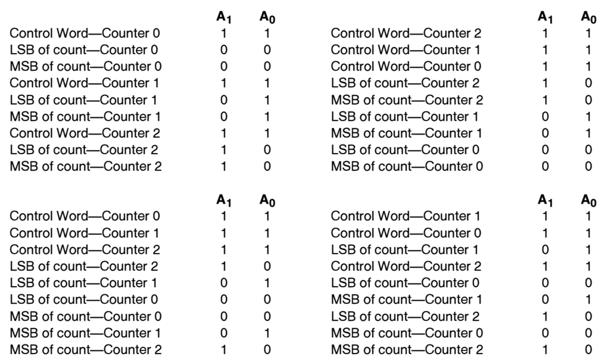
    </div>


### Modes of Operation

每个计数器有 6 种模式：

- 模式 0：在计数最后中断
- 模式 1：硬件重触发的单脉冲(hardware retriggerable one-shot)
- 模式 2：速率发生器(rate generator)（周期性）
- 模式 3：方波发生器(square wave generator)（周期性）
- 模式 4：软件触发的选通(software-triggered strobe)
- 模式 5：硬件触发的选通(hardware-triggered strobe)

每种模式都使用 CLK 输入、门（G）控制信号和 OUT 信号进行工作。

所有模式下都有的操作包括：

- 以下是用于描述 8254 操作的定义：
    - **CLK 脉冲**：计数器 CLK 输入上的上升沿后跟下降沿
    - **GATE 输入**：控制计数器的操作
    - **触发器**：定义 GATE 输入的两个触发事件类型：继续计数和重新开始计数
    - **计数器加载**：计数从计数器寄存器（CR）到计数元素（CE）的传输

- 当控制字写入计数器时
    - 所有控制逻辑立即重置
    - OUT 进入一个已知的初始状态

- 新的初始计数在 CLK 脉冲下降沿加载，计数器递减

{ align=right width=15%}

- 对于在模式 0、<span style="color: red">2</span>、<span style="color: red">3</span>、4 中的触发器
    - GATE 是**电平敏感的**(level-sensitive)，决定计数器是否**继续计数**
    - GATE 输入在 CLK 脉冲的**上升沿**中被采样

{ align=right width=15%}

- 对于在模式 1、<span style="color: red">2</span>、<span style="color: red">3</span>、5 中的触发器
    - GATE 是**上升沿敏感的**(rising-edge sensitive)，决定计数器是否**重新开始计数**
    - GATE 的上升沿在计数器中设置一个边沿敏感的触发器；然后该触发器在下一个 CLK 脉冲上升沿被采样；采样后触发器被重置

- **计数器达到零时不会停止**
    - 在模式 0、1、4、5 中，计数器回到(wrap around)最高计数（FFFF 或 9999），并继续计数
    - 模式 2 和 3 是周期性的；计数器用初始计数重新加载自己，并从那里继续计数

???+ abstract "总结"

    | 模式 | 低电平 | 高电平 | 上升沿 |
    | :--- | :--- | :--- | :--- |
    | 模式 0 | 禁止计数 | 启用计数 | |
    | 模式 1 | | | 发起计数 + 重置输出 |
    | 模式 2 | 禁止计数 | 启用计数 | 发起计数 |
    | 模式 3 | 禁止计数 | 启用计数 | 发起计数 |
    | 模式 4 | 禁止计数 | 启用计数 | |
    | 模式 5 | | | 发起计数 |


#### Mode 0

- 8254 作为事件计数器使用
- 在写入控制字（CW）后（在 WR 上升沿），**OUT 信号变低**，并保持低电平，直到计数器达到零
- 然后，OUT 变高，并保持高电平，直到计数器写入新的计数或新的 CW
- 在将 CW 和初始计数写入计数器后的第一个 CLK 下降沿中，初始计数将被加载（CR -> CE）
- 如果写入一个双字节计数，则发生以下情况：
    - 写入第一个字节将禁用计数。OUT立即设置为低（不需要时钟脉冲）
    - 写入第二个字节允许在下一个CLK脉冲上加载新的计数。

- GATE 输入（G）
    - GATE = 1 启用计数
    - GATE = 0 禁用计数
    - GATE 对 OUT 没有影响

- 如果在计数过程中 G 变为低电平，**计数器将固定不变，直到 G 变为高电平**

<div style="text-align: center">
    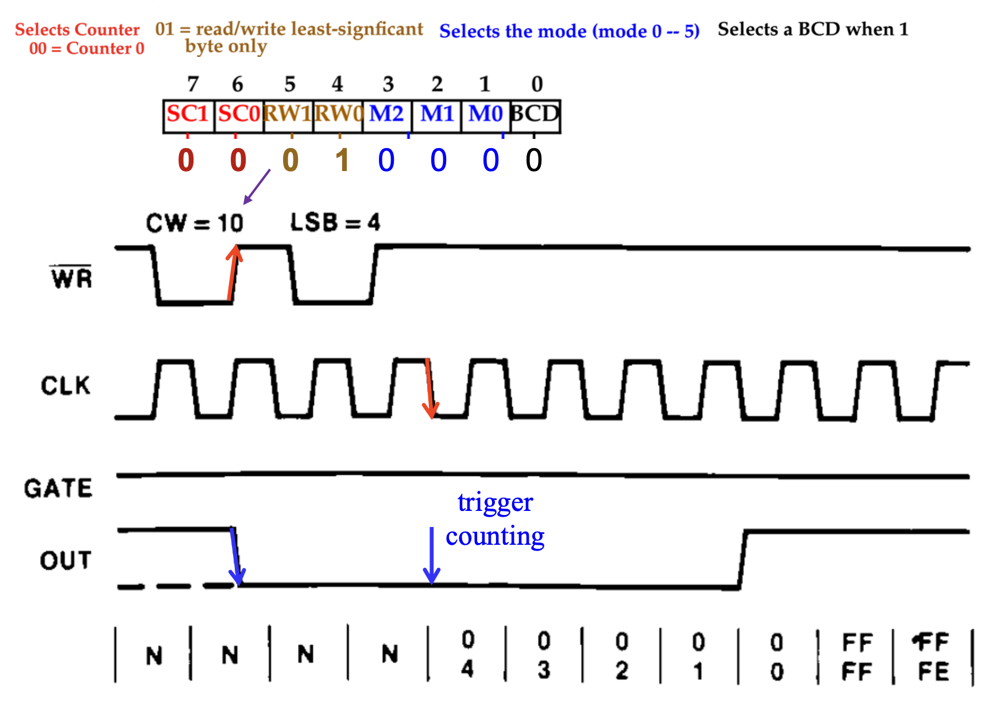
</div>

<div style="text-align: center">
    
</div>

<div style="text-align: center">
    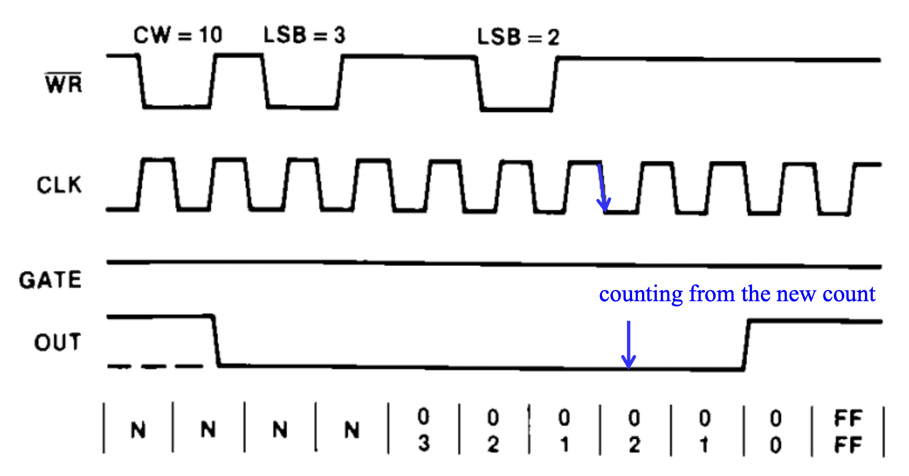
</div>


#### Mode 1

- 该模式使得 8254 作为一个可重触发的，单稳态多谐振荡器(monostable multivibrator)（单脉冲(one-shot)）
- 在写入 CW 后，**OUT 最初为高电平**；在触发（**GATE 的上升沿**）后的 CLK 脉冲中，OUT 将变为低电平，以开始进行单脉冲，并将在计数器达到零之前保持低电平
- 输入 G 触发计数器以输出一个 0 脉冲，持续 count 个时钟周期（**单脉冲**）；如果 G 再次脉冲，计数器将被重新加载
- 触发器在下一个 CLK 脉冲时用初始计数重新加载计数器，单脉冲可以重复使用，无需将相同的计数写入计数器

<div style="text-align: center">
    
</div>

<div style="text-align: center">
    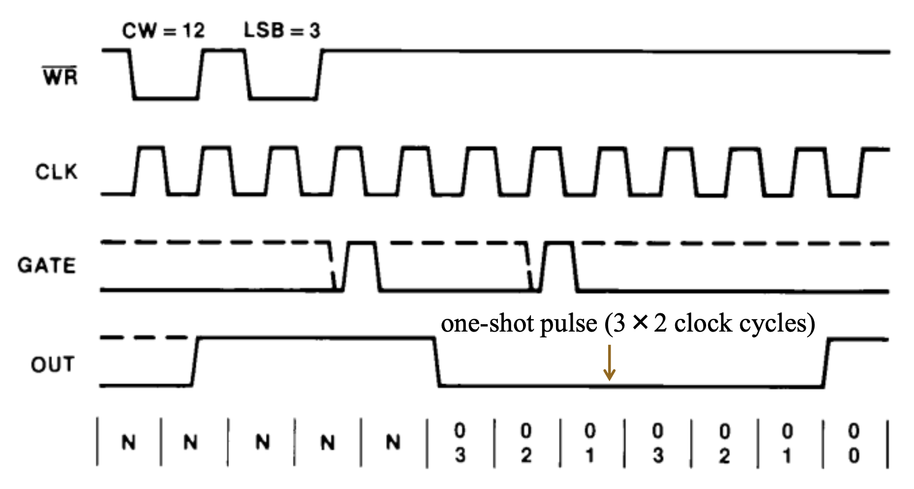
</div>

<div style="text-align: center">
    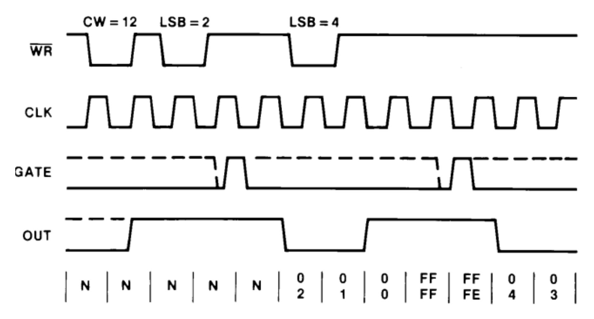
</div>

???+ note "模式 0 vs 模式 1"

    | 模式 | 初始 OUT 状态 | 功能 | 状态变化 | 触发方式 |
    | :--- | :--- | :--- | :--- | :--- |
    | 模式 0 | 低电平 | 计数结束产生中断 | 低 -> 高 | 不可重触发单脉冲 |
    | 模式 1 | 高电平 | 触发后产生单脉冲 | 高 -> 低 -> 高 | 硬件可重触发单脉冲 |


#### Mode 2

模式 2 中的 8254 像一个除以 N 的计数器：

- 初始时，OUT 为高
- 当初始计数递减到 1 时，OUT 在下一个 CLK 脉冲期间变低（占空比(duty cycle) = (N - 1) / N）
- GATE = 1 启用计数；如果 GATE 在输出脉冲期间变低，OUT 将立即置高
- 触发器在下一个 CLK 脉冲时将初始计数重新加载到计数器
- 循环重复，直到计数器被编程为新的计数或直到引脚 G 置 0

<div style="text-align: center">
    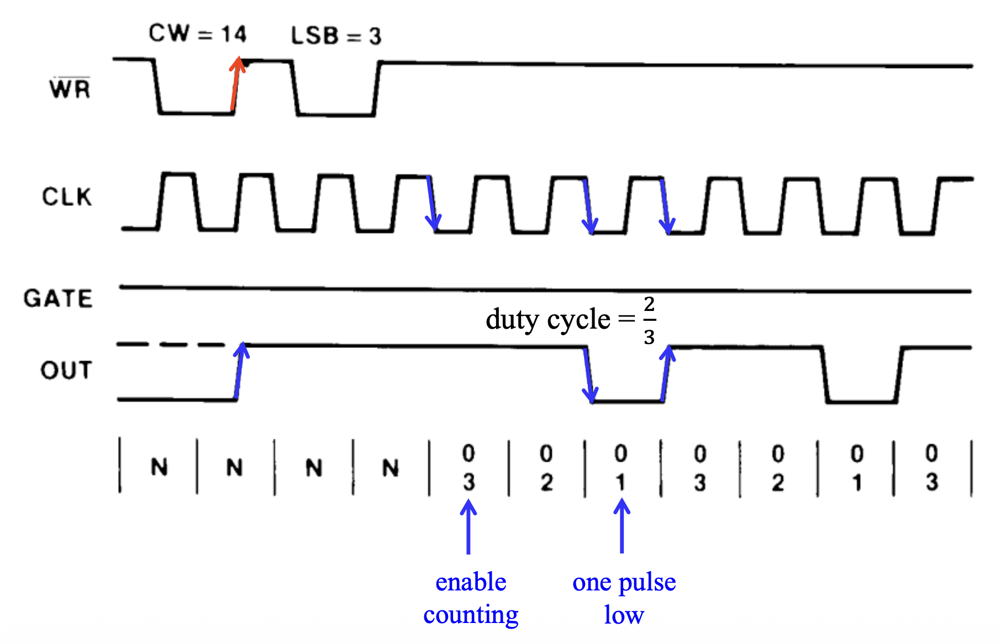
</div>

<div style="text-align: center">
    
</div>


#### Mode 3

- 在 OUT 连接处生成连续的方波，前提是引脚 G 为逻辑 1
- OUT 初始状态为高电平
    - 偶数计数：占空比为 50 %
    - 奇数计数：(N+1) / 2 次高电平计数和 (N-1) / 2 低电平计数
    - 因此占空比为 1/2 或 (N+1) / 2N

<div style="text-align: center">
    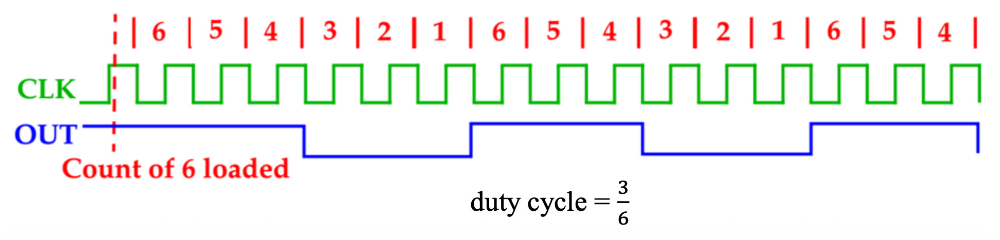
</div>


#### Mode 4

- OUT 初始为高电平；当初始计数到期(expire)时，OUT 将在时钟脉冲 CLK 下降沿变低，然后再次变高
- 在将 CW 和初始计数写入计数器后的第一个 CLK 下降沿，初始计数将被加载（CR -> CE）
- 计数序列通过写入初始计数来“触发”，作为一个软件触发的单脉冲
- 如果 GATE 的采样结果为高，则在下降沿递减计数器，否则保持不变

<div style="text-align: center">
    
</div>


#### Mode 5

- 一个硬件触发的单次触发器，其功能和模式 4 一致，区别在于它是由引脚 G 上的触发脉冲启动，而不是由软件启动
- OUT 最初为高电平；**计数由 GATE 的上升沿触发**；当初始计数到期时，OUT 将在一个 CLK 脉冲中变低，然后再次变高
- 此模式也与模式 1 相似（因为可以重新触发）

<div style="text-align: center">
    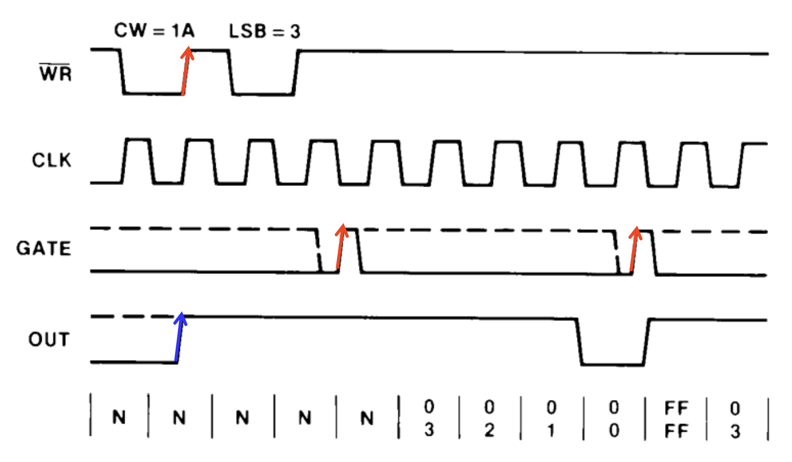
</div>


### Generating a Waveform with the 8254

下图展示了一个连接到 80386SX 的 I/O 端口的 0700H、0702H、0704H 和 0706H 的 8254 芯片，它能够产生一个方波和一个连续脉冲：

<div style="text-align: center">
    
</div>

- 使用为 8254 生成一个连接到低位数据总线连接的写选通信号的 PLD 译码地址
- PLD 还生成一个等待信号，当访问 8254 时，产生两个等待状态
- 下面列出了生成 OUT0 上 100 KHz 方波和 OUT1 上 200 KHz 连续脉冲的程序，输入时钟为 8 MHz
    - 计数器 0 使用模式 3，计数 80（8M/100K）
    - 计数器 1 使用模式 2，计数 40（8M/200K）

<div style="text-align: center">
    
</div>


### Reading a Counter

- 每个计数器都有一个内部锁存器，通过读取计数器端口操作进行读取
    - 锁存器通常会跟随计数
- 读取计数器的三种方法：
    - **简单读取操作**
    - **计数器锁存命令**(counter latch command)
    - **读回命令**(read-back command)


#### A Simple Read Operation

- 要读取计数器，该计数器通过 A1、A0 输入选择，所选计数器的 CLK 输入**必须通过使用 GATE 输入或外部逻辑来禁止**
- 否则，当读取时，计数可能正处于变化过程中，导致结果未定义


#### Counter Latch Command

- 计数器锁存命令写入控制字寄存器；SC0、SC1 位选择三个计数器中的一个，D5、D4 位用 00 指定计数器锁存命令

    <div style="text-align: center">
        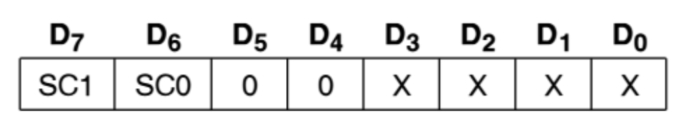
    </div>

- 所选计数器的输出锁存器（OL）在接收到计数器锁存命令时锁存当前计数；该计数将保持不变，直到被 CPU 读取（或直到计数器重新编程），然后返回到“跟随” CE 状态
- 下图展示了 8254-2 计数器锁存的控制字：

    <div style="text-align: center">
        
    </div>

- 计数必须按照编程格式读取；具体来说，如果计数器编程为两个字节的计数，则必须读取两个字节
    - 例如，以 40H-43H 端口号从 8254 的 2 号计数器读取计数的前提是需要编程为两个字节的计数

        ```asm
        MOV AL, 10000000B   ; count latch command
        OUT 43H, AL
        IN AL, 42H          ; read least significant byte
        MOV AH, AL
        IN AL, 42H          ; read most significant byte
        XCHG AH, AL         ; reverse the byte order
        ```


#### Read-Back Command

- 当需要同时读取不止一个计数器的内容时，使用**读回控制字**
- 此命令允许用户检查**计数值**、**编程模式**和**所选计数器的 OUT 引脚**和**空计数标志**的当前状态
- 空计数标志指示计数器是否已正确初始化，或者是否已向其写入计数值
- 下图展示了 8254-2 读回的控制字：

    <div style="text-align: center">
        
    </div>

- 如果计数器的计数和状态都被锁存：
    - 第一次读取操作将返回锁存状态
    - 下一个或两个读取操作返回锁存计数

- 使用读回控制字时，$\overline{\text{COUNT}}$ 位为逻辑 0，以使由 CNT0、CNT1 和 CNT2 选择的计数器被锁存
- 如果**状态寄存器**(status registers)要被锁存，则该位设置为逻辑 0；下图给出状态寄存器，包括：

    <div style="text-align: center">
        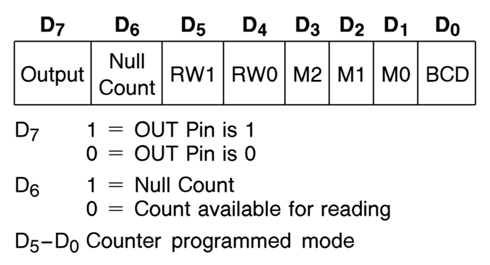
    </div>

    - 输出引脚的状态
    - 计数器是否处在空状态（0）
    - 计数器是如何被编程的

???+ example "例子"

    <div style="text-align: center">
        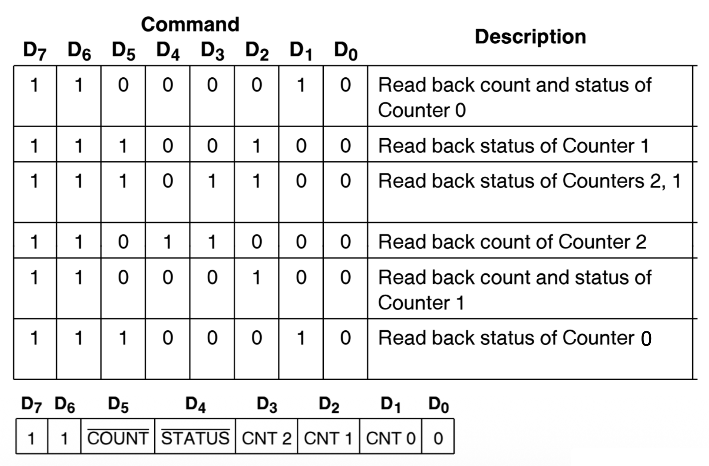
    </div>


### DC Motor Speed and Direction Control

- **脉宽调制**(pulse-width modulation, **PWM**)或**占空比变化**(duty cycle variation)方法由于功耗小，常用于直流电机(DC motors)的速度控制
- 随着占空比增大，平均电流增大，电机速度增加

<div style="text-align: center">
    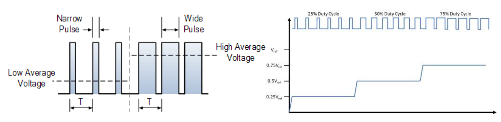
</div>

通过用 **H 桥**(H-bridge)驱动，可以使直流电机在顺时针或逆时针方向运行。

- 四个开关（继电器或晶体管）围绕直流电机以 H 形排列
- 当 S1 和 S4 打开时，电机以顺时针方向运行
- 当 S2 和 S3 打开时，电机以逆时针方向运行

<div style="text-align: center">
    
</div>

???+ example "例子"

    === "例1"

        使用 8254 定时器控制电机速度和方向：

        <div style="text-align: center">
            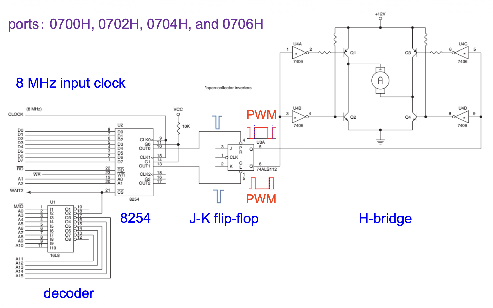
        </div>

        - 如果 Q = 1，电机正向旋转
        - 如果 Q = 0，电机反向旋转
        - 如果 FF 输出在 1 和 0 之间交替，电机以不同速度在两个方向旋转
        - 如果占空比为 50%，电机不会旋转

    === "例2"

        下图展示了一些时序图和电机速度/方向的影响：

        <div style="text-align: center">
            
        </div>

        - 每个计数器在不同的位置产生脉冲，以改变触发器 Q 输出的占空比
        - 该输出也称为脉冲宽度调制
        - 为了生成这些波形，计数器 0 和 1 都编程在模式 2 中，以将输入时钟分频 30,720
        - 我们通过改变计数器 1 启动点相对于计数器 0 的位置来改变 Q 的占空比，从而改变电机的方向和速度
            - 输入时钟：8 MHz
            - 初始计数：30,720
            - 电机运行频率：260 Hz（8M/30,720）
            - PWM 级别：256 种不同速度（PWM 120 级 的 120个计数 = 30,720 / 256）
            - 速度值：AH（占空比 = AH/256）
                - AH < 128，反向旋转
                - AH > 128，正向旋转

    === "例3"

        下面给出一个控制电机速度和方向的程序。其中 AH 用于确定电机的速度和方向，其值介于 00H 和 FFH 之间。

        <div style="text-align: center">
            
        </div>


## 16550 Programmable Communications Interface

**串行通信**(serial communication)是逐位发送/接收数据的过程。


### Basic Concepts

#### Three Modes of Transmission

三种传输模式：

- **单工**(simplex)模式：数据只能从发射器(transimitter)传输到接收器，反之则不行
- **半双工**(half duplex)模式：数据传输一次只能在一个方向进行
- **全双工**(full duplex)模式：数据可以同时从主设备传输到从设备，也可以从从设备传输到主设备


#### Steps of Serial Communication

串行通信的步骤：

<div style="text-align: center">
    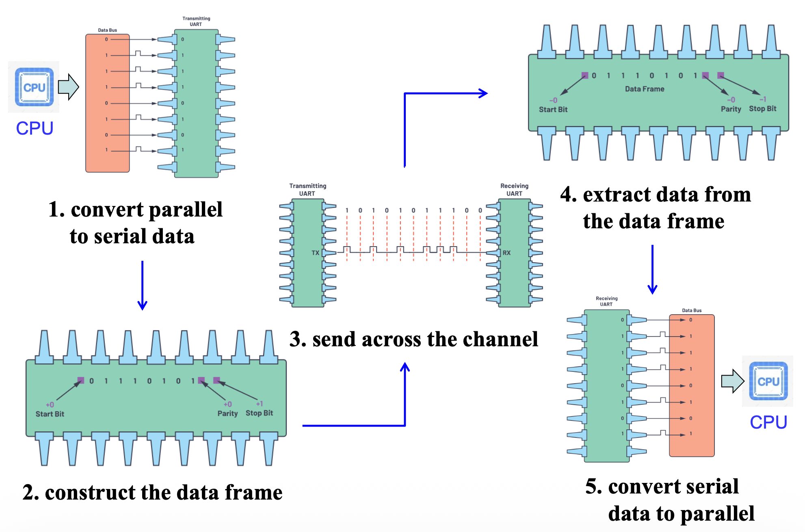
</div>

1. 将并行数据转换为串行数据
2. 构造数据帧
3. 沿通道发送
4. 从数据帧中提取数据
5. 将串行数据转换为并行数据


#### Clocks and Timing

- 在**发送端**，使用**时钟**驱动移位寄存器，将每个位时钟输出到物理层接口
- 在**接收端**，同样需要一个时钟将数据时钟输入到接收移位寄存器，要求必须识别每个位的时序(timing)
    - 在实际应用中，最好识别位的中心，因为这通常表示信号功率的最大点

<div style="text-align: center">
    
</div>


#### Synchronous and Asynchronous

有两种时钟时序解决方案：

- **异步**(asynchronous)通信：
    - 发送方和接收方不共享一个公共时钟，各自以一个预定的标称(nominal)频率（称为**波特率**(baud rate)）运行
    - 每个槽(slot)/字符单独同步
    - 需要**起始位**和**停止位**来提供字节时序
- **同步**(synchronous)通信：
    - 发送方和接收方使用同步的时钟（保持相位一致）
    - 通常使用专用全局时钟(dedicated global clock)（**基于时钟的方法**）或锁相环(phase-locked loop)（**主从基于的方法**）来恢复时钟
    - 不使用起始位或停止位

<div style="text-align: center">
    
</div>


#### UART and USART

UART 和 USART 是将并行数据转换为串行数据的硬件。

- **UART**（通用异步接收发射器(universal asynchronous receiver
transmitter)）仅支持**异步**模式
- **USART**（通用同步异步接收发射器(universal synchronous asynchronous
receiver transmitter)）同时支持**异步**和**同步**模式

<div style="text-align: center">
    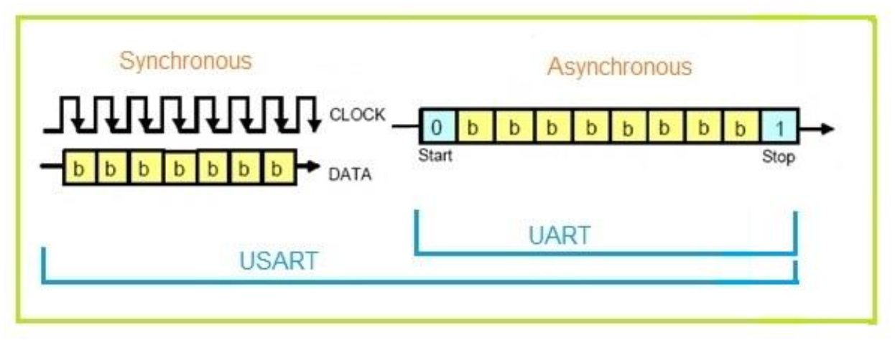
</div>

---
<div style="text-align: center">
    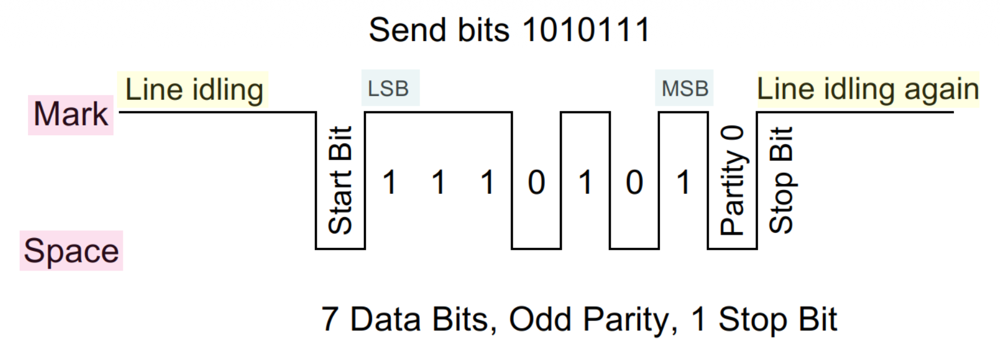
</div>

- UART 发送数据时先发送**最低位**；位是从最低位到最高位依次串行传输的
- UART 没有定义逻辑电平的具体电压或电压范围：
    - 高电平也称为「**标记**」(mark)”，低电平称为「**空格**」(space)

- 注意，在空闲状态下，线路保持高电平，这使得检测损坏线路更容易


#### Signal Encoding

**非归零**(non-return zero, **NRZ**)编码通常用于同步和异步传输的串行通信中。

<div style="text-align: center">
    
</div>


#### Asynchronous Data Transfer Protocol

**异步数据传输协议**(asynchronous data transfer protocol)以数据包的形式存在，包含一个起始位、数据帧、一个奇偶校验位和停止位。

<div style="text-align: center">
    
</div>


#### Baud Rate

- **波特率**(baud rate)是每秒传输的比特数，以 **bps**（每秒比特）来衡量
- 波特单位以法国工程师 Jean-Maurice-Emile Baudot 的名字命名，他是异步电报打印机的发明者
- 例如，在 9600 波特系统中，一个比特需要 1 / (9600 bps) ≈ 104.2 μs
    - 实际上，该系统无法每秒传输 9600 个有意义的数据位，因为还需要额外时间用于**开销位**(overhead bits)，可能还有**字节传输之间的延迟**

- 在异步通信中，接收方的目标是使用其内部**波特时钟**(baud clock)（**BCLK**）在每个比特周期的中间采样数据

    <div style="text-align: center">
        
    </div>

- 接收器中的 BCLK 频率比实际波特率高得多（高出 8 倍、 16 倍甚至 32 倍）
- 这个过采样因子(oversampling factor)称为**波特率除数**(baud rate divisor)

<div align=center markdown="1">
BLCK = 波特率 * 波特率除数
</div>

---
UART 包含一个可编程的波特率生成器，该生成器接收输入时钟并通过**除数**进行划分，以产生 BCLK。

<div align=center markdown="1">
除数 = 输入时钟频率 /（波特率 * 波特率除数）
</div>

<div style="text-align: center">
    
</div>

???+ abstract "数据位、BCLK 和输入始终的关系"

    <div style="text-align: center">
        
    </div>


#### Asynchronous Serial Data

**异步串行数据**(asynchronous serial data)在没有时钟或定时信号的情况下进行传输和接收。

以下数据以异步方式发送，格式如下：

<div style="text-align: center">
    
</div>

- 首先发送一个值始终为 0 的**起**始位
- 接着发送 5 到 8 位数据；首先发送**最低位**
- 数据位之后可能跟随一个**奇偶校验位**，以提供错误检查功能
- 最后，1 个或多个**停止位**将此字符与下一个字符分开


### 16550 Programmable Communications Interface

国家半导体公司的 PC16550D 是一种可编程的通信接口，旨在连接几乎任何类型的串行接口。而 **16550** 是一种通用异步接收器/发射器（UART），与英特尔微处理器完全兼容。


#### Basic Functional Description

- 16550 在 0–1.5 M 波特率下工作
- 16550 包含一个**可编程的波特率生成器**，它将输入时钟分频以产生 BCLK，其频率是波特率的十六倍（**16x**）
- 在 FIFO 模式下，发射器和接收器各自使用 16 字节的 FIFO 缓冲，以帮助 CPU 应对数据**突发**(bursts)

- 完全可编程串行接口的特性：
    - 字符数为 5-8 位
    - 偶数/奇数/无奇偶校验的位生成和检测
    - 1/1.5/2 位的停止位生成

- MODEM 控制功能（CTS，RTS，DSR，DTR，RI 和 DCD）
- 状态报告（奇偶校验，溢出，帧错误）
- 诊断能力
    - 错误起始位检测
    - 行中断生成和检测

下图展示了 16550 UART 的引脚布局：

<div style="text-align: center">
    
</div>

- 该设备可作为 40 个引脚的 DIP（**双列直插式封装**(dual in-line package)）或 44 个引脚的 PLCC（**塑料无引脚芯片载体**(plastic leadless chip carrier)）提供
- **接收器**和**发射器**是负责数据通信的两个完全独立的区域；因为每个区域都是独立的，所以 16550 能够以单工、半双工或全双工模式运行
- 16550 的一个主要特点是其内部接收器和发射器 **FIFO 存储器**
    - 内存容量为 16 字节，所以 UART 只在接收到 16 字节数据后才需要处理器的关注；在处理器必须等待发射器之前，还可以保存 16 字节
    - FIFO 使得 UART 在与高速系统接口时非常理想，因为所需的服务时间更少

- 16550可以控制**调制解调器**(modem)（调制器/解调器(modulator/demodulator)）；它一种将 TTL 串行数据转换为音频信号以通过电话线传输的设备

    <div style="text-align: center">
        
    </div>

    - 16550 中用于控制调制解调器的引脚：
        - $\overline{\text{DSR}}$：数据设置就绪(data set ready)
        - $\overline{\text{DTR}}$：数据终端就绪(data terminal ready)
        - $\overline{\text{CTS}}$：清除以发送(clear-to-send)
        - $\overline{\text{RTS}}$：请求发送(request-to-send)
        - $\overline{\text{RI}}$：环指示器(ring indicator)
        - $\overline{\text{DCD}}$：数据载体检测(data carrier detect)

    - 调制解调器被称为数据集，而 16550 被称为数据终端


#### Pin Functions

- $A_0, A_1, A_2$（**地址输入**(address input)）：选择用于编程和数据传输的内部寄存器

    <div style="text-align: center">
        
    </div>

    <div style="text-align: center">
        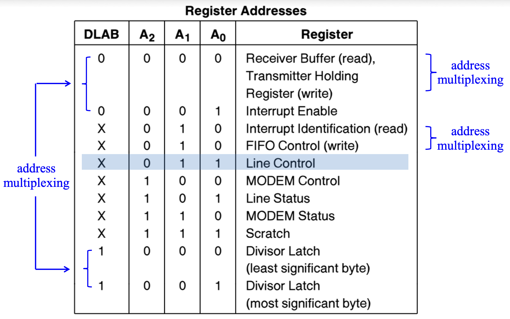
    </div>

    请注意，**除数锁存器访问位**(divisor latch access bit, **DLAB**)的状态，即**行控制寄存器**(line control register)的最高位，必须设置为高电平才能访问波特率生成器除数锁存器

- $\overline{\text{ADS}}$（**地址选通**(address strobe)）：锁存地址线路和芯片选择线路
    - 当 $A_0, A_1, A_2, \text{CS}_0, \text{CS}_1, \text{CS}_2$ 在读/写操作期间不稳定时需要该输入
    - 注意：该引脚用于 Motorola（摩托罗拉）微处理器，而不是用于 Intel 系统的；若无必要，可将该输入永久设为低电平

- $\text{CS}_0, \text{CS}_1, \overline{\text{CS}}_2$（**芯片选择**(chip select)）：必须全部激活才能启用 16550 UART
- $\text{XIN}, \text{XOUT}$：
    - 主要时钟连接
    - 一个晶体连接在这些引脚上，形成一个晶体振荡器(crystal oscillator)；或者 $\text{XIN}$ 连接到外部时钟源

- $D_0$-$D_7$（**数据总线**(data bus)）：和微处理器的数据总线连接
- $\text{RD}, \overline{\text{RD}}$：两者中只需要其中一个活跃的输入，即可通过读操作从 16550 传输数据
- $\text{WR}, \overline{\text{WR}}$：两者中只需要其中一个活跃的输入，即可通过写操作向 16550 传输数据
- $\text{SIN}, \text{SOUT}$（串行数据引脚(serial data pin)）：分别用于接收/传输串行数据
- $\overline{\text{BAUDOUT}}$（**波特输出**(baud out)）：由发射部分的波特率生成器产生的时钟信号可用的位置
    - 它通常连接到 $\text{RCLK}$ 输入，以生成一个等于发射器时钟的接收器时钟

- $\overline{\text{RCLK}}$（**接收器时钟**(reciever clock)）：UART 接收器部分的时钟输入
- $\text{MR}$（**主重置**(master reset)）：初始化 16550，应和系统的 RESET 信号连接
- $\text{INTR}$（**中断请求**(interrupt request)）：用于请求中断的微处理器的输出；当 16550 接收器出现错误时，它已接收数据，并且发送器为空


#### Registers

- 通信控制
    - 线路控制寄存器(line control register)
    - 线路状态寄存器(line status register)
    - 除数最低位寄存器(divisor LSB register)
    - 除数最高位寄存器(divisor MSB register)
- 数据传输
    - 接收器缓冲区寄存器(receiver buffer register)（只读）
    - 发送器保存寄存器(transmitter holding register)（只写）
    - FIFO 控制寄存器(FIFO control register)（只写）
- 中断/调制解调器控制
    - 中断使能寄存器(interrupt enable register)
    - 中断标识寄存器(interrupt identification register)
    - 调制解调器控制寄存器(modem control register)
    - 调制解调器状态寄存器(modem status register)


#### Block Diagram

<div style="text-align: center">
    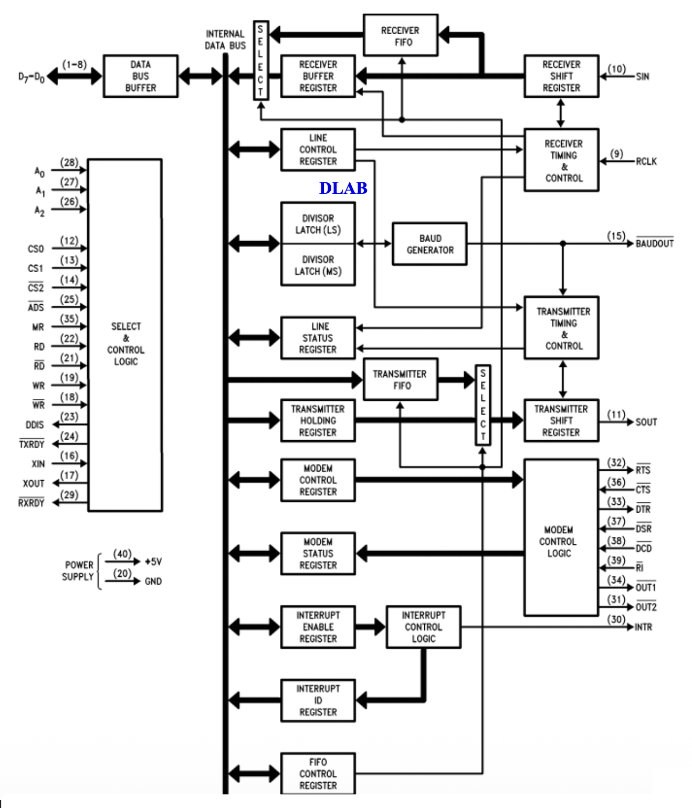
</div>


#### Programming

编程是一个两步过程：

- **初始化**（设置）(initialization(setup))
    - 为设置所需的波特率，对波特率发生器编程
    - 编程线路控制寄存器，以设置传输参数（停止位、数据位和奇偶校验位等）
- **操作**(operation)
    - 清除发送器和接收器 FIFOs
    - 实际通信

在使用 16550 或其编程等效物的 PC 中，在 3F8H-3FFH 的 I/O 端口地址译码为 COM 端口 0，在 2F8H - 2FFH 译码为 COM 端口 2。

---
- 硬件或软件重置后的**初始化**对话，由两个部分组成：
    - 编程**波特率生成器**：通过一个除数进行编程，该除数决定发射部分的波特率
    - 编程**线路控制寄存器**：选择数据位、停止位和奇偶校验（是偶数还是奇数，或者如果发送奇偶校验时为 1 或 0）

- **线路控制寄存器**通过将信息输出到端口 011（$A_2, A_1, A_0$）进行编程
- 最右边的两个位（$L_1, L_0$）选择传输的**数据位**数（5、6、7 或 8）
- **停止位**的数量由线路控制寄存器中的 $S$ 选择：
    - S = 0：使用 1 个停止位
    - S = 1：数据位数为 5 时使用 **1.5 个停止位**，数据位数为 6/7/8 时使用 **2 个停止位**

    <div style="text-align: center">
        
    </div>

控制线路寄存器的内容：

<div style="text-align: center">
    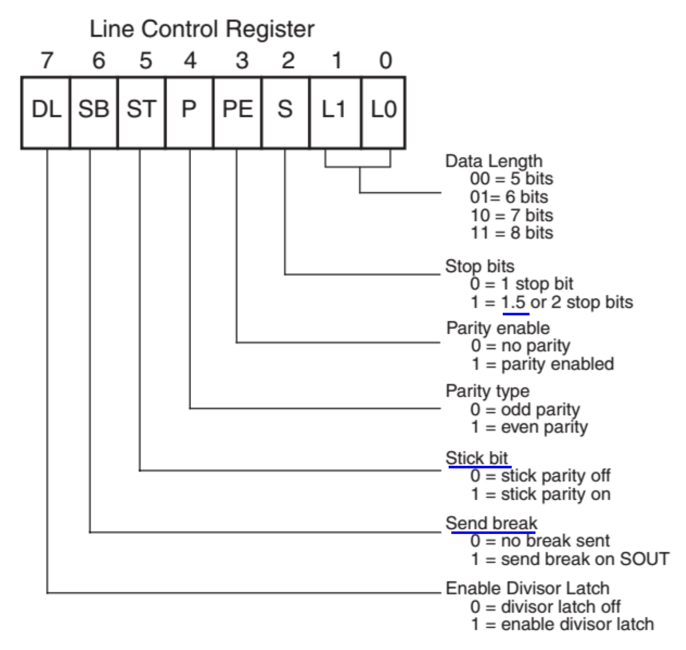
</div>

- 停止位 S
- ST、P 和 PE 分别用于发送偶/奇校验，发送无校验，或者在所有数据的校验位位置发送 1 或 0

    <div style="text-align: center">
        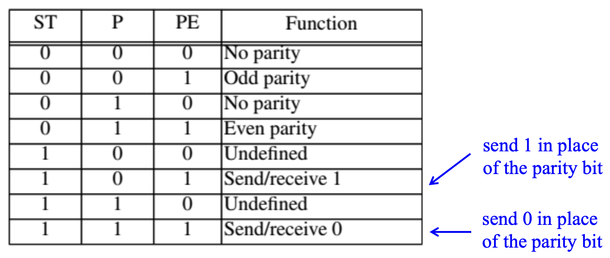
    </div>

- SB = 1 导致在 SOUT 上传输一个中断(break)（至少包含 2 帧 0 数据）
- DL = 1 启用波特率除数编程

---
- **波特率生成器**被编程在 I/O 地址 000 和 001（$A_2, A_1, A_0$）
    - 端口 000 用于保存 16 位除数的最低位部分，端口 001 用于保存最高位部分
    - 除数使用的值取决于外部时钟或晶体频率
        - 对于 18.432MHz 的晶体，10,473 给出 110 波特率，30 给出 38,400 波特

        <div style="text-align: center">
            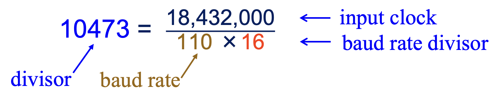
        </div>

- 在将线路控制寄存器和波特率除数编程到 16550 之后，它仍然无法正常工作，因为还需要在端口 010 上对 **FIFO 控制寄存器编程**
    - 该寄存器启用发射器和接收器（位0）并清除 FIFO（位1、2）
    - 还提供对 16550 中断的控制

    <div style="text-align: center">
        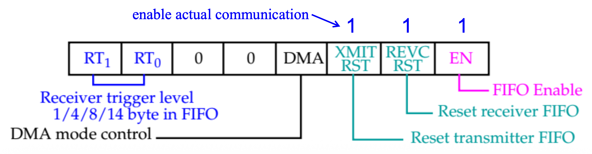
    </div>

初始化 16550 的具体步骤如下：

<div style="text-align: center">
    
</div>

---
下图展示了 8088 微处理器的接口（使用 PLD 译码 8 位端口地址 F0H-F7H）：

<div style="text-align: center">
    
</div>

---
假设一个异步系统需要 7 个数据位，奇校验，波特率为 9600，以及一个停止位。下面列出了初始化以这种方式工作的 16550 的过程：

<div style="text-align: center">
    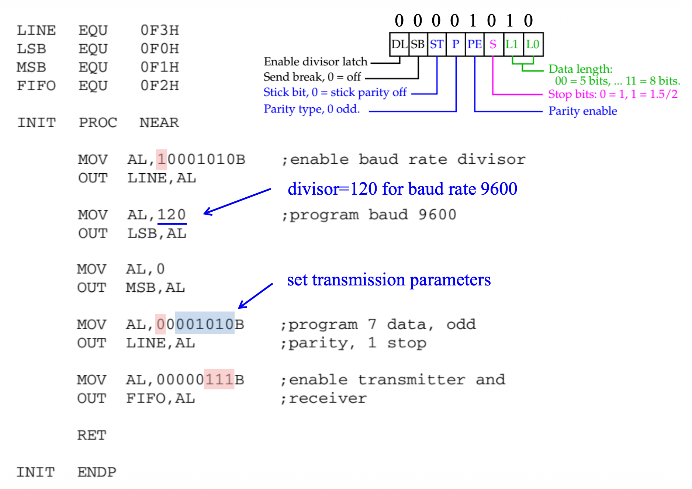
</div>

- 将 7 放在 FIFO 控制寄存器
- 这使得发射器和接收器能够工作，并且清空了它们各自的 FIFO
- 16550 现在准备好操作，但没有中断
    - 当系统 RESET 信号将 $\text{MR}$（主复位）输入置为逻辑 1 时，中断会自动禁用

---
在发送或接收串行数据之前，我们需要了解**线路状态寄存器**的功能。它包含有关错误条件和发射器及接收器状态的信息。在传输或接收字节之前，会检测此寄存器。

下图展示了该寄存器的内容：

<div style="text-align: center">
    
</div>

下面列出了将 AH 的内容传输到 16550 的过程（通过轮询 TH 位来确定发射器是否准备好接收数据）。

<div style="text-align: center">
    
</div>

要读取来自 16550 的信息，需要测试线路状态寄存器的 DR 位。

能在 16550 检测到的错误包括：奇偶校验错误、帧错误和溢出错误。这些错误在正常操作期间不应发生。

- **奇偶校验错误**(parity error)：接收到的数据包含错误的奇偶校验
    - 如果发生奇偶校验错误，表明在接收过程中遇到了噪声

- **帧错误**(framing error)：起始位和停止位不在正确的位置
    - 当接收器以不正确的波特率接收数据时会发生此情况

- **溢出错误**(overrun error)：数据已超出内部接收器 FIFO 缓冲区的容量
    - 仅当软件未能在接收器 FIFO 满之前从 UART 读取数据时才会发生

???+ example "例子"

    下面列出了一个测试 DR 位以决定 16550 是否接收到任何数据的过程：

    <div style="text-align: center">
        
    </div>

    - 在接收数据后，该过程会检测错误
        - 如果检测到错误，过程将返回 AL 等于 ASCII `?`
        - 如果没有发生错误，过程将返回 AL 等于接收到的字符