# The Microprocessor and its Architecture

??? abstract "核心知识"

    即便之前修过小白老师的汇编语言课，感觉本章内容还是好多呀...

    - 各种寄存器的用法（通用/特殊/段寄存器）
    - 操作模式
        - 长模式：64 位模式、兼容模式
        - 传统模式：保护模式、虚拟 8086 模式、实模式
    
    - 内存管理：
        - 需求：重定位、保护、共享
        - 方案：分段/分页
    
    - 实模式内存寻址：段/偏移地址、地址回滚
    - 保护模式内存寻址：
        - （全局/局部/中断）描述符
        - 段选择器
        - 特权级别（DPL/RPL/CPL）
        - 寄存器
        - 内存模型（多段/平坦内存）
    
    - 内存分页模型：
        - 4 种地址
        - 多级分页
        - 保护位
        - 控制寄存器（CR0-CR4）
        - 传统模式分页：两级分页（10-10-12）、PSE、PAE
        - 杂项：长模式分页模式、MMU、TLB、自引用项

## Internal Microprocessor Architecture

在编写程序或调查指令前，必须要知道微处理器的内部配置。在一个多核微处理器中，每个核包含了相同的编程模型，并且同时运行一个独立的任务或线程。编程模型可分为：

- 8086 到 Core2 的处理器都被视为**程序可见的**(program visible)：寄存器用于编程中，并且由指令指明
- 其他寄存器都被视为**程序不可见的**(program invisible)：在应用程序编程期间无法直接寻址
  
<!-- === "IA-32 基础执行环境"

    

        
    

=== "64 位模式执行环境"

    

        
    

应用程序寄存器和栈：

    

 -->

### General-Purpose Registers

??? abstract "总结"

    >注：如果是初学汇编语言的话，建议先往下阅读，最后复习的时候再来看这张表会更有感觉。

    | 寄存器 | 名称 | 常见用途 |
    | :--- | :--- | :--- |
    | A | 累加器(accumulator) | 返回值，特别是算术运算的和 |
    | B | 基址变址(base index) | 数组或列表结构的起始点 |
    | C | 计数器(counter) | 用于循环，其作用类似 `#!c for(int i=0; i<9; i++)` 中的 `i` |
    | D | 数据(data) | 累加器的扩展空间（例如在 32 位模式下的乘法指令 `#!asm IMUL` 会结合 `EDX+EAX` 来处理 64 位数值） |
    | BP | 基址指针(base pointer) | 指向当前栈帧地址的指针（即函数参数结束和局部变量开始的位置） |
    | SP | 栈指针(stack pointer) | 指向最后压入（`#!asm PUSH`）内存的字节地址的指针 |
    | SI | 源索引(source index) | 无界流数据的起始点，特别是字符串 |
    | DI | 目的索引(destination index) | 无界数据的终点，特别是在切片操作中 |

- **RAX**
    - 包括了一个 64 位的寄存器（`RAX`），一个 32 位的寄存器（`EAX`，又称为**累加器**(accumulator)），一个 16 位的寄存器（`AX`），两个 8 位的寄存器（`AH`, `AL`）

        <figure style=" width: 50%" markdown="span">
            
            
            <figcaption></figcaption>
        </figure>

    - 在汇编语言中，**部分寄存器**(partial registers)指的是仅表示大寄存器中一小部分的寄存器。这一概念尤其在 x86 汇编中具有重要意义，其中某些寄存器可以根据架构以不同大小（8位、16位、32位和64位）进行访问
    - 累加器用于乘法、除法以及一些调整指令等指令

        

            
        

        - 在 `ADD` 指令中使用 `EAX` 相比使用其他寄存器少 1 字节，因此它具有更高的代码密度，并且更对高速缓存更友好(cache-friendly)

- **RBX**
    - 类似 `RAX`，可寻址为 `RBX`, `EBX`, `BX`, `BH`, `BL`
    - 在所有版本的微处理器中，`BX` 寄存器（**基址索引**(base index)）有时持有内存系统中某个位置的偏移地址
  
- **RCX**
    - 类似 `RAX`，可寻址为 `RCX`, `ECX`, `CX`, `CH`, `CL`
    - 一个（**计数**(count)）通用寄存器，用于存放各种指令的计数值
  
- **RDX**
    - 类似 `RAX`，可寻址为 `RDX`, `EDX`, `DX`, `DH`, `DL`
    - 一个（**数据**(data)）通用寄存器，作为[乘法](5.md#multiplication)中**积**的高位部分，或[除法](5.md#division)中**被除数**的高位部分等

- **RBP**
    - 可寻址为 `RBP`, `EBP` 或 `BP`
    - **基指针**(base pointer)，指向当前栈帧(stack frame)的基址

- **RSI**
    - 可寻址为 `RSI`, `ESI` 或 `SI`
    - **源索引**(source index)，为字符串指令寻址源字符串数据

- **RDI**
    - 可寻址为 `RDI`, `EDI` 或 `DI`
    - **目标索引**(destination index)，为字符串指令寻址目标字符串数据

>注：低 8 位寄存器 `BPL`、`SPL`、`SIL` 和 `DIL` 仅在 64 位模式下可被寻址

- **R8 - R15** 出现在启用 64 位扩展的处理器中。对于大多数指令，访问这些扩展通用寄存器需要一个 **`REX` 前缀**
- 在 64 位模式下，通用目的寄存器包括：
    - 16 个 8 位低字节寄存器：`AL`, `BL`, `CL`, `DL`, `SIL`, `DIL`, `BPL`, `SPL`, `R8B`-`R15B`
    - 4 个 8 位高字节寄存器：`AH`, `BH`, `CH`, `DH`，且仅当**没有 `REX` 前缀**时才可寻址
    - 16 个 16 位低字节寄存器：`AX`, `BX`, `CX`, `DX`, `DI`, `SI`, `BP`, `SP`, `R8W`-`R15W`
    - 16 个 32 位低字节寄存器：`EAX`, `EBX`, `ECX`, `EDX`, `EDI`, `ESI`, `EBP`, `ESP`, `R8D`-`R15D`
    - 16 个 64 位低字节寄存器：`RAX`, `RBX`, `RCX`, `RDX`, `RDI`, `RSI`, `RBP`, `RSP`, `R8`-`R15`
  
可以看到，大多数的 x86 寄存器能以多种粒度(multiple granularities)形式被访问。

!!! warning "注意"

    修改 32 位部分寄存器会将寄存器的其余部分（即第 32-63 位）设置为 0，但修改 8 位或 16 位部分寄存器不会影响寄存器的其余部分。

    ???+ example "例子"

        

            
        

Intel, AMD, VIA（威盛）CPU 都无法对部分寄存器重命名。

???+ example "例子"

    

        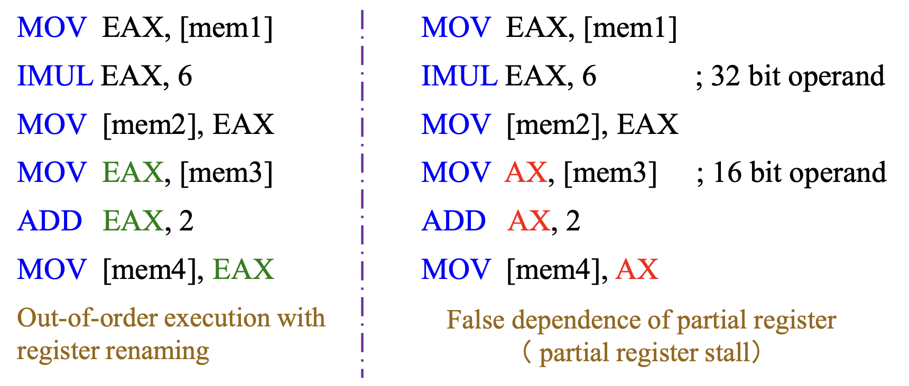
    

    - `#!asm MOV AX, [mem3]` 指令必须等待 `#!asm IMUL` 指令完成，因为 `AX` 和 `EAX` 存在数据依赖，无法像左边的指令序列那样通过寄存器重命名（比如后三条指令的 `EAX` 换成 `EDX`）实现乱序执行，从而执行效率低下
    - 对于左侧的代码，指令 `#!asm MOV EAX, [mem3]` 完全重置了 `RAX` 的值，这意味着 `EAX` 中的新值不依赖于 `RAX` 的先前值，从而开始了一条全新的、独立的依赖链，缩短了整体链，并使 CPU 能够利用寄存器重命名来支持乱序执行

### Special-Purpose Registers

**特殊目的寄存器**(special-purpose registers)包括：

- **RIP**（**指令指针**(instruction pointer)）：指向内存中下一段指令的地址，定义为一个代码段(code segment)
    - 对应 RISC-V 的程序计数器 `pc`
- **RSP**（**栈指针**(stack pointer)）：指向一个称为栈的内存区域，通过此指针存储数据
- **RFLAGS**：表示微处理器的**状态**，并控制其操作

    

        
    

    - 标志位是向上兼容的
    - 图中蓝字标出的标志位在大多数的**算术和逻辑运算**中被改变
    - 绝大多数标志位都**不会**为**数据传输和程序控制**操作所改变
    - 一些标志也用于控制微处理器中的功能
    - 状态标志：
        - **C**（第 0 位）：**进位**标志，保存加法后的进位或减法后的借位
        - **Z**（第 6 位）：**零**标志，表示算术或逻辑运算的结果为零
        - **S**（第 7 位）：**符号**标志，保存了算术或逻辑指令执行后结果的算术符号
        - **O**（第 11 位）：**溢出**标志，用于有符号数进行加减运算；溢出表示结果超出机器能表示的范围
            - 比如两个正数相加变负数，两个负数相加变正数时，`OF = 1`（检查操作数和计算结果的最高位）

        ??? example "例子"

            

                
            

        - **P**（第 2 位）：**奇偶校验**标志；若结果的**最低字节**(least significant byte)包含偶数个 1，则设置该标志；否则清除（偶校验 `PF = 1`，奇校验 `PF = 0`）
        - **A**（第 4 位）：**辅助进位**标志，保存加法后的进位（半进位(half-carry)）或 BCD 数运算后结果中第 3 和第 4 位之间的借位

            ??? example "例子"

                

                    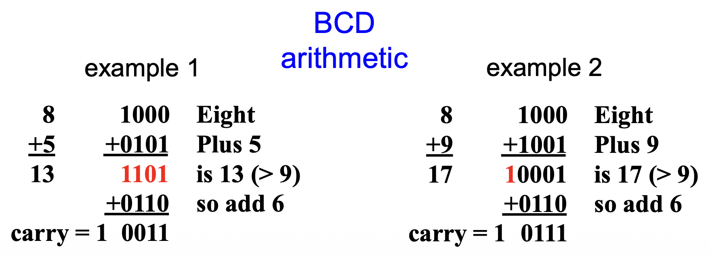
                

                

                    
                

    - **D**（**方向**(direction)）：选择 `DI` / `SI` 寄存器的递增或递减模式

    - 系统标志：
        - **T**（陷阱(trap)）：陷阱标志通过片上调试(on-chip debugging)功能启用捕获
        - **I**（中断(interrupt)）：控制 INTR（中断请求）输入引脚的操作
        - **VM**（虚拟模式(virtual mode)）：在保护模式系统中选择虚拟模式操作
        - **IOPL**：用于保护模式操作中，为 I/O 设备选择特权级别
        - **NT**（嵌套任务(nested task)）：表示当前任务在保护模式操作中嵌套于另一个任务内
        - **AC**（对齐检查(alignment check)）：如果字或双字在非字或非双字边界上被寻址，则标志位激活
        - **RF**（继续(resume)）：用于调试，控制在下一条指令后恢复执行
        - **ID**（识别(identification)）：指示奔腾微处理器支持 `CPUID` 指令
            - `CPUID` 指令为系统提供有关奔腾微处理器的信息

        - **VIF**：奔腾 4 处理器的中断标志位的拷贝（**虚拟中断**(virtual interrupt)）
        - **VIP**（虚拟(virtual)）：提供关于奔腾处理器的虚拟模式中断（**中断挂起**(interrupt pending)）信息
            - 用于多任务环境中，以提供虚拟中断标志

???+ note "早期 IA-32 处理器的识别"

    - 在早期的 IA-32 处理器直至 486 之前的型号中，`CPUID` 指令不可用
    - `RFLAGS` 中的若干架构特性可用于识别处理器
    - 对于 32 位处理器，相比 8086 及 286 处理器，第 12 和 13 位（`IOPL`）、第 14 位（`NT`）以及第 15 位（保留）的设置有所不同
    - 通过检查这些位的设置（使用 `PUSHF`/`PUSHFD` 和 `POPF`/`POPFD` 指令），应用程序可以判断出该处理器是 8086、286 还是 32 位处理器

### Segment Registers

- **CS**（**代码**(code)）：存放微处理器使用的代码（程序(program)和过程(procedure)）
- **DS**（**数据**(data)）：包含程序使用的大部分数据，通过偏移地址或保存偏移地址的其他寄存器的内容来访问数据
- **ES**（**附加**(extra)）：一个额外的数据段，某些指令用它来存放目标数据
- **SS**（**栈**(stack)）：用于栈的内存区域
    - 栈入口点由栈段和栈指针寄存器决定
    - `BP` 寄存器也在栈段内寻址数据
- **FS** 和 **GS** 段：补充段寄存器
    - 允许程序访问两个额外的内存段
    - 这些段用于与操作系统相关的功能
    - Windows 利用这些段进行内部操作

{ align=right width=25% }

- 64 位模式
    - 此时处理器只能识别 `CS`, `FS`, `GS` 段
    - 软件可以使用 `FS` 和 `GS` 段基址寄存器作为地址计算的基址寄存器
    - 在64位模式下，假定所有其他数据段寄存器（`DS`、`ES` 和 `SS`）的基地址为 0

 

???+ abstract "系统寄存器"

    

        
    

## Modes of Operations

??? abstract "操作模式汇总"

    

        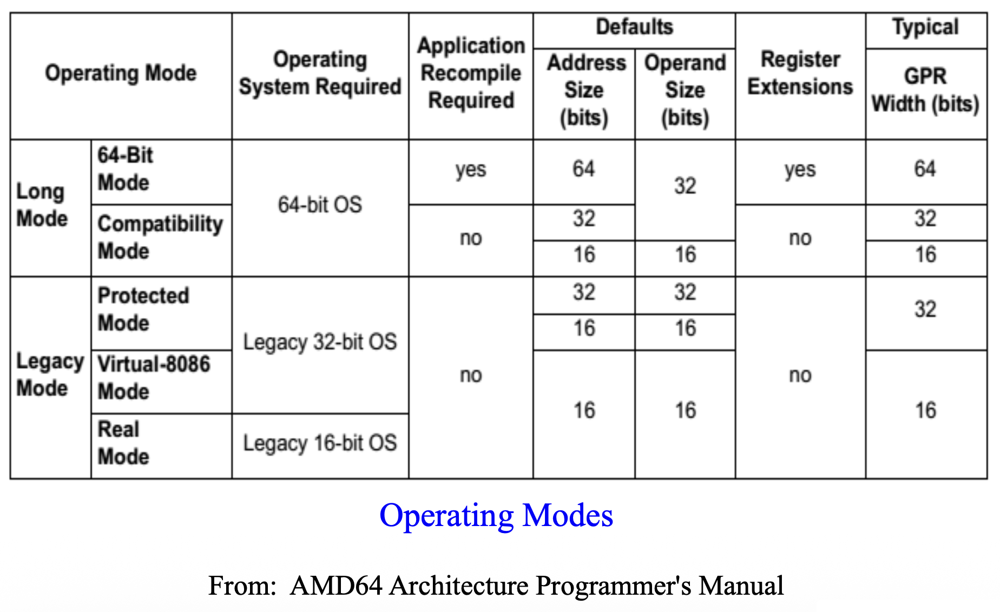
    

    以及 AMD64 架构下的操作模式：

    

        
    

### Long Mode

- **长模式**(long mode)（Intel 称之为 **IA-32e**（"e"代表“扩展”））是**传统保护模式的扩展**
- 长模式包括两个子模式：**64 位模式**和**兼容模式**
    - **64 位模式**(64-bit mode)：支持 64 位架构的所有特性和寄存器扩展
    - **兼容模式**(compatibility mode)：支持与现有的 16 位和 32 位应用程序的二进制兼容性
        - 这些传统(legacy)应用程序无需重新编译即可在兼容模式下运行
        - 在兼容模式下运行的应用程序使用 32 位或 16 位寻址方式，并能访问前 4 GB的虚拟地址空间
        - 传统的 x86 指令前缀可在 16 位与 32 位的地址及操作数大小之间切换
  
- 长模式不支持传统的实模式或传统的虚拟 8086 模式

### Legacy Mode

**传统模式**(legacy mode)包含三个子模式：

- **保护模式**(protected mode)支持 **16 位和 32 位**程序，具备**内存分段**、**可选分页**及**权限检查**功能。运行于该模式的程序可访问高达 **4 GB 的内存空间**。
- **虚拟 8086 模式**(virtual-8086 mode)允许 16 位实模式程序作为任务在保护模式下运行。它采用简化的内存分段方式、可选分页以及有限的保护检查机制。此类程序最多能访问 **1 MB 的内存空间**。
- **实模式**(real mode)支持使用基于寄存器的内存分段的 16 位程序，但**不提供分页或保护检查**功能。在此模式下运行的程序可寻址至多 **1 MB 的内存空间**。

### System Management Mode

- **系统管理模式**(system management mode, SMM)是一种专为系统控制活动设计的操作模式，通常对常规系统软件透明
- 电源管理是系统管理模式的一种常见应用
- SMM 主要供平台**固件**(firmware)和专用低级**设备驱动程序**(device driver)使用

### Memory Management

#### Requirements

内存管理的实现需要满足以下需求：

- **重定位**(relocation)：
    - 程序员不知道执行中的程序位于内存何处
    - 当程序正在执行时，它可能被交换(swap)到磁盘，并在稍后返回到主存的不同位置上（**重定位**(relocated)）
    - **内存引用**必须在代码中转换为实际的内存**物理地址**
    - **程序**不能直接访问物理地址，但可以使用**逻辑地址**间接访问物理地址

- **保护**(protection)：
    - 进程不应能在未经许可的情况下引用另一个进程中的内存位置
    - 在编译时无法检查绝对地址，必须在**运行时进行检查**
    - 内存保护要求必须由处理器（**硬件**）满足而不是由操作系统（软件）满足

- **共享**(sharing)：
    - 允许多个进程访问同一内存部分
    - 最好允许每个进程访问相同的程序副本，而不是拥有它们自己的独立副本

#### Schemes

内存管理的两种方案：

- **分段**(segmentation)：

    

        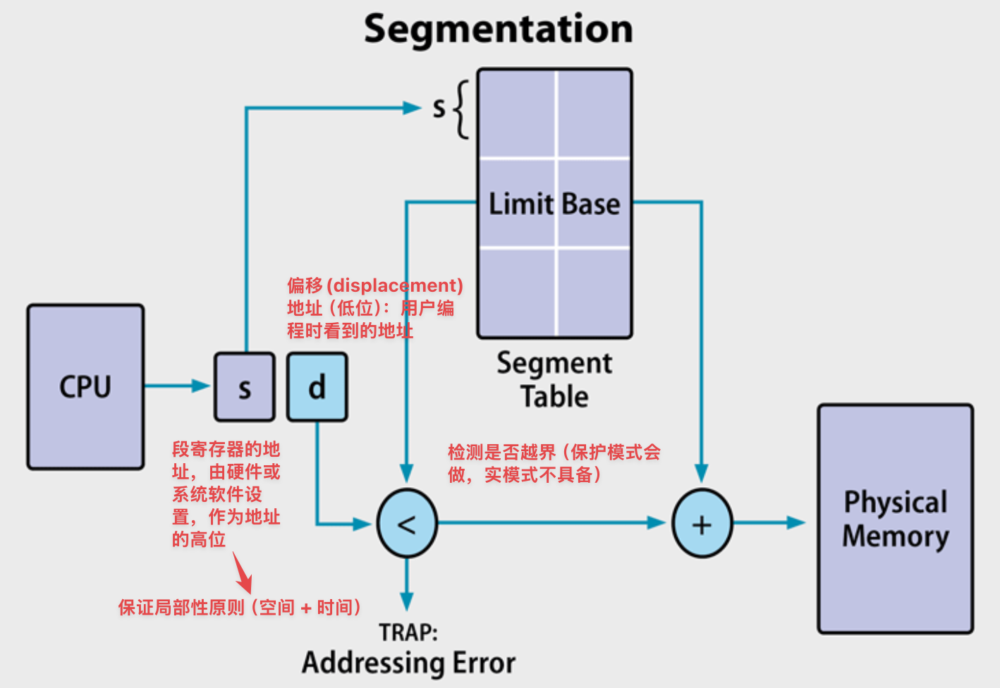
    

    ??? example "例子"

        

            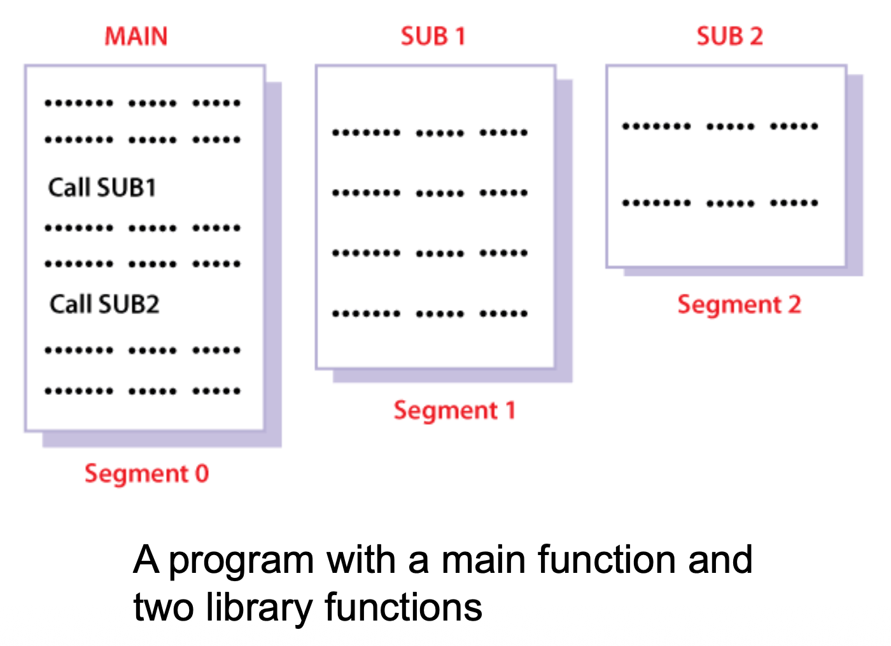
        

        

            
        

- **分页**(paging)：

    

        
    

    ??? example "例子"

        

            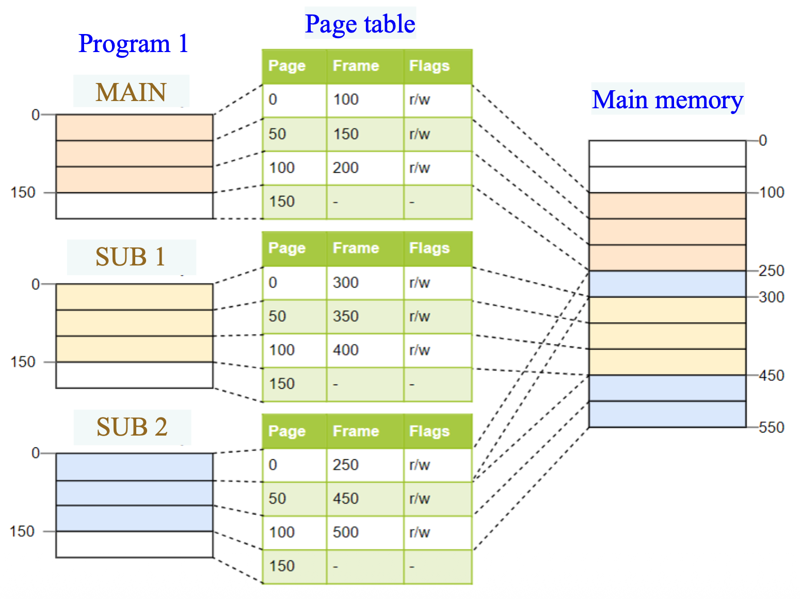
        

两种方案的关键区别在于：

- **大小**  
    - 分段：用户指定**可变大小**的段
    - 分页：页和帧采用**固定块大小**，硬件决定页/帧的大小

- **碎片**(fragmentation)  
    - 分段会导致**外部碎片**（内存中虽有足够的空闲总量，但物理空间不连续，导致无法满足大型分配需求）
    - 分页则导致**内部碎片**（分配单元大于进程实际需求，而导致已分配块的内部无法被利用）

- **表**  
    - 分段：段表包含段 ID 及信息，查找速度**快**于页表
    - 分页：页表指导内存管理单元（MMU）定位页及其状态，此过程较慢，但可通过 **TLB** 高速缓存加速

???+ abstract "不同操作模式下的内存管理"

    EA：有效地址，编程中用户能看到的地址

    === "传统模式下的内存管理"

        

            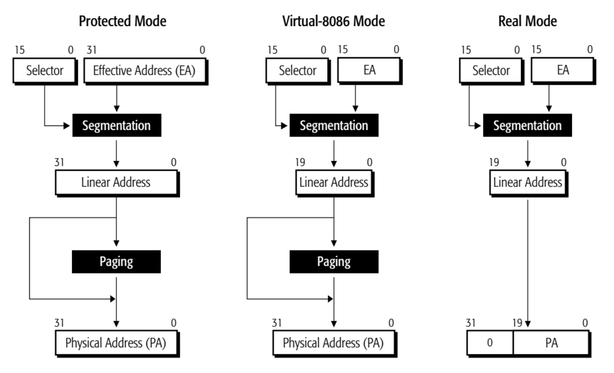
        

    === "长模式下的内存管理"

        

            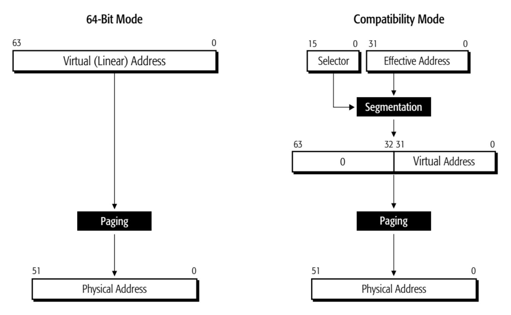
        

## Real Mode Memory Addressing

80286 及之前的处理器要么在实模式下运行，要么在保护模式下运行。其中**实模式操作**(real mode operation)仅允许寻址内存空间的前 1M 字节。这 1M 的内存叫做**实内存**(real memory)/**传统内存**(conventional memory)/**DOS 内存**系统。

### Segments and Offsets 

- 所有实模式内存地址必须由一个段地址加上一个偏移地址组成
    - **段地址**(segment address)定义了任何 64K 字节内存**段的起始地址**
    - **偏移地址**(offset address)选择 64K 字节内存**段内的任何位置**

- **线性地址**(linear address)通过以下方式生成：
    - 一个 16 位段寄存器（段地址），左移四位
    - 以及一个 16 位偏移（段偏移或有效地址）
    - 线性地址被表示为：
        $$
        \text{Linear Address} = \text{Segment Address} << 4 + \text{Effective Address (offset)}
        $$

    

        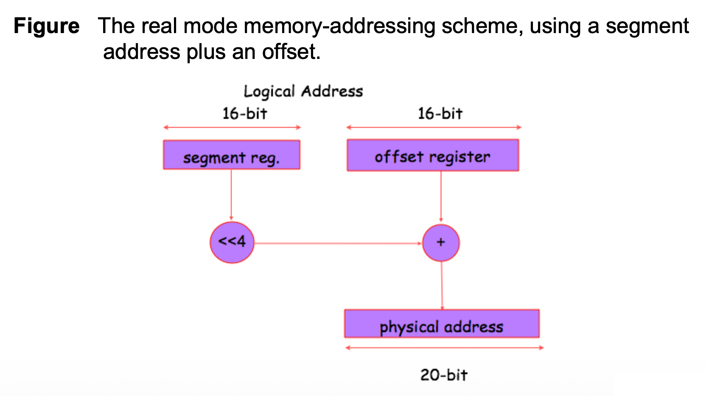
    

### Default Segment and Offset Registers

{ align=right width=25% }

微处理器在寻址内存时遵循适用于段的一系列规则，这些规则确定了段寄存器与偏移寄存器的组合方式。

- **代码段**(code segment)寄存器定义了代码段的起始位置，而**指令指针**(instruction pointer)定位代码段内的下一条指令
- 另一个默认组合是**栈**：栈数据通过栈段在由栈指针（`SP`/`ESP`）或指针（`BP`/`EBP`）指向的内存地址进行引用
- 右图展示了一个包含四个内存段的系统
    - 如果一个段不需要 64K 字节的内存，则内存段可以接触或重叠
    - 将段视为可移动的窗口，能够覆盖内存的任何区域以访问数据或代码
    - 一个程序可以拥有超过四个或六个段，但一次只能访问四个或六个段
  
 

由 DOS 置于内存中的程序被加载至 **TPA**（暂驻程序区(transient program area)），位于驱动程序之上的首个可用内存区域。该区域由 DOS 维护的一个**空闲指针**指示。程序的加载过程由 DOS 内部的**程序加载程序**(program loader)自动处理。

    

### Segment and Offset Addressing Scheme Allows Relocation

- **可重定位程序**(relocatable program)是指能够置于内存的任何区域，且无需修改即可执行的程序
- **可重定位数据**(relocatable data)是指可以存放在内存的任何区域，并给使用时无需对程序进行任何更改的数据

    

- 由于内存是通过偏移地址在段内寻址的，因此内存段可以被移动到内存系统中的任意位置而无需更改任何偏移地址
- 操作系统可以在运行时分配段地址
- Windows 上编写程序时假设前 2G 内存可用于代码和数据

### Address Wrapping Problem

1 MB **地址回滚**(wrap-around)是 Intel 8086/8088/80186 CPU 的固有特性，即超过 20 位的线性地址位会被直接丢弃，仅保留 20 位作为物理地址的现象。考虑以下两个例子：

    

80286（24 位地址线）及后续型号因为支持更高位数的地址，但一些商业软件的实现故意依赖先前回滚寻址的特性，所以 Intel 将这一特性留给用户决定是否开启。如果不开启就能访问更多的地址位。

## Protected Mode Memory Addressing

**保护模式**(protected mode)是 Windows 操作系统运行的环境，允许访问位于内存第一个 1M 字节以内及以上的数据和程序。段寄存器中存放的是一个**选择器**(selector)，而非段地址，该选择器用于从（2个）描述符表中选择一个描述符（共 8192 个选择器）。

### Descriptors

**描述符**(descriptor)描述了内存段的位置、长度和特权级别。

- 有一种称为**门**(gate)的特殊描述符，用于提供软件例程的代码选择器和入口点

    

???+ example "例子：`#!asm MOV [BX], AX`"

    

        
    

**描述符表**(descriptor table)包含以下描述符：

    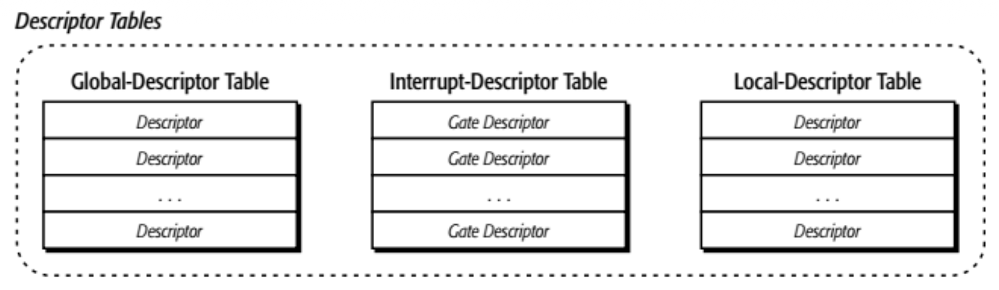

- **全局描述符表**(global-descriptor table, GDT)包含所有程序可用的描述符（**必需**）
    - **全局描述符**包含适用于所有程序的段定义（**系统描述符**）
    - 第一个条目称为**空描述符**(null descriptor)，其内容必须全为零且不可用于访问内存
        - 空描述符用于使未使用的段寄存器无效；通过用**空选择器**(null selector)初始化未使用的段寄存器，软件可以捕获对未使用段的引用
        - 当加载到数据段寄存器（`DS`、`ES`、`FS` 或 `GS`）时，空描述符不会产生异常；但当尝试使用该描述符访问内存的空选择器进行操作时会引发**一般保护异常**(general-protection exception)（#GP）
        - 空选择器还可作为标志，指示 64 位模式下存在嵌套中断处理程序或特权软件

- **局部描述符表**(local-descriptor table, LDT)包含单个程序使用的描述符（**可选**）
    - **局部描述符**通常特定于某个应用程序（**应用描述符**）

- **中断描述符表**(interrupt-descriptor table)仅包含门描述符（**必需**）

下图给出描述符格式：

- 每个描述符长度为 **8 字节**
- GDT 和 LDT 最大长度为 64K 字节
- GDT 与 LDT 最多可容纳 8192 个条目（2^16^ / 2^3^ = 2^13^）

    

- 描述符的**基地址**(base address)指示了内存**段的起始位置**
    - 在保护模式下，段边界限制被移除
    - 段可以始于任何地址

- **段限制字段**(segment limit field)
    - 段限制包含该段内**最后一个偏移地址**
    - 处理器将两个段限制字段组合成一个 20 位的值
  
- **G 位**（**粒度**(granularity)**位**）
    - 决定了段限制字段的缩放比例；如果软件引用超出限制的地址，将发生一般保护异常（#GP）
    - 当粒度标志清零时，段限制**以字节为单位**解释；当标志置位时，段限制**以 4KB 为单位**解释
    - 若 G = 0，段大小 =（限制 + 1）B，限制范围从 0 到0FFFFFH（2^20 - 1 或 1MB - 1）
    - 若 G = 1，段大小 =（限制 + 1）x **4KB**，限制范围从 0FFFH（2^12 - 1 或 4KB - 1）到 0FFFFFFFFH（2^32 - 1 或 4GB - 1）

    ??? example "段限制的例子"

        === "例1"

            === "问题"

                对于基地址为 10000000H，限制字段为 001FFH，**G = 0** 的描述符，它的起始和结束位置是什么？

            === "解答"

                - 起始位置：10000000H
                - 结束位置：10000000H + 001FFH = 100001FFH

        === "例2"

            === "问题"

                对于基地址为 10000000H，限制字段为 001FFH，**G = 1** 的描述符，它的起始和结束位置是什么？

            === "解答"

                若 G = 1，结束 = 起始 +（段大小 - 1），其中段大小 =（限制字段(limit) + 1）x 4KB。于是（段大小 - 1） = (limit + 1) x 4K – 1 = (limit)000H + (4K – 1) = (limit)FFF H（也就是 limit 从第4个十六进制位开始）

                - 起始位置：10000000H
                - 结束位置：10000000H + 001FFFFFH = 101FFFFFH

- **访问权限字节**(access rights byte)控制对保护模式段的访问
    - 描述该段在系统中的功能，并允许完全控制该段
    - 若为数据段，则指定其增长方向
    - 如果段的大小超出其限制范围，操作系统将被中断，表明一般保护错误发生
    - 可以指定数据段是否可写入或为写保护状态

    

        
    

    - **S 位**与**类型**(TYPE)字段共同指定了描述符的类型及其访问特性
    - **描述符特权级别**(descriptor privilege-level, **DPL**)字段：段的描述符特权级别，其中 0 代表最高特权，3 代表最低特权
    
        

            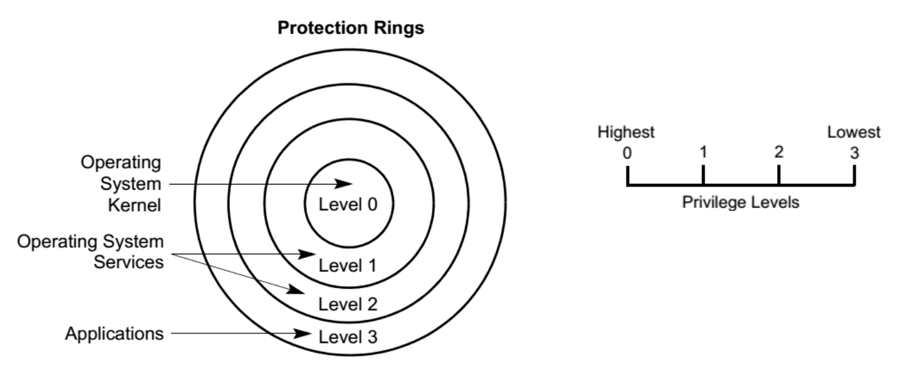
        

下图展示了包含选择器的段寄存器如何从全局描述符表中选择一个描述符。可以看到全局描述符表中的条目选择了内存系统中的一个段。

    

???+ question "思考"

    === "题目"

        在保护模式下，理论上一个 x86 处理器核心能跑多少进程？

    === "解答"

        - 在保护模式下，x86 使用描述符（GDT 和 LDT 中的条目）来管理对内存段访问
        - 每个进程至少需要一个代码段和一个数据段，即两个 GDT 条目
        - GDT 为 64K 字节，每个描述符为 8 字节
        - 64K / 8 / 2 = 4K = 4096 个进程

### Segment Selectors

**段选择器**包含一个 13 位的索引字段、一个表选择位（TI）以及请求特权级字段

    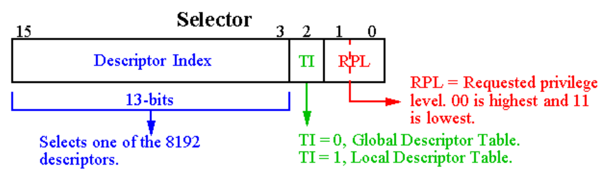

- **TI 位**：选择全局或局部描述符表
- **请求特权级别**(requestor privilege level, **RPL**)：指定内存段的访问权限级别

### Types of Privilege Levels

- **描述符特权级别**(descriptor privilege level, **DPL**)：操作系统分配给各个**段**的特权级别

    

        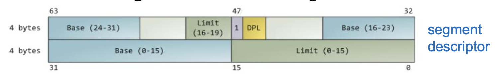
    

- **请求特权级别**(requestor privilege level, **RPL**)：反映了创建选择器的**程序**的特权级别

    

        
    

- **当前特权级别**(current privilege level, **CPL**)：`CS` 寄存器有一个 2 位 CPL 字段，它始终等于 **CPU** 当前的权限级别

    

        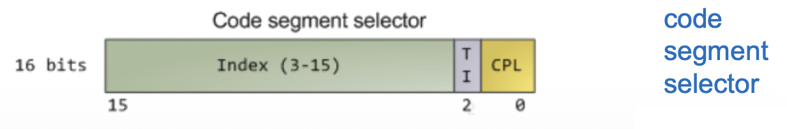
    

???+ note "数据访问特权检查"

    === "访问数据段"

        先取代码段和数据段中的最小权限（最大值），只有当 DPL 表示的权限不高于这个最小权限（DPL 值要更大）时才能访问数据。

        

            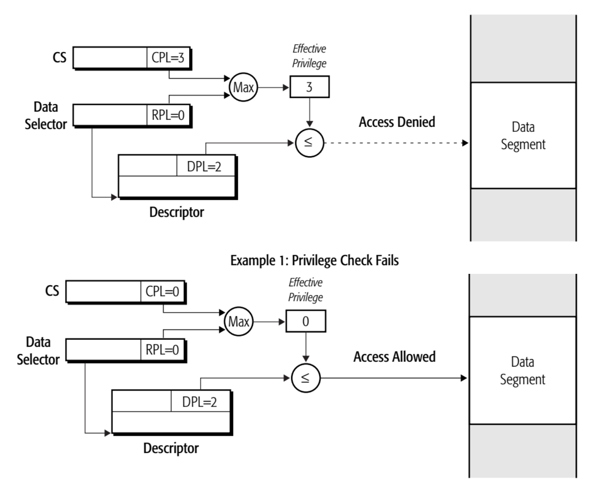
        

    === "访问栈段"

        因为栈是局部内存区域，所以访问要求更加严苛：只有三种特权级别一样时才能访问。

        

            
        

### Program-Invisible Registers

程序不可见的寄存器有：

- **GDTR**（全局描述符表寄存器） 与 **IDTR**（中断描述符表寄存器）：存放 GDT 和 IDT 的**基地址**及其限制字段，在进入保护模式前被加载
    - **LDT 的位置保存在 GDT 中**：其中一个全局描述符被设置用来访问 LDT

- **LDTR**（局部描述符表寄存器）与 **TR**（任务寄存器）：指向 GDT 中的特殊系统描述符（例如 LDTR 寄存器作为 GDT 的选择器）
    - 要访问 LDT，LDTR 加载一个选择器；该选择器访问 GDT，并将 LDT 的地址、限制和访问权限加载到 LDTR 的缓存部分
    - TR 持有一个选择器，该选择器访问定义任务（一个过程或应用程序）的描述符，允许多任务系统以简单有序的方式在任务之间切换

其他不可见的寄存器充当描述符的缓存。

???+ note "保护模式内存寻址"

    

        
    

    要想使用 LDT 扩展单个任务的地址空间，可以让 LDTR 选择器在切换到新任务时可以加载一个新值。

    

        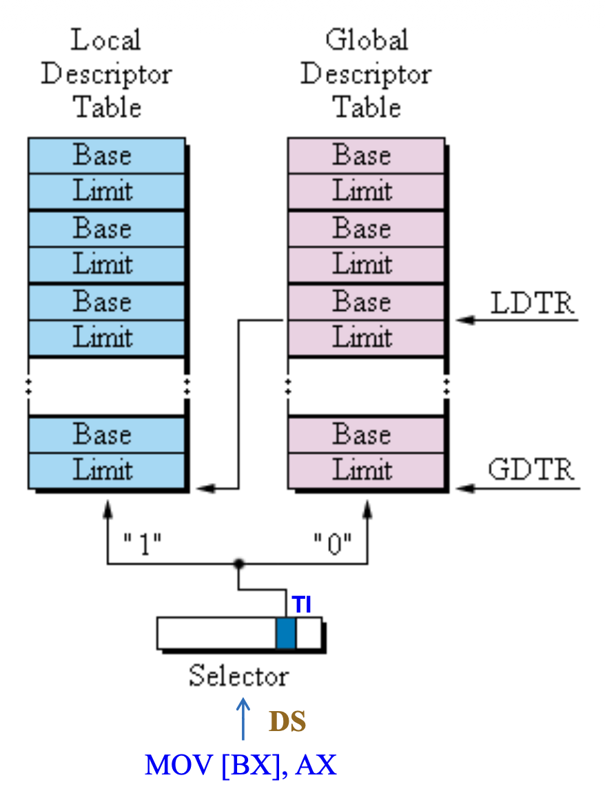
    

### Segmented-Memory Models

系统软件可利用分段机制支持两种基本的分段内存模型：多段式模型或平坦内存模型。

- **多段式模型**(multi-segmented model)：将内存划分为不同部分，包括代码、数据和栈，每个部分可独立访问
- **平坦内存模型**(flat-memory model)：采用线性寻址模式，代码、数据及栈均包含在一个连续的地址空间内，使得 CPU 能够直接寻址所有可用的内存位置

-   多段式模型：每个段寄存器有一个唯一的基地址和段大小

    

-   平坦内存模型：段的基地址 = 0，且段的限制为 4KB

    <figure markdown="span">
        { width=88% }
        <figcaption></figcaption>
    </figure>

## Memory Paging

### Memory Addressing

x86 处理器支持地址重定位，并为此提供了四种地址类型来描述内存组织：

- **有效地址**或**段偏移**(segment offset)
- **逻辑地址**
- **线性**（虚拟）**地址**
- **物理地址**

    

#### Effective Addresses

**有效地址**(effective address)（**近指针**(near pointer)）：内存段中的偏移量，表示为：

有效地址 = 基址 + (比例因子 × 索引) + 位移量

- **基址**(base)：存储在寄存器中的值
- **比例因子**(scale)：1, 2, 4, 8 中的任意一个值
- **索引**(index)：存储在寄存器中的值
- **位移量**(displacement)：编码为指令一部分的值

#### Logical Addresses

**逻辑地址**(logical address)（**远指针**(far pointer)）：分段地址空间中的一个引用，由**段选择器**(segment selector)和**有效地址**组成。它被表示为：

逻辑地址 = 段选择器 : 偏移量

???+ example "例子"

    指令 `#!asm mov [bx], ax` 中，`[bx]` 指代的逻辑地址是 `ds:bx`

#### Linear Addresses

**线性地址**(linear address)（**虚拟地址**(virtual address)）：段基址与有效地址（段偏移量）之和，即：

线性地址 = 段基址 + 有效地址

当采用**平坦内存模型**时（例如在 64 位模式下）段基址被视为 0，此时线性地址与有效地址相同。

#### Physical Addresses

处理器在其总线上寻址的内存被称为**物理内存**。物理内存被组织成一系列 8 位字节，每个字节都被分配了一个唯一的地址，称为**物理地址**(physical address)。

**内存分页机制**(memory paging mechanism)允许将任何物理内存位置分配给任意线性地址，具体来说是通过称为**物理页**(physical pages)的固定大小块，实现在物理地址空间中的重定位。常用的物理页大小有：

- 长模式：4 KB、2 MB、1 GB
- 传统模式：4 KB、2 MB、4 MB

### Multi-level Paging

**页转换**(page translation)采用一种称为**页表**(page table)的分层数据结构，将虚拟页转换为物理页。层级数量范围从 1 到 4 级不等。

    

为何使用这样的**多级分页**(multi-level paging)技术呢？来看下面的例子：

???+ example "例子"

    假设一台 64 位计算机（64 位虚拟地址空间）具有 4KB 的页大小，4GB 的物理内存，且每个页表项为 4 字节；请计算单级页表的大小。

    

        
    

    - 页表项数量 = 2^64^ B / 4KB/page = 2^52^
    - 页表大小 = 2^52^ 个页表项 * 4B/页表项 = 2^54^ B = 16PB

    当页表的大小超过帧的容量时，就需要采用多级分页技术（~~现在的情况是远超 99.99% 的电脑的硬盘容量了~~）。

    在这里，多级分页方法为：

    - 12 位用于页偏移量（4KB = 2^12^B）（不需要转换）
    - 52 位用于页表项
    - 4KB/page / 4B/(page table entry) = 1024 entries
    - 10 位用于寻址页表项
    - 需要 ceil(52 / 10) = 6 个页表

- 优点：适用于**内存使用稀疏**的应用程序
    - 单级分页：必须为每个虚拟地址包含一个条目（条目数量巨大）
    - 多级分页：仅创建实际使用的目录条目（条目较少）

- 缺点：
    - **耗时**，必须额外访问内存以进行页表查找
    - 对于下图所示的例子，如果它无法为“间隙”跳过页表项(PTE) 2-7，那么它将不得不为每个分配 1024 个 PTE，导致内存使用量增加 48KB （6\*1024\*8）；这就是**内部碎片**的问题

    

        
    

???+ example "例子"

    === "问题"

        考虑一个采用多级分页机制的系统：页大小为 4 KB。物理内存为 16 TB，虚拟地址长度为 32 位，页表项大小为 4 字节。对于分好的物理地址和虚拟地址，需要多少级的页表？

    === "解答"

        - 虚拟地址 = 32 位
        - 物理地址 = 44 位
        - 页大小 = 4 KB
        - PTE 大小 = 4 B
        - 12 位用于页偏移量
        - 20 位用于 PTE
        - 4 KB/page / 4 B/PTE = 2^10^ 项 -> 10 位用于寻址 PTE
        - 级数 = 20/10 = 2

        

            
        

关键点：

- 任何页表的页表项大小始终相同
- 除了最后一页可能没填满外，所有页表都被完全填满
- 页偏移量无需转换

???+ question "为何选择 4 KB 的页大小？"

    - 影响页大小的因素：
        - **2 的幂次方大小**：对硬件性能更优
        - **较小尺寸**：减少内部碎片，提升性能（例如写时复制(copy-on-write)）
        - **较大尺寸**：减少页表数量、缺页中断及 TLB 失效情况

    - 理论和实践均表明，在 2^7^ 至 2^14^ 范围内的页大小为最优选择
    - Intel 当时可能观察到，对于 20 世纪 80 年代使用的应用程序（如 80386 处理器），4KB 页能带来最佳平均性能

内存分页满足了以下对内存管理的需求：

- **重定位**(relocation)：分页技术提供了一个抽象层，使得操作系统能够将虚拟地址映射到物理地址

    

        
    

- **保护**(protection)：应用程序可以通过在虚拟地址空间内相互隔离来保护彼此
- **共享**(sharing)：物理页可以通过共享映射被多个应用程序共用

### Protection

当虚拟地址转换为物理地址时，会执行访问保护检查。处理器会检查页级别的**保护位**，以确定是否允许此次访问。违反页级别保护检查将导致**页错误异常**(page-fault exception)。

    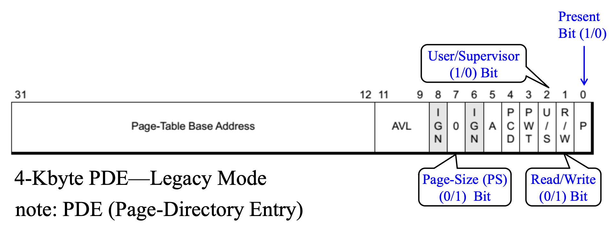

#### Protection Bits

下面解释页目录项(page directory entry, PDE)中和保护相关的位：

- 第 0 位：**P**（存在(present)位）
    - 含义：指示此 PDE 所指向的页表是否有效且存在于物理内存中
    - P = 1：**有效**(valid)，该 PDE 包含一个有效的物理地址，可用于定位下一级页表
    - P = 0：**无效**(invalid)，该 PDE 不用于地址转换；当程序访问 P = 0 的页时，会触发**页错误异常**（#PF）
    - 功能：
        - 实现虚拟内存：这是[**按需分页**](../os/10.md#demand-paging)(demand paging)和[**页交换**](../os/9.md#swapping-with-paging)(page swapping)的基础
        - 访问控制：任何尝试访问不存在页的操作都会被 CPU 立即捕获

- 第 1 位：**R/W**（读写(read/write)位）
    - 含义：控制由该 PDE 管理的整个页表的写入权限
    - R/W = 1：**可读可写**，允许程序对相关页执行写入操作
    - R/W = 0：**只读**，允许程序读取页，但任何写入尝试都将触发页错误异常
    - 功能：
        - 保护代码和只读数据
        - [**写时复制**](../os/10.md#copy-on-write)(copy-on-write, CoW)

            

                
            

- 第 2 位：**U/S**（用户/管理员(user/supervisor)位）
    - 含义：定义了访问由该 PDE 管理的整个页表所需的权限级别
    - U/S = 0：**管理员模式**，仅当 CPU 运行在特权环 0、1 或 2 时，才允许访问
    - U/S = 1：**用户模式**，当 CPU 运行在任何特权级别（包括环 3）时，都允许访问
    - 功能——保护操作系统内核：这是实现内核空间与用户空间隔离的关键所在

对于任何一个页，其页目录项（PDE）的保护属性可能与其页表项（PTE）的属性不同。处理器通过将页目录和页表项中的保护位进行**与(AND)**操作，来获取物理页的保护属性，即**页属性 = PDE 属性 & PTE 属性**

???+ example "例子：常量字符串的保护"

    在 C 语言中，不允许修改常量区中的字符串，因为物理页没有写入权限。

    

        
    

### Paging Registers

分页单元(paging units)由微处理器中**控制寄存器**(control registers, CR)的内容来控制。控制寄存器 CR0 至 CR4 的内容如下：

    

关于 CR2：

- 每当遇到**页错误异常**时，CPU 会将**引发该错误的线性地址**保存到 CR2 寄存器中（和 RISC-V 中的 `stval` 寄存器很像）
- 页错误处理程序可以利用此地址来定位相应的页目录和页表项

关于页错误异常：

- 在以下任一情况下进行内存访问时，可能会发生页错误异常：
    - 参与转换该内存访问的页表项或物理页不在物理内存中（**存在/缺失**状态）
    - 内存访问未能通过分页保护检查（**用户/管理员**权限、**读/写**权限或两者兼有）
- 如果在传递先前的页错误期间发生第二次页错误，则**第二次错误**的故障线性地址将覆写 CR2 寄存器的内容（替换之前的地址）

### Legacy Mode Memory Model

32 位线性地址的两种转换模型：

- 二级分页：**10-10-12 模型**
- 三级分页：**2-9-9-12 模型**

#### Two-Level Paging: 10-10-12 Model

    

???+ example "例子：页转换"

    - 线性地址：0301008A
    - 二进制：0000 0011 0000 0001 0000 0000 1000 1010
    - 10-10-12 重分组：00 0000 1100 00 0001 0000 0000 1000 1010
    - 对应十六进制：00C 010 08A

    

        
    

---
该分页模型有以下两种扩展：

- **页大小扩展**(page size extension, **PSE**)：页大小扩展至 4MB
- **物理地址扩展**(physical address extension, **PAE**)：用于寻址大于 4GB 的物理地址空间（采用 **2-9-9-12 模型**）

#### Page Size Extension

PSE 的使用取决于 **CR4.PSE** 以及 **PDE 的 PS 标志位**（第 7 位），只有当两者均置 1 时，页大小才会从 4KB 扩展至 4MB（22 位偏移量）。

    

现在留给 PTE 的地址只剩 10 位，因此只需要一级页表就行了：

    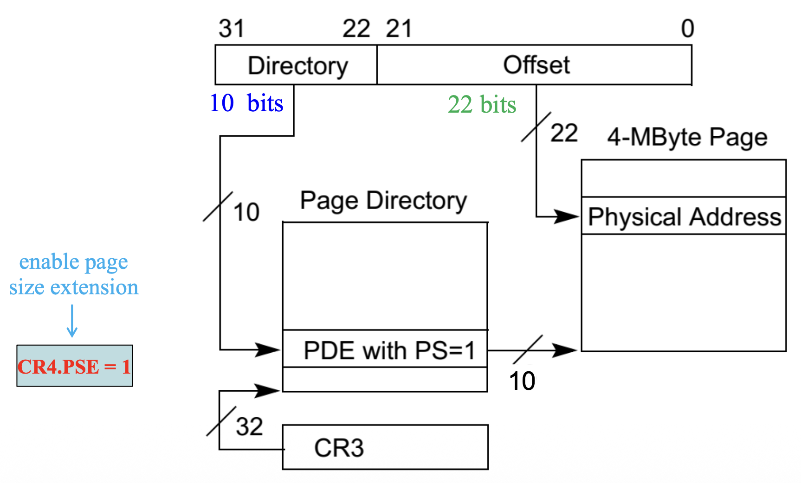

4 MB 的物理页可以与标准的 4 KB 物理页**混合使用**，或完全替代后者。物理页大小的选择是基于 PDE 进行的，这样做的好处是：

- 超大页（4MB）用于内核代码
- 常规页（4KB）适用于普通软件

    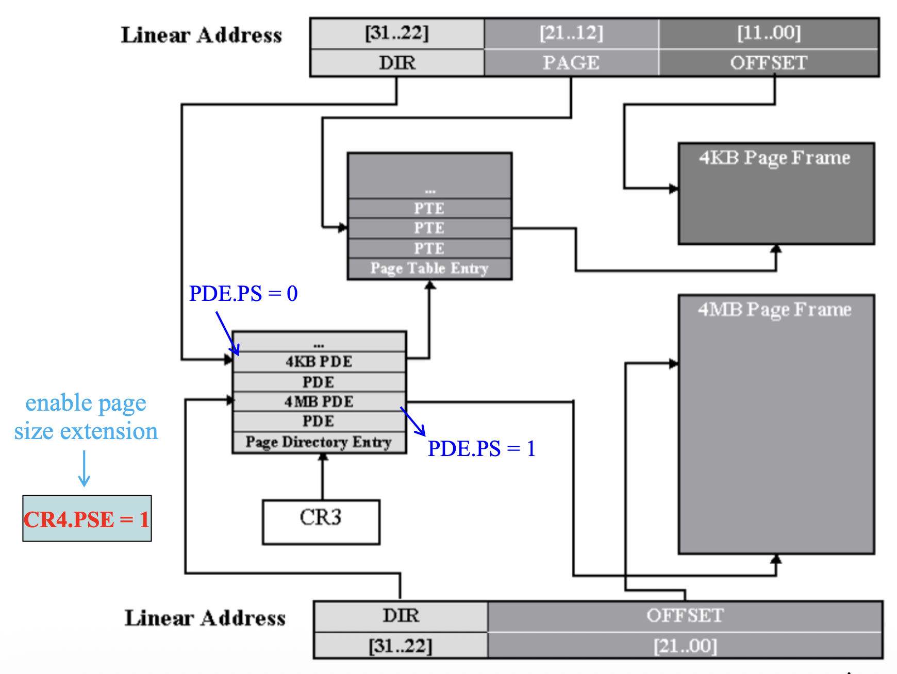

#### Physical Address Extension

**物理地址扩展**(physical address extension, **PAE**)使得 32 位的应用程序访问超过 4 GB 的地址空间。当 **CR4.PAE = 1** 时启用 PAE。

    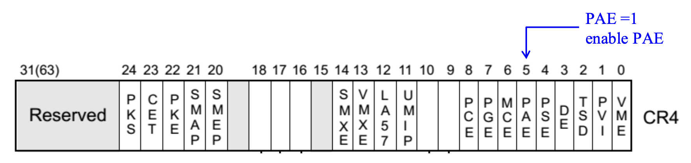

- 允许访问 64 GB（2^36^ B）的物理内存，因此虚拟地址可被转换为长达 **36 位的物理地址**
- 这样做仅仅是为了让 OS 能够利用更多的物理内存，所以线性地址仍保持 32 位
- 支持 4KB 和 2MB 的页大小
- 此时 PTE 的大小从 4 字节（32 位）扩展到 8 字节，以便容纳物理页更大的物理基地址（36 位 > 32 位）

    

        
    

---
**2-9-9-12 模型**如下所示：

    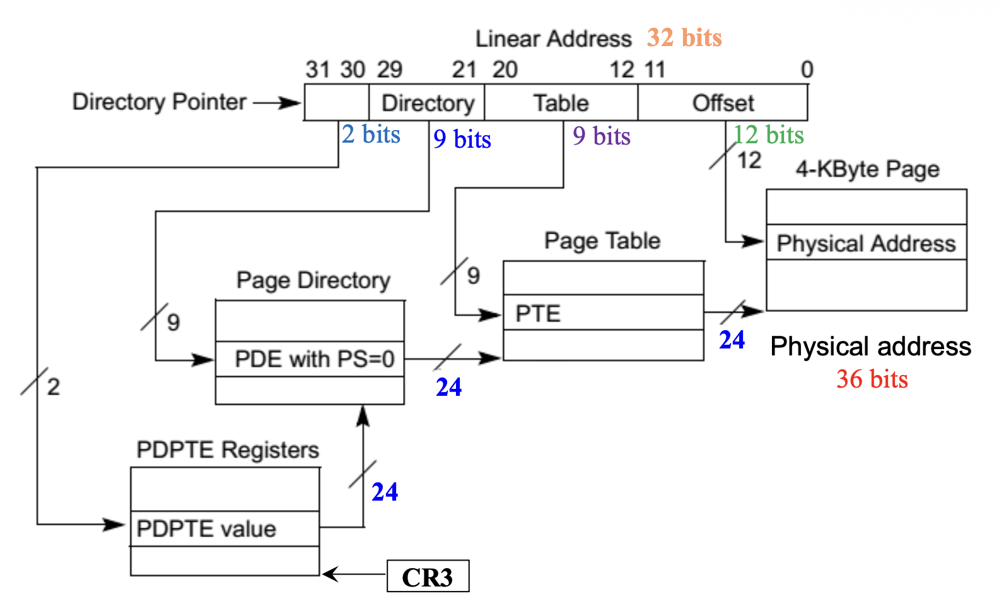

其中：

- 虚拟地址：32 位
- 物理地址：36 位
- 页大小：4KB
- PTE 大小：8B

计算需要的页表级数：

- 12 位用于页偏移量（4KB = 2^12^B）
- 20 位用于 PTE
- 4 KB/page / 8 B/PTE = 2^9^ entries -> 9 位用于寻址 PTE
- 需要 ceil(20 / 9) = 3 级页表

新增条目：**页目录指针表**(page directory pointer table, PDPT)

- 通过线性地址的 `[31:30]` 位进行索引
- 每个条目指向一个页目录
- **CR3** 寄存器包含页目录指针表的**基地址**

---
PAE 的 2MB 页映射：移除第三级页表，产生 2MB 大小的页，并且设置 **CR4.PAE = 1** 且 **PDE.PS = 1**。

    

选择 2MB 或 4MB 作为大物理页的大小取决于 CR4.PSE 和 CR4.PAE 的值，具体如下：

- 在 PAE 分页模式下（CR4.PAE = 1），PAE 自动使用页大小位，因此忽略 CR4.PSE 的值，此时可用的大页大小为 2 MB
- 如果物理地址扩展被禁用（CR4.PAE = 0）且 CR4.PSE = 1，则大物理页大小为 4 MB
- 如果同时满足 CR4.PAE = 0 和 CR4.PSE = 0，唯一可用的页大小是 4 KB

    

### Paging Modes in Intel-64

Intel-64 处理器支持四种不同的分页模式：

- **传统模式**(legacy mode)分页
    - 32 位分页：将 32 位线性地址转换为 40 位物理地址
    - PAE 分页：将 32 位线性地址转换为 52 位物理地址
- **IA-32e** 分页
    - 4 级分页：将 48 位线性地址转换为 52 位物理地址
    - 5 级分页：将 57 位线性地址转换为 52 位物理地址

### Paging Modes in AMD64

在 x86-64 系统中，线性地址（虚拟地址）逻辑上为 64 位长度。而 **AMD** 在设计 x86-64 架构时认为，完整的 64 位地址空间过大且实现成本高昂。因此，他们定义了 48 位（采用 4 级分页）或 57 位（采用 5 级分页）的有效地址空间，这些地址必须遵循特定的规范(canonical)地址规则，例如：

- 48 位：7C00 1810 2000 -> 扩展至 64 位：0000 7C00 1810 2000
- 48 位：8010 BC00 1000 -> 扩展至 64 位：FFFF 8010 BC00 1000

    

### Long Mode Paging Mode

- 长模式下的页转换需要使用物理地址扩展（PAE），所以**在激活长模式之前，必须先启用 PAE**
- PAE 分页数据结构支持将 48 位或 57 位的虚拟地址映射到 52 位的物理地址
- PAE 将页目录项（PDE）和页表项（PTE）的大小从 32 位扩展到 64 位

- 使用 4KB 页大小：

    

        
    

- 使用 2MB 页大小：

    

        
    

- 使用 1GB 页大小：

    

        
    

### Memory Management Unit

**内存管理单元**(memory management unit, MMU)是一种硬件组件，负责将虚拟地址转换为物理地址。当发生 TLB 失效时，MMU 通过一个硬件状态机遍历页表。

    

### TLB

**TLB**（translation lookaside buffer，转换后备缓冲区）是一种页转换缓存，用于存储最近使用的虚拟地址到物理地址的映射。当 TLB 命中时，无需查阅页表即可直接将虚拟地址映射至其对应的物理地址。

    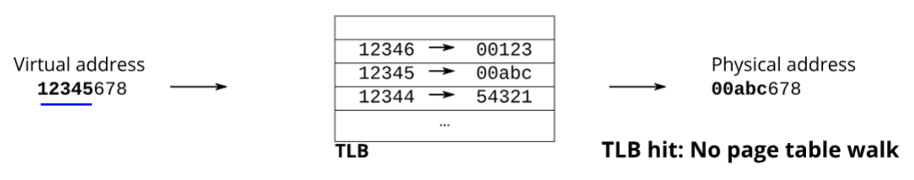

虽然页表的**叶级**被缓存在 **TLB** 中，但**上级**结构则缓存在 MMU 内，这些结构被称为**分页结构缓存**(paging structure cache)

    

TLB 旨在加速虚拟地址到物理地址的转换，而 CPU **高速缓存**(cache)则用于减少主存访问的延迟。

    

### Self-Referencing Entry Trick

既然所有内存访问均使用虚拟地址，那么 OS 如何在虚拟地址中操作页表呢？

    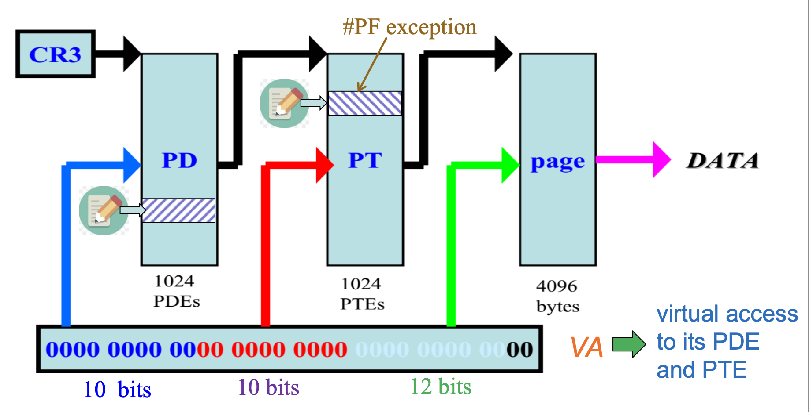

{ align=right width=30% }

- 由于 PDE/PTE 格式相互兼容，OS 通常采用的一种方法是利用**自引用表项**或一个固定位置来存放所有分页结构
- **自引用项**(self-referencing entry)（也称为身份映射(identity mapping)）为 OS 提供了一组虚拟地址，使得系统能够在虚拟地址空间中引用和修改任何页表
- 例如，Windows 32 位系统使用页目录的 `0x300` 项作为自引用条目，指向页目录本身
- 给定一个虚拟地址 VA，其 PDE 和 PTE 的虚拟地址可通过以下方式获得：
    - `GetPteVaAddress(va): 0xc0000000[(va >> 12) << 2]`
    - `GetPdeVaAddress(va): 0xc0300000[(va >> 22) << 2]`

???+ example "例子"

    === "例1"

        

            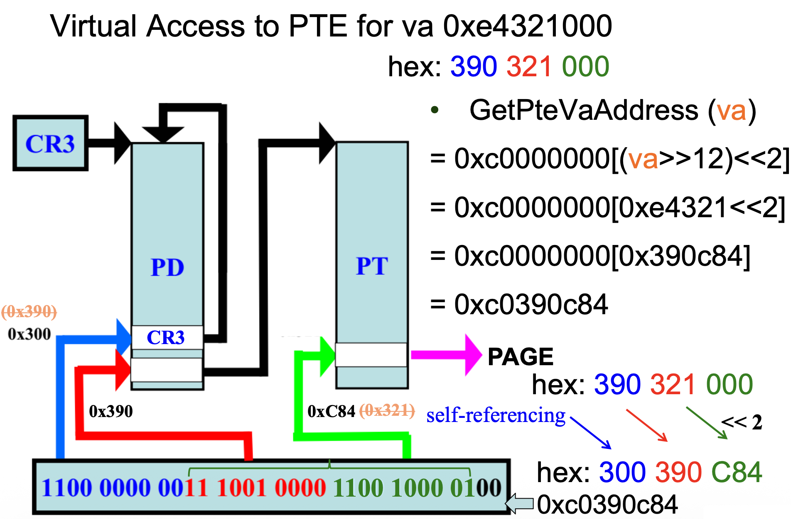
        

    === "例2"

        

            
        

??? bug "Total Meltdown (CVE-2018-1038)"

    Windows 64 位系统在最顶层的 PML4 页表中有一个特殊条目（`0x1ED`），该条目指向其自身。这通常是一个仅对**内核**（超级用户）可用的内存地址。

    

        
    

    在 Windows 7 x64 和 Server 2008 R2 x64 中，PML4 的条目 `0x1ed` 看起来与此类似：

    

        
    

    - 这意味着任何用户模式进程都被授予查看和修改 PML4 页表的权限
    - 通过修改顶层页表，用户实际上具备了查看和修改系统中所有物理内存的能力

        

            
        

    微软已发布针对 CVE-2018-1038 的补丁，用于修复此问题。而为了避免此类问题发生，Windows 10 不再使用静态值（`0x1ED`）作为自引用项索引，而是在启动时**随机生成**该值。

???+ abstract "分段 + 分页"

    { align=right width=30% }

    - 分段
        - **用户/编译器视角**的内存视图
        - 对用户可见
        - 更易于理解
        - 粗粒度模型

    - 分页
        - **硬件/操作系统视角**的内存视图
        - 对用户不可见
        - 细粒度模型

    通过将各个段进行分页，实现分页与分段的结合。

    

        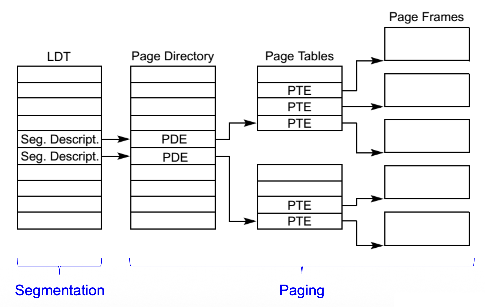
    

    

        
    
