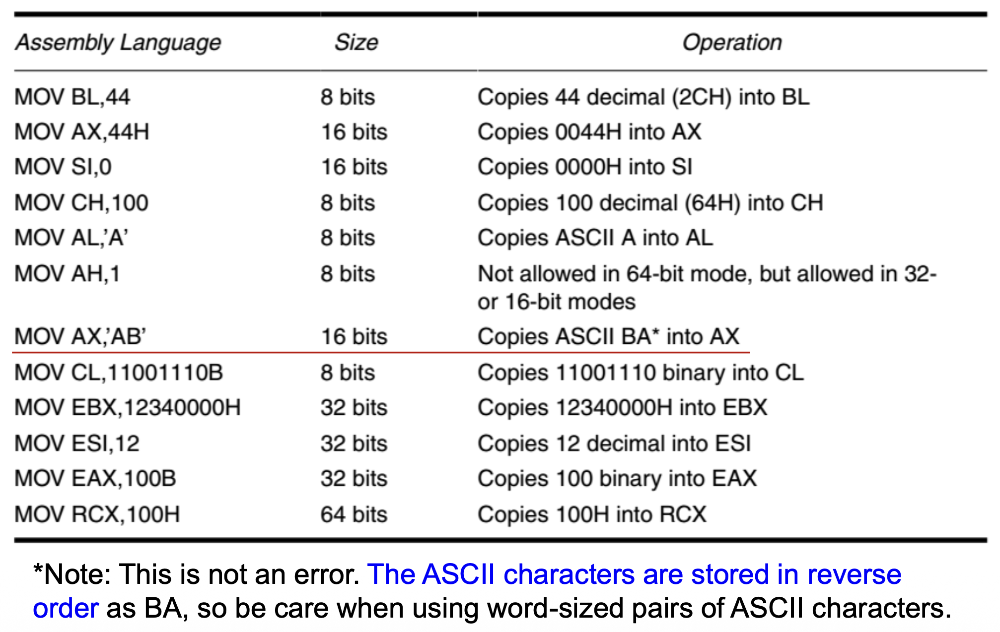
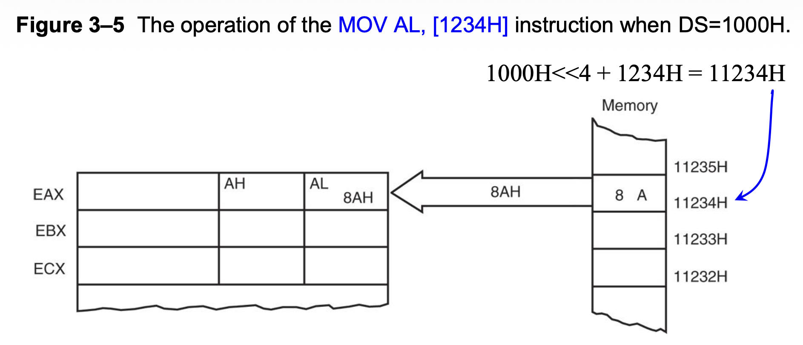
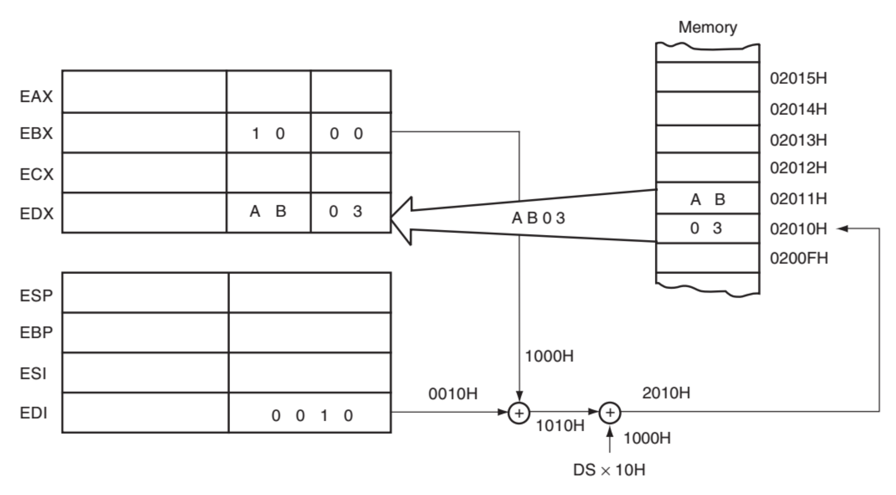
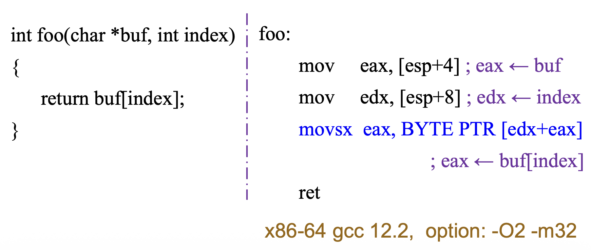
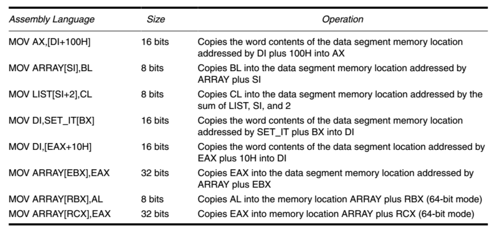
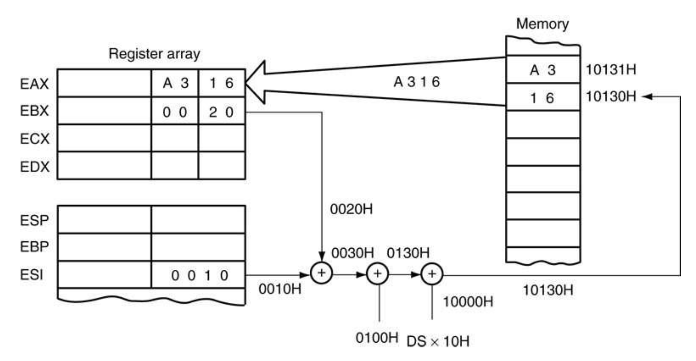
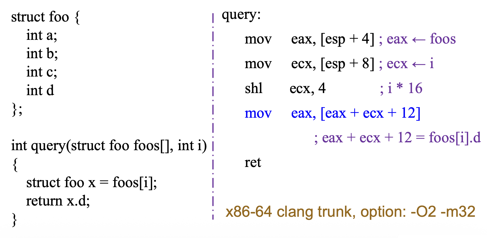
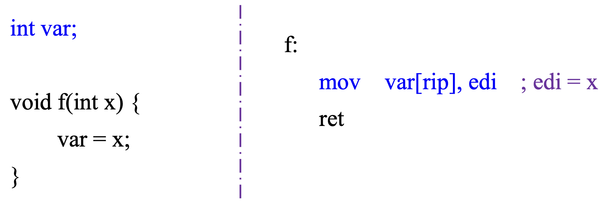
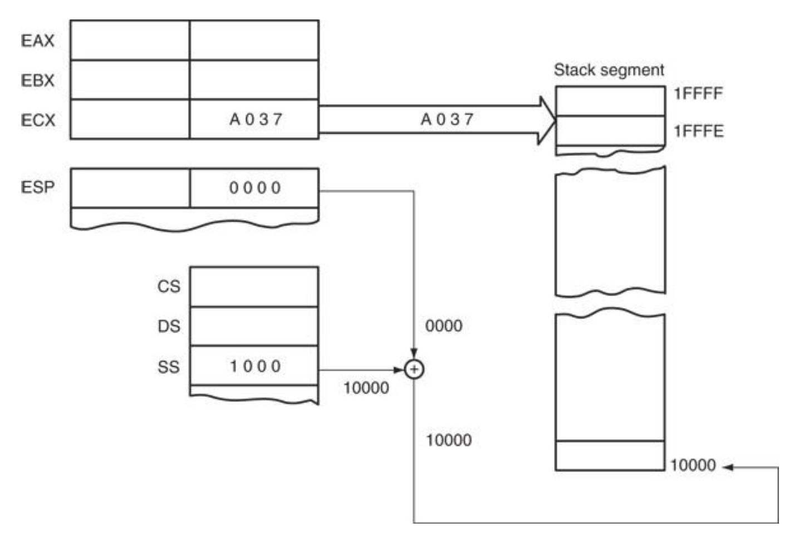

# Addressing Modes

??? abstract "核心知识"

    - 数据寻址模式
        - `#!asm MOV` 指令
        - 各种寻址模式（2+6），遵循计算公式：Effective Address = Base + (Scale * Index) + Disp
        - 大小伪指令
        - 杂项：RIP 相对寻址、规范寻址
    - 程序内存寻址模式：
        - 短/近/远跳转 + 任务切换
        - 相对/直接/间接寻址
    - 栈内存寻址模式：`#!asm PUSH` / `#!asm POP` 指令及其变体

- 地址大小(address size)：确定用于访问内存位置的地址宽度，规定了 CPU 能够用来定位数据或指令的地址范围
- 操作数大小(operand size)：指令所处理数据的宽度，决定了算术、逻辑或数据传输操作中处理的数据的大小

三种操作模式的默认地址大小和操作数大小如下：

- **16 位模式**（实模式、vm86、保护模式）：默认地址和操作数大小为 16 位
- **32 位保护模式**：默认地址和操作数大小为 32 位
- **64 位模式**：默认地址大小为 64 位，默认操作数大小为 **32 位**

???+ example "示例（64 位模式）"

    对于：`#!asm MOV EAX, [RBX]`

    - 操作数大小为 32 位：数据从内存被移入至 `EAX` 寄存器，这是一个 32 位的寄存器
    - 地址大小为 64 位：用包含在 `RBX` 中的 64 位地址来访问内存，而 `RBX` 是一个 64 位的寄存器

**寻址模式**(addressing modes)是用于指定操作数地址的技术，包括：

- **数据**(data)寻址模式：此模式与**数据传输**(data transfer)操作相关——数据可以从内存传输到寄存器，或者从一个寄存器传输到另一个寄存器，例如：`#!asm MOV AX, DX`
- **栈内存**(stack memory)寻址模式：此模式涉及**栈寄存器**(stack registry)操作，例如 `#!asm PUSH AX`
- **程序内存**(program memory)寻址模式：这类寻址方式用于如 `#!asm JMP` 或 `#!asm CALL` 这样的分支指令中


## Data Addressing Modes

`#!asm MOV` 指令是常见且灵活的指令，为数据寻址模式的解释提供了基础。下图阐述了 `#!asm MOV` 指令，并定义了数据流的方向：

<div style="text-align: center">
    
</div>

其中**源**(source)操作数在**右**，**目标**(destination)操作数在**左**，紧邻操作码（表明处理器要执行的操作）`#!asm MOV`

>注：一些汇编语言（比如 AT&T 制定的语法）会以相反顺序放置源和目标操作数。

汇编语言的每条语句由四部分组成：

- 最左边的字段叫做**标签**(label)，用于存储它所表示的内存位置的**符号名称**(symbolic name)
    - 所有的标签必须以字母或以下特殊符号开头：`@`、`$`、`-`、`?`
    - 标签长度不超过 35 个字符
- 第二个字段是**操作码**(opcode)字段，用于存储指令
- 第三个字段是**操作数**(operand)字段，包含为操作码使用的信息
- 最后一个字段是**注释**(comment)，以分号开头（`;`）

存在三类基本的操作数：

- **立即**(immediate)操作数：常数值，被编码为指令的一部分，只能指定源操作数为立即数
- **寄存器**操作数：放在通用目的或 SIMD 寄存器内
- **内存**操作数：指定内存位置

下图展示了使用 `#!asm MOV` 指令时所有可能的数据寻址模式的变体，之后也会一一介绍：

<div style="text-align: center">
    
</div>


### Register Addressing

**寄存器寻址**(register addressing)是数据寻址中最常用的形式。一旦知道寄存器的名称，就很容易使用这种模式了。微处理器包含以下这些用于寄存器寻址的寄存器：

- 8 位寄存器：`AH`、`AL`、`BH`、`BL`、`CH`、`CL`、`DH`、`DL`
- 16 位寄存器：`AX`、`BX`、`CX`、`DX`、`SP`、`BP`、`SI`、`DI`
- 到 80386 以后的处理器，扩展至 32 位寄存器：`EAX`、`EBX`、`ECX`、`EDX`、`ESP`、`EBP`、`ESI`、`EDI`
- 64 位模式下的寄存器：`RAX`、`RBX`、`RCX`、`RDX`、`RSP`、`RBP`、`RSI`、`RDI`，以及 `R8`-`R15`

需要注意的是，**在同一条指令中必须使用相同大小的寄存器**。比如不能在同一指令下混用 16 位和 32 位的寄存器，比如 `#!asm MOV EAX, BX`（<span style="color:red">Error: operand type mismatch</span>）

下图展示了 `#!asm MOV BX, CX` 指令操作：

<div style="text-align: center">
    
</div>

- 源寄存器内容不会改变，改变的是目标寄存器（除了 `#!asm CMP` 或 `#!asm TEST` 指令）
- 并且该指令不会影响 `EBX` 的左侧 16 位的内容


### Immediate Addressing

「**立即数**」(immediate)一词的由来是：数据在内存中紧跟在十六进制操作码之后。
    
- 立即数据是**常量**数据
- 传输自寄存器或内存的数据是变量数据

**立即数寻址**(immediate addressing)操作于一个字节或字的数据上。下图展示了 `#!asm MOV EAX, 13456H` 指令操作：

<div style="text-align: center">
    
</div>

>注：少数汇编器使用符号 `#` 来表示立即数，比如 `#!asm MOV AX, #3456H`。

立即数的多种表示方式：

- **十六进制数据**(hexadecimal data)
    - 使用 `H` 后缀
    - 在 **MASM**，十六进制数必须以十进制数字（0-9）开头，否则会被误认为是标签名
    - 如有必要，**添加前导 0** 以区分符号和以字母开头的十六进制数，比如：

        ```asm
        MOV AX, F2H   ; load a label named F2H
        MOV AX, 0F2H  ; load a hexadecimal F2H
        ```

- **十进制数据**(decimal data)：无需任何特殊编码或调整
- **二进制数据**(binary data)：需要在二进制数后加后缀 `B`
    - 一些汇编器要求加的是字母 `Y`

- ASCII 编码的字符可以直接表示出来
    - 注意在 ASCII 数据中使用**撇号**(apostrophe)（`` ` ``）而非单引号(single quotation mark)（`'`）

下面列举一些立即数寻址的例子。需要注意中间拷贝多个字符的那条指令，字符的存储顺序和我们看到的顺序是相反的。

<div style="text-align: center">
    
</div>


### Addressing Operands in the Memory

当操作数位于**内存**时，寻址方式规定了如何通过结合寄存器中的四个参数和/或指令内的常数来计算该操作数的有效内存地址。简而言之，**有效地址**(effective address)是相对于段基址的一个偏移量，即：

<div align=center markdown="1">
**Effective Address = Base + (Scale * Index) + Disp**
</div>

计算有效地址的灵活性导致各种寻址模式的出现：

- **直接数据寻址**(direct data addressing)：Disp
- **寄存器间接寻址**(register indirect addressing)：Base
- **基址加变址寻址**(base-plus-index addressing)：Base + Index
- **寄存器相对寻址**(register relative addressing)：Base/Index + Disp
- **基址相对加变址寻址**(base relative-plus-index addressing)：Base + Index + Disp
- **比例变址寻址**(scaled-index addressing)：Effective Address = Base + (Scale * Index) + Disp


### Direct Data Addressing

**直接数据寻址**中的地址是通过**将偏移量(displacement)加到**默认的数据段地址或替代段地址上形成的。两种基本形式：

- **直接寻址**(direct addressing)：适用于内存位置与 `AL`、`AX` 或 `EAX` 之间的 `#!asm MOV` 操作
- **位移寻址**(displacement addressing)：几乎适用于指令集中的所有指令


#### Direct Addressing

使用 `#!asm MOV` 指令进行直接寻址，在数据段内的内存位置与 `AL`（8位）、`AX`（16位）或 `EAX`（32位）寄存器之间传输数据，通常为 **3 字节**长的指令。

???+ example "例子"

    从数据段内存位置 `DATA`（`1234H`）加载 `AL`

    - `#!asm MOV AL, [1234H]` 或
    - `#!asm MOV AL, DATA`

    其中 `DATA` 是一个符号内存位置（即**标签**），而 `1234H` 是实际的十六进制地址。

    <div style="text-align: center">
        
    </div>

    在实模式操作系统中，线性地址由偏移地址 `1234H` 与数据段地址 `10000H`（`1000H` * `10H`）相加构成。如图所示，该指令将内存地址 `11234H` 的内容复制到 `AL` 寄存器中。

下表列出了在 64 位模式下使用 `EAX`、`AX`、`AL` 和 `RAX` 的直接寻址指令：

<div style="text-align: center">
    
</div>


#### Displacement Addressing

**偏移寻址**与直接寻址几乎相同，区别在于指令宽度为 **4 字节**而非 3 字节，并且可以使用 `AX` 系列寄存器之外的寄存器。

```asm
MOV AL, [1234H] ; A0 34 12
                ; direct addressing
MOV CL, [1234H] ; 8A 0E 34 12
                ; displacement addressing
```

- 在 80386 至 Pentium 4 处理器中，若指定了 32 位寄存器和 32 位位移量，该指令宽度可达 7 字节
- 这种类型的直接数据寻址更为灵活，因为大多数指令都采用它

???+ question "思考"

    === "思考 1"

        === "问题"

            判断下列指令中哪些采用直接寻址，哪些采用偏移寻址：

            ```asm
            MOV EAX, [3000H] ; a1 00 30 00 00
            MOV EBX, [3000H] ; 8b 1d 00 30 00 00
            ADD EAX, [3000H] ; 03 05 00 30 00 00
            ADD EBX, [3000H] ; 03 1d 00 30 00 00
            ```

        === "解答"

            - 直接寻址
            - 偏移寻址
            - 后面两条什么也不是，但是第三条指令只要把方括号去掉就是直接寻址了
                - 这样做指令长度就缩短至 3 字节
                - 而 `#!asm ADD` 也可作为直接寻址指令

    === "思考 2"

        === "问题"

            既然大多数指令都采用偏移寻址，为何还要用到直接寻址呢？

        === "解答"

            理由如下：

            - **兼容性与编码效率**
                - 起源：直接寻址模式源于 8086/8088 处理器。在早期，代码字节大小（代码密度）及指令执行速度至关重要
                - 编码优化：`#!asm MOV AL/AX/EAX, [address]`是一种极为常见的操作，因此 Intel 专门为此设计了一种更短、更快的指令编码方式
            - 累加器（`AX`/`EAX`）的特殊地位
                - 在 x86 架构中，`AL`/`AX`/`EAX` 寄存器被设计为“**累加器**(accumulator)”；许多指令专门针对累加器进行了优化，例如：
                    - `#!asm IN`/`#!asm OUT` 输入输出指令
                    - `#!asm MUL`/`#!asm DIV` 乘除法指令
                    - 字符串操作指令（如 `#!asm LODS`、`#!asm STOS`）

                    它们均隐式使用累加器

                - 为最关键的寄存器以及其最频繁的操作（与内存交换数据）提供一条“快速路径”是合理的

下表列出了使用偏移的直接数据寻址：

<div style="text-align: center">
    
</div>

采用直接数据寻址模式的编译器可用于访问在编译时确定的静态地址（比如**全局变量**）：

<div style="text-align: center">
    
</div>


### Register Indirect Addressing

- 在 8086 至 80286 处理器中，**间接寻址**只能使用 `BX`、`BP`、`SI` 和 `DI` 寄存器，例如：`#!asm MOV AX, [BX]`
- 80386 及更高版本允许使用任何扩展寄存器，例如：`#!asm MOV AX, [EDX]`
- 在 64 位模式下，地址计算不涉及段寄存器

下面展示了 `#!asm MOV AX, [BX]` 指令的操作细节：

<div style="text-align: center">
    
</div>

下表罗列了使用寄存器间接寻址的一些例子（注意不存在内存到内存的数据传输指令，如图中标红区域所示）：

<div style="text-align: center">
    
</div>

- 默认情况下，**数据段**(data segment)会和寄存器间接寻址或任何使用 `BX`、`DI` 或 `SI` 来寻址内存的模式一同使用。
- 而 `BP` 寄存器则默认采用**栈段**(stack segment)
- 对于 80386 及更高版本的处理器：
    - `EBP` 默认在**栈段**中寻址内存
    - `EAX`、`EBX`、`ECX`、`EDX`、`EDI` 及 `ESI` 默认在**数据段**中寻址内存

考虑不同操作模式：

- 在**实模式**下使用 32 位寄存器寻址内存时，寄存器的内容绝不能超过 `0000FFFFH`
- 在**保护模式**下，任何值都可以用于间接寻址内存的 32 位寄存器中，只要它不访问由访问权限字节所规定的段之外的存储位置即可
- 在 **64 位模式**下，段寄存器不参与地址计算；寄存器包含的是实际线性内存地址


### Size Directives

通常，给定内存地址处的数据的预期大小可以从指令中推断出来。例如：

- `#!asm MOV [DI], AL` 是一个字节大小的移动指令
- 但 `#!asm MOV [DI], 10H` 则存在歧义

在某些情况下，间接寻址需要通过**大小伪指令**(size directive)或**指针伪指令**来明确数据的大小：`BYTE PTR`、`WORD PTR`、`DWORD PTR` 或 `QWORD PTR`。这些伪指令指明了由内存指针(memory pointer, PTR)所指向的内存数据的大小。

- `#!asm MOV BYTE PTR [DI], 10H` 指令将 `DI` 所指向的位置指定为一个**字节**大小的内存位置
- `#!asm MOV DWORD PTR [DI], 10H` 将该内存位置标识为**双字**(doubleword)大小
- 大小伪指令仅用于那些通过指针或索引寄存器配合立即数寻址内存位置的指令
- 对于 SIMD 指令，八进制 `OWORD PTR` 表示一个 128 位宽的数字

64 位模式下大小伪指令对指令编码的影响：

<div style="text-align: center">
    
</div>

???+ example "例子"

    间接寻址使程序能够访问内存中的表格数据。

    <div style="text-align: center">
        
    </div>

    - 先使用 `#!asm MOV` 立即数指令将表的起始地址加载到 `BX` 寄存器中
    - 初始化表的起始地址后，利用寄存器间接寻址方式依次存储 50 个样本


### Base-Plus-Index Addressing

**基址寄存器**(base register)通常存储内存数组的起始位置，而**变址寄存器**(index register)则保存数组中元素的相对位置。每当 `BP` 寻址内存数据时，栈段寄存器与 `BP` 共同生成有效地址。

对于**基址加变址寻址**方式：

- 在 8086 至 80286 中，此类寻址采用一个**基址寄存器**（`BP` 或 `BX`）与一个**变址寄存器**（`DI` 或 `SI`）间接访问内存，例如：`#!asm MOV DX, [BX + DI]`
- 80386 及更高版本允许**任意两个 32 位寄存器的组合**（但 `ESP` 不能作为**变址**寄存器使用（但可作为基址寄存器）），例如：`#!asm MOV DL, [EAX + EBX]`

下图展示了当微处理器在实模式下运行时，`#!asm MOV DX, [BX + DI]` 指令如何对数据进行寻址：

<div style="text-align: center">
    
</div>

>注：Intel 汇编器要求这种寻址模式写作 `[BX][DI]`，而非 `[BX + DI]`

下表罗列了基址加变址寻址模式的一些例子：

<div style="text-align: center">
    
</div>

采用基址加变址寻址模式的编译器可用于访问**一维数组**。

<div style="text-align: center">
    
</div>


### Register Relative Addressing

关于**寄存器相对寻址**：

- 在 8086 至 80286 中，内存数据通过将**偏移量**与基址寄存器（`BP` 或 `BX`）**或**变址寄存器（`DI` 或 `SI`）的内容相加来寻址，例如：`#!asm MOV AX, [DI + 100H]`
- 在 80386 及更高版本中，偏移量可以是 32 位数，并且可以使用**任何 32 位寄存器**（但 `ESP` 不能作为**变址**寄存器使用（但可作为基址寄存器）），例如：`#!asm MOV DL, [EAX + 10H]`

下图展示了 `#!asm MOV AX, [BX + 1000H]` 指令的操作过程：

<div style="text-align: center">
    
</div>

下表罗列了寄存器相对寻址模式的一些例子：

<div style="text-align: center">
    
</div>

采用寄存器相对寻址模式的编译器可用于访问一个**结构体**(structure)：

- 基址寄存器存储结构体的起始地址
- 而偏移量则包含结构体内的偏移量

<div style="text-align: center">
    
</div>


### Base Relative-Plus-Index Addressing

- **基址相对加变址寻址**类似于基址加变址寻址
    - 增加了一个偏移量
    - 使用一个基址寄存器**和**一个变址寄存器来构成内存地址
- 这种寻址方式常用于访问**二维数组**的内存数据
- 因为过于复杂，这是用得最少的寻址方式

下图展示了微处理器执行的指令为 `#!asm MOV AX, [BX + SI + 100H]` 时，数据是如何被引用的：

<div style="text-align: center">
    
</div>

- 位移量 `100H` 与 `BX` 和 `SI` 相加，形成数据段内的偏移地址

采用基址相对加变址寻址方式的编译器能够访问数组内的结构：

<div style="text-align: center">
    
</div>


### Scaled-Index Addressing

- **缩放变址寻址**仅适用于 80386 至 Core2 微处理器
- 使用两个 32 位寄存器（**基址寄存器**和**变址寄存器**）来访问内存
- 其中第二个寄存器（变址）会乘以一个**比例因子**(scale factor)，比例因子可选值位 1x、2x、4x 或 8x
- 默认比例因子为 1x，此时无需特别注明
- **偏移量**是可选的

下表罗列了缩放变址寻址模式的一些例子：

<div style="text-align: center">
    
</div>

采用缩放变址寻址方式的编译器同样能够访问数组内的结构：

<div style="text-align: center">
    
</div>


### RIP Relative Addressing

- 传统的 x86 架构仅在控制转移(control transfer)指令中支持 IP 相对寻址
- 64 位模式支持相对于 64 位指令指针（**RIP**）的数据寻址，以便在平坦内存模型中定位线性地址

**RIP 相对寻址**(RIP relative addressing)：

- 语法和寄存器相对寻址几乎一样：`[Base + Displacement]`，不同之处在于**基址寄存器是 RIP** 而非通用寄存器
- 采用**带符号的 32 位偏移量**，因此下一条指令的有效地址即为该 32 位值进行**符号扩展**后与 RIP 中的 64 位值相加之和，例如：

    <div style="text-align: center">
        
    </div>

- 这种寻址方式可以使**位置无关代码**(position-independent code)更小且更简单，其中所有代码和数据都需要在 32 位偏移内可寻址


### Canonical Addressing and Canonical Form

在 x86-64 系统中，线性地址（虚拟地址）逻辑上长度为 64 位。但 AMD 在设计 x86-64 架构时认为，完整的 64 位地址空间过大且实现成本高昂，因此他们定义了 **48 位**（采用 4 级分页时）或 **57 位**（采用 5 级分页时）的有效地址空间，这些地址必须遵循特定的规范地址规则，例如：

```
48-bit: 7C00 1810 2000 -> 64-bit: 0000 7C00 1810 2000
48-bit: 8010 BC00 1000 -> 64-bit: FFFF 8010 BC00 1000
```

在 64 位模式下，一个地址若其第 63 位至最高有效位全部设置为 1 或全部为 0，则被视为**规范形式**(canonical form)。例如，对于 48 位的线性地址，规范地址必须将其第 48 位至 63 位设置为 0 或 1（取决于第 47 位是 0 还是 1）。


- **规范地址**(canonical address)：
    - <span style="color:green">FFFF</span> 8010 BC00 1000
    - <span style="color:green">0000</span> 7C80 B810 2040
- **非规范地址**(non-canonical address)：
    - <span style="color:red">1122</span> 3344 5566 7788
    - <span style="color:red">3375</span> DA44 B566 7788

如果内存地址为非规范形式，则会产生**一般保护异常**(general-protection exception)（#GP）。通过检查规范地址格式，系统能够防止软件利用指针未使用的高位进行其他用途。另外，在特定处理器实现上遵循规范地址格式的软件，可以在支持更大虚拟地址空间的长模式实现中无需修改直接运行。


### AT&T vs Intel Syntax

**AT&T** 与 **Intel** 各有一套 x86 汇编语言语法，不过它们最终会生成相同的机器码，并且可以相互转换。一些显著的区别在于：

- 操作数方向
    - AT&T：数据流从左向右（`#!asm movl $1, %eax  # 1-> eax`）
    - Intel：数据流从右向左（`#!asm mov eax, 1  ; eax <- 1`）
- 前缀
    - AT&T：
        - 寄存器前加 `%`
        - 立即数前加 `$`
        - 例子：`#!asm movl $1, %eax`
    - Intel：寄存器和立即数前没有前缀（`#!asm mov eax, 1`）
- 内存寻址
    - AT&T：`disp(base, index, scale)`（`#!asm subl 20(%ebx, %ecx, 4), %eax`）
    - Intel：`[base + index * scale + disp]`（`#!asm sub eax, [ebx + ecx * 4 + 20]`）
- 操作数大小
    - AT&T：后缀 `b`、`w`、`l` 和 `q` 分别指定字节、字、双字和四字的内存引用（`#!asm movl $0x7FFF, (%eax)`）
    - Intel：使用 `byte ptr`、`word ptr`、`dword ptr`、`qword ptr` 作为内存操作数前缀（`#!asm mov dword ptr [eax], 7FFFh`）
- 数字格式
    - AT&T：
        - 二进制(BIN)：`0b100`
        - 八进制(OCT)：`04`
        - 十进制(DEC)：`4`
        - 十六进制(HEX)：`0x4`
    - Intel：
        - 二进制(BIN)：`100b`
        - 八进制(OCT)：`4o`
        - 十进制(DEC)：`4`
        - 十六进制(HEX)：`4h`

??? example "例子"

    对于以下 C 程序：

    ```c
    int sum(int * buf, int index) {
        return (buf[index]+10);
    }
    ```

    <div class="grid" markdown>

    ```asm title="AT&T Syntex"
    sum:
        movl 4(%esp), %eax
        movl 8(%esp), %edx
        movl (%eax,%edx,4), %eax
        addl $10, %eax
        ret
    ```

    ```asm title="Intel Syntax"
    sum:
        mov eax, [esp+4]
        mov edx, [esp+8]
        mov eax, [eax+edx*4]
        add eax, 10
        ret
    ```

    </div>

    GCC 和 Clang++ 使用选项 `masm=intel` 来生成采用 Intel 语法的汇编代码。

对各家语法的评价：

- AT&T 语法
    - 语法冗余与复杂
        - 操作数类别明确（`$1`, `%eax`）
        - 操作数大小明确（`#!asm movl`, `#!asm addl`）
        - 减少出错的可能性
        - 编码时需要输入更多字符
    - 某种程度上反直觉
        - 操作数的方向（`#!asm movl %ebx, %eax # ebx -> eax`）
        - 内存寻址方式（`disp(base, index, scale)`）

- Intel 语法
    - 看起来简洁
        - 但操作数的大小和类型是隐含的
        - 当处理立即数和内存时，需要指明操作数的大小（例如：`#!asm byte ptr`, `#!asm word ptr` 等）
    - 更直观
        - 操作数的方向（`#!asm mov eax, ebx ;eax <- eax`）
        - 内存寻址方式（`[base + index * scale + disp]`）
    - 被多种汇编器和反汇编器支持
        - MASM、NASM、FASM、TASM、YASM
        - GAS 配合 .intel_syntax 使用
        - IDA Pro

>所以我们学的都是遵循 Intel 语法的汇编语言。

???+ abstract "总结"

    === "指令操作数"

        <div style="text-align: center">
            
        </div>

    === "内存寻址模式"

        <div style="text-align: center">
            
        </div>

??? question "思考"

    === "题1"

        === "题目"

            下面哪条指令的寻址模式是非法的？

            A. `#!asm MOV EAX, [ESP + 2]`

            B. `#!asm MOV EAX, [ESP + EBX + 2]`

            C. `#!asm MOV EAX, [ESP + 2 * EBX + 2]`

            D. `#!asm MOV EAX, [2 * ESP + EBX + 2]`

        === "解答"

            D，因为 `ESP` 不能作为变址寄存器
            
            >课件关于 B 选项的注释：汇编器足够聪明，能把 `ESP` 作为基址，`EBX` 作为变址。

    === "题2"

        === "题目"

            指令 `#!asm MOV EAX, [EBX+EBP]` 用到哪个段寄存器？

            A. 数据段 `DS`

            B. 栈段 `SS`

        === "解答"

            B。当使用 `BP` 或 `EBP`、`ESP` 寄存器作为基址时，默认段为 `SS` 段；在所有其他情况下，默认段则为 `DS` 段。


## Program Memory-Addressing Modes

程序内存寻址模式被用于 `#!asm JMP` 和 `#!asm CALL` 指令中，其中目标操作数指定指令要跳转的地址。

两类不同的跳转偏移量：

- **相对偏移量**
    - Target address offset = Current IP/EIP + **Relative offset**
    - 在汇编代码中被指定为一个**标签**（例如，`#!asm JMP start`）
    - 在机器码中则被编码为相对于 **`IP` / `EIP` 寄存器**中指令指针当前值的带符号偏移量

- **绝对偏移量**
    - Target address offset = Value specified in the encoding
    - 从**代码段**基址开始的偏移
    - 通过**通用寄存器**或**内存位置**间接指定的（例如，`#!asm JMP AX`）

???+ example "例子"

    <div style="text-align: center">
        
    </div>

四种不同类型的跳转：

- **短跳转**(short jump)：跳转范围限制在当前 `EIP` 值的 –128 到 +127 之间
- **近跳转**(near jump)：跳转至当前代码段（由 `CS` 寄存器指向的段）内的指令，称为**段内**(intrasegment)跳转
- **远跳转**(far jump)：跳转至位于与当前代码段不同，但处于相同特权级别的指令，称为**跨段**(intersegment)跳转
- **任务切换**(task switch)：跳转至位于不同任务中的指令（仅在保护模式下）


### Relative Program Memory Addressing

- “相对”一词意为“**相对于指令指针**（`IP`）”
- `#!asm JMP` 指令是一条 1 字节的指令，带有一个 1 字节或 2 字节的偏移量，该位移量加在指令指针上
- 短跳转使用 1 字节偏移量，而近跳转和调用则使用 2 字节偏移量

???+ example "例子"

    <div style="text-align: center">
        
    </div>


### Direct Program Memory Addressing

- **直接程序内存寻址**(direct program memory addressing)的指令将**绝对远地址**与**操作码**一同存储，例如 `#!asm JMP 1234:5678`
- 常被称为**远跳转**，因为它能跳转到任意内存位置执行下一条指令。
    - 在实模式下，可跳转至 1 MB 内的任何位置
    - 在保护模式操作中，从 80386 到 Core 2 微处理器，远跳转能够访问 4 GB 地址范围内的任一位置

- 微处理器采用此形式来执行操作模式的**控制转移**
- 使用直接程序寻址的指令是**跨段**或**远** `#!asm CALL` 指令
- 通常，内存地址的名称（即**标签**）指的是被调用或跳转到的位置，而不是实际的数字地址
- 我们可以使用 `#!asm FAR PTR` 伪指令来实现远跳转，例如：`#!asm JMP FAR PTR START`

???+ example "例子"

    在从实模式切换到保护模式后进行远跳转

    <div style="text-align: center">
        
    </div>


### Indirect Program Memory Addressing

微处理器支持多种形式的程序**间接内存寻址方式**(indirect program memory addressing)。

- 在 8086 至 80286 型号中，此类寻址可采用 16 位寄存器（`AX`、`BX`、`CX`、`DX`、`SP`、`BP`、`DI` 或 `SI`），或是带有偏移量的任意**相对寄存器**（`[BP]`、`[BX]`、`[DI]` 或 `[SI]`），例如：`#!asm `JMP NEAR PTR [DI+2]`
- 自 80386 及更高版本起，可使用**扩展寄存器**来存放相对 `#!asm JMP` 或 `#!asm CALL` 指令的地址或间接地址，例如：`#!asm JMP EAX`
- 若由相对寄存器持有地址，则该跳转被视为间接跳转
- 例如，`#!asm JMP NEAR PTR [BX]` 指的是**数据段内偏移地址**由 `BX` 寄存器包含的内存位置
    - 在此偏移地址处存放的是一个 16 位数，用作**段内跳转的偏移地址**
    - 这类跳转有时被称为**间接-间接**或**双重间接跳转**

下表罗列了间接程序内存寻址模式的一些例子：

<div style="text-align: center">
    
</div>

下图展示了一个存储在内存地址 `TABLE` 起始处的**跳转表**(jump table)。从该表中选定的确切地址由与跳转指令一同存储的索引决定。

<div style="text-align: center">
    
</div>

```asm
; Using indirect addressing for a jump
;
MOV BX, 4      ; address LOC2
JMP TABLE[BX]  ; jump to LOC2
```


## Stack Memory-Addressing Modes

`#!asm PUSH` / `#!asm POP` 是一对重要的指令，用于在 LIFO 的栈内存中存储和检索数据。这对指令有六种寻址模式：

- **寄存器**寻址：允许任何 16 位寄存器的内容在栈上进行传输
- **内存**寻址：`#!asm PUSH` 和 `#!asm POP` 指令将 16 位或 32 位内存位置的内容存入栈，或将栈数据弹出到内存位置
- **立即数**寻址：允许将立即数压入栈，但**不支持从栈中弹出立即数**
- **段寄存器**寻址允许将任何段寄存器的内容压入栈或从栈中移除
    - `CS` 可以被压入，但绝**不允许将数据从栈弹出至 `CS`**
- **标志位**可以从栈中压入或弹出
- **所有寄存器**的内容均可被压入或弹出

80286 之后的处理器均可使用 `#!asm PUSH` / `#!asm POP` 一个立即数，以及使用 `#!asm PUSHA` / `#!asm POPA` 所有的寄存器。

栈内存由两个寄存器维护：**栈段寄存器**(stack segment register)（`SS`）和**栈指针**(stack pointer)（`SP` 或 `ESP`）。

- 每当一个字的数据被压入栈时：
    - 高 8 位存放在 `SP-1` 所指向的位置
    - 低 8 位存放在 `SP-2` 所指向的位置
    - `SP` 减 2，以便下一个字存储在下一个可用的栈位置
- 当数据从栈中弹出时：
    - 低 8 位从 `SP` 所指向的位置移除
    - 高 8 位随后移除，`SP` 寄存器增加 2

在保护模式操作下，`SS` 寄存器持有一个**选择符**，用于访问定义栈段基地址的描述符。

???+ example "例子"

    <div style="text-align: center">
        
    </div>


### Initializing the Stack

- 栈段的设置：

    ```asm hl_lines="1 3"
    STACK_SEG SEGMENT STACK      ; start of the segement
        DW 100H DUP(?)
    STACK_SEG ENDS               ; end of the segment
    ```

- 汇编器和链接器程序将正确的栈段地址放入 `SS` 寄存器，并将该段的长度（即栈顶部）存入 `SP` 寄存器
- 若未指定栈，程序链接时将出现警告
- 内存段位于**程序段前缀**(program segment prefix, **PSP**)中，附加在每个程序文件的开头
- 如果为栈分配太多内存，将会覆盖 PSP 中的信息，这些信息对程序和计算机的运行至关重要；此类错误常导致程序崩溃
- 当初始化栈区时，需同时加载栈段（`SS`）寄存器和栈指针（`SP`）寄存器
- 下图展示了某个值是如何通过 `#!asm PUSH CX` 指令将数据压入栈段的顶部

    <div style="text-align: center">
        
    </div>

- 所有段本质上都是**循环的**(cyclic)——段的顶部位置与段的底部位置是相邻的


### PUSH

- `#!asm PUSH` 指令将数据传送到栈：
    - 8086 至 80286 处理器传送 **2 字节**（16 位），但不会传送 1 字节数据
    - 80386 及更高版本支持传送 2、4 或 8 字节数据

- `#!asm PUSHA`（push all）指令将内部寄存器组的内容（段寄存器除外）复制到栈中
    - 按照以下顺序（从高到低）将寄存器内容压入栈：`AX`、`CX`、`DX`、`BX`、`SP`、`BP`、`SI` 和 `DI`
    - 对于 `SP` 寄存器所压入的值，是在推送第一个寄存器之前其原有的数值（**原始值**）
    - 需要 16 字节的栈内存空间来存储这些寄存器；在所有寄存器被压入后，`SP` 寄存器值要减去 16

    <div style="text-align: center">
        
    </div>

- `#!asm PUSHAD`（push all double）指令存在于 80386 及之后的处理器中，它将**所有 32 位寄存器**压入栈中（因此需要 32 字节的栈存储空间）

- `#!asm PUSHA` 与 `#!asm PUSHAD` 的操作码相同（`0x60`）：
    - 当操作数大小为 16 位时使用 `#!asm PUSHA`
    - 当操作数大小为 32 位时使用 `#!asm PUSHAD`
    - 早期 8086/8088 处理器不支持这些指令，并且在 Pentium 4 的 64 位操作模式下无法使用

- `#!asm PUSHF`（push flags）指令将**标志寄存器**的内容复制到栈中


### POP

- `#!asm POP` 是 `#!asm PUSH` 的逆操作；它将从栈中移除数据，并将其放入目标 16 位寄存器、段寄存器或 16 位内存位置上，但不可作为立即数使用
-  `#!asm POPA`（pop all）从栈中移除 16 字节的数据，并按照以下顺序将它们存入指定的寄存器：`DI`、`SI`、`BP`、`SP`、`BX`、`DX`、`CX` 和 `AX`
- `#!asm POPAD`（pop all double）指令在 80386 及之后处理器中用于弹出 **32 位寄存器**
- `#!asm POPA` 与 `#!asm POPAD` 的操作码相同（`0x61`），使用原则同上
- `#!asm POPF`（pop flags）从栈中移除一个 16 位数，并将其存入**标志寄存器**