# Data Movement Instructions

## MOV Revisited

### Machine Language

- **机器语言**(machine language)是被微处理器用作控制运算的指令（长度 1-15 字节不等）的原生二进制码
- 有超过 10 万种机器语言指令的变体，但目前没有关于所有指令变体的完整列表
- 一些机器语言指令的位是提供的，剩余的位由指令的具体变体决定


### Operation Modes

有三类操作模式

- 16 位模式（实模式、vm86、保护模式）：默认地址和操作数大小为 16 位
- 32 位保护模式：默认地址和操作数大小为 32 位
- 64 位模式：默认地址为 64 位，操作数大小**仍为 32 位**


### Processor Directive in MASM

MASM 中的**处理器指示符**(processor directive)是一个伪指令(pseudo-instruction)，告诉汇编器在汇编过程中启用哪些指令集、处理器类型以及相应的功能。它决定了：

- 什么 CPU 指令是合法的
- 默认的操作数/地址大小（16 位 / 32 位）
- 可用的寄存器和寻址模式
- 允许的语法

MASM 的处理器指示符包括：

- 16 位：`.8086`、`.186`、`.286`
- 32 位：`386`、`486`、`586`、`686`
- 浮点：`.8087`、`.287`、`.387`
- 特殊目的：`.MMX`、`.XMM`

???+ example "例子"

    <div class="grid" markdown>

    ```asm title="16-bit" hl_lines="1"
    .286
    MODEL small

    .CODE
        mov AX, @data
        mov DS, AX
        mov AH, 9
        int 21H
    ```

    ```asm title="32-bit" hl_lines="1"
    .386
    .MODEL flat, stdcall

    .CODE
        mov EAX, [EBX]
        add EAX, ECX
        ret
    ```

    </div>

处理器指示符的功能：

- 验证指令合法性，比如：

    ```asm
    in .286,
    MOV AX, BX      ; ✅
    MOV EAX, EBX    ; ❌
    ```

- 基于默认操作数/地址大小生成正确的指令编码

    <div style="text-align: center">
        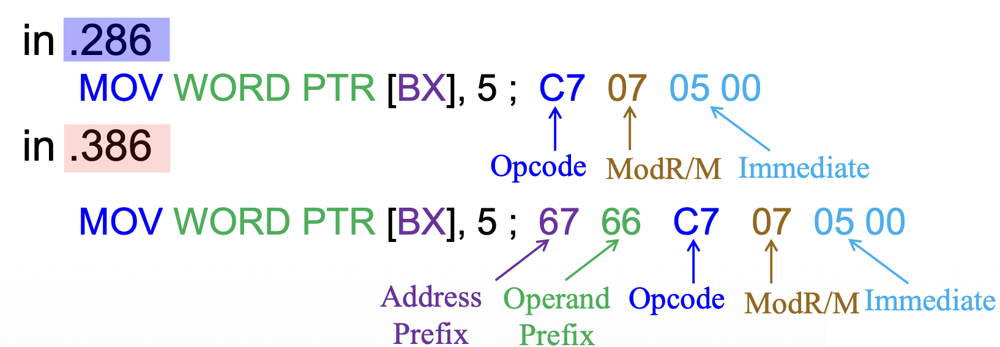
    </div>

---
在代码段描述符中，D/B-bit 和 L-bit 表示操作模式：

- L = 0，D/B = 0：16 位
- L = 0，D/B = 1：32 位
- L = 1：64 位

<div style="text-align: center">
    
</div>

操作数大小前缀 `66H` 选择了非默认的操作数大小，而地址大小前缀 `67H` 改变了内存操作数的默认地址大小。

<div style="text-align: center">
    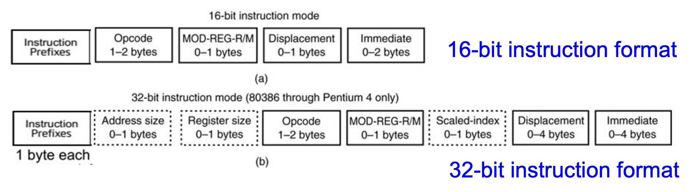
</div>

??? example "例子"

    <div style="text-align: center">
        
    </div>

{ align=right width=20% }


### Instructions Stored in Memory

- 指令以**小端序**(little-endian)存储在内存中，即指令的第一个字节存储在最低的内存地址上
- 因为指令本质上是字节串，所以它们能在任何内存地址上起始
- 总的指令长度不超过 15 个字节，超出限制的话就会触发**通用保护异常**(general-protection exception)

<br/>


### Opcode-Byte 1

**第一个操作码字节**负责选择由微处理器执行的运算（比如加法、减法等）。下图展示了多数指令的第一个操作码字节的一般形式：

<div style="text-align: center">
    
</div>

- 第一个字节的前 6 位是二进制操作码
- 剩余 2 位分别表示数据流的**方向**（D）和**数据大小**（W）（字节或字）
    - 方向位 D
        - D = 1：R/M 区域 -> REG 区域
        - D = 0：REG 区域 -> R/M 区域

    <div style="text-align: center">
        
    </div>

    - 宽度位 W
        - W = 1：字或双字
        - W = 0：只能是字节

    其中 W 位出现在大多数指令中，而 D 位主要出现在 `#!asm MOV` 指令和其他一些指令中

<div style="text-align: center">
    
</div>

???+ question "为何要设置方向位？"

    === "问题"

        既然汇编语法已经区分了源操作数和目标操作数，并清楚地指定了数据流向的方向，那么为什么 MOD-REG-R/M 字节不简单地在 REG 字段中编码目标操作数，在 R/M 字段中编码源操作数呢？

        <div style="text-align: center">
            
        </div>

    === "解答"

        - 在 MOD-REG-R/M 字节中，当两个操作数都使用寄存器寻址时，固定目的操作数和源操作数的编码位置效果较好；然而，当涉及**内存寻址**时，情况变得复杂
        - 由于指令中**最多只有一个操作数使用内存寻址**，Intel 设计了一个方向位来指示数据是流向 R/M（作为目的）还是从 R/M 流出（作为源），这是一个更高效且更优雅的编码方案
        - 在 RISC 架构（例如，RISC-V、ARM）中，由于不支持多种寻址模式，**指令格式采用固定位置来表示源操作数和目的操作数**，这样数据流向就内在地通过指令格式中操作数的位置来编码

        <div style="text-align: center">
            
        </div>


### MOD Field-Byte 2

**MOD 字段**指定所选指令的寻址模式，并选择寻址类型以及所选类型是否带有偏移。

<div style="text-align: center">
    
</div>

- 如果 MOD 字段包含 11，则选择的是**寄存器寻址模式**，此时会使用 R/M 字段来指定一个寄存器
- 如果 MOD 字段包含 00、01 或 10，则 R/M 字段选择**数据内存寻址模式**之一


### REG/Opcode Field-Byte 2

**REG/Opcode 字段**指明了寄存器号或有关操作码信息的 3 个额外位。

???+ example "例子"

    <div style="text-align: center">
        
    </div>


### R/M Memory Addressing

**R/M 字段**指明一个作为操作数的寄存器，或者和 MOD 字段结合来编码一种寻址模式。

- 若 MOD 字段为 00、01、10，那 R/M 字段就有了新的含义

???+ example "例子"

    下图展示了 16 位指令 `#!asm MOV DL,[DI]`（`8A15H`）的机器码：

    <div style="text-align: center">
        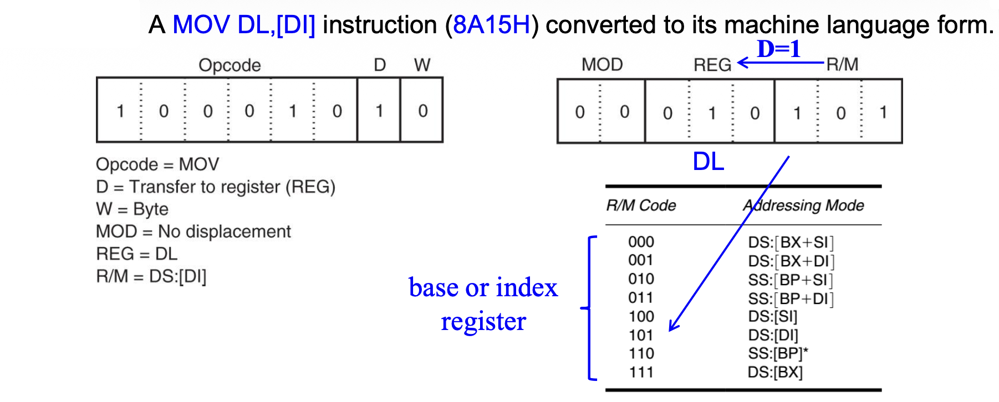
    </div>

    - Opcode = 100010，D = 1，W = 0，MOD = 00，REG/Opcode = 010（`DL`），R/M = 101（`[DI]`）
    - 若指令变成 `8A5501H`（多了 `01H` 的偏移量）
        - 前面一个字节保持不变
        - MOD 字段变为 `01`，用于 8 位偏移
        - 于是指令变为 `#!asm MOV DL,[DI+1]`
    
        <div style="text-align: center">
            
        </div>


### 32-Bit Addressing Modes

当 R/M = 100 时，一个叫做**比例变址字节**(scaled-index byte)的额外字节出现在指令中，表示比例变址寻址的额外形式。

<div style="text-align: center">
    
</div>

- 在 80386 到 Core 2 处理器中，有超过 32,000 中 `#!asm MOV` 指令的变体
- 下图展示了当 80386 及以上版本使用 32 位地址时，指令中 R/M = 100 时比例变址字节的格式：

    <div style="text-align: center">
        
    </div>

    - 最左边两位表示比例因子（乘数）1x、2x、4x、8x
    - 比例变址寻址还可以使用一个乘以比例因子的单个寄存器
    - 变址和基址字段同时包含寄存器号

??? example "例子"

    <div style="text-align: center">
        
    </div>


### 64-Bit Mode for the Pentium 4 and Core2

- 在 64 位模式下，添加了一个名为** REX（寄存器扩展）**的前缀，用于启用操作数大小扩展和寄存器 `R8`-`R15`
- REX 不是一个单个的唯一值，而是占据一个范围（40h 到 4Fh），并位于其它前缀之后，操作码之前
- 目的是修改指令第二字节中的 REG 和 R/M 字段
    - REX 用于引用寄存器 `R8`-`R15`
- REX 包含五个字段：高四位是 REX 前缀独有的，作为标识；低四位分为四个 1 位字段（W、R、X、B）

<div style="text-align: center">
    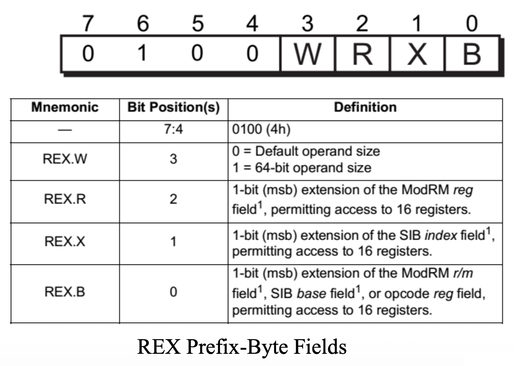
</div>

下图说明了 REX 在操作码第二个字节的结构和应用：

<div style="text-align: center">
    
</div>

- REG 字段只能包含寄存器赋值，就像在其他操作模式中
- R/M 字段包含寄存器或内存赋值

???+ example "例子"

    <div style="text-align: center">
        
    </div>

下图展示了带有 REX 前缀的比例变址字节，用于更复杂的寻址模式：

<div style="text-align: center">
    
</div>

???+ example "例子"

    <div style="text-align: center">
        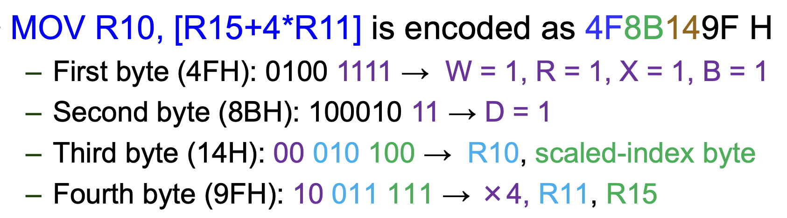
    </div>


### Legacy Prefixes

指令前缀分为四组。每条指令只能使用每个组中的一个前缀：

- 组 1
    - 0xF0: LOCK
    - 0xF2: REPNE/REPNZ
    - 0xF3: REP or REPE/REPZ
- 组 2
    - 0x26: ES 段重写
    - 0x2E: CS 段重写
    - 0x36: SS 段重写
    - 0x3E: DS 段重写
    - 0x64: FS 段重写
    - 0x65: GS 段重写
- 组 3：0x66: 操作数大小重写前缀
- 组 4：0x67: 地址大小重写前缀


#### Lock Prefix

- **LOCK** 前缀会让某些类型的内存读/改/写指令执行**原子操作**
- 该前缀旨在使处理器在多处理器系统中独占(exclusive)使用共享内存
- LOCK前缀只能与以下写入内存操作数的指令一起使用：

    ```asm
    BTC, BTR, BTS
    ADC, ADD, AND, DEC, INC, NEG, NOT, OR, SBB, SUB, XOR
    CMPXCHG, CMPXCHG8B, CMPXCHG16B, XADD, XCHG
    ```

- 如果将 LOCK 前缀与上面没提到的指令一起使用，将发生**未定义的操作码异常**(undefined opcode exception)（#UD）


#### Segment Override Prefix

- 处理器可以自动根据以下规则选择**默认段**：
    - 指令：CS
    - 局部数据：DS
    - 栈：SS
    - 目标字符串：ES

- 程序员可以使用**段重写前缀**来重写默认段，该前缀要放置在指令开头的字节上

???+ example "例子"

    在 32 位模式下：

    ```asm
    MOV EAX, [EBX]      ; 8B 03, default segment = DS
    MOV EAX, CS: [EBX]  ; 2E 8B 03, the 2E is CS segment override prefix
    ```


#### Operand-Size Override Prefix

- 在 64 位模式下，指令默认使用 32 位操作数大小
- 前缀允许混合 16 位、32 位和 64 位数据：
    - **REX**（**REX.W**）前缀可以指定 64 位操作数大小
    - **66H 前缀**指定 16 位操作数大小
    - REX 前缀的优先级高于 66H 前缀

<div style="text-align: center">
    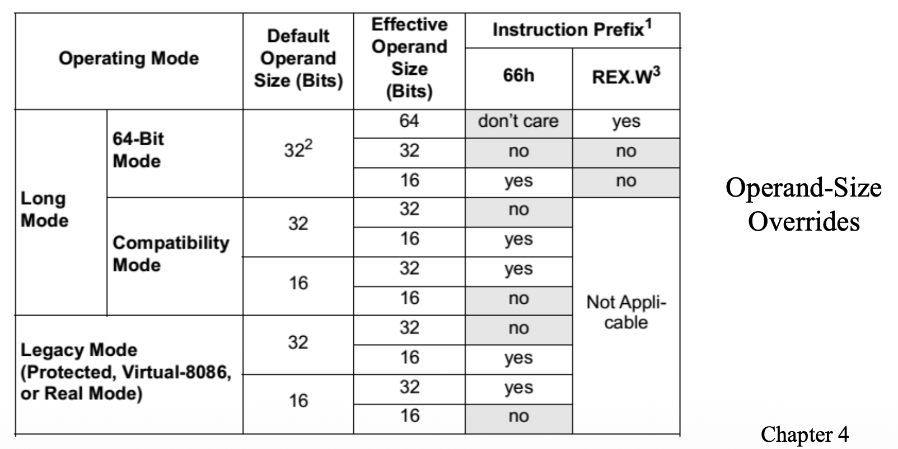
</div>

**默认操作数大小**由当前操作模式定义，但操作数大小重写前缀（REX或66H）可以改变默认操作数大小。

<div style="text-align: center">
    
</div>

???+ example "例子"

    在 64 位模式（默认操作数大小 = 32 位）：

    <div style="text-align: center">
        
    </div>

???+ abstract "操作数大小总结"

    | Prefix / Bit | Effect on Operand Size | Notes |
    | :--- | :--- | :--- |
    | Opcode W-bit | 8-bit $\leftrightarrow$ full-size (16, 32, 64-bit) | Works in all modes |
    | 0x66 prefix | 16-bit override (16-bit $\leftrightarrow$ 32-bit) | Works in all modes |
    | REX.W bit | 32-bit $\leftrightarrow$ 64-bit | Only in 64-bit mode |


#### Address-Size Override Prefix

内存操作数的默认地址大小由当前操作模式确定，但可以通过**地址大小重写前缀（67H）**来重写。比如在 64 位模式下，地址默认为 64 位，但可以通过地址大小前缀重写为 32 位。

???+ example "例子"

    <div style="text-align: center">
        
    </div>

---
??? question "Quiz"

    === "问题"

        在 32 位操作模式下，以下哪个（或哪些）前缀可以应用到指令：`#!asm MOV AL, [BX]` 上？

        A. 仅用操作数重写前缀

        B. 仅用地址重写前缀

        C. 同时用到操作数重写前缀和地址重写前缀

        D. 一个也没用到

    === "解答"

        B

        ```asm
        MOV AL, [BX] ; -> 67 8A 07
        ```


### VEX Prefix (Vector Extensions)

- VEX 前缀以字节 `C4H` 或 `C5H` 开始
- 可用于编码操作 `YMM` 或 `XMM` 寄存器的指令
- 支持超过三个操作数
- 支持非破坏性源操作数的指令语法编码

???+ example "例子"

    指令 `#!asm VADDPS XMM0, XMM1, XMM2` 编码为 `C5 F0 58 C2`

    - 功能：添加打包的单精度浮点值：

        ```c
        xmm0 = xmm1 + xmm2
        ```

    - 语法：标准的三操作数 AVX 语法
    - 2 字节 VEX 前缀：`C5 F0`


### Escape Sequence / Opcode

- 由于架构定义的指令超过 256 条，因此必须定义多个不同的操作码映射
- 通过使用一个**转义操作码字节（0FH）**或**两字节的转义（0F38H，0F3AH）**，转义序列用于扩展编码空间，以提供给其他操作码

<div style="text-align: center">
    
</div>

???+ example "例子"

    - `0F AF` 是 `#!asm IMUL r16, r/m16` 的操作码
    - `0F B6` 是 `#!asm MOVZX r16, r/m8` 的操作码
    - 这些常见指令是在 8086 之后引入的，并且没有剩余的编码空间来为它们提供单字节操作码

    <div style="text-align: center">
        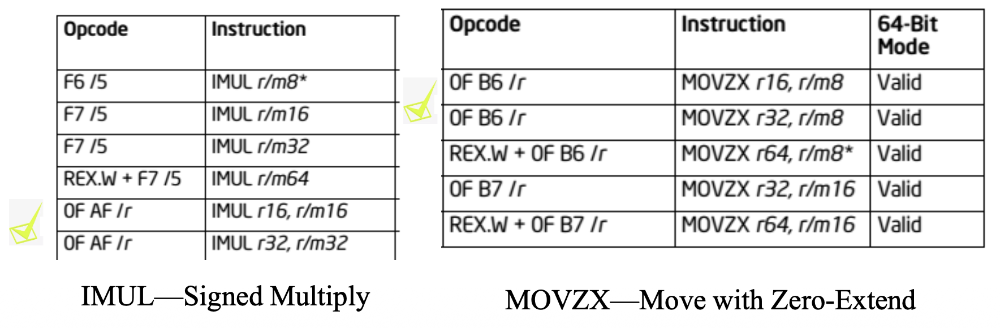
    </div>


## Load Effective Address

- 加载有效地址指令集用来支持像 C 这样的高级语言
- 两种加载有效地址指令类型：
    - `#!asm LEA`：加载**近指针**（偏移量）
    - `#!asm LDS`、`#!asm LES`、`#!asm LFS`、`#!asm LGS`、`#!asm LSS` 加载**远指针**（段选择符和偏移量）

???+ example "例子"

    考虑以下表示 `(x, y)` 坐标的结构体：

    ```c
    struct point {
        int x;
        int y;
    };
    ```

    假如有以下函数：

    <div class="grid cards" markdown>

    -   `#!asm MOV EDX, [EBX + 8*EAX + 4]`

        ```c
        // load the value of y
        int query(struct point points[], int i) {
            return points[i].y;
        }
        ```

    -   `#!asm LEA ESI, [EBX + 8*EAX + 4]`

        ```c
        // load the address of y
        int query(struct point points[], int i) {
            return &(points[i].y);
        }
        ```

    </div>

    注：`EBX` 是数组（点）的基址，`EAX` 表示变量 `i`，`8` 是每个点的比例因子，`4` 是 `y` 的偏移量


### LEA

- 将操作数指定的数据的偏移地址加载到 16 位或 32 位寄存器中
- 通过比较 `LEA` 与 `MOV`，我们观察到：
    - `#!asm LEA BX, [DI]` 将 `[DI]`（`DI` 的内容）指定的**偏移地址**加载到 `BX` 寄存器中
    - `#!asm MOV BX, [DI]` 将 `[DI]` 地址指向的内存位置存储的**数据**加载到寄存器 `BX` 中
- `#!asm SEG` 和 `#!asm OFFSET` 指令返回内存位置的段和偏移值
- 如果操作数是一个偏移量，那么 `#!asm OFFSET` 执行和 `#!asm LEA` 相同的功能
- `#!asm OFFSET` 指令比 `#!asm LEA` 指令**更高效**
    - `#!asm MOV BX, OFFSET LIST` 需要 1 个时钟周期
    - 80486 微处理器中，`#!asm LEA BX, LIST` 需要 2 个时钟周期

- 实际上，`#!asm MOV BX, OFFSET LIST` 指令被汇编为立即数移动指令，效率更高（比如 `#!asm MOV BX, 0x9`）
- 既然 `#!asm OFFSET` 已经能完成同样的任务，为什么还要有 `#!asm LEA` 指令？
    - `#!asm OFFSET` 只能与像 `LIST` 这样简单的操作数一起使用，不能用于像 `[DI]`、`[SI]`、`[BX+DI]` 这样的操作数，例如：
        - `#!asm LEA BX, [DI]` -> `#!asm MOV BX, DI`
        - `#!asm LEA SI, [BX+DI]`：这条指令将 `BX` 加到 `DI` 上，并将和存储在 `SI` 寄存器中；由这条指令生成的和是一个模 64K 的和

???+ example "例子"

    <div style="text-align: center">
        
    </div>


### LDS, LES, LFS, LGS, and LSS

- `#!asm LDS` 和 `#!asm LES` 从内存加载远地址
    - 使用检索自内存中的偏移地址来加载一个 16 或 32 位寄存器
    - 然后将 `DS` 或 `ES` 加载为从内存中检索到的段地址或段选择符

???+ example "例子"

    <div style="text-align: center">
        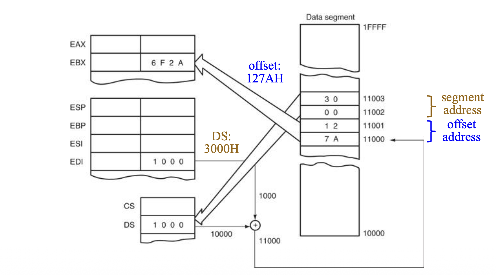
    </div>

- 指令使用任何内存寻址模式来访问包含段和偏移地址的 **32 位或 48 位内存段**
    - 32 位远指针：16 位段 + 16 位偏移
    - 48 位远指针：16 位选择符 + 32 位偏移
- 在 80386 及以上版本中，增加了 `#!asm LFS`、`#!asm LGS` 和 `#!asm LSS` 指令
- 使用一个偏移地址加载任何 16 位或 32 位寄存器，并且使用一个段地址或段选择子来加载 `DS`、`ES`、`FS`、`GS` 或 `SS` 段寄存器
- `#!asm LDS`、`#!asm LES`、`#!asm LFS`、`#!asm LGS`、`#!asm LSS` 指令从内存中获取一个新的远地址。
    - 偏移地址首先出现，随后是段地址或段选择符

- 此格式用于存储所有 32 位内存地址

    <div style="text-align: center">
        
    </div>

- 远地址可以通过汇编器存储在内存中，其中最有用的加载指令是 `LSS` 指令

???+ example "例子"

    通过使用 `#!asm LSS` 指令同时加载 `SS` 和 `SP` 来重新激活旧栈区：

    <div style="text-align: center">
        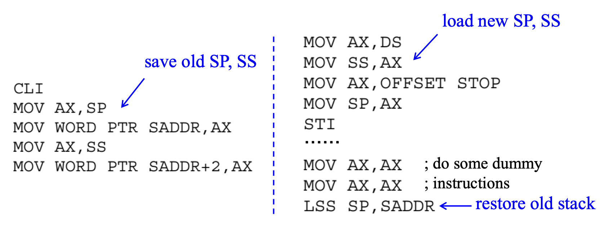
    </div>

- `#!asm CLI`（禁用中断）和 `#!asm STI`（启用中断）指令必须包含禁用中断的内容


## String Data Transfers

- 五个**字符串数据传输指令**(string data transfer instructions)：`#!asm LODS`, `#!asm STOS`, `#!asm MOVS`, `#!asm INS`, `#!asm OUTS`
- 两个**字符串比较指令**(string comparison instructions)：`#!asm SCAS`, `#!asm CMPS`
    - 指令的前 2-3 个字母表明了指令的功能，
    - 所有指令中的 "S" 代表字符串

- 每个指令都允许以单字节、字或双字的形式进行数据传输或比较，并隐式使用 `DI`、`SI` 或同时使用两个寄存器来寻址内存
- 字符串指令执行效率高，因为它们会自动重复并增加数组索引

???+ example "例子：字符串比较"

    <div style="text-align: center">
        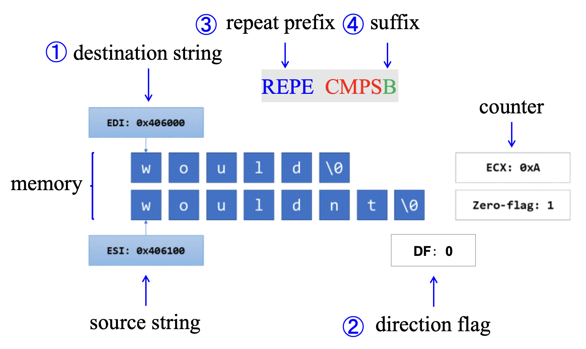
    </div>

- `DI` / `EDI`, `SI` / `ESI`
    - `DI` / `EDI` 带有额外段 `ES`，**不能**被覆盖
    - `SI` / `ESI` 带有数据段 `DS`，**可以**被覆盖

- **方向标志**(direction flag)
    - D = 0：自动递增
    - D = 1：自动递减

- `#!asm REP` 和 `CX` / `ECX`
    - 重复前缀（`#!asm REP`）使得指令可以重复 n 次，其中 n 是存储在 `CX` / `ECX` 中的值

- 允许的带后缀的形式
    - `B`：字节
    - `W`：字
    - `D`：双字
    - 例如：
        – `#!asm MOVSB`：字节大小的 `#!asm MOVS`
        – `#!asm LODSW`：字大小的 `#!asm LODS`


### DI and SI

- 在执行字符串指令期间，内存访问通过 `DI` 和 `SI` 寄存器进行
    - `DI` 偏移地址访问使用附加段（`ES`）的所有字符串指令中的数据
    - `SI` 偏移地址默认访问数据段（`DS`）中的数据

- 在 32 位模式下操作时，使用 `EDI` 和 `ESI` 寄存器代替 `DI` 和 `SI`
    - 此时字符串能使用整个 4G 字节保护模式地址空间中的任何内存位置


### Direction Flag

- **方向标志**(direction flag)（D，位于**标志寄存器**中）在字符串操作期间选择 `DI` 和 `SI` 寄存器的**自动增减**操作
    - 仅与字符串指令一起使用

- `#!asm CLD` 指令清除 D 标志，`#!asm STD` 指令设置它
    - `#!asm CLD` 指令选择自动增模式
    - `#!asm STD` 指令选择自动减模式


### Using a Repeat Prefix

- 字符串原语指令仅处理单个内存值或一对值；若添加了一个**重复前缀**(repeat prefix)，则指令会重复执行，并使用 `CX` 或 `ECX` 作为**计数器**
- 重复前缀使用单个指令来处理整个数组
- 下面列举了可用的重复前缀：

    <div style="text-align: center">
        
    </div>


???+ example "示例：拷贝一个字符串"

    - 在以下示例中，`#!asm MOVSB` 将 10 个字节从 `string1` 移动到 `string2`
    - 当 `#!asm MOVSB` 重复执行时，`ESI` 和 `EDI` 会自动增加，此行为受方向标志控制

    ```asm
    cld                         ; clear direction flag
    mov esi, OFFSET string1     ; ESI points to source
    mov edi, OFFSET string2     ; EDI points to target
    mov ecx, 10                 ; set counter to 10
    rep movsb                   ; move 10 bytes
    ```

    <div style="text-align: center">
        
    </div>


### LODS

- `#!asm LODS` 从源位置 `DS:SI` 传输一个字节、字或双字到 `AL`、`AX` 或 `EAX`；后缀表示操作数的大小
    - `#!asm LODSB`：`DS:SI/ESI` $\pm$ 1
    - `#!asm LODSW`：`DS:SI/ESI` $\pm$ 2
    - `#!asm LODSD`：`DS:SI/ESI` $\pm$ 4

- `#!asm LODS` 使用**隐式操作数**(implicit operands)（`AL`、`AX`、`EAX`），即在操作数或操作码中未明确提及的操作数

下图展示了 `#!asm LODSW` 指令的操作细节：

<div style="text-align: center">
    
</div>


### STOS

- `#!asm STOS` 将一个字节、字或双字从 `AL`、`AX` 或 `EAX` 存储到目标位置 `ES:DI` 上
    - `#!asm STOSB`：`ES:DI/EDI` $\pm$ 1
    - `#!asm STOSW`：`ES:DI/EDI` $\pm$ 2
    - `#!asm STOSD`：`ES:DI/EDI` $\pm$ 4

- `#!asm STOS` 使用**隐式操作数**(implicit operands)（`AL`、`AX`、`EAX`）
- 重复前缀（`REP`）可被添加到**除 `#!asm LODS` 型指令外**（防止寄存器中的数据被覆盖）的任何字符串数据传输指令中
- 如果 `CX` 值为 0，字符串指令终止，程序继续执行
- 如果 `CX` 的值为 100，并执行 `#!asm REP STOSB` 指令，微处理器将自动重复 `#!asm STOSB` 100 次
- 当与 `REP` 前缀一起使用时，`#!asm STOS` 指令可用于将单个值填充到字符串或数组的所有元素中

??? example "例子"

    以下代码将 `string1` 中的每个字节初始化为 `0FFh`

    ```asm
    .data
    Count = 100
    string1 BYTE Count DUP (?)

    .code
    mov al, OFFh                ; value to be stored
    mov edi, OFFSET string1     ; EDI points to target
    mov ecx, Count              ; character count
    cld                         ; direction = forward
    rep stosb                   ; fill with contents of AL
    ```


### MOVS

- `#!asm MOVS` 从 `DS:SI` 传输一个字节、字或双字到 `ES:DI`，并且更新 `SI` 和 `DI`
    - `#!asm MOVSB`：（`DS:SI` 和 `ES:DI`）$\pm$ 1
    - `#!asm MOVSW`（`DS:SI` 和 `ES:DI`）$\pm$ 2
    - `#!asm MOVSD`（`DS:SI` 和 `ES:DI`）$\pm$ 4

- 用于移动一个内存块
- 该指令是唯一一个在 8086 到 Pentium 4 微处理器中可以实现**内存到内存传输**(memory-to-memory transfer)的合法指令

???+ example "例子"

    传输两个双字内存块：

    - C++ 版本：

    ```cpp
    void TransferBlocks(int blockSize, int* blockA, int* blockB) {
        for (int a = 0; a < blockSize; a++) {
            *blockB = *blockA++;
            blockB++;
        }
    }
    ```

    - 内联汇编：

        ```cpp
        void TransferBlocks(int blocksize, int* blockA, int* blockB) {
            _asm{
                push es                     ; save registers
                push edi
                push esi
                push ds                     ; copy DS into ES
                pop  es
                mov  esi, blockA            ; address blockA
                mov  edi, blockB            ; address blockB
                mov  ecx, blocksize         ; load count
                rep  movsd                  ; move data
                pop  esi
                pop  edi
                pop  es                     ; restore registers
            }
        }
        ```


### INS

`#!asm INS` 指令将一个字节、字或双字数据从 I/O 设备传输到附加段内存位置。

<div style="text-align: center">
    
</div>

- `#!asm INS` 使用 `DX` 或 `EDX` 作为源操作数来指定 I/O 地址或 I/O 端口
- 目标操作数是由 `ES:DI` 或 `ES:EDI` 寻址的内存位置
- 适用于将外部 I/O 设备的一块数据直接输入到内存中
- 一种应用将数据从硬盘驱动器（通常被视为计算机系统中的I/O设备）传输到内存中
- 存在两种形式的 `#!asm INS` 指令：**显式操作数形式**(explicit-operands form)和**无操作数形式**(no-operands form)
    - 显式操作数形式允许显式指定源操作数和目的操作数，例如，`#!asm INS WORD PTR [DI], DX`
        - 源操作数必须是 `DX`，目的操作数应该是 `ES:DI` 或 `ES:EDI`
    - 无操作数形式提供了 `#!asm INS` 指令的字、字和双字版本的“简短形式”
        - `#!asm INSB`：从 8 位 I/O 设备输入数据，并将其存储在由 `DI` 索引的内存位置
        - `#!asm INSW`：输入 16 位 I/O 数据，并将其存储在**字**大小的内存位置
        - `#!asm INSD`：输入 32 位 I/O 数据，并将其存储在**双字**大小的内存位置
        - 这些指令可以使用 `#!asm REP` 前缀重复使用，允许将整个输入数据块从 I/O 设备存储到内存中

???+ example "例子"

    以下指令序列从 I/O 设备（其 I/O 端口为 `03ACH`）输入 50 字节的数据，并将数据存储在额外段内存数组 `LISTS` 中：

    ```asm
                        ; Using the REP INSB to input data to a memory array
    0000 BF 0000 R      MOV DI, OFFSET LISTS     ; address array
    0003 ВА ОЗАС        MOV DX, ЗACH             ; address I/O
    0006 FC             CLD                      ; auto-increment
    0007 B9 0032        MOV CX, 50               ; load counter
    000A F3/6C          REP INSB                 ; input data
    ```


### OUTS

- `#!asm OUTS` 指令将一个字节、字或双字数据从数据段内存地址传输到 I/O 设备中
    - 源操作数是一个由 `DS:SI` 或 `DS:ESI` 寻址的内存位置
    - 目标操作数（I/O 地址或 I/O 端口）包含在 `DX` 寄存器中，与 `INS` 指令相同

- 存在两种形式的 `#!asm OUTS` 指令：**显式操作数形式**和**无操作数形式**
    - 显式操作数形式允许显式指定源操作数和目的操作数，例如 `#!asm OUTS DX, WORD PTR [SI]`
        - 源操作数应为 `DS:SI` 或 `DS:ESI`，而目的操作数必须是 `DX`

    - 无操作数形式提供了 `#!asm OUTS` 指令的字节、字和双字版本的“简短形式”
        - `#!asm OUTSB`：将 `SI` 索引的**字节**数据输出到 8 位 I/O 设备
        - `#!asm OUTSW`：将**字**大小的内存数据输出到 16 位 I/O 设备
        - `#!asm OUTSD`：将**双字**大小的内存数据输出到 32 位 I/O 设备

- 注意：在 Pentium 4 和 Core 2 的 64 位模式下，没有 64 位的输出，并且在 `#!asm OUTS` 指令中，64 位的内存地址位于 `RDI` 中

???+ example "例子"

    以下指令序列将数据从数据段内存数组（`ARRAY`）传输到 I/O 地址为 `3ACH` 的 I/O 设备中：

    ```asm
                            ; Using the REP OUTSB to output data from a memory array
    0000 BE 0064 R          MOV SI, OFFSET ARRAY    ; address array
    0003 ВА ОЗАС            MOV DX, 3ACH            ; address I/O
    0006 FC                 CLD                     ; auto-increment
    0007 B9 0064            MOV CX, 100             ; load counter
    000A F3/6E              REP OUTSB               ; output data
    ```


## Miscellaneous Data Transfer Instructions

### XCHG

- `#!asm XCHG` 指令将寄存器的内容与任何其他寄存器或内存位置交换，但不能交换段寄存器或内存到内存的数据
- 是一种具有双输出的罕见指令类型
- 交换的数据可以是字节、字、双字或四字，并使用除了立即寻址以外的任何寻址模式
- 使用 16 位 `AX` 寄存器与另一个 16 位寄存器进行 `#!asm XCHG` 操作，是最有效的交换；此指令占用 1 个字节的内存
- 下表展示了各种 `XCHG` 指令的形式：

    | 汇编语言 | 操作 |
    | :--- | :--- |
    | `#!asm XCHG AL, CL` | 交换 `AL` 和 `CL` 的内容 |
    | `#!asm XCHG CX, BP` | 交换 `CX` 和 `BP` 的内容 |
    | `#!asm XCHG EDX, ESI` | 交换 `EDX` 和 `ESI` 的内容 |
    | `#!asm XCHG AL, DATA2` | 交换 `AL` 和数据段内存位置 `DATA2` 的内容 |
    | `#!asm XCHG RBX, RCX` | 交换 `RBX` 和 `RCX` 的内容（64 位模式）|

- 当使用内存寻址模式和汇编器时，哪个操作数寻址内存无关紧要，例如 `#!asm XCHG AL, [DI]` 与 `#!asm XCHG [DI], AL` 相同
- `#!asm XCHG` 对于实现进程同步中的**信号量**(semaphore)很有用

???+ example "例子"

    <div style="text-align: center">
        
    </div>


### LAHF and SAHF

- `#!asm LAHF`指令将 `EFLAGS` 寄存器的低 8 位传输到 `AH` 寄存器
    - `#!asm AH := EFLAGS(SF:ZF:0:AF:0:PF:1:CF)`
        - 包括加载符号标志（`SF`）、零标志（`ZF`）、辅助进位标志（`AF`）、奇偶标志（`PF`）和进位标志（`CF`）
        - `EFLAGS` 的保留位（第 1、3 和 5 位）被分别设置为 1、0 和 0

    - 如果 `CPUID.80000001H:ECX.LAHF-SAHF[bit 0] = 1`，则 `#!asm LAHF` 指令在 64 位模式下可用

- `#!asm SAHF` 指令将 `AH` 寄存器对应位（分别对应位 7、6、4、2 和 0）的值传输给 `EFLAGS` 寄存器的 `SF`、`ZF`、`AF`、`PF` 标志
    - 忽略 `AH` 寄存器的第 1、3 和 5 位，直接将 `EFLAGS` 寄存器中的这些位分别设置为 1、0 和 0
    - 如果 `CPUID.80000001H:ECX.LAHF-SAHF[bit 0] = 1`，则 `#!asm SAHF` 指令在 64 位模式下可用


### XLAT

- `#!asm XLAT`（表查找转换(table look-up translation)）指令使用隐式操作数（`AL`，`BX`）
    - `AL` 寄存器中的无符号整数作为偏移量到表（`[BX]`）中，并将该位置的表内容（`[BX + AL]`）复制到 `AL` 寄存器中
    - `#!asm XLAT` 的作用类似于 `#!asm MOV AL, [seg:BX + AL]`
    - `seg:[BX]` 是表的基址；`DS` 是默认段，它可能被段前缀重写

- 注意 `[seg:BX + AL]` 不是一个合法的内存操作数，只有 `#!asm XLAT` 会接受它
- `#!asm XLAT` 常用于将一种格式的数据翻译成另一种格式；下面以“把菜单中食物的索引转换为食物的价格”为例：
    - 首先，为包含价格的表预留 256 字节
    - 然后，使用该表的地址加载 `DS:BX`，并将食物的索引放入 `AL` 上
    - 接着 `#!asm XLAT` 把表中的索引转换为价格

- `#!asm XLAT` 写入 `AL` 而不改变 `EAX[31:8]`
- `#!asm XLAT`指令的工作流程：
    - 首先将 `AL` 的内容加到 `BX` 上，形成数据段内的内存地址
    - 然后将该地址的内容复制到 `AL` 中

???+ example "例子"

    假设一个 7 段 LED 显示器查找表存储在地址 `TABLE` 的内存中。`#!asm XLAT` 指令使用查找表将 `AL` 中的 BCD 数字转换为 `AL` 中的 7 段编码。

    ```asm
    TABLE   DB 3FН, 06H, 5BH, 4FH           ; lookup table (7-segment code)
            DB 66H, 6DH, 7DH, 27H
            DB 7FH, 6FH
    LOOK:   MOV AL, 5                       ; load AL (BCD number) with 5 (a test number)
            MOV BX, OFFSET TABLE            ; address lookup table
            XLAT                            ; convert
    ```

    下图展示了上述示例程序在 `TABLE = 1000H`，`DS = 1000H`，以及 `AL` 的初始值为 `05H`（BCD）时的操作。转换后，`AL = 6DH`。

    <div style="text-align: center">
        
    </div>


### Input Ports and Output Ports

- 外部设备如屏幕、显示器、键盘、鼠标、硬盘和网络通过**输入端口**(input ports)和**输出端口**(output ports)连接到数据总线
- 每个输入或输出端口都有一个**唯一的地址**，就像内存中的每个字节单元都有一个唯一的地址一样
- 输出端口

    <div style="text-align: center">
        
    </div>

    - 输出端口有一个**比较器**(comparator)，该比较器比较固定地址与地址总线上的值
    - 如果地址等于端口地址，且控制总线上有写信号，锁存器(latch)将存储数据总线上的值

- 输入端口

    <div style="text-align: center">
        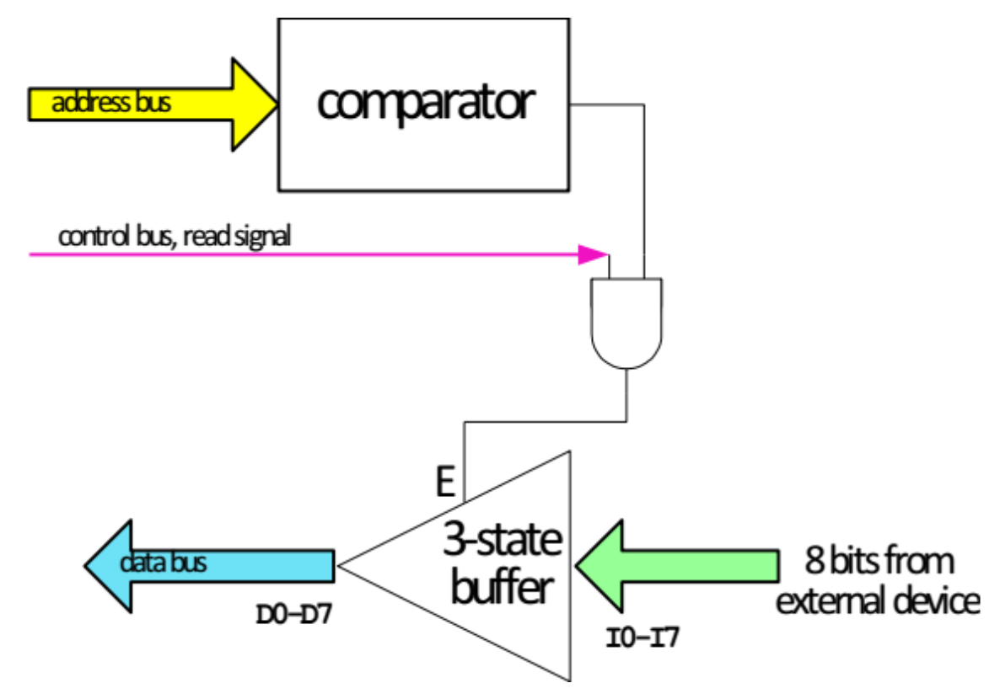
    </div>

    - 每个来自外部设备的输入都经过一个**三态缓冲器**(three-state buffer)到达数据总线
    - 当地址总线等于输入端口的固定地址，且控制总线上有读信号时，三态缓冲器被启用


### IN and OUT

- `#!asm IN` 和 `#!asm OUT` 指令执行 I/O 操作
- 仅允许 `AL`、`AX` 或 `EAX` 的内容在 I/O 设备和微处理器之间传输
    - `#!asm IN`：将外部 I/O 设备的数据传输到 `AL`、`AX` 或 `EAX`，例如 `#!asm IN AL, 19H`
    - `#!asm OUT`：将 `AL`、`AX` 或 `EAX` 的数据传输到外部 I/O 设备，例如，`#!asm OUT 32H, AX`

- 指令通常存储在 **ROM** 中
    - 存储在 ROM 中的固定端口指令，其端口号由于只读存储器的特性而**永久固定**

- 而存储在 RAM 中的固定端口地址可以被修改，但这种修改不是良好的编程实践
- 在 I/O 操作期间，端口地址出现在**地址总线**(address bus)上
- I/O 设备（端口）的寻址方式分为以下两类：
    - **固定端口寻址**(fixed-port addressing)：使用 8 位 I/O 端口地址在 `AL`、`AX` 或 `EAX` 之间进行数据传输，例如 `#!asm IN AL, 12H`，`#!asm OUT 25H, AX`
        - 端口号是紧随指令操作码之后的**字节立即值**（`00h` 至 `FFh`）
    - **可变端口寻址**(variable-port addressing)：在 `AL`、`AX` 或 `EAX` 与 16 位端口地址之间进行数据传输，例如 `#!asm IN AL, DX`，`#!asm OUT DX, AX`
        - I/O 端口号存储在寄存器 `DX`（`0000h` 至`FFFFh`）中，可以在程序执行过程中改变

???+ example "例子"

    下图展示了 `#!asm OUT 19H, AX` 指令的执行过程（将 `AX` 的内容传输到 I/O 端口 `19H`）：

    <div style="text-align: center">
        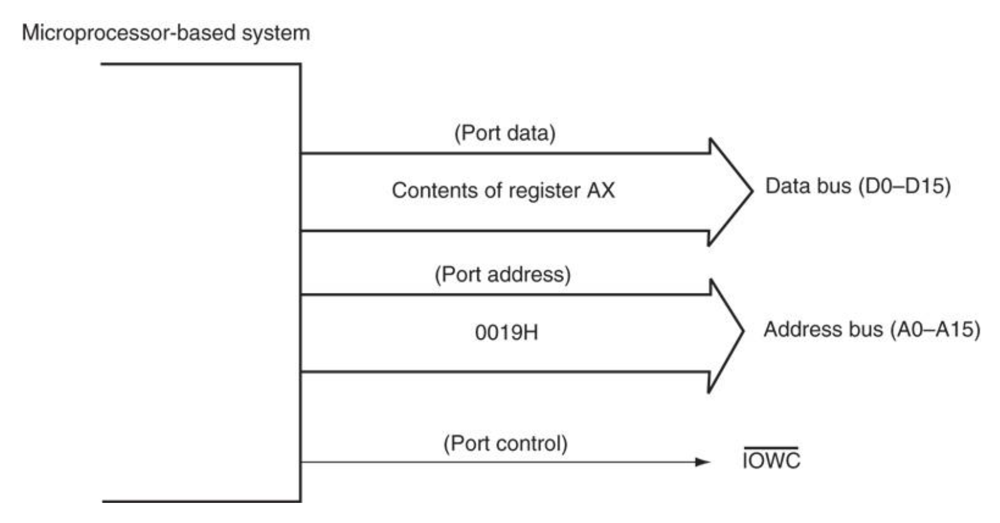
    </div>

- `#!asm OUT` 指令中使用的源寄存器决定了端口的大小（8 位、16 位或 32 位）
- 下表展示了各种形式下的 `#!asm IN` 和 `#!asm OUT` 指令：

    | 汇编语言 | 操作 |
    | :--- | :--- |
    | `#!asm IN AL, p8` | 8 位数据从 I/O 端口 `p8` 输入到 `AL` |
    | `#!asm IN AX, p8` | 16 位数据从 I/O 端口 `p8` 输入到 `AX` |
    | `#!asm IN EAX, p8` | 32 位数据从 I/O 端口 `p8` 输入到 `EAX` |
    | `#!asm IN AL, DX` | 8 位数据从 I/O 端口 `DX` 输入到 `AL` |
    | `#!asm IN AX, DX` | 16 位数据从 I/O 端口 `DX` 输入到 `AX` |
    | `#!asm IN EAX, DX` | 32 位数据从 I/O 端口 `DX` 输入到 `EAX` |
    | `#!asm OUT p8, AL` | 8 位数据从 `AL` 输出到 I/O 端口 `p8` |
    | `#!asm OUT p8, AX` | 16 位数据从 `AX` 输出到 I/O 端口 `p8` |
    | `#!asm OUT p8, EAX` | 32 位数据从 `EAX` 输出到 I/O 端口 `p8` |
    | `#!asm OUT DX, AL` | 8 位数据从 `AL` 输出到 I/O 端口 `DX` |
    | `#!asm OUT DX, AX` | 16 位数据从 `AX` 输出到 I/O 端口 `DX` |
    | `#!asm OUT DX, EAX` | 32 位数据从 `EAX` 输出到 I/O 端口 `DX` |

    注：`p8` = 8 位 I/O 端口号（`0000H` 到 `00FFH`），`DX` = 存储在寄存器 `DX` 中的 16 位 I/O 端口号（`0000H` 到 `FFFFH`）。

???+ example "例子"

    下面是一个点击电脑中扬声器的程序。扬声器（仅在DOS中）通过访问 I/O 端口 `61H` 进行控制。如果先设置该端口最低两位（11），然后清除（00），则会在扬声器上听到点击声。

    ```asm
    .MODEL TINY         ; select tiny model
    .CODE               ; start code segment
    .STARTUP            ; start program
        IN AL, 61H      ; read I/O port 61H
        OR AL, 3        ; set rightmost two bits
        OUT 61H, AL     ; speaker on
        MOV CX, 8000H   ; load delay count
    L1:
        LOOP L1         ; time delay
        IN AL, 61H      ; speaker off
        AND AL, 0FCH
        OUT 61H, AL
    .EXIT
    END
    ```


### MOVSX and MOVZX

`#!asm MOVZX`（移动和**零扩展**(move and zero-extend)）和 `#!asm MOVSX`（移动和**符号扩展**(move and sign-extend)）指令存在于 80386 至 Pentium 4 指令集中。例如：

- 如果一个 8 位的 `8FH` 进行**零扩展**到 16 位数字，它变为 `008FH`
- 如果一个 8 位的 `8FH` 进行**符号扩展**到 16 位数字，它变为 `FF8FH`

下图展示了这两条指令的操作细节：

<div style="text-align: center">
    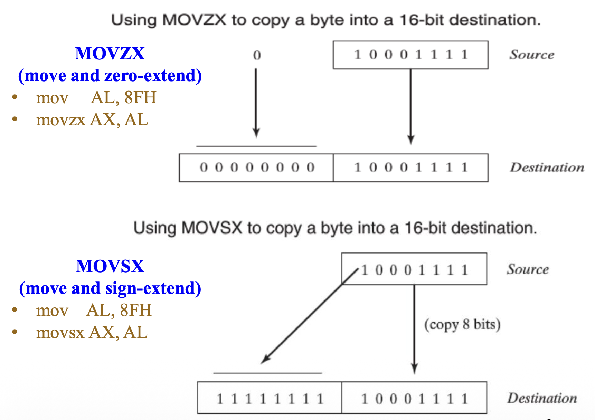
</div>

下表展示了各种形式下的 `#!asm MOVZX` 和 `#!asm MOVSX` 指令：

| 汇编语言 | 操作 |
| :--- | :--- |
| `#!asm MOVSX CX, BL` | 将 `BL` 进行符号扩展到 `CX` 中 |
| `#!asm MOVSX ECX, AX` | 将 `AX` 进行符号扩展到 `ECX` 中 |
| `#!asm MOVSX BX, DATA1` | 将 `DATA1` 处的字节数据进行符号扩展到 `BX` 中 |
| `#!asm MOVSX EAX, [EDI]` | 将由 `EDI` 地址的数据段内存位置处的字数据进行符号扩展到 `EAX` 中 |
| `#!asm MOVSX RAX, [RDI]` | 将地址 `RDI` 处的双字数据进行符号扩展到 `RAX` 中（64 位模式）|
| `#!asm MOVZX DX, AL` | 将 `AL` 进行零扩展到 `DX` 中 |
| `#!asm MOVZX EBP, DI` | 将 `DI` 进行零扩展到 `EBP` 中 |
| `#!asm MOVZX DX, DATA2` | 将 `DATA2` 处的字节数据进行零扩展到 `DX` 中 |
| `#!asm MOVZX EAX, DATA3` | 将 `DATA3` 处的字数据进行零扩展到 `EAX` 中 |
| `#!asm MOVZX RBX, ECX` | 将 `ECX` 进行零扩展到 `RBX` 中 |


### BSWAP

- `#!asm BSWAP`（字节交换）指令**反转** 32 位或 64 位寄存器操作数的**字节顺序**
- `#!asm BSWAP` 指令用于**在大小端形式之间转换数据**
- 将任何 32 位寄存器的内容取出，将第一个字节与第四个字节交换，第二个字节与第三个字节交换

???+ example "例子"

    对于 `#!asm BSWAP EAX` 指令，当 `EAX = 12345678H` 时，会交换 `EAX` 中的字节，结果为 `EAX = 78563412H`

    <div style="text-align: center">
        
    </div>

    不使用 `#!asm BSWAP` 的情况下，等价的字节交换指令序列如下：

    ```asm
    XCHG AH, AL
    ROR  EAX, 16     ; rotate right of EAX
    XCHG AH, AL
    ```

- 在 64 位操作中，对于四字长，位 7:0 与位 63:56 交换，位 15:8 与位 55:48 交换，位 23:16 与位 47:40 交换，位 31:24 与位 39:32 交换
- 在 64 位模式下，指令的默认操作大小为 32 位；使用 `#!asm REX` 前缀可以访问额外的寄存器（`R8`-`R15`）

???+ example "例子"

    | 指令 | 操作码 | 描述 |
    | :--- | :--- | :--- |
    | `#!asm BSWAP reg32` | `0F C8 + rd` | 反转一个 32 位寄存器中的字节顺序 |
    | `#!asm BSWAP reg64` | `REX.W + 0F C8 + rd` | 反转一个 64 位寄存器中的字节顺序 |

    在“操作码”列中，`+ rd` 表示操作码字节低 3 位用于编码无 modR/M 字节的寄存器操作数，例如：

    <div style="text-align: center">
        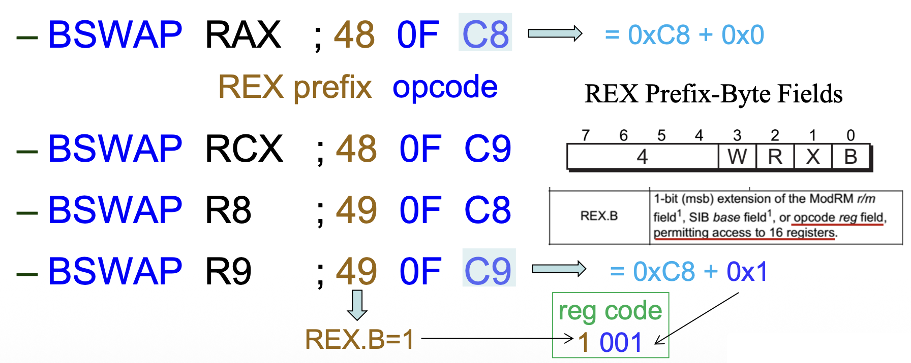
    </div>

- 对 16 位寄存器应用 `#!asm BSWAP` 指令的结果是**未定义的**
- 所以要交换 16 位寄存器的字节，请使用 `#!asm XCHG` 指令
- 例如，要交换 `AX` 寄存器的字节，请使用 `#!asm XCHG AL, AH` 指令


### CMOV

- 每条 `#!asm CMOVcc` 指令在 `EFLAGS` 寄存器（`CF`、`OF`、`PF`、`SF` 和 `ZF`）的状态标志处于指定状态（或条件）时执行移动操作
- 每条指令都与一个**条件码**(condition code, cc)相关联，以指示正在测试的条件
    - 只有在条件为真时才移动数据
    - 如果条件不满足，则不执行移动，并且继续执行 `#!asm CMOVcc` 指令之后的指令

- 例如，`#!asm CMOVZ` 指令仅在先前指令的结果为零时移动数据
- 目标仅限于 16 位、32 位或 64 位寄存器，但源可以是 16 位、32 位或 64 位寄存器或内存位置
- 由于这是一条新指令，除非在程序中添加了 `.686` 开关，否则汇编器无法使用它

下表罗列了各种条件移动指令：

| 汇编语言 | 测试的标志位 | 操作 |
| :--- | :--- | :--- |
| `#!asm CMOVB` | `C = 1` | 如果低于则移动 |
| `#!asm CMOVAE` | `C = 0` | 如果高于或等于则移动 |
| `#!asm CMOVBE` | `Z = 1` or `C = 1` | 如果低于或等于则移动 |
| `#!asm CMOVA` | `Z = 0` and `C = 0` | 如果高于则移动 |
| `#!asm CMOVE` 或 `#!asm CMOVZ` | `Z = 1` | 如果相等则移动，或如果为零则移动 |
| `#!asm CMOVNE` 或 `#!asm CMOVNZ` | `Z = 0` | 如果不相等则移动，或如果不为零则移动 |
| `#!asm CMOVL` | `S != O` | 如果小于则移动 |
| `#!asm CMOVLE` | `Z = 1` or `S != O` | 如果小于或等于则移动 |
| `#!asm CMOVG` | `Z = 0` and `S = O` | 如果大于则移动 |
| `#!asm CMOVGE` | `S = O` | 如果大于或等于则移动 |
| `#!asm CMOVS` | `S = 1` | 如果有符号 (负数) 则移动 |
| `#!asm CMOVNS` | `S = 0` | 如果无符号 (正数) 则移动 |
| `#!asm CMOVC` | `C = 1` | 如果进位则移动 |
| `#!asm CMOVNC` | `C = 0` | 如果无进位则移动 |
| `#!asm CMOVO` | `O = 1` | 如果溢出则移动 |
| `#!asm CMOVNO` | `O = 0` | 如果无溢出则移动 |
| `#!asm CMOVPE` 或 `#!asm CMOVPE` | `P = 1` | 如果奇偶校验成立则移动，或如果奇偶校验为偶数则移动 |
| `#!asm CMOVNP` 或 `#!asm CMOVPO` | `P = 0` | 如果无奇偶校验则移动，或如果奇偶校验为奇数则移动 |

- `#!asm CMOV` 的目的在于**避免分支**
    - 当 CPU 看到分支（比如 `#!asm JNE`）时，它将**猜测**分支是否会被执行，然后开始推测性地执行指令

    <div style="text-align: center">
        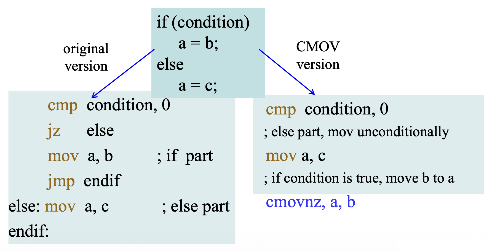
    </div>

    - 如果猜测错误，会有性能损失，因为 CPU 必须丢弃任何先前通过推测执行的工作，然后开始获取和执行正确的路径
    - 而对于条件移动（例如 `#!asm CMOVE eax, edx`），CPU 不需要猜测哪段代码将被执行，从而避免了预测错误的分支成本

    <div style="text-align: center">
        
    </div>

- 此外，`#!asm CMOVcc` 指令**将控制依赖转换为数据依赖**，并将多个路径中的指令合并到基本块中，这使得基本块包含更多指令，并**扩展了指令调度空间**


## Segment Override Prefix

**段重写前缀**(segment override prefix)可以添加到任何内存寻址模式中的任何指令

- 允许程序员偏离默认段
- 唯一不能加前缀的指令是将代码段寄存器用于（存储）生成地址的跳转和调用指令
- 在指令前面附加额外的字节，以选择备用段寄存器

下表列举了一些包含段的指令：

| 汇编语言 | 访问的段 | 默认段 |
| :--- | :--- | :--- |
| `#!asm MOV AX, DS: [BP]` | Data | Stack |
| `#!asm MOV AX, ES: [BP]` | Extra | Stack |
| `#!asm MOV AX, SS: [DI]` | Stack | Data |
| `#!asm MOV AX, CS: LIST` | Code | Data |
| `#!asm MOV ES: [SI], AX` | Extra | Data |
| `#!asm LODS ES: DATA1` | Extra | Data |
| `#!asm MOV EAX, FS: DATA2` | FS | Data |
| `#!asm MOV GS: [ECX], BL` | GS | Data |


## Assembler Details

**汇编器**(assembler)可以通过两种方式使用：

- 使用特定汇编器独有的模型
- 使用全段定义，允许对汇编过程进行完全控制，并且对所有汇编器通用

本节将介绍这两种方法，并解释如何通过使用汇编器来组织程序的内存空间，以及一些与此汇编器一起使用的重要指令的目的和用法。


### Directives vs Instructions

汇编语言语句包括指示符和指令两类：

- **指示符**(directive)：告诉汇编器如何做
    - 生成机器代码，分配存储等
    - 仅在汇编时使用，自身不会产生任何代码

- **指令**(instruction)：告诉 CPU 做什么
    - 编译成机器代码，最终链接到最终的可执行代码中
    - 在运行时由 CPU 执行


### Directives in MASM

- MASM 的指示符能够指示汇编器如何处理操作数或程序的一部分
    - 一些结果存储在内存中，另一些则不存储

- `#!asm BYTE PTR` 指示由指针或索引寄存器引用的数据的大小
- `#!asm DB`（定义字节）指令将数据字节存储在内存中
- 数据分配：`#!asm DB`, `#!asm DW`, `#!asm DD`, `#!asm DQ`, `#!asm DT`
- 过程：`#!asm PROC`, `#!asm ENDP`
- 结构：`#!asm STRUCT`, `#!asm RECORD`
- 宏：`#!asm MACRO`, `#!asm ENDM`
- 代码标签：`#!asm ALIGN`, `#!asm ORG`
- 杂项：`#!asm EQU`, `#!asm INCLUDE`
- 段：`#!asm SEGMENT`, `#!asm ENDS`, `#!asm ASSUME`
- 处理器：`#!asm .386`, `#!asm .486`, `#!asm .586`
- 简化段：`#!asm .CODE`, `#!asm .DATA`, `#!asm .STACK`, `#!asm .MODEL`, `#!asm .EXIT`

更多指示符请参考：<https://docs.microsoft.com/en-us/cpp/assembler/masm/directives-reference?view=msvc-160>


### Storing Data in a Memory Segment

- `#!asm DB`（定义字节(define byte)）、`#!asm DW`（定义字(define word)）和 `#!asm DD`（定义双字(define doubleword)）通常与 MASM 一起使用，来定义和存储内存数据
- 如果一个数值协处理器(numeric coprocessor)在系统中执行软件，`#!asm DQ`（定义四字）和 `#!asm DT`（定义十字节）指示符也常见
- 这些指示符使用符号名称标记内存位置并指示其大小
- `#!asm DUP` 指示符允许对相同值进行多次初始化，例如：
    - `#!asm DATA1 DB 0, 0, 0, 0, 0` 等价于
    - `#!asm DATA2 DB 5 DUP(0)  ; reserves 5 bytes of 0`

- 使用问号（`?`）作为 `#!asm DB`、`#!asm DW` 或 `#!asm DD` 指示符的操作数来为内存预留空间；汇编器会预留一个位置，不会将其初始化为任何特定值
- `#!asm ALIGN` 指令将下一个数据元素或指令对齐到参数的倍数地址；参数必须是小于或等于段对齐的 2 的幂
    - 值得注意的是，字大小的数据应放置在字边界上，而双字大小的数据应放置在双字边界上；否则微处理器将花费额外的时间来访问这些数据类型

    ???+ example "例子"

        ```asm
        LIST_SEG SEGMENT
        DATA1   DB 1,2,3            ; define bytes
                DB 45H              ; hexadecimal
        DATA3   DD 300H             ; define doubleword
                DD 2.123            ; real
                DD 3.34E+12         ; real
        LISTA   DB ?                ; reserve 1 byte
        LISTB   DB 10 DUP (?)       ; reserve 10 bytes


                ALIGN 2             ; set word boundary


        LISIC   DW 100H DUP (0)     ; reserve 100H words
        LISTD   DD 22 DUP (?)       ; reserve 22 doublewords
        ```

??? question "思考"

    === "问题"

        请确定指令执行后寄存器 `AX` 的值。

        ```asm
        .data
            DB 33H, 34H, 0AH, 06H
            DW 1B7CH, 674CH, 07H, '12', '1'

        .code
            mov ax, @data       
            mov ds, ax          
            xor si, si  
            mov ax, [si]        ; AX = ________
            mov ax, [si+4]      ; AX = ________
            mov ax, [si+5]      ; AX = ________
            mov ax, [si+8]      ; AX = ________
            mov ax, [si+10]     ; AX = ________

        .exit
        ```

    === "解答"

        ```asm
        mov ax, [si]        ; AX = 3433H
        mov ax, [si+4]      ; AX = 1B7CH
        mov ax, [si+5]      ; AX = 4C1BH
        mov ax, [si+8]      ; AX = 0007H
        mov ax, [si+10]     ; AX = 3231H
        ```

        <div style="text-align: center">
            
        </div>


### ASSUME, EQU and ORG

- `#!asm EQU`
    - 相等指示符（`#!asm EQU`）将数字、ASCII 或标签等价于另一个标签，用于定义**常量**
    - 语法：`#!asm CONSTANT_NAME EQU expression`
    - 等价指令使程序更清晰并简化调试，例如：

        ```asm
        TEN EQU 10
        NINE EQU 9

        MOV AL, TEN
        ADD AL, NINE
        ```

- `#!asm THIS`：
    - 编译器只能将字节、字或双字地址分配给标签
    - 要将字节标签分配给字，使用 `#!asm THIS` 指示符
    - `#!asm THIS` 指令始终以 `#!asm THIS BYTE`、`#!asm THIS WORD`、`#!asm THIS DWORD` 或 `#!asm THIS QWORD` 的形式出现

- `#!asm ORG`
    - `#!asm ORG`（origin）语句可以**改变**数据段或代码段中数据的**起始偏移地址**
    - 有时，数据或代码的源必须使用 `#!asm ORG` 语句分配给一个绝对偏移地址，例如引导扇区入口必须分配给 `07c00h`

- `#!asm ASSUME` 告诉汇编器代码、数据、附加和栈段已选择的名字

???+ example "例子"

    ```asm
    ; Using the THIS and ORG directives
    DATA_SEG        SEGMENT
        
            ORG     300H                        ; (1)

    DATA1   EQU     THIS BYTE                   ; (2)
    DATA2   DW      ?
    DATA_SEG        ENDS

    CODE_SEG        SEGMENT 'CODE'              ; (3)
            ASSUME  CS: CODE_SEG, DS: DATA_SEG
            MOV BL, DATA1
            MOV AX, DATA2
            MOV BH, DATA1+1
    CODE_SEG        ENDS
    ```

    1.  使用 `#!asm ORG` 指示符设置位置
    2.  使用 `#!asm THIS` 指示符将一个字地址标签赋给一个字节标签
    3.  使用 `#!asm SEGMENT` 指示符定义一个程序段


### PROC and ENDP

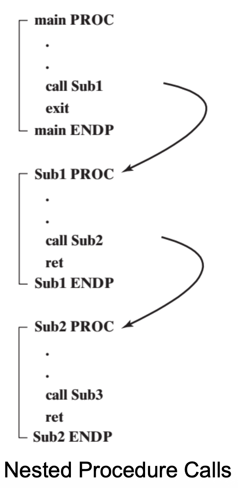{ align=right width=20% }

`#!asm PROC` 和 `#!asm ENDP` 指示符表示一个必须赋予名称的过程(procedure)（子程序(subroutine)）的开始和结束。

```asm
name PROC [near/far]

    statements
    
    ret

name ENDP
```

- `#!asm PROC` 指示符必须跟随着一个 `#!asm NEAR` 或 `#!asm FAR`（仅在 32 位系统中有效）
    - `#!asm NEAR` 过程是指位于程序相同代码段中的过程，通常被认为是**局部的**
    - `#!asm FAR` 过程可能位于内存系统的任何位置，被认为是**全局的**

???+ example "例子"

    下面有一个名为 `SumOf` 的过程，它通过传递寄存器参数来计算三个 32 位整数的和。

    ```asm
    SumOf PROC
        add eax, ebx
        add eax, ecx
        ret
    SumOf ENDP
    ```

    - 将三个整数赋给 `EAX`、`EBX`、`ECX`
    - 该过程用 `EAX` 返回和

    ```asm
    .data
        theSum DWORD ?

    .code
    main PROC
        ; Before calling SumOf, values are assigned to EAX, EBX, and ECX
        mov  eax, 10000h    ; argument
        mov  ebx, 20000h    ; argument
        mov  ecx, 30000h    ; argument
        call Sumof          ; EAX = (EAX + EBX + ECX)
        
        ; After the CALL, the sum in EAX are copied to “theSum” variable
        mov  theSum, eax    ; save the sum
    ```


### MACRO and ENDM

- `#!asm MACRO` 和 `#!asm ENDM` 指示符表示一个宏（一个命名的汇编语言语句块）
- 调用一个宏过程时，它的代码副本将直接插入到程序中被调用的位置
- 这种类型的自动代码插入也称为**内联展开**(inline expansion)

```asm
name MACRO [para1, para2, ...]
     statements
     ENDM
```

???+ example "例子"

    一个名为 `mPutchar` 的宏接收一个输入，并通过调用 `WriteChar` 将其显示在控制台上。

    ```asm
    mPutchar MACRO char
        push eax
        mov  al, char          ; passing arguments to the procedure
        call WriteChar
        pop  eax
    ENDM
    ```

    - 语句 `#!asm mPutchar 'A'` 调用 `mPutchar` 并传递字母 `A`
    - 汇编器的预处理器将该语句扩展为以下代码：

    ```asm
    ...                      push eax
    mPutchar 'A'    ==>      mov  al, 'A'
    ...           inline     call WriteChar
                 expansion   pop  eax
    ```

宏也可以在**数据段**中使用，比如为 GDT 描述符定义一个宏。

???+ example "例子"

    <div style="text-align: center">
        
    </div>


### INCLUDE

`#!asm INCLUDE` 指示符用于在汇编过程中将给定文件名的源代码插入到当前源文件中。

语法：`#!asm INCLUDE filename`

<div style="text-align: center">
    
</div>


### Memory Organization

- **内存组织**(memory organization)定义了软件的内存相关属性，包括代码大小、数据指针、指令编码、段组合类型和段加载顺序等
- 汇编器使用两种基本格式来定义内存组织：
    - 一种方法使用**全段定义**(full-segment definitions)：提供了对汇编语言任务的更好的控制，建议用于复杂程序
    - 另一种方法使用**模型**(models)
        - MASM 汇编器提供了许多**内存模型**可供选择，从小型到大型不等，这些模型控制着段寄存器的使用方式和指针的默认大小
        - 使用 `#!asm .MODEL` 指令来确定代码和数据指针的大小


#### Full-Segment Definitions

全段定义使用 `#!asm SEGMENT`、`#!asm ENDS` 和 `#!asm ASSUME` 指令来定义段，并通知汇编器和链接器。

```asm
name SEGMENT [readonly] [align] [combine] [use] ['combine-class']
    statements
name ENDS

cseg SEGMENT readonly word use32 'code'
    mov ax, 10
    inc ax
    ret
cseg ENDS
```


#### Processor Directive VS Segment Attribute

- **处理器指示符**（例如，`.286`、`.386`）隐式定义**默认操作模式**
- **段属性**(segment attributes)（`#!asm use16` / `#!asm use32`）显式指定局部段内的操作模式，允许它**重写默认模式**
- 逻辑上必须匹配，例如：
    - `.286` -> 应与 `#!asm use16` 一起使用
    - `.386` -> 可与 `#!asm use16` 或 `#!asm use32` 一起使用

- 它们共同工作以实现灵活的模式切换，例如混合 16 位和 32 位操作模式

=== "16 位实模式"

    ```asm
    .286
    CODE16 SEGMENT USE16
        mov ax, [bx] ; 16-bit addressing, 16-bit operand
    CODE16 ENDS
    ```

=== "32 位保护模式"

    ```asm
    .386
    CODE32 SEGMENT USE32
        mov eax, [ebx+8] ; 32-bit addressing, 32-bit operand
    CODE32 ENDS
    ```

=== "混合模式"

    ```asm
    CODE16 SEGMENT USE16
        mov eax, [bx]   ; The assembler allows the use of 32-bit registers but
                        ; generates the prefix byte 66h accordingly.
    CODE16 ENDS
    ```


#### Controlling Segments with the ASSUME Directive

- 段指示符不说明段类型，而 `#!asm assume` 指示符为汇编器提供此信息
- 形式如下：

    ```asm
    assume  [CS:seg,] [DS:seg,] [ES:seg,]
            [FS:seg,] [GS:seg,] [SS:seg]
    ```

- 有效的 `#!asm assume` 指示符使用示例：
    - `#!asm assume DS:DSEG`
    - `#!asm assume CS:CSEG, DS:DSEG, ES:DSEG, SS:SSEG`
    - `#!asm assume CS:CSEG, DS:NOTHING`

- 当汇编器遇到一条指令（例如 `#!asm mov var, 0`）时，它首先做的是确定 `var` 的段
- 如果 `var` 没有在当前假设的任何一个段中声明，那么汇编器将生成一个**错误**，声称程序无法访问该变量
- 将 `#!asm assume` 指示符放在程序中所有过程之前是理想的位置，因为程序中声明为段的段指针很少改变（除了过程入口和出口处）


#### END

- `#!asm END` 指示符用于通知汇编器某个模块的结束
- 通常，每个源模块都将有一个 `#!asm END` 语句作为模块的最后一行；只有一个模块可以有一个这种形式的 `#!asm END` 语句
- `#!asm END` 指令还可以设置程序的**入口点**(entry point)
- 语法：`#!asm END label`
    - 比如：`#!asm END start`，此时它指定标签 `start` 是程序的入口点，DOS 将在该地址开始执行程序

???+ example "例子"

    <div style="text-align: center">
        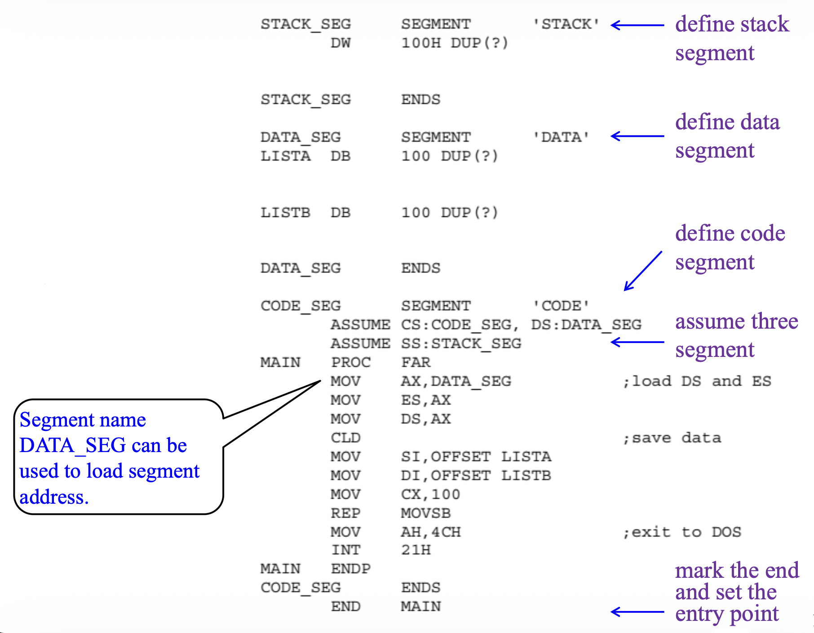
    </div>


#### Models

- 内存模型是 MASM 独有的
- `#!asm .MODEL` 指示符包括 MASM 实模式下六个内存模型，即 `tiny`、`small`、`compact`、`medium`、`large` 和 `huge`
- 对于保护模式，有一个模型 `flat` 可用
- 使用如 `#!asm @DATA`、`#!asm @STACK`、`#!asm @CODE` 的特殊指示符来识别各种段
- `#!asm .MODEL` 不用于 x64 的 MASM

<div style="text-align: center">
    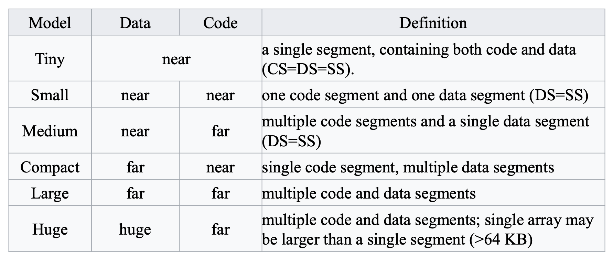
</div>

选择可容纳数据和代码的最小内存模型，因为近引用比远引用操作更高效。

???+ example "例子"

    以下指令序列说明了 `#!asm .MODEL` 语句如何定义一个短程序的参数，该程序将 100 字节内存块（`LISTA`）的内容复制到第二个 100 字节内存块（`LISTB`）中。

    <div style="text-align: center">
        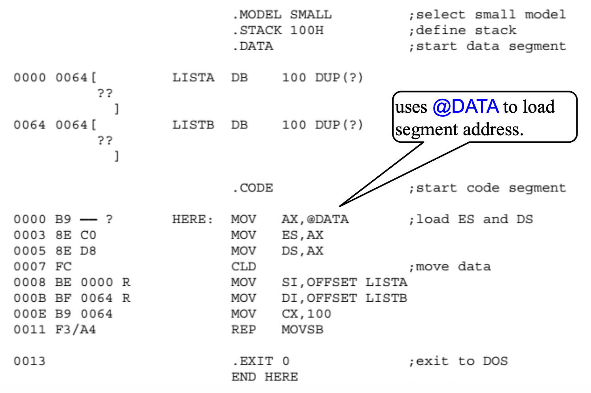
    </div>