# Arithmetic and Logic Instructions

??? abstract "核心知识"

    - 算术指令
        - 加减乘除
        - 比较指令
        - BCD 和 ASCII 算术指令
    
    - 逻辑指令：
        - 与、或、异或、非、移位、旋转
        - 位测试
        - 位扫描
    
    - 字符串比较指令

## Addition, Subtraction and Comparison

微处理器中的算术指令主要包括加法、减法和比较。


### Addition

**加法**（`#!asm ADD`）在微处理器中以多种形式出现。但唯二不允许的加法类型是**内存到内存**和**段寄存器**（段寄存器只能移动、压栈或弹出）。

当执行加法指令时，标志寄存器的内容会改变。

- 具体来说，改变的位包括符号、零、进位、辅助进位、奇偶校验和溢出标志位
- 但中断、陷阱和其他标志位不会因此改变

各种加法指令：

- **立即数**加法：涉及到常量和已知数据的加法

    ```asm
    MOV DL, 12H
    ADD DL, 33H
    ```

- **内存-寄存器**加法
    - 将参与加法的内存数据移动到 `AL`（或别的）寄存器中
    - 示例：将存储在数据段偏移位置的 `NUMB` 的两个连续字节的数据相加，结果存储在 `AL` 寄存器中

        ```asm
        0000 BF 0000 R      MOV DI, OFFSET NUMB        ; address NUMB
        0003 BO 00          MOV AL, O                  ; clear sum
        0005 02 05          ADD AL, [DI]               ; add NUMB
        0007 02 45 01       ADD AL, [DI+1]             ; ada NUMB + 1
        ```

- **数组**加法
    - 假设一个数据数组（`ARRAY`）包含 10 字节，从元素 0 编号到元素 9；下面展示了如何将数组中第 3、5 和 7 个元素的内容相加：

        ```asm
        ARRAY DB 0, 1, 3, 2, ...
        ...
        MOV AL, O                      ; clear sum
        MOV SI, 3                      ; address element 3
        ADD AL, ARRAY[SI]              ; add element 3
        ADD AL, ARRAY[SI + 2]          ; add element 5
        ADD AL, ARRAY[SI + 4]          ; ada element 7
        ```

    - 假设一个数据数组的各元素以字为单位存储，用于在寄存器 `AX` 中形成 16 位的和；下面的指令序列展示了用**比例变址寻址**将名为 `ARRAY` 的内存区域中的第 3、5 和 7 个元素相加

        ```asm
        ARRAY DW 0, 1, 3, 2, ...
        ...
        MOV EBX, OFFSET ARRAY         ; address ARRAY
        MOV ECX, 3                    ; address element 3
        MOV AX, [EBX + 2 * ECX]       ; get element 3
        MOV ECX, 5                    ; address element 5
        ADD AX, [EBX + 2 * ECX]       ; add element 5
        MOV ECX, 7                    ; address element 7
        ADD AX, [EBX + 2 * ECX]       ; add element 7
        ```

        - `EBX` 加载了 `ARRAY` 的地址
        - `ECX` 保存了数组元素编号
        - 比例因子用于将 `ECX` 寄存器的内容乘以 2 以定位数据字

- **递增**(increment)指令（`#!asm INC`）将 1 加到任何寄存器（段寄存器除外）或内存位置
    - **保持 `CF`（进位）标志的状态不变**

        ```asm
        MOV AX, 0FFFFh
        INC AX          ; 40 (opcode)
                        ; CF = 0
        ```

        ```asm
        MOV AX, 0FFFFh
        ADD AX, 1       ; 05 01 00
                        ; CF = 1
        ```

    - 作用在内存位置时，数据的大小必须通过使用 `#!asm BYTE PTR`, `#!asm WORD PTR` 或 `#!asm DWORD PTR` 指令来描述，因为汇编器**无法确定** `#!asm INC [DI]` 是字节大小、字大小还是双字大小的递增
    - 下表总结 `#!asm INC` 指令的各种使用场景

        | 汇编语言 | 操作 |
        | :--- | :--- |
        | `#!asm INC BL` | `BL = BL + 1` |
        | `#!asm INC SP` | `SP = SP + 1` |
        | `#!asm INC EAX` | `EAX = EAX + 1` |
        | `#!asm INC BYTE PTR [BX]` | 对 `BX` 所寻址的数据段内存位置的字节内容加 1 |
        | `#!asm INC WORD PTR [SI]` | 对 `SI` 所寻址的数据段内存位置的字内容加 1 |
        | `#!asm INC DWORD PTR [ECX]` | 对 `ECX` 所寻址的数据段内存位置的双字内容加 1 |
        | `#!asm INC DATA1` | 对数据段内存位置 `DATA1` 的内容加 1 |
        | `#!asm INC RCX` | 对 `RCX` 加 1（64位模式） |

- `#!asm ADC`（带进位加法(add-with-carry)）将进位标志（`C`）中的位加到操作数数据上
    - 和 `#!asm ADD` 类似，`#!asm ADC` 在加法后会影响标志位
    - 下图展示了该指令的操作细节：

        <div style="text-align: center">
            
        </div>

    ??? example "例子"

        使用 `#!asm ADC` 计算两个双字长的长整数之和。

        ```asm hl_lines="11-14"
        ; [int1][0:7] = [int1][O:7] + [int2][0:7]
        .data
        int1  DD 1,0,0,0,0,0,0,1       
        int2  DD 1,0,0,0,0,0,0,1

        .code
              MOV EDI, OFFSET int1
              MOV ESI, OFFSET int2
              MOV ECX, 8              ; ECX = 8
              CLC                     ; start out with carry flag cleared
        loop: MOV EAX, [ESI]
              ADC [EDI], EAX          ; with carry from previous loop pass
              LEA ESI, [ESI+4]        ; point to next source
              LEA EDI, [EDI+4]        ; point to next destination
              DEC ECX                 ; adjust loop count
              JNZ loop                ; if ECX > 0 then repeat
        ```

    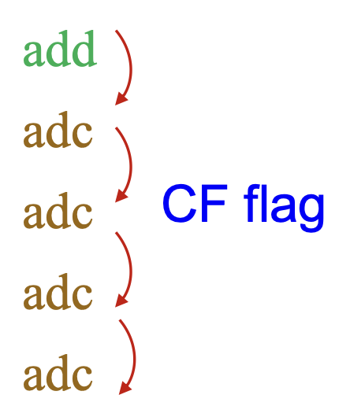{ align=right width=15% }

- `#!asm ADC` 的变体：`#!asm ADCX` 和 `#!asm ADOX`
    - `#!asm ADD` 和 `#!asm ADC` 指令可用于加速大整数算数运算，通过形如右侧的代码序列实现
        - 问题：这些指令创建了一个**依赖链**(dependency chain)，因此处理器**无法并行**执行算术运算
    
    - 为了解决这个问题，Intel 引入了**第二条进位链**，使得两个独立的进位链可同时发生；它们对应 `#!asm ADC` 的两个变体 `#!asm ADCX` 和 `#!asm ADOX`
    - 这两个变体不会相互影响，因为它们有**单独的进位标志**
        - `#!asm ADCX` 使用**进位标志**，并保留其他标志不变
        - `#!asm ADOX` 使用**溢出标志**，并保留其他标志不变

    ??? example "例子"

        <div style="text-align: center">
            
        </div>

    - `#!asm ADCX`、`#!asm ADOX` 和 `#!asm MULX` 指令为**大型整数乘法**带来了很大便利
        - 而大型整数算术在密码学（例如 RSA 公钥算法）和高性能计算中有许多应用场景

        <div style="text-align: center">
            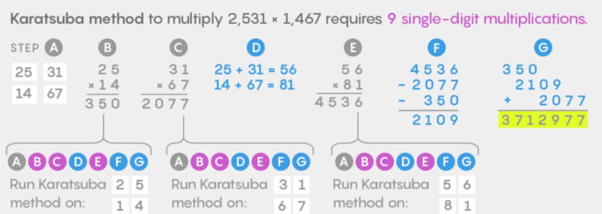
        </div>

- `#!asm XADD`（**交换和加**(exchange and add)）
    - 语法：`#!asm XADD des, src`，对应操作如下：
        - 交换 `des` 操作数与 `src` 操作数
        - 将两个值的和加载到 `des` 操作数中：`des = src + des`

    - 是少数改变源操作数的指令之一
    - 例子：

        ```asm
        MOV AX, 1000H
        MOV BX, 2000H    ; AX = 1000H, BX = 2000H
        XADD AX, BX      ; AX = 3000H, BX = 1000H
        ```

    - 目标操作数可以是寄存器或内存位置，而源操作数只能是寄存器
    - 对于**多处理器系统**，`#!asm XADD` 可以与 `LOCK` 前缀在多处理器系统中结合使用，以允许多个处理器执行一个 `DO` 循环
    - 等价 C 函数：`#!c int atomic_xadd(atomic_t *v, int inc)`
        - `#!asm XADD` 将给定的增量 `inc` 加到 `*v` 上，并原子性地返回 `*v` 的先前值
        - `#!asm XADD` 在原子值 `*v` 上执行原子交换和加法操作
        - 当多个 CPU 在线时，`#!asm XADD` 会被锁住
    - `#!asm XADD` 可以实现共享计数器和各种数据结构
    - `#!asm XADD` 可用于**乐观锁**(optimistic locking)，主要适用于高并发系统中

        ??? example "例子"

            以下指令使用乐观锁来安全地通过多个线程更新共享版本。

            ```asm hl_lines="8"
            .data
            version DD 0                 ; shared version number initialized to 0

            .code
                    MOV ECX, version     ; load the current value of version
                    ......               ; working optimistically
                    MOV EAX, 1           ; EAX = 1
                    XADD version, EAX    ; version ⇔ EAX, version = version+1
                    CMP EAX, ECX         ; check if the value was modified by another thread
                    JNE retry            ; if version was updated then rollback
                    ......
            retry: ......                ; handle the conflict
            ```


### Subtraction

指令集中同样有许多形式的减法（`#!asm SUB`）指令，包括：

- 寄存器减法：每次执行减法运算时，微处理器修改标志寄存器的内容
- 立即数减法：允许常量数据作为减法中的立即操作数
- `#!asm DEC`（**递减**(decrement)）：从任何寄存器或内存位置减去 1，并影响除 `CF` 外的所有标志位
    
    ???+ info "注"

        由于 `#!asm INC` 和 `#!asm DEC` 会写入除 `CF` 之外的标志位，因此如果 `#!asm JCC` 直接使用来自 `#!asm INC` / `#!asm DEC` 的标志位，`#!asm JCC` 可能会因为意外指令而产生错误依赖，例如：

        <div style="text-align: center">
            
        </div>

        所以编译器通常不会生成用于循环计数更新的 `#!asm INC` / `#!asm DEC`，或在 `#!asm JCC` 上重用 `#!asm INC` / `#!asm DEC` 提供的标志位。

- **带借位的减法**(subtract-with-borrow)指令（`#!asm SBB`）
    - 功能与普通减法相同，但包含借位的进位标志（`C`）也要从差值中减去
    - 宽减法需要借位来传播，就像宽加法传播进位一样
    - 下面展示该指令的运算细节：

        <div style="text-align: center">
            
        </div>


### Comparison

**比较**(comparison)指令（`#!asm CMP`）是一种**只改变标志位，而不会改变目标操作数**的减法，用于检查寄存器或内存位置的内容与另一个值是否相等。后面通常会跟一个**条件跳转指令**，用于测试标志位的条件。

<div align=center markdown="1">

| 汇编语言 | 操作 |
| :--- | :--- |
| `#!asm CMP CL, BL` | `CL - BL` |
| `#!asm CMP AX, SP` | `AX - SP` |
| `#!asm CMP EBP, ESI` | `EBP - ESI` |
| `#!asm CMP RDI, RSI` | `RDI - RSI`（64 位模式） |
| `#!asm CMP AX, 2000H` | `AX - 2000H` |

</div>

- **比较和交换**指令（`#!asm CMPXCHG`）比较**目的操作数**与**累加器**(accumulator)（隐式操作数(implicit operand)），
    - 语法：`#!asm CMPXCHG des, src`
        - `accu` 表示累加器（`AL/AX/EAX/`）
        - 如果 `des == accu`，则 `des = src`，`ZF = 1`
        - 如果 `des != accu`，则 `accu = des`，`ZF = 0`

    ???+ example "例子"

        === "例1"

            `#!java CMPXCHG CX, DX`
            
            - 案例 1：
                - 执行前：`(CX)=00FFH, (DX)=00EFH, (AX)=00FFH`
                - 执行后：`(CX)=00EFH, (DX)=00EFH, (AX)=00FFH, ZF=1`

            - 案例 2：
                - 执行前：`(CX)=00FFH, (DX)=00EFH, (AX)=00EEH`
                - 执行后：`(CX)=00FFH, (DX)=00EFH, (AX)=00FFH, ZF=0`
            
            - 解释：三个寄存器分别表示原子值、新值和旧值（`AX`）
                - 若 `CX == AX`，`DX` 被拷贝到 `CX` 中
                - 若 `CX != AX`，`CX` 被拷贝到 `AX` 中
                - `AX` 保留执行前 `CX` 的值

            - 等价 C 函数：`#!c int atomic_cmpxchg(atomic_t *v, int new, int old)`
                - 此函数使用给定的旧值和新值，在原子值 `v` 上执行**原子比较交换**操作，返回操作前原子变量 `v` 的旧值
                - 它在操作周围提供显式的**内存屏障**
            
        === "例2"

            <div style="text-align: center">
                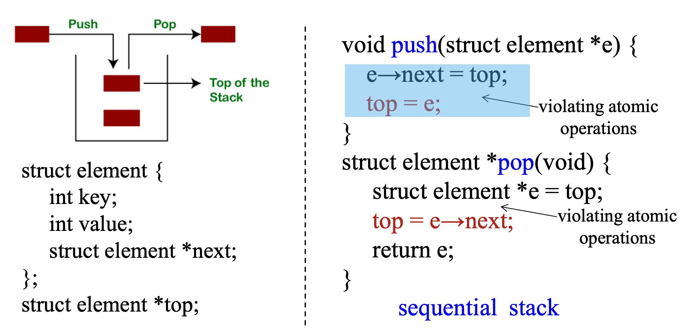
            </div>

            - 顺序栈在可能存在**竞态条件**的并发系统中将无法工作
            - 自旋锁和读写锁可以帮助将锁从一个持有者转移到另一个持有者，但成本高

            我们使用 `cmpxchg` 函数解决这一问题：

            <div style="text-align: center">
                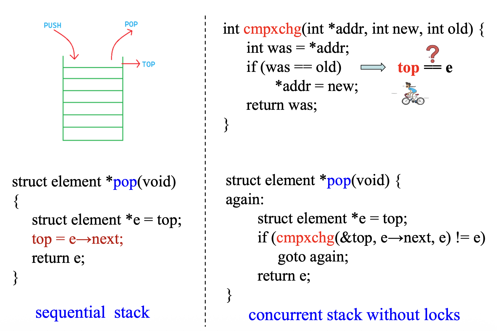
            </div>

- `#!asm CMPXCHG8B` 指令：比较并交换八个字节
    - 语法：`CMPXCHG8B [mem64-operand]`
        - `#!asm ECX:EBX`：64 位新值（隐式操作数）
        - `#!asm EDX:EAX`：64 位旧值（隐式操作数）
        - 如果操作数 == `EDX:EAX`，则操作数 = `ECX:EBX`，`ZF = 1`，否则 `EDX:EAX` = 操作数，`ZF = 0`
        – `Z` 标志位表示比较后的值相等

        ???+ example "例子"

            ```asm
            MOV EAX, [mem]                    ; low 32 bits
            MOV EDX, [mem + 4]                ; high 32 bits
            MOV EBX, new_low                  ; low 32 bits of the new value
            MOV ECX, new_high                 ; high 32 bits of the new value
            LOCK CMPXCHG8B QWORD PTR [mem]
            JZ SUCCESS                        ; if ZF = 1，then goto success
            ```

    - `#!asm CMPXCHG8B` 通常在多处理器环境中与 `LOCK` 前缀一起使用，以确保原子操作

- `#!asm CMPXCHG16B`：将 `RDX:RAX` 中的 128 位值与内存中位于目的操作数的 128 位数字进行比较
    - 如果值相等，则将 `RCX:RBX` 中的 128 位值存储到目的操作数中，否则目的操作数中的值将加载到 `RDX:RAX` 中
    - `CMPXCHG16B` 要求目的（内存）操作数应为 16 字节对齐


## Multiplication and Division

>早期的 8 位微处理器不支持乘法或除法指令，只能通过一系列移位和加减运算来实现。后来制造商们意识到了这种不足，于是他们将乘法和除法纳入了最新的微处理器指令集中。


### Multiplication

- 乘法指令可在字节、字或双字上执行
- 有无符号整数（`#!asm MUL`）和符号整数（`#!asm IMUL`）两个版本
- **被乘数**(multiplicand)始终在 `AL` / `AX` / `EAX` 寄存器中作为**隐式操作数**，例如 `#!asm MUL CL  ; AX = AL*CL`
- 积始终是**双宽度积**(double-width product)
    - 两个 8 位数字 -> 一个 16 位积；两个 16 位数字 -> 一个 32 位积；两个 32 位数字 -> 一个 64 位积
    - 在 64 位模式下，两个 64 位数字 -> 一个 128 位积

- 8 位乘法
    - 被乘数始终在 `AL` 寄存器中
        - **乘数**(multiplier)可以是任何 8 位寄存器或内存位置
        - 使用内存操作数时需要伪指令来指示操作数大小，例如 `#!asm MUL WORD PTR [BX]`
    - 没有立即数乘法的形式（形如 `#!asm MUL 12H`），除非是 `#!asm IMUL` 乘法的两个或三个操作数形式
    - 积位于 `AX`
    - 下面列举一些 8 位乘法指令的使用情况：

        | 汇编语言 | 操作 |
        | :--- | :--- |
        | `#!asm MUL CL` | `AL` 乘以 `CL`；无符号积在 `AX` 中 |
        | `#!asm IMUL DH` | `AL` 乘以 `DH`；符号积在 `AX` 中 |
        | `#!asm IMUL BYTE PTR[BX]` | `AL` 乘以 `BX` 所寻址的数据段内存位置的字节内容；符号积在 `AX` 中 |
        | `#!asm MUL TEMP` | `AL` 乘以内存位置 `TEMP` 的字节内容；无符号积在 `AX` 中 |

- 16 位乘法
    - 被乘数放在 `AX` 中
    - 32 位积放在 `DX-AX` 中
        - `DX` 包含积的高 16 位
        - `AX` 包含积的低 16 位
    - 乘数的选取与 8 位乘法类似

- 32 位乘法
    - `EAX` 寄存器的内容与指令指定的操作数相乘
    - 64 位积位于 `EDX-EAX` 中，其中 `EAX` 包含积的低 32 位

- 64 位乘法
    - 128 位积位于 `RDX:RAX` 寄存器对中

- `#!asm IMUL` 指令的三种形式：
    - 单操作数形式：同 `#!asm MUL` 指令
    - 双操作数形式：目的操作数是一个寄存器，源操作数是一个立即值、一个寄存器或一个内存位置，中间乘积（输入操作数大小的两倍）被**截断**并存储在目的操作数位置

        ```asm
        IMUL ECX, [EAX+4]    ; ECX = ECX * [EAX+4]
        IMUL ECX, 16         ; ECX = ECX * 16
        ```

    - 三操作数形式：第一个源操作数乘以第二个源操作数，中间乘积被**截断**并存储在目的操作数

        ```asm
        IMUL ECX, [EAX+4], 5  ; ECX = [EAX+4] * 5
        ```

- 立即数乘法
    - 在双操作数或三操作数形式的 `#!asm IMUL` 指令中，源操作数可以是一个**立即值**
    - 当使用立即值作为操作数时，它会被**符号扩展**到目标操作数格式的长度
    - 比如 `#!asm IMUL CX, DX, 12H` 指令将 `12H` 乘以 `DX`，并将一个 16 位符号积留在 `CX` 中
    - 注意，双操作数形式会被汇编为三操作数以支持立即数乘法，例如，`#!asm IMUL BX, 16H` -> `#!asm IMUL BX, BX, 16H`

- `#!asm MUL` 和 `#!asm IMUL` 的差别：前者用**零扩展**填充高位，而后者用**符号扩展**填充高位

    <div style="text-align: center">
        
    </div>

- 受 `#!asm MUL` 影响的标志
    - 当积完全能被寄存器容纳时（结果没有被截断），`MUL` 指令清零 `OF` 和 `CF` 标志，否则 `OF` 和 `CF` 标志被置 1

        <div style="text-align: center">
            
        </div>

    - `CF` 和 `OF` 标志表示积的上半部分是否包含有效数字

- 受 `#!asm IMUL` 影响的标志
    - 当中间乘积的符号整数值与符号扩展操作数大小的截断乘积不同时，`CF` 和 `OF` 标志被置一，否则 `CF` 和 `OF` 标志被清零

        <div style="text-align: center">
            
        </div>

    - 使用两个和三个操作数形式时，由于截断，应检查 `CF` 或 `OF` 标志以确保没有重要的位丢失

??? question "思考"

    === "问题1"

        === "问题"

            为什么 `#!asm MUL` 只有单操作数形式，而 `#!asm IMUL` 有扩展的双操作数和三操作数形式？

        === "解答"

            - 随着编程语言和编译器的开发，Intel 发现符号整数（如 C 中的 `#!c int`）的使用频率远高于无符号整数（例如，表达式 `x = y * 10` 或 `x = y * z`）
            - 因此，Intel 引入了 `#!asm IMUL` 的双操作数和三操作数形式，以简化在汇编级别实现高级语言乘法语义的实现

    === "问题2"

        === "问题"

            为什么 `#!asm IMUL` 指令的两位操作数和三位操作数形式使用截断乘法而不是扩展乘法？

        === "解答"

            - 单操作数的 `#!asm MUL` 和 `#!asm IMUL` 最初是为高精度/大数字算术（例如加密、哈希计算）等场景设计的，这些场景更依赖于完整的 2N 位结果，因此它们使用扩展乘法
            - 在编程语言中，对于像 `c = a * b` （其中 `a`、`b` 和 `c` 都是相同的 `#!c int` 类型）这样的常见表达式，程序员关注的是结果的低 N 位，因此 `#!asm IMUL` 的双操作数和三操作数形式使用截断乘法


### Division

- 除法可在 8 位、16 位和 32 位数字上执行；而在 64 位模式下，可以实现 128 位数字除以 64 位数字
- 存在无符号整数（`#!asm DIV`）和符号整数（`#!asm IDIV`）版本
- 被除数始终是**双倍宽度的**
- 不存在**立即数**除法指令
- 除法相关的错误有除以零、除法溢出（发生在一个大数除以一个小数时）等；但不管是什么除法错误，微处理器都会生成一个**中断**，在屏幕上显示错误信息
- 8 位除法
    - 使用 `AX` 存储**被除数**(dividend)（16 位），而**除数**(divider)位于 8 位寄存器或内存中
    - 结果存储在 `AL` := **商**(quotient)，`AH` := **余数**(remainder)

        <div style="text-align: center">
            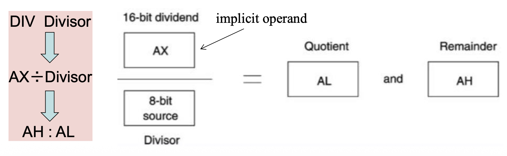
        </div>

    - 商或正或负，而余数始终取被除数的符号；这种舍入模式称为**向零舍入**(round-to-zero)
    - 示例：`#!asm IDIV BL`
        - 对于 `AX = 10H` (+16) 和 `BL = 0FDH` (-3)
            - 结果：商为 -5 (`AL`)，余数为 1 (`AH`)
        - 对于 `AX = 0FFF0H` (-16) 和 `BL = 03H` (+3)
            - 结果：商为 -5 (`AL`)，余数为 -1 (`AH`)

    ??? example "例子"

        === "例1"

            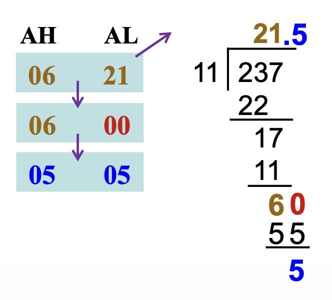{ align=right width=20% }

            ```asm
            MOV AX, 237     ; AX = 237
            MOV CL, 11      ; CL = 11
            DIV CL          ; AH: AL = AX÷CL
                            ; AH = 6, AL = 21
            ```

        === "例2"

            将内存位置 `NUMB` 的无符号字节内容除以内存位置 `NUMB1` 的无符号内容（即，`NUMB` / `NUMB1`）

            ```asm
            MOV AL, NUMB        ; get NUMB
            MOV AH, 0           ; zero-extend
            DIV NUMB1           ; divide by NUMB1
            MOV ANSQ, AL        ; save quotient
            MOV ANSR, AH        ; save remainder
            ```

            - 注意：位置 `NUMB` 的内容被零扩展，以形成一个 16 位无符号数，作为被除数

- 16 位除法
    - 此时以 `DX-AX` 作为被除数（32 位）
    - 在 80386 以上的处理器中，使用 `#!asm MOVZX` 指令对数字进行零扩展

    <div style="text-align: center">
        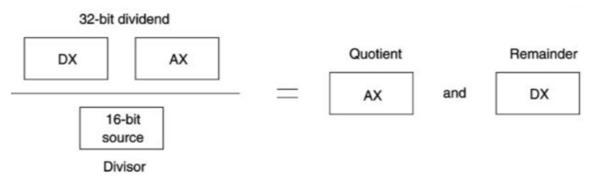
    </div>

- 32 位除法
    - 80386 及以上的处理器支持在无符号或符号数上执行 32 位除法
    - `EDX-EAX` 中的 64 位内容除以指令指定的操作数
    - 32 位的商和余数分别在 `EAX` 和 `EDX` 中

    <div style="text-align: center">
        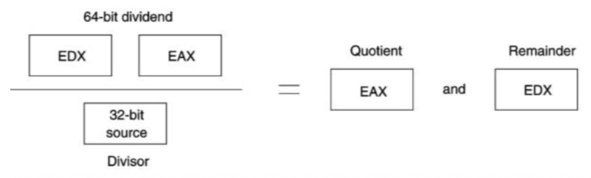
    </div>

- 64 位除法
    - 处于 64 位模式的 Pertium 4 可在无符号或符号数上执行 32 位除法
    - 使用 `RDX-RAX` 来保存被除数
    - 商和余数分别在 `RAX` 和 `RDX` 中

- 3 种类型的**符号扩展**：
    - `#!asm CBW` / `#!asm CWDE` / `#!asm CDQE`：将 `AL` / `AX` / `EAX` 中的符号字节/字/双字转换为符号字/双字/在 `RAX` 中的四字

        | 指令 | Op/En | 64 位模式 | 兼容/传统模式 | 描述 |
        | :--- | :--- | :--- | :--- | :--- |
        | `#!asm CBW` | `ZO` | 有效 | 有效 | `AX := AL` 的符号扩展 |
        | `#!asm CWDE` | `ZO` | 有效 | 有效 | `EAX := AX` 的符号扩展 |
        | `#!asm CDQE` | `ZO` | 有效 | 不适用 | `RAX := EAX` 的符号扩展 |


    - `#!asm CWD` / `#!asm CDQ` / `#!asm CQO`：将 r`AX` 的**符号位**拷贝到 r`DX` 寄存器的**所有位**上
        - 以下例子展示了通过 `#!asm CWD` 指令对 2 个 16 位符号数的除法

            ```asm
            MOV AX, -100            ; load a -100
            MOV CX, 9               ; load +9
            CWD                     ; convert the signed 16-bit number in AX
            IDIV CX                 ; to a 32-bit signed number in DX: AX
            ```

    - `#!asm MOVSX` / `#!asm MOVSXD`：将源操作数（寄存器/内存位置）的内容通过**符号扩展**拷贝到目标操作数（寄存器）

        ```asm
        MOVSX reg16, reg/mem8       
        MOVSX reg32, reg/mem16
        MOVSX reg32, reg/mem8       
        MOVSX reg64, reg/mem16
        MOVSX reg64, reg/mem8       
        MOVSXD reg64, reg/mem32
        ```

        - `#!asm MOVZX`：将源操作数（寄存器/内存位置）的内容通过**零扩展**拷贝到目标操作数（寄存器）

            ```asm
            MOVZX reg16, reg/mem8       
            MOVZX reg32, reg/mem16
            MOVZX reg32, reg/mem8       
            MOVZX reg64, reg/mem16
            MOVZX reg64, reg/mem8
            ```

- 余数有以下几种处理方式：
    - **截断求商**(dropped to truncate the quotient)：比如 13 / 2 = 6
    - **舍入求商**(round the quotient)：如果除法是无符号的，舍入需要将余数与除数的一半进行比较，以决定是否将商数向上取整（比如 13 / 2 = 7）
    - **分数余数**(fractional remainder)：比如 13 / 2 = 6.5

???+ example "例子"

    === "例1"

        下面展示了一个将 `AX` 除以 `BL` 的程序，并舍入无符号结果（即，`AX` / `BL`）

        ```asm
        0000 F6 F3          DIV BL          ; divide
        0002 02 E4          ADD AH, AH      ; double remainder
        0004 ЗА ЕЗ          CMP AH, BL      ; test for rounding
        0006 72 02          JB NEXT         ; if OK
        0008 FE CO          INC AL          ; round
        000A           NEXT:
        ```

        - 在比较之前将余数加倍，以决定是否舍入求商
        - `#!asm INC` 指令在比较后舍入 `AL` 的内容

    === "例2"

        下面展示了如何将 13 除以 2。

        ```asm
        0000 B8 000D        MOV AX, 13      ; load 13
        0003 B3 02          MOV BL, 2       ; load 2
        0005 F6 F3          DIV BL          ; 13/2
        0007 A2 0003 R      MOV ANSQ, AL    ; save quotient
        000A BO 00          MOV AL, O       ; clear AL
        000C F6 F3          DIV BL          ; generate remainder
        000E A2 0004 R      MOV ANSR, AL    ; save remainder
        ```

        - 8 位商被保存在内存位置 `ANSQ` 中，然后 AL 被清零
        - 接下来，`AX` 的内容再次除以 2，以生成一个分数余数
        - 在第二次除法后，`AL` 寄存器的值为 `80H`
        - 如果将二进制点（基数）放置在 `AL` 的最左边位之前，则 `AL` 中的小数余数为 0.510 或 0.100000002
        - 余数保存在内存位置 `ANSR` 中


## BCD and ASCII Arithmetic

微处理器同时支持 **BCD**（二进制编码的十进制(binary-coded decimal)）和 **ASCII** 数据的算术操作。但这些指令在 64 位模式下是无效的，强行使用会抛出**无效操作码异常**(invalid-opcode exception)。


### BCD Arithmetic

- BCD 运算发生在如小型终端（例如，收银机）和其他很少需要复杂算术的系统中
- 两种使用 BCD 数据进行运算的算术指令：
    - `#!asm DAA`（加法后十进制调整(decimal just after addition)）指令紧随 BCD 加法之后
    - `#!asm DAS`（减法后十进制调整(decimal just after subtraction)）紧随 BCD 减法之后
    - 两者都纠正加法或减法的结果，使其成为 BCD 数，并且这些指令使用寄存器 `AX` 作为源和目标

- `#!asm DAA` 指令：
    - 调整两个**压缩**(packed) **BCD** 值的总和，以创建一个压缩 BCD 结果
    - 仅在跟随 `#!asm ADD` 或 `#!asm ADC` 指令后面时才有用，这些指令将两个 2 位数字的压缩 BCD 值相加（以二进制方式相加），并将字节结果存储在 `AL` 寄存器中
    - 然后该指令调整 `AL` 寄存器的内容，使其包含正确的 2 位数字压缩 BCD 结果
    - 如果检测到十进制进位，则 `CF` 和 `AF`（在加法后保存进位（半进位））标志会相应设置

    ???+ example "例子"

        === "例1"

            ```asm title="计算 BCD 35+48"
            MOV AL, 35H
            ADD AL, 48H     ; AL = 7DH, AF = 0
            DAA             ; AL = 83H, CF = 0
            ```

            ```asm title="计算 BCD 69+29"
            MOV AL, 69H
            ADD AL, 29H     ; AL = 92H, AF = 1
            DAA             ; AL = 98H, CF = 0
            ```

            ```asm title="计算 BCD 35+65"
            MOV AL, 35H
            ADD AL, 65H     ; AL = 9AH, AF = 0
            DAA             ; AL = 00H, CF = 1
            ```

        === "例2"

            { align=right width=20% }

            ```asm hl_lines="3-5 7-9"
            0000 BA 1234    MOV DX, 1234H       ; load 1234 BCD
            0003 BB 3099    MOV BX, 3099Н       ; load 3099 BCD
            0006 8A C3      MOV AL, BL          ; sum BL and DL
            0008 02 C2      ADD AL, DL          ; AL = CDH
            000A 27         DAA                 ; AL = 33H, CF = 1
            000B 8A C8      MOV CL, AL          ; answer to CL
            000D 9A C7      MOV AL, BH          ; sum BH, DH and carry
            000F 12 C6      ADC AL, DH          ; AL = 43H
            0011 27         DAA
            0012 8A E8      MOV CH, AL          ; answer to CH
                                                ; CX = 4333H
            ```

- `#!asm DAS` 指令：除了做减法运算外，和 `#!asm DAA` 指令基本一致

    ???+ example "例子"

        ```asm
        0000 BA 1234    MOV DX, 1234H       ; load 1234 BCD
        0003 BB 3099    MOV BX, 3099Н       ; load 3099 BCD
        0006 8A C3      MOV AL, BL          ; subtract DL from BL
        0008 2A C2      SUB AL, DL
        000A 2F         DAS
        000B 8A C8      MOV CL, AL          ; answer to CL
        000D 9A C7      MOV AL, BH          ; subtract DH
        000F 1A C6      SBB AL, DH
        0011 2F         DAS
        0012 8A E8      MOV CH, AL          ; answer to CH
        ```


### ASCII Arithmetic

- ASCII 算术指令与编码数字一起工作，值 `30H` 到 `39H` 代表 0 到 9 
- 有以下四种指令：
    - `#!asm AAA`（ASCII 加法后调整）
    - `#!asm AAS`（ASCII 减法后调整）
    - `#!asm AAM`（ASCII 乘法后调整）
    - `#!asm AAD`（ASCII 除法前调整）

- 这些指令使用寄存器 `AX` 作为源和目标
- `#!asm AAA` 指令：
    - 在使用 `#!asm ADD` 指令后，使用 `#!asm AAA` 指令来添加两个**未压缩的**(unpacked) **BCD** 数字
    - `AL` 寄存器是 `#!asm AAA` 指令的隐式源操作数和目标操作数
    - `#!asm AAA` 指令将 `AL` 中的值调整为未压缩的 BCD 结果
        - 如果 `AL[3:0] > 9` 或 `AF = 1`，则 `AL = AL + 6`，`AH = 1`，并设置 `CF = 1` 和 `AF = 1`
        - 否则，`CF = 0`，`AF = 0`
        - 在任何情况下，`AL[7:4] = 0`，将正确的小数位留在 `AL[3:0]` 中

    - `#!asm AAA` 指令可以添加 ASCII 数字，而无需屏蔽掉高四位 `'3'`

    ???+ example "例子"

        ```asm
        MOV AL, '3'     ; AL = 0x33 (ASCII for '3')
        ADD AL, '4'     ; AL = 0×67
                        ; ASCII result for '3' + '4' = 0x33 + 0x34 = 0x67
        AAA             ; AH = 0, AL = 07, CF = 0 and AF = 0
        ```

        ```asm
        MOV AX, '1'     ; AL = 0x31 (ASCII for '1')
        ADD AL, '9'     ; AL = 0xбA
                        ; ASCII result for '1' + '9' = 0x31 + 0x39 = 0x6A
        AAA             ; AH = 1, AL = 0, CF = 1 and AF = 1
        ```

    ??? info "LLM 能否理解 `#!asm AAA` 指令"

        ~~应该是对本学期第二次实验的预告~~

        <div style="text-align: center">
            
        </div>

        <div style="text-align: center">
            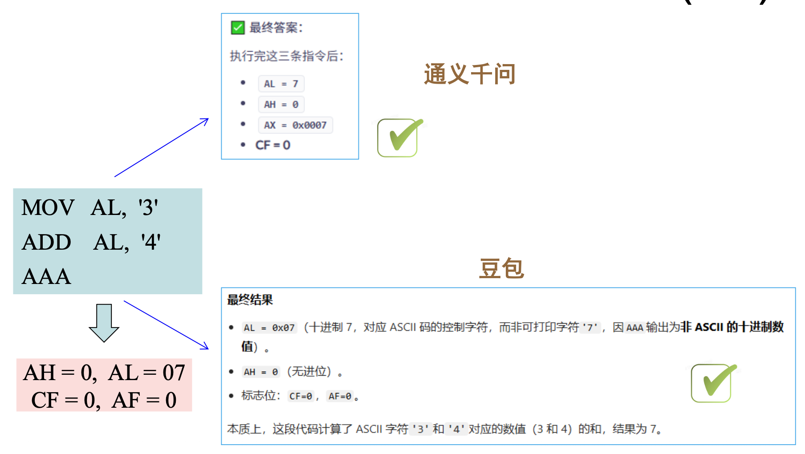
        </div>

- `#!asm AAS` 指令：在 ASCII 减法后调整 `AX` 寄存器
- `#!asm AAM` 指令：
    - 在对两个一位数的未压缩 BCD 数字进行乘法运算后，遵循乘法指令
    - 该指令将二进制转换为未压缩的 BCD
    - 如果 `AX` 中出现介于 `0000H` 和 `0063H` 之间的二进制数字，该指令将其转换为 BCD
- `#!asm AAD` 指令：
    - 出现在除法前
    - 要求 `AX` 寄存器在执行前包含两位未压缩的 BCD 数字（非 ASCII）


## Logic Instructions

**逻辑运算**在低级软件(low-level software)中提供二进制位控制，允许设置、清除或补位。

- 低级软件以机器语言或汇编语言形式出现，并且常用于控制系统中的 I/O 设备

除 `#!asm NOT` 指令外，逻辑指令始终会对这些标志位产生影响：

- `OF` 和 `CF` 标志清零
- 更改 `SF`、`ZF` 和 `PF` 标志
- `AF` 标志状态是未定义的

当在寄存器或内存位置中操作二进制数据时，最右边的位记为第 0 位。


### AND

- 执行**逻辑乘法**，通过真值表说明
- 如果所需速度不是太快，`#!asm AND` 可以替代离散的 AND 门
    - 通常保留用于嵌入式控制应用
- 在 8086 中，`#!asm AND` 指令通常在约 1μs 内执行
    - 使用较新版本时，执行速度大大提高

<div style="text-align: center">
    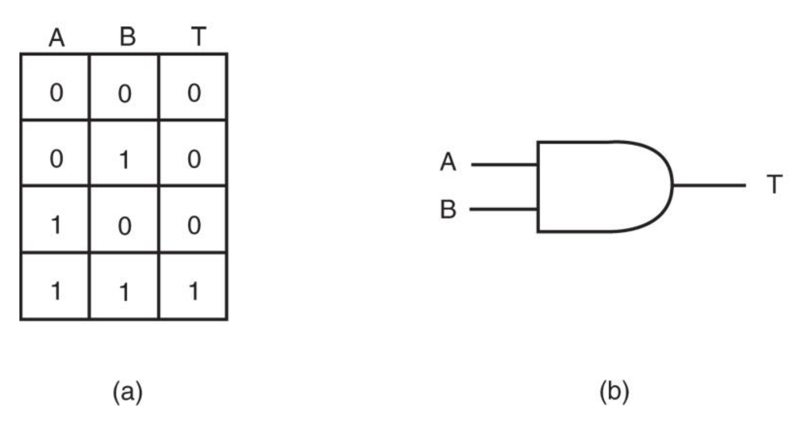
</div>

- 可用于实现**掩码**(masking)操作，即清除二进制数的位

    <div style="text-align: center">
        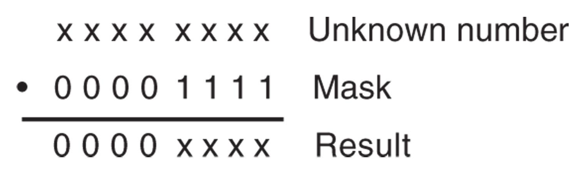
    </div>

    - 可以使用 `#!asm AND` 掩码去除最左边的四个二进制位位置，将 ASCII 编码的数字转换为 BCD

        ```asm
        MOV BX, 3135H   ; load ASCII
        AND BX, OF0FH   ; mask BX
        ```

- 支持除内存到内存和段寄存器寻址之外的所有模式


### OR

- 执行**逻辑加法**，通常称为**包含或**(inclusive-or)函数
    - 如果有任何输入为 1，就会生成逻辑 1 输出
    - 只有当所有输入均为 0 时，输出才为 0

- OR 门及真值表：

    <div style="text-align: center">
        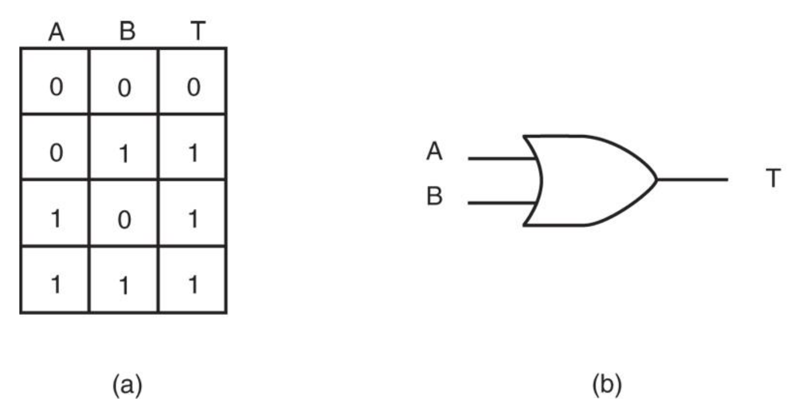
    </div>

- 使用除段寄存器寻址以外的任何寻址模式
- 使用 `#!asm OR` 指令将数字中的某些位（强行）置 1

    <div style="text-align: center">
        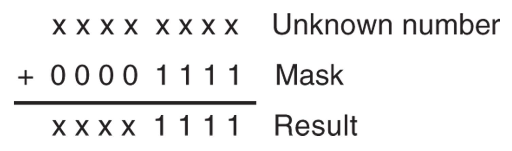
    </div>


### Exclusive-OR

- 与 `#!asm OR` 唯一不同的是，当输入为 1, 1 时，**异或**(exclusive-OR)产生 0
- 实际上可将规则总结为：若输入都是 0 或者都是 1，则输出为 0；如果输入不同，则输出为 1
- 异或有时被称为**比较器**(comparator)
- XOR 门及真值表：

    <div style="text-align: center">
        
    </div>

- 使用除段寄存器寻址以外的任何寻址模式
- 可用于**反转**寄存器或内存位置的某些位
    - 当 1 与 $X$ 进行异或时，结果是 $\overline{X}$
    - 当 0 与 $X$ 进行异或时，结果是 $X$

    <div style="text-align: center">
        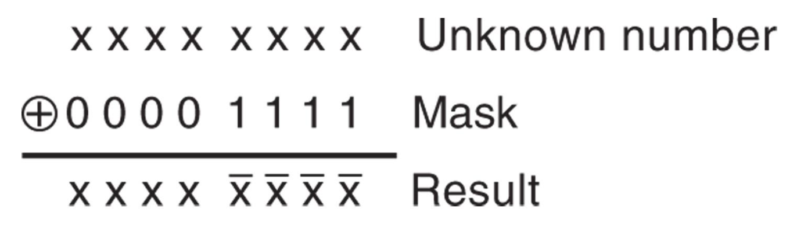
    </div>

- 另一个常见用途是将寄存器**清零**（自己跟自己做异或）


### Test and Bit Test Instructions

- `#!asm TEST` 执行 `#!asm AND` 操作，但只影响标志寄存器（表示测试结果的条件）
- 通常后面紧跟 `#!asm JZ`（如果为零则跳转(jump if zero)）或 `#!asm JNZ`（如果不为零则跳转(jump if not zero)）指令
- 目标操作数通常与立即数进行比较

???+ example "例子"

    测试 `AL` 寄存器最右边和最左边的位；用 1 选择最右边的位，128 选择最左边的位

    ```asm
    TEST AL, 1      ; test right bit
    JNZ RIGHT       ; if set
    TEST AL, 128    ; test left bit
    JNZ LEFT        ; if set
    ```

- `#!asm CMP` 和 `#!asm TEST` 是常用于比较的指令，这些指令被称为**条件指令**(conditionals)

    <div class="grid" markdown>

    ```asm
    MOV EAX, 1
    CMP EAX, 1      ; C=0, Z=1, S=0, 0=0
    JE  LABEL       ; jump to LABEL
    ```

    ```asm
    MOV  EAX, 1
    TEST EAX, 1     ; C=0, Z=0, S=0, 0=0
    JE   LABEL      ; do not jump
    ```

    </div>

- `#!asm TEST same, same` 用于确定一个符号数是否大于 0

    ```asm
    TEST EAX, EAX       ; if EAX = 0 set Z = 1, if EAX < 0 set S = 1
    JLE ERROR           ; if EAX is equal or less than zero then jump
    ```

- `#!asm TEST EAX, EAX` 和 `#!asm CMP EAX, 0` 几乎相同，但前者比后者更短

    ```asm
    TEST EAX, EAX       ; 85 C0 
    CMP  EAX, 0         ; 83 F8 00
    ```

- 从 80386 处理器开始引入了额外的测试指令，用于测试单个位的位置
    - 由源操作数选定目标操作数中被测位的位置

        | 汇编语言 | 操作 |
        | :--- | :--- |
        | `#!asm BT` | 测试目标操作数中由源操作数指定的位 |
        | `#!asm BTC` | 测试目标操作数中由源操作数指定的位，并对该位进行**求反**(complement)操作 |
        | `#!asm BTR` | 测试目标操作数中由源操作数指定的位，并**重置**(reset)（置为 0）该位 |
        | `#!asm BTS` | 测试目标操作数中由源操作数指定的位，并**设置**(set)（置为 1）该位 |

    - 例子：`#!asm BT AX, 4` 指令测试 `AX` 的第 4 位
        - 测试结果位于进位标志位 `CF`
        - 若第 4 位是 1，`CF` 置位
        - 若第 4 位是 0，`CF` 清零

    ??? example "例子"

        以下两段指令序列近乎等价：

        ```asm
        OR  CX, 0600H       ; set bits 9 and 10
        AND CX, 0FFFCH      ; clear bits 0 and 1
        XOR CX, 1000H       ; invert bit 12
        ```

        ```asm
        BTS CX, 9       ; set bit 9
        BTS CX, 10      ; set bit 10
        BTR CX, 0       ; clear bit 0
        BTR CX, 1       ; clear bit 1
        BTC CX, 12      ; complement bit 12
        ```


### NOT and NEG

- `#!asm NOT` 指令**反转**一个字节、字或双字的**所有位**
- `#!asm NEG` 对一个数取二进制补码，得到该数的**相反数**
- `#!asm NOT` 和 `#!asm NEG` 可以使用除段寄存器寻址以外的任何寻址模式
- `#!asm NOT` 被认为是逻辑操作，`#!asm NEG` 被认为是算术操作
- `#!asm NOT` 指令不影响任何标志位，而 `#!asm NEG` 指令影响的标志位有：
    - 如果操作数 = 0，则 `CF` = 0，否则 `CF` = 1
    - `OF`、`SF`、`ZF`、`AF` 和 `PF` 标志位根据结果设置

- 为什么 `#!asm NOT` 指令不修改任何标志位
    - `#!asm NOT` 操作通常用作中间操作（例如，`#!c if (!(a < b) && (a == b))`）而不是作为最终计算结果；因此，它不需要修改任何标志位
    - 如果需要测试 `#!asm NOT` 操作的结果，可以使用 `#!asm CMP` 或 `#!asm TEST` 指令来执行检查

        ```asm
        NOT  AX             ; Invert all bits of AX
        TEST AX, AX         ; Perform bitwise AND between AX and itself
        JZ   is_zero        ; Jump to `is_zero` if ZF is set
        ```

        ```asm
        NOT AX              ; Invert all bits of AX
        CMP AX, 0           ; Compare AX with 0
        JE  is_zero         ; Jump to `is_zero` if ZF is set
        ```

??? example "例子"

    符号函数：

    <div style="text-align: center">
        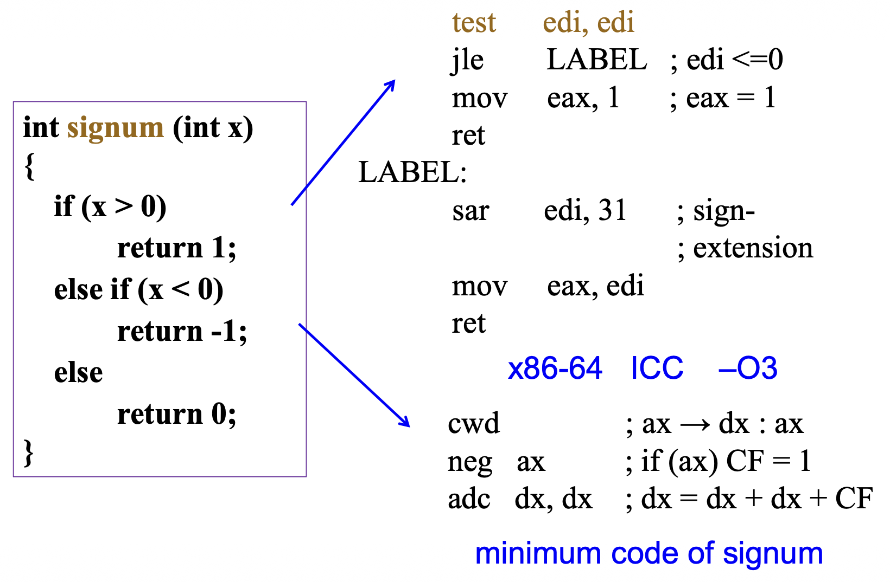
    </div>

    <div style="text-align: center">
        
    </div>

    `signum` 函数的最小代码由一个叫做 **superoptimizer** 的程序生成。


### Shift

- 移位指令将数字左移或右移到寄存器或内存位置中
    - 还可以执行简单的算术运算，如乘以 2^+n^ 的幂（左移）和除以 2^-n^ 的幂（右移）

    { align=right width=40% }

- 微处理器的指令集包含四种不同的移位指令：
    - 两个是**逻辑**(logical)移位；两个是**算术**(arithmetic)移位
    - 语法：`#!asm SHL`/`#!asm SAL`/`#!asm SHR`/`#!asm SAR REG/MEM, Count`

- 下图展示了这四种移位运算：
    - `#!asm SHL` 和 `#!asm SAL` 将目标操作数的位向左移动（所以两者执行相同的操作）
    - `#!asm SHR` 用 **0** 填充左边空出来的位
    - `#!asm SAR` 用**符号位**填充左边空出来的位

- 一些例子：

    | 汇编语言 | 操作 |
    | :--- | :--- |
    | `#!asm SHL AX, 1` | `AX` 进行逻辑左移 1 位 |
    | `#!asm SHR BX, 12` | `BX` 进行逻辑右移 12 位 |
    | `#!asm SHR ECX, 10` | `ECX` 进行逻辑右移 10 位 |
    | `#!asm SHL RAX, 50` | `RAX` 进行逻辑左移 50 位（64 位模式）|
    | `#!asm SAL DATA1, CL` | 数据段内存位置 `DATA1` 的内容进行算术左移，位移量由 `CL` 指定 |
    | `#!asm SHR RAX, CL` | `RAX` 进行逻辑右移，位移量由 `CL` 指定（64 位模式）|
    | `#!asm SAR SI, 2` | `SI` 进行算术右移 2 位 |
    | `#!asm SAR EDX, 14` | `EDX` 进行算术右移 14 位 |

- **计数**操作数可以是一个**立即值**或 **`CL` 寄存器**
    - 以下示例展示了如何以两种不同方式将 `DX` 寄存器左移 14 位：

        ```asm
        SHL DX, 14
        ```

        ```asm
        MOV CL, 14
        SHL DX, CL
        ```

- 在 16 位或 32 位模式下，移位计数是一个**模 32 的计数**，即计数范围在 0-31 内
- 在 64 位模式下，移位计数是一个**模 64 的计数**，即计数范围在 0-63 内
- `#!asm SAR` 和 `#!asm SHR` 指令可用于执行目标操作数按 2 的幂次的**符号或无符号除法**
- 负数的 `#!asm SAR` 舍入：
    - 对于负数，`#!asm IDIV` 指令得到的商会被舍入至 **0**，而 `#!asm SAR` 指令会将其舍入至**负无穷**，两者结果并不一致(inconsistency)

    <div style="text-align: center">
        
    </div>

    === "Step 1"

        <div style="text-align: center">
            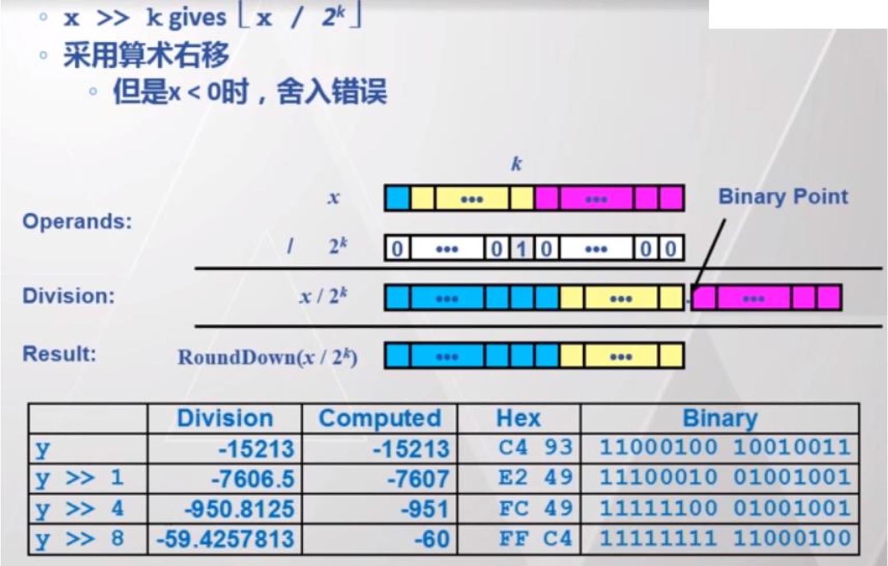
        </div>

    === "Step 2"

        <div style="text-align: center">
            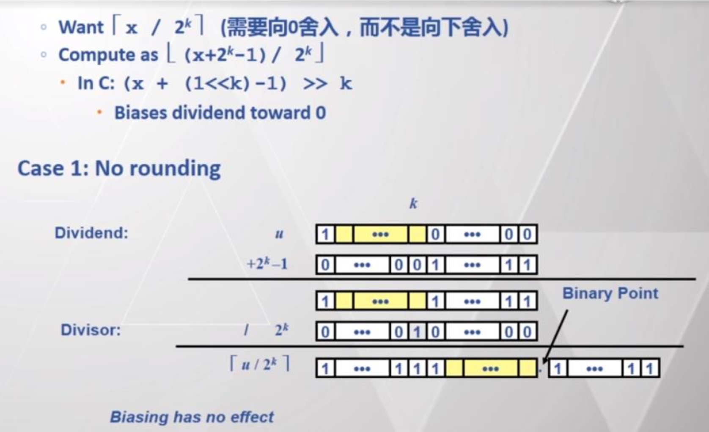
        </div>

    === "Step 3"

        <div style="text-align: center">
            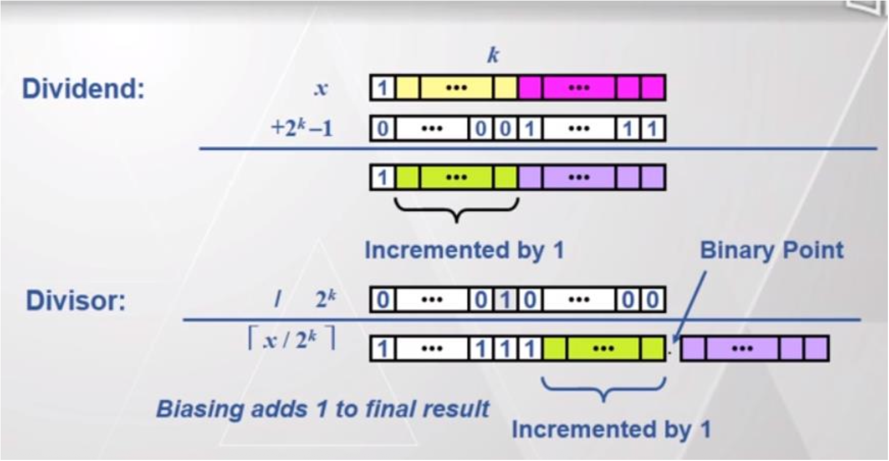
        </div>

    === "Step 4"

        <div style="text-align: center">
            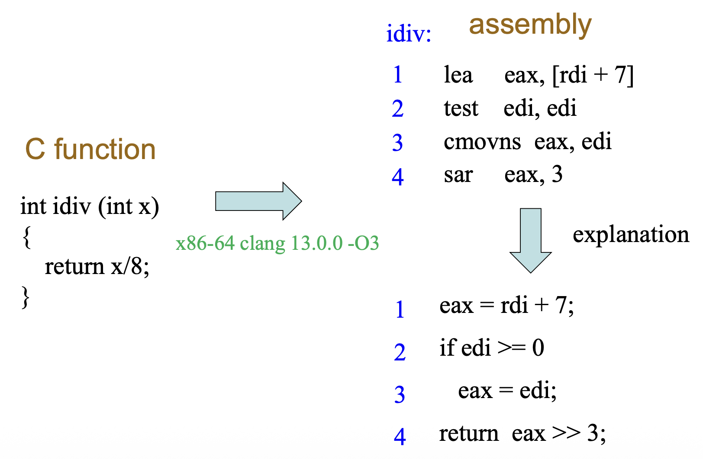
        </div>

- 双精度移位（从 80386 开始）
    - 两个指令：`#!asm SHLD`（左移）和 `#!asm SHRD`（右移），本质上是跨寄存器的移位

        <div style="text-align: center">
            
        </div>

    - 每条指令包含三个操作数（`#!asm SHLD/SHRD D, S, Count`），而不是 2 个
    - 例如指令 `#!asm SHLD reg1, reg2, imm8` 将寄存器 `reg1` 和 `reg2` 连接起来，并将它们左移由 `imm8` 指定的数量
    - 两个函数都使用两个 16 位、32 位或 64 位寄存器，或者一个 16 位、32 位或 64 位内存位置和一个寄存器

    ???+ example "例子"

        === "例1"

            ```asm
            shld ebx, ecx, 16       ; The leftmost 16 bits of ecx fill the
                                    ; rightmost 16 bits of ebx. The contents
                                    ; of ecx remain unchanged.
            shrd ax, bx, 12         ; Logical right shift of ax by 12
                                    ; rightmost 12 bits of bx into
                                    ; leftmost 12 bits of ax. The contents
                                    ; of bx remain unchanged.
            ```

        === "例2"

            128 位值除以 8 的除法：

            ```c
            __uint128_t u128div (__uint128_t x) {
                return x / 8;
            }
            ```

            ```asm title="x86-64 gcc 12.2 -O3"
            u128div:
            mov rax, rdi            ; rax is lower 64 bit
            mov rdx, rsi            ; rdx is upper 64 bit
            shrd rax, rsi, 0x3      ; [rsi : rax] >> 3
            shr rdx, 0x3            ; rdx >> 3
            ret                     ; result = [rdx : rax] / 8
            ```


### Rotation

- 通过在寄存器或内存位置中旋转信息来定位二进制数据，要么从一端到另一端，要么通过进位标志
- 语法：`#!asm ROL/ROR/RCL/RCR REG/MEM, Count`

    <div style="text-align: center">
        
    </div>

- 左旋（`#!asm ROL`）和右旋（`#!asm ROR`）不包括 `CF` 标志
- 而进位左旋(rotate through carry left)（`#!asm RCL`）和进位右旋(rotate through carry right)（`#!asm RCR`）将 `CF` 标志移入最高或最低有效位
- 旋转计数可以是立即数或寄存器 `CL` 的值
- 旋转指令通常用于将宽数字向左或向右移动

???+ example "例子"

    128 位值除以 2 的除法：

    ```c
    __uint128_t u128div (__uint128_t x) {
        return x / 2;
    }
    ```

    <div class="grid" markdown>

    ```asm title="SHRD version"
    u128div:
        mov rax, rdi
        mov rdx, rsi
        shrd rax, rsi, 0x1
        shr rdx, 0x1
        ret
    ```

    ```asm title="RCR version"
    u128div:
        mov rax, rdi    ; rax is lower 64 bit
        mov rdx, rsi    ; rdx is upper 64 bit
        shr rdx, 0x1    ; rdx >> 1, shift LSB of rdx into CF
        rcr rax, 0x1    ; rotate rax by 1, and shift CF into rax
        ret             ; result = [rdx : rax] / 2
    ```

    </div>


### Bit Scan Instructions

**位扫描指令**逐位扫描数字，找到其中置为 1 的位

- 在 80386 及以上处理器中可用
- `#!asm BSF`（位向前扫描(bit scan forward)）从最低位向左扫描源数字
- `#!asm BSR`（位反向扫描(bit scan reverse)）从最高位向右扫描源数字
- 语法：`#!asm BSF/BSR REG, REG/MEM`
- 如果没找到置为 1 的位，则设置零标志（`ZF = 1`）
- 如果找到置为 1 的位，则清除零标志（`ZF = 0`），并将该位的位编号放入目标操作数中

???+ example "例子"

    令 `EAX = 60000000H = 0110 0000 0000 0000 0000 0000 0000 0000B`

    - `#!asm BSF EBX, EAX`
        - `EBX = 29`（位 29 是 1）
        - `ZF = 0`

    - `#!asm BSR EBX, EAX`
        - `EBX = 30`（位 30 是 1）
        - `ZF = 0`

- 扩展：
    - `#!asm TZCNT`（尾部零计数(tailing zero count)）计算尾部零比特的数量
    - `#!asm LZCNT`（前导零计数(leading zero count)）返回前导零比特的数量
    - 它们和 `#!asm BSF/BSR` 之间的主要区别在于：
        - 如果源操作数 = 0（没有 1 位），则 `#!asm BSF/BSR` 中目标操作数的内容是未定义的，而 `#!asm TZCNT/LZCNT` 提供操作数大小作为输出
        - 如果源操作数 = 0，`#!asm BSF/BSR` 仅影响 `ZF`，而 `#!asm TZCNT/LZCNT` 同时设置 `ZF` 和 `CF`（`ZF = 1`，`CF = 1`），否则清零

    ???+ example "例子"

        令 `EAX = 60000000H = 0110 0000 0000 0000 0000 0000 0000 0000B`

        - `#!asm LZCNT EBX, EAX`
            - `EBX = 1`（一个前导位）
            - `ZF = 0`，`CF = 0`

        - `#!asm BSR EBX, EAX`
            - `EBX = 30`（位 30 是 1）
            - `ZF = 0`


## String Comparisons

- 字符串指令非常强大，能让程序员相对轻松地操作大量数据块
- 数据块操作通过 `#!asm MOVS / LODS / STOS / INS / OUTS` 进行（[上一章](4.md#string-data-transfers)介绍过了）
- 另外一些字符串指令能将内存的一部分，与常量或另一部分内存进行测试，包括：`#!asm SCAS`（字符串扫描）和 `#!asm CMPS`（字符串比较）


### SCAS

- `#!asm SCAS` 指令将使用内存操作数指定的字节、字、双字或四字与 `AL`、`AX` 或 `EAX` 中的值（**隐式操作数**）进行比较，然后在 `EFLAGS` 中设置状态标志以记录结果
- **内存操作数地址**根据当前操作模式的地址大小属性从 `ES:EDI` 读取
- 操作数的大小可根据指令选择：
    - `#!asm SCASB`（字节比较）
    - `#!asm SCASW`（字比较）
    - `#!asm SCASD`（双字比较）

- `#!asm SCAS` 使用方向标志（`D`）来选择 `DI/EDI` 的自动增减操作
- `#!asm SCAS` 可以在块比较前使用条件重复前缀 `#!asm REPE`（相等时重复）或 `#!asm REPNE`（不相等时重复）

???+ example "例子"

    - 假设内存的一个部分长度为 100 字节，并从位置 `BLOCK` 开始
    - 必须测试这个内存部分，以查看是否有任何位置包含 `00H`
    - 以下程序展示了如何使用 `#!asm SCASB` 指令搜索内存的这一部分以查找 `00H`

    ```asm
    MOV DI, OFFSET BLOCK        ; address data
    CLD                         ; auto-increment
    MOV CX, 100                 ; load counter
    XOR AL, AL                  ; clear AL
    REPNE SCASB
    ```

    在 `#!asm SCASB` 指令结束后

    - 如果 `ZF = 1`，则某个位置包含 `00H`
    - 如果 `CX = 0` 且 `ZF = 0`，则所有数据都不匹配 `00H`


### CMPS

- 始终比较两个内存区域，数据以字节（`#!asm CMPSB`）、字（`#!asm CMPSW`）或双字（`#!asm CMPSD`）的形式进行比较
    - 由 `SI/ESI` 寻址的数据段内存位置的内容，与由 `DI/EDI` 寻址的附加段内存的内容进行比较
    - `#!asm CMPS` 指令会递增/递减计数器

- 通常与 `#!asm REPE` 或 `#!asm REPNE` 前缀一起使用
    - 替代方案是 `#!asm REPZ`（在零时重复）和 `#!asm REPNZ`（在非零时重复）

???+ example "例子"

    === "例1"

        <div style="text-align: center">
            
        </div>

    === "例2"

        比较两个内存部分，用于寻找匹配：

        ```asm
        MOV SI, OFFSET LINE         ; address LINE
        MOV DI, OFFSET TABLE        ; address TABLE
        CLD                         ; auto-increment
        MOV CX, 10                  ; load counter
        REPE CMPSB                  ; search
        ```

        - `#!asm CMPSB` 指令以 `#!asm REPE` 作为前缀。这导致搜索在存在相等条件的情况下继续
        - 当 `CX` 寄存器变为 0 或存在不等条件时，`#!asm CMPSB` 指令停止执行
        - `#!asm CMPSB` 指令结束后
            - 如果 `CX = 0` 且 `ZF = 1`，则两个字符串匹配
            - 如果 `CX != 0` 或 `ZF = 0`，则字符串不匹配