# Program Control Instructions

??? abstract "核心知识"

    - 跳转指令
        - 无条件/条件跳转
        - 循环
    - 和程序控制相关的伪指令
        - 条件
        - 循环
    - 过程：
        - `#!asm CALL` + `#!asm RET`
        - 特权级别控制转移
    - 中断和异常
    - 杂项

## The Jump Group

- 通过**无条件**或**条件跳转**(unconditional / conditional jump)指令，能在程序段之间跳跃，并且能跳转到内存的任何部分以执行下一条指令
- 条件跳转指令允许基于数值测试做出决策，结果存储在标志位中，然后由条件跳转指令测试
- `#!asm LOOP` 和条件 `#!asm LOOP` 也是跳转指令的一种形式


### Unconditional Jump (JMP)

无条件跳转指令分为三类：

- **短跳**(short jump)：2 字节指令，允许跳转到以跳转指令地址为中心的 -128B ~ 127B 范围内的内存位置
- **近跳**(near jump)：3 字节指令，允许跳转到在当前代码段中的指令 ±32 KB 范围内的地方
- **远跳**(far jump)：5 字节指令，允许跳转到在真实内存系统上的任意位置

其中前面两种指令称为**段内跳转**(infrasegment jump)，最后一种称为**段间跳转**(intersegment jump)。

<div style="text-align: center">
    
</div>


#### Short Jump

- 短跳又称**相对跳转**(relative jump)，因为可以通过相关软件移动到当前代码段中的任何位置，而不会发生变化
    - 跳转地址并不存储在操作码中
    - 操作码后会跟一个（跳转）**距离**(distance)或偏移量(displacement)

- 短跳偏移量是一个用 1 字节符号数表示的距离，范围在 -128 ~ 127 之间

{ align=right width=30% }

- 右图展示了短跳操作的细节：
    - 当微处理器执行短跳时，对偏移量进行符号扩展，并将其加到指令指针（`IP` / `EIP`）中，以生成在当前代码段内的跳转地址
    - 指令跳转到程序中下一条指令的新地址

- 当跳转指令引用一个地址时，通常用**标签**标识该地址，比如 `#!asm JMP NEXT`
    - 跳转到标签 `NEXT` 上以执行下一条指令
    - 很少会在跳转指令中使用十六进制地址
    - 标签 `NEXT` 后必须跟一个**冒号**（`NEXT:`），从而让指令能够引用它，否则该标签无法被引用
    - 唯一使用冒号的情况是当标签与跳转或调用指令一起使用时


#### Near Jump

- 实模式下，近跳是一个 3 字节指令，包含操作码以及一个 16 位的符号偏移量
- 近跳将控制权传递给当前代码段内的一个指令，该指令位于近跳转指令的 ±32KB 范围内
    - 因此可以跳转到当前实模式代码段内的任何内存位置
- 80386 及之后的处理器中偏移量是 32 位的，因此近跳指令长为 5 字节
    - 保护模式下，跳转范围为 ±2GB
- 将符号偏移量加在指令指针上（`IP`），生成跳转地址
- 下图展示了近跳操作的细节：

    <div style="text-align: center">
        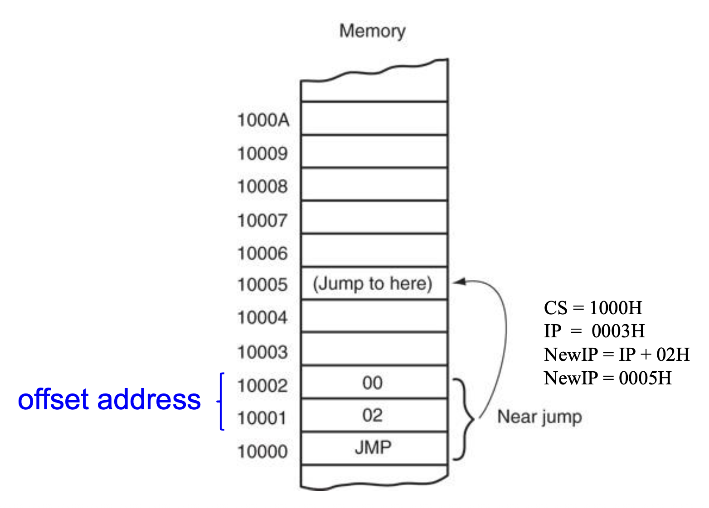
    </div>

- 近跳是**可重定位的**(relocatable)，因为它也是一种相对跳转
    - 软件可以写入和加载到内存的任何位置，并且由于相对跳转和可重定位的数据段，无需修改即可运行

???+ example "例子"

    下面是一段用到近跳的程序：

    ```asm hl_lines="4 10"
    0000  33DB                 XOR   BX,BX
    0002  B8 0001      START:  MOV   AX,1
    0005  03 C3                ADD   AX,BX
    0007  E9 0200              JMP   NEXT
    000A

    ...                <skipped memory locations>

    0200  8B D8        NEXT:   MOV   BX,AX
    0202  E9 0002 R            JMP   START
    ```

    - 第一个跳转指令（`#!asm JUMP NEXT`）将控制权传递给代码段内内存地址偏移量为 `0200H` 的指令
    - 注意到指令汇编为 `E9 0200 R`。字母 `R` 表示 `0200H` 的**可重定位跳转地址**
    - 链接后，跳转指令以 `E9 F6 01` 形式呈现（真实的偏移量为 `01F6H`（`0200H - 000AH = 01F6H`））


#### Far Jump

- 获取新的段和偏移地址来实现跳转
- 在实模式下是 5 字节的指令
    - 字节 2 和 3 包含新的偏移地址
    - 字节 4 和 5 包含新的段地址
- 在保护模式下
    - 段地址访问具有远跳段的基址的描述符
    - 16 或 32 位的偏移地址包含新代码段的偏移地址

- 下图展示了远跳操作的细节：

    <div style="text-align: center">
        
    </div>

- 两种实现远跳的方式：
    - 使用 `#!asm FAR PTR` 伪指令，比如 `#!asm JMP FAR PTR START`
    - 定义一个**远标签**(far label)，比如 `#!asm EXTRN START:FAR`

- 仅当标签在当前代码段或过程的外面时，该标签才是远标签；外部标签出现在包含多个程序文件的程序中
- 两种定义可以从过程块外部访问的远标签的方式：
    - 使用 `#!asm EXTRN` 伪指令，比如 `#!asm EXTRN START:FAR`
    - 使用**双冒号**，比如 `#!asm START::`

???+ example "例子"

    ```asm hl_lines="11-12"
    EXTRN UP:FAR

    0000  33 DB                 XOR  BX, BX         ; far label
    0002  B8 0001        START: ADD  AX, 1
    0005  E9 0200 R             JMP  NEXT

                        ; <skipped memory locations>

    0200  8B D8          NEXT:  MOV  BX, AX
    ; segment address
    0202  EA 0002 -- R          JMP  FAR PTR START   ; far jump
    0207  EA 0000 -- E          JMP  UP              ; far jump
    ```

    - 当标签 `UP` 通过 `#!asm EXTRN UP:FAR` 指令定义为远标签时，`#!asm JMP UP` 指令引用了一个远标签
    - 当程序文件被连接时，链接器将 `UP` 标签的地址插入到 `#!asm JMP UP` 指令中，还将段地址插入到 `#!asm JMP START` 指令中


#### Jump with Register Operands

- 跳转指令可以使用 **16 或 32 位寄存器**作为操作数
    - 自动设置为**绝对间接跳转**(absolute indirect jump)
    - 跳转地址位于跳转指令指定的寄存器中

- 与近跳转相关的偏移不同，**寄存器内容直接被传输给指令指针上**，而不会和指令指针做加法
- 例子：
    - `#!asm JMP AX` 将 `AX` 寄存器的内容复制到 `IP` 上
    - 而在 80386 以上的处理器中，`#!asm JMP EAX` 能跳转到当前代码段的任意位置上
        - 因为在保护模式下，代码段长度为 4GB，因此需要 32 位的偏移地址


#### Indirect Jump Using Indexes

- 跳转指令也可能使用 [] 形式的寻址（比如 `#!asm JMP TABLE[SI]`）来直接访问**跳转表**(jump table)
- 跳转表可以包含**近间接跳转**的偏移地址，或者**远间接跳转**的段和偏移地址
    - 若寄存器跳转被称为间接跳转，那么这种跳转也可被称为**双重间接跳转**(double-indirect jump)

- 编译器假定跳转是近跳转，除非 `#!asm FAR PTR` 指令指示为远跳转指令
- 访问跳转表的机制与正常内存引用相同
    - 例子：`#!asm JMP TABLE[SI]` 指令指向由 `SI` 指定的数据段偏移位置存储的跳转地址

- 寄存器和间接索引跳转指令通常指向 16 位偏移，因此都属于近跳转
- 如果 `#!asm JMP FAR PTR [SI]` 或 `#!asm JMP TABLE[SI]`，并且 `TABLE` 数据由 `DD` 指令定义，那么微处理器假定跳转表包含双字，32 位地址（`IP` 和 `CS`）


### Conditional Jumps

- 在 8086-80286 中，条件跳转指令始终是**短跳转**，范围限制在条件跳转后位置 -128 ~ 127 字节内
- 在 80386 及以上版本中，条件跳转可以是短跳转或**近跳转**（±32K）
    - 在 Pertium 4 的 64 位模式下，条件跳转的近跳转距离为 ±2G
    - 允许条件跳转到当前代码段内的任何位置

- 条件跳转指令测试标志位：
    - 符号（`S`），零（`Z`），进位（`C`）
    - 奇偶（`P`），溢出（`O`）

- 如果测试的条件为真，则跳转到指定标签上；否则按顺序执行程序中的下一条指令
- 大多数条件跳转指令通常只测试一个标志位，不过还是有测试多个标志位的指令
- 存在不测试任何标志位的条件跳转指令：
    - `#!asm JCXZ` 指令：测试 `CX` 寄存器的内容
        - 如果 `CX = 0`，则发生跳转
        - 如果 `CX != 0`，则不发生跳转

    - `#!asm JECXZ`：测试 `ECX` 寄存器的内容
        - 如果 `ECX = 0`，则发生跳转
        - 如果 `ECX != 0`，则不发生跳转

    ??? example "例子"

        - 以下程序使用 `#!asm SCASB` 指令在表中搜索 `0AH`
        - 搜索之后使用 `#!asm JCXZ` 指令测试 `CX` 以查看计数是否达到零

        ```asm
        ; Instructions that search a table of 100 bytes for OAH
        ; The offset address of TABLE is assumed to be in SI

            MOV CX, 100             ; load counter
            MOV AL, OAH             ; load AL with OAH
            CLD                     ; auto-increment
            REPNE SCASB             ; search for 0AH
            JCXZ NOT_FOUND          ; if not found
        NOT_FOUND:
        ```

???+ question "思考"

    === "问题"

        如何比较一个符号值和一个无符号值？比如当比较 -1（0xFF）和 1（0x01）时，-1 看起来更大

    === "答案"

        符号和无符号的比较是相同的，关键在于如何解释标志位。比如关于 -1 和 1 的无符号数和符号数比较：

        <div class="grid cards" markdown>

        -    无符号比较（`0xFF > 0x01`）

            ```asm
            MOV EAX, -1
            CMP EAX, 1      ; Z=0, C=0, S=1, O=0
            JA  LABEL       ; if Z=0 and C=0 jump
                            ; else do not jump
                            ; jump to LABEL
            ```

        -    符号比较（`-1 < 1`）

            ```asm
            MOV EAX, -1
            CMP EAX, 1      ; Z=0, C=0, S=1, O=0
            JG  LABEL       ; if Z=0 and S=0 jump
                            ; else do not jump
                            ; jump to LABEL
            ```

        </div>

- 因为编程中既可能使用符号数，也可能使用无符号数，而这些数的顺序不同，所以存在两组用于大小比较的条件跳转指令
    - 16 位和 32 位数字的顺序与 8 位数字相同，只是它们更大
    - 下图展示了符号和无符号8位数字的顺序

        <div style="text-align: center">
            
        </div>

- 当比较**无符号数**时，使用 `#!asm JA`、`#!asm JB`、`#!asm JAE`、`#!asm JBE`、`#!asm JE` 和 `#!asm JNE` 指令
- 当比较**符号数**时，使用 `#!asm JG`、`#!asm JL`、`#!asm JGE`、`#!asm JLE`、`#!asm JE` 和 `#!asm JNE` 指令
- 所有指令都有替代指令，但许多在编程中未使用，因为它们通常不符合测试的条件
- 下表列出了完整的条件跳转指令列表：

    <div style="text-align: center">
        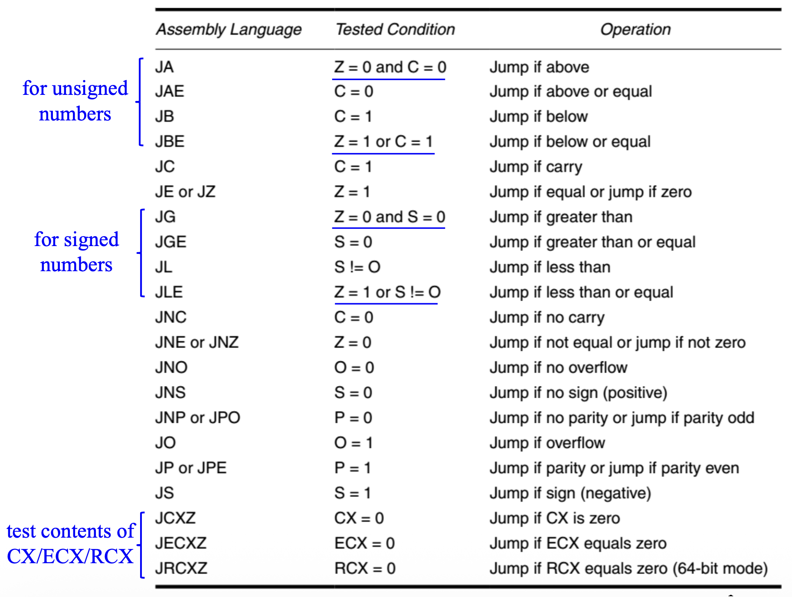
    </div>

??? example "例子：加热器控制"

    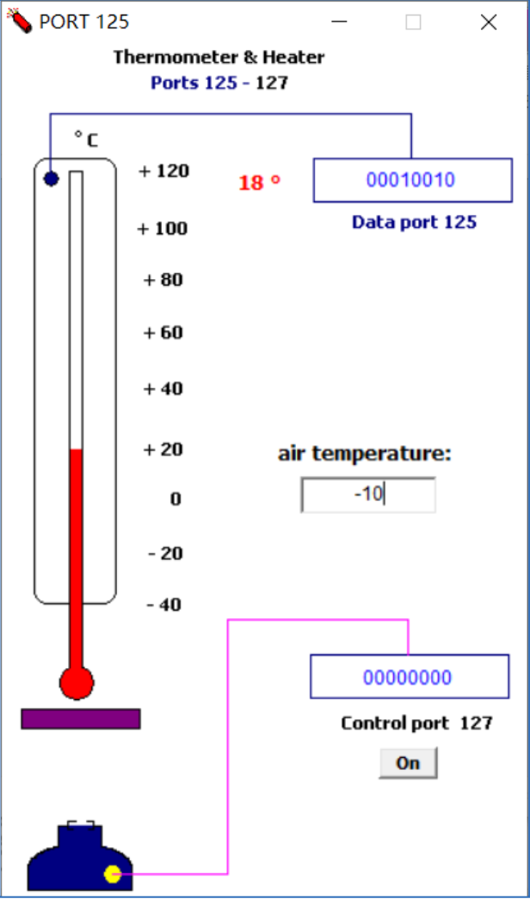{ align=right width=20% }

    下面的简短程序展示了如何使用温度计和加热器保持恒定温度（在 15℃ 至 25℃ 之间）。

    - 假设空气温度低于 15℃
    - 空气温度可以从 I/O 端口 125 读取
    - 加热器可以通过 I/O 端口 127 打开（`1`）和关闭（`0`）

    ```asm
    .code
    start:
        in al, 125      ; read temperature

        cmp al, 15
        jb low          ; <-- jl low

        cmp al, 25
        ja high         ; <-- jg high

        jmp start

    low:
        mov al, 1
        out 127, al     ; turn on heater
        jmp start

    high:
        mov al, 0
        out 127, al     ; turn off heater
        jmp start

        hlt

    .exit
    ```


### Conditional Sets

- 80386 及以上处理器提供了**条件设置指令**(conditional set instructions)
- **条件设置字节**（`SETcc`）指令检查 `EFLAGS` 寄存器中的状态标志
    - 如果标志符合助记符（cc）中指定的条件，将指定 8 位内存位置或寄存器中的值设置为 1
    - 如果标志不符合指定的条件，`SETcc` 将内存位置或寄存器清 0

- 例子：对于 `#!asm SETC EAX`，如果进位被设置，`EAX = 01H`；如果进位被清除，`EAX = 00H`
- 下表罗列了各种条件设置指令：

    <div style="text-align: center">
        
    </div>

- 软件通常使用 `SETcc` 指令来设置逻辑指示器
- 与 `CMOVcc` 指令类似，`SETcc` 指令可以替换两个指令：一个条件跳转和一个移动，比如：

    <div style="text-align: center">
        
    </div>

???+ example "例子"

    <div style="text-align: center">
        
    </div>


### LOOP

- `#!asm LOOP` 指令使用 `RCX` / `ECX` / `CX` 作为计数器执行循环操作
- `#!asm LOOP` 指令等价于 
    - `#!asm SUB RCX/ECX/CX, 1`
    - `#!asm JNZ label`

- 每次执行 `#!asm LOOP` 指令时，计数器会递减，然后检查是否为 0
    - 如果 `CX != 0`，则执行到标签的近跳转
    - 如果 `CX == 0`，则执行下一条指令

- `#!asm LOOP` 指令不影响任何标志
- 在 16 位指令模式下，`#!asm LOOP` 使用 `CX`
- 在 32 位模式下，`#!asm LOOP` 使用 `ECX`
- 在 64 位模式下，循环计数器在 `RCX` 中
- 使用的计数寄存器的大小取决于 `#!asm LOOP` 指令的地址大小属性

??? example "例子"

    以下程序计算 `BLOCK1` 和 `BLOCK2` 的内容之和，并将结果存储在 `BLOCK2` 的数据上方。

    ```asm
    .MODEL SMALL                    ; select SMALL model
    .DATA                           ; start data segment
    BLOCK1 DW 100 DUP (?)           ; 100 words for BLOCK1
    BLOCK2 DW 100 DUP (?)           ; 100 words for BLOCK2

    .CODE                           ; start code segment
    .STARTUP                        ; start program
        MOV AX, DS                  ; overlap DS and ES
        MOV ES, AX
        CLD                         ; select auto-increment
        MOV CX, 100                 ; load counter
        MOV SI, OFFSET BLOCK1       ; address BLOCK1
        MOV DI, OFFSET BLOCK2       ; address BLOCK2
    L1: LODSW                       ; load AX with BLOCK1
        ADD AX, ES: [DI]            ; add BLOCK2
        STOSW                       ; save answer
        LOOP L1                     ; repeat 100 times
    .EXIT
    END
    ```


### Conditional LOOPs

`#!asm LOOP` 指令也有条件形式，语法为：

- `#!asm LOOPE dest`：相等时循环(loop while equal)
    - 如果 `ZF=0` 或 `CX` 寄存器递减到 0，将退出循环
    - 在扫描数组以查找第一个**不匹配**给定值的元素时很有用
- `#!asm LOOPNE dest`：不相等时循环(loop while not equal)
    - 如果 `ZF=1` 或 `CX` 寄存器递减到 0，将退出循环
    - 在扫描数组以查找第一个**匹配**给定值的元素时很有用

- 同样使用 `CX` / `ECX` / `RCX` 作为计数器
- 这两条指令本身不影响任何标志
- 如有需要，`#!asm LOOPEW` / `#!asm LOOPED` 或 `#!asm LOOPNEW` / `#!asm LOOPNED` 可覆盖指令模式
- 替代方案（但在大多数程序中，只有 `#!asm LOOPE` 和 `#!asm LOOPNE` 适用）
    - `#!asm LOOPE == LOOPZ`
    - `#!asm LOOPNE == LOOPNZ`

??? example "例子"

    以下代码寻找数组中的第一个正整数：

    ```asm hl_lines="12"
    .data
    array DW -3,-6,-1,-10,10,30,40,4

    .code
        MOV ESI, OFFSET array
        MOV ECX, LENGTHOF array     ; get the number of array
    next:
        TEST WORD PTR [ESI], 8000h  ; sign bit = 1 (negative), Z = 0, else Z = 1 (positive)
        PUSHF                       ; protect flags on stack
        ADD ESI, 2                  ; inc ESI to next value
        POPF                        ; restore flags from stack
        LOOPNZ next                 ; if Z = 0 and ECX != 0 continue
        JNZ quit                    ; if Z = 0, not found
        SUB ESI, 2                  ; ESI points to value
    quit:
    ```


### For, Do-while, While Loops in Assembly Language

- `#!c do-while` 循环

    <div class="grid" markdown>

    ```c title="C"
    int x = 1;

    do {
        // do something!
    } while (x == 1)
    ```

    ```asm title="ASM"
            mov ax, 1
    start:  ...
            cmp ax, 1
            je start
    ```

    </div>

- `#!c while` 循环

    <div class="grid" markdown>

    ```c title="C"
    int x = 1;

    while (x == 1) {
        // do something!
    } 
    ```

    ```asm title="ASM"
            jmp sloop
    cloop:  ...
    sloop:  cmp ax, 1
            je cloop
    ```

    </div>

- `#!c for` 循环

    <div class="grid" markdown>

    ```c title="C"
    int x = 1;

    for (int x = 0; x <= 10; x++) {
        // do something!
    }
    ```

    ```asm title="ASM"
            xor cx, cx
            jmp sloop
    cloop:  ...
            inc cx
    sloop:  cmp cx, 10
            jle cloop
    ```

    </div>


## Controlling the Flow of the Program

- 使用汇编语言伪指令 `#!asm .IF`、`#!asm .ELSE`、`#!asm .ELSEIF` 和 `#!asm .ENDIF` 来控制程序流程比使用正确的条件跳转语句要容易得多，这些语句始终指示一个对于 MASM 特殊的汇编语言命令
- 从点号开始的控制流程汇编语言语句在 MASM 6.xx 版本中可用，而不适用于更早的版本
- 其他伪指令包括 `#!asm .REPEAT–.UNTIL` 和 `#!asm .WHILE–.ENDW`
    - **点命令**(dot commands)在 Visual C++ 内联汇编器中不起作用

- 在内联汇编器中，绝不要使用大写字母表示汇编语言伪指令，因为其中一些被 C++ 保留，使用会导致问题
- 条件控制流伪指令：

    ```asm
    .WHILE
    .ENDW

    .REPEAT
    .UNTIL
    .UNTILCXZ

    .BREAK
    .CONTINUE

    .IF
    .ENDIF
    .ELSE
    .ELSEIF
    ```

- 条件控制流运算符：

    ```
    !         // logical not
    !=        // not equal
    ||        // logical or
    &&        // logical and
    <         // less than

    <=        // less or equal
    ==        // equal
    >         // greater than
    >=        // greater or equal
    &         // bitwise and

    CARRY?    // carry test
    PARITY?   // parity test
    SIGN?     // sign test
    ZERO?     // zero test
    OVERFLOW? // overflow test
    ```


### .IF, .ELSE, .ELSEIF, and .ENDIF

???+ example "例子"

    - 以下示例展示了如何使用 `#!asm .IF` 和 `#!asm .ENDIF` 语句通过测试 `AL` 的 ASCII 字母 `A` 到 `F` 来控制程序的流程
    - 如果 `AL` 的内容是 `A` 到 `F`，则从 `AL` 中减去 7

    <div style="text-align: center">
        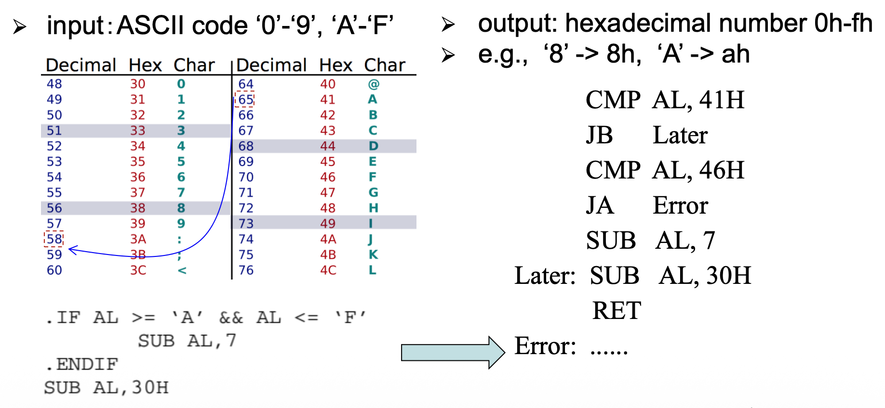
    </div>


### WHILE Loops

- 使用 `#!asm .WHILE` 语句与条件开启循环
    - `#!asm .ENDW` 语句结束循环

- `#!asm .BREAK` 和 `#!asm .CONTINUE` 语句可用于 `#!c while` 循环
    - `#!asm .BREAK` 通常跟随着 `#!asm .IF` 来选择中断条件，例如 `#!asm .BREAK .IF AL == 0DH`
    - `#!asm .CONTINUE` 可用于在满足特定条件时允许 `#!asm DO-.WHILE` 循环继续

???+ example "例子"

    以下示例展示了如何使用 `.WHILE` 语句从键盘读取数据并将其存储到数组（`BUF`）中，直到回车键（`0DH`）。

    ```asm hl_lines="8-14"
    .CODE                             ; start code segment
    .STARTUP                          ; start program
            MOV AX, DX                ; overlap DS with ES
            MOV ES, AX
            CLD                       ; select auto-increment
            MOV DI, OFFSET BUF        ; address buffer

    .WHILE AL != 0DH                  ; loop while not enter
            JMP @C0001
    @C0002:
            MOV AH, 1                 ; read key
            INT 21H
            STOSB                     ; store key code
    .ENDW

    * @C0001:
            cmp al, 0dh
            jne @C0002
            MOV BYTE PTR[DI-1], '$'    ; '$' is the terminated string for DOS INT 21H function 9
            MOV DX, OFFSET BUF
            MOV AH, 9
            INT 21H                    ; display BUF
    .EXIT
    END
    ```


### REPEAT-UNTIL Loops

- `REPEAT-UNTIL` 循环表示一系列指令会重复执行，直到某个条件发生
- `#!asm .REPEAT` 语句定义了循环的开始
- 循环的结束由包含条件的 `#!asm .UNTIL` 语句定义
- `.UNTILCXZ` 指令使用了 `#!asm LOOP` 指令检查作为计数器的寄存器 `CX` 以进行重复循环

???+ example "例子"

    === "例1"

        以下示例展示了如何使用 `REPEAT-UNTIL` 从键盘读取数据并将其存储到数组（`BUF`）中，直到回车键（`0DH`）。

        ```asm hl_lines="7-14"
        .CODE                       ; start code segment
        .STARTUP                    ; start program
                MOV AX, DX          ; overlap DS with ES
                MOV ES, AX
                CLD                 ; select auto-increment
                MOV DI, OFFSET BUF  ; address buffer
                .REPEAT             ; repeat until enter

        @C0001:
                MOV AH, 1           ; read key
                INT 21H
                STOSB               ; store key code

                .UNTIL AL == ODH
                
                CMP al, odh
                JNE @C0001
                MOV BYTE PTR [DI-1], 'S
                MOV DX, OFFSET BUF
                MOV AH, 9
                INT 21H             ; display BUF
        .EXIT
        END
        ```

    === "例2"

        以下代码使用 `.UNTILCXZ` 将字节数组 `ONE` 的内容添加到字节数组 `TWO`，总和存储在数组 `THREE` 中。

        ```asm hl_lines="6-14"
                MOV CX, 100             ; set count
                MOV DI, OFFSET THREE    ; address arrays
                MOV SI, OFFSET ONE
                MOV BX, OFFSET TWO
                
                .REPEAT

        @C0001:
                LODSB
                ADD AL, [BX]
                STOSB
                INC BX

                .UNTILCXZ

                LOOP @C0001
        ```


## Procedures

- **过程**(procedure)是一组指令的集合，通常用于执行一个任务
    - 子例程(subroutine)、方法或函数是任何系统架构的重要组成部分

- 过程是软件中存储在内存中的**可重用部分**，根据需要频繁使用（节省内存空间，使软件开发更容易）
- 一个过程以 `#!asm PROC` 指令开始，并以 `#!asm ENDP` 指令结束；每个指令都显示过程名称
- `#!asm PROC` 后跟过程的类型，包括 `#!asm NEAR` 或 `#!asm FAR`
- 在 MASM 版本 6.x 中，`#!asm NEAR` 或 `#!asm FAR` 类型可以跟 `USES` 语句，实现在过程中自动将任意数量的寄存器压入栈并在栈中弹出
- `#!asm RET` 用于结束或退出过程

???+ example "例子"

    <div style="text-align: center">
        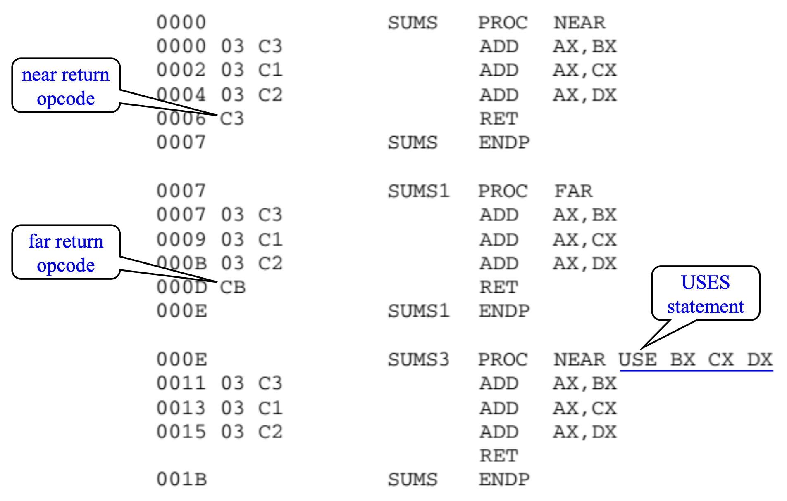
    </div>

- 被所有软件（**全局**）使用的程序应编写为**远过程**
- 由特定任务使用的程序（**局部**）通常定义为**近过程**
- 大多数程序是近过程
- `#!asm CALL` 将紧随其后的指令地址（返回地址）推送到栈上
- `#!asm RET` 指令从栈中移除一个地址，以便程序返回到紧随 `#!asm CALL` 之后的指令
- 过程的缺点是计算机链接到过程（`#!asm CALL`），以及最后返回（`#!asm RET`）需要一定时间


### CALL

- `#!asm CALL` 将程序流转移到过程上
- `#!asm CALL` 指令与跳转指令不同，因为 `#!asm CALL` 会将返回地址保存到栈上
- 当执行 `#!asm RET` 指令时，返回地址将控制权返回到 `#!asm CALL` 指令之后的指令
- 有四种不同类型的调用：
    - **近调用**(near call)（段内调用）：对当前代码段内过程的调用
    - **远调用**(far call)（段间调用）：对位于与当前代码段不同的段中的过程的调用
    - **跨特权级远调用**(inter-previlige-level far call)：对位于与当前执行程序特权级不同的段中的过程的远程调用
    - **任务切换**(task switch)：对位于不同任务中的过程的调用

- 后两种调用类型只能在**保护模式**下执行


#### Near CALL

- 在执行近调用时
    - 在执行 `#!asm CALL` 指令之前将参数压入栈中（由**程序员**或**编译器**实现）
    - 将 `EIP` 寄存器的值压入栈中（通过**调用**）

- 然后跳转到当前代码段中由目标操作数指定的地址
- 近调用不会改变 `CS` 寄存器的值

<div style="text-align: center">
    
</div>

- 目标操作数指定两种类型
    - **相对偏移**（相对于当前**指令指针**指向的 `#!asm CALL` 指令后的一条指令的符号偏移）
    - 代码段的**绝对偏移**（从**代码段基址**开始的偏移）

- 对于“**近绝对间接**(near absolute indirect)”调用，绝对偏移通过寄存器或内存位置间接指定，例如：

    ```asm
    MOV AX, 64h
    CALL AX         ; jump to CS:64h
    ```

- 对于“**近相对直接**(near relative direct)”调用，指令长为 3 字节
    - 第一个字节是操作码
    - 第二个和第三个字节包含位移量

- 对于 `#!asm CALL` 指令，`IP` / `EIP` 的内容（下一条指令的偏移地址）会被压入栈中；在过程结束后，程序控制传递到 `#!asm CALL` 指令后的下一条指令
- 下图展示了存储在栈上的返回地址（`IP`）和调用过程

    <div style="text-align: center">
        
    </div>


#### Far CALL

- 远调用是一条 5 字节指令，包含一个操作码，其后是 `IP` 和 `CS` 寄存器的下一个值
    - 字节 2 和 3 包含 `IP` 的新内容
    - 字节 4 和 5 包含 `CS` 的新内容

- 远调用在跳转到由字节 2-5 指示的地址之前，将 `IP` 和 `CS` 的内容压入栈

<div style="text-align: center">
    
</div>

- 远调用可调用内存中任何位置的程序，并从该程序返回
- 在64位模式下，远调用可以指向任何内存位置，放置到栈上的信息是一个 8 字节数字
    - 远返回指令从栈中检索一个 8 字节返回地址并将其放入 `RIP`

- 下图展示了远调用是如何调用远过程的：

    <div style="text-align: center">
        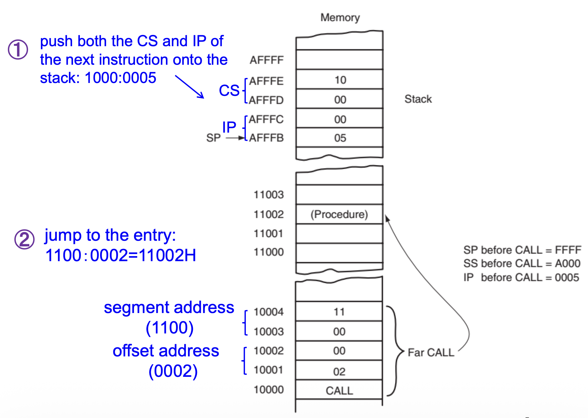
    </div>


#### CALLs with Register Operands

???+ example "例子"

    以下示例使用 `#!asm CALL` 寄存器指令调用一个从当前代码段的偏移地址 `DISP` 开始的过程，以显示“OK”。

    ```asm hl_lines="3"
            MOV     BX, OFFSET DISP     ; load BX with offset DISP
            MOV     DL, 'O'             ; display O
            CALL    BX                  ; call DISP (in BX)
            MOV     DL, 'K'             ; display K
            CALL    BX                  ; call DISP (in BX)
    .EXIT
    ;
    ; Procedure that displays the ASCII character in DL
    ;
    DISP    PROC    NEAR
            MOV     AH, 2               ; select function 2
            INT     21H                 ; execute DOS function 2
            RET
    DISP    ENDP
    ```


#### CALLs with Indirect Memory Addresses

这种调用方式在程序中需要选择不同的子例程时特别有用。本质上与使用**查找表**进行跳转地址的间接跳转相同。

???+ example "例子"

    ```asm
    ; Instruction that calls procedure ZERO, ONE, or TWO
    ; depending on the value in EBX
    ;
    TABLE   DW      ZERO                ; address of procedure ZERO
            DW      ONE                 ; address of procedure ONE
            DW      TWO                 ; address of procedure TWO

            CALL    TABLE[2*EBX]
    ```

`#!asm CALL` 指令也可以引用远指针：指令以 `#!asm CALL FAR PTR [4*EBX]` 或 `#!asm CALL TABLE[4*EBX]` 的形式出现，并且表中的数据被定义为双字。


### RET

`#!asm RET` 指令从栈中移除一个 16 位数字（**近返回**），并将其放入 `IP` 中；或者移除一个 32 位数字（**远返回**）并将其放入 `IP` 和 `CS` 中。

下图展示了 `#!asm CALL` 指令如何链接到过程，以及如何在 8086–Core2 的实模式下通过 `#!asm RET` 返回：

<div style="text-align: center">
    
</div>

在 80386 及以上版本的处理器以**保护模式**运行时，远返回会从栈中移除 6 个字节

- 前 4 个字节包含 `EIP` 的新值
- 后 2 个字节包含 `CS` 的新值

而同样在保护模式中，近返回从栈中移除 4 个字节，并将其放入 `EIP` 中。

---
另一种返回形式（`#!asm RET n`）在从栈中移除返回地址后，将一个数字添加到栈指针（`SP`）的内容中；栈指针将根据所指示的字节数进行调整。

<div style="text-align: center">
    
</div>

???+ example "例子"

    以下示例展示了上述形式的返回如何清除通过几个推送放置在栈上的数据：

    - `#!asm RET 4` 在从栈中移除返回地址后，将 4 加到 `SP` 上
    - 参数通过使用 `BP` 寄存器在栈上进行寻址

    ```asm hl_lines="5 13"
            MOV     AX, 30
            MOV     BX, 40
            PUSH    AX          ; stack parameter 1
            PUSH    BX          ; stack parameter 2
            CALL    ADDM        ; add stack parameters

    ADDM    PROC    NEAR
            PUSH    BP          ; save BP
            MOV     BP, SP      ; address stack with BP
            MOV     AX, [BP+4]  ; get parameter 2
            ADD     AX, [BP+6]  ; add parameter 1
            POP     BP          ; restore BP
            RET     4           ; return, dump parameters
    ADDM    ENDP
    ```


### Transfer Control Between Privilege Levels

**分支**(branches)还可以用于将控制转移到在不同特权级别下运行的其他代码。在这种情况下，处理器会自动检查源程序和目标程序的特权，以确保在执行控制转移操作之前允许该转移。

<div style="text-align: center">
    
</div>

三种实现**跨特权级远调用**(inter-previlige-level far call)的方法：

- 定义**符合规范的代码段**(conforming code segment)以共享不同特权级别的库（比如数学库）
- 通过称为**门**(Gates)的特殊段描述符

    <div style="text-align: center">
        
    </div>

- 利用**快速系统调用指令**(fast system call instructions)（`#!asm SYSCALL / SYSRET` 或 `#!asm SYSENTER / SYSEXIT`）从环 3 访问环 0

    <div style="text-align: center">
        
    </div>


## Interrupts and Exceptions

- **中断**(interrupts)和**异常**(exceptions)强制控制从当前执行的程序转移到处理该中断事件的系统软件服务例程
- 这些例程被称为异常处理程序和中断处理程序，或**中断服务过程**(interrupt service procedure, **ISP**)
- 在转移控制到 ISP 期间，处理器停止执行被中断的程序并保存其返回指针
- 处理异常或中断的系统软件服务例程负责保存被中断程序的状态，这使得处理器在系统处理完事件后重新启动被中断的程序
- 处理器使用分配给异常或中断的**向量编号**（**中断向量**）作为进入**中断向量表**(interrupt vector table, IVT)或**中断描述符表**(interrupt descriptor table, IDT)的索引，而这两张表提供了异常或中断处理程序的入口点
    - IVT 在**实模式**下使用
    - IDT 在**保护模式**和**长模式**下使用

???+ note "比较中断和异常"

    === "中断"

        - 是由**外部硬件或软件**生成的信号，用于请求处理器或操作系统内核提供服务
        - 是程序**自愿发出的请求**，希望获取帮助
        - 大多数中断是**异步的**（如硬件中断），使用 `#!asm INT n` 指令的软件中断是**同步的**

    === "异常"

        - 是在执行指令期间直接由 CPU 产生的事件，通常由于**错误**(errors)或**异常**(unusual)情况
        - 说明程序偏离了正常流程，CPU 将其识别为需要特殊处理的情况
        - 每个异常都有一个**助记符**，由一个**井号**（`#`）后跟两个字母和一个可选的错误码（括号内）组成。例如，`#GP(0)` 表示具有错误码 0 的一般保护异常


### Interrupts

中断来源：

- **外部（硬件生成）中断**：是一个**异步**事件，通常由 **I/O 设备**通过处理器上的引脚或通过本地 PIC（可编程中断控制器）触发
- **软件生成的中断**：执行 `#!asm INT n` 指令的结果
    - 例如，在 x86 系统上使用 `#!asm INT 80h` 来调用 Linux 中的系统调用并请求操作系统提供服务

屏蔽外部中断：

- 软件可以屏蔽某些异常和中断的发生；**屏蔽**(masking)可能会延迟甚至阻止异常处理或中断处理机制的触发
- 外部中断分为可屏蔽和不可屏蔽：
    - **可屏蔽中断**(maskable interrupts)通过 **`INTR` 引脚**由中断处理机制触发，仅在 `FLAGS.IF = 1` 时有效；否则，只要 `FLAGS.IF = 0`，它们将保持待处理状态(pending)
    - **不可屏蔽中断**(nonmaskable interrupts, NMI)不受 `FLAGS.IF` 位值的影响

有两条可以控制可屏蔽中断的指令：

- **设置中断标志指令**(set interrupt flag instruction) `#!asm STI` 将 1 放入 `IF` 标志位，从而**启用** `INTR` 引脚
- **清除中断标志指令**(clear interrupt flag instruction) `#!asm CLI` 将 0 放入 `IF` 标志位，从而**禁用** `INTR` 引脚

在软件中断服务程序中，硬件中断作为首要的步骤之一，通过 `#!asm STI` 指令启用。之所以这样做，是因为几乎所有个人计算机中的 I/O 设备都是通过中断处理的。如果中断禁用时间过长，会导致严重的系统问题。


### Exceptions

异常来源：

- **程序错误异常**(program-error exceptions)：当处理器在执行过程中检测到程序错误时，会生成异常
    - 例子：除法错误（`#DE`）异常
- **软件生成的异常**(software-generated exceptions)：`#!asm INTO`、`#!asm INT1`、`#!asm INT3` 和 `#!asm BOUND` 指令允许在软件中生成异常
    - 例子：`#!asm INT3` 会导致生成断点异常
- **机器检查异常**(machine-check exceptions)：Pertium 处理器提供了机器检查机制，用于检查内部芯片硬件和总线事务的操作

精确和不精确的异常（区别在于能否精确指出异常出在哪条指令上（即**指令边界**(instruction boundary)））：

- **精确异常**能在指令边界上报告
    - 有些在导致异常的指令**之前**报告边界，而有些则在导致异常的指令**之后**报告边界
    - 当事件处理程序返回到被中断的程序时，可以从被中断的指令边界**重新启动**

- **不精确异常**不保证在可预测的指令边界上报告
    - 不精确事件可以视为是**异步的**
    - 被中断的程序**不可重启**

异常的三种类型：

- **故障**(faults)：在故障指令**之前**的边界上报告的**精确异常**
    - 可以纠正并重新启动，且不会丢失连续性
    - 返回地址指向故障指令

- **陷阱**(traps)：在陷阱指令**之后**的边界上报告的**精确异常**
    - 可以继续执行而不丢失程序连续性
    - 返回地址指向紧随其后的指令

- **中止**(aborts)是**非精确异常**，无法进行可靠的程序重启


### Interrupt Vectors

- 特定的中断和异常源被分配一个固定的向量识别号，称为“中断向量”或简单地称为“向量”
- **中断向量**(interrupt vectors)为中断处理机制所用，用于定位分配给异常或中断的服务例程
- 最多可用 256 个唯一的中断向量，每个向量包含一个 `ISP` 的地址
- Intel 保留了前 32 个向量用于预定义的异常和中断条件
- 中断向量（32–255）对用户可用
- 在**实模式**下
    - 一个 4 字节的数字存储在内存的前 1024 字节中（00000H–003FFH）（256*4=1024）
    - 每个向量包含一个 `IP` 和 `CS` 的值，形成 `ISP` 的地址
    - 前 2 个字节包含 `IP`，最后 2 个字节为 `CS`

- 在**保护模式**下，中断向量表被**中断描述符表**替代，该表使用 8 字节描述符来描述每个中断

??? abstract "保护模式下的异常和中断"

    <div style="text-align: center">
        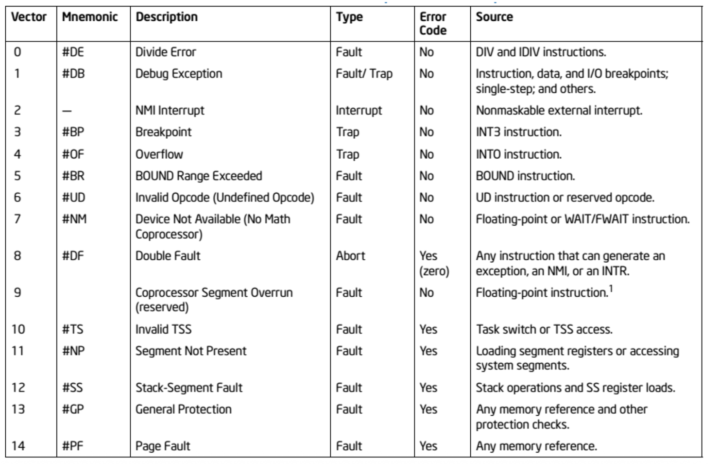
    </div>

    <div style="text-align: center">
        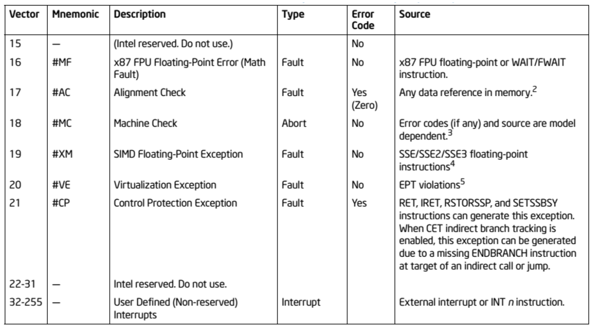
    </div>


### Double Fault Exception

- 当在处理先前（第一个）异常或中断处理程序时发生第二个异常时，可能会出现**双重故障异常**(double fault exception)（参阅AMD64手册（第8.2.9节））
- 例如，当触发页错误但在中断描述符表中没有页错误处理程序时，会发生双重故障
- 通常，第一次和第二次异常可以顺序处理，从而避免双重故障异常
- 然而，在某些情况下，第一个异常会对处理器处理第二个异常的能力产生不利影响，因此它会发出双重故障异常信号
- 促成双重故障异常发生的异常被称为**贡献性异常**(contributory exceptions)
- 只有一些非常特定的异常组合才会导致双重故障，这些组合包括：

    <div style="text-align: center">
        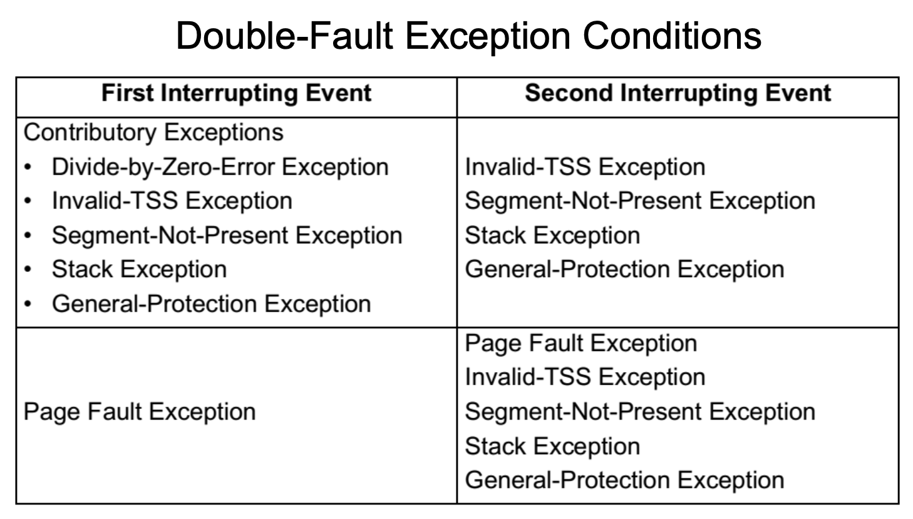
    </div>

- 例子：
    - 除零错误 -> 页错误：不发生双重错误
    - 除零错误 -> 一般保护错误：发生了双重错误

- 如果在尝试调用双重故障处理程序时发生另一个贡献性或页面故障异常，处理器将进入关闭模式(shutdown mode)
- 在 x86 架构中，**三重故障**(triple fault)是一种特殊的异常，即当 CPU 尝试调用双重故障异常处理程序时发生异常
- 提供双重故障处理程序非常重要，因为如果未处理双重故障，将会发生致命的三重故障，这会促使启动 CPU 重置


### Error Codes

- 某些类型的异常提供**错误码**(error codes)，它会报告有关错误的附加信息（比如 `#PF`（故障码））
- 在控制转移到异常处理程序期间，异常机制将错误码推送到栈上
- 错误码的两种格式：
    - 用于错误报告异常的**选择器格式**(selector format)
    - 用于页错误的**页错误格式**(page-fault format)

    <div style="text-align: center">
        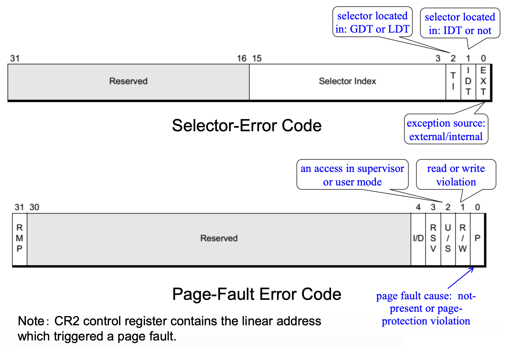
    </div>


### Priority among Simultaneous Exceptions and Interrupts

- 当同时发生中断时，处理器将控制权转移到**优先级最高的中断处理程序**
- 来自外部源的低优先级中断被处理器暂时挂起，并在高优先级中断之后进行处理
- x86 架构定义了不同组之间的中断优先级，而组内的中断优先级则依赖于具体实现

同时中断的优先级如下：

<div style="text-align: center">
    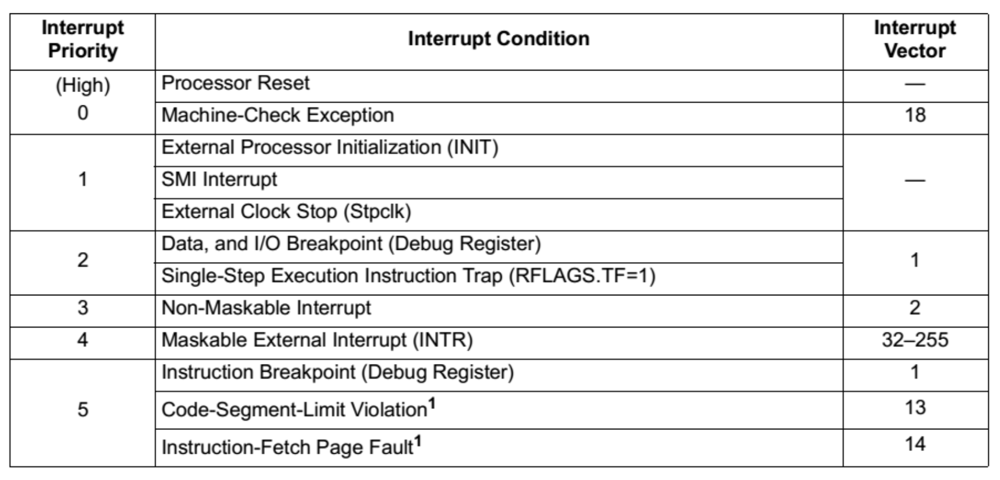
</div>

<div style="text-align: center">
    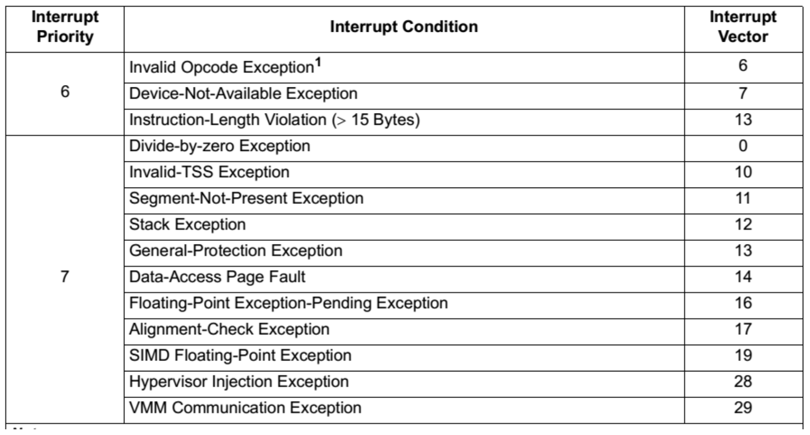
</div>


### Real-Mode Interrupt Control Transfers

- 在实模式下，IDT 是一个 4 字节条目的表，每个条目对应系统实现的 256 个可能的中断之一；因此 IDT 通常又被称为**中断向量表（IVT）**
- IVT 表条目包含指向异常或中断处理程序的远指针（`CS:IP` 对）
- IDT 的基址存储在 `IDTR` 寄存器中，在处理器复位时加载值为 `00h`

<div style="text-align: center">
    
</div>

当在实模式下发生异常或中断时，处理器执行以下操作：

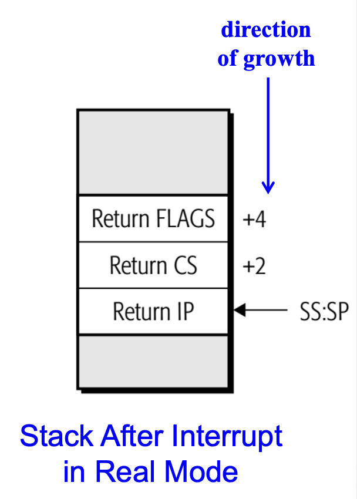{ align=right width=25% }

- 将 `FLAGS` 压入栈
- 将 `FLAGS.IF` 清零
- 将 `CS` 和 `IP` 压入栈
- （如果适用）将错误码压入栈
- 通过将中断向量乘以 4 来定位 IDT 中的 `ISP`
- 将控制权转移到 IDT 中由 `CS:IP` 引用的 `ISP`

`#!asm IRET` 指令用于返回到被中断的程序。当执行 `#!asm IRET` 时，处理器执行以下操作：

- 从栈中弹出保存的 `CS:IP`
- 从栈中弹出 `FLAGS` 值
- 执行从保存的 `CS.IP` 位置开始

`#!asm IRET` 指令等同于远 `#!asm RET` + `#!asm POPF`。

其中 `#!asm IRET` 用于**实模式**，`#!asm IRETD` 用于**保护模式**。

??? example "实例：中断服务过程"

    - 假设需要一个过程来将 `DI`、`SI`、`BP` 和 `BX` 的内容相加，并将结果保存在 `AX` 中
    - 由于该任务是一项常见任务，因此为该任务开发一种软件中断可能是值得的

    <div style="text-align: center">
        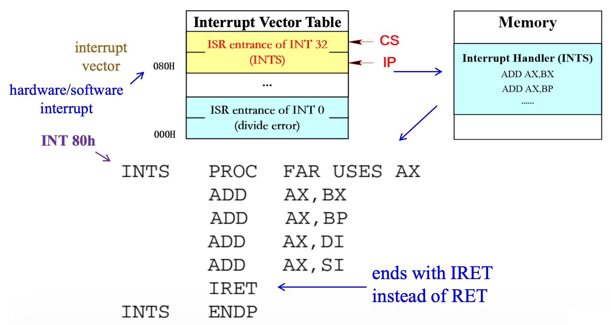
    </div>


### Interrupt Instructions

#### INT N

- 256 种不同的软件中断指令（`#!asm INT N`）可供程序员使用
- 每个 `#!asm INT` 指令都有一个数值操作数，其范围是 0 到 255（00H–FFH）
- 在**实模式**下，中断向量的地址是通过将中断类型号乘以 **4** 来确定的（`CS:IP`）
    - 例如，`#!asm INT 10H` 指令调用存储在内存位置 `40H`（`10H * 4`）开始的中断服务例程的地址

- 在**保护模式**下，中断描述符通过将类型号乘以 **8** 来定位，因为每个描述符长度为 8 字节
- 每条 `#!asm INT N` 指令长度为 2 字节
    - 第一个字节为操作码
    - 第二个字节为向量类型号

- 当软件中断执行时，它：
    - 将**标志**压入栈
    - 清除 `IF` 标志位
    - 将 `CS` 压入栈
    - 从中断向量获取 `CS` 的新值
    - 将 `IP` / `EIP` 压入栈
    - 从向量获取 `IP` / `EIP` 的新值
    - 跳转到由 `CS` 和 `IP` / `EIP` 指定的新位置

- 软件中断最常用于调用系统过程，因为不需要知道函数的地址
- 也通常控制打印机、视频显示器和磁盘驱动器等外设上
- `#!asm INT N` 替代了原本用于调用系统函数的远 `#!asm CALL`
    - `#!asm INT N` 指令长度为 2 字节，而远 `#!asm CALL` 长度为 5 字节
    - 因此每次 `#!asm INT N` 指令替代一个远 `#!asm CALL` 时，可以节省 3 字节的内存
    - 如果 `#!asm INT N` 在程序中经常出现，例如在系统调用中，这可以带来相当可观的内存节省


#### INT3

- 它是**单字节长**的中断指令（0xCC）（而其他中断指令都是两字节的）
- 通常在软件中插入 `#!asm INT3` 以中断或打断软件的流程，即**断点**(breakpoints)，有助于调试故障软件
- 对于任何软件中断都能产生一个断点，但由于 `#!asm INT3` 长度为 1 个字节，因此更适合实现此功能

**GDB** 实现断点的方式：

- 假设在 `OFFSET` 处的原始指令是 `0x8345fc01` (`#!asm ADD DWORD PTR[ebp-0x4], 0x1`)
- 当我们在 GDB 中输入 `break OFFSET` 时，它会记住这个字的第一个字节（0x83），并将该字更改为 `0xcc45fc01`

<div style="text-align: center">
    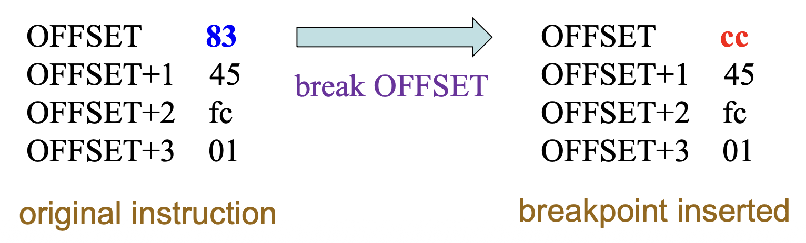
</div>

- 当这个程序遇到 GDB 刚插入的 `#!asm INT3` 指令时，调试的程序将陷入内核，而内核将反过来向 GDB 发出信号
- 然后，GDB 将使用它记住的原始值恢复 `OFFSET` 处的字节，并将指令指针 `EIP` 移回 `OFFSET`，以重新启动 `OFFSET` 处的指令

<div style="text-align: center">
    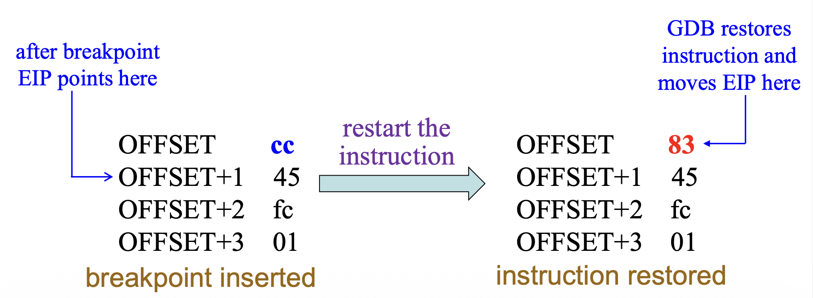
</div>

??? question "思考：为什么 `#!asm INT3` 应该是一字节的呢？"

    假如 `#!asm INT3` 比某些 x86 指令更长。当 GDB 插入一个断点时，它可能会覆盖多个指令，这可能会导致问题。

    考虑以下包含两个单字节指令的示例：

    <div style="text-align: center">
        
    </div>

    如果代码想要跳转到 `OFFSET+1`，它将跳转到 `#!asm INT3` 指令的中间，这可能会生成一个无效操作码异常（`#UD`）。但如果 `#!asm INT3` 是一个字节，就不会有这个问题了。


#### INTO

- 在对符号操作数进行算术运算时
    - 可以通过 `#!asm JO` 指令直接测试 `#!asm OF` 标志，或者
    - 使用 `#!asm INTO` 指令来处理**溢出**情况

- 溢出中断（`#!asm INTO`）指令检查 `EFLAGS` 寄存器中 `OF` 标志的状态 
    - 如果 `O = 1`，则通过向量类型编号 4 生成溢出陷阱
    - 如果 `O = 0`，则 `#!asm INTO` 不执行任何操作

- 使用 `#!asm INTO` 指令的好处是，如果检测到溢出异常，可以自动调用异常处理程序来处理溢出情况


## Machine Control and Miscellaneous Instructions

### Controlling the Carry Flag Bit

- 进位标志（`C`）在多字/双字加法和减法中传播进位或借位，并且可以指示汇编语言程序中的错误
- 控制进位标志的内容的指令：
    - `#!asm STC`：设置进位
    - `#!asm CLC`：清除进位
    - `#!asm CMC`：取反(complement)进位


### HLT

- `#!asm HLT` 停止指令执行并将处理器置于 HALT 状态
- 退出 HALT 的几种方式：
    - 一个启用的中断（`NMI` 和 `SMI`）
    - 一个调试异常
    - 硬件重置（`BINIT#`、`INIT#` 或 `RESET#` 信号）

- 保存的指令指针（`CS:EIP`）指向 `HLT` 指令之后的指令


### NOP

- 在早年，软件开发工具尚未出现时，`#!asm NOP`（无操作指令）常用于为未来的机器语言指令留出空间
- 当微处理器遇到 `#!asm NOP` 时，它会花费短暂的时间来执行
- 多字节 `#!asm NOP` 指令可以用作填充，以将函数或循环对齐到 16 或 32 字节边界（比如 `#!asm NOP EAX`）
- 推荐的多字节 `#!asm NOP` 有（来自 Intel 优化参考手册）：

    | 长度 | 汇编指令 | 字节序列 |
    | :---: | :--- | :--- |
    | 2 字节 | `#!asm 66 NOP` | `66 90H` |
    | 3 字节 | `#!asm NOP DWORD ptr [EAX]` | `0F 1F 00H` |
    | 4 字节 | `#!asm NOP DWORD ptr [EAX + 00H]` | `0F 1F 40 00H` |
    | 5 字节 | `#!asm NOP DWORD ptr [EAX + EAX*1 + 00H]` | `0F 1F 44 00 00H` |
    | 6 字节 | `#!asm 66 NOP DWORD ptr [EAX + EAX*1 + 00H]` | `66 0F 1F 44 00 00H` |
    | 7 字节 | `#!asm NOP DWORD ptr [EAX + 00000000H]` | `0F 1F 80 00 00 00 00H` |
    | 8 字节 | `#!asm NOP DWORD ptr [EAX + EAX*1 + 00000000H]` | `0F 1F 84 00 00 00 00 00H` |
    | 9 字节 | `#!asm 66 NOP DWORD ptr [EAX + EAX*1 + 00000000H]` | `66 0F 1F 84 00 00 00 00 00H` |

??? example "多字节 `#!asm NOPs` 例子"

    <div style="text-align: center">
        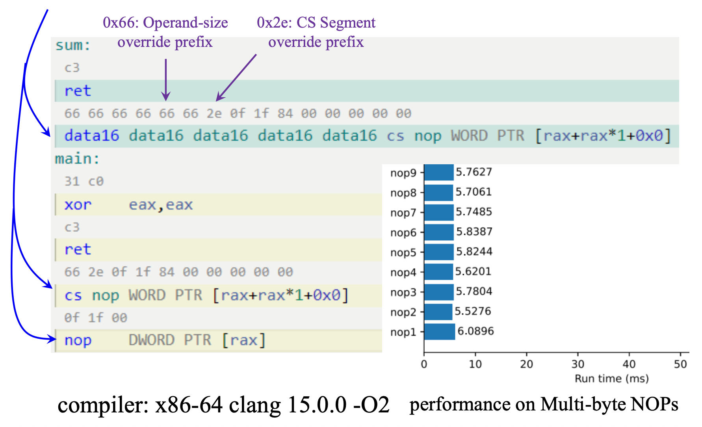
    </div>


### LOCK Prefix

- Intel 486 CPU 保证基本内存操作以**原子方式**处理：
    - 读取/写入一个字节
    - 读取/写入一个在16位边界对齐的单字
    - 读取/写入一个在32位边界对齐的双字

- `#!asm LOCK` 前缀确保某些类型的内存**读取-修改-写入操作**以原子方式执行
    - 读取-修改-写入操作指的是读取、修改并将值写回同一内存位置
    - 实现技术：
        - 原子指令（例如，`#!asm CMPXCHG`）
        - LOCK 前缀

- **LOCK 前缀**旨在为处理器在多处理器系统中提供对共享内存的独占使用，它只能与以下写入内存操作数的指令一起使用：
    - `#!asm ADC`、`#!asm ADD`、`#!asm AND`、`#!asm DEC`、`#!asm INC`、`#!asm NEG`、`#!asm NOT`、`#!asm OR`、`#!asm SBB`、`#!asm SUB`、`#!asm XOR`
    - `#!asm CMPXCHG`、`#!asm CMPXCHG8B`、`#!asm CMPXCHG16B`、`#!asm XADD`、`#!asm XCHG`
    - `#!asm BTC`、`#!asm BTR`、`#!asm BTS`

- LOCK 前缀仅在某些修改内存的指令中被允许
- 如果出现以下情况之一，那么会发生**未定义操作码异常**(undefined opcode operations)（`#UD`）
    - 如果 LOCK 前缀与 NONE 算术或逻辑指令一起使用
    - 如果目标操作数不是内存操作数
    - 如果源操作数是内存操作数

???+ example "例子"

    ```asm
    LOCK MOV [EAX], EBX             ; #UD occurs
    LOCK ADD EAX, [EBX]             ; #UD occurs
    LOCK ADD DWORD PTR [EAX], 1     ; correct
    ```


### BOUND

`#!asm BOUND` 指定第一个操作数（数组索引）是否在第二个操作数（边界操作数）指定的数组范围内

- 语法`#!asm BOUND REG, MEM`
- 边界操作数（`MEM`）是两个单字或一个双字的内存位置
- 数组索引（`REG`）是一个 16 位或 32 位寄存器
- 如果索引（`REG`）不在边界内（`MEM`），则会发出 `#!asm BOUND` 范围超出异常（`#BR`，向量类型编号 5）
- 如果在范围内，则继续执行下一条指令
- 该指令在 64 位模式下无效

???+ example "例子"

    ```asm
    .data
        start DW 0, 10   ; define the boundary
    .code
    ...
        MOV   AX, 5
        BOUND AX, start  ; start[0] < 5 < start[1], executes the next instruction
        MOV   AX, 11
        BOUND AX, start  ; 5 > start[1], raises a BOUND range exceeded exception
    ...
    ```


### ENTER and LEAVE

- `#!asm ENTER` 和 `#!asm LEAVE` 指令为被调用的过程创建和释放栈帧
- **栈帧**(stack frame)（也称为激活帧(activation frame)或激活记录(activation record)）是一种内存管理技术，用于支持过程的执行
- 栈帧帮助编程语言支持子程序的递归功能
- 栈帧包含局部变量和其调用者传递的参数
- 一个栈帧由以下部分组成：
    - 参数
    - 返回地址
    - 前一个栈帧指针（**显示**(display)）
    - 局部变量
    - 被调用程序（被调用者）修改的需要恢复的寄存器保存副本

- 栈帧仅在**运行时进程**(runtime process)中存在；当程序执行完成后，相关的栈帧会从栈中消除
- 栈帧还为被调用程序提供了访问**嵌套栈帧**(nested stack frames)中其他变量的接入点
- `EBP`（**基指针**(base pointer)）在管理函数调用期间的栈帧中发挥着关键作用：
    - `EBP` 充当函数栈帧内的**稳定参考点**(stable reference point)，用于访问局部变量和函数参数
    - `EBP` 的值在整个函数执行过程中保持不变，而 `ESP`（栈指针）可能会改变
    - 在设置好栈帧后，**函数参数**通过 `EBP` 的**正偏移量**进行访问（比如第一个参数为 `EBP + 8`），而**局部变量**则通过**负偏移量**进行访问（比如 `EBP - 4`），这种一致的访问方式使编译和调试过程更加简单
    - 在函数开始时，**调用约定**(calling convention)通常通过将当前的 `EBP` 压入栈中来保存它，然后将 `EBP` 设置为 `ESP`，建立了一个新的栈帧；在函数结束时，`EBP` 被恢复以释放栈帧并返回到调用者的帧
    - 在**递归调用**(recursive calls)或**调试**时，保留的 `EBP` 使得函数能够跟踪和维护一系列栈帧，从而允许调用栈向上遍历回主函数
    - 简而言之，`EBP` 提供了稳定性和对函数栈帧的便捷访问，有助于参数和局部变量管理，并支持调试和递归

??? example "例子"

    === "例1"

        ```c
        void test(int x) {
            int a = x;  // local variable 1
            int b = 10; // local variable 2
            int c = 20; // local variable 3
        }
        ```

        经 `x86-64 clang 19.1.0 –O0 –m32` 编译后，得到以下汇编代码：

        ```asm
        push ebp            ; save the caller's EBP
        mov ebp, esp        ; set EBP as the base pointer
        sub esp, 12         ; allocate 12 bytes for local variables

        mov eax, [ebp+8]    ; access the function parameter 'x'

        ; access local variables:
        mov [ebp - 4], eax  ; assign x to 'a'
        mov [ebp - 8], 10   ; assign 10 to 'b'
        mov [ebp - 12], 20  ; assign 20 to 'c'

        add esp, 12         ; release stack frame
        pop ebp
        ```

    === "例2"

        考虑以下两个函数：

        <div style="text-align: center">
            
        </div>

- `#!asm ENTER` 和 `#!asm LEAVE` 指令创建和释放调用过程的栈帧
- 语法：`#!asm ENTER stack space, nesting level`
    - 第一个操作数指定栈帧中动态存储的大小
    - 第二个操作数指定嵌套级别（0 到 31，该值会自动掩码为 5 位）

???+ example "例子"

    <div style="text-align: center">
        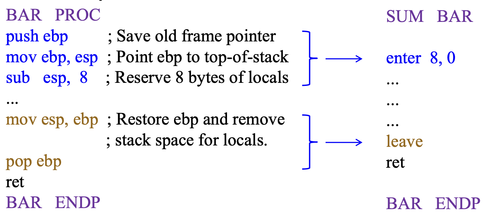
    </div>

    ---
    `#!asm ENTER 2048，3` 在栈上分配 2 KB 的动态存储，并在栈帧中设置指向前一个栈帧的指针

- **嵌套级别**决定了在调整栈指针之前，从前一个帧复制到新栈帧的栈帧指针数量，这允许从被调用函数访问多个父帧
- 嵌套函数不被标准 C 支持，局部变量仅在其声明的函数范围内有效

    <div style="text-align: center">
        
    </div>

- `#!asm ENTER` 支持**块结构化语言**(block structured language)的支持，如使用嵌套函数的 Pascal：
    - 以下代码创建了一个栈帧链（**作用域链**(scope chain)），以便给过程 Z 访问 Y 和 X 的局部变量

        ```pascal
        procedure X;
        begin
        {
            procedure Y;
            begin
            {
                procedure Z;
                begin
                { ... }
                end
            }
            end
        }
        end
        ```

- 以下嵌套函数的栈帧：

    <div style="text-align: center">
        
    </div>

    - 对于嵌套级别为 1 或更高的情况，`#!asm ENTER` 在调整栈指针之前会复制早期的栈帧指针
    - 用于访问先前函数变量的堆栈帧指针集合称为**显示**(display)

- 以下伪代码展示 `#!asm ENTER` 指令的定义：

    ```
    PUSH EBP;
    FRAME_PTR := ESP;
    IF LEVEL > 0
    THEN
        DO (LEVEL - 1) times
            EBP := EBP - 4;
            PUSH Pointer(EBP); (* doubleword pointed to by EBP *)
        OD;
        PUSH FRAME_PTR;
    FI;
    EBP := FRAME_PTR;
    ESP := ESP - STORAGE;
    ```

- x86 最初是作为一种 Pascal 机器设计的，这就是为什么有特殊指令来支持其特性的原因：
    - 使用 `enter` 和 `leave` 的**嵌套函数**
    - **Pascal 调用约定**：被调用者使用 `ret N` 从栈中弹出参数数量
    - 使用 `bound`（ISO 7185 Pascal）进行**边界检查**(bounding check)