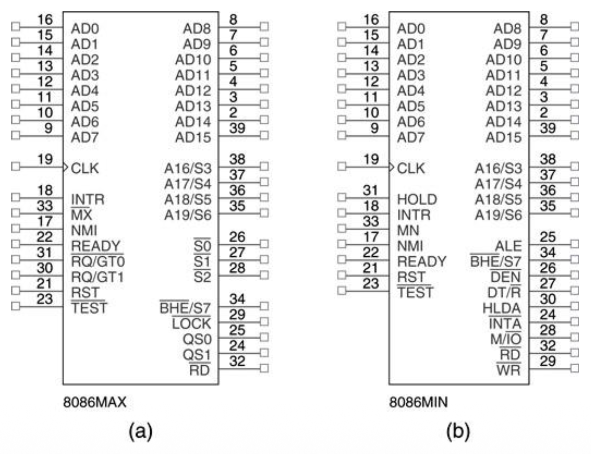
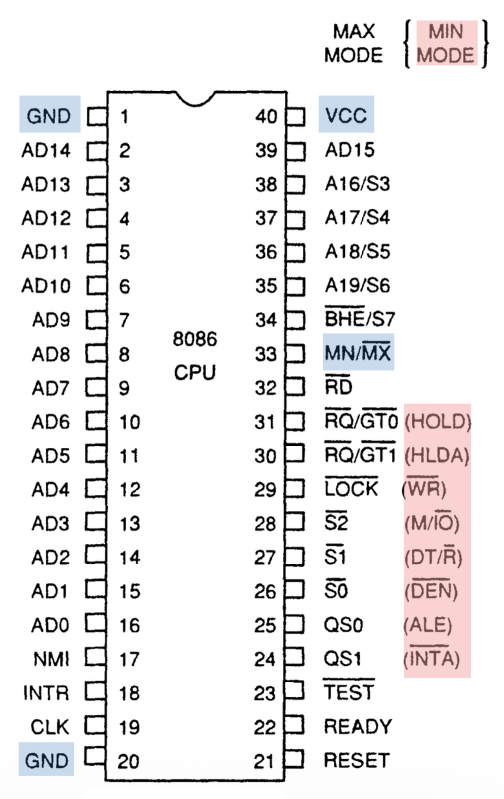
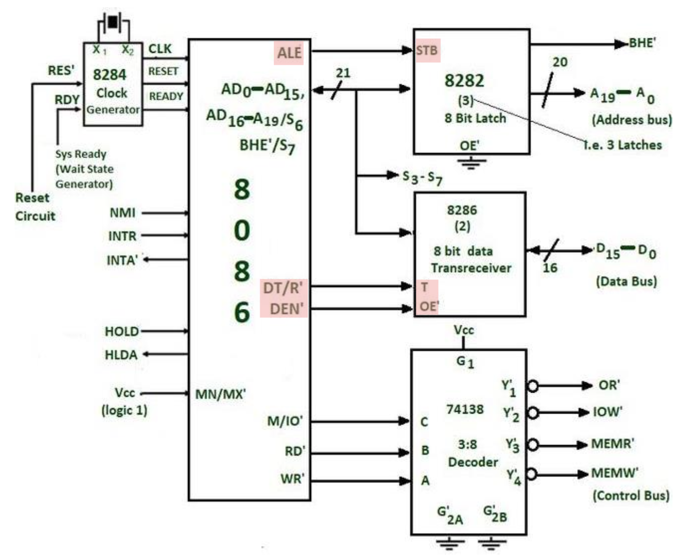
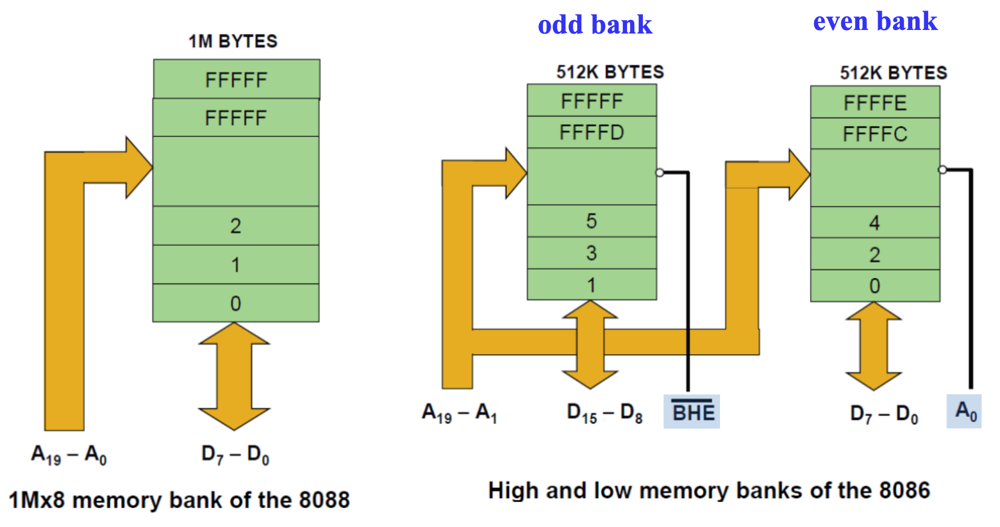

# 8086/8088 Hardware Specifications

??? abstract "核心知识"

    8086 和 8088 芯片的：

    - 引脚排布
        - 小模式/大模式
        - 各种引脚的功能
    - 内存组织（内存库）
        - 8088 单内存库
        - 8086 双内存库
            - 选择信号 $\overline{\text{BHE}}$ 和 $\overline{\text{BLE}}$/$\text{A}_0$
            - 未对齐内存访问需要 2 个周期

## Pin-Outs and Pin Functions

本节将介绍每个微处理器引脚的功能，并讨论 I/O 的基本特点，为接下来理解 I/O 接口打下基础。

下面展示了 8086 & 8088 的**引脚图**(pin-out)：

    

>两者均封装在 40 个引脚的**双列直插式封装**(dual in-line packages, DIPs)中

8086 是一款具有 16 位数据总线的 16 位微处理器，而 8088 则拥有 8 位数据总线。

- 8086 的引脚连接为 AD0–AD15
- 8088 的引脚连接为 AD0–AD7

数据总线宽度是唯一的主要区别。因此，8086 更有效地传输 16 位数据。

8086 的工作模式有：

- **小模式**(minimum mode)：
    - 最简单且成本最低的模式
    - 内存与 I/O 操作的所有控制信号**都由处理器生成**

- **大模式**(maximum mode)：
    - 允许系统使用外部协处理器，例如 8087（浮点协处理器）
    - **一些**控制信号必须**由外部生成**（需要外部总线控制器 8288）

{ align=right width=30% }

在这两种模式下的 8086 引脚排布：

- $\text{VCC}$（+5V 电源）
- $\text{GND}$（接地）：有 2 个（右图左上和左下角）
- $\text{MN}$ / $\overline{\text{MX}}$（最小/最大）：表示处理器将运行的模式
    - 高电平表示小模式，低电平表示大模式
    - 观察右图，小模式会输出红色标注的信号（控制信号），而这些信号的左边则是大模式会输出的信号（请求或状态信号）

8086 的配置（均提供全部控制信号）：

- 小模式：
    - 8282 锁存器
    - 8286 三状态缓冲区
    - 74138 解码器

    

        
    

- 大模式：
    - 8282 锁存器
    - 8286 三状态缓冲区
    - 8288 总线控制器

    

        
    

---
- 引脚连接 $\text{AD}_{15} - \text{AD}_0$ 表示 8086 **地址/数据总线**线路是**时间复用**(time multiplexd)的地址和数据总线线路：
    - $\text{ALE} = 1$：地址信号，有 16 位内存地址或 I/O 端口号两种情况
    - $\text{ALE} = 0$：数据信号

- 小模式引脚 $\text{ALE}$ 表示**地址锁存使能**(address latch enable)，用于确定地址/数据总线是否包含地址（前面刚提过）
    - $\text{ALE}$ 信号在保持确认期间不会浮动

- 小模式引脚 $\text{IO}/\overline{\text{M}}$ （8088）或 $\text{M}/\overline{\text{IO}}$（8086）确定地址信号表示内存还是 I/O
    - 保持确认期间处 于高阻抗(high-impedance)状态

- $\text{BHE}$：（8086）**总线高使能**(bus high enable)引脚用于在读或写操作期间启用最高有效数据总线位（$\text{D}_{15}–\text{D}_8$）

- 引脚连接 $\overline{\text{RD}}$ 表示**读信号**
    - 逻辑 0 时，数据总线能够接收来自内存或 I/O 设备的数据
    - 引脚在保持确认期间处于高阻抗状态

- 小模式引脚 $\overline{\text{WR}}$ 表示**写信号**
    - 逻辑 0 时，数据总线包含用于内存或 I/O 的有效数据
    - 引脚在保持确认期间处于高阻抗状态

- 引脚连接 $\text{INTR}$ 表示**中断请求**(interrupt request)，用于请求硬件中断
    - 如果当 `IF = 1` 时 $\text{INTR}$ 保持高电平，8086/8088 在当前指令执行完成后进入中断确认周期

- $\text{NMI}$ 表示**不可屏蔽的中断输入**(non-maskable input)，和 $\text{INTR}$ 类似
    - 但不会检查 `IF` 标志位
    - 若被激活，使用 2 号中断向量

- 小模式引脚 $\overline{\text{INTA}}$ 表示**中断确认**(interrupt acknowledge)信号，是对 $\text{INTR}$ 输入引脚的响应
    - 通常用于在响应中断时将中断向量号门控到数据总线上

- 小模式引脚 $\overline{\text{LOCK}}$ 表示锁输出，用于锁定系统的外围设备
    - 此引脚通过在任何指令前使用 `#!asm LOCK:` 前缀来激活

## Memory Banks

DRAM 组织：

    

x86 使用**内存库**(memory banks)来支持**单字节传输**(one byte transfer)或**未对齐的内存访问**(unaligned memory access)。一个「**库**(bank)」指代的是一个 8 位宽的内存，比如：

- **8088** 有 8 位的数据总线，且内存地址空间实现为**单个** 1MB 的内存库
- **8086** 有 16 位的数据总线，且内存地址空间实现为**两个**独立的 512 KB 内存库

    

8086 内存库的选择：

- 库高使能(bank high enable)（$\overline{\text{BHE}}$）和库低使能(bank low enable)（$\overline{\text{BLE}}/\text{A}_0$）用作库选择信号：
    - $\overline{\text{BHE}} = 0$ 启用高位/奇数位的内存库
    - $\overline{\text{BLE}}/\text{A}_0 = 0$ 启用低位/偶数位的内存库

- 地址位 $\text{A}_1-\text{A}_{19}$ 选择位置

    

=== "偶地址字节传输"

    

        
    

=== "奇地址字节传输"

    

        
    

未对齐的内存访问需要两个总线周期：

- 第一个周期：使用 $\text{D}_8-\text{D}_{15}$ 进行数据传输
- 第二个周期：使用 $\text{D}_0-\text{D}_7$ 进行数据传输

    

???+ abstract "总结"

    - 保持内存访问对齐在 x86 机器上也很重要
    - x86 的内存和 I/O 空间按库排列；库选择信号（$\overline{\text{BHE}}$ 和 $\overline{\text{BLE}}/\text{A}_0$）用于引用字节数据
    - 这就相当于为内存和 I/O 写操作分别使用**单独的写选通信号**(separate write strobes)（一个用于高 8 位，一个用于低 8 位）

