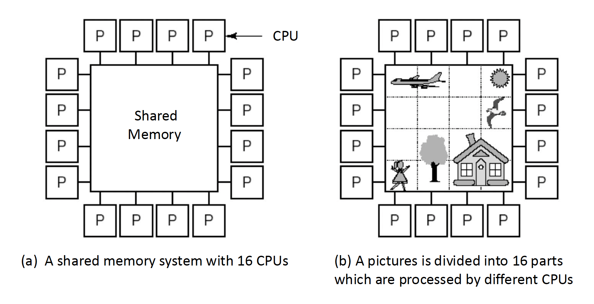
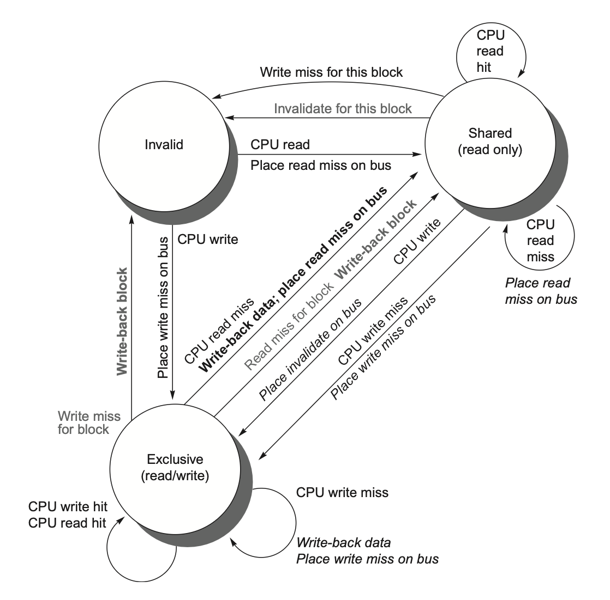
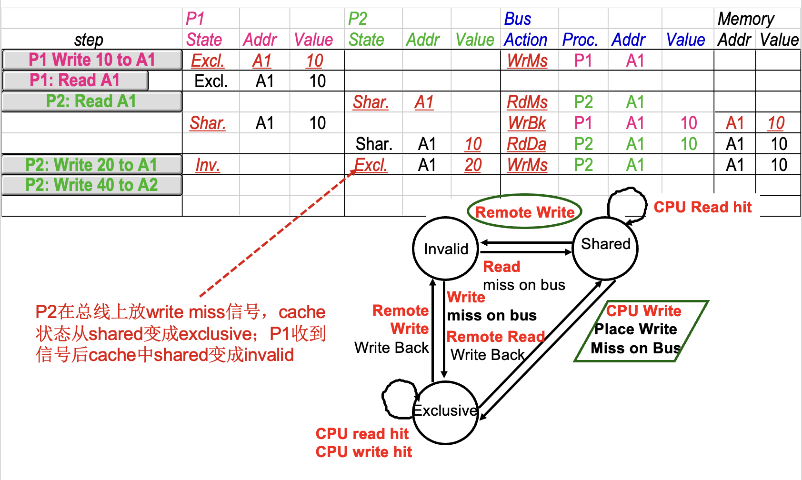
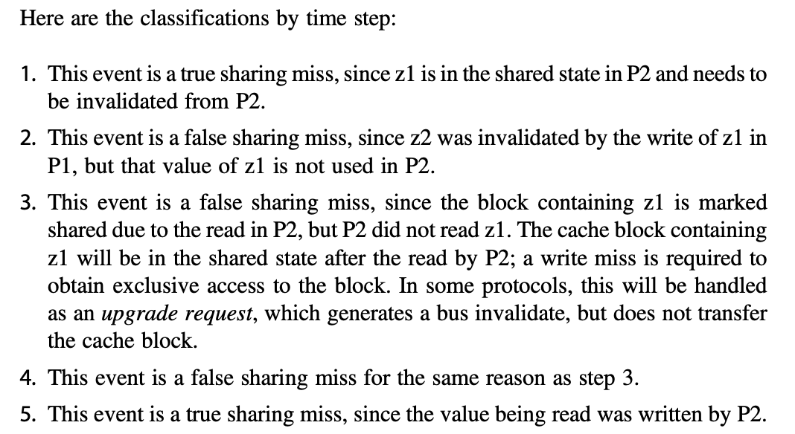
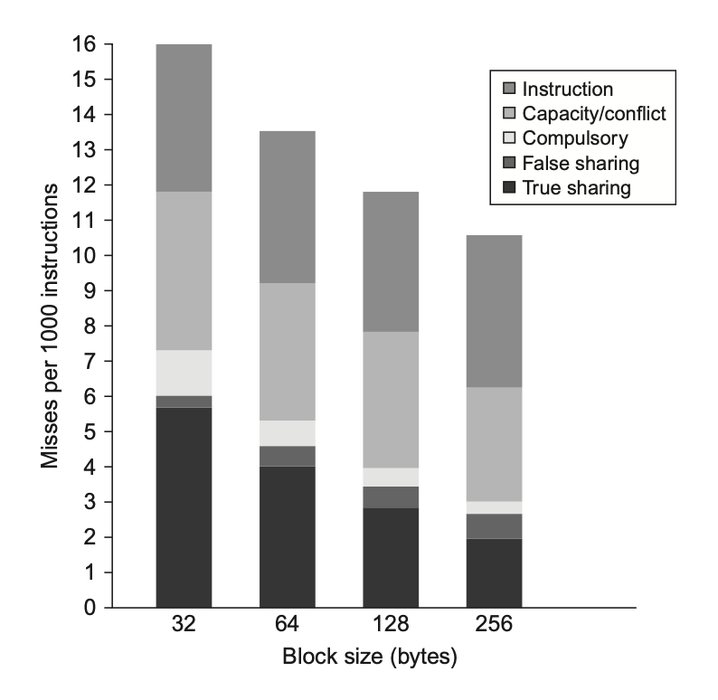
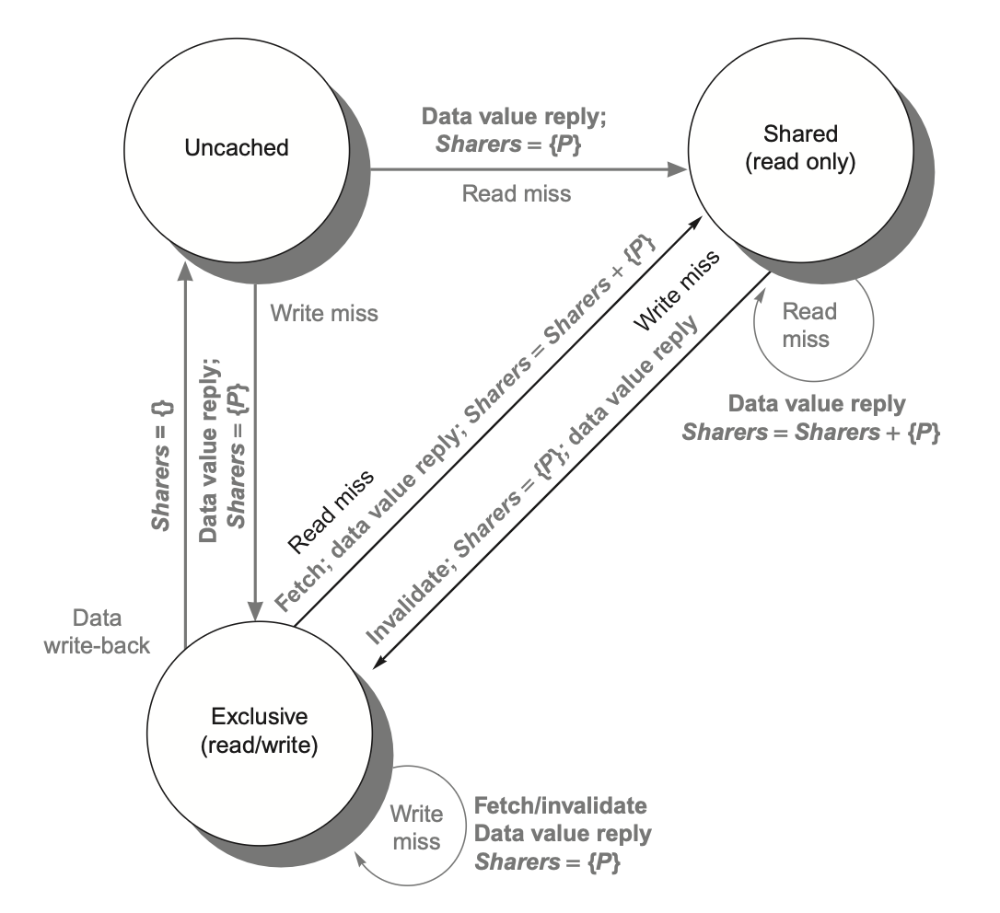
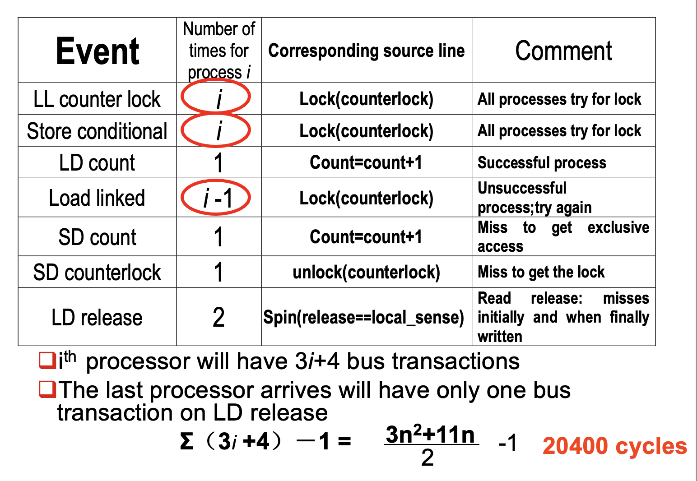
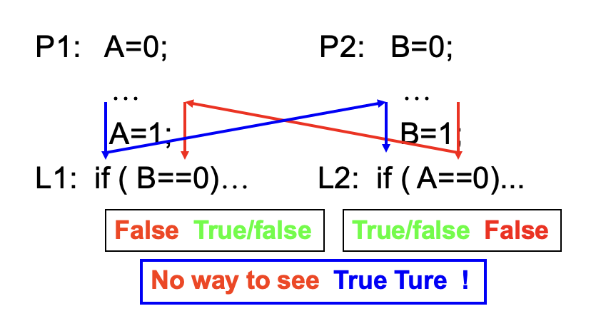
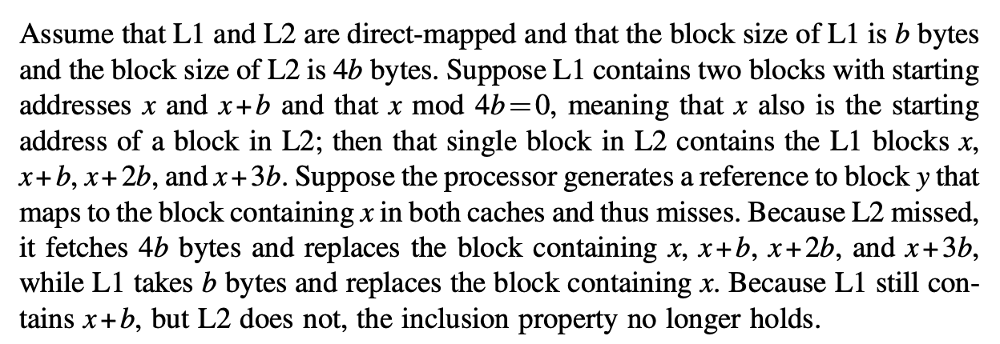

# Chap 5: Thread-Level Parallelism

??? abstract "核心知识"

    - 多处理器架构
        - SMP
        - DSM
    - 高速缓存一致性
        - 监听机制
        - 基于目录的机制
        - 状态：修改M、共享S、无效I
        - 扩展：MESI、MOESI
    - 同步机制
        - 硬件原语
        - 自旋锁
    - 内存连贯性模型
        - 顺序连贯性
        - 松弛连贯性模型

??? info "进程 vs. 线程"

    >来自 Gemini 2.5 Flash 的回答。

    简单来说，线程和进程的主要区别在于：

    * **进程是独立的运行环境，拥有自己的资源（内存、文件句柄等）。** 就像一个独立的应用程序。
    * **线程是进程内部的执行单元，共享进程的资源。** 就像一个应用程序内部的不同功能模块。

    **更形象的比喻：**

    * **进程：** 一家工厂。它有自己的厂房、设备、原材料仓库等。
    * **线程：** 工厂里的工人。他们都在同一个厂房里工作，共享工厂的设备和原材料，但每个工人负责不同的生产线或任务。

    **核心区别总结：**

    | 特性     | 进程                               | 线程                               |
    | -------- | ---------------------------------- | ---------------------------------- |
    | **资源** | 独立拥有，不共享                   | 共享进程的资源                     |
    | **开销** | 创建、销毁、切换开销大             | 创建、销毁、切换开销小             |
    | **通信** | 需要IPC（进程间通信）机制          | 直接共享内存，通信更方便快捷       |
    | **独立性** | 独立性强，一个进程崩溃不影响其他进程 | 独立性弱，一个线程崩溃可能影响整个进程 |
    | **并发** | 进程间并发（多任务）               | 线程内并发（同一任务的不同部分）   |


## Introduction

本章主要探索的是**线程级并行**(thread-level parallelism, **TLP**)。而 TLP 利用到了 **MIMD**(multiple instructions, multiple data)。

前面提到过，由于 ILP 工艺进步的放缓，单处理器(uniprocessor)的发展逐渐走向尾声，因而**多处理器**(multiprocessor)的重要性日渐提升——它由一组紧密耦合的处理器构成，这些处理器受操作系统控制，并通过一个共享的地址空间来共享内存（不一定只有一块物理内存）。多处理器通过以下两类不同的软件模型来实现 TLP：

- **并行处理**(parallel processing)：一组在单任务上协作的紧密耦合的线程执行
- **请求级并行**(request-level parallelism)：来自一名或多名用户的多个相对独立的进程执行
    - 运行在多个处理器上的单一应用程序会利用请求级并行，例如数据库响应查询，或者通过多个独立运行的应用程序（后者通常被称为**多道程序设计**(multiprogramming)）

多处理器既包含具有多个核心的单芯片系统，即所谓的**多核**(multicore)，也涵盖由多个芯片组成的计算机，其中每个芯片通常也是一个多核单元。

之后我们还会探讨**多线程**(multithreading)技术——这是一种支持在单个多发射处理器上以交错方式执行多个线程的技术。许多多核处理器同样包含对多线程的支持。


### Multiprocessor Architecture

要充分利用具有 n 个处理器的 MIMD 多处理器，通常需要至少 n 个线程或进程来执行。单个进程内的独立线程通常由**程序员**显式指定，或由**操作系统**根据多个独立请求动态创建。另一种极端情况是，一个线程可能仅包含循环的数十次迭代——这是由**并行编译器**利用循环中的数据并行生成的。

尽管分配给线程的计算量（称为**粒度大小**(grain size)）对于高效利用 TLP 至关重要，但与 ILP 的本质区别在于：TLP 是由**软件系统**或**程序员**在高层抽象中识别出的、由数百至数百万条可并行执行的指令构成的代码段。

线程也可为 DLP 所利用，但其开销通常高于 SIMD 处理器或 GPU。必须确保粒度足够大，才能高效利用其并行性。

对于现有的共享内存多处理器，根据其内存组织的不同，可以划分为以下两大类：

- **对称（共享内存）多处理器**(symmetric (shared-memory) multiprocessors, **SMP**)（或**集中式**(centralized)**共享内存多处理器**）
    - 具有小到中等数量的核心，通常为 32 个或更少
    - 对于这种核心数量较少的多处理器，里面的这些处理器可以共享一个所有处理器都有平等访问权的单一集中式内存，因此称为“对称”
    - 现在大多数多核都属于 SMP
    - SMP 有时也被称为**统一内存访问**(uniform memory access, UMA)多处理器

        <div style="text-align: center">
            
        </div>

        - 所有处理器统一共享物理内存
        - 所有处理器访问任何内存字的时间相等
        - 每个处理器可具备私有缓存或私有内存
        - 下图展示了基于总线的 UMA 多处理系统

            <div style="text-align: center">
                
            </div>

    - 某些多核处理器对最外层高速缓存的访问是非均匀的，这种结构被称为**非均匀高速缓存访问**(nonuniform cache access, NUCA)，因此即便它们拥有单一主内存，也并非真正的 SMP
    - 下图展示了集中式共享内存多处理器的基本结构：

        <div style="text-align: center">
            
        </div>

    - 下面是基于共享内存的多处理系统的示意图：

        <div style="text-align: center">
            
        </div>

- **分布式共享内存**(distributed shared memory, **DSM**)
    - 在由**多个多核芯片**构成的多处理器系统中，每个多核芯片通常配备**独立的内存单元**，因此这类系统的内存采用**分布式**组织而非集中式组织
    - 许多分布式内存设计能实现对**本地**内存的快速访问，而**远程**内存访问速度则显著下降
    - 在此类架构中，程序员和软件系统需明确区分本地与远程内存访问操作，但通常无需关注各远程存储节点间的具体分布情况
    - 为支持更多的处理器数量，内存必须是分布组织而非集中组织；否则内存系统将以增大访问延迟的代价来满足更多处理器的带宽需求
    - 由于上述问题，SMP 随处理器数量的增加会逐渐丧失优势，因此绝大多数超大规模多处理器系统都采用了分布式内存组织
    - 下图展示了分布式共享内存多处理器的基本结构：

        <div style="text-align: center">
            
        </div>

    - DSM 多处理器也被称为**非均匀内存访问架构**(nonuniform memeory access, NUMA)，因为数据访问时间取决于数据字在内存中的物理位置

        <div style="text-align: center">
            
        </div>

        - 所有 CPU 共享统一的地址空间
        - 使用加载和存储指令访问远程内存
        - 访问远程内存要慢于访问本地内存
        - NUMA 系统内的处理器可以用高速缓存
        - NUMA 又可分为：
            - NC-MUMA：无高速缓存，因而无法隐藏访问远程内存的时间

                <div style="text-align: center">
                    
                </div>

            - CC-MUMA：有一致的高速缓存

                <div style="text-align: center">
                    
                </div>

    - DSM 的主要缺点是处理器间的数据通信机制变得更为复杂，且需要软件层面付出更多努力才能充分利用所增加的内存带宽优势
    - 下面是基于信息传递的多处理系统的示意图：

        <div style="text-align: center">
            
        </div>

无论是 SMP 还是 DSM 架构，线程间的通信均通过一个共享的地址空间来实现。这意味着只要具备相应的访问权限，任何处理器均可对任意内存位置进行寻址操作。SMP 与 DSM 的**共享内存**(shared memory)本质上指代的是**地址空间**(address space)的共享性。

???+ info "补充：COMA"

    内存访问模型除了前面提到的 UMA 和 NUMA 外，还有一种叫做 COMA(cache only memory access)的模型。

    - 它是 NUMA 的一种特殊情况，每个处理器节点没有存储层级，所有的高速缓存构成了统一的地址空间。
    - 使用分布式高速缓存目录，用于远程内存访问。使用 COMA 时，一开始可被分配任意的数据，因为这个数据最终会在运行时被移动到正确的位置上。

    <div style="text-align: center">
        
    </div>


### Challenges of Parallel Processing

多处理器的应用范围广泛，包括：

- 运行几乎无需通信的独立任务
- 或者执行需要线程间协作才能完成的并行程序

要应对这些任务带来的挑战，通常需要采取以下综合方案：

- 精心选择**算法**并优化实现
- 适配底层**编程语言**与系统
- 协调**操作系统**及其支持功能
- 调整**体系结构与硬件**实施方案

尽管很多时候其中某一个环节可能会成为主要瓶颈，但当处理器规模变得很大的时候，我们需要同步优化软件和硬件的所有层面。具体来说，我们主要会遇到以下两种挑战：

- 程序中有限的**并行**能力（对应上述第一个应用）
- 相对高昂的**通信**开销，或者说并行处理器中远程访问的高延迟问题（对应上述第二个应用）
    - 具体时长取决于通信机制、互连网络类型以及多处理器的规模

>上述问题都可以用**阿姆达尔定律**解释。

它们对应的解决方案为：

- 对于应用程序并行能力不足的问题，主要需从**软件**层面着手：
    - 一方面采用能提供更优并行性能的新算法
    - 另一方面依靠软件系统，最大化处理器在完整配置下的有效执行时间
    
- 对于降低远距离延迟的影响，则需要**架构师**与**程序员**的共同努力：
    - 例如通过硬件机制（如缓存共享数据）或软件手段（如重构数据结构使访问本地化）来减少远程访问次数
    - 也可以借助**多线程**技术或[**预取**](2.md#hardware-prefetching-of-instructions-and-data)策略来尝试掩盖延迟

本章后续内容着重研究如何应对第二个挑战。


## Centralized Shared-Memory Architectures

使用大型的多级高速缓存能显著降低处理器对内存带宽的需求，这一发现推动了**集中式内存多处理器**的发展。

- 最初的处理器均为单核设计，通常会占据整个主板；内存则位于共享总线上
- 随着高性能处理器的出现，处理器的内存需求已超出了常规总线的承载能力，因此现代的微处理器直接将内存连接至单一芯片（有时称为**后端**(backside)或**内存总线**(memory bus)，以区别于连接 I/O 的总线）
    - 无论是执行 I/O 操作还是来自其他芯片的访问，访问芯片本地存储器时都必须经过“拥有”该内存的芯片处理
    - 因此这种内存访问具有不对称性：本地内存访问速度较快，而远程内存较慢
    - 在多核架构中，单个芯片上的所有核心共享该存储器，但不同的核之间通过各自内存进行的不对称访问模式通常存在

**对称的共享内存机器**通常支持对共享数据和私有数据的**缓存**，其中：

- **私有数据**(private data)仅被一个处理器使用
    - 当私有数据被缓存时，其存储位置会迁移至高速缓存中，从而降低平均访问时间以及所需的内存带宽。
- **共享数据**(shared data)则能被多个处理器共同访问
    - 对于共享数据的缓存处理，其值可能被复制到多个高速缓存中。除了缩短访问延迟和减少内存带宽需求外，这种复制还能缓解多处理器同时读取同一共享数据项时可能产生的竞争问题。
    - 然而，共享数据的缓存也带来了新的挑战——高速缓存的**一致性**(coherence)问题，下面马上介绍！


### Multiprocessor Cache Coherence

**高速缓存一致性问题**(cache coherence problem)：由于两个不同的处理器对内存的视图是通过各自的高速缓存建立的，因此这些处理器最终可能看到同一内存位置下的不同值。这一问题来源于我们同时拥有由主存定义的**全局状态**和由各处理器核心私有的独立缓存所定义的**局部状态**。

一种不太正式的说法是：如果一个内存系统对任何数据项的读取都能返回该数据项最近被写入的值，我们就可以说这个内存系统是**一致的**。这个定义虽然直观易懂，却显得模糊且过于简单——实际情况要比这复杂得多；而且这一简单的定义实际包括了内存系统行为的两个方面：

- **一致性**(coherence)：规定了读操作可以返回哪些值
- **连贯性**(consistency)：决定了写操作的值何时能被读操作返回

!!! warning "注意"

    实际上，中文翻译没能很好地将 coherence 和 consistency 区分开来，所以你可能会在网上看到把 consistency 翻译成“一致性”的情况。不过在这份笔记中，笔者还是选择将 consistency 翻译成“连贯性”。

对**一致性**(coherence)的严格定义为：当满足以下条件时，我们称内存系统具有一致性：

- 处理器 P 对位置 X 的写入操作后紧跟着 P 对 X 的读取操作，且在该写入与读取之间没有其他处理器对 X 进行写入时，该读取总是返回由 P 所写入的值。
    - 该性质保留了**程序顺序**，而且该性质即使在单处理器中也依然成立。
- 当一个处理器对位置 X 的读取操作发生在另一个处理器对 X 的写入操作之后，只要读写之间有足够的时间间隔,且在两次访问之间没有其他对 X 的写入发生，该读取将返回被写入的值。
    - 该性质定义了内存一致性的核心含义：若某个处理器能持续读取到过时的数据值，那么显然可以判定该内存处在不一致的状态。
- **写串行化**(write serialization)：针对同一位置的写操作是**可串行的**(serialized)。也就是说，任何两个处理器对该位置的两次写操作，在所有处理器看来，都遵循相同的顺序。例如，若先后向某位置写入值 1 和 2，所有处理器都不可能先读到 2 再读到 1。

尽管上述三个性质已足以确保一致性，但连贯性同样至关重要，比如：我们无法要求对 X 的读取操作能立即获取其他处理器对 X 所写入的（最新）值，因为此时写入的数据甚至可能尚未离开原来的处理器。连贯性是由[**内存连贯性模型**](#models-of-memory-consistency)(memory consistency model)定义的，这块内容将放在后面介绍。

一致性与连贯性互为补充：

- **一致性**规定了针对**同一内存**地址读写操作的行为
- 而**连贯性**则定义了涉及**不同内存**地址访问时的读写行为

目前，我们作出以下两点基本假设：

- 必须等到所有处理器都知道到写操作的结果后，该写操作才被视为完成任务（并允许后续写操作执行）
- 处理器不得调整任何写操作相对于其他内存访问的执行顺序
    - 这意味着若某处理器先后写入地址 A 和地址 B ，任何观测到 B 新值的处理器必然也已获取 A 的新值
    
这些假设允许处理器重排读操作顺序，但强制其按照程序顺序来完成写操作。并且这些假设将一直沿用至介绍“内存连贯性模型”时为止。


### Basic Schemes for Enforcing Coherence

在多处理器内运行的程序中，同一数据的多份拷贝通常会同时存在于各级高速缓存中。在一致性的多处理器中，高速缓存提供了共享数据的**迁移**(migration)与**复制**(replication)的双重功能。

- **迁移**：数据项可透明地转移至本地高速缓存并被使用。这既降低了访问远程分配的共享数据的延迟，又缓解了共享内存的带宽压力。
- **复制**：有效减少了读取共享数据时的访问延迟和资源争用。

由此可见，实现高效的迁移与复制对提升共享数据访问的性能而言至关重要。因此，多处理器引入硬件级协议来维护高速缓存的一致性。这个协议被称为**高速缓存一致性协议**(cache coherence protocols)，其实现核心在于追踪数据块的共享状态。每个缓存块的状态通过与之关联的**状态位**来维护（类似于单处理器高速缓存中的有效位和脏位）。根据具体实现技术的不同，可以将协议分为以下两类：

- **基于目录**(directory based)：
    - 特定物理内存块的共享状态（某个处理器在高速缓存有哪个特定存储块的拷贝）被保存在一个称为**目录**(directory)的位置。
    - 存在两种截然不同的基于目录的缓存一致性方案：
        - 在 SMP 中，可采用与内存或其他单一串行化点（如多核芯片的最外层高速缓存）关联的**集中式目录**
        - 在 DSM 中，由于单个目录会阻碍性能，且难以满足多核架构的内存扩展需求，因此需采用**分布式目录**，但实现起来相对更复杂
- **监听**(snooping)：
    - 每个持有物理内存块数据拷贝的高速缓存均可追踪该块的共享状态
    - 在 SMP 中，各个核心的高速缓存通常通过广播介质（如核心自带的高速缓存与共享高速缓存/内存之间的**总线**）实现互通，并且所有的高速缓存控制器通过持续监控或**监听**(snoop)介质，以确认自身是否拥有在总线上，或交换访问中请求的目标数据块拷贝
    - 侦听技术同样适用于多芯片多处理器的一致性协议

        <div style="text-align: center">
            
        </div>


**监听协议**在采用微处理器（单核），并通过总线连接至单一共享内存的多处理器系统中广受欢迎。其中，**总线**为实现监听协议提供了便捷的广播媒介。但多核架构改变了这一局面，因为所有多核芯片上的核都共享了一定级别的高速缓存。因此，部分设计转而采用**目录协议**，因其开销较小。

我们接下来先重点探讨监听协议，等到讨论 DSM 架构时再详细介绍目录协议。


### Snooping Coherence Protocols

要维持高速缓存一致性要求，有以下两种方法：

- **写无效协议**(write invalidate protocol)：确保处理器在写入数据项前拥有对该项的**独占访问权**
    - 独占访问能保证在对一个共享缓存行执行写入操作时，其他所有高速缓存中该缓存行的副本均被无效化。
    - 其他处理器后续读取时会发生高速缓存失效，需要从内存或持有有效副本的高速缓存中获取更新的数据（因此读取时延更长），从而减少总线上重复写入的带宽消耗。
    - 若存在两个处理器试图同时写入同一数据的情况，其中一方将获胜，导致另一方的数据拷贝失效；另一方若要完成其写入操作，就必须获取包含最新更新值的数据新拷贝。
    - 由此可见，此协议确保了**写串行化**。
    - 这是目前最主流的协议。

    ??? example "例子"

        <div style="text-align: center">
            
        </div>

- **写更新**(write update)/**写广播**(write broadcast)**协议**：每当处理器写入一个共享缓存行时，都要广播新的值来更新其他所有高速缓存中该缓存行的副本。
    - 由于写更新协议必须向所有共享缓存行广播写入操作，因而会消耗更多的带宽。
    
所以，几乎所有现在的多处理器系统都选择实现**写无效协议**，后面我们也只关注这个协议。


#### Basic Implementation Techniques

我们还需在发生高速缓存失效时定位数据项：

- 在**写穿式**(write-through)高速缓存中，查找数据项的当前值较为简单，因为所有已写入的数据都会立即发送至内存，从中总能获取到数据项的最新值。

    ???+ abstract "总结：监听高速缓存执行读/写操作的各种情况"

        <div style="text-align: center">
            
        </div>

- 对于**写回式**(write-back)高速缓存而言，确定最新数据值的难度更大，因为数据项的最新值可能存在于私有高速缓存而非共享高速缓存或主存中。
    - 不过我们可以对高速缓存失效和写入操作采用相同的**监听**机制：
        - 每个处理器都会监听共享总线上传输的所有地址。
        - 当某处理器发现自己持有目标缓存块的脏拷贝时，会将该缓存块作为读请求的响应内容返回，并终止对主存（或三级高速缓存）的访问。
        - 该方法的复杂性在于需要从其他处理器的私有高速缓存（L1 或 L2）中获取目标块，这通常比访问三级高级缓存耗时更长。
    - 由于写回式缓存的**内存带宽需求较低**，因此能支持更多高速处理器的协同工作。正因如此，所有多核处理器都在最外层缓存采用写回策略。


        
接下来我们将探讨基于写回式缓存的一致性实现方案。

- 常规高速缓存的**标签位**(tags)可用于实现监听机制，每个块的**有效位**(valid bit)使得失效操作易于实施。
- 对于由失效或者其他事件触发的**读失效**问题，处理起来同样直接，因为它们仅依赖于监听功能。
- 对于**写操作**，我们需要知道该块是否存在其他缓存拷贝。如果没有的话，在写回式高速缓存中便无需将此次写操作置于总线上。不发送写请求既能缩短写入时间，又可节省所需带宽。
- 为了追踪一个高速缓存块是否被共享，我们可以为每个缓存块额外添加一个**状态位**(state bit)，从而能够判断写入操作是否需要产生无效化信号。
- 当对处于共享状态的块执行写操作时，该缓存会在总线上生成无效化命令并将该块标记为**独占**(exclusive)状态，此后该核不再针对此块发送任何无效化请求。
- 拥有缓存块唯一拷贝的核通常被称为该缓存块的**所有者**(owner)。
- 当发送一条无效化指令时，所有者的高速缓存块状态会从共享状态转变为非共享（或独占）状态。若后续有其他处理器请求该缓存块，则必须将其状态重新置为共享。
- 由于我们的监听式高速缓存也能发现任何失效情况，因此它能知道独占高速缓存块何时被其他处理器请求，并且将状态恢复为共享。
- 每个总线事务都必须检查高速缓存地址的标签，这可能会干扰处理器的高速缓存访问。为了减少这种干扰，我们有以下措施：
    - **复制**标签，并将监听访问定向到标签拷贝上。
    - 在共享的 L3 高速缓存处使用**目录**。该目录能够反映给定块是否被共享，以及可能哪些核拥有拷贝。有了目录信息，无效操作可以仅针对那些拥有该缓存块拷贝的高速缓存进行。这就要求 L3 必须始终保留 L1 或 L2 中任何数据项的拷贝，这一特性称为**包含性**(inclusion)。


#### A Simple Protocol

我们一般通过为每个核中集成一个**有限状态控制器**来实现监听式一致性协议。该控制器响应来自核内处理器及总线（或其他广播媒介）的请求，改变选定高速缓存块的状态，同时利用总线访问数据或使其失效。从逻辑上看，可以认为每个高速缓存块都关联着一个独立的控制器；这意味着针对不同缓存块的监听操作或缓存请求能够独立处理。实际实现中，单个控制器允许多个针对不同缓存块的操作以交错方式执行。

我们规定协议包含三种状态：

- **无效**(invalid)：在缓存行内的数据无效
- **共享**(shared)：表示私有高速缓存中的块可能被多个核共享
- **修改**(modified)：表明某个块已在私有高速缓存中被更新；并且该状态意味着该块具有独占性。
    - 此时对应内存的数据，以及该数据在其他高速缓存的拷贝均无效（因为存的不是最新的数据）

下表展示了由核产生的请求（上半部分）以及来自总线的请求（下半部分）与高速缓存一致性的关系：

<div style="text-align: center">
    
</div>

当总线上出现无效请求或写无效时，所有私有高速缓存中存有该缓存块拷贝的核都会将其置为无效。对于写回式高速缓存的写无效情况，若该块仅存在于一个**私有高速缓存**，且处于独占状态，那么该缓存还需执行**写回**操作；否则可直接从共享高速缓存或主存读取数据。

下图展示了采用写无效协议和写回式高速缓存的单个私有高速缓存块的有限状态转换图（左图是 CPU 请求，右图是总线请求）：

<div style="text-align: center">
    
</div>

将两个状态转换图合并在一起，可以得到以下状态图：

<div style="text-align: center">
    
</div>

- 任何有效的高速缓存块要么处于一个或多个私有高速缓存的共享状态，要么严格位于单一高速缓存的独占状态。
- 任何向独占状态的转换（这是处理器写入块的必要条件）都要求在总线上发出无效或写无效信号，这将导致所有本地高速缓存将该块置为无效状态。
- 此外，若其他本地高速缓存曾以独占状态持有该块（变脏了），则该高速缓存会执行写回操作，从而提供包含目标地址的数据块。
- 最后，当总线出现针对独占状态块的读失效时，持有该独占拷贝的本地高速缓存会将其状态变更为共享状态。

本协议的另一特性是：处于共享状态的内存块在外部共享高速缓存（L2 或 L3，若无共享高速缓存则为内存）中始终保持最新状态。这一特性显著简化了实现方案。

??? example "例子"

    === "例1"

        <div style="text-align: center">
            
        </div>

    === "例2"

        === "初始状态"

            <div style="text-align: center">
                
            </div>

        === "Step 1"

            <div style="text-align: center">
                
            </div>

        === "Step 2"

            <div style="text-align: center">
                
            </div>

        === "Step 3"

            <div style="text-align: center">
                
            </div>

        === "Step 4"

            <div style="text-align: center">
                
            </div>

        === "Step 5"

            <div style="text-align: center">
                
            </div>

    === "例3"

        === "初始状态"

            <div style="text-align: center">
                
            </div>

        === "Step 1"

            <div style="text-align: center">
                
            </div>

        === "Step 2"

            <div style="text-align: center">
                
            </div>

        === "Step 3"

            <div style="text-align: center">
                
            </div>

            这张图没时间改了，各位要仔细判断。


尽管这个简单的缓存协议能正确执行，但是它忽略了许多复杂情况。其中最重要的是该协议假设所有操作都是**原子性的**，即任一操作能够以不受其他操作干扰的方式完成，然而现实中并非如此。非原子性操作会引入协议**死锁**(deadlock)的可能性，即进入无法继续执行的状态。在后面我们会讨论这些情况。


### Extensions to the Basic Coherence Protols

先前描述的一致性协议是一种简单的三状态协议，通常以其状态的首字母来指代，因此被称为 **MSI**（Modified（修改），Shared（共享），Invalid（无效））协议。我们可以基于这一基础协议进行扩展，通过增加额外状态和事务来优化特定行为，从而（可能会）提升性能表现。其中，最常见的两种扩展是：

- **MESI** 协议：增加了**独占**(exclusive)状态，形成四种状态：修改(modified)、独占(exclusive)、共享(shared)和无效(invalid)。
    - **独占状态**表示缓存块仅存在于单一高速缓存中，且未被修改。
    - 若某个块处于独占状态，对其进行写入时无需产生失效信号，从而优化了同一高速缓存先读取后写入该数据块的场景。
    - 当然，当对处于独占状态的块的读失效发生时，必须将该块转为共享状态以维持一致性。
    - 添加独占状态的好处在于：当同一个核再次写入处于独占状态的数据块时，既不需要获取总线访问权，也不需生成失效信号，因为系统明确知晓该数据块仅存在于本地的这个高速缓存中；处理器只需将其状态改为已修改即可实现更新。
    - 通过将一致性状态位编码为独占状态位、并用脏位标识修改情况即可轻松实现该状态的扩展应用。
    - 下面是 MESI 协议的状态图（jxh 版本）：

        <div style="text-align: center">
            
        </div>

        ??? note "状态图（cr 版本）"

            >两张图不太一样，目前还没仔细研究过。

            <div style="text-align: center">
                
            </div>

- **MOESI**协议：在 MESI 协议的基础上增加了**拥有**(owned)状态，用于表示相关缓存块由该高速缓存持有，且主存中的拷贝已过时。
    - 在 MSI 和 MESI 协议中，当尝试共享处于修改状态的缓存块时，在原高速缓存和新的共享高速缓存中，该块的状态都会转变为共享状态，且必须将其写回主存。
    - 而在 MOESI 协议中，原高速缓存的修改状态可以直接转换为拥有状态而无需立即写入内存。其他新的共享该块的高速缓存则保持共享状态；而仅由原高速缓存持有的拥有状态表明主存拷贝已失效，且指定高速缓存是所有者。
    - 当发生失效时，所有者必须提供该数据块（因为主存未更新）；若被替换，则需将其写回主存。


### Limitations in SMPs and Snooping Protocols

随着多处理器中处理器数量的增加，或每个处理器的内存需求增长，系统中任何**集中式资源**(centralized resource)都可能成为瓶颈。对于多核处理器而言，仅需少量核心，就能使单个共享总线形成性能瓶颈。因此，多核设计转向了更高带宽的互连方案，以及采用多个独立内存以支持更多核心数量。

监听式高速缓存的带宽也可能是一个限制，因为每个高速缓存都必须检查每一次的失效情况，而增加互连带宽只会将问题转嫁给高速缓存。下面给出一些增加监听带宽的技术：

- **复制标签位**(tags)，实现带宽倍增
- 如果多核处理器共享最外层的高速缓存，那么可采用**分布式**的高速缓存——每个处理器分管部分内存区域，并处理对应地址空间的监听请求。
    - 鉴于 L3 承担着过滤监听请求的功能，L3 必须具备包容性(inclusive)
- 可在最外层的共享高速缓存层（如L3）设置一个**目录**。
    - 同样地，L3 必须保持包容性。
    - 引入目录结构后，无需广播至所有 L2 缓存，仅需查询目录指向的可能持有数据块拷贝的特定 L2 即可。
    - 与前一种方法类似，其关联的目录条目亦可以分布式存储。

下图展示的就是一个采用分布式高速缓存系统的多核处理器：

<div style="text-align: center">
    
</div>


### Implementing Snooping Cache Coherence

在单总线的多核处理器中，通过以下方式可使这些步骤具备实质原子性：

- 首先（在更改缓存状态前），对通往共享高速缓存或内存的总线进行仲裁，并在所有操作完成前不释放总线。
- 使用单条线路来表示所有必要的无效化请求都已接收并正在处理。
- 收到该信号后，生成失效信号的处理器便可释放总线，因为它知道处理和下一个失效相关的任何活动之前，所有必需的操作都将完成。

而在一个没有单一集中总线的系统中，则用其他方法来实现高速缓存失效操作的原子性。具体而言，必须确保两个处理器同时尝试写入同一数据块（这种情况称为**竞争**(race)）时遵循严格顺序：一个写操作被完整处理并先行完成后，另一个写操作才能开始执行。竞争中两个写操作的胜负并不重要，关键在于只存在唯一胜出者，其一致性操作能率先完成。

在多核架构中采用多总线设计时，只要确保每个内存块仅关联一条独立总线，就能通过该共享总线对同一数据块的访问请求进行串行化处理，从而消除竞争现象。这一特性与重启竞争失败方的高速缓存失效处理的能力相结合，构成了无需总线也能实现的监听式高速缓存一致性的关键要素。

实际设计中可混合使用侦听协议和目录协议。


## Performance of Symmetric Shared-Memory Multiprocessors

!!! warning "注意"

    这块内容应该不考！

在使用监听一致性协议的多核处理器中，多种不同的现象共同影响着性能表现。具体而言，整体的高速缓存性能由单处理器的**缓存失效流量**和**通信流量**（导致无效化以及后续缓存失效）共同决定。改变处理器的数量、高速缓存的容量和块的大小都会影响带这两类关于失效率的要素。

而之前在计组课程中，我们知道**单处理器**的失效率可以被分解为三个C：**容量**(capacity)、**强制**(compulsory)和**冲突**(conflict)。它们既揭示了应用程序行为特征，也为高速缓存的设计优化提供了方向。同理，由**处理器间通信**引发的失效（通常称为**一致性失效**(coherence misses)）也可归因于两个因素：

- **真共享失效**(true sharing misses)：
    - 在基于无效的协议中，处理器首次写入共享缓存块时会触发无效操作，以确立对该块的所有权
    - 此外，当其他处理器尝试读取该缓存块中被修改的数据字时，会发生失效并导致相应块的传输
    - 上述两类失效均被归类为真共享缺失，因为它们直接源于处理器间的数据共享行为
- **伪共享失效**(false sharing misses)：
    - 在基于无效的一致性算法中，每个缓存块仅有一个有效位；当某个块因其中某些数据字被写入而被无效化（随后使用便引发失效）时，便会出现了伪共享
    - 若接收无效化的处理器实际使用了被写入的字，则该引用属于**真共享引用**，此时无论块有多大都会引发失效
    - 然而，若被写入字与读取字不同，且无效化并未传递新值，仅造成额外缓存失效时，即为**伪共享失效**。
    - 此时虽然块是被共享的，但高速缓存中并无实际共享的数据字；若块大小为单个字数据，则此失效不会发生。

??? example "例子"

    === "题目"

        <div style="text-align: center">
            
        </div>

    === "答案"

        <div style="text-align: center">
            
        </div>


### Commercial Workload

本节将探究一台四处理器共享内存多处理机上运行在线事务处理([OLTP](https://en.wikipedia.org/wiki/Online_transaction_processing))工作负载时的内存系统行为，并重点分析其中高速缓存的活动，尤其是 L3 高速缓存的行为（其中存在大量与一致性机制相关的流量）。

在研究的商业应用中，OLTP 应用对内存系统的压力最大，即使在评估时使用更大的 L3 高速缓存，也表现出很大的挑战。

首先来探究 **L3 高速缓存容量**变化的影响：每个处理器的 L3 高速缓存容量从 1MiB 到 8MiB 不等。下图展示了采用两路组相联高速缓存时增大容量的收益效果：

<div style="text-align: center">
    
</div>

可以看到，随着容量增加，失效率降低，因而程序执行时间也不断减小。值得注意的是，性能提升几乎全部集中在 1MiB -> 2MiB 的阶段，继续扩容下去的话却收效甚微。为了搞清楚背后的原因，我们需要明确哪些因素会影响 L3 高速缓存的失效率，以及这些因素如何随着 L3 高速缓存的增大而变化。下图呈现了来自五个来源的每条指令所贡献的内存访问周期数：

<div style="text-align: center">
    
</div>

- 在 1MiB 的 L3 高速缓存下，影响内存访问周期的两大主要因素是指令失效和容量/冲突失效；而当缓存容量增大时，这两个因素的影响会变得微不足道
- 而强制失效、伪共享失效及真共享失效几乎不受缓存容量的影响。因此当容量较大时，**真共享失效**构成了高速缓存失效的主要部分；由于真共享失效数量保持不变，所以当 L3 高速缓存容量的提升超过 2MiB 后，整体失效率的降低幅度有限。

综上，虽然增大高速缓存容量可消除大部分单处理器的失效，但是对多处理器的失效则没有太大影响。

---
接下来展示的是**增加处理器数量**对不同类型失效的影响：

<div style="text-align: center">
    
</div>

不难发现，真共享失效率的上升并未因单处理器失效率下降而得到抵消，所以导致每条指令的内存访问周期整体增加。

---
最后要探讨的是**增加块大小**是否有助于改善此类工作负载的性能。这一做法理应能降低指令失效率和冷启动失效率，并在一定范围内减少容量/冲突失效率，甚至可能降低真实共享失效率。下图展示了当块大小从 32B 增至 256B 时，每千条指令的失效次数变化情况：

<div style="text-align: center">
    
</div>

- 真共享失效率降低至原来的 1/2 以下，表明真共享失效能够利用局部性原则得到缓解
- 强制失效率也显著下降，符合我们的预期
- 冲突/容量失效呈现小幅下降，这表明在这种情况下，空间局部性的程度并不高
- 伪共享失效率的占比虽然较小，但几乎翻了一倍
- 但指令失效率未受到显著影响，这一结果超出我们的预期。
    - 若是在指令缓存中有如此表现，我们可以得出空间局部性程度很低的结论
    - 但在 L2 与 L3 混合高速缓存的场景下，诸如指令-数据冲突等其他因素也可能导致大容量块时指令缓存的高失效率
    - 已有研究证实，大型数据库和 OLTP 负载的指令流中存在较低的空间局部性特征——这类工作负载包含大量短基本块和专用代码序列
    - 根据这些数据，要使更大块大小的 L3 的性能与 32B 大小的块相当，其失效损失可表示为 32B 块大小失效值的倍数

        <div style="text-align: center">
            
        </div>


### Multiprogramming and OS Workload

接下来研究的是一个**多程序化的**工作负载(multiprogrammed workload)，包含了用户活动与操作系统活动。这类工作负载呈现出三个特征鲜明的阶段：首先是基准程序的编译（涉及大量计算操作），接着是将目标文件安装到库中，最后是删除目标文件。最终阶段完全由 I/O 操作主导，仅有两个进程保持活跃状态（每个运行实例各一个）。中间阶段同样以 I/O 为主导，处理器基本处于空闲状态。整体而言，该工作负载相比 OLTP 具有更显著的**系统**密集型和 **I/O** 密集型特性。

后续工作负载的测量中，我们假设采用以下内存与 I/O 系统的配置：

- L1 指令高速缓存：32KB 容量，64B 块大小的二路组相联结构，命中周期为 1 个时钟周期。
- L1 数据高速缓存：32KB 容量，32B 块大小的二路组相联结构，命中周期为 1 个时钟周期。

>注：与侧重 L3 高速缓存的 OLTP 负载不同，本次重点考察 L1 数据高速缓存的行为特征。

- L2 高速缓存：1MB 统一式设计，128B 块大小的二路组相联结构，命中需 10 个时钟周期。
- 主存系统：单通道总线架构的存储器，访问时延为 100 个时钟周期。
- 硬盘系统：固定访问延迟 3ms（低于常规值，以减少空闲等待时间）。

下表展示了八个处理器在上述参数配置下的执行时间分布情况。

<div style="text-align: center">
    
</div>

执行时间被分解为以下部分：

- **空闲**(idle)：在内核模式下空闲循环中执行的时长
- **用户**(user)：执行用户代码的时长
- **同步**(synchronization)：用于同步变量操作或等待的时长
- **内核**(kernel)：在 OS 内既非空闲也非同步访问的执行时长


#### Performance

接下来我们考察多道程序的工作负载在高速缓存大小和块大小变化时的性能表现。由于内核行为与用户进程存在差异，所以将这两部分分开来分析。尽管用户代码执行更多的指令，但操作系统的行为可能产生更多的高速缓存失效，除了代码体量更大以及局部性缺乏外，还有两个原因：

- 内核在向用户分配内存页前会初始化所有的页，这显著增加了其强制性失效的比例。
- 内核实际存在数据共享的现象，因而会产生可观的一致性失效；相比之下，用户进程仅在被调度到不同处理器时才会引发一致性失效问题，且比例极低。

下面两张图分别展示了内核与用户的数据失效率随数据高速缓存容量及块大小的变化关系：

<div style="text-align: center">
    
</div>

- 可以看到，增大数据高速缓存容量对用户失效率的影响显著高于对内核失效率的影响
- 而增加块大小则能同时改善两者的失效问题
- 这是因为较大比例的失效源自强制性失效和容量性失效——这两类问题均可通过采用更大的块来缓解
- 由于一致性失效相对罕见，增大块尺寸带来的负面影响较小。

为了理解内核进程与用户进程表现差异的原因，我们需要进一步分析内核失效的行为特征。下图展示了内核失效率随高速缓存容量和块大小增加的变化情况：

<div style="text-align: center">
    
</div>

- 图表将失效问题划分成三类：
    - 强制性失效
    - 一致性失效：包括真共享与伪共享
    - 容量/冲突性失效：含操作系统与用户进程间、多用户进程间干扰引发的失效
  
- 增大高速缓存容量仅能降低单处理器环境下的容量/冲突性失效率
- 而增大块尺寸则有效减少了强制性失效率
- 随着块尺寸的增加，一致性缺失率并未出现显著上升，这表明伪共享的影响可能微乎其微

---
- 对于多道程序的工作负载而言，**操作系统**对内存系统的需求更为严苛。
- 若工作负载中包含更多操作系统或类操作系统的活动，且其行为特征与本研究所测的情形相似，那么构建性能足够强大的内存系统将变得异常困难。
- 提升性能的潜在途径之一是通过改进**编程环境**或借助**程序员**辅助手段，使操作系统更具高速缓存感知能力。
    - 例如，操作系统会为不同系统调用产生的请求复用相同的内存区域。尽管这些被复用的内存将被完全覆写，但硬件因无法识别这一特性仍会维持缓存一致性机制运行，甚至可能尝试读取已失效的高速缓存块数据段。


## Distributed Shared-Memory and Directory-Based Coherence

前面介绍的监听协议要求每次高速缓存失效时，要和其他所有的高速缓存进行通信。这种不用集中式的数据结构来追踪高速缓存状态的特性，既是监听方案的优势（实现成本低廉），也是它的致命弱点，因为这使得它的可扩展性(scalability)很差。

近年来，多核处理器的发展迫使所有设计者转向**分布式内存**(distributed memory)，以满足各处理器对带宽的需求。这种内存组织能够提升内存带宽和互连带宽，因为它能将本地内存流量与远程内存流量分离，从而降低了对内存系统和互连网络的带宽需求。然而，若无法消除高速缓存失效时执行一致性协议的广播操作，那么分布式内存所带来的收益将极为有限。

另外，我们还提到过监听协议的替代方案——**目录协议**(directory protocol)。

- 目录会记录每个可能被缓存的块的状态信息，包括哪些高速缓存（或高速缓存组）拥有该块的副本、数据是否是脏的（已被修改）等
- 在共享最外层缓存（L3）的多核处理器中，实现目录机制非常简单：只需为每个 L3 高速缓存块维护一个与核心数量等长的**位向量**即可
    - 该位向量能标识出哪些私有 L2 高速缓存可能持有 L3 高速缓存中的对应块副本，这样失效请求仅需发送至这些特定的高速缓存即可
    - 当 L3 采用包容性设计时，这种机制在单个多核芯片上能完美运作
- 多核系统中，采用单个目录的解决方案不具备可扩展性，即便这避免了广播操作。所以我们必须设置**分布式的目录**，但分布方式需确保一致性协议能定位到任意缓存内存块的目录信息。
    - 容易想到的一种解决方法是让目录随内存单元分布——正如不同内存请求指向不同内存那样，不同的一致性请求也能访问到不同的分布式目录。
    - 若将信息维护在 L3 高速缓存等多分区的外层高速缓存中，则可将目录信息分散到各个高速缓存分区间，从而有效提升带宽利用率。

- 分布式目录具有以下特性：一个块的共享状态始终位于单个的已知位置。这一性质结合了维护节点缓存块的信息，使得一致性协议能够避免广播操作。
- 下图展示了添加目录至每个**节点**（单个多核处理器，或在内部实现一致性的小型处理器集合）后，分布式内存多处理器结构的示意图：

    <div style="text-align: center">
        
    </div>

- 最简单的目录实现方式是：为每个内存块在目录中关联一个条目。
    - 此时信息总量与“内存块的数量 * 节点数量”的结果成正比
    - 对于不超过数百个处理器（每个可能是多核）的多处理器而言，这种开销在合理块大小设置下是可接受的
    - 而对于更大规模的多处理器系统，则需要采用能高效扩展目录结构的方法，不过我们无需考虑这种情况


### Directory-Based Cache Coherence Protocols

目录协议必须实现两个核心操作：处理**读失效**和处理对共享且干净的高速缓存块的**写入**。

为实现这些功能，目录需要追踪每个高速缓存块的状态。具体有以下几类状态：

- **共享**：一个或多个节点缓存了该数据块，且内存中的数值与所有缓存副本保持同步更新
- **未缓存**(uncached)：没有任何节点持有该缓存块的副本
- **已修改**(modified)：只有一个节点持有该数据块副本，且已执行过写操作，因此内存中的对应副本失效；此时该处理器被称为此数据块的**所有者**(owner)

除了跟踪状态外，还需要记录哪些节点拥有**内存块的副本**，因为在写入时需要使这些副本失效。实现这一功能的最简单方法是为每个内存块维护一个**位向量**。当内存块处于共享状态时，向量的每一位表示对应的处理器芯片是否持有该块的副本。当内存块处于独占状态时，我们同样可以利用这个位向量来追踪其所有者。

出于效率考虑，还会在各级高速缓存中单独记录每个高速缓存块的状态。

尽管状态转换时的具体操作略有差异，但各高速缓存中**状态机**的状态与转换机制与之前采用的监听式高速缓存方案完全一致。

而数据项的**无效化**处理及**独占副本的定位**操作则存在显著区别：这两种操作都需要请求节点与目录之间、目录与一个或多个远程节点之间进行通信；而在监听协议中，这两个步骤是通过向所有节点广播一起完成的。

下图展示了节点间传递的各类消息：

<div style="text-align: center">
    
</div>

- **本地节点**(local node)是发起请求的节点，**家节点**(home node)则是存储着目标地址对应内存位置及目录条目的节点。
- 物理地址空间采用静态分布方式，因此总能确定哪个节点存有特定的物理地址的内存和目录信息（例如高位比特可表示节点编号，低位比特则表示该节点内存中的偏移量）。
- 当家节点同时作为本地节点时仍需访问目录，因为数据副本可能存在于被称为**远程节点**(remote node)的第三方节点中。
    - **远程节点**是拥有高速缓存块副本的节点（无论该副本处在独占状态还是共享状态）。
    - 远程节点可能与本地节点或家节点相同，此时处理器间消息可替换为处理器内消息，其他机制保持不变


### An Example Directory Protocol

下图展示了在基于目录的系统中，单个高速缓存块的状态转换图：

<div style="text-align: center">
    
</div>

- 这张状态转换图操作与监听方案基本一致：状态和触发条件近乎相同。
- 不同之处是：监听机制通过总线（或其他网络）广播写无效操作，而在这里我们通过目录控制器，选择性地发送数据获取与无效化操作。
- 任何高速缓存块在写入时必须处于独占状态，且所有共享块必须在内存中保持最新值。
- 大多数多核处理器中，最外层的高速缓存由各核心共享，通过内部目录或监听机制来维护同一芯片上各核心私有高速缓存的一致性。因此只需接入最外层的共享高速缓存，便可利用芯片上多核一致性机制扩展至更庞大的处理器；而且此时处理器与一致性请求的竞争问题得以缓解，同时可避免标签位的重复。

在基于目录的协议中，发送至目录的消息会触发两种不同类型的操作：**更新目录状态**，以及**发送附加消息以满足请求**。目录中的状态表示的是内存块中三种标准状态；但和监听式方案不同的是，这里的目录状态反映的是所有高速缓存副本的整体状况，而非单个块的状态。

为了追踪持有高速缓存块副本的节点集合，我们使用名为**共享者**(Sharers)的位向量来实现这一功能。目录请求需要更新共享者，并通过读取该集合执行无效化操作。

下图展示了目录节点在接收消息后采取的操作（状态图结构和上图一致）：

<div style="text-align: center">
    
</div>

该目录会处理三种不同类型的请求：**读失效**(read miss)、**写无效**(write miss)以及**数据写回**(data write-back)。

为了理解这些目录操作的机制，下面我们逐步分析各状态下收到的请求及执行的操作。

- 当某个块处于**未缓存**状态时，内存中的副本即为当前有效值，因此可能出现以下请求类型：
    - **读失效**：请求节点从内存中获取所请求的数据，且该请求者成为唯一的共享节点；此时该数据块的状态被设为共享状态。
    - **写无效**：请求节点接收值，并成为共享节点；该数据块被置为独占状态，以表明其唯一的有效副本已缓存；共享者(Sharers)字段标识其所有者身份。

- 当块处于**共享**状态时，内存值是最新的，因此可能发生以下请求：
    - **读失效**：从内存中向请求节点发送所请求的数据，并将该请求节点加入共享者(Sharers)中。
    - **写无效**：向请求节点发送值；向共享者中的所有节点发送失效消息，且共享者将更新为仅包含该请求节点的标识；此时该块的状态被设为独占状态。

- 当块处于**独占**状态时，块的当前值由共享者（所有者）标识的节点上的缓存持有，因此存在以下目录请求：
    - **读失效**：
        - 向所有者发送数据获取消息，这使得所有者的高速缓存中的块状态转变为共享状态，并促使所有者将数据发送至目录。
        - 数据在目录处被写入内存后回传给请求处理器。
        - 请求节点的身份会被添加至仍包含原所有者处理器的身份（因它仍然持有可读副本）的共享者中。
    - **数据写回**：
        - 由于所有者正在替换该块，必须将其写回。
        - 此操作使内存副本更新为最新状态（主目录实质上成为新的所有者），此时该块转为未缓存状态，且清空共享者。
    - **写无效**：
        - 该块将归属新的所有者。
        - 系统会向原所有者发送消息，使其缓存中的块无效化，并将值传送至目录；随后目录将该值转发给请求节点使其成为新的所有者。
        - 共享者更新为新所有者的信息，而该块的独占状态保持不变。

!!! example "jxh 课件有一个比较完整的例子，建议阅读和理解（~~由于内容太多不太好搬过来~~）"

??? example "例子"

    === "题目"

        <div style="text-align: center">
            
        </div>

    === "解答"

        <div style="text-align: center">
            
        </div>


## Synchronization

???+ question "为什么需要同步？"

    需要知道何时不同进程使用共享数据是安全的。

**同步**(synchronization)机制通常由用户级的软件例程构建，这些例程依赖于硬件提供的同步指令。对于较小规模的多处理器系统或低竞争场景，关键的硬件能力在于提供一条不可中断的指令或指令序列，该指令能够以**原子方式**检索并修改数值。基于这一能力，便可构建出软件同步机制。本节重点探讨**加锁**与**解锁**这两类同步操作的实现原理；通过这两个操作，既能实现互斥访问控制，也可为更复杂的同步机制奠定基础。


### Basic Hardware Primitives

在多处理器系统中。实现同步所需的关键能力是一组能够实现**原子化**读取并修改内存位置的**硬件原语**(hardware primitives)。若缺乏这种能力，构建基本同步原语的成本将极为高昂，且会随着处理器数量的增加而递增。实际上存在多种基础硬件原语的替代方案，它们均提供对某一位置进行原子化读写的能力。但通常而言，架构师并不期望用户直接使用这些基础硬件原语，而是希望**系统程序员**利用它们来构建同步库。下面让我们从其中的一个硬件原语出发，展示如何利用它来构建一些基本的同步操作。

我们要介绍的硬件原语是**原子交换**(atomic exchange)，用于将寄存器中的值与内存中的值进行互换。

- 假设我们需要构建一个简单锁：用 0 表示锁处于空闲状态，用 1 代表锁已被占用。
- 处理器尝试通过执行交换指令来获取锁：
    - 将寄存器中的 1 进行交换；寄存器的内存地址和锁对应
    - 若其他处理器已持有该锁，则交换指令返回值为 1；反之返回 0 时，该内存位置的值也会被同时更新为 1，从而阻止其他竞争性交换操作同样获得 0。

- 例如：两个处理器同时尝试执行交换指令时，这种竞争会被打破：其中一个处理器必定会率先完成交换并返回 0，而第二个处理器的交换操作将返回 1。
- 使用交换原语实现同步的关键在于其**原子性**：整个交换过程不可分割，且两个并发执行的交换会通过**写串行化**机制确定先后顺序。

此外还有其他用于实现同步的原子原语，但它们都具备一个关键特性：以可判断两项操作是否原子执行的方式读取并更新内存值。下面介绍其中一些原子原语：

- **测试并置位**(test-and-set)：对值进行检测，若通过检测则设置新值。
    - 我们可以定义一个检测数值是否为 0 并将其置 1 的操作，其使用方式类似于原子交换操作。
- **获取并递增**(fetch-and-increment)：返回内存位置的值，并以原子方式将其递增。
    - 通过用 0 表示同步变量未被占用，我们可以像运用交换操作那样使用这种指令。

实现单一原子内存操作会带来一些挑战，因为这需要在一个不可中断的指令中同时完成内存读取和写入。这一要求使得一致性的实现复杂化——硬件既不允许在读写之间插入任何其他操作，又必须避免死锁情况的发生。

另一种类型的硬件原语是使用**一对指令**，其中通过第二条指令的返回值来推断这对指令是否以原子方式执行。如果这对指令看起来像是所有其他处理器执行的操作都发生在它们之前或之后的话，那么这对指令实际上就具备原子性。这正是 MIPS 和 RISC-V 架构所采用的方法。

在 RISC-V 中，这对指令包括一种特殊的加载操作（称为**保留加载**(load reserved)）`lr` 和一种特殊的存储操作（称为**条件存储**(store conditional)）`sc`。

- 保留加载将 `rs1` 指定的内存内容加载到 `rd` 寄存器中，并在该内存地址上创建一个保留标记
- 条件存储则将 `rs2` 中的值存入 `rs1` 指定的内存地址上
- 若在此期间有其他写入操作破坏了该内存位置的保留状态，则条件存储失败，并向 `rd` 写入非零值
- 若成功执行则向 `rd` 写入 0
- 如果在两条指令之间，处理器进行了上下文切换，那么条件存储也会失败
- 我们可以用这对指令来构建其他同步原语
- 用**保留寄存器**(reversed register)中跟踪 `lr` 指令指定的地址
- 若发生中断，或链接寄存器中的地址对应的缓存块失效（例如由另一条 `sc` 指令导致），则链接寄存器会被清零
- `sc` 指令仅检查其地址是否与保留寄存器的地址匹配：匹配则成功执行，否则失败
- 由于在出现对加载保留地址的重复存储尝试或任何异常后，存储条件操作都将失败，因此必须谨慎选择插入这两条指令之间的其他指令，因此我们只应安全地允许**寄存器-寄存器型操作**，否则可能引发死锁
- 此外，为降低无关事件或竞争处理器频繁导致存储条件失败的概率，加载保留与存储条件之间的指令数量应当**尽可能少**

???+ example "例子"

    ```asm
    try: 
        mov x3, x4        ; mov exchange value
        lr x2, x1         ; load reserved from
        sc x3, 0(x1)      ; store conditional
        bnez x3, try      ; branch store fails
        mov x4, x2        ; put load value in x4
    ```


### Implementing Locks Using Coherence

一旦有了原子操作后，便可以利用多处理器的一致性机制来实现**自旋锁**(spin lock)。处理器会持续尝试获取这类锁，循环等待直至成功。当程序员预估持有锁的时间很短，且希望加锁过程在锁可用时具备低延迟特性时，会采用自旋锁。不过，自旋锁会让处理器陷入等待释放的循环中占用资源，因此在某些场景下并不适用。

若没有缓存一致性机制，最简单的实现方式是将锁存储于内存中。

- 处理器可通过原子操作不断尝试获取锁，并检测交换操作是否返回了空闲状态的锁
- 释放锁时，处理器仅需向该地址存入数值 0 即可解锁

自旋锁的相关代码序列如下：

```asm
        addi x2,R0,#1
lockit: EXCH x2,0(x1)    ; atomic exchange
        bnez x2,lockit   ; already locked?
```

若多处理器支持缓存一致性，便可通过该机制对锁进行缓存，以维持锁的一致性。**缓存锁**(caching lock)具有以下优势：

- 它使得“自旋”过程（即在紧凑的循环中反复测试并获取锁）可在本地缓存副本上完成，无需在每次尝试获取锁时都去访问全局内存。
    - 需要修改前面的自旋锁过程，使其通过在本地锁的副本上执行读取操作来自旋，直到成功看到锁可用。
    - 该过程尝试通过执行交换操作来获取锁；处理器首先读取锁，以测试其状态。
    - 处理器持续读取和测试，直到读取的值表明已经解锁。
    - 然后处理器与其他所有类似“自旋等待”的过程竞争，看哪个可以首先为变量加锁。
    - 所有进程都使用一个交换指令：该指令读取旧值，并将 1 存储到锁变量中；唯一的胜者会看到 0，而失败者会看到胜者放置的 1。
    - 获胜的处理器执行锁之后的代码，完成后，将 0 存储到锁变量中以释放锁，然后重新开始了新的竞争。
    - 以下是执行此自旋锁的代码（注意：0表示未锁定，1表示锁定）：

        ```asm
        lockit: ld x2,0(x1)         ; load of lock
                bnez x2,lockit      ; not available-spin
                addi x2,R0,#1       ; load locked value
                EXCH x2,0(x1)       ; swap
                bnez x2,lockit      ; branch if lock wasn’t 0
        ```

- 最近使用过该锁的处理器很可能在短期内再次使用。此时锁可能仍留在该处理器的缓存中，从而大幅缩短获取锁的时间。

下表展示了多个进程通过原子交换指令争着为变量加锁时，处理器与总线/目录的交互过程：

<div style="text-align: center">
    
</div>


- 当持有锁的处理器向锁写入 0 时，所有其他高速缓存中的副本都会无效化，必须重新获取新值以更新本地副本。
- 其中某个高速缓存会率先获得解锁状态的值（0），并执行交换操作成功上锁；那么当其他处理器的高速缓存失效请求得到响应时，会发现该变量已被锁定，于是只能继续进入测试并保持自旋状态

上述例子还揭示了保留加载/条件存储原语的另一优势：读操作与写操作被显式分离。这一特性使得以下代码序列能够实现与上述优化版交换指令相同的性能表现：

```asm
lockit: lr x2,0(x1)         ; load reserved
        bnez x2,lockit      ; not available-spin
        addi x2,R0,#1       ; locked value
        sc x2,0(x1)         ; store
        bnez x2,lockit      ; branch if store fails
```

!!! note "自旋锁的性能分析"

    <div style="text-align: center">
        
    </div>


### Barrier Synchronization

**屏障**(barrier)迫使进程等待，直到所有进程都抵达屏障后才释放这些进程，使其继续运行。其实现主要基于：

- 共享计数器(shared counter)
- 自旋等待(spin waiting)释放信号

下面是一段有关屏障实现的代码：

```c
{
    lock(counterlock);                    // ensure update atomic
    if (count == 0) release = 0;          // first-->reset release
        ++count;                          // count arrivals
    if (count == total){                  // all arrived
        count = 0;                        // reset counter
        release = 1;                      // release processes
    }
    unlock(counterlock);                  // release lock
    spin(release == 1) ;                  // wait for arrivals
}
```

这段代码有一个问题：在屏障中，较慢的进程可能被最快的进程所困。所以有了以下改进措施：

- 离开屏障后计数
    - 用额外的共享计数器为在屏障中的进程计数
    - 禁止任何进程在所有进程离开前一个实例前重新进入屏障
    - 但这种方法会带来额外的时延，因此不建议采用
- **感知反转屏障**(sense-reversing barrier)
    - 实现代码如下：

        ```c
        {
            Lock_sense = !Lock_sense;             // toggle Local_sense
            lock(counterlock);                    // ensure update atomic
            if (count == 0) release = 0;          // first-->reset release
                ++count;                          // count arrivals
            if (count == total){                  // all arrived
                count = 0;                        // reset counter
                release = Lock_sense;             // release processes
            }
            unlock(counterlock);                  // release lock
            spin(release == Lock_sense) ;         // wait for signal
        }
        ```

    - 该方法解决了进程被困的问题，但性能还是不高

???+ note "屏障同步的性能分析"

    <div style="text-align: center">
        
    </div>

    <div style="text-align: center">
        
    </div>

为了提升屏障性能，我们可以采取一种软件优化——组合树形屏障(combining tree barrier)：使用预先确定的 n 叉树结构，进程在子节点处同步，然后向父节点报告，直到根节点释放所有进程。这减少了单个同步点的竞争。

!!! code "代码实现"

    <div style="text-align: center">
        
    </div>


## Models of Memory Consistency

确定内存连贯程度这一问题相当复杂。先来看个简单的例子：

???+ example "例子"

    <div class="grid" markdown>

    ```c
    P1: A = 0;
        ......
        A = 1;
    L1: if (B == 0) ...
    ```

    ```c
    P2: B = 0;
        ......
        B = 1;
    L2: if (A == 0) ...
    ```

    </div>

    假设进程运行在不同的处理器上，且内存位置 `A` 和 `B` 最初都被两个处理器缓存，初始值为0。如果写操作总是立即生效，并能被其他处理器即时看到，那么两个 IF 语句（标记为 `L1` 和 `L2`）的条件不可能同时评估为真，因为执行到 IF 语句意味着 A 或 B 中至少有一个已被赋值为 1。但假设写无效操作被延迟，并且允许处理器在此延迟期间继续执行。那么可能出现 P1 和 P2 在尝试读取值之前尚未分别接收到关于 B 和 A 的失效通知的情况。

    现在的问题是：是否应允许这种行为？若允许，应在何种条件下？

内存连贯性中最直观的模型称为**顺序连贯性**(sequential consistency)。它要求任何执行结果是相同的，就好像每个处理器发出的内存访问操作保持其程序顺序，且不同处理器之间的访问操作可以任意交错执行。该模型消除了前例中某些非显性执行的可能性，因为所有赋值操作必须在 IF 语句开始执行前完成。

<div style="text-align: center">
    
</div>

实现顺序连贯性的最简单方法是要求处理器延迟任何内存访问的完成，直到由该访问引发的所有无效化操作完成为止。当然，同样有效的方法是延迟下一次内存访问，直至前一次访问完成。需谨记的是，内存连贯性涉及不同变量间的操作：必须按序执行的两个访问实际上针对的是不同的内存位置。就拿上例来说，必须将 `A` 或 `B` 的读取（`A == 0` 或 `B == 0`）延迟至前一个写入操作完成（`B = 1` 或 `A = 1`）。在顺序连贯性模型下，不能简单地将写入操作置于写缓冲区后就立即执行读取。

尽管顺序一致性提供了简洁的编程范式，但它会降低可能的性能表现，尤其在处理器数量众多。互连延迟较高的多核系统中（比如下面的例子）。

??? example "例子"

    === "题目"

        <div style="text-align: center">
            
        </div>

    === "解答"

        <div style="text-align: center">
            
        </div>

为了提供更好的性能，有两种解决路径：

- 保留顺序连贯性，但采用延迟隐藏技术
- 使用限制更少、允许硬件加速运行的内存连贯性模型
    - 它可能改变程序员对多处理器的认知方式，因此在探讨这些松弛模型之前，我们需要先了解程序员的预期需求


### The Programmer's View

尽管顺序一致性模型在性能上存在劣势，但从程序员的角度来看，它具有简洁的优势。我们希望能够开发一种既易于解释，又允许高性能实现的编程模型。

其中一种实现高效执行的编程模型是假设程序是**同步的**(synchronized)

- 若对共享数据的所有访问都通过同步操作进行排序，则该程序被视为同步的。
- 当且仅当在所有可能的执行过程中，一个处理器对变量的写操作与另一处理器对该变量的访问（读或写）之间被一对同步操作分隔——前者由写入处理器在写操作后执行，后者由第二处理器在访问前执行——该数据引用才被称为受同步操作排序。
- 可能未经同步排序就更新变量的情况称为**数据竞争**(data race)，因为执行结果取决于处理器的相对速度；如同硬件设计中的竞争，其结果不可预测。这也使得同步程序获得了另一个名称：**无数据竞争**(data-race-free)。

???+ example "例子"

    - 考虑由两个不同处理器读写更新的变量。
    - 每个处理器都会用**加锁**和**解锁**操作包裹读写过程，这既是为了确保更新操作的互斥性，也是为了保证读取数据的一致性。
    - 显然，现在每次写入操作与另一处理器的读取操作之间都通过一对**同步操作**隔离：一次解锁（在写入后执行）和一次加锁（在读取前执行）。
    - 如果两个处理器连续对变量进行写入而中间没有读取操作时，这些写入同样需要通过同步操作实现隔离。

普遍认为大多数程序都是可同步的。这是因为若访问未经同步处理，程序的运行行为将变得难以预测——执行速度的差异会决定哪个处理器能在数据竞争中胜出，从而影响程序最终结果。即便在顺序连贯性的条件下，对此类程序进行逻辑推演也极为困难。

程序员可以尝试通过构建自己的同步机制来确保顺序性，但这极其复杂，容易导致程序出错，且可能在架构层面缺乏支持——意味着这些机制在未来的多处理器迭代中可能失效。因此，绝大多数程序员会选择使用经过验证、针对多处理器及同步类型优化过的**同步库**。

另外，采用**标准同步原语**能确保即便底层架构实现了比顺序连贯性更宽松的存储一致性模型，经过正确同步的程序仍会表现得如同硬件实现了顺序连贯性一般。


### Relaxed Consistency Models

**松弛连贯性模型**的核心思想是允许读写操作**乱序**完成，但通过**同步**操作强制排序，使得同步程序的行为如同处理器具有顺序一致性。根据所松弛的读写顺序不同，存在多种松弛模型分类。我们通过一组 X -> Y 形式的规则来规定顺序关系：表示操作 X 必须在操作 Y 完成前结束。顺序连贯性要求维持所有四种可能的顺序：R -> W, R -> R, W -> R, W -> W。而松弛模型则通过松弛这四种顺序的子集来定义：

- 仅松弛 W -> R 排序会得到一个称为**全存储顺序**(total store ordering)或**处理器连贯性**(processor consistency)的模型。因为该模型保留了写操作的顺序，因此很多遵循顺序连贯性的程序会采用这一模型，无需额外的同步操作。
- 同时松弛 W -> R 和 W -> W 的顺序会得到一个称为**偏存储顺序**(partial store order)的模型。
- 松弛全部四种顺序会得到一系列的模型，包括**弱顺序**(weak ordering)、PowerPC 连贯性模型、**释放连贯性**(release consistency)、RISC-V 连贯性模型...

通过松弛这些顺序约束，处理器可获得显著的性能优势，这正是RISC-V、ARMv8 以及 C++/C 语言标准选择松弛连贯性作为内存模型的原因。

**释放连贯性**区分了两种同步操作：

- 用于获取共享变量访问权限的**获取**(acquire)操作（标记为 $S_A$）
- 释放对象以允许其他处理器获得访问权限的**释放**(release)操作（标记为 $S_R$）。

在同步程序中，获取操作必须先于共享数据的使用执行，而释放操作必须位于所有共享数据更新之后、且在下一次获取操作之前完成。这一特性使我们能够适度松弛顺序要求——只要确保发生在获取之前的读写操作不必在该获取前完成，发生在释放之后的读写也无须等待该释放完成即可。

下图展示了各类连贯性模型对一般访问和同步访问顺序的约束：

<div style="text-align: center">
    
</div>

<div style="text-align: center">
    
</div>

释放连贯性提供了最宽松且易于验证的模型之一，它能确保同步程序观察到顺序一致的执行结果。虽然大多数同步操作要么是获取要么是释放，但某些操作兼具获取和释放功能，会导致排序效果等同于弱顺序。尽管同步操作总能保证先前的写操作已完成，但我们有时需要在不依赖特定同步操作的情况下确保写操作的完成。此时就需要使用显式指令——在 RISC-V 中称为 FENCE——来确保该线程中所有先前指令均已完成执行，包括所有内存写入及相关失效操作的完成。


## Cross-Cutting Issues

由于多处理器重新定义了许多系统特性（如性能评估、内存延迟及可扩展性的重要性），它们引入了跨越整个技术领域的设计问题，这些问题同时影响着硬件和软件。本节将围绕**内存连贯性**问题给出若干示例。


### Compiler Optimization and the Consistency Model

定义内存一致性模型的另一个原因是为了明确对共享数据可执行的合法**编译器**优化范围。

- 在**显式**并行程序中，除非同步点被明确定义且程序已同步，否则编译器不能交换两个不同共享数据项的读写操作，因为此类转换可能会影响程序语义。
    - 这种限制甚至阻碍了相对简单的优化（例如共享数据的寄存器分配），因为该过程通常涉及读写交换。
- 而在**隐式**并行化程序中（比如用高性能 Fortran（HPF）编写的代码），由于程序必须同步且同步点已知，因此不会出现此问题。

从研究和实践视角来看，更松弛的连贯性模型能否为编译器带来显著优势仍是悬而未决的问题，其中缺乏统一模型很可能会延缓编译器的部署进程。


### Using Speculation to Hide Latency in Strict Consistency Model

第3章讲到过的[推测](3.md#hardware-based-speculation)技术可用于隐藏内存时延。它同样能用来掩盖由**严格连贯性模型**引发的时延，从而获得近似松弛内存模型的优势。其核心思想是处理器通过**动态调度**重新排列内存访问顺序，允许指令**乱序执行**。这种乱序的内存访问可能违反顺序连贯性原则，进而影响程序执行结果。借助支持推测执行的处理器所具备的**延迟提交**特性可规避此问题：假设缓存一致性协议基于失效机制运作，若处理器在某个内存引用操作提交前接收到该地址的失效通知，便会触发推测恢复机制回滚计算流程，并从被失效的内存引用处重新开始执行。

若处理器对内存请求的重新排序导致执行顺序可能产生与顺序连贯性下所见结果不同的情况，那么该处理器将重新执行。此方法的关键在于：处理器只需保证最终结果与所有访问按序完成时相同，通过检测可能产生差异的情况即可实现目标。该方案的优越性在于推测性重启极少被触发，仅当未同步的访问真正引发竞争时才会启动重启机制。

有人主张将顺序或处理器连贯性与推测执行相结合，作为优选的连贯性模型。依据如下：

- 对顺序连贯性或处理器连贯性采取激进实现方案，能获得比松弛模型更显著的优势
- 仅需在支持推测执行的处理器上增加极低成本
- 允许程序员基于更简单的顺序或处理器连贯性编程模型进行逻辑推理


### Inclusion and Its Implementation

所有多处理器都会用多级高速缓存层级来减少对全局互连的需求以及高速缓存失效带来的延迟。如果高速缓存具备**多级包含**(multilevel inclusion)性质（即高速缓存层级的每一级都是远离处理器的级别的子集），那么我们可以使用多级结构。这样的话，当监听和处理器必须为高速缓存竞争时，可以减少一致性流量和处理器流量的竞争。许多具有多级高速缓存的处理器强制具备包含属性。这种限制也称为**子集属性**(subset property)，因为每个高速缓存都是其层次结构中位于其下方的高速缓存的子集。

考虑一个两级示例：L1 中的任何失效要么在 L2 中命中，要么在 L2 中产生失效，导致数据被带入 L1 和 L2。同样，任何在 L2 中命中的无效化都必须发送到 L1。问题是当 L1 和 L2 的块大小不同时会发生什么？

**选择不同的块大小**是相当合理的，因为 L2 将大得多，其时延在失效损失中的占比更大，因此使用更大的块大小——L2 中的一个块代表 L1 中的多个块，L2中的失效会导致相当于多个 L1 块的数据替换。例如，如果 L2 的块大小是 L1 的 4 倍，那么 L2 中的失效将替换相当于 4 个 L1 块的数据。

??? example "例子"

    === "题目"

        <div style="text-align: center">
            
        </div>

    === "解答"

        <div style="text-align: center">
            
        </div>

为了在多种块大小下保持包含性，当较低层级发生替换操作时，我们必须探查层级的更高层级，以确保被替换出的数据在高层级缓存中均为失效；不同相联程度的设置会带来问题。


## Fallacies and Pitfalls

!!! bug "陷阱"

    - 使用**线性加速比**(linear speedup)来衡量多处理器性能
        - 理想情况下，性能提升应该与处理器数量成线性关系，但实际中，额外的处理器可能会带来额外的开销。
        - 但在实际情况中，随着处理器数量的增加，性能提升通常会受到各种因素的限制，例如通信开销、同步开销以及负载不均衡。
    - 未开发或优化**软件**以充分利用多处理器
        - 软件开发通常滞后于硬件的发展，许多程序未针对多处理器环境进行优化。
        - 我们在设计软件时，需要充分考虑多处理器环境的特点，避免设计上的瓶颈。
    - 忽视**性能**成本
        - 随着处理器数量增加，性能成本可能会显著上升，甚至导致性能下降。
        - 性能成本包括通信开销、同步开销以及资源竞争等。

!!! failure "谬误"

    - 阿姆达尔定律不适用于并行计算
        - 阿姆达尔定律指出，即使处理器数量无限增加，程序的加速比也会受到**串行**部分的限制。


