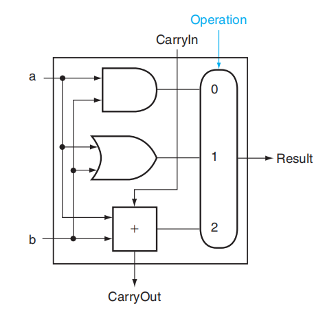
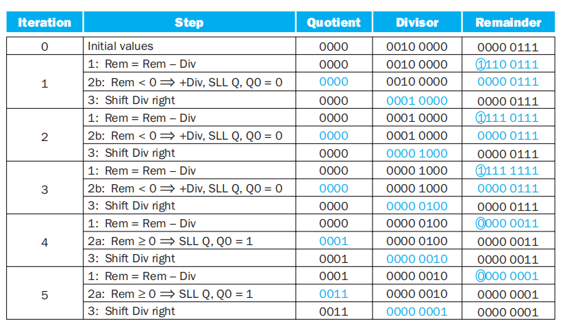
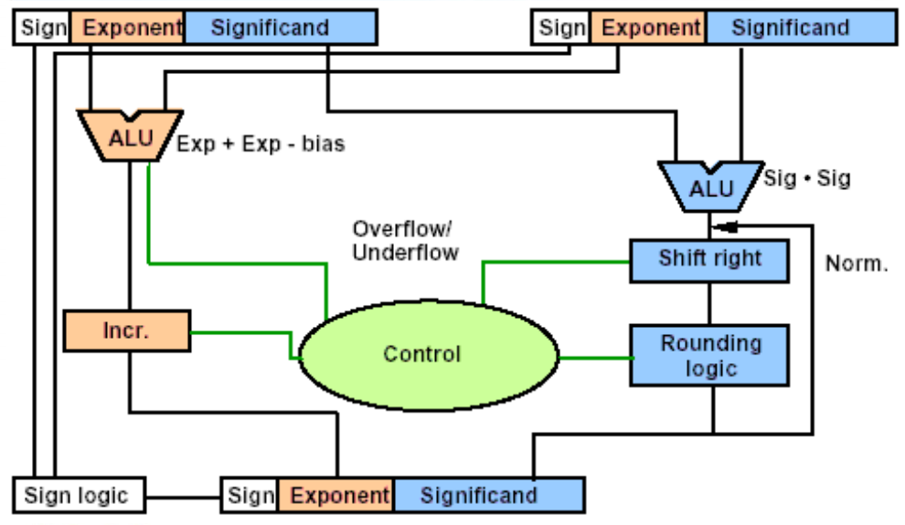

# Chap 3: Arithmetic for Computer

??? abstract "核心知识"

    - ALU
        - 基本功能、RISC-V指令的电路实现
        - 行波加法器 vs 超前进位加法器
    - 乘法
        - 各个版本下的乘法器及其执行流程
        - 符号数乘法
        - 并行乘法计算
    - 除法
        - 各个版本下的除法器及其执行流程
    - 浮点数
        - IEEE 754标准：浮点数的表示（符号位、指数、尾数）、单精度/双精度、有效位数、偏移码...
        - 浮点数加法（需要掌握）、浮点数乘法（大致了解即可）

    >~~个人感觉这章内容实际上是数逻组合逻辑电路部分的pro版。~~


!!! info "前提"

    这一章的开篇涉及到许多数逻部分的知识，如果有点忘记的话可以点开下面的链接去回顾一下。下面就当大家都明白这些东西了~

    - [数字体系](../dld/1.md#number-systems)
    - [组合电路设计 -> 算术运算相关部分](../dld/3.md#iterative-combinational-circuits)

## Overflow

在加法或减法的运算中，**溢出**(overflow)是我们常常会遇到的问题。下面总结一下（符号数的）溢出会/不会出现的情况：

- 加法
    - 不会溢出：两个符号不同的操作数相加
    - 可能会溢出：两个正数/两个负数的相加
- 减法
    - 不会溢出：两个符号相同的操作数相减
    - 可能会溢出：正数-负数->负数？ 负数-正数->正数？

溢出情况的表格总结：

<div style="text-align: center">
    
</div>

- 对于**无符号数**，我们会将“溢出”看作**进位**(carry)或**借位**(borrow)，因此计算机会将其视为一般情况而不做特殊处理
- 对于**符号数**，计算机提供了以下应对**溢出**的处理方式：
    - ALU检测到溢出问题
    - 处理器会抛出[异常](4.md#exceptions)(exception)或中断(interrupt)，将指令地址保存在特定的寄存器EPC上
    - 跳转到操作系统的特定例程：纠正程序、返回错误代码、或者中止程序

??? example "例题"

    === "题目"

        下列8位补码加法运算中，哪一个运算是既有溢出也有进位的？

        A. 0x12 + 0x34
        B. 0x12 + 0xEF
        C. 0x80 + 0x80
        D. 0x12 + 0x78

    === "答案"

        C

        分析：

        - A: 0x12 + 0x34 = 0x46，既没溢出也没进位
        - B: 0x12 + 0xEF = 0x01，没溢出但存在进位
        - C: 0x80 + 0x80 = 0x00，既有溢出也有进位
        - D: 0x12 + 0x78 = 0x8A，有溢出但没进位

具体的加减法由ALU来实现，下面我们将会从零开始搭建ALU\~

## Constructing a Basic ALU

**算术逻辑单元**(arithmetic logic unit, **ALU**)用于执行各种类型的算术（加、减等）和逻辑（与、或等）运算。由于RISC-V寄存器是64位宽的，因此我们需要设计64位宽的ALU。对于初学ALU的各位，先从学习1位的ALU的搭建开始吧！

### A 1-Bit ALU

我们希望这个1位的ALU能够实现：

- AND、OR运算 -> 1个与门和1个或门就可以搞定了

    <div style="text-align: center">
        
    </div>

    >注：中间这个圆角矩形代表多路选择器，Operation表示选择输入

- 加法运算 -> [全加器](../dld/3.md#full-adderfa)

    !!! hint "实现细节（图片摘自数逻笔记）"

        <div style="text-align: center">
            
        </div>

- 还要一个多路选择器(multiplexor)（在第一张图展示出来了），用于挑选其中一种运算

将它们组装起来，我们就可以得到一个最基本的1位ALU了！

<div style="text-align: center">
    
</div>

### A 64-Bit ALU

现在我们手边有了1位的ALU，要想构建一个64位的ALU，很自然的想法是：将这些1位ALU（可看作黑箱，此时我们并不需关心底层的实现细节）一个个串连起来，此时每个ALU的进位出(CarryOut)和下一个ALU的进位入(CarryIn)相连。这样的话，单个的进位就会从最低位一直传到最高位，因此我们把这种加法器称为[**行波加法器**](../dld/3.md#ripple-carry-adder)(ripple carry adder)，最终效果如下图所示：

<div style="text-align: center">
    
</div>

>正如数逻提到过的，这是一种**迭代电路**(iterative circuit)

---
在这个ALU的基础上，我们还可以添加更多的功能：

（1）实现**减法**操作

上过数逻课程的小伙伴们想必已经知道：

- 减去一个正数 = 加上对应负数的补码
- 负数的补码 = 它的反码 + 1
- 负数的反码 = 原码按位取反

所以只需要在原来ALU的基础上做一些小小的改变，我们便能实现减法操作了：

<div style="text-align: center">
    
</div>

可以看到，这里给输入B加了一个非门和一个MUX，并且新增一个输入`Binvert`，用于决定B是否应该按位取反（得到B的反码）。

---
（2）实现**或非(NOR)**运算。

由德摩根定律，$\overline{a + b} = \overline{a} \cdot \overline{b}$，所以只要让输入a像输入b一样能够选择取反，并配合与运算，就可以实现或非运算了：

<div style="text-align: center">
    
</div>

### Tailoring the 64-Bit ALU to RISC-V

对于一个RISC-V架构下的ALU而言，这样的设计还不够完善，因为还缺少一些常用指令的实现——接下来将补充set less than(`slt`)指令和branch if equal(`beq`)指令。

先来看`slt`指令：`slt rd, rs1, rs2`。它的功能是比较寄存器`rs1`和`rs2`的大小，若`rs1 < rs2`则`rd = 1`，否则`rd = 0`。为了增加这个功能，

- 首先得扩充MUX的输入脚，让它接受第4种指令的输入
- 然后，我们引入一个输入脚`Less`，让它直接与MUX的第4个输入脚相连，它的值便代表`slt`指令的返回值

<div style="text-align: center">
    
</div>


- 对于一个64位的ALU，我们只需要用到1个Less输入即可，因此除了第一位上的Less，让其余位对应的Less的值均为0
- 那么`Less`的值从何而来呢？我们将`a < b`的比较运算转化为`a - b < 0`的减法运算（减法运算已设计在ALU内），然后将减法结果的符号位传给`Less`就OK了，因为符号位的值正好对应`slt`指令的返回值
- 符号位产生于最高位的ALU，所以从最高位ALU中加法器的进位输出端口引出一条线`Set`，将它连接到最低位ALU的`Less`输入脚。下图展示的是最高位的ALU：

<div style="text-align: center">
    
</div>

- 为了处理溢出问题，还在最高位的ALU内专门添加一个**溢出侦测**(overflow detection)装置
- 最终的实现效果：

<div style="text-align: center">
    
</div>

---
再来看`beq`指令，它的功能是当两个寄存器的值相等时则跳转。ALU的实现步骤如下：

- 这里同样对两个数做减法来进行比较：两个数相减结果为0，表示两个数相等
- 最简单粗暴的方法是用一个很大的或非门，获取每一位上ALU的减法结果，若这个或非门的输出结果为1，表明减法的结果为0，即两个数相等

$$
\mathrm{Zero} = \overline{(\mathrm{Result63 + result62 + \dots + Result2 + Result1 + Result0})}
$$

- 也许各位读者早就发现：`Binvert`的值和`CarryIn`的值始终是一致的。所以可以将这两个输入并在一起，叫做`Bnegate`


最终版本的64位ALU逻辑电路图如下：

<div style="text-align: center">
    
</div>

对应ALU的功能表：

<div style="text-align: center">
    
</div>

为了简化电路的描绘，一般会用下面这个符号代表ALU：

<div style="text-align: center">
    
</div>

??? code "Verilog代码实现"

    ``` verilog
    module RISCVALU(ALUctl, A, B, ALUOut, Zero);
        input [3:0] ALUctl;
        input [63:0] A, B;
        output reg [63:0] ALUOut;
        output Zero;
        
        assign Zero = (ALUOut == 0);
        always @(*) begin
            case (ALUctl)
                0: ALUOut <= A & B;
                1: ALUOut <= A | B;
                2: ALUOut <= A + B;
                6: ALUOut <= A - B;
                7: ALUOut <= A < B ? 1 : 0;
                12: ALUOut <= ~(A | B);
                default: ALUOut <= 0;
            endcase
        end
    endmodule
    ``` 

??? hint "来自课件的ALU plus"

    这个ALU添加了更多的算术逻辑运算，但本质上还是一样的。

    <div style="text-align: center">
        
    </div>

    对应的功能表：

    <div style="text-align: center">
        
    </div>

??? info "补充说明"

    是不是忘了移位运算？实际上，在硬件设计中，移位的功能往往放在ALU外面的「桶式移位器」中，实现1-63位的移位运算所花时间与加法运算差不多。

### Fast Addition: Carry Lookahead

!!! warning "注意"

    下面讲到的“进位”一般指的都是CarryIn。

64位ALU的加法器（行波加法器）是通过64个1位ALU内的加法器串联而成的，因此加法的执行速度非常地慢——拿最高位的ALU来说，它的加法运算要从最低位的运算开始一直等待，直到前63位运算产生的进位传到最高位的ALU内。

所以，提升加法速度的关键在于：**让高位进位更快地传到高位加法器内**。下面将介绍一种将速度$O(N)$提升到$O(\log N)$的加法器：**超前进位加法器**(carry lookahead adder)。


??? failure "简单粗暴的实现方法"

    我们将当前位上的加法器的进位计算公式全部展开，尝试仅用ALU的两个操作数的前面几位，以及来自外部的进位（最低位的进位）表示该位产生的进位。因为这些量都是已知的，且不受前面加法器的影响，因此只需要$O(1)$的时间，加法器就能几乎在同一时间完成所有位上的加法运算。

    下面我们用$a_i$和$b_i$表示第$i(i \ge 0)$位（最低位为第0位）的两个操作数，$c_i$表示来自第$i-1$位，传入第$i$位的进位。

    $$
    \begin{align}
    c_1 & = (b_0 \cdot c_0) + (a_0 \cdot c_0) + (a_0 \cdot b_0) \notag \\
    c_2 & = (b_1 \cdot c_1) + (a_1 \cdot c_1) + (a_1 \cdot b_1) \notag \\
    & = (a_1 \cdot a_0 \cdot b_0) + (a_1 \cdot a_0 \cdot c_0) + (a_1 \cdot b_0 \cdot c_0) \notag \\
    & \quad + (b_1 \cdot a_0 \cdot b_0) + (b_1 \cdot a_0 \cdot c_0) + (b_1 \cdot b_0 \cdot c_0) + (a_1 \cdot b_1) \notag
    \end{align}
    $$

    可以看到，第2位的进位展开式就已经相当复杂了，更何况更高位的进位呢？所以设计这样的电路开销太大了，是不可行的！

超前进位加法器的实现借助**多层抽象**的概念。我们先来分析第一层的抽象：

第$i+1$位的进位有以下递推公式：

$$
\begin{align}
c_{i+1} & = (b_i \cdot c_i) + (a_i \cdot c_i) + (a_i \cdot b_i) \notag \\ 
& = (a_i \cdot b_i) + (a_i + b_i) \cdot c_i \notag
\end{align}
$$

将这个公式用于第2位的进位，得到：

$$
c_2 = (a_1 \cdot b_1) + (a_1 + b_1) \cdot ((a_0 \cdot b_0) + (a_0 + b_0) \cdot c_0)
$$

不难看到，有很多类似$(a_i \cdot b_i)$和$(a_i + b_i)$的项出现在公式内，它们分别被称为**生成项(generate)**$g_i$和**传播项(propagate)**$p_i$。因此进位公式还可以表示成以下形式：

$$
c_{i+1} = g_i + p_i \cdot c_i
$$

- 当$g_i = 1$时，$c_{i+1} = 1$，就好像$g_i$“产生”了一个进位，因此称$g_i$为**生成项**
- 而如果$g_i = 0, p_i = 1$，$c_{i+1} = c_i$，就好像$p_i$“传递”前一位的进位给当前的进位，因此称$p_i$为**传播项**

对应的逻辑电路图：

<div style="text-align: center">
    
</div>

将这一公式用于4位的加法进位上：

<div style="text-align: center">
    
</div>

从上面的式子中，我们可以总结出：对于当前位而言，如果生成项为1，或者前面的位上存在值为1的生成项且该生成项所在位到当前位之间的所有传播项均为1时，当前位的进位值为1，否则为0。

??? info "类比：水管系统"

    <div style="text-align: center">
        
    </div>

---
仅用一层抽象，我们可以在保持两级逻辑电路优势的同时，以较小的门成本实现4位加法进位的化简。但如果要继续扩展到更多的位，那就需要进一步的抽象设计。下面以16位加法器为例介绍更高层的抽象。

我们约定：

- 用$P_i$表示更高一级的传播项，它表示4个位上的4个$p_j$的乘积（与）
- 用$G_i$表示更高一级的生成项，它考虑4个位上的4个生成项的和（或），注意位数较低的生成项受到更高位的传播项的制约

??? info "还是水管系统的类比"

    上图表示$P_i$，下图表示$G_i$

    <div style="text-align: center">
        
    </div>

对于一个16位的加法器，我们用$p_j$和$g_j(0 \le j \le 15)$来展开$P_i$和$G_i(0 \le i \le 3)$：

<div style="text-align: center">
    
</div>

<div style="text-align: center">
    
</div>

最后，用$P_i$和$G_i$，以及最开始的进位$c_0$来表示4位一组的大进位$C_i$：

<div style="text-align: center">
    
</div>

!!! note "注"

    对于加法的进位，我们一般更在意**最后的进位**，因此中间产生的进位可以忽略。对于这个例子而言，我们无需关心$C_1$到$C_3$的实际内容，只需关注最高位的进位$C_4$（它的值正好等于$c_{15}$）

超前进位加法器的逻辑电路图：

<div style="text-align: center">
    
</div>

!!! note "行波加法器与超前进位加法器的速度比较"

    为了便于讨论，我们用数据（或者说信号）经过门的数量来估算时间（也被称为**门延迟**(gate delay)）。下面我们就16位加法器来比较两种加法器的速度

    - 行波加法器：进位值每经过一个加法器，就需要经过两个门电路，因此16位加法器就需要经过32个门电路
    - 超前进位加法器：在前面的分析中，我们知道这种加法器用到了两层抽象，每层抽象都是两级逻辑电路，外加$g_i$和$p_i$都用到了一个门，所以总共经过的门数量为2 + 2 + 1 = 5个 = $\log_2 32$个

    综上，后者的速度比前者快了6倍多。如果位数更多，超前进位加法器的优势还会更明显（~~遥遥领先 x~~）

??? info "其他快速加法器"

    - 跳跃进位加法器(carry skip adder)：~~课件上没详细展开，看起来也不像考点，过~~
    - 选择进位加法器(carry select adder)：也是几个位为一组，高位组暂时不管来自低位组的进位，它直接把进位0和1的情况都先算出来，然后再根据之后传上来的进位选择正确的计算结果（预测&冗余）

    !!! example "例子"

        <div style="text-align: center">
            
        </div>

        <div style="text-align: center">
            
        </div>


## Multiplication

乘法运算的实现原理就是我们小学时候学的竖式乘法，先来简单回顾一下（这里是二进制乘法，仅考虑0和1）：

- 如果当前乘数(multiplier)位置上的数字为1，那么就将被乘数(multiplicand)（乘积就是被乘数）复制到正确的位置上（因为乘数数位每上升一位，这个乘积就要往右移一位）
- 如果数字为0，那么就将0放在正确的位置上
- 如果被乘数为n位，乘数为m位，那么乘积的位数就是n+m位了

### Sequential Multiplication Hardware

#### V1

根据上面的乘法规则，我们设计出64位的乘法器：

<div style="text-align: center">
    
</div>

其中仅有乘数寄存器是64位，被乘数寄存器、ALU、乘积寄存器都是128位（因为在每一步的计算后，被乘数都需要向左移一位。因此在64次计算后，64位的被乘数被移动了64位，所以被乘数寄存器需要128位）

运算流程（包括加法、移位、比较等运算）：
    
<div style="text-align: center">
    
</div>

1. 检查乘数的最低位数字
2. 如果是1，就将被乘数加到乘积的寄存器内；如果是0，继续下一步
3. 将被乘数寄存器的值左移一位
4. 将乘数寄存器的值右移一位
5. 如果已经完成64次计算，完成整个乘法运算；否则的话回到第一步继续计算 


??? example "例子"

    <div style="text-align: center">
        
    </div>


!!! bug "V1乘法器的问题"

    - 如果每一步花费一个时钟周期，那么完成整个乘法运算需耗费200个时钟周期——太慢了！
    - 其中一个较为耗时的运算是128位的ALU加法运算，然而被乘数和被乘数都是64位的，只是因为被乘数要向左移，我们为被乘数寄存器多预留了64位，因而ALU也需要多留64位。


#### V2

我们的改进方案是：不移动被乘数，改为**移动乘积**，这样的话被乘数寄存器就可以只用64位，而且ALU也可以仅用64位，而乘积寄存器需要扩展到128+1位。此时的中间计算就是64位加法运算，有效提升了乘法运算速度。逻辑电路图如下所示：

<div style="text-align: center">
    
</div>

计算步骤：

1. 检查乘数的最低位数字
2. 如果是1，就将被乘数加到乘积的寄存器内的左半边；如果是0，继续下一步
3. 将乘数寄存器的值右移一位
4. 将乘积寄存器的值右移一位
5. 如果已经完成64次计算，完成整个乘法运算；否则的话回到第一步继续计算 

???+ question "为何乘积寄存器是129位而非128位？"

    当被乘数与乘积寄存器的值相加时可能产生**进位**，因此需要多出1位来存储这个进位（当然乘积的结果不会超过128位）。

#### V3

!!! bug "V2乘法器的问题"

    - 初始状态下，乘积寄存器只有左半边的值保存值，右半边的很多位在刚开始没有什么意义，也就是说乘积寄存器的空间利用率太低了
    - 每一趟循环中，乘数寄存器和乘积寄存器都需要往右移1位

改进措施：为了提高乘积寄存器的空间利用率，我们可以**将乘数放在乘积寄存器的右半边**。每一趟循环中，乘积寄存器里的所有位整体向右移一位，中间结果和乘数同时向右移一位。这样做的好处在于：

- 节省存储空间：少用一个64位的寄存器
- 加快运算速度：每趟循环中少了一次右移操作，提升了速度

逻辑电路图如下所示：

<div style="text-align: center">
    
</div>

计算步骤：

1. 检查乘数的最低位数字
2. 如果是1，就将被乘数加到乘积的寄存器内的左半边；如果是0，继续下一步
3. 将乘积寄存器的值右移一位
4. 如果已经完成64次计算，完成整个乘法运算；否则的话回到第一步继续计算 

??? example "例子"

    <div style="text-align: center">
        
    </div>

!!! note "注"

    如果一个数乘上2的n次幂，就相当于这个数左移n位，这时我们可以省略ALU的加法运算，直接进行移位运算即可。


### Signed Multiplication

较为简单的想法：

- 先存储两个操作数的符号位
- 将这两个操作数暂时转化为无符号数（令它们的最高位为0）
- 执行乘法运算
- 对两个符号位进行异或运算，得到乘积符号位（相同为0，不同为1）

---
更好的方法：[**Booth算法**](https://en.wikipedia.org/wiki/Booth%27s_multiplication_algorithm)。相比前面多次使用加法和移位操作实现的乘法运算，这种算法更侧重于使用**移位**运算——它对**乘数**(multiplier)做了一些变化，使得计算过程中仅涉及一次加法和一次减法。如果移位运算所需时间比加法运算少，那么这种方法的优势就比较明显了。这么说可能有点抽象，结合下面的例子理解就比较清楚了：

<div style="text-align: center">
    
</div>

再稍微展开点说，它的原理是：将乘数中出现一连串`1`的部分（形如`00..00111..1100..000`，假设连续的`1`出现在第i位和第j位之间（包括这两位））转为形如`1000...000 - 100...00`的减法（前者为i+j+1位，后者为j+1位）。这样的话原本乘数里有很多个`1`，现在就只有两个`1`了，与被乘数相乘的话，分别对应一个加法和一个减法，所以这个算法在速度上有了不错的提升（原本$O(n)$次加法运算降为$O(1)$次（减法也算作加法））。

然而，计算机可无法直接得到这种减法的形式，它通过判别相邻两位的数字来寻找合适的计算加减法的时机，下面是它的判别依据：

- `10`：发现（可能）一连串`1`的开端（低位），做**减法**
- `11`、`00`：移位
- `01`：发现（可能）一连串`1`的末端（高位），做**加法**
- 还要预留一个-1位，且初始化为$Bit_{-1} = 0$，便于最低位的判别。当进行右移运算时，原本最右边的数还会保留在-1位上，直至下一次右移运算

其他的说明：

- Booth算法可用前面讲到过的乘法器来实现
- Booth算法可以用于处理负数的乘法，且无需改变前面的规则便能实现。

???+ example "例子"

    <div style="text-align: center">
        
    </div>

    实现原理：Booth算法 + V3乘法器

### Faster Multiplication

另一种提升乘法速度的方法是提升加法的速度。下面的这个方法会用到很多的ALU，将这些ALU像倒立金字塔似的摆放着，分层地进行加法运算。对于64位的乘法而言，第1层用到32个ALU，每个ALU计算相邻2位的乘数分别与被乘数的乘积之和。这样得到的32个和在第二层的16个ALU中会被再一次汇总，如此下去，最终得到一个总的和。这样原本需要64次的加法时间，就缩短到$\log_2(64) = 6$次，速度得到明显的提升。这种方法体现了**并行**运算的思想。

<div style="text-align: center">
    
</div>

???+ info "RISC-V中的乘法指令"

    - `mul rd, rs1, rs2`：64位乘法，`rd`保存128位乘积的低64位
    - `mulh rd, rs1, rs2`：64位乘法，`rd`保存128位**符号数**之间的乘积的高64位
    - `mulhu rd, rs1, rs2`：64位乘法，`rd`保存128位**无符号数**之间的乘积的高64位
    - `mulhsu rd, rs1, rs2`：64位乘法，`rd`保存128位**无符号数与符号数**的乘积的高64位


## Division

除法运算的实现原理是数论里的[除法算法](../../math/dm/4.md#the-division-algorithm)（~~其实也是小学学过的~~）：

$$
\mathrm{Dividend} = \mathrm{Quotient} \times \mathrm{Divisor} + \mathrm{Remainder}
$$

64位除法器的逻辑电路图如下（长得和V1乘法器很像）：

<div style="text-align: center">
    
</div>

- 组成部分：
    - 128位除数(divisor)寄存器：初始状态下，64位的除数被存储在除数寄存器的**左半边**（由于我们不清楚被除数有多大，所以先将除数扩大很多倍，然后再慢慢缩小，最终找到合适的位数，因此除数寄存器的位数留的有点多）
    - 64位商(quotient)寄存器
    - 128位余数(remainder)寄存器：初始状态下，64位的**被除数**(dividend)被存储在余数寄存器的**右半边**（从低位开始存储）
    - 128位ALU
    - 控制器
- 运算流程：

    <div style="text-align: center">
        
    </div>

    1. 用余数寄存器的值减去除数寄存器的值，并将结果放在余数寄存器
    2. 将商寄存器里的值左移一位，然后检查余数寄存器内的值
        - 若其值$\ge 0$（看符号位（最高位）的数字），则将商寄存器最右端的位设成1
        - 若其值$< 0$，则将除数寄存器的值加到余数寄存器的值以撤销上一步的减法操作，并将商寄存器最右端的位设成0
    3. 将除数寄存器的值右移一位
    4. 如果上面的步骤已经重复了**65次**，中止整个流程，否则返回第一步

??? example "例子"

    用4位除法器计算除法：$(7)_D \div (2)_D$，或者$(0111)_B \div (0010)_B$

    <div style="text-align: center">
        
    </div>

### Improved Version

我们可以借鉴V1乘法器进化到V3乘法器的经验，将某几步操作放在一起进行（节省时间），并且让某些值共用一个寄存器（节省空间），以此提高除法器的性能。下面就是改进后的除法器的逻辑电路图：

<div style="text-align: center">
    
</div>

这个除法器有了以下的改进之处：

- 除法寄存器的位数降至64位，从而ALU的位数也降至64位，节省空间的同时提升了ALU做减法的计算速度
- 去掉了商寄存器，将**商**放在余数寄存器的**右半边**，而**左半边**用于存放**余数**
    - **初始**情况下由于没有算出商，因此余数（此时为**被除数**）暂时存在余数寄存器的**右半边**，之后会不断往左移
- 余数寄存器多出的1位，是为了间隔余数和商的值，防止计算的时候混淆
- 该除法器还减少了1次迭代过程

计算步骤为（仍是以64位除法器为例）：

1. 将被除数放在余数寄存器的右半边，然后将余数寄存器左移一位
2. ALU计算（余数寄存器的高64位 - 除数寄存器），将结果放在与余数寄存器的高64位上
    - 如果计算结果>0，余数寄存器左移一位，将1放入余数寄存器的最右端
    - 如果计算结果<0，则加上除数以撤销前面的减法操作，然后余数寄存器左移一位，将0放入余数寄存器的最右端
3. 若第2步已经执行过64次，则结束循环，否则继续执行第2步
4. 将余数寄存器的左半边右移一位，此时左半边存的是余数，右半边存的是商

!!! note "注"

    - 不难发现，V3乘法器与改进后的除法器从逻辑结构上看几乎没有区别，最大的区别在于它们控制信号的不同
    - 这个过程还是有些绕的（~~我自己就被绕晕了很多次~~），需要下功夫理解清楚，建议看下面给出的例子以加深理解

??? example "例子"

    还是计算$(7)_D \div (2)_D$，只不过用改进过的除法器：

    <div style="text-align: center">
        
    </div>

    不难发现，相比上面的例子，此时每次迭代过程中少进行一步操作（移动除数），从而提升了运算速度。

### Signed Division

使用类似符号数乘法运算的方法：先将被除数和除数的符号位提取出来，然后计算无符号除法，最后根据两个符号位决定商的符号位：如果两者相同，商的符号位为0，否则为1。

但较为麻烦的地方在于决定余数的值，简单来说它遵循以下规则：

- 余数的符号位同被除数的符号位
- 余数的绝对值不超过除数的绝对值

??? example "例子"

    <div style="text-align: center">
        
    </div>

### Fast Division

遗憾的是，我们不能像乘法运算那样，通过ALU的并行计算来提升除法速度，因为中间过程会用到很多减法运算，余数寄存器上的符号位是随时变化的，依赖于运算的顺序，所以只能在最后确定符号位，不能提前计算出来。

改进措施：[SRT Division](https://en.wikipedia.org/wiki/Division_algorithm#SRT_division)，在每一趟循环中尝试预测多个可能的商（个人认为类似前面提到过的选择进位加法器）

!!! warning "注意"

    RISC-V会忽视除法运算过程中出现的溢出和除以0的问题，一般由软件决定怎么处置这两类异常情况。


???+ info "RISC-V中的除法指令"

    - `div rd, rs1, rs2`：`rd`保存符号数除法的商
    - `divu rd, rs1, rs2`：`rd`保存无符号数除法的商
    - `rem rd, rs1, rs2`：`rd`保存符号数除法的余数
    - `remu rd, rs1, rs2`：`rd`保存无符号数除法的余数


## Floating Point Numbers

### IEEE 754 Floating-Point Standard

下面对浮点数的规定来自于[**IEEE 754**](https://en.wikipedia.org/wiki/IEEE_754)标准，而RISC-V的浮点数便采用这一标准。该标准提升了浮点数程序的可移植性，并且保证了算术运算的质量。

在接下来的讨论中，我们统一使用**科学计数法**(scientific notation)表示**浮点数**，在这种表示法下小数点左边只有1位数字。如果小数点左边的数字不是0，那么称这种数为**规范化数**(normalized number)。

二进制的规范化数形如下面的数字：

$$
1.xxxxxxxxx_{\mathrm{two}} \times 2^{yyyy}
$$

使用科学计数法的好处在于：

- 简化交换浮点数数据的过程
- 简化浮点数的算术运算
- 提升存储数字的精度

浮点数表示法由三部分组成：符号$S$、**指数**(exponent)$E$、**尾数**(fraction)$F$。其中指数和尾数分别指定了浮点数的范围和精度。由于数据宽度是固定的，因此需要权衡好指数与位数的大小，即权衡好浮点数的范围和精度。用符号化的语言可以将浮点数表示为：

$$
(-1)^S \times F \times 2^E
$$

浮点数的表示形式（这种表示法被称为*sign and magnitude*）：

- 单精度（`float`）

    <div style="text-align: center">
        
    </div>

    - 范围：$2.0_{\mathrm{ten}} \times 10^{-38} \sim 2.0_{\mathrm{ten}} \times 10^{38}$
        - 根据偏移码的知识（后面马上会讲的），实际上单精度浮点数的指数取值范围为$[-126, 127]$（最低的-127和最高的128被保留了无法使用），那么$\pm 1.0 \times 2^{-126} \approx \pm 1.2 \times 10^{-38}, \pm 2.0 \times 2^{127} \approx \pm 3.4 \times 10^{38}$
    - 精度：23位尾数 $\approx$ 6位十进制数

- 双精度（`double`）

    <div style="text-align: center">
        
    </div>

    >注：教材上给出的图片是错误的（指数位多了一位），这张图是我P过的

    - 范围：$2.0_{\mathrm{ten}} \times 10^{-308} \sim 2.0_{\mathrm{ten}} \times 10^{308}$
        - 根据偏移码的知识，实际上单精度浮点数的指数取值范围为$[-1022, 1023]$（最低的-1023和最高的1024被保留了无法使用），那么$\pm 1.0 \times 2^{-1022} \approx \pm 2.2 \times 10^{-308}, \pm 2.0 \times 2^{1023} \approx \pm 1.8 \times 10^{38}$
    - 精度：52位尾数 $\approx$ 16位十进制数    
    
不难发现，二进制下的非零规范化数的小数点左边那一位一定是1，因此为了存储更多的数字，我们就省去这个1（称为**hidden 1**），并将这一位的空间挪出来给尾数用（即单精度浮点数的尾数增至24位，双精度浮点数的尾数增至53位）。实际上用于表示浮点数的尾数位被称为**有效数字**(significand)（不包括低位的一串0和省去的1）。于是我们可以这么表示一个浮点数：

$$
(-1)^S \times (1 + \mathrm{Fraction}) \times 2^E
$$

其中$\mathrm{Fraction}$是一个位于0-1之间的数，如果我们假定它的每一位分别为$s_1, s_2, s_3, \dots$，那么又可以表示为：

$$
(-1)^S \times (1 + (s_1 \times 2^{-1}) + (s_2 \times 2^{-2}) + (s_3 \times 2^{-3}) + \dots) \times 2^E
$$

之所以RISC-V会按照符号、指数、尾数的顺序存储浮点数，其中一个原因是为了方便浮点数的比较或排序：先比较符号位，再比较指数，最后比较尾数，这样的比较顺序符合我们的直觉。但正数和负数之间的比较就比较麻烦了：如果用补码表示指数位，那么负数的指数看起来就比正数的指数大很多（负数符号位，即最高位为1），比较起来就没那么直接了。

因此，IEEE 754标准引入了**偏移标记法**(biased notation)的概念，使得最小的指数（负数）对应$00 \dots 00_{\mathrm{two}}$，最大的指数对应$11 \dots 11_{\mathrm{two}}$，这样就可以直接做无符号数的比较，便于计算机处理。

- 偏移值的计算公式：$\text{Bias} = 2^{\text{Number of Exp bits } - 1} - 1$
- 单精度浮点数的偏移值$\mathrm{Bias}$为127，双精度浮点数的偏移值$\mathrm{Bias}$为1023
- 现在浮点数表示成如下形式：

$$
(-1)^S \times (1 + \mathrm{Fraction}) \times 2^{\mathrm{Exponent - Bias}}
$$

??? example "例题"

    === "问题"

        <div style="text-align: center">
            
        </div>


    === "答案"

        <div style="text-align: center">
            
        </div>


异常情况的处理：

- **溢出**：虽然浮点数表示的范围很大，但还是可能会出现这一情况。在浮点数中，溢出分为**上溢**(overflow)和**下溢**(underflow)，分别表示浮点数的<u>正指数过大</u>或<u>负指数过小</u>的情况。具体处理方法在[前面](#overflow)已经提到过了，这里便不再赘述
- **NaN**(Not a Number)：表示**未定义的**(undefined)或**非法的**(illegal)结果，比如：
    - 任何涉及NaN的运算结果
    - 不定式（无穷之间的运算、无穷与0的运算）：
        - 除法运算：0/0、$\infty$/$\infty$、$\infty$/($-\infty$)、($-\infty$)/$\infty$、($-\infty$)/($-\infty$)
        - 求余运算：任意值 % 0、$\infty$ % 任意值
        - 乘法运算：0$\times \infty$、0$\times -\infty$
        - 加法运算：$\infty$ + (−$\infty$)、(−$\infty$) + $\infty$
        - 减法运算：$\infty$ - $\infty$、($-\infty$) - ($-\infty$)
        - 指数运算：$0^0$、$\infty^0$、$1^\infty$、$\infty^-\infty$
    - 产生复数结果或无意义的实数运算，比如对负数开偶次方根、对负数进行对数运算等

!!! warning "注意"

    虽然在数学中，任何数除以0的结果是未定义的，但是在IEEE 754标准下，这个结果被定义为$\infty$或$-\infty$，不要搞错了！

IEEE 754标准下的浮点数的编码形式：

<div style="text-align: center">
    
</div>

??? info "补充：半精度浮点数"

    [半精度浮点数](https://en.wikipedia.org/wiki/Half-precision_floating-point_format)是16位的浮点数，它同样来自IEEE 754标准，它的组成部分为：

    - 最高位仍然是**符号位**S
    - 中间5位是**指数位**E
    - 低10位是**尾数位**F
    - 偏移码(bias)为$2^{5-1} - 1 = 15$

    能够表示的数的范围：$\pm 1.0 \times 2^{-14} \sim \pm 2.0 \times 2^{15}$

实用工具：[IEEE 754浮点数转换器](https://www.h-schmidt.net/FloatConverter/IEEE754.html)


### Floating-Point Addition

下面是浮点数加法的流程图：

<div style="text-align: center">
    
</div>

1. **对齐**(alignment)：比较两个数的指数部分，将指数较小的数的尾数部分往右移（对应地，指数部分就会增大），直到两个数指数部分相同为止
2. **相加**(addition)：将两个数的有效数字(significand)相加
3. **规范化**(normalization)：使结果规范化（见前面“规范化数”的定义），可以通过右移尾数来增加指数，或者左移尾数来减小指数的方式实现
>注：前往下一步之前还要判断一下数字是否溢出，如果是的话抛出异常，否则继续下一步

4. **舍入**(rounding)：如果舍入后结果变得不规范，则需要返回到第3步再做调整，否则的话计算完成


对应的逻辑电路图如下所示（仅做了解即可）：

<div style="text-align: center">
    
</div>

??? example "例题"

    === "十进制"

        === "问题"

            计算$9.999_{\mathrm{ten}} \times 10^1 + 1.610_{\mathrm{ten}} \times 10^{-1}$

        === "答案"

            <div style="text-align: center">
                
            </div>     

    === "二进制"

        === "问题"

            计算$0.5_{\mathrm{ten}} + (-0.4375_{\mathrm{ten}})$

        === "答案"

            <div style="text-align: center">
                
            </div>   

### Floating-Point Multiplication

下面是浮点数乘法的流程图：

<div style="text-align: center">
    
</div>

1. 将两个带偏移量的指数相加（偏移量算了两次），并减去多算的一个偏移量
2. 有效位数相乘
3. 如有必要，使乘积规范化；如果有溢出，抛出异常并中止程序，否则继续下一步
4. 对有效数字四舍五入，如果结果不规范，需要回到第3步再次调整，否则继续下一步
5. 如果两个操作数的符号位相同，乘积的符号位为正；否则乘积的符号位为负。完成计算

对应的逻辑电路图如下所示（仅做了解即可）：

<div style="text-align: center">
    
</div>

??? example "例题"

    - 例1：教材$P_{201, 203}$
    - 例2：教材$P_{205-206}$

### Accurate Arithmetic

为了提高舍入的精度，IEEE 754标准规定为浮点数额外添加低2位，从左到右分别称为**guard**和**round**，这两位数字保留了浮点数计算的中间过程，从而尽可能地避免精度上的损失。

>还可以再额外添加第3位，称为**sticky**。

!!! example "例子"

    === "例1"

        左图使用了guard和round，右图没有使用这两位数字

        <div style="text-align: center">
            
            
        </div>

        由于规定有效位数为3位，因此前者的最终计算结果为2.37，从而可以看出guard和round确实能够提升浮点数计算的精度。

    === "例2"

        === "题目"

            <div style="text-align: center">
                
            </div>

            摘自作业题，这题可以很好地检测各位对浮点数及其加法运算的理解。

        === "答案"

            <div style="text-align: center">
                
            </div> 


最后一位上的单位值(unit in the last place, **ulp**)：看不太懂，就引用了原文...

>The number of bits in error in the least significant bits of the significant between the actual number and the number that can be represented.

---
IEEE 754标准还提供了四种舍入模式(rounding mode)：

- 向上取整
- 向下取整
- 截断取整
- 舍入至最近的偶数(round to nearest even)

下图用具体的数据展示这四种不同的模式（图片来自[xyx前辈的笔记](https://xuan-insr.github.io/computer_organization/3_arithmetic/#344-%E7%B2%BE%E7%A1%AE%E7%AE%97%E6%9C%AF)）：

<div style="text-align: center">
    
</div>

??? info "浮点数相关的RISC-V汇编操作数&指令（仅做了解）"

    <div style="text-align: center">
        
    </div>


## Fallacies and Pitfalls

!!! failure "谬误"

    - 将一个数右移就相当于对这个数整除以2
        - 这个结论对于无符号数是成立的，但是对于符号数，如果整体向右移一位，符号位也会跟着右移，那么最高位就会变成0，导致负数变成了正数
        - 解决方法：右移符号位1的时候，符号位左边的数均为1，这样保证结果仍然是一个负数（符号扩充）

    - 适用于整数的并行计算也同样适用于浮点数
        - 请注意：由于浮点数在计算过程中精度可能会损失，所以结合律(associative)是无效的，即对于浮点数$a, b, c$，$c + (a + b) \ne (c + a) + b$

        ??? example "例子"

            （这里第二个式子等号左边的括号位置错了！）

            <div style="text-align: center">
                
            </div>

            可以看到，使用结合律后，计算结果就完全不一样了

        - 并行计算的实现依赖于结合律，因此浮点数无法进行并行计算