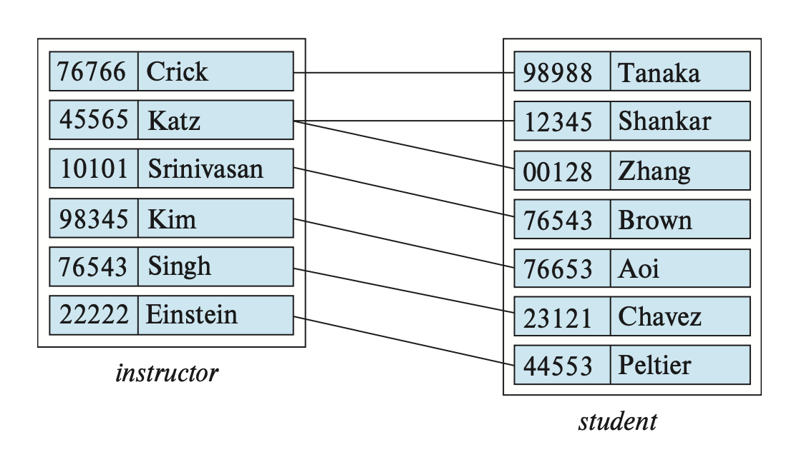
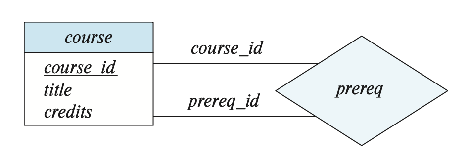
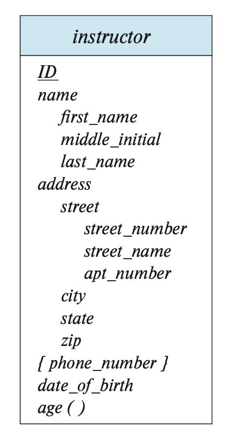
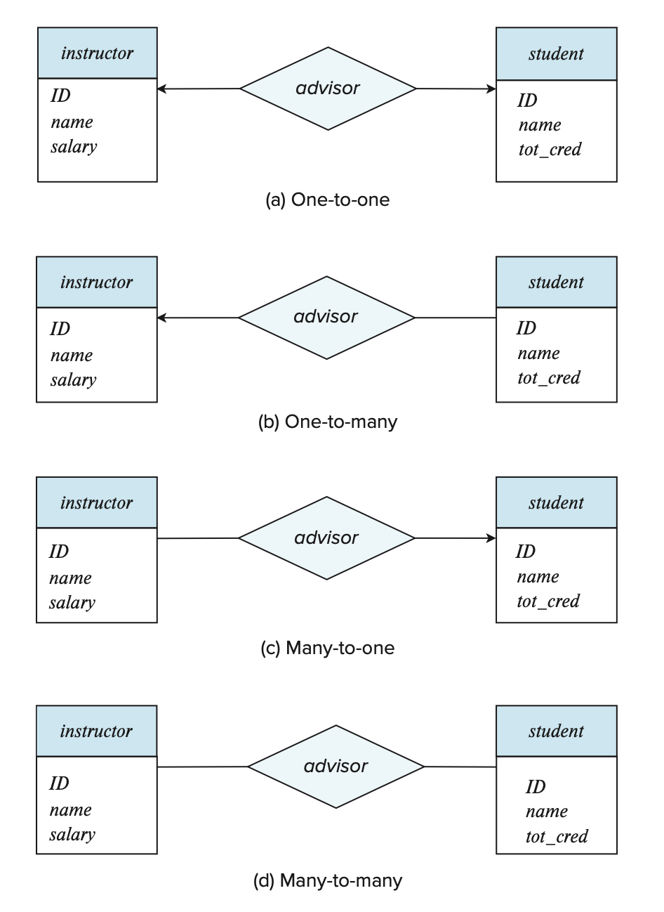
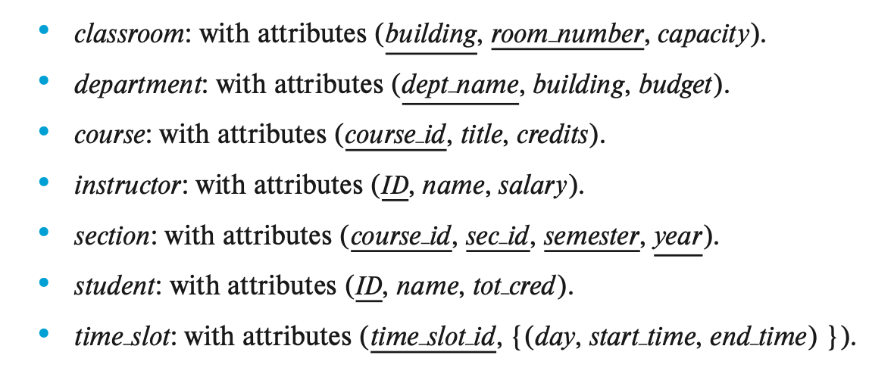
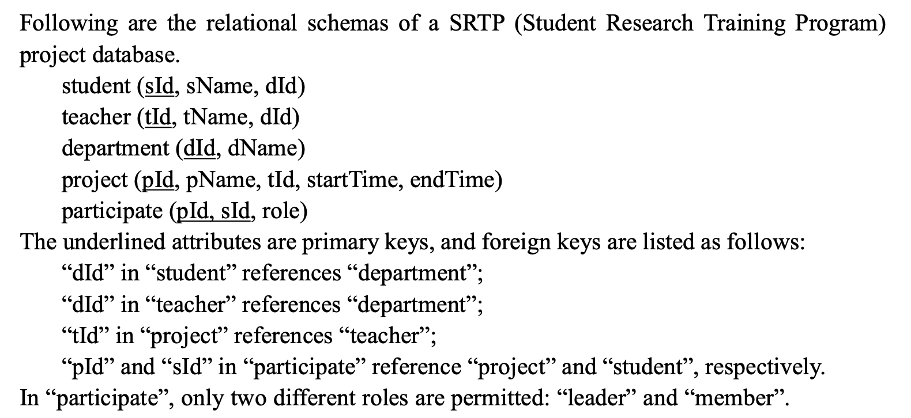
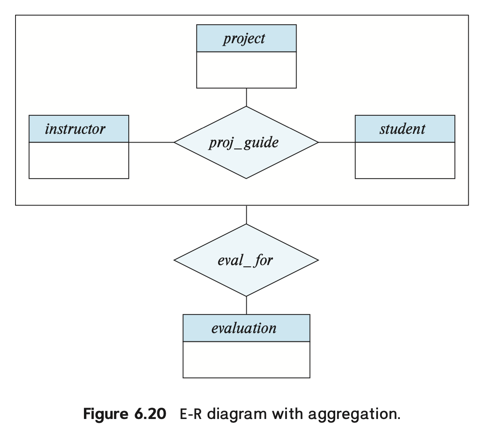

# Lec 6: Database Design Using the E-R Model

??? abstract "核心知识"

    需要掌握 E-R 图的概念和画法，包括：

    - 实体集、联系集
    - 复杂属性
    - 映射基数
    - 主键
    - 强/弱实体集
    - 特化、泛化、继承
    - 其他零碎的点...

## Overview of the Design Process

创建一个完整的数据库应用程序包含三部分：

- 设计数据库模式
- 设计能够访问和更新数据的程序
- 设计用于控制访问数据的安全模式

本章着重介绍第一个部分，即数据库模式的设计。

### Design Phases

对于小型的数据库应用，可能只需要创建一些关系，以及相应的属性和约束就 OK 了（直接用我们之前学过的知识）。但是在实际的应用开发中，情况往往是很复杂的，很难用直接用关系表现出来。因此，数据库设计者们会遵循以下步骤来获取用户需求，并将这些需求从高层的数据模型转换为底层的系统实现：

- 首先需要将数据库用户（或领域专家）的数据需求用符号化的语言表述，结果得到一份用户需求的具体规范，这里假定以文本形式呈现。
- **概念设计**(conceptual design)：选择一个数据模型，将需求转换为数据库的概念模式。
    - 之后的章节中，我们采用**实体-联系模型**(entity-relationship model)这一数据模型，所以概念模式需要指明实体、属性、联系和约束等。最终呈现的结果可以是一个实体-联系图。
    - 设计好之后需要再次检查，确保满足用户的数据需求，并且不存在任何冲突，还应该去除重复的功能。
    - 这一步只需专注于如何描述数据及其关系，无需关注物理存储上的细节
- **功能需求规范**(specification of functional requirement)：包含用户需要对数据执行的操作（或事务），比如增删查改等等。
- 最后需要将抽象的数据模型转换为数据库的具体实现，这里分两步走：
    - **逻辑设计**：将高层的概念模式映射到数据模型的具体实现，这里的“数据模型”就是我们前面所学的**关系数据模型**。
    - **物理设计**：指明数据库的物理功能，包括文件组织形式、索引结构等等。
    - 物理模式的改变相对容易，但逻辑模式的改变就比较麻烦，因此在设计的时候需要格外小心！

### Design Pitfalls

在设计数据库模式时，我们应避免掉入以下陷阱：

- **冗余**(redundancy)：包含重复信息。它带来最大的问题是如果没有更新完所有信息的拷贝，那么就会导致这些拷贝信息的**不一致性**(inconsistent)。
- **不完整**(incompleteness)：一种使某些数据难以或不可能表示的不良设计。虽然这些无法表示的数据可以用空值填充，但这种做法不受欢迎，且可能因主键约束而无法实现。

避免上述的不良设计是不够的，我们还应追求良好的数据库模式设计，这需要我们同时兼具科学素养（你学的数据库知识）和良好的“品味”（来自经验）。

## The Entity-Relationship Model

**实体-联系模型**(entity-relationship model)能够将现实应用中的内涵和交互映射到一个概念模式上。它包含了以下三个基本概念：**实体集**、**联系集**和**属性**。E-R 模型的图形化表述就是一张简单而清晰的 **E-R 图**。

### Entity Sets

**实体**(entity)是现实世界中能够与其他对象区分开来的一个对象。一个实体会有一组特性，我们可以用某些特性的值来识别唯一的实体。实体可以是具体的，也可以是抽象的。

相同类型（共享相同的特性或属性）的一组实体构成了一个**实体集**(entity set)。在数据建模的过程中，我们往往将实体集看作是一个抽象的概念，它不止带任何一组具体的实体；而一组具体的实体则被称为**扩展**(extension)。实体集可以相交，也就是说一个实体可以同时被多个实体集包含。

一个实体往往有一组**属性**(attributes)，即一组描述性的特性。实体集中的某个属性反映了这些实体具有某些相似的信息，但每个实体都有一个单独的属性值。目前我们仅考虑**简单的**(simple)属性，即不可被分割的属性（下一节会介绍复合(composite)或多值(multivalued)属性）。

总结一下：一个数据库包含一组实体集，每个实体集包含若干个相同类型的实体。

在 E-R 图中，我们用**矩形**(rectangle)表示实体集，这个矩形被分为两部分：上半部分有一个实体集的名称；下半部分则包含了所有属性的名称。

    

### Relationship Sets

- **联系**(relationship)：多个（两个及以上）实体之间的关联(association)
- **联系集**(relationship set)：一组相同类型的联系
    - 一组特定的实体集之间可能会包含多个联系集
    - 例子（整张图是一个联系集）：

    

        
    

    - 大多数联系集都是**二元联系集**(binary relationship set)，即包含两个实体集的联系，但有时也存在**三元联系集**(ternary relationship set)或包含更多实体集的联系。我们称参与到某个联系集的实体集个数为该联系集的**度**(degree)

- **联系实例**(relationship instance)：一个表示多个具名实体的关联

在 E-R 图中，我们用**菱形**(diamond)表示一个联系集，并且从这个菱形出发，用**线条**(line)连接一些实体（矩形），如下图所示：

    

>非二元联系集也可以很容易地用 E-R 图表示出来。

下面我们用形式化的数学语言定义“联系集”——它是一个在 $n$ 个实体集（$n \ge 2$，且允许存在重复实体）$E_1, E_2, \dots, E_n$ 上的关系(relation) $R$，是以下集合的子集：

$$
\{(e_1, e_2, \dots, e_n)\ |\ e_1 \in E_1, e_2 \in E_2, \dots, e_n \in E_n \}
$$

其中 $(e_1, e_2, \dots, e_n)$ 是一个联系实例。

我们可以用“**参与**(participation)”一词表示实体集之间的关联，即：$E_1, E_2, \dots, E_n$ **参与到**(participate)联系集 $R$。

某个实体在一个联系中起到的作用称为该实体的**角色**(role)。当联系集中包含多个相同的实体集时，这种定义的作用能被更好地体现出来，因为同一个实体在同一个联系扮演的“角色”可能是不同的。有时我们称这样的联系集为**递归**(recursive)联系集，在这样的联系集中需要显式表指出实体的角色名。在 E-R 图中，我们需要将角色名标注在连接矩形和菱形的线条上。

???+ example "例子"

    

        
    

    我们定义了一个递归联系集 prereq，它关联了两个相同的实体集 course，而且是靠实体集中相同的属性 course_id 连接起来的。但由于另一个 course_id 用于表示前置课程，所以我们用 prereq_id 这一角色名表示这个 course_id。

联系也可能有一组属性，被称为**描述属性**(descriptive attributes)，在 E-R 图中用一个单独的矩形表示，并且用虚线与菱形相连，如下图所示（注意 grade 才是属性，其他矩形表示的是实体集）：

    

在上图中，我们没有将实体集的属性名标出来，这是因为对于复杂的 E-R 图，用一张图片难以完全表示出来，需要分为多张图片，那么一个实体集可能会出现在多张图中。我们建议仅在实体集第一次出现的时候标出属性名，之后出现时就无需标出属性名，这样可以避免信息的重复，以及随后更新可能导致的不一致性（只改了某些图上实体集的属性，忘改了其他图上实体集的属性）。

## Complex Attributes

每个属性都有一组被允许的值，称为该属性的**域**(domain)或**值集**(value set)。

E-R 模型中的属性可以有以下不同的类型：

- **简单**(simple)属性和**复合**(composite)属性
    - 简单属性：无法被进一步划分的属性
    - 复合属性：可以被进一步划分为多个子部分（属性）的属性
        - 举例：name 属性可以被进一步划分为 first_name, middle_initial, last_name 这三个属性，因此是一个复合属性
        - 如果用户希望在某些场合使用完整的属性，而在另一些场合使用这个属性的某个部分，那么使用复合属性更加合适
        - 复合属性将相关的属性组合起来，使得建模更加清楚
        - 复合属性也可以以**层级**(hierarchy)的形式表现，如下所示：

        

            
        

- **单值**(single-valued)属性和**多值**(multivalued)属性
    - 单值属性：只有一个值的属性
    - 多值属性：可包含0个或多个值的属性
- **派生**(derived)属性：该属性会从别的属性或实体中派生得到值

下面的 E-R 图表示了复合属性、多值属性和派生属性：

    

- 复合属性：对应的组件属性会紧放在复合属性的下方，并且开头有缩进
- 多值属性：被花括号包裹
- 派生属性：末尾有圆括号

属性的 null 值在不同的情况下有不同的含义：

- **不适用**(not applicable)：某个实体不存在这个属性值
- **遗失**(missing)：某个实体存在这个属性值，但我们没有得到相关的信息
- **未知**(unknown)：我们不清楚属性值是否存在

## Mapping Cardinalities

**映射基数**(mapping cardinalities)是指一个实体通过联系集能够关联其他实体的数量，在描述二元联系集的时候是最有用的。映射基数可以作为对联系的一种约束。

有以下几类映射基数（假设在实体集 $A, B$ 之间有一个联系集 $R$）：

- **一对一**(one-to-one)：$A$ 中的一个实体*最多*关联 $B$ 中的一个实体，且 $B$ 中的一个实体*最多*关联 $A$ 中的一个实体
- **一对多**(one-to-many)：$A$ 中的一个实体可以关联 $B$ 中任意数量的实体，但 $B$ 中的一个实体*最多*关联 $A$ 中的一个实体
- **多对一**(many-to-one)：$A$ 中的一个实体*最多*关联 $B$ 中的一个实体，但 $B$ 中的一个实体可以关联 $A$ 中任意数量的实体
- **多对多**(many-to-many)：$A$ 中的一个实体可以关联 $B$ 中任意数量的实体，且 $B$ 中的一个实体可以关联 $A$ 中任意数量的实体

下面四张图分别表示这四类映射基数：

    

---
在 E-R 图中，我们用带箭头（->）或没带箭头（——）的线条表示联系中的基数约束，如下所示：

    

- **一对一**：从联系集出发，两根带箭头的线条指向全部实体集
- **一对多**、**多对一**：从联系集出发，带箭头的线条指向联系中“一”那一侧的实体，另一侧的实体则用不带箭头的线条连接
- **多对多**：从联系集出发，两根不带箭头的线条指向全部实体集

---
如果实体集 $E$ 中的所有实体至少参与到联系集 $R$ 中的一个联系，那么称 $E$ **完全**(total)参与到 $R$ 中。而如果存在某些实体没有参与到 $R$ 中的任何联系，那么称 $E$ **部分**(partial)参与到 $R$ 中。

在 E-R 图中，我们用双线条表示完全参与，如下所示：

    

在 E-R 图中，我们还可以指明更为复杂的约束——可以在线条上标注 l..h，其中 l, h 分别表示最小和最大基数。如果 h = *，表明没有最大限制；若 l = h = 1，则表示的是一对一的关系。

    

???+ abstract "总结"

    |        | 单线 | 双线 |
    | :----: | :--: | :--: |
    |  箭头  | 0..1 | 1..1 |
    | 无箭头 | 0..* | 1..* |

??? example "例子"

    === "题目"

        

            
        

    === "解答"

        

            
        

## Primary Key

类似前面介绍的关系数据模型，在 E-R 模型中我们也需要用**主键**(primary key)来区分实体集中的实体，以及联系集中的联系。

### Entity Sets

我们可以用实体中的一组属性来区分实体集中的不同实体，而那些能够用来识别唯一实体的一组属性称为**键**(key)。实际上，关系模式中那些关于键的概念（包括超键、候选键和主键）都可以直接用在实体集中。

### Relationship Sets

令 $R$ 是包含实体集 $E_1, E_2, \dots, E_n$ 的联系集，$primary-key(E_i)$ 表示 $E_i$ 的主键，并假设所有主键的属性名都是唯一的。$R$ 的主键的组成取决于和 $R$ 关联的那些属性：

- 如果没有与 $R$ 关联的属性，那么

    $$
    primary-key(E_1) \cup primary-key(E_2) \cup \dots \cup primary-key(E_n)
    $$

    能表示 $R$ 中唯一的联系

- 如果存在与 $R$ 关联的属性 $a_1, \dots, a_m$，那么

    $$
    primary-key(E_1) \cup primary-key(E_2) \cup \dots \cup primary-key(E_n) \cup \{a_1, a_2, \dots, a_m\}
    $$

    能表示 $R$ 中唯一的联系

如果主键的属性名不唯一，那么需要对这些重名属性进行重命名操作，命名规则为：`实体集名.属性名` 或 `角色名.属性名`（如果存在重复的实体集）。

由于联系集由一组联系实例构成，而每个实例能根据参与到联系的实体被唯一识别，因此无论在上述的哪种情况下，属性组：

$$
primary-key(E_1) \cup primary-key(E_2) \cup \dots \cup primary-key(E_n)
$$

足以构成联系集的**超键**。

而主键的选择还取决于**映射基数**：

- 多对多：上述超键即为主键
- 一对多、多对一：将“多”那一侧的实体集的主键的作为整个联系集的主键
- 一对一：任一实体集的主键均可作为联系集的主键

---
对于非二元联系，如果没有提供基数约束，那么上述超键就是唯一的候选键，即为主键。但如果有基数约束的话，情况就会变得很复杂。我们约定：<u>E-R 图中每个联系集只允许有一条带箭头的线条</u>。因为在非二元联系中，如果有多个带箭头的线条，那么我们可以对同一个联系进行多种解读，如下面的例子所示：

??? example "例子"

    

        
    

### Weak Entity Sets

有时，我们会遇到这样一种情况：某个实体集包含了另一个实体集的属性，用于隐式表明两者的联系；但同时两者之间也有一个显式指明的联系集——这样的话就会带来信息**冗余**的问题。

- 一种解决方法是直接删掉联系集，仅保留实体集之间的隐式联系，但这样的“隐式联系”并不是我们所希望的。
- 另一种方法是不让这个实体集包含另一个实体集的属性（实际上该属性并未从关系模式中删除，原因之后分析），但这样做可能导致这个实体集无法通过剩余属性被唯一表述出来，<u>它的存在依赖于这个联系集以及另一个实体集</u>。我们称这样的实体集为**弱实体集**(weak entity set)，而另一个实体集称为**识别实体集**(indentifying entity set)。
    - 我们会用识别实体集的主键，以及一些额外的属性来识别唯一的弱实体，这些属性统称为**判别属性**(discriminator attributes)
    - 不是弱实体集的实体集就是**强实体集**(strong entity set)
    - 而**识别联系**(indentifying relationship)是一个从弱实体集到识别实体集的多对一的联系，且弱实体集**完全参与**到该联系中。注意识别联系不应该有任何描述属性，因为这样的属性会和弱实体集关联起来

在 E-R 图中，我们用一个双层的矩形表示一个弱实体集，并且其判别属性用虚线下划线标识；用一个双层的菱形表示一个识别联系（联系弱实体集和识别实体集）。

    

观察上图，可以发现：

- 由于弱实体集完全参与到联系集中，所以用到了双线条
- 并且因为弱实体集和识别实体集是一个多对一的联系，所以有一个指向识别实体集的箭头

弱实体集也可以参与到其他的联系集中，而且可能作为其他识别联系集中的识别实体集。所以某个特定的弱实体集可能需要根据一组来自不同识别实体集的实体被识别出来，而它的主键则包含了这些识别实体集的主键的并集，加上弱实体集自己的判别属性。

## Removing Redundant Attributes in Entity Sets

在设计 E-R 模型时，一旦确定了实体及其属性，那么这些实体的联系集也随之形成。而这些联系集可能存在冗余的（已经在实体集中出现过了），需要被移除的信息。假如现在有两个实体集 $E_1, E_2$，它们之间通过某个属性 $a$ 构成了一种联系。而这两个实体集均有这个属性 $a$，但在 $E_1$ 中这个属性是一个主键，那么为了避免冗余的出现，我们需要将 $E_2$ 中的 属性 $a$ 移除。这样做看似违背直觉，但是当我们将这两个实体集看作一个整体（联系）时，我们能更加明白为何要删除属性 $a$。

在[前面](#design-pitfalls)我们提醒过，好的 E-R 模型设计不应该包含冗余属性。

??? example "例子"

    下面是一组来自大学数据库的实体集和联系集：

    

        
    

    

        
    

    可以看到，它们之间不存在任何的冗余信息。

    对应的 E-R 图如下所示：

    

        
    

## Reducing E-R Diagrams to Relational Schemas

无论是 E-R 模型，还是关系数据模型，都是对现实问题的抽象的、逻辑的表示。接下来，我们探讨如何用关系模式来表示 E-R 模式，以及如何将 E-R 设计中的约束映射到关系模式的约束上。

### Strong Entity Sets

令 $E$ 为一个强实体集，仅包含描述属性 $a_1, a_2, \dots, a_n$。并且我们用一个有 $n$ 个不同属性，且同样称为 $E$ 的模式来表示这个实体。那么模式中某个关系的每个**元组**对应着实体集 $E$ 中的一个**实体**，而实体集中的**主键**仍然作为模式的**主键**。

假如强实体集有非简单属性，情况就变得更为复杂：

- 对于**复合属性**，我们需要为每个组件属性创建一个单独的属性，但不需要为复合属性本身创建属性
- 对于**多值属性**，需要为这些属性创建新的关系模式
    - 假设有多值属性 $M$，我们为其创建一个关系模式 $R$，它有一个属性 $A$，对应 $M$ 以及 $M$ 所在的实体集或联系集中的主键
    - 此外，我们还需要为 $R$ 创建**外键约束**，$R$ 里面从实体集的主键中生成的属性必须参照从实体集中生成的关系
    - 对于只有两个属性的实体集，包括一个主键属性 $B$ 和一个多值属性 $M$，从实体集中得到的关系模式仅包含一个属性 $B$。此时我们可以删掉这个关系，但保留和 $M$ 对应的具有属性 $B, A$ 的关系模式（？）
- 对于**派生属性**，它们不会再关系数据模型中被显式表示出来，而是通过其他数据模型的过程/函数/方法来表示

### Weak Entity Sets

假设有一个包含属性 $a_1, a_2, \dots, a_m$ 的弱实体集 $A$，以及一个包含属性 $b_1, b_2, \dots, b_n$，被 $A$ 依赖的强实体集 $B$。我们还是将 $A$ 对应的关系模式称为 $A$，这个关系模式的属性为：

$$
\{a_1, a_2, \dots, a_m\} \cup \{b_1, b_2, \dots, b_n\}
$$

- 这个关系模式的**主键**是强实体集的主键和弱实体集的判别属性的结合
- 另外还得考虑这个关系模式的**外键约束**：属性 $b_1, b_2, \dots, b_n$ 参照从 $B$ 中得到的关系的主键，这个外键约束能够确保对于任意一个弱实体对应的元组，总存在一个强实体对应的元组

### Relationship Sets

令 $R$ 为一个联系集，$a_1, a_2, \dots, a_m$ 为参与到该联系集的实体集的主键的并集，$b_1, b_2, \dots, b_n$ 为 $R$ 的描述属性（如果有的话）。我们还是将 $R$ 对应的关系模式称为 $R$，这个关系模式的属性为：

$$
\{a_1, a_2, \dots, a_m\} \cup \{b_1, b_2, \dots, b_n\}
$$

- 这个关系模式的**主键**即为联系集的主键
- 而**外键约束**遵循以下定义：对于每个和联系集 $R$ 相关的实体集 $E_i$，我们为关系模式 $R$ 创建一个外键约束，$R$ 中派生自 $E_i$ 的主键属性需要参照 $E_i$ 对应的关系模式的主键
- 联系集中的**角色标识符**在关系模式中可以直接转化为属性名

### Redundancy of Schemas

总的来说，对于那些连接弱实体集和对应的强实体集的联系集，它们对应的关系模式提供的信息是冗余的，因此无需被表示出来。

### Combination of Schemas

从实体集 $A$ 到实体集 $B$ 的**多对一**的联系集 $AB$，通过上述的转换方法，我们会得到三个模式 $A, B, AB$。假设 $A$ 完全参与到关系中，那么我们就可以将 $A$ 和 $AB$ 对应的模式结合起来，构成一个单独的模式，包含这两个模式的属性的并集。这个结合而成的模式的主键，就是被合并的那个实体集的主键。

对于**一对一**的关系，联系集的关系模式能够和任意一个实体集的关系模式结合起来。

即使某些实体集是部分参与的，我们也可以结合模式，此时可以使用空值来填充未参与的部分（即缺失的元组）。

最后考虑出现在联系集对应的关系模式的**外键约束**：我们可以删除那些参照实体集的约束（该实体集的模式与联系集的模式合并），并将其他外键约束添加到合并后的模式中。

## Extended E-R Features

接下来我们来学习一下 E-R 模型中一些更为高级的特征（~~与面向对象范式非常相似~~）。

### Specialization

一个实体集可能包含多个由实体构成的不同的**子群**(subgrouping)，比如实体集中某个子集内的实体可能具备一些相似的属性，但放在整个实体集中就看不出来了。我们称这种从实体集中指定子群的**自顶向下**(top-down)的过程为**特化**(specialization)。

- 这样的联系也称为 **ISA**("is a") 联系或者**超类-子类**(superclass-subclass)联系
- 我们可以在 E-R 模型中重复使用特化，以达到改进设计的目的
- 一个实体集可以从不同的特点出发被多次特化，此时某个特定的实体可能属于多个特化
- 在 E-R 图中，我们用一个从被特化的实体出发，指向另一个实体的**空心箭头**表示特化联系

    

        
    

- 特化分为两类：
    - **重叠特化**(overlapping specialization)：实体可以属于多个被特化的实体集
        - 在 E-R 图中使用分开的多个箭头表示
    - **互斥特化**(disjoint specialization)：实体至多属于一个被特化的实体集
        - 在 E-R 图中使用合并的一个箭头表示

### Generalization

相对于特化而言，多个实体集基于共同特征，合并成一个更高层级的实体集的**自底向上**(bottom-up)的过程被称为**泛化**(generalization)。实际上，泛化就是特化的逆过程。

高层级和低层级的实体集可以分别用**超类**(superclass)和**子类**(subclass)来指代。

!!! note "比较特化和泛化"

    - **特化**：来自单个实体集，通过创建不同的低级实体集，来强调实体集之间的不同。设计者们希望通过特化来表现实体集中独特的特征。
    - **泛化**：来自具有共同特征的多个实体集，基于它们的共性，综合得到单个的，更高层级的实体集。

### Inheritance

由特化和泛化带来的一个关键特性是**属性继承**(attribute inheritance)：低层级的实体集继承来自高层级的实体集的属性。属性继承遍布于整个实体集**层级**(hierarchy)。

除了属性继承外，低层级实体集还**继承**了高层级实体集**参与**联系集的情况，即**参与继承**(participation inheritance)，它同样也遍布于整个实体集层级。

在层级中，继承可以被归类为：

- **单继承**(single inheritance)：层级中的每个实体集仅在一个 ISA 联系中作为更低层的实体集
- **多继承**(multiple inheritance)：层级中的每个实体集可在多个 ISA 联系中作为更低层的实体集，这样形成的结构称为[**格**](../../math/dm/9.md#lattices)(lattice)

??? example "例子"

    === "例1"

        === "题目"

            

                
            

            

                
            

        === "参考答案"

            <figure style=" width: 70%" markdown="span">
                
                
                <figcaption></figcaption>
            </figure>

    === "例2"

        === "题目"

            

                
            

        === "参考答案"

            <figure style=" width: 70%" markdown="span">
                
                
                <figcaption></figcaption>
            </figure>

            关系模式为（PK 表示主键，FK 表示外键）：

            1. 用户表
                - `User(UserID, Password, Name, Email)`
                - PK: `UserID`
            2. 作者表
                - `Author(AuthorID)`
                - PK: `AuthorID`
                - FK: `AuthorID` 引用 `User(UserID)`
            3. 审稿人表
                - `Reviewer(ReviewerID, ExperienceLevel)`
                - PK: `ReviewerID`
                - FK: `ReviewerID` 引用 `User(UserID)`
            4. 作者研究主题表（为处理作者的多值属性 `ResearchSubjects` 而创建的表）
                - `Author_Subject(AuthorID, ResearchSubject)`
                - PK: `(AuthorID, ResearchSubject)`
                - FK: `AuthorID` 引用 `Author(AuthorID)`
            5. 会议表
                - `Conference(ConfID, Title, Date, City)`
                - PK: `ConfID`
            6. 论文表（包含指向 Conference 的外键以实现 N:1 关系）
                - `Paper(PaperID, Title, Abstract, SubmitDate, Status, FileName, ConfID)`
                - PK: `PaperID`
                - FK: `ConfID` 引用 `Conference(ConfID)`
            7. 论文作者关系表（用于实现 Paper 和 Author 之间的多对多关系）
                - `Paper_Author(PaperID, AuthorID, Rank, Affiliation)`
                - PK: `(PaperID, AuthorID)`
                - FK: `PaperID` 引用 `Paper(PaperID)`
                - FK: `AuthorID` 引用 `Author(AuthorID)`
            8. 评审表（用于实现 Paper 和 Reviewer 之间的多对多关系）
                - `Review(PaperID, ReviewerID, Rating, Comments)`
                - PK: `(PaperID, ReviewerID)`
                - FK: `PaperID` 引用 `Paper(PaperID)`
                - FK: `ReviewerID` 引用 `Reviewer(ReviewerID)`

### Constraints on Specializations

为了更加精确地为实际问题建模，我们需要为特定的泛化/特化设置某些约束。可以设置的约束有：

- **互斥性约束**(disjointness constraints)：就是前面提到的互斥特化和重叠特化。
- **完整性约束**(completeness constraints)：在特化/泛化中，高层级实体集中的实体是否必须至少属于一个低层级实体集中的实体，包括：
    - **完全**(total)特化/泛化：每个高层级的实体必须属于一个低层级的实体集。
    - **部分**(partial)特化/泛化：一些高层级的实体可能不属于任何的低层级实体集。这是**默认**行为。

这两种约束并不相互依赖，因此可以自由组合，可以得到四种不同的约束。

插入和删除操作需要遵循特化和泛化的约束。

### Aggregation

有时，我们可能想要在联系集上建立新的联系，但仅靠我们已知的 E-R 模型知识是无法做到的。也许我们可以通过在参与到这个联系集上的实体集上创建联系来间接实现，但这样做很可能带来信息冗余的问题。为了解决这个问题，这里引入“**聚合**”(aggregation)这一概念：将联系视作一个实体，这样就可以在这个“联系”上建立联系了，同时避免了更为复杂的表达。

    

### Reduction to Relation Schemas

#### Generalization

有两种将带泛化的 E-R 模型转换为关系模式的方法：

- 为更高层的实体集创建模式。为每个低层级实体集创建一个模式，其属性来自实体集的属性，以及高层级实体集主键对应的属性。
    - 对于[特化](#specialization)中给出的图片，我们可以得到以下三个模式：

        person(<u>ID</u>, name, street, city)
        employee(<u>ID</u>, salary)
        student(<u>ID</u>, tot_cred)
    
    - 高层级实体集的主键属性同样作为低层级实体集的主键属性
    - 低层级实体集的外键约束：低层级实体集的主键属性参照高层级实体集对应关系的主键

- 如果是互斥且完整的泛化，那么我们就可以不必为高层级实体集创建模式；而为低层级实体集创建一个属性，其属性来自自身的属性，以及高层级实体集的每个属性。
    - 对于[特化](#specialization)中给出的图片，我们可以得到以下两个模式：

        employee(<u>ID</u>, street, city, salary)
        student(<u>ID</u>, street, city, tot_cred)

    - 但这种方法给外键约束的定义带来麻烦
    - 如果是重叠泛化，那么这种方法就会导致某些值被存储多次
    - 如果是互斥但不完整的泛化，也会导致外键约束的问题

#### Aggregation

我们可以直接将聚合起来的联系集和实体集（一个更大的实体集）按照之前介绍的方法进行转换。

聚合的主键就是联系集的主键。

## Entity-Relationship Design Issues

### Common Mistakes in E-R Diagrams

在 E-R 模型的设计中，常犯的错误有：

- 某个实体集的主键作为另一个实体集的属性，而不是使用联系将两者关联起来。这不仅形成了一种不太受欢迎的隐式联系，而且还产生了冗余信息（同一属性出现在两个实体集上）。
- 某个实体集的主键作为联系集的属性。这种做法是多余的，因为主键属性已经内含于联系集本身。
- 对于某个联系，在需要用到多值属性的时候仍然选择使用单值属性（如下图所示，mark 属性可以有多个值）。有以下可选的解决方案：

    

        
    

    - 使用弱实体集

    

        
    

    - 使用复合多值属性

    

        
    

### Use of Entity Sets v.s. Attributes

考虑将现实中的某个对象建模为一个属性还是一个实体集时，在根据上下文判断的基础上，遵循一个简单的原则：

- 如果这个对象足够简单，只需记录某个特定的值，那么就用属性表示
- 如果这个对象包含较多不同的信息，那么用实体集可能更合适

### Use of Entity Sets v.s. Relationship Sets

考虑将现实中的某个对象建模为一个联系集还是一个实体集，这个问题更加复杂，但还是可以遵循一个原则：先尝试用一个联系集表述不同实体之间的行为，如果感觉 OK 的话那就用联系集，否则的话就用实体集。

### Binary v.s. n-ary Relationship Sets

虽然绝大多数情况下采用的是二元联系集，但有时非二元联系集的表现可能更好，原因有：

- 仅用二元联系集可能增加了设计的复杂性以及总体的存储需求
- n元联系集可能更加清晰地展现实体参与联系的情况
- 有时可能无法将n元联系集的约束转换到二元联系集的约束

实际上，我们总是能够将一个非二元联系集转换为多个等价的二元联系集，具体操作可见下面这个例子。

??? example "例子"

    假如有一个三元联系集 $R$，关联了三个实体集 $A, B, C$。现在用一个实体集 $E$ 替代 $R$，然后创建以下三个联系集：

    - $R_A$：一个从 $E$ 到 $A$ 的多对一的联系集
    - $R_B$：一个从 $E$ 到 $B$ 的多对一的联系集
    - $R_C$：一个从 $E$ 到 $C$ 的多对一的联系集

    其中要求 $E$ 完全参与到 $R_A, R_B, R_C$ 中。如果 $R$ 里面有属性，那就全都放到 $E$ 里面。并且还需要为 $E$ 创建一个特殊的识别属性。对于 $R$ 中的某个联系 $(a_i, b_i, c_i)$，现在用 $E$ 里面的某个实体 $e_i$ 替代。那么就要插入以下联系：

    - $(e_i, a_i)$ 插入到 $R_A$
    - $(e_i, b_i)$ 插入到 $R_B$
    - $(e_i, c_i)$ 插入到 $R_C$

    这样我们成功将一个三元联系集转换到二元联系集上，E-R 图如下所示：

    

        
    

