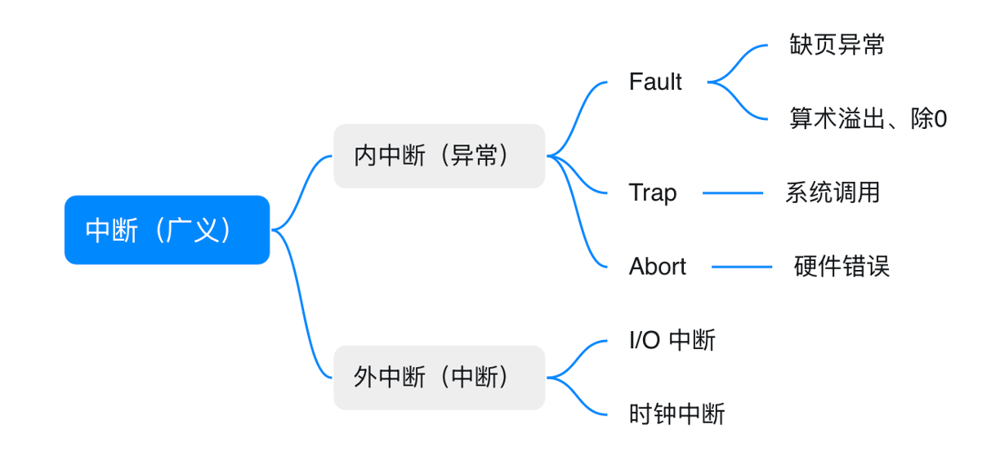
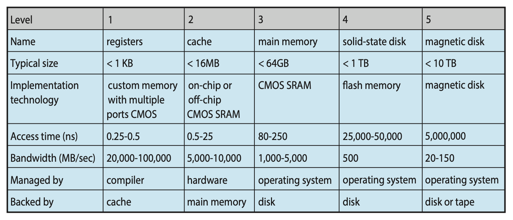
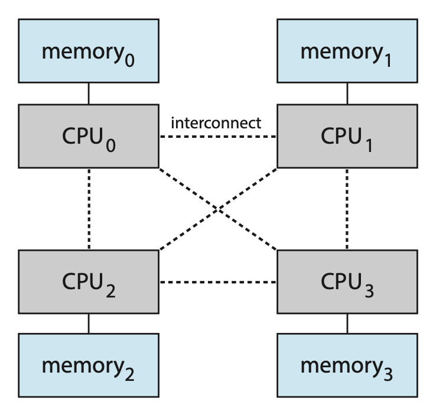

# Introduction

!!! info "说明"

    本章应该是对整本书内容做的一个概要，大致过了一遍操作系统涉及到的方方面面。由于笔者也是刚开始学习，所以可能一些地方理解不到位甚至有误，请见谅。期末复习时应该会 review 这章内容，当然如果读者能立马指出问题那最好不过了！

    不作为考点的内容全部放在 ["Other Topics"](#other-topics) 一节，并且只记录部分内容。

??? question "为什么要学习操作系统？"

    虽然学操作系统的同学中只有少数人会投身于操作系统相关的研究，但即便如此，学习操作系统依然对我们大有裨益。一个简单的理由是：所有的代码都是在操作系统之上运行的，所以知道操作系统如何工作对正确、高效和安全的编程而言十分重要。

??? abstract "核心知识"

    和大多数 CS 课的第一节一样，本章只是一个概览，少有需要深究的地方。为便于快速复习，笔者在这里提取了其中的重要知识点（~~应该没有落下吧...~~）：

    - 中断
    - 计算机系统架构：主要是搞清楚围绕 CPU 的各种术语
    - 多种模式：用户模式、内核模式
        - 其他相关概念：特权指令、系统调用
    - 定时器（也有翻译成「计时器」的）

## What Operating System Do

一个完整的计算机系统是由以下部分构成的：

    

- 硬件(hardware)：包括 CPU、内存、I/O 设备等，为系统提供了基本的计算资源
- **操作系统**(operating system)：控制硬件，并协调其在不同应用程序之间，以及不同用户之间的使用
- 系统程序(system programs)和应用程序(application programs)：定义了用硬件资源解决用户计算问题的方法，比如字处理器、电子表格、编译器、网页浏览器等
- 用户(user)：人、机器或其他计算机

还可以把计算机系统分成硬件、软件和数据三部分。

为了完全理解操作系统发挥的作用，下面将从两个视角理解操作系统：**用户**视角和**系统**视角：

- 用户：用户更在意**性能**和**安全**，不去关心资源利用的问题，因此操作系统的设计旨在方便用户使用
- 系统：将操作系统视为一个**资源分配器**(resource allocator)，它的作用是管理好各种资源
    - 另一个稍有区别的视角是操作系统需要控制 I/O 设备和用户程序，即操作系统是一个**控制程序**(control program)

操作系统不仅具备各种功能，其应用也相当广泛，因此我们很难给「操作系统」下一个准确的定义。另外，连哪些部分属于操作系统也没有一个统一的说法（[微软反垄断诉讼案](https://www.wikiwand.com/en/articles/United_States_v._Microsoft_Corp.)）。这里我们采用一种比较普遍接受的定义：操作系统是一个始终在计算机上运行的程序，这个程序通常被称作**内核**(kernel)。除此之外还有两类程序：

- **系统程序**(system program)：与操作系统相关，但不是内核必要的组成部分
- 应用程序(application program)：包含所有与系统操作无关的程序

对于移动端的操作系统，除内核外还有一种叫做**中间件**(middleware)的东西，它是一组为应用开发者提供额外服务的软件框架。

综上所述，我们认为操作系统包含了一个始终运行的**内核**、**中间件框架**以及**系统程序**。另外，之后讨论的重点还是在内核上。

??? info "计算机启动"

    当计算机开机或重启时，**引导程序**(bootstrap program)就会被加载进来。

    - 被存储在 ROM 或 EPROM 中，它们通常被称为固件(firmware)
    - 初始化系统的各方面
    - **加载操作系统内核**并开始执行

## Computer-System Organization

一个现代的通用目的计算机系统由一个或多个 CPU，以及一些通过公共**总线**(bus)连接，并提供部件和共享内存访问的**设备控制器**(device controller)（有一个本地缓冲区(local buffer)）组成。

    

下面将介绍让系统运作的三个关键方面：**中断**(interrupt)、**存储结构**和 **I/O 结构**。

### Interrupts

硬件会通过向 CPU 发送信号（通常通过系统总线）在任意时候触发中断。当 CPU 被中断后，它就会停止当前正在做的工作，并立即转而执行固定地点（一般是**中断服务例程**(interrupt service routine)的起始地址）上的任务。中断的时间线如下所示：

    

中断服务例程会调用一个**特定的中断处理程序**(interrupt-specific handler)。由于中断要被快速处理，所以会用到一个指向中断例程的指针（地址）表格。这个表格一般被存在内存的低地址区域，称为**中断向量**(interrupt vector)，它的地址随后通过一个唯一数字索引，该数字随中断请求提供，以提供中断设备的中断服务例程的地址。

中断架构也必须保存中断时的信息，完成中断例程后需要恢复这些信息。若中断例程需要改变处理器的状态，则必须保存当前状态（通过保存寄存器和程序计数器中的值实现），稍后在返回前恢复该状态。此外，在处理另一个中断时，会禁用传入的中断以防止中断丢失。

!!! definition "陷阱(trap)"

    陷阱是一个由软件生成的中断，来自程序执行时的错误或来自用户的主动请求（称为**系统调用**(system call)）。

基本的中断工作机制如下：

- 当 CPU 检测到控制器在**中断请求线**(interrupt-request line)上发出信号时，它读取中断号(interrupt number)并通过将该中断号作为索引放入中断向量中，跳转到**中断处理例程**(interrupt-handler routine)中
- 中断处理例程在运行期间保存任何将要改变的状态，确定中断的原因，执行必要的处理，执行状态恢复，并执行 `return_from_interrupt` 指令，使 CPU 返回到中断前的执行状态

下图总结了中断驱动的 I/O 循环：

    

除上述简单的机制外，现代操作系统还有更多精密的中断处理特征，这些特征由 CPU 和**中断控制器硬件**(interrupt-controller hardware)提供：

- 在关键处理期间**延迟中断处理**。大多数 CPU 有两类中断请求线：
    - **不可屏蔽的**中断：用于诸如不可恢复的内存错误等事件
    - **可屏蔽的**中断：在执行必须不被中断的关键指令序列之前，CPU 可以将其关闭，被设备控制器用于请求服务

- 一种高效地将任务分派到适当的设备中断处理程序的方法
    - 实际会遇到的一个问题是计算机拥有的设备比中断向量表中的地址元素要多。一种常见解决方案是使用**中断链**(interrupt chaining)，其中中断向量表中的每个元素都指向中断处理程序列表的头部。当一个中断被触发时，对应列表上的处理程序依次被调用，直到找到一个可以处理请求的处理程序。

- **多层中断**，以便操作系统可以区分高优先级和低优先级的中断（**中断优先等级**(interrupt priority level)），并能以适当的紧急程度做出响应

总而言之，现代操作系统广泛采用中断机制来处理异步事件。设备控制器与硬件故障会触发中断。由于中断在时间敏感型处理中应用极为频繁，高效的中断处理对保障系统性能至关重要。

中断类型（图片来自朋辈辅学）：

    

### Storage Structure

    

    

具体介绍见这份[笔记](https://note.noughtq.top/sys/ca/2)。

### I/O Structure

两种 I/O 方法：

- I/O 启动后，当 I/O 完成时才把控制权返回给用户程序（**同步**(synchronous)）
    - 等待指令使得 CPU 空闲，直至下一次中断
    - 等待循环（内存访问竞争）
    - 一次最多只能有一个未完成的 I/O 请求，不允许同时进行 I/O 处理

- I/O 启动后，无需等待 I/O 完成就能将控制权返回给用户程序（**异步**(asynchronous)）
    - **系统调用**：向操作系统发出请求，允许用户等待 I/O 完成
    - **设备状态表**(device-status table)包含每个 I/O 设备的条目，指示其类型、地址和状态

        

            
        

    

前面介绍的中断驱动的 I/O 循环对小规模数据而言是 OK 的，但对于像 NVS（非易失性存储器(nonvolatile storage)）I/O 这样大批量的数据移动就会带来很大的开销。解决方案是采用 **DMA**（直接内存访问(direct memory access)）。设置好缓冲区、指针和计数器后，设备控制器能让整个数据块在设备与主存之间直接传输，无需 CPU 干预。每个数据块只产生一个中断（原来是每个字节就产生一个中断），以通知设备驱动程序操作已完成。当设备控制器执行这些操作时，CPU 可以完成其他工作。

??? abstract "总结：现代计算机系统各部件的互动"

    

        
    

## Computer-System Architecture

根据处理器的数量和组织形式，下面介绍几类常见的计算机系统架构。

!!! definition "计算机系统部件的一些定义"

    - **CPU**：执行指令的硬件
    - **处理器**(processor)：包含单个或多个 CPU 的物理芯片
    - **核心**(core)：CPU 的基本计算单元
    - **多核**(multicore)：在同一 CPU 上包含多个计算核心
    - **多处理器**(multiprocessor)：包含多个处理器

    一般使用 "CPU" 来指代计算机系统中的单一的计算单元，并且当具体指代 CPU 上的一个或多个核心时会使用“核心”以及“多核”的概念。

### Single-Processor Systems

以前大多数计算机系统只有一个处理器，里面也只有一个单核的 CPU，其中的**核心**(core)是执行指令，并用于本地存储数据的组件。核心除了能执行通用目的指令集外，还能执行一些特殊目的指令集，它们来自设备特定的处理器（指令集有限，不会运行进程），包括磁盘、键盘和图形控制器等。

### Multiprocessor Systems

现在**多处理器系统**(multiprocessor systems)支配了整个计算机领域。传统上来说，这样的系统包含两个及以上的处理器，每个处理器包含一个单核的 CPU。这些处理器共享计算机总线，有时还会共享时钟、内存和外围设备。这种系统的主要优势是**增大了吞吐量**(throughput)，即能在更短时间内完成更多工作。值得注意的是，N 个处理器并不能带来 N 倍的加速比，因为多个处理器共同完成一项任务时会有额外的开销。

最常见的多处理器系统是 **SMP**（对称多处理(symmetric multiprocessing)），其中每个对等的 CPU 处理器均执行所有任务，包括操作系统功能和用户进程。下图展示了包含 2 个处理器的 SMP 架构：

    

该架构的好处是多个进程可同时运行，也就是说如果有 N 个 CPU 就可以运行 N 个进程，并且性能不会显著下降。而缺陷在于：因为 CPU 是单独的，所以存在一个 CPU 空闲，另一个 CPU 满载运行的情况，从而导致低效率。解决方案是可通过**共享进程和资源**（比如内存）来降低处理器之间的工作负载差异。

---
现在对多处理器系统的定义包括了**多核系统**(multicore system)，相比采用只有单核的多芯片而言更加高效，因为芯片内的通信速度高于芯片间的速度，并且更加节能。下图展示了在一块芯片上的双核设计，可以看到这里用到了两级高速缓存结构。

    

向多处理器系统添加太多 CPU 会让系统总线的竞争成为瓶颈，性能反而会下降。改进方法是为每个 CPU（或 CPU 组）配备其自身的本地内存，通过一个快速的小型本地总线进行访问。而这些 CPU 通过**共享系统互连**(shared system interconnect)连接起来，这样所有 CPU 就能共享一个物理地址空间。该方法叫做 **NUMA**（非统一内存访问(non-uniform memory access)），其架构图如下：

    

该架构的优点是 CPU 访问本地内存时不仅快，而且不会在系统互连中发生竞争。因此随着处理器的增多，NUMA 系统能变得更高效（因此 NUMA 在服务器和 HPC 上越来越流行）。但它的缺陷是 CPU 必须通过系统互连访问远程内存，额外的耗时会损害性能。好在操作系统能通过精细的 CPU 调度和内存管理来最小化 NUMA 带来的这点损失。

### Clustered Systems

略...

## Operating-System Operations

不同的操作系统之间差异很大，因为它们以不同方式被组织。下面介绍操作系统都有的一些操作。

### Multiprogramming and Multitasking

操作系统的一个重要特质是能够运行多个程序；另外用户通常也希望一次运行多个程序——实现这一目标的技术就是**多道程序设计**(multiprogramming)。它通过组织**作业**(jobs)（包括代码和数据），使得 CPU 和 I/O 设备始终在工作，从而提高 CPU 的利用率。在多道程序系统中，正在执行的程序被称为**进程**(process)。

{ align=right width=15% }

- 操作系统同时将几个进程保存在内存中，从中选择并开始执行其中一个进程
- 进程可能需要等待某些任务完成，例如 I/O 操作，此时 CPU 可切换到另一个进程并执行
- 最终第一个进程结束等待并重新获得 CPU 资源

而**多任务处理**(multitasking)是多道程序设计的逻辑延伸。在多任务系统中，CPU 通过在不同进程间切换来执行多个进程。这种切换发生得极为频繁，从而为用户提供了快速的响应时间，实现交互式的计算。为确保合理的响应时间（< 1s），一种常见方法是使用**虚拟内存**(virtual memory)，使用户能够运行比实际物理内存更大的程序。此外，它将主存抽象成一个大型、统一的存储数组，将用户所看到的逻辑内存与物理内存分离，因此不必担心实际内存容量限制。

内存中同时有多个进程需要某种形式的内存管理。另外，如果有多个进程同时准备运行，系统必须选择下一个运行的进程。做出这个决定是 **CPU 调度**。最后，同时运行多个进程需要限制它们在操作系统的所有阶段相互影响的能力，包括进程调度、磁盘存储和内存管理。

### Dual-Mode and Multimode Operation

为了确保系统的正确执行，我们必须能够区分操作系统代码和用户定义代码的执行。大多数计算机系统采取的方法是提供硬件支持，允许区分不同的执行模式。一般至少会区分两类模式：**用户模式**(user mode)和**内核模式**(kernel mode)（或称为监督者(supervisor)/系统/特权(privileged)模式），通过硬件上的**模式位**(mode bit)来识别当前状态（0为内核，1为用户）。

当用户应用请求一个来自操作系统的服务时，系统必须从用户模式转向内核模式以完成请求，该过程如下图所示：

    

系统启动时，硬件以内核模式启动。随后，操作系统被加载，并在用户模式下启动用户应用程序。每当发生陷阱或中断时，硬件会从用户模式切换到内核模式（即，将模式位的状态更改为0）。因此，每当操作系统获得对计算机的控制权时，它都处于内核模式。系统在将控制权传递给用户程序之前，总是切换到用户模式（通过将模式位设置为1）。

**双模式**(dual mode)操作为我们提供了保护操作系统免受错误用户影响，以及防止错误用户之间相互干扰的手段。通过将一些可能造成危害的机器指令指定为**特权指令**来实现这种保护。

??? info "特权指令 vs 非特权指令"

    >来自朋辈辅学课件。

    - 特权指令：不允许用户直接使用的指令，包括I/O 指令、关中断指令、内存清零指令、写时钟等
    - 非特权指令：允许用户直接使用的指令，它不能直接访问系统中的软硬件资源，仅限于访问用户的地址空间，从而防止用户程序对系统造成破坏

模式的概念可以扩展至两种以上的形态。例如，

- Intel 处理器拥有四个独立的**保护环**(protection ring)，其中环 0 为内核模式，环 3 为用户模式（尽管环 1 和环 2 理论上可用于各类操作系统服务，但实际应用中极少被使用）
- ARMv8 体系则具备七种运行模式
- 支持虚拟化技术的 CPU 通常设有专属模式来标识虚拟机管理器（VMM）对系统的控制状态；在此模式下，VMM 比用户进程拥有更高权限，但低于内核权限；它需要此特权级别来创建和管理虚拟机，并通过修改 CPU 状态实现相关操作

---
**系统调用**(system call)为用户程序提供了一种方式，使其能够请求操作系统代表用户程序执行那些专属于操作系统的任务。系统调用的具体调用方式多种多样，这取决于底层处理器所提供的功能。通常，系统调用采用中断向量中特定位置的**陷阱**形式来实现。尽管某些系统拥有专门的 `syscall` 指令来发起系统调用，但这一陷阱也可以通过通用的陷阱指令执行。

当系统调用执行时，它通常被硬件视为一个**软件中断**。控制通过中断向量传递到操作系统的服务例程，并将模式位设置为内核模式。系统调用服务例程是操作系统的一部分。内核检查中断指令以确定发生了哪个系统调用（一个参数指示用户程序请求的服务类型）。请求所需的其他信息可能通过寄存器、堆栈或内存传递。内核验证参数是否正确且合法，执行请求，并将控制权返回到系统调用后的指令。

### Timer

我们必须确保操作系统维持对 CPU 的控制。为了实现这个目标，要用到**定时器**(timer)，可以用它设定在指定时间后中断计算机。这个时间段可以是**固定的**，也可以是**可变的**。可变定时器通常由一个固定速率的时钟和一个计数器实现。每当时钟滴答时，计数器就会递减。当计数器达到 0 时，就会发生中断。

在将控制权转交给用户之前，操作系统会确保定时器设置为中断状态。若定时器发生中断，控制权将自动转移回操作系统，此时系统可能将此中断视为致命错误处理，或选择为程序延长运行时间。显然，修改定时器内容的指令属于特权指令范畴。

## Resource Management

现在来看操作系统作为一个**资源管理者**要负责哪些事情。

!!! note "注"

    这些内容在后续章节中会展开介绍，复习时可略过。

- 进程：
    - 进程是正在执行中的程序。它是系统内的一个工作单元。程序是一个被动实体，进程是一个主动实体
    - 进程需要用于完成任务的资源，包括 CPU、内存、I/O、文件、初始化数据等
    - 进程终止需要回收任何可重用资源
    - 单线程进程有一个程序计数器，指定下一个要执行的指令的位置
        - 进程依次执行指令，一次一条，直到完成

    - 多线程进程中每个线程都有一个程序计数器
    - 通常系统有多个进程，一些是用户进程，一些是操作系统进程，它们在单个或多个 CPU 上并发运行
        - 通过进程/线程间多路复用 CPU 实现并发

    - 管理活动：
        - 创建、删除用户和系统进程
        - 调度在 CPU 上的进程和线程
        - 暂停(suspend)和恢复(resume)进程
        - 提供进程同步的机制
        - 提供进程通信的机制

- 内存：
    - 所有的数据在处理前后都要在内存中
    - 所有的指令必须在内存中以被执行
    - 内存管理决定了什么东西在内存中，以便优化 CPU 的利用率和响应时间
    - 管理活动：
        - 追踪内存的哪个部分正在被使用，以及什么进程在使用它
        - 分配和释放需要的内存空间
        - 决定哪个进程（或进程的一部分）和数据移进/出内存

- 文件系统：
    - 操作系统提供了关于信息存储的统一的逻辑视角
        - 逻辑存储单元的抽象物理属性——**文件**(file)
        - 每个媒介都受设备（比如磁盘驱动器、磁带驱动器等）控制
            - 访问速度、容量、数据传输速率以及访问方式（顺序或随机）等属性都会有所不同

    - 文件通常被组织在**目录**(directory)中
    - 大多数系统的**访问控制**(access control)决定了谁能访问什么
    - 管理活动：
        - 创建和删除文件
        - 创建和删除用于组织文件的目录
        - 支持操作文件和目录的基本功能(primitives)
        - 将文件映射至大容量存储器
        - 将文件备份至稳定（非易失性）存储媒介

- 大容量存储器：
    - 挂载和卸载
    - 空闲空间管理
    - 存储分配
    - 磁盘调度
    - 分区(partitioning)
    - 保护

- 高速缓存：
    - **高速缓存一致性**(cache coherency)：每个 CPU 还包含一个本地缓存，因此 A 的一个副本可能同时存在于几个缓存中。由于各个 CPU 都可以并行执行，我们必须确保对 A 值在一个缓存中的更新能够立即反映在 A 所在的所有其他缓存中。

- I/O 系统：由 I/O 子系统负责，包含以下部分：
    - 包含缓冲(buffering)（暂时存储传输中的数据）、缓存(caching)（出于性能考虑，将部分数据存储在速度更快的存储器中）和假脱机(spooling)（一个作业的输出与另一个作业的输入重叠）功能的内存管理组件
    - 通用设备驱动程序接口
    - 用于特定硬件设备的驱动器

## Three Conceptual Pieces

操作系统的三个核心概念：

- **虚拟化**(virtualization)：OS 获取物理资源，并将其变换成更通用、更强大并且更易用的虚拟形式（因此有时将 OS 称为**虚拟机**(virtual machine)）
    - OS 提供了可被用户调用的接口（APIs），并且一般会向应用程序开放数百个系统调用。由于 OS 通过这些调用来支持程序运行、内存与设备访问及其他相关操作，我们有时也称之为向应用程序提供了**标准库**(standard library)。
    - 分类：
        - **CPU** 虚拟化：系统拥有非常多的虚拟 CPU，因此将单个 CPU（或一小组 CPU）转变为看似无限数量的 CPU，从而使得许多程序看上去可以同时运行
        - **内存**虚拟化：就好像每个运行的程序都拥有自己的私有内存（虚拟的**地址空间**(address space)），而不是与其他运行程序共享同一物理内存（实际上 OS 会以某种方式将其映射到机器的物理内存上）
- **并发**(concurrency)：包含了在同一程序中同时（即并发）处理多项事务时出现且必须解决的一系列问题
    - 现代的**多线程**(multi-threaded)程序也存在并发问题
        - 目前我们可以将线程视为一个与其他函数在同一内存空间中运行的函数，且同时有多个线程处于活动状态

- **持久化**(persistence)
    - 文件系统

## Design Goals

- **抽象**(abstraction)，使得系统方便而易用
- **性能**(performance)
- **最小化开销**
    - 两类开销：额外的时间（更多指令）或空间（磁盘/内存）
- **保护**(protection)
    - **隔离**(isolation)
    - **安全**(security)
- **可靠性**(realibility)
- **能效**(power-efficiency)
- **移动性**(mobility)

## Other Topics

教材介绍的其他主题，但是考试不考，所以就简单罗列一下标题：

- 安全和保护
- 虚拟化
- 分布式系统
- 内核数据结构：栈、队列、链表、树、哈希函数/哈希表、位图
- 计算环境：传统计算、移动端计算、客户端-服务器计算、对等(peer-to-peer)计算、云计算、实时嵌入式系统
- 自由和开源操作系统