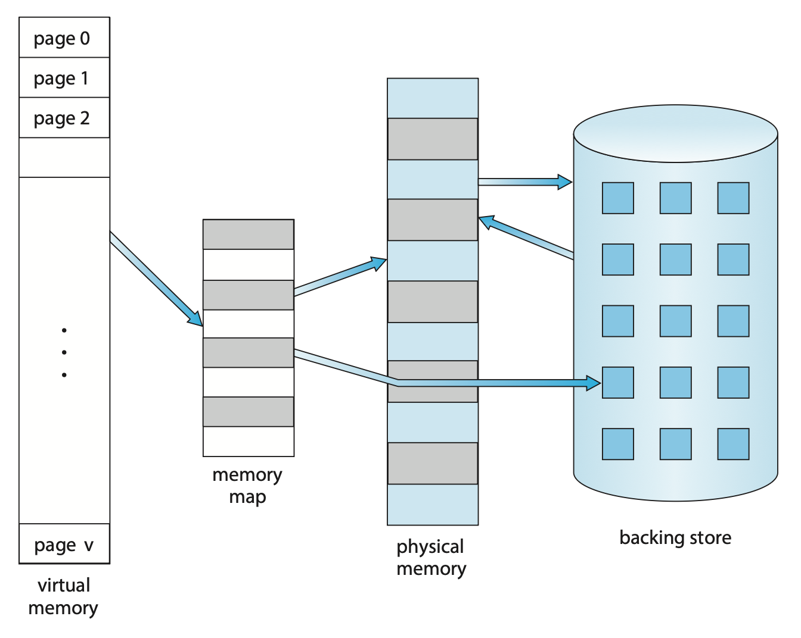
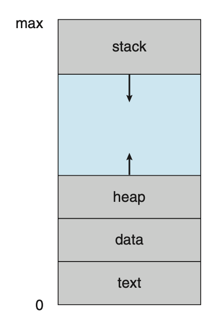
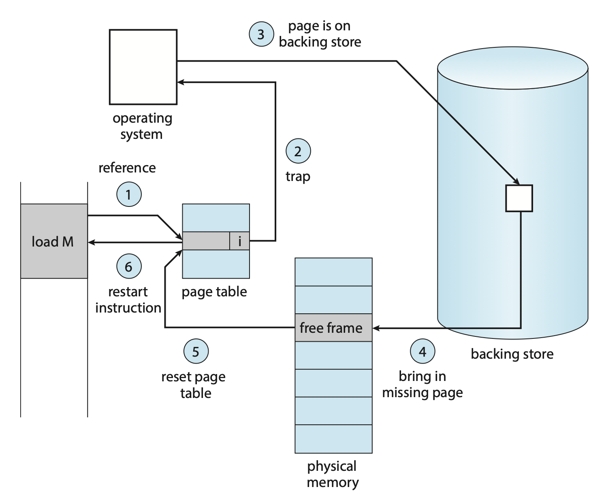
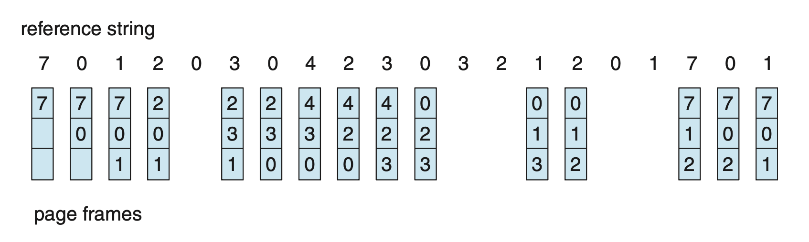
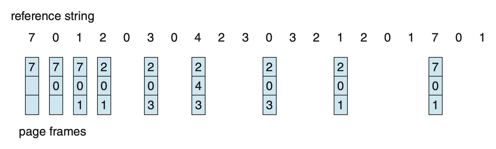
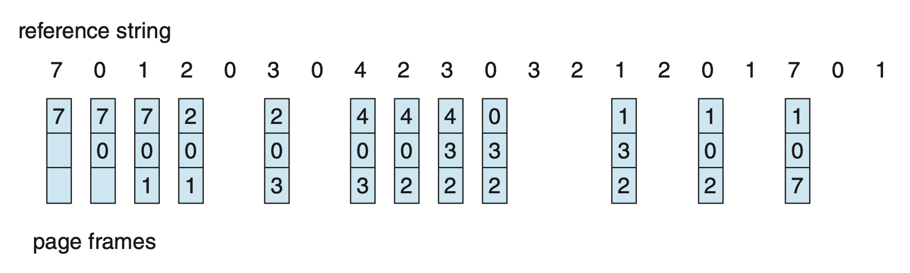
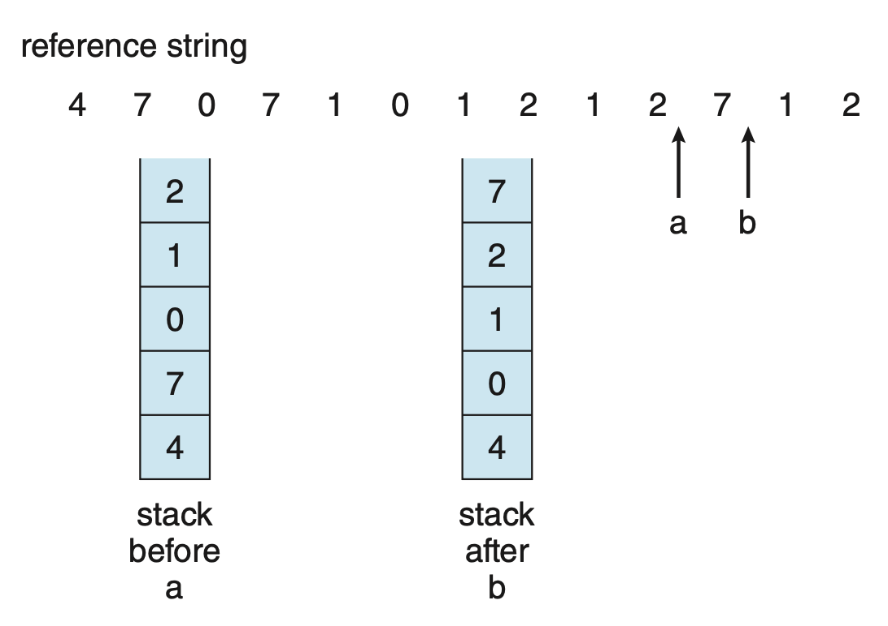
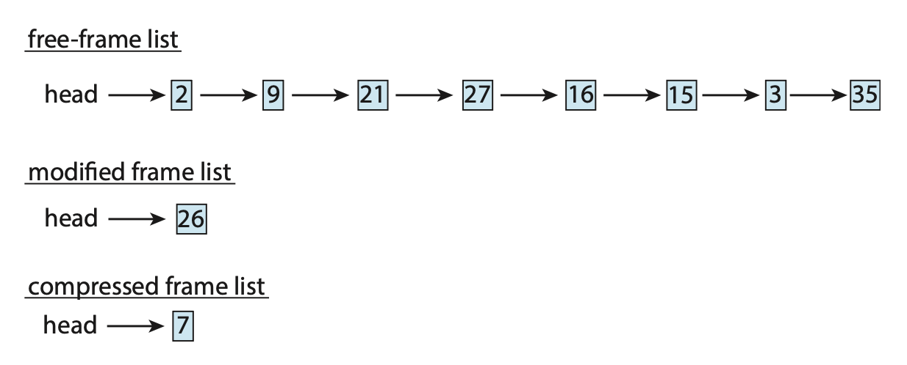
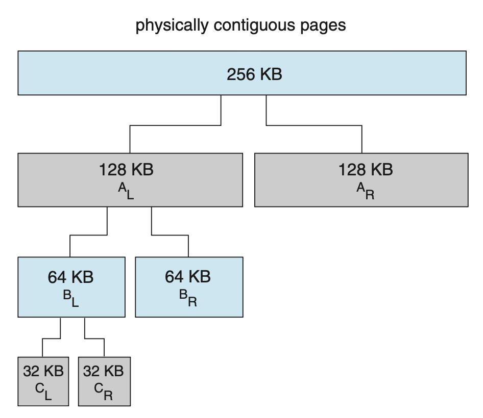
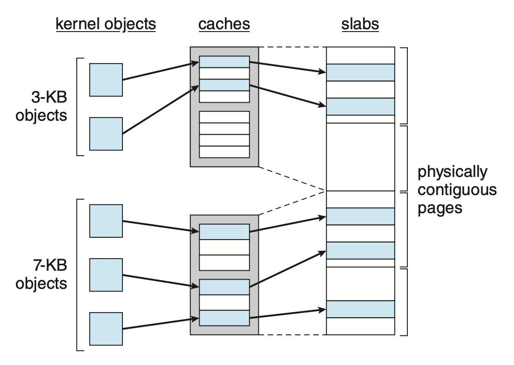

# Virtual Memory

**虚拟内存**(virtual memory)是一种让进程的执行可以不完全在内存中的技术。该技术的一个主要优点是可以让程序比物理内存还大，因为虚拟内存将主存抽象为一个非常大且统一的存储数组。

## Background

我们不必把整个程序都放在内存中执行，比如对于以下情况：

- 程序中用于处理不常见的错误条件的代码
- 数组、列表等数据结构通常被分配到比它们实际需要的更大的内存
- 程序中的部分选项或功能用得很少

如果能**让程序部分执行于内存中**，（对用户和系统而言）就会得到以下好处：

- 程序不再受可用物理内存的约束，用户可在一块很大的虚拟内存上编写程序，从而简化编程任务
- 因为每个程序占用更少的物理内存，那么更多程序能够同时执行，增加了 CPU 的利用率和吞吐量，并且不会增加响应或周转时间
- 加载或交换程序部分所需的 I/O 更少，因此程序会运行得更快

下图展示了虚拟内存和物理内存之间的关系：

    

{ align=right width=20% }

进程的**虚拟地址空间**(virtual address space)是指进程在内存中存储的逻辑（或虚拟）视图。

- 堆空间向上增长，用于动态内存分配
- 栈空间向下增长，用于连续的函数调用
- 堆和栈之间有一块很大的空间（或洞），因而虚拟地址空间是一种**稀疏的**(sparse)地址空间
    - 这一特点是有益的，因为当栈或堆段增长时，洞可以被填充；并且这个洞在程序执行期间可用来存放动态链接库（或可能其他共享对象）

除了分离逻辑内存和物理内存外，虚拟内存允许文件和内存能被多个进程共享。这能带来以下好处：

- 像标准 C 库等系统库可以通过将共享对象映射到虚拟地址空间中，实现多个进程共享

    

        
    

- 进程间可共享内存
- 在创建进程时，可以通过 `fork()` 系统调用来共享页，从而加快进程创建的速度

## Demand Paging

**按需分页**(demand paging)是虚拟内存中的常用技术，在执行过程中可以按需求加载页；那些永远也没被访问的页就不会被加载到物理内存上。

### Basic Concepts

使用按需分页时，需要知道页在内存还是在二级存储中，因此需要一些硬件支持。之前介绍的**有效位**就能在这里派上用场，但需要重新定义「**有效**(valid)」的概念：只有当页是**合法的**(legal)，且**位于内存**时，这个页才会是有效的。所以即便页是合法的，但如果在二级存储中，那就不是有效的。

访问无效的页就会触发**页错误**(page fault)。OS 处理页错误的流程如下：

    

1. 检查进程的内部表（通常位于 PCB），确定当前引用是有效还是无效的内存访问
2. 如果引用无效，终止该进程；如果引用有效但还没有放入页内，那就把它放到页内
3. 找到一个空闲帧（从空闲帧表获取）
4. 调度一个二级存储操作，把所需页读到新分配的帧上
5. 当读操作完成时，修改进程的内部表和页表，以表明所需页已在内存中
6. 重新开始被陷阱中断的指令，现在进程可以访问所需页（就好像这个页一直在内存中）

**纯按需换页**(pure demand paging)：除非有要求，否则不会将页放到内存中。

- 所以进程执行一开始没有任何页，可能会不断触发页错误，然后逐渐加载所需的页到内存中

理论上，一些程序可能在每次指令执行时访问几页新的内存（指令一页，数据多页），可能每条指令都会导致多次页错误，这显然严重损害了系统的性能。不过实践表明，这种行为很少发生，因为程序往往有**引用局部性**(locality of reference)的特性。

支持按需分页的硬件为：

- **页表**：每一项能通过合法位或保护位的特殊值来标记页的有效/无效状态
- **二级内存**：持有不在主存中的页的内存，通常是高速磁盘或 NVM 设备；其中用于交换的部分即为**交换空间**(swap space)

按需分页的一个关键要求是**在页错误后重启指令**的能力。因为在页错误发生时保存了被中断进程的状态，所以必须能在相同位置、相同状态下重启该进程。

多数情况下，该要求很容易被满足。一个主要的困难在于一条指令可能修改了多个位置的值。比如 IBM System 360/370 的`MVC`（移动字符）指令，它可以将最多 256 字节从一个位置移动到另一个（可能重叠的）位置。如果任一块（源或目标）跨越了页面边界，则在移动部分完成后可能会发生页错误。此外，如果源和目标块重叠，则源块可能已被修改，在这种情况下，我们不能简单地重新启动该指令。

这个问题的解决方案有：

- 微码计算并尝试访问两个块的两端；如果将要发生页面错误，它将在此步骤中发生，在任何内容被修改之前
- 使用临时寄存器存储要被覆写处的值，若发生页错误，所有旧值将在陷阱发生之前写回内存

### Free-Frame List

- 为解决页错误，OS 会维护一张**空闲帧列表**(free-frame list)，存放所有空闲的帧（也会用在栈段和堆段的扩张中）
- OS 通常采用一种叫作**按需零填充**(zero-fill-on-demand)的技术来分配空闲帧，即在分配前清空帧内原有的内容

    

### Performance

按需分页极大影响了计算机系统的性能。要理解这点，首先来计算一下按需分页所需的**有效访问时间**(effective access time)。令 $ma$ 为内存访问时间，$p$ 为页错误发生的概率（$0 \le p \le 1$），那么有效访问时间为：

effective access time = (1 − $p$) × $ma$ + $p$ × page fault time

所以我们还得知道处理页错误所需的时间，以下是影响该时间的主要组成部分：

- 页错误中断处理
- 读取页
- 重启进程

第一和第三点可以通过仔细写代码减少至几百条指令。关键在于第二点，这个和存储设备有很大的关系（这里不考虑排队等待使用设备的时间）。假如 $ma$ 是纳秒级的，而磁盘访问时间是毫秒级的，那么很明显有效访问时间将会和**页错误率**(page-fault rate)成正比。因此在按需分页中，降低页错误率是相当重要的。

按需分页中，额外需要考虑的是**交换空间**的处理和整体使用。

- 对交换空间的输入/输出通常比对文件系统的输入/输出更快
- 一种提升分页吞吐量的方法是在进程启动时将整个文件映像复制到交换空间，然后从交换空间执行按需分页
    - 显然拷贝成本太大了
- 另一种实际被应用的方法是是一开始从文件系统按需分页，而在页被替换时将其写入交换空间
- 一些系统试图通过对二进制可执行文件的按需分页来限制使用的交换空间量
    - 但当页替换发生时，这些帧就会被直接覆写
    - 使用这种方法后，使得文件系统看起来就像是后备存储
    - 然而，仍然必须使用交换空间来处理与文件无关的页（称为**匿名内存**(anonymous memory)）

## Copy-on-Write

使用 `fork()` 系统调用的进程创建一开始可能通过使用类似于页共享的技术来绕过按需分页的需要。该技术提供了快速的进程创建，并且最小化必须分配给新进程的页数。这种技术就叫做**写时复制**(copy-on-write)，能让<u>父进程和子进程共享相同的页</u>。这些共享的，且需要修改的页被标记为**写时复制页**；进程向这种页写入时创建这个共享页的拷贝，写操作仅发生这个拷贝上。这一过程如下所示：

=== "进程 1 修改页 C 前"

    

        
    

=== "进程 1 修改页 C 后"

    

        
    

一些 UNIX 版本提供了 `fork()` 系统调用的变体，叫作 `vfork()`（**虚拟内存分支**(virtual memory fork)）。

- 和采用写时拷贝技术的 `fork()` 不同，使用 `vfork()` 时，父进程会被挂起，而子进程使用父进程的地址空间
- 使用 `vfork()` 时要特别当心，因为子进程做的任何改变都会被父进程看到
- `vfork()` 一般用于子进程创建后立马调用 `exec()` 的情况
- 相比 `fork()` 高效许多

## Page Replacement

下面将详细介绍各种**页替换**(page replacement)的策略。

### Basic

基本的页替换步骤如下：

- 若没有空闲帧，找出当前未被使用的某个帧并释放掉
- 释放操作可通过将帧的内容写入交换空间，并通过修改页表来表示该页已不在内存中实现
- 现在进程可以把页放在刚释放的帧上

    

结合现有的页替换策略，我们修改原来的页错误处理过程为：

1. 找到所需页在二级存储中的位置
2. 找一个空闲帧
    1. 若有空闲帧就使用它
    2. 若没有，使用页替换算法，选择一个**受害帧**(victim frame)
    3. 将受害帧写入二级存储（如有必要）；并修改页表和帧表
3. 将所需页读入新释放的帧上；修改页表和帧表
4. 继续从页错误发生的地方执行进程

注意到，若没有空闲帧，就要两次页传输，这会加倍页错误处理的时间，并增加了有效访问时间。我们可通过使用一个**修改位**(modify bit)（或**脏位**(dirty bit)）来降低这一开销。

- 当页的任意字节被写入时，由硬件设置修改位，表明该页被修改过
- 当选择要被替换的页时，需要检查修改位
    - 若修改位被设置，必须将该页写入二级存储中
    - 若修改位未被设置，不必将其写入二级存储，可以直接覆写其内容

该方案能显著降低处理页错误所需的时间，因为在页没有被修改时能够减少一半 I/O 时间。

在挑选替换算法时，我们通常希望得到最低的页错误率。一种评估方法是让算法运行在一串特定的内存引用序列并计算页错误的发生次数。这串序列被称为**引用串**(reference string)。引用串既可人工生成（使用随机数生成器等），也可通过追踪具体系统并记录每次内存引用的地址得到。

但后者通常会产生大量数据。为减小数据量，我们利用两个事实：

- 对于给定的页大小，我们只考虑页编号而非完整的地址
- 若要引用页 p，那么任何紧随其后的指向页 p 的引用永远不会引起页错误，也就是说在第一次引用后页 p 就会一直待在内存中

???+ example "例子"

    假如通过追踪某个进程，记录到以下地址序列：

    0100, 0432, 0101, 0612, 0102, 0103, 0104, 0101, 0611, 0102, 0103,
    
    0104, 0101, 0610, 0102, 0103, 0104, 0101, 0609, 0102, 0105

    该序列能转换为以下引用串：

    

    1, 4, 1, 6, 1, 6, 1, 6, 1, 6, 1
    

    为确定页错误数量，还得知道可用帧的数量。显然，帧数越多，页错误数就越少。
    
    - 对于以上例子，只要有 >= 3 个帧，页错误数为 3（每个页的首次访问都会触发页错误）
    - 假如帧数仅为 1，那么就有 11 个页错误（每次引用都要发生替换）

下面的曲线图展示了帧数和页错误数之间的关系：

    

### FIFO

最简单的页替换算法是**先进先出**(first-in, first-out, **FIFO**)算法。

- 为每个页**计时**；需要替换某个页时，挑选其中最旧的页
- 其实没必要为每个页计时的，可以创建一个 **FIFO 队列**来维护内存中的页
    - 替换的页位于队首
    - 新的页被插入队尾

??? example "例子"

    若帧数为 3，且引用串为：

    

    7, 0, 1, 2, 0, 3, 0, 4, 2, 3, 0, 3, 2, 1, 2, 0, 1, 7, 0, 1
    

    那么采用 FIFO 页替换算法的结果如图所示：

    

        
    

    一共发生了 15 次页错误。

    ???+ info "注"
    
        图中的队列是**循环队列**，比如第 4 次页错误发生前，队尾指针已经来到了队首，所以页错误发生时替换的是队首元素而非队尾。所以图并没有画错，而且使用循环队列可以减小在队列内移动元素的开销。后面的图示也是如此。

可以看到，尽管该算法理解和实现起来都很容易，但是表现不佳，因为该算法很可能会把一个很早前就初始化，但要过好久会重度使用的变量给踢出去。

注意到，即便仅在被活跃使用的页上使用该页替换算法，仍然能够正确运行。但错误的替换选择会增加页错误率，并减慢进程的执行速度；不过这不会导致不正确的执行。假如有以下引用串：

1, 2, 3, 4, 1, 2, 5, 1, 2, 3, 4, 5

下图展示了在该引用串上帧数和页错误数之间的关系：

    

可以看到，当帧数 = 4 时，页错误数竟然比帧数 = 3 时还高。这种意料之外的结果被称为 [**Belady 异常**](https://en.wikipedia.org/wiki/B%C3%A9l%C3%A1dy%27s_anomaly)(anormaly)：对于某些页替换算法，当分配帧数上升时，页错误数反而会增加。

### Optimal

能够实现最低页错误率，且永远不会出现 Belady 异常的算法就是**最优页替换算法**，称为 OPT 或 MIN。这样的算法确实存在，它的思路是：**替换将最长时间不使用的页**。

??? example "例子"

    还是引用串：

    

    7, 0, 1, 2, 0, 3, 0, 4, 2, 3, 0, 3, 2, 1, 2, 0, 1, 7, 0, 1
    

    采用最优页替换算法的结果如图所示：

    

        
    

    一共发生了 9 次页错误。

很可惜，这种算法很难实现，因为需要知道引用串的未来信息。因此该算法只用于比较研究。

FIFO 和 OPT 算法的区别在于

- FIFO 使用的是页进入内存的时间
- OPT 使用的是页将会被使用的时间

### LRU

如果将最近过去(recent past)作为近期未来(near future)的近似值，那么就可以替换掉最长时间未被使用的那一页。该方法就是**最少最近使用算法**(least recently used (**LRU**) algorithm)。

??? example "例子"

    依旧引用串：

    

    7, 0, 1, 2, 0, 3, 0, 4, 2, 3, 0, 3, 2, 1, 2, 0, 1, 7, 0, 1
    

    采用 LRU 页替换算法的结果如图所示：

    

        
    

    一共发生了 11 次页错误。

LRU 策略是一种常用的页替换算法，并且表现不错。LRU 替换的主要问题是如何实现。它可能需要巨大的硬件支持，需要确定按上一次使用时间排序的帧的顺序。有以下两种可行的实现方式：

- **计数器**(counter)
    - 为每个页表项关联一个**使用时间**(time-of-use)字段，并向 CPU 添加一个逻辑时钟或计数器，该时钟会在每次内存引用时递增
    - 每当对某个页进行引用时，时钟寄存器的内容会被复制到该页面的页表项中的使用时间字段中
    - 通过这种方式，我们始终可以获得对每个页面的最后一次引用的“时间”
    - 被替换的页将是时间值最小的页
    - 该方案需要搜索页表，以找到 LRU 页，并在每次内存访问时写入内存（到页表中的使用时间字段）
    - 当（由于 CPU 调度）更改页表时，也必须维护这些时间
    - 同时还必须考虑时钟溢出的问题

- **栈**(stack)
    - 保持一个记录页编号的栈，每当引用一个页时，它会从栈中移除并放到顶部
    - 通过这种方式，**最近使用的页总是在栈顶，而最少使用的页面则总是在底部**，如下所示：

        

            
        

    - 由于条目必须从栈中间移除，因此最好通过使用带有头指针和尾指针的**双向链表**来实现
        - 最坏情况下，移除一个页并将其放到栈顶需要更改六个指针
        - 每次更新的成本稍微大一些，但不需要搜索
        - 尾指针指向栈底，即 LRU 页

    - 这种方法特别适合于软件或微代码实现的 LRU 替换算法

LRU 替换不会出现 Belady 异常。它和最优页替换算法同属于**栈算法**(stack algorithm)，即可以证明对于 n 个帧的内存页集合，始终是具有 n + 1 个帧时内存中页集合的子集。

### LRU-Approximation

很少会有计算机系统提供真正的 LRU 页替换算法。但大多数系统会提供一个**引用位**(reference bit)，一开始会被清零；当页被引用时该位就会被硬件设置。引用位的使用可用来实现近似的 LRU 算法。

#### Additional-Reference-Bits Algorithm

我们可以通过定期记录引用位来获得额外的页信息。

- 为每个页面保留一个 8 位字节
- 在固定的时间间隔后，一个定时器中断将控制权转移给 OS；OS 将每个页的引用位放在其 8 位字节的最高位，将其他位向右移动 1 位，并丢弃低位
- 移位寄存器的 8 位包含了过去 8 个时间段内页面使用的历史
    - 移位寄存器为 00000000，表示该页在八个时间段内没有被使用
    - 在每个周期至少使用过一次的页，其移位寄存器的值为 11111111
- 若将这些 8 位字节解释为无符号整数，**数字最小**（意味着最近 8 个时间段内用的最少）的页就是 **LRU 页**，可以被替换
- 注意：这些数字并不保证是唯一的，若出现多个最小值，既可以替换所有具有最小值的页，也可以采用 FIFO 方法从中选择

#### Second-Chance Algorithm

**第二次机会替换算法**(second-chance replacement algorithm)是一种 FIFO 替换算法。

- 当选择一个页时，我们会检查它的引用位
    - 若引用位的值为0，就进行页替换
    - 但引用位的值为1，就给这个页第二次机会，并继续选择下一个 FIFO 页

- 当一个页获得第二次机会时，它的引用位被清除，抵达时间重置为当前时间
- 因此，一个获得第二次机会的页在所有其他页都被替换（或给予第二次机会）之前不会被替换
- 此外，如果一个页使用得足够频繁以保持其引用位设置，它将永远不会被替换
- 实现该算法的一种方法（有时称为**时钟**(clock)算法）是使用**循环队列**
    - 指针指向下一个要被替换的页
    - 当需要帧时，指针向前移动，直到找到具有 0 引用位的页
    - 在此过程中，它会清除引用位
    - 一旦找到受害页，该页将被替换，新页将在该位置插入到循环队列中
    - 请注意，在最坏情况下，当所有比特都设置为 1 时，指针会遍历整个队列，为每个页面提供第二次机会
        - 在选择下一个要替换的页面之前，它会清除所有引用位
        - 如果所有比特都置1，则二次机会替换退化为 FIFO 替换

#### Enhanced Second-Chance Algorithm

我们可通过把**引用位**和**修改位**看成一个有序对来增强第二次机会算法。这两个位构成了四种类别：

1. (0, 0)：既没用过，也没修改过 -> 最适合被替换的页
2. (0, 1)：最近没用过，但是被修改过 -> 不太适合被替换，因为在替换前其内容要写入交换空间中
3. (1, 0)：最近用过，但是没修改过 -> 可能会被再次使用
4. (1, 1)：最近用过，且修改过 -> 可能会被再次使用，且在替换前其内容要写入交换空间中

---
- 每一页属于这四个类别之一
- 当需要调用页替换时，我们使用与时钟算法相同的方案，但此时检查的是该页所属的类别
- 我们在**最低的非空类别中替换遇到的第一个页**；可能需要多次扫描环形队列才能找到一个要替换的页
- 这个算法与更简单的时钟算法的主要区别在于，我们**优先考虑那些已被修改的页**，以减少所需的 I/O 次数

### Counting-Based

还有许多其他算法可以用于页替换，比如可以用一个计数器记录对每个页的引用次数。基于此，我们有以下方案：

- **最少使用**(least frequently used, **LFU**)页替换算法：替换引用次数最少的页
    - 选择这种页的原因是，一个被活跃使用的页应该有较大的引用计数
    - 然而，当一个页面在进程初始阶段被大量使用，但之后再也不被使用时，就会出现问题：由于它曾经被大量使用，因此它具有较大的计数，即使不再需要，它仍然留在内存中
    - 一种解决方案是在定期间隔内将计数右移 1 位，从而形成指数衰减的平均使用计数
- **最多使用**(most frequently used, **MFU**)页替换算法
    - 它的设计基于这一论点：引用次数最少的页可能刚刚被引入，还未被使用

这两种替换都不是常见方法，因为实现成本高，且并不能很好地近似 OPT 替换

### Page-Buffering

- 系统通常保持一个**空闲帧池**。当发生页错误时，会像以前一样选择一个受害帧。
    - 然而，在写出受害页之前，从池中将所需页面读入一个空闲帧
    - 这个过程允许进程尽快重新启动，而无需等待受害页被写出
    - 当受害页稍后被写出时，它的帧会被添加到空闲帧池中

- 这一想法的扩展是**维护一个已修改页面的列表**。
    - 每当分页设备处于空闲状态时，就选择一个已修改的页并将其写入二级存储，然后重置其修改位
    - 这种方案增加了在选择替换页时，该页为清空状态而不需要被写出的概率

- 另一种修改是**保持一组空闲帧，但记住每个帧的所在页**。
    - 由于在将某个帧写入二级存储时，其内容不会被修改，因此如果在该帧再次使用之前需要旧页，可以直接从空闲帧池中重用它，此时不需要进行 I/O
    - 当发生页错误时，首先检查所需的页是否在空闲帧池中；若不在，则必须选择一个空闲帧并将其读进来

### Applications

在某些情况下，通过 OS 的虚拟内存访问数据的应用程序表现得比 OS 根本不提供缓冲区时更差。

- 一个典型的例子是**数据库**，它自己提供内存管理和 I/O 缓冲区
- 另一个例子是，数据仓库通常执行大规模顺序存储读取，然后进行计算和写入
    - LRU 算法将删除旧页面并保留新页面，而应用程序更可能读取较旧而非较新的页面（因为它再次开始顺序读取）
    - 此时 MFU 实际上会比 LRU 更有效。
- 这类应用程序对其内存使用和存储使用的理解优于实现通用算法的 OS
- 此外，如果 OS 正在进行 I/O 缓冲，而应用程序也在进行，那么对于一组 I/O 来说，将会使用两倍的内存

由于这些问题，一些 OS 允许特定程序将二级存储分区作为大型顺序逻辑块数组来使用，而无需任何文件系统数据结构。这个数组有时被称为**原始磁盘**(raw disk)；对该数组的 I/O 称为原始 I/O，它能绕过所有文件系统服务。

请注意，尽管某些应用程序在原始分区上实施自己的专用存储服务时效率更高，但大多数应用程序在使用常规文件系统服务时表现得更好。

## Allocations of Frames

在解决完页的替换问题后，我们来回答第二个问题：如何为页分配（空闲的）帧？

### Minimum Number of Frames

帧的分配策略受限于多种因素。例如分配的帧数不得超过最大帧数（除非存在页共享），并且分配帧数也有一个**最小值要求**。前者是显然的，所以我们来看后者是怎么一回事。

之所以要确定最小分配数量，一个原因是考虑到**性能**。显然，分配给每个进程的帧数越少，页错误率就会增加，从而降低程序执行速度。所以必须有足够多的帧来保存所有的页。

帧的最小数量取决于**计算机架构**（不同的寻址模式等），而最大数量取决于可用的物理内存。

### Allocation Algorithms

假如要为 n 个进程分配共 m 个帧，最简单的方法是**平等分配**(equal allocation)，即每个进程得到 m / n 个帧。

第二种方法基于一个发现：各种进程所需的内存量不同，比如有些进程所需的帧数远低于平均值，那么采用前一种方法就会浪费掉很多帧。为解决该问题，我们采用名为**比例分配**(proportional allocation)的方法，**基于进程大小来分配内存**。令进程 $p_i$ 的虚拟内存大小为 $s_i$，总的可用帧数为 $m$，定义 $S = \sum s_i$ 为总大小。那么分配给进程 $p_i$ 的帧数近似为：
$$
a_i = s_i / S \times m
$$

需要确保 $a_i$ 为大于指令集要求的最小帧数的整数，且不超过 $m$。

在前两种分配算法中，具体的分配还会随多道程序设计的程度发生变化。并且无论哪种算法，高优先级和低优先级的进程会被一视同仁，但显然我们希望高优先级的进程能分配到更多内存，以加快执行。一种解决方法是：在比例分配中，帧的比例不再取决于进程大小，而是基于进程的**优先级**，或者为两者的结合。

### Global v.s. Local Allocation

另一个影响帧分配的因素是页替换。我们可将页替换分成两大类：

- **全局替换**(global replacement)：允许进程从所有帧中选择一个替换帧，即便该帧当前被分配到其他进程上，也就是说一个进程可以夺取另一个进程的帧
- **局部替换**(local replacement)：每个进程仅能从自己的一组帧中选择

全局替换算法的一个问题是进程的内存页不仅取决于该进程的分页行为，还取决于其他进程的分页行为。因此即便是相同的进程也可以有不同的执行结果。而局部替换算法不存在这种问题，但它可能会阻碍一个进程，因为它没有为其提供其他不常用的内存页。因此**全局替换**通常有**更高的吞吐量**，于是成为**最常用**的方法。

接下来我们仅考虑全局页替换策略。该方法能满足来自空闲帧列表的所有内存请求，但不是在空闲内存降至零之前开始选择替换页面，而是在降至某个阈值以下时触发页替换，以确保始终有足够的空闲内存来满足新的请求。该过程如下所示：

    

- 当降低至阈值以下时会触发内核例程（称为**收割者**(reaper)），开始**收回**(reclaim)所有进程的页
    - 收割者例程可采取前面介绍的任何页替换算法，但常用的还是某种**近似 LRU 算法**
- 当空闲内存量到达最大阈值时，收割者进程就会**挂起**(suspend)，仅在空闲内存降至最小阈值时继续

在 Linux 中，如果空闲内存量变得很低很低时，一个叫做“**内存不足杀手**(out-of-memory(OOM) killer)”的例程就会选择一个进程终止，从而释放其内存。

- 每个进程都有一个 OOM 分数，分数越高意味着该进程越有可能被内存不足杀手给终止
- OOM 分数通过进程正在使用的内存比例来计算，比例越高，分数越高

### Non-Uniform Memory Access

到目前为止，我们假设所有主存都是相等的；而在**非均匀内存访问**(non-uniform memory access, **NUMA**)，情况就有所不同了。在这类系统中，每个 CPU 都有自己的局部内存，且各 CPUs 之间通过共享系统互联组织起来。显然，CPU 访问自己的局部内存会比访问其他 CPUs 的局部内存会快。

    

于是，管理好哪个帧放在哪个位置上会极大影响 NUMA 系统的性能。如果还是把所有内存一视同仁，CPU 可能会花费更长时间等待。所以对于 NUMA，我们的目标是<u>让分配的内存帧和进程运行所处的 CPU 尽可能接近（即最小化时延）</u>。

同时，调度器必须追踪每个进程上一次运行所在的 CPU，这样虚拟内存系统就能尝试为每个进程分配离进程所在 CPU 尽可能接近的帧，从而提升高速缓存命中并减少内存访问时间。

如果还要考虑线程的话，情况会变得更加复杂。Linux 的做法是：

- 让内核识别**调度域层级**(hierarchy of scheduling domains)
- **CFS 调度器**不允许线程在不同域之间迁移，从而避免了内存访问损失
- Linux 还为每个 NUMA 节点维护一个单独的空闲帧列表，从而确保线程将从其运行所在的节点分配内存

## Thrashing

若进程没有足够多的帧，进程将很快发生页错误，此时它必须要替换一些页。但由于所有页都在使用中，它必须替换一个马上就会再次需要的页，因此它很快再次发生页错误。然后又需要替换，又发生页错误，如此循环往复。这种情况被称为**抖动**(thrashing)，此时一个进程花费在页交换上的时间比执行的时间多，这显然会导致严重的性能问题。

### Cause of Thrashing

试想这样一种情况：

- 如果 CPU 利用率太低，我们希望增加多道程序设计的程度，那么就会向系统引入新的进程
- 假设采用全局页替换算法
- 若进程在执行过程中需要更多的页，那么该进程就会发生页错误，需要从别的进程中获取一些页
- 这么一来，别的进程也会发生页错误，也会用到分页设备
- 当进程排队使用分页设备时，CPU 利用率又下降了，那么 CPU 调度器又会尝试提高多道程序设计的程度，这意味着上述情况还会重复发生

这就是发生**抖动**的一个案例。要想增加 CPU 利用率并停止抖动，就必须降低多道程序设计的程度。于是我们采用**局部替换算法**(local replacement algorithm)（**或优先级替换算法**(priority replacement algorithm)）。此时，若一个进程发生抖动，它不会从别的进程中窃取页，从而避免其他进程发生抖动。

但这还没完，要想阻止抖动，必须向进程提供足够多的帧。一种策略是定义一个进程执行时的**局部性模型**(locality model)。

- 一个「**局部性**」是指一组被一起被活跃使用的页，其定义同时来自程序结构和数据结构
- 一个运行中的程序通常由多个不同的局部性构成，并且这些局部性可能会重叠
- 比如一次函数调用就会创建一个局部性

下图展示了某个进程的局部性随时间发生的变化（用花括号括起来的一组页就是一个局部性）：

    

- 假设为一个进程分配足够的帧以容纳其当前的局部性，它会因其局部性中的页而发生页错误，直到所有这些页都在内存中；之后就不再发生页错误，直到它的局部性发生改变
- 若没有分配足够的帧来容纳当前局部性的大小，该进程将会出现频繁的页错误，因为无法在内存中保持所有正在使用的页

### Working-Set Model

**工作集模型**(working-set model)基于局部性的假设。我们用参数 $\Delta$ 定义**工作集窗口**(working-set window)（的大小），以检测最近 $\Delta$ 份页的引用；而这些页就是**工作集**(working-set)了，说明这些页正在被积极使用。因此，工作集是对局部性的近似表示。

对于下图的例子，$t_1$ 时刻的工作集为 $\{1, 2, 5, 6, 7\}$，$t_2$ 时刻的工作集为 $\{3, 4\}$。

    

工作集的精度取决于 $\Delta$ 的选择

- 若 $\Delta$ 太小，则无法包含完整的局部性
- 若 $\Delta$ 太大，则可能会让多个局部性重叠

工作集最重要的性质是它的大小。假设每个进程的工作集大小为 $WSS_i$，那么 $D = \sum WSS_i$ 就是总共需要的帧。若 $D > m$（可用帧的总数），那么抖动就会发生。

一旦确定 $\Delta$，工作集模型就很简单了。

- OS 监控每个进程的工作集，并为工作集提供足够多的帧，以满足其工作集大小
- 若存在足够多的额外的帧，那么就能发起别的进程了
- 若工作集大小增加，超出可用帧的总数，那么 OS 会选择一个进程，将其挂起；该进程的页会被写出，且其帧会被重新分配给别的进程，之后该进程会重新启动

工作集策略能够避免抖动，同时能够让多道程序设计程度尽可能高，因而优化了 CPU 的利用率。

该模型的难点在于追踪工作集。我们可以用一个**固定间隔的定时器中断**和一个**引用位**来近似表示工作集模型。

- 假设 $\Delta$ = 10000 次引用，那么可以让定时器中断每隔 5000 次引用触发
- 当中断发生时，拷贝和清空每个页的引用位
- 因此当页错误发生时，可以检验当前的引用位以及两个在内存的位(in-memory bits)，以确定哪个页在最近 5000 次引用中被用到过
- 如果某个页有被用到过，那么至少有一个位是被置位的，说明它在工作集中；若没被用过，所有位都没有被设置

上述安排并不准确，因为我们不知道在 5000 次引用中哪里会发生引用。不过可通过**增加历史位和中断频率**来减少不确定性，然而这会带来更高的成本。

### Page-Fault Frequency

我们想要控制页错误率的水平，因为：

- 太高 -> 进程需要更多的帧
- 太低 -> 分给进程的帧可能太多了

所以需要为所需的页错误率设置上界和下界，如图所示：

    

- 若页错误率超出上界，则为进程分配更多的帧
- 若页错误率低于下界，则要移除一些该进程拥有的帧

假如页错误率太高，已经没有可用帧时，可能需要选择一些进程，将其交换至后备存储中。

## Memory Compression

分页的一种替代方案是**内存压缩**(memory compression)。采用该方法时，系统不是将修改过的页交换到交换空间中，而是**将多个页压缩成一个单一的页**，从而使系统能够减少内存使用，而无需进行页交换。

???+ example "例子"

    === "压缩前"

        

            
        

        - 空闲帧列表包含六个帧
        - 假设空闲帧的数量低于某个触发页替换的阈值，替换算法选择四个帧（15、3、35、26）将它们放置在一个修改后的帧列表中
        - 通常，修改后的帧列表接下来会被写入交换空间，使这些帧可用于空闲帧列表
        - 如果采用内存压缩方法，就需要压缩一定数量的帧，并将它们的压缩版本存储在一个单独的页帧中

    === "压缩后"

        

            
        

        - 帧 7 从空闲帧列表中移除
        - 帧 15、3、35 被压缩并存储在帧 7 中，然后该帧存储在压缩帧列表中
        - 现在可以将帧 15、3、35 移动到空闲帧列表中
        - 如果稍后引用这三个压缩帧中的任何一个，将发生页错误，压缩帧将被解压缩，恢复内存中那三个页

由于**移动设备**通常不支持分页，因此内存压缩是大多数移动操作系统的内存管理的重要部分。

尽管内存压缩确实需要分配空闲帧来保存压缩页，但从压缩算法的结果看，这一做法确实可以显著节省内存的使用。不过无论哪种形式的数据压缩，压缩算法的速度和压缩实现的减小量（即**压缩比**(compression ratio)）之间始终存在一种竞争。另外，多核有助于让压缩算法并行执行。

## Allocating Kernel Memory

通常从不同于用于满足一般用户进程的空闲内存池中分配**内核内存**，这是因为：

- 内核请求不同大小的数据结构内存，其中一些小于单个页的大小。因此，内核必须谨慎使用内存，并尝试最小化由于碎片造成的浪费。这十分重要，因为许多操作系统不对内核代码或数据进行分页系统处理。
- 某些硬件设备会直接与物理内存交互，因此可能需要存在于物理连续页中的内存

下面将介绍用于管理分配给内核进程的空闲内存的一些策略。

### Buddy System

**伙伴系统**(buddy system)从由物理连续页组成的固定大小段中分配内存。使用 **2 的幂次方分配器**(power-of-2 allocator)从这个段中分配内存，该分配器以 2 的幂次方大小（4 KB、8 KB、16 KB等等）为单位满足请求。对于不适当尺寸的请求，向上取整到下一个最高的 2 的幂次方。

???+ example "例子"

    - 假设一个内存段的大小最初为 256 KB，内核请求 21 KB 的内存
    - 该段最初被分成两个伙伴 $A_L, A_R$，大小均为 128 KB
    - 其中一个伙伴进一步分成两个 64 KB 的伙伴 $B_L$ 和 $B_R$
    - 由于从 21 KB 开始下一个最高的 2 的幂是 32 KB，因此 $B_L$ 或 $B_R$ 再次被分成两个 32 KB 的伙伴 $C_L, C_R$，这些伙伴中的一个用于满足 21 KB 的请求

    

        
    

伙伴系统的一个优点是相邻的伙伴可通过**合并**(coalescing)快速形成一个更大的段。比如对于上面的例子，当 $C_L$ 被释放时，$C_L, C_R$ 可合并成一个 64 KB 的段 $B_L$。接着 $B_L$ 和 $B_R$ 也可以合并成一个 128 KB 的段，最终又能回到 256 KB 的段。

然而，该系统的一个明显缺点是：向上取整到下一个最高 2 的幂很可能导致分配的段内出现**碎片**。实际上无法保证分配的单位中有不超过 50% 的部分会因内部碎片而被浪费。

### Slab Allocation

第二种策略叫做**板分配**(slab allocation)。

- **板**(slab)是由一个或多个物理连续页构成的
- **缓存**(cache)包含了一个或多个板
    - 对每个唯一的内核数据结构而言，存在单个的缓存，比如单独用于进程描述符的高速缓存，单独用于文件对象的缓存等
- 每个高速缓存都填充了代表该高速缓存所表示的内核数据结构的实例化**对象**(object)

下图展示了这三者的关系：

    

板分配算法使用缓存来存储内核对象。

- 当创建一个缓存时，会分配一些初始标记为自由的对象到该缓存中
- 缓存中的对象数量取决于相关的板的大小
- 一开始，缓存中的所有对象都被标记为空闲
- 当需要一个新的内核数据结构对象时，分配器可以从缓存中分配任何空闲对象以满足请求；从缓存中分配的对象被标记为已使用（`used`）

在 Linux 中，一个板可能处在以下几种状态之一：

- **满**(full)：板中所有对象都被标记为已使用
- **空**(empty)：板中所有对象都被标记为空闲
- **部分**(partial)：板内同时包含已使用的和空闲的对象

**板分配器**首先尝试使用部分板中的空闲对象来满足请求。如果不存在，则从一个空的板中分配一个空闲对象。如果没有可用的空板，则从连续的物理页中分配一个新的板，并将其分配给缓存，然后为该对象在此板中分配内存。

板分配器带来的好处有：

- 没有因碎片而浪费的内存
- 内存请求可快速得到满足

---
最新的 Linux 发行版提供了新的两类内核内存分配器：SLOB 和 SLUB。

- **SLOB**：为有限内存量的系统而设计的分配器，维护了三种对象列表：小（< 256 B）、中（< 1024 B）、大（< 1 个页）
- **SLUB**：替代 SLAB，作为 Linux 的默认内核分配器，相比 SLAB 大幅降低开销

## Other Considerations

在分页系统中，除了上面主要讨论的替换算法和分配策略外，还有以下因素需要考虑。

（~~鸽掉了，应该不会考这种吧...~~）

### Prepaging

### Page Size

### TLB Reach

### Inverted Page Tables

### Program Structure

### I/O Interlock and Page Locking