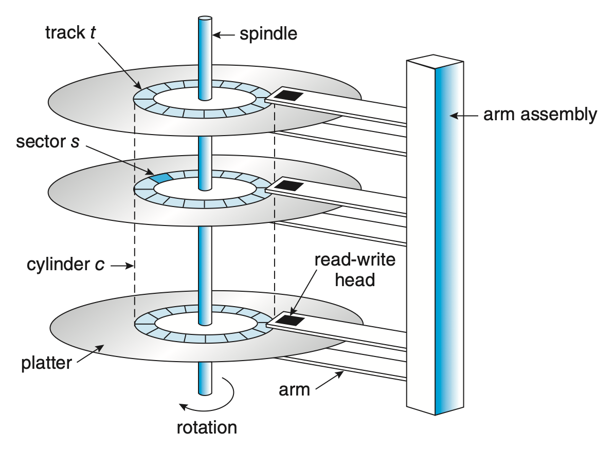
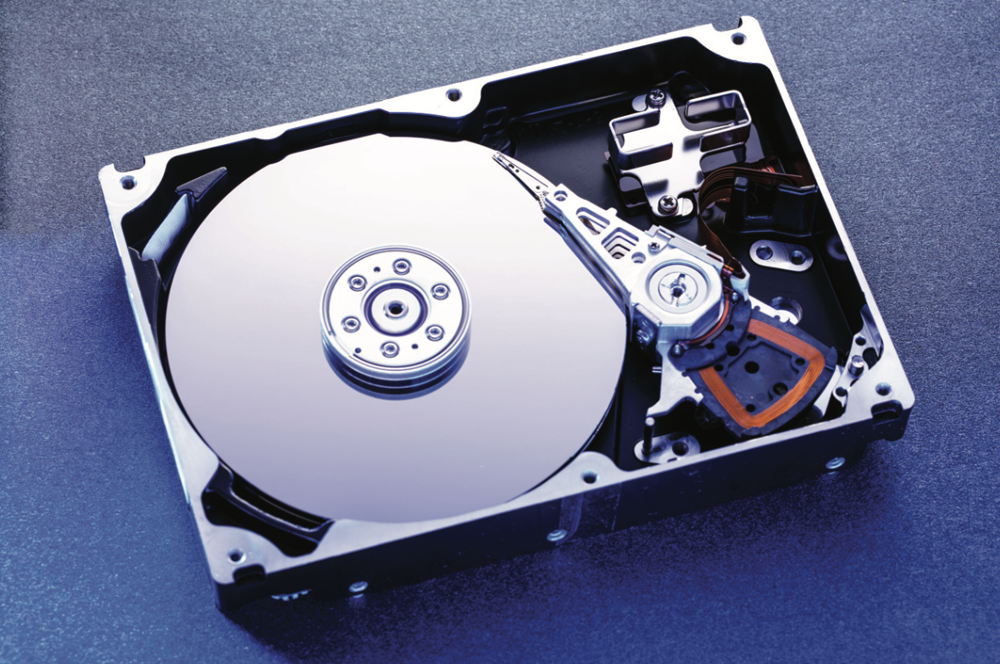
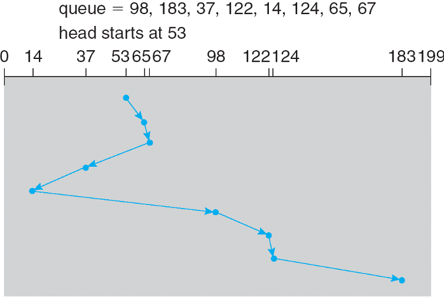
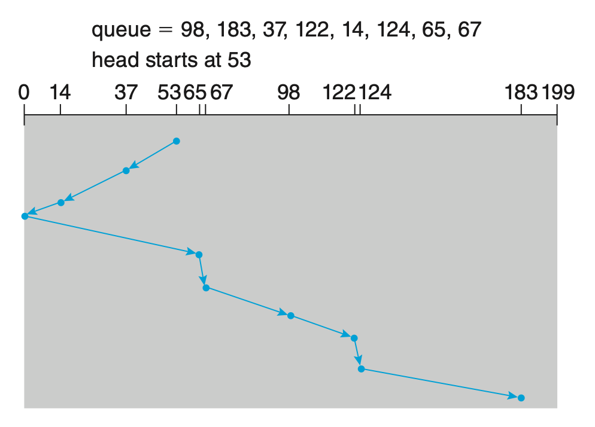
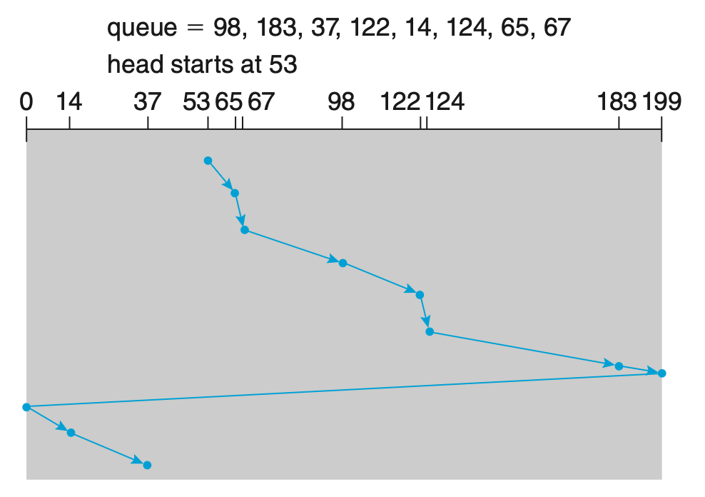
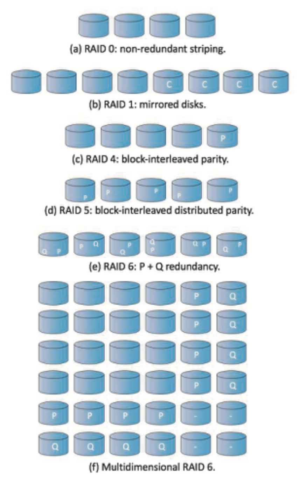
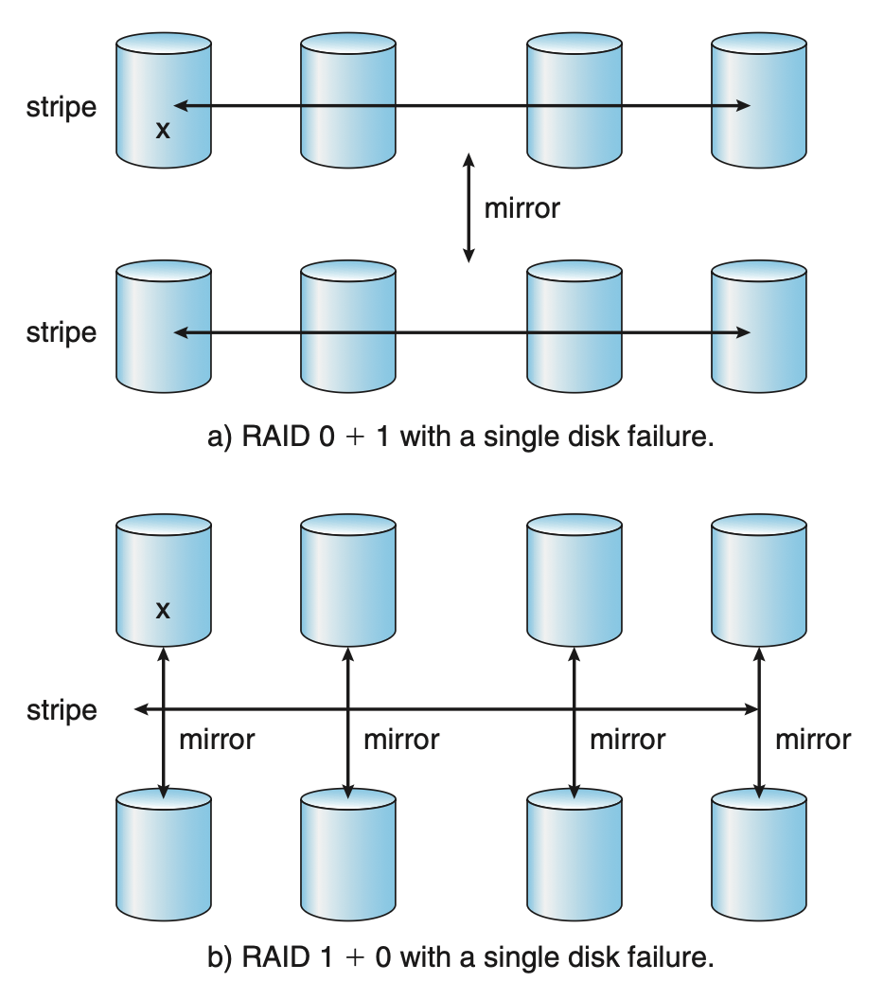

# Mass-Storage Structure

??? abstract "核心知识"

    - HDD
        - 构成
        - **调度算法**：FCFS、SSTF、SCAN、C-SCAN、C-LOOK
    - NVM
    - 存储设备管理
        - 磁盘格式化、分区、卷
        - 启动块
        - 坏块
    - 交换空间管理（仅需简单了解）
    - **RAID**：了解各等级 RAID 的特点

本章将介绍如何构建**大容量存储**(mass storage)，即计算机上的非易失存储系统。

## Overview

主要的大容量存储为**二级存储**(secondary storage)，通常由**硬盘驱动器**(hard disk drive, **HDD**)和非易失性内存(nonvolatile memory, **NVM**)设备提供。下面将解释其基本机制。

### Hard Disk Drives

HDD 的示意图如下：

    

- 磁盘包含多个形如 CD 的**盘片**(platter)，其表面覆盖磁性材料，用于存储和读取信息
- **读写头**(read-write head)会在每个盘片的表面上移动；它与**磁盘臂**(disk arm)连接，后者带动前者移动
- 从逻辑上看，盘片被划分为多个圆形的**磁道**(tracks)，而每个磁道又被划分为一个个**扇区**(sectors)
- 同一磁盘臂位置上的一组磁道构成了一个**磁柱**(cylinder)
- 磁盘驱动马达高速旋转，旋转速度单位为转每分(rotation per minute, **RPM**)
- **传输速率**(transfer rate)：数据流在磁盘和计算机间数据流动速率
- **定位时间**(positioning time) / **随机访问时间**(random-access time)由两部分构成：
    - **寻道时间**(seek time)：将磁盘臂移动到所需磁柱上的时间
    - **旋转时延**(rotation latency)：旋转磁盘头至所需扇区的时间
- 上述两个量反映了 HDD 的性能
    - HDD 的性能可通过磁盘控制器内的 DRAM 缓冲区进一步提升
- 尽管磁盘盘片上覆盖了一层薄的保护层，有时读写头仍然可能会破坏盘片的磁性表面，从而导致**头故障**(head crash)的发生；一般头故障无法被修复
- HDD 是密封单元，一些容纳 HDD 的机箱允许在不关闭系统或存储机箱的情况下拆卸它们

下图是 HDD 实际的样子：

    

### Nonvolatile Memory Devices

常见的非易失性内存（NVM）设备是由一个控制器以及闪存 NAND 半导体芯片组成，比如**固态硬盘**(solid state disk, **SSD**)、**USB 驱动**等。

相比 HDD，NVM 更可靠，因为 NVM 是电子结构而非机械机构，无需考虑寻道时间和旋转时延。另外 NVM 更省电。但 NVM 的缺点是更贵，且比大型 HDD 的容量更少。但是这几年 NVM 容量增长速度更快，且价格也在下降，所以 NVM 的优势会更明显。

由于 NVM 设备更快，因此**标准总线接口**(standard bus interface)将成为吞吐量的主要限制。为解决该问题，一些 NVM 设备可以直接连接到系统总线上（比如 **PCIe**）。该技术也改变了计算机设计的其他方面。

NVM 还有以下一些特点：

- 能够以**“页”增量**("page" increment)形式（类似 HDD “扇区”的概念）对其**读**和**写**，但数据无法被覆写，写之前必须先擦除原来的内容
- 而**擦除**操作发生在**“块”增量**("block" increment)下，即一次要擦除多个页，所以该操作相比一次读/写花费更多时间
- 解决方法是：NVM 设备由多个芯片(die)组成，并且在其中布置**多个数据通路**，因此操作可以**并行**进行（每个操作使用一个数据通路）
- 每次擦除都会磨损 NVM 设备；当某个单元的擦除次数超过一定次数后就无法再用于存储数据了
- NAND NVM 的生命周期用**每天驱动器写**(drive writes per day, DWPD)来测量，用于表示驱动器在故障之前每天可以写入的容量次数

由于 NVM 的内容无法被覆写，因此通常会存在一些包含无效数据的页。

    

为追踪哪个逻辑块包含有效数据，NVM 控制器维护了一个**闪存转换层**(flash translation layer, **FTL**)，用于映射当前包含有效逻辑块的物理页，并且会追踪物理块的状态。

假如向已被填满的 SSD 发起一个待处理的(pending)写请求。虽说“已被填满”，但可能会包含一些包含无效数据的块，因此可通过擦除这些块来满足待处理的写请求。这是一种**垃圾回收**(garbage collection)：好的数据被拷贝到其他位置上，释放能够被擦除的块，随后能够接收写请求。

但“好的数据”应该要被放到哪里呢？NVM 采用**超额分配**(over-provisioning)的技术：

- 预留了一定数量的页面（通常为总数的 20%）作为始终可写入的区域
- 如果设备已满，通过垃圾收集被无效化的块，或者通过写操作被无效化的旧版本数据都会被擦除，并放置在超额分配空间中，或者返回到空闲池中

超额分配空间也有助于**磨损均衡**(wear leveling)。如果某个块被重复擦除，那它就会比其他块磨损得更快。为避免这个问题，控制器尝试使用各种算法，将数据放置在擦除较少的块上，使得之后的擦除发生在擦除次数更少的块上，从而在整个设备上分摊磨损。
  

### Volatile Memory

- 虽然本章讲的是大容量存储，把易失性内存放在这里讲很奇怪，但事实上 DRAM 通常被用作大容量存储
- 具体来说，RAM 驱动器像二级存储一样工作，但由**设备驱动程序**创建，这些驱动程序从系统的 DRAM 中划分出一部分，并将其呈现给系统的其他部分，就好像它是一个存储设备
- 这些“驱动器”可以用作原始块设备，但更常见的是在它们上创建**文件系统**以进行标准文件操作
- RAM 驱动还可作为高速的临时存储空间

### Secondary Storage Connection Methods

二级存储通过**系统总线**或 **I/O 总线**和计算机连接，包括：

- ATA（高技术配置(advanced technology attachment)）
- SATA（串行(serial) ATA）
- eSATA
- SAS（串行连接(serial attached) SCSI）
- USB（通用串行总线(universal serial bus)）
- FC（光纤通道(fibre channel)）

其中最常见的是 **SATA**。而由于 NVM 更快，工业界又发明了一种特殊的快速接口 **NVMe**，直接将设备连接到系统的 PCI 总线，相比其他方法增加了吞吐量并降低时延。

总线上的数据传输由**控制器**(controller)（又叫**主机总线适配器**(host-bus adapter)）执行，分为主机控制器和设备控制器，分别控制两端。

### Address Mapping

- 存储设备被视为一个大型的一维逻辑块数组，其中**逻辑块**(logical blocks)是最小的传输单位，每个逻辑块映射一个物理区或半导体页
- 算法中通常采用**逻辑块地址**(logical block address)，而不是具体的扇区、磁柱、块、页之类的详细信息
- 在 HDD 上使用地址映射时，可以在理论上将一个逻辑块号转换为一个由柱面号、该柱面内的磁道号和该磁道内的扇区号组成的旧式磁盘地址；但在实践中这种转换很难实现，原因如下：
    - 大多数驱动器都有一些损坏的扇区，但这一点可通过从驱动器其他地方替换备用扇区来隐藏，不过这样做后，尽管逻辑块地址保持连续，但物理扇区位置发生了变化
    - 某些驱动器每磁道的扇区数不是常数
    - 磁盘制造商在内部管理 LBA 到物理地址的映射，因此 LBA 与物理扇区之间几乎没有关系
  
- 尽管存在这些不确定性，处理硬盘的算法往往假设逻辑地址与物理地址相对相关，也就是说**递增的逻辑地址往往意味着递增的物理地址**
- 在采用**恒定线性速度**(constant linear velocity, CLV)的介质上，每条磁道的位密度是均匀的：磁道离磁盘中心越远，其长度就越大，因此它可以容纳的扇区就越多
    - 从外区移动到内区时，每条磁道的扇区数量会减少；最外区的磁道通常比最内区的磁道多容纳 40% 的扇区
    - 当磁头从外磁道移动到内磁道时，驱动器会增加旋转速度，以保持头下数据移动的速度不变
    - 常用于 CD-ROM 和 DVD-ROM 驱动器
- 有时，磁盘的旋转速度可以保持恒定（**恒定角速度**(constant angular velocity)），但此时位密度从内磁道到外磁道逐渐降低，以保持数据速率恒定
    - 常用于硬盘中

## HDD Scheduling

为了让 HDD 更高效，需要**最小化访问时间**并**最大化数据传输带宽**。

- 访问时间 = 寻道时间 + 旋转时延
- 带宽 = 总的传输字节数 / 第一次请求到完成最后一次传输之间的总时间

我们可通过<u>管理存储 I/O 请求和服务的顺序</u>来同时提升这两个指标。

当进程需要向 HDD 发送 I/O，或从 HDD 接收 I/O 时，它会向 OS 发起一个系统调用。该请求包含以下信息：

- 操作是输入还是输出
- 表示操作文件的打开文件句柄
- 参与传输的内存地址
- 传输数据量

如果所需驱动器和控制器均空闲，则可以马上满足该请求；但只要有一个处于忙碌状态，请求就会被放在对应该驱动器的一个**待处理请求队列**(queue of pending requests)中。请求队列的设置可以优化性能，因为避免了读写头的寻道操作。

下面将会介绍一系列的 HDD 的调度算法，这些算法的目标包含了公平性、及时性和优化。由于无法知道读写头位置和物理块地址的具体信息，所以算法会假设 LBAs 的增加意味着物理地址的增加，作为一种近似。

### FCFS

最简单的磁盘调度形式是**先来先服务算法**(first-come, first-served(FCFS) algorithm)。它保证公平性，但服务速度慢。

???+ example "例子"

    假设请求队列中的 I/O 请求如下（数字表示物理块的编号）：

    

        98, 183, 37, 122, 14, 124, 65, 67
    

    采用 FCFS 的调度结果如下：

    

        
    

    其中最影响性能的两步是 122 -> 14 -> 124，因为这两步几乎相当于从头到尾来回一趟了！

### SSTF

**最短寻道时间优先**(shortest-seek-time-first, SSTF)算法选择对当前头位置而言寻道时间最小的请求。它和在 CPU 调度一讲中介绍的 [SJF 算法](5.md#shortest-job-first-scheduling)很像。该算法的一个问题是可能导致一些请求进入**饥饿**状态，所以它并**不**像 SJF 那样**是最优算法**。

???+ example "例子"

    

        
    

### SCAN

在 **SCAN 算法**中

- 磁盘臂开始于磁盘的一端，然后移动到另一端
- 在移动途中处理它遇到的请求，直到到达另一端
- 接着从另一端开始，读写头朝反方向移动，继续服务沿途的请求
- 所以读写头会在磁盘中持续地来回扫描，就好像建筑里的电梯一样，因而该算法有时又称为**电梯算法**(elavator algorithm)

???+ example "例子"

    接着前面的例子，现在应用 SCAN 算法。在调度前，我们需要知道读写头移动的方向，以及读写头当前的位置。假设读写头初始在 53（同上），并且向 0 移动，那么可以得到以下调度结果：

    

        
    

假设请求是均匀分布的，考虑当磁头到达一端并反转方向时的请求密度。

- 此时磁头前的请求相对较少，因为这些请求最近已经被服务过
- 请求密度最高的地方在磁盘的另一端，而这些请求的等待时间也是最长的
 
那么为什么不先去那里呢？这就是下一个算法的思想。

### C-SCAN

循环(circular) SCAN (**C-SCAN**) 调度是 SCAN 算法的变体，用于提供更均匀的等待时间。

- 类似 SCAN，读写头仍然会从一端移动到另一端，并服务沿途的 I/O 请求
- 然而，当读写头到达另一端时，它会**立即回到磁盘的起点**，而不再服务返回沿途的请求
- 所以 C-SCAN 会将磁盘上的磁柱（物理块）看作一个首尾相接的循环列表

>换句话说，C-SCAN 仅支持单向扫描请求。

???+ example "例子"

    依然针对同一个例子，下面是用 C-SCAN 调度算法的结果：

    

        
    

???+ note "变体：**C-LOOK**"

    C-LOOK 与 C-SCAN 的区别是不会走到底，而是到达最靠近边界的请求后就掉头。

    ???+ example "例子"

        

            
        

### Selection of a Disk-Scheduling Algorithm

虽然还有很多磁盘调度算法没有被介绍，但它们也很少被用到。

那么既然有这么多算法，我们该如何选择一个最佳算法呢？

- 对于任一特定的请求列表，我们可以定义一个检索的最优顺序
- 对于任何调度算法，性能很大程度上取决于请求的数量和类型
- SCAN 和 C-SCAN 在磁盘上有一个很大负载时表现更好，因为它们不太可能导致饥饿问题
- 当然这也意味着饥饿还是有可能发生的，这驱使 Linux 创建了**截止日期调度器**(deadline scheduler)
    - 它维护单独的读和写的队列，并且给予读更高的优先级，因为进程更可能在读操作上阻塞
    - 队列按 LBA 顺序排序，由 C-SCAN 实现
    - 截止日期保留四个队列：两个读，两个写；其中一个以 LBA 为序，另一个以 FCFS 为序

## NVM Scheduling

- NVM 通常采用简单的 **FCFS** 策略
    - 比如 Linux NOOP 调度器就是用 FCFS 策略的；但是它在此基础上稍加修改，还能合并相邻请求

- NVM 的读操作服务时间是均匀的，但写操作服务时间是不均匀的；基于这一发现，一些调度器仅合并相邻的写请求，并以 FCFS 顺序服务所有的读请求
- 随机访问 I/O 的衡量指标为每秒输入/输出操作(input/output operations per second, IOPS)
- 在随机访问 I/O 中，NVM 会比 HDD 快得多；但在顺序访问中，NVM 的优势并不大
- NVM 上的写操作比读操作慢
- 另外，NVM 上写操作的性能还取决于设备的饱和程度（用了多少容量）和磨损程度
- 一种提高 NVM 设备性能和生命周期的方法是让文件系统告诉设备何时文件被删除，这样设备就能擦除用于存储文件的块
- 垃圾回收必须收回被无效数据占据的空间，这意味着一次写最终导致了页写入，单页或多页的读取（通过垃圾回收），单页或多页的写入（对于来自垃圾回收快的好数据）
- 这种不是由应用而是由执行垃圾回收和空间管理的 NVM 设备的 I/O 请求创建被称为**写放大(write amplification)**，会极大影响设备的写操作性能

## Error Detection and Correction

- **错误检测**(error detection)
    - 通过检测出问题，系统能够在错误传播前停止操作，向用户和管理员报告错误，或警告可能开始故障或已经故障的设备
    - 大多数系统使用**奇偶校验位**(parity bits)来检测错误，该方法使用 XOR 运算，能检测奇数个比特的错误，而无法检测偶数个比特的错误
    - 奇偶校验位是一种**校验和**(checksum)，使用模算术在定长字上进行计算、存储和比较
    - 另一种常见于计算机网络的检测方法是**循环冗余校验**(cyclic redundancy check, CRCs)，使用哈希函数检测多比特错误

- **纠错码**(error correction code, **ECC**)既能检测也能纠正错误
    - 通过算法和额外的存储实现
    - 当控制器在正常输入/输出过程中写入一个扇区/页面的数据时，ECC 会根据所有被写入数据的字节计算出一个值并进行写入
    - 当读取该扇区/页面时，会重新计算 ECC，并与存储的值进行比较
    - 如果只有少量数据位被损坏，控制器能够识别出哪些位发生了变化，并计算出它们应该是什么正确值，然后报告一个可恢复的**软错误**(soft error)
    - 如果发生太多变化且 ECC 无法纠正错误，则会发出不可纠正的**硬错误**(hard error)信号

## Storage Device Management

### Drive Formatting, Partitions and Volumes

存储设备能够用来存储数据前，必须要被划分为可被控制器读写的扇区(sector)；另外还必须初始化 NVM 页，并创建 FTL（闪存转换层）。这一过程称为**低级格式化**(low-level formatting)（或**物理格式化**(physical formatting)）。

- 对于每个存储位置，低级格式化会用一种特殊的数据机构填充设备，该数据结构通常包含一个头部(header)、一个数据区域和一个尾部(trailer)
- 头部和尾部包含为控制器所用的信息，比如扇区/页编号或纠错码登

用更大的扇区大小格式化磁盘意味着每个磁道上的扇区数更少，但也意味着更少的被写入磁道的头部和尾部信息，以及更多的为用户数据提供的可用空间。

OS 在使用磁盘存文件前，需要先将自己的数据结构存储下来，具体分为以下三步：

1. 将设备划分为多个块或页构成的一个或多个组（**分区**(partition)）
    - OS 将每个分区看作单独的设备
    - 比如一个分区存储包含 OS 可执行代码副本的文件系统，一个分区存储交换空间，一个分区存储包含用户文件的文件系统等
    - 一些 OS 和文件系统在整个设备都由文件系统管理时自动执行分区操作
    - 分区信息被写入到存储设备的固定位置上
    - Linux 中，`fdisk` 命令用于管理存储设备上的分区
    - **挂载**(mounting)一个文件系统意味着让这个文件系统对系统中所有用户可用

2. **卷**(volume)的创建和管理
    - 该步骤既有隐式的，也有显式的
        - 隐式：文件系统直接被放在一个分区内，那么相应的卷已经准备好挂载和使用了
        - 显式：比如在多个分区或设备一起被使用，作为 RAID 集，并且一个或多个文件系统横跨多个设备时
    
    - Linux 的卷管理器为 `lvm2`
    - 「卷」也可以表示任何可挂载的文件系统，即便是一个包含文件系统的文件也算，比如 CD 映像文件

3. **逻辑格式化**(logical formatting)（或文件系统的创建）
    - OS 存储初始文件系统数据结构到设备上，这些数据结构包含了空闲和分配空间的映射、初始空目录等

分区信息还指示一个分区是否包含**可引导的文件系统**(bootable file system)（包含 OS）。标记为引导的分区用于建立文件系统的**根**。一旦它被挂载，所有其他设备及其分区的链接可以被创建。一般来说，计算机的文件系统包含了所有挂载的卷。

下图展示了 Windows 11 的磁盘管理工具，可以在里面查看设备、分区、卷和文件系统（~~和教材 Win 7 的也差不多，连图标都没变，不愧是五世同堂的系统~~）。

    

为提高效率，多数文件系统将块(block)组合成更大的块(chunk)，称为**簇**(cluster)。设备 I/O 通过块完成，而文件系统通过簇完成，有效确保 I/O 有更多的顺序访问，以及更少的随机访问特征。

### Boot Block

- 为了让计算机开始运行，必须有一个初始**引导加载程序**来运行
- 该程序通常很简单，存储在系统主板上的 NVM 闪存固件中，并映射到已知的内存位置
- 产品制造商可以根据需要更新它；但病毒也可以对其进行写入，从而感染系统
- 引导程序初始化系统的方方面面，包括从 CPU 寄存器到设备控制器以及主存的内容登
- 引导程序可以从二级存储中导入完整的引导程序；完整的引导程序存储在设备上一个固定位置的“引导块”中，它会从设备上的非固定位置加载并启动整个 OS
- 默认的 Linux 引导加载程序是 `grub2`
- 具有启动分区的设备称为**启动磁盘**(boot disk)或**系统磁盘**(system disk)

### Bad Blocks

由于磁盘具有运动部件和小的公差，于是很容易发生**故障**(failure)。

- 有时故障是完全的，此时需要更换磁盘，并将其内容从备份介质恢复到新磁盘
- 更常见的情况是只有一个或多个扇区有缺陷(defective)，即存在**坏块**(bad block)；大多数磁盘甚至在出厂时就带有坏块

根据使用的磁盘和控制器，这些坏块以多种方式处理：

- 在较旧的磁盘上，坏块是**手动**处理的
    - 一种策略是在格式化磁盘时扫描磁盘以查找坏块，任何发现的坏块都会被标记为不可用，以便文件系统不为它们分配文件
    - 如果在正常操作期间出现坏块，则必须手动运行一个特殊程序（例如 Linux 的 `badblocks` 命令）来搜索坏块并将其锁定
    - 通常，位于坏块上的数据会丢失

- 更精密的方法——**扇区备份**(sector sparing)或**转发**(forwarding)
    - 控制器维护着磁盘上坏块的列表，该列表在出厂时进行**低级格式化**时初始化，并在磁盘使用期间不断更新
    - 低级格式化还会预留出 OS 不可见的备用扇区。可以指示控制器用其中一个备用扇区逻辑地替换每个坏扇区
    - 这类重定向可能会使 OS 的磁盘调度算法的优化失效，因此大多数磁盘都格式化为在每个磁柱中提供一些备用扇区，以及一个备用磁柱；当重映射坏块时，（若可能）控制器会使用同一磁柱中的备用扇区
    - 另一种替代方案是通过**扇区滑动**(sector slipping)替换坏块

在可恢复的**软错误**中，设备可能会会制作块数据的副本，并将该块标记为备用或滑移；但无法恢复的**硬错误**则会导致数据丢失，因此使用该块的任何文件必须进行修复，需要人工干预。

---
NVM 设备也有在制造时非功能性或随着时间推移而失效的位、字节甚至页面。管理这些故障区域比 HDD 简单，解决方案有：

- 将多个页面预留出来作为替换位置
- 或者使用超额配置区域中的空间（减少超额配置区域的可用容量）。

无论哪种方式，控制器都会维护一个坏页表，并且从不将这些页设置为可写入，因此它们不会被访问。

## Swap-Space Management

**交换空间管理**(swap-space management)是 OS 的一个低级任务。

- 虚拟内存使用二级存储空间作为主存的扩展
- 由于驱动器访问速度远慢于内存访问，使用交换空间会**显著降低系统性能**
- 设计和实现交换空间的主要目标是为虚拟内存系统提供最佳**吞吐量**

本节我们将讨论交换空间如何使用、交换空间在存储设备上的位置以及如何管理交换空间。

### Swap-Space Use

交换空间的使用具体取决于所采用的内存管理算法。

- 实现交换的系统可能会使用交换空间来保存整个进程映像，包括代码段和数据段
- 分页系统可能仅仅存储已被推出主存的页面
  
因此，一个系统所需的交换空间量可以从几兆字节到几个千兆字节不等，这取决于物理内存的大小、虚拟内存的大小以及虚拟内存的使用方式。

**高估**所需的交换空间可能比低估**更安全**，因为

- 如果系统耗尽了交换空间，它可能被迫中止进程或完全崩溃
- 高估虽然会浪费一些存储空间，但不会造成其他损失，因此一些系统建议为交换空间预留一定的数量。

包括 Linux 在内的一些 OS 允许使用多个交换空间，包括文件和专用交换分区。

### Swap-Space Location

交换空间存在于以下两个位置之一：

- 如果交换空间只是文件系统中的一个大文件，则可以使用正常的**文件系统**例程来创建、命名，并为它分配空间
- 在一个单独的**原始分区**(raw partition)中
    - 使用一个单独的交换空间存储管理器来从原始分区中分配和释放块
    - 该管理器使用针对**速度**优化的算法，而不是针对存储效率，因为交换空间在使用时比文件系统更频繁地被访问
    - **内部碎片**可能会增加，但这种权衡是可以接受的，因为交换空间中的数据生命周期通常远短于文件系统中的文件；由于在启动时重新初始化交换空间，因此任何碎片都是短暂的
    - 这种原始分区方法在磁盘分区期间创建**固定数量**的交换空间；所以若想增加交换空间大小，要么对设备重新分区，要么在其他地方添加一个交换空间

## Storage Attachment

计算机通过以下几种方式访问二级存储：

- 主机附接存储
- 网络附接存储
- 云存储

### Host-Attached Storage

**主机附接存储**(host-attached storage)是通过本地 I/O 端口访问的存储。这些接口采用多种技术，其中最常用的是 SATA。

为了让系统获取对更多存储的访问，存储设备可通过诸如 **USB FireWire** 或 **ThunderBolt**（雷电/雷雳）接口或线缆和系统连接。一些高端工作站和服务器还支持**光纤通道**(fibre channel, FC)等更精密的 I/O 架构。

常见的存储设备都支持这类存储。

### Network-Attached Storage

**网络附接存储**(network-attached storage, **NAS**)是通过网络访问的存储。

    

- NAS 设备可以是专用存储系统，也可以是通过网络向其他主机提供存储的一般计算机系统
- 客户端通过 RPC（远程过程调用）接口（通过 TCP 或 UDP 在 IP 网络上传输）来访问 NAS
    - 比如 Linux 和 UNIX 系统的 **NFS**，Windows 的 **CIFS** 等**协议**
- NAS 单元通常作为一个存储阵列实现，配备实现 RPC 接口的软件
- NFS 和 CIFS 提供了各种锁功能，使得访问 NAS 的主机之间能够共享文件
- NAS 为 LAN 中的所有计算机提供了一种方便的方式，能以同样简单的命名和访问来共享池存储，就像使用本地的主机附加存储一样
- 然而，它往往效率较低，性能也不如某些直接附加存储的选项
- iSCSI 是最新的 NAS 协议，本质上使用 IP 网络协议传输 SCSI 协议

### Cloud Storage

**云存储**(cloud storage)类似 NAS，也是通过网络访问的存储，但是通过因特网或其他 WAN 来访问远程数据中心的存储。

NAS 和云存储的另一个不同是存储是如何被访问的，以及如何呈现给用户的。

- NAS 通过集成在 OS 中的协议被访问的
- 而云存储是**基于 API 的**，所以程序通过 API 访问云存储
    - 之所以使用 API 而不是现有的协议，一个原因是考虑到 WAN 的时延和故障

### Storage-Area Networks and Storage Arrays

NAS 的一个缺点是存储 I/O 消耗数据网络的带宽，因而增加了网络通信的时延。为避免该问题，我们可以采用**存储区域网络**(storage-area network, **SAN**)，它是一个连接服务器和存储单元的私有网络，如下图所示：

    

- SAN 的强大之处在于其**灵活性**
- 多个主机和多个存储阵列可被附接到相同的 SAN，且存储能被动态分配到主机上
- 存储阵列可以用 RAID 保护，也可以是未被保护的（磁盘簇(just a bunch of disks, **JBOD**)）
- SAN 通常有多个端口，但成本更高
- SAN 的连接是短距离的，通常没有路由

## RAID Structure

一类叫做**独立磁盘冗余阵列**(redundant arrays of independent disks, **RAID**s)的磁盘组织技术常用于解决有关磁盘的性能和可靠性问题，下面就来详细介绍。

### Improvement of Reliability via Redundancy

解决磁盘可靠性问题的方案是引入**冗余**(redundancy)：存储通常不需要的额外信息，但能够在磁盘故障事件发生时被用来重构丢失的信息。

最简单（但也是开销最大）的方法是复制每个磁盘，即**镜像**(mirroring)方法。

- 每个逻辑磁盘包含 2 个物理磁盘，每次逻辑写操作都会触发 2 次物理写操作
- 其结果称为**镜像卷**(mirrored volume)
- 镜像卷的 **MTBF**（平均故障间隔时间(mean time between failure)）取决于以下因素：
    - 单个磁盘的 MTBF
    - **平均修复时间**(mean time to repair)：替换故障的磁盘，并恢复其中的数据

实际上不能假设磁盘的故障是独立的，因为要考虑诸如断电和自然灾害、同批次制造瑕疵、磁盘老化等因素。我们主要关心断电问题，因为发生频率相对更高。

### Improvement in Performance via Parallelism

有了多个磁盘后，我们可通过并行访问提升性能。具体来说，通过**数据条带化**(data striping)提高数据传输速率。

- 最简单的形式是将每个字节的位分散到多个磁盘中，即**位级条带化**(bit-level stripping)
    - 假如有一个由 8 个磁盘构成的阵列，我们将每个字节的第 i 位写入驱动器 i
    - 这个阵列可以被视为一个单一的驱动器，其扇区大小是正常大小的 8 倍，更重要的是访问速率也是正常速度的 8 倍
    - 每个驱动器都参与每次访问（读/写），因此每秒可以处理的访问次数大约与单个驱动器相同，但每次访问在相同时间内可以读取的数据量是单个驱动器的 8 倍

- 另一种更常用的条带化形式是**块级条带化**(block-level stripping)
    - 比如一个文件的块会横跨多个磁盘进行条带化
    - 如果有 n 个驱动器，文件的第 i 块将分配给 (i mod n) + 1 号磁盘上

存储系统的并行有两个主要目标：

- 通过负载均衡增加多个小访问（即页访问）的**吞吐量**
- 减少大访问的**响应时间**

### RAID Levels

下面列出最常见的一些 **RAID 级别**(RAID levels)：

    

>图中 P 表示纠错位，C 表示数据的第二个副本

- RAID 级别 0：块级条带化 + 无任何冗余
- RAID 级别 1：镜像
- RAID 级别 4：**内存式纠错码组织**(memory-style error-correction-code organization)
    - 通过在磁盘之间对块进行条带化，**ECC** 的思路可以直接应用于存储阵列中
    - 纠错计算结果放在第 N+1 个磁盘中，即图中标注了 P 的磁盘
    - 当其中一个磁盘发生故障时，纠错码会通过重新计算而检测出该故障，阻止相应数据传给请求进程并抛出错误
    - 磁盘控制器能检测扇区是否被正确读取，所以单个奇偶校验块能用于纠正和检测错误
    - **读-修改-写循环**(read-modify-write cycle)：OS 写入小于块大小的数据时，需要先读取该块，使用新数据进行修改，然后再写回；另外奇偶校验块也要同时更新
        - 因此一次写要求四次磁盘访问：两次对旧块的读取 + 两次对新块的写入

    - 相比级别 1，级别 4 的优势在于：
        - 存储开销减少，因为多个常规磁盘只需要一个用于存奇偶校验的磁盘
        - 读/写一组块的传输速率是级别 1 的 N 倍（N 路条带化）

    - 但它存在的性能问题是计算和写入 XOR 奇偶校验位的开销，这可能导致更慢的写操作
    - 许多 RAID 存储阵列或主机总线适配器包括具有专用奇偶校验硬件的硬件控制器
    - RAID 存储阵列还具有 **NVRAM 缓存**，用于存储在计算奇偶校验时的块，并缓冲从控制器到驱动器的写入
        - 这种缓冲可通过将要写入的数据聚集到一个完整的条带中，并同时写入条带中的所有磁盘中，以避免大多数读-修改-写循环

- RAID 级别 5：**块交错分布奇偶校验**(block-interleaved distribute parity)
    - 对于 N 个块构成的集合，其中一个磁盘存储奇偶校验位，其余磁盘存储数据
    - 通过在整个阵列中的所有磁盘上分散奇偶校验，避免了可能出现的单个用于存储奇偶校验的磁盘的过度使用

- RAID 级别 6：**P + Q 冗余方案**(P + Q redundancy scheme)
    - 类似于 RAID 级别 5，但存储额外的冗余信息，以防止多个磁盘故障
    - 使用如伽罗瓦域数学等纠错码来计算 Q，代替奇偶校验

- 多维 RAID 级别 6：逻辑上将驱动器排列成行和列（两个或多个维度的阵列），并在行中水平以及在列中垂直实现 RAID 6 级别
- RAID 级别 0 + 1 或 1 + 0：
    - 0 + 1：
        - RAID 0 提供性能，而 RAID 1 提供可靠性
        - 通常性能优于 RAID 5，在对性能和可靠性都很重要的环境中是常见的选择
        - 但如同 RAID 1，所需存储驱动器的数量将会翻倍，因此成本相对更高
        - 磁盘均被被条带化，随后所有条带都会被镜像到另一个等效的条带上

    - 1 + 0：
        - 磁盘成对镜像，然后将生成的镜像对进行条带化
        - 该方案在理论上比 RAID 0 + 1 具有一些优势。例如，
            - 如果在RAID 0 + 1中单个驱动器故障，则整个条带无法访问，只剩下另一个条带
            - 而在RAID 1 + 0 中，单个驱动器不可用，但其镜像的驱动器仍然可用，其余所有驱动器也都是可用的

    

RAID 有以下实现方式：

- 在内核或系统软件层中使用卷管理软件
- 在主机总线适配器(HBA)硬件中
- 在存储阵列硬件中
- 在 SAN 互联层中，通过数据虚拟化设备
- **快照**(snapshot)：在上一次更新发生前的文件系统视图
- **复制**(replication)：涉及在不同站点之间自动重复写入，以实现冗余和灾难恢复
- **热备份**(hot spare)：不用于数据，而是在磁盘故障时作为替代品使用，使得 RAID 得以自动地重新构建

### Selecting a RAID Level

- RAID 级别 0 用于高性能且数据丢失不要紧的应用
- RAID 级别 1 重构最容易，在需要高可靠性和快速恢复的应用中很流行
- RAID 0 + 1 和 RAID 1 + 0 用于在性能和可靠性都重要的场景
- RAID 5 更偏好适度量的卷数据
- RAID 6 和多维度 RAID 6 是存储阵列中最常用的格式

### Problems with RAID

- RAID 并不总能确保数据对 OS 及其用户可用
    - 比如指向文件的指针可能是错误的，或者文件结构中的指针可能是错误的
    - 如果未正确恢复，不完整写入（称为“撕裂写入(torn writes)”）可能导致数据损坏
    - 其他进程也可能意外覆盖文件系统的结构
- RAID 可以防止物理介质错误，但无法防止其他硬件和软件错误
- 硬件 RAID 控制器故障或软件 RAID 代码中的 bug 都可能导致完全的数据丢失