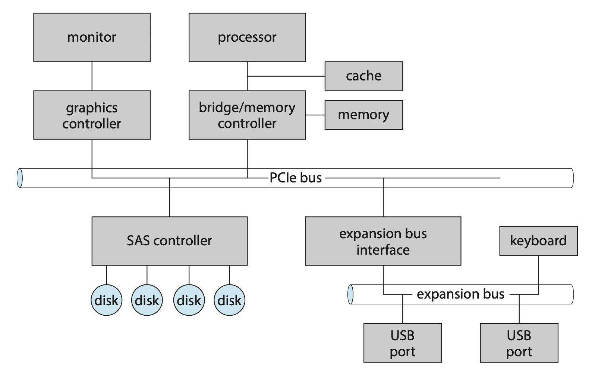
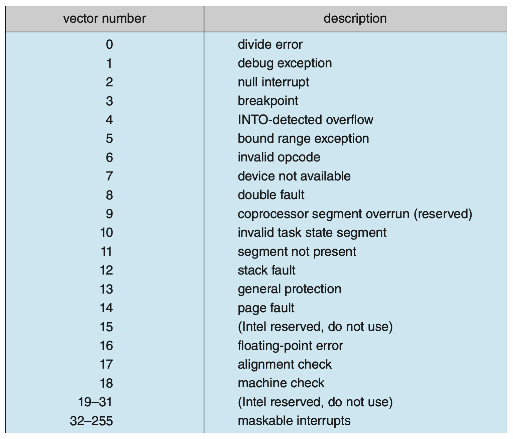
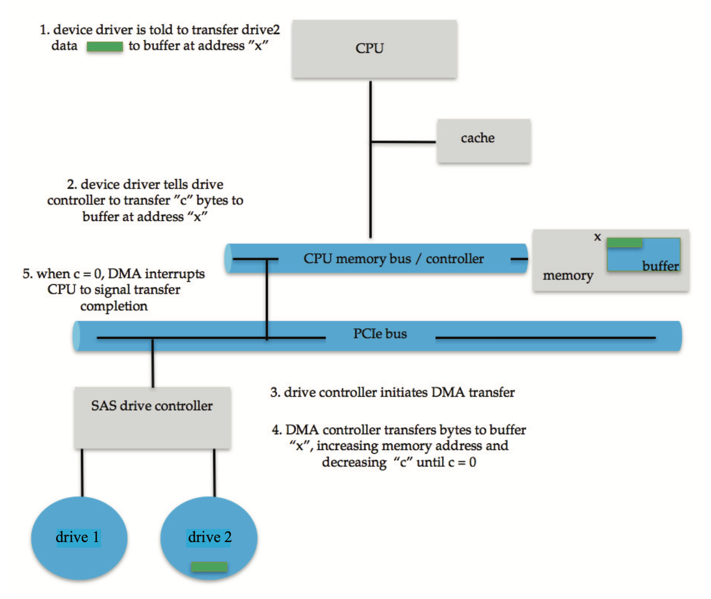
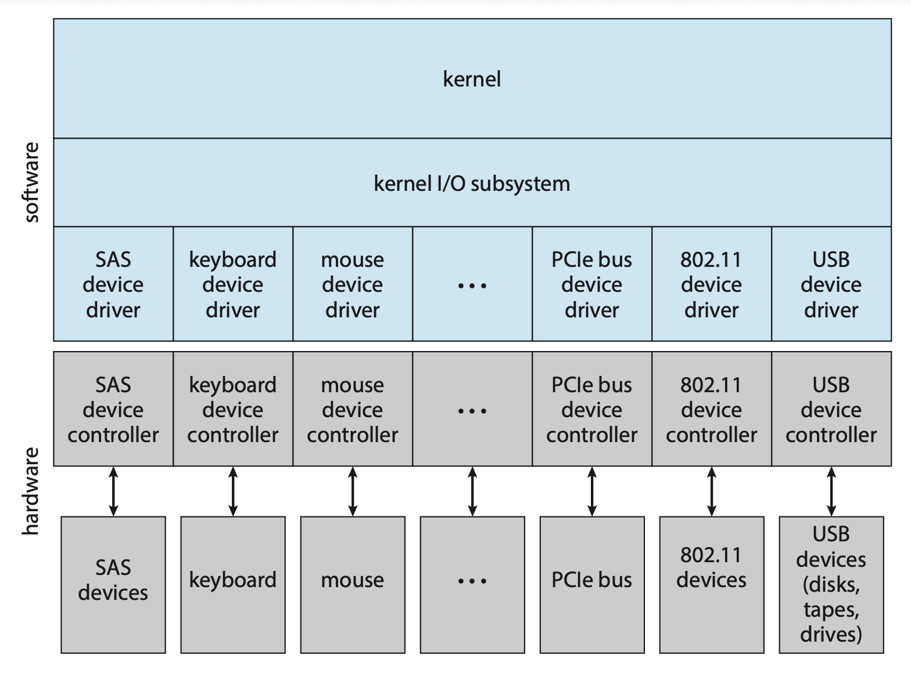
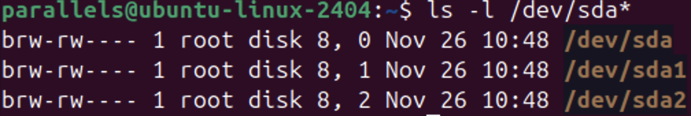

# I/O Systems

??? abstract "核心知识"

    本章看起来就不像重点，~~感觉顶多出一道选择题考察一下~~。

    - I/O 硬件
        - 内存映射 I/O
        - 轮询
        - 中断
        - DMA
    - 应用 I/O 接口
        - 块/字符 I/O
        - 时钟/定时器
        - 阻塞/非阻塞 I/O、同步/异步 I/O
        - 向量化 I/O

OS 在计算机 I/O 中的任务是管理和控制 I/O 操作和设备。这些控制设备的方法构成了内核的 I/O 子系统，将内核的其他部分和管理 I/O 设备的复杂性分离开来。

I/O 设备的技术发展有两个矛盾的趋势：

- 软件和硬件接口的标准化程度提升
- I/O 设备种类的增加

**设备驱动程序**(device drivers)提供了一种统一的面向 I/O 子系统的设备访问接口。

## I/O Hardware

计算机可以操作很多种类的设备，这些设备大致可以归类为存储设备（磁盘、磁带等）、传输设备（网络连接、蓝牙等）和人机交互设备（屏幕、键盘、鼠标、音频输入/输出等）。

- 设备和计算机之间的通信会经过一种叫做**端口**(port)的连接点
- 若设备共享一组公共的线，那么这种连接就称作**总线**(bus)
    - 总线还包含一个严格定义的**协议**，指明线路可以发送的一组消息
    - **菊花链**(daisy chain)：一种将多个设备或节点依次首尾相连的连接方式，通常作为总线操作
    - 下图展示了一种典型的 PC 总线结构：

        

            
        

        - **PCIe 总线**连接了处理器-内存子系统和高速设备
            - PCIe 是一种通过一个或多个“通道”发送数据的总线；而通道由一个接收数据的信号对和一个传输数据的信号对构成，因此每个通道有 4 根线路，并且采用全双工字节流

        - **扩展总线**连接了相对较慢的设备，比如键盘，以及串行和 USB 端口
        - **SAS 总线**将 4 个磁盘连接起来，并插入到 SAS 控制器上

- **控制器**(controller)：操作端口、总线和设备的电子器件集合
    - 串行端口控制器
    - 光纤通道(fibre channel, FC)总线控制器：作为单独的电路板或**主机总线适配器**(host bus adapter, HBA)实现

### Memory-Mapped I/O

处理器向控制器发送命令和请求，以完成 I/O 传输的方法是：通过在控制器的（用于数据和控制信号的）**寄存器**上读/写位模式(bit patterns)实现处理器和控制器之间的通信。实现方式有：

- 使用**特殊的 I/O 指令**（过去所用的方法）
    - 指明传输字节/字和 I/O 端口地址
    - 下面列举了部分设备的 I/O 端口位置

        

            
        

- 或者支持**内存映射 I/O**(memory-mapped I/O)
    - 将设备控制寄存器映射到处理器的地址空间上
    - CPU 使用**标准的数据传输指令**来读和写位于物理内存位置上的设备控制寄存器，从而执行 I/O 请求
    - 如今大多数 I/O 都采用这种方法

I/O 设备控制通常包含 4 个寄存器，分别是：

- **数据入寄存器**(data-in register)：被主机读取，以获得输入
- **数据出寄存器**(data-out register)：被主机写入，以发送输出
- **状态寄存器**(status register)：包含可被主机读取的表示**状态**(states)的位，比如当前命令是否已完成，数据入寄存器内是否有可读的字节，以及是否发生设备错误等
- **控制寄存器**(control register)：可被主机写入，以启动命令或改变设备模式

数据寄存器的大小通常在 1-4 字节左右。一些控制器具有 **FIFO 芯片**，可以存储多个字节的输入或输出数据，从而扩展控制器的容量，可超出数据寄存器的大小。

### Polling

下面用一个例子介绍主机和控制器之间的**握手**(handshaking)概念。假设使用 2 个位来协调控制器和主机之间的生产者-消费者关系。

- 控制器使用 `status` 寄存器内的 `busy` 位表示自身状态
    - 当控制器正在工作时，`busy` 位置(set) 1
    - 当控制器准备接收下一条命令时，`busy` 位清(clear) 0

- 主机通过 `command` 寄存器的 `command-ready` 位发送请求
    - 当控制器执行的命令可用时，`command-ready` 位置 1

在这个例子中，假如主机通过端口写入输出，那么它和控制器通过以下方式合作：

1. 主机重复读取 `busy` 位直到 `busy = 0`
2. 主机将 `command` 寄存器的 `write` 位置 1，并将一个字节写入 `data-out` 寄存器内
3. 主机将 `command-ready` 位置 1
4. 当控制器注意到 `command-ready` 位置 1 时，它将 `busy` 位置 1
5. 控制器读取 `command` 寄存器并看到 `write` 命令，于是读取 `data-out` 寄存器，以获取字节并让设备执行 I/O 操作
6. 控制器将 `command-ready` 位清 0，并将 `status` 寄存器的 `error` 位清 0，表示设备 I/O 成功；且将 `busy` 位清 0，表示当前命令结束

对于每个字节，重复上述循环。

在步骤 1 中，主机处于**忙碌等待**(busy-waiting)或**轮询**(polling)状态：循环读取 `status` 寄存器，直到 `busy` 位清 0。对于高速设备和控制器而言，这种方法是合理的。但等的太久的话，主机就会切换至别的任务上。

在很多计算机架构中，三个 CPU 指令周期足以轮询一个设备：

- `read`：读取设备的寄存器
- `logical-and`：提取状态位
- `branch`：非 0 则跳转

因此基本的轮询操作是高效的。然而，当轮询被反复尝试，却很少有准备好服务的设备时，该操作将变得低效，且其他有用的 CPU 处理仍未完成。解决方案是下面介绍的中断。

### Interrupts

>其实我们早在[第一讲](1.md#interrupts)就介绍过这个话题（笔者写完这部分才发现和之前讲的东西高度重合...）

<!-- 基本的中断机制如下：

- CPU 每执行完一条指令后就会检查**中断请求线**(interrupt-request line)
- 当检测到控制器向这条线路发送信号时（**引发**(raise)中断），CPU 会（**捕获**(capture)中断）保存当前状态，并跳转到固定位置上的**中断处理程序**(interrupt-handler routine)（将中断**分派**(dispatch)给处理程序）
- 中断处理程序确定中断原因，执行必要的处理（**清除**(clear)中断）和状态恢复，以及执行「从中断返回」的指令，使得 CPU 返回到中断之前的执行状态

上述机制使得 CPU 能够响应一个异步事件，例如当设备控制器准备好服务时。然而在现代的 OS 中，需要有更多精密的中断处理功能：

- 在关键处理过程中**延迟**中断处理
- 需要一种高效的，在不用对所有设备发起首次轮询的情况下能够为设备分派正确的中断处理程序的方法
- **多级中断**，使得 CPU 能够在有多个并发中断的情况下区分高优先级和低优先级的中断，以正确的紧急程度来响应
- 需要一种让指令能够直接引起 OS 注意的方法（与 I/O 请求分开），用于处理页错误和诸如除以零等错误（即「陷阱(traps)」）

这些功能由 CPU 和**中断控制器硬件**(interrupt-controller hardware)提供。

多数 CPUs 有两种中断请求线：

- **不可屏蔽的**(nonmaskable)中断：为不可恢复的内存错误等事件保留
- **可屏蔽的**(maskable)中断：可在执行关键指令序列（期间不可发生中断）前由 CPU 关闭，为请求服务的设备控制器所用

中断机制接受一个指明具体中断处理程序的地址；这个地址通常是一张表的偏移量，称为**中断向量**(interrupt vector)。向量化中断的目的是减少单个中断处理程序搜索所有可能的中断源，以确定哪个需要服务的需求。

有时计算机拥有的设备比中断向量中的地址元素要多，解决方案是使用**中断链**(interrupt chaining)：

- 中断向量的每个元素指向中断处理程序列表的头
- 当触发中断时，对应列表上的处理程序将依次被调用，直到找到一个可以处理请求的处理程序
- 这个结构是在庞大的中断表的开销和调度到单个中断处理程序的低效率之间的一种折衷

下图展示了 Intel Pertium 处理器的中断向量设计：

    

中断机制实现了**中断优先级**(interrupt priority levels)系统，使得 CPU 在无需屏蔽所有中断的情况下延迟低优先级中断的处理，使得高优先级中断抢占低优先级中断的执行成为可能。

中断机制还用于处理各种**异常**(exceptions)，比如除以零、访问受保护的或不存在的内存地址，或尝试在用户模式下执行特权指令。这些事件的一个共有性质是：它们是导致 OS 执行紧急、自包含例程的事件。

因为在许多情况下，中断处理受到时间和资源的限制，因此实现起来很复杂。系统通常将中断管理分为

- **一级中断处理程序**(first-level interrupt handler, **FLIH**)：执行上下文切换、状态存储和处理操作的排队
- **二级中断处理程序**(second-level interrupt handler, **SLIH**)：处理请求的操作

线程化的内核架构非常适合实现多个中断优先级，并在内核和应用程序例程中强制执行中断处理优先于后台处理。 -->

### Direct Memory Access

对于需要进行大量传输的设备，使用通用处理器和控制器寄存器的成本太高（这个过程被称为**程序化输入/输出**(programmed I/O)）。事实上，计算机将部分工作移交给一种称为**直接内存访问**(direct memory access, DMA)控制器的专用处理器，从而避免给 CPU 带来 PIO 负担。

- 要启动 DMA 传输，主机将一个 DMA 命令块写入内存
    - 该块包含指向传输源的指针、指向传输目的地的指针以及要传输的字节数计数
    - 块的内容可以更复杂，比如包括一系列不连续的源和目的地址；这种**分散-聚集**(scatter-gather)方法允许通过单个 DMA 命令执行多个传输

- DMA 控制器直接操作内存总线，将地址放置在总线上以执行传输，而无需 CPU 的帮助
- 为了将 DMA 传输的数据复制到用户空间以便线程访问，需要执行第二次复制操作（从内核内存到用户内存），即**双重缓冲**(double buffering)，这是不高效的
    - 现在 OS 已经转向使用**内存映射**来在设备和用户地址空间之间直接执行 I/O 传输

- DMA 控制器与设备控制器之间的握手通过一对称为 **DMA 请求**(request)和 **DMA 确认**(acknowledge)的线路进行
    - 当有一个数据字可供传输时，设备控制器会在 DMA 请求线上放置一个信号
    - 这个信号使得 DMA 控制器占用内存总线，将所需地址放置在内存地址线上，并在 DMA 确认线上放置一个信号
    - 当设备控制器接收到 DMA 确认信号时，它将数据字传输到内存并移除 DMA 请求信号

- 下图展示了 DMA 传输的过程：

    

        
    

## Application I/O Interface

本节将介绍 OS 中使得 I/O 设备能够以标准、统一的方式进行处理的结构化技术和接口。

我们可以通过识别几种通用类型来抽象出 I/O 设备的详细差异。每种通用类型都通过一组标准化的函数，即**接口**(interface)进行访问。这些差异被封装在称为**设备驱动程序**的内核模块中，这些模块内部是针对特定设备量身定制的，但它们导出了其中一种标准接口。下图展示了内核 I/O 结构：

    

设备驱动层的目的是隐藏设备控制器之间的差异，使其对内核的 I/O 子系统透明，就像 I/O 系统调用将设备的行为封装在几个通用类中，以隐藏硬件差异，使应用程序不受影响。

不幸的是，对于设备硬件制造商来说，每种 OS 都有其自己的设备驱动接口标准，因此某个特定的设备可能会配备多个设备驱动程序。

设备间的差异可以从以下几个维度来看：

- **字符流/块**(character-stream / block)
- **顺序/随机访问**(sequential / random access)
- **同步/异步**(synchronous / asynchronous)
- **共享/专用**(sharable / dedicated)
- **操作速度**(speed of operation)
- **读-写/只读/一次写**(read-write / read only / write once)

OS 提供的访问方式：

- 主要的访问方式包括块 I/O、字符流 I/O、内存映射文件访问和网络套接字
- 一些特殊系统调用来访问一些附加设备，比如时钟和定时器、图形显示器、视频和音频设备等

大多数 OS 也有一个**转义**(escape)（或**后门**(backdoor)），可以透明地将任意命令从应用程序传递给设备驱动程序。在 UNIX 中，这个系统调用是 `ioctl()`（用于 I/O 控制）。

- 它能让应用程序访问任何设备驱动程序可以实现的功能，而无需发明新的系统调用
- `ioctl()` 有三个参数：
    - 设备标识符，通过引用由该驱动管理的硬件设备，将应用程序与驱动连接起来
    - 一个整数，用于选择在驱动中实现的某个命令
    - 指向内存中任意数据结构的指针，使得应用程序和驱动能够通信任何必要的控制信息或数据

UNIX 和 Linux 中的设备标识符是（**主设备号**，**次设备号**）的元组，分别表示设备类型和该设备的实例。比如：

    

其中 8 是主设备号，0, 1, 2 是次设备号。

### Block and Character Devices

**块设备接口**(block-device interface)捕获了访问磁盘驱动器和其他块导向设备所需的所有方面。

- 该设备能够理解如 `read()` 和 `write()` 的命令
- 如果它是一个随机访问设备，还应具备 `seek()` 命令，以指定下一个要传输的块
- 应用程序通常通过文件系统接口访问这样的设备
- 上述命令捕获了块存储设备的基本行为，从而使应用程序与这些设备之间的低层级差异隔离开来

OS 本身以及数据库管理系统等特殊应用程序，可能更倾向于将块设备作为简单的线性块数组进行访问；这种访问模式有时称为**原始 I/O**(raw I/O)。原始设备访问将设备的控制权直接传递给应用程序，让 OS 退居幕后，但这样一来就不会对该设备执行任何 OS 服务了。一个流行的折衷方案是，OS 允许在文件上进行一种**禁用缓冲和锁**的操作模式，即**直接 I/O**。

**内存映射文件访问**可以建立在块设备驱动程序之上。

- 内存映射接口提供通过主存中的字节数组访问磁盘存储，而不是提供读写操作
- 这对程序员而言十分方便，因为访问内存映射文件就像从内存读取和写入一样简单
- 映射接口也常用于内核访问磁盘上的交换空间

---
另一种方式是通过**字符流接口**访问设备。

- 该接口中的基本系统调用使应用程序能够 `get()` 或 `put()` 一个字符
- 在此接口之上，可以构建提供逐行访问、缓冲和编辑服务的库

### Network Devices

这块属于计网部分，不做介绍。

### Clocks and Timers

多数计算机的时钟和定时器提供了以下（为 OS 频繁使用的）基本功能：

- 提供**当前时间**
- 提供**经过时间**(elapsed time)
- 设置定时器，在时间 T 触发 X 操作

用于测量经过时间和触发操作的硬件称为**可编程间隔定时器**(programmable interval timer)。

- 可以设置成等待一定时间，然后生成一个中断，并且可以设置为一次性执行，或重复该过程以生成周期性中断
- 应用：
    - **调度器**使用此机制在进程的时间片结束时生成一个中断，以抢占该进程（RR）
    - **磁盘 I/O** 子系统利用它来调用脏缓存缓冲区定期刷新到磁盘
    - **网络子系统**则用它来取消因网络拥堵或故障而进行得过慢的操作
- OS 还可能提供接口，供用户进程使用定时器
- OS 可以通过模拟**虚拟时钟**，支持比定时器硬件通道数量更多的定时请求
    - 为了做到这一点，内核（或定时器设备驱动程序）维护一个由其自身例程和用户请求所需中断的列表，按最早时间优先排序
    - 它将定时器设置为最早时间
    - 当定时器产生中断时，内核会通知请求者并重新加载下一个最早时间的定时器

计算机具有用于多种目的的时钟硬件，**高性能事件定时器**(high perforamce event timer, HPET)就是其中一种。

- 其运行频率在 10 MHz 范围内
- 它有几个比较器，可以设置为在它们所持有的值与 HPET 的值匹配时一次或重复触发
- 触发会生成一个**中断**，OS 的时钟管理例程确定定时器的用途以及采取什么行动
- 触发的精度受到计时器分辨率和维护虚拟时钟开销的限制
- 此外，如果使用定时器滴答来维护系统时间，则系统时钟可能会**漂移**(drift)
    - 可通过专门设计协议进行校正，例如**网络时间协议**(network time protocal)，该协议使用复杂的延迟计算将计算机的时钟保持准确，几乎达到原子钟水平

### Nonblocking and Asynchronous I/O

当应用程序发出一个**阻塞**(blocking)系统调用时，

- 调用线程的执行会被挂起，该线程从 OS 的运行队列移到等待队列
- 在系统调用完成后，该线程会被移回运行队列并恢复执行，此时将接收到系统调用返回的值
- 虽然 I/O 设备所执行的物理操作通常是**异步的**（需要不同或不可预测的时间），但 OS 为应用程序接口提供了阻塞系统调用，因为编写阻塞应用程序代码比编写非阻塞应用程序代码**更容易**

不过一些用户级进程需要**非阻塞 I/O**。实现方式有：

- 编写**多线程应用程序**：一些线程可以执行阻塞系统调用，而其他线程继续执行
- 一些 OS 提供**非阻塞 I/O 系统调用**：快速返回一个指示传输字节数的返回值

非阻塞系统调用的替代方案是**异步系统调用**：

- 立即返回，不等待 I/O 完成
- 线程继续执行其代码；在未来某个时间，I/O 的完成通过在线程的地址空间中设置某个变量或通过触发信号、软件中断或回调例程来通知线程，这些操作是在该线程的线性控制流之外执行的
- 非阻塞和异步系统调用之间的区别在于
    - 非阻塞 `read()` 会立即返回可用的数据，请求的字节数、少于请求数量的数据，或者根本没有数据
    - 而异步 `read()` 调用请求一个将在将来某个时间完整执行的传输

这两种 I/O 方法如下所示：

    

### Vectored I/O

**向量化 I/O**允许一个系统调用执行涉及多个位置的多个 I/O 操作。同样的数据传输可以通过几个单独的系统调用来实现，但这种**分散-聚集**方法因多种原因而非常有用。

- 多个独立的缓冲区可以通过一个系统调用传输其内容，从而**避免上下文切换和系统调用开销**
    - 如果没有向量化 I/O，数据可能需要先按照正确顺序转移到一个更大的缓冲区中，然后再进行传输，这样效率较低

- 此外，一些散布-聚集版本提供**原子性**，确保所有 I/O 在不被打断的情况下完成，并避免在其他线程也涉及这些缓冲区进行 I/O 时数据损坏

如有可能，程序员应利用散布-聚集 I/O 特性来提高吞吐量并减少系统开销。

---
>太累了，下面的东西不想写了，应该不会考吧...

## Kernel I/O Subsystem

### I/O Scheduling

### Buffering

### Caching

### Spooling and Device Reservation

### Error Handling

### I/O Protection

### Kernel Data Sturctures

### Power Management

## Transforming I/O Requests to Hardware Operations

## STREAMS

## Performance