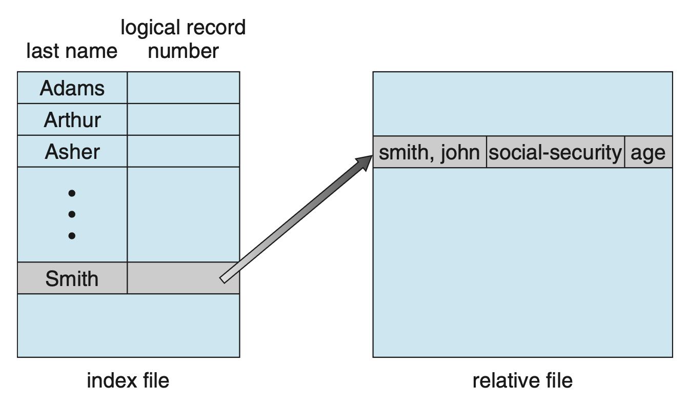
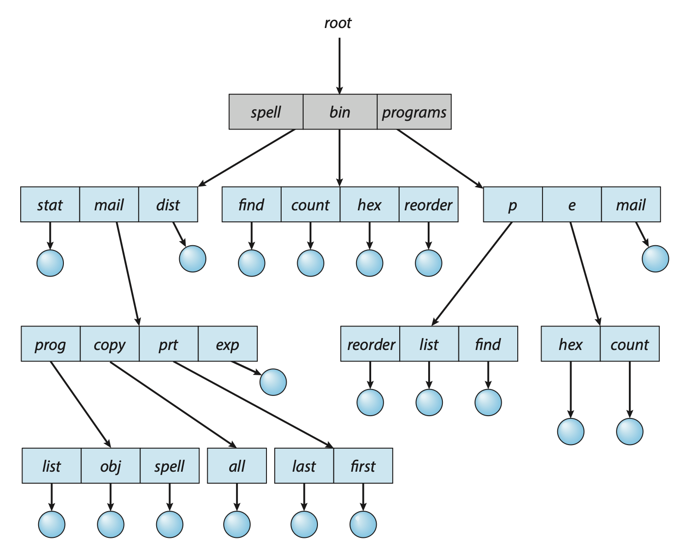
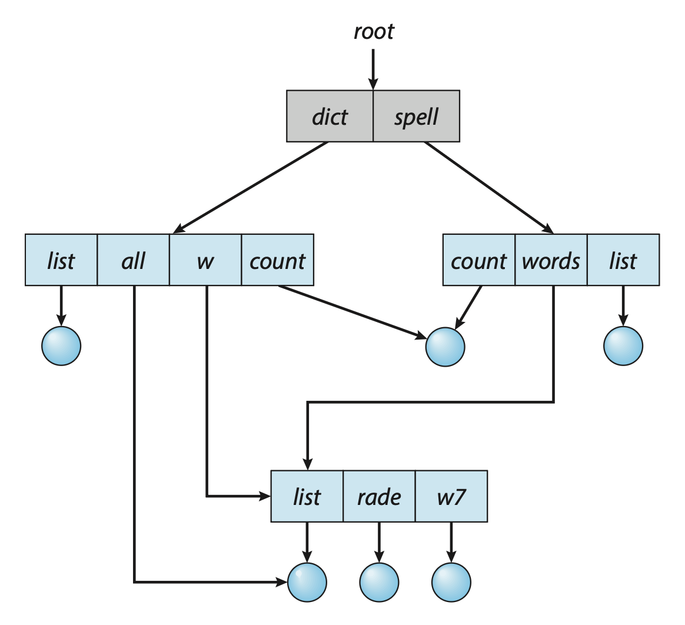
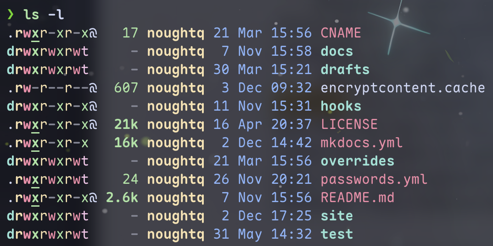
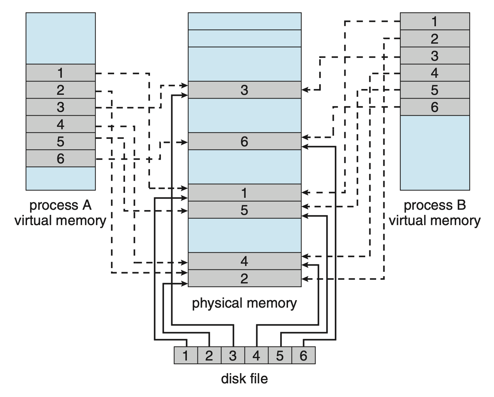

# File-System Interface

## File Concepts

- **文件**(files)是一个记录在二级存储上的具名相关信息集合
- 从用户视角看，文件是逻辑二级存储的最小分配分配单元(allotment)；也就是说，数据除非写在文件内，否则就无法写入二级存储中。文件通常表示程序和数据
- 文件的形式可以是自由的，也可以是严格格式化的
- 一般来说，文件就是一个关于位/字节/行/记录的序列，其意义由文件创建者和用户定义
    - 因为文件有各种类型，比如文本文件、源文件、可执行文件等
- 因为文件是用户和应用程序用来存储和检索数据的方法，再加上它们的通用性，因此其使用已经超出了最初的范围
    - 比如 UNIX 系统的 `proc` 文件系统提供了访问系统信息的接口。

### File Attributes

- 当文件被命名后，它将独立于进程、用户以及创建该文件的系统存在
- 除非提供共享和同步方法，否则文件的拷贝将独立于被拷贝的文件存在，即可以单独改变文件的内容

文件属性因 OS 而异，但通常包含以下内容：

- **名称**：唯一以人类可读形式保存的信息
- **标识符**：用于识别文件系统内的文件的唯一标签，通常用数字表示；它是文件的不为人类可读的名称
- **类型**
- **位置**：包含一个指向设备和文件在该设备位置的指针
- **大小**：当前文件大小，也可能包含最大允许大小的信息
- **保护**：访问控制信息，决定谁能读取/写入/执行该文件
- **时间戳**和**用户标识**：保存了创建、最近修改和最近使用信息

一些最新的文件系统还支持**扩展文件属性**(extended file attributes)，包括文件的**字符编码**(character encoding)和诸如**校验和**(checksum)的安全功能等。

所有文件的信息都被保存在**目录**结构中。通常一个目录项由文件名及其唯一标识符构成；标识符用于定位其他文件属性。

??? info "macOS 上的文件信息窗口（++cmd+i++）"

    <figure style=" width: 30%" markdown="span">
        
        
        <figcaption></figcaption>
    </figure>

### File Operations

OS 提供系统调用来实现各类文件操作，包括：

- **创建**文件：在文件系统中为文件找到空间 -> 在目录中创建关于新文件的条目
- **打开**文件：除创建和删除外的文件操作都要先调用 `open()`，若调用成功，则返回一个作为其他调用的参数的**文件句柄**(file handle)
- **写入**文件：系统必须保留一个指向文件内下一次写发生时的位置的**写指针**（若为顺序访问），并且在写操作发生时更新写指针
- **读取**文件：
    - 系统必须保留一个指向文件内下一次读发生时的位置的**读指针**（若为顺序访问），并且在读操作发生时更新读指针
    - 由于进程经常有同时有读取和写入的需求，所以每个进程可都用一个**当前文件位置指针**(current-file-position pointer)，读写操作均用该指针，这样可以节省空间并降低系统复杂度
- 文件内**重定位**(reposition)：
    - 按给定值重定位当前文件位置指针
    - 文件内的重定位不需要用到真实 I/O
    - 该文件操作又称为文件**查找**(seek)
- **删除**文件：
    - 在目录中搜索要删除的文件，找到关联的目录项，然后释放其全部空间（让这些空间能被其他文件复用），并且删除目录项（或将其标记为空闲）
    - 一些系统支持**硬链接**(hard links)，即多个名称（目录项）用于相同的文件，此时只有当最后一个链接被删除时才能删除该文件
- **截断**(truncate)文件
    - 擦除文件内容，但仍然保留属性（除了文件长度）
    - 文件长度可重置为0，并且释放文件空间

这些基本操作构成了所需文件操作的最小集合，其他操作可通过结合这些基本操作来实现。比如创建文件副本就同时需要创建、读取和写入文件的操作。

---
前面提到过，多数文件操作包含一个搜索关联具名文件的目录项的操作。为避免这一行为，很多系统要求在文件第一次使用时调用 `open()` 系统调用；OS 保留一张**打开文件表**(open-file table)，包含所有打开文件的信息。

- 当请求一个文件操作时，文件通过该表的索引指定，因此无需搜索
- 当文件关闭时，OS 将其从表中移除
- `create()` 和 `delete()` 是在关闭而非打开文件上工作

某些系统在首次引用文件时会**隐式**打开该文件；当打开文件的作业或程序终止时，文件会自动关闭。然而，大多数系统要求程序员在使用文件之前，必须通过 `open()` 系统调用**显式**地打开该文件。`open()` 通常返回一个指向打开文件表中条目的指针。该指针用于所有 I/O 操作，避免了进一步的搜索，并简化了系统调用的接口。

在多个进程可以同时打开同一文件的情况下，`open()` 和 `close()` 操作的实现更加复杂。通常 OS 提供了两级内部表：

- **进程级表**(per-process table)：追踪进程打开的所有文件
- **系统级表**(system-wide table)：包含独立于进程的信息，比如文件在磁盘上的位置、访问日期、文件大小等

和打开文件关联的信息有：

- **文件指针**(file pointer)：
    - 在不将文件偏移量作为 `read()` 和 `write()` 系统调用一部分的系统中，系统必须跟踪**最后的读写位置**作为当前文件位置指针
    - 该指针对于每个在文件上运行的进程是唯一的，因此必须与磁盘上的文件属性分开保存
- **文件打开计数**(file-open count)：
    - 当多个进程打开同一文件时，系统必须等待最后一个文件关闭后才能移除对应的打开文件表的条目
    - 文件打开计数即正在打开该文件的进程数；每次调用 `close()` 都会减少该计数
    - 当打开计数为 0 时，表明文件不再使用，并且该文件项将从打开文件表中移除

- **文件位置**(location of the file)：
    - 定位文件所需的信息都保存在内存中，这样系统不必在每次操作时从目录结构中读取它
- **访问权限**(access rights)

---
一些 OS 提供了**锁住**打开文件的功能。文件锁分为**共享锁**(shared lock)和**独占锁**(exclusive lock)。需要注意的是不是所有 OS 提供这两类锁——一些系统只提供了独占锁。

另外，锁机制分为**强制性**(mandatory)和**建议性**(advisory)。

- 强制性锁：一旦一个进程获取独占锁，OS 会阻止其他进程访问被锁住的文件，确保锁的完整性
- 建议性锁：不阻止其他进程访问被锁住的文件，但要在访问文件前手动获取锁；由软件开发者确保锁的合适获取和释放

文件锁的使用需要与普通进程同步相同的预防措施。

- 在具有**强制性锁**的系统上开发的程序员必须小心：仅在访问文件时保持独占文件锁，否则将阻止其他进程访问该文件
- 还必须采取一些措施，以确保两个或多个进程在尝试获取文件锁时不会陷入**死锁**

### File Types

一种常见的实现文件类型的技术是<u>将类型作为文件名的一部分</u>，因此文件名包含两部分：名称和**扩展名**(extension)，中间用点号(period)间隔。下面列举了一些常见的文件类型：

    

扩展名并不是必需的，所以用户可以指定一个没有扩展名的文件，此时应用程序将查找具有给定名称和预期扩展名的文件。我们可以将扩展名视为对处理它们的应用程序的一种“提示”。

每个文件都有一个创建者属性，包含了创建该文件的程序名，由 `create()` 调用设置。

UNIX 系统会在一些二进制文件开头存储一个**魔数**(magic number)，用于指示文件的数据类型。但并不是所有文件都有魔数，因此系统功能不能仅仅基于这些信息。

### File Structure

- 文件类型能够指示文件的内部结构
- OS 支持多文件结构的一个缺点是让 OS 变得大而笨拙
- 一些操作系统强制（并支持）最少数量的文件结构。这种方法已在 UNIX、Windows 等系统中采用
    - UNIX 将每个文件视为一系列 8 位字节；操作系统不会对这些位进行任何解释
    - 该方案提供了最大的灵活性，但支持较少
    - 每个应用程序必须包含自己的代码，以根据适当的结构解释输入文件

- 然而，所有 OS 必须至少支持**可执行文件**这一种结构，以便系统能够加载和运行程序

### Internal File Structure

在 OS 内部**定位文件中的偏移量**可能会很复杂：

- 磁盘系统通常具有由扇区大小决定的明确定义的块大小
- 所有磁盘 I/O 都是以一个块（物理记录）为单位进行的，并且所有块的大小相同
- 物理记录大小不太可能与所需逻辑记录的长度完全匹配，甚至逻辑记录的长度不一定相同

**将多个逻辑记录打包到物理块中**是解决此问题的一种常见方法。比如 UNIX 将所有文件定义为简单的字节流；每个字节都可以通过其相对于文件开头（或结尾）的偏移量单独寻址。

逻辑记录大小、物理块大小和打包技术决定了每个物理块中包含多少个逻辑记录。**打包**可以由用户的应用程序或操作系统完成；无论哪种情况，文件都可以被视为一系列的块。

将所有内容保持在块（而不是字节）单位中所产生的浪费称为**内部碎片**。所有文件系统都受到内部碎片的影响；块大小越大，内部碎片就越严重。

## Access Methods

### Sequential Access

最简单、最常用的访问方法是**顺序访问**(sequential access)：按顺序（一个记录一个记录地）处理文件内的信息。

- 读和写构成了文件操作的主体部分
    - `read_next()`：读取文件的下一部分，并自动移动跟踪 I/O 位置的文件指针
    - `write_next()`：追加到文件末尾，并移动指针到新写入数据的末尾（新的文件末尾）

- 文件可以重置到开始处，并且在某些系统上，程序可以向前或向后跳过 n（整数）条记录
- 顺序访问基于文件的磁带模型，在顺序访问设备和随机访问设备上都能良好运作

    

### Direct Access

第二种访问方法是**直接访问**(direct access)（或**相对访问**(relative access)）。

- 此时文件由定长的逻辑记录组成，允许文件不以特定顺序在记录上读和写
- 直接访问方法基于文件的磁盘模型，因为磁盘允许随机访问任意文件块
- 文件被看作带编号的记录或块序列
- 常用于大量信息的即时访问，比如数据库查询
- 文件操作需要将块编号 `n` 作为参数使用
    - `read(n)`
    - `write(n)`
    - `position_file(n)` + `read_next()`/`write_next()` == `read(n)`/`write(n)`

- 块编号通常为**相对块编号**(relative block number)，是一个相对于文件起始处的索引；它能让 OS 决定文件的放置位置（称为**分配问题**(allocation problem)），并能阻止用户访问不属于当前文件的文件系统部分。

不是所有的 OS 同时支持顺序访问和直接访问的。我们可以通过简单地保持一个定义当前位置信息的变量 `cp` 来轻松模拟直接访问文件上的顺序访问，如下图所示。然而，在顺序访问文件上模拟直接访问文件是非常低效且笨拙的。

    

### Other Access Methods

其他访问方法可以建立在**直接访问**方法之上，这些方法通常需要为文件构建**索引**(indices)，即指向各个块的指针。要在文件中找到记录，首先搜索索引，然后使用索引直接访问文件以找到所需的记录。

    

对于大文件，索引文件本身可能变得太大而无法保存在内存中。一个解决方案是**为索引文件创建一个索引**。**主索引**(primary index)文件包含指向次索引文件的指针，而**次索引**(secondary index)文件则指向实际的数据项。

## Directory Structure

**目录**(directory)可以被视为一个**符号表**，它将文件名转换为它们的文件控制块。目录本身可以以多种方式组织，因此本节将研究几种定义目录系统逻辑结构的方案。

在正式介绍这些方案前，先来了解一下关于目录的一些操作：

- **搜索**文件
- **创建**文件
- **删除**文件
- **列出目录**(list the directory)：列出目录中的文件，以及列表中每个文件的目录项内容
- **重命名**(rename)文件
    - 重命名文件也可能允许其在目录结构中的位置发生变化（比如 Linux 的 `mv` 命令既可用于重命名，也可用于移动文件或目录）
- **遍历**(traverse)文件系统：
    - 我们可能希望访问目录结构中的每个目录和每个文件
    - 将所有文件复制到磁带、其他辅助存储或通过网络传输到另一个系统或云来实现定期保存整个文件系统的内容和结构
    - 这为我们提供了在系统故障时的备份副本
    - 若某个文件不再使用，可以将该文件复制到备份目标，并释放该文件的磁盘空间以供其他文件重新使用

### Single-Level Directory

最简单的目录结构是**单级目录**(single-level directory)：所有的文件被包含在相同的目录中。

    

单级目录有很大的局限，尤其是在文件数量激增时：因为要求每个文件名都是唯一的，所以大量的文件就会产生大量的文件名；要想记住所有的文件名是一件很困难的事。

### Two-Level Directory

在**两级目录**(two-level directory)结构中，

    

- 每个用户有自己的**用户文件目录**(user file directory, **UFD**)
    - UFD 和单级目录的结构相似，但只限于单个用户

- 当用户作业开始或用户登录时，需要找到系统的**主文件目录**(master file directory, **MFD**)
    - MFD 使用用户名或账号索引，每一项指向对应用户的 UFD

当用户引用某个文件时，只会在自己的 UFD 中搜索；因此不同用户可以有名称相同的文件。

一个特殊的系统程序负责创建一个新的 UFD，并在 MFD 中添加一个对应的条目，从而实现用户目录本身的创建和删除；此程序的执行可能仅限于系统管理员。

虽然两级目录结构解决了名称冲突问题，但它仍然有缺点：该结构有效地将一个用户与另一个用户**隔离**开来。

- 当用户完全独立时，隔离是一种优势（一些系统不允许其他用户访问本地用户文件）
- 但当用户希望在某项任务上合作并访问彼此的文件时，这就是一种劣势

若允许访问不同用户的文件，该用户必须能够在另一个用户的目录中命名文件。

- 为了在二级目录中唯一地命名特定文件，必须提供**用户名**和**文件名**
- 二级目录可以被视为一棵高度为 2 的树或倒置树
    - 树的根是 MFD
    - 直接后代是 UFDs
    - UFDs 的后代就是文件本身，它们是树的叶子

- 指定用户名和文件名定义了从根（MFD）到叶子（指定文件）的路径，因此用户名和文件名定义了**路径名称**(path name)
    - 为了唯一地命名一个文件，用户必须知道所需文件的路径名称

需要额外的语法来指定文件所在的**卷**。不过 UNIX 和 Linux 简单地将卷名作为目录名的一部分。

这种情况的一个特殊实例出现在**系统文件**上。**程序**通常被定义为文件。当向 OS 发出适当命令时，这些文件会被加载器读取并执行。许多命令解释器简单地将这样的命令视为要加载和执行的文件名。在上述定义的目录系统中，该文件名将在当前的 UFD 中进行搜索。

- 一种解决方案是将系统文件复制到每个用户文件目录中
    - 但复制所有系统文件会浪费大量空间

- 标准的解决方案是稍微复杂化搜索过程：定义一个包含系统文件的**特殊用户目录**。
    - 每当给定要加载的文件名时，OS 首先搜索本地 UFD
    - 如果找到该文件，则使用它；如果未找到，该系统会自动搜索包含系统文件的特殊用户目录

当命名一个文件时，被搜索的目录序列称为**搜索路径**(search path)。我们可以扩展搜索路径，以包含在给定命令名称时要搜索的无限列表目录。这种方法是在 UNIX 和 Windows 中最常用的方法。

### Tree-Structured Directories

接下来我们将目录结构扩展为**任意高度的树**（如下图所示），使得用户创建自己的子目录并相应地组织他们的文件；这是最常见的目录结构。

    

- 树有一个**根目录**，系统中的每个文件都有一个唯一的路径名
- 目录（或子目录）包含一组文件或子目录
- 在许多实现中，目录也被视作文件，但是经特殊方式处理
- 每个目录项中的有一位用来定义该项是文件（0）还是子目录（1）
- 通过特殊系统调用来创建和删除目录
- 每个进程都有一个**当前目录**(current directory)，包含了大多数与该进程当前相关的文件
    - 当引用某个文件时，会搜索当前目录
    - 如果需要的文件不在当前目录中，用户必须指定路径名，或将当前目录更改为包含该文件的目录

- 要**更改目录**，可以提供一个系统调用，该调用以目录名称作为参数，并用它来重新定义当前目录
- 用户登录 shell 时的**初始当前目录**在用户作业开始或用户登录时指定
    - OS 会搜索**记账文件**(accounting file)，以查找该用户的条目
    - 在记账文件中有一个指向（或该）用户初始目录的指针，这个指针被复制到一个本地变量中，指定了用户的初始当前目录
    - 从该 shell 中，可以生成其他进程；任何子进程的当前目录通常是其父进程生成时的当前目录

- 路径名分为：
    - **绝对路径名**(absolute path name)：始于根节点，并沿着路径到达指定文件，给出路径上的目录名称
        - 例子：`/spell/mail`
    - **相对路径名**(relative path name)：从当前目录出发定义路径
        - 例子：`prt/first`

- 一个值得探讨的策略决策：如何处理目录的**删除**
    - 如果一个目录是空的，可以直接删除目录条目
    - 但假设要删除的目录不是空的，而是包含多个文件或子目录，可以采取两种方法之一：
        - 一些系统不会删除非空目录
            - 因此要删除一个目录，用户必须首先删除该目录中的所有文件
            - 如果存在任何子目录，则必须递归地对其应用此过程，从而删除子目录
            - 但这种方法的 workload 太大
        - 提供一个选项：当请求删除一个目录时，该目录下所有文件和子目录也将被删除
            - UNIX `rm` 命令正是这么做的
    
    - 这两种方法都相对容易实现，但后一种策略更方便，但也更危险，因为整个目录结构可以通过一条命令被移除
        - 如果该命令错误地发出，将需要恢复大量文件和目录（假设存在备份）

### Acyclic-Graph Directories

树状结构的局限是禁止文件或目录的共享；而**无环图**(acyclic graph)（即没有循环的图，可视为树状结构的推广）允许目录**共享**子目录和文件，如下图所示。

    

- 同一个文件或子目录可以出现在两个不同的目录中
- 共享文件（或目录）!= 两个文件副本
    - 拥有两个副本时，每个程序员看到的是副本而不是原始文件，因此如果一个程序员更改了文件，另一个人的副本中不会出现这些更改
    - 而共享文件只有一个实际存在的文件，因此任何人所做的更改会立即对其他人可见

- 共享对子目录而言相当重要；一个人创建的新文件将自动出现在所有共享的子目录中
- 共享文件和子目录可以通过多种方式实现
    - 创建一个称为**链接**(link)的新目录项，它是指向另一个文件或子目录的指针
        - 可以作为绝对路径名或相对路径名来实现
        - 当引用某个文件时，我们会搜索该目录；如果该目录项被标记为链接，则实际文件的名称包含在链接信息中
        - 我们通过使用该路径名来解析链接，以定位真实文件
        - 在遍历目录树时，OS 忽略这些链接，以保持系统的无环结构

    - 在两个共享目录中**复制**(duplicate)所有关于它们的信息，因此这两个条目是相同且等价的
        - 主要问题：文件被修改时需要保持**一致性**(consistency)

- 相比简单的树形结构，无环图更灵活，但也更复杂
    - 文件现在可能有多个绝对路径名，因此**不同的文件名可能指向同一个文件**
        - 如果试图遍历整个文件系统，这个问题变得非常重要，因为我们不想多次遍历共享的结构
    - 关于**删除**：共享文件分配的空间何时可以被释放和重用？
        - 一种可能性是每当有人删除文件时就移除该文件，但这个操作可能会留下指向现在不存在的文件的**悬空指针**(dangling pointer)
        - 更糟糕的是，如果剩余的文件指针包含实际的磁盘地址，而这些空间随后被其他文件重用，这些悬空指针可能会指向其他文件的位置

    - 在一个通过符号**链接**实现共享的系统中，这种情况相对更容易处理
        - 删除一个链接不必影响原始文件，因为只有链接被移除
        - 如果文件条目本身被删除，文件所占用的空间将被释放，留下悬挂的链接
        - 此时可以搜索这些链接并将其删除，但除非与每个文件一起保留相关链接的列表，否则这个搜索可能会很耗费资源
        - 所以可以保留这些链接，直到尝试使用它们时再处理
        - 在 UNIX 中，当一个文件被删除时，符号链接会保留，用户需要留心原始文件已经消失或已被替换

    - 另一种删除方法是**保留文件，直到所有引用都被删除**
        - 要实现这种方法，可以保持一个所有引用某个文件的列表，从而确定对文件的最后一个引用已被删除
        - 但有一个问题：文件引用列表的大小是可变的，并且可能很大
        - 其实并不需要保留整个列表，只需要**保留引用数量**即可
            - 添加一个新的链接或目录条目会增加引用计数
            - 删除一个链接或条目会减少计数
            - 当计数为 0 时，文件可以被删除，因为没有剩余的引用指向它
            - UNIX 在非符号链接（或**硬链接**(hard link)）中使用了这种方法

无环图的主要优点是：遍历图以及确定何时不再有对文件的引用的算法相对简单。

- 主要出于性能考虑，我们希望避免两次遍历无环图中的共享部分

### General Graph Directory

如果允许目录结构存在**环**(cycles)的话，那么原来的无环图结构就进一步泛化为**通用图**(general graph)结构，如下所示：

    

出于正确性和性能的考虑，如果允许在目录中存在环，我们同样希望避免重复搜索任何组件。一个设计不良的算法可能导致**无限循环**，不断在环中搜索而无法终止。一个解决方案是**限制在搜索过程中将被访问的目录数量**。

另外，当存在循环时，即使不再可能引用某个目录或文件，引用计数也可能不是 0，这是由于目录结构中**自我引用**（或环）的可能性导致的。此时，我们通常需要用**垃圾回收**(garbage collection)方案来确定上次引用被删除，以及磁盘空间能够被重分配的时间。

- 垃圾回收会遍历整个文件系统，标记所有可以访问的内容，随后通过第二次遍历将未标记的内容收集到空闲空间列表中
- 但这种做法耗时太长，因此很少被采用

显然无环图结构更容易处理，但问题在于在向结构添加新链接时需要避免产生环。

- 一种解决方案是采用**检测**环的算法，确定何时因新的链接导致环的出现。但这些算法计算开销很大，尤其是在图存储在磁盘上时
- 在目录和链接的特殊情况下，一个更简单的算法是**在目录遍历过程中绕过链接**，这样可以避免产生循环，并且不会增加额外的开销

## Protection

当信息存储在计算机系统时，我们希望保持其安全，防止物理损坏（**可靠性**(reliability)问题）和不当访问（**保护**(protection)问题）。

- 可靠性通常通过**文件的重复副本**来提供
    - 许多计算机都有系统程序，能够自动定期将磁盘文件复制到磁带，以应对文件系统意外损坏的情况
    - 文件系统可以因为各种硬件原因损坏，也有可能因为意外或软件的 bug 而删除文件

- 保护可以通过多种方式提供
    - 要求用户名和密码认证来访问它
    - 加密二级存储
    - 对网络访问进行防火墙设置
    - ...

### Type of Access

以下是各种需要被控制的不同操作类型：

- **读**
- **写**（包括重写）
- **执行**：将文件加载到内存中，然后执行
- **附加**：将新的信息加到文件末尾
- **删除**（并且释放空间）
- **列表**：列出文件的名称和属性
- （文件）**属性改变**

如重命名、复制和编辑文件的其他操作也可以被控制。但对于许多系统来说，这些更高级的功能可能是由一个系统程序实现的，该程序进行较低级别的系统调用，并且仅在较低级别提供保护。

### Access Control

解决保护问题最常见的方法是**使访问依赖于用户身份**。

- 不同的用户可能需要对文件或目录不同类型的访问
- 实现身份依赖访问的最常见方案是为每个文件和目录关联一个**访问控制列表**(access control list, **ACL**)，该列表指定用户名及每个用户允许的访问类型
- 当用户请求对特定文件的访问时，OS 会检查与该文件相关联的 ACL
    - 如果该用户在请求的访问中被列出，则允许访问
    - 否则，将发生保护违规，拒绝用户对该文件的访问

该方法的优点在于能够实现复杂的访问方法，而主要问题是列表的**长度**。如果想允许每个人读取一个文件，那就必须列出所有具有读取权限的用户，而这种技术会带来以下不良后果：

- 构建这样一个列表可能是一项乏味且没有回报的任务，特别在事先不知道系统中的用户列表的情况中
- 目录项现在必须是可变大小，因此空间管理变得更复杂

为压缩 ACL 的长度，很多系统支持识别多个类别的用户，包括：

- **所有者**(owner)：创建文件者
- **组**(group)：一组共享文件并需要类似访问权限的用户
    - 在 UNIX 系统中，组只能由管理员（或超级用户）创建和修改
- **其他**(other)：系统中其他所有用户

最近最常见的方法是将 ACL 与上述访问控制方案（3 个类别）相结合。在更有限的保护分类中，仅需要 3 个字段来定义保护。通常，每个字段对应一组位，每个位分别表示允许或阻止某一种访问。例如，UNIX 系统定义了 3 个各由 3 个位组成的字段 `rwx`，其中 `r` 控制**读**访问，`w` 控制**写**访问，`x` 控制**执行**（因此每个文件需要 9 个位来记录保护信息）。

???+ example "在 UNIX 或 Linux 上 可用 `ls -l` 查看这些位"

    

        
    

### Other Protection Approaches

另一种保护方法是**为每个文件关联一个密码**。

- 如果密码随机选择并且经常更改，这种方案可能在限制对文件的访问方面有效
- 缺点：
    - 用户需要记住的密码数量可能很大，所以有些不切实际
    - 若所有文件只使用一个密码，那么一旦被发现，所有文件都可以访问（~~所有，或一无所有~~）

- 一些系统允许用户将密码与子目录关联，而不是与单个文件关联，从而解决这个问题
- 更常见的做法是对分区或单个文件进行加密提供了强大的保护，但密码管理依然是关键

在**多级目录结构**中，需要保护的不仅是单个文件，还有子目录中的文件集合，也就是需要提供一种**目录保护**机制。

## Memory-Mapped Files

另一种访问文件的方法利用到了前面介绍的**虚拟内存**技术，将文件 I/O 视为常规的内存访问。这种方法称为对文件进行**内存映射**(memory mapping)，允许将虚拟地址空间的一部分与该文件逻辑关联；这可以带来显著的性能提升。

- 对文件的初始访问通过普通的**按需分页**(demand paging)进行，因此一开始会导致页错误
- 随后，文件的一部分与页大小相同的数据会从文件系统读取到物理页中
- 之后对文件的读写操作被视为常规的内存访问
- 通过内存操作文件，无序承担使用 `read()` 和 `write()` 系统调用的开销，可以简化并加快文件访问和使用速度
- 对映射到内存中的文件的写入**不一定**是对二级存储中文件的**即时（同步）写入**
    - 通常，系统仅在关闭文件时根据内存映像的更改更新文件
    - 当内存有压力时，系统会将任何中间更改保存到交换空间，以便在释放内存以供其他用途时不会丢失它们
    - 当文件关闭时，所有映射到内存的数据都会被写回到二级存储中的文件，并从进程的虚拟内存中移除

- 某些 OS 仅通过**特定的系统调用**提供内存映射，并使用标准系统调用执行所有其他文件 I/O；然而，一些系统选择对文件进行内存映射，无论该文件是否被指定为内存映射
- 多个进程可以被同时映射同一个文件，以便**共享**数据，因此任何进程的写入都会修改虚拟内存中的数据，并且所有映射同一文件部分的其他进程都可以看到这些更改
- 内存映射系统调用还可以支持**写时复制**(copy-on-write)功能，允许进程以只读模式共享文件，但对它们修改的任何数据拥有自己的副本

    

