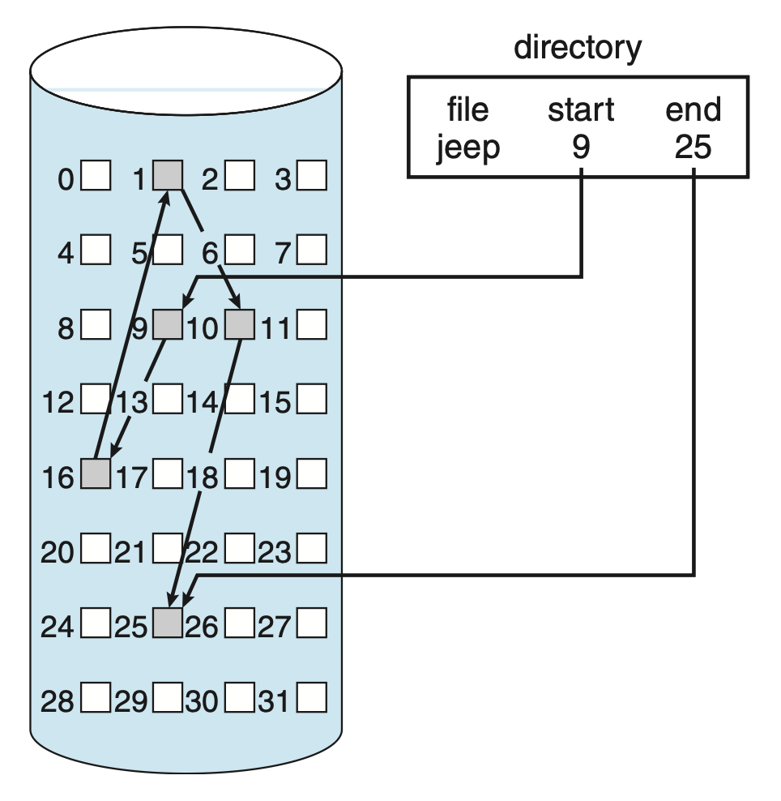
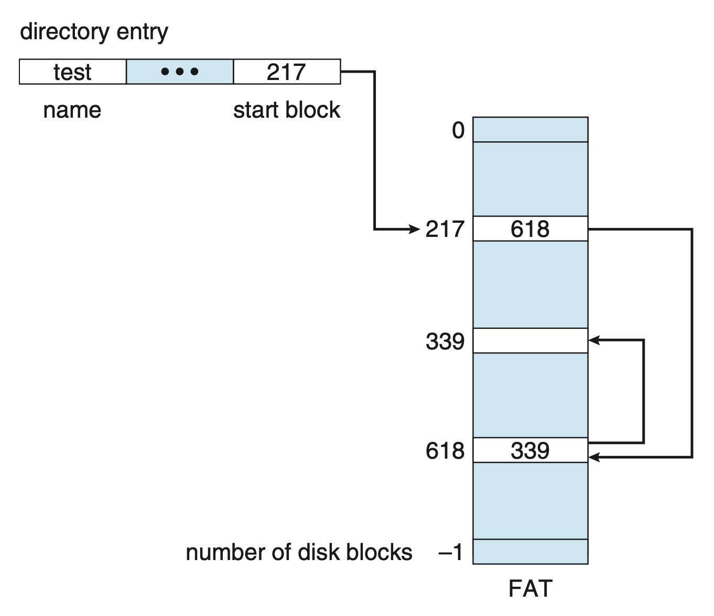
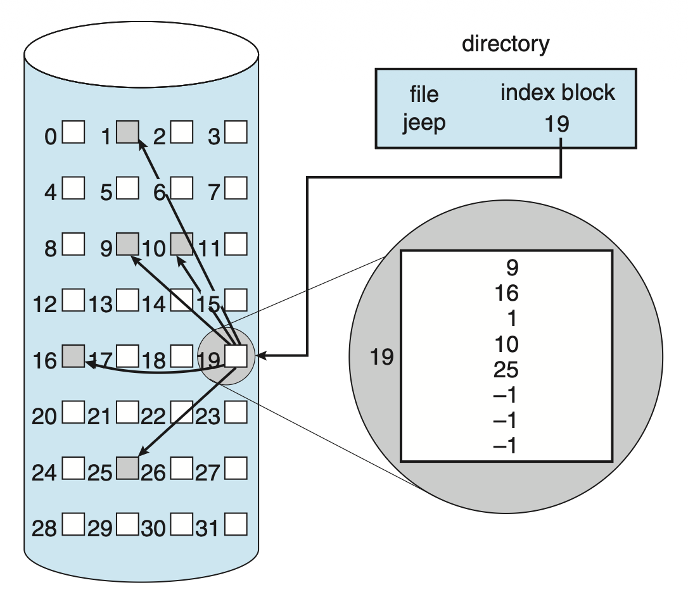
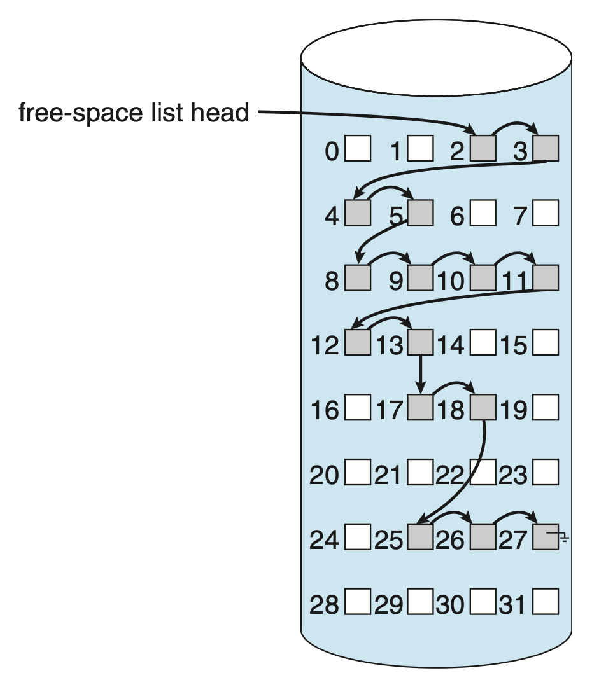

# File-System Implementation

??? abstract "核心知识"

    - 文件系统结构（分层设计）
    - 文件系统操作
        - 在存储器/内存中的文件系统包含的信息
        - 创建、打开和关闭文件的细节
    - 目录实现
        - 线性表
        - 哈希表
    - 分配方法
        - 连续分配
        - 链接分配
        - 索引分配
    - 空闲空间管理
        - 位向量（位图）
        - 链表
        - 分组
        - 计数
    
    - 效率和性能
        - 缓冲区缓存、页缓存 -> 统一缓冲区缓存
        - 顺序访问优化
            - 后释放
            - 先读
    
        - ...
    
    - 恢复
        - 一致性检查
        - 日志
        - 备份

## File-System Structure

以下两个特点让磁盘成为维护文件系统的二级存储中的主要设备：

- 磁盘可就地重写，因此可以在相同块上进行读/写/修改操作
- 磁盘可直接访问任意包含信息的块，这意味着无论顺序还是随机访问都很简单

为提升 I/O 效率，内存和大容量存储之间的 I/O 传输必须以**块**(blocks)为单位。块大小通常为 512B 或 4096B。

文件系统带来了两个设计问题：

- 定义用户视角下的文件系统，包括定义文件及其属性、在文件上允许的操作和组织文件的目录结构等
- 创建将逻辑文件系统映射到物理二级存储设备的算法和数据结构

文件系统通常采用**分层设计**：其中最底层的是**设备**，最顶层的是**应用**，剩余部分自底向上依次是

- **I/O 控制**：
    - 由设备驱动程序和中断处理程序组成，用于在主存和文件系统间传输信息
    - 其中设备驱动程序的输入是高层级的命令，输出是低层级的、硬件特定的指令，通常向 I/O 控制器内存的特定位置写入具体的位模式
- **基本文件系统**：
    - 仅需向合适的设备驱动程序发射用于在存储设备上读/写块的通用命令（基于逻辑块地址）
    - 还要考虑 I/O 请求调度，并管理内存缓冲区和高速缓存
- **文件组织模块**：
    - 包含文件及其逻辑块的信息，每个文件的逻辑块编号从 0（或 1）到 N
    - 并且包含一个空闲空间管理器
- **逻辑文件系统**：
    - 管理元数据信息；元数据包含了除真实数据外的文件系统结构中的全部
    - 通过**文件控制块**(file control block, **FCB**)（在 UNIX 文件系统中是一个 **inode**（索引节点））维护文件结构
        - FCB 包含以下信息：文件权限、文件日期（创建/访问/写入）、文件所有者/组/ACL、文件大小、文件数据块或指向文件数据块的指针

    - 还会负责保护

这种分层设计的实现能让代码重复最小化。I/O 控制，以及（有时）基本文件系统能被多个文件系统使用；而每个文件系统有自己的文件组织模块和逻辑文件系统。这种分层设计的缺陷是引入更多 OS 开销，从而损害性能。

## File-System Operations

**在存储器上**(on-storage)的文件系统包含以下信息：

- **引导控制块**(boot control block)（每个卷）：包含系统启动操作系统所需的信息
    - 如果磁盘中没有 OS，这个块就是空的
    - 通常是卷中的第一个块
- **卷控制块**(volume control block)（每个卷）：包含有关卷的细节
    - 比如卷中的块数、块的大小、空闲块计数和指针、空闲 FCB 计数和指针等
- **目录结构**（每个文件系统）
- **FCB**（每个文件）

而**在内存中**(in-memory)的文件系统则包含以下信息：

- **挂载表**(mount table)：包含每个挂载卷的信息
- **目录结构缓存**：保存最近访问过的目录信息
- **系统级打开文件表**(system-wide open file table)：包含每个打开文件的 FCB 的副本，以及其他信息
- **进程级打开文件表**(per-process open file table)：包含指向系统级打开文件表中合适项的指针，以及对于进程中所有打开的文件的其他信息
- **缓冲区**：保存正在读取/写入到文件系统中的文件系统块

一些 OS（比如 UNIX）将目录看作和文件一样的东西，通过类型字段表示其为目录。而另一些 OS（比如 Windows）将目录看作和文件不同的实体。

要**创建**一个新文件，

- 进程调用逻辑文件系统
- 逻辑文件系统分配一个新的 FCB
    - 或者，如果文件系统的实现是在文件系统创建时创建所有 FCB，则从空闲 FCB 集合中分配一个 FCB
- 然后，系统将适当的目录读入内存，用新文件名和 FCB 更新它，并将其写回到文件系统

文件创建好后，就能为 I/O 所用。

- 文件必须能被**打开**，这通过 `open()` 系统调用实现（传递文件名为参数）
    - 首先在**系统级打开文件表**中搜索，以查看该文件是否已被其他进程使用
    - 若是，则会创建一个进程级打开文件表条目，指向现有的系统级打开文件表，以及一些其他字段（可能包括指向文件中当前位置的指针（用于后续 `read()` 或 `write()` 操作）以及打开文件的访问模式）
    - 如果该文件尚未打开，则会在目录结构中搜索给定的文件名
        - 目录结构的一部分通常缓存在内存中，以加快目录操作
        - 一旦找到该文件，FCB 将被复制到内存中的系统级打开文件表中
    
    - 此表不仅存储 FCB，还跟踪有多少个进程正在打开该文件
    - 这种算法可以节省大量开销
    - 该调用返回一个指向进程级文件系统表中适当项的指针，之后所有的文件操作通过该指针执行
    - 文件名可能不是打开文件表的一部分，因为一旦在磁盘上找到适当的 FCB，系统就不再需要它；不过它也可以被缓存，以节省后续打开同一文件时的时间
    - 打开文件表项的称呼：
        - UNIX：**文件描述符**(file descriptor)
        - Windows：**文件句柄**(file handler)

- 当进程**关闭**文件时
    - 进程级表项被移除，并且系统级表项的打开计数减少
    - 当所有打开该文件的用户关闭它时，任何更新的元数据会被复制回基于磁盘的目录结构，并且系统级打开文件表中的对应项被移除

下图总结了文件系统的操作结构：

    

## Directory Implementation

目录分配和管理算法的选择会显著影响文件系统的效率、性能和可靠性。本节就来介绍其中的权衡。

### Linear List

实现目录的最简单方法是使用一个包含指向数据块的指针的文件名**线性表**(linear list)。

- 方法简单但是执行耗时
    - 创建新文件时，首先必须搜索目录以确保没有同名文件，然后在目录末尾添加一个新条目
    - 删除文件时，在目录中搜索指定文件，然后释放为其分配的空间

- 要重用目录项，可以采取几种措施：
    - 将该项标记为未使用
        - 赋予它一个特殊名称，例如全空名称，分配一个无效的 inode 号（例如0）
        - 或在每个条目中包含一个已使用-未使用位(used-unused bit)
    - 将其附加到空闲目录项列表中
    - 将目录中的最后一项复制到释放的位置，并减少目录的长度
    - 还可以使用链表来减少删除文件所需的时间

- 该方法真正的缺点是**查找文件需要进行线性搜索**
    - 目录信息使用频繁，因此用户很容易注意到访问速度慢的情况
    - 事实上，许多 OS 实现了**软件缓存**，以存储最近使用的目录信息；缓存命中避免了不断从辅助存储中重新读取信息的需求
    - 可以将列表**排好序**，以支持二分搜索，从而降低平均搜索的时间
        - 但保持列表有序的要求可能会使创建和删除文件变得复杂，因为可能需要移动大量的目录信息以维护一个有序的目录
        - 这时可采用诸如**平衡树**等更复杂的数据结构，可能会有所帮助
        - 有序列表的一大优点是可以在没有单独排序步骤的情况下生成有序目录列表

### Hash Table

第二种数据结构是**哈希表**(hash table)，它和线性表搭配使用。

- 哈希表根据文件名计算一个值，并返回指向线性表中文件名的指针，因此可以大大减少在目录上的搜索时间
- 插入和删除也相对简单，但必须要为**冲突**(collisions)情况（即两个文件名哈希到同一位置的情况）做一些准备
- 该方法的主要困难在于其通常是**固定大小**，以及哈希函数对该大小的依赖
    - 假设创建一个**线性探测哈希表**(linear-probing hash table)，能够容纳 64 个条目
        - 哈希函数将文件名转换为 0 到 63 之间的整数（例如，通过使用除以 64 的余数）
        - 如果尝试创建第 65 个文件，就得必须扩大目录哈希表，比如扩展到 128 个条目
        - 此时就需要一个新的哈希函数，将文件名映射到 0 到 127 的范围，并且必须重新组织现有的目录条目，以反映它们的新哈希函数值

    - 或者可以使用**链式溢出哈希表**(chained-overflow hash table)
        - 每个哈希项是一个链表，而不是单个值，此时可通过将新项添加到链表中来解决冲突
        - 查找可能会稍微变慢，因为搜索一个名称可能需要遍历一系列发生冲突的表项
        - 尽管如此，这种方法很可能比在整个目录中进行线性搜索要快得多

## Allocation Methods

- 二级存储的**直接访问**特性为我们在文件实现上提供了灵活性
- 一个主要的问题是如何为文件分配空间，以便有效利用存储空间并快速访问文件
- 目前广泛使用三种主要的二级存储空间分配方法：**连续分配**、**链接分配**和**索引分配**
- 尽管一些系统支持这三种方法，但通常一个系统会对同一文件系统类型中的所有文件仅采用一种方法

### Contiguous Allocation

**连续分配**(contiguous allocation)要求每个文件占用设备上一组连续的块。

- 鉴于 HDD 的特性，访问连续分配文件所需的磁盘寻址次数是最小的（假设逻辑地址相近的块在物理上也相近）
- 文件的连续分配由**第一个块的地址**和**文件长度**（以块为单位）定义
    - 若文件有 n 个块且起始位置为 b，那么该文件将占据块 b, b + 1, ..., b + n - 1
    - 每个文件的目录项就包含这两个量，如下图所示：

        

            
        

- 访问一个已连续分配的文件是很简单的
    - 顺序访问：文件系统会记住最后引用的块的地址，并在必要时读取下一个块
    - 直接访问：若知道块 b 开始的文件中的第 i 个块，可以立即访问块 b + i

???+ bug "问题"

    - **为新文件找到空间**
        - 可将该问题看作是一般的[**动态存储分配问题**](9.md#memory-allocation)的一个特定应用，即如何从一系列空闲的洞中满足大小为 n 的请求（可点击链接回顾）        
        - 无论采取何种策略，都存在**外部碎片**的问题
        - 一种解决方法是：将整个文件系统复制到另一个设备上，然后原始设备被完全释放，从而创建一个大的连续空闲空间；接着通过从这个大洞中分配连续空间，将文件复制回原始设备
            - 这种方案有效地将所有空闲空间**压缩**(compacts)成一个连续的空间，从而解决了碎片问题
            - 代价是时间，并且对于大型存储设备来说，成本可能特别高
            - 因此有些系统要求此功能在**离线**(off-line)状态下（即文件系统未挂载）完成，此时通常不允许正常的系统操作，因此在生产机器上尽量避免这种压缩
            - 大多数现代需要整理碎片的系统可以在正常操作期间**在线**(online)执行，但性能损失可能会很显著

    - **决定为文件提供多少空间**
        - 如果为一个文件分配的空间太少，该文件可能无法扩展
            - 特别是在最佳适配策略下，文件两侧的空间可能正在使用，此时就无法在原地增大文件

        - 解决方案：
            - 终止用户程序，并显示适当的错误信息；用户必须重新分配更多空间并再次运行程序
                - 这种重复运行的成本可能较大
                - 为了防止这种情况，用户通常会高估所需的空间量，但会导致大量的空间浪费
            
            - 找到一个更大的洞，将文件内容复制到新空间，并释放之前的空间
                - 这些操作可以在存在可用空间时重复进行，尽管有些耗时
                - 用户无需明确被告知发生了什么；尽管速度可能会越来越慢，但系统仍然继续运作

        - 即便提前知道文件所需的空间量，这种**预分配**(preallocation)操作可能还是很低效
            - 因为一个文件的大小会随时间缓慢增长，所以必须为其最终大小分配足够的空间，尽管其中大部分空间在长时间内将未被使用
            - 因此该文件具有大量的**内部碎片**

        - 为了最小化上述缺点，OS 可以做以下改进：
            - 初始分配一块连续的空间；如果该空间不足够大，则会添加另一块称为**区段**(extent)的连续空间
            - 文件块的位置随后被记录为一个位置和一个块计数，以及指向下一个区段第一个块的链接
            - 在某些系统中，文件所有者可以设置区段的大小，但如果设置不正确，反而会影响效率
                - 如果区段过大，内部碎片仍然可能是个问题
                - 而随着不同大小的区段被分配和释放，外部碎片也可能成为问题

### Linked Allocation

**链接分配**(linked allocation)解决了连续分配的所有问题。

- 每个文件是存储块的**链表**，因此这些块可以散布在设备上的任何位置
- 目录包含了指向文件的第一个和最后一个块的指针，如图所示：

    

        
    

- 每个块包含指向下一个块的指针，而这些指针对用户不可用
    - 因此，如果每个块大小为 512 字节，而一个指针需要 4 字节，那么用户实际能用的是 508 字节的块

- 创建新文件时，只需在目录中创建一个新的项；其中指向文件第一个块的指针初始化为 `null`（链表末尾指针值，表示空文件），大小字段也设置为 0

- 写入文件时，空闲空间管理系统会找到一个空闲块，并将这个新块写入并链接到文件的末尾
- 读取文件时，只需顺着指针遍历找到所需的块
- 链接分配**不会导致外部碎片**，任何空闲空间列表上的空闲块都可以用来满足请求
    - 在创建文件时不需要声明文件的大小
    - 只要有可用的空闲块，文件就可以继续增长，因此无需压缩操作

???+ bug "缺点"

    - 主要问题是仅在**顺序访问**文件中表现高效
        - 要找到文件的第 i 个块，必须从该文件的开始处开始，并跟随指针直到我们到达第 i 个块；而每次访问指针都需要存储设备读取，有些还需要硬盘寻道，因此**直接访问**是不高效的

    - 指针会占据一定空间
        - 解决（缓减）该问题的方法是：将多个块合并为**簇**(cluster)，为文件分配空间时将以簇为单位而非块
        - 这能减小指针在文件空间中的占比（一个簇一个指针，也就是多个块共用一个指针）
        - 不仅使逻辑到物理块的映射保持简单，还提高了硬盘驱动器的吞吐量（因为所需的磁头寻道次数减少），并减少了用于块分配和空闲列表管理所需的空间
        - 但代价是
            - **内部碎片**的增加，因为当一个簇部分满时浪费了更多空间
            - **随机 I/O 性能**也会受到影响，因为请求少量数据会传输大量数据
        
        - 大多数文件系统都会采用该方法

    - 可靠性(reliability)：
        - 若因 OS 的软件中的错误或硬件故障导致指针丢失或损坏，可能会把指针链接到空闲空间列表或另一个文件
        - 一个部分的解决方案是使用**双链表**，或者在每个块中存储文件名和相对块号，但这些方案带来了更多开销

---
链接分配的一种重要变体是使用**文件分配表**(file allocation table, **FAT**)

- 每个卷的开头预留了一部分存储空间来包含该表，该表为每个块设置一个条目，并按**块号**进行索引
- 使用方式与链表非常相似：
    - 目录项包含文件第一个块的块号，由该块号索引的表项包含文件中下一个块的块号
    - 这一条链路直到最后一个块，其表项包含一个特殊的结束文件值

- 未使用的块通过表值 0 表示
- 将新块分配给文件时只需找到第一个值为 0 的表项，并用新块的地址替换之前的结束文件值，然后将 0 替换为结束文件值
- 下图展示了 FAT 的结构：

    

        
    

- FAT 分配方案可能导致**大量的磁盘读写头寻道**（除非 FAT 被缓存）
    - 磁盘读写头必须移动到卷的起始位置以读取 FAT 并找到相关块的位置，然后再移动到该块的位置
    - 在最坏的情况下，每个块都需要进行这两次移动
    - 但有一个好处是**随机访问**时间得到了改善，因为磁盘读写头可以通过读取 FAT 中的信息来找到任何块的位置

### Indexed Allocation

在**索引分配**(indexed allocation)中，

- 所有指针都放在一个叫做**索引块**(index block)的地方
- 每个文件都有自己的索引块，它是一个存储块地址的数组，索引块中的第 i 项指向文件的第 i 个块；目录包含了索引块的地址

    

        
    

- 当文件创建时，索引块中的所有指针都被设置为 null
- 当第 i 个块首次写入时，从空闲空间管理器获取一个块，并将其地址放入第 i 个索引块项中
- 索引分配支持**直接访问**，不会受到外部碎片的影响，因为存储设备上的任何空闲块都可以满足对更多空间的请求
- 然而，索引分配存在**空间浪费**的问题：索引块的指针开销通常大于链接分配的指针开销
    - 假如有一个只有 1-2 个块的文件
        - 在链接分配中，每个块只损失 1 个指针所占用的空间
        - 在索引分配中，即使只有 1-2 个指针是非空，也必须分配整个索引块

这反映了确定索引块大小的问题：索引块应尽可能小，但是又不能太小，否则就没法为大文件保存足够多的指针；下面给出处理这一问题的一些机制：

- **链接方案**(linked scheme)：将多个索引块链接在一起
    - 例如，一个索引块可能包含一个小的头，给出文件名和前 100 个磁盘块地址的集合
    - 下一个地址（索引块中的最后一个字）要么为空（对于小文件），要么指向下一个索引块（对于大文件）

- **多级索引**(multilevel index)：
    - 使用第一级索引块指向一组第二级索引块，而这些第二级索引块又指向文件块
    - 要访问一个块，操作系统使用第一级索引找到一个第二级索引块，然后利用该块找到所需的数据块
    - 这种方法可以继续扩展到第三或第四级，具体取决于所需的最大文件大小

- UNIX 的文件系统采用的是一种**结合方案**(combined scheme)：

    

        
    

    - 将索引块的前 15 个指针保存在文件的 inode 中
    - 前 12 个指针指向**直接块**，也就是说它们直接包含存储文件数据的块地址
    - 因此，对于小文件（不超过 12 个块），不需要单独的索引块
    - 其余 3 个指针指向**间接块**(indirect blocks)
        - 第一个指针指向一个**单间接块**(single indirect block)：一个包含数据块地址的索引块
        - 第二个指针指向一个**双间接块**(double indirect block)：一个包含数据块地址的块的地址的索引块
        - 最后一个指针指向一个**三间接块**(triple indirect block)

    - 该方案同样会遇到性能问题
    - 索引块可被缓存在内存中，但数据块可能会散布在整个卷中

## Free-Space Management

由于存储空间有限，若有可能，我们需要让新文件复用已删除文件的空间。为了跟踪空闲的磁盘空间，系统维护了一个**空闲空间列表**(free-space list)，记录所有未分配给某个文件或目录的设备块。

- 创建文件时，在空闲空间列表中搜索所需的空间量，并将该空间分配给新文件；然后这个空间会从空闲空间列表中移除
- 删除文件时，其空间会被添加到空闲空间列表中

尽管名称中有“列表”二字，但空闲空间列表的实现可不仅局限于列表，下面就来了解各种实现。

### Bit Vector

通常，空闲空间列表被实现为**位图**(bitmap)或**位向量**(bit vector)：

- 每个块用 1 个位表示
- 如果块是空闲的，则对应位置 1；如果块已分配，则对应位清 0

这种方法的主要优点是相对简单，并且在寻找磁盘上第 1 个空闲块或 n 个连续空闲块时效率很高。

第一个空闲块号的计算公式：（每个字的位数）$\times$（0 值字的个数）+ 第 1 个置为 1 的位偏移量

但这个方法的缺点是：除非将整个向量保存在主存中，否则效率低下；但如果文件很大，向量就会在内存中占据过多空间。

### Linked List

第二种方法是将所有空闲块链接在一起；在文件系统的一个特殊位置中保持指向第一个空闲块的指针，并将其缓存到内存中。

    

这个方案效率不高，因为要遍历列表，就必须读取每个块，这需要大量的 I/O 时间。但实际上遍历空闲列表并不是一个频繁的操作；通常 OS 只需要一个空闲块，因此只使用空闲列表中的第一个块。

### Grouping

- 将 n 个空闲块的地址存储在第一个空闲块中
- 这些块中的前 n−1 块实际上是空闲的，最后一个块包含另 n 个空闲块的地址，以此类推
- 通过该方法可以快速找到大量空闲块的地址

>感觉和文件空间[链接分配](#linked-allocation)中的簇方法很像...

### Counting

- **计数**(counting)方法的实现基于这样一个事实：通常可以同时分配或释放多个连续的块，特别是在使用**连续分配**算法或通过**簇**进行空间分配的时候
- 因此可以保留第一个空闲块的地址和跟随第一个块的空闲连续块数量（n），而不是保持 n 个空闲块地址列表
- 对应地，空闲空间列表中的每一项都由设备地址和计数组成
- 尽管每个项所需的空间比简单磁盘地址要多，但整体列表更短（当计数 > 1 时）
- 这种跟踪空闲空间的方法类似于分配块的区段(extent)方法
- 项可以存储在**平衡树**中，以便高效查找、插入和删除

## Efficiency and Performance

现在进一步考虑上述块分配和目录管理的方法对性能和高效存储使用的影响。磁盘往往是系统性能的主要瓶颈，即使是 NVM 设备，与 CPU 和主存相比也是很慢的，因此有必要优化它们的性能。本节中，我们讨论了一些用于提高二级存储效率和性能的技术。

### Efficiency

存储设备空间的高效使用在很大程度上依赖于所使用的**分配和目录算法**。比如 UNIX 的 inode 在卷上是预分配的；即使是空磁盘，也有一部分空间被 inode 占用，但这样做可以提高文件系统的性能。

文件目录（或 inode）项中通常保留的**数据类型**也需要考虑。

- 通常会记录一个“最后写入日期”，以向用户提供信息并确定文件是否需要备份；一些系统还会保留“最后访问日期”，以便用户可以确定文件的最后读取时间
- 这么做会导致每当读取文件时，必须向目录结构写入这些字段；因此，每次打开文件进行读取时，其 FCB 也必须被读取和写入
- 这一要求可能让频繁访问的文件效率低下，因此在设计文件系统时，我们必须权衡其好处与性能成本

**指针大小**也会影响访问数据的效率。大多数系统使用 32 位或 64 位指针。

- 使用 32 位指针将文件大小限制为 2^32^B，即 4GB
- 使用 64 位指针允许非常大的文件大小，但 64 位指针需要更多空间来存储，因此分配和空闲空间管理方法（链表、索引等）会占用更多存储空间

选择合适指针大小的困难之处在于要应对持续变化的技术。

### Performance

即使选定了基本的文件系统算法，我们仍然可以通过几种方式来提高性能。

- 存储设备控制器包括本地内存，以形成一个足够大的**板载缓存**(on-board cache)，可以一次存储整个磁道或块数据
    - 在硬盘驱动器上，一旦执行寻道操作，磁道就会从磁头下方的扇区开始读取到磁盘缓存中（减少时延）
    - 然后，磁盘控制器将任何扇区请求传输给 OS
    - 一旦块从磁盘控制器进入主存，OS 可能会在其中缓存这些块

- 一些系统为**缓冲区缓存**(buffer cache)维护一个单独的主存区域
    - 在该区域中，数据块被保留，因为我们假设它们会很快会被再次使用（时间局部性）

- 还有一些系统使用**页缓存**(page cache)来缓存文件数据
    - 利用**虚拟内存**技术将文件数据作为页，而不是以文件系统导向的数据块进行缓存
    - 使用虚拟地址缓存文件数据比通过物理磁盘块进行缓存要高效得多，因为访问是与虚拟内存接口，而不是与文件系统接口
    - 包括 Solaris、Linux 和 Windows 在内的一些系统都使用页缓存来同时缓存进程页和文件数据，这被称为**统一虚拟内存**(unified virtual memory)

- 一些版本的 UNIX 和 Linux 提供了**统一缓冲区缓存**(unified buffer cache)
    - 考虑两种打开和访问文件的方法：一种是使用**内存映射**，另一种是使用标准系统调用 `read()` 和 `write()`
    - 若不使用统一缓冲区缓存，
        - `read()` 和 `write()` 系统调用通过**缓冲区缓存**进行
        - 但内存映射调用需要使用两个缓存，**页缓存**和**缓冲区缓存**
            - 通过从文件系统读取磁盘块，并将其存储在缓冲区缓存中来实现内存映射
            - 由于虚拟内存系统不与缓冲区缓存连接，因此必须将缓冲区缓存中的文件内容复制到页缓存中
            - 这种情况被称为**双重缓存**(double caching)，即对文件系统数据进行两次缓存
            - 这不仅浪费了内存，还因额外的数据移动而浪费了大量的 CPU 和 I/O 周期，并且两者之间的不一致可能还会导致文件的损坏
        
        

            
        

    - 相比之下，当提供统一的缓冲区缓存时，内存映射以及 `read()` 和 `write()` 系统调用都使用相同的页缓存，不仅避免了双重缓存，还允许虚拟内存系统管理文件系统数据

        

            
        

- 无论是对于缓存存储块还是页（或两者兼有），**LRU** 是一种合理且通用的块或页替换算法
- 另一个可能影响 I/O 性能的问题是**写入**文件系统的操作是**同步**进行还是**异步**进行
    - 同步写入按照存储子系统接收数据的顺序发生，且这些写入不会被缓存，因此调用例程必须等待数据到达驱动器后才能继续
    - 而在异步写入中，数据存储在缓存中，控制权返回给调用者
    - **大多数写入都是异步的**，但包括元数据写入在内的一些操作可以是同步的
    - OS 通常在打开系统调用中包含一个**标志**，以允许进程请求以**同步**方式执行写入
        - 比如数据库使用此功能进行原子事务，以确保数据按要求的顺序达到稳定存储

- 一些系统通过使用不同的替换算法来优化其页缓存，具体取决于文件的访问类型
    - 顺序读取或写入的文件不应按照 LRU 顺序替换其页，因为最近使用的页最后会被使用，或者可能再也不会被使用
    - 优化**顺序访问**的技术：
        - **后释放**(free-behind)：在请求下一个页时立即从缓冲区中移除一个页，因为之前的页不太可能再次被使用，并且浪费了缓冲空间
        - **先读**(read-ahead)：请求页及其后面的一些页会被读取并缓存，因为这些页在处理当前页后很可能会被请求，所以从磁盘一次性检索这些数据并进行缓存可以节省大量时间

## Recovery

由于文件和目录同时保存在主存和存储卷中，所以必须小心，确保系统故障不会导致数据丢失或数据不一致。如果在系统崩溃等错误发生之前缓存的更改没有到达存储设备，则可能会造成更多损坏。本节就来介绍各种应对策略和恢复手段。

### Consistency Checking

文件系统必须首先检测问题，然后进行修正。

- 检测时，可以扫描每个文件系统上的所有元数据，以确认或否定系统的一致性
    - 但这种扫描可能需要几分钟或几个小时，并且应该在每次系统启动时进行

- 另一种方法是在文件系统**元数据**中记录其状态
    - 在任何元数据更改开始时，会设置一个**状态位**以指示元数据处于变动中
    - 如果对元数据的所有更新都成功完成，文件系统可以清除该位
    - 然而，如果状态位仍然被设置，则会运行一致性检查器

- **一致性检查器**(consistency checker)比较目录结构和其他元数据中的数据与存储上的状态，并尝试修复它发现的任何不一致
    - 分配和空闲空间管理算法决定了检查器可以找到什么类型的问题，以及它在修复这些问题时的成功率
    - 例子：
        - [链接分配](#linked-allocation)：任何块都有指向其下一个块的链接，因此整个文件可以从数据块中重建，目录结构也可以被重新创建
        - [索引分配](#indexed-allocation)：丢失一个目录条目可能是灾难性的，因为数据块之间彼此不了解
    
    - 因此，一些 UNIX 文件系统会缓存读取的目录项，但在相应的数据块写入之前，任何导致空间分配或其他元数据更改的写入都是同步进行的
        - 若发生崩溃中断，仍然可能发生问题
        - 一些包含电池或超级电容的 NVM 存储设备提供了足够的电力，即使在停电期间，也能将设备缓冲区中的数据写入存储介质，从而避免数据丢失

- 问题：
    - 不一致可能是不可修复的：
        - 一致性检查可能无法恢复这些结构，导致文件甚至整个目录的丢失
        - 可能需要人工干预来解决冲突
    - 一致性检查还需要系统和时钟时间

### Log-Structured File Systems

我们可以将数据库中基于日志的恢复算法迁移到文件系统上，得到一种叫做**基于日志的面向事务的**(log-based transaction-oriented)文件系统。

- 所有元数据更改都是**顺序写入**日志的
- 每组执行特定任务的操作称为一个**事务**(transaction)
- 一旦更改被写入日志，它们就被视为**已提交**(committed)；随后通过系统调用返回到用户进程，使其继续执行
- 同时，这些日志项会在实际文件系统结构中重放(replay)
    - 当进行更改时，会更新一个指针以指示哪些操作已完成，哪些仍未完成
    - 当整个已提交的事务完成时，日志中会记录一个相应的项

- 日志文件实际上是一个**循环缓冲区**(circular buffer)：将数据写入其空间末尾，然后从开头继续，覆盖旧值
- 日志可能位于文件系统中单独的部分，甚至在单独的存储设备上
- 系统崩溃时，日志文件可能包含零个或多个事务
    - 即使它们已被操作系统提交，这些事务都没有作用在文件系统，因此必须要完成这些事务
    - 可以从指针处执行这些事务，直到工作完成，以保持文件系统结构的一致性
    - 唯一的问题发生在一个事务被**中止**(abort)时，即在系统崩溃之前未提交的事务
        - 此类事务的任何更改必须撤销，以再次保持文件系统的一致性

- 使用日志记录磁盘元数据更新的一个附带好处是，这些更新比直接应用于磁盘数据结构时要快得多
    - 原因在于顺序 I/O 相对于随机 I/O 的性能优势
    - 高成本的同步随机元数据写入 -> 低成本的同步顺序写入（到日志）

### Backup and Restore

避免数据丢失另一种做法是将数据从一个存储设备**备份**(backup)到另一个存储设备。之后要想从单个文件或整个设备的损坏中恢复，只需从备份中**恢复**(restore)数据即可。

为了最小化所需的复制操作，我们可以利用文件目录项的信息。例如，如果备份程序知道某个文件的最后一次备份时间，并且该文件在目录中的最后写入日期表明自那时以来文件没有更改，那么该文件就不需要再次复制。

一个可能的备份计划可能如下所示：

- 第一天，将文件系统中的所有文件复制到备份介质上，这称为**完整备份**(full backup)
- 第二天，将自第一天以来更改的所有文件复制到另一个介质上，这称为**增量备份**(incremental backup)
- 第三天，将自第二天以来更改的所有文件复制到另一个介质上
- ...
- 第 N 天，将自第 N−1 天以来更改的所有文件复制到另一个介质上，然后回到第一天

N 的值越大，完成恢复所需读取的介质数量就越多。这种方法的一个额外优势在于：可以通过从前一天的备份中检索被意外删除的文件，来恢复在此周期内意外删除的任何文件。

**周期长度**是在所需备份量和恢复覆盖的天数之间的折中。

- 为了减少在进行恢复时必须读取的磁带数量，一个选项是执行**完整备份**，然后每天备份自上次完整备份以来所有已更改的文件
- 通过这种方式，可以通过最近一次增量备份和完整备份进行恢复，而不需要其他增量备份
- 权衡之处在于，每天会有更多文件被修改，因此每个后续的增量备份涉及更多文件和更多备份介质

用户可能会注意到某个特定文件在损坏发生很久后才缺失或损坏，因此通常计划不时进行完整备份，实现这些备份的“永久”保存。

将这些永久备份存放在远离常规备份的地方是一个好主意，以防止自然灾害等危险摧毁计算机及所有备份。