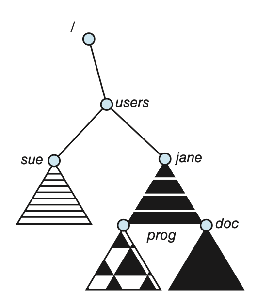

# File-System Internals

本章主要关注文件系统的内部结构和操作。

下图展示了一种典型的文件系统组织，包含了前面介绍过的存储设备(storage device)、分区(partition)、卷(volume)、目录(directory)等概念：

    

## File-System Mounting

文件系统必须在可供系统上的进程使用之前**挂载**(mount)好。要实现挂载操作，需要向 OS 提供设备名和**挂载点**(mount point)（文件结构内文件系统被附加的位置，通常是一个空目录）；一些 OS 还要求提供文件类型，另一些 OS 可自行得出文件类型。

接下来 OS 验证设备是否包含有效的文件系统，这通过设备驱动程序读取设备目录并验证目录符合预期格式来实现。最后，OS 将挂载到具体挂载点的文件系统记录在目录结构中。这一方案使得 OS 能够遍历目录结构，以及在不同文件系统中切换。

???+ example "例子"

    左图是已存在的文件系统，右图是未挂载的卷（无法被访问）。

    

        
    

    下面将这个未挂载的卷挂载到 `users` 目录下：

    

        
    

## Partitions and Mounting

磁盘布局形式各异，取决于 OS 和卷管理软件。磁盘可被划分为多个分区，或者一个卷可以跨越多个磁盘上的多个分区。本节我们只考虑前者。

当没有合适的文件系统是，可以采用**原始磁盘**(raw disk)；像 UNIX 的交换空间、某些数据库和 RAID 系统等都用到了原始磁盘。

若分区包含了包含了一个可引导的文件系统（即有正确安装和配置好的操作系统），那么该分区还需要引导（启动）信息。该信息通常是一个顺序块序列，作为映像文件(image)被加载到内存中。该映像被称为**引导加载程序**(bootstrap loader)，它对文件系统足够了解，从而能找到并加载内核，然后开始执行内核程序。除此之外，引导加载程序还可以包含更多信息，比如知道多个操作系统的信息，从而能在单个系统上安装多个 OS，即实现了**双启动**(dual-boot)。

**根分区**(root partition)由引导加载程序选择，包含了 OS 内核，有时也有一些系统文件，在启动时被挂载。

在 UNIX 系统中，文件系统可被挂载到任意目录中。通过在目录的 inode 内存副本中设置一个标志（表明该目录是挂载点）来实现挂载。

## File Sharing

当 OS 能容纳多用户时，文件共享、文件命名和文件保护的问题需要重点考虑。为此，系统必须维护比单用户系统所需的更多文件和目录属性。大多数系统采用了文件（或目录）**所有者**(owner)（或**用户**(user)）和**组**(group)的概念：

- 所有者：能够更改属性和授予访问权限，并对文件拥有最多控制权的用户
- 组：可以共享文件访问权限的用户子集
- 例如，UNIX 系统上文件拥有者可以执行文件上的所有操作，而文件组的成员可以执行这些操作的一个子集，而所有其他用户可以执行另一个子集的操作
- 哪些操作可以由组成员和其他用户执行，由文件拥有者定义
- 文件（或目录）的所有者和组 ID 与其他文件属性一起存储
    - 当用户请求对文件进行操作时，可以将用户 ID 与所有者属性进行比较，以确定请求操作的用户是否是文件的所有者

许多系统包含多个本地文件系统，包括单个磁盘的卷或多个磁盘上的多个卷；此时当文件系统挂载好后，ID 检查和权限匹配就很直接。但对于可以在系统之间移动的外部磁盘，它在不同系统上的 ID 可能会不同，因此必须确保系统之间的 ID 匹配。

## Virtual File Systems

一种简单但并非最佳的实现多类型文件系统的方法是为每种类型编写目录和文件例程。然而，大多数 OS 使用**面向对象**的技术来简化、组织和模块化实现，这使得能在相同结构内实现非常不同的文件系统类型。

使用数据结构和过程来将系统调用功能从实现细节中隔离开来，因此文件系统实现包含以下三个主要的层：

    

- **文件系统接口**(file-system interface)：基于 `open()`，`read()`，`write()`，`close()` 调用和文件描述符
- **虚拟文件系统**(virtual file system, **VFS**)：提供以下重要的功能：
    - 通过定义一个干净的 VFS 接口，将文件系统的通用操作与其实现分开；多个 VFS 接口的实现可以在同一台机器上共存，从而允许对本地挂载的不同类型文件系统进行透明访问
    - 提供了一种机制，用于在整个网络中唯一表示一个文件
        - 即基于一种称为 **vnode** 的文件表示结构，它包含一个用于在网络范围内表示唯一文件的数字标识符，这是支持网络文件系统所必需的
        - 内核为每个活动节点（文件或目录）维护一个 vnode 结构

    - VFS 激活针对特定的文件系统操作来处理本地请求；或者根据它们的文件系统类型调用 NFS 协议过程（或调用其他网络文件系统的其他协议过程）来处理远程请求
        - 文件句柄由相关的 vnode 构建，并作为参数传递给这些过程

- 实现文件系统类型或远程文件系统协议的层

在 Linux VFS 中包含以下 4 种主要对象类型：

- **inode** 对象：表示单个文件
- **文件**对象：表示打开文件
- **超级块**(superblock)对象：表示整个文件系统
- **目录项**(dentry)对象：表示单个目录项

对于这 4 种对象类型中的每一种，VFS 定义了一组可能实现的操作。每个这些类型的对象都包含一个指向函数表的指针；函数表列出了实现该特定对象定义操作的函数的实际地址。比如：

- `#!c int open(...)`：打开文件
- `#!c int close(...)`：关闭已打开的文件
- `#!c ssize_t read(...)`：读取文件
- `#!c ssize_t write(...)`：写入文件
- `#!c int mmap(...)`：将文件映射到内存中

VFS 软件层可以通过调用对象函数表中的适当的函数，对这些对象执行某些操作，而无需事先确切知道它正在处理的是什么类型的对象。VFS 不知道，也不关心一个 inode 是否代表磁盘文件、目录文件或远程文件。

!!! warning "注意"

    后面的内容暂时鸽了，除非我在刷历年卷的时候发现考到这部分的内容...

## Remote File Systems

### The Client-Server Model

### Distributed Information Systems

### Failure Modes

## Consistency Semantics

### UNIX Semantics

### Sessions Semantics

### Immutable-Shared-Files Semantics

## NFS

### The Mount Protocol

### The NFS Protocol

### Path-Name Translation

### Remote Operations