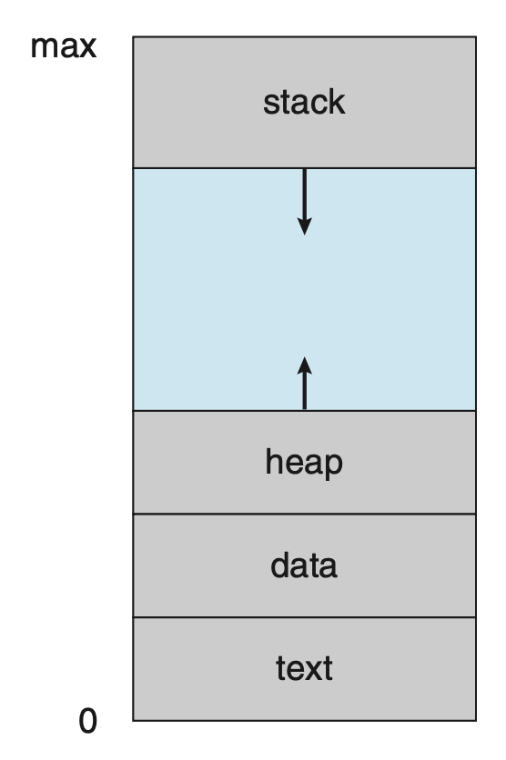
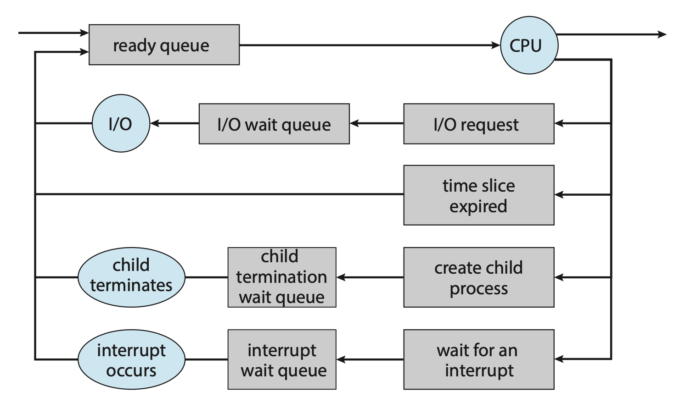
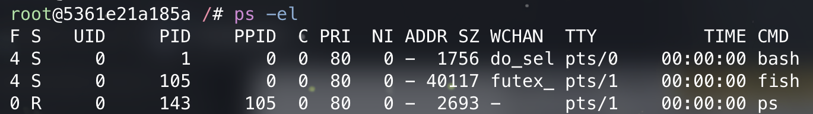

# Processes

??? abstract "核心知识"

    - 有关进程的基本概念：状态、PCB、线程（「线程」具体见[第 4 讲](4.md)）
    - 进程调度：调度队列、CPU 调度、上下文切换（具体见[第 5 讲](5.md)）
    - 进程操作：
        - 创建：`fork()`、`wait()`、`exec()` 系统调用
        - 终止：`exit()`、`abort()` 系统调用
    - IPC：
        - 共享内存
        - 消息传递：直接/间接、异步/同步、缓冲区选择
        - 生产者-消费者问题模型

## Concept

OS 执行各种各样的程序。

- 在**批处理系统**(batch system)中就叫做**作业**(job)
- 在**分时系统**(time-sharing system)中就叫做**用户程序**(user program)或**任务**(task)

??? info "时间共享和空间共享"

    - **时间共享**（分时）(time sharing)：通过让一个实体短暂使用资源，接着让另一个实体短暂使用这些资源，如此循环往复，从而使相同的资源被众多用户共享。
    - **空间共享**(space sharing)：资源（在空间上）被分配给希望使用它的人，例如磁盘空间就是一种空间共享资源——一旦一个块被分配给一个文件，通常不会分配给另一个文件，直到用户删除原始文件。

{ align=right width=20% }

我们可以简单地将**进程**(process)看作<u>执行中的程序</u>，但实际上进程包含了更多的信息，作为资源分配和调度的基本单位。

- 进程的当前活动状态由**程序计数器**(program counter)的值和处理器**寄存器**的内容表示
- 而一个进程的内存布局被划分为多个段，包括：
    - **文本段**(text section)：可执行的代码
    - **数据段**(data section)：全局变量
    - **堆段**(heap section)：在程序运行时动态分配的内存
    - **栈段**(stack section)：调用函数时的临时数据存储（比如函数参数、返回地址、局部变量等）

??? info "补充：C 程序的内存布局"

    大体上和前面介绍的类似，但还是略有一些不同的：

    <div style="text-align: center">
        
    </div>

    - 全局数据段被细分为两个段，分别放置初始化过的数据和未初始化的数据
    - 单独为传到 `main` 函数的参数 `argc` 和 `argv` 提供一个段

    可以用 GNU `size` 命令查看 C 程序各个段的大小。

    <div style="text-align: center">
        
    </div>

值得注意的是，文本段和数据段的大小是**固定的**，因为它们的大小没法在程序运行时改变；而堆段和栈段的大小可在程序执行时**动态伸缩**。尽管栈段和堆段的扩张方向是朝向对方的，但 OS 会确保两者不会重叠。

再次强调：程序本身不是进程！

- 程序只是一个**被动实体**(passive entity)（比如包含指令列表，存储在磁盘中的文件，即**可执行文件**(executable file)）
- 相对地，进程是一个**主动实体**(active entity)，包含（指明下一条待执行指令的）程序计数器和一套计算资源

当可执行文件被加载到内存时，程序就成为了进程。

有时两个或多个进程可能会关联到同一个程序上，我们得将它们看成单独的执行序列，因为虽然文本段是一样的，但其他段都各不相同。

另外，进程自身可以是其他代码的执行环境，比如 JVM。


### Process State

进程可能处在以下状态之一：

- **新建**(new)：正在创建进程
- **运行中**(running)：正在执行指令
- **等待中**(waiting)：进程正在等待某些事件的发生
- **就绪**(ready)：进程正在等待被赋予一个处理器执行
- **已终止**(terminated)：进程已完成执行

上述状态名称可以是任意的，且不同的 OS 可能有不同的名称，不过上述状态是所有 OS 共有的。需要注意的是，<u>一个处理器核心在任意时刻只能运行一个进程</u>，所以很多进程会处于就绪或等待状态。下图展示了对应的状态图，请务必关注是什么事件导致状态的变化：

<div style="text-align: center">
    
</div>


### Process Control Block

{ align=right width=20% }

在 OS 中，每个进程会被用一个叫做**进程控制块**(process control block, **PCB**)（又称任务控制块(task control block)）的东西表示，如右图所示。PCB 内含了很多关于特定进程的信息片段，包括：

- **进程状态**(process state)：包括但不局限于前面提到的那些状态
- **程序计数器**(program counter)：表示该进程下一条要执行的指令的地址
- **CPU 寄存器**(CPU registers)：
    - 在数量和类型上随 CPU 架构各不相同
    - 包括累加器、索引寄存器、栈指针、通用目的寄存器，以及任何的状态编码信息
    - 当中断发生时，必须保存好 CPU 寄存器内的信息，以便之后能够继续执行该进程
- **CPU 调度信息**(CPU-scheduling information)：包括进程优先级、指向调度队列的指针，以及其他任何调度参数
- **内存管理信息**(memory-management information)：包括基址和界限寄存器(base and limit registers)的值、页表(page table)或段表(segment table)等项，具体取决于 OS 所使用的内存系统
- **会计信息**(accounting information)：包括使用的 CPU 和实际时间、账户号码、作业或进程号等
- **I/O 状态信息**(I/O status information)：分配到进程中的 I/O 设备列表、打开文件列表等

??? info "补充：Linux 中的进程表示"

    Linux 用 C 结构体 `task_struct` 表示进程控制块，位于 `#!c <include/linux/sched.h>` 中。该结构体的部分字段如下：

    ```c
    long state;                       /* state of the process */
    struct sched_entity se;           /* scheduling information */
    struct task_struct *parent;       /* this process's parent */
    struct list_head children;        /* this process's children */
    struct files_struct *files;       /* list of open files */
    struct mm_struct *mm;             /* address space */
    ```

    而在我们的实验中，`task_struct` 包含以下信息：

    ```c
    struct task_struct {
        uint64_t state;                  // 线程状态
        uint64_t counter;                // 运行剩余时间
        uint64_t priority;               // 运行优先级 1 最低 10 最高
        uint64_t pid;                    // 线程 id

        struct thread_struct thread;     // 线程状态段

        // Lab 4
        uint64_t *pgd;                   // 用户态页表
        // Lab 5
        struct mm_struct mm;             // 用链表管理虚拟内存区域
        // Lab 6
        struct files_struct *files;      // 打开文件表
    };
    ```


### Threads

上述讨论的进程模型只考虑了执行单一**线程**(threads)的情况，但一个线程使得进程在同一时间内只能执行一个任务。所以大多数现代 OS 早已将进程概念扩展到让一个进程拥有多个执行线程，从而能够同时执行多个任务。这一特性在多核系统中尤其有用，因为多个线程可以并行运行。

关于多线程的介绍请见[下一讲](4.md)。


## Process Scheduling

**进程调度器**(process scheduler)从一组可用的进程中挑选一个进程，放在某个处理器核心上执行。而 CPU 在一段时间内只能执行一个进程。若进程数多于核心数，多出来的进程需要等到核心空闲后才能被重新调度。当前在内存中的进程数被称为**多道程序的度**(degree of multiprogramming)。

一般来说，大多数进程可以被分为：

- **I/O 密集型进程**(I/O-bound process)：相比在计算上的时间，花在 I/O 上的时间更多
- **CPU 密集型进程**(CPU-bound process)：生成 I/O 请求的频率较低，并且将更多时间花在计算上


### Scheduling Queues

当进程进入系统时，它们会被放在**就绪队列**(ready queue)中，这些进程都处在就绪状态，等待被 CPU 核心执行。队列以**链表**形式存储：队列的头包含列表中指向第一个 PCB 的指针，且每个 PCB 都包含一个指向下一个 PCB 的指针。

假设进程向磁盘等设备发起 I/O 请求，由于设备运行速度远慢于处理器，所以进程将不得不等待 I/O 变得空闲。于是这些等待特定事件发生的进程将被放入**等待队列**(wait queue)内。

下面两张图分别展示了就绪队列和等待队列的结构：

<div style="text-align: center">
    
</div>

进程调度的常用表示形式是**队列图**(queueing diagram)，并且该图包含了上述的两种队列（就绪队列和等待队列）。图中的圆形表示硬件资源，而箭头表示系统中的进程流。

<div style="text-align: center">
    
</div>

起初，新的进程会被放入就绪队列中，然后一直等待直到被选中（或者叫**分派**(dispatch)）执行。一旦进程被分配到 CPU 核心上执行时，以下事件中的一种将会发生：

- 进程发起** I/O 请求**，然后被放在 I/O 等待队列中
- 进程**创建一个新的子进程**，然后被放在等待队列中，直到子进程终止
- 进程可能因为**中断**或**时间片**(time slice)**到期**而被强制从核心中移除，并被放回到就绪队列中


### CPU Scheduling

一个进程在其生命周期内在就绪队列和各种等待队列之间迁移。**CPU 调度器**(CPU scheduler)的作用就是在就绪队列中的进程中做出选择，并为其中一个进程分配 CPU 核心。它必须为 CPU 频繁选择一个新的进程。因此尽管 CPU 密集型进程可能要花更长的时间来占用 CPU 核心，但调度器不会长时间地将核心分配给一个进程，更可能的情况是：强制从 CPU 中移除该进程，并安排另一个进程运行（即**抢占**(preempt)）。

一些 OS 有一种中间形式的调度，叫做**交换**(swapping)。它的大致思路是将进程从内存（以及 CPU 的活跃竞争中）中移除，以降低多道程序的度。随后进程可被重新引入到内存中，并且可以从上次离开的地方继续执行。交换技术仅在内存被过分占用且必须释放的场景下使用。

{ align=right width=40% }

三级调度（来自朋辈辅学课件）：

- 高级/**长程**(long-term)：从**磁盘缓冲池**到内存
- 中级/**中程**(middle-term)：内存满了，从内存中移出去一些（**换出**(swap-out)）内存有空了再**换入**(swap-in)
- 低级/**短程**(short-term)：从**就绪队列**选择进程分配 CPU


### Context Switch

前面提到过，**中断**会使得 OS 将 CPU 核心从执行当前任务转向运行内核例程，而且中断经常发生。当中断发生时，系统需要保存当前在和核心上执行的进程的上下文信息（**状态保存**(state save)），以便之后恢复这个被暂停的进程并继续执行下去（**状态恢复**(state restore)）。进程的 PCB 能够表示上下文信息，包括 CPU 寄存器、进程状态等。

上述过程被称为**上下文切换**(context switch)，其图示如下：

<div style="text-align: center">
    
</div>

**上下文切换时间**是一种开销，一般以毫秒为单位。切换的速度取决于内存速度、需要被拷贝的寄存器个数、特殊指令（比如是否有能一次性加载和保存所有寄存器的指令）的存在等。因此上下文切换高度依赖于硬件支持。

关于进程调度更详细的介绍请见[第 5 讲](5.md)。


## Operations on Processes

进程的创建和删除是系统中常见的操作，下面就来详细探讨其背后的机制。


### Process Creation

在执行过程中，一个进程可能会创建多个新的进程。这个创建进程的进程就是父进程，而这些新创建的进程就是该进程的孩子，它们也能创建新的进程，因而能形成一棵**树**(tree)。另外，大多数 OS 用一个唯一的**进程标识符**(process identifier, **pid**)（通常是一个整数）识别进程，可作为访问各种内核进程属性的索引。下图展示了一棵典型的 Linux 进程树。

<div style="text-align: center">
    
</div>

- `systemd` 进程作为所有用户进程的根进程，并且是系统启动时的第一个进程
- 一旦系统启动，`systemd` 进程就会创建其他进程，比如 `ssh`，`logind` 等
- `logind` 进程负责管理直接登录到系统的客户端，客户端登录后就要用到 `bash`，对应地创建了这样的子进程
- 在 `bash` 的 CLI 界面，用户会创建 `ps` 和 `vim` 进程
- `sshd` 进程负责管理通过 `ssh` 连接到系统的客户端

在 UNIX 和 Linux 系统中，可通过 `ps` 命令查看进程列表。

<div style="text-align: center">
    
</div>

另外 Linux 还提供了 `pstree` 命令，以树状形式呈现所有进程。

<div style="text-align: center">
    
</div>

通常来说，当一个进程创建子进程时，该子进程需要一定的**资源**来完成任务。子进程可以直接从 OS 中获取这些资源，也可能被限制为只能使用父进程资源的一部分。父进程可能需要在多个子进程之间分配其资源，或者能够与部分子进程共享某些资源。将子进程的资源限定在父进程资源的某个范围内，可以防止任何因创建过多子进程而导致系统过载的情况发生。

除了提供各种物理和逻辑资源外，父进程还可能将**初始化数据**（输入）传递给子进程。

当某个进程创建一个新进程时，存在以下两种执行的可能性：

- 父进程与子进程继续并发执行
- 父进程等待，直到部分子进程终止

新进程也有以下两种地址空间的可能性：

- 子进程是父进程的副本（程序和数据都和父进程一样）
- 子进程对应一个新加载进来的程序

在 UNIX 系统中，新进程是通过 **`fork()` 系统调用** 创建的。新进程包含了原进程地址空间的一个副本。这种机制使得父进程轻松地与其子进程通信。这两个进程（父进程和子进程）在 `fork()` 之后的指令处继续执行，但有一个区别：<u>对子进程而言，`fork()` 的返回码是 0</u>，而子进程的 pid 被返回给父进程。

对于同一程序得到的父子进程，我们**无法确定**哪一个先运行，哪一个后运行，这是因为 CPU 调度器在不同时候、不同情况下会采取不同的调度策略。但如果父进程使用 **`wait()` 系统调用**，它就一定会等待子进程终止后再继续运行，这样两者的运行顺序就是确定的。

在 `fork()` 系统调用之后，可通过使用 **`exec()` 系统调用**，**运行不同于当前调用程序的程序**。具体来说，它会从指定的可执行文件中加载代码（和静态数据），并覆写当前代码段和静态数据的内容，另外还会对程序的堆、栈和其他内存空间重新初始化。

下面是一段用 C 语言编写的 UNIX 进程创建程序：

??? code "代码实现"

    ```c
    #include <sys/types.h>
    #include <stdio.h>
    #include <unistd.h>
    int main() {
        pid_t pid;
        /* fork a child process */
        pid = fork();

        if (pid < O) { /* error occurred */
            fprintf(stderr, "Fork Failed");
            return 1;
        }
        else if (pid == 0) {/* child process */
            /* execlp() is a version of the exec() system call */
            /* overlays address space with /bin/ls (used to get a directory listing) */
            execlp("/bin/ls", "ls", NULL);
        }
        else { /* parent process */
            /* parent will wait for the child to complete */
            wait(NULL);
            printf("Child Complete");
        }
        return 0;
    }
    ```

用图示展示使用 `fork()` 系统调用创建进程的流程：

<div style="text-align: center">
    
</div>

??? note "关于 shell"

    `fork()`/`exec()` 这对接口组合的行为看似奇怪，但它们对构建 **UNIX shell** 而言至关重要，因为这样能让 shell 在调用 `fork()` 之后，并在调用 `exec()` 之前运行代码；而这段代码能改变即将要运行的程序的环境，因而能构建各种有趣的功能。

    shell 本质上就是一个**用户程序**，它会在屏幕上显示提示符(prompt)，等待用户输入。用户输入某个命令后，shell 就从文件系统找到对应的可执行文件，调用 `fork()` 创建新进程，调用某种 `exec()` 的变体来运行命令，然后调用 `wait()` 以等待命令完成。当这个子进程完成时，shell 返回并再次打印提示符，为下一条命令做好准备。

    前面提到 shell “各种有趣的功能”，包括了：

    - **重定向**(redirection)：比如 `#!bash wc p3.c > newfile.txt` 命令，在子进程创建后，调用 `exec()` 前，shell 关闭**标准输出**(standard output)，并打开文件 `newfile.txt`；这样 `wc` 的任何输出都会被传送到文件而非屏幕上
        - 对应的 C 程序实现：

            ??? code "代码实现"

                ```c
                #include <stdio.h>
                #include <stdlib.h>
                #include <unistd.h>
                #include <string.h>
                #include <fcntl.h>
                #include <assert.h>
                #include <sys/wait.h>

                int main(int argc, char *argv[]) {
                    int rc = fork();
                    if (rc < 0) {
                        // fork failed; exit
                        fprintf(stderr, "fork failed\n");
                        exit(1);
                    } else if (rc == 0) {
                        // child: redirect standard output to a file
                        close(STDOUT_FILENO); 
                        open("./p4.output", O_CREAT|O_WRONLY|O_TRUNC, S_IRWXU);

                        // now exec "wc"...
                        char *myargs[3];
                        myargs[0] = strdup("wc");   // program: "wc" (word count)
                        myargs[1] = strdup("p4.c"); // argument: file to count
                        myargs[2] = NULL;           // marks end of array
                        execvp(myargs[0], myargs);  // runs word count
                    } else {
                        // parent goes down this path (original process)
                        int wc = wait(NULL);
                        assert(wc >= 0);
                    }
                    return 0;
                }
                ```

    - **管道**(pipe)：某个进程的输出被连接到位于内核的管道（本质上是一个队列），并且另一个进程的输入也被连接到相同的管道，因此第一个进程的输出作为下一个进程的输入（~~无缝衔接~~）
        - 例子：`#!bash grep -o foo file | wc -l` 命令用于统计 `file` 文件中 `foo` 出现的次数


### Process Termination

当进程完成执行最后一条语句时，进程终止，并通过使用 `exit()` 系统调用让 OS 将其删除。此时进程可能会返回一个状态值（整数）给等待中的父进程（通过 `wait()` 系统调用，参数为子进程的退出状态，返回值为终止子进程的 pid），且进程用到的资源都会被 OS 释放和回收。

进程终止也可能发生在其他情况，比如一个进程可通过系统调用终止另外的进程。而通常此类系统调用只能由要终止的进程的父进程调用，否则就会出现用户或行为不当的应用随意杀死其他用户进程的情况。需要注意的是，如果父进程要终止其子进程，它需要知道子进程的 id。因此，当一个进程创建一个新的进程时，新创建的进程的 id 会被传递给父进程。

下面总结一些父进程要终止子进程的可能原因（此时需要调用 `abort()`）：

- 子进程对资源的使用超过了本应分配给它的限制（要确定是否发生这种情况，父进程必须有检查子进程状态的机制）
- 赋予子进程的任务不再需要处理
- 父进程退出，且 OS 不允许在父进程终止的情况下继续执行子进程
    - 这种现象称为**级联终止**(cascading termination)

当进程终止时，虽然其资源会被 OS 立即回收，但它在进程表中的条目必须保留至父进程调用 `wait()` 之后，因为该表记录了进程的退出状态。我们称那些已经终止，但父进程尚未调用 `wait()` 的进程被称为**僵尸进程**(zombie process)。所有进程在结束时都会经历这一状态，不过它们通常仅短暂地以僵尸形式存在。一旦父进程调用了 `wait()`，僵尸进程的标识符及其在进程表中的条目便会被释放。

假如父进程不调用 `wait()` 而是直接终止，这就会导致其子进程成为**孤儿进程**(orphans)。UNIX 系统的解决方案是：将 `init` 进程指定为这些孤儿进程的新父进程。`init` 周期性地执行 `wait()` 调用，从而能够收集任何孤儿进程的退出状态，并释放孤儿的 pid 和其在进程表中的条目。而在 Linux，`systemd` 扮演了 `init` 的角色。


## Mechanism: Limited Direct Execution

!!! warning "注意"

    本节对应 OSTEP 的第 6 章，主要介绍一种让 OS 做到高效虚拟化 CPU 的同时保留对整个系统的控制的基本技术——**受限直接执行**(limited direct execution)，以及如何应对该技术引入的两个问题：**受限制的操作**(restricted operations)和**进程间切换**(switching between processes)。个人认为这是恐龙书缺失的但也比较重要的部分，尽管这不在考试范围内，但笔者还是决定放在正文部分。对此感兴趣的读者可继续往下阅读，而以复习目的阅读笔记的读者可点击链接跳转至[下一节](#interprocess-communication)。

**受限直接执行**(limited direct execution)中的“直接执行”的意思是直接在 CPU 上运行程序。下表展示了这种直接执行协议的过程：

<div style="text-align: center">
    
</div>

看起来很简单，但越简单往往意味着更多的问题，包括：

- OS 如何确保程序不会去做我们不想要它做的事，并且仍然能高效运行？
- 当运行程序时，OS 如何停止其运行，并切换至另一个进程，从而实现虚拟化 CPU 所需的**时间分享**(time sharing)功能？

下面将会解答这些问题。在解答的过程中，我们能逐渐理解“受限”一词的由来。


### Restricted Operations

要想让进程执行一些受限制的运算（比如对磁盘的 I/O 请求，获取更多 CPU 或内存系统资源等），就要引入一组处理器模式，即：

- **用户模式**(user mode)：运行在该模式下的代码是受限制的
    - 一旦运行限制之外的操作，处理器就会引发**异常**(exception)，OS 就可能会杀死这个进程
- **内核模式**(kernel mode)：代码可以以它想要的方式运行，比如一些特权操作，以及各类受限制的操作
    - OS 便是运行在内核模式上的

若用户级进程想运行一些特权操作，可通过**系统调用**(system call)实现。要执行系统调用，程序必须执行一种特殊的**陷阱**(trap)指令。该指令跳转至内核，并将权限级别提升至内核模式；进入内核后，系统便可执行所需的任何特权操作（若被允许），从而为调用进程完成必要的工作。完成调用后，OS 调用一种特殊的“**从陷阱返回**(return-from-trap)”指令，以返回调用者用户程序，同时降级至用户模式。

在执行陷阱时，需要关注硬件——必须确保保存足够多的调用者寄存器，以便在 OS 发起从陷阱返回指令时能够正确返回。在 x86 架构，处理器会将程序计数器、标志和一些寄存器放在每个进程都有的**内核栈**(kernel stack)中；从陷阱返回指令会把这些值从栈中弹出，并继续执行用户模式程序。别的硬件系统有不同的实现，但基本概念是相通的。

那么陷阱是如何得知要在 OS 上运行什么代码的呢？答案是内核在**启动时**(at boot time)会设置好一个**陷阱表**(trap table)。当机器启动时就会进入内核模式，此时 OS 首先要做的其中一件事就是告诉硬件在特定异常事件发生时要运行什么代码，即**中断处理程序**(trap handler)（通常是一些特殊指令）的位置。

**系统调用号**(system call number)用于指定特定的系统调用，因此（希望使用系统调用的）用户代码要将这个编号放在寄存器或栈内；OS 会检查这个编号，看是否合法，若是则执行对应的代码。这种间接行为为系统提供了一层**保护**(protection)，阻止用户代码随意跳转到具体的低智商。

显然，执行指明陷阱表所在的指令是一种**特权操作**（如果什么人都可以指定陷阱表的位置，那还了得？）。

下图展示了受限直接执行协议的时间线，可以看到该协议分为启动时和运行某进程两个阶段。

<div style="text-align: center">
    
</div>


### Switching Between Processes

下一个问题是进程间切换。试想一下：假如只有一个 CPU，当进程在 CPU 上运行时，OS（不在运行）该如何重新获取 CPU 的控制权，从而实现进程间切换的？以下是可能的解决途径：

- 协作方法：等待系统调用
    - OS 相信进程能良好运作
    - 假定运行时间太长的进程会周期性地放弃 CPU 的使用，因而 OS 可以决定运行一些别的任务
    - 大多数进程将 CPU 控制权转交给 OS 的方式是使用**系统调用**（比如 `yield` 系统调用）
    - 如果进程执行非法操作，CPU 控制权也会自动转交给 OS
    - 但这种方法不适用于进入死循环，却从来没有发起系统调用的进程（这个时候只能**重启**(reboot)机器了（悲））
- 非协作方法：OS 主动出击
    - 设定一个**定时器**(timer)，每隔若干 ms 触发一次中断
    - 当中断发生时，当前正在运行的进程会被暂停，OS 内预设的**中断处理程序**(interrupt handler)随即启动，此时 OS 重新获得了对 CPU 的控制权
    - 同样地，OS 需告诉硬件当定时器中断发生时需要运行什么代码——还是在**启动时**，同时会启动定时器（定时器也能关闭，开关定时器都属于特权操作）
    - 中断发生时，也要像陷阱发生时那样保存足够的程序状态，以便返回时继续正确运行程序

---
当 OS 重获 CPU 控制权时，它既可以继续运行当前运行的进程，也可以切换至另一个进程。这一决策由**调度器**(scheduler)完成，而有关它的介绍具体见[第 5 讲](5.md)。

若要切换进程，OS 需要执行**上下文切换**(context switch)操作，即保存**当前执行进程**(currently-running process)的一些寄存器值（包括通用目的寄存器、PC、内核栈指针等），并恢复**将要执行进程**(soon-to-be-executing process)的一些寄存器值，这样能确保在执行完从陷阱返回指令后，系统继续执行的是另一个进程。

下图展示了定时器中断的时间线：

<div style="text-align: center">
    
</div>

在协议中有两种保存/恢复寄存器的情况：

- 定时器中断时：运行进程的用户寄存器被保存在硬件中
- OS 决定切换进程时：内核寄存器被显式保存在软件中（即 OS）


### Worried About Concurrency

一些敏锐的读者也许会想到：要是在中断或陷阱处理的过程中发生了另一个中断会怎么样？这就涉及到**并发**(concurrency)的话题了。不过这里我们不打算涉及过多，只是简单提一下解决思路，详细内容见后续笔记。

- 在处理中断的过程中**禁用中断**：确保只有一个中断被处理；但要当心，禁用太久可能会导致部分中断丢失，从而带来不良影响
- **锁**(locking)机制：保护对内部数据结构的并发访问，使得多个活动能在内核中同时进行，尤其对多处理器很有帮助


## Interprocess Communication

在 OS 中，并发执行的进程可能是独立进程，也可能是协作进程。

- 如果一个进程不与系统中的任何其他执行中的进程共享数据，那么它就是**独立的**(independent)
- 而一个进程如果能够影响或受到系统中其他执行中进程的影响，则它就是**协作的**(cooperating)
    - 任何与其他进程共享数据的进程都属于此类

提供允许进程协作的环境的原因有：

- **信息共享**(information sharing)：因为一些应用可能对同一块信息感兴趣，所以必须要提供能够并发访问这类信息的环境
- **计算加速**(computation speedup)：若想让特定任务运行得更快，就得必须将其拆分为多个子任务，且这些子任务要并行执行。只有当计算机有多个进程核心时才能实现这样的加速
- **模块化**(modularity)：我们可能想以模块化的方式构建系统，比如将系统功能划分为单独的进程或线程

协作进程需要一个**进程间通信**(interprocess communication, **IPC**)机制，以便它们交换数据，即相互发送和接收数据。存在两种基本的进程间通信模型：

- **共享内存**(shared memory)：建立一个由协作进程共享的内存区域，随后进程可以通过向该共享区域读写数据来交换信息
- **消息传递**(message passing)：协作进程之间通过交换消息来实现通信

下图展示了这两类通信模型：

<div style="text-align: center">
    
</div>

这两类模型在 OS 中都十分常见，许多系统都同时实现了它们。

- **消息传递**在交换**少量数据**时很有用，因为不需要避免冲突；并且在**分布式系统**中，消息传递比共享内存**更容易实现**。
- **共享内存**可能比消息传递**更快**，因为消息传递系统通常使用系统调用实现，因此需要更耗时的内核干预任务。而在共享内存系统中，只需要系统调用来建立共享内存区域；一旦建立了共享内存，所有访问都被视为常规内存访问，不需要内核的帮助。


### Shared Memory

- 使用共享内存的 IPC 需要通信进程建立起一块共享内存区域，通常该区域位于创建该共享内存段的进程地址空间内，而希望利用此共享内存段进行通信的其他进程必须将其附加到自己的地址空间中
- OS 通常会阻止一个进程访问另一个进程的内存；而共享内存要求进程解除这一限制，随后它们便可以通过在共享区域内读写数据来交换信息
- 各进程自行决定数据的格式和位置，还需确保禁止同时对同一位置进行写入操作（不受 OS 的控制）

为了进一步说明协作进程的概念，下面以**生产者-消费者问题**这一常见范例(paradigm)展开介绍

- **生产者**(producer)进程负责生成信息，而**消费者**(comsumer)进程则消耗这些信息
<!-- - 例子：
    - 编译器可能产生汇编代码，这些代码随后由汇编器使用；同样地，汇编器可能会生成目标模块供加载器使用。
    - CS 范式：将服务器视为生产者，客户端作为消费者。比如网络服务器生产（即提供）如 HTML 文件和图像等网页内容，这些内容被请求资源的客户端网络浏览器所消费（即读取）。 -->
- 共享内存在生产者-消费者问题中的应用
    - 为了让生产者和消费者进程能够**并发运行**，我们必须拥有一个可供生产者填充和消费者清空的**项目缓冲区**(a buffer of items)，它位于生产者和消费者进程的共享内存区域中
    - 当消费者正在消费一个项目时，生产者可以同时生产另一个项目
    - 生产者和消费者之间必须实现**同步**，以确保消费者不会试图去消费尚未被生产的项目
    - 两类缓冲区：
        - **无界缓冲区**(unbounded buffer)：不对缓冲区的大小设置实际限制；消费者可能需要等待新项目，但生产者可以始终生产新项目
        - **有界缓冲区**(bounded buffer)：假设一个固定的缓冲区大小；在这种情况下，如果缓冲区为空，消费者必须等待；如果缓冲区已满，生产者必须等待

以下变量位于生产者与消费者进程共享的内存区域中：

```c
#define BUFFER_SIZE 10
typedef struct {
    ...
} item;

item buffer[BUFFER_SIZE];
int in = 0;
int out = 0;
```

可以看到，共享缓冲区被实现为一个带有两个逻辑指针的循环数组 `in` 和 `out`。变量 `in` 指向缓冲区中下一个空闲位置；`out` 指向缓冲区中的第一个已占用位置。当 `in == out` 时，缓冲区为空；当 `((in + 1) % BUFFER_SIZE) == out` 时，缓冲区为满。

以下两段代码分别展示了生产者进程和消费者进程：

<div class="grid" markdown>

```c title="producer"
item next_produced;

while (true) {
    /* produce an item in next produced */
    while (((in + 1) % BUFFER_SIZE) == out)
        ; /* do nothing */
    buffer[in] = next_produced;
    in = (in + 1) % BUFFER_SIZE;
}
```

```c title="consumer"
item next_consumed;

while (true) {
    while (in == out)
        ; /* do nothing */
    next_consumed = buffer[out];
    out = (out + 1) % BUFFER_SIZE;
    /* consume the item in next consumed */
}
```

</div>


### Message Passing

消息传递提供了一种机制，使得进程能够在无需共享同一地址空间的情况下进行通信并同步它们的操作。这一机制在分布式环境中尤为有用，因为此时相互通信的进程可能位于通过网络连接的不同计算机上。

消息传递功能至少要提供以下两种操作：

- `send(message)`
- `receive(message)`

进程发送的消息大小可以是固定的，也可以是可变的。

- 若仅能发送**固定大小**的消息，系统层面的实现会相对简单直接，但这一限制增加了编程的难度
- 相反地，**可变大小**的消息需要更复杂的系统级实现，但编程工作因此变得更为简便

如果进程 P 和 Q 需要进行通信，它们必须相互发送并接收消息：两者之间必须存在一条**通信链路**(communication link)，这条链路可以通过多种方式实现。我们在此关注的并非链路的物理实现，而是其**逻辑实现**。以下是几种在逻辑上实现链路及 `send()` / `receive()` 操作的方法：

- 直接 / 间接通信
- 同步 / 异步通信
- 自动 / 显式缓存


#### Naming

想要进行通信的进程必须有一种相互引用的方式，它们可以采用直接或间接通信。

- **直接通信**：每个希望进行通信的进程必须明确指定通信的接收者或发送者
    - 此时 `send()` 和 `receive()` 原语被定义为：
        - `send(P, message)`：将 `message` 发送给 `P`
        - `receive(Q, message)`：接收来自 `Q` 的 `message`

    - 通信链路具有以下性质：
        - 每对希望进行通信的进程之间会自动建立连接，且进程仅需知道对方的身份即可实现通信
        - 一个链路恰好与两个进程相关联
        - 每一对进程之间也恰好只有一条链路

    - 上述方案在寻址上表现出**对称性**(symmetry)；也就是说，发送进程和接收进程都必须指定对方才能进行通信
    - 还有一种采用**非对称**(asymmetry)寻址方式的变体：仅由发送方指定接收方，而接收方无需指明发送方
        - 在此模式下，`send()` 和 `receive()` 原语定义如下：
            - `send(P, message)`：将 `message` 发送给 `P`
            - `receive(id, message)`：接收来自任意进程的 `message`，而 `id` 被设置为与之进行通信的进程名称
    - 上述两种方案的不足之处在于，所生成的过程定义模块化程度有限
        - 更改一个过程的标识符可能需要检查所有其他过程定义，并且必须找到所有对旧标识符的引用，以便将它们修改为新标识符
        - 总的来说，任何像这样的**硬编码**(hard-coding)技术（即必须明确声明标识符的方法）都不如接下来要介绍的间接引用技术更为可取

- **间接通信**：消息通过**邮箱**(mailbox)或**端口**(port)进行发送与接收
    - 从抽象层面来看，邮箱可被视为一个对象：进程可以向其中存入消息，也可从中取出消息
    - 每个邮箱拥有唯一的标识符，例如 POSIX 消息队列采用整数值来识别邮箱
    - 一个进程可通过多个不同的邮箱与其他进程通信，但两个进程之间仅当共享同一邮箱时方可实现通信
    - `send()` 和 `receive()` 原语的定义如下：
        - `send(A, message)`：将 `message` 发送给邮箱 `A`
        - `receive(A, message)`：接收来自邮箱 `A` 的 `message`

    - 通信链路具有以下性质：
        - 仅当一对进程中的双方都拥有共享邮箱时，它们之间才会建立一条链路
        - 一条链路可以与两个以上的进程相关联
        - 每一对通信的进程之间可能存在多条不同的链路，而每条链路对应一个邮箱

    - 现在假设进程 P1、P2 和 P3 都共享邮箱 A。进程 P1 向 A 发送一条消息，而与此同时 P2 和 P3 都执行关于 A 的 `receive()` 操作。哪个进程会接收到由 P1 发送的消息？这取决于选择以下哪种方法：
        - 一个链路最多被允许与两个进程相关联
        - 一次最多只允许一个进程执行接收操作
        - 系统可任意选择哪个进程来接收消息（P2 或 P3 中的一个，而非两者同时接收）。系统可以定义一种算法来决定由哪个进程接收消息（例如**轮询**(round robin)，即让进程轮流接收消息）

    - 邮箱可以属于某个进程，也可以为 OS 所有
        - 如果邮箱归进程所有（即该邮箱是进程地址空间的一部分）
            - 需要区分所有者（只能通过此邮箱接收消息）与使用者（只能向该邮箱发送消息）
            - 由于每个邮箱都有唯一的所有者，因此对于哪个进程应接收发送到此邮箱的消息不会产生混淆
            - 当拥有该邮箱的进程终止时，该邮箱也随之消失，之后任何试图向此不存在的邮箱发送消息的进程都必须被通知到：该邮箱已不存在
        - 而 OS 拥有的邮箱具有其自身的存在，也就是说它是独立的，并不附着于任何特定的进程。
            - OS 必须提供一个机制，允许进程执行以下操作：
                - 创建新邮箱
                    - 创建新邮箱的进程默认为该邮箱的所有者

                - 通过邮箱发送和接收消息
                - 删除邮箱

            - 最初，邮箱所有者是唯一能通过此邮箱接收消息的进程，但所有权和接收权限可以通过适当的系统调用传递给其他进程，不过这就使得每个邮箱可能存在多个接收者


#### Synchronization

进程间的通信通过调用 `send()` 和 `receive()` 原语实现，而每种原语的实现有不同的设计方案：消息传递可以是**阻塞的**(blocking)或**非阻塞的**(nonblocking)，也称为**同步**(synchronous)与**异步**(asynchronous)。

- **阻塞发送**(blocking send)：发送进程被阻塞，直到消息被接收进程或邮箱接收
- **非阻塞发送**(nonblocking send)：发送进程发送消息后继续操作
- **阻塞接收**(blocking receive)：接收器阻塞，直到有消息可用
- **非阻塞接收**(nonblocking receive)：接收器检索一个有效消息或空值

`send()` 和 `receive()` 可以有多种不同的组合方式。当两者均为阻塞式时，便实现了发送者与接收者之间的**会合**(rendezvous)。并且生产者-消费者问题的解决方案变得简单直接：生产者只需调用阻塞式的 `send()` 并等待消息被传递至接收者或邮箱；同样地，消费者在调用 `receive()` 时也会阻塞，直到有消息可用为止。下面展示了这两类进程的相关代码：

<div class="grid" markdown>

```c title="producer"
message next_produced;

while (true) {
    /* produce an item in next produced */
    send(next_produced);
}
```

```c title="consumer"
message next_consumed;

while (true) {
    receive(next_consumed);
    /* consume the item in next consumed */
}
```

</div>


#### Buffering

无论通信是直接的还是间接的，通信进程间交换的消息都暂存于一个**临时队列**中。一般这种队列可以通过以下几种方式实现：

- **零容量**(zero capacity)：
    - 队列的最大长度为零，因此链路上不能有任何等待中的消息
    - 在这种情况下，发送方必须阻塞直到接收方收到消息

- **有界容量**(bounded capacity)：
    - 队列长度为有限的 n，因此最多能容纳 n 条消息
    - 发送新消息时，若队列未满，则该消息会被放入队列（可能是复制消息内容，或保存指向该消息的指针），并且发送方可以继续执行而无需等待
    - 由于链路的容量是有限的，所以如果链路已满，发送方必须等待，直到队列中有可用空间

- **无界容量**(unbounded capacity)：
    - 队列的长度是无限的
    - 因此任何数量的消息都可以在其中等待，发送者从不阻塞

零容量情况有时被称为**无缓冲**的消息系统，而其他情况则称为具有**自动缓冲**的系统。

??? info "补充知识：**管道**(pipe)"

    >来自朋辈辅学课件

    - 管道是特殊的共享文件
    - 只要管道不满，写进程就能写；管道非空，读进程就能读
    - 但一个管道只支持单向传输，即只能 A 写 B 读，如果要实现双向需要两个管道


## Communication in Client-Server Systems

进程通信技术也可以用于客户端-服务器系统(client-server system)的通信。下面就来探讨客户端-服务器系统中两种通信策略：**套接字**(socket)和**远程过程调用**(remote procedure call, RPC)。


### Sockets

- 套接字是通信的端点(endpoint)，通过网络进行通信的一对进程使用一对套接字
- 套接字由 **IP 地址**与**端口号**拼接而成，作为标识
- 通常采用客户端-服务器架构：服务器通过监听特定端口等待客户端的连接请求；一旦接收到请求，服务器便接受来自客户端套接字的连接以完成连接过程
- 实现特定服务的服务器会监听**已知**(well-known)端口
    - 比如 SSH 服务器监听 22 端口，FTP 服务器监听 21 端口，而网页或 HTTP 服务器则监听 80 端口
    - 所有低于 1024 的端口都被视为已知，用于实现标准服务

<div style="text-align: center">
    
</div>

下面将用 Java 阐释套接字的原理，因为相比 C/C++，Java 提供了更易于使用的 API，以及更丰富的关于网络实用功能的库。Java 提供了 3 种不同类型的套接字：

- **面向连接**(connection-oriented)（**TCP**）套接字通过 `Socket` 类实现
- **无连接**(connectionless)（**UDP**）套接字使用 `DatagramSocket` 类
- `MulticastSocket` 类是 `DatagramSocket` 类的子类，**多播**(multicast)套接字允许数据被发送到多个接收者

???+ example "例子"

    下面将以一个使用 TCP 套接字的日期服务器为例。它允许客户端从服务器请求当前日期和时间；而服务器监听 6013 端口，当收到连接时，服务器将日期和时间返回给客户端。

    === "日期服务器"

        ```java
        import java.net.*;
        import java.io.*;

        public class DateServer {
            public static void main(String[] args) {
                try {
                    ServerSocket sock = new ServerSocket(6013);

                    /* now listen for connections */
                    while (true) {
                        Socket client = sock.accept();
                        PrintWriter pout = new PrintWriter(client.getOutputStream(), true);

                        /* write the Date to the socket */
                        pout.println(new java.util.Date().toString());

                        /* close the socket and resume */
                        /* listening for connections */
                        client.close();
                    }
                }
                catch (IOException ioe) {
                    System.err.println(ioe);
                }
            }
        }
        ```

    === "日期客户端"

        ```java
        import java.net.*;
        import java.io.*;

        public class DateClient {
            public static void main(String[] args) {
                try {
                    /* make connection to server socket */
                    Socket sock = new Socket("127.0.0.1",6013);
                    InputStream in = sock.getInputStream();
                    BufferedReader bin = new BufferedReader(new InputStreamReader(in));

                    /* read the date from the socket */
                    String line;
                    while ((line = bin.readLine()) != null)
                        System.out.println(line);

                    /* close the socket connection*/
                    sock.close();
                }
                catch (IOException ioe) {
                    System.err.println(ioe);
                }
            }
        }
        ```

使用套接字进行通信，尽管使用广泛且高效，但它被认为是分布式进程间一种低级的通信方式。原因之一是套接字仅允许在通信线程之间交换无结构的字节流，而对数据施加结构是客户端或服务器应用程序的责任。


### Remote Procedure Calls

远程服务中最常见的形式之一是 **RPC** 范式，其设计初衷是为了抽象化系统间通过网络连接进行的过程调用机制。它在许多方面与前面介绍的 **IPC** 机制相似，并且通常构建于此类系统之上。然而，在现在的情况下，由于处理的是进程在不同系统上执行的环境，因此必须采用**基于消息的通信方案**来提供远程服务。

与 IPC 消息不同，RPC 通信中交换的消息结构良好，因此不再仅仅是数据包。每条消息都发送至远程系统上监听端口的 RPC 守护进程，并且每条消息都包含一个标识符，指定要执行的函数以及传递给该函数的参数。随后按要求执行该函数，并将任何输出通过另一条消息返回给请求者。

此时**端口**(port)仅是一个位于消息包起始处的数字。通常一个系统只有一个网络地址，但该地址内可包含多个端口，以区分其支持的众多网络服务。若远程进程需要某项服务，它会将消息发送至相应的端口。

RPC 的语义使得客户端能够像调用本地过程一样，在远程主机上调用一个过程。RPC 系统通过在客户端提供一个**存根**(stub)来隐藏实现通信所需的细节。通常，每个独立的远程过程都有一个对应的存根。当客户端调用一个远程过程时，RPC 系统会调用相应的存根，并将提供给远程过程的参数传递给它。这个存根负责定位服务器上的端口并**序列化**(marshal)参数。随后，存根利用消息传递机制向服务器发送一条消息。服务器端的一个类似存根接收此消息并在服务器上执行该过程。如有必要，返回值也会通过同样的方式传回给客户端。

参数序列化解决了客户端和服务器机器上数据表示差异的问题。一些系统首先存储最高有效字节（**大端序**(big-endian)），而其他系统首先存储最低有效字节（**小端序**(little-endian)）。这两种顺序没有孰优孰劣，在计算机架构中是任意选择的。为了解决这种差异，许多 RPC 系统定义了一种与机器无关的数据表示。其中一种表示称为**外部数据表示**(external data representation, **XDR**)。在客户端，参数序列化涉及在将数据发送到服务器之前将机器依赖的数据转换为 XDR。在服务器端，XDR 数据被反序列化(unmarshal)并转换为服务器依赖的表示。

另一个关键问题涉及调用的语义。本地过程调用仅在极端情况下才会失败，而 RPC 则可能因常见的网络错误而失败、被重复或多次执行。解决此问题的一种方法是让OS确保消息**恰好被执行一次**(exactly once)，而非**至多一次**(at most once)。

- 至多一次：
    - 可通过为每条消息附加一个时间戳来实现：服务器必须保留所有已处理消息的时间戳记录，或者保存足够大的历史记录以确保能够检测到重复的消息
    - 对于时间戳已在历史记录中的传入消息，将予以忽略
    - 这样，客户端可以发送一次或多次消息，并确保其仅被执行一次
- 恰好一次：
    - 需要消除服务器可能永远收不到请求的风险
    - 为此，服务器不仅要实施上述的“至多一次”协议，还必须向客户端确认(acknowledge, ACK)已接收并执行了该 RPC 调用
    - 这类 ACK 消息在网络通信中十分常见：客户端必须定期重发每个 RPC 调用，直至收到对应的 ACK 为止

另一个重要问题涉及到服务器与客户端之间的通信。在标准过程调用中，某种形式的绑定会在链接、加载或执行时发生，这样过程调用的名称会被替换为过程调用的内存地址。RPC 方案同样需要客户端和服务器端口的类似绑定，但客户端如何得知服务器上的端口号呢？由于两者不共享内存，彼此都没有对方的完整信息。有以下两种常见的解决方案：

- 可以预先确定绑定信息——采用固定的端口地址形式
    - 在编译时，每个 RPC 调用都有一个与之关联的固定端口号
    - 一旦程序编译完成，服务器便无法更改所请求服务的端口号

- 通过会合(rendezvous)机制动态进行绑定
    - 通常情况下，OS 会在一个固定的 RPC 端口上提供一个会合（也称为**匹配器**(matchmaker)）守护进程
    - 客户端随后向该会合守护进程发送包含所需执行 RPC 名称的消息，询问其端口地址
    - 得到返回的端口号后，直到进程结束（或服务器崩溃），所有的 RPC 调用都将发送至该端口
    - 这种方法虽然需要额外的初始请求开销，但比第一种方式更为灵活
    - 下图展示了这样的交互过程：

    <div style="text-align: center">
        
    </div>


