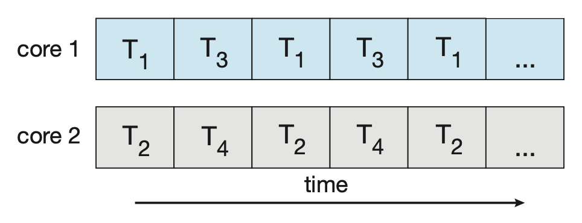
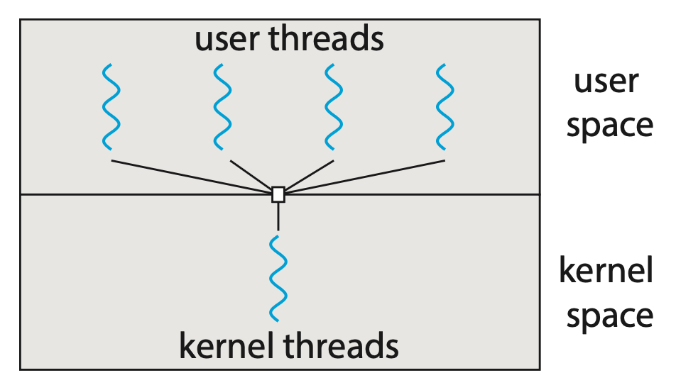
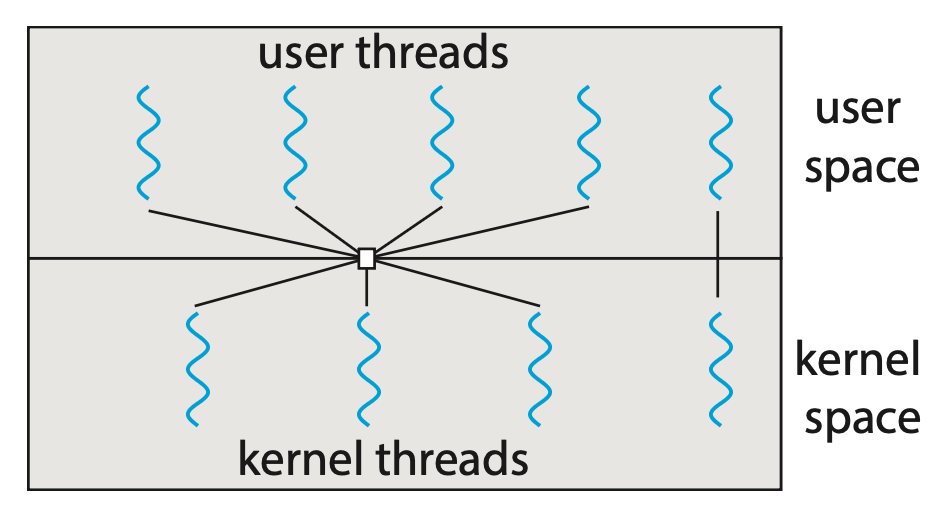
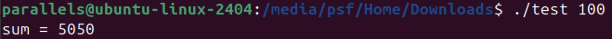

# Threads and Concurrency

??? abstract "核心知识"

    - 线程基本概念：what? why?
    - 多核编程：
        - 并发 vs 并行
    - 多线程模型：多对一、一对一、多对多
    - 线程库：Pthread
    - 隐式线程：线程池、fork-join

!!! info "补充知识：[Linux 线程](https://xuan-insr.github.io/%E6%A0%B8%E5%BF%83%E7%9F%A5%E8%AF%86/os/II_process_management/5_thread/#53-linux-%E7%BA%BF%E7%A8%8B)（by 咸鱼暄）"

## Overview

**线程**(thread)是 CPU 利用(utilization)（或资源调度）的基本单位，包括了线程 ID、程序计数器（PC）、寄存器集和栈空间。一个线程和属于同一进程的其他线程共享进程的代码段、数据段和其他 OS 资源。下图展示了传统的单线程进程和多线程进程之间的区别：

<div style="text-align: center">
    
</div>

而在地址空间上的差别如下：

<div style="text-align: center">
    
</div>

线程看起来很像一个单独的进程，除了一个区别：线程能共享地址空间，因而能访问相同的数据。

类似进程，线程也有一个叫做**线程控制块**(thread control blocks, **TCB**)的东西，用于保存进程中每个线程的状态。


### Motivation

使用线程的原因可归纳为以下两点：

- **并行**(parallelism)：将单线程程序转变为能在多个 CPU 上执行同一作业的任务称为**并行化**(parallelization)；而让每个线程使用一个 CPU 的方式是实现并行化的自然且典型的方法
- 避免因 I/O 速度慢导致进程阻塞：线程使得单个程序内的 I/O 操作能够与其他活动**重叠**(overlap)进行，类似跨进程的多道程序设计

虽然仅通过多进程也能实现这两点，但线程的独特之处在于共享地址空间使得共享数据变得很容易，而进程更适合逻辑上相对独立，且不怎么需要共享数据的任务上。

???+ example "例子"

    有时我们会要求应用程序执行一组类似的任务，比如一个 Web 服务器要处理多个（有时是大量）来自不同客户端的请求。

    - 如果仍然采用传统的单线程进程，那么一次只能处理一个客户端的请求，其他请求需要等待很长的时间
    - 在线程这个概念诞生前，一种解决方案是创建单独的进程来处理一个请求，但这样做不仅耗时，而且容易导致资源紧张
    - 而采用包含多个线程的进程的话，服务器能够创建一个用于专门监听其中一个客户端请求的线程，并且可以继续监听其他服务器的请求，这样做显然更高效

        <div style="text-align: center">
            
        </div>

除了应用程序，大多数 OS 的内核也是多线程的。在 Linux 系统中可通过 `#!bash ps -ef` 命令查看当前运行在系统中的内核进程，其中线程 `kthreadd`（`pid = 2`）是所有线程的父线程。

<div style="text-align: center">
    
</div>

多线程还有更广泛的应用，包括各种算法和数据结构的实现、以及当前的 CPU 密集型问题（数据挖掘、图形学、AI 等）。


### Benefits

多线程编程的好处可归纳为以下几点：

- **响应性**(responsiveness)：
    - 多线程的交互式应用程序可以让程序即使在部分被阻塞，或执行长时间操作的情况下也能继续运行，从而提高对用户的响应能力
    - 这种特性在设计**用户界面**时特别有用。如果是单线程，应用程序在操作完成之前会处于无响应状态；而如果单独的异步线程中执行，应用程序仍然可对用户保持响应
- **资源共享**(resource sharing)：
    - 进程只能通过共享内存和消息传递等技术来共享资源，而且必须由程序员自行安排
    - 而线程默认情况下会共享它们所属进程的内存和资源，使得一个应用程序在相同的地址空间内拥有几个不同的活动线程
- **经济性**(economy)：
    - 进程创建时分配内存和资源的开销不小；而线程共享它们所属进程的资源，所以创建和切换线程的成本更少
    - 一般来说，线程创建比进程创建消耗更少的时间和内存，并且线程之间的上下文切换通常比进程之间的上下文切换更快
- **可扩展性**(scalability)：多线程在多处理器架构下能发挥更大的潜力，因为线程可以在不同的处理核心上并行运行


## Multicore Programming

考虑一个带 4 个线程的应用程序。

- 在单核系统上，并发仅仅意味着线程在时间上**交错**(interleave)执行，因为核心一次只能执行一个线程

    <div style="text-align: center">
        
    </div>

- 但在多核系统上，并发意味着一些线程可并行运行，因为系统可将一个线程分配给一个单独的核心

    <div style="text-align: center">
        
    </div>


!!! note "并发 v.s. 并行"
    
    - **并发**(concurrency)系统通过推进所有任务（不一定同时推进）来执行多个任务
    - **并行**(parallelism)系统可以同时执行多个任务
  
    所以即便没有并行，也可以有并发。在多处理器和多核架构出现之前，大多数计算机系统只有一个处理器，因此系统利用 CPU 调度器**快速在进程之间切换**的能力来提供并行的错觉，但实际上这样的进程是**并发**运行而不是并行运行的。


### Programming Challenges

在多核系统中，程序员们会遇到以下几方面的编程挑战：

- **识别任务**(identifying tasks)：
    - 具体来说就是检查应用程序，找到可以划分为单独的、并发的任务
    - 理想情况下，这些任务彼此独立，因此可以在不同核心上并行运行
- **均衡**(balanceing)：
    - 在识别可并行运行的任务的同时，程序员还必须确保这些任务的执行工作量尽可能相等
    - 在某些情况下，某个特定任务对整个流程的贡献可能不如其他任务大，此时使用单独的执行核心来运行该任务或许并不划算
- **数据分割**(data splitting)：正如应用程序被划分为不同的任务一样，被这些任务访问和操作的数据也必须进行划分，以便在独立的处理器核心上运行
- **数据依赖**(data dependency)：
    - 必须检查任务所访问的数据是否存在两个或更多任务间的依赖关系
    - 当一个任务依赖于另一个任务的数据时，程序员必须确保任务的执行同步进行，以适应数据依赖性
- **测试和调试**(testing and debugging)：当一个程序在多个核心上并行运行时，可能会出现许多不同的执行路径，因此测试和调试这类并发程序本质上比测试和调试单线程应用程序更为困难


### Types of Parallelism

这里将并行类型大致分为两类（不同教材或课程的划分可能有所不同，但以这里介绍的为准）：

- **数据级并行**(data parallelism)：将同一数据的子集分布到多个计算核心上，并在每个核心上执行相同的操作
    - 例子：考虑对一个大小为 `N` 的数组内容进行求和
        - 在单核系统中，一个线程会简单地累加元素 `[0]` 至 `[N-1]`
        - 而在双核系统中，运行于核心 0 上的线程 A 负责累加元素 `[0]` 至 `[N/2-1]`，而运行于核心 1 上的线程 B 则负责累加元素 `[N/2]` 至 `[N-1]`，并且这两个线程将在各自的计算核心上并行运行

- **任务级并行**(task parallelism)：将任务（线程）而非数据分配到多个计算核心上；每个线程执行不同的操作，它们可能处理相同的数据，也可能处理不同的数据
    - 例子：对于上述累加任务，两个线程可能各自对数组执行唯一的统计运算，这些线程同样在独立的计算核心上并行运行，但每一个都在执行独一无二的操作

总之，数据级并行涉及将数据分布到多个核心上，而任务级并行则是将任务分布到多个核心上。它们的区别如下图所示：

<div style="text-align: center">
    
</div>

这两种并行并不相互排斥，而且事实上一些应用程序会同时（**混合**(hybrid)）采用这两种策略。


## Multithreading Model

{ align=right width=30% }

对线程的支持既可由用户提供（即**用户线程**(user thread)），又可由内核提供（即**内核线程**(kernel thread)）。

- 用户线程在内核之上得到支持，且无需内核介入管理
- 而内核线程则直接由 OS 支持和管理，并且几乎所有的现代 OS 都支持内核线程

不难想到，用户线程与内核线程之间必须存在某种关系。下面就来探讨建立这种关系的几种常见方式。


### Many-to-One Model

{ align=right width=30% }

**多对一模型**(many-to-one model)将多个用户线程映射到一个内核线程上。

- 线程管理由用户空间的线程库完成，因此效率较高
- 然而，如果某个线程执行了阻塞式的系统调用，整个进程将会被阻塞
- 此外，由于同一时间仅有一个线程能够访问内核，多线程无法在多核系统上并行运行


### One-to-One Model

{ align=right width=30% }

**一对一模型**(one-to-one model)将单个用户线程映射到一个内核线程。

- 相比多对一模型，通过允许在线程发起阻塞式的系统调用时运行另一个线程，提供了更高的并发性
- 同时它还允许多个线程在多处理器上并行运行
- 唯一的缺点就是创建用户线程时需要创建相应的内核线程，而大量的内核线程可能会损害系统性能
- Linux 及 Windows 均实现了一对一模型


### Many-to-Many Model

{ align=right width=30% }

**多对多模型**(many-to-many model)将多个用户线程多路复用(multiplex)到数量较少或相等的内核线程上。

- 内核线程的数量视特定的应用程序或特定的机器而定
- 对并发性的影响：开发者可根据需要创建任意多的用户线程，而对应的内核线程能在多处理器上并行运行；此外，当某个线程执行阻塞式的系统调用时，内核能够调度其他线程继续执行

{ align=right width=30% }

- 一个多对多模型的变种（**两级模型**(two-level model)）：仍将多个用户线程复用到数量较少或相等的内核线程上，但同时允许一个用户线程绑定到单个内核线程上
- 尽管这是三种模型中最灵活的一种，但在实践中难以实现；此外，随着大多数系统上处理核心数量的不断增加，限制内核线程的数量已变得不那么重要，因此**现今多数 OS 仍然采用一对一模型**


## Thread Libraries

**线程库**(thread libraries)为程序员提供了创建和管理线程的 API。实现线程库的方法有：

- 完全在**用户空间**内提供库，无需内核支持：该库的所有代码和数据结构都存在于用户空间中，这意味着调用库中的函数会导致在用户空间中进行**本地函数调用**，而非系统调用
- 实现一个由 OS 直接支持的**内核级**线程库：库的代码和数据结构位于内核空间，并且调用该 API 中的函数通常会引发对内核的**系统调用**

几种常用的线程库：

- **POSIX Pthreads**：作为 POSIX 标准的线程扩展，既可以作为用户级库提供，也可以作为内核级库存在
- **Windows 线程库**：适用于 Windows 系统的内核级库
- **Java 线程 API**：允许在 Java 程序中直接创建和管理线程
    - 然而，由于大多数情况下 JVM 运行在宿主 OS 之上，因此 Java 线程 API 通常利用宿主系统上的现有的线程库来实现
        - Windows 系统 -> Windows API
        - UNIX、Linux、macOS -> Pthreads

对于 POSIX 和 Windows 线程模型，任何**全局数据**(global data)为属于同一进程的全部线程所共享。然而，由于 Java 没有“全局数据”的概念，因此在线程之间访问共享数据必须显式安排。

创建多线程的策略分为同步线程和异步线程：

- **异步线程**(asynchronous threading)：
    - 父线程创建子线程后，父线程仍然可以继续执行当前任务，因此父子线程能够**并发且独立地运行**
    - 由于这些线程相互独立，因此它们之间通常很少共享数据
    - 这一方法常用于设计 Web 服务器，以及响应式的用户界面等
- **同步线程**(synchronous threading)：
    - 父线程创建一个或多个子线程后，这些子线程可以并发地执行任务，但**父线程必须要等待所有子线程终止后才能继续执行**
    - 当每个子线程完成其工作后，它便会终止并与父线程**合并**(join)；只有在所有子线程都合并之后，父线程才能恢复执行
    - 通常来说，同步线程涉及**大量数据在线程间的共享**，比如父线程可能会整合各个子线程的计算结果


### Pthreads

**Pthreads** 是指定义线程创建与同步 API 的 POSIX 标准。这是一份关于线程行为的**规范**(specification)，而非具体实现。因此 OS 设计师可以通过他们希望的任何方式来实现这份规范，并且很多 OS 实现了这份规范。

下面展示了用基本的 Pthreads API 来构建一个计算非负整数累加的多线程程序。

??? code "代码实现"

    ```c hl_lines="13 15 17 30"
    #include <pthread.h>
    #include <stdio.h>
    #include <stdlib.h>

    int sum; /* this data is shared by the thread(s) */
    void *runner (void *param); /* threads call this function */

    int main(int argc, char *argv[]) {
        pthread_t tid; /* the thread identifier */
        pthread_attr_t attr; /* set of thread attributes */

        /* set the default attributes of the thread */
        pthread_attr_init(&attr);
        /* create the thread */
        pthread_create(&tid, &attr, runner, argv[1]);
        /* wait for the thread to exit */
        pthread_join(tid, NULL);

        printf("sum = %d\n", sum);
    }

    /* The thread will execute in this function */
    void *runner(void *param) {
        int i, upper = atoi(param);
        sum = 0;

        for (i = 1; i <= upper; i++)
            sum += i;

        pthread_exit(0);
    }
    ```

    - 所有 Pthreads 程序都必须包含 `pthread.h` 头文件
    - 在 Pthreads 程序中，独立线程从指定函数开始执行；对于上面的程序，这个函数就是 `runner()`
    - 当程序启动时，一个控制线程始于 `main()` 函数；经过一些初始化后，`main()` 创建了第二个线程，该控制线程始于 `runner()` 函数
    - 这两个线程共享全局数据 `sum`
    - 每个线程都有一套属性，包括栈大小和调度信息等，而 `pthread_attr_t attr` 就是用于声明该线程的属性，之后通过函数调用 `pthread_attr_init(&attr)` 中设置这些属性。
        - 由于这里没有明确设置任何属性，因此使用的是默认属性
    - 通过调用 `pthread_create()` 函数创建了一个独立线程
        - 除了传递线程标识符和线程属性外，还要传递新线程开始执行的函数名称）（这里是 `runner()` 函数）
        - 最后传递了命令行上提供的整数参数 `argv[1]`
    - 此时程序有两个线程：一个是在 `main()` 函数中的初始（或父）线程，另一个是在 `runner()` 函数中执行求和操作的求和（或子）线程
    - 该程序遵循线程创建/加入策略
        - 在创建了求和线程之后，父线程将通过调用 `pthread_join()` 函数等待其终止
        - 当求和线程调用 `pthread_exit()` 函数时便会结束运行
        - 一旦求和线程返回结果，父线程将输出共享数据 `sum` 的值

    >运行程序时一定要传入一个正整数，不然会报错（不输入参数就是段错误）。

    运行结果：

    <div style="text-align: center">
        
    </div>

使用 `pthread_join()` 函数等待多个线程终止的简单方法是将该函数包在一个 `#!c for` 循环中，比如：

```c hl_lines="7"
#define NUM_THREADS 10

/* an array of threads to be joined upon */
pthread_t workers[NUM THREADS];

for (int i = 0; i < NUM_THREADS; i++)
    pthread_join(workers[i], NULL);
```


## Implicit Threading

随着多核处理技术的进步，应用程序包含的进程数也会随之增多。要设计这样的程序可不是一个简单的任务：程序员不仅要应对之前列出的[那些挑战](#programming-challenges)，还包括程序正确性等其他挑战。

解决这些困难，并且更好地支持并发与并行应用程序设计的一种方法是：将线程的创建与管理从应用开发者手中转移给**编译器**(compiler)和**运行时库**(runtime libraries)，这一策略被称为**隐式线程**(implicit thread)。下面将探讨几种不同的设计方案，使应用程序能够借助隐式线程充分利用多核处理器的优势。

需要注意的是，这些策略通常要求应用开发者识别出可以并行运行的**任务**(tasks)，而非线程本身。任务通常以**函数**形式编写，随后由运行时库将其映射到独立的线程上，并且普遍采用**多对多模型**。这种方法的优势在于开发者只需确定并行任务的具体内容，而关于线程创建和管理的具体细节则由相关库来处理。


### Thread Pools

之前我们介绍过一个多线程的 Web 服务器：每当服务器接收到请求时，它会创建一个独立的线程来处理该请求。然而这样的多线程服务器仍存在一些问题：

- 考虑创建线程所需的时间**成本**，以及一旦任务完成，该线程即被丢弃的情况
- 若允许每个并发请求都由新创建的线程来服务，那么系统中同时活跃的线程**数量**将不受限制，而无限制的线程可能会耗尽系统资源

解决这些问题的一种方案是采用**线程池**(thread pool)技术。它的基本思路是：

- **在启动时创建一定数量的线程**，并将它们置于一个池中，这些线程会处于空闲状态并等待被分配任务
- 当服务器接收到请求时，它不会直接创建新线程，而是将请求**提交**给线程池后继续等待其他请求
- 如果池中有空闲的线程，该线程会被**唤醒**并立即处理请求；若无线程可用，则该任务会排队**等候**，直到有线程释放出来
- 一旦某个线程完成了它的工作，它会返回到池中，等待之后的工作分配
- 当提交给池的任务能够**异步**执行时，使用线程池效果最佳

使用线程池的好处有：

- 使用现成的线程处理请求通常比等待创建新线程更快
- 线程池限制了在任何时刻存在的线程数量，这对于无法支持大量并发线程的系统尤为重要
- 将要执行的任务与创建任务的机制分离开来，使我们能够采用不同的策略来运行任务，比如可以安排任务在延迟一段时间后执行或定期执行

线程池中的线程数量可以根据系统 CPU 核心数量、物理内存大小以及预期的并发客户端请求数等因素进行**启发式的**(heuristic)设置。而更先进的线程池架构能够根据使用模式**动态调整**池中线程的数量；它的额外优势在于，当系统负载较低时，可以维持较小的线程池规模，从而减少内存占用。


### Fork Join

“[线程库](#thread-libraries)”一节介绍的线程创建策略通常被称为**分叉-合并**(fork-join)模型。

<div style="text-align: center">
    
</div>

- 父线程会创建（**分叉**(fork)）一个或多个子线程，随后等待这些子线程终止并与之**合并**(join)（获取并整合子进程的结果）
- 这种**同步**模型通常是一种显式的线程创建，但它同样非常适合隐式的线程处理；对于后者，分叉阶段并不直接构建线程，而是指定并行任务

一般会用一个库来管理创建的线程数量，并负责将任务分配给各个线程，比如 Java 提供相关的 API（具体见教材 $P_{180-183}$）等。


## Threading Issues

!!! warning "注意"

    以下长篇大论大概率不会考（~~复习时我也略过了~~）

### The fork() and exec() System Calls

在多线程程序中，`fork()` 和 `exec()` 系统调用的语义会发生变化。

- 一些 UNIX 系统提供了两种版本的 `fork()`：一种可以复制所有线程，另一种仅复制发起 `fork()` 系统调用的那个线程
- 而 `exec()` 系统调用通常与上一章介绍的方式相同，也就是说如果一个线程调用 `exec()` 系统调用，参数中指定的程序将替换整个进程，包括其所有线程
- 选择使用哪种版本的 `fork()` 取决于应用程序的具体情况
    - 如果在执行分叉后立即调用 `exec()`，那么复制所有线程就显得多余了，因为随后由 `exec()` 参数指定的程序会取代原进程；因此在这种情况下，只复制调用线程更为合适
    - 然而, 如果分离出的进程在分叉之后不立即调用 `exec()`, 则应当完整地复制所有线程到新进程中


### Signal Handling

在 UNIX 系统中，**信号**(signal)用于通知进程的某个特定事件已经发生。根据事件的来源和发出信号的原因，信号的接收可以是**同步**的或**异步**的。无论是同步还是异步信号，它们都遵循相同的模式：

1. 发生一个特定事件时产生一个信号
2. 该信号被传递给一个进程
3. 一旦进程收到信号，必须对其进行处理

同步和异步信号的例子有：

- **同步**信号：
    - 包括非法内存访问和除以零操作等
    - 如果正在运行的程序发生上述情况，就会产生一个信号，并且同步信号会传递给执行导致该信号出现的操作的同一进程
- **异步**信号：
    - 当一个信号来自运行中进程的外部事件时，该进程会异步接收到这个信号
    - 包括通过特定按键（如 Ctrl + C）终止进程以及定时器超时等
    - 通常异步信号会被发送给另一个进程

信号既可被**默认的信号处理器**(default signal handler)处理，也可被**用户定义的信号处理器**(user-defined signal handler)处理。

- 每个信号都有一个默认的信号处理器，内核处理信号时就会运行默认处理器
- 可以用用户自定义的信号处理器覆盖默认版本，用于处理信号
- 信号可以有不同的的处理方式，包括直接忽略，或通过终止程序来处理

然而，在多线程程序中传递信号相对复杂，将信号传递给谁就成为一个不可忽视的问题，可能的选项有：

- 将信号传递给该信号**所适用的线程**
- 将信号传递给进程中的**每一个线程**
- 将信号传递给进程中的**某些特定线程**
- **指定一个特定的线程**来接收该进程的**所有信号**

信号的传递方式取决于所产生信号的类型：

- 同步信号需要传递给引发该信号的线程，而非进程中的其他线程
- 异步信号的情况则不那么明确
    - 一些异步信号（比如终止进程的信号）应当发送给所有线程

在 UNIX 中，传递信号的标准函数是 `#!c kill(pid t pid, int signal)`，它指定了将特定信号（`signal`）传递给哪个进程（`pid`）。此外某些特定按键组合也能传递信号，比如 ++ctrl+c++ 发送 `SIGINT`（中断）信号（通常用于终止进程），++ctrl+z++ 发送 `SIGSTP`（停止）信号，因而暂停进程的执行（之后可通过 `fg` 等命令继续该命令）。

而 POSIX Pthreads 提供的将信号传递给特定线程（`tid`）的函数是 `#!c pthread kill(pthread t tid, int signal)`。


### Thread Cancellation

**线程取消**(thread cancellation)是指在某个线程完成之前终止它的执行。例子有：

- 当多个线程同时搜索数据库时，一旦有一个线程返回了结果，其余线程便可能被取消
- 用户点击 Web 浏览器上的停止按钮以中断页面加载过程，此时所有正在加载页面的线程都会被取消

一个可能要被取消的线程通常被称为**目标线程**(target thread)。目标线程的取消可能发生在以下场景中：

- **异步取消**(asynchronous cancellation)：某个线程立即终止目标线程
- **延迟取消**(deferred cancellation)：目标线程周期性地检查是否应该终止，从而使其有机会以有序的方式自行终止

取消操作的难点在于：在资源已被分配给一个已取消的线程时，或者某个线程在更新与其他线程共享的数据过程中被取消，这对**异步取消**尤为棘手。通常，OS 会从已取消的线程中回收系统资源，但并非所有资源都能得到回收。因此，异步取消一个线程可能无法释放必要的系统级资源。

相比之下，采用**延迟取消**的方式时，一个线程指示目标线程应被取消，但实际上的取消操作仅在目标线程检查了一个标志位、确认自身是否应被取消之后才发生。这样一来，该线程可以在能够被安全撤销时执行这一检查。

在 Pthreads 中，线程取消是通过调用 `pthread_cancel()` 函数来发起的，其中目标线程的标识符作为参数传递给该函数。

??? example "例子"

    ```c hl_lines="9"
    pthread_t tid;

    /* create the thread */
    pthread_create(&tid, 0, worker, NULL);

    /* ... */

    /* cancel the thread */
    pthread_cancel(tid);

    /* wait for the thread to terminate */
    pthread_join(tid, NULL);
    ```

调用 `pthread_cancel()` 仅表示向目标线程**发送取消请求**，但实际的取消操作取决于目标线程如何处理该请求。当目标线程最终被取消时，发起取消的线程中对 `pthread_join()` 的调用将返回。Pthreads 支持三种取消模式，每种模式都定义为一个状态和一个类型，线程可以通过 API 设置其自身的取消状态和类型，具体如下表所示：

|模式|状态|类型|
|:-:|:-:|:-:|
|Off|Disabled|-|
|Deferred|Enabled|Deferred|
|Asynchronous|Enabled|Asynchronous|

如上表所示，Pthreads 允许线程**禁用**或**启用**取消。显然，如果禁用取消，则线程无法被取消，但取消请求仍然挂起，因此线程可以稍后启用取消并响应请求。

**默认**的取消类型是**延迟取消**。然而，取消仅在线程达到**取消点**(cancellation point)时发生。POSIX 和标准 C 库中的大多数阻塞系统调用都被定义为取消点。建立取消点的一种技术是调用 `pthread_testcancel()` 函数。

- 如果发现存在挂起的取消请求，对 `pthread_testcancel()` 的调用将不会返回，线程将终止
- 否则，对函数的调用将返回，线程将继续运行
 
此外，Pthreads 在线程被取消时可以调用一个名为**清理处理器**(cleanup handler)的函数，此函数允许在线程终止之前释放线程可能获取的任何资源。

以下代码展示了线程如何使用延迟取消来响应取消请求：

```c hl_lines="5"
while (1) {
    /* do some work for a while */
    
    /* check if there is a cancellation request */
    pthread_testcancel();
}
```

鉴于异步取消存在的问题，Pthreads 官方文档并不推荐使用异步取消方式，因此这里便不再赘述。

值得一提的是，在 Linux 系统上，通过 Pthreads API 实现的线程取消是通过**信号**来处理的。


### Thread-Local Storage

线程间的数据共享是多线程编程的优势之一。但是在某些情况下，每个线程可能需要拥有特定数据的独立副本，我们将这类数据称为**线程局部存储**(thread-local storage, **TLS**)。

例如，在事务处理系统中，我们可能会为每个事务分配一个单独的线程来服务，而每个事务可能被赋予唯一的 id。为了将各个线程与其唯一的事务 id 关联起来，可以用 TLS 实现。

需要注意的是，不要将 TLS 与**局部变量**混为一谈：

- 局部变量仅在单次函数调用期间可见
- 而 TLS 数据则在多次函数调用间仍然保持可见性

另外，TLS 与**静态数据**相似，但不同之处在于，TLS 数据对每个线程来说是唯一的。而实际上，TLS 通常被声明为 `#!c static`。

大多数线程库和编译器都提供了对 TLS 的支持，比如 GCC 编译器则提供了存储类关键字 `__thread` 来声明 TLS 数据。举例来说，
如果我们想为每个线程分配一个唯一 id，可以这样声明：`#!c static __thread int threadID;`


### Scheduler Activation

{ align=right width=20% }

最后一个要讨论的问题是内核与线程库之间的通信，这对多对多模型和两级模型中可能是必需的，因为这有助于动态调整内核线程的数量，从而确保最佳性能。

许多采用多对多或两级模型的系统在用户线程与内核线程之间设置了一个中间的数据结构，通常被称为**轻量级进程**(lightweight process, **LWP**)，如右图所示。

- 对于用户线程库而言，LWP 如同一个**虚拟处理器**，应用程序可以在其上调度用户线程运行
- 每个 LWP 都与一个内核线程相连，而 OS 正是通过这些内核线程来安排在物理处理器上运行的
- 如果某个内核线程阻塞（例如等待 I/O 操作完成），相应的 LWP 也会随之阻塞，进而依附于该 LWP 的用户线程同样会被阻塞

应用程序可能需要任意数量的 LWPs 才能高效运行。比如对于 I/O 密集型的应用来说，可能需要多个 LWPs 同时执行。通常，每个并发的阻塞系统调用都需要一个 LWP 来处理。

举例来说，如果有 5 个不同的文件读取请求同时发生，就需要 5 个 LWPs 来应对，因为它们可能全部在内核中等待 I/O 完成；如果一个进程只有 4 个 LWPs 可用，那么第 5 个请求就必须等到其中一个 LWP 从内核返回后才能得到处理。

用户线程库与内核之间的一种通信方案叫做**调度器激活**(scheduler activation)。其工作原理如下：

- 内核为应用程序提供一组虚拟处理器（LWPs），应用程序可以将用户线程调度到可用的虚拟处理器上运行
- 此外，内核必须向应用程序通知某些事件，这一过程称为**上行调用**(upcall)
    - 上行调用由线程库通过**上行调用处理程序**(upcall handler)来处理，且这些处理程序必须在虚拟处理器上执行

触发上行调用的一种情况是应用程序线程即将阻塞的时候。

- 在这种场景下，内核会向应用程序发起一个上行调用，通知它有一个线程将要阻塞，并指明具体的线程
- 随后，内核为应用程序分配一个新的虚拟处理器，之后应用程序在这个新的虚拟处理器上运行一个上行调用处理程序，该程序保存阻塞线程的状态并释放正在运行阻塞线程的虚拟处理器
- 接着，上行调用处理程序调度另一个有资格运行的线程到新的虚拟处理器上执行
- 当阻塞线程等待的事件发生时，内核再次向线程库发起另一个上行调用，告知之前被阻塞的线程现在可以运行了
- 此事件的上行调用处理程序同样需要一个虚拟处理器；内核可能会分配一个新的虚拟处理器，或抢占某个用户线程的虚拟处理器来运行这个处理程序
- 在将解除阻塞的线程标记为可运行后，应用程序会在可用的虚拟处理器上调度一个有资格运行的线程执行