# CPU Scheduling

??? abstract "核心知识"

    - 基本概念：
        - CPU 调度器 vs 分派器
        - 抢占 vs 非抢占

    - 衡量调度算法的标准：CPU 利用率、吞吐量、周转/等待/响应时间
    - **调度算法**：
        - FCFS
        - SJF
        - RR
        - 优先级
        - 多级队列
        - 多级反馈队列

    - 后续内容应该不在考试范围内...

!!! warning "注意"

    别看上面标了将近两万的字数，实际上考试的重点应该仅在包括「[调度算法](#scheduling-algorithms)」在内的前半部分，而这些部分仅占全篇的 1/3 左右。所以复习（~~或预习~~）的时候不要被字数吓到了，实际上内容不是很多，而且也不是很难的知识点。


## Basic Concepts

在**多道程序设计**(multiprogramming)中，我们试图高效利用 CPU 的时间，比如当一个进程需要等待时，OS 便收回该进程的 CPU 使用权，并将其交给另一个进程，如此循环往复。这样的**调度**(scheduling)操作是 OS 中基本且重要的功能；几乎所有计算机资源在使用时都需要进行调度。先来认识一些和调度相关的基本概念。


### CPU-I/O Burst Cycle

{ align=right width=30% }

CPU 调度的成功取决于进程的一个特性：进程执行包含了一个 **CPU 执行**和 **I/O 等待**的周期(cycle)，即进程在这两种状态之间交替进行。

- 进程执行始于一个 CPU 突发周期，随后是一个 I/O 突发周期
- 紧接着又是一个 CPU 突发周期，然后再次是 I/O 突发周期，如此往复
- 最后一个 CPU 突发通过系统请求终止进程的执行

尽管 CPU 突发时间的长度在不同进程和不同计算机之间差异很大，但其频率曲线往往与下图所示相似：

<div style="text-align: center">
    
</div>

- 该曲线通常以指数型或超指数型的形式呈现，包括了大量的短 CPU 突发和少量的长 CPU 突发
- I/O 密集型程序通常有许多短的 CPU 突发
- 而 CPU 密集型程序则可能只有少数几个长的 CPU 突发

在实现 CPU 调度算法时，上述分布特性至关重要。


### CPU Scheduler

- 每当 CPU 进入空闲状态时，OS 借助 **CPU 调度器**(CPU scheduler)从内存（具体来说是**就绪队列**，里面存放有关进程 PCB 的记录）中挑选一个进程，并分配一个 CPU（核心）以执行该进程
- 需要注意的是，就绪队列并不一定是 FIFO 队列，它还可以是优先级队列、树结构，或仅仅是一个无序链表；之后会在“[调度算法](#scheduling-algorithms)”一节中详细介绍


### Preemptive and Nonpreemptive Scheduling

当出现以下情况之一时，CPU 需做出调度决策：当进程

1. 运行状态 -> 等待状态
2. 运行状态 -> 就绪状态
3. 等待状态 -> 就绪状态
4. 终止

对于情况 1 和 4，唯一的调度策略是：必须从就绪队列中选取一个新进程（如果存在的话）来执行。但对于情况 2 和 3，还可以有其他选择。我们认为，情况 1 和 4 中发生的调度是**非抢占的**(nonpreemptive)或**协作的**(cooperative)；这一策略的反面便是**抢占的**(preemptive)调度。

!!! recommend "推荐阅读"

    本节上面的内容在[修佬笔记](https://note.isshikih.top/cour_note/D3QD_OperatingSystem/Unit1/#%E8%B0%83%E5%BA%A6%E7%9A%84%E6%97%B6%E6%9C%BA)中介绍的更清楚，还配有友好的图示，值得阅读👍

- 在**非抢占的**调度下，一旦 CPU 被分配给某个进程，该进程将一直占用 CPU，直到通过终止或切换到等待状态来释放（对应首尾两类情况）
- 实际上，<u>几乎所有现代 OS 都采用**抢占的**调度算法</u>
- 当数据在多个进程间共享时，抢占式调度可能导致**竞态条件**(race condition)的发生
    - 设想两个进程共享数据的情况：当一个进程正在更新数据时被抢占，以便第二个进程得以运行；随后第二个进程尝试读取这些处于**不一致状态**的数据
    - 这一问题将在[下一讲](6.md)介绍「进程同步」时详细探讨

- 抢占机制影响了**内核**的设计
    - 在执行系统调用期间，内核可能正忙于执行代表某个进程的活动，这类活动或许涉及修改关键的内核数据；若在此更改过程中进程被抢占，而内核又需要读取或修改同一结构时，结果就会一团糟
    - **非抢占式内核**会等待系统调用完成，或在等待 I/O 操作完成导致进程阻塞后，才进行上下文切换
        - “等待 I/O 操作完成导致进程阻塞引起的上下文交换”是一种**重叠**(overlap)操作，能提高 CPU 利用率
        - 这种方案确保了内核结构的**简洁性**，因为在内核数据结构处于不一致状态时，内核不会抢占进程
        - 然而对于必须确保任务在指定时限内完成的**实时计算**而言，这种内核执行模式**表现欠佳**
    - 而**抢占式内核**则需要**互斥锁**(mutex locks)等机制来防止访问共享内核数据结构时的竞态条件问题
        - 目前大多数现代 OS 在内核模式下运行时已完全实现抢先式处理能力

- 由于**中断**可能随时发生，且内核不能忽略它们，因此必须保护受中断影响的代码段，防止被同时使用
    - OS 几乎在任何时候都需要接受中断，否则输入可能会丢失，或输出被覆盖
    - 为了避免代码段被多个进程并发访问，它们<u>在入口处禁用中断，并在出口处重新启用中断</u>
    - 但禁用中断的代码段并不常见，且通常只包含少量指令


### Dispatcher

**分派器**(dispatcher)是 CPU 调度功能中的一个组件，是 CPU 核心的控制权交给由 CPU 调度程序选定进程的模块。其功能包括：

{ align=right width=20% }

- 从一个进程**切换**到另一个进程的**上下文**
- 切换到**用户模式**
- 跳转到用户程序中的适当位置，以恢复该程序的执行

分派器应尽可能快速，因为每次上下文切换时都会调用它。分派器停止一个进程，并启动另一个进程所需的时间被称为**分派延迟**(dispatch latency)，如右图所示：

在 Linux 系统中，可用 `vmstat` 命令来获取上下文切换的次数，以下是该命令的输出：

<div style="text-align: center">
    
</div>

- 第一行显示自系统启动以来，每秒的平均上下文切换次数
- 接下来的两行则分别给出了两个连续 1 秒间隔内的上下文切换次数

另外也可以利用 `/proc` 文件系统来确定特定进程的上下文切换次数。例如，查看文件 `/proc/2166/status` 的内容将会列出进程 ID 为 `2166` 的各项统计信息。命令 `#!bash cat /proc/2166/status` 的部分输出如下：

```
voluntary ctxt switches              150
nonvoluntary ctxt switches           8
```

此输出显示了该进程生命周期内的上下文切换次数。这里要注意**自愿**(voluntary)与**非自愿**(nonvoluntary)上下文切换之间的区别：

- 当进程因所需资源当前不可用而放弃 CPU 控制权时，发生的是**自愿**上下文切换
- 而**非自愿**上下文切换则发生在 CPU 被强制从进程中夺走的情况下，比如其时间片已用完，或被更高优先级的进程抢占

??? abstract "CPU 调度器 vs 分派器"

    >由 Gemini 3 Flash 生成

    | 特性 | CPU 调度器 | 分派器 |
    | :--- | :--- | :--- |
    | 定义 | 选择进程的算法逻辑 | 实施切换的控制模块 |
    | 主要任务 | 决定哪个进程该获得 CPU | 将 CPU 的控制权实际交给选中的进程 |
    | 操作性质 | **决策性**（挑选） | **执行性**（物理切换） |
    | 耗时考量 | 关注算法的公平性和效率 | 关注**分派延迟**，越短越好 |
    | 是否可跳过 | 是逻辑步骤，必须先运行 | 是物理步骤，紧随调度器之后 |

    一个很生动的类比：
    
    - CPU 调度器就像是银行的叫号系统，根据规则决定下一个轮到哪位客户
    - 分派器就像是柜台职员，负责结束前一个人的业务、清理桌面、翻开下一个人的资料，并示意对方开始业务


## Scheduling Criteria

不同的 CPU 调度算法具有各自的特点，选择特定的算法可能会对某一类进程更为有利，因此在选用何种算法时就得必须考量各种算法的特性。已有多种用于比较 CPU 调度算法的评判标准，包括：

- **CPU 利用率**(CPU utilization)：
    - 我们希望尽可能让 CPU 保持忙碌状态
    - 理论上，CPU 利用率可以在 0% 到 100% 之间变化
    - 而在实际系统中，它通常应在 40%（对于负载较轻的系统）至 90%（对于负载较重的系统）的范围内

- **吞吐量**(throughput)：单位时间内完成的进程数量
- **周转时间**(turnaround time)：一个进程从**交付**（到达）到**完成**所经历的时间间隔，包括了该进程在就绪队列中等待，在 CPU 上执行，以及进行 I/O 操作所花费时间的总和
    - 它是一个**性能**(performance)指标

- **等待时间**(waiting time)：在就绪队列中所有等待时段的总和
    - CPU 调度算法并不影响进程执行或进行 I/O 操作的时间总量，它仅影响进程在就绪队列中等待的时间量

- **响应时间**(response time)：从请求**交付**（到达）到**首次产生响应**的时间
    - 常用于**交互式系统**中
    - 有时响应时间也指从请求到达到系统首次调度的时间，和上述定义略有区别
    - 它是一个**公平性**(fairness)指标，即在一个小的时间尺度上，将 CPU 均匀分配给活跃进程

理想情况下，我们希望<u>最大化 CPU 利用率和吞吐量，同时最小化周转时间、等待时间和响应时间</u>。

- 在多数场景下，我们优化的是**平均**指标
- 然而在某些特定情况下，我们更倾向于优化**最小值或最大值**而非平均值
    - 例如，为了确保所有用户都能获得良好的服务体验，我们可能希望将最大响应时间降至最低

- 对于交互式系统，**减小响应时间的方差**(variance)比降低平均响应时间更为关键
    - 一个响应时间合理且可预测的系统，即便其平均速度不是最快但表现稳定，通常被认为优于那些平均速度快但波动大的系统
    - 不过目前针对减少方差进行优化的 CPU 调度算法研究尚不充分

??? question "思考"

    >来自朋辈辅学课件。

    === "问题"

        计算各个进程的周转时间、等待时间和响应时间，以及平均周转、等待、响应时间。

        <div style="text-align: center">
            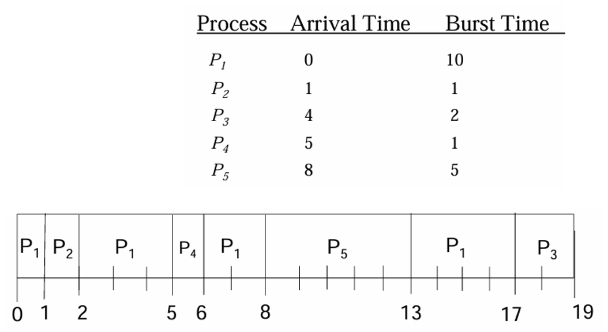
        </div>

    === "解答"

        | 进程 | 周转时间 | 等待时间 | 响应时间 |
        | :--- | :--- | :--- | :--- |
        | P1 | 17 | 7 | 0 |
        | P2 | 1 | 0 | 0 |
        | P3 | 15 | 13 | 13 |
        | P4 | 1 | 0 | 0 |
        | P5 | 5 | 0 | 0 |


## Scheduling Algorithms

接下来介绍多种不同的 CPU 调度算法。需要注意的是，我们目前仅考虑**单个可用处理核心**的情况，即一个 CPU 只能在某一时间段内运行一个进程的情况，而关于多处理器系统中的 CPU 调度问题会放到后面讨论。

!!! warning "注意"

    如果介绍某一算法时没有明确提到是否是抢占式的，那么它既可以是抢占式，也可以是非抢占式。


### First-Come, First-Served Scheduling

最简单的 CPU 调度算法就是**先来先服务**(first-come first-served, **FCFS**)调度算法。

- 请求 CPU 的首个进程会被优先分配 CPU
- 通过一个先进先出（**FIFO**）队列可以轻松实现 FCFS 策略
- 当一个进程进入就绪队列时，其 PCB 会被链接该队列的尾部
- 而空闲的 CPU 会被分配给队列头部的进程，随后从队列中移除该进程
- 编写和理解 FCFS 调度的代码非常**简单**
- 但缺点是**平均等待时间通常较长**

???+ example "例子"

    假如以下一组进程在时刻 0 到达，它们的 CPU 突发长度（单位：ms）如下所示：

    <div style="text-align: center">
        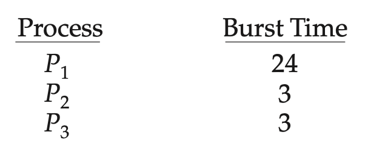
    </div>

    若这些进程的到达顺序为 $P_1, P_2, P_3$，那么可以用**甘特图**(Gantt chart)表示为：

    <div style="text-align: center">
        
    </div>

    不难得出，$P_1, P_2, P_3$ 的等待时间分别为 0ms，24ms 和 27ms，因此平均等待时间为 17ms。然而，若到达顺序为 $P_2, P_3, P_1$，用甘特图表示为：

    <div style="text-align: center">
        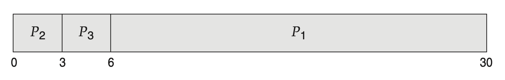
    </div>

    读者可自行计算，此时平均等待时间变为 3ms，降低幅度相当之大啊！因此在 FCFS 策略下，平均等待时间通常不是最短的；并且如果进程的 CPU 执行时间差异很大时，这一时间可能会（随进程到达顺序）有显著变化。

假设有一个 CPU 密集型进程和多个 I/O 密集型进程。随着这些进程在系统中流转，可能会出现以下情形：

- CPU 密集型进程会获取并占用 CPU，在此期间所有其他进程将完成它们的 I/O 操作并进入就绪队列，并等待使用CPU，此时 I/O 设备处于闲置状态
- 之后，CPU 密集型进程完成了其 CPU 突发时间，并转移到某个 I/O 设备上；此时那些具有较短 CPU 突发的 I/O 密集型进程迅速执行完毕后返回至各自的 I/O 队列，此时 CPU 便空闲下来
- 随后那个 CPU 密集型进程又会回到就绪队列并使用 CPU；所有的 I/O 处理进程又在就绪队列等待那个进程完成

这就是所谓的**护航效应**(convoy effect)：众多相对较小的资源消费者（进程）排在一个占用资源很多的消费者的后面，这导致 CPU 和设备利用率很低。

注意 FCFS 调度算法是**非抢占式的**，所以一旦 CPU 被分配给某个进程，该进程就会一直占用 CPU，直到其释放。因此对于交互式系统而言，FCFS 算法的表现非常烂。


### Shortest-Job-First Scheduling

第二种要介绍的算法是**最短作业优先**(shortest-job-first, **SJF**)调度算法。

- 该算法将每个进程的**下一个 CPU 突发周期长度**与其关联起来
    - 因此这种调度方法更准确的名称应为“最短下一 CPU 突发周期(shortest-next-CPU-burst)”算法
    - ~~之所以使用 SJF 这一术语，是因为大家都这么说...~~

- 当 CPU 空闲时，它会分配给下一个 CPU 执行周期最短的进程
- 如果两个进程的下一个 CPU 执行周期相同，则采用 FCFS 调度来决定顺序

???+ example "例子"

    考虑下面一组进程，并给出对应 CPU 突发长度（单位：ms）：

    <div style="text-align: center">
        
    </div>

    以下甘特图是使用 SJF 调度算法后得到的结果：

    <div style="text-align: center">
        
    </div>

    不难计算出平均等待时间为 7ms。相对地，用 FCFS 调度算法得到的平均等待时间位 10.25ms。

SJF 调度算法被证明是**最优的**，因为它能为给定的一组进程提供最小的平均等待时间。将一个短进程移到长进程之前，会减少短进程的等待时间，其减少量大于长进程等待时间的增加量，因此平均等待时间得以降低。

尽管 SJF 算法是最优的，但实际上无法精确实施，因为我们无法预先得知下一个 CPU 突发的长度。针对这一问题，一种解决思路是尝试**近似表示 SJF 调度**。通常认为，下一次的 CPU 突发长度会与前一次的类似，于是我们能够选择预计处理时间最短的那个进程来执行了。

更准确的说法是，下一个 CPU 突发的预测通常基于先前 CPU 突发长度的**指数平均**。设 $t_n$ 为第 $n$ 个 CPU 的突发长度，$\tau_{n+1}$ 为下一个 CPU 突发的预测值。对于 $0 \le \alpha \le 1$，预测值的定义为：
$$
\tau_{n+1} = \alpha t_n + (1 - \alpha) \tau_n
$$

其中

- $t_n$ 的值包含最近信息
- $\tau_n$ 则存储了过去的历史记录
    - 初始值 $\tau_0$ 可以定义为一个常数或系统的整体平均值

- $\alpha$ 控制着近期与过去历史在预测中的相对权重
    - 一般取 $\alpha = \dfrac{1}{2}$，这样近期历史和过去历史就被赋予了相同的权重

下图展示了下一次 CPU 突发的预测结果（$\alpha = \dfrac{1}{2}, \tau_0 = 10$）：

<div style="text-align: center">
    
</div>

要理解指数平均，我们可通过替换 $\tau_n$ 来展开 $\tau_{n+1}$ 的公式，得到：
$$
\tau_{n+1} = \alpha t_n + (1 - \alpha)\alpha t_{n-1} + \cdots + (1 - \alpha)^j \alpha t_{n-j} + \cdots + (1 - \alpha)^{n+1}\tau_0
$$

由于 $\alpha < 1$，因此 $1 - \alpha < 1$，且每一个连续项都比它之前的项有更小的权重。

???+ example "例子"

    考虑下面一组进程，并给出对应 CPU 突发长度（单位：ms）：

    <div style="text-align: center">
        
    </div>

    以下甘特图是使用**抢占式** SJF 调度算法后得到的结果：

    <div style="text-align: center">
        
    </div>

    - 由于 $P_1$ 剩余的执行时间大于 $P_2$ 所需时间，因此 $P_1$ 的 CPU 被抢占给 $P_2$；$P_4$ 也是同理
    - 不难计算出平均等待时间为 6.5ms；相对地，非抢占式 SJF 调度的平均等待时间为 7.75ms


### Round-Robin Scheduling

**轮询**(round-robin, **RR**)调度算法类似 FCFS 调度，但引入了**抢占**机制，使系统能够在进程间切换。该算法定义了一个很小的时间间隔，称为**时间片**(time quantum/slice)，其长度通常为 10 到 100ms。

- CPU 调度器为每个进程分配最多 1 个时间片
- 时间片大小必须是**定时器中断周期的倍数**
- 之所以说 RR 调度算法是抢占式的，是因为超过 1 个时间片还没执行完毕的进程将被抢占（无法继续使用 CPU 核心），并将其放至就绪队列（依然是一个 **FIFO 队列**）末尾（除非它是目前唯一可运行的进程），然后 CPU 调度器从就绪队列中选取首个进程执行；具体来说：
    - 进程的 CPU 突发周期 <= 1 个时间片：进程会主动释放 CPU，随后调度器将选择就绪队列中的下一个进程
    - 进程的 CPU 突发周期 > 1 个时间片：
        - 定时器将会触发，并向 OS 发出**中断**信号
        - 此时执行**上下文切换**，并将该进程移至就绪队列的末尾
        - 接着 CPU 调度器会选择就绪队列中的下一个进程继续执行

不难发现，RR 策略下的**平均等待时间通常很长**。

???+ example "例子"

    考虑下面一组进程（到达时刻均为 0），并给出对应 CPU 突发长度（单位：ms）：

    <div style="text-align: center">
        
    </div>

    以下甘特图是使用时间片 = 4ms 的 RR 调度算法后得到的结果：

    <div style="text-align: center">
        
    </div>

    - 由于 $P_1$ 的突发长度远大于时间片，而 $P_2, P_3$ 的突发长度则小于 1 个时间片，因此等执行完 1 个时间片的 $P_1$，以及完整的 $P_2, P_3$ 后，剩下的 CPU 时间都是给 $P_1$ 的（包括了 5 个时间片）
    - $P_1$ 等待时间为 10 - 4 = 6ms，而平局等待时间为 5.66ms

如果就绪队列中有 $n$ 个进程，且时间片为 $q$，那么每个进程最多以不超过 $q$ 个时间单位的时间块获得 CPU 时间的 $\dfrac{1}{n}$,并且每个进程等待下一个时间片的时间不会超过 $(n - 1) \times q$ 个时间单位。

RR 算法的性能在很大程度上取决于**时间片的大小**：

- 若时间片非常大，则 RR 策略 ≈ **FCFS 策略**，那么响应性就很差了
- 若时间片非常小，则会引入**大量的上下文切换成本**，如下图所示：

    <div style="text-align: center">
        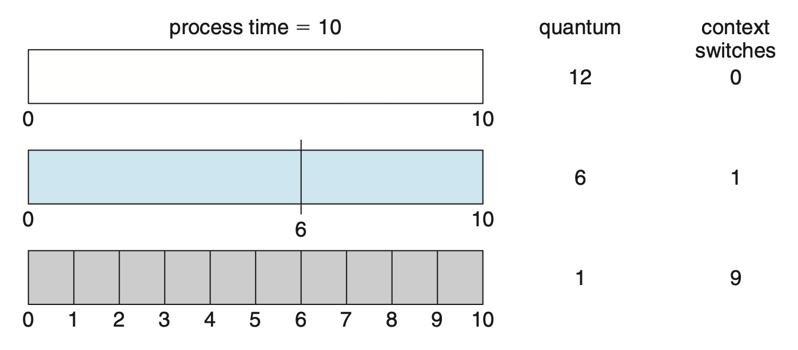
    </div>

    - 上下文切换成本包括：保存和恢复寄存器值、处理 CPU 高速缓存、TLB、分支预测器等硬件的状态

所以我们希望时间片相对于上下文切换时间要足够大；而实际上大多数现代 OS 的时间片范围在 10-100ms 之间，而一次上下文切换所需的时间通常 < 10μs，因此无需担心这个问题。

以**周转时间**（交付 -> 完成）作为指标，RR 算法是已经介绍的三种算法当中最烂的，因为使用 RR 算法后，每个进程的完成时间都会被往后推，显然会增大周转时间。

事实上，所有像 RR 这样**注重公平性**的算法在周转时间上表现都很糟。这里面体现了一种**权衡**(trade-off)：

- 要是允许不公平，那就可以让最短的进程先完成运行，代价是损害了响应时间
- 要是注重公平性，响应时间减少了，但代价是损害了周转时间

所以响应时间和周转时间（看似）是一种“鱼和熊掌不可兼得”的关系。


### Priority Scheduling

前面介绍的 SJF 算法是**优先级调度**(priority-scheduling)算法的一个特例（优先级 = 下一次 CPU 突发的倒数）。

- 每个进程关联一个优先级，且 CPU 会被分配给优先级最高的进程
- **相等**优先级的进程以 **FCFS** 顺序调度
- 一般用一组范围固定的数字表示优先级
- 但对于 0 是最高优先级还是最低优先级，目前仍没有达成一致意见，以后我们就<u>假定用小数字表示高优先级</u>

???+ example "例子"

    考虑下面一组进程（到达时刻均为 0），并给出对应 CPU 突发长度（单位：ms）：

    <div style="text-align: center">
        
    </div>

    以下甘特图是使用优先级调度算法后得到的结果：

    <div style="text-align: center">
        
    </div>

    平均等待时间为 8.2ms。

优先级的定义可来自内部或外部。

- **内部**优先级：使用某些可度量的量来计算进程的优先级
    - 例如：时间限制、内存需求、打开文件的数量、平均 I/O 突发与平均 CPU 突发的比率等
- **外部**优先级：由 OS 外部的标准设定的
    - 比如进程的重要性、支付计算机使用的资金类型和金额、资助工作的部门、其他常常带有政治色彩的因素等

优先级调度算法的主要问题是**无限期阻塞**(indefinite blocking)，或称**饥饿**(starvation)：众多高优先级的进程消耗 CPU，而那些低优先级的进程只能一直等待，甚至可能永远也没法用到 CPU。

解决该问题的一个方法是**老化**(aging)（或称为**优先级提升**(priority boost)），即定期提高在系统中长时间等待的进程的优先级（也有一种变体是将所有进程提升至最高优先级）。不过这个老化的周期需要 OS 管理员自行定夺，需要合理设置。<span class="heimu">（不过现在有基于机器学习的自动化的方法）</span>

???+ info "注"

    Linux 或其他类 UNIX 系统可用 `nice` 命令手动调整进程优先级。

???+ example "例子"

    考虑下面一组进程（到达时刻均为 0），并给出对应 CPU 突发长度（单位：ms）：

    <div style="text-align: center">
        
    </div>

    以下甘特图是使用优先级调度 + RR 调度（时间片 = 2ms，仅作用在优先级相同的进程上）算法后得到的结果：

    <div style="text-align: center">
        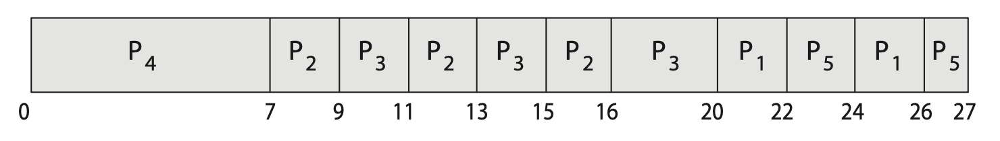
    </div>

    - 由于 $P_2, P_3$ 优先级相同，因此它们以轮询方式交替执行；但 $P_2$ 会率先完成，所以剩下的时间都交给 $P_3$ 了
    - $P_1, P_5$ 同上


### Multilevel Queue Scheduling

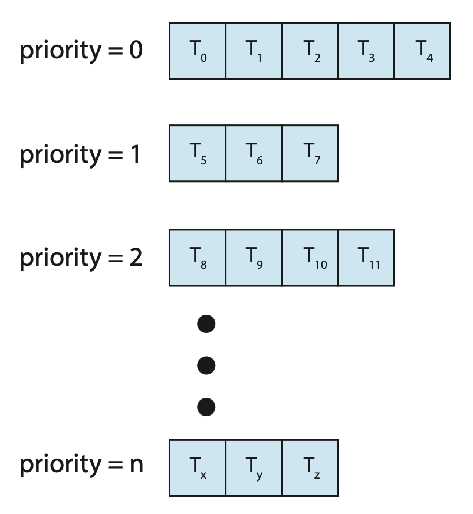{ align=right width=30% }

在优先级 + RR 调度算法中，所有进程都放置在**单个队列**中，因此需要 $O(n)$ 的搜索来找到最高优先级的进程。实际上，为不同优先级设置单独的队列通常更容易，此时只需在最高优先级的队列中采用优先级调度算法安排进程。这种方法称为**多级队列**(multilevel queue)，如右图所示。

该方法仍然可以结合 **RR 调度**实现：若最高优先级队列中有多个进程，它们将按 RR 顺序执行。

多级队列调度算法也可根据**进程类型**将进程划分到多个独立的队列中，其中每个队列对低优先级队列具有绝对优先权，如下图所示：

<div style="text-align: center">
    
</div>

一种常见的划分方式是将**前台**(foreground)（**交互式**(interactive)）进程与**后台**(background)（**批处理**(batch)）进程分开。

- 因为这两类进程对响应时间的要求不同，所以可能需要不同的调度策略
- 前台进程可能拥有比后台进程更高的优先级（外部定义）
- 可以为前台和后台进程分别设置队列，且每个队列可各自采用不同的调度算法，比如前台队列用 RR 调度，而后台队列用 FCFS 调度

此外，**队列之间必须进行调度**，一般通过**固定优先级的抢占式调度**来实现。

另一种方案是在队列之间采用类似 RR 的方法：**每个队列都获得一定比例的 CPU 时间**，然后可以将其调度给各种进程。比如在前台-后台队列示例中，前台队列可以为其进程分配 80% 的 CPU 时间进行 RR 调度，而后台队列则接收 20% 的CPU时间，以 FCFS 方式分配给其进程。


### Multilevel Feedback Queue Scheduling

一般来说，在采用多级队列调度算法时，一旦进入系统，进程就会被永久地分配到某个队列中。这种设置的优点是**调度开销小，但缺乏灵活性**。

相比之下，**多级反馈队列**(multilevel feedback queue)调度算法允许进程在不同队列间移动。

- 其核心思想是根据进程 CPU 执行时间的特点进行分类：<u>若某进程占用过多 CPU 时间，则会被移至较低优先级的队列中</u>
- 这样一来，通常以短 CPU 执行为特征的 **I/O 密集型**及**交互式**进程便能留在较高优先级的队列里
- 此外，在低优先级队列中等待过久的进程也可能被提升至高优先级队列，这种**老化**机制有效防止了饥饿现象的发生

??? example "例子"

    <div style="text-align: center">
        
    </div>

    考虑一个具有三个队列的多级反馈队列调度器，编号从 0 到 2。
    
    - 调度器首先执行队列 0 中的所有进程，只有当队列 0 为空时，它才会执行队列 1 中的进程；同样地，只有在队列 0 和 1 都为空的情况下，才会执行队列 2 中的进程
    - 到达队列 1 的进程会抢占正在执行的来自队列 2 的进程，而到达队列 0 的进程则会抢占正在执行的来自队列 1 的进程
    - 一个新进程会先进入队列 0
        - 队列0中的进程被分配 8ms 的时间片，若在此时间内未能完成，则将其移至队列 1 的末尾
        - 如果队列 0 为空，则从队列 1 头部取出一个进程并给予 16ms 的时间片；若该进程仍未完成，它将被抢占并放入队列 2 中
        - 队列 2 中的进程按 FCFS 原则运行，但仅当队列 0 和 1 均为空时才执行
        - 为防止饥饿现象发生，长时间在低优先级队列等待的进程可能会逐步迁移至高优先级队列中

多级反馈队列调度器由以下参数定义：

- 队列数
- 每个队列的调度算法
- 用于确定何时将进程升级至更高优先级队列的方法
- 用于确定何时将进程降级至更低优先级队列的方法
- 用于确定当进程需要服务时，要进入哪个队列的方法

多级反馈队列调度器是**最通用**的 CPU 调度算法，能够<u>同时做到优化周转时间和最小化响应时间</u>。但这也让它成为最为复杂的算法。


## Thread Scheduling

本节将探讨**用户级**和**内核级**线程的调度问题，并提供针对 Pthreads 调度的具体示例。


### Contention Scope

用户级线程与内核级线程之间的一个区别在于它们的调度方式。

- 在实现**多对一**和**多对多**模型的系统中，线程库将**用户级线程**调度到可用的**轻量级进程**（LWP）上运行，这种机制被称为**进程竞争范围**(process-contention scope, PCS)，因为 CPU 的竞争发生在属于同一进程的线程之间。
    - 通常，PCS 是根据**优先级**进行的：调度器选择具有最高优先级的可运行线程来运行。该优先级由**程序员**设置，线程库不会调整，尽管某些线程库可能允许程序员更改线程的优先级。
    - 需要注意的是，PCS 通常会**抢占**当前运行的线程以运行更高优先级的线程，但对于同等优先级的线程之间，没有时间片分配的保证。
- 为了决定哪个**内核级线程**被调度至 CPU，内核采用**系统竞争范围**(system-contention scope, SCS)。在此调度下，系统内所有线程都会参与对 CPU 的竞争。采用**一对一**模型的系统仅使用 SCS 来调度线程。


### Pthread Scheduling

Pthreads 定义了以下竞争范围值：

- `PTHREAD_SCOPE_PROCESS`：使用 PCS 调度线程
- `PTHREAD_SCOPE_SYSTEM`：使用 SCS 调度线程

在多对多模型的系统中，

- `PTHREAD_SCOPE_PROCESS` 策略将用户级线程调度到可用的 LWP 上；其数量由线程库维护，可能使用调度激活
- `PTHREAD_SCOPE_SYSTEM` 调度策略将为每个用户级线程创建和绑定一个 LWP，有效地使用一对一策略映射线程

Pthread IPC（进程间通信）提供了两个用于设置和获取竞争范围策略的函数：

- `#!c pthread_attr_setscope(pthread_attr_t *attr, int scope)`
- `#!c pthread_attr_getscope(pthread_attr_t *attr, int *scope)`

这两个函数的第一个参数都包含一个指向**线程属性集**的指针。而对于第二个参数

- `pthread_attr_setscope()` 传入的是 `PTHREAD_SCOPE_SYSTEM` 或 `PTHREAD_SCOPE_PROCESS` 值，用以指示竞争范围
- `pthread_attr_getscope()` 传入的是一个指向整型值的指针，该值被设置为当前竞争范围的值

若发生错误，这些函数均会返回非零值。

??? example "例子"

    ```c
    #include <pthread.h>
    #include <stdio.h>
    #define NUM_THREADS 5

    int main(int argc, char *argv[]) {
        int i, scope;
        pthread_t tid[NUM_THREADS];
        pthread_attr_t attr;

        /* get the default attributes */
        pthread_attr_init(&attr);

        /* first inquire on the current scope */
        if (pthread_attr_getscope(&attr, &scope) != 0)
            fprintf(stderr, "Unable to get scheduling scope\n");
        else {
            if (scope == PTHREAD_SCOPE_PROCESS)
                printf("PTHREAD_SCOPE_PROCESS");
            else if (scope == PTHREAD_SCOPE_SYSTEM)
                printf("PTHREAD_SCOPE_SYSTEM");
            else
                fprintf(stderr, "Illegal scope value.∖n");
        }

        /* set the scheduling algorithm to PCS or SCS */
        pthread_attr_setscope(&attr, PTHREAD_SCOPE_SYSTEM);

        /* create the threads */
        for (i = 0; i < NUM_THREADS; i++)
            pthread_create(&tid[i], &attr, runner, NULL);

        /* now join on each thread */
        for (i = 0; i < NUM_THREADS; i++)
            pthread_join(tid[i], NULL);
    }

    /* Each thread will begin control in this function */
    void *runner(void *param) {
        /* do some work ... */
        
        pthread_exit(0);
    }
    ```


## Multi-Processor Scheduling

目前的讨论主要集中在如何在单核处理器系统上调度 CPU 的问题。当系统拥有**多个 CPU** 时，便可以实现**负载共享**(load sharing)，允许多个线程并行运行，但与此同时调度问题也相应地变得更加复杂。大量实践表明，<u>此时不存在一种最优的调度算法</u>。

传统上，“多处理器”一词指的是配备多个物理处理器的系统，每个处理器包含一个单核心 CPU。但“多处理器”的定义已显著演变，在现代计算系统中，它的指代包括以下系统架构：

- **多核心 CPU**
- **多线程核心**
- **NUMA 系统**
- **异构多处理**(heterogeneous multiprocessing)

接下来，我们先来关注功能上相同的，即**同构的**(homogeneous)处理器系统，这意味着可以使用任意可用的 CPU 来运行队列中的任何进程。最后再来探讨处理器能力各不相同的系统情况。


### Approaches to Multiple-Processor Scheduling

在多处理器系统中，一种 CPU 调度方法是将所有调度决策、I/O 处理及其他系统活动交由单一处理器——**主服务器**(master server)来处理；其余处理器仅执行用户代码。这种**非对称多处理**(asymmetric multiprocessing)方式较为**简单**，因为只有一个核心访问系统数据结构，从而减少了对数据共享的需求。然而，此方法的弊端在于主服务器可能成为**瓶颈**，导致整体系统性能下降。

支持多处理器的标准做法是**对称多处理**(symmetric multiprocessing, SMP)，其中每个处理器可进行自调度(self-scheduling)。此时有两种组织可调度线程的策略：

<div style="text-align: center">
    
</div>

- 所有线程位于一个**公共**的就绪队列（左图）
    - 公共就绪队列上可能存在**竞态条件**，因此必须确保两个独立的处理器不会同时调度同一个线程，并且线程不会从队列中丢失
    - 可以使用某种形式的**锁**来保护公共就绪队列，但这样做竞争就来到了锁上面，因为所有对队列的访问都需要锁的所有权，因而访问共享队列可能成为性能瓶颈
- 每个处理器有自己的**私有**线程队列（右图）
    - 不会遇到与共享运行队列相关的性能问题，因此这是支持 SMP 的系统中最常见的方法。
    - 这种设计能更有效地使用高速缓存
    - 最大的问题是工作量的不同，不过可通过均衡算法，在所有处理器之间平衡负载


### Multicore Processors

现今大多数计算机硬件将多个计算核心集成在同一块物理芯片上，形成了**多核处理器**(multicore processor)。每个核心维护其自身的架构状态，因此对 OS 而言，它们表现为**独立的逻辑 CPU**。采用多核处理器的 SMP 系统比每个 CPU 拥有独立物理芯片的系统速度更快且能耗更低。

多核处理器可能会使调度问题复杂化。当处理器访问内存时，会花费大量时间等待数据准备就绪，这种现象被称为**内存停顿**(memory stall)，如下图所示。原因是现代处理器的运算速度远超内存速度；另外**高速缓存失效**(catch miss)（即访问的数据不在高速缓存中）也可能导致内存停顿的发生。

<div style="text-align: center">
    
</div>

针对这一情况，近期的许多硬件设计采用了**多线程处理核心**，每个核心分配两个（或更多）**硬件线程**(hardware thread)。这样一来，若某个硬件线程在等待内存时停顿，核心便能切换至另一线程。下图展示了一个双线程处理核心的示例，其中线程 0 与线程 1 的执行是交错进行的。

{ align=right width=30% }

<div style="text-align: center">
    
</div>

从 OS 角度看，每个硬件线程都维护其自身的架构状态，如同可运行软件线程的逻辑 CPU 一般的存在。这种被称为**芯片多线程**(chip multithreading, CMT)的技术如右图所示：该处理器包含 4 个计算核心，每核配备 2 个硬件线程；对 OS 而言，这相当于拥有 8 个逻辑 CPU 可用。

总的来说，处理核心实现多线程的方式主要有两种：

<br/>

- **粗粒度**(coarse-grained)多线程：在某个核心上执行一个线程，直至遇到如内存停顿这样的长久等待事件
    - 由于这类事件造成的延误，核心必须切换到另一个线程开始执行
    - 但这种切换的成本较高，因为在另一线程能在处理器核心上开始执行之前，指令流水线必须被**清空**(flush)；一旦新线程启动执行，它便开始用自身的指令填充流水线
- **细粒度**(fine-grained)（或称交错式）多线程：在更精细的级别上进行切换——通常是在指令周期边界处进行切换
    - 由于架构设计中包含了线程切换的逻辑，因此线程间切换的成本较低

{ align=right width=30% }

需要注意的是，物理核心的资源（如高速缓存和流水线）必须在其硬件线程之间共享，因此一个处理核心一次只能执行一个硬件线程。这样一来，多线程、多核处理器实际上需要两个不同层次的调度安排，如右图所示的双线程处理核心示意图。

- 第 1 级：OS 必须做出调度决策，选择在每一个硬件线程（逻辑 CPU）上运行哪个**软件线程**，此时 OS 可以采用任何调度算法
- 第 2 级：规定每个核心如何决定运行哪个**硬件线程**，可采用的策略有：
    - 采用简单的 RR 算法来为处理核心分配硬件线程
    - （见于 Intel Itanium 处理器）每个硬件线程被赋予一个从 0 到 7 的动态紧急(urgency)值，其中 0 代表最低紧急程度，而 7 则表示最高。
        - 处理器可识别 5 种可能触发线程切换的不同事件，其中之一发生时，线程切换逻辑会比较两个线程的紧急程度，并选择具有最高紧急值的线程在处理器核心上执行

上述两级调度不一定相互排斥。


### Load Balancing

在 SMP 系统中，保持所有处理器之间工作负载均衡非常重要，以充分利用多处理器的优势。在 SMP 系统中，**负载均衡**(load balancing)技术试图将工作负载均匀分布在所有处理器上。

- 需要注意的是，负载均衡通常仅在系统中每个处理器都有自己的**私有就绪队列**并包含可执行的线程时才是必要的
- 在具有公共运行队列的系统中，负载均衡不是必要的，因为一旦处理器空闲，它会立即从公共就绪队列中提取一个可运行的线程

负载均衡的实现方法有：

- **推送迁移**(push migration)：一个特定任务会周期性地检查每个处理器的负载情况，一旦发现不均衡，便通过将线程从过载处理器移动（或推送）至空闲或较不繁忙的处理器来实现负载均匀分配
- **拉取迁移**(pull migration)：空闲处理器从忙碌处理器处获取等待任务

这两种迁移方式并不互斥，相反在实际上常常一起实现。

“平衡负载”的概念可能有不同的含义。

- 一种观点认为，平衡负载可能仅要求所有队列拥有**大致相同数量的线程**
- 另一种看法则要求在所有队列中**平均分配线程优先级**
- 或许在某些情况下，这两种策略都不足够充分，甚至可能与调度算法的目标背道而驰

???+ warning "注意"

    下面 [Single-Queue Scheduling](#single-queue-scheduling) 和 [Multi-Queue Scheduling](#multi-queue-scheduling) 两节均来自 OSTEP "Multiprocessor Scheduling" 一讲的补充。


### Single-Queue Scheduling

最基本的方法就是复用单处理器调度中的单队列方法，即**单队列多处理器调度**(single-queue multiprocessor scheduling, SQMS)。

该方法的优点是简单：不需对现有策略进行很大的修改，就能是现在多个 CPU 上的调度。但缺点也很明显：

- 缺少**可扩展性**(scalability)
    - 为确保调度器在多个 CPU 上正确运作，开发者可能会在代码中插入一些锁，以确保 SQMS 代码在访问队列时产生正确结果
    - 但锁会极大降低 CPU 性能（尤其当 CPU 数量增长时）；随着锁竞争的加剧，系统会在锁上花费更多时间，而在应该要做的工作中投入更少的时间
- **缓存亲和性**(cache affinity)
    - 假如有 5 个进程要运行在 4 个处理器上，此时调度队列长这样：

        <div style="text-align: center">
            
        </div>

    - 再假设我们采用 RR 调度算法，那么一种可能的调度情况如下：

        <div style="text-align: center">
            
        </div>

    - 由于每个 CPU 会从全局共享队列选择下一个进程运行，因此每个进程会在 CPU 之间来回跳转，因而违背了缓存亲和性
    - 为避免这一问题，应当让更多的进程做到缓存亲和性，比如下面我们仅让进程 E 在 CPU 见来回迁移(migrate)，其他 4 个进程就分别待在 4 个处理器内
        - 但实现起来很复杂

        <div style="text-align: center">
            
        </div>


### Multi-Queue Scheduling

由于单队列调度器存在的种种问题，一些系统选择用多个队列，即**多队列多处理器调度**(multi-queue multiprocessor scheduling, MQMS)方法。每个队列采用特定的调度算法；当进程进入系统时，它会根据一些启发式策略(heuristic)被分配到其中一个队列上，这样它就会被独立调度，无需担心存在于单队列方法中的信息共享和同步问题。

???+ example "例子"

    假设有一个带 2 个 CPU 的系统，每个 CPU 有一个队列；并且现在有 4 个进程 A, B, C, D。OS 可能提供的一种队列布局如下：

    <div style="text-align: center">
        
    </div>

    假设每个 CPU 采用 RR 调度，那么系统可能会给出以下调度：

    <div style="text-align: center">
        
    </div>

MQMS 的优点正是 SQMS 的两个缺点的反面：扩展性强、提供内存亲和性。但它会带来一个新的问题：**负载不均衡**(load imbalance)。

???+ example "例子"

    以下两种情况均是负载不均衡的表现：

    === "例1"

        <div style="text-align: center">
            
        </div>

    === "例2"

        <div style="text-align: center">
            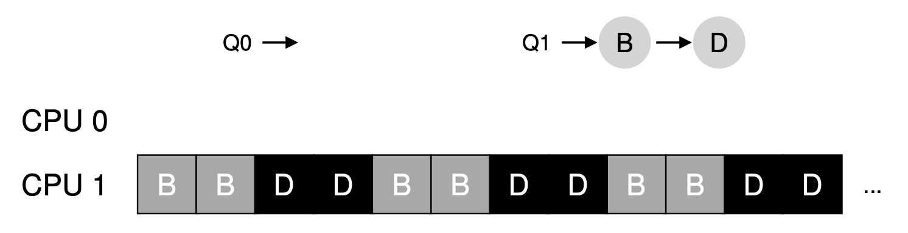
        </div>

解决方法还是**迁移**(migration)。

???+ example "例子"

    === "例1"

        <div style="text-align: center">
            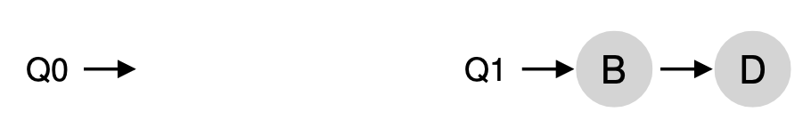
        </div>

        只要将 B 或 D 中的任何一个进程迁移至空闲的 CPU 即可。

    === "例2"

        <div style="text-align: center">
            
        </div>

        更加麻烦些，需要持续迁移一个或多个进程。一种可能的调度如下：

        <div style="text-align: center">
            
        </div>

有一种迁移技术叫做**工作窃取**(work stealing)：进程数较少的（源）队列会偶尔窥看另一个（目标）队列，若目标队列的进程数（显著）多于源队列，那么源队列会从目标队列中窃取一个或多个进程以实现负载均衡。使用该方法时需做好窥看频次的阈值设置：

- 窥看次数太多，将会导致高昂开销并难以扩展
- 窥看次数太少，可能会出现负载不均衡的问题


### Processor Affinity

- 考虑一个线程在特定处理器上运行时，高速缓存会发生什么变化
    - 线程最近访问的数据会填充该处理器的高速缓存，因此该线程后续的内存访问常常能在高速缓存中得到满足（这被称为“**热缓存**(warm cache)”）

- 现在设想一下，如果由于负载均衡等原因，线程迁移到了另一个处理器上会发生什么情况
    - 这时，第一个处理器的高速缓存内容必须被置为无效(invalidate)，而第二个处理器的高速缓存则需要重新填充数据
    - 鉴于使高速缓存失效和重新填充的高成本，大多数支持 SMP 的 OS 都会尽量避免将线程从一个处理器迁移到另一个处理器，而是努力让线程持续在同一处理器上运行，以利用热缓存的优势
    - 这体现了**处理器亲和性**(processor affinity)，即进程对其当前运行的处理器的亲和性

之前介绍的**线程调度队列**组织策略对处理器亲和性有所影响。

- 若采用**公共就绪队列**的方式，任何处理器都有可能选中某个线程来执行。因此，当线程被调度到新的处理器上时，该处理器的缓存需重新填充数据。
- 而如果使用**私有的、每个处理器独享的就绪队列**，则线程始终在同一处理器上被调度，从而能充分利用热缓存中的数据内容，因而自然地体现了处理器亲和性的优势

处理器亲和性有多种形式：

- **软亲和性**(soft affinity)：OS 试图让进程在同一处理器上运行（但并不保证一定会如此），但在负载均衡过程中，进程仍有可能在不同处理器间迁移
- **硬亲和性**(hard affinity)：一种系统调用，允许进程指定其可运行的一组处理器子集
 
许多系统同时提供软、硬两种亲和性机制。例如 Linux 实现了软亲和性，同时也提供了 `sched_setaffinity()` 系统调用，通过允许线程指定其有资格运行的 CPU 集合来支持硬亲和性。

系统的**主内存架构**同样会影响处理器的亲和性问题。下图展示了一种**非均匀内存访问**（**NUMA**）架构，其中包含两个物理处理器芯片，每个芯片都配备了自己的 CPU 和本地内存。

<div style="text-align: center">
    
</div>

尽管通过系统互连使得 NUMA 系统中的所有 CPU 能够共享一个物理地址空间，但 CPU 访问其本地内存的速度要快于访问其他 CPU 的本地内存。如果 OS 的 CPU 调度器和内存分配算法具备 **NUMA 感知能力**(NUMA-aware)并协同工作，那么被调度到特定 CPU 上的线程便可以被分配到最靠近该 CPU 的内存区域，从而为线程提供最快的内存访问速度。

值得注意的是，**负载均衡常常会抵消处理器亲和性带来的好处**。也就是说，让线程在同一处理器上运行的好处在于，该线程能够利用其数据已存在于该处理器缓存中的优势。通过将线程从一个处理器迁移到另一个来实现负载均衡，则会消除这一优势。因此，针对现代多核 NUMA 系统的调度算法变得相当复杂。


### Heterogeneous Multiprocessing

目前讨论的内容中，所有处理器在功能上都是相同的，因而允许任何线程在任何处理核心上运行。唯一的区别在于内存访问时间可能会因负载均衡和处理器亲和性策略的不同而有所变化。

尽管移动设备系统现已采用多核架构，但有些系统的设计采用了运行相同指令集的核心，这些核心在时钟速度和电源管理方面存在差异，包括能够调整核心的功耗直至使其进入空闲状态。这类系统被称为**异构多处理**(heterogeneous multiprocessing, **HMP**)。HMP 的设计初衷是通过根据任务的具体需求，将其分配给特定核心以更好地管理能耗。

对 ARM 处理器而言，这类架构被称为 **big.LITTLE**，它将高性能的**大核**(big core)与节能的**小核**(LITTLE core)相结合。大核能耗较高，因此仅适合短时间使用；相应地，小核能耗较低，故可长时间运行。

这种方法具有多重优势：

- 通过将多个较慢的核心与更快的核心相结合，CPU 调度器能够将那些不需要高性能但可能需要长时间运行的任务（如后台任务）分配给小核，从而节省电池电量
- 同样地，对于需要更多处理能力，但可能运行时间较短的交互式应用，则可以分配给大核
- 此外，如果移动设备处于节能模式，可以关闭能耗高的大核，系统仅依赖能效高的小核


## Real-time CPU Scheduling

实时 OS 可分为：

- **软实时系统**(soft real-time system)：无法保证关键的实时进程何时被调度，仅确保在处理时会优先于非关键的进程
- **硬实时系统**(hard real-time system)：任务必须在**截止时间**(deadline)前完成服务，超过 ddl 的服务等同于未提供服务

下面将来探讨有关这两类实时系统相关的进程调度问题。


### Minimizing Latency

{ align=right width=30% }

考虑实时系统的**事件驱动**(event-driven)特性：

- 系统通常处于等待实时事件发生的状态
- 事件可能源于软件（例如定时器到期），也可能来自硬件
- 一旦事件发生，系统必须尽快响应并处理它
- **事件时延**(event latency)：从事件发生至得到处理所经过的时间

有两类影响实时系统性能的时延，它们都需要得到最小化：

- **中断时延**(interrupt latency)：从中断到达 CPU 开始，到执行处理该中断的服务程序之间的时间间隔
    - 当中断发生时，OS 必须先完成当前正在执行的指令，并判断发生的中断类型；接着在通过特定的**中断服务例程**(interrupt service routine, ISR)处理中断之前保存当前进程的状态；而完成这些任务所需的总时间即为中断时延
    - 导致中断时延的一个重要因素是在更新内核数据结构时，中断被禁用的时长
        - 实时 OS 要求仅在极短的时间内禁用中断

    <div style="text-align: center">
        
    </div>

- **分派时延**(dispatch latency)：分派器停止一个进程，并启动另一个所需的时间
    - 保持低分派时延的最有效的方法是采用**抢占式内核**
    - 分派时延的**冲突阶段**(conflict phase)包含两个部分：
        - 抢占任何在内核中运行的进程
        - 释放高优先级进程所需的，但目前为低优先级进程所用的资源

    <div style="text-align: center">
        
    </div>


### Priority-Based Scheduling

实时 OS 的特性决定了调度器必须支持**基于优先级的抢占式算法**。然而，仅提供这种算法只能满足**软实时系统**的要求；硬实时系统必须进一步保证实时任务在截止日期前得到服务，因而需要额外的调度功能，因此下面主要介绍适用于**硬实时系统**的调度算法。

在深入探讨各个调度器之前，必须明确待调度进程的一些特性。

- 首先，实时系统中的进程是**周期性的**(periodic)，这意味着它们以固定的间隔（周期）使用 CPU 资源
- 一旦进程获得了 CPU 使用权，它就有了固定的处理时间 $t$、截止日期 $d$ 和周期 $p$，它们的关系为：$0 \le t \le d \le p$
- 周期性任务的速率(rate)为 $\dfrac{1}{p}$

下图展示了周期性进程随时间的执行情况：

<div style="text-align: center">
    
</div>

这种调度方式的不同之处在于：进程需要向调度器声明其 ddl，随后调度器会运用**准入控制**(admission-control)算法，执行以下两种操作之一：

- 接纳该进程，并确保其能按时完成
- 在无法保证任务能在 ddl 内得到处理时，拒绝这一请求


### Rate-Monotonic Scheduling

**单调速率**(rate-monotonic)调度算法采用静态优先级策略，并允许抢占以安排周期性的任务。

- 每个周期性任务在进入系统时，会**根据其周期长短反向分配优先级**：周期越短，优先级越高；周期越长，优先级越低
- 这一策略的基本原理在于为更频繁需要 CPU 的任务赋予更高的优先权
- 此外还假设每个周期性进程的 CPU 突发持续时间均保持一致

???+ example "例子"

    假如有两个进程 $P_1, P_2$，它们的周期分别为 50 和 100，且处理时间分别为 20 和 35，即 $p_1 = 50, p_2 = 100, t_1 = 20, t_2 = 35$。

    如果用 CPU 突发和周期之比来衡量 CPU 利用率，对于这个例子，CPU 利用率 = 20 / 50 + 35 / 100 = 75%。因此我们能够通过调度让这些进程在 ddl 前完成，且还有空余周期。

    假如 $P_2$ 优先级高于 $P_1$，那么它们的执行情况如下所示。可以看到此时 $P_1$ 未能在 ddl 前完成。

    <div style="text-align: center">
        
    </div>

    如果采用单调速率调度，那么 $P_1$ 优先级会高于 $P_2$，执行结果如下。可以看到此时两个进程均在 ddl 前完成了。

    <div style="text-align: center">
        
    </div>

单调速率调度被认为是**最优的**，因为如果一组进程无法通过此算法进行调度，那么任何其他分配静态优先级的算法也无法对其进行调度。

下面来看一组无法使用单调速率算法调度进程的例子：

???+ example "例子"

    依旧考虑两个进程 $P_1, P_2$，参数为 $p_1 = 50, t_1 = 25, p_2 = 80, t_2 = 35$。
    
    - CPU 利用率 = 25 / 50 + 35 / 80 = 94%
    - 根据单调速率调度，$P_1$ 优先级更高
  
    下面是执行情况，其中 $P_2$ 无法在 ddl 前完成。

    <div style="text-align: center">
        
    </div>

根据前面的例子，可以发现该调度的局限在于 CPU 利用率是有上限的，所以有时无法完全最大化利用 CPU 资源。在调度 N 个进程时，最坏情况下的 CPU 利用率为 $N(2^{1/N} - 1)$。在系统中仅有一个进程时，CPU 利用率为 100%；但随着进程数量趋近于无穷大，利用率降至约 69%（？）。


### Earliest-Deadline-First Scheduling

**最早截止日期优先**(earliest-deadline-first, **EDF**)调度根据截止日期动态分配优先级：截止日期越早，优先级越高；截止日期越晚，优先级越低。在 EDF 策略下，当一个进程变为可运行时，它必须向系统告知其 ddl。

???+ example "例子"

    同“单调速率调度”一节的第二个（失败）例子，但采用 EDF 调用，结果如下：

    <div style="text-align: center">
        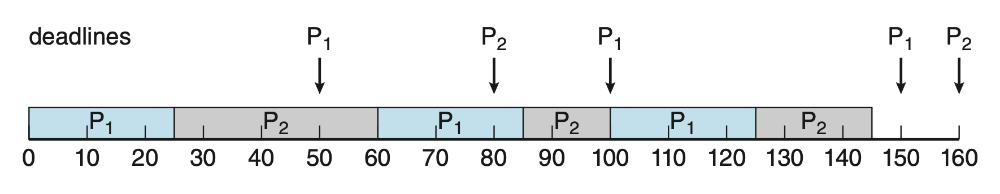
    </div>

    - $P_1$ ddl 更早，所以优先级更高
    - 第一次运行 $P_2$ 不会被 $P_1$ 抢占，而是让 $P_2$ 完成 $t_2$ 的运行时间，因为 $P_1$ 的第二个 ddl（100）比 $P_2$ 的第一个 ddl（80）晚
    - 但第二次运行 $P_2$ 会被 $P_1$ 抢占，因为 $P_1$ 的第三个 ddl（150）比 $P_2$ 的第二个 ddl（160）早

EDF 调度**不要求**进程必须是**周期性**的，也不要求每个进程在每次执行期间需要**固定的 CPU 时间**。唯一的要求是当一个进程变为可运行时，需向调度器声明其截止时间。

EDF 调度的吸引力在于它在**理论上是最优的**——它能使每个进程都能满足其截止日期的要求，并且 CPU 利用率达到 100%。然而在实践中，由于进程间上下文切换和中断处理的耗时，因而无法达到理想的 CPU 利用率水平。


### Proportional Share Scheduling

!!! warning "注意"

    以下内容来自 OSTEP 第 9 章（恐龙书这一块讲的太少了）。

**比例份额**(proportional-share)调度基于这样一个简单的理念：调度器尝试保证每个进程能获取一定比例的 CPU 时间，而不把关注点放在优化周转或响应时间上。下面将介绍两类最基本的比例份额调度算法：**彩票调度**和**步长调度**。


#### Lottery Scheduling

**彩票调度**(lottery scheduling)的基本思路是：每隔一段时间（比如每过一个时间片）举行一次彩票抽奖，以决定接下来应该运行哪个进程，并且应该要运行得更频繁的进程应该有更多机会赢得抽奖。

- 彩票调度背后的一个基本概念是**票**(ticket)，用来表示一个进程应该接收的资源份额
- 举行彩票抽奖时，调度器应知道总票数是多少（假设为 n），随后调度器会从 0 到 n-1 中**随机**选取一张获胜彩票

??? info "随机性的意义"

    - 避免奇怪的边角案例(corner cases)行为
    - 轻量级，仅需少量状态便可追踪
    - 相当快（对于随机数生成速度）

??? example "例子"

    假如一共有 100 张彩票，进程 A 和 B 各有 75 张和 25 张（也就是说 A 需要有 75% 的 CPU 时间，B 则要有 25% 的 CPU 时间）。彩票调度器给出以下获胜者彩票：

    <div align=center>63 85 70 39 76 17 29 41 36 39 10 99 68 83 63 62 43 0 49 12</div>

    对应的调度结果如下：

    <div align=center>A B A A B A A A A A A B A B A A A A A A</div>

    可以看到，B 在 20 个时间片中只运行了 4 个时间片（20%），而不是预期的 25% 的分配。但只要运行时间足够长，这两个进程更有可能获得预期的 CPU 时间比例了。

彩票调度提供了一些用于操纵彩票的有用机制，包括：

- **彩票货币**(ticket concurrency)：用户可在进程间选择（按比例）任意分配货币，系统随后会自动将这些货币转换为正确的全局值（根据实际的彩票数）

    ??? example "例子"

        假设用户 A 和 B 各自有 100 张彩票。其中 A 有两个进程 A1 和 A2，分别给它们分配 500 张 A 货币体系下的彩票；而 B 只有一个进程 B1，给他 10 张 B 货币体系下的彩票。系统随后将 A1 和 A2 的 500 张彩票转化为全局值下的 50 张彩票，并将 B1 的 10 张彩票转化为全局值下的 100 张彩票。即：

        ```
        User A -> 500 (A’s currency) to A1 -> 50  (global currency)
               -> 500 (A’s currency) to A2 -> 50  (global currency)
        User B -> 10  (B’s currency) to B1 -> 100 (global currency)
        ```

- **彩票转移**(ticket transfer)：某个进程可将自己的彩票临时转交给别的进程
    - 这对客户端/服务端设置很有用，比如为了加快工作速度，客户端可以将自己的一部分彩票转交给服务器，从而尽可能提升服务器处理客户端请求的性能；完成请求后，服务器再将这些彩票返回给客户端，一切恢复原状

- **彩票膨胀**(ticket inflation)：进程可以暂时增加或减少其拥有的彩票数量
    - 在一个互不信任的竞争环境中，这种做法意义不大，因为一个贪婪的进程可能会给自己分配大量彩票从而独占机器资源
    - 因而这一机制适用于一组相互信任的进程环境，此时若任何一个进程意识到自己需要更多的 CPU 时间，它可以通过提高自己的彩票数来向系统反映这一需求，而无需与其他任何进程进行通信

彩票调度的实现相当简单，代码如下：

```c
// counter: used to track if we've found the winner yet
int counter = 0;

// winner: call some random number generator to
//         get a value >= 0 and <= (totaltickets - 1)
int winner = getrandom(0, totaltickets);

// current: use this to walk through the list of jobs
node_t *current = head;
while (current) {
    counter = counter + current->tickets;
    if (counter > winner)
        break; // found the winner
    current = current-›next;
} 
// 'current' is the winner: schedule it...
```

>代码会遍历整个进程列表（链表），每经过一个进程就会向 `counter` 增加当前进程的彩票数，直到 `counter > winner` 为止。

为了让上述过程更加高效，最好对列表做个排序（按票数从高到低）。尽管这样做不影响算法正确性，但能确保迭代次数最少，尤其是在少数进程持有大部分彩票的情况下。

该算法最让人头疼的地方在于该**如何为每个进程分配彩票**。一种想法是“用户知道的最多(users know best)”，即让用户手里握有一些彩票，然后由用户自行分配彩票。这显然不是一个好主意，所以这个彩票分配问题至今仍然是一个开放问题。


#### Stride Scheduling

彩票调度的随机性会带来一个缺陷：如果运行时间不够长，进程可能没有接收到完全正确的比例份额。因此有人（~~其实还是同一位大牛~~）想到了一种确定性的调度算法——**步长调度**(stride scheduling)。

- 每个进程都有一个**步长**(stride)，和票数成反比
    - 比如进程 A，B 和 C 分别有 100，50 和 250 张彩票；假如用 10000 去除，那么对应的步长分别为 100，200 和 40
- 每当进程运行时，我们要将它的步长加到进程自己的计数器上（称为**遍历**(pass)值），以跟踪其全局进度
- 基本思路：对于任意给定时间，选取遍历值最低的进程运行；运行进程时要用其步长累加其计数器

代码实现如下：

```c
curr = remove_min(queue);   // pick client with min pass
schedule(curr);             // run for time slice
curr->pass += curr->stride; // update pass using stride
insert(queue, curr);        // return curr to queue
```

??? example "例子"

    沿用前面的 A，B 和 C 三个进程的例子，下面用一张表来反映使用步长调度后的结果：

    <div style="text-align: center">
        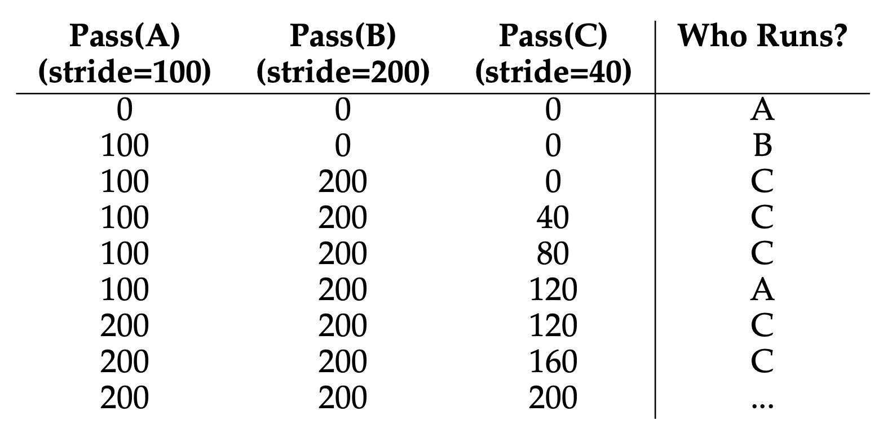
    </div>

    可以看到，步长调度能够给出精确的比例份额。

尽管在前面的例子中，步长调度的精度貌似更高，但它有一个不如彩票调度的地方：彩票调度没有全局状态。设想一下，如果在调度中途加入了一个新进程，我们还得考虑如何合理设置其遍历值（设置成 0 的话相当于新进程暂时“垄断”了 CPU，因而不合理）；但对于彩票调度，只需根据该进程持有的彩票数，将其纳入总票数中就能继续正常运行下去了。所以在处理新进程方面，彩票调度更加轻松。


### POSIX Real-Time Scheduling

POSIX 定义了 2 个用于实时线程的调度类：

- `SCHED_FIFO`：与 FCFS 策略关联，采用 FIFO 队列
- `SCHED_RR`：与 RR 策略关联

此外还提供了 `SCHED_OTHER` 调度类，但没有规定实现，由系统自己定义。

POSIX API 指定获取和设置调度策略的两个函数：

- `#!c pthread_attr_getschedpolicy(pthread attr t *attr, int *policy)`
- `#!c pthread_attr_setschedpolicy(pthread attr t *attr, int policy)`

??? example "例子"

    ```c hl_lines="14 26"
    #include <pthread.h>
    #include <stdio.h>
    #define NUM_THREADS 5

    int main(int argc, char *argv[]) {
        int i, policy;
        pthread_t tid[NUM THREADS];
        pthread_attr_t attr;

        /* get the default attributes */
        pthread_attr_init(&attr);

        /* get the current scheduling policy */
        if (pthread_attr_getschedpolicy(&attr, &policy) != 0)
            fprintf(stderr, "Unable to get policy.\n");
        else {
            if (policy == SCHED_OTHER)
            printf("SCHED_OTHER\n");
        else if (policy == SCHED_RR)
            printf("SCHED_RR\n");
        else if (policy == SCHED_FIFO)
            printf("SCHED_FIFO\n");
        }

        /* set the scheduling policy - FIFO, RR, or OTHER */
        if (pthread_attr_setschedpolicy(&attr, SCHED_FIFO) != 0)
            fprintf(stderr, "Unable to set policy.\n");

        /* create the threads */
        for (i = 0; i < NUM_THREADS; i++)
            pthread_create(&tid[i], &attr, runner, NULL);

        /* now join on each thread */
        for (i = 0; i < NUM_THREADS; i++)
            pthread_join(tid[i], NULL);
    }

    /* Each thread will begin control in this function */
    void *runner(void *param)
    {
        /* do some work ... */

        pthread exit(0);
    }
    ```


## OS Examples: Linux Scheduling

现在 Linux 默认的调度算法是**完全公平调度器**(completely fair scheduler, **CFS**)（发布于 2.6.63 版本）。

Linux 系统中的调度基于**调度类**(scheduling classes)进行，每个类被分配一个特定的优先级。通过采用不同的调度类，内核能够根据系统及其进程的需求适应不同的调度算法。标准 Linux 内核实现了两种调度类：

- 使用 CFS 算法的默认调度类
- 实时调度类

CFS 调度器并不直接分配优先级，而是通过维护每个任务的**虚拟运行时间**(virtual run time)（`vruntime`）来记录每个任务已运行的时间。

- 虚拟运行时间与一个基于任务优先级的**衰减因子**(decay factor)相关联，低优先级任务的衰减速率高于高优先级任务
- 对于普通优先级的任务（nice 值为 0），虚拟运行时间等同于实际物理运行时间
- 调度器选择具有最小 `vruntime` 值的进程执行，且更高优先级的任务可以抢占当前正在运行的较低优先级任务

那么 CFS 调度器如何停止当前正在运行的进程呢？进程切换太频繁的话，就会损害性能；进程切换太少的话，就会影响到公平性。CFS 给出的解决方案是引入一些控制参数，包括：

- `sched_latency`：用于确定在考虑切换进程前进程应当要运行的时长（解决切换太少的问题）
    - 实际上是以动态方式确定其时间片：假如有 n 个进程，时间片就是 `sched_latency` / n
- `min_granularity`：时间片不得小于这个值（解决切换太频繁的问题）

值得注意的是，CFS 采用**周期性的定时器中断机制**

- 这意味着它只能在固定的时间间隔内做出决策
- 该中断频繁发生，中断发生时会唤醒 CFS，让它判断当前任务是否已运行至其时间片结束
- 即便某个任务的时间片不是定时器中断周期的倍数也无妨，因为 CFS 会精确追踪 `vruntime`

CFS 调度器为每个任务分配一定比例的 CPU 处理时间，这一比例是根据分配给每个任务的 **nice 值**来计算的。

- nice 值的范围从 -20 到 +19，数值越小表示相对优先级越高
- 默认的 nice 值为 0

CFS 将 nice 值映射到以下 `weight` 中：

```c
static const int prio_to_weight[40] = {
    /* -20 */ 88761, 71755, 56483, 46273, 36291,
    /* -15 */ 29154, 23254, 18705, 14949, 11916,
    /* -10 */  9548,  7620,  6100,  4904,  3906,
    /* -5 */   3121,  2501,  1991,  1586,  1277,
    /* 0 */    1024,   820,   655,   526,   423,
    /* 5 */     335,   272,   215,   172,   137,
    /* 10 */    110,    87,    70,    56,    45,
    /* 15 */     36,    29,    23,    18,    15,
};
```

这些权重用于计算每个进程的有效时间片，并考虑到它们的优先级差异。假设有 n 个进程，用于计算的公式如下：
$$
\text{time\_slice}_k = \dfrac{\text{weight}_k}{\sum_{i=0}^{n-1} \text{weight}_i} \cdot \text{sched\_latency}
$$

此外，`vruntime` 也要做出相应调整，计算公式如下：
$$
\text{vruntime}_i = \text{vruntime}_i + \dfrac{\text{weight}_0}{\text{weight}_i} \cdot \text{runtime}_i
$$

上述权重表构建的一个巧妙之处在于，当 nice 值的差值不变时，该表能保持 CPU 比例关系不变。

---
CFS 将（活跃）进程放在[**红黑树**](../../algo/ads/2.md#red-black-trees)(red-black tree)里，这样只需对数时间就能找到下一个要运行的进程了。

<div style="text-align: center">
    
</div>

对于那些长期占用 I/O 或处于睡眠状态的进程，CFS 的处理方式是：

- CFS 将被唤醒进程的 `vruntime` 设置为树中的最小值，从而避免了饥饿问题
- 代价是那些短暂休眠的任务往往无法获得它们应得的 CPU 份额

---
Linux 系统采用了两种独立的优先级范围：一种专用于**实时**任务，另一种则适用于**普通**任务。

<div style="text-align: center">
    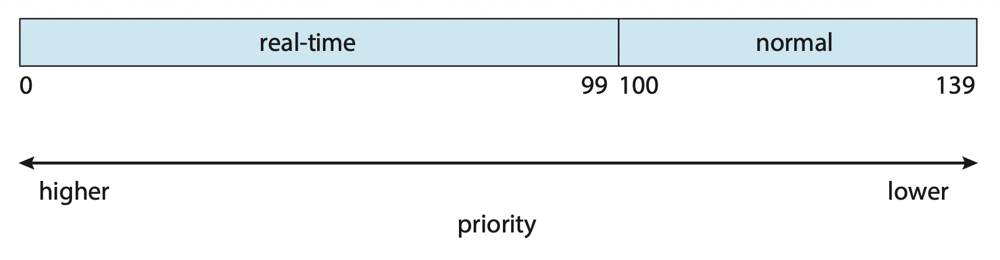
</div>

- 实时任务的静态优先级设定在 0 至 99 之间
- 普通任务的优先级范围则是 100 到 139
    - 任务根据其 nice 值被分配优先级，其中 -20 对应优先级 100，而 +19 则对应 139

CFS 调度器同样支持**负载均衡**，它采用一种精密技术来平衡各处理核心间的负载，同时兼顾 NUMA 架构并尽量减少线程迁移。CFS 将每个线程的负载定义为该**线程优先级**与其**平均 CPU 利用率**的综合考量。基于这一衡量标准，队列的负载即为队列中所有线程负载的总和，而实现均衡只需确保所有队列的负荷大致相当即可。

**迁移线程**可能会导致内存访问性能下降，为解决这一问题，Linux 定义了一个层次化的调度域系统。**调度域**(scheduling domain)是一组可以相互之间进行负载均衡的 CPU 核心集合，如下所示：

<div style="text-align: center">
    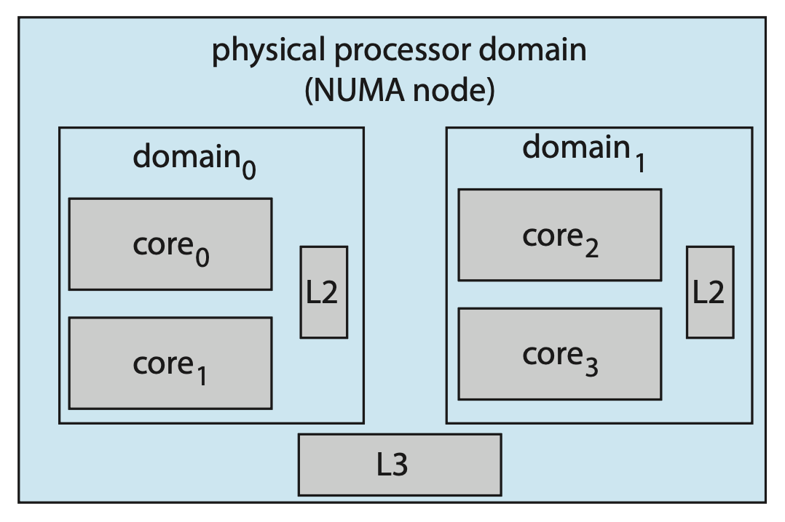
</div>

- 每个调度域中的核心根据它们共享系统资源的方式被分组
- 如上图所示，每个核心有自己的 L1 缓存，并且它们会共享二级 L2 缓存，分别对应域 0 和域 1
- 同样地，这两个域可能共享 L3 缓存，从而来到了处理器级别的域（也称为 **NUMA 节点**）

CFS 的总体策略是从层次结构的最低层开始，在域内平衡负载。


## Algorithm Evaluation

选择合适的 CPU 调度算法可能颇具挑战。首要问题就是明确选择算法的[标准](#scheduling-criteria)，并确定这些要素的相对重要性。一旦确定了选择标准，我们便要对算法进行评估。所以接下来就来介绍各种评估方法。


### Deterministic Modeling

一类主要的评估方法是**分析性评估**(analytic evaluation)：利用给定的算法和系统工作负载，生成一个公式或数值来评价该算法在此工作负载下的性能。而**确定性建模**(deterministic modeling)是分析性评估的其中一种类型。它采用特定的预设工作负载，以确定每个算法在该工作负载下的表现。

???+ example "例子"

    假如以下一组进程在时刻 0 到达，它们的 CPU 突发长度（单位：ms）如下所示：

    <div style="text-align: center">
        
    </div>

    以下是采用各种调度算法后的结果

    - FCFS 算法：平均等待时间为 28ms

        <div style="text-align: center">
            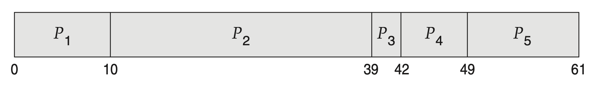
        </div>

    - SJF 算法：平均等待时间为 13ms

        <div style="text-align: center">
            
        </div>

    - RR 算法：平均等待时间为 23ms

        <div style="text-align: center">
            
        </div>

确定性建模方法**简单快捷**，能提供精确的数据，以便我们比较不同算法。然而，它**需要准确的输入数据**，并且其结果**仅适用于特定情况**。

确定性建模主要用于描述调度算法和举例说明。不过当我们反复运行同一程序并能精确测量其处理需求时，或许可以利用确定性建模来选择合适的调度算法。此外，确定性建模还能揭示出可单独分析和验证的趋势。


### Queueing Models

在许多系统中，每天运行的进程不同，因此不存在用于确定性建模评估方法的固定进程集合。然而，我们可以

- 确定 CPU 和 I/O 突发活动的分布情况。这些分布可以被测量出来，随后进行近似处理或简单估算，最终得到一个描述特定 CPU 突发概率的数学公式
- 描述进程进入系统的时间分布（即到达时间分布）

基于这两种分布，对于大多数算法而言，能够计算出平均吞吐量、利用率、等待时间等性能指标。

---
我们用一个服务器网络描述计算机系统：

- 每个服务器都有一列等待处理的进程队列
- CPU 作为一个服务器，拥有就绪队列；同样 I/O 系统也配备有设备队列
- 通过了解到达率和服务率，我们能够计算出利用率、平均队列长度、平均等待时间等指标
  
这种方法叫做**排队网络分析**(queueing-network analysis)。设 $n$ 为平均长期队列的长度，$W$ 为队列中的平均等待时间，$\lambda$ 为队列中新进程的平均到达率。我们预期：在一个进程等待的 $W$ 时间内，将有 $\lambda \times W$ 个新进程进入队列。若系统处于稳定状态，那么**离开队列的进程数量必须等于到达的进程数量**。因此，
$$
n = \lambda \times W
$$

这个等式称为**利特尔公式**(Little's formula)，适用于任何调度算法和到达分布。

不过排队分析能够处理的算法类别和分布相当有限，复杂算法和分布的数学处理起来较为困难。所以排队模型往往只是对真实系统的近似模拟，计算结果的准确性有待商榷。


### Simulations

为了更精确地评估调度算法，我们可以采用**模拟**(simulation)方法

- 这涉及对计算机系统模型进行编程，而软件数据结构代表了系统的主要组成部分
- 模拟器拥有一个代表**时钟**(clock)的变量，随着该变量值的增加，模拟器会修改系统状态，以反映设备、进程及调度器的活动情况
- 在模拟执行过程中，收集并打印出表明算法性能的**统计数据**

驱动模拟所需的**数据**可以通过多种方式生成。最常用的方法是利用**随机数生成器**

- 按照概率分布编程来产生进程、CPU 突发时间、到达与离开等事件
- 这些分布可以数学定义（如均匀分布、指数分布、泊松分布）或经验性地确定
    - 若要经验性地定义一个分布，需对研究中的实际系统进行测量；测量结果将揭示真实系统中事件的分布规律

然而，上述模拟可能并不准确，因为真实系统中连续事件之间存在关联；而频率分布仅能显示每种事件发生的次数，它并未揭示事件发生的**顺序**信息。

为解决这一问题，我们可以采用**追踪文件**(trace files)的方法：通过监控真实系统并记录实际事件的序列，创建一条追踪记录，随后利用这一序列来驱动模拟过程。这种方法能够针对其输入产生精确的结果。

<div style="text-align: center">
    
</div>

但模拟成本高，通常需要数小时。当然更详细的模拟能提供更精确的结果，但是需要耗费更多时间。此外，追踪文件会占据大量存储空间。模拟器的设计、编码和调试也是一个不小的挑战。


### Implementation

即便是模拟，精确度也有限。唯一完全准确的评估调度算法的方法是实现其代码，放入真实 OS 之中，并观察其实际运行效果。

这种方法的成本主要产生于编写算法的代码，修改 OS 以支持该算法，以及测试这些变更。通常采用**回归测试**(regression testing)，以确认这些更改未使任何情况恶化，也未引发新的错误或导致旧错误重现。

另一个难点在于算法运行的**环境**会发生变化，这种变化不仅源于常规因素，还受到**调度器**性能的影响。

- 若优先处理短进程，用户可能会将大型进程拆分成一系列小进程
- 若交互式进程比非交互式进程优先级更高，用户则可能转向交互式操作方式

通常解决这一问题的方法是借助封装完整的操作集工具或脚本，反复运用这些工具，并在使用过程中评估效果。