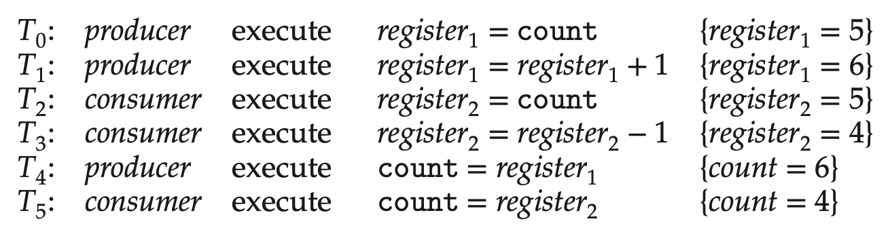
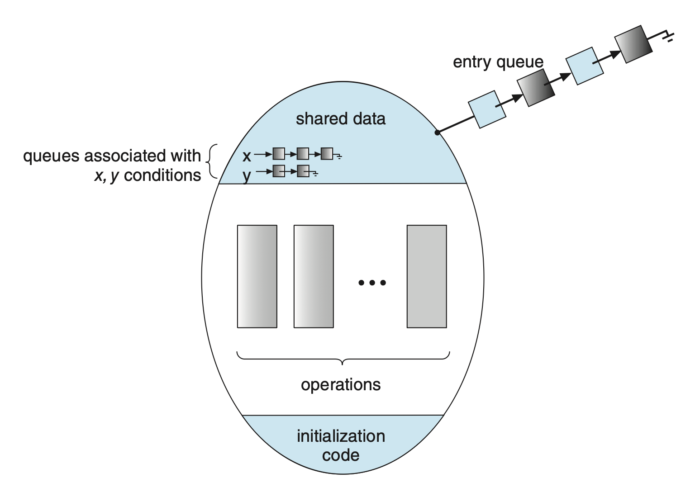

# Synchronization Tools

??? abstract "核心知识"

    - 临界区问题
    - 彼得森算法
    - 同步的硬件支持：内存屏障、`test_and_set()`、`compare_and_swap`、原子变量
    - 互斥锁：`acquire` / `release`
    - 信号量：`wait` / `signal`

    后面应该都不考（课件以及前辈们的笔记中都没出现过）

??? example "例子"

    进程的并发或并行执行可能会给（由多个进程共享的）数据完整性带来问题。之前提到过，我们用生产者-消费者模型来建模 IPC，并用到了有限缓冲区(bounded buffer)的技术。当时只允许缓冲区内同时至多有 `BUFFER_SIZE - 1` 个项。为弥补这一不足，我们引入一个整数变量 `count`，初始化为0，加入项后该值递增，移除项后该值递减。对应的代码如下：

    <div class="grid" markdown>

    ```c title="producer"
    while (true) {
        /* produce an item in next produced */
        
        while (count == BUFFER_SIZE)
            ; /* do nothing */

        buffer[in] = next_produced;
        in = (in + 1) % BUFFER_SIZE;
        count++;
    }
    ```

    ```c title="consumer"
    while (true) {
        while (count == 0)
            ; /* do nothing */

        next_consumed = buffer[out];
        out = (out + 1) % BUFFER_SIZE;
        count--;

        /* consume the item in next consumed */
    }
    ```

    </div>

    尽管单独看这两段代码没有问题，但是如果它们并发执行就不能正确运作了。假设当前 `count = 5`，且生产者和消费者分别并发执行 `#!c count++` 和 `#!c count--`。在执行过程中，`count` 的值可能是 4，5 或 6。为理解这一问题，我们将这两条语句展开为机器指令：

    <div class="grid" markdown>

    ``` title="count++"
    register1 = count
    register1 = register1 + 1
    count = register1
    ```

    ``` title="count--"
    register2 = count
    register2 = register1 - 1
    count = register2
    ```

    </div>

    并发执行时，这些指令可以以任何顺序交错执行。一种可能的情况是：

    <div style="text-align: center">
        
    </div>

    此时 `count` 的最终值为 4。若交换 $T_4$ 和 $T_5$，最终值就变成了 6，而这两个结果都是错误的。

我们称像上述情况那样，多个进程并发访问和操纵相同数据，且执行结果取决于访问发生的特定顺序的现象叫做**竞态条件**(race condition)。这种问题在多核系统和多线程应用中经常发生。为避免此类问题发生，我们需要确保同一时间内只有一个进程访问一块数据，即要求进程**同步**(synchronize)。


## Critical-Section Problem

每个进程有一个称为**临界区**(critical section)的代码段，即用于**访问一次只允许一个进程使用（或访问）的资源**的代码（这些资源包括硬件打印机、磁带机等，软件的消息缓冲队列、变量、数组、缓冲区等）。

而**临界区问题**(critical-section problem)的核心目标是设计一种协议，确保在任何时刻，只有一个进程在临界区内执行，从而避免因竞争条件导致的数据不一致或损坏。

除临界区外，代码的其他部分有：

- **进入区**(entry section)：实现这一请求的代码段
- **退出区**(exit section)：紧跟着临界区的部分
- **剩余区**(remainder section)：剩下的代码

一个进程的典型结构如下所示：

```c
while (true) {
    // entry section
        // critical section
    // exit section
        // remainder section
}
```

解决临界区问题的方案必须满足以下三个要求：

- **互斥**(mutual exclusion)：如果 $P_i$ 在临界区执行，那么其他进程就不得执行各自的临界区
- **进展**(progress)：若当前没有进程在临界区执行，且一些进程希望在临界区执行，那么只有那些不在剩余区执行的进程将会被考虑选择去执行临界区，并且这一选择不能被无限期推迟
- **有限等待**(bounded waiting)：存在一个限制，即在某个进程发起进入临界区的请求之后，且该请求被批准之前，允许其他进程进入各自临界区的次数上限

>并且假设每个进程的执行速度是非零的。

??? example "关于临界区问题的例子"

    - 两个进程 $P_0, P_1$ 使用 `fork()` 创建各自的子进程。若两者并发执行，那么它们会在一个内核变量 `next_available_pid`（字面意思）上存在竞态条件。除非使用互斥锁，否则相同的 pid 会被赋予给两个子进程。

        <div style="text-align: center">
            
        </div>

    - 一些内核数据结构也容易发生竞态条件，比如用于维护内存分配、维护进程列表、处理中断的结构。

- 对于单核环境，临界区问题可通过在修改共享数据时**禁用中断**来解决，此时可确保当前执行的指令序列不会被抢占，因而不会出现意料之外的修改。
- 但在多处理器环境下，禁用中断是很耗时的，因为要将消息传递给所有处理器。因此有两种通用处理方法：
    - **非抢占式内核**：由于同一时间里内核上只有一个活跃进程，因此自然不会出现竞态条件
    - **抢占式内核**：尽管设计起来更复杂，但由于它的表现比非抢占式更好，因此下面主要介绍抢占式内核的解决方案


## Peterson's Solution

首先介绍一种经典的基于软件的方案——**彼得森算法**(Peterson's solution)。

???+ info "注"

    尽管该方法**无法确保**始终正确工作，但这里仍然要先介绍这一方法，这是因为它提供了求解临界区问题的很好的算法描述，并阐述了设计满足上述三个要求的软件所涉及的复杂性。

该算法将问题限制在在临界区和剩余区轮流执行的两个进程 $P_i, P_j$ 上，并要求这两个进程共享以下两个数据项：

```java
int turn;
boolean flag[2];
```

- `turn` 表示哪个进程即将要进入临界区
- `flag` 表示进程是否已经准备好进入临界区

以下代码展示了在该算法下进程 $P_i$ 的结构：

```c
while (true) {
    flag[i] = true;
    turn = j;
    while (flag[j] && turn == j)
        ;

        /* critical section */
    
    flag[i] = false;

        /*remainder section */
}
```

下面证明这一算法的正确性。

??? proof "证明"

    === "互斥"

        - 进程 $P_i$ 仅当 `#!c flag[j] == false` 或 `#!c turn == i` 时才能进入其临界区
        - 若两个进程能同时在其临界区内执行，则必有 `#!c flag[0] == flag[1] == true`
        - 这些意味着 $P_0$ 和 $P_1$ 不可能同时成功执行完它们的 `#!c while` 语句，因为 `turn` 的值只能是 0 或 1 之一，不可兼得
        - 因此，假如其中一个进程（比如 $P_j$）已成功执行了 `#!c while` 语句，此时 `#!c flag[j] == true` 且 `#!c turn == j` 成立，并且只要 $P_j$ 仍处于其临界区内，该条件就会持续保持，因而满足互斥性

    === "进展 & 有限等待"

        - 进程 $P_i$ 只有在陷入 `#!c while` 循环且条件 `#!c flag[j] == true` 和 `#!c turn == j` 时才能被阻止进入临界区
            - 如果 $P_j$ 还没有准备好进入临界区，那么 `#!c flag[j] == false`，$P_i$ 可以进入其临界区
            - 如果 $P_j$ 已经将 `flag[j]` 设置为 `#!c true` 并且也在执行其 `#!c while` 语句，那么存在以下两种情况之一
                - 如果 `#!c turn == i`，那么 $P_i$ 将进入临界区
                - 如果 `#!c turn == j`，那么 $P_j$ 将进入临界区；然而，一旦 $P_j$ 退出其临界区，它将重置 `flag[j]` 为 `#!c false`，允许 $P_i$ 进入其临界区
        
        - 如果 $P_j$ 将 `flag[j]` 重置为 `#!c true`，它还必须将 `turn` 设置为 `i`
        - 因此，由于 $P_i$ 在执行 `#!c while` 语句时不会改变变量 `turn` 的值，$P_i$ 将在 $P_j$ 最多进入一次（有限等待）后进入临界区（进展）

前面提到过该方法“无法确保正常工作”，一个原因是在现代计算机体系结构中，为提升性能，处理器或编译器可能会对没有依赖的读或写操作进行**重排**(reorder)。对单线程应用而言，这没什么问题；但对多线程应用而言，指令的重排可能会导致不一致或异常的结果。

??? example "例子"

    假如有两个线程共享以下数据：

    ```java
    boolean flag = false;
    int x = 0;
    ```

    两个线程分别执行以下语句：

    <div class="grid" markdown>

    ```c title="thread 1"
    while (!flag)
        ;
    print x;
    ```

    ```c title="thread 2"
    x = 100;
    flag = true;
    ```

    </div>

    预期行为应当是线程1输出 `x` 的值 100。但由于 `flag` 和 `x` 间没有数据依赖，处理器可能会对线程 2 的指令重排，所以 `flag` 可能先于 `x = 100` 被赋值为 `#!c true`。此时线程 1 的输出就可能是 0 了。

    还有一种不易察觉的情况是线程 1 的指令也有可能被重排，因此可能在加载 `flag` 前先加载 `x`，这样即便线程 2 没有发生重排，线程 1 仍然输出 0。

指令重排对彼得森算法的具体影响是：两个线程可能会同时执行各自的临界区（如下图所示）。解决方案是使用接下来介绍的同步工具。

<div style="text-align: center">
    
</div>

>注：图中 "cs" 是临界区(critical section)的缩写。


## Hardware Support for Synchronization

下面将介绍用于解决临界区问题的三类硬件指令，它们既可以直接用作同步工具，也可用于构建更抽象的同步机制。


### Memory Barriers

计算机体系结构如何决定其为应用程序提供何种内存保证，这被称为**内存模型**(memory model)。通常内存模型可归为以下两类（因处理器类型而异）：

- **强有序**(strongly ordered)：对某个处理器的内存修改可立马被其他处理器看到
- **弱有序**(weakly ordered)：对某个处理器的内存修改可能无法立马被其他处理器看到

计算机系统提供了一种能让处理器对内存的任何修改强迫传播给（通知）所有其他处理器的指令，从而确保所有的内存修改对正在其他处理器上运行的线程都是可见的。这种指令称为**内存屏障**(memory barrier / fence)。它强制**处理器在执行屏障之后的内存访问指令前，必须先完成屏障之前的所有内存访问操作**。即便存在指令重排，内存屏障指令也能确保在未来的加载或存储操作执行之前，存储操作已在内存中完成，并对其他处理器可见。

??? example "例子"

    接着最近的例子——现在使用内存屏障指令来确保获得预期结果：

    <div class="grid" markdown>

    ```c title="thread 1"
    while (!flag)
        memory_barrier();
    print x;
    ```

    ```c title="thread 2"
    x = 100;
    memory_barrier();
    flag = true;
    ```

    </div>

    - 线程 1 的内存屏障确保 `flag` 的加载在 `x` 之前
    - 线程 2 的内存屏障确保 `x` 的赋值发生在 `flag` 的赋值之前

综上，对于彼得森算法，只要将内存屏障指令放置在进入区的两条赋值语句之间，就能避免对这些操作的重排了。

值得注意的是，内存屏障指令是低层级操作，通常只能被内核开发者使用，用于编写互斥相关的代码。


### Hardware Instructions

大多数现代计算机系统提供一些能够实现**原子**(atomic)操作（执行时不会被其他指令打断）的指令，包括：

- `test_and_set()`（测试并设置）
    - 定义如下：

        ```cpp
        boolean test_and_set(boolean *target) {
            boolean rv = *target;
            *target = true;
            return rv;
        }
        ```

    - 如果机器支持这个指令，那就可以通过声明一个 `#!java boolean` 变量来实现互斥，此时进程 $P_i$ 的结构如下所示：

        ```c
        do {
            while (test_and_set(&lock))
                ; /* do nothing */

                /* critical section */

            lock = false;

                /* remainder section */
        } while (true);
        ```

        - `#!c lock == true`：说明有别的进程在执行临界区的代码，因此 $P_i$ 将一直卡在 `#!c while` 循环，直到那个进程离开临界区，将 `lock` 置为 `#!c false` 时继续往下执行临界区的代码
        - `#!c lock == false`：说明没有其他进程在执行临界区的代码，那么 $P_i$ 就可以进入临界区了

- `compare_and_swap()`：（比较并交换，简称 **CAS**）
    - 定义如下：

        ```c
        int compare_and_swap(int *value, int expected, int new_value) {
            int temp = *value;

            if (*value == expected)
                *value = new_value;

            return temp;
        }
        ```

    - 同样也可用于实现互斥：

        ```c
        while (true) {
            while (compare_and_swap(&lock, 0, 1) != 0)
                ; /* do nothing */

                /* critical section */

            lock = 0;

                /* remainder section */
        }
        ```

    - 但此时算法仍未满足有限等待要求，所以下面给出更完善的代码，能够满足所有解决临界区问题的要求

        ```c
        while (true) {
            waiting[i] = true;
            key = 1;
            while (waiting[i] && key == 1)
                key = compare_and_swap(&lock, 0, 1);
            waiting[i] = false;

                /* critical section */

            j = (i + 1) % n;
            while ((j != i) && !waiting[j])
                j = (j + 1) % n;

            if (j == i)
                lock = 0;
            else
                waiting[j] = false;

                /* remainder section */
        }
        ```

        - 公共数据结构为：

            ```java
            boolean waiting[n];      // initialized to false
            int lock;                // initialized to 0
            ```

        ??? proof "证明"

            === "互斥"

                - 进程 $P_i$ 仅当 `#!c waiting[i] == false` 或 `#!c key == 0` 时才能进入其临界区
                - `key` 的值只有在执行比较并交换操作时才可能变为 0
                - 第一个执行 `compare_and_swap()` 的进程会发现 `key` 等于 `0`，其余所有进程必须等待
                - 变量 `waiting[i]` 仅当另一个进程离开其临界区时才会变为 `#!c false`，且只有一个进程的 `waiting[i]` 被设为假，从而维持了互斥要求

            === "进展"

                先前证明互斥的过程同样适用于此，因为一个进程退出临界区时，要么将 `lock` 设置为 `0`，要么将等待数组中的 `waiting[j]` 设为`#!c false`，这两种情况都允许正在等待进入其临界区的进程继续执行。

            === "有限等待"

                - 当一个进程离开其临界区时，它会按照环形序列 $(i + 1, i + 2, \dots, n − 1, 0, \dots, i − 1)$ 扫描数组 `waiting`
                - 算法将此序列中第一个处于进入区（`#!c waiting[j] == true`）的进程指定为下一个进入临界区的进程，因此任何等待进入其临界区的进程将在 `n-1` 轮内实现这一目标


### Atomic Variables

通常 `compare_and_swap()` 指令并不直接用于直接实现互斥；相反，它被用作构建解决临界区问题工具的**基础构建块**。其中一个工具叫做**原子变量**(atomic variables)，它为基本数据类型（如整数和布尔值等）提供原子操作。

多数支持原子变量的系统会提供特殊的原子数据类型，以及用于访问和操纵原子变量的函数，这些函数通常由 `compare_and_swap()` 操作实现。

??? example "例子"

    用于递增原子整数 `sequence` 的函数 `increment()` 就是由 CAS 指令实现的：

    ```c
    void increment(atomic int *v) {
        int temp;
        do {
            temp = *v;
        } while (temp != compare_and_swap(v, temp, temp + 1));
    }
    ```

尽管原子变量提供了原子更新，但它还是没能完全解决所有情况下的竞态条件问题。

原子变量在 OS 以及并发应用程序中普遍使用，但通常局限于共享数据的单次更新，例如计数器和序列生成器。


## Mutex Locks

上述基于硬件的解决方案不仅复杂，而且不方便为应用程序员使用。因此 OS 开发者提供了更高级的软件工具来解决临界区问题，其中最简单的工具就是**互斥锁**(mutex locks)。我们将使用互斥锁保护临界区，从而阻止竞态条件发生。具体来说，进程在进入临界区时必须要**获取**锁，当退出临界区时要**释放**锁（对应的操作为 `acquire()` 和 `release()`，如下所示）。

>注："mutex" 一词是 "**mut**ual **ex**clusion" 的缩写。

```c
while (true) {
    // acquire lock

        // critical section

    // release lock

        // remainder section
}
```

互斥锁有一个布尔变量 `available`，表示锁是否可用。若锁可用，则 `acquire()` 操作能成功执行，此时锁就变成不可用了。尝试请求不可用的锁的进程会被阻塞，直至该锁被释放。

`acquire()` 和 `release()` 的定义如下：

```c
acquire() {
    while (!available)
        ; /* busy wait */
    available = false;
}

release() {
    available = true;
}
```

调用这两个函数时必须以原子形式执行，因此互斥锁可用前面介绍的 CAS 操作实现。但这种实现的一个缺点是会导致**忙等待**(busy waiting)：当一个进程处于临界区时，任何其他试图进入该临界区的进程必须在调用 `acquire()` 时持续循环等待。这显然会浪费 CPU 时间。

前面讨论的这种互斥锁类型也被称为**自旋锁**(spinlock)。自旋锁的一个优势是：当进程必须等待一个锁时，不需要进行耗时的上下文切换操作。

- 在多核系统的某些情况下，自旋锁实际上是更可取的选择，因为如果持有锁的时间很短，一个线程可以在一个处理核心上“自旋”（即等待），同时另一个线程在另一个核心上执行其临界区
- 许多现代 OS 广泛使用了自旋锁


## Semaphores

相比互斥锁，**信号量**是一个更强大的同步工具。它是一个整数变量（记作 `S`），除初始化外只会被两类原子操作访问：`wait()` 和 `signal()`。这两个操作的定义如下：

```c
wait(S) {
    while (S <= 0)
        ; // busy wait
    S--;
}

signal(S) {
    S++;
}
```

>注：信号量的发明者为 [Dijkstra](https://en.wikipedia.org/wiki/Edsger_W._Dijkstra)（~~没错，就是发明某知名最短路算法的那位大牛~~）


### Usage

OS 通常有两类信号量：

- **计数信号量**(counting semaphore)：域的范围不设限
    - 可用于控制对由有限数量实例组成的给定资源的访问，此时信号量初始化为**可用资源的数量**
    - 每个希望使用资源的进程都会对信号量执行 `wait()` 操作（从而减少计数值）
    - 当进程释放资源时执行 `signal()` 操作（增加计数值）
    - 当信号量的计数变为 0 时，表示所有资源均被占用，此后想要使用资源的进程将会阻塞，直到计数值大于 0 为止

- **二元信号量**(binary semaphore)：只取 0 和 1，因而表现上和**互斥锁**类似，所以有些没实现互斥锁的系统就用二元信号量替代

信号量可解决各类同步问题，来看下面这个例子：

??? example "例子"

    考虑以下两个并发运行的进程 $P_1$（带有语句 $S_1$）和 $P_2$（带有语句 $S_2$）。假如要求 $S_2$ 必须在 $S_1$ 执行完毕后执行，可以让 $P_1, P_2$ 共享一个信号量 `synch`（初始化为 0）。两个进程分别插入以下语句：

    <div class="grid" markdown>

    ```c title="P1"
    S1;
    signal(synch);
    ```

    ```c title="P2"
    wait(synch);
    S2;
    ```

    </div>

    由于 `synch` 初始化为 0，因此只有当 $P_1$ 调用 `signal(synch)` 时 $P_2$ 才会执行 $S_2$。


### Implementation

目前对 `wait()` 和 `signal()` 的定义仍然会导致**忙等待**的问题出现。为解决这一问题，我们可以这样做：

- 等待的进程会被**挂起**(suspend)，即把进程放入与信号量关联的**等待队列**中，并且将该进程的状态切换至等待状态；随后控制权转交给 CPU 调度器，它会选择另外的进程执行
- 当其他进程执行 `signal()` 操作后，先前被挂起的进程就应该要**重启**了，此时该进程从等待状态变为就绪状态，并进入**就绪队列**中。

要实现上述定义，首先按以下方式定义信号量：

```c
typedef struct {
    int value;
    struct process *list;
} semaphore;
```

- `list` 可通过 PCB 的一个链接字段轻松实现；可以是 FIFO 队列，也可以是任何其他队列（反正不影响信号量的正确使用）

接着修改 `wait()` 和 `signal()` 的定义：

```c
wait(semaphore *S) {
    S->value--;
    if (S->value < 0) {
        add this process to S->list;
        sleep();
    }
}

signal(semaphore *S) {
    S->value++;
    if (S->value <= 0) {
        remove a process P from S->list;
        wakeup(P);
    }
}
```

- `sleep()` 操作会挂起调用该函数的进程，而 `wakeup(P)` 会继续执行被挂起的进程 `P`，它们都是 OS 的基本系统调用
- 上述实现中，信号量可能为负，此时它的绝对值表示等待信号量的进程数
- `wait()` 和 `signal()` 是一对原子操作，所以要确保不存在两个进程同时对相同信号量执行这对操作的情况
    - 单处理器环境下仅需在执行 `wait()` 和 `signal()` 时禁用中断即可，此时不同进程的指令不会交错执行
    - 而在多核环境下，必须要对每个处理器禁用中断
        - 但实现起来困难重重，且损害性能
        - 因此 SMP 系统通常用 `compare_and_swap()` 或自旋锁解决

- 值得注意的是，上述改进定义仍然没能消除忙等待的问题，只是将这一问题从进入区移动到临界区内，但好在临界区内的忙等待频率会少很多


## Monitors

??? info "引入"

    不幸的是，即便使用互斥锁或信号量，还是有可能会出现时间错误。假如所有进程用到一个二元信号量变量 `mutex`（初始化为 1），它们在进出临界区时会分别调用 `wait(mutex)` 和 `signal(mutex)`。此时可能会遇到以下一些问题：

    - 假如程序交换了 `wait()` 和 `signal()` 的顺序，即

        ```c
        signal(mutex);
            // ...
            // critical section
            // ...
        wait(mutex);
        ```

        此时一些进程可能同时在各自的临界区执行，从而违背了互斥要求。注意这一问题不会总是复现。

    - 假如程序用 `wait(mutex)` 替代 `signal(mutex)`，即

        ```c
        wait(mutex);
            // ...
            // critical section
            // ...
        wait(mutex);
        ```

        因为信号量不可用，此时进程会被一直阻塞在第二个 `wait()` 调用上。

    - 假如程序漏掉 `wait()` 和 `signal()` 的任何一个（或都漏掉了了），此时要么违背互斥要求，要么会被一直阻塞。

一种解决上述错误的策略是将简单的同步工具作为高级语言结构来整合。下面将介绍其中一种基础的高级同步构造——**管程**(monitor)类型。


### Usage

**管程类型**是一种抽象数据类型（ADT），包括了一组程序员定义的操作，这些操作在管程内部提供互斥机制；并声明了类型实例状态的变量，以及在这些变量上操作的函数体。伪代码语法如下：

```c
monitor monitor_name
{
    /* shared variable declarations */
    function P1(...) {
        // ...
    }
    function P2(...) {
        // ...
    }

    // ...

    function Pn(...) {
        /// ...
    }

    initialization_code(...) {
        // ...
    }
}
```

管程能确保同一时间内管程内只有一个活跃进程，因此程序员无需显式编写同步约束。

不过目前定义的管程还不够强大，因此需要定义额外的同步机制，这些机制由 `condition` 类型提供。希望编写量身定制的同步模式的程序员可以定义一个或多个 `condition` 类型的变量（比如 `#!c condition x, y;`）。这些条件变量唯一能调用的操作是 `wait()` 和 `signal()`，其作用和信号量的同名操作大致一样，不过有一个不同之处是：如果没有挂起的进程，这里的 `signal()` 没有影响（而信号量的那个总是会改变信号量的状态）。

<div style="text-align: center">
    
</div>

假设进程 P 调用 `x.signal()`，并给存在一个和条件 `x` 关联且挂起的进程 Q。如果进程 Q 允许执行，那么 $P$ 必须等待，否则 P 和 Q 就会同时在管程内活跃。这里存在两种可能，且两种选项都有合理的理由：

- **发信号并等待**(signal and wait)：P 要么等到 Q 离开管程，要么等待下一个条件
- **发信号并继续**(signal and continue)：Q 要么等到 P 离开管程，要么等待下一个条件


### Implementating a Monitor Using Semaphores

下面考虑用（二元）信号量实现管程。这里采用**发信号并等待**的模式，此时需要一个额外的二元信号量 `next`（初始化为 0）（发信号的进程可用 `next` 挂起自己），并且提供一个记录因 `next` 挂起的进程数 `next_count`。因此每个外部函数 `F` 被改写为：

```c
wait(mutex);
    // ...
    // body of F
    // ...
if (next_count > 0)
    signal(next);
else
    signal(mutex);
```

此时管程内的互斥得以保证。下面考虑实现条件变量：对于每个条件 `x`，引入一个二元信号量 `x_sem` 和整数变量 `x_count`（均初始化为 0）。`x.wait()` 和 `x.signal()` 的实现分别如下：

```c
// x.wait()
x_count++;
if (next_count > 0)
    signal(next);
else
    signal(mutex);
wait(x_sem);
x_count--;

// x.signal()
if (x_count > 0) {
    next_count++;
    signal(x_sem);
    wait(next);
    next_count--;
}
```


### Resuming Processes with a Monitor

下面考虑管程内进程继续的顺序。一种方案是使用 FCFS 顺序，但多数情况下这种简单方法是不够的。通常会用的方法是**条件等待**(conditional wait)构造，其形式如下：

```c
x.wait(c);
```

其中 `c`（可以是一个整数表达式）的值为**优先级数**(priority number)，它会和被挂起进程的名字一起存储起来。当执行 `x.signal()` 时，优先级数最小的进程将会继续执行。

然而管程无法保证能观察到先前访问的进程，因此某个进程可能存在以下问题：

- 可能未先获得资源访问权限就访问该资源
- 一旦获得对资源的访问权，可能永远不会释放该资源
- 可能尝试释放它从未请求过的资源
- 可能会两次请求同一资源（且未先释放该资源）

为确保进程遵循正确的顺序，需验证两个条件：

- 用户进程必须始终按照正确的顺序在管程上发起调用
- 必须确保不合作进程不会无视管程提供的互斥入口，并试图绕过访问协议以直接访问共享资源

只有满足上述所有条件才能保证不会出现时间依赖错误，并且不会破坏调度算法。


## Liveness

**存活**(liveness)是指系统必须确保程序在执行生命周期内有所进展。相应的，进程无限期等待（比如无限循环）就是一个“**存活失败**(liveness failure)”的例子。实际上有各种形式的存活失败，而基本上所有这些失败都具备低性能和低响应性的特征。下面探讨两类会导致存活失败的情况。


### Deadlock

使用等待队列的信号量实现可能导致两个或多个进程无限期地等待一个只能由其中一个等待进程引发的事件（即 `signal()` 的执行），此时我们认为发生了**死锁**(deadlock)。

??? example "例子"

    考虑以下两个进程 $P_1, P_2$，它们分别有信号量 `S` 和 `Q`，并将它们置为 1。

    <div style="text-align: center">
        
    </div>

    如上所示，由于两个进程都没法执行 `signal()` 操作，所以发生了死锁。

更一般的说法是，当一组进程中的每个进程都在等待只能由该组中另一个进程引发的事件时，我们称这组进程处于**死锁**状态。这里我们主要关注的“事件”是资源的获取与释放，例如互斥锁和信号量。


### Priority Inversion

当高优先级进程需要读取或修改当前正被低优先级进程（或一系列低优先级进程）访问的内核数据时，便会出现调度难题。由于内核数据通常通过锁进行保护，高优先级进程将不得不等待低优先级的那个完成对该资源的操作。如果此时为了另一个更高优先级的进程而抢占该低优先级进程，情况就会变得更加复杂。

???+ example "例子"

    - 假设有三个进程 L、M 和 H，它们的优先级顺序为 L < M < H；另外进程 H 需要一个信号量 S，而该信号量当前正被进程 L 访问
    - 通常情况下，进程 H 会等待 L 完成对资源 S 的使用
    - 但现在设想一下，如果进程 M 变为可运行状态，从而抢占了进程 L 的执行权，这样会间接地导致一个较低优先级的进程（即 M）影响了高优先级进程 H 必须等待低优先级进程 L 释放资源 S 的时间长度

上例所示情况就是一种称为**优先级逆转**(priority inversion)的存活失败，它只会发生在有大于 2 个优先级的系统中。通常这一问题可通过实现**优先级继承协议**(priority-inheritance protocol)来避免的。

- 所有正在访问高优先级进程所需资源的进程都会继承该较高优先级，直到它们完成对这些资源的使用为止
- 完成后，它们的优先级将恢复至原始值

???+ example "接着上面的例子"

    - 优先级继承协议会让进程 L 暂时继承进程 H 的优先级，从而阻止进程 M 抢占其执行权
    - 当进程 L 使用完资源 S 后，它将放弃从 H 那里继承来的优先级别，并恢复到原有的优先级别
    - 由于此时资源 S 已可用，接下来运行的将是进程 H 而非 M


## Evaluation

- 基于 CAS 的方法被视为一种**乐观**策略：
    - 首先“乐观地”更新一个变量，随后通过冲突检测来查看是否有其他线程同时也在更新该变量
    - 如果是的话，就要不断重试，直到成功无冲突地完成更新
- 互斥锁则是一种**悲观**策略
    - 假定有其他线程正在并发更新该变量，因此在做任何修改之前，要先“悲观地”先获取锁

下面指出了在不同竞争负载下，基于 CAS 的同步与传统同步（如互斥锁和信号量）之间性能差异的一般规律：

- **无竞争**(uncontended)：尽管两种方法通常都很快，但 CAS 保护会略快于传统同步
- **中等竞争**(moderate contention)：CAS 保护将更快
- **高竞争**(high contention)：此时传统同步最终会比基于 CAS 的同步更快

诸如管程和条件变量这类高级工具的魅力在于它们的简洁与易用性。然而，这些工具可能带来显著的开销，并且根据其实现方式的不同，在高竞争环境下可能难以有效扩展。

正在广泛并持续进行的研究：

- 开发能生成更高效代码的编译器
- 开发提供并发编程支持的语言
- 使用现有库或 APIs 提升性能

