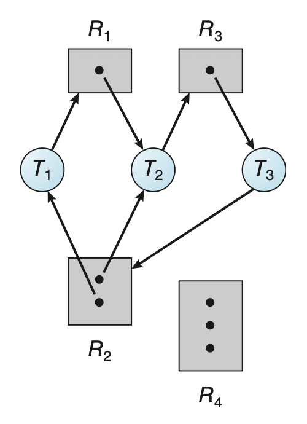
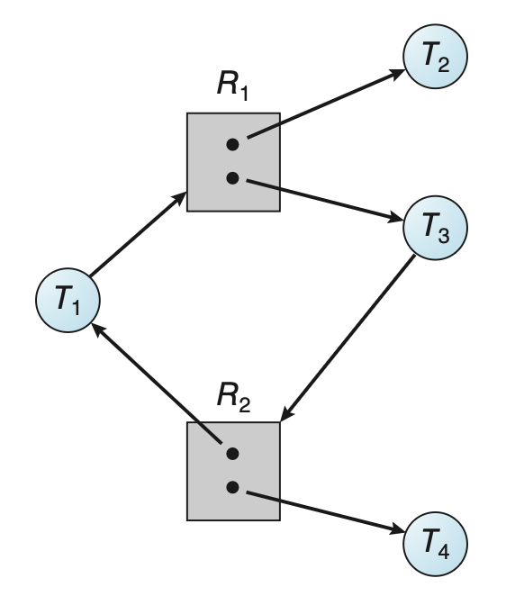
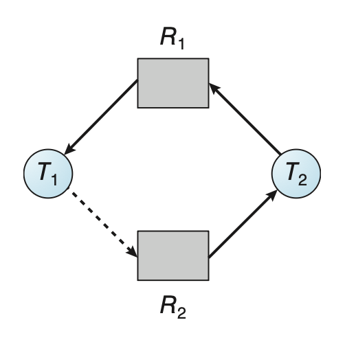

# Deadlocks

**死锁**(deadlock)：一组进程中，每个进程都在等待由这组进程中另一个进程导致的一个事件。

- 主要关心的事件时资源的获取和释放


## System Model

**资源类型**(resource type)：包括 CPU 周期、文件、I/O 设备、网络等

- 一种资源类型可能有多个实例(instance)

线程会按以下步骤使用资源：

- **请求**(request)：线程请求资源；若请求无法立即满足，那么发起请求的线程必须等待，直到获取资源
- **使用**(use)：线程在资源上操作
- **释放**(release)：线程释放资源

请求和释放资源的操作是系统调用。

**系统表**(system table)记录了每个资源被释放和被分配的情况。


## Deadlock in Multithreaded Applications

以下使用 Pthread 提供的互斥锁的程序可能存在死锁问题：

??? example "例子"

    ```c
    pthread_mutex_t first_mutex;
    pthread_mutex_t second_mutex;
    pthread_mutex_init(&first mutex,NULL);
    pthread_mutex_init(&second mutex,NULL);

    /* thread one runs in this function */
    void *do_work_one(void *param) {
        pthread_mutex_lock(&first mutex);
        pthread_mutex_lock(&second mutex);
        /**
        * Do some work
        */
        pthread_mutex_unlock(&second mutex);
        pthread_mutex_unlock(&first mutex);

        pthread_exit(0);
    }

    /* thread two runs in this function */
    void *do_work_two(void *param) {
        pthread_mutex_lock(&second mutex);
        pthread_mutex_lock(&first mutex);
        /**
        * Do some work
        */
        pthread_mutex_unlock(&first mutex);
        pthread_mutex_unlock(&second mutex);

        pthread_exit(0);
    }
    ```

由于取决于具体的调度情况，因此死锁不总是发生。

---
**活锁**(livelock)类似死锁，但它发生在线程连续尝试会失败的行动的时候（~~就像过道上两个相向而行的人按相同方向（比如你往右，ta 往左）给对方让路，导致谁也过不去~~）。在 Pthread 中可用 `pthread_mutex_trylock()` 检测活锁：

??? example "例子"

    ```c
    /* thread one runs in this function */
    void *do_work_one(void *param) {
        int done = 0;

        while (!done) {
            pthread_mutex_lock(&first_mutex);
            if (pthread_mutex_trylock(&second_mutex)) {
                /**
                * Do some work
                */
                pthread_mutex_unlock(&second_mutex);
                pthread_mutex_unlock(&first_mutex);
                done = 1;
            }
            else
                pthread_mutex_unlock(&first_mutex);
        }

        pthread_exit(0);
    }

    /* thread two runs in this function */
    void *do_work_two(void *param)
    {
        int done = 0;
        while (!done) {
            pthread_mutex_lock(&second_mutex);
            if (pthread_mutex_trylock(&first_mutex)) {
                /**
                * Do some work
                */
                pthread_mutex_unlock(&first_mutex);
                pthread_mutex_unlock(&second_mutex);
                done = 1;
            }
            else
                pthread_mutex_unlock(&second_mutex);
        }
        
        pthread_exit(0);
    }
    ```

活锁问题可通过让每个线程重试随机次数的失败操作后结束来实现。


## Deadlock Characterization

### Necessary Conditions

若以下四个条件同时发生，死锁就出现了：

- **互斥**(mutual exclusion)：至少有一个资源处于非共享模式，即同一时间内只有一个线程能使用该资源；若有别的线程请求该资源，则该线程必须延迟，直到资源被释放
- **保持并等待**(hold and wait)：线程必须持有至少一个资源，并且等待获取额外的，目前正被其他线程持有的资源
- **无抢占**(no preemption)：资源无法被抢占，即资源能够被其持有的线程在完成任务后自愿释放
- **循环等待**(circular wait)：必须存在一组等待线程 $\{T_0, T_1, \dots, T_n\}$，满足 $T_i$ 等待 $T_{(i + 1) \text{ mod } (n + 1)}\ (i = 0, \dots n)$

>注：这四个条件并非完全独立。


### Resource-Allocation Graph

精确描述死锁的有向图是系统**资源分配图**(resource-allocation graph)。

- 顶点集合 $V$ 被划分为两类：活跃线程 $T = \{T_1, \dots, T_n\}$（用圆圈表示）和资源类型 $R = \{R_1, \dots, R_m\}$（用矩形表示）
    - 由于 $R_j$ 可能有不止一个实例，所以用矩形中的点表示一个个实例
- 边集合 $E$ 也分为两类：
    - **请求边**(request edge) $T_i \rightarrow R_j$：线程 $T_i$ 正在请求 $R_j$ 的一个实例，并且当前正在等待该资源
    - **分配边**(allocation edge) $R_j \rightarrow T_i$：资源 $R_j$ 的一个实例已被分配给线程 $T_i$

当 $T_i$ 请求 $R_j$ 时，需往资源分配图插入一条请求边；若请求得到满足，则需将这条请求边**立即转换**为分配边。若线程释放该资源，则从图中删掉这条分配边。

下图展示了一张资源分配图：

<div style="text-align: center">
    
</div>

当图中出现**环**时，说明可能存在死锁。

- 若一个资源类型只有一个实例，那么死锁一定发生了
- 若一个资源类型只有多个实例，那么死锁不一定发生，比如：
    - 发生死锁

        <div style="text-align: center">
            
        </div>

    - 未发生死锁

        <div style="text-align: center">
            
        </div>


## Methods for Handling Deadlocks

我们有以下应对死锁的办法：

- 忽视死锁问题，就当它不存在
    - 啥也不管的结果是系统停止工作，需要重启（虽然粗暴，但是成本低，也不失为一种方法）
- 使用一种阻止或避免死锁发生的协议，确保系统永远不会进入死锁状态
    - **死锁阻止**(deadlock prevention)：确保至少有一个必要条件不成立，通过约束资源请求实现
    - **死锁避免**(deadlock avoidance)：提前提供关于线程在生命周期内会请求和使用什么资源的额外信息
- 允许系统进入死锁状态，但能够检测出来并能恢复系统


## Deadlock Prevention

下面来看如何依次阻止四种必要条件。


### Mutual Exclusion

- 可共享(sharable)资源（比如只读文件）不要求互斥，因此不会出现死锁
- 但我们可不能通过取消互斥条件来阻止死锁，因为像互斥锁这样的资源不得同时分配给多个线程


### Hold and Wait

- 一种方法是要求每个线程发起请求，并在开始执行前被分配到所有资源
    - 由于资源请求的动态性，这种方法对大多数应用程序而言不太实际
- 另一种方法是仅当线程没有资源时才能去请求资源
- 这两种方法均有以下显著缺点：
    - 资源利用率低
    - 可能会出现饥饿现象


### No Preemption

阻止该条件就意味着允许抢占，即：当一个线程已持有一些资源，并请求另一个无法立即分配给它的资源，那么该线程当前持有的所有资源将被抢占，即这些资源被隐式释放。该线程只有在重新获得这些资源后才能重新开始。

该方法通常适用于状态容易被保存和恢复的资源上，比如 CPU 寄存器和数据库事务等；但像互斥锁、信号量等频繁发生死锁的资源就不适合用这种方法。


### Circular Wait

通过上述分析，我们发现前三种方法在大多数情况下都不太实用。不过我们可以寄希望于这一方法：强迫所有资源类型为全序，并要求每一个线程按枚举的递增顺序请求资源，从而阻止循环等待的发生。

令资源类型集合为 $R = \{R_1, \dots, R_m\}$。我们定义一个单射函数 $F: R \rightarrow \mathbb{N}$，其中 $\mathbb{N}$ 为自然数集合，为每个资源类型赋予一个唯一的整数，从而比较资源之间的先后顺序。

假如线程请求资源 $R_i$ 的一个实例，那么它之后只能请求满足 $F(R_j) > F(R_i)$ 的资源 $R_j$ 的实例；或者也可以这样：线程请求资源 $R_j$ 的实例前，必须释放任何满足 $F(R_i) \le F(R_j)$ 的 $R_i$ 的实例。

>可以用**反证法**证明该方法的正确性。

顺序本身并不能阻止死锁发生，要编写能够遵循该顺序的程序才能阻止死锁发生。但要建立这样的顺序很困难，因为系统中有成百上千的锁。不过像 Java 等编程语言提供了解决方案。

需要注意的是，如果锁能够动态被获取，那么该方法不一定能阻止死锁发生。

---
死锁阻止算法的问题是较低的设备利用率和系统吞吐量的下降。


## Deadlock Avoidance

死锁避免算法中，最简单且最有用的模型是要求每个线程声明它可能需要的资源类型的**最大数字**。死锁避免算法会动态监测**资源分配状态**（包括空闲的和分配好的资源数，以及各线程的最大需求）来确保循环等待情况永远不存在。下面将会具体探讨两类死锁避免算法：


### Safe State

- 若系统能以某种顺序为每个线程（取决于其最大数）分配资源且仍能避免死锁发生，那么该系统是**安全的**
- 更形式地，仅当存在一个**安全序列**(safe sequence)，即对于当前分配状态，有一个线程序列 $<T_1, \dots, T_n>$，对其中的每个线程 $T_i$，它能请求的资源能被当前空闲的资源满足，且持有该资源的线程 $T_j$ 满足 $j < i$ 时，系统处于安全状态
- 此时，若 $T_i$ 所请求的资源并不空闲，那么它就会等到所有 $T_j$ 完成为止；之后 $T_i$ 就能获取它要获取的全部资源，完成指定任务后释放资源，随后终止
- 当 $T_i$ 终止时，$T_{i+1}$ 能够获取它需要的资源，以此类推
- 若不存在这样的序列，那么系统就是**不安全的**
- 处于安全状态下的系统一定不会死锁，但处在不安全状态下并不保证一定会发生死锁
    - 换句话说，不安全状态**可能**会导致死锁
- 死锁避免算法的思路就是要让系统保持安全状态
    - 一开始系统处在安全状态
    - 当线程请求一个当前空闲的资源时，系统需决定是否立即将该资源分配给线程，或者必须让线程等待（可能会降低资源利用率）
    - 仅当分配后系统仍处于安全状态时，该请求会被满足


### Resource-Allocation-Graph Algorithm

若每个资源类型只有一个实例，那么可以使用[资源分配图](#resource-allocation-graph)的一个变体来实现死锁避免。

- 除了请求边和分配边外，还需额外引入一种**声明边**(claim edge) $T_i \rightarrow R_j$，表示 $T_i$ 可能在将来某个时间会请求资源 $R_j$，在图中用虚线表示
    - 当 $T_i$ 向 $R_j$ 发起请求后，声明边就变成了请求边
    - 当 $T_i$ 释放了 $R_j$ 后，分配边 $R_j \rightarrow T_i$ 又重新变回声明边 $T_i \rightarrow R_j$
- 对资源的声明必须提前（在线程开始执行前）定好
    - 可以松弛该条件为：仅当和线程 $T_i$ 关联的所有边都是声明边时，允许声明边 $T_i \rightarrow R_j$ 加入
- 仅当请求变变成分配边后，图中没有出现环时，该请求才会被满足
    - 通过环检测算法进行安全检查，需要 $n^2$ 次运算，其中 $n$ 为线程数

<div class="grid cards" markdown>

-   安全状态
  
    <figure markdown="span">
        { width=60% }
        <figcaption></figcaption>
    </figure>

-   不安全状态

    <figure markdown="span">
        { width=60% }
        <figcaption></figcaption>
    </figure>

</div>


### Banker's Algorithm

若资源类型存在多个实例，那么上述算法就不适用了。现在介绍一种能应对该情况，但是更低效的算法，称为**银行家算法**(banker's algorithm)。

- 当新线程进入系统时，必须声明它可能需要的每个资源类型的最大实例数（不得超过资源总数）
- 实现该算法要用到的一些数据结构（其中 `n` 为线程数，`m` 为资源类型数；数据结构的规模和值会随时间变化）
    - `Available`：长为 `m` 的向量，表示每个资源类型的空闲实例数；`Available[j] = k` 表示 $R_j$ 有 $k$ 个空闲实例
    - `Max`：`n * m` 的矩阵，定义每个线程的最大需求；`Max[i][j] = k` 表示 $T_i$ 最多向 $R_j$ 请求 $k$ 个实例
    - `Allocation`：`n * m` 的矩阵，定义每个资源类型当前分配给线程的实例数；`Allocation[i][j] = k` 表示 $T_i$ 以被分配到 $R_j$ 的 $k$ 个实例
    - `Need`：`n * m` 的矩阵，表示每个线程剩余的资源需求；`Need[i][j] = k` 表示 $T_i$ 可能还需要 $k$ 个 $R_j$ 的实例来完成任务
        - `Need[i][j] = Max[i][j] - Allocation[i][j]`

- 为简化表示，我们设定一些记号：令 `X`，`Y` 是长为 `n` 的向量，当且仅当 `X[i] <= Y[i]`，`i = 1, 2, ..., n` 时，`X <= Y`
    - 我们将矩阵 `Allocation` 和 `Need` 的行元素看作向量，即 `Allocation[i]`（当前分配给 $T_i$ 的资源）和 `Need[i]`（$T_i$ 还需请求的额外资源）

先给出判断系统是否处在安全状态下的算法（需要 $m \times n^2$ 次运算）：

1. 令 `Work` 和 `Finish` 分别为长为 `m`，`n` 的向量；初始化 `Work = Available`，`Finish[i] = false`（`i = 0, ..., n - 1`）
2. 寻找索引 `i`，需同时满足：
    - `Finish[i] == false`
    - `Need[i] <= Work`

    若不存在这样的 `i`，直接来到步骤 4

3. `Work = Work + Allocation[i]`，`Finish[i] = true`，跳转到步骤 2
4. 若对所有 `i`，`Finish[i] == true`，那么系统处于安全状态

再给出确定某个请求是否能被安全满足的算法。令 `Request[i]` 为 $T_i$ 的请求向量，若 `Request[i][j] == k`，那么 $T_i$ 需要 $k$ 个 $R_j$ 的实例。当发生 $T_i$ 的请求时，需要采取以下行动：

1. 若 `Request[i] <= Need[i]`，跳转到步骤 2，否则抛出错误（因为线程请求超出最大的声明数量）
2. 若 `Request[i] <= Available`，跳转到步骤 3，否则 $T_i$ 必须等待，因为资源不可用
3. 让系统假装已经将请求的资源分配给线程 $T_i$，通过如下方式修改状态：

    ```py
    Available = Available – Request[i]
    Allocation[i] = Allocation[i] + Request[i]
    Need[i] = Need[i]– Request[i]
    ```

    若结果的资源分配状态是安全的，那么 $T_i$ 就能被分配到资源；否则 $T_i$ 必须等待 `Request[i]`，并恢复原来的资源分配状态

??? example "例子"

    TBD


## Deadlock Detection

如果既不阻止也不避免，那么死锁就有可能发生。此时系统可能会提供对应的检测和恢复机制，下面就从检测死锁开始讲起。


### Single Instance of Each Resource Type

还是先来考虑所有资源类型只有一个实例的情况。我们可以用一个叫做**等待图**(wait-for graph)的变体来实现死锁检测算法，该图可通过在资源分配图的基础上，移除资源节点并合并适当的边得到。

更准确地说，等待图中的边 $T_i \rightarrow T_j$ 表明 $T_i$ 等待 $T_j$ 释放 $T_i$ 所需的资源，即 $T_i \rightarrow R_q, R_q \rightarrow T_j$。如下图所示，右边的等待图就是从左边的资源分配图中得到的。

<div style="text-align: center">
    
</div>

类似地，当且仅当等待图中出现环时，死锁存在。为检测死锁，系统必须维护这样一张等待图，并周期性地调用算法在图中查找环。该算法需要 $O(n^2)$ 次运算。


### Several Instances of a Resource Type

而对于多实例的资源类型，我们需要另一种算法。和前面的[银行家算法](#bankers-algorithm)类似，同样需要准备一些数据结构：

- `Available`：长为 `m` 的向量，表示每个资源类型的空闲实例数
- `Allocation`：`n * m` 的矩阵，定义每个资源类型当前分配给线程的实例数
- `Request`：`n * m` 的矩阵，表示每个线程的当前请求；若 `Request[i][j] == k`，那么 $T_i$ 需要 $k$ 个 $R_j$ 的实例

算法如下：

1. 令 `Work` 和 `Finish` 分别为长为 `m`，`n` 的向量；
    - 初始化 `Work = Available`，且
    - 若 `Allocation[i] != 0`，`Finish[i] = false`，否则 `Finish[i] = true`（`i = 0, ..., n - 1`）
2. 寻找索引 `i`，需同时满足：
    - `Finish[i] == false`
    - `Request[i] <= Work`

    若不存在这样的 `i`，直接来到步骤 4

3. `Work = Work + Allocation[i]`，`Finish[i] = true`，跳转到步骤 2
4. 若对一些 `i`，`Finish[i] == false`，那么系统处于死锁状态，且死锁的是 $T_i$

该算法需要 $m \times n^2$ 次运算。

??? example "例子"

    TBD


### Detection-Algorithm Usage

何时调用死锁检测算法取决于以下因素：

- 死锁发生的频率
- 受死锁影响的线程数

算法调用太多，可能会带来相当大的计算开销，因此可以选择固定时间间隔调用一次算法。


## Recovery from Deadlock

发现死锁后，系统可能从死锁中自动恢复。下面将介绍一些恢复方法：


### Process and Thread Termination

一种方法是中止线程或进程，可采取的策略有：

- 中止所有死锁进程：显然能直接打破死锁，但开销很大
- 一次中止一个进程，直到死锁消除：开销也挺大，因为每中止一个进程就要重新调用一次死锁检测算法
    - 通常会选取开销最小的那个进程中止，而所谓的“最小开销”涉及到很多因素，包括：
        - 进程的优先级
        - 进程的计算时长和完成任务前还需多少时间
        - 进程需要用多少以及什么类型的资源
        - 进程为完成任务还需的资源数
        - 需要终止的进程数

况且中止一个进程并不容易——万一某个进程正在更新文件的过程中，直接中止会导致不一致的状态。


### Resource Preemption

另一种恢复方法是连续抢占进程的一些资源，把这些资源给别的进程，直到消除死锁。但使用该方法时需解决以下问题：

- **选择一名受害者**(victim)：需要确定哪些资源以及哪些进程，一般按最小成本（同样要考虑多种因素）确定抢占顺序
- **回滚**(rollback)：
    - 被抢占进程必须被回滚到安全状态，之后从该状态重新开始
    - 由于很难确定安全状态，最简单的方式全回滚
    - 虽然更高效的方法是只要把进程回滚到不出现死锁的阶段即可，但这样做需要维护额外的信息
- **饥饿**(starvation)：不要让进程一直被抢占，所以需要设置一个有限的抢占次数


