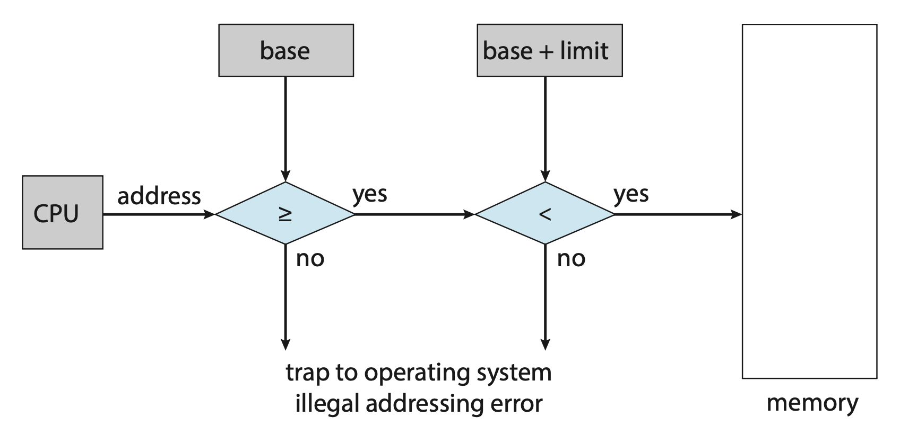
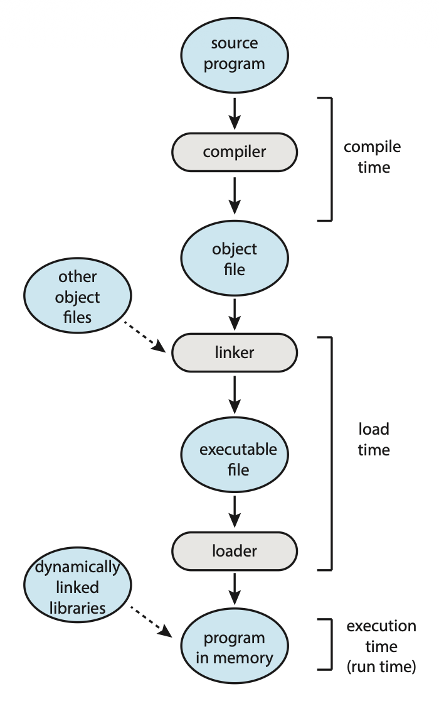
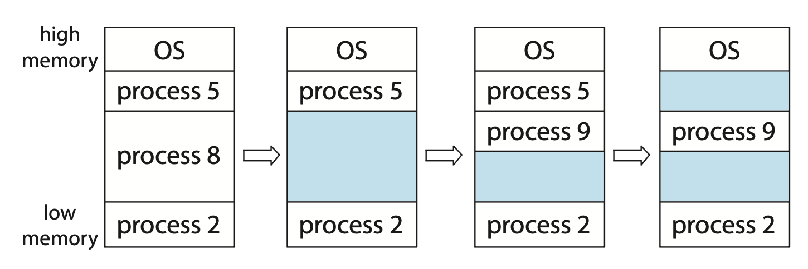
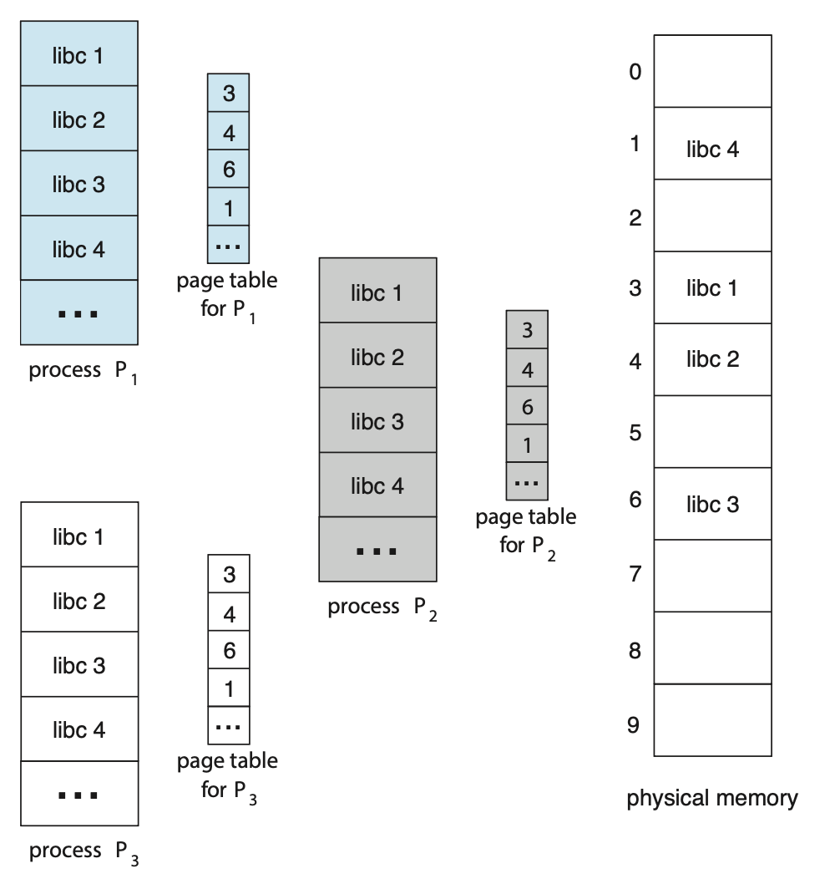
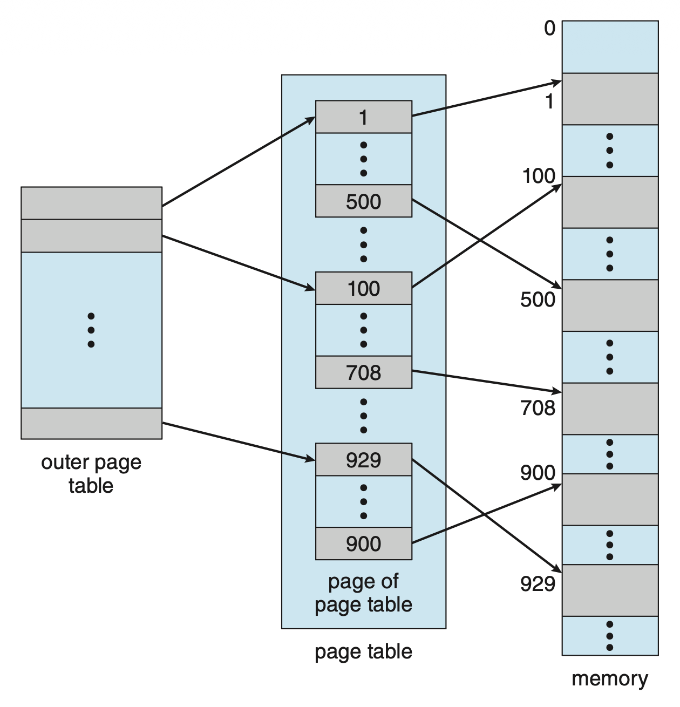
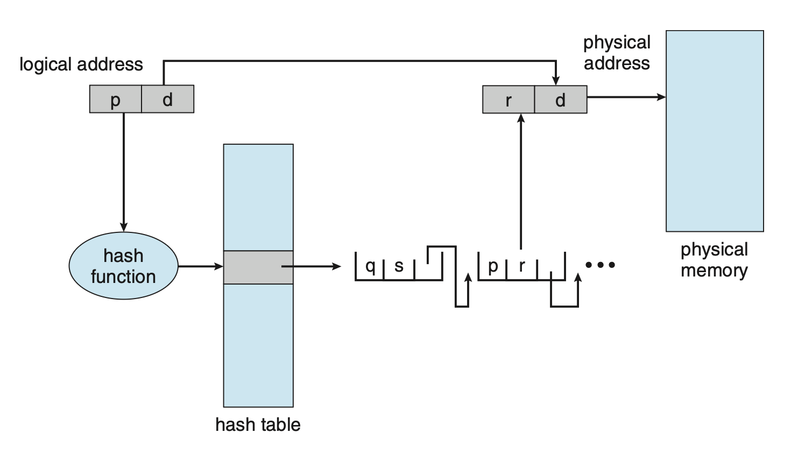
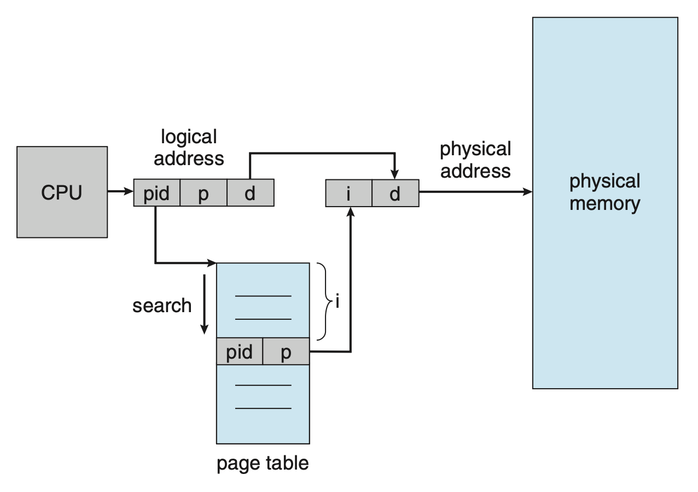
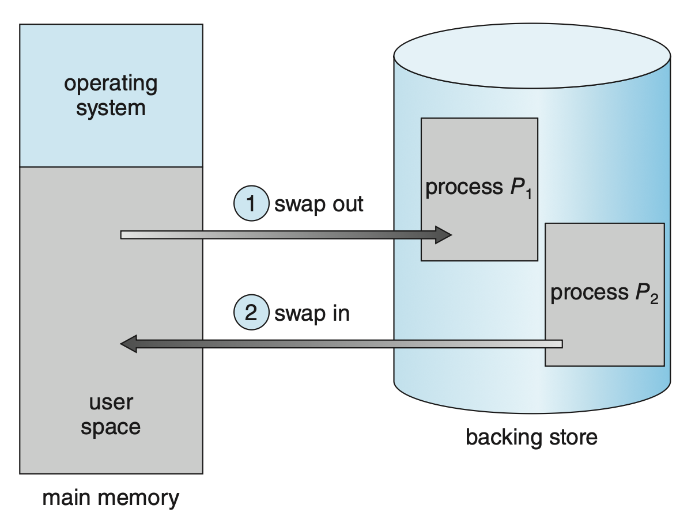

# Main Memory

??? abstract "核心知识"

    - 基本概念：
        - 基本硬件：基址寄存器 + 界限寄存器
        - 地址绑定
        - 逻辑地址 vs 物理地址
        - 动态加载和动态链接
    
    - 连续内存分配：
        - 保护：重定位寄存器 + 界限寄存器
        - 分配方案：可变分区
            - 洞
            - 动态存储分配问题：首先/最佳/最差适配
            - 外部/内部碎片
    
    - 分页
        - 基本方法：地址 = 页编号 + 页偏移量
        - 硬件：页表（位于主存）、TLB
        - 保护：保护位、有效位
    
    - 页表结构：层级/哈希/倒排页表
    - 交换：标准/分页交换

本章将介绍各种管理内存的方法，这些方法各有优缺点。挑选这些方法时需考虑多种因素，尤其是系统的硬件设计，因为多数算法需要硬件的支持。

## Background

从逻辑上看，**内存**由一个很大的字节数组构成，每个字节都有一个对应的地址。对内存单元而言，它只能看到一串内存地址流，不知道它们是如何产生的（我们也并不关心这点），以及是作为什么用途的（指令/数据）。

以下讨论将覆盖和管理内存相关的几个问题：基本硬件、虚拟地址和物理地址的绑定和两者的区别。

### Basic Hardware

内建于处理单元的**主存**(main memory)和**寄存器**(register)是 CPU 唯一能直接访问的通用目的存储设备。一般来说，访问寄存器仅需一个 CPU 时钟周期，但完成一次内存访问需要多个 CPU 时钟周期。对于后者，处理器通常会**停顿**(stall)，因为后续指令的执行需要内存数据。然而我们无法容忍这种停顿，因为这会严重损害性能。解决方法是在 CPU 和内存之间插入**高速缓存**(cache)，以实现更快的访问。

{ width=30% align=right }

除了速度外，另一个关心的问题是确保操作的正确性。这一点需要通过硬件提供的**保护**来实现，因为 OS 通常不能在 CPU 以及其内存访问之间干预。具体来说，首先要做的是保证**每个进程有单独的内存空间**，这一点可通过**基址寄存器**(base register)和**界限寄存器**(limit register)来实现，它们分别保存<u>最小的有效物理内存地址</u>和<u>内存空间的大小</u>，如右图所示。

任何在用户模式下执行的程序对 OS 内存或其他用户内存访问的尝试（即访问超出由基址寄存器和界限寄存器划定范围的区域）都会触发 OS **陷阱**，并被当作致命错误(fatal error)，从而起到对内存的保护作用。

    

基址寄存器和界限寄存器**仅能由 OS 加载**，且需要用到**特权指令**。于是，处在内核模式下的 OS 就可以不受限制地访问 OS 内存和用户内存了。

### Address Binding

源程序中的地址通常是**符号化的**(symbolic)。编译器一般会把这些**符号地址**绑定到**可重定位地址**(relocatable address)上，随后链接器或加载器会把可重定位地址绑定到**绝对地址**上。

{ width=30% align=right }

将指令和数据绑定到内存地址的操作可以从以下方式中任取其一完成：

- **编译时**(compile time)：若在编译时知道进程会在内存中，那么就会生成**绝对代码**(absolute code)；若之后进程的起始地址发生变化，就需要重新编译代码
- **加载时**(load time)：若在编译时不知道进程是否在内存中，那么编译器必须生成**可重定位代码**(relocatable code)，此时最终绑定被推迟到加载时；若之后进程的起始地址发生变化，只需重新加载代码，以纳入这个新的改变值
- **执行时**(execution time)：若进程能在执行时在内存段中移动，那么绑定必须被推迟到运行时
    - **多数 OS 采用该方法**

### Logical v.s. Physical Address Space

- CPU 生成的地址通常是**逻辑地址**(logical address)；而内存单元可见的地址，即加载到**内存地址寄存器**(memory-address register)的地址是**物理地址**(physical address)
- 若在**编译**和**加载**时绑定地址，那么逻辑地址 = 物理地址；若在执行时绑定地址，那么两者就不同了
- 对于后一种情况，此时一般称逻辑地址为**虚拟地址**(virtual address)
- 由程序产生的所有逻辑地址被称为**逻辑地址空间**(logical address space)，对应地也有**物理地址空间**(physical address space)的概念
- 从虚拟地址到物理地址的运行时映射由一个叫作**内存管理单元**(memory-management unit, **MMU**)的硬件设备完成

    

        
    

    - 此时基址寄存器被叫做**重定位寄存器**(relocation register)，它的值 R 会在用户进程生成地址时添加到每个发送到内存的地址上；假设虚拟地址范围为 [0, max]，那么对应的物理地址范围就是 [R, R + max]

        

            
        

    - 所以用户程序永远不会访问真正的物理地址，它能操纵的仅是虚拟地址

### Dynamic Loading

目前来看，进程的大小会受到物理内存的限制。要想获得更高的内存空间利用率，可以使用**动态加载**(dynamic loading)。采用该技术后，例程仅在被调用时才会被加载；所有的例程都以可重定位的加载格式被保存在磁盘中。

该技术的优点是可以仅在需要时加载例程，这对于需要用大量代码处理不常发生的情况（比如处理错误）而言非常有用，因为尽管程序很大，加载的部分会很少。并且该技术不要求 OS 给予特殊支持，不过也可能会提供一些库函数来支持动态加载。

### Dynamic Linking and Shared Libraries

**动态链接库**(dynamic linking libraries, **DLL**s)是程序运行时链接到用户程序的系统库。采用动态链接后，链接过程被推迟到执行时，从而减小可执行映像的大小。另外 DLLs 能被多个进程共享，因此主存中只需一个 DLL 实例即可。

DLLs 的概念还可以延伸到库更新中——当某个库采用新版本时，所有引用该库的程序都会自动采用新版本（若不用动态链接，则需要手动重新链接）。

不同于动态加载，动态链接需要 OS 的帮助。

??? info "注"

    一些 OS 仅支持**静态链接**(static linking)，此时系统库被视为一般的对象模块，并由加载器组合成二进制程序映像。此时每个程序在可执行映像中都包含库的副本，不仅增大体积还浪费内存。

??? note "内存管理的功能"

    >来自朋辈辅学课件

    - **内存空间的分配与回收**：由 OS 负责内存空间的分配和管理，记录内存的空闲空间、内存的分配情况，并回收已结束进程所占用的内存空间
    - **地址转换**：由于程序的逻辑地址与内存中的物理地址不可能一致，因此存储管理必须提供地址变换功能，将逻辑地址转换成相应的物理地址
    - **内存空间的扩充**：利用虚拟存储技术从逻辑上扩充内存
    - **内存共享**：允许多个进程访问内存的同一部分，例如多个协作进程可能需要访问同一块数据，因此必须支持对内存共享区域进行受控访问
    - **存储保护**：保证各个进程在各自的存储空间内运行，互不干扰

## Contiguous Memory Allocation

内存通常被划分为两部分，一块分给 OS，另一块分给用户进程。在多数 OS 中，给 **OS** 的内存一般都是**高地址**的。

在**连续内存分配**(contiguous memory allocation)中，每个进程都包含在一个单独的内存区段中，该区段与包含下一个进程的区段是连续的。

### Memory Protection

通过前面的学习，我们知道系统通过**重定位寄存器 + 界限寄存器**来阻止进程去访问不属于它的内存，这一过程如下所示：

    

当 CPU 调度器选择进程执行时，**分派器**(dispatcher)会加载重定位寄存器和界限寄存器的值，作为**上下文切换**的一部分。

这一方案能让 OS 的大小动态改变，这一灵活性在很多情况下是可取的。

### Memory Allocation

最简单的内存分配方案是**可变分区**(variable-partition)方案：

- 为进程赋予可变的内存分区，每个分区仅包含一个进程
- OS 保留一张表，记录哪部分内存可用，哪部分内存被占据
- 我们称某一大块可用内存为「**洞**」(hole)；随着内存分配的进行，内存中会出现多个洞（如下图蓝色区域）

    

当现有内存无法满足进程要求时，可以采取以下方法之一：

- **拒绝**后来的进程，并提供合适的错误消息
- 把后来的进程放在**等待队列**中；当之后内存被释放时，OS 检查等待队列，并确定当前可用内存是否满足进程需求

一般来说，可用的内存块由一组分散在内存中的变长的洞构成。

- 当某个进程到达并需要内存时，OS 就会从这些洞中找到足够大的洞
- 如果洞太大，把这个洞分为两部分，一部分给进程，另一部分仍然作为洞
- 当进程终止时，它会释放内存块，该块就会重新变为洞
- 新出现的洞会和相邻的洞合并成一个更大的洞

上述过程是一种**动态存储分配问题**(dynamic storage-allocation problem)。对于该问题，有以下可能的策略：

- **首先适配**(first fit)：分配第一个足够大的洞
- **最佳适配**(best fit)：分配能满足需求的最小的洞
- **最差适配**(worst fit)：分配最大的洞

>很难让人不想到 ADS 介绍过的 [bin packing](../../algo/ads/11.md#bin-packing) 问题。

模拟结果表明，**首先适配**和**最佳适配**在时间和存储效率上都比最差适配的表现更好。前两者的表现不分上下，但<u>首先适配通常更快</u>。

??? question "例题"

    >来自 22-23 历年卷。

    === "题目"

        某基于动态分区存储管理的计算机，其主存容量为 55MB（初始为空），采用最佳适配算法，分配和释放的顺序为：分配 15MB，分配 30MB，释放 15MB，分配 8MB，分配 6MB，此时主存中最大空闲分区的大小是

        A. 7MB

        B. 9MB

        C. 10MB

        D. 15MB

    === "解答"

        B（挺简单的，自己画图尝试一下）

### Fragmentation

首先适配和最佳适配都会遇到**外部碎片**(external fragmentation)的问题：

- 当在内存中加载和移除进程时，空闲的内存空间就会被分割成多个小块
- 外部碎片发生在当总的内存空间大小足够满足进程需求，但是这个可用的空间不连续（被划分为多个小洞）的时候
- 另一个影响外部碎片量的因素是空闲块的哪一端会被分配
- 外部碎片问题可大可小，取决于总的内存存储量以及平均进程大小
- 统计数据表明，对于首先适配，即便采用一些优化手段，给定 N 个分配块，有 0.5 N 的块因碎片而丢失，这一性质称为 **50% 法则**(50-percent rule)

对于外部碎片问题，我们有以下解决方案：

- **压缩**(compactation)
    - 目标是打乱内存内容，好把所有空闲内存放在同一个大块中
    - 但这一方法并不总是有效——如果重定位是静态的，且在汇编或加载时就完成的话，就没法完成压缩了
    - 也就是说只有**在重定位是动态的，且在执行时完成**的条件下才能使用压缩技术
    - 最简单的压缩算法是将所有进程移动到内存的一端，所有的洞移动到另一端，但**成本高昂**
- **分页**(paging)
    - **允许进程的物理地址空间不连续**，所以只要当内存可用时，就能为新来的进程分配物理内存
    - 需要 OS 和计算机硬件协作来实现分页
    - 该方法是最常用的内存管理技术，下面将会展开介绍！

---
内存碎片还可发生在内部。一般会将物理内存分割为固定大小的块，然后以块大小为单位分配内存。这么做会导致被分配给进程的内存略大于需要的内存，这些未使用的内存就对应**内部碎片**(internal fragementation)的问题。

??? note "分段(segmentation)"

    >由 Gemini 3 Pro 生成，作为补充材料。

    - 根据程序的逻辑单位（如代码段、数据段、栈段等）来进行内存分配的
    - 因为每个段的长度是不固定的，系统会根据该段实际需要的大小，在内存中寻找一块刚好够用的连续区域分配给它
    - 这种“按需分配”的方式确保了被分配的内存空间刚好填满，不会在段的内部留下无用的空闲空间，因此它**没有内部碎片**
    - 但它在不同的段之间产生无法利用的小空闲区，即**外部碎片**

## Paging

### Basic Method

实现分页的基本方法是将物理内存分割成叫作「**帧**」(frame)的定长块，将逻辑内存分割成叫作「**页**」(page)的定长块。

- 当进程执行时，对应的逻辑页会被加载到任意可用的内存帧中
- 后备存储同样被划分为定长的，和内存帧大小相同的块

逻辑地址被划分为两部分：

- **页编号**(page number) p：作为每个进程的**页表**(page table)的索引
    - 页表包含每个帧在物理内存中的基址

    

        
    

- **页偏移量**(page offset) d：所引用帧中的位置

分页模型如下：

    

MMU 将逻辑地址转换为物理地址的步骤：

1. 提取页编号 p，使用它作为页表的索引
2. 从页表中提取对应的帧编号 f
3. 用 f 替换逻辑地址中的 p

>可以看到偏移量 d 未发生改变。

**页大小**(page size)由硬件定义，通常是 2 的幂，大概在 4 KB 到 1 GB 不等，取决于具体的计算机架构。之所以取 2 的幂，是因为这便于将逻辑地址转换为页编号和页偏移量。假如逻辑地址空间大小为 2^m^，页大小为 2^n^ 字节，那么地址的高 m - n 位就被指定为页编号，而低 n 位就是页偏移量。

也许读者发现分页本身就是一种**动态重定位**(dynamic relocation)：每个逻辑地址都由分页硬件绑定到某个物理地址上，这和使用基址（或重定位）寄存器的内存帧类似。

使用分页方案可避免外部碎片，但**内部碎片**问题仍然可能会发生。若进程大小和页大小无关，那么平均情况下每个进程会有一半的页存在内部碎片。这表明更小的页大小可能减小该问题的影响，但同时会引入额外的开销。而且更大的页更有助于磁盘的 I/O 等任务。所以现代计算机中，常见的页大小为 4 KB 和 8 KB；并且一些 CPU 和系统支持多种页大小。

进程的每个页都需要一个帧，所以若进程要求有 n 个页，那么内存中至少有 n 个可用的帧，如下所示：

    

分页技术能让程序员看待内存的视角和与实际物理内存之间有明确的分离：

- 程序员将内存视为一个仅包含某个程序的单一空间
- 实际上用户程序散布在整个物理内存中

而建立起这两种理解的桥梁是用于地址转换的硬件。

由于 OS 管理物理内存，所以必须注意物理内存的分配信息，而这些信息被保存在一张叫作**帧表**(frame table)的简单的系统级数据结构中。帧表的每一项对应一个物理帧，表示其空闲或分配状态，以及被分配给的进程信息（若被分配的话）。

OS 会维护每个进程的页表的副本，用于将逻辑地址转换为物理地址。页表也会被 CPU 分派器用于定义硬件页表，因而分页导致上下文切换时间的增加。

### Hardware Support

由于页表是预处理的数据结构，指向页表的指针被存储在位于 PCB 的寄存器中。

页表的硬件实现方式多样。最简单的一种是用一组**专用的高速硬件寄存器**(dedicated high-speed hardware registers)来实现页表，这使得地址转换变得很高效。然而这么做会**增加上下文切换时间**，因为每个寄存器在上下文切换时都要发生交换（存储 + 恢复）。若页表足够小的话，该方法还是不错的；但是现代 CPU 都支持大得多的页表，所以对这些机器采用该方法就不太合理了。

实际上，页表一般存储在**主存**中，并用一个指向页表的**页表基址寄存器**(page-table base register, PTBR)。切换页表时只需改变这个寄存器，因此大幅度减小对上下文切换时间的影响。

然而，我们知道访问内存需要花费不少时间；而且采用分页机制后，每次访问数据就需要**两次内存访问**（访问页表 + 访问物理内存）。标准的解决方案是引入一种特殊的、用于快速查找的小缓存，称为**转换旁路缓冲区**(translation look-aside buffer, **TLB**)。

- TLB 项查找是现代硬件流水线的一部分，因而不会带来额外的性能损失
- 为了在流水线内实现查找，TLB 必须足够小
- 一些 CPUs 会将数据地址和指令地址的 TLB 分开实现，从而加倍可用的 TLB 项
- 现在的 CPUs 已经有多级的 TLBs
- TLB 仅包含少量页表项；当 CPU 生成逻辑地址时，MMU 会检查页编号是否存在于 TLB 中
    - 若找到了，帧编号立马可用于内存访问
    - 若没找到（即 **TLB 失效**(miss)），就需要按之前介绍的那样进行地址转换，另外还要将页编号和帧编号添加到 TLB 上，便于下次引用

    

- 若 TLB 已满，那就必须挑一个项被替换，替换策略可以是 LRU、RR 或随机替换
- 一些 TLB 允许某些项被**固定**(wired down)，即无法从 TLB 中移除；关键内核代码的 TLB 项属于这一类
- 一些 TLB 会为每个项存储**地址空间标识符**(address-space identifiers, **ASID**s)，每个 ASID 用于**唯一识别一个进程**，并用来提供对该进程的地址空间保护
    - 当 TLB 尝试解析虚拟页编号时，它需要确保当前运行进程的 ASID 和关联到虚拟页上的 ASID 匹配起来，若不匹配就会出现 TLB 失效
    - ASID 使得 TLB 能**同时包含来自不同进程的页表项**
    - 若 TLB 不支持 ASID，那么每次选择一个新页表时，TLB 内容必须被**清除**(flushed)，确保下一个执行的进程不会使用错误的转换信息

- **命中率**(hit ratio)
- **有效内存访问时间**(effctive memory-access time) = hit ratio * ma + (1 - hit ratio) * 2 * ma

!!! note "加速地址转化的技术"

    - TLB
    - 将页表永久保留在内存中：完全避免了在查表过程中发生的页错误中断，从而消除了最坏情况下的巨大延迟，因而加快了地址转换的速度

### Protection

在采用分页机制的内存中，通过为每个帧设置一个**保护位**(protection bits)来实现保护；通常这些位放在页表中。这个位可定义页的读写状态为**读-写**(read-write)或**只读**(read-only)。若尝试向只读页写入，就会引发硬件陷阱。

另外我们可以设置一个**有效位**(valid-invalid bit)：

- 当该位设置为**有效**(valid)时，关联页位于进程的逻辑地址空间，因而是有效的页
- 当该位设置为**无效**(invalid)时，关联页不在进程的逻辑地址空间

下图展示了有效位的应用：

    

使用有效位有时会出现**内部碎片**问题。

很少有进程会使用全部的地址范围，大多数时候只要少部分地址可用即可。在这种情况下，为每个页创建页表是比较浪费的，所以一些系统支持一种叫做**页表长度寄存器**(page-table length register, PTLR)的硬件来表示页表大小，用于检查每个逻辑地址，以验证该地址是否在进程的有效范围内。

### Shared Pages

分页的一个优势是让共享公共代码成为可能，这在多进程环境下尤为重要。以 Linux 系统为例，多数用户进程要求使用标准 C 库 `libc`。

- 如果每个进程加载 `libc` 的副本到自己的地址空间中，那么当进程数一多，这些副本就会占据很大一块内存空间
- 但如果代码是**可重入的**(reentrant)，就可以被共享，如下所示：

    

        
    

    - 可以看到，三个进程共享 `libc` 对应的页
    - 可重入代码是不可自修改的(non-self-modifying)代码，即在执行时不会改变，所以多个进程可同时执行这段代码
  
除了像 `libc` 这样的运行时库，其他重度使用的程序也可被共享，比如编译器、窗口系统、数据库系统等。

## Structure of Page Table

本节将探索最常用的一些组织页表结构的方法。

### Hierarchical Paging

大多数现代计算机支持很大的逻辑地址空间，因而页表会非常非常大，所以不能直接将页表连续分配到内存中。一种简单的解决方案是把页表划分为更小的块（假设页大小为 4 KB（对应 12 位页偏移量））。

- 假设逻辑地址有 32 位长，我们把原本高 20 位的页编号划分为两部分 p~1~ 和 p~2~，分别表示**外层**(outer)页表和**内层**(inner)页表，每部分各 10 位（两级页表）
- 此时的页表结构如下所示：

    

        
    

- 地址转换如下：

    

        
    

    - 由于地址转换从外向内，因而这种方案又称为**前向映射页表**(forward-mapped page table)

- 但对 64 位逻辑地址而言，如果页大小还是 4KB，那么原有的页编号长度为 52 位；因此仅将页编号划分成两部分的话，页表可能还是会占用很大空间，所以需要进一步划分（比如三级/四级...）
    - 但这么做会让页表结构变得很复杂，这就是为什么 64 位架构中，这种**分层页表**(hierarchical page table)通常是不合适的

???+ question "题目"

    === "问题 1"

        === "题目"

            某计算机采用二级页表的分页存储管理方式，按字节编址，页大小为 2^10^ 字节，页表项大小为 2 字节，逻辑地址结构为：

            

            |页目录号|页号|页内偏移量|
            |:-:|:-:|:-:|

            

            逻辑地址空间大小为 2^16^ 页，则表示整个逻辑地址空间的页目录表中包含表项的个数至少是：

            A. 64 &emsp; &emsp; B. 128 &emsp; &emsp; C. 256 &emsp; &emsp; D. 512

        === "解答"

            - 一个页表本身本身就要一个页的大小，即 2^10^ 字节
            - 那么页表项至多为 2^10^ / 2 = 512 项
            - 一共有 2^16^ 页，那么每个页目录项包含的表项数就是 2^16^ / 2^9^ = 2^7^ = 128 项，所以选 B

### Hashed Page Tables

一种替代方案是使用**哈希页表**(hashed page table)。

- 用哈希值表示虚拟页编号
- 哈希表的每一项包含了一个链表，同一链表中各元素的哈希值相同
- 每个元素包含 3 个字段：虚拟页编号、映射页帧的值、指向链表中下一个元素的指针

算法的大致思路是：

- 虚拟地址中的虚拟页编号被哈希到哈希表上
- 虚拟页编号与链表中第一个元素的第一个字段进行比较
    - 若匹配，则对应的页帧（第二个字段）用于组成预期的物理地址
    - 若不匹配，则去搜索链表内后面的元素

    

哈希页表的一种变体叫作**集群页表**(cluster page table)。它和哈希页表类似，只是哈希表的每一项指代多个页而不是单个页。当地址空间比较**稀疏**(sparse)（内存引用不连续，分散在地址空间中）时，这种结构就很有用。

### Inverted Page Tables

页表的一个缺点是可能包含成千上万的项，因此仅为了追踪其他物理内存的使用信息就需要占据很大的物理内存。为解决这个问题，我们引入了**倒排页表**(inverted page table)。

    

- 倒排页表的每一项对应每个内存的真实页（或帧），由位于实际内存位置的页的虚拟地址组成，并拥有该页的进程信息
- 因此**整个系统中只有一张页表**，并且对于每个物理内存页只有一个项
- 倒排页表通常需要一个**地址空间标识符**（ASID），存储在页表的每一项内，以确保特定进程的逻辑地址被映射到对应的物理页帧上
- 尽管该方案减少了存储每个页表所需的内存量，但它增加了页引用发生时查找页表所需的时间，因为倒排页表按物理地址排序，但查找发生在虚拟地址上
    - 为缓解这一问题，可以使用一个**哈希表**，将搜索限制在一个或少数页表项上
    - 但每访问一次哈希表就会增加一次额外的内存引用

- 当存在**共享内存**时就**不能**用倒排页表了，因为一个物理页无法对应多个共享的虚拟地址

## Swapping

进程（或一部分进程）可从内存临时被**交换**(swap)到**后备存储**(backing store)中，之后可再次回到内存并继续执行，如下所示：

    

交换技术能够让所有进程的地址空间超过实际物理内存大小成为可能，从而能够加多道程序设计的程度。

### Standard Swapping

- 标准的交换操作使得完整的进程能在主存和后备存储之间移动
- 其中后备存储必须足够大，能够容纳需要被存储和检索的整个进程，且必须提供对内存的直接访问
- 当进程或其中某部分被交换到后备存储时，和进程关联的数据结构必须被写到后备存储中
    - 对于多线程进程，每个线程的数据结构也必须参与交换
- OS 必须维护被交换出去的进程的元数据，从而在这些进程回到内存时恢复上下文信息
- 该方法的优点是能够超额使用物理内存，使得系统能够容纳比实际物理内存更多的进程
- 空闲或多数时候空闲的进程很适合被交换到后备存储中

### Swapping with Paging

- 在当代的 OS 中，上述标准交换很少被使用，因为把整个进程在内存和后备存储中移来移去的时间成本太高了
- 所以多数系统采用一种变体方法，即**按页交换进程**
- 实际上，我们通常用「交换」指代标准交换，用「**分页**」指代“带分页的交换”
- **页出**(page out)操作将页从内存移动到后备存储，相反的过程称为**页入**(page in)

    

