# Introduction

??? abstract "核心知识"

    无，本章只需了解一下编译器的各个模块，具体介绍请见后续各章内容。

## What, Why and How?

**编译器**(compiler)：一类将一种语言翻译成另一种语言的程序。

>它是一种复杂程序，由数万乃至数百万行的代码构成（比如我们熟知的 `gcc` 就有 7.5M 行代码）。

<div style="text-align: center">
    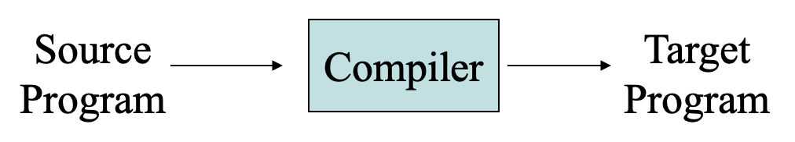
</div>

??? question "为什么要学编译器？"

    - 学习层面：
        - 增加表达能力
        - 提升对程序行为的理解
        - 提升学习新语言的能力
        - 学会构建大型且可靠的系统
        - 理解基本的 CS 概念是如何运作的
    
    - 应用层面：
        - 编译器几乎用于所有形式的计算
        - 其原理和技术适用于许多其他领域，比如命令解释器和接口程序等
        - 编译器构造涉及其他领域，包括：
            - 理论计算机科学（自动机、定点迭代）
            - 编程语言（类型系统、形式语义）
            - 机器架构（内存管理、指令集）
            - 算法（树/图遍历、动态规划）

>编写编译器的原理和技术具有普遍意义，以至于每个计算机科学家的研究生涯中都会反复用到该原理和技术。
<div align=right markdown>
>—— Alfred V. Aho
</div>

??? info "编译器发展简史"

    - 编译器历史
        
        - 1943 年：Plankalkül，第一个高级语言（康拉德·祖塞）
        - 1951 年：Formules，第一个自宿主编译器
        - 1952 年：A-0，术语“编译器”（格蕾丝·霍珀）
        - 1957 年：FORTRAN，第一个商业编译器（自动化编码系统）（约翰·巴克斯；18 PY）
                    
            <div style="text-align: center">
                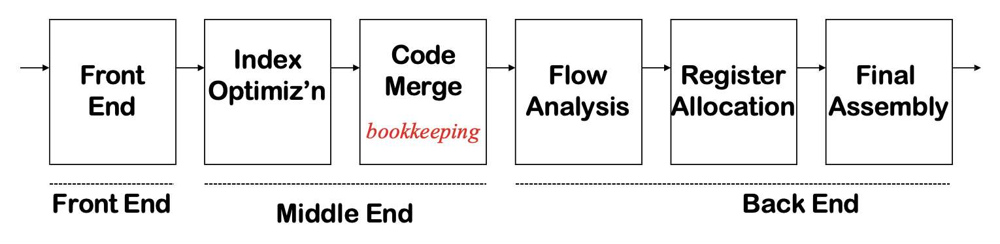
            </div>

            - 六次循环，顺序固定
            - 生成良好代码
                - 假设索引寄存器无限
                - 循环外代码移动，包含 `if` 和 `goto` 语句执行了流分析和寄存器分配
        
        - 1962 年：Lisp，自宿主编译器和 GC（蒂姆·哈特和迈克·莱文）
        - 1969 年：IBM 的 FORTRAN H Compiler

            <div style="text-align: center">
                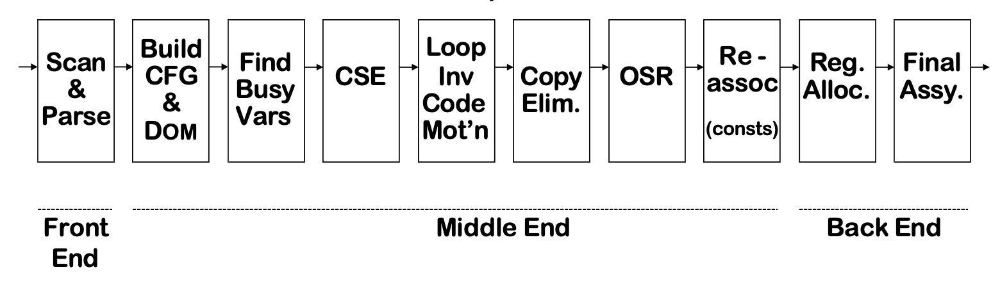
            </div>       

            - 使用低级 IR（四元组），识别具有支配者的循环
            - 专注于优化循环（“从内到外”顺序）
                - 出现了类似于现代编译器的阶段

            - 用于 IBM 370 的简单前端和后端

        - 1980 年：IBM’s PL.8 Compiler
            
            <div style="text-align: center">
                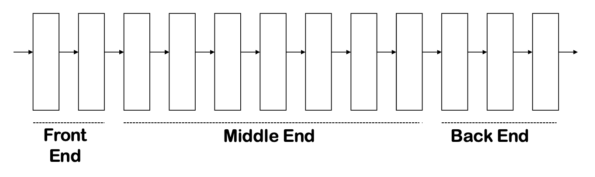
            </div>  
            
            - 许多通道，一个前端，多个后端
            - 收集 10 个或更多的通道
                - 重复一些通道和分析
                - 在两个层次上表示复杂操作
                - 低于机器级别的 IR

        - 1999 年：SUIF 编译器系统

            <div style="text-align: center">
                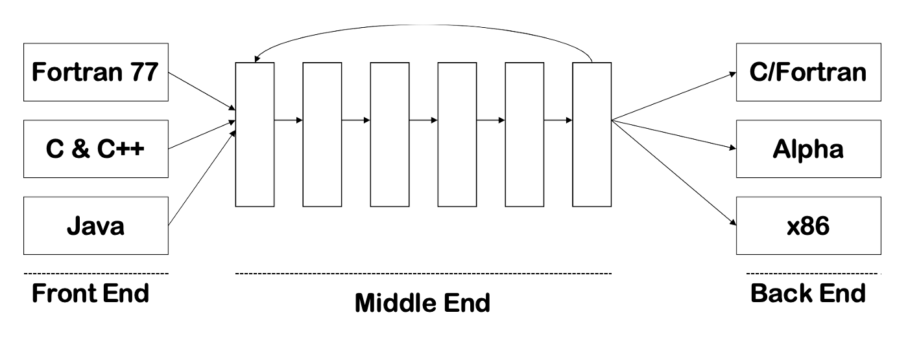
            </div>       

            - 3 个前端，3 个后端
            - 18 个阶段，可配置顺序
            - 两级 IR（高/低SUIF）
            - 作为研究基础设施

    - 现代编译器
        - 现代编译器非常复杂（`gcc` 有 750 万行代码）
        - 编译器研究仍然很多（LLVM，验证编译...）
        - 工业界仍在进行大量的编译器开发


## Typical Workflow of a Compiler

下图展示了编译器完整的工作流程：

<div style="text-align: center">
    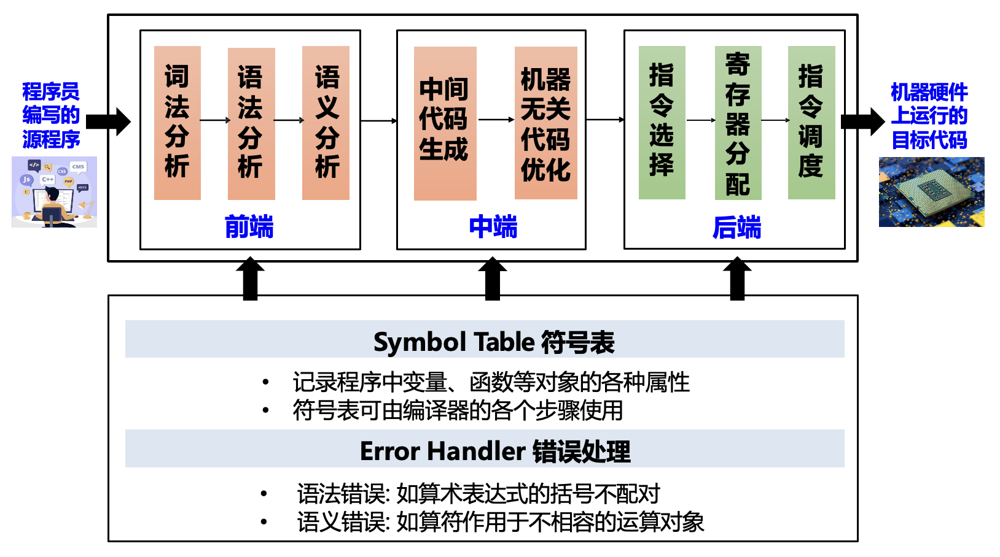
</div>

两个重要概念：

- **阶段**(phases)：在不同的抽象「语言」上运行的单个或多个模块
- **接口**(interfaces)：编译器模块之间交换的信息

之所以将编译器划分为多个阶段，是为了：

- 便于理解和实现
- 使组件**可复用**（因为我们有改变源语言或目标语言的需求）

下面以一个简单的字符串 `x = a * 2 + b * (x * 3)` 为例带读者过一遍编译器各阶段的内容：

- **词法分析**(lexing / scanning / lexical analysis)：将程序字符流分解为**词元**(token)序列
    
    >虽然「词元」一词是官方为 NLP 领域的 token 给出的译名，但个人感觉编译原理中的 token 也可以这么叫（~~总比我之前翻译的「记号」看着顺眼些吧~~）

    <div style="text-align: center">
        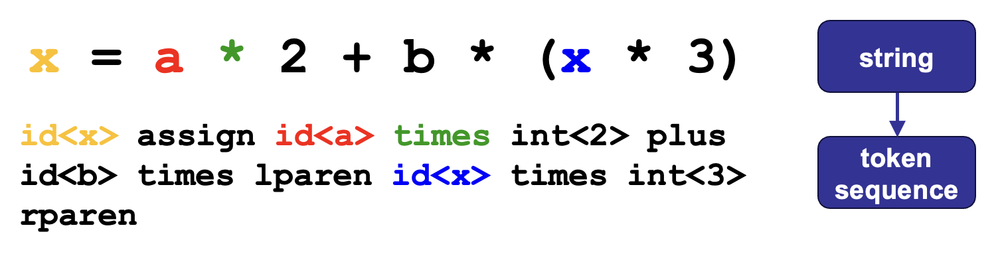
    </div>
    
    - 删除字符串中不必要的部分（如空格）
    - 通常使用**正则表达式**匹配（**DFA** 定义）

- **语法分析**(parsing / syntactic Analysis)：将词元序列解析为语法结构
    
    <div style="text-align: center">
        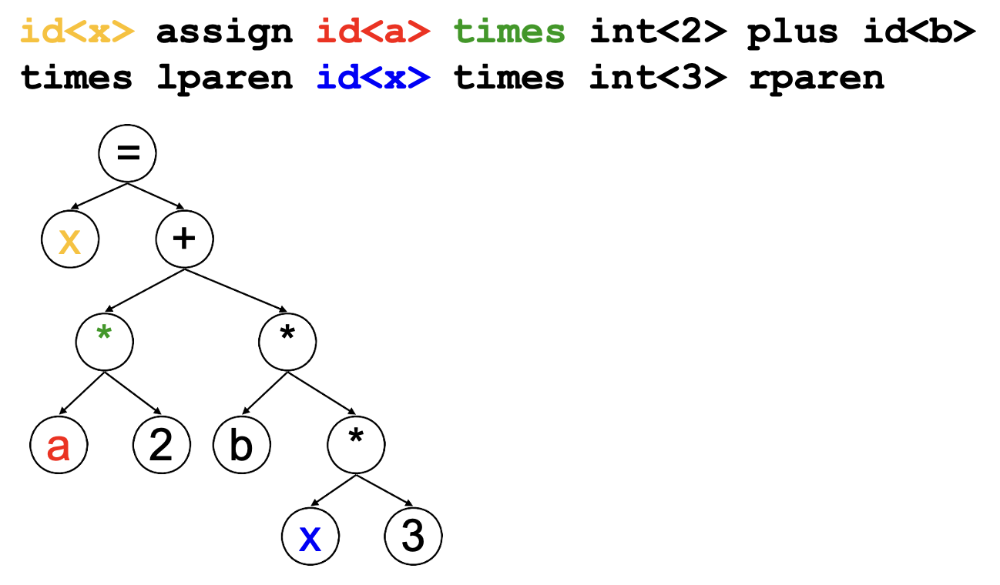
    </div>
    
    - 去除不必要的词元（例如括号）
    - 一般使用**抽象语法树**（**AST**）定义

- **语义分析**(semantic analysis)：利用属性文法、符号表等决定语法结构的含义；对于本例，需要弄清：
    
    <div style="text-align: center">
        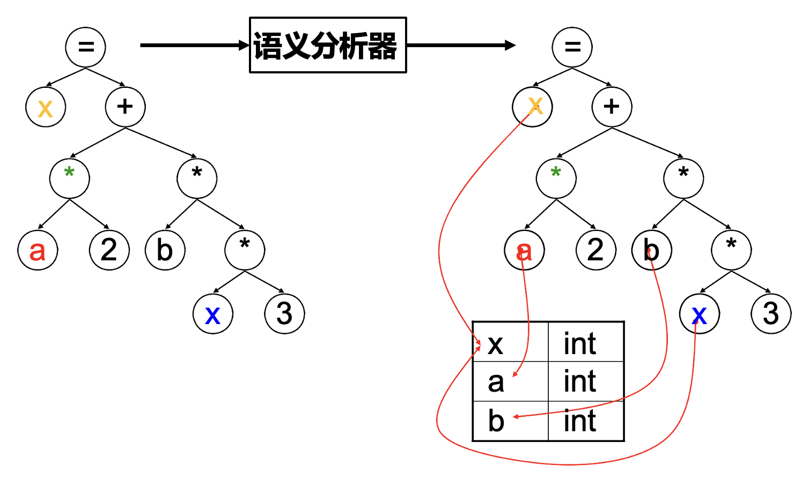
    </div>
    
    - 变量 `x`, `a`, `b` 的类型是什么？
    - 运算符 `*` 和 `+` 的含义是什么？
    - 读写变量 `x` 是合法的吗？
    
- **中间代码生成**
    - **中间代码**/**表示**（IR）: 源语言与目标语言之间的桥梁
    
    <div style="text-align: center">
        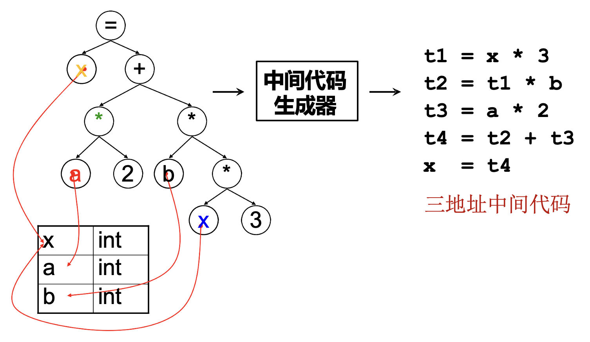
    </div>

- **优化**（基于中间表示）：基于中间表示进行**分析**与**变换**，以降低执行时间，减少资源消耗等

    <div style="text-align: center">
        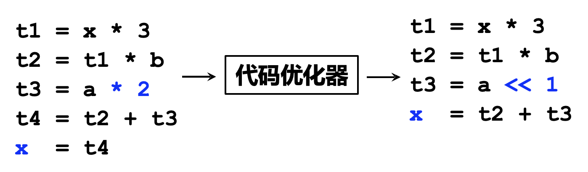
    </div>

- **目标代码生成**：把中间表示形式翻译到**目标语言**，涉及到指令选择、寄存器分配、指令调度等阶段

    <div style="text-align: center">
        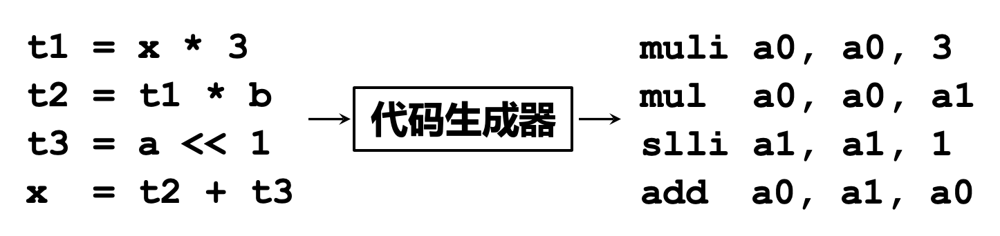
    </div>


## Modules and Interfaces in Tiger

虎书中介绍的 Tiger 编译器的流程如下图所示：

<div style="text-align: center">
    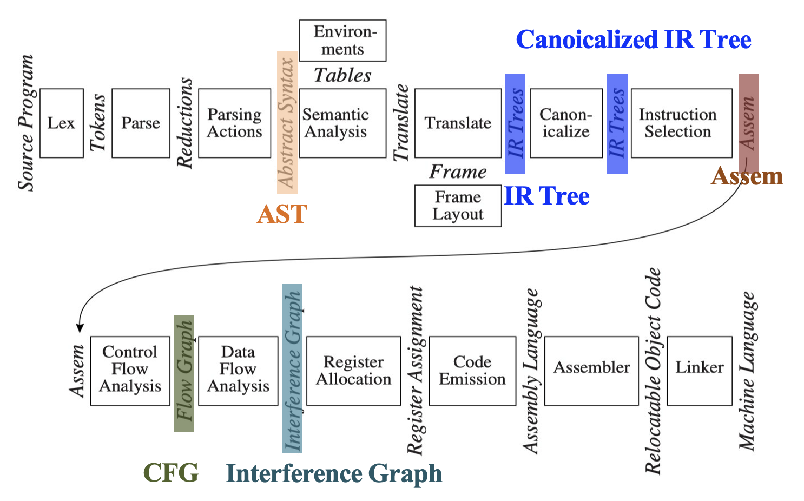
</div>

图中标注的关键部分：

- **AST**（抽象语法树）：语法分析 + 解析动作(parsing actions)生成
- **IR 树**: 语义分析后按一定规则生成（树型中间表示）
- **规范化**(canonicalized) IR 树：方便生成汇编
- **Assem**: 指令选择器生成（一种特殊的抽象汇编）
- **CFG**（控制流图(control flow graph)）：方便进行数据流分析，比如**活跃性分析**(liveness analysis)等
- **冲突图**(interference graph)：由活跃变量分析结果构造，用于指导寄存器分配

编译器各阶段的描述（及对应章节编号）：

| 章节 | 阶段 | 描述 |
| :--- | :--- | :--- |
| 2 | 词法分析(lex) | 将**源文件**分解成独立的词汇，即**词元**(tokens) |
| 3 | 语法分析(parse) | **分析**程序的**短语结构** |
| 4 | 语义动作(parsing actions) | 构建与**每个短语**相对应的**抽象语法树**节点 |
| 5 | 语义分析(semantic analysis) | **确定**每个短语的**含义**，**关联变量**的使用与其**定义**，**检查**表达式的**类型**，**请求**每个短语的**翻译** |
| 6 | 栈帧布局(frame layout) | 以机器相关的方式将变量、函数参数等放入**活动记录（栈帧）**中 |
| 7 | 翻译(translate) | 生成**中间表示树**(IR trees)，**不绑定**于任何特定的源语言或目标机器架构 |
| 8 | 规范化(canonicalize) | **将副作用从表达式中移出**(hoist)，**清理条件分支**以方便后续阶段的处理 |
| 9 | 指令选择(instruction selection) | **将 IR 树节点分组为团块**(clumps)，使其对应于目标机器指令的动作 |
| 10 | 控制流分析(control flow analysis) | 将指令序列分析为**控制流图**，展示程序执行时所有可能的控制流走向 |
| 10 | 数据流分析(dataflow analysis) | **收集**关于程序变量**信息流的信息**，例如，**活跃性分析**(liveness analysis)计算每个程序变量持有仍需使用的值（即变量是“活跃”的）的位置 |
| 11 | 寄存器分配(register allocation) | **为**程序使用的**每个变量和临时值选择一个寄存器**；不同时活跃的变量可以共享同一个寄存器 |
| 12 | 代码生成(code emission) | 将每条机器指令中的**临时名称替换**为**机器寄存器** |

!!! note "**模块化**(modularization)"

    - 多个模块可以合并为一个阶段，比如解析、语义分析、翻译、标准化可以合并起来
    - 指令选择可以与代码生成合并
    - 简单的编译器可能省略控制流分析、数据流分析和寄存器分配阶段

!!! note "**接口**(interfaces)"

    - 数据结构：抽象语法、IR 树和汇编
    - 一组函数：翻译接口
        - 由解析器调用的函数：词元接口


## Tools and Software

两种最有用的抽象：

- 用于词法分析的**正则表达式**
- 用于语法分析的**上下文无关文法**

两种编译工具：

- Lex 将声明性规范转换为词法分析程序
- Yacc 将文法转换为语法分析程序

>书中的编程项目可以使用任何符合 ANSI 标准的 C 编译器编译，同时使用 Lex 和 Yacc。


## Data Structures for Tree Languages

**中间表示**(intermediate representation, **IR**)是编译程序的一种形式。主流形式是树形表示，有着不同属性的多个节点类型，用类似编程语言的语法描述。书中假想了一套如下所示的简单编程语言的语法：

<div align=center markdown>
| 语法 | 含义 |
| :--- | :--- |
| $Stm \rightarrow Stm; Stm$ | CompoundStm |
| $Stm \rightarrow \text{id} := Exp$ | AssignStm |
| $Stm \rightarrow \text{print} (ExpList)$ | PrintStm |
| $Exp \rightarrow \text{id}$ | IdExp |
| $Exp \rightarrow \text{num}$ | NumExp |
| $Exp \rightarrow Exp \text{ Binop } Exp$ | OpExp |
| $Exp \rightarrow (Stm, Exp)$ | EseqExp |
| $ExpList \rightarrow Exp, ExpList$ | PairExpList |
| $ExpList \rightarrow Exp$ | LastExpList |
| $Binop \rightarrow +$ | Plus |
| $Binop \rightarrow -$ | Minus |
| $Binop \rightarrow \times$ | Times |
| $Binop \rightarrow /$ | Div |
</div>

一些解释：

- Stm：语句
- Exp：表达式
- s1; s2：先执行语句 s1，后执行语句 s2
- i := e：先对 e 求值，然后将结果存储到变量 i 上
- print(e1, e2, ..., en)：显示所有表达式的值，从左到右计算，以空格分隔，以换行符结束
- id：产生变量 id 的当前内容
- e1 op e2：先对 e1 求值，再对 e2 求值，然后作用给定的二元运算符
- (s, e)：类似 C 语言的逗号运算符，在对表达式 e 求值之前，先对语句 s 求值以获取副作用

???+ example "例子"

    === "问题"

        执行以下程序：

        ```
        a := 5+3; b := (print(a, a-1), 10*a); print(b)
        ```

        输出内容为：

        ```
        8 7
        80
        ```

        如何在编译器中表达这段程序？

    === "解答"

        <div style="text-align: center">
            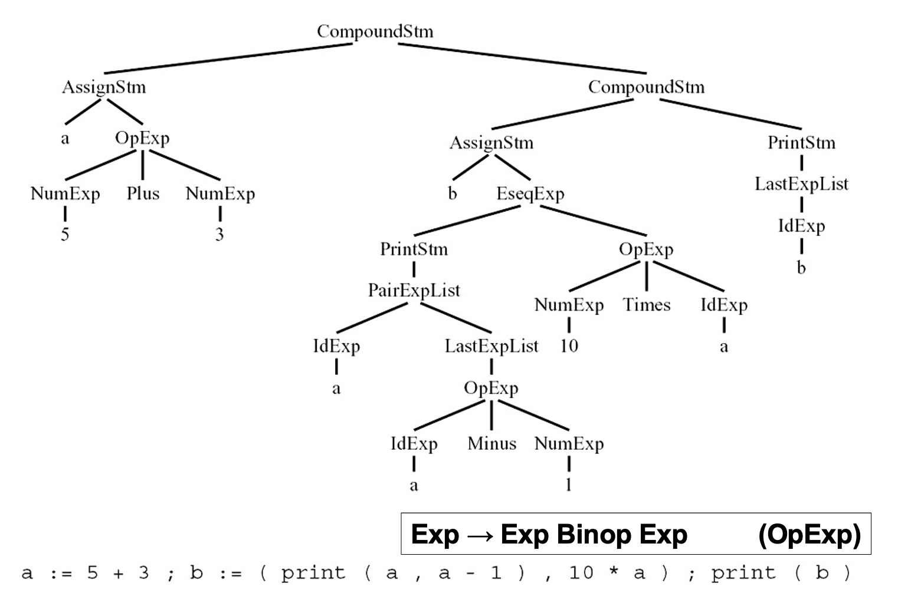
        </div>

每个**语法符号**(grammar symbol)都能对应数据结构中的**类型定义**(typedef)，比如：

<div align=center markdown>
| 语法 | 类型定义 |
| :--- | :--- |
| $Stm$ | `A-stm` |
| $Exp$ | `A-exp` |
| $ExpList$ | `A-expList` |
| $id$ | `string` |
| $num$ | `int` |
</div>

???+ example "比较语法和数据结构定义"

    ```c linenums="1"
    typedef char *string;
    typedef struct A_stm_ *A_stm;
    typedef struct A_exp_ *A_exp;
    typedef struct A_expList_ *A_expList;

    struct A_stm_ {
        enum {A_compoundStm, A_assignStm, A_printStm} kind;
        union {
            struct {A_stm stm1, stm2;} compound;
            struct {string id; A_exp exp;} assign;
            struct {A_expList exps;} print;
        } u;
    };

    A_stm A_CompoundStm(A_stm stm1, A_stm stm2);
    A_stm A_AssignStm(string id, A_exp exp);
    A_stm A_PrintStm(A_expList exps);
    ```

语法规则：

- 构造器(constructor)：属于其左侧符号的联合
- 构造器名称：在右侧指示（**括号内**）
- 右侧组件：在数据结构中表示
    - `CompoundStm` 在右侧有两个 $Stm$：$Stm \rightarrow Stm; Stm$
    - `AssignStm` 有一个标识符和一个表达式：$id := Exp$

- **每个语法符号**的结构体包含了：
    - 一个用于承载这些值的**联合**，以及
    - 一个用于指示哪个联合变体是有效的**种类字段**

- 构造函数
    - 内存分配和初始化数据结构
    - 比如 `CompoundStm`, `AssignStm` 等

    ```c
    A_stm A_CompoundStm(A_stm stm1, A_stm stm2) {
        A_stm s = checked_malloc(sizeof(*s));
        s->kind = A_compoundStm;
        s->u.compound.stm1 = stm1;
        s->u.compound.stm2 = stm2;
        return s;
    }
    ```

- $Binop$ 变得更简单了：$Binop \rightarrow + | - | \times | /$
- 构建 $Binop$ 结构体：

    ```c
    struct A_binop {
        enum {A_plus, A_minus, A_times, A_div} kind;
    }
    ```

    但实际上不会包含数据，因此改写为：

    ```c
    typedef enum {A_plus, A_minus, A_times, A_div} A_binop;
    ```

!!! note "用 C 语言表示树形数据结构的约定"

    - 树由语法描述
    - 一棵树**由一个或多个 typedef 描述**，每个对应于语法中的一个符号
    - 每个 typedef 定义了一个指向相应结构体的指针
        - **以下划线结尾**的结构体名称除了在 typedef 的声明和结构体本身的定义中外，其他地方从不使用

            ```c
            typedef char *string;
            typedef struct A_stm_ *A_stm;
            typedef struct A_exp_ *A_exp;
            typedef struct A_expList_ *A_expList;
            ```

    - 每个结构体包含一个 **`kind` 字段**
        - `#!c enum` 变量用来显示不同变体，每种语法规则各有一个，还有一个表示联合的 `u` 字段

    - 在规则的右侧**有不止一个非平凡（值变化）符号**（例如：`CompoundStm` 规则），
        - 该联合具有一个组件，**该组件本身是由这些值组成的结构体**（例如：`A_stm` 联合的复合元素）

            ```c
            struct A_stm_ {
            enum {A_compoundStm, A_assignStm, A_printStm} kind; 
            union {
                struct {A_stm stm1, stm2;} compound; 
                struct {string id; A_exp exp;} assign; 
                struct {A_expList exps;} print;
            } u;
            }; 
            ```

    - 规则右侧**只有一个非平凡符号**
        - 联合中的一个字段是它的值（例如：`A_exp` 并集中的 `num` 字段）

    - 每个类都将有一个**构造函数**，用于初始化所有字段
        - `malloc` 函数不得直接调用，除非位于构造函数中

        ```c
        A_stm A_CompoundStm(A_stm stm1, A_stm stm2) { 
            A_stm s = checked_malloc(sizeof(*s));
            s->kind = A_compoundStm;
            s->u.compound.stm1=stm1; 
            s->u.compound.stm2=stm2;
            return s;
        }
        ```

    - 每个模块（头文件）应具有**该模块唯一的前缀**（例如上面这些程序中的 `A_`）
    - typedef 名称（在前缀之后）应以**小写字母**开头；构造函数（在前缀之后）应以**大写字母**开头；枚举原子（在前缀之后）应以小写字母开头；而联合变体（没有前缀）应以小写字母开头

!!! note "C 程序的模块化原则"

    >仔细关注模块和接口可防止编译程序中的混乱。

    - 编译器的每个阶段或模块都应属于其自己的 `.c` 文件，并有一个相应的 `.h` 文件
    - 每个模块应具有该模块的**唯一前缀**；模块导出的所有全局名称应以该前缀开头
    - **所有函数都应具有原型**(prototype)；C 编译器应被告知对没有原型的函数使用发出警告
    - 包含 `assert.h` 鼓励 C 程序员自由使用断言
    - 字符串类型意味着一个在初始创建后不会被修改的**堆分配字符串**
    - C 的 `#!c malloc` 函数如果没有剩余内存则返回 `#!c NULL`
    - 永不调用 `#!c free`