# Liveness Analysis

??? abstract "核心知识"

    - 活跃性分析 -> 数据流方程
        - 基本概念：uses & defs、live-in & live-out
        - 算法
        - 静态/动态活跃性
        - 干扰图：存储形式、增边策略
        - 杂项：in/out 的存储、时间复杂度...
    
    - Tiger 编译器中的实现（了解即可）


在 IR 到机器码的转换过程中，问题为 IR 会用到无限数量的临时变量，而机器只能用有限数量的寄存器。

<div style="text-align: center">
    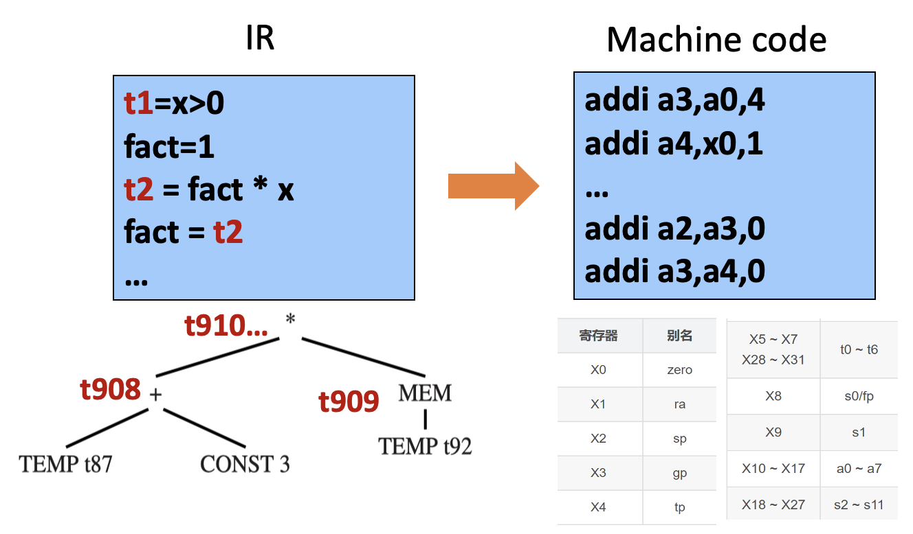
</div>

两个临时变量 `a` 和 `b` 如果在不同时间上被使用，则可以分配到同一个寄存器中。当临时变量太多无法全部放入寄存器时，多余的临时变量可以存放在内存中。

本讲将会介绍一种判断两个变量是否在不同时间上被使用的方法——**活跃性分析**(liveness analysis)：确定每个变量的活跃性，并共享寄存器。若一个变量保存的值可能在将来被用到，则该变量是**活跃的**(live)。

简单来说，活跃性分析就是在判断变量 `x` 是否在语句 `n` 后被使用。这个过程可分为两部分：

1. `n` 之后会执行什么语句 -> 绘制**控制流图**(control flow graph, **CFG**)
    - 节点：一条语句
    - 边：控制流；若语句 m 之后会执行语句 n，则有边 m -> n

2. 这些语句是否会用到 `x` -> 分析语句

一般我们采用**反向分析**(backward analysis)，即从未来到过去。

???+ example "例子"

    <div style="text-align: center">
        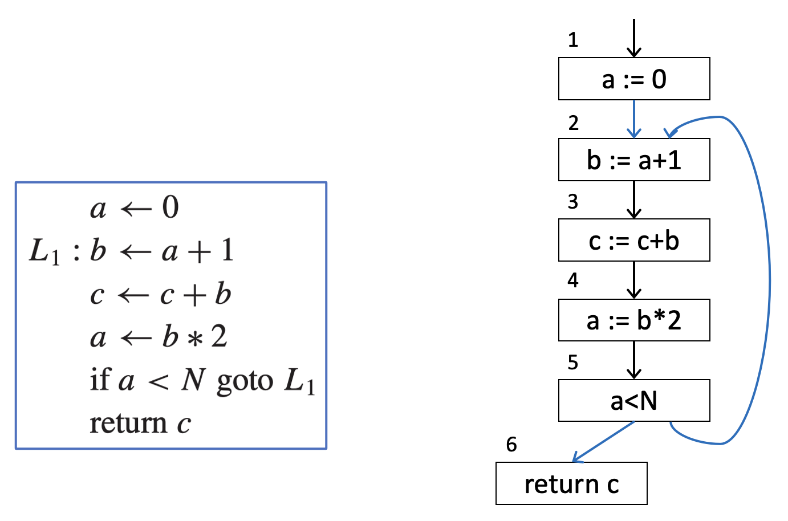
    </div>

    === "`b` 的活跃性"

        <div style="text-align: center">
            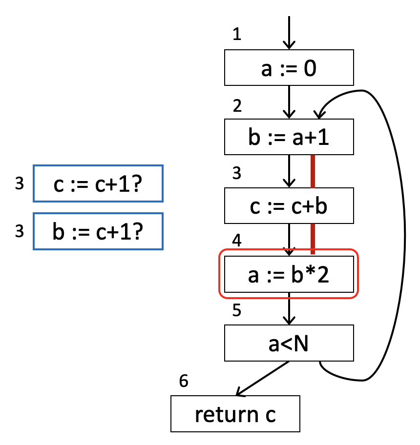
        </div>

    === "`a` 的活跃性"

        <div style="text-align: center">
            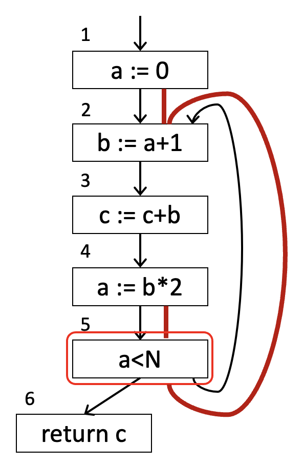
        </div>

    === "`c` 的活跃性"

        <div style="text-align: center">
            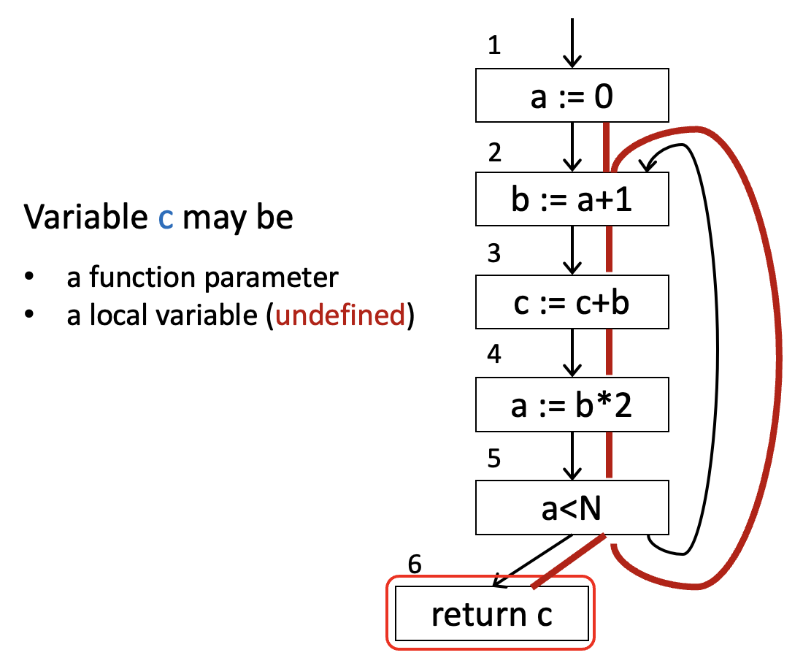
        </div>

    由于 `a`, `b` 不同时活跃，因此两者可用相同的寄存器存储。


## Solution of Dataflow Equations

变量的活跃性沿着控制流图的边“流动”，因此活跃性分析是**数据流**问题的一个例子。

流图相关术语：流图节点 `n` 具有  

- **出边**(out-edges)：指向**后继节点**(successor nodes)
- **入边**(in-edges)：来自**前驱节点**(predecessor nodes)
- `pred[n]`：前驱节点集合  
- `succ[n]`：后继节点集合


### Uses and Defs

变量或临时变量的赋值**定义**(defines)了该变量。而在赋值语句的右侧（或其他表达式中）出现一个变量，意味着**使用**(uses)了该变量。

- 变量的**定义**：定义它的图节点集合  
- 图节点的**定义**：它定义的变量集合  
- 变量或图节点的**使用**类似

???+ example "例子"

    <div style="text-align: center">
        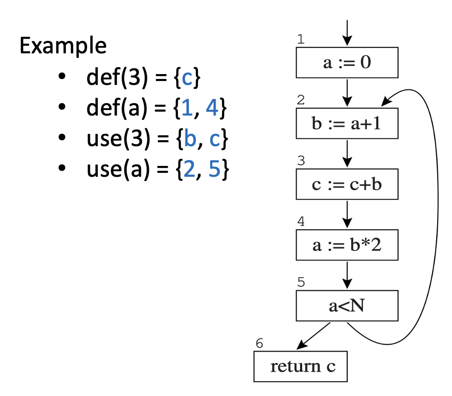
    </div>


### Calculation of Liveness

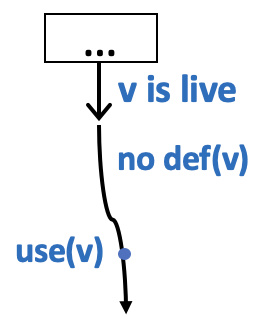{ align=right width=20% }

**活跃性**(liveness)：如果从一条边到该变量的某个**使用**之间存在一条**有向路径**，且该路径**不经过任何定义**，则该变量在该边上是**活跃的**。

- 该变量随后将被使用，并且在使用前不会被重新定义
- **活跃输入**(live-in)：在某个节点的任何入边上活跃的变量
- **活跃输出**(live-out)：在某个节点的任何出边上活跃的变量
- 符号说明：  
    - `in[n]`：节点 `n` 的 live-in 集合
    - `out[n]`：节点 `n` 的 live-out 集合

下面介绍如何通过 use 和 def 计算活跃性信息（`in[n]` 和 `out[n]`）：

- 如果对于任意 `m` $\in$ `succ[n]`，有 `a` $\in$ `in[m]`，则 `a` $\in$ `out[n]`
- 如果 `a` $\in$ `use[n]`，则 `a` $\in$ `in[n]`，即如果语句 `n` 使用了变量 `a`，则 `a` 在 `n` 的入口处是活跃的
- 如果 `a` $\in$ `out[n]` 且 `a` $\notin$ `def[n]`，那么 `a` $\in$ `in[n]`

活跃性分析的数据流方程：

$$
\begin{aligned}
\text{in}[n] & = \text{use}[n] \cup (\text{out}[n] - \text{def}[n]) \\
\text{out}[n] & = \bigcup_{s \in \text{succ}[n]} \text{in}[s]
\end{aligned}
$$

下面给出通过迭代求得上述方程解的算法：

$$
\begin{aligned}
&\mathbf{for\ each}\ n \\
&\qquad \mathrm{in}[n] \gets \{\};\ \mathrm{out}[n] \gets \{\} \\
&\mathbf{repeat} \\
&\qquad \mathbf{for\ each}\ n \\
&\qquad\qquad \mathrm{in}'[n] \gets \mathrm{in}[n];\ \mathrm{out}'[n] \gets \mathrm{out}[n] \\
&\qquad\qquad \mathrm{in}[n] \gets \mathrm{use}[n] \cup (\mathrm{out}[n] - \mathrm{def}[n]) \\
&\qquad\qquad \mathrm{out}[n] \gets \bigcup_{s \in \mathrm{succ}[n]} \mathrm{in}[s] \\
&\mathbf{until}\ \mathrm{in}'[n] = \mathrm{in}[n]\ \mathbf{and}\ \mathrm{out}'[n] = \mathrm{out}[n]\ \mathbf{for\ all}\ n
\end{aligned}
$$

???+ example "例子"

    === "例1"

        遵循前向控制流边：

        <div style="text-align: center">
            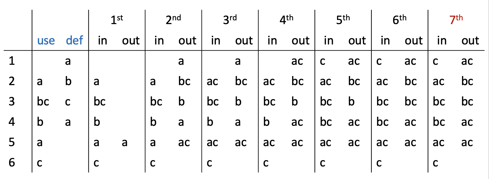
            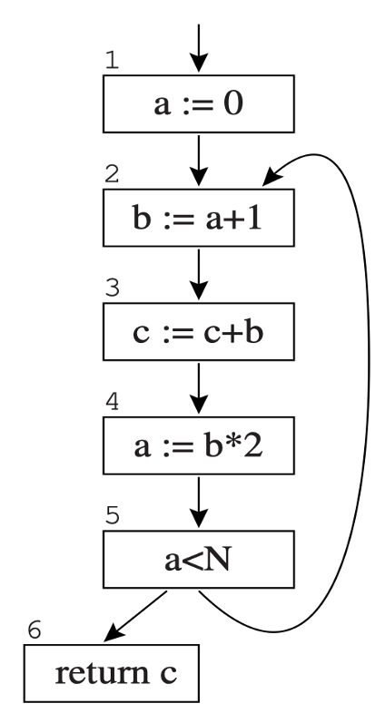
        </div>

    === "例2"

        `out[n]` 由 `in[s]` 计算得出，`in[n]` 由 `out[n]` 计算得出。我们可以通过按相反顺序计算（从 6 到 1，从 `out` 到 `in`）来加速收敛。

        <div style="text-align: center">
            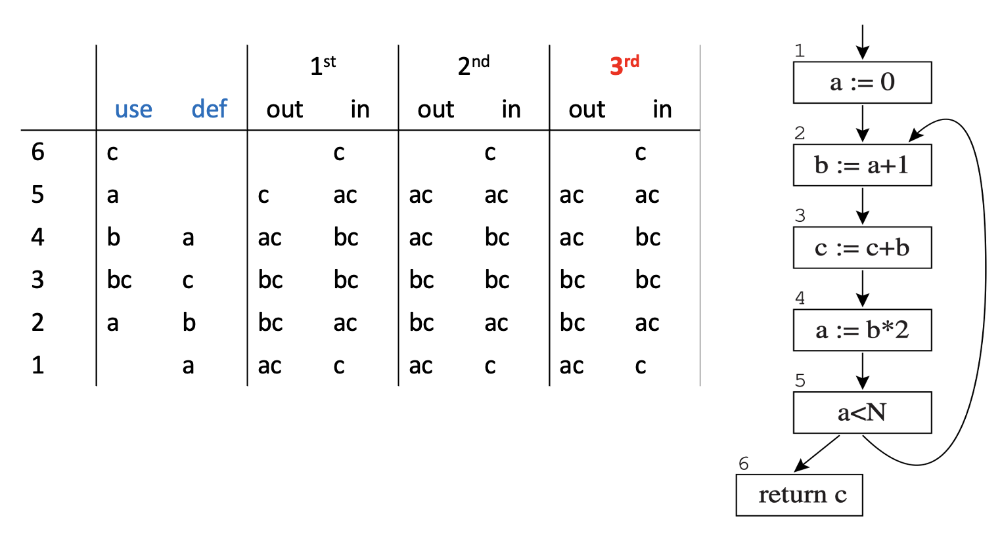
        </div>

通过迭代求解数据流方程时，计算顺序应遵循流。活跃性沿控制流箭头向后传播，且从出（out）到入（in），因此计算也应如此。

---
计算的变体：

- **基本块**：只有一个前驱和一个后继节点的流图比较简单，因此将它们与其前驱和后继合并，得到一个节点更少的图，其中每个节点代表一个基本块
- **一次处理一个变量**：当需要某个变量的信息时，一次只计算该变量的数据流，因为许多临时变量具有非常短的活跃范围（因此搜索会快速终止）


### Representations of Sets

表示 `in[n]` 和 `out[n]` 的方法：

- **位数组**(bit arrays)（适用于密集集合）  
    - 假设程序中有 N 个变量，每个字有 K 位  
    - 每个集合占用 N 位  
    - 两个集合的并集：将对应位置的位进行或运算  
    - 一次集合并集运算需要 N/K 次操作  

- **排序列表**(sorted lists)（适用于稀疏集合）  
    - 按任何全序键（如变量名）排序  
    - 并集操作：合并列表  
    - 当集合稀疏时（平均元素数远小于 N/K），排序列表表示更快


### Time Complexity

迭代数据流分析的速度分析

- 一个大小为 N 的程序：最多 N 个节点，最多 N 个变量
- 每个集合并集操作需要 $O(N)$ 时间
- `for` 循环：每个节点计算恒定数量的集合操作。$O(N)$ 个节点 => $O(N^2)$ 时间
- `repeat` 循环：所有 `in` 和 `out` 集合的大小总和为 $2N^2$，这是 `repeat` 循环能迭代的最大次数，因为 `in` 和 `out` 集合是单调的，不能无限增长
- 最坏情况运行时间：$O(N^4)$
- 但在实践中时间介于 $O(N)$ 和 $O(N^2)$ 之间（如果计算顺序合理）


### Least Fixed Points

在活跃性分析中，如果认为变量同时活跃，我们会确保将它们的不同值保存在不同寄存器中，这便是活跃性的**保守近似**(conservative approximation)。这虽然可能会错误地认为某个变量是活跃的，但绝不会错误地认为它是非活跃的。后果是：编译后的代码可能会使用比实际需要更多的寄存器，但能保证计算出正确结果。

用于编译器优化的数据流方程应这样设置：任何解都向优化器提供保守信息；不精确的信息可能生成次优但绝不会错误的程序。

!!! theorem "定理"

    活跃性分析的数据流方程**有不止一个解**。假设有解 X, Y

    - 若 X 是方程的解，且方程的所有解都包含解 X，则称 X 为方程的最小解（**最小不动点**）
    - 方程存在一个最小不动点，且上述迭代算法总是计算出该最小不动点


### Static and Dynamic Liveness

<div style="text-align: center">
    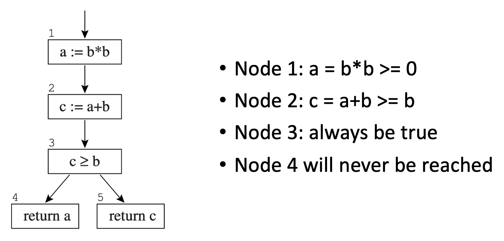
</div>

- 这些方程不知道条件分支会走向哪一边
- “更智能”的方程会允许将 `a` 和 `c` 分配至同一寄存器

没有编译器能够完全理解每个程序中的所有控制流是如何工作的。这可以通过停机问题来证明

!!! theorem "定理：停机问题"

    不存在这样的程序 `H(P, X)`，它接受任意程序 `P` 和输入 `X` 作为输入，并在 `P(X)` 停机（没有无限循环）时返回真，否则返回假。

!!! note "推论"
    
    不存在这样的程序 `H'(P, L)`，对于任意程序 `P` 和 `P` 中的标签 `L`，能够判断在 `P` 的执行过程中是否曾到达标签 `L`。

    - 证明：通过说明如果 `H'` 存在，那么 `H` 也存在
    - 令 `L` 为程序的末尾，停机 => 跳转至 `L`

这个定理并不意味着我们永远无法判断某个标签是否可达，只是说明不存在一个**总能**给出答案的**通用**算法。我们可以通过一些特殊情况下的算法来改进活跃性分析。但事实上，没有编译器能真正判断一个变量的值是否确实被需要，即该变量是否真正"活跃"。


我们只能采用**保守近似**的处理方法：假设每个条件分支都可能双向执行，因此我们得到**动态条件**及其**静态近似**。

- **动态活跃性**（运行时）：如果程序从节点 `n` 开始**执行**，并在不经过变量 `a` 任何定义的情况下到达对 `a` 的使用，则变量 `a` 在节点 `n` 处是动态活跃的
- **静态活跃性**（编译时）：如果存在一条从节点 `n` 出发的**控制流路径**，该路径在不经过变量 `a` 定义的情况下到达对 `a` 的某个使用，则变量 `a` 在节点 `n` 处是静态活跃的

如果变量 `a` 是动态活跃的，那么它也是静态活跃的。


### Interference Graphs

活跃性分析最重要的应用之一是**寄存器分配**。假设有一组临时变量 `a`, `b`, `c`, ... 以及寄存器 `r1`, ..., `rk`。

我们称阻止 `a` 和 `b` 分配到同一寄存器的条件为**干扰**(interference)。有两种干扰类型：

- 重叠的活跃范围
- 当 `a` 必须由一条无法寻址寄存器 `r1` 的指令生成时，`a` 和 `r1` 相互干扰

干扰的表达：

- **矩阵**，其中元素 x 标记干扰  
- **无向图**  
    - 节点：变量  
    - 边：连接相互干扰的变量
    - 通过对节点**上色**来分配寄存器

<div style="text-align: center">
    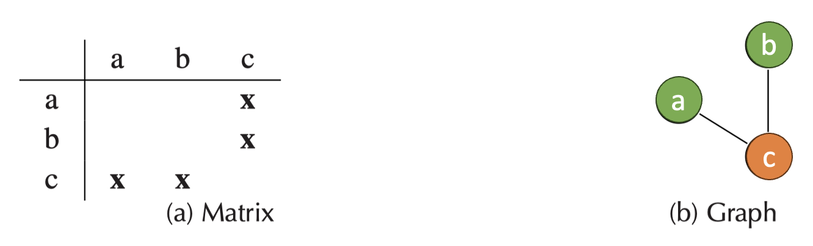
</div>

<!-- 不要在 `MOVE` 操作的源和目标之间制造人为干扰。考虑：

```hl_lines="2"
t := s 			    (copy)
t := ...
x := ... s ...		(use of s)
...
y := ... t ...		(use of t)
```

- 通常会创建一个干扰边 `(s, t)`
- 但我们不需要为 `s` 和 `t` 分别设置寄存器，因为它们包含相同的值。
- 解决方案：在这种情况下，不添加干扰边 `(s, t)`
- 如果在 `s` 仍然活跃的情况下，稍后对 `t` 进行（非移动）定义，这将创建干扰边 `(t, s)` -->

为每个新定义添加干扰边的方式：

- 在任意定义变量 `a` 的**非移动指令** `n` 处，`out[n] = (b1, ..., bj)`，添加干扰边 `(a, b1)`, ..., `(a, bj)`
- 在**移动指令** `a := c`（记为 `n`）处，`out[n] = (b1, ..., bj)`，对于任何与 `c` 不同的 `bi`，添加干扰边 `(a, b1)`, ..., `(a, bj)`

???+ example "例题"

    >来自作业题 10.1

    === "题目"

        Perform flow analysis on the program of Exercise 8.6:
        
        1. Draw the control-flow graph.
        2. Calculate live-in and live-out at each statement.
        3. Construct the register interference graph.

        $$
        \begin{array}{r l r l}
        1  & m \leftarrow 0 \hspace{6em}                  & 9  & x \leftarrow M[r] \\
        2  & v \leftarrow 0 \hspace{6em}                  & 10 & s \leftarrow s + x \\
        3  & \mathbf{if}\ v \ge n\ \mathbf{goto}\ 15 \hspace{3em}
                                                                & 11 & \mathbf{if}\ s \le m\ \mathbf{goto}\ 13 \\
        4  & r \leftarrow v \hspace{6em}                  & 12 & m \leftarrow s \\
        5  & s \leftarrow 0 \hspace{6em}                  & 13 & r \leftarrow r + 1 \\
        6  & \mathbf{if}\ r < n\ \mathbf{goto}\ 9 \hspace{4em}
                                                                & 14 & \mathbf{goto}\ 6 \\
        7  & v \leftarrow v + 1 \hspace{6em}              & 15 & \mathbf{return}\ m \\
        8  & \mathbf{goto}\ 3 \hspace{6em}                &    &
        \end{array}
        $$

    === "解答"

        === "1"

            <div style="text-align: center">
                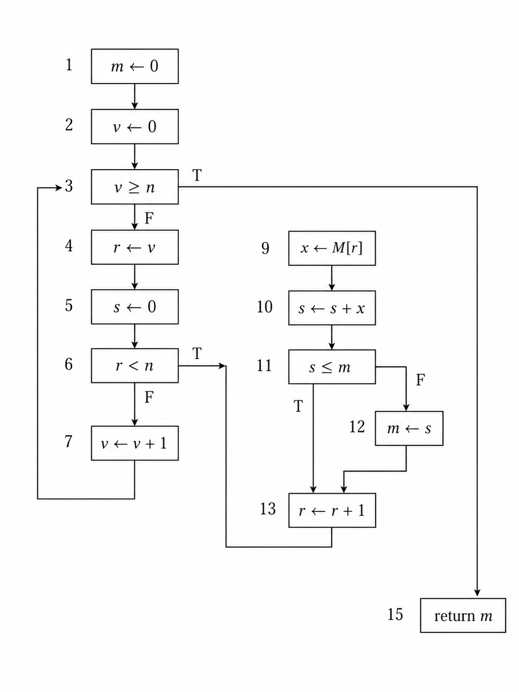
            </div>

        === "2"

            <div style="text-align: center">
                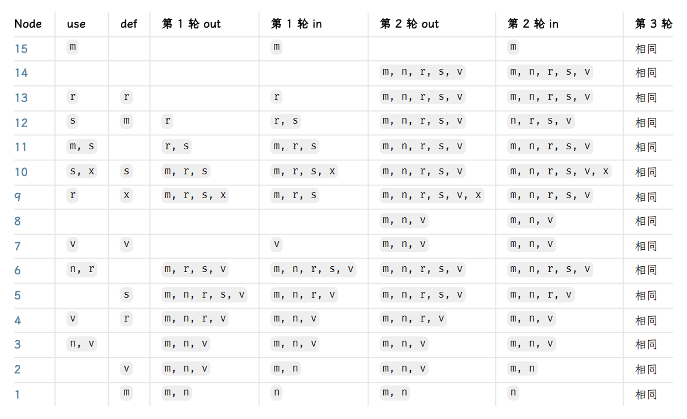
            </div>

        === "3"

            <div style="text-align: center">
                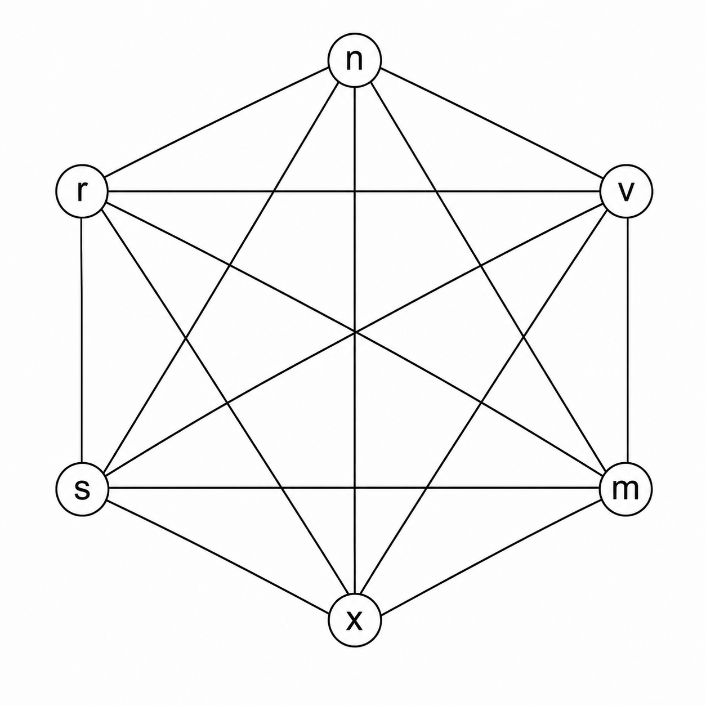
            </div>

            >所以要用 6 个寄存器。


## Liveness in the Tiger Compiler

Tiger 编译器的流程分析分为两个阶段：

- 分析 **Assem 程序**的控制流，生成**控制流图**
- 分析**控制流图**中变量的活跃性，生成**干扰图**

>详细实现请参考教材。

- 在算法中使用图时，我们希望每个节点代表某种内容（例如程序中的一条指令）
- 为了实现节点到内容的映射，我们使用 `G_table`（一个哈希表）
- 以下惯用法将信息 `x` 与节点 `n` 关联到映射 `mytable` 中：`G_enter(mytable, n, x)`
- 我们也可以将 `x` 直接放入 `n` 中：`n = G_Node(g, x)`，即创建一个包含信息 `x` 的新节点 `n`
- `G_nodeInfo(n)`：检索 `x`

FlowGraph 包用于管理控制流图：

- 节点：一条指令（或基本块）
- 边 `(m, n)`：指令 `m` 后跟随指令 `n`（通过跳转或顺序执行）

```c
/* flowgraph.h */ 
Temp_tempList FG_def(G_node n); 
Temp_tempList FG_use(G_node n); 
bool FG_isMove(G_node n);

G_graph FG_AssemFlowGraph(AS_instrList il);
```

每个节点具有以下属性：

- `FG_def()`：在此节点定义哪些临时变量（指令的目的寄存器）
- `FG_use()`：在此节点使用哪些临时变量（指令的源寄存器）
- `FG_isMove()`：此指令是否为 `MOVE` 指令，即在定义和使用相相同时可以删除的指令

与节点相关联的信息：

- 流图：将一些使用和定义信息关联到每个节点
- 活跃性分析算法：在每个节点处记录入活跃和出活跃信息
- 对流图的其他分析：关于每个节点的其他类型信息

我们可能不希望为每次新的分析修改数据结构（这是一个广泛使用的接口）。图就是图，而流图则是图与独立打包的辅助信息（表，或将节点映射到任意内容的函数）的结合。

```c
/* liveness.h */
typedef struct Live_moveList_ *Live_moveList;
struct Live_moveList_ {G_node src, dst; Live_moveList tail;};
Live_moveList Live_MoveList(G_node src, G_node dst, Live_moveList tail);

struct Live_graph { G_graph graph; Live_moveList moves; };
Temp_temp Live_gtemp(G_node n);

struct Live_graph Live_liveness(G_graph flow);
```

Liveness 模块：

- 输入：流图
- 输出：干扰图 + 节点对列表（表示 `MOVE` 指令），这些节点对应分配相同的寄存器
- `Live_gtemp` 指示 `n` 所代表的临时变量

在 Liveness 模块的实现中，维护一个数据结构是有用的，它可以记住每个流图节点出口的活动：

```c
static void enterLiveMap(G_table t, G_node flowNode, Temp_tempList temps) {
    G_enter(t, flowNode, temps); 
} 

static Temp_tempList lookupLiveMap(G_table t, G_node flownode) {
    return (Temp_tempList)G_look(t, flownode); 
}
```

有了完整的 `liveMap`，我们就可以使用刚才描述的方法构建一个干扰图。

如果一个新定义的临时变量在定义之后立即不活跃

- 变量被定义但从未使用 -> 无需将其放入寄存器。  
- 定义指令将要执行（也许是为了其他副作用）-> 它会被写入某个寄存器，该寄存器最好不包含任何其他活跃变量。 

因此，零长度的活跃范围确实会与任何与其重叠的活跃范围发生冲突。