# Register Allocation

??? abstract "核心知识"

    个人认为比较难的一章，需要好好理解整个流程

    - 核心：图着色算法
        1. 构建（[上一讲](10.md#interference-graphs)介绍过构建干扰图）
        2. 简化
        3. 合并：Briggs / George
        4. 固定（小度数 + 移动相关的节点，即去掉虚线）
        5. （潜在）溢出（一种乐观近似）
        6. 选择
        7. 若发生实际溢出需重写程序

    - 预着色


**寄存器分配器**(register allocator)的任务是将众多的临时变量分配给少量的寄存器。

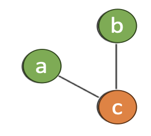{ align=right width=20% }

实现方法：

- （通过[活跃性分析](10.md)）推导**干扰图**(interference graph)
- 对干扰图进行**着色**(color)，每个颜色对应一个寄存器，并确保两个相邻节点不同色


## Coloring by Simplification

因为图着色是 NP 完全问题，所以寄存器分配也是 **NP 完全问题**。不过利用**线性时间的近似算法**也能产生不错的结果，该算法分为以下几个阶段：

1. **构建**(build)干扰图（通过活跃性分析）：

    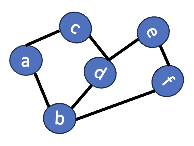{ align=right width=15% }

    - 每个节点代表一个临时值
    - 边 (t1, t2) 表示一对不能分配到同一寄存器的临时值，最常见的原因是 t1 和 t2 同时活跃

2. **简化**(simplify)：使用简单的启发式方法(heuristic)为图着色（假设有 K 个寄存器）

    <div style="text-align: center">
        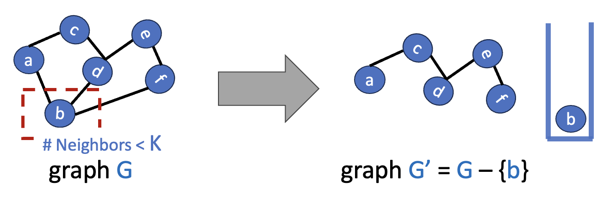
    </div>

    - 移除图 G 中邻居数 < K 的节点 b，得到图 G'
    - 如果 G' 可以用 K 种颜色着色，那么 G 也可以（因为 b 的邻居数 < K，b 不会采用 K 个颜色之外的颜色）
    - 这自然引出了一种**基于栈**（或**递归**）的着色算法：
        - 反复**移除**（并将其**压入**栈）度数小于 K 的节点
        - 每次这样的简化会降低其他节点的度数，从而带来更多简化的机会

3. **溢出**(spill)：假如在简化过程中的某个时刻，图 G 所有节点的度数均很大（度数 >= K）

    <div style="text-align: center">
        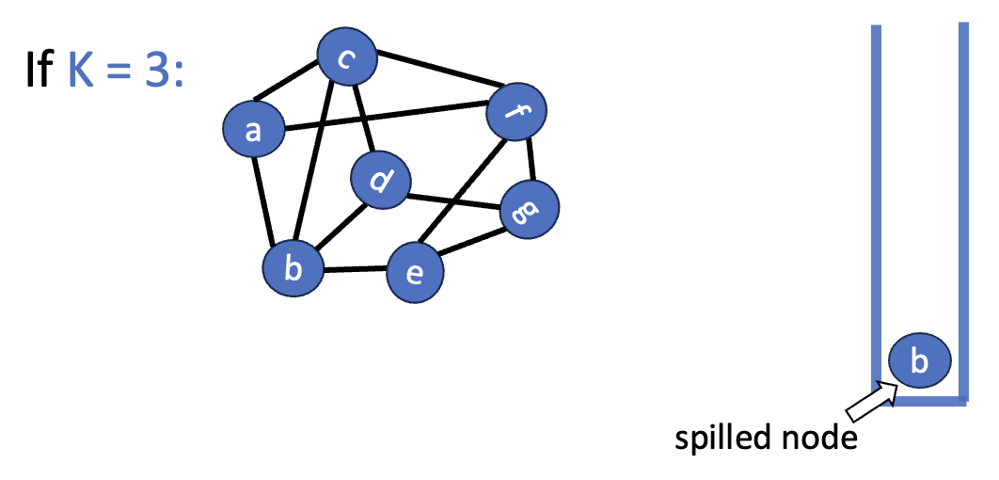
    </div>

    - 此时在图中选择某个节点，将其存储在**内存**（可以直接放在当前栈帧中）而非寄存器中
    - 一种乐观近似：被溢出的节点不会与图中剩余的任何其他节点产生冲突，因此剩下的节点可以继续被移除并压入栈中，简化过程可以继续进行    
    - 可能的溢出节点选择的启发式策略：
        - 溢出**冲突最多**的临时变量
        - 溢出**定义和使用较少**的临时变量
        - 避免**内层循环**的溢出
        - 一种可能的优先级计算方法（来自 GPT-5.5，但个人感觉很有道理）：priority = spill_cost / degree，值越小表示优先级越高，其中 spill_cost 可以用**变量出现次数**衡量（因为这会决定重写程序时插入的 `LOAD` 和 `STORE` 指令数），degree 为度数（度数越大越需要溢出）

    ??? example "例子"

        假如只有 3 个寄存器。在简化过程中，干扰图的情况如下所示。可以看到 f 有 4 个邻居，因此需要将其溢出。

        <div style="text-align: center">
            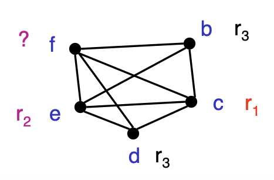
        </div>

        重写后的程序：

        <div style="text-align: center">
            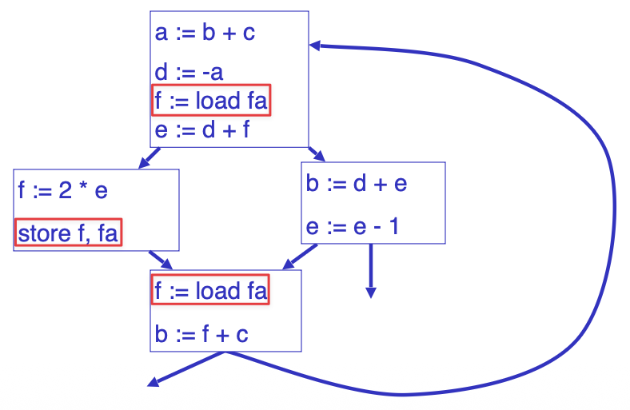
        </div>

        虽然复用相同的寄存器 f 是 OK 的，但这并不是最优的。更好的做法是尽量采用不同的寄存器名，因为可以用到不同的颜色。溢出后，更新后的活跃性信息如下所示：

        <div style="text-align: center">
            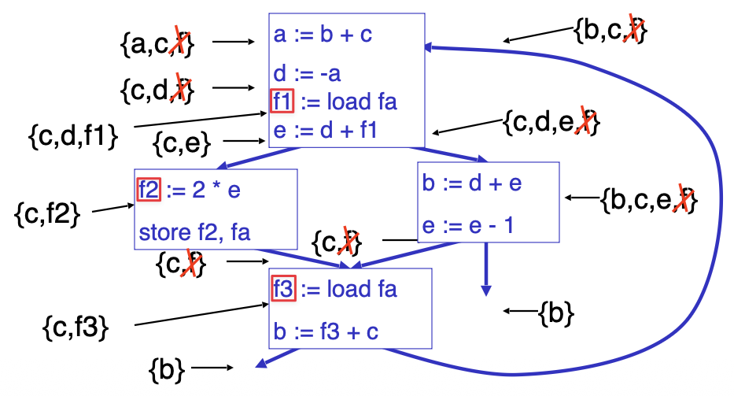
        </div>

        可以看到，f 的活跃范围被划分为若干个更小的范围，从而降低干扰，减少图中的邻居数。新的干扰图如下：

        <div style="text-align: center">
            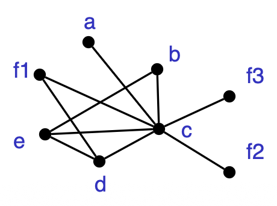
        </div>

4. **选择**(select)：重建图并为节点分配颜色
    - 当通过溢出启发式算法被推入**潜在溢出**(potential spill)节点 n 被弹出时，无法保证它是可着色的
    - 如果 n 的邻居已经被 K 种不同颜色着色，则发生**实际溢出**(actual spill)，此时不分配任何颜色，而是继续弹出栈中的其他节点
    - 如果 n 的邻居被**少于 K 种**颜色着色，我们可以为 n 着色，且不会发生实际溢出，这种技术被称为**乐观着色**(optimistic coloring)
    - 为了给被溢出的节点上色，需要**重写程序**：
        1. 每次**使用**（读取）**前**从内存中**加载**（`LOAD`）该变量
        2. 每次**定义**（写入）**时**将该变量**存入**（`STORE`）内存中

???+ example "例子"

    === "例1"

        没有涉及到溢出步骤的简单情况：

        <div align=center markdown>

        {: style='width: 80%'}

        </div>

    === "例2"

        <div style="text-align: center">
            
        </div>


## Coalescing

干扰图中的**虚线**表示两个节点是移动相关的，也就是它们对应的变量位于同一条 `MOVE` 指令中；且两个节点不冲突。此时可以尝试将这两个节点**合并**(coalesce)为一个新节点，其边是所替换节点边的并集。这样便消除了 `MOVE` 指令。

被引入的节点比被移除的节点受到更多限制，因为它包含了边的并集。在合并前可用 K 种颜色着色的图，但若合并不当，可能无法继续 K-着色了。

<div style="text-align: center">
    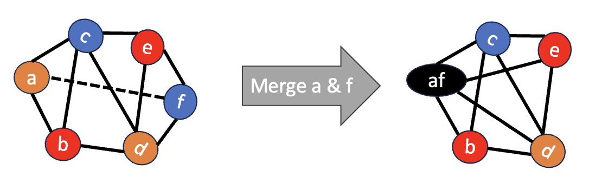
</div>

我们希望仅在**安全**的条件下进行合并，即合并不会导致图不可着色。以下两种策略都是安全的：

- **Briggs**：节点 a 和 b 可以被合并，如果合并后的节点 ab 的大度数（边数 >= K）邻居个数 < K
    - 简化阶段会从图中移除所有小度数的节点
    - 合并后的节点将仅与那些具有大度数的邻居相邻
    - 少于 K 个大度数的邻居 => 简化阶段可以将合并后的节点从图中移除

- **George**
    - 如果对于节点 a 的每个邻居 t，t 已经与 b 冲突或 t 的度数不大，则节点 a 和 b 可以合并
    - 这种合并是安全的原因：
        - 如果 t 已经与 b 冲突，那么 (a, t) 和 (b, t) 将合并为 (ab, t)，不会导致度的增加
        - 如果 t 的度数不大，那么 t 将在简化阶段被移除，也不会导致度的增加

考虑合并操作后，着色步骤也要进行调整：

<div style="text-align: center">
    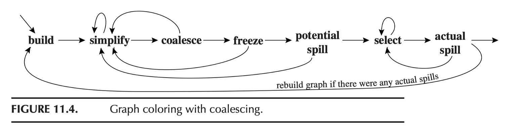
</div>

>合并、简化和溢出过程应交替进行，直到图为空

1. **构建**：
    - 构造干扰图
    - 将每个节点分类为与移动相关或与移动无关，其中与移动相关的节点是指作为 `MOVE` 指令的源或目的地的节点

2. **简化**：每次从图中移除一个小度数（小于 K）且与移动无关的节点
3. **合并**(coalesce)：
    - 对简化后的图执行保守合并
    - 合并后的节点不再是移动相关的，并且将可用于下一轮简化
    - 重复简化和合并步骤，直到只剩下大度数或移动相关的节点

4. **固定**(freeze)：如果遇到既不能简化也不能合并的情况，那就**寻找一个小度数的移动相关节点**，并定住与该节点相关的移动
    - 在干扰图中的表现就是**去掉虚线**
    - 之后简化与合并操作可以继续进行

5. **溢出**：若没有小度数节点，则选择一个大度数节点作为潜在的溢出对象，并将其压入栈中
6. **选择**：
    - 弹出整个栈，分配颜色
    - 如果有实际溢出，则重建图

???+ example "例子"

    === "例1"

        接着前面的例子，其中节点 b、c、d 和 j 是仅有的与移动相关的节点。简化阶段使用的初始工作列表必须只包含非移动相关的节点（K=4），即 f, g, h。将 g, h, k 移除后，得到：

        <div style="text-align: center">
            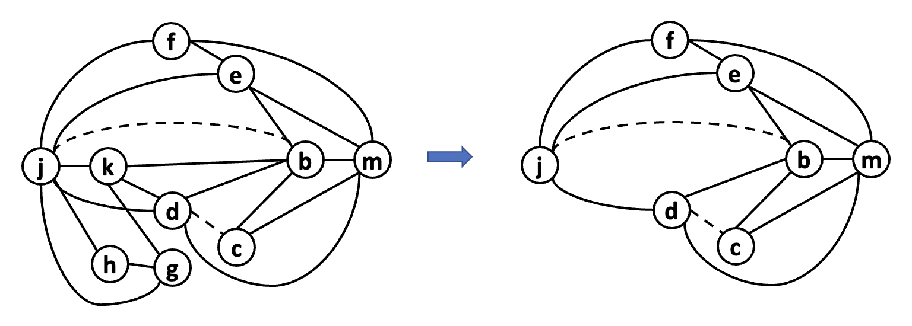
        </div>

        如果此时调用一轮合并，不难发现 c 和 d 确实是可合并的（K=4）

        <div style="text-align: center">
            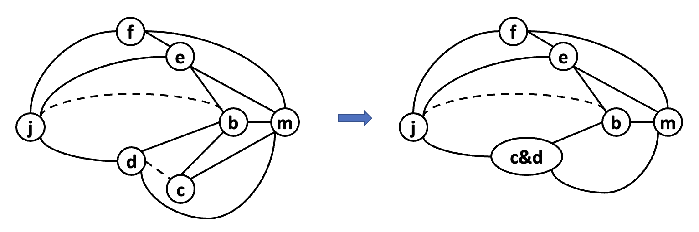
        </div>

        另外还可以将 b 和 j 合并。之后就没有更多的移动相关节点了，因此不能再进行合并了。

        <div style="text-align: center">
            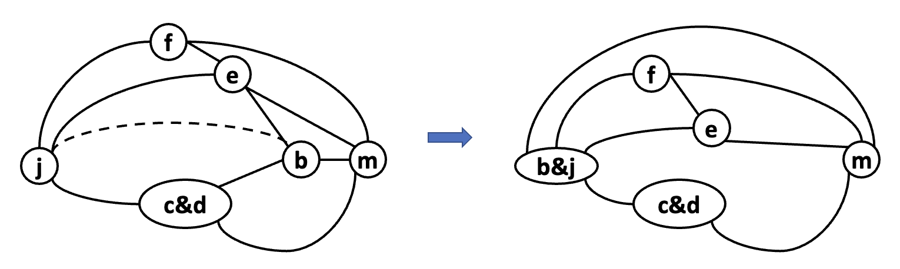
        </div>

        简化阶段可以再调用一次，以移除所有剩余的节点。一种可能的颜色分配如下所示：

        <div style="text-align: center">
            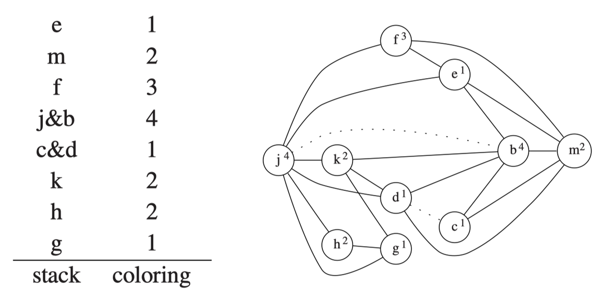
        </div>

    === "例2"

        >来自作业题 11.1

        === "题目"

            The following program has been compiled for a machine with three registers $r_1, r_2, r_3$; $r_1$ and $r_2$ are (caller-save) argument registers and $r_3$ is a callee-save register. Construct the interference graph and show the steps of the register allocation process in detail, as on pages 244–248. When you coalesce two nodes, say whether you are using the Briggs or George criterion.

            **Hint**: When two nodes are connected by an interference edge _and_ a move edge, you may delete the move edge; this is called _constrain_ and is accomplished by the first **else if** clause of procedure _Coalesce_.

            $$
            \begin{aligned}
            f:\qquad & c \leftarrow r_3 \\
            & p \leftarrow r_1 \\
            & \mathbf{if}\ p = 0\ \mathbf{goto}\ L_1 \\
            & r_1 \leftarrow M[p] \\
            & \mathbf{call}\ f
            \qquad\qquad\qquad
            (\text{uses}\ r_1,\ \text{defines}\ r_1, r_2) \\
            & s \leftarrow r_1 \\
            & r_1 \leftarrow M[p + 4] \\
            & \mathbf{call}\ f
            \qquad\qquad\qquad
            (\text{uses}\ r_1,\ \text{defines}\ r_1, r_2) \\
            & t \leftarrow r_1 \\
            & u \leftarrow s + t \\
            & \mathbf{goto}\ L_2 \\
            L_1:\qquad & u \leftarrow 1 \\
            L_2:\qquad & r_1 \leftarrow u \\
            & r_3 \leftarrow c \\
            & \mathbf{return}
            \qquad\qquad\qquad
            (\text{uses}\ r_1, r_3)
            \end{aligned}
            $$

        === "答案"

            <div style="text-align: center">
                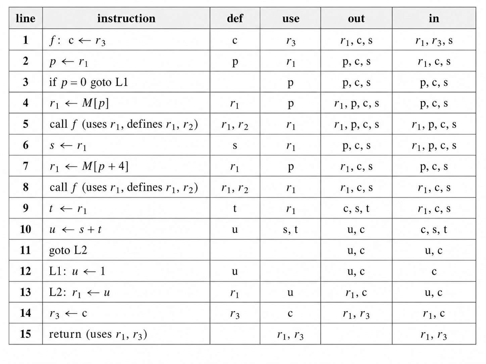
            </div>

            干扰图（$r_2$ 没有用到过，这里就不标出来了）：

            <div style="text-align: center">
                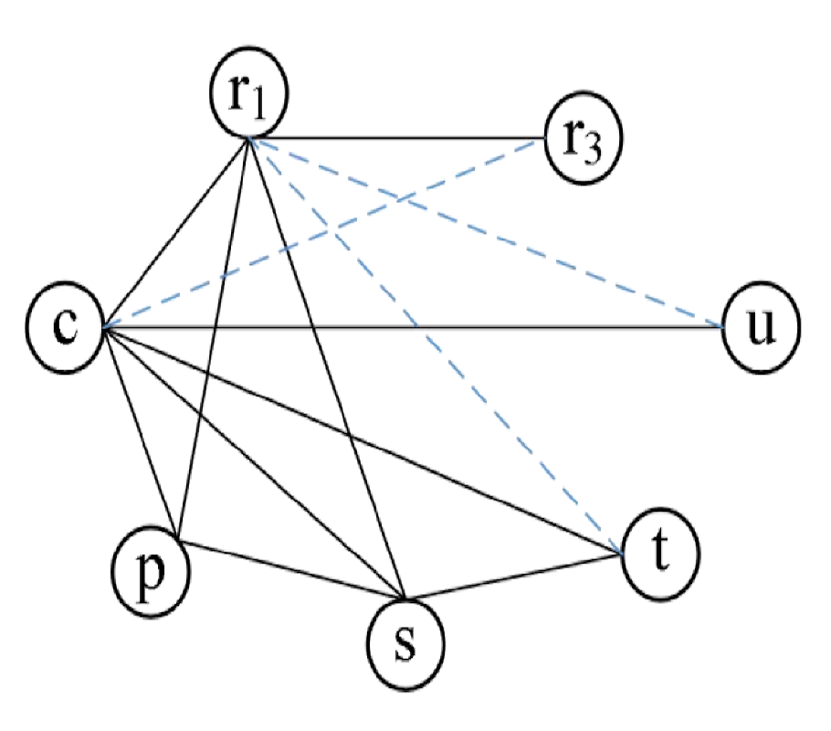
            </div>

            因为 $K=2$，所以：

            - $c,p,s$ 是高度数结点 -> 潜在溢出
            - $t,u$ 度数小于 $K$，但有 move 边 -> 固定

            下面根据 **George 原则**合并节点：

            - $t, r_1$：$t$ 的邻居 $c, s$ 与 $r_1$ 有干扰边
            - $u, r_1$：$u$ 的邻居 $c$ 与 $r_1$ 有干扰边
            - $c, r_3$：$p, s$ 会溢出，因此从干扰图中移除；此时 $c$ 的唯一邻居为 $r_1$ 与 $r_3$ 有干扰边

            合并后的结果：

            <div style="text-align: center">
                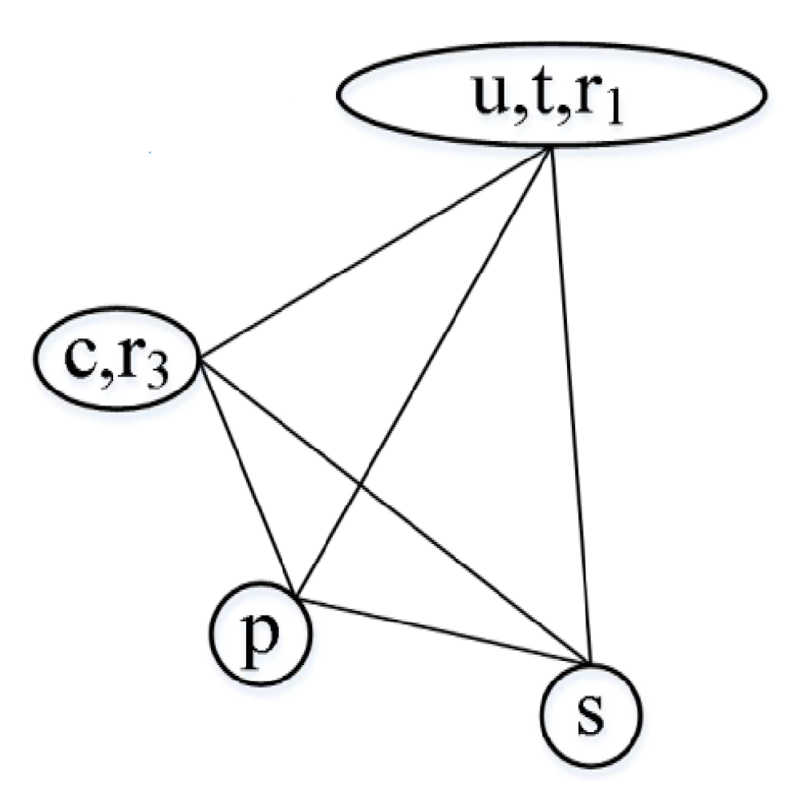
            </div>

            现在考虑潜在溢出 $p, s$，由上图知没有空闲寄存器供它俩使用，因此发生了**实际溢出**。最终的分配结果如下：

            | 变量 | 分配 |
            | --- | ----- |
            | $c$ | $r_3$ |
            | $t$ | $r_1$ |
            | $u$ | $r_1$ |
            | $p$ | 溢出 |
            | $s$ | 溢出 |

    === "例3"

        >来自作业题 11.3

        === "题目"

            _Conservative coalescing_ is so called because it will not introduce any (potential) spills. But can it avoid spills? Consider this graph, where the solid edges represent interferences and the dashed edge represents a MOVE:

            <div style="text-align: center">
                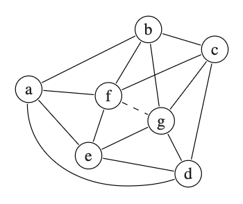
            </div>

            1. 4-color the graph without coalescing. Show the _select_-stack, indicating the order in which you removed nodes. Is there a potential spill? Is there an actual spill?
            2. 4-color the graph with conservative coalescing. Did you use the Briggs or George criterion? Is there a potential spill? Is there an actual spill?

        === "解答"

            === "1"

                有潜在溢出，无实际溢出。

                可以看到，所有节点的度数为 4 >= K，因此存在潜在溢出。可以任选一个节点溢出。

                一种可能的选择栈顺序（从左到右表示栈顶到栈底）：g, f, e, d, c, b, a

                分配颜色：

                | 结点  | 颜色  |
                | --- | --- |
                | g | 1 |
                | f | 1 |
                | e | 2 |
                | d | 3 |
                | c | 2 |
                | b | 3 |
                | a | 4 |

                由于溢出节点 a 仍然能被分配到颜色，因此没有发生实际溢出。

            === "2"

                无潜在溢出，无实际溢出。

                可以合并 f, g。假设合并后的节点为 h，它的邻居有 N(h) = {a, b, c, d, e}，其中只有 a, d 的度数 >= 4，因此根据 Briggs 策略可以合并 f, g。

                一种可能的选择栈顺序：h, e, d, c, a, b。简化过程中不存在被移除节点度数 >= 4 的情况（注意是「简化过程中」，所以节点的度数是会减小的），因此无潜在溢出。

                分配颜色：

                | 结点     | 颜色  |
                | ------ | --- |
                | h=fg | 1 |
                | e    | 2 |
                | d    | 3 |
                | c    | 2 |
                | a    | 4 |
                | b    | 3 |

                显然无实际溢出。


## Precolored Nodes

有些寄存器用于特殊用途，比如参数寄存器、帧指针、返回值寄存器等。对于这些寄存器，使用永久绑定到该寄存器的特定临时变量（例如 FP）。这些临时变量是**预着色的**(precolored)。

- 每种颜色只有一个预着色节点
- 所有预着色节点彼此冲突

通常，只要普通临时变量与预着色寄存器不冲突，就可以赋予其与预着色寄存器相同的颜色。标准调用约定的寄存器可以在过程内部作为临时变量重用。因此我们**不能简化**预着色节点，也**不应**将预着色节点**溢出**到内存。

着色算法通过调用简化、合并和溢出操作，直到只剩下预着色节点为止。由于预着色节点不会溢出，前端必须小心地保持它们的活跃范围较短：通过生成 `MOVE` 指令来在预着色节点之间移动值。

假设 `r7` 是一个被调用者保存的寄存器：

<div style="text-align: center">
    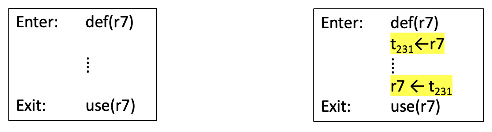
</div>

如果此函数中存在寄存器压力（即对寄存器的高需求），则 `t231` 将会溢出；否则，`t231` 将与 `r7` 合并，并且 `MOVE` 指令将被消除。

???+ info "调用者/被调用者保存的寄存器"

    ```c linenums="1"
    foo() {
        t = ...
        ... = ... t ...
        s = ...
        f()
        g()
        ... = ... s ...
    }
    ```

    - 局部变量或编译器临时变量，如果在任何过程调用中都不活跃，通常应分配给**调用者保存的寄存器**(caller-saved registers)（行 2-3）
    - 任何跨多个过程调用保持活跃的变量都应存放在**被调用者保存的寄存器**(callee-saved registers)中（行 4, 7）

如果一个变量 `x` 在过程调用期间处于活跃状态，那么它将与所有调用者保存（预着色）寄存器冲突，并且与为被调用者保存寄存器创建的所有新临时变量（例如 `t231`）冲突，因此溢出发生。使用常见的溢出代价启发式方法，即溢出度数高但使用次数少的节点。  

???+ example "例子"

    === "例1"

        <div style="text-align: center">
            
        </div>

    === "例2"

        >来自 24-25 期末卷大题七

        === "题目"

            有 3 个 physical registers `r1`, `r2` and `r3`（9pt）

            ```linenums="1"
            entry: a <- r1
                b <- r2
                p <- r3
            loop:  t <- M[p]
                r1 <- a
                r2 <- t
                call f (use r1 and r2, def r1)
                a <- r1
                if a==0 goto end
                p <- p+4
                goto loop
            end:   t <- p+b
                M[t] <- a
                r1 <- 1
                return (r1 live out)
            ```

            整理者注：代码中有几句给了 live out，可以用这个判断 spill 后跟什么变量冲突；给出了原始冲突图。这里留给后人作为练习。

            1. The program above cannot be allocated with only 3 registers, therefore we have to choose a variable to spill.
                1. Assume that the loop in the program executes an average of n times, where n >= 1. Calculate the Spill Priority of the variables that need register allocation and explain which variable should be spilled.
                2. Modify the program to spill the selected variable.
                3. Draw the new interference graph after spilling the selected variable.
            2. Finish register allocation based on the resulting graph of question (1). Show the detailed steps of the allocation process. Please identify the opportunities for coalescing using George's criterion for nodes that have already been pre-colored, and use Briggs' criterion for the remaining nodes. You need to:
                1. Describe what you do in each step.
                2. At least show the resulting graph after each Simplify and Coalesce phase. You can merge consecutive Coalesce steps and only draw their final graph.
                3. Show the result of the coloring.
            3. Rewrite the program based on your register allocation results.

        === "解答"

            >答案由 GPT-5.5 生成，且经过笔者整理和校对。

            === "1"

                干扰图原题已给出，所以就不给推导过程了。

                <figure style=" width: 40%" markdown="span">
                    
                    
                    <figcaption></figcaption>
                </figure>

                溢出优先级 = 溢出成本（变量出现次数）/ 度数，结果如下：

                | 变量  |  成本  |  度数  |  值  |
                | --- | :---- | :---- | :-------- |
                | `a` | `3n+2` |      5 | `(3n+2)/5` |
                | `b` |    `2` |      6 |      `1/3` |
                | `p` | `3n+2` |      5 | `(3n+2)/5` |
                | `t` | `2n+2` |      4 |  `(n+1)/2` |

                显然 `b` 的优先级最高（成本最低 + 度数最大），因此溢出 `b`。

                程序改写为（其中 `fb` 是 `b` 的栈槽，重新加载出来的临时变量记为 `b'`）：

                ```linenums="1" hl_lines="2 14-15"
                entry: a <- r1
                    M[fb] <- r2
                    p <- r3

                loop:  t <- M[p]
                    r1 <- a
                    r2 <- t
                    call f        // use r1,r2; def r1
                    a <- r1
                    if a==0 goto end
                    p <- p+4
                    goto loop

                end:   b' <- M[fb]
                    t <- p+b'
                    M[t] <- a
                    r1 <- 1
                    return
                ```

                新干扰图如下（不需要重做一遍活跃性分析，太费时间了）：

                <figure style=" width: 40%" markdown="span">
                    
                    
                    <figcaption></figcaption>
                </figure>

            === "2"

                1. 简化
                    
                    - `r1`, `r2`, `r3` 是预着色节点，不能参与简化过程
                    - 观察普通节点的度数情况：

                        ```
                        degree(a)  = 5
                        degree(p)  = 5
                        degree(t)  = 3
                        degree(b') = 2 < 3
                        ```

                    - 发现只有 `b'` 满足条件，所以将它从图中移除，并放进选择栈内
                    - 此时干扰图如下：

                        <figure style=" width: 40%" markdown="span">
                            
                            
                            <figcaption></figcaption>
                        </figure>

                2. 合并
                    
                    - 移动相关的节点对有：`{a, r1}`、`{t, r2}`、`{p, r3}`
                    - 按照题目要求，要用 George 策略处理这些节点对；并且由于除此之外没有别的节点对，因此没地方用 Briggs 策略
                    - `{a, r1}`：`a` 的高度数邻居 `p, t` 与 `r1` 之间有干扰边，因此可以合并，此时干扰图为：
                    
                        <figure style=" width: 40%" markdown="span">
                            
                            
                            <figcaption></figcaption>
                        </figure>
                    
                    - `{t, r2}`：`t` 的高度数邻居 `p, r1` 与 `r2` 之间有干扰边，因此可以合并，此时干扰图为：
                    
                        <figure style=" width: 40%" markdown="span">
                            
                            
                            <figcaption></figcaption>
                        </figure>
                    
                    - `{p, r3}`：`p` 的高度数邻居 `r1, r2` 与 `r3` 之间有干扰边，因此可以合并，此时干扰图为：

                        <figure style=" width: 40%" markdown="span">
                            
                            
                            <figcaption></figcaption>
                        </figure>

                3. 选择：
                    
                    - 从选择栈中弹出 `b'`
                    - 由于 `b'` 原本和 `a`，`p` 之间有干扰边，因此 `b'` 不能用 `r1`，`r3`，只能用 `r2`
                    - 着色结果：

                        ```
                        a  -> r1
                        p  -> r3
                        t  -> r2
                        b' -> r2
                        b  -> M[fb]
                        ```

            === "3"

                重写程序：

                ```
                entry:
                    M[fb] <- r2

                loop:
                    r2 <- M[r3]
                    call f
                    if r1 == 0 goto end
                    r3 <- r3 + 4
                    goto loop

                end:
                    r2 <- M[fb]
                    r2 <- r3 + r2
                    M[r2] <- r1
                    r1 <- 1
                    return
                ```

                删除的 move：

                ```
                a <- r1
                p <- r3
                r1 <- a
                r2 <- t
                a <- r1
                ```